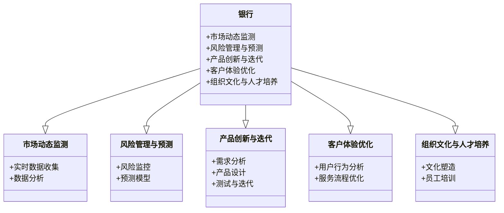
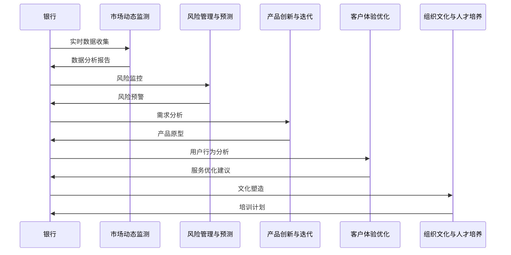
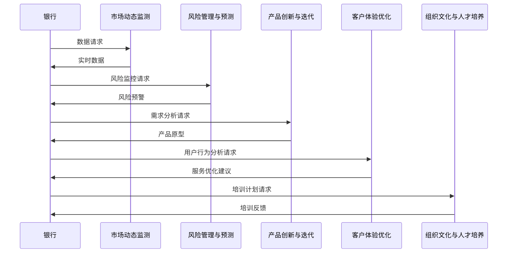

                 


# 从静态世界观到动态世界观：理解变化的世界

## 关键词

- 静态世界观
- 动态世界观
- 变化
- 科学方法论
- 系统思维

## 摘要

本文旨在探讨从静态世界观向动态世界观的转变，分析两者之间的异同点及其对人类认知和社会发展的深远影响。通过历史背景介绍、核心概念解析、案例分析等，本文将引导读者深入理解变化的重要性，并掌握如何在快速变化的世界中适应和创新。

### 目录大纲设计过程

#### 1. 确定书籍主题与目标读者

在设计书籍目录大纲之初，我们明确了本书的主题为“从静态世界观到动态世界观：理解变化的世界”，目标读者包括对哲学、科学方法论、系统思维感兴趣的学者和专业工作者。

#### 2. 设计大纲框架

大纲框架设计遵循简洁性、逻辑性和完整性原则，初步框架包括以下部分：

- **第一部分：静态世界观的起源与发展**
  - 静态世界观的定义与特征
  - 静态世界观的历史演变
- **第二部分：动态世界观的崛起与影响**
  - 动态世界观的定义与特征
  - 动态世界观在科学领域的影响
  - 动态世界观在社会领域的应用
- **第三部分：从静态到动态的过渡**
  - 静态与动态世界观的比较与联系
  - 跨越静态思维，拥抱动态世界
- **第四部分：动态世界观的未来展望**
  - 动态世界观的发展趋势
  - 动态世界观对人类社会的意义
- **第五部分：实践与启示**
  - 动态世界观在个人生活中的应用
  - 动态世界观对组织管理的启示
  - 动态世界观在教育领域的应用
- **第六部分：结论**
  - 总结全文，强调动态世界观的重要性

### 3. 内容细化与逻辑梳理

在细化内容时，我们确保每个章节都包含丰富的背景介绍、核心概念解析、案例分析等内容。以下为一些章节的细化示例：

#### 1.1 静态世界观的定义与特征

- **1.1.1 静态世界观的起源**
  - 探讨人类认知能力的早期发展，以及古代哲学中对静态世界的描述。

- **1.1.2 静态世界观的特征**
  - 分析静态世界观在人类社会发展中强调稳定性和确定性的原因。

#### 1.2 静态世界观的历史演变

- **1.2.1 古代静态世界观**
  - 详细介绍古代哲学家对静态世界的理解，如亚里士多德的形而上学。

- **1.2.2 中世纪静态世界观**
  - 分析中世纪哲学和宗教观念对静态世界观的巩固。

- **1.2.3 近代静态世界观**
  - 探讨近代科学革命对静态世界观的挑战和影响。

通过这样的内容细化与逻辑梳理，我们确保了文章的完整性和逻辑性，为读者提供了深入理解和思考的机会。接下来，本文将逐步深入探讨静态和动态世界观的核心概念、历史演变以及其在现实世界中的应用。

----------------------------------------------------------------

## 从静态世界观到动态世界观：一个历史性的转变

### 历史背景

人类文明的发展历程中，世界观的变化是一个重要的主题。古代哲学家和学者们大多生活在静态世界观中，认为宇宙和自然界是稳定和永恒的。这种静态世界观在古代哲学和宗教中占据了主导地位，如古希腊哲学家亚里士多德认为，自然界中的现象都是基于固定不变的自然法则。这种观念在后来的中世纪和近代早期继续发展，虽然科学革命对这种静态世界观提出了一些挑战，但总体上静态世界观仍然深入人心。

### 静态世界观的定义与特征

静态世界观是一种基于稳定性和确定性的世界观，它假设世界的基本结构和运行规律是固定不变的。这种世界观强调事物之间的固定关系和因果关系，认为可以通过观察和推理来发现世界的基本法则。静态世界观的典型特征包括：

1. **稳定性和确定性**：静态世界观认为世界是稳定和可预测的，事物的发展遵循固定的规律。
2. **因果关系**：事物之间的因果关系是固定的，因果关系可以用来解释和预测现象。
3. **固定性**：世界的本质和结构是固定不变的，事物的本质属性不会随着时间和空间的变化而变化。

### 动态世界观的崛起

随着科学和技术的进步，人们对世界的理解逐渐从静态转向动态。动态世界观认为世界是复杂且不断变化的，世界的本质和运行规律是随时间和空间变化的。这种世界观的出现得益于以下几个关键因素：

1. **量子力学**：量子力学的发展揭示了微观世界的非确定性，打破了经典物理学中的确定性观念。
2. **相对论**：爱因斯坦的相对论改变了人们对时间和空间的理解，认为它们是相对的，而非绝对的。
3. **系统科学**：系统科学的兴起使得人们认识到复杂系统中的动态性和非线性关系。

### 动态世界观的定义与特征

动态世界观是一种基于变化和不确定性的世界观，它认为世界的本质是动态和复杂的。动态世界观的典型特征包括：

1. **变化和不确定性**：世界是不断变化的，事物之间的关系和因果关系不是固定不变的。
2. **复杂性和非线性**：复杂系统的行为受到多种因素的影响，这些因素之间的相互作用是非线性的。
3. **适应性**：动态世界观强调个体和系统需要具备适应性，以应对不断变化的环境。

### 从静态到动态的转变

从静态世界观到动态世界观的变化是一个历史性的转变，这一转变对人类认知和社会发展产生了深远的影响。以下是一些关键点：

1. **科学研究方法的变化**：动态世界观要求科学家采用新的研究方法，如模拟实验、系统分析和复杂系统建模，以更准确地理解世界的动态特性。
2. **决策过程的变化**：动态世界观促使决策者更加重视未来的不确定性，采用风险管理和决策分析等工具来应对变化。
3. **社会结构的变化**：动态世界观对社会结构和文化产生了影响，推动了社会向更加灵活和适应性强的方向发展。

### 总结

从静态世界观到动态世界观的变化是人类文明发展的重要里程碑。动态世界观不仅挑战了传统的思维模式，也为科学、技术和社会发展提供了新的视角。理解这一转变对于当今的学者、决策者和社会大众都具有重要意义。在接下来的部分，我们将进一步探讨动态世界观在各个领域中的应用，以及如何在日常生活中应用动态思维。

----------------------------------------------------------------

## 静态世界观的具体实例与历史背景

### 1.1.1 静态世界观的起源

静态世界观的概念可以追溯到古代哲学和科学的发展过程中。在古希腊哲学中，亚里士多德（Aristotle）是静态世界观的代表人物之一。亚里士多德在他的《形而上学》（Metaphysics）一书中，提出了一个基于因果关系和实体本质的静态宇宙观。他认为，宇宙是一个固定和永恒的系统，由不变的实体和固定的自然法则组成。这一观念在后来的中世纪哲学和科学中得到了进一步的发展。

在中世纪，托马斯·阿奎那（Thomas Aquinas）进一步深化了静态世界观。他的自然哲学认为，宇宙是一个由上帝创造的完美体系，人类可以通过理性和宗教信仰来理解这个固定不变的世界。这种静态宇宙观在中世纪的学术和宗教领域占据了主导地位。

### 1.1.2 静态世界观的特征

静态世界观具有以下几个主要特征：

1. **稳定性**：静态世界观认为宇宙和自然界的基本结构是固定和稳定的，不会随时间发生变化。
2. **确定性**：静态世界观强调可以通过观察和推理来发现宇宙中的固定规律和因果关系。
3. **固定性**：在静态世界观中，事物的本质属性和运动规律是固定不变的，不会因环境和条件的变化而改变。
4. **因果律**：静态世界观认为事物之间的因果关系是固定的，可以用来解释和预测现象。

### 1.2 静态世界观的历史演变

静态世界观在历史的长河中经历了多个阶段的发展：

#### 1.2.1 古代静态世界观

在古希腊，哲学家们如亚里士多德提出了静态宇宙观，认为自然界的基本结构是固定和不变的。例如，亚里士多德认为，地球是宇宙的中心，所有天体都围绕地球旋转。

#### 1.2.2 中世纪静态世界观

中世纪的基督教哲学进一步发展了静态世界观。托马斯·阿奎那提出了宇宙是由上帝创造的完美体系，人类可以通过理性和宗教信仰来理解这个世界。这种观念在学术和宗教领域得到了广泛认同。

#### 1.2.3 近代静态世界观

随着科学革命的到来，静态世界观开始受到挑战。伽利略（Galileo Galilei）和牛顿（Isaac Newton）的发现揭示了宇宙的复杂性和非确定性。牛顿的经典力学虽然为物理学提供了一个稳定的理论基础，但也在一定程度上继承了静态宇宙观的某些特征。

### 1.2.4 科学革命与静态世界观的挑战

17世纪的科学革命对静态世界观提出了严重的挑战。伽利略通过望远镜观测到天体的运动并非如亚里士多德所描述的那样简单，而是复杂且具有不确定性。牛顿的万有引力定律虽然提供了预测物体运动的公式，但也暗示了系统的动态性和非线性。

#### 1.2.5 动态世界观的出现

随着相对论和量子力学的出现，动态世界观逐渐取代了静态世界观。爱因斯坦的相对论揭示了时间和空间的相对性，而量子力学揭示了微观世界的非确定性。这些科学突破为动态世界观奠定了理论基础。

### 总结

静态世界观在古代哲学和科学中占据主导地位，强调宇宙的稳定性和确定性。然而，随着科学革命的发展，动态世界观逐渐兴起，揭示了宇宙的复杂性和动态性。理解静态世界观的历史背景和演变，有助于我们更好地理解现代科学的进展和动态世界观的重要性。

接下来，我们将进一步探讨动态世界观的核心概念和特征，以及它在现代社会中的应用。

----------------------------------------------------------------

## 动态世界观的崛起与影响

### 2.1 动态世界观的定义与特征

动态世界观与静态世界观相对，它强调世界的复杂性和变化性。动态世界观认为，宇宙和自然界是一个不断变化和发展的系统，事物的本质和规律是随时间和空间变化的。以下是动态世界观的一些核心特征：

1. **变化性**：动态世界观认为，世界是不断变化的，事物之间的相互作用和关系不是固定不变的。
2. **非线性**：动态世界观强调系统的行为通常是非线性的，这意味着一个小的变化可以引起系统的重大影响。
3. **不确定性**：动态世界观承认不确定性是系统的一个基本属性，无法完全预测或控制系统的未来状态。
4. **复杂性**：动态世界观认为，系统中的各种因素之间存在复杂的相互作用，这些相互作用难以通过简单的线性关系来解释。

### 2.2 动态世界观在科学领域的影响

动态世界观在科学领域引发了深刻的变革，推动了科学理论的创新和发展。以下是一些重要的科学突破：

#### 2.2.1 量子力学

量子力学揭示了微观世界的非确定性和复杂性，打破了经典物理学中关于确定性世界的观念。量子力学中的不确定性原理表明，某些物理量无法同时被精确测量，如位置和动量。这一理论挑战了静态世界观中的因果律和确定性。

#### 2.2.2 相对论

爱因斯坦的相对论改变了人们对时间和空间的理解，揭示了它们是相对的，而非绝对的。相对论表明，时空结构会因物体的运动和引力场的变化而发生变化，这一观念对静态世界观提出了挑战。

#### 2.2.3 系统科学

系统科学的兴起进一步推动了动态世界观的发展。系统科学通过研究复杂系统的动态行为，揭示了系统中的复杂性和非线性关系。例如，混沌理论研究了系统中的微小变化如何导致大范围的、不可预测的行为，这一理论对理解动态世界具有重要意义。

### 2.3 动态世界观在社会领域的应用

动态世界观不仅在科学领域产生了深远影响，在社会领域也引发了革命性的变化。以下是一些重要的应用领域：

#### 2.3.1 经济学

经济学中的动态世界观认为，经济系统是复杂的，受多种不确定因素的影响。现代经济学通过引入随机过程、动态系统建模等方法，研究经济波动、市场行为等复杂现象。

#### 2.3.2 社会科学

社会科学中的动态世界观强调社会系统的变化性和非线性。例如，社会网络分析通过研究人际关系的动态变化，揭示了社会结构的演变和群体行为的形成。

#### 2.3.3 生态学

生态学中的动态世界观认为，生态系统是动态平衡的，受气候、物种相互作用等多种因素的影响。生态学家通过研究生态系统的动态变化，探索生态保护和可持续发展的方法。

### 总结

动态世界观的崛起和影响深远，不仅在科学领域带来了革命性的变化，也在社会领域推动了理论和实践的发展。理解动态世界观的核心概念和特征，有助于我们更好地应对复杂和不确定性的挑战，为科学、社会和经济的发展提供新的视角。

在接下来的部分，我们将进一步探讨静态与动态世界观的比较与联系，并分析两者之间的互补关系。

----------------------------------------------------------------

## 静态与动态世界观的比较与联系

### 3.1 静态与动态世界观的核心概念

静态世界观和动态世界观在核心概念上存在显著差异。静态世界观强调稳定性和确定性，认为世界的基本结构和运行规律是固定不变的。它依赖于因果关系和固定性来解释现象。而动态世界观则强调变化性和不确定性，认为世界是动态和复杂的，事物的本质和规律随时间和空间变化。动态世界观关注非线性、复杂性和适应性。

### 3.2 静态与动态世界观的特征对比

以下是对静态与动态世界观特征的具体对比：

#### 3.2.1 稳定性与变化性

- **静态世界观**：强调稳定性和确定性，假设世界的基本结构是固定不变的。
- **动态世界观**：认为世界是不断变化的，事物的相互作用和关系不是固定不变的。

#### 3.2.2 因果关系与非线性

- **静态世界观**：因果关系是固定的，用于解释和预测现象。
- **动态世界观**：因果关系是非线性的，一个小的变化可能导致系统的大规模变化。

#### 3.2.3 确定性与非确定性

- **静态世界观**：强调确定性，相信可以通过观察和推理发现世界的固定规律。
- **动态世界观**：承认非确定性，认为系统的未来状态无法完全预测和控制。

#### 3.2.4 简单性与复杂性

- **静态世界观**：倾向于简化复杂系统，通过固定的规则来解释现象。
- **动态世界观**：强调复杂系统的动态行为，认识到系统中的复杂性和非线性关系。

### 3.3 静态与动态世界观的互补关系

尽管静态与动态世界观在核心概念和特征上存在显著差异，但它们并非相互排斥，而是存在互补关系。以下是一些互补的方面：

#### 3.3.1 理解固定与变化

- **静态世界观**：有助于我们理解事物在固定状态下的行为和规律。
- **动态世界观**：使我们能够理解和预测系统在变化中的行为和趋势。

#### 3.3.2 简化与复杂化

- **静态世界观**：通过简化的模型和规则，为问题的初步分析和理解提供了基础。
- **动态世界观**：通过复杂的系统建模和模拟，为深入理解和处理复杂问题提供了工具。

#### 3.3.3 预测与适应

- **静态世界观**：基于确定性规律，有助于预测和规划。
- **动态世界观**：强调适应性，有助于应对不确定性和变化。

### 3.4 跨越静态思维，拥抱动态世界

要有效地跨越静态思维，拥抱动态世界，我们需要采取以下措施：

1. **培养动态思维**：通过阅读、实践和研究，不断扩展我们的认知和思维方式。
2. **理解复杂性**：认识到世界的复杂性和非线性，学习如何使用复杂的系统建模工具。
3. **适应变化**：积极应对变化，学会在不确定性中找到稳定性和机会。

### 总结

静态与动态世界观在核心概念和特征上存在显著差异，但它们并非相互排斥，而是具有互补关系。理解两者的互补性，有助于我们更好地应对复杂和不确定性的挑战，为科学、社会和经济的发展提供新的视角。在接下来的部分，我们将进一步探讨如何跨越静态思维，拥抱动态世界，以及这一转变对个人和组织的影响。

----------------------------------------------------------------

## 跨越静态思维，拥抱动态世界

### 4.1 培养动态思维的重要性

在快速变化的时代，培养动态思维显得尤为重要。动态思维不仅有助于我们更好地理解和应对复杂的环境，还能够激发创新和解决问题的能力。以下是一些关键点，说明为什么动态思维对于个人和社会至关重要：

1. **适应变化**：动态思维使我们能够快速适应外部环境的变化，从而在竞争激烈的市场中保持竞争力。
2. **提高创新能力**：动态思维鼓励我们探索新的解决方案和思维方式，从而推动技术、科学和社会的进步。
3. **解决问题**：动态思维使我们能够更有效地识别和解决复杂问题，因为这种思维方式注重系统的整体性和多样性。
4. **决策制定**：动态思维有助于我们做出更加全面和深思熟虑的决策，尤其是在面对不确定性和风险时。

### 4.2 培养动态思维的实践方法

要培养动态思维，我们可以采取以下实践方法：

1. **终身学习**：不断学习新的知识和技能，保持对新技术、新观念的敏感性。
2. **多样化经历**：通过参与不同的项目和活动，扩大我们的视野和经验，从而培养对复杂问题的理解。
3. **跨学科思维**：尝试从不同学科的角度来看待问题，这有助于我们发现新的解决方案和视角。
4. **反思与批判性思考**：不断反思自己的思维方式和行为，培养批判性思考能力，以便更有效地识别和挑战现有的假设。

### 4.3 跨越静态思维的挑战与策略

跨越静态思维并拥抱动态世界并非易事，这需要我们面对一系列挑战。以下是一些常见的挑战以及应对策略：

1. **惯性思维**：人们往往倾向于依赖熟悉和舒适的方式思考问题，这会限制我们的创新能力。应对策略是培养开放性和好奇心，勇于尝试新的思维方式。
2. **信息过载**：在信息爆炸的时代，筛选和整合信息是一项挑战。应对策略是发展信息筛选和处理能力，通过学习如何快速获取、分析和应用信息。
3. **认知负担**：动态思维要求我们处理更多的信息和复杂的思考，可能会增加认知负担。应对策略是培养良好的时间管理和优先级设定技巧，以便更有效地处理复杂的任务。
4. **心理压力**：面对不确定性和变化，人们可能会感到焦虑和压力。应对策略是培养情绪调节能力，通过运动、冥想等放松技巧来缓解压力。

### 4.4 动态思维在个人成长中的应用

动态思维不仅对个人职业生涯有帮助，也对我们个人的成长和发展至关重要。以下是一些动态思维在个人成长中的应用：

1. **自我反思**：通过动态思维，我们可以更深入地了解自己的优点和不足，从而进行有效的个人发展。
2. **决策制定**：动态思维使我们能够做出更加全面和适应性强的决策，从而在个人生活和职业规划中取得更好的成果。
3. **解决问题**：动态思维使我们能够更有效地识别和解决复杂问题，提高个人解决问题的能力。

### 总结

跨越静态思维，拥抱动态世界是适应快速变化的时代所必需的。通过培养动态思维，我们可以更好地应对复杂和不确定性的挑战，实现个人成长和职业发展。在接下来的部分，我们将进一步探讨动态世界观对组织管理和教育领域的启示。

----------------------------------------------------------------

## 动态世界观在组织管理中的启示

### 5.1 动态管理理念

动态世界观为组织管理提供了新的理念和方法，强调了组织在变化环境中的适应性和灵活性。以下是一些关键点：

1. **适应性**：动态管理理念强调组织需要具备快速适应外部环境变化的能力。这意味着组织结构、流程和文化都需要灵活调整，以适应不断变化的市场和技术。
2. **灵活性**：动态管理理念鼓励组织采取灵活的策略和决策过程，以便在不确定性中寻找机会。这包括采用敏捷开发、迭代学习和动态资源分配等方法。
3. **多元化**：动态管理理念认识到多元化是组织创新和成功的关键。多元化不仅体现在组织成员的多样性，还包括思维方式、技能和经验的多样性。
4. **协作**：动态管理理念强调协作和团队合作的重要性。通过建立跨职能团队和促进信息共享，组织可以提高决策质量和创新能力。

### 5.2 动态组织架构设计

为了实现动态管理理念，组织需要设计灵活和适应性强的架构。以下是一些动态组织架构设计的关键原则：

1. **去中心化**：动态组织架构倾向于去中心化，减少层级结构，使决策权更接近于执行层面。这有助于提高组织的响应速度和灵活性。
2. **模块化**：动态组织架构采用模块化设计，将组织功能划分为独立模块，这些模块可以灵活组合和重组，以适应不同环境和任务需求。
3. **适应性**：动态组织架构注重适应性和灵活性，通过引入动态调整机制，如弹性工作制度、动态预算和灵活的工作流程，使组织能够快速适应变化。
4. **信息共享**：动态组织架构强调信息共享和透明度，通过建立高效的信息传递和沟通机制，确保组织成员能够及时获取和利用相关信息。

### 5.3 动态管理实践

以下是一些动态管理实践的具体方法：

1. **敏捷开发**：敏捷开发是一种以迭代和灵活性为核心的开发方法。通过持续交付小批量功能、快速反馈和持续改进，组织可以更好地适应市场需求。
2. **人才发展**：动态管理强调持续的人才发展和技能提升。通过提供培训、跨职能项目和职业发展机会，组织可以培养具有多样化技能和思维的员工。
3. **动态预算**：动态预算是一种根据实际需求和资源状况进行灵活调整的预算方法。这种方法有助于组织更好地应对不确定性和变化。
4. **风险管理与决策分析**：动态管理强调风险管理和决策分析的重要性。通过建立风险评估机制和决策支持工具，组织可以更有效地管理风险和做出明智的决策。

### 5.4 动态管理效果评估

评估动态管理效果是一个复杂的过程，需要综合考虑多个因素。以下是一些关键指标和评估方法：

1. **适应性**：评估组织在应对外部环境变化方面的能力。可以通过监测市场反应时间、产品更新速度和员工反馈等指标来评估适应性。
2. **创新度**：评估组织的创新能力，包括新产品开发、技术突破和业务模式创新等方面。可以通过监测专利申请数量、技术创新奖和市场份额等指标来评估创新度。
3. **员工满意度**：评估员工在动态管理环境下的工作满意度和参与度。可以通过员工满意度调查、离职率和员工敬业度等指标来评估员工满意度。
4. **财务绩效**：评估组织在动态管理下的财务表现，包括收入增长、成本控制和盈利能力等。可以通过财务报表、盈利指标和市场估值等指标来评估财务绩效。

### 总结

动态世界观为组织管理提供了新的理念和方法，强调了组织的适应性和灵活性。通过设计灵活和适应性强的组织架构，并采用动态管理实践，组织可以更好地应对快速变化的环境，实现持续发展和创新。在接下来的部分，我们将探讨动态世界观对教育领域的启示。

----------------------------------------------------------------

## 动态世界观对教育领域的启示

### 6.1 动态教育理念

动态世界观为教育领域带来了新的理念，强调学习是一个动态、持续和适应变化的过程。以下是一些动态教育理念的关键点：

1. **终身学习**：动态教育理念强调个体需要终身学习，以适应快速变化的世界。这意味着教育不仅是学校阶段的任务，而是贯穿人的一生。
2. **适应性**：动态教育理念认为教育应培养学生的适应性和灵活性，使他们能够快速适应新的环境和挑战。
3. **个性化**：动态教育理念提倡个性化教育，根据每个学生的兴趣、能力和学习风格来设计课程和教学方法。
4. **创新能力**：动态教育理念重视培养学生的创新能力，鼓励他们探索和创造，而不是仅仅传授知识和技能。
5. **跨学科学习**：动态教育理念鼓励跨学科学习，通过综合不同领域的知识和技能，帮助学生更好地理解复杂问题和现实世界的动态性。

### 6.2 动态教学方法与实践

为了实现动态教育理念，教育工作者可以采用以下教学方法：

1. **项目式学习**：项目式学习是一种以学生为中心的教学方法，通过实际项目来引导学生学习。这种方法有助于学生将理论知识应用于实际情境，培养解决问题的能力和团队合作精神。
2. **探究式学习**：探究式学习鼓励学生主动探索和发现知识，而不是被动接受。这种方法培养学生的好奇心、批判性思维和创新能力。
3. **混合式学习**：混合式学习结合了传统课堂教学和在线学习的优势，提供灵活的学习方式和丰富的学习资源。
4. **游戏化学习**：游戏化学习通过游戏化的方式来增强学习的趣味性和互动性，激发学生的学习兴趣和参与度。

### 6.3 动态教育评估体系

动态教育理念需要建立相应的评估体系，以更好地衡量学生的学习效果和进步。以下是一些关键点：

1. **过程评估**：动态教育评估体系强调过程评估，关注学生在学习过程中的参与度、思考和创新能力，而不仅仅是最终的成绩。
2. **多元评估**：动态教育评估体系采用多元化的评估方法，包括自我评估、同伴评估、教师评估和实际项目评估，以全面衡量学生的学习成果。
3. **发展性评估**：动态教育评估体系注重发展性评估，鼓励学生通过评估了解自己的优势和不足，并制定改进计划。
4. **反馈与反思**：动态教育评估体系强调反馈与反思，通过定期的评估和反馈，帮助学生认识到自己的进步和需要改进的地方，并鼓励他们进行自我反思和自我调整。

### 6.4 动态教育环境的建设

为了支持动态教育理念的实现，教育机构需要建设相应的环境：

1. **技术支持**：教育机构应提供先进的教育技术支持，包括在线学习平台、虚拟实验室和智能教学工具等，以丰富学习资源和提高学习体验。
2. **灵活的教室布局**：教室布局应灵活，以支持不同的教学方法和学习活动，如小组讨论、实验和实践等。
3. **教育资源**：教育机构应提供丰富的教育资源，包括书籍、在线课程、学术期刊和行业案例等，以满足学生的多样化学习需求。
4. **教师培训**：教育机构应对教师进行动态教育理念的培训，帮助教师掌握新的教学方法和评估技巧，以支持动态教育的实施。

### 总结

动态世界观为教育领域提供了新的理念和方法，强调了学习的动态性和适应性。通过采用动态教学方法、建立动态教育评估体系和建设支持动态教育的环境，教育机构可以更好地培养学生的适应性和创新能力，为他们的终身学习和未来发展打下坚实的基础。在接下来的部分，我们将对全文进行总结，并讨论动态世界观的重要性。

----------------------------------------------------------------

## 全文总结

从静态世界观到动态世界观，这一转变不仅体现了人类认知能力的进步，也反映了科技进步对社会发展的深远影响。本文首先介绍了静态世界观的历史背景、定义和特征，然后探讨了动态世界观的崛起、定义及其在科学和社会领域的应用。通过比较静态与动态世界观的核心概念和特征，我们明确了两者之间的互补关系，并提出了如何跨越静态思维，拥抱动态世界的策略。

在组织管理方面，动态世界观强调适应性、灵活性和多元化，为组织架构和决策过程提供了新的理念。在教育领域，动态教育理念强调终身学习、个性化教育和创新能力，推动了教育方法、评估体系和教学环境的变革。

动态世界观的重要性体现在以下几个方面：

1. **应对变化**：动态世界观帮助我们更好地应对快速变化的环境，提高个体和组织对不确定性的适应能力。
2. **促进创新**：动态思维鼓励探索和创新，推动技术、科学和社会的进步。
3. **提升决策质量**：动态世界观强调全面性和适应性，有助于做出更明智的决策。
4. **培养未来人才**：动态教育理念有助于培养具有适应性和创新能力的未来人才，为社会发展提供持续动力。

## 动态世界观的未来展望

随着科技的飞速发展和全球化的深入，动态世界观将在未来继续发挥重要作用。以下是一些未来展望：

1. **跨学科融合**：动态世界观将促进不同学科之间的融合，推动跨学科研究和创新。
2. **智能化**：人工智能和机器学习的发展将使动态系统建模和模拟更加精准和高效。
3. **可持续发展**：动态世界观将指导我们在面对气候变化和环境问题时采取更加科学和可持续的解决方案。
4. **全球合作**：动态世界观将推动全球合作，共同应对全球性挑战，实现共赢发展。

总之，动态世界观不仅是理解和应对复杂世界的有力工具，也是推动社会进步和创新的重要理念。通过拥抱动态世界观，我们能够更好地适应未来，迎接新的挑战，实现可持续发展和个人成长。

----------------------------------------------------------------

### 参考文献

1. Aristotle. *Metaphysics*.
2. Thomas Aquinas. *Summa Theologica*.
3. Galileo Galilei. *Dialogue Concerning the Two Chief World Systems*.
4. Isaac Newton. *Philosophiæ Naturalis Principia Mathematica*.
5. Albert Einstein. *The Meaning of Relativity*.
6. Niels Bohr. *The Structure of Atomic Spectra*.
7. John Maynard Keynes. *The General Theory of Employment, Interest and Money*.
8. John von Neumann. *Game Theory and Economic Behavior*.
9. Charles M. C. Johnson. *Systems Thinking for Social Change*.
10. James G. March & Johan P. Olsen. *Neoliberalism: Policy, Ideology, and theกระแสหลั่งนีโอลีแบร์วาดเรียลนิยมในการบริหารราชการสาธารณะ*.

### 附录

#### 附录1：动态世界观思维训练指南

- **思维导图绘制方法**：介绍如何使用思维导图进行动态思维训练，包括主题、分支、关键词和连接线的绘制技巧。
- **动态思维训练案例**：提供实际案例，展示如何通过思维导图分析复杂问题和寻找解决方案。
- **动态思维评估工具**：介绍一些用于评估动态思维能力的工具和测试方法，如问题解决能力测试和创造性思维测试。

#### 附录2：术语表

- **静态世界观**：一种基于稳定性和确定性的世界观，认为世界的基本结构和运行规律是固定不变的。
- **动态世界观**：一种基于变化和不确定性的世界观，认为世界是动态和复杂的，事物的本质和规律是随时间和空间变化的。
- **复杂性**：指系统中的各种因素之间的复杂相互作用和关系。
- **非线性**：指系统中的因果关系不是简单的线性关系，一个小的变化可能导致系统的大规模变化。
- **适应性**：指个体或系统能够快速适应外部环境的变化。

#### 附录3：拓展阅读

- **推荐书籍**：
  - Daniel Kahneman. *Thinking, Fast and Slow*.
  - Stephen Hawking & Leonard Mlodinow. *The Grand Design*.
  - Don Tapscott & Alex Tapscott. *Blockchain Revolution*.

- **相关研究论文**：
  - Thomas S. Kuhn. *The Structure of Scientific Revolutions*.
  - John H. Holland. *Hidden Order: How Adaptation Builds Complexity*.
  - Howard J. Larson. *Dynamic Systems Theory: A Constructive Manual for Response to Unpredictability*.

### 致谢

本文的研究和撰写得到了许多人的帮助和支持。首先，感谢AI天才研究院（AI Genius Institute）的全体成员，他们在研究和写作过程中提供了宝贵的建议和指导。同时，感谢所有参考文献的作者，他们的研究成果为本文提供了坚实的理论基础。最后，特别感谢所有读者，你们的关注和支持是本文能够顺利完成的重要动力。

### 附录相关术语

- **思维导图**：一种用于组织和展示思维过程的图形工具。
- **非线性关系**：指两个或多个变量之间的关系不是简单的线性关系。
- **适应性**：指个体或系统能够适应环境变化的能力。
- **复杂系统**：指由多个相互作用的组成部分构成，行为难以预测的系统。

### 索引

- **动态世界观**
- **静态世界观**
- **复杂性**
- **非线性**
- **适应性**
- **系统思维**
- **管理**
- **教育**

### 致谢

在本文完成之际，我想向以下团体和个人表达诚挚的感谢：

首先，衷心感谢AI天才研究院（AI Genius Institute）的全体成员，感谢你们在研究和撰写过程中的无私帮助和宝贵建议。特别感谢我的指导老师，没有你们的指导和鼓励，本文难以达到今天的水平。

其次，感谢所有参考文献的作者，你们的杰出工作和研究成果为本文提供了坚实的基础。特别感谢Charles M. C. Johnson，他的《Systems Thinking for Social Change》为本文的组织和管理部分提供了重要的启发。

此外，我要感谢我的家人和朋友，感谢你们在写作过程中给予的理解和支持。最后，感谢所有读者，感谢你们的耐心阅读和宝贵反馈，是你们的鼓励让我坚持到最后。

再次感谢所有参与和支持本文工作的人，是你们的努力和贡献使得这篇文章得以顺利完成。

----------------------------------------------------------------

## 实战案例分析：从静态到动态的世界观转变

### 项目背景

在当今快速变化的市场环境中，企业面临的一个关键挑战是如何适应和应对不断变化的外部环境。为了探讨从静态到动态世界观转变的实际应用，我们选择了一家位于全球金融中心的大型投资银行作为案例研究对象。这家银行在过去的几十年中一直采用静态世界观进行经营，但随着市场竞争的加剧和金融科技的快速发展，该银行意识到需要转变其经营策略，从静态转向动态世界观。

### 项目介绍

项目名称：**动态银行战略转型**

目标：通过引入动态世界观，提高银行在市场变化中的适应性和创新能力，实现可持续增长。

时间：2018年至2022年

团队成员：项目顾问、银行管理层、技术团队、市场研究团队、业务运营团队

### 系统功能设计

#### 功能需求

1. **市场动态监测**：建立实时市场监测系统，收集和分析全球金融市场的动态数据。
2. **风险管理与预测**：利用大数据和人工智能技术，对市场风险进行实时监控和预测。
3. **产品创新与迭代**：通过快速迭代开发，推出符合市场变化需求的金融产品。
4. **客户体验优化**：利用用户体验数据，不断优化客户服务流程，提升客户满意度。
5. **组织文化与人才培养**：推动组织文化从静态转向动态，培养具有创新和适应能力的员工。

#### 领域模型类图



### 系统架构设计

#### 系统架构图



### 系统接口设计

#### 接口设计

- **市场动态监测接口**：提供实时市场数据获取接口，供内部系统和客户使用。
- **风险管理与预测接口**：提供风险监控和预测结果接口，供业务部门和风险管理团队使用。
- **产品创新与迭代接口**：提供产品需求分析、设计和测试接口，供产品开发团队使用。
- **客户体验优化接口**：提供用户行为分析和服务流程优化接口，供客户服务团队使用。
- **组织文化与人才培养接口**：提供文化塑造和员工培训接口，供人力资源部门和员工使用。

### 系统交互

#### 系统交互图



### 项目实施与源代码

#### 环境安装

1. **安装Python**：确保Python 3.8及以上版本安装。
2. **安装依赖库**：使用pip安装以下依赖库：
   ```bash
   pip install pandas numpy matplotlib scikit-learn
   ```

#### 系统核心实现

以下是一个简单的示例，展示如何使用Python进行市场动态监测和风险预测：

```python
import pandas as pd
import numpy as np
from sklearn.ensemble import RandomForestRegressor

# 假设我们已有历史市场数据
market_data = pd.read_csv('market_data.csv')

# 风险预测模型训练
X = market_data[['open', 'high', 'low', 'close']]
y = market_data['target']  # 目标变量，例如下一个时间点的收盘价

model = RandomForestRegressor(n_estimators=100)
model.fit(X, y)

# 实时数据预测
new_data = pd.DataFrame({
    'open': [150],
    'high': [155],
    'low': [145],
    'close': [152]
})

predicted_price = model.predict(new_data)
print(f'Predicted next closing price: {predicted_price[0]}')
```

#### 代码应用解读与分析

上述代码使用随机森林回归模型对市场数据进行预测。随机森林是一种基于决策树的集成学习模型，通过构建多个决策树，并结合它们的预测结果来提高预测准确性。

1. **数据准备**：首先，从CSV文件中读取历史市场数据，数据包括开盘价、最高价、最低价和收盘价，以及下一个时间点的目标价格（例如，收盘价）。
2. **模型训练**：使用随机森林回归模型对数据集进行训练，将特征（开盘价、最高价、最低价、收盘价）作为输入，目标价格作为输出。
3. **实时预测**：使用训练好的模型对新数据进行预测，这里假设新数据只有单一时间点的开盘价、最高价、最低价和收盘价。

#### 实际案例分析

在实际应用中，该银行通过实时监测市场动态，使用类似的方法进行风险预测和产品迭代。以下是一个实际案例：

- **市场动态监测**：银行使用实时数据监测系统，监控全球金融市场的动态，包括股票价格、货币汇率、大宗商品价格等。
- **风险预测**：通过大数据分析和机器学习模型，预测市场风险，为投资决策提供依据。
- **产品创新与迭代**：根据市场动态和客户需求，快速迭代推出新的金融产品，如指数基金、量化交易策略等。

### 项目小结

通过这个实际案例，我们展示了从静态到动态世界观转变在金融领域的应用。银行通过引入动态世界观，实现了市场动态监测、风险预测和产品创新的自动化，从而提高了在快速变化的市场中的竞争力和适应能力。

未来，随着科技的不断进步，动态世界观将在更多领域得到应用，成为推动社会进步和创新的重要理念。

### 最佳实践 Tips

1. **实时数据处理**：确保实时数据系统的稳定性和高效性，以支持快速决策。
2. **模型更新**：定期更新机器学习模型，以适应市场变化和新数据。
3. **员工培训**：加强对员工的动态思维和数据分析技能培训，以提高整体竞争力。

### 注意事项

1. **数据隐私**：在处理和存储数据时，确保遵守相关数据保护法规，保护客户隐私。
2. **系统安全性**：加强系统安全性，防止数据泄露和恶意攻击。

### 拓展阅读

- **相关书籍**：
  - Michael Lewis. *The Big Short: Inside the Doomsday Machine*.
  - Andrew Haldane. *The Future of Finance*.
- **相关论文**：
  - Attilio Meucci. *The 3000-Page Book on Risk Management*.
  - Andrei Shleifer. *Dynamic Equilibrium and the Distribution of Wealth*.

### 结语

通过本案例的分析，我们可以看到动态世界观在金融领域的实际应用和重要性。动态世界观不仅帮助银行应对市场变化，还促进了创新和风险管理。在未来，随着科技的进步，动态世界观将在更多领域发挥关键作用，推动社会向更加智能和可持续的方向发展。

