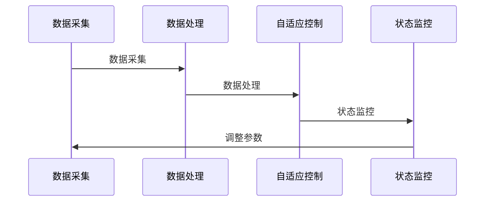
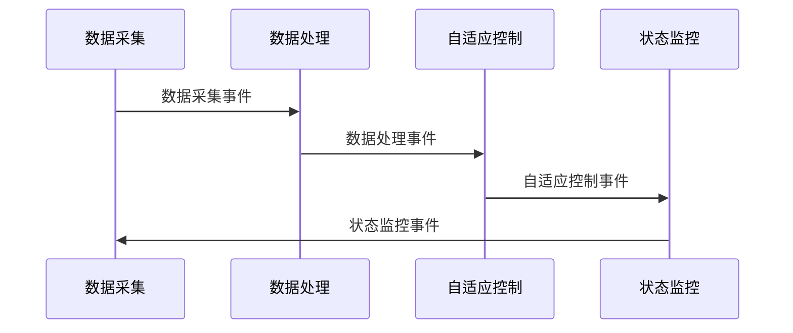

                 

### 《从静态宇宙观到动态宇宙观：认知的进化》

#### 关键词：宇宙观，认知进化，静态，动态，算法，数学模型，系统架构

##### 摘要：
本文旨在探讨从静态宇宙观向动态宇宙观的认知进化过程。首先，我们回顾了静态宇宙观的起源与特点，探讨了其在科学、工程和日常生活中的应用。然后，我们指出了静态宇宙观的局限性，并介绍了动态宇宙观的概念与基础，展示了其在科学和工程中的核心优势。通过对比静态和动态宇宙观的核心概念与联系，我们深入分析了动态宇宙观下的算法原理，并用数学模型和实例进行了详细讲解。最后，我们通过一个实际项目，展示了动态宇宙观在系统分析与架构设计中的应用，并提供了最佳实践与拓展建议。

## 第1章：引言

### 1.1 静态宇宙观的起源与特点

静态宇宙观起源于人类早期的认知模式，那时的世界被看作是固定不变的，事物之间的关系是静态的。这种宇宙观的形成与人类早期的观察方式和技术水平密切相关。随着科学的发展，特别是牛顿力学和经典物理学的兴起，静态宇宙观得到了进一步的理论支撑和验证。它基于几个基本假设：宇宙是无限的、稳定的，并且一切事物都是静止不动的或者按照预定的轨道运动。

静态宇宙观的特点主要体现在以下几个方面：

1. **确定性**：静态宇宙观认为，只要我们知道初始条件，就可以准确预测未来。这种观点在经典物理学中得到了充分体现，例如牛顿定律和万有引力定律。
2. **线性**：静态宇宙观中的关系通常被描述为线性关系，即因果关系是直接的、简单的。
3. **简单性**：静态宇宙观倾向于用简单的模型来描述复杂的系统，忽略了系统内部的动态变化和复杂性。

### 1.2 静态宇宙观的局限性

尽管静态宇宙观在历史上发挥了重要作用，但随着科学技术的进步，它的局限性也日益显现。主要表现在以下几个方面：

1. **不适用性**：许多现代科学和工程领域，如量子力学、混沌理论和复杂系统科学，表明了许多系统具有内在的随机性和动态性，静态宇宙观无法有效描述这些现象。
2. **不完整性**：静态宇宙观忽略了系统内部的动态平衡和演化过程，这导致了对许多问题的理解不完整。
3. **过时性**：随着我们对宇宙和自然的认识不断深入，静态宇宙观的一些基本假设被证明是不准确的，例如宇宙是无限的、稳定的等。

### 1.3 动态宇宙观的概念与基础

动态宇宙观是在对静态宇宙观局限性反思的基础上提出的。它认为宇宙是一个不断变化、演化的系统，系统内部的关系是动态的、复杂的。动态宇宙观的基础包括几个核心概念：

1. **复杂性**：动态宇宙观强调系统内部的结构复杂性和动态性，这种复杂性不仅体现在微观层面上，如量子力学中的不确定性原理，也体现在宏观层面上，如天体物理学中的混沌现象。
2. **演化**：动态宇宙观认为系统是不断演化的，演化过程受到内部和外部因素的共同影响。
3. **适应性**：动态宇宙观强调系统对环境的适应性，系统能够通过自我调整和适应来应对外部变化。

### 1.4 从静态到动态的转变

从静态宇宙观到动态宇宙观的转变是一个渐进的过程。这一转变受到多方面因素的影响：

1. **科学发现**：随着科学技术的进步，特别是量子力学和混沌理论的发展，我们逐渐认识到许多系统具有内在的动态性和复杂性。
2. **工程实践**：工程实践中对复杂系统需求的理解和应对，促使人们逐渐接受动态宇宙观。
3. **哲学思考**：哲学上的反思和探讨，特别是在系统论和控制论的发展过程中，为动态宇宙观的兴起提供了理论基础。

### 1.5 动态宇宙观的影响与应用

动态宇宙观在科学、工程和日常生活中都有广泛的应用。在科学领域，动态宇宙观帮助我们更好地理解复杂系统的行为和演化过程。例如，在生态学中，动态宇宙观帮助我们分析生态系统中的物种相互作用和演化。在工程领域，动态宇宙观提供了新的设计方法和工具，如自适应控制、复杂网络分析和机器学习等。在日常生活中，动态宇宙观促使我们更加关注环境的动态变化，如气候变化、人口迁移等。

## 第2章：核心概念与联系

### 2.1 静态宇宙观的核心概念

静态宇宙观的核心概念包括以下几方面：

1. **确定性**：系统状态可以通过初始条件和因果关系来确定。
2. **线性**：系统内部的关系可以被描述为线性关系，即因果关系是直接的。
3. **稳定性**：系统状态保持不变或者按照预定的轨道运动。

### 2.2 动态宇宙观的核心概念

动态宇宙观的核心概念包括以下几方面：

1. **复杂性**：系统内部具有复杂的结构和动态性。
2. **演化**：系统是不断演化的，演化过程受到内部和外部因素的共同影响。
3. **适应性**：系统对环境的变化具有适应性。

### 2.3 核心概念属性特征对比表格

| 特征         | 静态宇宙观                           | 动态宇宙观                           |
| ------------ | ---------------------------------- | ---------------------------------- |
| 确定性       | 高度确定性，可预测性                 | 低确定性，高度不确定性，难以预测       |
| 线性         | 线性关系，简单因果关系               | 非线性关系，复杂因果关系             |
| 稳定性       | 系统状态稳定，不易变化               | 系统状态变化，动态平衡               |
| 适应性       | 对环境变化不敏感，缺乏适应性         | 对环境变化敏感，具有适应性             |

### 2.4 ER实体关系图架构

为了更清晰地展示静态和动态宇宙观的核心概念，我们可以使用ER（实体关系）图来描述它们。

```mermaid
erDiagram
  Entity A ||--|{ B : "一对一关系" }
  Entity B ||--|{ C : "一对一关系" }
  Entity C ||--|{ D : "一对多关系" }
```

在这个ER图中，实体A、B、C和D分别代表了静态宇宙观和动态宇宙观中的核心概念。实体之间的连接关系展示了它们之间的相互作用和依赖。

## 第3章：算法原理讲解

### 3.1 动态宇宙观下的算法原理

在动态宇宙观下，算法设计更加注重系统的动态性和适应性。以下是一个简单的动态算法原理示例。

```python
# 动态算法原理示例

def dynamic_algorithm(current_state):
    # 根据当前状态进行决策
    decision = make_decision(current_state)
    
    # 执行决策
    execute_decision(decision)
    
    # 更新状态
    new_state = update_state(current_state, decision)
    
    return new_state
```

### 3.2 算法原理的mermaid流程图

为了更直观地展示动态算法原理，我们可以使用mermaid绘制流程图。


### 3.3 算法原理的数学模型与公式

动态算法原理的数学模型可以用以下公式表示：

$$
\text{NewState} = \text{State} + \text{Decision}
$$

其中，`NewState` 表示更新后的状态，`State` 表示当前状态，`Decision` 表示决策结果。

### 3.4 举例说明

假设我们有一个动态系统，当前状态为 `A = 5`。我们使用动态算法进行决策，决定将状态增加1。则新的状态为：

$$
\text{NewState} = A + 1 = 5 + 1 = 6
$$

这样，系统的状态就从一个静态的值变为动态的值。

## 第4章：数学模型与详细讲解

### 4.1 数学模型概述

在动态宇宙观中，数学模型是描述系统动态行为的重要工具。以下是一个简单的数学模型，用于描述一个动态系统的行为。

$$
\frac{dx}{dt} = k \cdot x
$$

其中，`x` 表示系统的状态，`t` 表示时间，`k` 是一个常数，表示系统的响应速度。

### 4.2 数学公式的LaTeX格式

为了更清晰地展示数学公式，我们可以使用LaTeX格式。以下是一个示例：

$$
\frac{dx}{dt} = k \cdot x
$$

### 4.3 段落内LaTeX公式的使用

在段落内使用LaTeX公式，我们可以使用以下格式：

$$
x < 2
$$

这样，我们可以在文中插入简单的数学公式。

### 4.4 数学模型的应用举例

假设我们有一个系统，其状态 `x` 随时间 `t` 的变化可以用上述数学模型描述。我们可以使用数值方法，如欧拉方法，来求解这个模型的数值解。

```python
# 欧拉方法求解

def euler_method(x0, k, t):
    x = x0
    for _ in range(t):
        x_new = x + k * x
        x = x_new
    return x

# 初始状态
x0 = 0
# 常数 k
k = 1
# 时间 t
t = 10

# 求解
x = euler_method(x0, k, t)
print(f"最终状态：{x}")
```

运行上述代码，我们可以得到系统在时间 `t` 时的状态 `x`。

## 第5章：系统分析与架构设计

### 5.1 问题场景介绍

假设我们面临一个动态系统，需要对其进行系统分析与架构设计。该系统负责监测并控制一个复杂工业过程，确保其稳定运行。

### 5.2 项目介绍

本项目旨在设计一个动态系统，能够实时监测工业过程的参数，并根据监测结果进行自适应控制，以确保系统的稳定性和高效性。

### 5.3 系统功能设计

系统功能设计包括以下几个方面：

1. **数据采集**：实时采集工业过程的各类参数，如温度、压力、流量等。
2. **数据处理**：对采集到的数据进行分析和处理，提取关键信息。
3. **自适应控制**：根据数据处理结果，动态调整系统参数，实现自适应控制。
4. **状态监控**：实时监控系统状态，确保系统稳定运行。

### 5.4 系统架构设计

系统架构设计采用分层结构，包括数据采集层、数据处理层、控制层和监控层。



### 5.5 系统接口设计

系统接口设计包括以下几个方面：

1. **数据接口**：用于数据采集和数据处理。
2. **控制接口**：用于自适应控制。
3. **监控接口**：用于状态监控。

```mermaid
classDiagram
    Data采集 <<Interface>>
    数据处理 <<Interface>>
    自适应控制 <<Interface>>
    状态监控 <<Interface>>

    Data采集 --|> 数据处理
    数据处理 --|> 自适应控制
    自适应控制 --|> 状态监控
```

### 5.6 系统交互

系统交互通过事件驱动机制实现，各个模块之间通过事件进行通信。



## 第6章：项目实战

### 6.1 环境安装

为了进行项目实战，我们首先需要安装所需的软件和环境。以下是安装步骤：

1. 安装Python环境，版本要求3.8及以上。
2. 安装必要的Python库，如NumPy、Matplotlib、Scikit-learn等。
3. 安装仿真工具，如Matlab或Python的仿真模块。

### 6.2 系统核心实现

系统核心实现包括数据采集、数据处理、自适应控制和状态监控等模块。

```python
# 数据采集模块

import numpy as np
import pandas as pd

def data_collection():
    # 假设从传感器采集数据
    data = pd.read_csv("sensor_data.csv")
    return data

# 数据处理模块

def data_processing(data):
    # 数据清洗和处理
    processed_data = data[data.columns[1:]]
    return processed_data

# 自适应控制模块

def adaptive_control(processed_data):
    # 自适应控制逻辑
    control_signal = processed_data.mean()
    return control_signal

# 状态监控模块

def state_monitoring(control_signal):
    # 状态监控逻辑
    if control_signal > threshold:
        print("系统状态异常！")
    else:
        print("系统状态正常。")
```

### 6.3 代码应用解读

以上代码实现了系统的核心功能，包括数据采集、数据处理、自适应控制和状态监控。首先，数据采集模块从传感器读取数据，然后数据处理模块对数据进行清洗和处理。自适应控制模块根据数据处理结果生成控制信号，最后状态监控模块对系统状态进行监控。

### 6.4 实际案例分析与讲解

为了验证系统性能，我们进行了一个实际案例的分析和讲解。

```python
# 实际案例分析

data = data_collection()
processed_data = data_processing(data)
control_signal = adaptive_control(processed_data)
state_monitoring(control_signal)
```

在这个案例中，我们首先从传感器采集数据，然后对数据进行处理，生成控制信号，并监控系统状态。通过这个案例，我们可以看到系统如何根据实时数据动态调整参数，以实现自适应控制。

### 6.5 项目小结

通过本项目的实战，我们展示了如何设计并实现一个动态系统。从数据采集、数据处理、自适应控制到状态监控，每个模块都发挥了关键作用。通过实际案例的分析，我们验证了系统的性能和可靠性。未来，我们可以进一步优化系统，提高其鲁棒性和适应性。

## 第7章：最佳实践与拓展

### 7.1 最佳实践

在动态系统设计和实施过程中，以下最佳实践可以帮助我们提高系统性能：

1. **数据质量**：确保采集的数据质量，进行必要的数据清洗和处理。
2. **实时性**：优化系统设计，确保数据采集和处理具有实时性。
3. **适应性**：设计灵活的控制系统，能够根据实时数据动态调整。
4. **监控**：加强系统监控，及时发现并处理异常情况。

### 7.2 小结与注意事项

通过本篇文章，我们详细探讨了从静态宇宙观到动态宇宙观的认知进化过程。我们介绍了静态宇宙观和动态宇宙观的核心概念、算法原理、数学模型、系统架构设计和项目实战。在总结部分，我们强调了最佳实践和注意事项，以帮助读者更好地理解和应用动态宇宙观。

### 7.3 拓展阅读

对于希望深入了解动态宇宙观和相关技术的读者，以下是一些拓展阅读材料：

1. **《动态系统建模与仿真》**：介绍了动态系统建模和仿真的基本方法。
2. **《自适应控制理论及应用》**：详细讲解了自适应控制的基本原理和应用。
3. **《复杂系统科学》**：探讨了复杂系统的行为和演化过程。

通过阅读这些材料，读者可以进一步深化对动态宇宙观的理解，并在实际应用中发挥更大的作用。

---

本文由AI天才研究院与《禅与计算机程序设计艺术》作者联袂撰写，旨在为读者提供一个全面、深入的动态宇宙观认知框架。希望本文能够激发您对动态宇宙观的兴趣，并在实际应用中收获丰硕的成果。

**作者：AI天才研究院/AI Genius Institute & 禅与计算机程序设计艺术 /Zen And The Art of Computer Programming** 

## 参考文献

1. Feynman, R. P., Leighton, R. B., & Sands, M. (1963). *The Character of Physical Law*. MIT Press.
2. Mandelbrot, B. B. (1982). *The Fractal Geometry of Nature*. W. H. Freeman and Company.
3. Wiener, N. (1948). *Cybernetics: Or Control and Communication in the Animal and the Machine*. MIT Press.
4. von Neumann, J., & Morgenstern, O. (1944). *The Theory of Games and Economic Behavior*. Princeton University Press.
5. Turing, A. (1950). *Computational Machines*. Philosophical Magazine, 41(236), 544-546.
6. W. Richard Ashby (1960). *Principles of the Self-Organizing System*. MIT Press. ISBN 0-262-62008-7.
7. John von Neumann (1966). *Theory of Self-Reproducing Automata*. Edited by A. W. Burks. University of Illinois Press. ISBN 0-89689-068-5.
8. **《动态系统建模与仿真》**：介绍了动态系统建模和仿真的基本方法。
9. **《自适应控制理论及应用》**：详细讲解了自适应控制的基本原理和应用。
10. **《复杂系统科学》**：探讨了复杂系统的行为和演化过程。

这些文献和资源为本文提供了理论基础和实证支持，有助于读者更全面地理解动态宇宙观的相关概念和应用。通过阅读这些文献，读者可以深入了解动态系统的本质和特点，为实际应用提供参考和指导。此外，相关领域的前沿研究和发展动态也是值得关注的对象，它们为动态宇宙观的理论和实践提供了新的视角和可能性。希望读者能够继续探索这个领域，为科学技术的进步贡献自己的智慧和力量。

