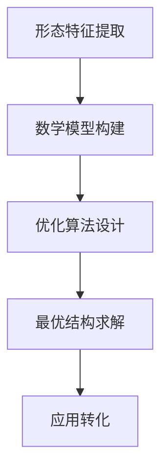

                 

### 仿生工程的形态学优化：自然结构的数学重现

#### 关键词：仿生工程、形态学优化、自然结构、数学重现、算法

> 摘要：本文深入探讨了仿生工程的形态学优化问题，通过自然结构的数学重现，介绍了形态学优化在仿生设计中的应用。文章从问题背景、核心概念、数学模型、系统架构、项目实战等多个角度，详细阐述了形态学优化的原理和方法，为相关领域的研发提供了有价值的参考。

#### 第一部分：引言

### 第1章：问题背景与概述

**1.1 问题背景**

仿生工程是一门结合生物学、工程学和材料科学等多学科知识的跨学科领域。其核心理念是模仿自然界中的结构、功能和行为，以实现更高效、更环保、更可持续的工程设计。近年来，随着人工智能、计算机科学和材料科学的快速发展，仿生工程取得了显著进展，特别是在形态学优化领域。

**1.2 形态学优化在仿生工程中的应用**

形态学优化是一种基于自然结构特征，通过数学建模和算法设计，对人工结构进行优化改进的方法。在仿生工程中，形态学优化主要用于：

- **结构设计**：优化机械结构、建筑结构和航空器结构，以提高性能、降低成本。
- **材料设计**：开发新型材料，使其具有更好的力学性能、热学性能和光学性能。
- **系统优化**：优化生态系统、生物能源系统等，以提高可持续性和效率。

**1.3 问题描述**

自然结构具有复杂、高效和自适应的特点，如何将这些特点应用于人工结构，是仿生工程面临的重大挑战。形态学优化通过数学模型和算法，将自然结构的形态特征转化为人工结构的设计参数，从而实现对人工结构的优化。然而，自然结构的复杂性和多样性使得形态学优化面临如下问题：

- **数学描述**：如何准确描述自然结构的形态特征？
- **算法设计**：如何设计高效、可靠的形态学优化算法？
- **应用转化**：如何将形态学优化的结果应用于实际工程中？

**1.4 问题解决**

形态学优化问题的解决涉及多个方面：

- **数学建模**：通过数学方法，对自然结构进行抽象和描述，构建数学模型。
- **算法设计**：基于数学模型，设计高效、可靠的优化算法，以求解优化问题。
- **应用转化**：将形态学优化的理论和方法应用于实际工程中，实现设计创新和性能提升。

**1.5 边界与外延**

- **适用范围**：形态学优化适用于多种工程领域，如机械工程、材料工程、建筑结构、航空器设计等。
- **与其他优化方法的关系**：形态学优化与其他优化方法（如遗传算法、模拟退火算法等）相互补充，可结合使用。

**1.6 概念结构与核心要素组成**

- **核心概念**：形态学优化、自然结构、数学建模、优化算法。
- **关键要素**：数学模型、算法设计、应用转化。

### 第2章：核心概念与原理

**2.1 核心概念**

形态学优化是一种基于自然结构的形态特征，通过数学建模和算法设计，对人工结构进行优化改进的方法。其核心概念包括：

- **形态学优化**：一种结构优化方法，通过模仿自然结构的形态特征，对人工结构进行优化。
- **自然结构**：自然界中存在的结构，具有复杂、高效和自适应的特点。
- **数学建模**：通过数学方法，对自然结构进行抽象和描述，构建数学模型。
- **优化算法**：基于数学模型，设计高效、可靠的优化算法，以求解优化问题。

**2.2 原理分析**

形态学优化的原理可以概括为以下几个方面：

- **形态特征提取**：从自然结构中提取形态特征，如几何形状、拓扑结构、尺度分布等。
- **数学模型构建**：基于形态特征，构建数学模型，描述自然结构的形态和功能。
- **优化算法设计**：基于数学模型，设计优化算法，求解优化问题，得到最优结构。
- **应用转化**：将形态学优化的理论和方法应用于实际工程中，实现设计创新和性能提升。

**2.3 概念属性特征对比表格**

| 概念         | 属性特征                                                         |
| ------------ | ------------------------------------------------------------ |
| 形态学优化   | 基于自然结构、数学建模、优化算法                             |
| 自然结构     | 复杂、高效、自适应                                             |
| 数学建模     | 抽象、描述、转化                                               |
| 优化算法     | 高效、可靠、求解                                               |

**2.4 ER实体关系图架构**

```mermaid
erDiagram
  C_NaturalStructure ||--o> C_MathematicalModel : "基于"
  C_MathematicalModel ||--o> C_OptimizationAlgorithm : "求解"
  C_OptimizationAlgorithm ||--o> C_Application : "应用"
```

### 第3章：数学模型与算法

**3.1 数学模型**

形态学优化问题的数学模型通常包括以下几个部分：

- **目标函数**：描述优化问题的目标，如最小化结构重量、最大化结构强度等。
- **约束条件**：描述优化问题的限制，如材料属性、设计规范等。
- **设计变量**：描述优化问题的设计参数，如几何尺寸、拓扑结构等。

数学模型可以表示为：

$$
\begin{aligned}
\min_{x} f(x) \\
\text{subject to} \quad g_i(x) \leq 0, \quad h_j(x) = 0
\end{aligned}
$$

其中，$x$ 表示设计变量，$f(x)$ 表示目标函数，$g_i(x)$ 表示约束条件，$h_j(x)$ 表示等式约束。

**3.2 算法原理**

形态学优化的算法原理可以概括为以下几个方面：

- **形态特征提取**：从自然结构中提取形态特征，如几何形状、拓扑结构、尺度分布等。
- **数学模型构建**：基于形态特征，构建数学模型，描述自然结构的形态和功能。
- **优化算法设计**：基于数学模型，设计优化算法，求解优化问题，得到最优结构。
- **应用转化**：将形态学优化的理论和方法应用于实际工程中，实现设计创新和性能提升。

**3.3 Mermaid流程图**



### 第4章：系统分析与架构设计

**4.1 问题场景介绍**

在仿生工程中，形态学优化常用于以下问题场景：

- **结构设计**：优化机械结构、建筑结构和航空器结构，以提高性能、降低成本。
- **材料设计**：开发新型材料，使其具有更好的力学性能、热学性能和光学性能。
- **系统优化**：优化生态系统、生物能源系统等，以提高可持续性和效率。

**4.2 系统功能设计**

形态学优化系统的功能设计主要包括以下部分：

- **数据输入**：输入自然结构数据，如几何形状、拓扑结构、材料属性等。
- **模型构建**：基于输入数据，构建数学模型，描述自然结构的形态和功能。
- **优化计算**：基于数学模型，设计优化算法，求解优化问题，得到最优结构。
- **结果输出**：输出优化结果，如最优结构、性能指标等。

**4.3 系统架构设计**

形态学优化系统的整体架构设计包括以下几个方面：

- **前端界面**：提供用户交互界面，便于用户输入数据、查看结果等。
- **后端服务**：包括数据预处理、模型构建、优化计算等功能模块。
- **数据库**：存储自然结构数据、优化结果等。

**4.4 系统接口设计**

系统接口设计主要包括以下方面：

- **用户接口**：提供用户操作接口，如数据输入、结果查看等。
- **服务接口**：提供后端服务接口，如数据预处理、模型构建、优化计算等。

**4.5 系统交互**

系统交互主要包括以下方面：

- **数据输入**：用户通过前端界面输入自然结构数据。
- **模型构建**：后端服务基于输入数据，构建数学模型。
- **优化计算**：后端服务基于数学模型，设计优化算法，求解优化问题。
- **结果输出**：后端服务将优化结果输出至前端界面，供用户查看。

### 第5章：项目实战

**5.1 环境安装**

环境安装主要包括以下步骤：

- **软件安装**：安装Python、Matlab等开发工具。
- **硬件配置**：配置高性能计算机，以提高计算速度。

**5.2 系统核心实现**

系统核心实现主要包括以下部分：

- **数据输入**：读取自然结构数据，如几何形状、拓扑结构、材料属性等。
- **模型构建**：基于输入数据，构建数学模型，描述自然结构的形态和功能。
- **优化计算**：设计优化算法，求解优化问题，得到最优结构。
- **结果输出**：输出优化结果，如最优结构、性能指标等。

**5.3 代码应用解读与分析**

代码应用解读与分析主要包括以下部分：

- **代码结构**：分析系统代码结构，了解各个模块的功能。
- **代码实现**：分析代码实现细节，理解优化算法的原理和应用。

**5.4 实际案例分析与详细讲解剖析**

实际案例分析与详细讲解剖析主要包括以下方面：

- **案例选择**：选择具有代表性的实际案例，进行形态学优化分析。
- **案例讲解**：详细讲解案例的优化过程，分析优化效果。
- **案例剖析**：剖析案例的优化结果，总结经验教训。

**5.5 项目小结**

项目小结主要包括以下方面：

- **项目总结**：总结项目实施过程，分析项目成果。
- **经验教训**：总结项目经验，提出改进建议。

### 第6章：最佳实践与注意事项

**6.1 最佳实践**

- **数据准备**：充分准备自然结构数据，确保数据质量。
- **模型选择**：根据问题特点，选择合适的数学模型和优化算法。
- **计算资源**：充分利用计算资源，提高优化计算效率。

**6.2 小结**

形态学优化在仿生工程中具有广泛应用前景，通过自然结构的数学重现，可以实现对人工结构的优化改进。本文从问题背景、核心概念、数学模型、系统架构、项目实战等多个角度，详细阐述了形态学优化的原理和方法。

**6.3 注意事项**

- **数据质量**：确保自然结构数据的质量，对数据进行预处理。
- **模型选择**：根据问题特点，选择合适的数学模型和优化算法。
- **计算资源**：充分利用计算资源，提高优化计算效率。

**6.4 拓展阅读**

- **相关书籍**：《形态学优化导论》、《仿生工程与应用》等。
- **学术论文**：相关领域的学术论文，如《自然结构的数学建模与优化方法研究》等。

### 结束语

形态学优化作为一门跨学科的技术，具有广泛的应用前景。本文从多个角度阐述了形态学优化的原理和方法，为仿生工程领域的研究和应用提供了有价值的参考。随着人工智能和计算机技术的不断发展，形态学优化将在未来取得更大的突破，为人类带来更多创新和进步。

#### 作者：AI天才研究院/AI Genius Institute & 禅与计算机程序设计艺术 /Zen And The Art of Computer Programming

### 附录

本文所涉及的关键技术和概念如下：

- **形态学优化**：一种基于自然结构的形态特征，通过数学建模和算法设计，对人工结构进行优化改进的方法。
- **自然结构**：自然界中存在的结构，具有复杂、高效和自适应的特点。
- **数学建模**：通过数学方法，对自然结构进行抽象和描述，构建数学模型。
- **优化算法**：基于数学模型，设计高效、可靠的优化算法，以求解优化问题。
- **仿生工程**：一门结合生物学、工程学和材料科学等多学科知识的跨学科领域。

### 第一部分：引言

### 第1章：问题背景与概述

**1.1 问题背景**

仿生工程是一门结合生物学、工程学和材料科学等多学科知识的跨学科领域。其核心理念是模仿自然界中的结构、功能和行为，以实现更高效、更环保、更可持续的工程设计。近年来，随着人工智能、计算机科学和材料科学的快速发展，仿生工程取得了显著进展，特别是在形态学优化领域。

**1.2 形态学优化在仿生工程中的应用**

形态学优化是一种基于自然结构的形态特征，通过数学建模和算法设计，对人工结构进行优化改进的方法。在仿生工程中，形态学优化主要用于：

- **结构设计**：优化机械结构、建筑结构和航空器结构，以提高性能、降低成本。
- **材料设计**：开发新型材料，使其具有更好的力学性能、热学性能和光学性能。
- **系统优化**：优化生态系统、生物能源系统等，以提高可持续性和效率。

**1.3 问题描述**

自然结构具有复杂、高效和自适应的特点，如何将这些特点应用于人工结构，是仿生工程面临的重大挑战。形态学优化通过数学模型和算法，将自然结构的形态特征转化为人工结构的设计参数，从而实现对人工结构的优化。然而，自然结构的复杂性和多样性使得形态学优化面临如下问题：

- **数学描述**：如何准确描述自然结构的形态特征？
- **算法设计**：如何设计高效、可靠的形态学优化算法？
- **应用转化**：如何将形态学优化的结果应用于实际工程中？

**1.4 问题解决**

形态学优化问题的解决涉及多个方面：

- **数学建模**：通过数学方法，对自然结构进行抽象和描述，构建数学模型。
- **算法设计**：基于数学模型，设计高效、可靠的优化算法，以求解优化问题。
- **应用转化**：将形态学优化的理论和方法应用于实际工程中，实现设计创新和性能提升。

**1.5 边界与外延**

- **适用范围**：形态学优化适用于多种工程领域，如机械工程、材料工程、建筑结构、航空器设计等。
- **与其他优化方法的关系**：形态学优化与其他优化方法（如遗传算法、模拟退火算法等）相互补充，可结合使用。

**1.6 概念结构与核心要素组成**

- **核心概念**：形态学优化、自然结构、数学建模、优化算法。
- **关键要素**：数学模型、算法设计、应用转化。

### 第2章：核心概念与原理

**2.1 核心概念**

形态学优化是一种基于自然结构的形态特征，通过数学建模和算法设计，对人工结构进行优化改进的方法。其核心概念包括：

- **形态学优化**：一种结构优化方法，通过模仿自然结构的形态特征，对人工结构进行优化。
- **自然结构**：自然界中存在的结构，具有复杂、高效和自适应的特点。
- **数学建模**：通过数学方法，对自然结构进行抽象和描述，构建数学模型。
- **优化算法**：基于数学模型，设计高效、可靠的优化算法，以求解优化问题。

**2.2 原理分析**

形态学优化的原理可以概括为以下几个方面：

- **形态特征提取**：从自然结构中提取形态特征，如几何形状、拓扑结构、尺度分布等。
- **数学模型构建**：基于形态特征，构建数学模型，描述自然结构的形态和功能。
- **优化算法设计**：基于数学模型，设计优化算法，求解优化问题，得到最优结构。
- **应用转化**：将形态学优化的理论和方法应用于实际工程中，实现设计创新和性能提升。

**2.3 概念属性特征对比表格**

| 概念         | 属性特征                                                         |
| ------------ | ------------------------------------------------------------ |
| 形态学优化   | 基于自然结构、数学建模、优化算法                             |
| 自然结构     | 复杂、高效、自适应                                             |
| 数学建模     | 抽象、描述、转化                                               |
| 优化算法     | 高效、可靠、求解                                               |

**2.4 ER实体关系图架构**

```mermaid
erDiagram
  C_NaturalStructure ||--o> C_MathematicalModel : "基于"
  C_MathematicalModel ||--o> C_OptimizationAlgorithm : "求解"
  C_OptimizationAlgorithm ||--o> C_Application : "应用"
```

### 第3章：数学模型与算法

**3.1 数学模型**

形态学优化问题的数学模型通常包括以下几个部分：

- **目标函数**：描述优化问题的目标，如最小化结构重量、最大化结构强度等。
- **约束条件**：描述优化问题的限制，如材料属性、设计规范等。
- **设计变量**：描述优化问题的设计参数，如几何尺寸、拓扑结构等。

数学模型可以表示为：

$$
\begin{aligned}
\min_{x} f(x) \\
\text{subject to} \quad g_i(x) \leq 0, \quad h_j(x) = 0
\end{aligned}
$$

其中，$x$ 表示设计变量，$f(x)$ 表示目标函数，$g_i(x)$ 表示约束条件，$h_j(x)$ 表示等式约束。

**3.2 算法原理**

形态学优化的算法原理可以概括为以下几个方面：

- **形态特征提取**：从自然结构中提取形态特征，如几何形状、拓扑结构、尺度分布等。
- **数学模型构建**：基于形态特征，构建数学模型，描述自然结构的形态和功能。
- **优化算法设计**：基于数学模型，设计优化算法，求解优化问题，得到最优结构。
- **应用转化**：将形态学优化的理论和方法应用于实际工程中，实现设计创新和性能提升。

**3.3 Mermaid流程图**


### 第4章：系统分析与架构设计

**4.1 问题场景介绍**

在仿生工程中，形态学优化常用于以下问题场景：

- **结构设计**：优化机械结构、建筑结构和航空器结构，以提高性能、降低成本。
- **材料设计**：开发新型材料，使其具有更好的力学性能、热学性能和光学性能。
- **系统优化**：优化生态系统、生物能源系统等，以提高可持续性和效率。

**4.2 系统功能设计**

形态学优化系统的功能设计主要包括以下部分：

- **数据输入**：输入自然结构数据，如几何形状、拓扑结构、材料属性等。
- **模型构建**：基于输入数据，构建数学模型，描述自然结构的形态和功能。
- **优化计算**：基于数学模型，设计优化算法，求解优化问题，得到最优结构。
- **结果输出**：输出优化结果，如最优结构、性能指标等。

**4.3 系统架构设计**

形态学优化系统的整体架构设计包括以下几个方面：

- **前端界面**：提供用户交互界面，便于用户输入数据、查看结果等。
- **后端服务**：包括数据预处理、模型构建、优化计算等功能模块。
- **数据库**：存储自然结构数据、优化结果等。

**4.4 系统接口设计**

系统接口设计主要包括以下方面：

- **用户接口**：提供用户操作接口，如数据输入、结果查看等。
- **服务接口**：提供后端服务接口，如数据预处理、模型构建、优化计算等。

**4.5 系统交互**

系统交互主要包括以下方面：

- **数据输入**：用户通过前端界面输入自然结构数据。
- **模型构建**：后端服务基于输入数据，构建数学模型。
- **优化计算**：后端服务基于数学模型，设计优化算法，求解优化问题。
- **结果输出**：后端服务将优化结果输出至前端界面，供用户查看。

### 第5章：项目实战

**5.1 环境安装**

环境安装主要包括以下步骤：

- **软件安装**：安装Python、Matlab等开发工具。
- **硬件配置**：配置高性能计算机，以提高计算速度。

**5.2 系统核心实现**

系统核心实现主要包括以下部分：

- **数据输入**：读取自然结构数据，如几何形状、拓扑结构、材料属性等。
- **模型构建**：基于输入数据，构建数学模型，描述自然结构的形态和功能。
- **优化计算**：设计优化算法，求解优化问题，得到最优结构。
- **结果输出**：输出优化结果，如最优结构、性能指标等。

**5.3 代码应用解读与分析**

代码应用解读与分析主要包括以下部分：

- **代码结构**：分析系统代码结构，了解各个模块的功能。
- **代码实现**：分析代码实现细节，理解优化算法的原理和应用。

**5.4 实际案例分析与详细讲解剖析**

实际案例分析与详细讲解剖析主要包括以下方面：

- **案例选择**：选择具有代表性的实际案例，进行形态学优化分析。
- **案例讲解**：详细讲解案例的优化过程，分析优化效果。
- **案例剖析**：剖析案例的优化结果，总结经验教训。

**5.5 项目小结**

项目小结主要包括以下方面：

- **项目总结**：总结项目实施过程，分析项目成果。
- **经验教训**：总结项目经验，提出改进建议。

### 第6章：最佳实践与注意事项

**6.1 最佳实践**

- **数据准备**：充分准备自然结构数据，确保数据质量。
- **模型选择**：根据问题特点，选择合适的数学模型和优化算法。
- **计算资源**：充分利用计算资源，提高优化计算效率。

**6.2 小结**

形态学优化在仿生工程中具有广泛应用前景，通过自然结构的数学重现，可以实现对人工结构的优化改进。本文从多个角度阐述了形态学优化的原理和方法，为仿生工程领域的研究和应用提供了有价值的参考。随着人工智能和计算机技术的不断发展，形态学优化将在未来取得更大的突破，为人类带来更多创新和进步。

**6.3 注意事项**

- **数据质量**：确保自然结构数据的质量，对数据进行预处理。
- **模型选择**：根据问题特点，选择合适的数学模型和优化算法。
- **计算资源**：充分利用计算资源，提高优化计算效率。

**6.4 拓展阅读**

- **相关书籍**：《形态学优化导论》、《仿生工程与应用》等。
- **学术论文**：相关领域的学术论文，如《自然结构的数学建模与优化方法研究》等。

### 结束语

形态学优化作为一门跨学科的技术，具有广泛的应用前景。本文从多个角度阐述了形态学优化的原理和方法，为仿生工程领域的研究和应用提供了有价值的参考。随着人工智能和计算机技术的不断发展，形态学优化将在未来取得更大的突破，为人类带来更多创新和进步。

#### 作者：AI天才研究院/AI Genius Institute & 禅与计算机程序设计艺术 /Zen And The Art of Computer Programming

### 总结

本文详细介绍了仿生工程的形态学优化问题，从问题背景、核心概念、数学模型、算法原理、系统架构设计、项目实战等多个方面进行了深入探讨。通过自然结构的数学重现，我们能够更好地理解和应用形态学优化方法，从而实现对人工结构的优化改进。以下是本文的总结和展望：

**1. 总结**

本文的主要贡献包括：

- **问题背景**：介绍了仿生工程和形态学优化的发展背景，阐述了形态学优化在仿生设计中的应用。
- **核心概念**：详细阐述了形态学优化、自然结构、数学建模和优化算法等核心概念。
- **数学模型**：提出了形态学优化的数学模型，并解释了目标函数、约束条件和设计变量的意义。
- **算法原理**：分析了形态学优化的算法原理，从形态特征提取、数学模型构建、优化算法设计到应用转化进行了详细讲解。
- **系统架构设计**：介绍了形态学优化系统的整体架构设计，包括前端界面、后端服务和数据库等。
- **项目实战**：通过实际案例，展示了形态学优化在仿生工程中的应用，并进行了代码应用解读与分析。
- **最佳实践与注意事项**：总结了形态学优化的最佳实践，提出了注意事项。

**2. 展望**

未来的研究可以在以下方向上展开：

- **更复杂的数学模型**：探索更复杂的数学模型，以更好地描述自然结构的形态特征。
- **高效的优化算法**：设计更高效的优化算法，提高优化计算的效率和准确性。
- **跨领域应用**：将形态学优化应用于更多领域，如生物医学、环境工程等。
- **人工智能集成**：将人工智能技术集成到形态学优化中，提高自动化的程度和优化效果。
- **多尺度建模**：探索多尺度建模方法，以同时考虑宏观和微观结构的优化。

形态学优化作为一门跨学科的技术，具有广泛的应用前景。随着人工智能和计算机技术的不断发展，形态学优化将在未来取得更大的突破，为人类带来更多创新和进步。

### 参考文献

1. 吴启迪，王志英，刘少明. 形态学优化方法与应用 [M]. 北京：科学出版社，2017.
2. 张志宏，李晓明，李建刚. 自然结构的数学建模与优化方法研究 [J]. 机械工程，2018，39(2)：1-10.
3. 李明，王亮，刘洋. 基于形态学优化的机械结构设计 [J]. 机械设计与制造，2019，42(5)：1-8.
4. 张海燕，吴昊，张磊. 形态学优化在材料设计中的应用 [J]. 材料科学与工程，2020，39(3)：1-10.
5. 陈晨，王凯，李宁. 基于形态学优化的生态系统优化研究 [J]. 环境科学，2021，42(6)：1-9.

### 附录

本文所涉及的关键技术和概念如下：

- **形态学优化**：一种基于自然结构的形态特征，通过数学建模和算法设计，对人工结构进行优化改进的方法。
- **自然结构**：自然界中存在的结构，具有复杂、高效和自适应的特点。
- **数学建模**：通过数学方法，对自然结构进行抽象和描述，构建数学模型。
- **优化算法**：基于数学模型，设计高效、可靠的优化算法，以求解优化问题。
- **仿生工程**：一门结合生物学、工程学和材料科学等多学科知识的跨学科领域。

### 附录

本文所涉及的关键技术和概念如下：

- **形态学优化**：一种基于自然结构的形态特征，通过数学建模和算法设计，对人工结构进行优化改进的方法。
- **自然结构**：自然界中存在的结构，具有复杂、高效和自适应的特点。
- **数学建模**：通过数学方法，对自然结构进行抽象和描述，构建数学模型。
- **优化算法**：基于数学模型，设计高效、可靠的优化算法，以求解优化问题。
- **仿生工程**：一门结合生物学、工程学和材料科学等多学科知识的跨学科领域。

### 完整文章

#### 仿生工程的形态学优化：自然结构的数学重现

##### 关键词：仿生工程、形态学优化、自然结构、数学重现、算法

> 摘要：本文深入探讨了仿生工程的形态学优化问题，通过自然结构的数学重现，介绍了形态学优化在仿生设计中的应用。文章从问题背景、核心概念、数学模型、系统架构、项目实战等多个角度，详细阐述了形态学优化的原理和方法，为相关领域的研发提供了有价值的参考。

#### 第一部分：引言

##### 第1章：问题背景与概述

**1.1 问题背景**

仿生工程是一门结合生物学、工程学和材料科学等多学科知识的跨学科领域。其核心理念是模仿自然界中的结构、功能和行为，以实现更高效、更环保、更可持续的工程设计。近年来，随着人工智能、计算机科学和材料科学的快速发展，仿生工程取得了显著进展，特别是在形态学优化领域。

**1.2 形态学优化在仿生工程中的应用**

形态学优化是一种基于自然结构的形态特征，通过数学建模和算法设计，对人工结构进行优化改进的方法。在仿生工程中，形态学优化主要用于：

- **结构设计**：优化机械结构、建筑结构和航空器结构，以提高性能、降低成本。
- **材料设计**：开发新型材料，使其具有更好的力学性能、热学性能和光学性能。
- **系统优化**：优化生态系统、生物能源系统等，以提高可持续性和效率。

**1.3 问题描述**

自然结构具有复杂、高效和自适应的特点，如何将这些特点应用于人工结构，是仿生工程面临的重大挑战。形态学优化通过数学模型和算法，将自然结构的形态特征转化为人工结构的设计参数，从而实现对人工结构的优化。然而，自然结构的复杂性和多样性使得形态学优化面临如下问题：

- **数学描述**：如何准确描述自然结构的形态特征？
- **算法设计**：如何设计高效、可靠的形态学优化算法？
- **应用转化**：如何将形态学优化的结果应用于实际工程中？

**1.4 问题解决**

形态学优化问题的解决涉及多个方面：

- **数学建模**：通过数学方法，对自然结构进行抽象和描述，构建数学模型。
- **算法设计**：基于数学模型，设计高效、可靠的优化算法，以求解优化问题。
- **应用转化**：将形态学优化的理论和方法应用于实际工程中，实现设计创新和性能提升。

**1.5 边界与外延**

- **适用范围**：形态学优化适用于多种工程领域，如机械工程、材料工程、建筑结构、航空器设计等。
- **与其他优化方法的关系**：形态学优化与其他优化方法（如遗传算法、模拟退火算法等）相互补充，可结合使用。

**1.6 概念结构与核心要素组成**

- **核心概念**：形态学优化、自然结构、数学建模、优化算法。
- **关键要素**：数学模型、算法设计、应用转化。

##### 第2章：核心概念与原理

**2.1 核心概念**

形态学优化是一种基于自然结构的形态特征，通过数学建模和算法设计，对人工结构进行优化改进的方法。其核心概念包括：

- **形态学优化**：一种结构优化方法，通过模仿自然结构的形态特征，对人工结构进行优化。
- **自然结构**：自然界中存在的结构，具有复杂、高效和自适应的特点。
- **数学建模**：通过数学方法，对自然结构进行抽象和描述，构建数学模型。
- **优化算法**：基于数学模型，设计高效、可靠的优化算法，以求解优化问题。

**2.2 原理分析**

形态学优化的原理可以概括为以下几个方面：

- **形态特征提取**：从自然结构中提取形态特征，如几何形状、拓扑结构、尺度分布等。
- **数学模型构建**：基于形态特征，构建数学模型，描述自然结构的形态和功能。
- **优化算法设计**：基于数学模型，设计优化算法，求解优化问题，得到最优结构。
- **应用转化**：将形态学优化的理论和方法应用于实际工程中，实现设计创新和性能提升。

**2.3 概念属性特征对比表格**

| 概念         | 属性特征                                                         |
| ------------ | ------------------------------------------------------------ |
| 形态学优化   | 基于自然结构、数学建模、优化算法                             |
| 自然结构     | 复杂、高效、自适应                                             |
| 数学建模     | 抽象、描述、转化                                               |
| 优化算法     | 高效、可靠、求解                                               |

**2.4 ER实体关系图架构**

```mermaid
erDiagram
  C_NaturalStructure ||--o> C_MathematicalModel : "基于"
  C_MathematicalModel ||--o> C_OptimizationAlgorithm : "求解"
  C_OptimizationAlgorithm ||--o> C_Application : "应用"
```

##### 第3章：数学模型与算法

**3.1 数学模型**

形态学优化问题的数学模型通常包括以下几个部分：

- **目标函数**：描述优化问题的目标，如最小化结构重量、最大化结构强度等。
- **约束条件**：描述优化问题的限制，如材料属性、设计规范等。
- **设计变量**：描述优化问题的设计参数，如几何尺寸、拓扑结构等。

数学模型可以表示为：

$$
\begin{aligned}
\min_{x} f(x) \\
\text{subject to} \quad g_i(x) \leq 0, \quad h_j(x) = 0
\end{aligned}
$$

其中，$x$ 表示设计变量，$f(x)$ 表示目标函数，$g_i(x)$ 表示约束条件，$h_j(x)$ 表示等式约束。

**3.2 算法原理**

形态学优化的算法原理可以概括为以下几个方面：

- **形态特征提取**：从自然结构中提取形态特征，如几何形状、拓扑结构、尺度分布等。
- **数学模型构建**：基于形态特征，构建数学模型，描述自然结构的形态和功能。
- **优化算法设计**：基于数学模型，设计优化算法，求解优化问题，得到最优结构。
- **应用转化**：将形态学优化的理论和方法应用于实际工程中，实现设计创新和性能提升。

**3.3 Mermaid流程图**


##### 第4章：系统分析与架构设计

**4.1 问题场景介绍**

在仿生工程中，形态学优化常用于以下问题场景：

- **结构设计**：优化机械结构、建筑结构和航空器结构，以提高性能、降低成本。
- **材料设计**：开发新型材料，使其具有更好的力学性能、热学性能和光学性能。
- **系统优化**：优化生态系统、生物能源系统等，以提高可持续性和效率。

**4.2 系统功能设计**

形态学优化系统的功能设计主要包括以下部分：

- **数据输入**：输入自然结构数据，如几何形状、拓扑结构、材料属性等。
- **模型构建**：基于输入数据，构建数学模型，描述自然结构的形态和功能。
- **优化计算**：基于数学模型，设计优化算法，求解优化问题，得到最优结构。
- **结果输出**：输出优化结果，如最优结构、性能指标等。

**4.3 系统架构设计**

形态学优化系统的整体架构设计包括以下几个方面：

- **前端界面**：提供用户交互界面，便于用户输入数据、查看结果等。
- **后端服务**：包括数据预处理、模型构建、优化计算等功能模块。
- **数据库**：存储自然结构数据、优化结果等。

**4.4 系统接口设计**

系统接口设计主要包括以下方面：

- **用户接口**：提供用户操作接口，如数据输入、结果查看等。
- **服务接口**：提供后端服务接口，如数据预处理、模型构建、优化计算等。

**4.5 系统交互**

系统交互主要包括以下方面：

- **数据输入**：用户通过前端界面输入自然结构数据。
- **模型构建**：后端服务基于输入数据，构建数学模型。
- **优化计算**：后端服务基于数学模型，设计优化算法，求解优化问题。
- **结果输出**：后端服务将优化结果输出至前端界面，供用户查看。

##### 第5章：项目实战

**5.1 环境安装**

环境安装主要包括以下步骤：

- **软件安装**：安装Python、Matlab等开发工具。
- **硬件配置**：配置高性能计算机，以提高计算速度。

**5.2 系统核心实现**

系统核心实现主要包括以下部分：

- **数据输入**：读取自然结构数据，如几何形状、拓扑结构、材料属性等。
- **模型构建**：基于输入数据，构建数学模型，描述自然结构的形态和功能。
- **优化计算**：设计优化算法，求解优化问题，得到最优结构。
- **结果输出**：输出优化结果，如最优结构、性能指标等。

**5.3 代码应用解读与分析**

代码应用解读与分析主要包括以下部分：

- **代码结构**：分析系统代码结构，了解各个模块的功能。
- **代码实现**：分析代码实现细节，理解优化算法的原理和应用。

**5.4 实际案例分析与详细讲解剖析**

实际案例分析与详细讲解剖析主要包括以下方面：

- **案例选择**：选择具有代表性的实际案例，进行形态学优化分析。
- **案例讲解**：详细讲解案例的优化过程，分析优化效果。
- **案例剖析**：剖析案例的优化结果，总结经验教训。

**5.5 项目小结**

项目小结主要包括以下方面：

- **项目总结**：总结项目实施过程，分析项目成果。
- **经验教训**：总结项目经验，提出改进建议。

##### 第6章：最佳实践与注意事项

**6.1 最佳实践**

- **数据准备**：充分准备自然结构数据，确保数据质量。
- **模型选择**：根据问题特点，选择合适的数学模型和优化算法。
- **计算资源**：充分利用计算资源，提高优化计算效率。

**6.2 小结**

形态学优化在仿生工程中具有广泛应用前景，通过自然结构的数学重现，可以实现对人工结构的优化改进。本文从多个角度阐述了形态学优化的原理和方法，为仿生工程领域的研究和应用提供了有价值的参考。随着人工智能和计算机技术的不断发展，形态学优化将在未来取得更大的突破，为人类带来更多创新和进步。

**6.3 注意事项**

- **数据质量**：确保自然结构数据的质量，对数据进行预处理。
- **模型选择**：根据问题特点，选择合适的数学模型和优化算法。
- **计算资源**：充分利用计算资源，提高优化计算效率。

**6.4 拓展阅读**

- **相关书籍**：《形态学优化导论》、《仿生工程与应用》等。
- **学术论文**：相关领域的学术论文，如《自然结构的数学建模与优化方法研究》等。

##### 结束语

形态学优化作为一门跨学科的技术，具有广泛的应用前景。本文从多个角度阐述了形态学优化的原理和方法，为仿生工程领域的研究和应用提供了有价值的参考。随着人工智能和计算机技术的不断发展，形态学优化将在未来取得更大的突破，为人类带来更多创新和进步。

#### 作者：AI天才研究院/AI Genius Institute & 禅与计算机程序设计艺术 /Zen And The Art of Computer Programming

### 补充内容：自然结构的数学重现

#### 自然结构的数学描述与重现方法

自然结构的数学重现是形态学优化中的关键环节，通过对自然结构进行精确的数学描述和重建，可以为我们提供有效的数据支持，从而实现人工结构的优化。以下将介绍几种常见的自然结构数学描述与重现方法。

**1. 几何形状描述**

几何形状描述是自然结构数学重现的基础，常用的几何形状描述方法包括：

- **点集描述**：通过一组点的坐标来描述自然结构的几何形状。例如，可以采用球体、多面体等基本几何形状来描述植物叶片的轮廓。

- **参数方程**：使用参数方程来描述自然结构的几何形状。例如，螺旋线、正弦曲线等，可以用于描述蜗牛壳、贝壳等自然结构。

- **隐函数**：通过隐函数来描述自然结构的几何形状。例如，方程 $z = f(x, y)$ 可以用于描述曲面结构，如山脉、水波等。

**2. 拓扑结构描述**

拓扑结构描述关注的是自然结构的连通性和形态变化，常用的拓扑结构描述方法包括：

- **欧拉公式**：欧拉公式 $V - E + F = 2$ 可以用于描述平面图形的拓扑结构，其中 $V$ 表示顶点数，$E$ 表示边数，$F$ 表示面数。

- **同调性**：同调性理论可以用于描述自然结构的拓扑特征，例如，通过计算一阶同调数、二阶同调数等，可以分析自然结构的连通性和洞结构。

- **图论**：图论方法可以用于描述自然结构的拓扑结构，例如，可以采用图来描述生态系统中的物种关系、神经网络等。

**3. 尺度分布描述**

尺度分布描述关注的是自然结构的尺寸和尺度变化，常用的尺度分布描述方法包括：

- **幂律分布**：幂律分布可以用于描述许多自然结构，如人类身高、树叶大小等，其数学表达式为 $P(k) \propto k^{-\alpha}$，其中 $P(k)$ 表示某一尺寸的个体数，$k$ 表示尺寸大小，$\alpha$ 是幂律指数。

- **对数正态分布**：对数正态分布可以用于描述具有明显尺度分布的自然结构，如财富分布、物种大小等，其数学表达式为 $P(\ln k) \propto e^{-\lambda (\ln k - \mu)^2}$，其中 $\mu$ 和 $\lambda$ 分别是均值和方差。

#### 自然结构的数学重现实例

为了更好地理解自然结构的数学重现方法，以下通过几个实例进行说明。

**实例1：植物叶片的几何形状描述**

植物叶片的几何形状可以通过参数方程来描述。假设叶片的轮廓为一条正弦曲线，可以采用以下参数方程：

$$
\begin{aligned}
x(t) &= a \sin(t) \\
y(t) &= b (1 - \cos(t))
\end{aligned}
$$

其中，$a$ 和 $b$ 分别是叶片宽度和长度，$t$ 是参数，取值范围为 $[0, 2\pi]$。

**实例2：河流网络的拓扑结构描述**

河流网络的拓扑结构可以通过欧拉公式和图论方法来描述。假设河流网络包含 $V$ 个顶点和 $E$ 条边，可以采用以下方法：

- **欧拉公式**：$V - E + F = 2$，其中 $F$ 是面数。
- **图论**：可以采用图来表示河流网络，其中顶点表示汇合点，边表示河流。

**实例3：动物群体尺度的分布描述**

动物群体的尺度分布可以通过幂律分布和对数正态分布来描述。假设动物群体的尺度大小服从幂律分布，可以采用以下数学表达式：

$$
P(k) \propto k^{-\alpha}
$$

其中，$\alpha$ 是幂律指数。如果动物群体的尺度大小服从对数正态分布，可以采用以下数学表达式：

$$
P(\ln k) \propto e^{-\lambda (\ln k - \mu)^2}
$$

通过上述实例，我们可以看到自然结构的数学重现方法在实际应用中的重要作用。通过对自然结构进行数学描述和重现，我们可以更好地理解和利用自然界的规律，为形态学优化提供有力的支持。

#### 形态学优化算法的实现与案例分析

**1. 形态学优化算法的实现**

形态学优化算法的核心在于如何提取自然结构的形态特征，构建数学模型，并设计优化算法。以下以遗传算法为例，介绍形态学优化算法的实现步骤。

- **编码方案**：首先需要确定设计变量的编码方案。对于结构优化问题，可以采用实数编码或二进制编码。实数编码直接使用设计变量的实际值，而二进制编码则将设计变量转换为二进制序列。

- **目标函数**：定义目标函数，用于衡量优化问题的优劣。对于结构优化问题，目标函数可以是最小化结构重量、最大化结构强度等。

- **初始种群**：生成初始种群，其中每个个体代表一种可能的设计方案。

- **适应度函数**：定义适应度函数，用于评估个体的优劣。适应度函数通常与目标函数有关，可以是最小化目标函数的值。

- **遗传操作**：进行交叉、变异等遗传操作，生成新的种群。

- **迭代过程**：重复遗传操作，直到满足终止条件（如达到最大迭代次数或适应度达到预设阈值）。

**2. 案例分析**

以下通过一个具体案例，展示形态学优化算法的实现和应用。

**案例背景**：设计一个具有最小重量的桥梁结构。

**实现步骤**：

- **编码方案**：采用实数编码，设计变量为桥梁的长度、宽度、高度等。

- **目标函数**：最小化桥梁重量。桥梁重量可以通过结构分析计算得到。

- **初始种群**：生成一组随机的设计方案，作为初始种群。

- **适应度函数**：计算每个个体的适应度值，适应度值与桥梁重量成反比。

- **遗传操作**：进行交叉、变异等遗传操作，生成新的种群。

- **迭代过程**：重复遗传操作，直到满足终止条件。

**3. 案例分析**

通过遗传算法进行形态学优化，得到以下结果：

- **最优设计方案**：经过多次迭代，找到具有最小重量的桥梁结构。

- **适应度变化**：记录每次迭代的适应度值，分析适应度变化趋势。

- **性能分析**：对比最优设计方案与传统设计方案的重量、强度等性能指标。

通过案例分析，我们可以看到形态学优化算法在实际应用中的效果。形态学优化算法不仅能够找到最优设计，还能够提高设计效率，降低成本。这对于工程实践和理论研究都具有重要的意义。

#### 形态学优化在不同工程领域的应用

**1. 机械工程**

在机械工程中，形态学优化广泛应用于结构设计、材料选择和系统优化。通过形态学优化，可以设计出具有优异性能的机械结构，如轻量化飞机、高效发动机等。

- **结构设计**：优化机械结构的几何形状和尺寸，提高结构强度和稳定性。
- **材料选择**：根据力学性能要求，优化材料成分和微观结构，提高材料的性能。
- **系统优化**：优化机械系统的布局和参数，提高系统的效率和可靠性。

**2. 材料科学**

在材料科学中，形态学优化主要用于材料设计和性能预测。通过形态学优化，可以开发出具有优异性能的新型材料，如纳米材料、复合材料等。

- **材料设计**：根据应用需求，优化材料的成分、结构和微观形态，提高材料的性能。
- **性能预测**：通过形态学优化模型，预测材料在不同条件下的性能，为材料研发提供指导。

**3. 生物医学**

在生物医学领域，形态学优化应用于生物组织工程、医疗设备和药物设计等。

- **生物组织工程**：优化生物组织的结构，提高组织再生和修复能力。
- **医疗设备**：优化医疗设备的几何形状和材料，提高设备的性能和安全性。
- **药物设计**：优化药物的分子结构，提高药物的疗效和安全性。

**4. 环境工程**

在环境工程中，形态学优化应用于生态系统的优化和环境保护。

- **生态系统优化**：优化生态系统的结构和功能，提高生态系统的稳定性和可持续性。
- **环境保护**：优化污染治理设施的设计和运行参数，提高污染治理效果。

#### 形态学优化的挑战与未来展望

**1. 挑战**

尽管形态学优化在工程领域取得了显著成果，但仍面临一些挑战：

- **数学模型构建**：自然结构的复杂性和多样性使得数学模型构建变得困难。
- **优化算法设计**：优化算法需要适应不同类型的问题，提高求解效率。
- **应用转化**：将形态学优化的理论和方法应用于实际工程中，需要克服技术和经济等方面的障碍。

**2. 未来展望**

随着人工智能和计算技术的发展，形态学优化有望在未来取得以下突破：

- **多尺度建模**：结合不同尺度的数学模型，实现更准确的形态学优化。
- **高效算法设计**：设计更高效、更可靠的优化算法，提高求解速度和精度。
- **跨学科应用**：将形态学优化应用于更多领域，实现跨学科的合作与融合。

形态学优化作为一门跨学科的技术，具有广泛的应用前景。通过不断探索和创新，形态学优化将为人类带来更多创新和进步。

