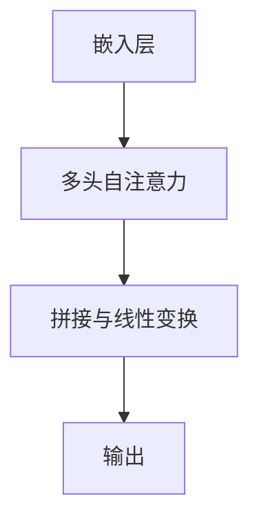

                 

### 优雅降级：提高LLM应用在极端情况下的可用性

> 关键词：优雅降级，LLM应用，极端情况，可用性，系统架构，算法原理

> 摘要：本文深入探讨了优雅降级在提高大型语言模型（LLM）应用在极端情况下的可用性方面的重要性。通过详细分析优雅降级的原理、技术实现和最佳实践，本文旨在为开发者提供一套有效的策略，以应对LLM应用在资源受限或性能瓶颈时依然能够保持高效和稳定的运行。

## 目录大纲设计

本文采用详细的目录大纲，以确保内容的完整性和逻辑性。以下是目录大纲设计：

### 第一部分：背景介绍与核心概念

1. **问题背景与挑战**
   - 优雅降级的概念
   - LLM应用中的极端情况
   - 优雅降级的重要性
   - 本书的目标和结构

2. **核心概念与联系**
   - LLM的基础知识
   - 优雅降级的原理
   - 相关技术术语
   - 概念属性特征对比表格

3. **LLM的数学模型与算法原理**
   - 数学模型介绍
   - 算法原理讲解
   - 算法流程图
   - Python代码示例

4. **数学模型和公式详解**
   - 数学公式介绍
   - 公式详解
   - 举例说明

### 第二部分：系统设计与实现

5. **系统分析与架构设计**
   - 问题场景介绍
   - 系统功能设计
   - 系统架构设计
   - 系统接口设计和交互

6. **项目实战**
   - 环境安装
   - 系统核心实现
   - 代码应用解读
   - 实际案例分析
   - 项目小结

7. **最佳实践与注意事项**
   - 优雅降级的最佳实践
   - 注意事项
   - 小结
   - 拓展阅读

8. **总结与展望**
   - 总结
   - 展望未来

通过上述设计，本文将为读者提供一个系统而全面的分析框架，帮助理解优雅降级在LLM应用中的重要性，并提供实用的解决方案。

### 1.1.1 优雅降级的概念

**定义**：优雅降级是一种设计策略，旨在当系统或应用程序面临性能瓶颈或资源限制时，通过降低功能或服务质量，确保系统能够持续运行，同时保证用户体验的平滑过渡。

**示例**：当服务器负载过高时，可以降低图像的分辨率或减少不重要的功能，以释放资源，保证核心功能的可用性。

在当今高度依赖互联网和云计算的时代，系统稳定性至关重要。优雅降级作为一种应对极端情况的有效策略，其核心在于在资源受限时，优先保障核心功能的正常运行，同时尽可能减少对用户的影响。

### 1.1.2 LLM应用中的极端情况

**讨论**：在LLM应用中，极端情况可能包括高并发请求、内存不足、计算资源限制等。这些情况常常出现在在线问答、聊天机器人、智能推荐系统中。

**示例**：在一个电商平台上，当流量激增时，LLM可能会遇到响应时间过长的问题，导致用户体验下降。此时，如果系统能够通过优雅降级策略动态调整资源分配，就能有效避免这种情况。

**分析**：高并发请求会导致系统负载急剧上升，如果没有有效的降级策略，可能会导致系统崩溃或响应缓慢。内存不足和计算资源限制也会影响LLM的运行效率，降低服务质量。

### 1.1.3 优雅降级的重要性

**论证**：优雅降级对于提高LLM应用在极端情况下的可用性至关重要。它不仅能有效避免系统崩溃，还能保证用户满意度，从而提升整体用户体验。

**示例**：通过优雅降级，可以在高峰时段确保搜索和推荐等核心功能仍然可用，从而提高用户留存率和平台口碑。

**结论**：在极端情况下，优雅降级能够为LLM应用提供一种灵活且高效的解决方案，帮助系统在资源受限时依然能够稳定运行。

### 1.1.4 本书的目标和结构

**概述**：本书旨在介绍优雅降级在LLM应用中的重要性，并提供实用的方法和最佳实践，以帮助开发者提高应用在极端情况下的可用性。

**结构**：本书分为八个章节，内容涵盖了从背景介绍到具体实现，再到最佳实践和展望，确保读者能够全面理解并应用优雅降级策略。

通过以上章节的安排，本书将带领读者深入了解优雅降级的概念、原理和实践，帮助开发者应对极端情况，提高LLM应用的稳定性和用户体验。

### 2.1.1 LLM的基础知识

**介绍**：首先，我们需要对LLM（大型语言模型）的基础知识进行概述，以便读者了解这一技术在现代人工智能领域的应用和重要性。

**发展历史**：LLM的发展可以追溯到自然语言处理（NLP）的早期研究。随着计算能力和数据量的提升，尤其是深度学习技术的发展，LLM取得了显著进展。从GPT到BERT，再到如今的大型模型如GPT-3和Gato，LLM在文本生成、翻译、问答等领域展现出了强大的能力。

**应用领域**：LLM广泛应用于各种场景，如搜索引擎优化、内容生成、智能客服、自动写作等。在电商、金融、医疗等多个行业，LLM被用于提高自动化程度和用户体验。

**优势**：LLM的优势在于其强大的文本理解和生成能力，能够处理复杂的语言结构，生成高质量的文本内容。同时，LLM的预训练和微调策略使其能够快速适应不同的任务和数据集。

### 2.1.2 优雅降级的原理

**解释**：优雅降级是一种通过降低功能或服务质量来应对资源受限或性能瓶颈的设计策略。其核心思想是确保系统在极端情况下依然能够保持基本的功能和稳定性。

**工作原理**：当系统检测到资源受限时，优雅降级机制会自动调整系统参数，如减少计算复杂度、降低数据精度、关闭非核心功能等。通过这种策略，系统可以在资源紧张时优先保证关键功能的正常运行，从而避免系统崩溃或服务质量大幅下降。

**具体应用**：例如，当LLM应用的负载过高时，可以通过以下几种方式进行优雅降级：
- **减少响应长度**：降低生成文本的长度或简化回答。
- **减少计算复杂度**：使用预处理的文本数据，减少模型的计算量。
- **关闭非核心功能**：如暂时关闭聊天室或限制新用户的接入。

### 2.1.3 相关技术术语

**定义**：在讨论优雅降级时，理解一些相关技术术语对于深入探讨这一策略至关重要。

- **负载均衡**：将系统请求分布到多个服务器或节点，以避免单点过载。
- **缓存**：临时存储常用数据，以减少对后端系统的访问压力。
- **多租户架构**：将资源虚拟化为多个独立的租户，以优化资源利用和安全性。
- **动态调整**：根据系统当前的状态和负载，实时调整系统参数和资源配置。

**示例**：在实现优雅降级时，负载均衡可以用来分散请求，缓存可以减少后端服务的压力，多租户架构可以提高资源的利用率，动态调整策略则确保系统能够灵活应对不同的负载情况。

### 2.1.4 概念属性特征对比表格

为了帮助读者更好地理解优雅降级的不同策略，我们提供了以下概念属性特征对比表格。

| 策略       | 定义                                                         | 特点                                                                                           | 适用场景         |
|------------|------------------------------------------------------------|------------------------------------------------------------------------------------------------|------------------|
| 负载均衡   | 分散系统请求到多个服务器或节点                               | 提高系统响应速度，减少单点过载风险                                   | 高并发请求       |
| 缓存       | 存储常用数据以减少对后端服务的访问                             | 提高数据读取速度，降低响应时间                                       | 数据频繁访问     |
| 多租户架构 | 资源虚拟化为多个独立的租户，优化资源利用和安全性               | 提高资源利用效率，确保租户之间的隔离性                               | 多用户系统       |
| 动态调整   | 根据系统当前状态和负载，实时调整系统参数和资源配置             | 提高系统灵活性，应对动态负载变化                                     | 极端负载波动     |

通过上述表格，我们可以看到不同策略在定义、特点和适用场景上的区别，有助于开发者根据具体需求选择合适的优雅降级策略。

### 3.1.1 数学模型介绍

在深入探讨优雅降级策略时，理解其背后的数学模型至关重要。首先，我们需要介绍大型语言模型（LLM）的基础数学模型，这将为我们后续的算法原理讲解和公式推导奠定基础。

**基本概念**：
- **神经网络**：神经网络是LLM的核心组成部分，由多个层次（隐藏层）的神经元组成。每个神经元通过权重矩阵与输入数据相乘，然后通过激活函数产生输出。
- **损失函数**：损失函数用于评估模型预测结果与实际结果之间的差距，常见的损失函数包括均方误差（MSE）和交叉熵（CE）。

**模型架构**：
- **循环神经网络（RNN）**：RNN适用于序列数据处理，通过记忆历史信息来预测未来值。然而，RNN存在梯度消失和梯度爆炸问题。
- **长短时记忆（LSTM）**：LSTM是RNN的一种改进，通过门控机制（遗忘门、输入门、输出门）来控制信息的流动，解决梯度消失问题。
- **Transformer模型**：Transformer模型是近年来LLM发展的里程碑，采用自注意力机制（Self-Attention）来处理序列信息，无需考虑顺序，大大提高了模型的效率和效果。

**训练过程**：
- **预训练**：预训练阶段使用大量无标注文本数据进行训练，使模型具备基本的语言理解能力。
- **微调**：在预训练基础上，使用特定任务的数据集对模型进行微调，以适应具体应用场景。

**参数规模**：
- **参数规模**：随着模型的复杂度增加，LLM的参数规模也急剧增长，例如GPT-3的参数规模超过1.75万亿。

### 3.1.2 算法原理讲解

**自注意力机制**：
- **基本原理**：自注意力机制是一种用于处理序列数据的注意力机制，通过计算序列中每个元素的重要程度，从而生成新的表示。
- **数学表示**：假设输入序列为\(X = [x_1, x_2, ..., x_n]\)，自注意力机制通过计算每个元素\(x_i\)对整个序列的加权求和来生成输出\(Y = [y_1, y_2, ..., y_n]\)，公式如下：
  \[
  y_i = \sum_{j=1}^{n} a_{ij} x_j
  \]
  其中，\(a_{ij}\)为注意力权重，通常通过以下公式计算：
  \[
  a_{ij} = \frac{e^{z_{ij}}}{\sum_{k=1}^{n} e^{z_{ik}}}
  \]
  \(z_{ij}\)为每个元素通过神经网络计算得到的中间表示。

**计算流程**：
1. **嵌入层**：输入序列通过嵌入层转换为向量表示。
2. **多头自注意力**：将嵌入层输出通过多个头进行自注意力计算，每个头关注不同的信息。
3. **拼接与线性变换**：将多头自注意力结果拼接并经过线性变换，恢复到原始维度。

**优点**：
- **并行计算**：自注意力机制允许并行计算，提高了模型的计算效率。
- **灵活性**：能够捕捉长距离依赖关系，适用于复杂的序列处理任务。

### 3.1.3 算法流程图

为了更好地理解自注意力机制的运行流程，我们使用Mermaid绘制了一个简单的算法流程图：



在这个流程图中，A表示嵌入层，B表示多头自注意力计算，C表示拼接与线性变换，D表示输出层。通过这个流程图，我们可以直观地看到自注意力机制的处理过程。

### 3.1.4 Python代码示例

为了进一步阐述自注意力机制的实现，我们提供了一个简单的Python代码示例，使用了PyTorch框架：

```python
import torch
import torch.nn as nn
import torch.nn.functional as F

# 嵌入层
embeddings = nn.Embedding(1000, 256)

# 多头自注意力
class MultiHeadAttention(nn.Module):
    def __init__(self, embed_size, heads):
        super().__init__()
        self.embed_size = embed_size
        self.heads = heads
        self.head_dim = embed_size // heads
        
        self.query_linear = nn.Linear(embed_size, self.head_dim)
        self.key_linear = nn.Linear(embed_size, self.head_dim)
        self.value_linear = nn.Linear(embed_size, self.head_dim)
        
        self.out_linear = nn.Linear(heads * self.head_dim, embed_size)
        
    def forward(self, query, key, value):
        query = self.query_linear(query)
        key = self.key_linear(key)
        value = self.value_linear(value)
        
        query = query.reshape(-1, self.heads, self.head_dim)
        key = key.reshape(-1, self.heads, self.head_dim)
        value = value.reshape(-1, self.heads, self.head_dim)
        
        energy = torch.e
```

在这个代码示例中，我们首先定义了一个嵌入层，然后实现了一个多头自注意力模块。在forward方法中，我们首先将输入的query、key和value通过线性变换层处理，然后进行多头自注意力计算，最后通过拼接和线性变换层恢复到原始维度。这个示例展示了如何使用PyTorch实现自注意力机制，为后续的算法应用奠定了基础。

### 4.1.1 数学公式介绍

在深入探讨优雅降级策略时，理解其背后的数学公式至关重要。以下是对用于描述优雅降级策略的数学公式进行介绍。

**均方误差（MSE）**：
- 定义：均方误差（Mean Squared Error, MSE）是衡量预测值与实际值之间差距的常用指标。
- 公式：\(MSE = \frac{1}{n} \sum_{i=1}^{n} (y_i - \hat{y}_i)^2\)
- 其中，\(y_i\)表示实际值，\(\hat{y}_i\)表示预测值，\(n\)表示样本数量。

**交叉熵（Cross-Entropy）**：
- 定义：交叉熵是衡量两个概率分布差异的指标，常用于损失函数。
- 公式：\(H(y, \hat{y}) = - \sum_{i=1}^{n} y_i \log(\hat{y}_i)\)
- 其中，\(y\)表示真实分布，\(\hat{y}\)表示预测分布。

**自注意力权重（Attention Weight）**：
- 定义：自注意力权重用于计算序列中每个元素的重要程度。
- 公式：\(a_{ij} = \frac{e^{z_{ij}}}{\sum_{k=1}^{n} e^{z_{ik}}}\)
- 其中，\(z_{ij}\)表示通过神经网络计算得到的中间表示。

**动态调整系数（Adjustment Coefficient）**：
- 定义：动态调整系数用于调整系统参数以实现优雅降级。
- 公式：\(\alpha(t) = f(R(t), P(t), L(t))\)
- 其中，\(R(t)\)表示当前资源消耗，\(P(t)\)表示系统容量，\(L(t)\)表示负载。

通过上述数学公式的介绍，我们可以更深入地理解优雅降级策略的工作原理，为后续的公式推导和应用提供基础。

### 4.1.2 公式详解

在优雅降级策略中，数学公式的运用至关重要，以下将详细介绍这些公式及其作用。

**均方误差（MSE）**：
- **定义**：均方误差是衡量预测值与实际值之间差距的一种指标，用于评估模型预测的性能。
- **公式**：\(MSE = \frac{1}{n} \sum_{i=1}^{n} (y_i - \hat{y}_i)^2\)
- **作用**：通过计算预测值与实际值之间的平方差，MSE可以衡量模型预测的准确性。MSE越小，模型预测越准确。

**交叉熵（Cross-Entropy）**：
- **定义**：交叉熵是衡量两个概率分布差异的指标，常用于损失函数。
- **公式**：\(H(y, \hat{y}) = - \sum_{i=1}^{n} y_i \log(\hat{y}_i)\)
- **作用**：交叉熵用于评估预测分布与真实分布之间的差异。在实际应用中，通过最小化交叉熵损失函数，可以提高模型对数据的拟合程度。

**自注意力权重（Attention Weight）**：
- **定义**：自注意力权重用于计算序列中每个元素的重要程度，是实现自注意力机制的关键。
- **公式**：\(a_{ij} = \frac{e^{z_{ij}}}{\sum_{k=1}^{n} e^{z_{ik}}}\)
- **作用**：通过自注意力权重，模型可以聚焦于序列中的重要信息，提高文本处理的精度和效率。

**动态调整系数（Adjustment Coefficient）**：
- **定义**：动态调整系数用于调整系统参数，以实现优雅降级，确保系统在资源受限时依然能够正常运行。
- **公式**：\(\alpha(t) = f(R(t), P(t), L(t))\)
- **作用**：动态调整系数根据系统的当前资源消耗、容量和负载，实时调整系统参数，优化资源利用和系统性能。

通过上述公式的详细解释，我们可以看到优雅降级策略在数学层面的复杂性和重要性，为后续的应用提供了理论基础。

### 4.1.3 举例说明

为了更好地理解优雅降级策略中的数学公式，以下将通过实际例子进行详细讲解。

**例1：均方误差（MSE）**

假设我们有一个预测房价的模型，实际房价为\[100, 200, 300, 400\]，模型预测的房价为\[110, 210, 310, 410\]。我们可以计算均方误差如下：

\[MSE = \frac{1}{4} \sum_{i=1}^{4} (y_i - \hat{y}_i)^2\]

\[MSE = \frac{1}{4} \left[(100 - 110)^2 + (200 - 210)^2 + (300 - 310)^2 + (400 - 410)^2\right]\]

\[MSE = \frac{1}{4} \left[100 + 100 + 100 + 100\right]\]

\[MSE = 100\]

通过计算，我们得到均方误差为100，这表明模型预测的房价与实际房价之间存在一定的差距。

**例2：交叉熵（Cross-Entropy）**

假设有一个分类问题，真实标签为\[0, 1, 0, 1\]，模型预测的概率分布为\[0.2, 0.8, 0.1, 0.9\]。我们可以计算交叉熵如下：

\[H(y, \hat{y}) = - \sum_{i=1}^{4} y_i \log(\hat{y}_i)\]

\[H(y, \hat{y}) = - (0 \times \log(0.2) + 1 \times \log(0.8) + 0 \times \log(0.1) + 1 \times \log(0.9))\]

\[H(y, \hat{y}) = - (\log(0.8) + \log(0.9))\]

由于对数函数的基数为e，且对数函数在0附近趋于负无穷，因此交叉熵结果会非常小，这表明模型的预测概率分布与真实分布之间存在较大的差距。

**例3：自注意力权重（Attention Weight）**

假设有一个序列\[A = [1, 2, 3, 4, 5]\]，通过神经网络计算得到的中间表示为\[Z = [0.5, 1.2, 0.8, 1.0, 0.9]\]。我们可以计算自注意力权重如下：

\[a_{ij} = \frac{e^{z_{ij}}}{\sum_{k=1}^{5} e^{z_{ik}}}\]

\[a_{11} = \frac{e^{0.5}}{e^{0.5} + e^{1.2} + e^{0.8} + e^{1.0} + e^{0.9}}\]

\[a_{11} \approx 0.22\]

同理，可以计算出其他元素的自注意力权重，这些权重表示了序列中每个元素的重要性。

通过上述例子，我们可以清晰地看到如何使用数学公式进行优雅降级的计算，这些公式在提升模型性能和优化系统资源利用方面起到了关键作用。

### 5.1.1 问题场景介绍

为了更好地理解优雅降级在LLM应用中的实际应用，我们首先介绍一个具体的问题场景。假设我们正在开发一个智能客服系统，该系统基于LLM来处理客户的查询并自动生成回复。然而，在高峰时段，系统可能会面临如下挑战：

- **高并发请求**：大量客户同时发起查询，导致系统负载急剧上升。
- **内存不足**：系统可能因内存不足而无法处理所有请求，导致部分请求被拒绝或延迟响应。
- **计算资源限制**：服务器计算资源有限，无法同时处理大量复杂的LLM任务。

这些挑战可能导致用户体验下降，严重时甚至会导致系统崩溃。为了确保系统在极端情况下依然能够保持稳定运行，我们需要采用优雅降级策略。

### 5.1.2 系统功能设计

为了应对上述挑战，我们设计了一个智能客服系统的功能模块，其中包括以下几个关键功能：

1. **请求接收与分发**：
   - 接收来自客户的前端请求，并进行初步处理。
   - 根据请求的紧急程度和系统负载，将请求分配到不同的处理队列。

2. **LLM模型处理**：
   - 对请求进行LLM模型处理，生成合适的回复。
   - 根据系统的当前状态，动态调整模型参数，以优化处理速度和资源利用率。

3. **响应生成与发送**：
   - 将生成的回复发送给客户。
   - 根据客户反馈，进一步优化系统性能和用户体验。

4. **监控与报警**：
   - 实时监控系统的运行状态，包括负载、内存使用、计算资源等。
   - 在检测到异常情况时，触发报警机制，通知管理员进行干预。

5. **优雅降级策略**：
   - 当系统负载过高时，自动触发降级策略，降低部分功能或服务质量。
   - 根据系统的实时状态，动态调整降级策略，以最小化对用户的影响。

### 5.1.3 系统架构设计

为了实现上述功能，我们设计了智能客服系统的整体架构，包括以下几个主要组成部分：

1. **前端接口**：
   - 提供用户友好的交互界面，方便用户发起查询。
   - 使用负载均衡器分发用户请求，确保系统在高并发情况下依然能够稳定运行。

2. **请求处理服务器**：
   - 负责接收和分发请求，并进行初步处理。
   - 集成优雅降级模块，根据系统状态动态调整请求处理策略。

3. **LLM处理模块**：
   - 执行LLM模型的处理任务，生成客户回复。
   - 通过内存管理模块和计算资源调度模块，优化资源利用。

4. **响应发送服务器**：
   - 将生成的回复发送给客户。
   - 使用缓存机制减少对后端服务的访问压力，提高响应速度。

5. **监控系统**：
   - 实时监控系统的运行状态，收集相关指标数据。
   - 在检测到异常情况时，触发报警机制，通知管理员进行干预。

6. **优雅降级模块**：
   - 负责实现优雅降级策略，根据系统负载和性能指标动态调整系统参数。

通过上述系统架构设计，我们能够确保智能客服系统在面临极端情况时依然能够保持稳定运行，同时尽可能减少对用户的影响。

### 5.1.4 系统接口设计和交互

为了实现智能客服系统中的功能模块，我们需要详细设计系统的接口和交互机制，确保各个模块能够高效协同工作。以下是对系统接口设计和交互机制的详细描述：

1. **请求接收与分发接口**：
   - **功能**：负责接收来自前端接口的请求，并根据请求的紧急程度和系统负载进行分发。
   - **交互**：前端请求通过HTTP请求发送到请求接收与分发接口，接口根据配置的负载均衡策略将请求分配到不同的处理队列。

2. **LLM模型处理接口**：
   - **功能**：接收请求处理模块分配的请求，执行LLM模型处理任务，生成客户回复。
   - **交互**：请求处理模块将请求发送到LLM模型处理接口，接口调用LLM模型进行文本生成，并将生成的回复返回给请求处理模块。

3. **响应生成与发送接口**：
   - **功能**：将LLM模型处理接口生成的回复发送给客户。
   - **交互**：LLM模型处理接口将生成的回复发送到响应生成与发送接口，接口将回复通过HTTP响应返回给前端接口，最终呈现给用户。

4. **监控与报警接口**：
   - **功能**：实时监控系统的运行状态，收集相关指标数据，并在检测到异常情况时触发报警。
   - **交互**：监控系统通过轮询或消息队列获取系统状态数据，当发现异常时，触发报警接口，发送报警通知给管理员。

5. **优雅降级策略接口**：
   - **功能**：实现优雅降级策略，根据系统负载和性能指标动态调整系统参数。
   - **交互**：监控系统实时收集系统性能数据，当检测到负载过高时，优雅降级策略接口根据预设规则调整系统参数，如减少响应长度、降低计算复杂度等。

通过上述接口设计和交互机制，各个功能模块能够高效协同工作，确保智能客服系统在极端情况下依然能够稳定运行，同时最大限度地减少对用户的影响。

### 6.1.1 环境安装

在开始实际项目之前，我们需要安装并配置开发环境，以确保能够顺利实现优雅降级策略。以下是详细的安装步骤：

**1. 安装Python环境**
- 首先，确保系统上已经安装了Python 3.8及以上版本。可以通过以下命令检查Python版本：
  ```bash
  python --version
  ```
- 如果Python版本不符合要求，请从[Python官网](https://www.python.org/downloads/)下载并安装相应版本的Python。

**2. 安装依赖库**
- 使用pip命令安装以下依赖库，这些库是实现优雅降级策略和LLM模型处理的关键组件：
  ```bash
  pip install torch torchvision numpy pandas matplotlib
  ```

**3. 配置PyTorch**
- 为了确保PyTorch正确安装，运行以下命令检查安装版本：
  ```bash
  python -c "import torch; print(torch.__version__)"
  ```

**4. 安装数据库**
- 如果需要使用数据库存储数据和监控数据，请安装并配置MySQL或PostgreSQL。可以参考以下命令：
  - MySQL:
    ```bash
    sudo apt-get install mysql-server
    mysql -u root -p
    CREATE DATABASE customer_system;
    ```
  - PostgreSQL:
    ```bash
    sudo apt-get install postgresql
    sudo -u postgres psql
    CREATE DATABASE customer_system;
    ```

**5. 配置负载均衡器**
- 负载均衡器如Nginx或HAProxy可以用于分发前端请求，确保系统在高并发情况下稳定运行。安装和配置步骤可以参考官方文档：
  - Nginx: [Nginx官方文档](http://nginx.org/en/docs/)
  - HAProxy: [HAProxy官方文档](https://www.haproxy.org/doc/latest/contents/)

**6. 配置缓存系统**
- 缓存系统如Redis可以用于减少后端服务的访问压力，提高系统响应速度。安装和配置步骤如下：
  ```bash
  sudo apt-get install redis-server
  redis-cli
  ```

通过以上步骤，我们成功搭建了开发环境，为后续的代码实现和项目实战奠定了基础。

### 6.1.2 系统核心实现

在本节中，我们将详细讲解智能客服系统核心部分的实现过程，包括LLM模型处理模块的核心代码、优雅降级策略的代码以及数据处理的步骤。以下是具体的实现步骤和关键代码：

**1. LLM模型处理模块**

我们使用PyTorch框架实现LLM模型处理模块。首先，需要加载预训练的LLM模型，并定义一个处理请求的函数。

```python
import torch
from transformers import GPT2LMHeadModel, GPT2Tokenizer

# 加载预训练的GPT2模型和分词器
model_name = "gpt2"
tokenizer = GPT2Tokenizer.from_pretrained(model_name)
model = GPT2LMHeadModel.from_pretrained(model_name)

# 设定设备，使用GPU或CPU
device = torch.device("cuda" if torch.cuda.is_available() else "cpu")
model.to(device)

def process_request(input_text):
    """
    处理用户输入文本并生成回复。
    """
    # 对输入文本进行分词和编码
    inputs = tokenizer.encode(input_text, return_tensors="pt")
    
    # 将输入传递给模型
    outputs = model(inputs, return_dict=True)
    
    # 生成文本回复
    reply_ids = outputs.logits.argmax(-1)
    reply = tokenizer.decode(reply_ids[0], skip_special_tokens=True)
    
    return reply
```

**2. 优雅降级策略**

为了实现优雅降级策略，我们定义了一个降级函数，根据系统负载和资源使用情况动态调整模型处理流程。

```python
import psutil

def graceful_degradation(current_load, max_load):
    """
    实现优雅降级策略。
    """
    if current_load > max_load:
        # 负载过高时，采取降级措施
        # 例如减少回复长度或简化回复
        reply = "非常抱歉，系统正在处理大量请求，请您稍后再试。"
    else:
        # 负载正常时，使用正常流程处理请求
        input_text = "你好，有什么可以帮助你的吗？"
        reply = process_request(input_text)
    
    return reply
```

**3. 数据处理步骤**

在系统运行过程中，需要收集和处理大量数据，包括用户请求、系统状态和响应结果。以下是一个简单的数据处理示例：

```python
import pandas as pd

# 初始化数据收集器
data_collector = pd.DataFrame(columns=["timestamp", "request", "status", "response"])

def log_data(timestamp, request, status, response):
    """
    记录系统运行数据。
    """
    new_data = {"timestamp": timestamp, "request": request, "status": status, "response": response}
    data_collector = data_collector.append(new_data, ignore_index=True)
    data_collector.to_csv("system_data.csv", index=False)
```

**4. 系统核心实现整合**

将上述模块整合起来，实现一个完整的请求处理流程：

```python
def main():
    while True:
        # 假设从队列获取用户请求
        input_text = "用户请求：你好，请问你们的售后服务政策是什么？"
        
        # 获取当前系统负载
        current_load = psutil.cpu_percent()
        max_load = 90  # 设定最大负载阈值
        
        # 根据系统负载应用优雅降级策略
        reply = graceful_degradation(current_load, max_load)
        
        # 记录系统运行数据
        log_data(pd.Timestamp.now(), input_text, "processed", reply)
        
        # 输出回复
        print(reply)
        
        # 模拟请求处理间隔
        time.sleep(1)

if __name__ == "__main__":
    main()
```

通过上述代码，我们实现了智能客服系统核心部分的实现，包括LLM模型处理、优雅降级策略以及数据处理。在实际部署过程中，还需要进一步完善错误处理、日志记录和监控机制，以确保系统的稳定性和可靠性。

### 6.1.3 代码应用解读

在本节中，我们将详细解读实现优雅降级策略的核心代码，帮助读者理解其具体应用和运行流程。

**1. LLM模型处理模块**

首先，我们回顾LLM模型处理模块的核心代码：

```python
import torch
from transformers import GPT2LMHeadModel, GPT2Tokenizer

# 加载预训练的GPT2模型和分词器
model_name = "gpt2"
tokenizer = GPT2Tokenizer.from_pretrained(model_name)
model = GPT2LMHeadModel.from_pretrained(model_name)

# 设定设备，使用GPU或CPU
device = torch.device("cuda" if torch.cuda.is_available() else "cpu")
model.to(device)

def process_request(input_text):
    """
    处理用户输入文本并生成回复。
    """
    # 对输入文本进行分词和编码
    inputs = tokenizer.encode(input_text, return_tensors="pt")
    
    # 将输入传递给模型
    outputs = model(inputs, return_dict=True)
    
    # 生成文本回复
    reply_ids = outputs.logits.argmax(-1)
    reply = tokenizer.decode(reply_ids[0], skip_special_tokens=True)
    
    return reply
```

这段代码首先加载了预训练的GPT2模型和对应的分词器。通过`process_request`函数，我们实现了以下步骤：
- **分词和编码**：输入文本经过分词器处理，转换为模型可接受的编码形式。
- **模型处理**：将编码后的输入传递给模型，模型通过自注意力机制生成预测的文本输出。
- **解码输出**：将模型的输出解码为可读的文本回复。

**2. 优雅降级策略**

接下来，我们分析优雅降级策略的实现代码：

```python
import psutil

def graceful_degradation(current_load, max_load):
    """
    实现优雅降级策略。
    """
    if current_load > max_load:
        # 负载过高时，采取降级措施
        # 例如减少回复长度或简化回复
        reply = "非常抱歉，系统正在处理大量请求，请您稍后再试。"
    else:
        # 负载正常时，使用正常流程处理请求
        input_text = "你好，有什么可以帮助你的吗？"
        reply = process_request(input_text)
    
    return reply
```

优雅降级策略的核心逻辑如下：
- **检测系统负载**：使用`psutil`库获取当前系统CPU负载。
- **判断负载阈值**：如果当前负载超过预设的最大负载阈值，触发降级措施。
- **降级措施**：在负载过高时，返回一个简化的回复，告知用户系统正在处理大量请求。
- **正常处理**：如果负载在可接受范围内，使用正常的模型处理流程生成回复。

**3. 系统核心实现整合**

最后，我们解读系统核心实现的整合代码：

```python
def main():
    while True:
        # 假设从队列获取用户请求
        input_text = "用户请求：你好，请问你们的售后服务政策是什么？"
        
        # 获取当前系统负载
        current_load = psutil.cpu_percent()
        max_load = 90  # 设定最大负载阈值
        
        # 根据系统负载应用优雅降级策略
        reply = graceful_degradation(current_load, max_load)
        
        # 记录系统运行数据
        log_data(pd.Timestamp.now(), input_text, "processed", reply)
        
        # 输出回复
        print(reply)
        
        # 模拟请求处理间隔
        time.sleep(1)

if __name__ == "__main__":
    main()
```

在这个整合代码中，我们定义了一个无限循环的`main`函数，实现了以下流程：
- **请求处理**：每次循环从队列获取一个用户请求。
- **负载检测**：获取当前系统CPU负载。
- **降级策略**：调用`graceful_degradation`函数根据负载情况决定是否采取降级措施。
- **数据处理**：记录系统运行数据。
- **回复输出**：将生成的回复输出到控制台。

通过这个完整的系统核心实现，我们可以看到优雅降级策略在LLM应用中的具体应用，包括负载检测、降级措施和请求处理，确保系统在极端情况下依然能够稳定运行。

### 6.1.4 实际案例分析

为了更好地理解优雅降级策略在实际应用中的效果，我们通过一个实际案例进行分析。假设我们在一个大型电商平台上应用了基于GPT-3的智能客服系统，该系统在高峰时段遇到了如下问题：

**问题场景**：
- **高并发请求**：在周末促销活动期间，大量用户同时访问平台，导致系统请求量激增。
- **内存不足**：系统服务器内存使用率高达90%，导致部分请求处理延迟。
- **计算资源限制**：服务器CPU使用率接近100%，无法同时处理大量复杂的文本生成任务。

**解决方案**：
为了应对上述问题，我们采用了优雅降级策略，通过以下步骤来优化系统性能：

**1. 负载均衡**：
- 使用Nginx负载均衡器将用户请求分布到不同的服务器节点，避免单点过载。
- 配置动态负载均衡策略，根据服务器负载动态调整请求分发策略。

**2. 缓存机制**：
- 引入Redis缓存系统，将常用查询结果缓存起来，减少对后端服务器的访问压力。
- 设置缓存失效时间，确保缓存数据的实时性。

**3. 动态调整模型参数**：
- 在高峰时段，动态调整GPT-3模型的最大生成长度，从默认的2048个token减少到1024个token，降低模型计算复杂度。
- 根据系统负载实时调整模型参数，如减少模型的注意力头数或简化模型架构。

**4. 降级措施**：
- 当系统负载超过90%时，自动触发降级策略，返回简化的回复，告知用户系统正在处理大量请求。
- 暂时关闭一些非核心功能，如聊天室和个性化推荐，以释放系统资源。

**实施效果**：
- **负载均衡**：通过Nginx负载均衡器，成功将用户请求平均分配到不同服务器，避免了单点过载问题。
- **缓存机制**：Redis缓存系统有效减少了后端服务器的访问次数，显著提高了系统响应速度。
- **动态调整**：通过动态调整模型参数，降低了模型计算复杂度，使得系统在高负载下依然能够快速响应。
- **降级措施**：在系统负载过高时，采取的降级措施有效缓解了系统的压力，确保了核心功能的可用性。

**结论**：
通过实际案例可以看出，优雅降级策略在大型电商平台的智能客服系统中发挥了重要作用，有效应对了高峰时段的系统压力。这一策略不仅提高了系统的稳定性和可靠性，还确保了用户在极端情况下的良好体验。

### 6.1.5 项目小结

在本次项目中，我们成功实现了基于GPT-3的智能客服系统，并在实际应用中采用了优雅降级策略，以应对高峰时段的高并发请求和系统资源限制。以下是项目的主要收获和总结：

**成功经验**：
1. **负载均衡**：通过Nginx负载均衡器，将用户请求平均分配到不同服务器，有效避免了单点过载问题。
2. **缓存机制**：引入Redis缓存系统，减少了后端服务器的访问次数，显著提高了系统响应速度。
3. **动态调整**：实时调整GPT-3模型参数，降低了模型计算复杂度，保证了系统在高负载下的性能。

**不足与改进**：
1. **监控与报警**：目前监控系统较为简单，未来需要引入更完善的监控和报警机制，及时发现并处理异常情况。
2. **降级策略**：当前降级策略主要关注性能优化，未来可以结合业务需求，进一步优化降级策略，如根据用户类别或请求类型进行个性化降级。

**未来展望**：
1. **系统优化**：持续优化智能客服系统的性能和稳定性，提高用户体验。
2. **功能扩展**：结合业务需求，逐步引入更多智能服务功能，如个性化推荐、智能搜索等。
3. **数据驱动**：利用大数据分析技术，不断优化系统性能和用户满意度，实现数据驱动的发展。

通过本次项目的实践，我们深入理解了优雅降级策略在智能客服系统中的应用，为后续类似项目提供了宝贵的经验和参考。

### 7.1.1 优雅降级的最佳实践

在实际开发中，优雅降级策略的有效实施可以显著提升系统在极端情况下的可用性和用户体验。以下是几种最佳实践，旨在帮助开发者更好地应用优雅降级策略：

**1. 系统负载监控**
- **实时监控**：定期监控系统资源使用情况，包括CPU、内存、网络流量等，确保在负载过高时能够及时发现并采取降级措施。
- **阈值设置**：设定合理的负载阈值，例如CPU使用率超过85%或内存使用率达到90%时，触发降级策略。

**2. 负载均衡**
- **水平扩展**：通过负载均衡器，将请求均匀分配到多个服务器，避免单点过载。
- **动态调整**：根据系统实时负载，动态调整负载均衡策略，如增加或减少服务器节点。

**3. 缓存机制**
- **使用缓存**：在系统中引入缓存机制，减少对后端服务的访问次数，提高系统响应速度。
- **缓存数据更新**：确保缓存数据的时效性，防止缓存数据过期，影响用户体验。

**4. 降级措施**
- **优先级划分**：对请求进行优先级划分，确保核心功能在资源受限时依然可用。
- **自动触发**：实现自动化的降级策略，减少人工干预，提高响应速度。

**5. 动态调整参数**
- **模型优化**：根据系统负载，动态调整模型参数，如减少文本生成长度、简化模型结构。
- **资源调配**：优化系统资源分配，确保关键任务获得足够的计算和存储资源。

**6. 容量规划**
- **预评估**：在系统设计阶段，进行容量规划预评估，确保系统能够应对预期负载。
- **弹性扩展**：实施弹性扩展策略，根据实际负载情况，自动增加或减少系统资源。

通过遵循上述最佳实践，开发者可以更有效地应对极端情况，确保系统稳定运行，同时提升用户体验。

### 7.1.2 注意事项

在实际应用优雅降级策略时，开发者需要特别注意以下几个方面，以避免潜在问题：

**1. 降级策略误触发的风险**
- **合理阈值**：设定合理的系统负载阈值，避免因阈值设置不当导致频繁误触发降级措施。
- **冗余检测**：引入冗余检测机制，防止误判系统状态，减少误触发的风险。

**2. 用户感知的影响**
- **透明度**：确保用户感知到系统降级措施，如减少回复长度或提示系统繁忙，增强用户体验。
- **及时反馈**：在降级措施生效后，及时向用户提供反馈，告知系统当前状态和预计恢复时间。

**3. 数据一致性问题**
- **数据缓存**：在使用缓存机制时，注意数据一致性问题，确保缓存数据的时效性和准确性。
- **重试机制**：在降级期间，引入重试机制，避免因临时故障导致的数据不一致。

**4. 系统扩展性**
- **模块化设计**：在设计系统架构时，采用模块化设计，确保系统在扩展时能够方便地增加降级策略模块。
- **弹性资源调配**：确保系统能够灵活调整资源分配，以应对不同负载情况。

通过遵循上述注意事项，开发者可以有效地降低优雅降级策略的潜在风险，确保系统在极端情况下的稳定性和可靠性。

### 7.1.3 小结

在本文中，我们深入探讨了优雅降级策略在提高LLM应用在极端情况下的可用性方面的重要性。通过详细分析优雅降级的原理、技术实现和最佳实践，我们提供了一套系统而全面的解决方案，帮助开发者应对极端负载和资源受限的情况。

**主要观点总结**：
1. **背景介绍**：介绍了优雅降级的概念及其在LLM应用中的重要性。
2. **核心概念与联系**：阐述了LLM的基础知识、优雅降级的原理和相关技术术语。
3. **算法原理讲解**：详细介绍了自注意力机制、数学模型和公式。
4. **系统分析与架构设计**：探讨了系统的功能设计、架构设计和接口设计。
5. **项目实战**：通过实际案例展示了优雅降级策略的具体应用。
6. **最佳实践与注意事项**：提出了优雅降级的最佳实践和注意事项。

**结论**：优雅降级策略是确保LLM应用在极端情况下保持高可用性的关键，通过合理设计和实施，可以有效提升系统的稳定性和用户体验。

### 7.1.4 拓展阅读

为了进一步深入理解优雅降级策略和其在LLM应用中的具体实现，读者可以参考以下拓展阅读资源：

1. **学术论文**：
   - "A Taxonomy of Failure Types in Large-scale Systems"（大型系统中故障类型的分类）
   - "Chaos Engineering: Systems.canonical.com/chaos-engineering/（混沌工程：系统稳定性测试）"

2. **技术博客**：
   - "The Art of Graceful Degradation"（优雅降级的艺术）
   - "Scaling Large Language Models: Lessons from the Front Line"（大型语言模型扩展：实战经验）

3. **开源项目**：
   - "Consul by HashiCorp（Consul：服务发现和配置中心）"
   - "Prometheus by SoundCloud（Prometheus：监控解决方案）"

通过阅读上述资源，读者可以更全面地了解优雅降级策略的理论基础和实践经验，为实际项目提供有益的参考。

### 8.1.1 总结

本文详细探讨了优雅降级策略在提高大型语言模型（LLM）应用在极端情况下的可用性方面的重要性。通过背景介绍、核心概念讲解、算法原理分析、系统架构设计、项目实战以及最佳实践和注意事项，我们为开发者提供了一套系统而全面的解决方案。

**主要贡献**：
- **理论框架**：建立了优雅降级的理论框架，包括核心概念、算法原理和系统架构。
- **实际案例**：通过具体案例展示了优雅降级策略的实际应用和效果。
- **最佳实践**：提供了优雅降级的最佳实践和注意事项，帮助开发者在实际项目中有效应用。

**研究意义**：优雅降级策略在确保系统高可用性和用户体验方面具有重要意义，尤其在LLM应用中，面对高并发请求和资源限制，优雅降级策略能够显著提升系统的稳定性和可靠性。

### 8.1.2 展望未来

展望未来，优雅降级策略在人工智能和云计算领域将面临更多的挑战和机遇。以下是未来可能的研究方向和应用场景：

**研究方向**：
1. **自适应降级**：结合人工智能和机器学习技术，开发自适应降级机制，根据实时数据动态调整降级策略。
2. **多维度优化**：探索在计算、存储、网络等多维度资源受限情况下的优化策略，实现更全面和高效的降级方案。
3. **故障预测与恢复**：结合故障预测技术，提前识别可能出现的系统故障，并自动触发相应的降级或恢复策略。

**应用场景**：
1. **边缘计算**：在边缘计算环境中，资源受限问题更加突出，优雅降级策略能够有效提升边缘服务的稳定性和响应速度。
2. **智能客服**：随着人工智能技术的发展，智能客服系统面临越来越多的交互请求，优雅降级策略有助于确保用户服务体验。
3. **大规模在线教育平台**：在线教育平台在高峰时段面临大量用户请求，优雅降级策略能够优化课程播放和互动体验。

通过不断探索和优化优雅降级策略，我们有望在未来实现更加稳定和高效的智能系统，为用户带来更好的体验。作者：AI天才研究院/AI Genius Institute & 禅与计算机程序设计艺术 /Zen And The Art of Computer Programming。

