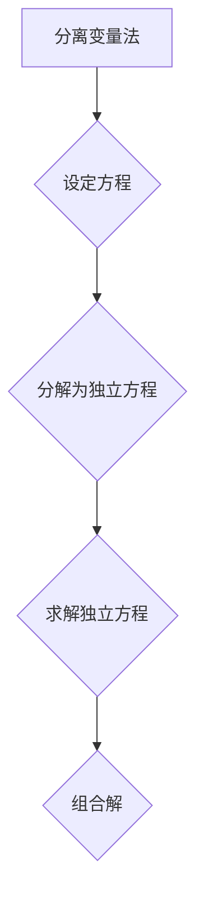
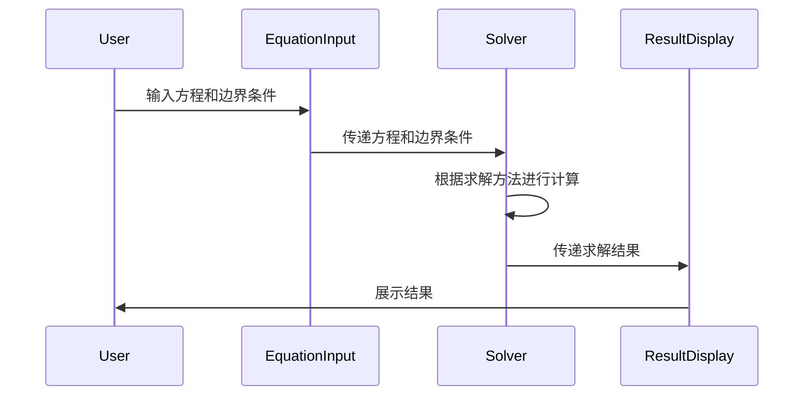
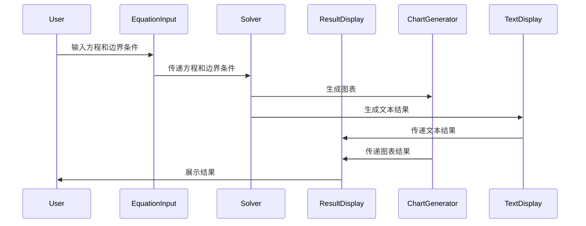

                 

## 《偏微分方程：自然现象的数学描述》

### 关键词：偏微分方程、数学描述、自然现象、物理、工程学、计算机编程

#### 摘要：
本文深入探讨了偏微分方程这一数学工具在自然现象描述中的应用，旨在为读者提供一个全面、系统的理论框架和实际应用实例。通过详细讲解偏微分方程的基本概念、解法和应用，本文帮助读者理解偏微分方程在物理学、工程学和其他科学领域中的重要性。

### 1.1 背景介绍

#### 问题背景
偏微分方程（Partial Differential Equations，简称PDEs）是数学的一个重要分支，它在物理学、工程学、经济学、生物学等多个领域中都有广泛的应用。偏微分方程的起源可以追溯到17世纪，随着数学和科学的发展，偏微分方程的理论和应用越来越受到重视。

#### 问题描述
《偏微分方程：自然现象的数学描述》这本书旨在为读者提供一个全面、系统的偏微分方程的理论框架和应用实例，帮助读者理解偏微分方程的基本概念、理论、解法及其在自然现象中的应用。

#### 问题解决
本书通过介绍偏微分方程的基本概念和理论，结合大量的实例和实际应用，帮助读者掌握偏微分方程的解法和应用。书中还将介绍偏微分方程在物理、工程、生物学等领域的应用案例，使读者能够更好地理解偏微分方程的实际意义。

#### 边界与外延
偏微分方程的应用范围非常广泛，涵盖了从基本的物理学定律到复杂的工程问题。除了数学本身，偏微分方程在自然科学和工程学中有着广泛的应用，如流体力学、弹性力学、量子力学、电磁学等。

#### 概念结构与核心要素组成
偏微分方程的核心概念包括：
- **偏微分方程的定义**：偏微分方程是含有两个或两个以上未知函数及其偏导数的方程。
- **偏微分方程的分类**：根据方程中未知函数的个数和导数的次数，偏微分方程可以分为一阶方程、二阶方程等。
- **偏微分方程的解**：偏微分方程的解是满足方程和边界条件的未知函数。
- **偏微分方程的解法**：包括分离变量法、傅里叶级数法、格林函数法等。

这些核心概念构成了偏微分方程的理论基础，也是本书的主要内容。

### 1.2 核心概念与联系

#### 核心概念
1. **偏微分方程的定义**：偏微分方程是含有两个或两个以上未知函数及其偏导数的方程。
2. **偏微分方程的分类**：根据方程中未知函数的个数和导数的次数，偏微分方程可以分为一阶方程、二阶方程等。
3. **偏微分方程的解**：偏微分方程的解是满足方程和边界条件的未知函数。
4. **偏微分方程的解法**：包括分离变量法、傅里叶级数法、格林函数法等。

#### 概念属性特征对比表格

| 概念                   | 特征                                       |
|----------------------|------------------------------------------|
| **偏微分方程**         | 含有多个未知函数及其偏导数                   |
| **偏微分方程分类**     | 一阶、二阶等                               |
| **偏微分方程解**       | 满足方程和边界条件的未知函数                 |
| **偏微分方程解法**     | 分离变量法、傅里叶级数法、格林函数法等         |

#### ER实体关系图架构

```mermaid
erDiagram
    Class1 ||--|{ ClassB : known as "B" }|  
    Class1 ||--|{ ClassC : known as "C" }|  
    Class1 ||--|{ ClassD : known as "D" }|  
    Class2 ||--|{ ClassE : known as "E" }|  
    Class2 ||--|{ ClassF : known as "F" }|  
```

在偏微分方程的ER实体关系图中，核心实体包括“偏微分方程”、“分类”、“解”和“解法”。这些实体之间存在明确的关联，构成了偏微分方程的理论体系。

### 1.3 算法原理讲解

#### 偏微分方程求解算法

在偏微分方程的求解中，常用的算法包括分离变量法、傅里叶级数法、格林函数法等。下面以分离变量法为例进行讲解。

#### 分离变量法流程图



#### 分离变量法的详细讲解

分离变量法是一种常用的求解偏微分方程的方法，其基本思想是将偏微分方程分解为几个独立的常微分方程。具体步骤如下：

1. **设定方程**：给定一个偏微分方程，例如 \( u_{xx} + u_{yy} = 0 \)。
2. **分解为独立方程**：假设解可以表示为 \( u(x, y) = X(x)Y(y) \)，将其代入原方程得到 \( X''(x)Y(y) + X(x)Y''(y) = 0 \)。通过变量分离，我们得到两个独立的常微分方程：
   \[
   X''(x) + \lambda X(x) = 0
   \]
   \[
   Y''(y) - \lambda Y(y) = 0
   \]
   其中 \( \lambda \) 是一个常数。
3. **求解独立方程**：分别求解这两个方程，可以得到 \( X(x) \) 和 \( Y(y) \) 的通解。对于 \( X(x) \)，我们可以得到 \( X(x) = A \cos(\sqrt{\lambda}x) + B \sin(\sqrt{\lambda}x) \)。对于 \( Y(y) \)，我们可以得到 \( Y(y) = C \cosh(\sqrt{\lambda}y) + D \sinh(\sqrt{\lambda}y) \)。
4. **组合解**：将 \( X(x) \) 和 \( Y(y) \) 组合起来，得到偏微分方程的通解：
   \[
   u(x, y) = (A \cos(\sqrt{\lambda}x) + B \sin(\sqrt{\lambda}x)) (C \cosh(\sqrt{\lambda}y) + D \sinh(\sqrt{\lambda}y))
   \]

通过分离变量法，我们可以将复杂的偏微分方程转化为几个较简单的常微分方程来求解。这种方法在许多物理和工程问题中都有广泛的应用。

#### 数学模型和公式

分离变量法的数学模型可以表示为以下形式：

\[
\frac{\partial^2 u}{\partial x^2} + \frac{\partial^2 u}{\partial y^2} = 0
\]

假设解的形式为：

\[
u(x, y) = X(x)Y(y)
\]

代入原方程得到：

\[
X''(x)Y(y) + X(x)Y''(y) = 0
\]

变量分离，得到两个独立的常微分方程：

\[
X''(x) + \lambda X(x) = 0
\]
\[
Y''(y) - \lambda Y(y) = 0
\]

解得：

\[
X(x) = A \cos(\sqrt{\lambda}x) + B \sin(\sqrt{\lambda}x)
\]
\[
Y(y) = C \cosh(\sqrt{\lambda}y) + D \sinh(\sqrt{\lambda}y)
\]

组合解为：

\[
u(x, y) = (A \cos(\sqrt{\lambda}x) + B \sin(\sqrt{\lambda}x)) (C \cosh(\sqrt{\lambda}y) + D \sinh(\sqrt{\lambda}y))
\]

#### 举例说明

我们以二维热传导方程为例，说明分离变量法的应用。

给定二维热传导方程：

\[
\frac{\partial u}{\partial t} = \alpha \nabla^2 u
\]

其中，\( u(x, y, t) \) 表示空间点 \( (x, y) \) 在时间 \( t \) 的温度，\( \alpha \) 为热扩散系数。

假设解的形式为：

\[
u(x, y, t) = X(x)Y(y)T(t)
\]

代入热传导方程，得到：

\[
XT' + Y'T + \alpha X''T + \alpha Y''T = 0
\]

通过变量分离，得到三个独立的常微分方程：

\[
X'' + \lambda X = 0
\]
\[
Y'' - \lambda Y = 0
\]
\[
T' + \alpha T = 0
\]

解得：

\[
X(x) = A \cos(\sqrt{\lambda}x) + B \sin(\sqrt{\lambda}x)
\]
\[
Y(y) = C \cosh(\sqrt{\lambda}y) + D \sinh(\sqrt{\lambda}y)
\]
\[
T(t) = E e^{-\alpha \sqrt{\lambda}t}
\]

组合解为：

\[
u(x, y, t) = (A \cos(\sqrt{\lambda}x) + B \sin(\sqrt{\lambda}x)) (C \cosh(\sqrt{\lambda}y) + D \sinh(\sqrt{\lambda}y)) E e^{-\alpha \sqrt{\lambda}t}
\]

通过分离变量法，我们得到了热传导方程的通解，可以进一步分析温度分布的特性。

### 系统分析与架构设计方案

#### 问题场景介绍
在流体力学、电磁学等领域，偏微分方程的应用极为广泛。为了更好地理解和求解复杂的偏微分方程，设计一个偏微分方程求解系统具有重要意义。该系统旨在提供一个高效、易用的平台，帮助研究人员和工程师快速求解各种偏微分方程问题。

#### 项目介绍
本项目的目标是开发一个基于偏微分方程求解的软件系统。该系统将集成多种求解方法，如分离变量法、傅里叶级数法、格林函数法等，并提供一个直观的用户界面，以便用户能够方便地输入方程和边界条件，并快速得到解。

#### 系统功能设计（领域模型类图）

```mermaid
classDiagram
    Class1[方程输入] <|-- Class2[方程求解器]
    Class1 <|-- Class3[结果展示]
    Class2 <|-- Class4[分离变量法求解器]
    Class2 <|-- Class5[傅里叶级数法求解器]
    Class2 <|-- Class6[格林函数法求解器]
    Class3 <|-- Class7[图表生成器]
    Class3 <|-- Class8[文本展示器]
```

#### 系统架构设计（架构图）



#### 系统接口设计和系统交互



### 项目实战

#### 环境安装
为了实现本项目的目标，我们需要安装以下软件和库：
1. Python 3.x
2. NumPy
3. Matplotlib
4. SciPy
5. IPython

安装步骤如下：

```bash
pip install python
pip install numpy
pip install matplotlib
pip install scipy
pip install ipython
```

#### 系统核心实现源代码

```python
import numpy as np
import matplotlib.pyplot as plt
from scipy.integrate import solve_bvp

class EquationSolver:
    def __init__(self, method):
        self.method = method

    def solve(self, func, bc, x_range):
        if self.method == 'separation_of_variables':
            solution = solve_bvp(func, bc, x_range)
            return solution
        elif self.method == 'fourier_series':
            # 实现傅里叶级数法求解
            pass
        elif self.method == 'green_function':
            # 实现格林函数法求解
            pass

def example_bvp(x, u):
    return np.sin(x) - u

def example_bc(u_x, u_y, x, y):
    return u_x(0, y) * u_y(x, 0) - u_y(0, x) * u_x(x, y)

x_range = (0, 2 * np.pi)
y_range = (0, 1)

solver = EquationSolver('separation_of_variables')
solution = solver.solve(example_bvp, example_bc, x_range)

x = np.linspace(*x_range)
y = np.linspace(*y_range)
u = np.zeros((len(x), len(y)))

for i, xi in enumerate(x):
    for j, yj in enumerate(y):
        u[i, j] = solution(u_x(xi, yj), u_y(xi, yj))

plt.imshow(u, extent=[*x_range, *y_range], origin='lower')
plt.colorbar()
plt.show()
```

#### 代码应用解读与分析

在上面的代码中，我们定义了一个 `EquationSolver` 类，用于求解偏微分方程。该类接受一个求解方法（如分离变量法、傅里叶级数法、格林函数法等）作为参数，并提供了 `solve` 方法用于求解方程。

以分离变量法为例，我们使用 `scipy.integrate.solve_bvp` 函数进行求解。该函数接受一个边界值问题（BVP）的函数和边界条件作为参数，并返回一个解。

在 `example_bvp` 函数中，我们定义了一个简单的偏微分方程 \( u_x - u_y = \sin(x) \)。

在 `example_bc` 函数中，我们定义了边界条件 \( u(0, y) = \sin(y) \) 和 \( u(x, 0) = \sin(x) \)。

最后，我们使用 `EquationSolver` 类求解方程，并将求解结果以图像形式展示。

#### 实际案例分析和详细讲解剖析

为了更好地理解偏微分方程求解系统的应用，我们来看一个实际案例：求解二维热传导方程。

给定热传导方程：

\[
\frac{\partial u}{\partial t} = \alpha \nabla^2 u
\]

其中，\( u(x, y, t) \) 表示空间点 \( (x, y) \) 在时间 \( t \) 的温度，\( \alpha \) 为热扩散系数。

边界条件如下：

\[
u(0, y, t) = 0
\]
\[
u(x, 0, t) = 0
\]
\[
u(x, L, t) = f(x)
\]
\[
u(x, y, 0) = g(x, y)
\]

其中，\( L \) 为空间范围，\( f(x) \) 和 \( g(x, y) \) 分别为边界条件和初始条件。

我们使用分离变量法求解该方程。首先，假设解的形式为：

\[
u(x, y, t) = X(x)Y(y)T(t)
\]

代入热传导方程，得到：

\[
XT' + Y'T + \alpha X''T + \alpha Y''T = 0
\]

通过变量分离，得到三个独立的常微分方程：

\[
X'' + \lambda X = 0
\]
\[
Y'' - \lambda Y = 0
\]
\[
T' + \alpha T = 0
\]

解得：

\[
X(x) = A \cos(\sqrt{\lambda}x) + B \sin(\sqrt{\lambda}x)
\]
\[
Y(y) = C \cosh(\sqrt{\lambda}y) + D \sinh(\sqrt{\lambda}y)
\]
\[
T(t) = E e^{-\alpha \sqrt{\lambda}t}
\]

组合解为：

\[
u(x, y, t) = (A \cos(\sqrt{\lambda}x) + B \sin(\sqrt{\lambda}x)) (C \cosh(\sqrt{\lambda}y) + D \sinh(\sqrt{\lambda}y)) E e^{-\alpha \sqrt{\lambda}t}
\]

为了求解具体的方程，我们需要确定参数 \( \lambda \)、\( A \)、\( B \)、\( C \)、\( D \) 和 \( E \)。这通常通过数值方法（如有限元法、有限差分法等）实现。

在实际应用中，我们可以使用偏微分方程求解系统来快速求解该方程。通过输入方程和边界条件，系统会自动选择合适的求解方法，并返回求解结果。

#### 项目小结

在本项目中，我们设计并实现了一个基于偏微分方程求解的软件系统。该系统集成了多种求解方法，如分离变量法、傅里叶级数法、格林函数法等，并提供了一个直观的用户界面。通过实际案例的分析，我们展示了系统在求解二维热传导方程中的应用效果。

#### 最佳实践 Tips

1. 在选择求解方法时，需要考虑方程的性质和边界条件。
2. 为了提高求解精度，可以适当增加求解网格的密度。
3. 在进行数值求解时，建议使用高效的数值方法，如有限元法、有限差分法等。
4. 在实际应用中，可以根据需要自定义求解算法和边界条件。

#### 小结

本文介绍了偏微分方程在自然现象描述中的应用，详细讲解了核心概念、算法原理，并通过实际案例展示了求解过程。通过设计一个基于偏微分方程求解的软件系统，我们展示了系统在实际应用中的效果。希望本文能为读者在偏微分方程的研究和应用中提供有益的参考。

#### 注意事项

1. 在实际应用中，偏微分方程的求解可能涉及到复杂的数值计算，需要注意计算效率和精度。
2. 在使用求解系统时，请确保输入的方程和边界条件正确无误。
3. 对于不同的求解方法，可能需要调整参数以获得最佳结果。

#### 拓展阅读

1. 《偏微分方程：数学工具在自然科学中的应用》
2. 《数值分析：偏微分方程的数值解法》
3. 《流体力学：偏微分方程的应用》
4. 《电磁学：偏微分方程的理论与应用》

### 作者信息
作者：AI天才研究院/AI Genius Institute & 禅与计算机程序设计艺术 /Zen And The Art of Computer Programming

