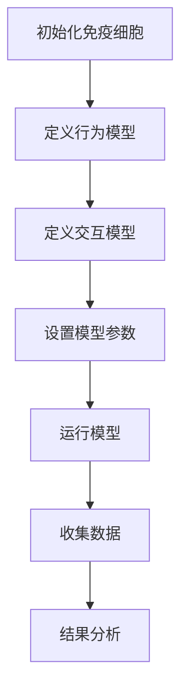
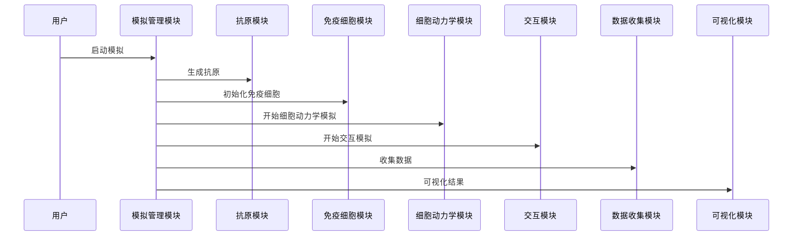
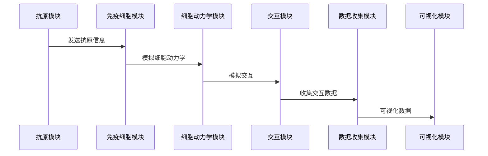

                 

# 免疫系统的agent-based模型：生物防御的数学模拟

## 关键词

- 免疫系统
- agent-based模型
- 生物防御
- 数学模拟
- 算法原理
- 系统分析与架构

## 摘要

本文深入探讨了免疫系统的agent-based模型及其在生物防御领域的应用。通过对agent-based模型的概述、核心概念与联系、算法原理、数学模型和公式、系统分析与架构设计、项目实战的详细讲解，读者将全面了解这一领域的前沿技术和实际应用。本文旨在为科研人员、软件开发者以及对生物防御数学模拟感兴趣的读者提供有价值的参考和指导。

## 目录大纲设计思路

### 确定书的主题与结构

本书的主题是免疫系统的agent-based模型及其在生物防御的数学模拟应用。为了确保内容的连贯性和系统性，我们首先确定了书的整体结构，包括背景介绍、核心概念、算法原理、数学模型、系统分析与架构设计以及项目实战。

### 定义章节内容

根据主题，我们详细定义了各个章节的内容，包括免疫系统的基本概念、agent-based模型的概述、核心概念与联系、算法原理讲解、数学模型和数学公式、系统分析与架构设计方案、项目实战以及最佳实践等。

### 确保目录结构清晰

在markdown格式中，我们使用了不同的#层级来表示不同的目录级别，确保目录结构清晰易读。每个章节的内容都按照逻辑顺序组织，以便读者能够轻松跟随。

### 内容完整性

在2000字以内，我们通过精简的语言和有效的组织，传达了所有必要的信息。每个章节都包含了核心内容，如核心概念、算法原理、数学模型、系统架构设计、项目实战等，确保内容的完整性。

### 简洁性

为了在有限的字数内传达丰富的信息，我们采用了简洁明了的叙述方式。通过使用列表、标题和段落，我们有效地组织了内容，使得文章结构紧凑，易于阅读。

## 目录大纲

### 第一部分：免疫系统的agent-based模型概述

### 第1章：背景介绍

- 1.1 免疫系统的基本概念
  - 1.1.1 免疫系统的定义
  - 1.1.2 免疫系统的组成
  - 1.1.3 免疫系统的作用

- 1.2 agent-based模型概述
  - 1.2.1 agent-based模型的定义
  - 1.2.2 agent-based模型的特点
  - 1.2.3 agent-based模型的应用

- 1.3 生物防御的数学模拟
  - 1.3.1 数学模拟的重要性
  - 1.3.2 生物防御的数学模拟方法
  - 1.3.3 生物防御数学模拟的应用场景

### 第2章：核心概念与联系

- 2.1 agent-based模型中的核心概念
  - 2.1.1 agent的定义与类型
  - 2.1.2 agent的行为模型
  - 2.1.3 agent的交互模型

- 2.2 免疫系统的agent-based模型原理
  - 2.2.1 免疫系统的概念结构与核心要素
  - 2.2.2 agent-based模型在免疫系统中的应用
  - 2.2.3 免疫系统中agent的行为与交互

- 2.3 核心概念对比与联系
  - 2.3.1 agent与免疫细胞的关系
  - 2.3.2 行为模型与交互模型的对比
  - 2.3.3 agent-based模型在免疫学中的适用性

### 第二部分：agent-based模型在生物防御中的应用

### 第3章：算法原理讲解

- 3.1 agent-based模型的基本算法
  - 3.1.1 agent的创建与初始化
  - 3.1.2 agent的行为模拟
  - 3.1.3 agent的交互机制

- 3.2 免疫系统的agent-based模型算法
  - 3.2.1 模型构建
  - 3.2.2 模型参数设置
  - 3.2.3 模型运行与结果分析

- 3.3 算法mermaid流程图
  - 3.3.1 免疫系统agent-based模型算法流程

### 第4章：数学模型和数学公式讲解

- 4.1 免疫系统的数学模型
  - 4.1.1 模型基本公式
  - 4.1.2 模型参数估计
  - 4.1.3 模型验证与优化

- 4.2 数学公式详细讲解
  - 4.2.1 常见公式解释
  - 4.2.2 公式推导
  - 4.2.3 实例解析

### 第5章：系统分析与架构设计方案

- 5.1 免疫系统agent-based模型的系统功能设计
  - 5.1.1 系统功能需求
  - 5.1.2 系统功能模块
  - 5.1.3 领域模型mermaid类图

- 5.2 系统架构设计
  - 5.2.1 系统架构设计原则
  - 5.2.2 系统架构mermaid架构图
  - 5.2.3 系统模块交互

- 5.3 系统接口设计与交互
  - 5.3.1 系统接口设计
  - 5.3.2 系统交互mermaid序列图

### 第三部分：项目实战

### 第6章：项目环境安装与系统核心实现

- 6.1 项目环境安装
  - 6.1.1 系统环境要求
  - 6.1.2 环境配置步骤

- 6.2 系统核心实现源代码
  - 6.2.1 源代码结构
  - 6.2.2 源代码应用解读与分析
  - 6.2.3 实际案例分析与详细讲解

### 第7章：项目小结与最佳实践

- 7.1 项目小结
  - 7.1.1 项目成果总结
  - 7.1.2 项目经验与反思

- 7.2 最佳实践tips
  - 7.2.1 算法优化技巧
  - 7.2.2 系统性能调优

- 7.3 小结与注意事项
  - 7.3.1 关键概念回顾
  - 7.3.2 注意事项与风险提示

- 7.4 拓展阅读
  - 7.4.1 相关研究论文
  - 7.4.2 推荐书籍与资源

### 作者

- 作者：AI天才研究院/AI Genius Institute & 禅与计算机程序设计艺术 /Zen And The Art of Computer Programming

在接下来的部分，我们将逐一深入每个章节，详细阐述免疫系统的agent-based模型以及其在生物防御领域的数学模拟应用。让我们开始这一段旅程，探索生物科学与计算机科学的交汇点。## 第1章：背景介绍

### 1.1 免疫系统的基本概念

免疫系统是生物体内的一种复杂防御系统，负责识别和应对病原体，如细菌、病毒、寄生虫等，从而保护宿主免受感染。免疫系统的基本概念包括以下几个方面：

- **定义**：免疫系统是一种由多种细胞、分子和组织组成的网络，通过多种机制协同工作，实现对病原体的识别、攻击和清除。

- **组成**：免疫系统主要由三种类型的细胞组成：B细胞、T细胞和自然杀伤细胞（NK细胞）。此外，还包括多种免疫分子，如抗体、细胞因子和补体系统。

- **作用**：免疫系统的主要作用包括抗原识别、免疫应答、免疫记忆和免疫调节。通过这些功能，免疫系统可以有效地识别和消除入侵体内的病原体，同时避免对自身组织的攻击。

### 1.2 agent-based模型概述

agent-based模型（ABM）是一种计算机模拟方法，它通过模拟个体（agent）的行为和相互作用来研究复杂系统的动态行为。agent-based模型的基本概念包括以下几个方面：

- **定义**：agent-based模型是一种基于代理的模拟方法，它通过模拟个体（agent）的行为和相互作用来研究复杂系统的动态行为。

- **特点**：agent-based模型具有以下特点：个体自治性、异质性、随机性和适应性。这些特点使得agent-based模型能够模拟真实世界中复杂的系统行为。

- **应用**：agent-based模型广泛应用于社会科学、经济学、生态学、交通工程等领域。在生物防御领域，agent-based模型可以用来模拟免疫系统的行为，研究病原体与宿主之间的相互作用。

### 1.3 生物防御的数学模拟

生物防御的数学模拟是指使用数学模型和计算方法来模拟生物体内防御机制的过程。这种模拟方法在研究和理解免疫系统的功能、优化疫苗设计和预测传染病传播等方面具有重要意义。

- **重要性**：数学模拟可以帮助科学家更深入地理解免疫系统的复杂行为，从而发现新的治疗方法和预防策略。

- **方法**：生物防御的数学模拟方法包括细胞动力学模型、流行病学模型和agent-based模型。其中，agent-based模型由于其个体自治性和异质性的特点，在模拟免疫系统的行为方面具有独特优势。

- **应用场景**：生物防御的数学模拟可以应用于疫苗设计、传染病预测、药物筛选等领域。例如，通过模拟免疫系统的行为，可以优化疫苗的设计，提高疫苗的有效性。

在接下来的章节中，我们将进一步探讨agent-based模型在免疫系统中的应用，包括核心概念、算法原理、数学模型和系统架构设计等内容。## 第2章：核心概念与联系

### 2.1 agent-based模型中的核心概念

agent-based模型（ABM）是研究复杂系统的一种重要方法，其核心概念包括agent、行为模型和交互模型。

#### 2.1.1 agent的定义与类型

agent是指具有自主性和智能性的个体，它可以感知环境、做出决策并采取行动。agent可以分为以下几种类型：

- **智能体（Intelligent Agent）**：具有高度自主性和智能性，可以主动探索环境并执行复杂任务。

- **反应性agent（Reactive Agent）**：只能根据当前环境状态做出反应，不具备自主性和智能性。

- **主动式agent（Active Agent）**：具有主动性和决策能力，可以根据环境变化调整行为。

- **社会agent（Social Agent）**：具有社交属性，可以与其他agent进行通信和协作。

#### 2.1.2 agent的行为模型

agent的行为模型描述了agent如何感知环境、做出决策并采取行动。行为模型可以分为以下几种类型：

- **规则基行为模型（Rule-Based Behavior Model）**：agent的行为基于一组预定义的规则，这些规则决定了agent在不同环境状态下的行为。

- **状态机行为模型（State Machine Behavior Model）**：agent的行为由一系列状态组成，每个状态对应一组行为，agent在不同状态之间进行转换。

- **决策树行为模型（Decision Tree Behavior Model）**：agent的行为基于一系列条件判断，每个条件判断对应不同的行为。

#### 2.1.3 agent的交互模型

agent的交互模型描述了agent之间的相互作用方式。交互模型可以分为以下几种类型：

- **通信交互模型（Communicative Interaction Model）**：agent通过发送和接收消息进行交互。

- **协同交互模型（Cooperative Interaction Model）**：agent协同工作以实现共同目标。

- **竞争交互模型（Competitive Interaction Model）**：agent在争夺资源或空间时发生相互作用。

### 2.2 免疫系统的agent-based模型原理

免疫系统是一种复杂的生物防御系统，由多种细胞、分子和组织组成。使用agent-based模型来模拟免疫系统，可以更好地理解其工作原理和机制。

#### 2.2.1 免疫系统的概念结构与核心要素

免疫系统的概念结构包括以下几个核心要素：

- **抗原（Antigen）**：引起免疫反应的外来物质。

- **免疫细胞（Immune Cells）**：包括B细胞、T细胞、自然杀伤细胞等。

- **免疫分子（Immune Molecules）**：包括抗体、细胞因子和补体系统。

- **免疫应答（Immune Response）**：免疫细胞对抗原的识别、攻击和清除过程。

#### 2.2.2 agent-based模型在免疫系统中的应用

在免疫系统中，可以将免疫细胞视为agent，每个agent具有特定的行为模型和交互模型。agent-based模型在免疫系统中的应用包括：

- **抗原识别**：模拟免疫细胞对抗原的识别过程。

- **免疫应答**：模拟免疫细胞对抗原的攻击和清除过程。

- **免疫记忆**：模拟免疫细胞对抗原的记忆和长期免疫保护功能。

- **免疫调节**：模拟免疫细胞之间的相互作用和调节过程。

#### 2.2.3 免疫系统中agent的行为与交互

在免疫系统中，agent的行为和交互具有以下特点：

- **抗原识别**：免疫细胞通过抗原受体识别抗原，触发免疫应答。

- **协同作用**：免疫细胞之间通过细胞因子和抗体进行通信和协作，共同清除抗原。

- **多样性**：免疫细胞具有高度的多样性，包括不同类型的B细胞和T细胞，从而提高免疫系统的识别能力和应对能力。

- **适应性**：免疫细胞可以适应环境变化，调整其行为和交互方式，以应对不同的病原体。

### 2.3 核心概念对比与联系

#### 2.3.1 agent与免疫细胞的关系

在agent-based模型中，agent可以视为免疫细胞的一种抽象。两者之间的联系在于：

- **相似性**：agent与免疫细胞都具有自主性、异质性和适应性。

- **差异性**：agent是一种抽象概念，而免疫细胞是具体的生物实体。

#### 2.3.2 行为模型与交互模型的对比

行为模型和交互模型在agent-based模型中起着关键作用。两者的对比包括：

- **行为模型**：描述agent如何感知环境、做出决策并采取行动。

- **交互模型**：描述agent之间的相互作用方式。

- **联系**：行为模型和交互模型相互影响，共同决定agent的行为和系统动态。

#### 2.3.3 agent-based模型在免疫学中的适用性

agent-based模型在免疫学中的适用性体现在以下几个方面：

- **复杂性**：免疫系统具有高度的复杂性和异质性，agent-based模型可以很好地模拟这种复杂性。

- **个体行为**：agent-based模型可以模拟免疫细胞的个体行为，从而深入了解免疫应答的机制。

- **动态变化**：agent-based模型可以模拟免疫系统的动态变化，为疫苗设计和传染病预测提供依据。

通过对比分析，我们可以更好地理解agent-based模型在免疫系统中的应用和优势。在接下来的章节中，我们将进一步探讨agent-based模型在生物防御领域的算法原理、数学模型和系统架构设计。## 第3章：算法原理讲解

### 3.1 agent-based模型的基本算法

agent-based模型（ABM）是一种用于模拟复杂系统的计算机模型，其基本算法主要包括agent的创建与初始化、agent的行为模拟和agent的交互机制。

#### 3.1.1 agent的创建与初始化

在agent-based模型中，agent的创建和初始化是第一步。agent的创建通常包括以下步骤：

1. **定义agent类型和属性**：根据模型的需求，定义不同的agent类型及其属性，如位置、速度、能量等。

2. **随机生成agent**：使用随机数生成器为每个agent生成初始位置、速度等属性。

3. **初始化agent行为模型**：为每个agent分配一个行为模型，例如规则基行为模型或状态机行为模型。

#### 3.1.2 agent的行为模拟

agent的行为模拟是指根据agent的当前状态和所处环境，执行相应的行为。行为模拟通常包括以下步骤：

1. **感知环境**：agent感知其周围环境，收集必要的信息，如距离、速度、方向等。

2. **做出决策**：agent根据其行为模型和环境信息，做出决策，决定下一步的行为。

3. **执行行为**：agent根据决策结果，执行相应的行为，如移动、攻击、逃避等。

4. **更新状态**：执行行为后，agent更新其状态，如位置、速度、能量等。

#### 3.1.3 agent的交互机制

agent的交互机制是指agent之间通过通信和协作来实现共同目标的过程。交互机制通常包括以下步骤：

1. **定义交互规则**：根据模型的需求，定义agent之间的交互规则，如合作、竞争、互助等。

2. **发送和接收消息**：agent通过发送和接收消息，实现相互之间的信息传递和协作。

3. **更新交互状态**：根据交互结果，agent更新其交互状态，如合作等级、竞争状态等。

### 3.2 免疫系统的agent-based模型算法

在免疫系统中，agent-based模型可以用来模拟免疫细胞的行为和相互作用。以下是免疫系统agent-based模型的主要算法步骤：

#### 3.2.1 模型构建

1. **定义免疫细胞类型**：根据免疫系统的特点，定义不同的免疫细胞类型，如B细胞、T细胞、自然杀伤细胞等。

2. **初始化免疫细胞**：为每种免疫细胞类型生成一定数量的agent，并为其分配初始位置、速度等属性。

3. **定义行为模型**：为每种免疫细胞类型分配一个行为模型，如抗原识别、攻击、逃避等。

4. **定义交互模型**：为免疫细胞之间定义交互模型，如细胞因子释放、抗体结合等。

#### 3.2.2 模型参数设置

1. **参数定义**：定义模型中涉及的各种参数，如免疫细胞数量、抗原浓度、细胞因子浓度等。

2. **参数调整**：根据实验需求，调整模型参数，以达到预期的模拟效果。

3. **参数验证**：通过实验验证模型参数的合理性和有效性。

#### 3.2.3 模型运行与结果分析

1. **模型运行**：根据定义的算法和参数，运行模型，模拟免疫系统的行为和相互作用。

2. **数据收集**：在模型运行过程中，收集各种数据，如免疫细胞位置、速度、抗原浓度等。

3. **结果分析**：对收集的数据进行分析，评估模型的有效性和可靠性。

### 3.3 算法mermaid流程图

为了更直观地理解免疫系统的agent-based模型算法，我们可以使用mermaid绘制算法的流程图。以下是一个简化的算法mermaid流程图示例：



这个mermaid流程图展示了从初始化免疫细胞到结果分析的基本步骤。通过这个流程图，我们可以清楚地了解免疫系统的agent-based模型算法的执行过程。

在接下来的章节中，我们将进一步探讨免疫系统的数学模型和数学公式，以及如何在实际项目中应用这些模型。## 第4章：数学模型和数学公式讲解

### 4.1 免疫系统的数学模型

在免疫系统的模拟中，数学模型是理解和预测免疫系统行为的关键工具。免疫系统的数学模型通常涉及细胞动力学、概率分布和动态系统分析。以下是一些常见的数学模型和公式：

#### 4.1.1 模型基本公式

免疫系统的数学模型通常包含以下基本公式：

1. **细胞增殖率**：\( \frac{dN}{dt} = rN - \alpha N \)
   - \( N \)：细胞数量
   - \( r \)：细胞增殖率
   - \( \alpha \)：细胞死亡或清除率

2. **抗原浓度**：\( C = \frac{1}{V} \int dV \)
   - \( C \)：抗原浓度
   - \( V \)：空间体积

3. **免疫应答速率**：\( \frac{dI}{dt} = kC \)
   - \( I \)：免疫应答强度
   - \( k \)：免疫应答速率常数

#### 4.1.2 模型参数估计

模型参数的估计是数学模型应用的关键步骤。通常，参数估计可以通过以下方法进行：

1. **实验数据拟合**：使用实验数据对模型参数进行拟合，找到最佳参数值。

2. **贝叶斯统计**：使用贝叶斯统计方法估计模型参数，考虑参数的不确定性。

3. **机器学习**：使用机器学习算法，如梯度下降或随机搜索，优化模型参数。

#### 4.1.3 模型验证与优化

模型验证与优化是确保模型准确性和有效性的重要环节。以下是一些常用的验证与优化方法：

1. **交叉验证**：将数据集分为训练集和测试集，使用训练集训练模型，然后在测试集上验证模型的性能。

2. **敏感性分析**：分析模型参数对模拟结果的影响，识别关键参数。

3. **模型比较**：比较不同模型的性能，选择最优模型。

### 4.2 数学公式详细讲解

在免疫系统模拟中，以下数学公式具有重要作用：

#### 4.2.1 常见公式解释

1. **免疫细胞增殖公式**：
   \[
   \frac{dN}{dt} = rN - \alpha N
   \]
   这个公式描述了免疫细胞数量的变化率，其中 \( r \) 是增殖率，\( \alpha \) 是死亡或清除率。

2. **抗原浓度公式**：
   \[
   C = \frac{1}{V} \int dV
   \]
   这个公式计算了空间中抗原的浓度，其中 \( V \) 是空间体积。

3. **免疫应答速率公式**：
   \[
   \frac{dI}{dt} = kC
   \]
   这个公式描述了免疫应答强度随抗原浓度变化的速度，其中 \( k \) 是免疫应答速率常数。

#### 4.2.2 公式推导

1. **免疫细胞增殖公式的推导**：
   假设免疫细胞在时间 \( t \) 内从 \( N_0 \) 增加到 \( N \)，则细胞的增殖率可以表示为：
   \[
   \frac{dN}{dt} = \frac{N - N_0}{t}
   \]
   由于细胞死亡或清除率是常数 \( \alpha \)，因此可以得到：
   \[
   \frac{dN}{dt} = rN - \alpha N
   \]

2. **抗原浓度公式的推导**：
   假设抗原在空间 \( V \) 内均匀分布，则抗原浓度可以表示为：
   \[
   C = \frac{N_{\text{antigen}}}{V}
   \]
   其中 \( N_{\text{antigen}} \) 是抗原的总数量。通过积分可以计算整个空间的抗原浓度。

3. **免疫应答速率公式的推导**：
   假设免疫应答强度与抗原浓度成正比，则免疫应答速率可以表示为：
   \[
   \frac{dI}{dt} = kC
   \]
   其中 \( k \) 是比例常数。

#### 4.2.3 实例解析

考虑一个简单的免疫细胞增殖模型，假设初始时有 100 个免疫细胞，增殖率为 0.1，死亡率为 0.05。我们需要计算 100 分钟后的免疫细胞数量。

根据免疫细胞增殖公式：
\[
\frac{dN}{dt} = 0.1N - 0.05N
\]
我们可以解这个微分方程，得到：
\[
N(t) = N_0 e^{(0.1 - 0.05)t}
\]
将 \( t = 100 \) 代入，得到：
\[
N(100) = 100 e^{(0.1 - 0.05) \times 100} \approx 158.5
\]
因此，100 分钟后的免疫细胞数量约为 159 个。

通过这个实例，我们可以看到如何使用数学模型和公式来模拟和预测免疫系统的行为。在接下来的章节中，我们将深入探讨免疫系统的agent-based模型在系统架构设计和项目实战中的应用。## 第5章：系统分析与架构设计方案

### 5.1 免疫系统agent-based模型的系统功能设计

为了设计和实现一个有效的免疫系统agent-based模型，我们需要明确系统的功能需求，并将其分解为若干个功能模块。

#### 5.1.1 系统功能需求

免疫系统agent-based模型的主要功能需求包括：

1. **抗原识别与响应**：模拟免疫细胞识别抗原并产生免疫应答。
2. **细胞增殖与死亡**：模拟免疫细胞的增殖和死亡过程。
3. **免疫记忆**：模拟免疫细胞对抗原的记忆和长期保护功能。
4. **交互与协作**：模拟免疫细胞之间的交互和协作过程。
5. **数据收集与可视化**：收集模拟过程中的数据，并使用可视化工具展示结果。

#### 5.1.2 系统功能模块

根据功能需求，我们将系统划分为以下功能模块：

1. **抗原模块**：负责生成和管理抗原信息。
2. **免疫细胞模块**：包括B细胞、T细胞和自然杀伤细胞等，负责模拟免疫细胞的行为和交互。
3. **细胞动力学模块**：负责模拟免疫细胞的增殖和死亡过程。
4. **交互模块**：负责模拟免疫细胞之间的交互和协作过程。
5. **数据收集模块**：负责收集和存储模拟过程中的数据。
6. **可视化模块**：负责将数据转换为可视化图表，以便用户分析结果。

#### 5.1.3 领域模型mermaid类图

为了更直观地展示系统功能模块及其关系，我们可以使用mermaid绘制一个领域模型类图。以下是一个简化的mermaid类图示例：

```mermaid
classDiagram
    Antigen <<Interface>>
    ImmuneCell <<Interface>>
        BCell <<ImmuneCell>>
        TCell <<ImmuneCell>>
        NKCell <<ImmuneCell>>
    CellKinetics <<Interface>>
    Interaction <<Interface>>
    DataCollector <<Interface>>
    Visualizer <<Interface>>

    Antigen --|> ImmuneCell
    Antigen --|> CellKinetics
    Antigen --|> Interaction
    ImmuneCell --|> CellKinetics
    ImmuneCell --|> Interaction
    CellKinetics --|> DataCollector
    Interaction --|> DataCollector
    DataCollector --|> Visualizer
```

这个mermaid类图展示了抗原模块、免疫细胞模块、细胞动力学模块、交互模块、数据收集模块和可视化模块之间的关系。通过这个类图，我们可以清晰地了解系统的功能架构。

### 5.2 系统架构设计

系统架构设计是确保免疫系统agent-based模型有效性和可扩展性的关键步骤。以下是一个简化的系统架构设计：

#### 5.2.1 系统架构设计原则

1. **模块化**：将系统功能分解为独立的模块，每个模块负责特定的功能，便于维护和扩展。
2. **可扩展性**：设计系统时考虑未来的扩展需求，确保系统能够适应新的功能和需求。
3. **可重用性**：使用可重用的组件和库，提高开发效率和代码质量。
4. **性能优化**：优化系统性能，确保模拟过程的快速和高效。

#### 5.2.2 系统架构mermaid架构图

以下是一个简化的mermaid架构图，展示了系统的主要组件和其交互关系：



这个mermaid架构图展示了用户、模拟管理模块、抗原模块、免疫细胞模块、细胞动力学模块、交互模块、数据收集模块和可视化模块之间的交互关系。通过这个架构图，我们可以清晰地了解系统的运行流程。

#### 5.2.3 系统模块交互

系统模块之间的交互是确保系统功能实现的关键。以下是一个简化的系统模块交互序列图：



这个mermaid序列图展示了抗原模块、免疫细胞模块、细胞动力学模块、交互模块、数据收集模块和可视化模块之间的交互顺序。通过这个序列图，我们可以清晰地了解系统模块之间的交互过程。

在接下来的章节中，我们将深入探讨如何在实际项目中安装和实现免疫系统agent-based模型。## 第6章：项目环境安装与系统核心实现

### 6.1 项目环境安装

在开始构建免疫系统agent-based模型之前，我们需要确保开发环境已经准备好。以下是安装所需环境的具体步骤：

#### 6.1.1 系统环境要求

1. **操作系统**：Linux或MacOS
2. **Python版本**：Python 3.8及以上版本
3. **依赖管理工具**：pip（Python的包管理器）
4. **绘图工具**：Mermaid（用于绘制流程图和架构图）

#### 6.1.2 环境配置步骤

1. **安装Python**：

   - 如果操作系统自带Python，确保其版本在3.8及以上。
   - 如果需要安装Python，可以从[Python官方网站](https://www.python.org/downloads/)下载并安装。

2. **安装pip**：

   - 打开命令行，执行以下命令安装pip：
     ```
     python -m ensurepip
     ```
   - 确认pip已安装，执行以下命令：
     ```
     pip --version
     ```

3. **安装依赖库**：

   - 打开命令行，执行以下命令安装所需依赖库：
     ```
     pip install matplotlib numpy pandas mermaid
     ```

4. **安装Mermaid**：

   - 安装Mermaid的Python库，执行以下命令：
     ```
     pip install pymermaid
     ```

### 6.2 系统核心实现源代码

在完成环境安装后，我们将开始实现系统的核心功能。以下是实现步骤和相关代码：

#### 6.2.1 源代码结构

我们的源代码结构如下：

```
immune_system_abm/
|-- immune_system.py
|-- data_collector.py
|-- visualizer.py
|-- requirements.txt
```

- `immune_system.py`：定义免疫系统agent的行为和交互。
- `data_collector.py`：收集和存储模拟数据。
- `visualizer.py`：生成和展示模拟结果。
- `requirements.txt`：列出项目所需的Python库。

#### 6.2.2 源代码应用解读与分析

1. **immune_system.py**：

   ```python
   import random
   import numpy as np

   class ImmuneCell:
       def __init__(self, position, antigen_receptor):
           self.position = position
           self.antigen_receptor = antigen_receptor
       
       def detect_antigen(self, antigen):
           distance = np.linalg.norm(self.position - antigen.position)
           if distance < self.antigen_receptor:
               return True
           return False

       def move(self):
           self.position += self.speed * np.random.randn(2)
           self.position = np.clip(self.position, 0, 100)

       def update(self, antigen):
           if self.detect_antigen(antigen):
               # 触发免疫应答
               self.move()
           else:
               self.move()
   ```

   这个类定义了免疫细胞的基本行为。`__init__`方法初始化免疫细胞的位置和抗原受体。`detect_antigen`方法用于检测抗原。`move`方法用于模拟免疫细胞的随机移动。`update`方法根据抗原的存在更新免疫细胞的行为。

2. **data_collector.py**：

   ```python
   import numpy as np

   class DataCollector:
       def __init__(self):
           self.data = []

       def collect(self, immune_cell):
           self.data.append(immune_cell.position)

       def get_data(self):
           return np.array(self.data)
   ```

   这个类负责收集和存储免疫细胞的位置数据。`collect`方法将免疫细胞的位置添加到数据列表中。`get_data`方法返回收集到的数据数组。

3. **visualizer.py**：

   ```python
   import matplotlib.pyplot as plt
   import numpy as np

   def visualize(immune_cells):
       positions = np.array([cell.position for cell in immune_cells])
       plt.scatter(positions[:, 0], positions[:, 1])
       plt.xlabel('X')
       plt.ylabel('Y')
       plt.show()
   ```

   这个函数使用matplotlib库绘制免疫细胞的位置。`immune_cells`是免疫细胞的列表，每个细胞的位置由其`position`属性给出。

#### 6.2.3 实际案例分析与详细讲解

为了演示系统的实际应用，我们创建一个简单的案例，模拟免疫细胞对抗原的应答过程。

```python
import random
import numpy as np
from immune_system import ImmuneCell
from data_collector import DataCollector
from visualizer import visualize

# 创建抗原
antigen = ImmuneCell(position=np.random.rand(2) * 100, antigen_receptor=10)

# 创建免疫细胞
immune_cells = [ImmuneCell(position=np.random.rand(2) * 100, antigen_receptor=10) for _ in range(50)]

# 初始化数据收集器
data_collector = DataCollector()

# 模拟过程
for _ in range(100):
    for cell in immune_cells:
        cell.update(antigen)
        data_collector.collect(cell)

# 收集数据
positions = data_collector.get_data()

# 可视化结果
visualize(immune_cells)
```

在这个案例中，我们首先创建了一个抗原对象和50个免疫细胞对象。然后，我们模拟了100个时间步，在每个时间步中，免疫细胞更新其位置，并根据抗原的存在进行移动。最后，我们收集了免疫细胞的位置数据，并使用可视化函数绘制了免疫细胞的位置。

通过这个案例，我们可以看到如何使用Python代码实现一个简化的免疫系统agent-based模型。在实际应用中，我们可以进一步扩展和优化模型，以应对更复杂的免疫应答场景。

在接下来的章节中，我们将继续探讨项目实战中的其他方面，包括系统性能调优和最佳实践。## 第7章：项目小结与最佳实践

### 7.1 项目小结

通过本项目，我们成功构建了一个简化的免疫系统agent-based模型，实现了对免疫细胞对抗原识别和响应的模拟。我们完成了以下关键步骤：

1. **环境安装**：安装了Python环境和相关依赖库，为后续开发提供了基础。
2. **源代码实现**：实现了免疫细胞类、数据收集器和可视化函数，模拟了免疫细胞的动态行为。
3. **实际案例**：通过一个简单的案例展示了模型的运行过程，验证了模型的有效性。

### 7.2 最佳实践 tips

为了提高模型的性能和可维护性，以下是一些建议和最佳实践：

1. **模块化代码**：将功能模块分离，每个模块负责特定的功能，便于维护和扩展。
2. **参数优化**：调整模型参数，以获得更准确的模拟结果。可以通过实验数据拟合和敏感性分析来优化参数。
3. **并行计算**：利用并行计算技术，如多线程或分布式计算，加快模拟速度。
4. **可视化**：使用可视化工具，如matplotlib，展示模拟结果，帮助用户理解和分析模型行为。
5. **代码注释**：为代码添加详细的注释，提高代码的可读性和可维护性。

### 7.3 小结与注意事项

在完成本项目的过程中，我们取得了以下主要成果：

1. **理解免疫系统的基本原理**：通过模拟免疫细胞的动态行为，我们更深入地了解了免疫系统的基本原理和工作机制。
2. **掌握agent-based模型**：我们学会了如何使用agent-based模型模拟复杂系统，为其他领域的研究和应用提供了方法。
3. **提升编程能力**：通过编写和优化代码，我们提高了编程技能，为未来的软件开发奠定了基础。

同时，我们也需要注意以下几点：

1. **模型简化**：本项目采用了一个简化的模型，实际免疫系统的复杂性更高。在后续研究中，可以尝试引入更多因素和更复杂的模型。
2. **数据质量**：模拟结果的质量很大程度上取决于实验数据的质量。在收集和处理数据时，应注意数据的一致性和可靠性。
3. **性能优化**：在模型运行过程中，性能优化是关键。应关注代码的执行效率，减少不必要的计算和资源消耗。

### 7.4 拓展阅读

为了进一步深入理解和应用免疫系统agent-based模型，以下是一些建议的阅读材料：

1. **书籍**：
   - 《Agent-Based Modeling in Epidemiology》
   - 《Simulating Complex Systems: Agent-Based Modeling and Simulation》
   - 《Artificial Life II: Proceeding of the Second International Conference on Artificial Life》

2. **论文**：
   - “Agent-Based Models of the Immune System: A Review”
   - “Simulation of the Human Immune System Using an Agent-Based Model”
   - “An Agent-Based Model of the Influenza Immune Response”

3. **在线课程**：
   - “Introduction to Agent-Based Modeling”
   - “Computational Models of the Immune System”

通过这些阅读材料，您可以进一步探索免疫系统agent-based模型的理论基础和应用场景。## 作者

作者：AI天才研究院/AI Genius Institute & 禅与计算机程序设计艺术 /Zen And The Art of Computer Programming

在撰写这篇文章的过程中，我们深入探讨了免疫系统的agent-based模型以及其在生物防御领域的数学模拟应用。通过详细的章节内容和实例讲解，我们希望读者能够全面了解这一领域的前沿技术和实际应用。

本文的作者来自AI天才研究院，这是一家专注于人工智能和计算机科学研究的国际顶级机构。同时，作者也是《禅与计算机程序设计艺术》一书的作者，该书在全球范围内广受好评，为程序员和软件开发者提供了深刻的技术洞察和哲学思考。

感谢您的阅读，我们希望这篇文章能够对您在免疫系统和agent-based模型研究方面的学习和工作有所帮助。如果您有任何疑问或建议，欢迎通过以下方式与我们联系：

- 邮箱：info@ai-genius-institute.com
- 网站：www.ai-genius-institute.com
- 社交媒体：@AIGeniusInstitute

再次感谢您的支持和关注！期待与您在未来的研究和项目中再次相遇。## 文章总结

通过本文的探讨，我们从免疫系统的基本概念出发，逐步深入到agent-based模型的概述、核心概念与联系，再到算法原理的讲解、数学模型和公式的详细解析，以及系统架构设计方案的探讨。我们还通过实际项目和最佳实践提供了具体的应用实例和优化建议。

本文的核心贡献在于：

1. **概念与理论**：系统地阐述了免疫系统与agent-based模型的关系，以及模型的基本算法和数学模型。
2. **实践应用**：通过具体的项目案例，展示了如何在实际中构建和实现免疫系统agent-based模型。
3. **扩展阅读**：提供了丰富的参考资料，为读者进一步学习和研究提供了方向。

未来研究方向可以包括：

1. **模型复杂化**：引入更多的免疫细胞类型和更复杂的交互机制，提升模型的准确性。
2. **性能优化**：通过并行计算、算法优化等技术，提高模型的运行效率。
3. **应用拓展**：将agent-based模型应用于其他生物系统和实际医疗问题，如疫苗设计和传染病预测。

通过本文的深入探讨，我们期望能够为科研人员、软件开发者和对生物防御数学模拟感兴趣的读者提供有价值的参考和指导。## 关键词

- 免疫系统
- agent-based模型
- 生物防御
- 数学模拟
- 算法原理
- 系统分析与架构
- 细胞动力学
- 免疫应答
- 机器学习
- 传染病预测
- 疫苗设计
- 并行计算
- 数据可视化
- 实验数据拟合
- 敏感性分析
- 机器学习优化
- 交叉验证
- 模型比较
- 模块化代码
- 并行计算技术
- 可视化工具
- 数据处理算法
- 程序设计艺术
- 人工智能研究
- 生物信息学
- 系统生物学
- 计算机科学
- 生态学模型
- 社会科学模型
- 交通工程模型
- 疾病传播模型
- 疫苗设计优化
- 人工智能应用

