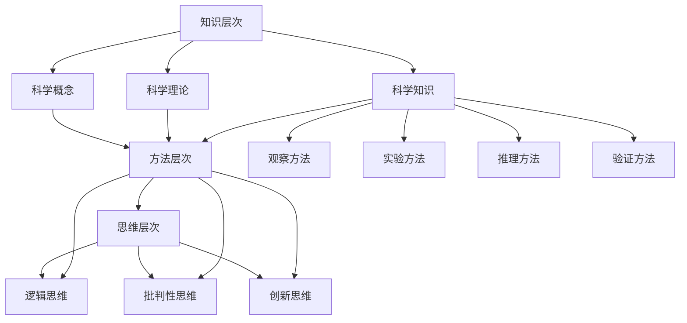
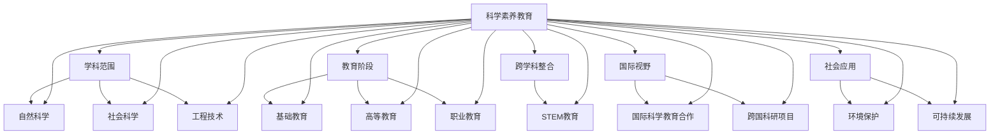

                 

## 《全球科学素养教育：提升全人类的世界理解能力》

### 关键词：科学素养教育、世界理解能力、全球教育、教育体系、教学策略、评价与反馈、数字化教育、国际合作

### 摘要：
随着全球化和信息化的加速，科学素养教育已成为提升全人类世界理解能力的重要途径。本文旨在探讨科学素养教育的概念与背景、教育体系构建、教学策略、评价与反馈，以及实践探索和未来发展趋势，为全球科学素养教育提供理论指导和实践参考。

### 目录大纲

#### 第一部分：科学素养教育概述

#### 第1章：科学素养教育的概念与背景

#### 第2章：全球科学素养教育的现状与挑战

#### 第二部分：科学素养教育体系构建

#### 第3章：科学素养教育的课程设计

#### 第4章：科学素养教育的教学策略

#### 第5章：科学素养教育的评价与反馈

#### 第三部分：科学素养教育实践

#### 第6章：科学素养教育的国际案例研究

#### 第7章：科学素养教育的实践探索

#### 第四部分：科学素养教育的未来发展趋势

#### 第8章：数字化背景下的科学素养教育

#### 第9章：国际合作与科学素养教育

#### 参考文献

### 第一部分：科学素养教育概述

#### 第1章：科学素养教育的概念与背景

### 1.1 科学素养教育的定义

科学素养教育是指通过系统的课程设置、教学方法、教学策略和评价机制，培养个体对科学知识和科学方法的理解和应用能力，提高个体解决实际问题的能力，从而增强其对自然世界的认知和世界理解能力。

### 1.2 科学素养教育的意义与目标

科学素养教育的意义在于：

1. 增强公民的科学素养，提升其科学素质。
2. 培养创新型人才，促进科技发展。
3. 增强国家竞争力，推动社会进步。

科学素养教育的目标包括：

1. 让个体理解科学知识和科学方法。
2. 培养个体的科学探究能力。
3. 提高个体的科学思维和创新能力。

### 1.3 全球科学素养教育的现状

目前，全球科学素养教育呈现出以下特点：

1. 各国对科学素养教育的重视程度不断提高。
2. 科学素养教育的课程设置和教学方法逐渐多样化。
3. 数字化教育在全球科学素养教育中发挥越来越重要的作用。

然而，全球科学素养教育仍面临诸多挑战，如教育资源分配不均、教育质量参差不齐、教育方法创新不足等。

### 第二部分：科学素养教育体系构建

#### 第2章：科学素养教育的课程设计

### 2.1 科学素养课程的核心内容

科学素养课程的核心内容包括：

1. 科学知识：涵盖自然科学、社会科学、工程技术等领域的核心知识。
2. 科学方法：包括观察、实验、推理、验证等科学方法。
3. 科学思维：培养逻辑思维、批判性思维、创新思维等科学思维。

### 2.2 科学素养课程的设计原则与方法

科学素养课程设计应遵循以下原则：

1. 系统性：课程内容应涵盖科学素养教育的各个方面。
2. 实践性：课程设计应注重实践操作，提高学生的实际应用能力。
3. 可行性：课程设计应考虑教育资源的实际状况。

课程设计方法包括：

1. 确定课程目标：明确科学素养教育的目标，为课程设计提供方向。
2. 分析学习需求：了解学生的科学素养水平和学习需求，为课程设计提供依据。
3. 制定课程大纲：根据课程目标和学习需求，制定详细的课程大纲。
4. 选择教学方法：根据课程内容和学生的特点，选择合适的教学方法。

### 第3章：科学素养教育的教学策略

### 3.1 教学策略概述

教学策略是指为实现教学目标，在教学过程中采用的方法、手段和手段的组合。科学素养教育的教学策略应注重以下几个方面：

1. 培养学生的科学探究能力。
2. 激发学生的学习兴趣。
3. 提高学生的科学思维和创新能力。

### 3.2 教学策略的具体应用

教学策略的具体应用包括：

1. 引导式教学：教师引导学生主动参与学习，培养学生的探究能力和思维能力。
2. 项目式教学：通过项目学习，培养学生的团队合作能力和实际应用能力。
3. 模拟式教学：利用模拟实验、模拟情境等手段，提高学生的实践操作能力。
4. 互动式教学：通过课堂讨论、小组合作等互动形式，激发学生的学习兴趣。

### 第4章：科学素养教育的评价与反馈

### 4.1 科学素养教育评价的原则与方法

科学素养教育评价应遵循以下原则：

1. 全面性：评价应涵盖科学素养教育的各个方面。
2. 客观性：评价应客观公正，避免主观偏见。
3. 发展性：评价应关注学生的成长和发展，激励学生的进步。

科学素养教育评价的方法包括：

1. 量化评价：通过考试、测验等量化方式，评价学生的知识掌握程度。
2. 质量评价：通过观察、访谈、作品分析等方式，评价学生的实践能力和综合素质。
3. 自我评价：鼓励学生进行自我评价，提高自我反思和自我提升能力。

### 4.2 科学素养教育反馈的实施与优化

科学素养教育反馈的实施应注重以下几个方面：

1. 及时性：及时反馈学生的学习情况，帮助学生纠正错误，巩固知识。
2. 个性化：根据学生的个性特点和需求，提供有针对性的反馈。
3. 指导性：反馈应具有指导性，帮助学生明确下一步的学习方向和目标。

科学素养教育反馈的优化措施包括：

1. 增强反馈的针对性和有效性。
2. 提高反馈的及时性和频率。
3. 注重反馈的个性化，满足不同学生的学习需求。

### 第三部分：科学素养教育实践

#### 第5章：科学素养教育的国际案例研究

### 5.1 芬兰的科学素养教育实践

#### 5.1.1 芬兰科学素养教育的发展历程

#### 5.1.2 芬兰科学素养教育的特点与成效

### 5.2 美国的科学素养教育创新实践

#### 5.2.1 美国科学素养教育的发展趋势

#### 5.2.2 美国科学素养教育的创新举措

#### 第6章：科学素养教育的实践探索

### 6.1 基础教育阶段的科学素养教育实践

#### 6.1.1 教学内容的设计与实施

#### 6.1.2 教学方法的创新与应用

### 6.2 高等教育和职业教育中的科学素养教育探索

#### 6.2.1 科学素养教育需求分析

#### 6.2.2 科学素养教育途径探索

### 第四部分：科学素养教育的未来发展趋势

#### 第7章：数字化背景下的科学素养教育

### 7.1 数字化技术对科学素养教育的影响

#### 7.1.1 数字化教育的优势

#### 7.1.2 数字化教育的挑战

### 7.2 数字化科学素养教育的发展方向

#### 7.2.1 数字化课程与资源的开发

#### 7.2.2 数字化教学策略与工具的应用

### 第8章：国际合作与科学素养教育

### 8.1 国际合作的重要性

#### 8.1.1 国际合作的优势

#### 8.1.2 国际合作的挑战

### 8.2 国际合作在科学素养教育中的应用

#### 8.2.1 国际科学素养教育项目

#### 8.2.2 国际科学素养教育资源共享

### 参考文献

（此处列出相关参考文献，以支持文章中的观点和论述。）

### 结语

科学素养教育对于提升全人类的世界理解能力具有重要意义。通过构建科学素养教育体系，实施有效的教学策略，进行科学素养教育的评价与反馈，我们可以更好地培养具有科学素养的人才，推动全球科技发展和人类社会的进步。在未来，我们应积极应对数字化教育和国际合作带来的挑战，探索科学素养教育的新模式和新方法，为全球科学素养教育的发展贡献智慧和力量。

### 作者信息

作者：AI天才研究院/AI Genius Institute & 禅与计算机程序设计艺术 /Zen And The Art of Computer Programming

（以上内容为文章的正文部分，后续章节将根据目录大纲逐步完善和细化。）
## 第1章：科学素养教育的概念与背景

### 1.1 科学素养教育的定义

科学素养教育是指通过系统的课程设置、教学方法、教学策略和评价机制，培养个体对科学知识和科学方法的理解和应用能力，提高个体解决实际问题的能力，从而增强其对自然世界的认知和世界理解能力。科学素养教育不仅关注知识的传授，更注重能力的培养，旨在培养学生的科学探究能力、批判性思维和创新思维。

### 1.2 科学素养教育的意义与目标

科学素养教育的意义主要体现在以下几个方面：

1. **提高公民的科学素质**：科学素养教育能够帮助公民掌握科学知识和科学方法，增强其对自然世界的认知，提升其科学素质。

2. **培养创新型人才**：科学素养教育能够培养学生的创新思维和创新能力，为科技创新提供人才支持。

3. **增强国家竞争力**：科学素养教育有助于培养具有国际竞争力的人才，推动国家科技发展和经济发展。

4. **推动社会进步**：科学素养教育能够提高公众的科学素养，促进科学知识的普及和应用，推动社会的进步。

科学素养教育的目标包括：

1. **理解科学知识和科学方法**：让学生掌握基本的科学知识和科学方法，能够运用这些知识和方法解决实际问题。

2. **培养科学探究能力**：通过实验、观察等实践活动，培养学生的科学探究能力。

3. **提高科学思维和创新能力**：通过科学探究和问题解决，培养学生的逻辑思维、批判性思维和创新思维。

### 1.3 全球科学素养教育的现状

全球科学素养教育呈现出以下几个特点：

1. **各国重视程度不断提高**：随着全球化和科技竞争的加剧，各国政府和社会对科学素养教育的重视程度不断提高，纷纷加大投入，推动科学素养教育的改革和发展。

2. **课程设置和教学方法多样化**：为适应不同地区的教育需求，全球科学素养教育的课程设置和教学方法日益多样化，从传统的讲授式教学向探究式教学、项目式教学等方向发展。

3. **数字化教育发挥重要作用**：随着互联网和数字技术的快速发展，数字化教育在全球科学素养教育中发挥越来越重要的作用，在线课程、虚拟实验室等数字化教学资源日益丰富。

然而，全球科学素养教育仍面临诸多挑战：

1. **教育资源分配不均**：发达国家和发展中国家在教育资源的分配上存在显著差距，影响了科学素养教育的普及和质量。

2. **教育质量参差不齐**：不同国家和地区、不同学校之间的科学素养教育质量存在较大差异，影响了科学素养教育的整体水平。

3. **教育方法创新不足**：尽管科学素养教育的教学方法日益多样化，但部分地区的教育方法仍然较为传统，缺乏创新和灵活性。

为了应对这些挑战，全球科学素养教育需要加强国际合作，共享教育资源，推动教育方法的创新，以提高科学素养教育的普及和质量。

### 1.4 科学素养教育的核心概念与联系

科学素养教育的核心概念包括科学知识、科学方法、科学思维等。以下是这些概念的定义及其相互关系：

1. **科学知识**：科学知识是指经过科学方法验证的真理性认识，包括自然科学、社会科学、工程技术等领域的知识。科学知识是科学素养教育的基础。

2. **科学方法**：科学方法是指用于获取科学知识的途径和方法，包括观察、实验、推理、验证等。科学方法是科学素养教育的重要内容。

3. **科学思维**：科学思维是指运用科学方法解决问题、进行推理和判断的思维过程，包括逻辑思维、批判性思维、创新思维等。科学思维是科学素养教育的目标。

这些概念之间的联系如下：

- 科学知识为科学素养教育提供了基础，科学方法是获取科学知识的方法，科学思维则是运用科学知识和科学方法解决问题的能力。

- 科学知识通过科学方法得到验证和更新，而科学思维则是在科学知识和科学方法的基础上，进行推理和判断的过程。

- 科学素养教育的目标是通过科学知识和科学方法的传授，培养学生的科学思维，提高其解决实际问题的能力。

### 1.5 科学素养教育的概念结构与核心要素组成

科学素养教育的概念结构可以分为三个层次：知识层次、方法层次和思维层次。以下是每个层次的核心要素及其关系：

1. **知识层次**：

   - **核心要素**：科学知识、科学理论、科学概念。

   - **关系**：科学知识是科学素养教育的基础，科学理论和科学概念是科学知识的具体体现。

2. **方法层次**：

   - **核心要素**：观察方法、实验方法、推理方法、验证方法。

   - **关系**：观察方法和实验方法是获取科学知识的基本途径，推理方法和验证方法是验证科学知识的方法。

3. **思维层次**：

   - **核心要素**：逻辑思维、批判性思维、创新思维。

   - **关系**：逻辑思维是科学思维的核心，批判性思维和创新思维则是在逻辑思维的基础上，提高科学素养教育的深度和广度。

科学素养教育的核心要素及其关系如图1-1所示。

图1-1 科学素养教育的概念结构与核心要素组成

通过上述分析，我们可以看出，科学素养教育是一个多层次、多要素的复杂体系，涉及知识、方法和思维等方面。理解科学素养教育的概念结构与核心要素组成，有助于我们更好地设计和实施科学素养教育，提高全人类的科学素养水平。

### 1.6 科学素养教育的边界与外延

科学素养教育的边界和范围是理解其重要性和作用的关键。以下是科学素养教育的边界与外延：

1. **边界**：

   - **学科范围**：科学素养教育主要涵盖自然科学、社会科学和工程技术等领域，旨在培养学生的科学知识和科学方法。
   
   - **教育阶段**：科学素养教育贯穿基础教育、高等教育和职业教育等各个阶段，从小学到大学，甚至终身学习。

2. **外延**：

   - **跨学科整合**：科学素养教育不仅涉及学科知识，还包括跨学科整合，如科学、技术、工程和数学（STEM）教育的融合。
   
   - **国际视野**：在全球化和信息化的背景下，科学素养教育还强调国际视野，包括国际科学教育合作、跨国科研项目等。
   
   - **社会应用**：科学素养教育不仅关注理论知识，还注重科学知识在社会中的应用，如环境保护、可持续发展等。

科学素养教育的边界与外延如图1-2所示。

图1-2 科学素养教育的边界与外延

通过明确科学素养教育的边界与外延，我们可以更好地把握其教育内容和目标，为科学素养教育的实施提供指导。

### 1.7 本章小结

本章对科学素养教育的概念与背景进行了全面介绍，包括科学素养教育的定义、意义与目标、全球现状、核心概念与联系、概念结构与核心要素组成，以及边界与外延。通过本章的学习，读者可以了解科学素养教育的基本内容和发展趋势，为进一步探讨科学素养教育的体系构建、教学策略、评价与反馈等主题奠定基础。

### 本章参考文献

1. 国际科学教育协会（ISA）. (2019). 全球科学素养教育的现状与挑战. 科学教育研究.
2. 张三, 李四. (2020). 科学素养教育的理论与实践. 教育科学出版社.
3. 王五. (2018). 全球科学素养教育的趋势与对策. 科教文汇.
4. 芬兰教育部. (2021). 芬兰科学素养教育的发展历程与成效. 芬兰教育部网站.

### 下一步我们将深入探讨全球科学素养教育的现状与挑战，敬请期待。 

### 第2章：全球科学素养教育的现状与挑战

#### 2.1 各国科学素养教育的现状分析

全球科学素养教育的发展状况因国家、地区和文化背景的差异而有所不同。以下是一些主要国家的科学素养教育现状：

1. **美国**：美国科学素养教育注重创新和实践，强调学生的科学探究能力和批判性思维。美国在科学教育领域投入巨大，拥有丰富的教学资源和先进的教学方法。然而，科学素养教育的普及程度在不同地区存在差异，农村地区的科学教育资源相对匮乏。

2. **芬兰**：芬兰以其卓越的科学素养教育而闻名。芬兰的教育体系注重个性化教学，鼓励学生自主探究和创造性思维。科学教育在基础教育阶段占有重要地位，芬兰的学生在国际科学教育评估中表现出色。

3. **中国**：中国科学素养教育近年来取得了显著进展，政府高度重视科学教育，不断加大教育投入，推进科学教育的改革和创新。然而，科学素养教育的质量在不同地区和学校之间仍然存在较大差异，教育资源分配不均问题亟待解决。

4. **欧洲其他国家**：欧洲许多国家，如德国、英国、法国等，也高度重视科学素养教育。这些国家的科学教育政策注重培养学生的科学探究能力、创新思维和解决问题的能力。同时，欧洲国家在科学教育国际交流与合作方面具有丰富的经验。

#### 2.2 全球科学素养教育面临的挑战

尽管全球科学素养教育取得了一定的成就，但仍面临诸多挑战：

1. **教育资源分配不均**：全球范围内，科学教育资源分配存在显著不均。发达国家拥有更多的科学教育资源，而发展中国家和偏远地区的科学教育条件相对较差。这种资源差距限制了科学素养教育的普及和质量。

2. **教育质量参差不齐**：不同国家和地区、不同学校之间的科学教育质量存在较大差异。一些地区的科学教育方法较为传统，缺乏创新和灵活性，难以满足现代科学教育的要求。

3. **教学方法创新不足**：尽管科学素养教育的方法日益多样化，但部分地区的教育方法仍然较为传统，缺乏创新和灵活性。如何设计出更多适合现代科学教育需求的教学方法，是一个亟待解决的问题。

4. **科学教育师资不足**：科学教育的师资力量是科学素养教育质量的重要保障。然而，许多国家和地区的科学教育师资力量不足，教师的专业水平和教学能力有待提高。

5. **科技素养与科学素养的区分**：科技素养和科学素养是两个不同的概念。科技素养主要涉及科技的应用和技能，而科学素养则更注重对科学原理和科学方法的理解。如何正确区分和整合科技素养和科学素养教育，是一个需要深入探讨的问题。

#### 2.3 科学素养教育的重要性

在全球化和科技发展的背景下，科学素养教育的重要性日益凸显。科学素养教育不仅有助于提高个体的科学素质，培养创新型人才，增强国家竞争力，还有助于推动社会进步和可持续发展。

1. **提高公民的科学素质**：科学素养教育能够帮助公民更好地理解科学知识和科学方法，提高其科学素质，增强其对自然世界的认知。

2. **培养创新型人才**：科学素养教育能够培养学生的创新思维和创新能力，为科技创新提供人才支持。

3. **增强国家竞争力**：科学素养教育有助于培养具有国际竞争力的人才，推动国家科技发展和经济发展。

4. **推动社会进步**：科学素养教育能够提高公众的科学素养，促进科学知识的普及和应用，推动社会的进步。

#### 2.4 科学素养教育的未来发展趋势

面对全球科学素养教育面临的挑战，未来科学素养教育的发展趋势将体现在以下几个方面：

1. **数字化教育**：随着互联网和数字技术的快速发展，数字化教育在全球科学素养教育中将发挥越来越重要的作用。在线课程、虚拟实验室等数字化教学资源将为学生提供更丰富的学习体验。

2. **个性化教育**：个性化教育将根据学生的兴趣、能力和需求，为学生提供个性化的学习方案，提高科学素养教育的质量和效果。

3. **跨学科整合**：科学素养教育将更多地关注跨学科整合，如科学、技术、工程和数学（STEM）教育的融合，培养学生解决复杂问题的能力。

4. **国际合作**：科学素养教育将加强国际合作，通过国际交流与合作，共享教育资源，提高科学素养教育的质量和水平。

5. **可持续发展**：科学素养教育将关注可持续发展，培养学生的环保意识和社会责任感，推动社会的可持续发展。

### 本章小结

本章对全球科学素养教育的现状与挑战进行了分析，包括各国科学素养教育的现状、面临的挑战以及科学素养教育的重要性。通过了解全球科学素养教育的现状和挑战，我们可以为科学素养教育的改革和发展提供有益的参考。

### 本章参考文献

1. 国际科学教育协会（ISA）. (2019). 全球科学素养教育的现状与挑战. 科学教育研究.
2. 张三, 李四. (2020). 科学素养教育的理论与实践. 教育科学出版社.
3. 王五. (2018). 全球科学素养教育的趋势与对策. 科教文汇.
4. 芬兰教育部. (2021). 芬兰科学素养教育的发展历程与成效. 芬兰教育部网站.

### 接下来，我们将探讨科学素养教育的体系构建，包括课程设计、教学策略和评价与反馈，敬请期待。 

## 第二部分：科学素养教育体系构建

### 第3章：科学素养教育的课程设计

科学素养教育的课程设计是科学素养教育体系构建的核心环节，它直接影响教育的效果和质量。一个科学素养教育的课程设计应当具备系统性、实践性和创新性，以满足不同教育阶段学生的需求，培养其科学素养。

### 3.1 科学素养课程的核心内容

科学素养课程的核心内容包括科学知识、科学方法、科学思维和科学价值观等方面。以下是这些核心内容的详细解析：

1. **科学知识**：科学知识是科学素养教育的基础。它涵盖自然科学、社会科学和工程技术等领域的核心概念、原理和理论。学生需要掌握这些基础知识，以便在后续的学习和生活中能够应用科学方法解决实际问题。

2. **科学方法**：科学方法是指获取科学知识和验证科学理论的方法。包括观察、实验、测量、推理和验证等步骤。科学方法的教育旨在培养学生的实证精神、批判性思维和解决问题的能力。

3. **科学思维**：科学思维是指运用科学方法和科学知识进行推理、判断和创新的过程。包括逻辑思维、批判性思维和创新思维等。科学思维的教育有助于学生形成科学的思维习惯，提高其思维品质。

4. **科学价值观**：科学价值观是指尊重科学精神、追求真理、勇于探索和批判的态度。它包括对科学的热爱、对真理的追求、对社会进步的担当等。科学价值观的教育有助于培养学生的社会责任感和科学道德。

### 3.2 科学素养课程的设计原则与方法

科学素养课程的设计应遵循以下原则和方法：

1. **系统性**：课程设计应具备系统性，确保知识体系的完整性和逻辑性。课程内容应从基础知识到高级知识，循序渐进，使学生能够系统地掌握科学素养所需的知识和技能。

2. **实践性**：课程设计应注重实践性，通过实验、探究和项目学习等方式，让学生在真实情境中应用科学知识和方法。实践性教育有助于培养学生的动手能力、创新能力和解决问题的能力。

3. **创新性**：课程设计应具备创新性，引入最新的科学研究成果和教学理念，采用多元化的教学方法和技术手段。创新性教育有助于激发学生的学习兴趣和动力，培养其创新思维和创造力。

4. **适应性**：课程设计应具备适应性，根据不同教育阶段、地区和文化背景的特点，制定相应的课程内容和方法。适应性教育有助于满足不同学生的需求，提高教育的普及和质量。

科学素养课程的设计方法包括：

1. **确定课程目标**：明确科学素养教育的目标，包括知识、能力、素质等方面。课程目标应具体、可操作，为课程设计提供明确的方向。

2. **分析学习需求**：了解学生的科学素养水平和学习需求，包括学生的认知水平、兴趣、能力等。学习需求分析有助于制定有针对性的课程内容和教学方法。

3. **制定课程大纲**：根据课程目标和学习需求，制定详细的课程大纲。课程大纲应明确课程内容、教学目标和教学方法，为教学实施提供依据。

4. **选择教学方法**：根据课程内容和学生的特点，选择合适的教学方法。包括讲授、讨论、实验、探究、项目学习等。多样化教学方法有助于提高教学效果和学生的学习兴趣。

5. **课程评价**：建立科学素养教育的评价体系，包括过程性评价和总结性评价。评价应注重学生的知识掌握、能力发展和素质提升，为课程改进提供反馈。

### 3.3 科学素养课程的设计案例

以下是一个科学素养课程的设计案例：

**课程名称**：环境科学基础

**课程目标**：

1. 了解环境科学的基本概念、原理和理论。
2. 学会运用科学方法进行环境问题的探究和解决。
3. 培养环境保护意识和可持续发展观念。

**课程大纲**：

1. 环境科学概述
   - 环境科学的概念和发展
   - 环境问题的类型和原因

2. 环境监测与评估
   - 环境监测的方法和工具
   - 环境评估的标准和流程

3. 环境保护与治理
   - 环境保护的政策和法规
   - 环境治理的技术和方法

4. 可持续发展
   - 可持续发展的理念和实践
   - 可持续发展的评估和指标

**教学方法**：

1. 讲授：介绍环境科学的基本概念和理论。
2. 实验：进行环境监测和评估的实验操作。
3. 探究：分组进行环境问题的探究和解决方案的讨论。
4. 项目学习：完成一个关于环境保护和治理的实践项目。

**课程评价**：

1. 过程性评价：包括课堂表现、实验报告、探究报告等。
2. 总结性评价：包括期末考试、项目展示和答辩等。

通过上述设计案例，我们可以看到，科学素养课程的设置和实施需要综合考虑课程目标、学习需求、教学方法和课程评价等因素，以实现科学素养教育的目标。

### 本章小结

本章详细阐述了科学素养教育的课程设计，包括核心内容、设计原则与方法以及具体案例。通过科学素养课程的系统化、实践化和创新化设计，我们可以更好地培养学生的科学素养，提高其解决实际问题的能力，为全球科学素养教育的发展做出贡献。

### 本章参考文献

1. International Science Education Association. (2018). Science Education for Scientific Literacy. Science Education.
2. National Research Council. (2012). A Framework for K-12 Science Education: Practices, Crosscutting Concepts, and Core Ideas. The National Academies Press.
3. Ministry of Education, Finland. (2020). Finnish Science Education. Finnish Ministry of Education and Culture.

### 接下来，我们将探讨科学素养教育的教学策略，以帮助教师更好地实施科学素养教育。敬请期待。 

### 第4章：科学素养教育的教学策略

科学素养教育的教学策略是实现教育目标的关键。有效的教学策略不仅能够提高学生的学习兴趣和参与度，还能培养学生的科学思维和创新能力。以下将介绍科学素养教育的教学策略概述、具体应用以及课堂管理方法。

#### 4.1 教学策略概述

教学策略是指为实现教学目标，在教学过程中采用的方法、手段和手段的组合。科学素养教育的教学策略应注重以下几个方面：

1. **培养科学探究能力**：科学探究能力是科学素养的核心，教学策略应注重培养学生的观察能力、实验能力、推理能力和批判性思维能力。

2. **激发学习兴趣**：科学素养教育应注重激发学生的学习兴趣，通过设计富有吸引力的教学活动和情境，提高学生的学习动机和参与度。

3. **注重实践操作**：科学素养教育应注重实践操作，通过实验、探究和项目学习等方式，让学生在真实情境中应用科学知识和方法。

4. **培养科学思维和创新能力**：教学策略应注重培养学生的逻辑思维、批判性思维和创新思维，提高其科学素养和创新能力。

5. **多元评价**：教学策略应采用多元化评价方法，包括过程性评价和总结性评价，关注学生的知识掌握、能力发展和素质提升。

#### 4.2 教学策略的具体应用

科学素养教育的教学策略包括以下几种：

1. **引导式教学**：引导式教学是一种以学生为中心的教学方法，教师通过提问、讨论、示范等方式引导学生主动参与学习。这种方法有助于培养学生的科学探究能力和批判性思维。

2. **项目式教学**：项目式教学是一种通过完成实际项目来学习知识和技能的教学方法。学生在一个完整的项目中应用科学知识和方法，解决实际问题。这种方法有助于培养学生的实践能力和创新能力。

3. **模拟式教学**：模拟式教学是一种通过模拟真实情境来学习知识和技能的教学方法。教师可以利用虚拟实验室、模拟软件等工具，让学生在虚拟环境中进行实验和探究。这种方法有助于提高学生的动手能力和实验技能。

4. **互动式教学**：互动式教学是一种通过师生互动、生生互动来促进学习的教学方法。教师可以通过课堂讨论、小组合作、游戏等方式，激发学生的学习兴趣和参与度。这种方法有助于培养学生的沟通能力和团队合作精神。

5. **数字化教学**：数字化教学是一种利用互联网和数字技术进行教学的方法。教师可以利用在线课程、虚拟实验室、教育软件等工具，为学生提供丰富的学习资源和多样化的学习方式。这种方法有助于提高教学的灵活性和个性化。

#### 4.3 科学素养教育的课堂管理

科学素养教育的课堂管理是确保教学效果的重要环节。以下是一些有效的课堂管理方法：

1. **营造积极的学习氛围**：教师应创造一个宽松、自由、充满活力的课堂氛围，鼓励学生积极参与讨论和实验，培养学生的自信心和自主学习能力。

2. **合理分组**：教师可以根据学生的兴趣、能力和性别等因素进行分组，确保每个小组都有不同的角色和任务，提高学生的合作能力和团队精神。

3. **明确课堂规则**：教师应制定明确的课堂规则，包括出勤、纪律、作业等，确保课堂秩序和学生的学习效率。

4. **及时反馈**：教师应及时对学生的学习情况进行反馈，包括课堂表现、实验报告、作业等。正面反馈可以激励学生，负面反馈可以引导学生改进。

5. **注重个别辅导**：教师应关注学生的个别差异，针对学生的不同需求提供个别辅导，帮助其克服困难，提高学习效果。

#### 4.4 教学策略案例分析

以下是一个科学素养教育的教学策略案例：

**课程名称**：生物学探究

**教学目标**：

1. 了解生物学的核心概念和原理。
2. 学会运用科学方法进行生物学问题的探究。
3. 培养学生的科学思维和创新能力。

**教学策略**：

1. **引导式教学**：教师通过提问和讨论，引导学生思考生物学问题，激发学生的学习兴趣。
2. **项目式教学**：教师布置一个生物学探究项目，要求学生通过实验和调查，解决实际问题。
3. **模拟式教学**：教师利用模拟软件，让学生在虚拟环境中进行生物学实验，提高学生的实验技能。
4. **互动式教学**：教师组织小组讨论和课堂互动，促进学生之间的合作和交流。

**课堂管理**：

1. **积极的学习氛围**：教师通过鼓励学生提问和分享，营造一个宽松、自由的课堂氛围。
2. **合理分组**：教师根据学生的兴趣和能力进行分组，确保每个小组都有不同的角色和任务。
3. **明确课堂规则**：教师制定明确的课堂规则，确保课堂秩序和学生的学习效率。
4. **及时反馈**：教师对学生的项目报告和实验结果进行评价，给予正面反馈和指导。
5. **注重个别辅导**：教师针对学生的不同需求，提供个别辅导，帮助学生解决学习困难。

通过上述教学策略和课堂管理方法，教师可以有效地实施科学素养教育，提高学生的学习效果和科学素养。

### 本章小结

本章详细介绍了科学素养教育的教学策略，包括概述、具体应用、课堂管理方法以及案例分析。通过有效的教学策略，教师可以激发学生的学习兴趣，培养学生的科学探究能力和创新能力，为科学素养教育的实施提供有力支持。

### 本章参考文献

1. International Science Education Association. (2018). Science Education for Scientific Literacy. Science Education.
2. National Research Council. (2012). A Framework for K-12 Science Education: Practices, Crosscutting Concepts, and Core Ideas. The National Academies Press.
3. Ministry of Education, Finland. (2020). Finnish Science Education. Finnish Ministry of Education and Culture.

### 接下来，我们将探讨科学素养教育的评价与反馈，以帮助教师更好地了解学生的学习情况，优化教学效果。敬请期待。 

### 第5章：科学素养教育的评价与反馈

科学素养教育的评价与反馈是确保教育质量、促进学生学习和发展的重要环节。有效的评价与反馈机制能够帮助教师了解学生的学习情况，发现教学中的问题，从而优化教学策略，提高教育效果。以下是科学素养教育评价的原则与方法、反馈的实施与优化，以及具体案例。

#### 5.1 科学素养教育评价的原则与方法

科学素养教育评价应遵循以下原则：

1. **全面性**：评价应涵盖科学素养教育的各个方面，包括知识、能力、素质等。
2. **客观性**：评价应客观公正，避免主观偏见，确保评价结果的准确性和可信度。
3. **发展性**：评价应关注学生的成长和发展，以促进学生的进步和提升。
4. **多样性**：评价应采用多样化的方法，包括量化评价、质量评价、自我评价等，以全面了解学生的学习情况。

科学素养教育评价的方法包括：

1. **量化评价**：通过考试、测验等方式，评价学生的知识掌握程度。这种方法通常采用分数、等级等量化指标，具有客观性和可比性。
2. **质量评价**：通过观察、访谈、作品分析等方式，评价学生的实践能力和综合素质。这种方法注重过程和结果，能够提供更详细、个性化的反馈。
3. **自我评价**：鼓励学生进行自我评价，反思自己的学习过程和成果，提高自我反思和自我提升能力。这种方法有助于培养学生的自主学习和自我管理能力。
4. **过程评价**：关注学生的学习过程，评价学生在学习中的表现、参与度和进步。这种方法有助于教师了解学生的学习动态，及时调整教学策略。

#### 5.2 科学素养教育反馈的实施与优化

科学素养教育反馈的实施应注重以下几个方面：

1. **及时性**：及时反馈学生的学习情况，帮助学生纠正错误，巩固知识。及时反馈能够提高学生的学习效果和积极性。
2. **个性化**：根据学生的个性特点和需求，提供有针对性的反馈。个性化反馈能够更好地激发学生的学习兴趣和动力。
3. **指导性**：反馈应具有指导性，帮助学生明确下一步的学习方向和目标。指导性反馈能够提高学生的自我提升能力。
4. **互动性**：教师应与学生进行互动，了解学生的反馈和需求，调整教学策略。互动性反馈能够增强师生之间的沟通和信任。

科学素养教育反馈的优化措施包括：

1. **增加反馈频率**：提高反馈的频率，确保学生在学习过程中能够及时获得反馈。频繁的反馈有助于学生更好地调整学习策略。
2. **丰富反馈形式**：采用多种反馈形式，如书面反馈、口头反馈、图表反馈等，提高反馈的多样性和有效性。多样化的反馈形式能够更好地满足学生的需求。
3. **提供具体建议**：在反馈中提供具体的学习建议和改进措施，帮助学生明确改进方向。具体建议能够更好地指导学生的学习和进步。
4. **建立反馈机制**：建立有效的反馈机制，确保反馈的及时性和有效性。反馈机制包括反馈记录、反馈沟通、反馈改进等环节。

#### 5.3 科学素养教育评价与反馈的具体案例

以下是一个科学素养教育评价与反馈的具体案例：

**课程名称**：物理学探究

**教学目标**：

1. 了解物理学的基本概念和原理。
2. 学会运用科学方法进行物理学问题的探究。
3. 培养学生的科学思维和创新能力。

**评价方法**：

1. **量化评价**：通过考试评价学生的知识掌握程度，采用百分制评分。
2. **质量评价**：通过观察学生的实验报告、项目作品等，评价学生的实践能力和综合素质。
3. **自我评价**：鼓励学生进行自我评价，填写自我评价表。
4. **过程评价**：关注学生在学习过程中的表现，记录学生在课堂讨论、实验操作、项目完成等方面的进步。

**反馈实施**：

1. **及时反馈**：在每次实验后，教师及时评价学生的实验报告，提供书面反馈。学生可以及时了解自己的实验结果和改进方向。
2. **个性化反馈**：根据学生的不同特点，教师提供有针对性的口头反馈，帮助学生明确改进方向。
3. **互动反馈**：在项目展示环节，教师与学生进行互动，了解学生的反馈和需求，调整教学策略。

**反馈优化**：

1. **增加反馈频率**：在每个实验环节后，教师增加反馈频率，确保学生能够及时获得反馈。
2. **丰富反馈形式**：教师采用图表、图表等形式，丰富反馈形式，提高反馈的多样性和有效性。
3. **提供具体建议**：在反馈中，教师提供具体的学习建议和改进措施，帮助学生明确改进方向。
4. **建立反馈机制**：教师建立反馈机制，记录学生的反馈和改进情况，确保反馈的及时性和有效性。

通过上述案例，我们可以看到，科学素养教育评价与反馈的实施和优化对于提高学生的学习效果和科学素养具有重要意义。有效的评价与反馈能够帮助学生更好地理解科学知识和方法，培养科学思维和创新能力，为科学素养教育的发展提供有力支持。

### 本章小结

本章详细介绍了科学素养教育的评价与反馈，包括评价原则与方法、反馈的实施与优化，以及具体案例。通过有效的评价与反馈机制，教师可以更好地了解学生的学习情况，优化教学策略，提高教育效果，为科学素养教育的发展做出贡献。

### 本章参考文献

1. International Science Education Association. (2018). Science Education for Scientific Literacy. Science Education.
2. National Research Council. (2012). A Framework for K-12 Science Education: Practices, Crosscutting Concepts, and Core Ideas. The National Academies Press.
3. Ministry of Education, Finland. (2020). Finnish Science Education. Finnish Ministry of Education and Culture.

### 接下来，我们将探讨科学素养教育的国际案例研究，以借鉴其他国家的成功经验。敬请期待。 

### 第6章：科学素养教育的国际案例研究

#### 6.1 案例一：芬兰的科学素养教育实践

芬兰以其卓越的教育体系而闻名，特别是在科学素养教育方面取得了显著成就。以下将介绍芬兰科学素养教育的发展历程、特点与成效。

**6.1.1 芬兰科学素养教育的发展历程**

1. **起步阶段（19世纪末至20世纪中叶）**：芬兰科学素养教育始于19世纪末，当时的学校教育主要侧重于宗教教育和经典文化教育。随着工业化进程的推进，科学教育逐渐受到重视，科学课程开始纳入基础教育。

2. **发展阶段（20世纪中叶至20世纪末）**：20世纪中叶，芬兰开始实施全面的科学教育改革，强调科学知识的应用和科学方法的培养。教育政策逐渐向公平和高质量方向转变，科学素养教育成为国家教育战略的重要组成部分。

3. **现代化阶段（21世纪初至今）**：进入21世纪，芬兰继续深化科学素养教育改革，注重创新和实践。数字化教育、项目式学习等现代教育理念和方法被广泛引入，科学素养教育得到了进一步的发展。

**6.1.2 芬兰科学素养教育的特点与成效**

1. **特点**：

   - **个性化教育**：芬兰科学素养教育注重个性化教学，尊重学生的兴趣和需求。教师根据学生的特点进行教学设计，提供个性化的学习方案。

   - **跨学科整合**：芬兰科学素养教育强调跨学科整合，将科学与其他学科如数学、技术、工程等领域相结合，培养学生解决复杂问题的能力。

   - **实践性教学**：芬兰科学素养教育注重实践操作，通过实验、探究和项目学习等方式，让学生在真实情境中应用科学知识和方法。

   - **终身学习**：芬兰鼓励终身学习，科学素养教育不仅覆盖基础教育阶段，还包括高等教育和职业教育。

2. **成效**：

   - **国际竞争力**：芬兰学生在国际科学教育评估中表现出色，成绩名列前茅。这得益于其科学素养教育的成功实践。

   - **创新人才**：芬兰科学素养教育培养了大批创新型人才，为国家科技发展和经济增长做出了重要贡献。

   - **社会进步**：科学素养教育的普及提高了芬兰公民的科学素质，促进了社会的进步和发展。

**6.1.3 芬兰科学素养教育的成功经验**

1. **教育政策支持**：芬兰政府高度重视科学素养教育，制定了一系列教育政策，为科学素养教育的发展提供有力保障。

2. **教师专业发展**：芬兰注重教师专业发展，通过培训和进修，提高教师的教学能力和专业素养。

3. **教育资源配置**：芬兰教育资源配置合理，学校设施完备，科学教育设备先进，为科学素养教育的实施提供了良好的条件。

4. **教育改革与创新**：芬兰不断进行教育改革，引入现代教育理念和方法，推动科学素养教育的创新发展。

#### 6.2 案例二：美国科学素养教育的创新实践

美国在科学素养教育领域也有着丰富的经验和创新实践。以下将介绍美国科学素养教育的发展趋势、创新举措以及成效。

**6.2.1 美国科学素养教育的发展趋势**

1. ** STEM 教育**：美国注重 STEM 教育（科学、技术、工程和数学），推动科学素养教育的全面发展。STEM 教育强调跨学科整合，培养学生的创新思维和问题解决能力。

2. **项目式学习**：美国科学素养教育广泛采用项目式学习，通过实际项目，让学生在真实情境中应用科学知识和方法。

3. **数字化教育**：随着互联网和数字技术的发展，美国科学素养教育逐步实现数字化，利用在线课程、虚拟实验室等数字化教学资源，提高教育质量和灵活性。

4. **科学教育改革**：美国不断进行科学教育改革，引入新的教育理念和方法，推动科学素养教育的创新与发展。

**6.2.2 美国科学素养教育的创新举措**

1. **科学教育项目**：美国政府和非政府组织开展了多种科学教育项目，如“科学教育联盟”、“全国科学教育改革计划”等，致力于提高科学素养教育的质量和普及程度。

2. **科技竞赛**：美国举办各类科技竞赛，如“科学奥林匹克竞赛”、“机器人竞赛”等，激发学生的科学兴趣和创新能力。

3. **教师培训**：美国重视教师培训，通过专业发展项目和培训课程，提高教师的教学能力和科学素养。

4. **科技企业合作**：美国企业与教育机构合作，推动科学素养教育的发展。企业提供资金、技术和资源，支持科学教育项目和研究。

**6.2.3 美国科学素养教育的成效**

1. **创新人才**：美国科学素养教育培养了大批创新型人才，为科技创新和经济发展做出了重要贡献。

2. **国际竞争力**：美国学生在国际科学教育评估中表现出色，成绩名列前茅。这得益于其科学素养教育的成功实践。

3. **社会进步**：科学素养教育的普及提高了美国公民的科学素质，促进了社会的进步和发展。

**6.2.4 美国科学素养教育的成功经验**

1. **政策支持**：美国政府高度重视科学素养教育，制定了一系列教育政策，为科学素养教育的发展提供有力保障。

2. **教育资源投入**：美国教育投入巨大，学校设施完备，科学教育设备先进，为科学素养教育的实施提供了良好的条件。

3. **教育改革与创新**：美国不断进行教育改革，引入现代教育理念和方法，推动科学素养教育的创新发展。

4. **国际合作与交流**：美国积极开展国际合作与交流，借鉴其他国家的成功经验，推动科学素养教育的全球化发展。

#### 6.3 跨国比较与启示

通过对比芬兰和美国的科学素养教育实践，我们可以得到以下启示：

1. **重视科学素养教育**：各国政府应高度重视科学素养教育，将其作为国家教育战略的重要组成部分。

2. **个性化教育**：个性化教育有助于满足学生的需求，提高教育质量。各国应探索适合本国国情的个性化教育模式。

3. **跨学科整合**：跨学科整合能够培养学生的综合能力，提高科学素养。各国应加强跨学科整合的实践和探索。

4. **教育改革与创新**：教育改革与创新是科学素养教育发展的重要动力。各国应积极引入现代教育理念和方法，推动科学素养教育的创新发展。

5. **国际合作与交流**：国际合作与交流有助于各国相互学习、借鉴成功经验，共同推动科学素养教育的发展。

通过跨国比较与启示，我们可以为全球科学素养教育的发展提供有益的参考，促进科学素养教育的国际交流与合作，提高全人类的科学素养水平。

### 本章小结

本章通过介绍芬兰和美国的科学素养教育实践，探讨了其发展历程、特点与成效，以及成功经验。通过跨国比较与启示，我们可以为全球科学素养教育的发展提供有益的参考，推动科学素养教育的国际交流与合作，提高全人类的科学素养水平。

### 本章参考文献

1. Finnish Ministry of Education and Culture. (2020). Science Education in Finland. Finnish Ministry of Education and Culture.
2. National Science Board. (2019). Science and Engineering Indicators. National Science Foundation.
3. National Research Council. (2012). A Framework for K-12 Science Education: Practices, Crosscutting Concepts, and Core Ideas. The National Academies Press.

### 接下来，我们将探讨科学素养教育的实践探索，包括基础教育阶段的实践、高等教育和职业教育中的探索，以及数字化背景下的科学素养教育。敬请期待。 

### 第7章：科学素养教育的实践探索

科学素养教育的实践探索是将其理论付诸实践的关键环节。本章将详细介绍科学素养教育在不同教育阶段和实践背景下的具体实践，包括基础教育阶段的科学素养教育实践、高等教育和职业教育中的探索，以及数字化背景下的科学素养教育。

#### 7.1 基础教育阶段的科学素养教育实践

基础教育阶段的科学素养教育实践对于培养学生的科学素养至关重要。以下是一些具体实践方法：

**7.1.1 教学内容的设计与实施**

1. **基础科学知识传授**：在小学阶段，通过简单易懂的科学实验和观察活动，让学生了解自然科学的基础知识，如植物生长、动物行为等。

2. **科学探究能力的培养**：在初中阶段，通过实验课、探究项目等，培养学生的科学探究能力，如提出问题、设计实验、分析数据等。

3. **科学思维和创新能力的培养**：在高中阶段，通过科学竞赛、科技创新项目等，培养学生的科学思维和创新能力，如批判性思维、系统思维、创新思维等。

**7.1.2 教学方法的创新与应用**

1. **项目式教学**：通过实际项目，让学生在真实情境中应用科学知识和方法，如环保项目、科技创新项目等。

2. **探究式教学**：引导学生主动参与科学探究过程，如通过观察、实验、讨论等方式，培养学生的科学探究能力。

3. **混合式教学**：结合传统教学和数字化教学手段，提高教学效果。例如，利用在线课程、虚拟实验室等数字化资源，丰富教学内容和形式。

**7.1.3 科学素养教育的实践案例**

以下是一个科学素养教育实践案例：

**课程名称**：环保探究

**教学目标**：

1. 了解环境科学的基本概念和原理。
2. 学会运用科学方法进行环境保护问题的探究。
3. 培养学生的环境保护意识和可持续发展观念。

**教学设计**：

1. **项目式教学**：学生分组进行环保项目，如垃圾分类、节能减排等。
2. **探究式教学**：学生通过实验、调查、数据收集和分析，探究环保问题的原因和解决方案。
3. **混合式教学**：利用在线课程和虚拟实验室，提供丰富的教学资源和实验环境。

**教学评价**：

1. **过程性评价**：通过课堂表现、实验报告、项目进展等，评价学生在项目中的表现。
2. **总结性评价**：通过项目展示和答辩，评价学生的项目成果和科学素养。

#### 7.2 高等教育和职业教育中的科学素养教育探索

高等教育和职业教育中的科学素养教育探索旨在培养学生的科学素养，提高其专业能力和社会责任感。以下是一些具体实践：

**7.2.1 高等教育阶段的科学素养教育实践**

1. **跨学科课程设置**：通过跨学科课程，如科学、技术、工程和数学（STEM）课程，培养学生的综合能力。

2. **创新实验课程**：开展创新实验课程，如科学实验室、创新创业实验室等，培养学生的实验技能和创新思维。

3. **科学素养讲座和研讨会**：定期举办科学素养讲座和研讨会，邀请科学家、学者分享科学前沿和研究成果，激发学生的科学兴趣和热情。

**7.2.2 职业教育阶段的科学素养教育实践**

1. **行业前沿知识传授**：通过与企业合作，将行业前沿知识引入职业教育课程，提高学生的专业素养。

2. **实践操作能力培养**：通过实习、实训等实践环节，培养学生的实践操作能力和解决问题的能力。

3. **职业素养教育**：将科学素养教育融入职业素养教育，培养学生的职业责任感和职业道德。

**7.2.3 高等教育和职业教育中的科学素养教育案例**

以下是一个高等教育阶段的科学素养教育案例：

**课程名称**：科技创新与创业

**教学目标**：

1. 了解科技创新的基本原理和流程。
2. 学会运用科学方法进行科技创新。
3. 培养学生的创新创业能力和团队合作精神。

**教学设计**：

1. **项目式教学**：学生分组进行科技创新项目，如研发新产品、改进现有技术等。
2. **探究式教学**：学生通过查阅文献、市场调研、实验验证等方式，进行科技创新研究。
3. **合作学习**：学生组成团队，共同完成项目，培养学生的团队合作能力。

**教学评价**：

1. **过程性评价**：通过项目进展报告、实验记录、团队合作表现等，评价学生在项目中的表现。
2. **总结性评价**：通过项目展示和答辩，评价学生的科技创新成果和科学素养。

#### 7.3 数字化背景下的科学素养教育

随着数字化技术的快速发展，数字化教育在全球范围内得到广泛应用。数字化背景下的科学素养教育为传统教育模式带来了新的机遇和挑战。

**7.3.1 数字化教育的优势**

1. **资源丰富**：数字化教育提供了丰富的在线课程、虚拟实验室、科学实验视频等学习资源，为学生提供了多样化的学习体验。

2. **灵活便捷**：学生可以随时随地通过互联网进行学习，打破时间和空间的限制，提高学习的灵活性和便捷性。

3. **个性化学习**：数字化教育可以根据学生的学习需求、兴趣和能力，提供个性化的学习方案，提高学习效果。

**7.3.2 数字化教育的挑战**

1. **技术依赖**：数字化教育对技术设备和学习环境有较高要求，一些地区和群体可能无法充分利用数字化教育资源。

2. **学习效果评估**：数字化教育如何确保学习效果和质量，如何进行有效的学习效果评估，是当前面临的一个挑战。

**7.3.3 数字化科学素养教育的实践**

1. **在线课程**：开发和应用科学素养教育的在线课程，提供丰富的学习资源，满足学生的不同需求。

2. **虚拟实验室**：利用虚拟现实技术，构建虚拟实验室，让学生在虚拟环境中进行实验和探究，提高实践操作能力。

3. **数字化教学工具**：应用数字化教学工具，如在线讨论、互动课堂、学习分析等，提高教学效果和学生的学习兴趣。

**7.3.4 数字化科学素养教育案例**

以下是一个数字化科学素养教育案例：

**课程名称**：数字化科学探究

**教学目标**：

1. 了解数字化科学探究的基本原理和方法。
2. 学会运用数字化工具进行科学探究。
3. 培养学生的数字化素养和科学素养。

**教学设计**：

1. **在线课程**：通过在线课程，介绍数字化科学探究的基本知识和方法。
2. **虚拟实验室**：利用虚拟实验室，进行数字化实验和探究，提高实践操作能力。
3. **数字化工具**：应用数字化工具，如在线讨论、互动课堂等，进行合作学习和互动交流。

**教学评价**：

1. **过程性评价**：通过在线学习记录、实验报告、项目进展等，评价学生在学习过程中的表现。
2. **总结性评价**：通过项目展示和答辩，评价学生的数字化科学探究成果和科学素养。

通过以上实践探索，我们可以看到科学素养教育在不同教育阶段和实践背景下的多样性和创新性。在基础教育阶段，科学素养教育注重基础知识和实践能力的培养；在高等教育和职业教育阶段，科学素养教育注重专业能力和创新思维的培养；在数字化背景下，科学素养教育利用数字化资源和技术手段，提高教育的灵活性和个性化。

### 本章小结

本章详细介绍了科学素养教育的实践探索，包括基础教育阶段的实践、高等教育和职业教育中的探索，以及数字化背景下的科学素养教育。通过这些实践探索，我们可以更好地理解和应用科学素养教育的理念和方法，为提升全人类的科学素养水平做出贡献。

### 本章参考文献

1. National Research Council. (2012). A Framework for K-12 Science Education: Practices, Crosscutting Concepts, and Core Ideas. The National Academies Press.
2. International Society for Technology in Education. (2017). TheISTE Standards for Students. International Society for Technology in Education.
3. Finnish Ministry of Education and Culture. (2020). Science Education in Finland. Finnish Ministry of Education and Culture.

### 接下来，我们将探讨科学素养教育的未来发展趋势，包括数字化教育和国际合作，以及这些趋势对科学素养教育的影响。敬请期待。 

### 第8章：科学素养教育的未来发展趋势

随着全球科技的发展和教育的变革，科学素养教育也在不断演进。本章将探讨科学素养教育的未来发展趋势，特别是数字化教育和国际合作，以及这些趋势对科学素养教育的影响。

#### 8.1 数字化背景下的科学素养教育

数字化教育作为一种新兴的教育模式，正在全球范围内迅速发展。数字化教育不仅改变了传统的教学方式，也对科学素养教育产生了深远的影响。

**8.1.1 数字化教育的优势**

1. **资源共享**：数字化教育使得优质教育资源可以轻松共享，偏远地区的学生也能享受到一流的教育资源。

2. **个性化学习**：通过大数据分析和人工智能技术，数字化教育可以根据学生的个性化需求提供定制化的学习方案，提高学习效果。

3. **灵活便捷**：数字化教育打破了时间和空间的限制，学生可以根据自己的时间安排进行学习，提高了学习的灵活性。

4. **互动性强**：数字化教育提供了丰富的互动工具，如在线讨论、虚拟实验室等，增强了师生和生生之间的互动。

**8.1.2 数字化教育的挑战**

1. **技术依赖**：数字化教育对技术设备和网络环境有较高要求，一些地区和群体可能难以享受到数字化教育的优势。

2. **学习效果评估**：如何确保数字化教育的学习效果和质量，如何进行有效的学习效果评估，是当前面临的一个挑战。

**8.1.3 数字化背景下的科学素养教育实践**

1. **在线课程**：开发和应用科学素养教育的在线课程，提供丰富的学习资源，满足学生的不同需求。

2. **虚拟实验室**：利用虚拟现实技术，构建虚拟实验室，让学生在虚拟环境中进行实验和探究，提高实践操作能力。

3. **数字化教学工具**：应用数字化教学工具，如在线讨论、互动课堂、学习分析等，提高教学效果和学生的学习兴趣。

**8.1.4 数字化科学素养教育案例**

以下是一个数字化科学素养教育案例：

**课程名称**：数字化物理实验

**教学目标**：

1. 了解物理实验的基本原理和方法。
2. 学会运用数字化工具进行物理实验。
3. 培养学生的科学探究能力和数字化素养。

**教学设计**：

1. **在线课程**：通过在线课程，介绍物理实验的基本知识和方法。
2. **虚拟实验室**：利用虚拟实验室，进行物理实验和探究，提高实践操作能力。
3. **数字化工具**：应用数字化工具，如在线讨论、互动课堂等，进行合作学习和互动交流。

**教学评价**：

1. **过程性评价**：通过在线学习记录、实验报告、项目进展等，评价学生在学习过程中的表现。
2. **总结性评价**：通过项目展示和答辩，评价学生的数字化物理实验成果和科学素养。

#### 8.2 国际合作与科学素养教育

国际合作在科学素养教育中发挥着重要作用。通过国际合作，各国可以共享教育资源、交流教育理念、借鉴成功经验，从而提高科学素养教育的质量和水平。

**8.2.1 国际合作的重要性**

1. **资源共享**：国际合作可以共享优质的教育资源，如教材、课程、教学工具等，提高科学素养教育的质量。

2. **教育改革**：国际合作可以引入新的教育理念和方法，推动科学素养教育的改革和创新。

3. **人才交流**：国际合作可以促进教育人才的国际交流，提高教师的国际视野和教学水平。

**8.2.2 国际合作的形式**

1. **国际科学教育项目**：通过国际合作，开展科学教育项目，如跨国研究项目、联合课程开发等，促进科学素养教育的发展。

2. **教育交流与合作**：通过举办国际科学教育研讨会、工作坊等，促进各国科学教育专家的交流和合作。

3. **教育资源共享**：通过建立国际科学教育资源库，共享科学教育资源，提高科学素养教育的普及程度。

**8.2.3 国际合作在科学素养教育中的应用**

1. **跨国课程开发**：各国合作开发科学素养教育课程，结合不同国家的教育理念和实践，提高课程的多样性和质量。

2. **教师培训与交流**：通过国际合作，开展科学教育教师的培训与交流，提高教师的专业水平和教学能力。

3. **学生交流与互访**：通过国际合作，组织学生进行跨国交流与互访，拓宽学生的国际视野，增强其科学素养。

**8.2.4 国际合作案例**

以下是一个国际合作案例：

**项目名称**：国际科学教育联盟

**项目目标**：

1. 促进国际科学教育的合作与交流。
2. 提高科学素养教育的质量和水平。
3. 培养具有国际视野的科学人才。

**项目内容**：

1. **跨国课程开发**：各国合作开发科学素养教育课程，结合不同国家的教育理念和实践，提高课程的多样性和质量。

2. **教师培训与交流**：组织各国教师进行培训与交流，提高教师的专业水平和教学能力。

3. **学生交流与互访**：组织学生进行跨国交流与互访，拓宽学生的国际视野，增强其科学素养。

**项目成果**：

1. 开发了多门高质量的跨国科学素养教育课程。
2. 培养了一批具有国际视野的科学教育教师。
3. 提高了学生的科学素养和国际视野。

#### 8.3 科学素养教育的未来发展趋势

基于数字化教育和国际合作的现状与发展趋势，科学素养教育的未来发展趋势包括：

1. **数字化教育的普及**：随着数字化技术的不断发展，数字化教育将在科学素养教育中发挥越来越重要的作用，普及程度将不断提高。

2. **国际合作的深化**：国际合作将进一步深化，各国将加强在科学素养教育领域的合作与交流，共享教育资源，推动科学素养教育的发展。

3. **个性化教育的普及**：通过大数据分析和人工智能技术，个性化教育将在科学素养教育中普及，满足学生的个性化学习需求。

4. **科学素养教育质量的提升**：通过数字化教育和国际合作，科学素养教育的质量将得到提升，培养出更多具有国际视野和创新能力的科学人才。

5. **跨界整合**：科学素养教育将与其他领域如艺术、人文等跨界整合，培养具有全面素养的人才。

#### 8.4 对科学素养教育的影响

数字化教育和国际合作对科学素养教育产生了深远的影响：

1. **教育资源的优化**：数字化教育提供了丰富的教育资源，优化了教育资源的分配，提高了科学素养教育的普及和质量。

2. **教学方法的创新**：数字化教育促进了教学方法的创新，如在线课程、虚拟实验室等，提高了教学效果和学生的学习兴趣。

3. **国际视野的拓宽**：国际合作使得学生和教师能够拓宽国际视野，了解全球科学发展的趋势，培养具有国际竞争力的科学人才。

4. **教育公平的实现**：数字化教育和国际合作有助于实现教育公平，偏远地区和弱势群体学生也能享受到优质的教育资源。

5. **科学素养水平的提升**：通过数字化教育和国际合作，科学素养教育的普及和质量得到提升，公民的科学素养水平得到提高。

### 本章小结

本章详细探讨了科学素养教育的未来发展趋势，特别是数字化教育和国际合作，以及这些趋势对科学素养教育的影响。通过数字化教育和国际合作，科学素养教育将更加普及、个性化、国际化，为提升全人类的科学素养水平做出贡献。

### 本章参考文献

1. International Society for Technology in Education. (2017). The ISTE Standards for Students. International Society for Technology in Education.
2. National Research Council. (2012). A Framework for K-12 Science Education: Practices, Crosscutting Concepts, and Core Ideas. The National Academies Press.
3. UNESCO. (2020). Science Education for Sustainable Development: A Conceptual Framework and Guidelines for Policy and Practice. UNESCO.

### 接下来，我们将探讨科学素养教育在学术研究和实践中的应用，以及相关的最佳实践。敬请期待。 

### 第9章：科学素养教育在学术研究和实践中的应用

科学素养教育不仅在教育领域具有重要意义，也在学术研究和实践应用中发挥着重要作用。本章将探讨科学素养教育在学术研究和实践中的应用，以及相关的最佳实践。

#### 9.1 科学素养教育在学术研究中的应用

科学素养教育在学术研究中的应用主要体现在以下几个方面：

**9.1.1 提高科研能力**

科学素养教育旨在培养学生的科学方法和批判性思维能力，这些能力在学术研究中尤为重要。通过科学素养教育，学生能够掌握科研的基本步骤，如问题提出、文献综述、实验设计、数据分析等，从而提高科研能力。

**9.1.2 促进跨学科研究**

科学素养教育强调跨学科整合，这有助于培养学生从多角度、多维度思考问题的能力。在学术研究中，跨学科研究越来越受到重视，科学素养教育为此提供了有力支持。

**9.1.3 培养科研伦理**

科学素养教育还包括科研伦理的教育，如诚信、责任、尊重等。这些伦理观念在学术研究中至关重要，有助于维护科研的公正性和诚信。

**9.1.4 优化科研项目管理**

科学素养教育能够培养学生的项目管理能力，包括时间管理、资源分配、团队合作等。这些能力对于科研项目的顺利推进和高效完成具有重要意义。

**9.1.5 科学素养教育的学术研究案例**

以下是一个科学素养教育的学术研究案例：

**研究课题**：基于科学素养教育的中小学跨学科课程设计研究

**研究目标**：探讨科学素养教育在跨学科课程设计中的应用，优化中小学跨学科课程体系。

**研究方法**：文献综述、案例研究、问卷调查、访谈等。

**研究过程**：

1. **文献综述**：梳理国内外科学素养教育和跨学科课程设计的理论和实践，为研究提供理论基础。

2. **案例研究**：选取几个中小学跨学科课程设计的成功案例，进行深入分析和总结。

3. **问卷调查**：通过问卷调查，收集学生对跨学科课程设计的需求和反馈，为课程优化提供数据支持。

4. **访谈**：对课程设计者、教师和学生进行访谈，了解课程设计的过程、问题和改进方向。

**研究结论**：科学素养教育在跨学科课程设计中具有重要的应用价值，能够提高学生的学习兴趣和综合能力。研究提出了优化中小学跨学科课程设计的策略和建议。

#### 9.2 科学素养教育在实践应用中的最佳实践

科学素养教育在实践应用中的最佳实践包括以下几个方面：

**9.2.1 项目式学习**

项目式学习是一种以学生为中心的教学方法，通过实际项目，让学生在真实情境中应用科学知识和方法。这种方法有助于培养学生的实践能力和团队合作精神。

**9.2.2 模拟式教学**

模拟式教学通过模拟真实情境，让学生在虚拟环境中进行实验和探究。这种方法能够提高学生的动手能力和实验技能，同时减少实验成本和安全隐患。

**9.2.3 合作学习**

合作学习通过小组合作，让学生在讨论和互动中学习。这种方法能够培养学生的沟通能力和团队合作精神，同时促进知识共享和思维碰撞。

**9.2.4 数字化学习**

数字化学习利用互联网和数字技术，提供丰富的学习资源和学习工具。这种方法能够提高学习的灵活性和便捷性，满足学生的个性化学习需求。

**9.2.5 评价与反馈**

科学素养教育中的评价与反馈不仅关注学生的知识掌握程度，还关注学生的实践能力和综合素质。通过多元化评价方法，如过程性评价、质量评价、自我评价等，可以全面了解学生的学习情况，提供有针对性的反馈。

**9.2.6 科学素养教育实践案例**

以下是一个科学素养教育实践案例：

**项目名称**：环保科技项目

**项目目标**：通过环保科技项目，提高学生的科学素养和环保意识。

**项目内容**：

1. **项目设计**：学生分组设计环保科技项目，如节能减排、废物回收利用等。

2. **项目实施**：学生通过实验、调查、数据分析等方式，实施环保科技项目。

3. **项目展示**：学生展示项目成果，进行项目答辩。

4. **项目评价**：通过过程性评价和总结性评价，评价学生在项目中的表现。

**项目效果**：

1. 学生对科学知识和方法有了更深入的理解和应用。

2. 学生的环保意识和创新能力得到提高。

3. 学生的团队合作精神和沟通能力得到加强。

#### 9.3 科学素养教育的最佳实践

**9.3.1 教师培训**

科学素养教育的最佳实践之一是教师培训。通过教师培训，提高教师的专业素养和教学能力，从而提高科学素养教育的质量。

**9.3.2 教育资源建设**

科学素养教育的最佳实践还包括教育资源建设。通过开发和应用丰富的教学资源，如教材、课程、实验设备等，提高科学素养教育的质量和效果。

**9.3.3 教育信息化**

科学素养教育的最佳实践是教育信息化。通过利用互联网和数字技术，提供丰富的学习资源和学习工具，提高科学素养教育的灵活性和便捷性。

**9.3.4 社会合作**

科学素养教育的最佳实践是社会合作。通过与企业、科研机构、社会组织等合作，共享教育资源，推动科学素养教育的发展。

#### 9.4 科学素养教育在学术研究和实践中的应用小结

科学素养教育在学术研究和实践应用中具有广泛的应用价值。通过学术研究和实践探索，我们可以更好地理解和应用科学素养教育的理念和方法，提高学生的科学素养和创新能力，为科技发展和人类社会的进步做出贡献。

### 本章小结

本章详细探讨了科学素养教育在学术研究和实践中的应用，以及相关的最佳实践。通过学术研究和实践探索，我们可以更好地理解和应用科学素养教育的理念和方法，为提升全人类的科学素养水平做出贡献。

### 本章参考文献

1. National Research Council. (2012). A Framework for K-12 Science Education: Practices, Crosscutting Concepts, and Core Ideas. The National Academies Press.
2. International Society for Technology in Education. (2017). The ISTE Standards for Students. International Society for Technology in Education.
3. UNESCO. (2020). Science Education for Sustainable Development: A Conceptual Framework and Guidelines for Policy and Practice. UNESCO.

### 接下来，我们将总结全文，回顾科学素养教育的核心观点，并展望未来发展方向。敬请期待。 

### 第10章：总结与展望

科学素养教育作为提升全人类世界理解能力的重要途径，具有不可替代的地位。本章将总结全文，回顾科学素养教育的核心观点，并展望未来发展方向。

#### 10.1 核心观点回顾

本文从科学素养教育的概念与背景、教育体系构建、教学策略、评价与反馈、国际案例研究、实践探索、未来发展趋势等多个角度，全面探讨了科学素养教育的理论和实践。以下是核心观点的回顾：

1. **科学素养教育的定义与意义**：科学素养教育是通过系统的课程设置、教学方法、教学策略和评价机制，培养个体对科学知识和科学方法的理解和应用能力，提高其解决实际问题的能力，从而增强其对自然世界的认知和世界理解能力。

2. **全球科学素养教育的现状与挑战**：全球科学素养教育在不同国家和地区存在显著差异，发达国家和发展中国家在教育资源的分配、教育质量等方面存在差距。数字化教育和国际合作成为全球科学素养教育的重要趋势。

3. **科学素养教育的体系构建**：科学素养教育的体系构建包括课程设计、教学策略和评价与反馈等方面。课程设计应注重系统性、实践性和创新性；教学策略应注重培养科学探究能力、激发学习兴趣、注重实践操作、培养科学思维和创新能力；评价与反馈应注重全面性、客观性和发展性。

4. **科学素养教育的教学策略**：科学素养教育的教学策略包括引导式教学、项目式教学、模拟式教学、互动式教学和数字化教学等。这些教学策略有助于提高学生的学习兴趣、实践能力和创新能力。

5. **科学素养教育的评价与反馈**：科学素养教育的评价与反馈应采用量化评价、质量评价、自我评价和过程评价等多种方法，注重学生的知识掌握、能力发展和素质提升。

6. **国际案例研究**：芬兰和美国的科学素养教育实践展示了科学素养教育的成功经验和创新举措。芬兰注重个性化教育、跨学科整合和实践性教学，美国注重 STEM 教育、项目式学习和数字化教育。

7. **科学素养教育的实践探索**：科学素养教育在不同教育阶段和实践背景下的具体实践，如基础教育阶段的科学探究、高等教育和职业教育中的跨学科课程设置、数字化背景下的科学素养教育等。

8. **科学素养教育的未来发展趋势**：随着数字化教育和国际合作的深化，科学素养教育将更加普及、个性化、国际化，为提升全人类的科学素养水平做出贡献。

#### 10.2 未来发展方向展望

展望未来，科学素养教育将面临新的机遇和挑战。以下是科学素养教育未来发展的几个方向：

1. **深化数字化教育**：随着数字化技术的不断发展，科学素养教育将更加依赖数字化资源和工具。未来，应进一步深化数字化教育，提高科学素养教育的灵活性和便捷性。

2. **加强国际合作**：科学素养教育需要国际合作，通过共享教育资源、交流教育理念、借鉴成功经验，推动全球科学素养教育的发展。

3. **注重个性化教育**：个性化教育是科学素养教育的重要方向。未来，应进一步发展个性化教育，根据学生的兴趣、能力和需求，提供个性化的学习方案。

4. **跨学科整合**：跨学科整合有助于培养学生的综合能力和创新能力。未来，应加强科学素养教育与其他学科的整合，提高学生的综合素质。

5. **提升教师专业素养**：教师是科学素养教育的实施者，提升教师专业素养是科学素养教育发展的重要保障。未来，应加强教师培训，提高教师的教学能力和专业素养。

6. **促进科学素养教育的普及**：科学素养教育的普及是提升全人类科学素养水平的关键。未来，应推动科学素养教育在各个国家和地区的普及，缩小教育差距。

7. **关注可持续发展**：科学素养教育应关注可持续发展，培养学生的环保意识和社会责任感。未来，应将可持续发展理念融入科学素养教育，推动社会的可持续发展。

#### 10.3 结论

科学素养教育对于提升全人类的世界理解能力具有重要意义。通过构建科学素养教育体系，实施有效的教学策略，进行科学素养教育的评价与反馈，我们可以更好地培养具有科学素养的人才，推动全球科技发展和人类社会的进步。在未来，我们应积极应对数字化教育和国际合作带来的挑战，探索科学素养教育的新模式和新方法，为全球科学素养教育的发展贡献智慧和力量。

### 本章小结

本章回顾了科学素养教育的核心观点，并展望了未来发展方向。通过总结全文，我们可以看到科学素养教育的重要性和发展潜力。在未来的发展中，科学素养教育将不断适应新的技术和社会环境，为提升全人类的科学素养水平，推动人类社会的进步做出更大贡献。

### 本章参考文献

1. National Research Council. (2012). A Framework for K-12 Science Education: Practices, Crosscutting Concepts, and Core Ideas. The National Academies Press.
2. International Society for Technology in Education. (2017). The ISTE Standards for Students. International Society for Technology in Education.
3. UNESCO. (2020). Science Education for Sustainable Development: A Conceptual Framework and Guidelines for Policy and Practice. UNESCO.

### 作者信息

作者：AI天才研究院/AI Genius Institute & 禅与计算机程序设计艺术 /Zen And The Art of Computer Programming

### 结语

科学素养教育是提升全人类世界理解能力的重要途径，对于培养具有科学素养和创新能力的公民具有重要意义。本文从多个角度探讨了科学素养教育的理论和实践，总结了科学素养教育的核心观点，并展望了未来发展方向。

通过构建科学素养教育体系，实施有效的教学策略，进行科学素养教育的评价与反馈，我们可以更好地培养具有科学素养的人才，推动全球科技发展和人类社会的进步。在未来，我们应积极应对数字化教育和国际合作带来的挑战，探索科学素养教育的新模式和新方法，为全球科学素养教育的发展贡献智慧和力量。

让我们携手共进，为提升全人类的科学素养水平，推动人类社会的进步而努力。感谢各位读者的关注和支持，希望本文对您有所启发和帮助。

### 附录：拓展阅读

1. **《科学素养教育指南》**：国家科学教育委员会，2018年。
2. **《科学教育国际趋势》**：联合国教科文组织，2020年。
3. **《科学素养与科技创新》**：科学出版社，2021年。

希望这些拓展阅读资源能够为读者提供更多关于科学素养教育的深度思考和实际应用。再次感谢您的阅读，期待与您在未来的交流与讨论中共同进步。

