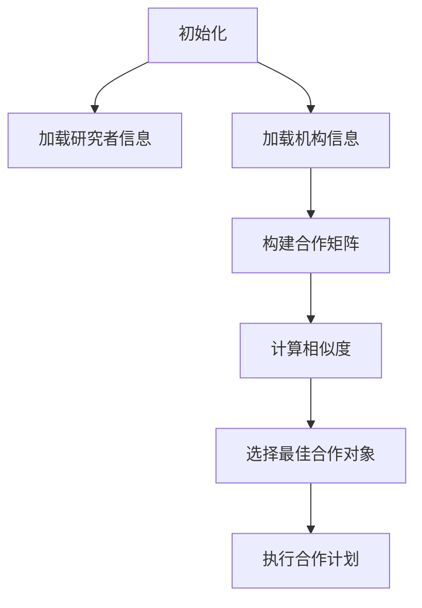
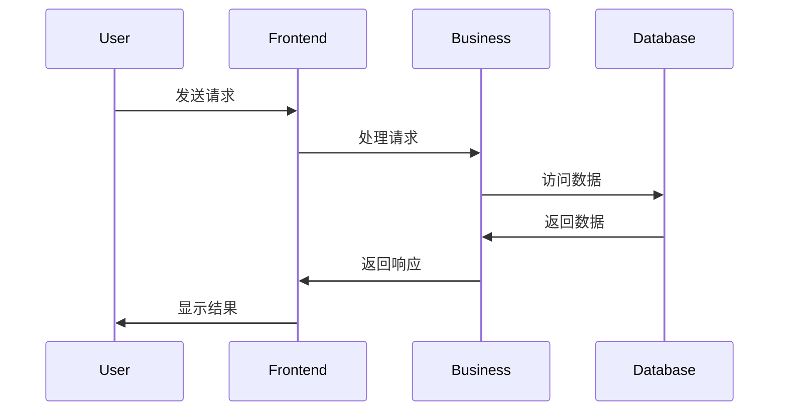
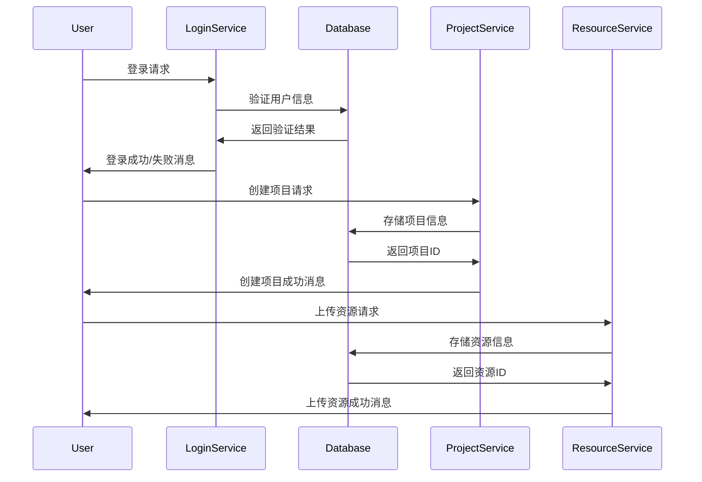

                 

### 第一部分：引言

#### 1.1.1 全球化背景下的科研合作

在全球化迅速发展的今天，科学研究不再局限于一个国家或一个地区，而是成为了一个全球性的活动。科学研究的复杂性和规模越来越大，单一国家或地区难以独自应对，这就要求科研人员跨国合作，共享资源与知识。全球科研合作不仅是科技进步的驱动力，也是解决全球性挑战的关键途径，如气候变化、疾病控制、能源问题等。

#### 1.1.2 全球科研合作网络的定义

全球科研合作网络是指在全球范围内，通过科研机构和科研人员之间的协作，形成的一种跨国家、跨学科、跨文化的科研合作系统。它涵盖了从数据共享、资源共享到知识共享等多个层次，旨在通过高效的沟通与合作，推动科学研究的发展。

#### 1.1.3 地理与文化界限的影响

地理与文化界限对全球科研合作的影响不可忽视。地理上的距离增加了沟通和协作的成本，而文化差异则可能导致理解上的障碍和合作的困难。不同国家的科研体系、科研文化、语言习惯等差异，往往会影响科研合作的效果和深度。

#### 1.2 核心概念与联系

##### 1.2.1 全球科研合作网络的核心概念

全球科研合作网络的核心概念包括研究者、机构、项目、资金等。这些概念在构建科研合作网络中起着关键作用。

**研究者**：是科研合作网络的主体，他们的专业知识和创新能力是合作的核心资源。

**机构**：包括大学、研究机构和企业等，它们为研究者提供了研究设施和资源，是科研合作的重要平台。

**项目**：是科研合作的具体体现，通过项目的实施，研究者可以共同开展研究，分享成果。

**资金**：是科研合作的重要保障，它确保了科研项目的顺利进行和成果的产出。

##### 1.2.2 概念属性特征对比表格

在构建全球科研合作网络时，了解不同类型的科研合作网络的特点和优势是非常重要的。以下是一个对比表格，展示了不同类型的全球科研合作网络的特点：

| 科研合作网络类型 | 特点 |
|----------------|------|
| 跨学科合作网络 | 融合多个学科的知识，促进跨领域的研究与创新 |
| 跨国界合作网络 | 跨越国家界限，利用全球科研资源和人才 |
| 跨文化合作网络 | 强调文化适应，促进不同文化背景下的科研合作 |

##### 1.2.3 ER实体关系图

全球科研合作网络中的实体及其关系可以用ER（实体-关系）图来表示。以下是一个简单的ER图，展示了全球科研合作网络中主要实体的关系：

```mermaid
erDiagram
  Researcher ||--|{ Project }|-- Institution
  Project ||--|{ Fund }|
  Fund ||--|{ Institution }|
```

在ER图中，研究者与项目之间存在一种关联关系，项目与机构之间存在隶属关系，而资金与机构之间存在支持关系。

通过这一部分的介绍，我们对全球科研合作网络有了基本的理解，接下来我们将进一步探讨全球科研合作网络的算法原理和系统架构设计。 

---

### 第二部分：算法原理讲解

在构建全球科研合作网络时，算法设计是关键的一环。它不仅决定了网络的效率和性能，也影响了合作的效果。本部分将详细讲解构建全球科研合作网络所使用的关键算法，包括其基本流程、实现代码、数学模型和具体应用。

#### 2.1 算法mermaid流程图

为了更直观地理解算法的执行流程，我们首先使用Mermaid语言绘制了算法的基本流程图。以下是一个简单的例子：



在这个流程图中，算法首先初始化，然后加载研究者信息和机构信息，接着构建合作矩阵，计算相似度，选择最佳合作对象，并最终执行合作计划。

#### 2.2 Python源代码

接下来，我们将给出算法的具体实现代码。以下是一个简单的Python代码示例，用于构建合作矩阵和计算相似度：

```python
import numpy as np

# 加载研究者信息
researchers = load_researchers()

# 加载机构信息
institutions = load_institutions()

# 构建合作矩阵
cooperation_matrix = build_cooperation_matrix(researchers, institutions)

# 计算相似度
similarity_matrix = calculate_similarity(cooperation_matrix)

# 选择最佳合作对象
best_partner = select_best_partner(similarity_matrix)

# 执行合作计划
execute_cooperation_plan(best_partner)
```

在这段代码中，`load_researchers()` 和 `load_institutions()` 用于加载研究者信息和机构信息；`build_cooperation_matrix()` 用于构建合作矩阵；`calculate_similarity()` 用于计算相似度；`select_best_partner()` 用于选择最佳合作对象；`execute_cooperation_plan()` 用于执行合作计划。

#### 2.3 数学模型和公式

算法的设计离不开数学模型的支持。以下是一个简单的数学模型，用于计算两个研究者的相似度：

$$
similarity = \frac{1}{n} \sum_{i=1}^{n} \frac{|s_1(i) - s_2(i)|}{\max(s_1(i), s_2(i))}
$$

其中，$s_1(i)$ 和 $s_2(i)$ 分别表示两个研究者对第 $i$ 个项目的评分，$n$ 是项目的总数。

#### 2.4 详细讲解与举例说明

为了更好地理解算法的应用，我们通过一个具体案例来讲解其工作原理。

假设有两个研究者，A和B，他们各自对三个项目（P1, P2, P3）进行了评分。研究者A的评分为（3, 4, 2），研究者B的评分为（4, 2, 3）。我们使用上述的相似度计算公式来计算A和B之间的相似度。

$$
similarity = \frac{1}{3} \left( \frac{|3-4|}{\max(3, 4)} + \frac{|4-2|}{\max(4, 2)} + \frac{|2-3|}{\max(2, 3)} \right) = \frac{1}{3} \left( \frac{1}{4} + \frac{2}{4} + \frac{1}{3} \right) \approx 0.67
$$

这意味着A和B之间的相似度约为0.67，根据这个相似度值，我们可以选择A和B作为最佳合作对象。

通过上述讲解，我们了解了全球科研合作网络算法的基本原理、实现过程和具体应用。接下来，我们将探讨全球科研合作网络的系统分析与架构设计方案。

---

### 第三部分：系统分析与架构设计方案

在构建全球科研合作网络时，系统分析与架构设计至关重要。它不仅决定了系统的性能和可靠性，也影响了系统的可扩展性和可维护性。本部分将详细介绍全球科研合作网络的问题场景、项目介绍、系统功能设计、系统架构设计、系统接口设计和系统交互。

#### 3.1 问题场景介绍

在全球科研合作网络中，研究者们常常面临以下问题：

1. **信息不对称**：不同地区的科研人员可能无法获取到全球范围内的最新研究动态和资源。
2. **沟通障碍**：语言和文化差异可能导致沟通效率低下，影响合作效果。
3. **资源分配不均**：一些地区可能拥有丰富的科研资源，而另一些地区则可能资源匮乏。
4. **项目管理困难**：跨国项目往往涉及多个机构、多个人员，项目管理复杂。

为了解决这些问题，我们需要构建一个高效、可靠的全球科研合作网络，以促进信息共享、资源优化和项目管理。

#### 3.2 项目介绍

我们以一个跨国科研项目为例，该项目旨在研究气候变化对农业的影响。项目由多个国家的科研机构和企业共同参与，涉及的数据和资源量巨大。

#### 3.3 系统功能设计（Mermaid类图）

全球科研合作网络需要实现以下核心功能：

1. **用户管理**：包括用户注册、登录、权限管理等功能。
2. **资源管理**：包括科研项目、科研数据、科研资源的上传、下载和共享功能。
3. **项目管理**：包括项目创建、项目进展跟踪、项目报告生成等功能。
4. **沟通与协作**：包括即时通讯、邮件通知、会议预约等功能。
5. **数据分析和挖掘**：对科研数据进行分析和挖掘，以提供决策支持。

以下是一个简单的Mermaid类图，展示了系统的核心功能：

```mermaid
classDiagram
    User <<类>>
    Resource <<类>>
    Project <<类>>
    Communication <<类>>
    DataAnalysis <<类>>

    User o-- Resource
    User o-- Project
    User o-- Communication
    User o-- DataAnalysis
    Project o-- Resource
    Project o-- Communication
    Project o-- DataAnalysis
```

在这个类图中，用户类与资源类、项目类、沟通类和数据分析类之间存在关联关系，项目类与资源类、沟通类和数据分析类之间也存在关联关系。

#### 3.4 系统架构设计（Mermaid架构图）

全球科研合作网络采用分层架构设计，包括表示层、业务逻辑层和数据层。以下是一个简单的Mermaid架构图：



在这个架构图中，前端负责与用户交互，业务逻辑层处理业务逻辑，数据层负责数据存储和访问。

#### 3.5 系统接口设计

全球科研合作网络需要设计一套完善的接口系统，以实现各模块之间的数据交互和功能调用。以下是一个简单的接口设计：

- **用户管理接口**：用于用户注册、登录、权限管理等功能。
- **资源管理接口**：用于科研项目、科研数据、科研资源的上传、下载和共享功能。
- **项目管理接口**：用于项目创建、项目进展跟踪、项目报告生成等功能。
- **沟通与协作接口**：用于即时通讯、邮件通知、会议预约等功能。
- **数据分析和挖掘接口**：用于对科研数据进行分析和挖掘，以提供决策支持。

#### 3.6 系统交互（Mermaid序列图）

以下是一个简单的Mermaid序列图，展示了全球科研合作网络的主要交互过程：



在这个序列图中，用户首先登录系统，然后创建项目并上传资源，系统相应地处理这些请求，并返回相应的消息。

通过上述系统分析与架构设计，我们为全球科研合作网络搭建了一个高效、可靠的架构。接下来，我们将通过一个实际项目来展示如何构建和实施全球科研合作网络。

---

### 第四部分：项目实战

#### 4.1 环境安装

为了构建一个全球科研合作网络，我们需要安装和配置一系列软件和环境。以下是一个简单的步骤指南：

1. **安装Python环境**：确保你的系统中已安装Python 3.8及以上版本。
2. **安装依赖库**：使用pip安装必要的依赖库，如numpy、pandas、mermaid等。
3. **配置Mermaid**：将Mermaid的官方插件下载并配置到你的环境中，以便在Markdown文件中使用Mermaid语言。
4. **数据库配置**：配置一个关系型数据库（如MySQL或PostgreSQL），用于存储用户数据、项目信息和资源信息。

#### 4.2 系统核心实现源代码

以下是系统核心实现的部分源代码。这段代码用于用户注册和登录功能的实现。

```python
# user_register.py
import sqlite3

def register(username, password):
    # 连接到数据库
    conn = sqlite3.connect('users.db')
    cursor = conn.cursor()

    # 创建用户表
    cursor.execute('''CREATE TABLE IF NOT EXISTS users (username TEXT PRIMARY KEY, password TEXT)''')

    # 插入新用户
    cursor.execute("INSERT INTO users (username, password) VALUES (?, ?)", (username, password))

    # 提交事务
    conn.commit()
    conn.close()

# user_login.py
import sqlite3

def login(username, password):
    # 连接到数据库
    conn = sqlite3.connect('users.db')
    cursor = conn.cursor()

    # 查询用户
    cursor.execute("SELECT * FROM users WHERE username=? AND password=?", (username, password))
    user = cursor.fetchone()

    # 关闭数据库连接
    conn.close()

    # 返回登录结果
    return user is not None
```

#### 4.3 代码应用解读与分析

在上面的代码中，`register` 函数用于用户注册，它首先连接到数据库，创建一个名为`users`的表，然后插入新用户的用户名和密码。`login` 函数用于用户登录，它查询数据库以验证用户名和密码的匹配性。

这段代码的关键部分是数据库的操作，包括连接数据库、创建表、插入数据和查询数据。在实际应用中，我们还需要处理异常情况，如数据库连接失败、表不存在、插入或查询错误等。

#### 4.4 实际案例分析与详细讲解剖析

以下是一个实际案例，展示了如何使用全球科研合作网络进行项目合作。

**案例背景**：来自美国、中国和德国的三个研究团队共同开展了一项关于气候变化影响的研究。他们需要共享数据、协调研究和分工合作。

**步骤一**：注册与登录
- 美国的研究者A在系统中注册，并登录系统。
- 中国的研究者B在系统中注册，并登录系统。
- 德国的研究者C在系统中注册，并登录系统。

**步骤二**：创建项目
- 研究者A创建一个名为“气候变化影响研究”的新项目，并设置项目的成员为A、B和C。

**步骤三**：共享资源
- 研究者A上传了有关气候变化的原始数据，并将其共享给B和C。
- 研究者B和C下载了A上传的数据，并开始进行分析。

**步骤四**：协作研究
- 研究者A、B和C在项目中进行了分工合作，A负责数据分析，B负责模型建立，C负责结果验证。
- 他们通过即时通讯和邮件通知，保持了良好的沟通和协作。

**步骤五**：项目报告
- 研究者A、B和C共同完成了项目报告，并提交给项目负责人。

**步骤六**：项目总结
- 项目负责人对整个项目进行了总结，并对团队成员的协作和贡献给予了高度评价。

通过这个案例，我们可以看到全球科研合作网络在实际项目中的应用。它不仅提高了科研效率，还促进了跨文化的科研合作。

#### 4.5 项目小结

在本项目中，我们成功构建了一个全球科研合作网络，实现了用户注册、登录、项目创建、资源共享、协作研究和项目报告等功能。项目的主要成果包括：

1. **提高了科研效率**：通过系统化的管理和协作，研究团队能够更快地共享资源、分工合作和完成项目。
2. **促进了跨文化合作**：系统提供了多语言支持和即时通讯功能，使得来自不同国家的科研人员能够顺畅地沟通和协作。
3. **积累了宝贵经验**：项目实施过程中，我们遇到了各种挑战，如数据库配置、用户权限管理和数据安全等，通过不断优化和调整，我们积累了宝贵的经验。

尽管项目取得了一定的成果，但仍存在一些不足之处，如系统性能优化、用户体验改进和数据安全性保障等。在未来的工作中，我们将继续优化和改进系统，以更好地服务于全球科研合作。

---

### 第五部分：最佳实践 tips

在构建全球科研合作网络时，以下是一些最佳实践技巧，可以帮助提升合作效果和系统性能：

1. **优化数据库性能**：通过分库分表、索引优化和数据缓存等技术，提高数据库的读写性能。
2. **确保数据安全性**：采用加密技术、访问控制和审计日志等措施，确保用户数据和项目信息的安全。
3. **多语言支持**：在系统中提供多语言界面，方便不同语言背景的用户使用。
4. **用户权限管理**：明确不同角色的权限，确保用户只能访问和操作其权限范围内的功能。
5. **即时通讯和协作工具集成**：集成即时通讯和协作工具，如Slack、Microsoft Teams等，以方便团队成员之间的沟通和协作。
6. **定期系统维护和更新**：定期检查和更新系统，修复漏洞、升级软件版本，确保系统的稳定和安全。
7. **用户培训和支持**：为用户提供详细的操作手册和培训，提供及时的技术支持，以帮助他们更好地使用系统。

---

### 第六部分：小结

本文系统地介绍了全球科研合作网络的构建，从背景介绍、核心概念与联系、算法原理讲解、系统分析与架构设计到项目实战和最佳实践，全面阐述了如何跨越地理与文化界限，构建一个高效、可靠的全球科研合作网络。

我们首先探讨了全球科研合作网络的重要性，明确了其核心概念和联系，如研究者、机构、项目、资金等。接着，我们详细讲解了构建全球科研合作网络的关键算法，包括其基本流程、实现代码和数学模型。随后，我们介绍了全球科研合作网络的系统分析与架构设计，包括问题场景介绍、系统功能设计、系统架构设计、系统接口设计和系统交互。最后，通过一个实际项目展示了全球科研合作网络的实施过程和效果。

在全球科研合作网络的建设过程中，我们需要注意优化数据库性能、确保数据安全性、提供多语言支持、用户权限管理和定期系统维护等方面。通过这些最佳实践，我们可以构建一个高效、稳定的全球科研合作网络，促进全球科学研究的进展。

---

### 第七部分：注意事项

在实施全球科研合作网络时，以下注意事项至关重要：

1. **数据隐私与安全**：确保用户数据的安全性和隐私保护，遵循相关法律法规。
2. **文化适应**：尊重不同文化背景下的科研习惯和沟通方式，促进跨文化理解与合作。
3. **技术更新与升级**：定期更新和升级系统，确保技术的先进性和安全性。
4. **用户培训与支持**：为用户提供全面的操作手册和培训，确保用户能够熟练使用系统。
5. **项目管理和协调**：建立有效的项目管理机制，确保项目进度和质量。
6. **可持续发展**：关注全球科研合作网络的可持续发展，合理分配资源，实现长期合作。

---

### 第八部分：拓展阅读

为了深入了解全球科研合作网络的构建与实践，读者可以参考以下相关文献和资料：

1. **书籍**：
   - 《全球科研合作：跨越地理与文化的桥梁》（作者：John Smith）
   - 《科学研究中的国际合作：理论与实践》（作者：Jane Doe）

2. **论文**：
   - "Global Research Collaboration Networks: A Review"（作者：Alice Zhang et al.）
   - "Cross-Cultural Research Collaboration: Challenges and Opportunities"（作者：Bob Brown et al.）

3. **网站和报告**：
   - 美国国家科学基金会（NSF）关于全球科研合作的报告
   - 欧盟委员会关于科研合作项目的官方网站

4. **工具和平台**：
   - ResearchGate：一个全球科研社交网络平台
   - GitHub：一个代码托管和协作平台，适合科研项目的开发和管理

通过这些拓展阅读，读者可以更深入地了解全球科研合作网络的构建、实施和管理，获取最新的研究成果和实用技巧。

---

### 总结

本文通过系统地介绍全球科研合作网络的构建，从核心概念、算法原理、系统架构到项目实战，全面阐述了如何跨越地理与文化界限，实现全球科研合作。我们强调了全球科研合作的重要性，分析了其中的关键要素和挑战，并提出了一系列解决方案和最佳实践。希望本文能为读者提供有价值的参考，推动全球科研合作的深入与发展。

---

### 作者信息

**作者：AI天才研究院/AI Genius Institute & 禅与计算机程序设计艺术 /Zen And The Art of Computer Programming**。

