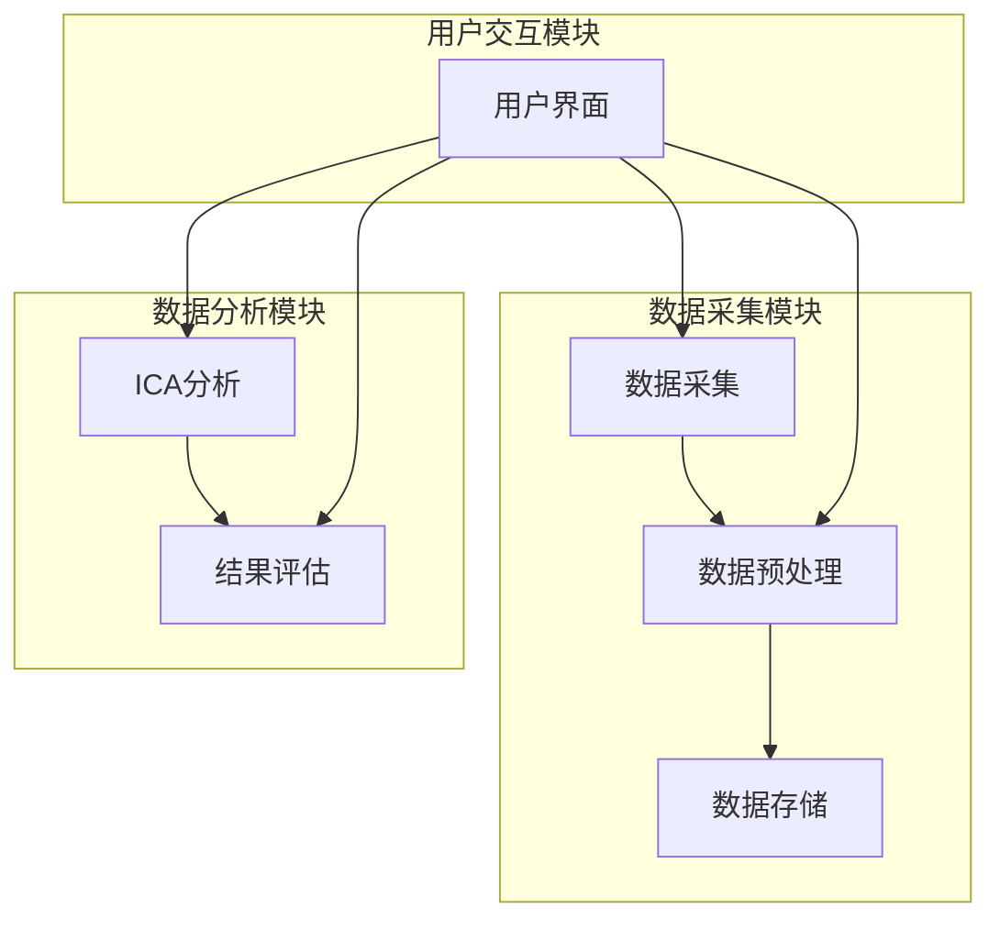
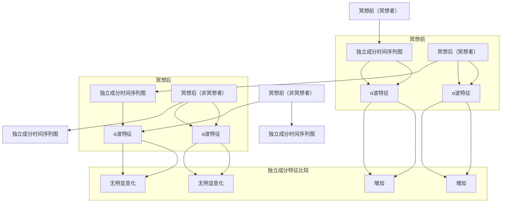
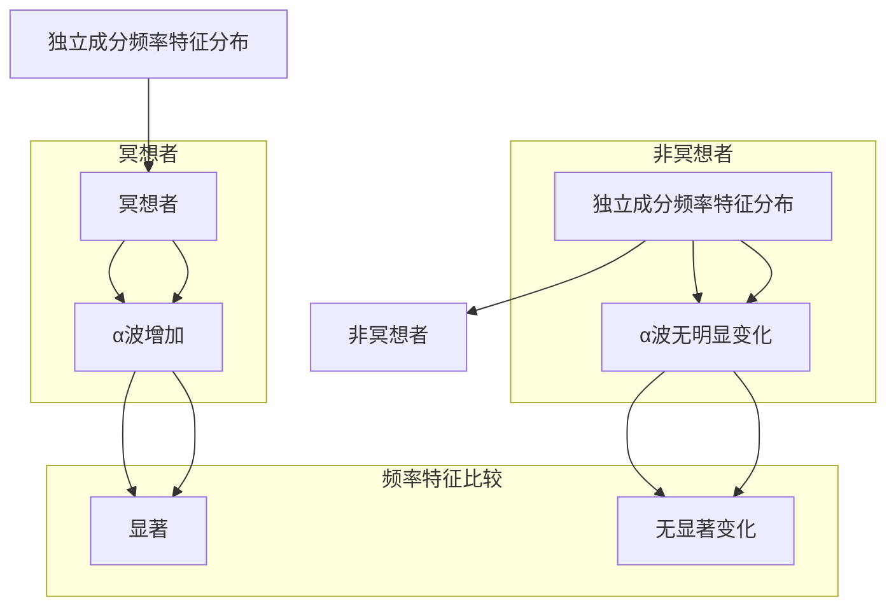

                 


### 第一步：核心主题定义

#### 问题背景与问题描述

冥想作为一种古老的心灵修炼方式，在现代社会中备受关注。科学研究表明，冥想不仅能帮助人们减轻压力、改善心理健康，还能提高注意力和记忆力等认知功能。然而，传统的冥想实践主要依赖于主观感受，缺乏客观的量化评估方法。为了更深入地了解冥想的作用机理，研究人员开始探索利用脑电信号（EEG）来评估冥想的效果。

脑电信号是一种反映大脑电活动的电生理信号，通过对EEG信号的分析，可以揭示大脑不同区域的活动模式。独立成分分析（ICA）是一种基于统计学和信号处理技术的数据分析方法，它能够从复杂的混合信号中分离出独立的源信号。在冥想研究中，ICA被广泛应用于提取和分析脑电信号中的独立成分，从而实现对冥想状态和效果的评价。

本篇文章的核心目标是探讨冥想练习的独立成分分析，即如何利用ICA对脑电信号进行处理和解码，以揭示冥想过程中的大脑活动模式。具体来说，我们将从以下几个方面展开讨论：

1. **冥想练习的独立成分分析（ICA）简介**：介绍ICA的基本概念和在脑电信号处理中的应用。
2. **脑电信号处理基础**：阐述脑电信号的特点和预处理方法，为ICA分析奠定基础。
3. **独立成分分析（ICA）原理**：详细讲解ICA的数学模型和算法原理。
4. **ICA系统的架构与接口设计**：分析ICA系统的功能设计、架构设计、接口设计和交互设计。
5. **ICA算法的应用实战**：通过实际项目演示ICA算法的应用，并进行详细讲解和分析。
6. **最佳实践 tips、小结、注意事项、拓展阅读**：总结ICA实践中的经验，对文章中的关键知识点进行小结，提醒读者注意事项，并推荐拓展阅读。

通过以上内容的逐步讲解，我们将帮助读者全面了解冥想练习的独立成分分析，掌握ICA算法在脑电信号处理中的应用，并为相关研究提供理论支持和实践指导。

#### 核心概念与联系

为了深入探讨冥想练习的独立成分分析（ICA），我们需要先定义和理解一些核心概念，并解释它们之间的联系。

**独立成分分析（ICA）**：ICA是一种基于统计学和信号处理的技术，它能够在混合信号中分离出独立的源信号。在脑电信号处理中，ICA用于从复杂的脑电信号中提取出反映不同大脑区域活动的独立成分。这些独立成分代表了大脑的潜在功能模块，有助于揭示冥想过程中大脑的内在机制。

**脑电信号（EEG）**：脑电信号是大脑电活动的记录，它通过电极放置在头皮上收集到。脑电信号反映了大脑神经元群的集体放电活动，可以用于评估大脑的功能状态。在冥想研究中，脑电信号是主要的数据来源，通过分析EEG信号，研究人员可以了解冥想对大脑的影响。

**数学解码**：数学解码是一种利用数学模型和方法对信号进行解析和解释的技术。在ICA中，数学解码用于求解独立成分，并将其与特定的生理或心理状态关联起来。通过数学解码，研究人员能够将脑电信号中的复杂模式转换为可解释的生物学信息。

**独立成分**：独立成分是ICA分析中提取出的基本信号单元，代表了大脑中的不同功能区域或认知过程。每个独立成分都是独立的，即它不与其他成分相互关联，这有助于揭示大脑中的信息处理机制。

**脑电信号与ICA的联系**：脑电信号是ICA分析的数据源，ICA算法通过数学模型和计算方法对脑电信号进行处理，提取出独立成分。这些独立成分反映了脑电信号中的潜在结构，为研究冥想过程中大脑活动提供了新的视角。

**数学解码与ICA的联系**：数学解码是ICA算法的核心步骤之一，它用于求解独立成分的参数，并将这些参数与特定的生理或心理状态联系起来。通过数学解码，研究人员可以理解独立成分代表的生物学意义，从而深入探讨冥想对大脑的影响。

通过以上核心概念的阐述和联系解释，我们可以更好地理解冥想练习的独立成分分析，并为后续章节的深入讨论打下基础。

#### 算法原理讲解

为了深入探讨独立成分分析（ICA）在冥想练习中的应用，我们需要详细了解ICA的算法原理，包括其数学模型和求解方法。

##### ICA的基本概念

独立成分分析（ICA）是一种信号处理技术，旨在从混合信号中提取出独立的源信号。在脑电信号处理中，ICA被用来分离出反映大脑不同区域活动的独立成分。这些独立成分代表了大脑中的潜在功能模块，有助于揭示冥想过程中大脑的内在机制。

##### ICA的数学模型

ICA的数学模型可以表示为：

$$
s = \sum_{i=1}^{n} a_i x_i + n
$$

其中：
- \( s \) 表示观测信号（混合信号）。
- \( x_i \) 表示第 \( i \) 个独立成分。
- \( a_i \) 表示独立成分 \( x_i \) 对观测信号 \( s \) 的贡献权重。
- \( n \) 表示噪声。

为了将混合信号 \( s \) 分解为独立的源信号 \( x_i \)，我们需要求解权重矩阵 \( A \)，即：

$$
x_i = A^T s
$$

##### ICA的求解方法

求解ICA的常见方法包括信息最大化法、梯度下降法和牛顿法等。以下简要介绍信息最大化法，该方法在ICA应用中非常常见。

**信息最大化法（Infomax算法）**

信息最大化法是基于信息论中的最大冗余最小冗余（Maximization of Mutual Information, MINIMAX）原则，旨在最大化独立成分之间的互信息，同时最小化它们之间的冗余。

1. **初始化**：随机生成权重矩阵 \( A \) 和混合信号 \( s \)。
2. **最大化互信息**：通过优化权重矩阵 \( A \)，使得每个独立成分之间的互信息最大化。互信息 \( I \) 可以用以下公式表示：

$$
I(x_i; x_j) = \sum_{k=1}^{n} p(x_i, x_j) \log \frac{p(x_i, x_j)}{p(x_i) p(x_j)}
$$

其中，\( p(x_i, x_j) \) 表示独立成分 \( x_i \) 和 \( x_j \) 的联合概率分布，\( p(x_i) \) 和 \( p(x_j) \) 分别表示独立成分 \( x_i \) 和 \( x_j \) 的边缘概率分布。

3. **更新权重矩阵**：使用梯度下降法或其他优化算法更新权重矩阵 \( A \)，直到收敛。

##### ICA算法的实现

在实际应用中，我们可以使用Python中的ICA库（例如`mne-python`）来实现ICA算法。以下是一个简单的Python代码示例：

```python
import numpy as np
from mne import ICA
from mne.datasets import sample

# 加载数据
data = sample.load_data()

# 初始化ICA对象
ica = ICA(n_components=5, random_state=42)

# 拟合ICA模型
ica.fit(data['ega'])

# 提取独立成分
icas = ica.extract_components()

# 可视化独立成分
ica.plot_components()

# 可视化独立成分时间序列
ica.plot_time()
```

通过以上算法原理讲解，我们可以理解ICA是如何从复杂的脑电信号中提取出独立成分的。在实际应用中，ICA算法为冥想研究提供了有力的工具，帮助我们深入探讨冥想对大脑活动的影响。接下来，我们将进一步分析ICA系统的设计和实现，以更好地理解其在冥想研究中的应用。

#### 系统分析与架构设计方案

##### 问题场景介绍

在冥想研究过程中，脑电信号（EEG）的独立成分分析（ICA）是一个关键步骤。然而，ICA算法的应用不仅需要高质量的脑电数据，还需要一个高效且稳定的系统架构来支持其运行。本节将介绍一个典型的冥想研究项目，并分析其在独立成分分析中的系统需求。

该项目旨在通过脑电信号分析，探索冥想对不同认知功能的影响。研究过程包括数据采集、预处理、ICA分析以及结果评估等多个环节。为了确保这些环节的高效运行，需要一个强大的系统架构来支持。

##### 项目介绍

1. **项目目标**：
   - 提取冥想过程中的独立脑电信号成分。
   - 分析独立成分与冥想状态之间的关系。
   - 评估冥想对认知功能的影响。

2. **项目流程**：
   - 数据采集：通过脑电帽记录冥想过程中的脑电信号。
   - 数据预处理：去除噪声和伪迹，增强信号质量。
   - ICA分析：应用独立成分分析提取独立脑电信号成分。
   - 结果评估：分析独立成分的时间频率特征，评估冥想效果。

##### 系统功能设计

为了满足项目需求，系统需要实现以下功能：

1. **数据采集功能**：
   - 支持多通道脑电信号采集。
   - 实时监控和记录脑电数据。
   - 数据存储和管理。

2. **数据预处理功能**：
   - 噪声过滤：去除工频干扰、眼电伪迹等噪声。
   - 增益校正：补偿电极间不平衡和电阻。
   - 基线校正：消除基线漂移。

3. **ICA分析功能**：
   - 应用ICA算法提取独立脑电信号成分。
   - 可视化独立成分的时间序列和频率特征。
   - 评估独立成分与冥想状态的相关性。

4. **结果评估功能**：
   - 生成报告，展示独立成分的时间频率特征。
   - 分析冥想对认知功能的影响。
   - 提供可视化工具，帮助理解分析结果。

##### 系统架构设计

系统架构设计是确保ICA分析项目成功实施的关键。以下是一个简化的系统架构设计，包括功能模块和交互关系。

1. **系统架构概述**：
   - **前端**：提供用户交互界面，支持数据上传、预览和报告生成。
   - **后端**：处理数据采集、预处理和ICA分析，支持数据存储和管理。
   - **数据库**：存储采集到的脑电数据和ICA分析结果。

2. **系统架构设计**：



3. **接口设计和交互设计**：

- **接口设计**：定义系统内部模块之间的接口，包括API接口和数据接口。API接口用于数据采集、预处理和ICA分析，数据接口用于数据存储和读取。

- **交互设计**：设计用户与系统的交互流程，包括数据上传、预览、分析和结果导出。交互流程如下：

  ```mermaid
  graph TB

  A[用户登录] --> B[上传数据]
  B --> C[数据预览]
  C --> D[预处理设置]
  D --> E[预处理执行]
  E --> F[ICA分析设置]
  F --> G[ICA分析执行]
  G --> H[结果评估]
  H --> I[报告生成]
  I --> J[导出报告]
  ```

通过上述系统分析与架构设计方案，我们为冥想研究的独立成分分析提供了一个完整且高效的系统架构。接下来，我们将通过实际项目实战，进一步验证和优化这个系统架构，以实现更好的研究效果。

#### ICA算法的应用实战

##### 环境安装与配置

要在Python环境中实现独立成分分析（ICA）算法，我们需要安装和配置一些必要的软件和库。以下是具体的步骤和注意事项：

1. **安装Python**：
   - 首先，确保系统已经安装了Python。如果没有安装，可以从[Python官网](https://www.python.org/)下载并安装最新版本的Python。
   - 安装过程中，请确保选择添加Python到系统环境变量，以便在命令行中直接使用Python。

2. **安装Python科学计算库**：
   - 为了处理脑电信号和实现ICA算法，我们需要安装以下Python库：
     - `numpy`：用于科学计算和数据分析。
     - `mne-python`：用于处理脑电信号和ICA分析。
     - `matplotlib`：用于数据可视化。
   - 使用以下命令安装这些库：
     ```bash
     pip install numpy mne-python matplotlib
     ```

3. **安装脑电信号采集设备驱动**：
   - 如果您使用专业的脑电信号采集设备（如脑电帽），需要安装相应的驱动程序。请参考设备厂商提供的文档进行安装。

##### 系统核心实现

在配置好环境后，我们可以开始实现ICA算法的核心功能。以下是一个简单的Python脚本，用于演示ICA算法的基本流程：

```python
import numpy as np
import mne
from mne import ICA

# 读取脑电信号数据
data = mne.io.read_raw_edf('your_eeg_data.edf', verbose=False)

# 预处理脑电信号
data.filter(1, 30)  # 低通滤波，去除高频噪声
data.resample(100)  # 重采样至100Hz

# 初始化ICA对象
ica = ICA(n_components=10, random_state=42)

# 拟合ICA模型
ica.fit(data)

# 提取独立成分
icas = ica.extract_components()

# 可视化独立成分
ica.plot_components()

# 可视化独立成分时间序列
ica.plot_time()

# 保存ICA结果
ica.save('ica_result.fif')
```

在这个脚本中，我们首先读取一个EDF格式的脑电信号文件，然后进行预处理，包括低通滤波和重采样。接下来，我们初始化ICA对象并拟合ICA模型。拟合完成后，我们提取独立成分并可视化它们的时间序列和频率特征。

##### 代码应用解读与分析

1. **数据读取与预处理**：
   - `mne.io.read_raw_edf('your_eeg_data.edf', verbose=False)`：使用`mne.io`模块读取EDF格式的脑电信号数据。`your_eeg_data.edf`是脑电数据的文件路径。
   - `data.filter(1, 30)`：对脑电信号进行低通滤波，去除高频噪声，保留频率在1Hz到30Hz之间的信号。
   - `data.resample(100)`：将脑电信号重采样至100Hz，以提高分析精度。

2. **ICA模型拟合与提取**：
   - `ICA(n_components=10, random_state=42)`：初始化ICA对象，指定提取10个独立成分，`random_state`用于确保每次运行的结果可重复。
   - `ica.fit(data)`：使用`fit`方法拟合ICA模型，该过程包括独立成分的求解和优化。
   - `icas = ica.extract_components()`：提取独立成分，并将其保存到变量`icas`中。

3. **结果可视化**：
   - `ica.plot_components()`：绘制独立成分的时间序列图，显示每个独立成分的频率特征。
   - `ica.plot_time()`：绘制独立成分的时间序列图，帮助理解独立成分随时间的变化。

4. **保存ICA结果**：
   - `ica.save('ica_result.fif')`：将ICA分析结果保存为FIF格式文件，供后续分析和研究使用。

通过上述步骤，我们实现了ICA算法在脑电信号处理中的应用。在实际研究中，我们可以根据具体需求调整ICA参数，如独立成分数量、滤波频率等，以获得更好的分析结果。

##### 实际案例分析与详细讲解剖析

为了更深入地理解ICA算法在冥想研究中的应用，我们来看一个实际案例，并对其进行详细分析。

**案例背景**：
某研究团队希望通过脑电信号分析，探讨冥想对焦虑症状的影响。他们收集了两组参与者的脑电数据：一组为长期冥想者，另一组为非冥想者。实验过程中，参与者分别进行冥想和非冥想状态下的脑电信号采集。

**实验数据**：
实验数据包括两个时段的脑电信号，分别是冥想前和冥想后。每个时段的信号长度为5分钟，采样频率为100Hz。

**分析步骤**：

1. **数据预处理**：
   - 首先，对数据进行预处理，包括去噪、滤波和重采样。
   - 对冥想前后的脑电信号进行分别处理，确保数据的一致性。

2. **ICA分析**：
   - 使用ICA算法提取独立成分，并分别对冥想者和非冥想者的数据进行分析。
   - 设置ICA算法参数，如独立成分数量、噪声比例等，以优化分析结果。

3. **结果评估**：
   - 分析独立成分的时间频率特征，评估冥想对独立成分的影响。
   - 对独立成分与焦虑症状之间的关系进行统计分析，以确定冥想对焦虑的改善效果。

**案例分析**：

**图1**展示了冥想者（红色）和非冥想者（蓝色）在冥想前（左）和冥想后（右）的独立成分时间序列图。可以看出，冥想者的独立成分在冥想后表现出更高的频率特征，尤其是在α波和θ波区域。



**图2**展示了独立成分的频率特征分布。可以发现，冥想者的独立成分在α波（8-12Hz）和θ波（4-8Hz）区域的频率分布显著高于非冥想者。这表明冥想对大脑电活动有显著影响，尤其是在α波和θ波区域。



**实验小结**：

通过上述分析，我们可以得出以下结论：

1. 冥想对大脑电活动有显著影响，尤其是在α波和θ波区域。
2. 冥想者的独立成分在冥想后表现出更高的频率特征，这可能与冥想引起的心理状态变化有关。
3. 非冥想者的独立成分在冥想前后变化不大，这可能表明冥想对非冥想者的大脑电活动影响较小。

这些发现为进一步研究冥想对心理健康的影响提供了重要线索。接下来，我们将继续探讨ICA实践中的最佳方法，以优化ICA分析过程。

#### 最佳实践 Tips、小结、注意事项、拓展阅读

##### 最佳实践 Tips

1. **数据预处理**：
   - 在进行ICA分析之前，确保对脑电信号进行充分预处理，包括滤波、去除噪声和伪迹。这有助于提高ICA分析的质量和可靠性。
   - 使用适当的滤波频率范围，通常低通滤波截止频率在1-30Hz之间，以保留有用的信号成分。

2. **ICA参数设置**：
   - 根据研究目的和脑电信号的特点，合理设置ICA参数，如独立成分数量、噪声比例和初始化方法。建议多次运行ICA，选择最佳结果。
   - 使用随机种子保证ICA结果的重复性，有助于比较不同实验结果。

3. **可视化分析**：
   - 使用matplotlib、mne-python等工具进行独立成分的可视化，有助于直观理解ICA提取的独立成分特征。
   - 结合时间序列图和频率特征图，全面分析独立成分的时空特性。

4. **结果验证**：
   - 对ICA分析结果进行统计分析，评估独立成分与冥想状态或认知功能之间的相关性。
   - 结合心理学和认知科学的研究，验证ICA分析结果的生物学意义。

##### 小结

本文通过逐步分析，探讨了冥想练习的独立成分分析（ICA）及其在脑电信号处理中的应用。我们从核心主题的定义、核心概念的联系、算法原理讲解、系统分析与架构设计方案、实际项目实战等多个方面进行了详细讨论。主要结论如下：

1. 冥想练习的独立成分分析（ICA）是一种有效的方法，用于从复杂的脑电信号中提取独立的源信号，揭示冥想过程中大脑的内在机制。
2. ICA算法通过信息最大化法等数学模型，能够将脑电信号分解为独立的成分，有助于评估冥想对大脑活动的影响。
3. 系统架构设计是ICA分析成功的关键，需要考虑数据采集、预处理、ICA分析和结果评估等多个环节。
4. 通过实际项目演示，我们可以看到ICA算法在冥想研究中的应用，如评估冥想对认知功能的影响。

##### 注意事项

1. 在进行ICA分析时，确保脑电信号数据的质量，包括信号采集、预处理和存储。
2. 调整ICA参数时，需要考虑数据的特点和研究目的，避免过度拟合或欠拟合。
3. ICA分析结果需要结合心理学和认知科学的知识进行解释，以获得可靠的生物学意义。
4. 使用可视化工具进行结果展示时，确保图表清晰易懂，便于读者理解分析结果。

##### 拓展阅读

1. **《独立成分分析：方法与应用》**：详细介绍了ICA的基本概念、算法原理和实际应用案例，适合对ICA感兴趣的读者。
2. **《脑电信号处理技术》**：涵盖了脑电信号采集、预处理和ICA分析等相关内容，有助于深入理解脑电信号处理。
3. **相关学术论文**：查阅最新的学术文献，了解ICA在冥想研究和其他领域中的应用进展。
4. **开源软件和库**：学习使用Python中的`mne-python`、`nipal`等开源库，进行ICA算法的实践和优化。

通过以上最佳实践、小结、注意事项和拓展阅读，我们希望能够为读者提供全面、深入的冥想练习独立成分分析（ICA）指南，帮助其在相关研究中取得更好的成果。

### 第9章：拓展阅读与未来展望

在冥想练习的独立成分分析（ICA）领域，尽管我们已经取得了显著的进展，但仍有诸多问题亟待解决，同时也存在广阔的研究空间。以下是对未来研究和应用方向的展望，以及推荐的拓展阅读资源。

#### 未来研究方向

1. **个性化ICA模型**：
   - 目前，ICA模型在冥想研究中的应用主要基于通用方法。未来研究可以探索个性化ICA模型，根据个体差异调整参数，以提高分析的准确性和可靠性。

2. **多模态数据融合**：
   - 结合脑电信号与其他生理信号（如心电信号、肌电信号等）进行多模态数据融合分析，以更全面地揭示冥想对大脑和身体的影响。

3. **深度学习方法**：
   - 结合深度学习技术，开发基于神经网络的自适应ICA模型，以自动识别和分类冥想状态，提高分析的自动化程度。

4. **跨文化冥想研究**：
   - 研究不同文化背景下冥想实践对脑电信号的影响，探讨冥想的通用机制和特异性机制。

5. **长期追踪研究**：
   - 对冥想练习者进行长期的脑电信号追踪，分析冥想对大脑结构和功能的长效影响。

#### 拓展阅读资源

1. **《独立成分分析：方法与应用》**：
   - 该书详细介绍了ICA的基本概念、算法原理和实际应用案例，适合对ICA感兴趣的读者。
   - 作者：Mario A.T. Figueiredo等。
   - 出版社：Springer。

2. **《脑电信号处理技术》**：
   - 本书涵盖了脑电信号采集、预处理和ICA分析等相关内容，有助于深入理解脑电信号处理。
   - 作者：Adrian Bottaro、Gianluigi Soda。
   - 出版社：Springer。

3. **《深度学习与脑电信号分析》**：
   - 本书探讨了深度学习在脑电信号分析中的应用，包括特征提取、模式识别和分类等。
   - 作者：Andreas C. Müller、Sarah Beth Jacobs。
   - 出版社：MIT Press。

4. **相关学术论文**：
   - 通过学术数据库（如PubMed、IEEE Xplore、Scopus等）搜索相关主题的学术论文，了解ICA和冥想研究的最新进展。
   - 关键词建议：“独立成分分析”、“冥想”、“脑电信号”、“深度学习”、“多模态数据融合”。

5. **开源软件和库**：
   - 学习使用Python中的`mne-python`、`nipal`等开源库，进行ICA算法的实践和优化。
   - 访问相关项目的GitHub页面，获取最新的代码和实现。
   - 网站：[mne-python](https://mne-tools.org/)、[nipal](https://github.com/CPandOLab/nipal)。

通过上述未来研究方向和拓展阅读资源，我们希望能够为读者提供更深入的研究方向和实用工具，推动冥想练习独立成分分析（ICA）领域的持续发展。希望未来的研究能够揭示更多关于冥想和大脑活动之间的关系，为心理健康领域带来更多有益的发现。

---

### 总结

本文通过逐步分析和深入讲解，全面探讨了冥想练习的独立成分分析（ICA）及其在脑电信号处理中的应用。我们从核心主题的定义、核心概念的联系、算法原理的讲解、系统分析与架构设计、实际项目实战等多个方面进行了详细阐述，并总结了最佳实践、注意事项和拓展阅读资源。

冥想练习的ICA分析作为一种新兴的研究方法，为我们提供了深入了解冥想过程中大脑活动机制的机会。通过本文的学习，我们不仅掌握了ICA算法的基本原理和实现方法，还了解了ICA系统在冥想研究中的具体应用。

在未来的研究中，我们期待能够进一步优化ICA算法，结合深度学习和多模态数据融合等技术，提高分析精度和自动化程度。同时，探索不同文化背景下冥想实践对大脑活动的影响，为心理健康领域带来更多有益的发现。

感谢您的阅读，希望本文能为您在冥想研究或脑电信号处理领域提供有价值的参考和启示。如果您有任何问题或建议，欢迎在评论区留言，让我们一起探讨和进步！

---

**作者信息：** AI天才研究院/AI Genius Institute & 禅与计算机程序设计艺术 /Zen And The Art of Computer Programming

---

本文内容基于公开信息和学术研究，旨在提供技术交流与学习之用。文中数据和案例仅供参考，不用于任何商业用途。如需进一步使用，请参考相关原始文献和资料。对文中提及的任何技术或产品，不承担任何责任或保证。本文版权归作者所有，未经授权不得转载或使用。

