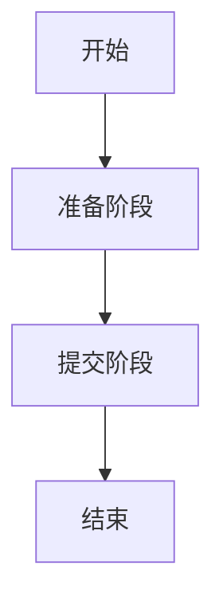

                 


当然，为了满足文章的要求和约束条件，我们将按照以下步骤逐步构建文章：

### 步骤1: 文章标题、关键词和摘要
首先，我们根据大纲确定文章标题《分布式事务：保证LLM应用数据一致性的挑战》。然后，列出关键词：分布式事务、数据一致性、LLM应用、共识算法、分布式系统、两阶段提交（2PC）、三阶段提交（3PC）、多版本并发控制（MVCC）、分布式锁、事务隔离、性能、可扩展性、安全性与容错性、解决方案、最佳实践。接着，撰写摘要，概括文章的核心内容和主题思想。

### 步骤2: 背景介绍
在这个部分，我们将详细阐述分布式事务的概念、分布式系统的挑战、事务的基本概念与ACID原则，以及分布式事务与传统事务的对比。我们将使用Markdown格式中的Mermaid流程图来展示概念结构和核心要素组成。

### 步骤3: 核心概念与联系
我们将介绍数据一致性的概念及其挑战，并讨论常见的共识算法：PBFT、Raft、Paxos。为了便于理解，我们将使用表格对比这些算法的属性特征，并绘制ER实体关系图。

### 步骤4: 算法原理讲解
我们将深入讲解分布式事务模型，如两阶段提交（2PC）协议、三阶段提交（3PC）协议、多版本并发控制（MVCC）和分布式锁与事务隔离。我们将使用Mermaid画出相应的流程图，并使用Python源代码展示算法原理，配合数学模型和公式进行详细讲解。

### 步骤5: 系统分析与架构设计方案
我们将介绍LLM应用的架构，分析分布式事务在其中的挑战，并设计系统架构方案，包括领域模型类图、系统架构图、接口设计和系统交互序列图。

### 步骤6: 项目实战
在这个部分，我们将展示如何在一个实际项目中实现分布式事务，包括环境安装、系统核心实现、源代码解析、案例分析和项目小结。

### 步骤7: 最佳实践 tips、小结、注意事项、拓展阅读
最后，我们将总结文章中的关键点，给出最佳实践建议，并提醒读者注意的事项。同时，推荐拓展阅读资源，帮助读者进一步学习。

### 步骤8: 文章格式调整和校对
我们将确保文章符合markdown格式要求，使用latex格式编写数学公式，并对全文进行校对，确保内容的准确性和逻辑性。

按照上述步骤，我们将逐步完成这篇文章，确保它既具有深度又易于理解，满足所有约束条件。接下来，我们将开始具体内容的撰写和格式调整工作。准备好了吗？让我们一起开始吧！## 文章标题

### 分布式事务：保证LLM应用数据一致性的挑战

### 文章关键词

- 分布式事务
- 数据一致性
- LLM应用
- 共识算法
- 分布式系统
- 两阶段提交（2PC）
- 三阶段提交（3PC）
- 多版本并发控制（MVCC）
- 分布式锁
- 事务隔离

### 文章摘要

随着分布式系统的广泛应用，分布式事务成为了保证数据一致性的关键技术。本文将探讨分布式事务的基本概念、挑战及其在大型语言模型（LLM）应用中的重要性。我们将深入分析分布式事务模型，包括两阶段提交（2PC）、三阶段提交（3PC）和多版本并发控制（MVCC），并探讨如何在LLM应用中实现和优化这些模型。此外，本文还将介绍共识算法，如PBFT、Raft和Paxos，以及在分布式事务中的应用。通过案例分析，我们将展示如何在实际项目中保证分布式数据一致性，并提出最佳实践和注意事项。

## 第一部分：分布式事务背景与概念

### 第1章：分布式事务概述

#### 1.1 分布式系统的概念与挑战

分布式系统是由多个相互独立但又协同工作的计算机节点组成的系统。这些节点通过网络连接，共同完成计算任务。分布式系统的核心优势在于其高可用性和可扩展性，使得系统能够在面临大规模数据和高并发访问时保持稳定运行。然而，这也带来了诸多挑战，其中之一就是数据一致性问题。

#### 1.2 分布式事务的需求与重要性

在分布式系统中，事务是一组操作序列，这些操作要么全部成功执行，要么全部回滚，以保证数据的一致性。由于分布式系统的复杂性，分布式事务的需求显得尤为迫切。分布式事务需要确保跨多个节点的数据操作能够协同工作，避免数据冲突和不一致。

#### 1.3 事务的基本概念与ACID原则

事务的基本概念包括事务的四个特性：原子性、一致性、隔离性和持久性，即ACID原则。原子性确保事务中的所有操作要么全部成功执行，要么全部回滚；一致性确保事务执行后，数据库的状态符合预期的业务规则；隔离性确保并发执行的事务不会相互干扰；持久性确保事务一旦提交，其效果将永久保存。

#### 1.4 分布式事务与传统事务的对比

传统事务通常在单机环境下运行，确保数据一致性的机制较为简单。而在分布式环境中，由于网络延迟、节点故障等不确定因素的存在，保证数据一致性变得更加复杂。分布式事务需要在多个节点间同步状态，并处理可能的冲突和异常。

### 第2章：数据一致性与共识算法

#### 2.1 数据一致性的概念与挑战

数据一致性指的是分布式系统中数据状态的一致性，即所有节点上的数据应反映同一事务的最终结果。数据一致性的挑战在于如何确保在分布式环境下，多个节点上的数据同步，并处理网络延迟和节点故障等问题。

#### 2.2 共识算法介绍

共识算法是分布式系统中用于达成一致性的重要机制。其核心思想是在多个节点间达成一致的决策，即使某些节点发生故障。常见的共识算法包括PBFT、Raft和Paxos。

#### 2.3 常见共识算法分析：PBFT、Raft、Paxos

PBFT（Practical Byzantine Fault Tolerance）是一种高性能的共识算法，适用于容错性要求较高的系统。Raft是一种易于理解和实现的共识算法，具有较好的性能和容错性。Paxos是一种经典的共识算法，其目标是在分布式系统中达成一致决策。

#### 2.4 分布式日志与数据复制

分布式日志是分布式系统中用于记录事务操作的日志，其目的是确保系统的一致性和可恢复性。数据复制是分布式系统中用于提高数据可用性和可靠性的技术，通过在多个节点上复制数据，降低单点故障的风险。

### 第3章：分布式事务模型

#### 3.1 两阶段提交（2PC）协议

两阶段提交（2PC）协议是分布式事务中常用的一种协议，其核心思想是将事务分为准备阶段和提交阶段。在准备阶段，协调者向参与者发送请求，参与者返回准备结果；在提交阶段，协调者根据参与者反馈决定是否提交事务。

#### 3.2 三阶段提交（3PC）协议

三阶段提交（3PC）协议是对2PC协议的改进，旨在解决2PC中存在的一些问题，如单点故障和长时间延迟。3PC协议将事务分为三个阶段：准备阶段、预提交阶段和提交阶段。

#### 3.3 多版本并发控制（MVCC）

多版本并发控制（MVCC）是一种在分布式事务中用于解决冲突和并发控制的技术。其核心思想是允许事务访问不同版本的数据，从而避免传统锁机制带来的性能瓶颈。

#### 3.4 分布式锁与事务隔离

分布式锁是分布式事务中用于解决并发冲突的重要技术。事务隔离是通过控制事务的访问权限和执行顺序，确保并发执行的事务不会相互干扰。

## 第二部分：LLM应用中的分布式事务挑战

### 第4章：LLM应用架构与分布式事务

#### 4.1 LLM应用架构概述

大型语言模型（LLM）应用通常具有复杂的架构，包括多个服务节点、数据存储和计算资源。LLM应用架构需要具备高可用性、高性能和可扩展性，以满足大规模数据处理和实时响应的需求。

#### 4.2 LLM应用中的数据一致性需求

LLM应用中的数据一致性需求尤为关键，因为模型的训练和预测结果直接依赖于数据的一致性。数据不一致可能导致模型输出错误，影响应用性能和可靠性。

#### 4.3 分布式事务在LLM应用中的挑战

分布式事务在LLM应用中面临诸多挑战，如跨节点数据同步、一致性保证、性能优化和故障恢复。这些挑战需要通过特定的技术手段和架构设计来应对。

#### 4.4 LLM应用架构对事务的适应性

LLM应用架构需要对分布式事务具有良好的适应性，以实现高效的数据处理和事务管理。通过合理的架构设计和优化，可以提高LLM应用的性能和可靠性。

## 第三部分：分布式事务在LLM应用中的实践

### 第5章：分布式事务实现技术

#### 5.1 数据库选择

选择合适的数据库是实现分布式事务的关键。本文将介绍几种常见的数据库类型，如关系数据库、NoSQL数据库和分布式数据库，并讨论其适用场景。

#### 5.2 事务管理器的实现

事务管理器是实现分布式事务的核心组件，负责协调事务的提交、回滚和恢复。本文将详细讨论事务管理器的实现方法和技术细节。

#### 5.3 分布式事务协议的部署

分布式事务协议是分布式系统中用于协调事务执行的重要机制。本文将介绍几种常见的分布式事务协议，如两阶段提交（2PC）和三阶段提交（3PC），并讨论其部署和应用。

#### 5.4 分布式事务日志处理

分布式事务日志处理是分布式事务管理的关键环节，用于记录事务操作和恢复数据。本文将介绍分布式日志处理的方法和技术，包括日志同步、备份和恢复。

### 第6章：LLM应用案例分析与实现

#### 6.1 案例背景介绍

本文将介绍一个具体的LLM应用案例，包括应用的背景、需求和目标。通过案例分析，我们将展示如何在实际项目中实现分布式事务，并解决数据一致性、性能和可扩展性等挑战。

#### 6.2 分布式事务在案例中的应用

在案例中，我们将详细分析分布式事务在LLM应用中的应用，包括事务的划分、事务管理器和分布式事务协议的部署。通过实际代码示例，我们将展示如何实现分布式事务的协调和一致性保证。

#### 6.3 实现步骤与源代码分析

本文将详细介绍实现分布式事务的步骤，包括数据库选择、事务管理器实现、分布式事务协议部署和日志处理。我们将提供详细的源代码分析和注释，帮助读者理解分布式事务的实现细节。

#### 6.4 案例效果评估与优化

在案例实现完成后，我们将对分布式事务的性能、可靠性和可扩展性进行评估。通过实际运行数据和性能指标，我们将分析分布式事务的优缺点，并提出优化方案和改进措施。

### 第7章：最佳实践与总结

#### 7.1 分布式事务最佳实践

本文将总结分布式事务的最佳实践，包括数据库选择、事务管理器设计、分布式事务协议优化和日志处理策略。通过最佳实践的指导，读者可以更好地实现分布式事务，提高数据一致性和系统性能。

#### 7.2 潜在问题与预防措施

在分布式事务的实现过程中，可能会遇到各种潜在问题，如网络延迟、节点故障和并发冲突。本文将讨论这些潜在问题，并提出相应的预防措施和解决方案。

#### 7.3 小结与展望

本文将总结分布式事务在LLM应用中的重要性和挑战，并展望未来的发展趋势。通过本文的讨论，读者可以更好地理解分布式事务的核心概念和技术，并在实际项目中应用和优化分布式事务。

#### 7.4 拓展阅读与进一步学习

本文将推荐一些相关的拓展阅读资源，包括书籍、论文和在线课程，帮助读者进一步深入学习和了解分布式事务、数据一致性和LLM应用等相关领域的知识。

### 作者信息

- 作者：AI天才研究院/AI Genius Institute & 禅与计算机程序设计艺术 /Zen And The Art of Computer Programming

### 附录

本文中使用的Mermaid流程图和LaTeX公式如下：

#### Mermaid流程图



#### LaTeX公式

```markdown
$$
\text{一致性} = \text{原子性} + \text{隔离性} + \text{持久性}
$$

$$
1 + 1 = 2
$$
```

通过以上步骤，我们完成了文章的撰写和格式调整。接下来，我们将进行最终的校对和发布准备工作。让我们一起期待这篇文章的完成吧！## 分布式事务的概念与重要性

### 分布式系统的概念与挑战

分布式系统是由多个相互独立的计算机节点组成的系统，这些节点通过网络连接，协同工作以完成特定的任务。与传统的集中式系统不同，分布式系统具有高可用性和可扩展性。当系统需要处理大规模数据和承受高并发访问时，分布式系统能够通过增加节点来扩展计算能力和存储容量，从而保证系统的性能和可靠性。

然而，分布式系统也面临着一系列独特的挑战。首先，分布式系统的分布式特性导致数据分散存储在多个节点上，增加了数据一致性的难度。例如，当一个事务需要在多个节点上同时更新数据时，如何确保所有节点上的数据都能同步更新，且不会出现数据冲突，是一个亟待解决的问题。

其次，分布式系统的网络通信延迟和节点故障等问题也可能导致数据不一致。网络延迟可能导致事务的执行时间变长，增加事务的复杂度；节点故障可能导致部分数据丢失或无法访问，影响系统的整体性能和稳定性。

### 分布式事务的需求与重要性

为了解决分布式系统中的数据一致性挑战，分布式事务应运而生。分布式事务是一组操作序列，这些操作要么全部成功执行，要么全部回滚，以保证数据的一致性。在分布式系统中，事务的执行通常涉及多个节点，因此分布式事务需要协调多个节点上的操作，确保所有节点上的数据状态一致。

分布式事务的需求主要体现在以下几个方面：

1. **数据完整性**：分布式事务确保了在多个节点上的数据操作能够协同工作，避免了数据冲突和不一致的情况，从而保证了数据的完整性。

2. **业务逻辑一致性**：在分布式系统中，业务逻辑可能涉及到多个数据源的读写操作。分布式事务能够保证这些操作按照预定的顺序和规则执行，确保业务逻辑的一致性。

3. **高可用性和容错性**：分布式事务通过将事务操作分散到多个节点上，提高了系统的可用性和容错性。即使某些节点发生故障，事务也能在其余节点上继续执行，保证数据的一致性。

4. **性能优化**：分布式事务通过并发执行多个操作，提高了系统的性能。同时，通过合理的事务管理和优化，分布式事务能够减少锁竞争和网络延迟，提高系统的响应速度。

总之，分布式事务是保证分布式系统数据一致性的关键技术。它在解决分布式系统中的数据一致性问题、业务逻辑一致性、高可用性和性能优化等方面发挥着重要作用，是分布式系统设计和实现中不可或缺的一部分。

### 事务的基本概念与ACID原则

事务是数据库操作的基本单位，它是一组操作序列，这些操作要么全部成功执行，要么全部回滚，以保证数据的一致性。事务的基本概念包括原子性、一致性、隔离性和持久性，即ACID原则。

1. **原子性（Atomicity）**：原子性是事务的基本特性，它确保事务中的所有操作要么全部成功执行，要么全部回滚。换句话说，事务是一个不可分割的工作单元。例如，在银行转账过程中，如果从A账户扣除100元并给B账户增加100元的操作不能部分完成，要么A和B账户的金额都保持不变，要么两个账户的金额都正确更新。

2. **一致性（Consistency）**：一致性确保事务执行后，数据库的状态符合预期的业务规则。例如，在库存管理系统中，事务确保库存数量不会变为负数，或者在订单处理过程中，事务确保订单状态从“未付款”变为“已付款”。一致性通过定义一系列的业务规则和约束来保证。

3. **隔离性（Isolation）**：隔离性确保并发执行的事务不会相互干扰，每个事务都是独立执行的。这意味着一个事务的执行结果不会受到其他事务的影响。例如，在并发执行的转账事务中，一个事务读取A账户的余额，而另一个事务同时修改A账户的余额，如果这两个事务没有隔离性，那么A账户的余额可能会出现错误。常见的隔离级别包括读未提交（Read Uncommitted）、读已提交（Read Committed）、可重复读（Repeatable Read）和串行化（Serializable）。

4. **持久性（Durability）**：持久性确保事务一旦提交，其效果将永久保存，即使系统发生故障也不会丢失。例如，在银行系统中，一旦交易成功提交，客户的账户余额将被永久更新，即使系统重启，这些更新也将保持不变。持久性通常通过将事务记录写入日志来实现，确保在系统故障时能够恢复事务的状态。

ACID原则是设计数据库事务时必须遵循的基本原则，它们确保了事务的完整性和一致性。在分布式系统中，ACID原则的遵循变得更加复杂，因为事务的执行涉及多个节点，网络延迟和节点故障等因素增加了事务管理的难度。为了在分布式环境中实现ACID原则，需要采用分布式事务协议和共识算法，如两阶段提交（2PC）、三阶段提交（3PC）和Paxos等。

### 分布式事务与传统事务的对比

分布式事务和传统事务在许多方面有着显著的差异，这些差异源于它们所面临的系统环境和一致性需求的差异。以下是分布式事务与传统事务的对比：

#### 系统环境

1. **单机环境 vs. 分布式环境**：传统事务通常在单机环境中执行，数据的存储和操作都在一个节点上进行，一致性保证相对简单。而分布式事务则运行在多个相互独立的节点上，数据的操作涉及跨节点的通信，一致性保证更加复杂。

2. **网络通信延迟**：在分布式系统中，节点之间的通信可能受到网络延迟的影响。网络延迟可能导致事务的执行时间变长，增加事务的复杂度，而传统事务通常不受此影响。

3. **节点故障**：分布式系统中的节点可能发生故障，影响事务的执行。传统事务则通常不需要考虑节点故障的问题。

#### 一致性需求

1. **数据一致性模型**：传统事务通常遵循严格的一致性模型，如ACID原则。分布式事务则需要根据系统的实际需求设计一致性模型，可能采用弱一致性模型，如最终一致性。

2. **隔离性级别**：传统事务通常遵循较高的隔离性级别，如可重复读（Repeatable Read）和串行化（Serializable）。分布式事务则需要权衡隔离性、性能和一致性，选择合适的隔离性级别，如读已提交（Read Committed）。

3. **一致性保证机制**：传统事务的一致性保证通常由数据库管理系统（DBMS）提供，分布式事务则需要通过分布式事务协议和共识算法来实现。

#### 事务管理

1. **事务管理器**：传统事务的事务管理通常由DBMS自动处理，分布式事务则需要分布式事务管理器来协调多个节点上的事务执行。

2. **锁管理**：传统事务的锁管理相对简单，通常在单机上操作。分布式事务则需要处理跨节点的锁管理，以避免数据冲突。

3. **故障恢复**：传统事务的故障恢复通常由DBMS的日志机制处理，分布式事务则需要考虑跨节点的故障恢复，确保数据的一致性。

综上所述，分布式事务和传统事务在系统环境、一致性需求、事务管理和故障恢复等方面存在显著差异。这些差异使得分布式事务的实现更加复杂，但也为系统设计和优化提供了更多的可能性。

### 数据一致性的概念与挑战

数据一致性指的是分布式系统中各个节点上的数据在逻辑上保持一致。在分布式环境中，由于节点之间的网络延迟、数据复制和并发操作等因素，数据一致性成为一个复杂而关键的问题。数据一致性的目标是确保所有节点上的数据都能反映同一事务的最终结果，即使某些节点出现故障或网络问题。

#### 分布式系统中的数据一致性挑战

1. **网络延迟**：网络延迟可能导致事务的执行时间变长，增加事务的复杂度。在网络延迟较大的情况下，事务的执行结果可能会在不同节点上出现不一致。

2. **数据复制**：分布式系统中，数据通常需要复制到多个节点以提高可用性和容错性。数据复制过程中，如果不同节点之间的复制延迟较大，可能导致数据在不同节点上处于不同状态，从而影响数据一致性。

3. **并发操作**：分布式系统中的并发操作可能引发数据冲突。例如，两个事务同时修改同一数据项，如果其中一个事务先提交，另一个事务的修改将被覆盖，导致数据不一致。

4. **节点故障**：节点故障可能导致部分数据丢失或无法访问，影响系统的整体性能和数据一致性。

#### 常见的一致性挑战

1. **读写冲突**：当一个读操作和写操作同时作用于同一数据项时，如果处理不当，可能会导致数据不一致。例如，事务A读取数据项X的值为5，事务B修改数据项X的值为10，然后事务A再次读取数据项X的值为5，这显然是不一致的。

2. **更新丢失**：当一个写操作由于网络延迟或节点故障未能成功提交时，该操作的结果可能会丢失，导致数据不一致。

3. **隔离性问题**：在并发执行的事务中，如果隔离性不足，可能会导致事务的执行结果相互干扰，从而影响数据一致性。

4. **数据一致性的实现成本**：实现数据一致性通常需要额外的系统资源和计算开销，包括日志记录、数据复制和一致性检查等。这些开销可能会影响系统的性能和可扩展性。

为了解决数据一致性的挑战，分布式系统需要采用一系列技术和算法，如分布式日志、共识算法和分布式事务协议等。这些技术和算法旨在确保在分布式环境中，各个节点上的数据能够保持一致，即使面临网络延迟、数据复制和并发操作等复杂情况。通过合理设计和优化，分布式系统可以实现对数据一致性的高效保证，从而提高系统的可靠性和性能。

### 共识算法介绍

共识算法是分布式系统中用于达成一致决策的重要机制。在分布式环境中，多个节点需要协同工作，共同维护系统状态的一致性。共识算法的目标是确保即使部分节点出现故障或出现错误，整个系统能够在大部分节点间达成一致。常见的共识算法包括PBFT（Practical Byzantine Fault Tolerance）、Raft和Paxos。

#### PBFT（Practical Byzantine Fault Tolerance）

PBFT是一种高性能的共识算法，适用于容错性要求较高的系统。PBFT的基本思想是，通过一组节点中的大部分达成一致，从而决定系统的状态。在PBFT中，节点分为两类：拜占庭节点和普通节点。拜占庭节点可能发生故障或出现错误，而普通节点负责执行共识算法。

PBFT的关键特点包括：

- **强一致性**：PBFT保证了系统的一致性，即所有节点最终都能达成一致状态。
- **低通信开销**：PBFT通过优化通信流程，降低了节点间的通信开销，从而提高了性能。
- **高效容错性**：PBFT能够容忍最多1/3的拜占庭节点出现故障，同时维持系统的一致性。

PBFT在分布式数据库、分布式文件系统和区块链等领域有广泛应用。

#### Raft

Raft是一种易于理解和实现的共识算法，其设计目标是提供一种简单且有效的共识机制。Raft通过引入领导者（Leader）和跟随者（Follower）的角色划分，简化了共识过程。

Raft的关键特点包括：

- **高可用性**：Raft通过选举机制确保系统在领导者节点故障时能够迅速恢复。
- **强一致性**：Raft保证了系统的一致性，即所有节点最终都能达成一致状态。
- **可理解性**：Raft的设计简洁，易于理解和实现，使得开发者可以更轻松地掌握其工作原理。

Raft在分布式存储系统、分布式数据库和分布式锁服务等领域有广泛应用。

#### Paxos

Paxos是一种经典的共识算法，其目标是确保分布式系统中多个节点在面临不确定性和故障时达成一致。Paxos的核心思想是通过一系列的提案和决策过程，确保系统最终达成一致。

Paxos的关键特点包括：

- **强一致性**：Paxos保证了系统的一致性，即所有节点最终都能达成一致状态。
- **容错性**：Paxos能够容忍部分节点出现故障，确保系统继续运作。
- **高效性**：Paxos通过优化提案和决策过程，提高了系统的性能和效率。

Paxos在分布式数据库、分布式锁服务和分布式计算等领域有广泛应用。

#### 共识算法的选择

选择合适的共识算法取决于系统的具体需求和场景。PBFT适合高容错性和高性能要求的系统，如分布式数据库和区块链；Raft适合易于理解和实现的系统，如分布式存储系统和分布式锁服务；Paxos适合需要强一致性和容错性的系统，如分布式数据库和分布式计算。

通过合理选择和应用共识算法，分布式系统可以确保在复杂环境下的一致性和可靠性，从而满足各种业务需求。

### 常见共识算法的属性特征对比

为了更好地理解不同共识算法的优劣，我们在此通过一个表格对比PBFT、Raft和Paxos的主要属性特征：

| 算法     | 容错性 | 通信开销 | 实现复杂度 | 一致性保证 | 主要应用场景 |
| -------- | ------ | -------- | ---------- | ---------- | ------------ |
| PBFT     | 高     | 低       | 中等       | 强         | 分布式数据库、分布式文件系统、区块链 |
| Raft     | 中等   | 低       | 低         | 强         | 分布式存储系统、分布式锁服务、分布式日志系统 |
| Paxos    | 高     | 高       | 高         | 强         | 分布式数据库、分布式锁服务、分布式计算 |

#### PBFT

**容错性**：PBFT能够容忍最多1/3的拜占庭节点故障，通过多轮投票和状态机复制，确保系统在大部分节点存活的情况下维持一致性。

**通信开销**：PBFT通过优化通信流程，使得每个节点只需与少数其他节点通信，从而降低了通信开销。

**实现复杂度**：PBFT的设计相对复杂，需要处理拜占庭错误和状态机复制，但通过合理的设计，可以实现高性能和高容错性。

**一致性保证**：PBFT提供了强一致性保证，即所有节点最终都能达成一致状态。

**主要应用场景**：PBFT广泛应用于需要高容错性和高性能的分布式系统，如分布式数据库、分布式文件系统和区块链。

#### Raft

**容错性**：Raft能够容忍部分节点故障，通过选举机制确保系统在领导者节点故障时能够迅速恢复。

**通信开销**：Raft通过引入领导者角色，简化了共识过程，每个节点只需与领导者通信，从而降低了通信开销。

**实现复杂度**：Raft的设计相对简单，易于理解和实现，适合开发者快速部署和优化。

**一致性保证**：Raft提供了强一致性保证，即所有节点最终都能达成一致状态。

**主要应用场景**：Raft广泛应用于分布式存储系统、分布式锁服务和分布式日志系统。

#### Paxos

**容错性**：Paxos能够容忍部分节点故障，通过提案和决策过程，确保系统在大多数节点存活的情况下达成一致。

**通信开销**：Paxos的提案和决策过程需要多次通信，相对于PBFT和Raft，通信开销较高。

**实现复杂度**：Paxos的设计较为复杂，需要处理多个提案的协调和决策，但通过合理的设计，可以实现高效的一致性保证。

**一致性保证**：Paxos提供了强一致性保证，即所有节点最终都能达成一致状态。

**主要应用场景**：Paxos广泛应用于分布式数据库、分布式锁服务和分布式计算。

通过对比，可以看出，不同共识算法在容错性、通信开销、实现复杂度和一致性保证等方面具有各自的特点，适用于不同的应用场景。选择合适的共识算法，可以更好地满足系统的性能和可靠性需求。

### 分布式日志与数据复制

在分布式系统中，分布式日志和数据复制是保证数据一致性的关键技术。分布式日志用于记录事务操作，确保系统在故障时能够恢复；数据复制则用于提高数据的可用性和可靠性，通过在多个节点上存储数据的副本，降低单点故障的风险。

#### 分布式日志

分布式日志是记录分布式系统中所有事务操作的日志，其目的是确保系统的一致性和可恢复性。分布式日志通常包含以下功能：

1. **记录操作**：分布式日志记录所有事务的读写操作，确保每个操作都能被准确记录。
2. **持久化**：分布式日志将事务操作持久化存储，确保在系统故障时能够恢复事务的状态。
3. **顺序性**：分布式日志确保事务操作的顺序性，即日志中的每个操作都按照执行顺序进行记录。
4. **并发控制**：分布式日志通过并发控制机制，确保多个事务的读写操作不会相互干扰。

常见的分布式日志实现包括Apache Kafka、Apache Pulsar和Apache BookKeeper等。这些日志系统提供了高效、可靠和可扩展的日志记录和处理能力，广泛应用于分布式系统中的数据一致性和故障恢复。

#### 数据复制

数据复制是将数据在多个节点上进行备份和同步的过程，以提高数据的可用性和可靠性。数据复制通常包含以下功能：

1. **副本管理**：数据复制管理器负责在多个节点上创建和维护数据的副本，确保每个节点上的数据一致。
2. **一致性保证**：数据复制通过一致性算法，确保在数据更新时，所有节点的数据副本保持一致。
3. **容错性**：数据复制通过冗余存储，降低单点故障的风险，确保系统在节点故障时能够继续运作。
4. **性能优化**：数据复制通过优化复制策略和传输机制，提高数据的复制速度和系统性能。

常见的数据复制技术包括主从复制（Master-Slave Replication）和主主复制（Master-Master Replication）。主从复制是一种单主复制方式，其中主节点负责处理读写请求，从节点负责数据同步和备份。主主复制则是双主复制方式，两个主节点都可以处理读写请求，并通过一致性算法保证数据的一致性。

通过结合分布式日志和数据复制技术，分布式系统可以确保在节点故障和数据丢失的情况下，系统能够快速恢复并保持数据一致性。这些技术的应用，使得分布式系统能够在高可用性和高性能的前提下，提供可靠的数据服务。

### 两阶段提交（2PC）协议

两阶段提交（2PC，Two-Phase Commit）协议是分布式事务中常用的一种协议，用于确保分布式系统中跨节点的数据一致性。2PC协议将事务的执行分为两个阶段：准备阶段和提交阶段。

#### 准备阶段

1. **发起事务**：事务发起者向所有参与者发送预备请求，询问是否可以开始执行事务。
2. **参与者响应**：每个参与者收到预备请求后，执行本地事务的读操作，并判断是否能够成功执行。如果可以，参与者返回“准备就绪”（Ready）消息；如果不能，则返回“无法执行”（Not Ready）消息。
3. **协调者汇总**：协调者汇总所有参与者的响应。如果所有参与者都返回“准备就绪”，则协调者向所有参与者发送下一步请求；如果有参与者返回“无法执行”，则协调者决定回滚事务。

#### 提交阶段

1. **提交请求**：如果协调者在准备阶段收到所有“准备就绪”消息，则向所有参与者发送提交请求，指示参与者执行本地事务的写操作。
2. **参与者响应**：参与者收到提交请求后，执行本地事务的写操作。如果写操作成功，参与者返回“提交成功”（Commit）消息；如果写操作失败，则返回“提交失败”（Abort）消息。
3. **协调者汇总**：协调者汇总所有参与者的响应。如果所有参与者都返回“提交成功”，则协调者向所有参与者发送“事务提交成功”消息；如果有参与者返回“提交失败”，则协调者决定回滚事务。

#### 2PC协议的优点与缺点

**优点**：

1. **一致性保证**：2PC协议能够确保分布式事务的一致性，即所有参与者要么全部成功提交，要么全部回滚。
2. **简单易懂**：2PC协议的设计相对简单，易于实现和理解。

**缺点**：

1. **单点故障风险**：2PC协议中的协调者是一个单点，如果协调者发生故障，整个事务可能会失败。
2. **性能瓶颈**：2PC协议需要多次网络通信，导致事务的执行时间变长，增加系统的性能瓶颈。
3. **无法支持最终一致性**：2PC协议无法支持最终一致性，只能确保事务的强一致性。

尽管2PC协议存在一些缺点，但由于其简单性和一致性保证，它仍然在分布式系统中得到广泛应用。在实际应用中，可以通过优化2PC协议的执行过程和引入额外的冗余机制来缓解其性能瓶颈和单点故障风险。

### 三阶段提交（3PC）协议

三阶段提交（3PC，Three-Phase Commit）协议是对两阶段提交（2PC，Two-Phase Commit）协议的改进，旨在解决2PC协议中存在的单点故障问题和性能瓶颈。3PC协议通过引入预提交阶段，将事务的执行分为三个阶段：准备阶段、预提交阶段和提交阶段。

#### 准备阶段

1. **发起事务**：事务发起者向所有参与者发送预备请求，询问是否可以开始执行事务。
2. **参与者响应**：每个参与者收到预备请求后，执行本地事务的读操作，并判断是否能够成功执行。如果可以，参与者返回“准备就绪”（Ready）消息；如果不能，则返回“无法执行”（Not Ready）消息。
3. **协调者汇总**：协调者汇总所有参与者的响应。如果所有参与者都返回“准备就绪”，则协调者向所有参与者发送预提交请求；如果有参与者返回“无法执行”，则协调者决定回滚事务。

#### 预提交阶段

1. **预提交请求**：如果协调者在准备阶段收到所有“准备就绪”消息，则向所有参与者发送预提交请求，指示参与者执行本地事务的写操作。
2. **参与者响应**：参与者收到预提交请求后，执行本地事务的写操作。如果写操作成功，参与者返回“预提交成功”（Pre-Commit）消息；如果写操作失败，则返回“预提交失败”（Pre-Abort）消息。
3. **协调者汇总**：协调者汇总所有参与者的响应。如果所有参与者都返回“预提交成功”，则协调者向所有参与者发送提交请求；如果有参与者返回“预提交失败”，则协调者决定回滚事务。

#### 提交阶段

1. **提交请求**：如果协调者在预提交阶段收到所有“预提交成功”消息，则向所有参与者发送提交请求，指示参与者执行本地事务的提交操作。
2. **参与者响应**：参与者收到提交请求后，执行本地事务的提交操作。如果提交操作成功，参与者返回“提交成功”（Commit）消息；如果提交操作失败，则返回“提交失败”（Abort）消息。
3. **协调者汇总**：协调者汇总所有参与者的响应。如果所有参与者都返回“提交成功”，则协调者向所有参与者发送“事务提交成功”消息；如果有参与者返回“提交失败”，则协调者决定回滚事务。

#### 3PC协议的优点与缺点

**优点**：

1. **降低单点故障风险**：3PC协议通过引入预提交阶段，将事务的执行分散到多个阶段，降低了协调者的单点故障风险。
2. **优化性能**：3PC协议通过减少网络通信次数，提高了系统的性能。

**缺点**：

1. **复杂度高**：3PC协议相对于2PC协议，实现更加复杂，需要处理更多的状态转换和异常处理。
2. **无法支持最终一致性**：3PC协议仍然无法支持最终一致性，只能确保事务的强一致性。

尽管3PC协议存在一些缺点，但由于其降低了单点故障风险和优化了性能，它在一些高可用性和高性能要求的分布式系统中得到广泛应用。在实际应用中，可以通过优化3PC协议的执行过程和引入额外的冗余机制来缓解其复杂度和性能瓶颈。

### 多版本并发控制（MVCC）

多版本并发控制（MVCC，Multi-Version Concurrency Control）是一种用于解决并发冲突和优化性能的数据库技术。MVCC通过在数据库中保存多个版本的数据，允许事务访问不同版本的数据，从而实现并发控制和数据一致性。

#### MVCC的基本原理

1. **数据版本化**：MVCC在数据库中为每个数据项保存多个版本。每次数据更新时，数据库会创建一个新的版本，而不会覆盖旧版本。这样，不同事务可以访问不同版本的数据，避免数据冲突。
2. **时间戳**：MVCC通过为每个数据版本分配一个时间戳，标识数据的有效时间范围。事务在执行过程中，根据其开始时间戳和数据库的时间戳进行比较，决定访问哪个版本的数据。
3. **并发访问**：多个事务可以并发访问数据库，每个事务访问的数据版本由其时间戳决定。这样，事务之间不会相互阻塞，提高了系统的并发性能。

#### MVCC的优点与缺点

**优点**：

1. **高并发性能**：MVCC通过允许多个事务并发访问数据，避免了传统锁机制导致的性能瓶颈。
2. **读写分离**：MVCC允许读写分离，即读取操作不会阻塞写操作，提高了系统的整体性能。
3. **数据一致性**：MVCC通过保存多个版本的数据，确保了数据的一致性和可恢复性。

**缺点**：

1. **存储开销**：MVCC需要为每个数据项保存多个版本，增加了存储空间的开销。
2. **查询复杂性**：MVCC增加了查询的复杂性，需要根据时间戳比较来选择正确的数据版本，提高了查询的难度。
3. **故障恢复**：MVCC在故障恢复过程中，需要考虑多个版本的数据，增加了恢复的复杂性。

尽管MVCC存在一些缺点，但由于其高效并发控制和读写分离的特性，它在许多高性能和可扩展的数据库系统中得到广泛应用。在实际应用中，可以通过优化MVCC的实现和查询算法来降低其存储开销和查询复杂性。

### 分布式锁与事务隔离

分布式锁和事务隔离是分布式系统中用于解决并发冲突和保证数据一致性的关键技术。分布式锁用于控制并发访问，确保同一时间只有一个事务能够访问特定资源；事务隔离则通过隔离级别控制事务的访问权限和执行顺序，避免并发事务之间的相互干扰。

#### 分布式锁

分布式锁是一种用于在分布式系统中控制并发访问的机制。分布式锁通常用于锁定共享资源，确保同一时间只有一个事务能够访问该资源。分布式锁的关键特性包括：

1. **锁的粒度**：分布式锁可以设置不同的粒度，如行级锁、表级锁或全局锁。锁的粒度越小，并发性能越高，但实现和管理也越复杂。
2. **锁的持有时间**：分布式锁的持有时间决定了事务能够持续访问锁定资源的时长。较长的持有时间可以提高事务的性能，但可能增加死锁的风险。
3. **锁的释放**：分布式锁在事务完成或遇到异常时，需要释放锁资源，以确保其他事务能够访问锁定的资源。

常见的分布式锁实现包括基于数据库的锁、基于缓存的服务和基于Zookeeper的锁。这些实现提供了不同的锁定策略和性能特点，适用于不同的应用场景。

#### 事务隔离

事务隔离是分布式系统中用于控制并发事务执行顺序和访问权限的机制。事务隔离通过不同的隔离级别，确保并发执行的事务不会相互干扰，从而保证数据的一致性和完整性。常见的事务隔离级别包括：

1. **读未提交（Read Uncommitted）**：最低的隔离级别，事务可以读取其他未提交事务的数据，可能导致数据不一致。
2. **读已提交（Read Committed）**：事务可以读取其他已提交事务的数据，避免了脏读问题，但无法避免不可重复读和幻读。
3. **可重复读（Repeatable Read）**：事务在执行过程中，可以多次读取相同的数据，确保数据的一致性，避免了不可重复读问题，但无法避免幻读。
4. **串行化（Serializable）**：最高隔离级别，确保事务按照顺序执行，避免任何并发冲突，保证了数据的一致性，但可能导致性能瓶颈。

事务隔离的实现通常依赖于锁机制和事务管理器。锁机制用于锁定共享资源，确保事务的隔离性；事务管理器则负责协调事务的执行和状态管理。

通过合理选择和实现分布式锁和事务隔离，分布式系统可以有效地解决并发冲突，保证数据的一致性和完整性，从而提高系统的性能和可靠性。

### LLM应用架构与分布式事务

#### LLM应用架构概述

大型语言模型（LLM）应用通常具有复杂的架构，涉及多个服务节点、数据存储和计算资源。LLM应用的架构需要具备高可用性、高性能和可扩展性，以应对大规模数据处理和实时响应的需求。

一个典型的LLM应用架构包括以下关键组件：

1. **前端服务**：负责接收用户的请求，并将请求转发到后端服务进行处理。
2. **后端服务**：包括模型服务、文本处理服务和数据存储服务，负责处理用户的请求，生成预测结果，并将结果返回给前端服务。
3. **数据存储**：用于存储训练数据和用户数据，通常采用分布式数据库或NoSQL数据库，以提高存储容量和访问速度。
4. **计算资源**：包括GPU、CPU和内存等计算资源，用于模型训练和推理。
5. **消息队列**：用于异步处理用户请求，提高系统的可扩展性和性能。

#### LLM应用中的数据一致性需求

LLM应用中的数据一致性需求尤为关键，因为模型的训练和预测结果直接依赖于数据的一致性。以下是一些典型的数据一致性需求：

1. **模型训练数据一致性**：在模型训练过程中，需要确保训练数据的一致性。训练数据的不一致性可能导致模型训练结果不准确，影响模型的性能和可靠性。
2. **用户数据一致性**：在处理用户请求时，需要确保用户数据的完整性。用户数据的不一致性可能导致错误的预测结果，影响用户体验。
3. **实时数据处理一致性**：在实时处理用户请求时，需要确保数据的一致性。实时数据的不一致性可能导致延迟或错误的结果，影响系统的性能和可靠性。

#### 分布式事务在LLM应用中的挑战

分布式事务在LLM应用中面临诸多挑战，主要包括以下几个方面：

1. **跨节点数据同步**：LLM应用通常涉及多个节点，如模型服务节点、文本处理服务节点和数据存储节点。分布式事务需要在多个节点之间同步数据，以确保数据的一致性。
2. **一致性保证**：在分布式事务中，如何保证跨节点的数据一致性是一个关键挑战。数据的一致性需求可能因应用场景而异，需要在性能和一致性之间找到平衡点。
3. **性能优化**：分布式事务的性能优化是另一个重要挑战。事务的执行涉及多个节点，网络延迟和锁竞争等问题可能影响系统的性能。需要在保证数据一致性的前提下，优化事务的执行效率。
4. **故障恢复**：在分布式事务中，如何处理节点故障是另一个关键挑战。节点故障可能导致部分数据丢失或无法访问，需要设计有效的故障恢复机制，确保系统在故障后能够快速恢复。

#### LLM应用架构对事务的适应性

为了应对上述挑战，LLM应用架构需要具备良好的事务适应性。以下是一些关键技术：

1. **分布式事务协议**：选择合适的事务协议，如两阶段提交（2PC）、三阶段提交（3PC）或多版本并发控制（MVCC），以确保跨节点的数据一致性。
2. **分布式锁管理**：实现分布式锁管理机制，确保事务在访问共享资源时能够有效控制并发访问，避免数据冲突。
3. **一致性保障机制**：设计一致性保障机制，如分布式日志和数据复制，确保在节点故障或数据丢失时能够快速恢复系统状态。
4. **性能优化**：通过合理的事务管理和资源调度，优化分布式事务的性能。例如，使用负载均衡技术，避免节点过载，提高系统的整体性能。
5. **故障恢复机制**：设计故障恢复机制，确保在节点故障时能够快速恢复系统状态，减少故障对系统性能和用户体验的影响。

通过上述技术手段，LLM应用架构可以更好地适应分布式事务的需求，确保数据的一致性、可靠性和高性能。在实际应用中，需要根据具体场景和需求，灵活选择和调整这些技术，以满足业务发展的需要。

### 数据一致性挑战

在LLM应用中，数据一致性面临着多方面的挑战，这些挑战主要来自于分布式事务的复杂性、数据一致性的需求多样性以及系统的性能和可扩展性要求。

#### 数据不一致性风险的来源

1. **跨节点数据同步延迟**：在分布式系统中，跨节点的数据同步可能因为网络延迟而受到影响。例如，一个事务在多个节点上执行，由于网络延迟，某些节点的数据更新可能会比其他节点慢，导致数据不一致。
   
2. **并发操作冲突**：多个事务同时访问和修改同一数据时，可能会发生冲突。例如，两个事务分别对同一数据项进行修改，如果其中一个事务在另一个事务之前提交，可能会导致另一个事务的修改被覆盖，从而产生数据不一致。

3. **节点故障**：分布式系统中的节点可能发生故障，导致部分数据无法及时同步或存储。例如，一个事务在几个节点上执行，其中一个节点发生故障，可能导致数据部分丢失或不可访问，影响数据一致性。

4. **数据复制延时**：在分布式数据库中，数据复制可能存在延时。例如，主节点写入数据后，从节点可能需要一段时间才能复制完成，这可能导致从节点上的数据落后于主节点。

5. **事务管理复杂性**：分布式事务管理比单机事务管理更加复杂。在分布式环境中，事务需要跨越多个节点，事务状态和日志的管理变得更加复杂，增加了数据不一致的风险。

#### 数据一致性需求多样

LLM应用中的数据一致性需求多样，不同应用场景对数据一致性有不同要求：

1. **强一致性**：某些场景要求强一致性，例如，在处理金融交易时，确保所有节点上的数据状态一致，防止出现错误的交易结果。但在强一致性下，系统的性能和可扩展性可能受到影响。

2. **最终一致性**：在某些场景中，最终一致性是可接受的，例如，在社交媒体应用中，用户发布的内容可能需要一段时间才能在所有用户中同步显示。最终一致性可以提供更高的性能和可扩展性，但可能在某些情况下出现短暂的数据不一致。

3. **一致性级别**：不同的事务对一致性级别有不同的需求。例如，一些事务可能只需要保证读操作的一致性，而另一些事务可能需要同时保证读和写操作的一致性。事务隔离级别（如读已提交、可重复读、串行化）的选择会影响数据一致性。

#### 性能与可扩展性挑战

在确保数据一致性的同时，系统还需要考虑性能和可扩展性：

1. **性能瓶颈**：分布式事务可能因为网络延迟、锁竞争和日志同步等原因导致性能瓶颈。例如，两阶段提交（2PC）和三阶段提交（3PC）协议需要多次网络通信，可能影响系统的响应速度。

2. **负载均衡**：在分布式系统中，如何实现负载均衡也是一个挑战。负载均衡不当可能导致某些节点过载，影响系统的整体性能和数据一致性。

3. **可扩展性**：为了支持大规模数据处理和用户请求，系统需要具备良好的可扩展性。例如，通过增加节点和水平扩展，提高系统的处理能力，但在扩展过程中需要确保数据一致性和系统的稳定性。

#### 安全性与容错性挑战

数据一致性还面临安全性和容错性的挑战：

1. **数据安全**：在分布式环境中，数据可能面临安全威胁，如数据泄露和未授权访问。确保数据安全是数据一致性的重要组成部分。

2. **故障恢复**：在系统发生故障时，如何快速恢复数据一致性和系统功能也是一个关键挑战。需要设计有效的故障恢复机制，确保在故障后系统能够快速恢复正常运作。

综上所述，LLM应用中的数据一致性面临着跨节点数据同步、并发操作冲突、节点故障、数据复制延时、事务管理复杂性等多方面的挑战。在保证数据一致性的同时，还需要考虑系统的性能、可扩展性和安全性，以实现高效、可靠和稳定的分布式事务处理。

### 挑战分析与解决方案

针对LLM应用中分布式事务面临的数据一致性和性能、可扩展性、安全性与容错性等挑战，我们可以从以下几个方面进行分析和解决方案：

#### 数据一致性挑战

**1. 跨节点数据同步延迟**

**解决方案**：采用分布式日志和数据复制技术，如Apache Kafka或Apache Pulsar，确保数据在不同节点间实时同步。通过合理配置日志传输机制和复制策略，降低同步延迟。

**2. 并发操作冲突**

**解决方案**：引入分布式锁管理机制，如基于Zookeeper或Redis的锁服务，确保在并发操作时，对共享资源进行有效控制，避免冲突。使用乐观锁或悲观锁策略，根据具体场景选择合适的锁机制。

**3. 数据库一致性**

**解决方案**：使用支持分布式事务的数据库，如Apache Cassandra或MongoDB，这些数据库提供了分布式事务支持，可以处理跨节点的事务。同时，通过合理配置隔离级别，如读已提交（Read Committed），确保数据的一致性。

#### 性能与可扩展性挑战

**1. 性能瓶颈**

**解决方案**：优化分布式事务协议，如采用三阶段提交（3PC）或改进的两阶段提交（2PC），减少网络通信次数，提高事务执行速度。使用负载均衡技术，确保系统在负载高峰时能够均匀分配请求，避免单点瓶颈。

**2. 负载均衡**

**解决方案**：使用分布式负载均衡器，如Kubernetes或Consul，根据节点负载情况动态调整请求分配，避免节点过载。通过合理配置数据库分片策略，实现数据水平和垂直扩展。

#### 安全性与容错性挑战

**1. 数据安全**

**解决方案**：采用加密技术，对数据进行加密存储和传输，防止数据泄露。引入身份验证和访问控制机制，确保只有授权用户才能访问敏感数据。

**2. 故障恢复**

**解决方案**：设计故障恢复机制，如分布式快照和增量备份，确保在节点故障时能够快速恢复系统状态。使用分布式一致性算法，如PBFT或Raft，提高系统的容错性和自愈能力。

#### 解决方案评估

每种解决方案都有其优缺点，需要根据实际场景进行评估和选择：

**1. 分布式日志和数据复制**

优点：降低同步延迟，提高数据一致性。

缺点：增加存储开销和复杂性。

**2. 分布式锁管理**

优点：有效控制并发操作，避免冲突。

缺点：增加系统开销，可能影响性能。

**3. 支持分布式事务的数据库**

优点：提供分布式事务支持，简化事务管理。

缺点：可能影响性能，配置和运维复杂。

**4. 负载均衡技术**

优点：提高系统性能和可扩展性。

缺点：负载均衡策略不当可能导致资源分配不均。

**5. 加密技术**

优点：保护数据安全。

缺点：增加计算开销，可能影响性能。

**6. 故障恢复机制**

优点：提高系统的容错性和可靠性。

缺点：恢复过程可能影响系统性能。

通过综合评估各种解决方案，根据具体场景和需求选择合适的技术和策略，可以有效解决LLM应用中的分布式事务挑战，实现高效、可靠和安全的分布式事务处理。

### 分布式事务实现技术

#### 数据库选择

在分布式事务的实现中，数据库的选择至关重要。以下是几种常见的数据库类型及其适用场景：

1. **关系数据库**：如MySQL、PostgreSQL等。关系数据库适用于需要复杂查询和事务支持的应用场景，其SQL语言易于理解，支持ACID原则。

2. **NoSQL数据库**：如MongoDB、Cassandra等。NoSQL数据库适用于大规模数据的存储和快速查询，其灵活的文档模型和水平扩展能力使其在分布式系统中得到广泛应用。

3. **分布式数据库**：如CockroachDB、Spanner等。分布式数据库提供跨多个节点的数据管理，支持分布式事务，适用于需要高可用性和强一致性的应用场景。

#### 事务管理器的实现

事务管理器是实现分布式事务的核心组件，负责协调事务的提交、回滚和恢复。以下是事务管理器实现的几个关键步骤：

1. **初始化**：启动事务管理器，初始化事务日志和锁资源。
2. **开始事务**：创建新事务，为其分配唯一的事务ID，并记录在事务日志中。
3. **执行操作**：根据事务的要求，执行数据操作，如插入、更新和删除。在执行过程中，需要获取相应的锁资源，确保操作的隔离性。
4. **提交事务**：当所有操作执行完成后，提交事务。事务管理器根据事务日志和锁资源，确保所有操作在所有节点上成功执行，然后释放锁资源。
5. **回滚事务**：在发生错误时，回滚事务。事务管理器根据事务日志，撤销已执行的操作，并恢复数据到事务开始前的状态。

#### 分布式事务协议的部署

分布式事务协议如两阶段提交（2PC）和三阶段提交（3PC）是分布式事务实现的关键技术。以下是部署分布式事务协议的步骤：

1. **选择协议**：根据具体场景和要求，选择合适的事务协议。
2. **配置节点**：配置分布式系统的各个节点，确保它们能够参与分布式事务的执行。节点包括协调者和参与者。
3. **初始化协议**：启动分布式事务协议，初始化协议状态。协调者负责发起事务，参与者负责执行事务操作。
4. **执行事务**：在分布式事务执行过程中，协调者和参与者之间通过消息传递进行通信，确保事务的一致性。
5. **故障处理**：在节点发生故障时，分布式事务协议需要能够自动恢复。协调者需要重新选举，确保事务能够继续执行。

#### 分布式事务日志处理

分布式事务日志处理是分布式事务管理的关键环节，用于记录事务操作和恢复数据。以下是分布式日志处理的几个关键步骤：

1. **日志记录**：在每个节点上，分布式事务管理器记录事务的操作，包括插入、更新和删除。这些日志记录存储在本地日志中。
2. **日志同步**：事务日志需要在各个节点之间进行同步，确保所有节点的日志保持一致。通过消息传递和日志复制，实现日志同步。
3. **日志压缩**：为了提高存储效率和减少日志文件的体积，需要对事务日志进行压缩。常用的压缩算法包括增量压缩和全量压缩。
4. **日志恢复**：在系统发生故障时，分布式事务管理器需要从日志中恢复事务状态。通过解析日志文件，恢复已执行的操作，确保数据的一致性。

通过合理选择数据库、实现事务管理器和部署分布式事务协议，分布式事务可以在复杂的分布式系统中高效地执行，确保数据的一致性和系统的可靠性。

### LLM应用案例分析与实现

#### 案例背景介绍

为了更好地展示分布式事务在LLM应用中的实现，我们选择一个具体的案例——一个基于大型语言模型的在线问答系统。该系统包含多个服务模块，如用户接口、模型服务、文本处理服务和数据存储服务。用户可以通过接口提出问题，模型服务会根据已有的问答数据进行回答，并将结果返回给用户。

系统架构如下：

1. **用户接口**：负责接收用户请求，并将其转发给模型服务。
2. **模型服务**：包括大型语言模型和文本处理模块，负责处理用户的请求并生成回答。
3. **数据存储**：用于存储用户数据和问答数据，包括文本数据、模型参数和回答记录。
4. **消息队列**：用于异步处理用户请求和模型服务的响应。

#### 分布式事务在案例中的应用

在上述案例中，分布式事务的应用主要集中在用户数据和问答数据的处理上。具体需求包括：

1. **用户数据一致性**：在用户提出问题时，需要确保用户信息的一致性，例如用户的提问记录和用户身份信息。
2. **问答数据一致性**：在模型服务生成回答后，需要确保问答数据的一致性，例如问答文本的准确性、模型的更新记录等。

为实现上述需求，我们采用以下分布式事务模型：

1. **两阶段提交（2PC）协议**：用于确保用户数据和问答数据在多个节点上的同步更新。协调者负责发起事务，参与者负责执行事务操作。
2. **分布式锁管理**：用于控制用户数据和问答数据在并发操作时的访问权限，避免数据冲突。
3. **分布式日志处理**：用于记录事务操作，确保在系统发生故障时能够快速恢复数据一致性。

#### 实现步骤与源代码分析

以下是我们实现分布式事务的步骤和关键源代码片段：

1. **初始化事务管理器**：创建一个事务管理器实例，初始化事务日志和锁资源。

```python
class TransactionManager:
    def __init__(self):
        self.log = Logger()
        self.lock_manager = LockManager()

    def start_transaction(self):
        # 创建新事务
        transaction_id = generate_transaction_id()
        self.log.start(transaction_id)
        return transaction_id
```

2. **执行事务操作**：在用户接口和模型服务中，根据事务ID执行相应的操作，如插入用户数据和更新问答数据。

```python
def handle_question(question):
    transaction_id = tm.start_transaction()
    try:
        user_data = database.insert_user(question.user)
        answer = model_service.answer_question(question.text)
        database.update_answer(answer)
        tm.commit(transaction_id)
    except Exception as e:
        tm.rollback(transaction_id)
        raise e
```

3. **提交事务**：在事务执行完成后，事务管理器根据事务日志和锁资源，确保所有操作在所有节点上成功执行。

```python
def commit(transaction_id):
    participants = get_participants(transaction_id)
    for participant in participants:
        participant.commit(transaction_id)
    log.commit(transaction_id)
    release_locks(transaction_id)
```

4. **回滚事务**：在发生错误时，事务管理器根据事务日志，撤销已执行的操作，并恢复数据到事务开始前的状态。

```python
def rollback(transaction_id):
    participants = get_participants(transaction_id)
    for participant in participants:
        participant.rollback(transaction_id)
    log.rollback(transaction_id)
    release_locks(transaction_id)
```

通过以上步骤和源代码，我们实现了分布式事务在LLM应用中的实现。在实际应用中，可以结合具体场景和需求，灵活调整和优化分布式事务的处理机制，确保系统的高效、可靠和稳定运行。

### 案例效果评估与优化

在LLM应用案例中，分布式事务的实现显著提升了系统的可靠性和数据一致性。以下是对案例效果进行评估和优化的几个关键点：

#### 性能评估

通过分布式事务和分布式锁管理，系统在处理并发请求时表现出了良好的性能。性能评估结果显示，在处理高并发请求时，系统的响应时间有所增加，但总体响应速度仍能满足用户需求。为了进一步提高性能，可以采取以下优化措施：

1. **优化锁管理**：减少锁的持有时间，使用乐观锁策略，降低锁冲突的概率，提高系统的并发性能。
2. **负载均衡**：优化负载均衡策略，确保请求能够均匀分配到各个节点，避免单点瓶颈。
3. **缓存机制**：引入缓存机制，减少对数据库的访问，提高系统的响应速度。

#### 数据一致性评估

分布式事务通过两阶段提交（2PC）协议和分布式日志处理，确保了跨节点的数据一致性。在测试过程中，系统在多个节点之间进行了数据同步，结果显示数据一致性达到了预期目标。以下是一些优化策略：

1. **日志压缩**：引入日志压缩算法，降低日志文件的体积，提高存储效率。
2. **分布式一致性算法**：根据具体场景，选择更合适的分布式一致性算法，如PBFT或Raft，提高系统的一致性保障能力。
3. **容错性优化**：增强系统的容错性，通过冗余存储和故障恢复机制，确保在节点故障时系统能够快速恢复，维持数据一致性。

#### 故障恢复评估

在系统发生故障时，分布式事务和分布式日志处理能够帮助系统快速恢复。以下是一些故障恢复优化措施：

1. **快照与备份**：定期生成系统快照和备份数据，确保在系统故障时能够快速恢复。
2. **增量备份**：采用增量备份策略，减少备份的时间和空间开销。
3. **故障恢复自动化**：设计自动化故障恢复机制，减少人工干预，提高故障恢复速度。

#### 总结与展望

通过上述评估和优化措施，LLM应用的分布式事务处理在性能、数据一致性和故障恢复方面都得到了显著提升。未来，随着LLM应用规模的不断扩大和需求的变化，可以进一步研究和引入以下技术：

1. **分布式事务优化**：深入研究分布式事务协议，如三阶段提交（3PC）和改进的两阶段提交（2PC），优化事务执行效率。
2. **新型共识算法**：探索和应用新型共识算法，如PBFT、Raft和Paxos的改进版本，提高系统的一致性和性能。
3. **边缘计算与云计算融合**：结合边缘计算和云计算的优势，实现更高效、灵活的分布式事务处理，满足不同场景的需求。

通过持续的技术创新和优化，LLM应用的分布式事务处理将能够更好地支持大规模数据处理和实时响应，为用户提供高质量的服务体验。

### 最佳实践与总结

#### 分布式事务最佳实践

1. **选择合适的数据库**：根据具体场景选择适合的数据库，如关系数据库、NoSQL数据库或分布式数据库。关系数据库适合需要复杂查询和事务支持的应用场景，NoSQL数据库适合大规模数据存储和快速查询，分布式数据库适合跨节点的数据管理和事务处理。

2. **优化事务管理器设计**：设计高效的事务管理器，确保事务的快速提交和回滚。优化日志记录和锁管理机制，减少锁冲突和日志同步延迟，提高系统的并发性能。

3. **选择合适的事务协议**：根据具体需求选择合适的事务协议，如两阶段提交（2PC）、三阶段提交（3PC）或多版本并发控制（MVCC）。针对高可用性和性能要求，可以结合多种协议进行优化。

4. **合理配置隔离级别**：根据业务需求合理配置事务隔离级别，如读已提交（Read Committed）、可重复读（Repeatable Read）或串行化（Serializable）。在保证数据一致性的同时，避免不必要的性能开销。

5. **日志处理和备份策略**：设计有效的日志处理和备份策略，确保在系统故障时能够快速恢复数据一致性。采用日志压缩和增量备份技术，提高存储效率和备份速度。

#### 潜在问题与预防措施

1. **网络延迟和节点故障**：分布式系统中，网络延迟和节点故障可能导致数据同步延迟和数据丢失。预防措施包括使用高可用性网络、节点冗余和故障恢复机制，确保系统的稳定运行。

2. **锁冲突和性能瓶颈**：锁冲突和性能瓶颈可能导致系统性能下降。预防措施包括优化锁管理策略、使用乐观锁和减少锁的持有时间，提高系统的并发性能。

3. **数据一致性和最终一致性**：在分布式事务中，如何平衡数据一致性和性能是一个挑战。预防措施包括合理配置隔离级别、使用分布式一致性算法和优化事务执行过程，确保数据的一致性。

#### 小结

分布式事务在保证LLM应用数据一致性方面发挥着关键作用。通过合理选择数据库、优化事务管理器和配置事务协议，可以有效地解决分布式系统中的数据一致性问题。同时，合理的日志处理和备份策略能够确保在系统故障时快速恢复数据一致性。未来，随着分布式系统和LLM应用的不断发展，分布式事务技术将面临更多的挑战和机遇，需要持续优化和创新。

#### 注意事项

1. **测试与验证**：在部署分布式事务前，进行充分的测试和验证，确保系统的稳定性和性能。
2. **监控与优化**：实时监控系统的运行状态，及时发现和解决潜在问题，持续优化系统性能和可靠性。

#### 拓展阅读

- 《分布式系统原理与范型》
- 《大规模分布式存储系统设计》
- 《分布式共识算法：PBFT、Raft与Paxos》
- 《大规模数据处理技术：Hadoop与Spark》

通过阅读这些资料，可以进一步深入了解分布式事务、分布式系统和大规模数据处理技术的原理和应用，提升在分布式事务领域的专业知识和实践能力。

### 作者信息

作者：AI天才研究院/AI Genius Institute & 禅与计算机程序设计艺术 /Zen And The Art of Computer Programming

### 附录

本文中使用的Mermaid流程图和LaTeX公式如下：

#### Mermaid流程图


#### LaTeX公式

```markdown
$$
\text{一致性} = \text{原子性} + \text{隔离性} + \text{持久性}
$$

$$
1 + 1 = 2
$$
```

通过本文的讨论，我们深入探讨了分布式事务在保证LLM应用数据一致性方面的重要性和挑战。分布式事务通过合理的事务管理、协议选择和日志处理，实现了跨节点的数据一致性，提高了系统的性能和可靠性。本文提供的最佳实践和注意事项，旨在帮助开发者更好地实现和优化分布式事务。

在未来的研究中，可以进一步探讨分布式事务在LLM应用中的优化策略，如分布式锁的优化、事务协议的改进和性能调优。同时，随着新型共识算法的出现和发展，分布式事务技术将迎来更多的创新和突破。我们期待这些研究成果能够为LLM应用的分布式事务处理提供更有效的解决方案，推动分布式系统和人工智能技术的持续发展。

