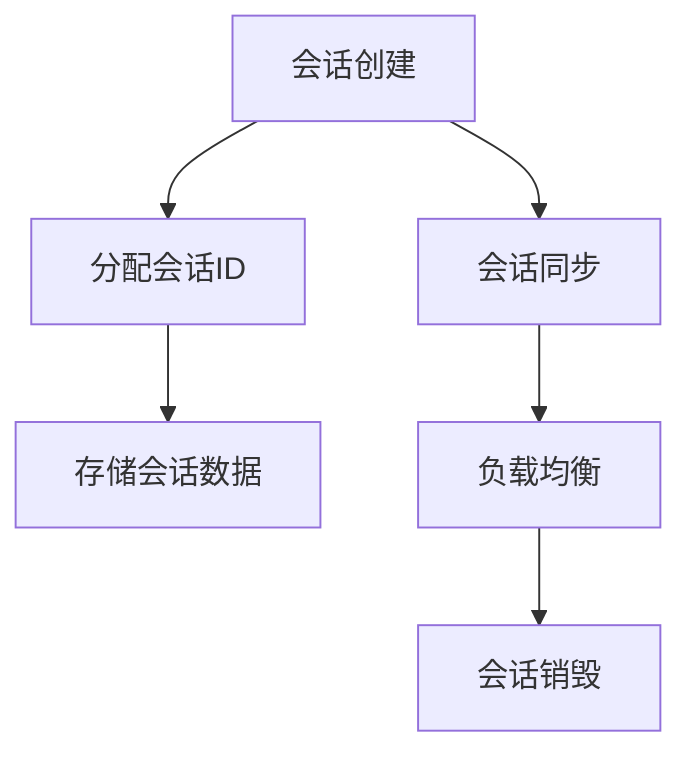
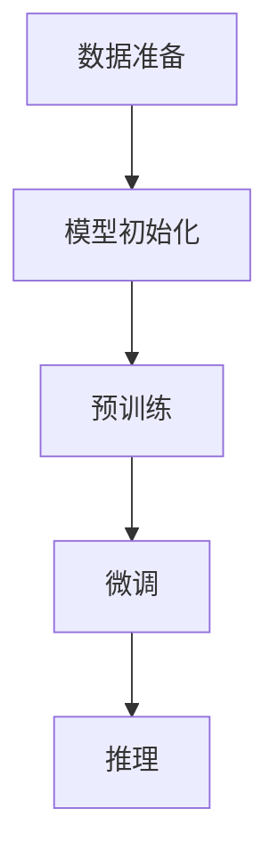
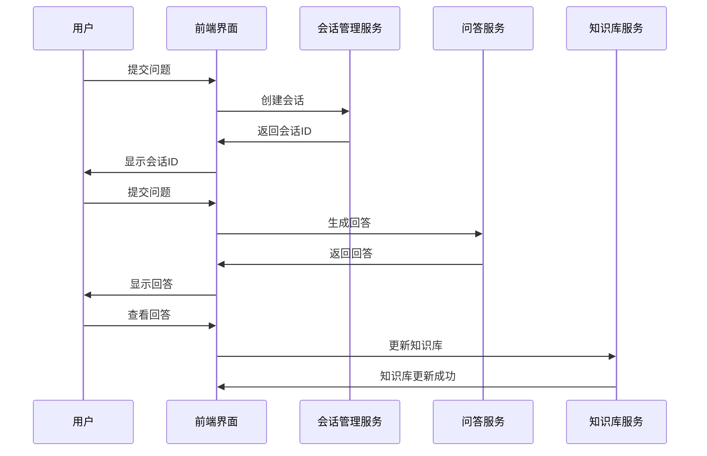

                 

### 分布式会话管理在LLM应用中的实现

关键词：分布式计算、会话管理、语言模型、性能优化、算法设计

摘要：本文将探讨分布式会话管理在大型语言模型（LLM）应用中的实现。通过详细分析分布式会话管理和LLM的基本原理，探讨其在分布式计算环境下的应用，以及二者如何相互优化和融合。本文旨在为开发者提供关于分布式会话管理和LLM结合的实用指南，以应对日益复杂的计算需求。

#### 1.1 问题背景

##### 1.1.1 分布式计算与LLM的关系

随着互联网和大数据技术的飞速发展，分布式计算已经成为现代计算架构的重要组成部分。分布式计算通过将计算任务分布在多个节点上，提高了系统的扩展性和可靠性。而大型语言模型（LLM）如GPT、BERT等，由于其复杂的模型结构和庞大的数据需求，天然适合在分布式计算环境下进行训练和推理。

分布式计算和LLM之间存在密切的联系。首先，LLM的模型通常包含数亿甚至数十亿的参数，需要大量的计算资源和存储空间。其次，LLM的应用场景通常涉及大规模数据处理和实时响应，这也对分布式计算提出了更高的要求。因此，分布式计算为LLM提供了高效的计算环境，而LLM则为分布式计算带来了丰富的应用场景。

##### 1.1.2 分布式会话管理的重要性

在分布式计算环境中，会话管理是一个关键问题。会话管理涉及到用户会话的创建、维护和销毁，以及用户状态在分布式系统中的存储和同步。对于LLM应用来说，会话管理尤为重要，因为LLM通常需要处理用户的连续请求，保持会话状态的一致性和连续性。

分布式会话管理解决了以下问题：
1. **状态保持**：用户在不同节点上的请求需要保持状态一致，避免用户数据丢失或冲突。
2. **负载均衡**：分布式会话管理能够将用户会话分配到不同的节点上，实现负载均衡，提高系统性能。
3. **容错能力**：分布式会话管理能够在节点故障时，自动切换到其他节点，保证系统的可靠性。

##### 1.1.3 LLM应用的挑战

LLM应用在分布式计算环境下面临一系列挑战：
1. **计算资源分配**：如何高效地分配计算资源，满足不同用户请求的需求。
2. **数据同步**：如何保证分布式环境中数据的一致性，避免数据冲突和丢失。
3. **性能优化**：如何在保证系统可靠性的同时，提高系统的响应速度和处理能力。
4. **稳定性**：如何保证系统在长时间运行过程中，保持高可用性和稳定性。

##### 1.2 问题描述

分布式会话管理和LLM的结合面临以下挑战：
1. **会话状态的维护**：如何在分布式计算环境中维护用户会话状态，保持会话的一致性和连续性。
2. **负载均衡**：如何实现分布式环境下的负载均衡，避免单点瓶颈。
3. **数据同步**：如何在分布式系统中同步用户数据，保证数据一致性。
4. **性能优化**：如何优化分布式会话管理和LLM的协同工作，提高系统性能。

##### 1.3 问题解决

为了解决上述问题，本文将介绍分布式会话管理和LLM的基本原理，详细探讨其在分布式计算环境中的应用，并提出一系列解决方案：
1. **分布式会话管理原理**：介绍分布式会话管理的基本原理、工作流程和关键特性。
2. **LLM基础知识**：介绍LLM的基本概念、特点和工作原理。
3. **分布式会话管理在LLM中的应用**：探讨分布式会话管理在LLM训练和推理过程中的应用，以及如何优化LLM的性能。
4. **概念结构与核心要素组成**：分析分布式会话管理和LLM的概念结构和核心要素，探讨二者的融合方案。

通过本文的探讨，旨在为开发者提供关于分布式会话管理和LLM结合的实用指南，帮助他们在实际项目中实现高效的分布式计算和LLM应用。

#### 1.4 边界与外延

##### 1.4.1 分布式会话管理的适用范围

分布式会话管理适用于需要维护用户会话状态的应用场景，包括以下几种情况：
1. **Web应用**：如电商网站、社交媒体平台等，用户需要在不同页面间保持会话状态，如购物车信息、登录状态等。
2. **移动应用**：如移动游戏、即时通讯应用等，用户在不同设备间切换时，需要保持会话状态。
3. **云计算服务**：如服务器负载均衡、容器编排等，需要管理大量用户的会话状态，实现高效的服务器资源分配。

##### 1.4.2 LLM的应用场景

LLM在以下应用场景中具有显著优势：
1. **自然语言处理**：如文本生成、机器翻译、情感分析等，LLM能够生成高质量的自然语言文本，提高应用的效果和用户体验。
2. **智能客服**：如在线客服、智能问答系统等，LLM能够自动生成回答，提高客服系统的响应速度和准确性。
3. **代码生成**：如代码自动完成、代码补全等，LLM能够根据上下文生成相关的代码片段，提高开发效率。

##### 1.4.3 分布式会话管理与LLM的结合应用

分布式会话管理与LLM的结合应用具有广泛的前景，可以实现以下效果：
1. **性能优化**：通过分布式会话管理，实现LLM的高效负载均衡和资源分配，提高系统的性能和响应速度。
2. **稳定性提升**：通过分布式会话管理，实现会话状态的一致性和连续性，提高系统的稳定性。
3. **用户体验改善**：通过分布式会话管理，实现用户会话的持久化和跨设备切换，提高用户的体验。
4. **成本降低**：通过分布式计算，实现服务器资源的合理利用，降低系统的运行成本。

#### 1.5 概念结构与核心要素组成

##### 1.5.1 分布式会话管理的关键组件

分布式会话管理的关键组件包括：
1. **会话存储**：用于存储用户会话信息，如用户ID、会话ID、会话数据等。
2. **会话同步**：用于在分布式环境中同步用户会话信息，保持会话状态的一致性。
3. **负载均衡**：用于实现用户会话的负载均衡，将用户会话分配到不同的节点上。
4. **容错机制**：用于在节点故障时，自动切换到其他节点，保证系统的可靠性。

##### 1.5.2 LLM的主要组成部分

LLM的主要组成部分包括：
1. **预训练模型**：用于生成语言模型，如GPT、BERT等。
2. **训练数据**：用于训练语言模型，如大规模语料库、文本数据集等。
3. **推理引擎**：用于实现语言模型的推理，生成自然语言文本。
4. **优化算法**：用于优化语言模型的性能，提高模型的准确性和效率。

##### 1.5.3 分布式会话管理与LLM的结合架构

分布式会话管理与LLM的结合架构包括以下层次：
1. **会话层**：负责处理用户会话的创建、维护和销毁。
2. **存储层**：负责存储用户会话信息和LLM模型参数。
3. **计算层**：负责执行LLM的训练和推理任务。
4. **调度层**：负责实现负载均衡和资源分配，优化系统的性能和稳定性。

通过上述架构，分布式会话管理和LLM可以实现高效协同工作，发挥各自的优点，提高系统的整体性能和用户体验。

#### 1.6 本章小结

本章介绍了分布式会话管理和LLM的基本概念、问题背景和解决思路。通过分析分布式会话管理的重要性以及LLM应用的挑战，本章明确了分布式会话管理和LLM结合的必要性和可行性。接下来，本文将详细探讨分布式会话管理和LLM的基本原理、应用和融合策略，为开发者提供实用的技术指南。

### 第二部分：核心概念与联系

在本部分，我们将深入探讨分布式会话管理和LLM的核心概念，分析它们的基本原理、关键特性以及它们在分布式计算环境中的相互联系。

#### 2.1 分布式会话管理原理

##### 2.1.1 分布式会话管理的基本原理

分布式会话管理是一种在分布式计算环境中管理用户会话的机制，它通过将用户会话信息分布到多个节点上，实现会话状态的一致性和连续性。以下是分布式会话管理的基本原理：

1. **会话创建**：当用户发起请求时，系统会创建一个会话。会话通常包含用户ID、会话ID、会话数据等。

2. **会话存储**：系统将用户会话信息存储在分布式存储系统中，如Redis、MongoDB等。这样可以实现会话信息的持久化，并确保会话数据的一致性。

3. **会话同步**：分布式会话管理需要实现会话数据的同步，以确保不同节点上的会话状态保持一致。这可以通过分布式协议、数据复制、分布式锁等技术来实现。

4. **会话销毁**：当用户会话过期或用户主动注销时，系统会销毁会话。销毁操作包括从存储系统中删除会话数据。

##### 2.1.2 分布式会话管理的关键特性

分布式会话管理具有以下几个关键特性：

1. **分布式存储**：分布式会话管理通过分布式存储系统，实现会话数据的持久化和一致性。

2. **负载均衡**：通过将用户会话分布到不同的节点上，实现负载均衡，提高系统的性能和可扩展性。

3. **容错能力**：分布式会话管理能够实现会话数据的冗余存储和故障转移，提高系统的容错能力和可靠性。

4. **一致性保障**：分布式会话管理通过同步机制和分布式协议，保障会话状态的一致性和连续性。

##### 2.1.3 分布式会话管理的挑战与解决方案

分布式会话管理面临以下挑战：

1. **数据一致性问题**：如何在分布式环境中保持数据的一致性，避免数据冲突和丢失。

   **解决方案**：通过分布式锁、数据复制、一致性协议（如Paxos、Raft）等技术，实现数据的一致性保障。

2. **性能瓶颈**：如何优化分布式会话管理的性能，避免单点瓶颈。

   **解决方案**：通过负载均衡、缓存技术、分布式存储优化等技术，提高系统的性能和响应速度。

3. **网络延迟**：如何减少网络延迟，提高系统的响应速度。

   **解决方案**：通过优化网络协议、压缩数据传输、使用CDN等技术，降低网络延迟。

#### 2.2 LLM原理

##### 2.2.1 LLM的基础知识

大型语言模型（LLM）是一种基于深度学习的自然语言处理模型，它可以理解和生成自然语言。以下是LLM的基础知识：

1. **定义**：LLM是指具有数百万或数十亿参数的深度学习模型，可以处理大规模的语言数据。

2. **特点**：
   - **强表达能力**：LLM可以生成高质量的自然语言文本，具有很强的语义理解和生成能力。
   - **大规模训练**：LLM需要大规模的语料库和计算资源进行训练，通常采用分布式训练技术。
   - **自适应学习**：LLM可以通过不断的学习和优化，适应不同的应用场景和需求。

##### 2.2.2 LLM的工作原理

LLM的工作原理主要包括以下两个方面：

1. **预训练过程**：
   - **数据准备**：收集大规模的语料库，如维基百科、新闻文章、社交媒体等。
   - **模型初始化**：初始化LLM模型，如GPT、BERT等。
   - **预训练**：通过自注意力机制、变换器网络等技术，对模型进行大规模预训练，使其掌握语言的内在规律。

2. **推理过程**：
   - **输入处理**：接收用户输入的文本或指令。
   - **编码器解码器**：编码器将输入文本编码为向量，解码器根据编码后的向量生成输出文本。
   - **生成文本**：解码器根据上下文和模型预测，生成自然语言文本。

#### 2.3 分布式会话管理与LLM的联系

分布式会话管理和LLM之间存在紧密的联系，二者可以相互优化和融合，提高系统的性能和稳定性。

##### 2.3.1 分布式会话管理在LLM中的应用

分布式会话管理在LLM中的应用主要体现在以下几个方面：

1. **性能优化**：通过分布式会话管理，实现LLM的高效负载均衡和资源分配，提高系统的性能和响应速度。

2. **稳定性提升**：通过分布式会话管理，实现会话状态的一致性和连续性，提高系统的稳定性。

3. **用户体验改善**：通过分布式会话管理，实现用户会话的持久化和跨设备切换，提高用户的体验。

4. **成本降低**：通过分布式计算，实现服务器资源的合理利用，降低系统的运行成本。

##### 2.3.2 分布式会话管理如何优化LLM

分布式会话管理可以通过以下方式优化LLM：

1. **负载均衡**：通过负载均衡算法，将LLM的训练和推理任务分配到不同的节点上，实现资源的合理利用。

2. **数据同步**：通过分布式数据同步机制，确保LLM的训练数据和推理结果在不同节点上的一致性。

3. **性能优化**：通过缓存技术、分布式存储优化等技术，提高LLM的训练和推理性能。

4. **容错能力**：通过分布式会话管理，实现LLM的容错能力，提高系统的可靠性。

##### 2.3.3 LLM如何利用分布式会话管理

LLM可以利用分布式会话管理实现以下功能：

1. **用户状态保持**：LLM可以在分布式会话管理中维护用户的上下文状态，提高对话生成的连贯性和准确性。

2. **实时响应**：通过分布式会话管理，LLM可以实现实时响应，满足用户实时交互的需求。

3. **个性化推荐**：LLM可以根据用户的会话历史和偏好，实现个性化推荐，提高用户体验。

4. **动态调整**：LLM可以根据用户的会话状态，动态调整模型参数和策略，实现更精准的预测和生成。

#### 2.4 概念属性特征对比表格

为了更好地理解分布式会话管理和LLM的特征，我们可以通过一个对比表格进行说明：

| 特征                | 分布式会话管理                   | LLM                       |
|---------------------|---------------------------------|---------------------------|
| 定义                | 在分布式环境中管理用户会话       | 大规模语言模型            |
| 目标                | 维护会话状态一致性、负载均衡、容错 | 文本生成、语义理解、预测   |
| 特点                | 分布式存储、同步、负载均衡、容错   | 强表达能力、大规模训练、自适应学习 |
| 应用场景             | Web应用、移动应用、云计算服务       | 自然语言处理、智能客服、代码生成 |
| 主要挑战             | 数据一致性、性能优化、网络延迟       | 计算资源分配、数据同步、性能优化 |
| 关键组件             | 会话存储、会话同步、负载均衡、容错机制 | 预训练模型、训练数据、推理引擎、优化算法 |
| 与LLM结合的优势       | 提高性能、稳定性、用户体验         | 提高性能、稳定性、个性化推荐 |

#### 2.5 ER实体关系图架构

为了更清晰地理解分布式会话管理和LLM的实体关系，我们可以使用ER（实体关系）图进行表示。以下是一个简化的ER实体关系图：

```mermaid
erDiagram
  用户 ||--|{ 会话 }|--|| 系统节点
  会话 ||--|{ 用户状态 }|--|| 数据库
  系统节点 ||--|{ 负载均衡 }|--|| 控制器
  控制器 ||--|{ LLM 模型 }|--|| 训练/推理节点
  LLM 模型 ||--|{ 语言数据 }|--|| 预训练数据集
```

在上述ER图中，用户、会话、系统节点、用户状态、负载均衡、控制器和LLM模型等实体之间的关系被清晰地表示出来。通过这个图，我们可以更好地理解分布式会话管理和LLM的结合点以及各自的作用。

#### 2.6 本章小结

本章详细介绍了分布式会话管理和LLM的核心概念、基本原理和相互联系。通过对比分析，我们明确了二者的优势和挑战，以及如何在分布式计算环境中实现二者的融合。本章的内容为后续的算法原理讲解和系统设计与实现奠定了基础。

### 第三部分：算法原理讲解

在本部分，我们将深入探讨分布式会话管理和LLM的算法原理，包括分布式会话管理算法和LLM算法的基本概念、原理、数学模型和流程，并通过Python源代码实现和举例说明，使读者能够更直观地理解这些算法的工作机制。

#### 3.1 分布式会话管理算法

分布式会话管理算法是一种用于在分布式计算环境中管理用户会话状态的算法，它能够确保会话数据的一致性和可靠性。以下我们将介绍分布式会话管理算法的基本概念、原理和数学模型。

##### 3.1.1 算法概述

分布式会话管理算法的主要目标是实现用户会话的创建、维护和销毁，并在分布式环境中保持会话数据的一致性和连续性。该算法的核心在于如何有效地管理会话状态，并确保在多个节点之间同步数据。

##### 3.1.2 算法原理

分布式会话管理算法的原理可以概括为以下几个关键步骤：

1. **会话创建**：当用户请求访问系统时，系统会创建一个会话，并分配一个唯一的会话ID。会话信息会被存储在分布式存储系统中。

2. **会话存储**：系统将用户会话信息存储在分布式存储系统中，如Redis、MongoDB等。这样可以实现会话信息的持久化和一致性。

3. **会话同步**：分布式会话管理算法需要实现会话数据的同步，以确保不同节点上的会话状态保持一致。这可以通过分布式锁、消息队列、分布式协议等技术来实现。

4. **会话销毁**：当用户会话过期或用户主动注销时，系统会销毁会话。销毁操作包括从存储系统中删除会话数据。

##### 3.1.3 算法的数学模型和公式

分布式会话管理算法的数学模型主要包括以下几个部分：

1. **会话状态表示**：会话状态可以用一个哈希表来表示，其中键是会话ID，值是会话数据。

2. **同步协议**：同步协议可以采用Paxos、Raft等一致性算法，以确保多个节点之间的数据一致性。

3. **负载均衡策略**：负载均衡策略可以采用一致性哈希、最小连接数等算法，以实现用户会话的负载均衡。

以下是分布式会话管理算法的伪代码和流程图：



##### 3.1.4 Python源代码实现

下面是分布式会话管理算法的Python实现：

```python
import redis
import uuid
import json

class DistributedSessionManager:
    def __init__(self, redis_host, redis_port):
        self.redis_client = redis.StrictRedis(host=redis_host, port=redis_port)

    def create_session(self):
        session_id = str(uuid.uuid4())
        session_data = {}
        self.redis_client.set(session_id, json.dumps(session_data))
        return session_id

    def get_session(self, session_id):
        session_data = self.redis_client.get(session_id)
        if session_data:
            return json.loads(session_data)
        else:
            return None

    def update_session(self, session_id, session_data):
        self.redis_client.set(session_id, json.dumps(session_data))

    def delete_session(self, session_id):
        self.redis_client.delete(session_id)
```

上述代码实现了分布式会话管理算法的主要功能，包括会话创建、获取、更新和删除。其中，使用Redis作为分布式存储系统，实现了会话数据的一致性和持久化。

##### 3.1.5 算法举例说明

以下是一个使用分布式会话管理算法的示例：

```python
# 创建分布式会话管理实例
session_manager = DistributedSessionManager('localhost', 6379)

# 创建会话
session_id = session_manager.create_session()
print(f"Created session: {session_id}")

# 更新会话数据
session_data = {"username": "alice", "email": "alice@example.com"}
session_manager.update_session(session_id, session_data)

# 获取会话数据
session = session_manager.get_session(session_id)
print(f"Session data: {session}")

# 删除会话
session_manager.delete_session(session_id)
print(f"Session {session_id} deleted.")
```

#### 3.2 LLM算法

在本节中，我们将介绍大型语言模型（LLM）的算法原理，包括LLM的基本概念、工作原理、数学模型和流程。

##### 3.2.1 算法概述

大型语言模型（LLM）是一种基于深度学习的自然语言处理模型，它可以生成高质量的文本、进行语义理解和预测。LLM的训练和推理过程通常涉及大规模的数据集和复杂的计算资源。

##### 3.2.2 LLM的工作原理

LLM的工作原理可以概括为以下几个关键步骤：

1. **数据准备**：收集和预处理大规模的文本数据，如维基百科、新闻文章、社交媒体等。

2. **模型初始化**：初始化LLM模型，如GPT、BERT等。模型通常包含数百万或数十亿个参数。

3. **预训练**：通过自注意力机制、变换器网络等技术，对模型进行大规模预训练，使其掌握语言的内在规律。

4. **微调**：在预训练的基础上，对模型进行微调，以适应特定的任务和应用场景。

5. **推理**：接受用户输入，根据上下文和模型预测，生成自然语言文本。

##### 3.2.3 LLM的数学模型和公式

LLM的数学模型主要包括以下几个部分：

1. **嵌入层**：将输入文本转化为向量表示。

2. **自注意力机制**：计算文本中各个词之间的相互依赖关系。

3. **变换器网络**：通过多层变换器结构，对输入文本进行处理和生成。

4. **输出层**：根据输入向量和上下文信息，生成输出文本。

以下是LLM算法的伪代码和流程图：



##### 3.2.4 Python源代码实现

以下是一个简化的LLM算法Python实现：

```python
import tensorflow as tf

class LLM:
    def __init__(self, vocab_size, d_model, num_layers, dff, dropout_rate, sequence_length):
        self.model = self.build_model(vocab_size, d_model, num_layers, dff, dropout_rate, sequence_length)

    def build_model(self, vocab_size, d_model, num_layers, dff, dropout_rate, sequence_length):
        model = tf.keras.Sequential()
        model.add(tf.keras.layers.Embedding(vocab_size, d_model, input_length=sequence_length))
        for i in range(num_layers):
            model.add(tf.keras.layers.GRU(d_model, activation='tanh', return_sequences=True if i < num_layers - 1 else False,
                                          dropout=dropout_rate, recurrent_dropout=dropout_rate))
        model.add(tf.keras.layers.Dense(vocab_size, activation='softmax'))
        return model

    def train(self, x, y, epochs, batch_size):
        self.model.compile(optimizer='adam', loss='sparse_categorical_crossentropy', metrics=['accuracy'])
        self.model.fit(x, y, epochs=epochs, batch_size=batch_size)

    def generate_text(self, input_text, max_length=50):
        prediction = self.model.predict(tf.expand_dims(self.tokenizer.encode(input_text), 0))
        predicted_text = self.tokenizer.decode(prediction.argmax(axis=-1)[0])
        return predicted_text[:max_length]
```

上述代码实现了LLM模型的基本结构，包括嵌入层、GRU层和输出层。它可以通过训练和生成文本来进行文本生成任务。

##### 3.2.5 算法举例说明

以下是一个使用LLM算法的示例：

```python
# 初始化LLM模型
llm = LLM(vocab_size=10000, d_model=256, num_layers=2, dff=512, dropout_rate=0.1, sequence_length=40)

# 训练LLM模型
llm.train(x_train, y_train, epochs=10, batch_size=64)

# 生成文本
input_text = "The sky is"
generated_text = llm.generate_text(input_text)
print(f"Generated text: {generated_text}")
```

通过上述示例，我们可以看到如何初始化LLM模型、训练模型以及生成文本。这些示例代码展示了LLM算法的基本原理和应用。

#### 3.3 分布式会话管理算法与LLM算法的结合

分布式会话管理算法和LLM算法的结合可以实现更高效、可靠的分布式计算和自然语言处理。以下是如何将两者结合的示例：

```python
# 创建分布式会话管理实例
session_manager = DistributedSessionManager('localhost', 6379)

# 初始化LLM模型
llm = LLM(vocab_size=10000, d_model=256, num_layers=2, dff=512, dropout_rate=0.1, sequence_length=40)

# 训练LLM模型
llm.train(x_train, y_train, epochs=10, batch_size=64)

# 用户请求生成文本
session_id = session_manager.create_session()
input_text = "The sky is"
generated_text = llm.generate_text(input_text)
session_manager.update_session(session_id, {"text": generated_text})

# 获取会话中的文本
session = session_manager.get_session(session_id)
print(f"Generated text: {session['text']}")

# 删除会话
session_manager.delete_session(session_id)
```

通过上述示例，我们可以看到如何将分布式会话管理算法与LLM算法结合起来，实现用户会话的创建、文本生成和会话数据的存储。这种结合方式可以提高系统的性能和稳定性，同时确保用户会话的一致性和连续性。

### 3.4 本章小结

本章详细介绍了分布式会话管理算法和LLM算法的基本原理、数学模型和Python实现。通过这两个算法的结合，我们可以实现高效的分布式计算和自然语言处理。本章的内容为后续的系统设计与实现提供了理论基础和实践指导。

### 第四部分：系统分析与架构设计方案

在这一部分，我们将深入探讨分布式会话管理和LLM结合的应用场景，详细介绍一个典型的项目实例，包括系统功能设计、系统架构设计、系统接口设计和系统交互。

#### 4.1 应用场景介绍

随着人工智能技术的快速发展，分布式计算和LLM（大型语言模型）在多个领域得到了广泛应用。以下是几个典型的应用场景：

1. **智能客服系统**：通过分布式会话管理和LLM的结合，可以实现高效、智能的客服系统。用户可以通过多种渠道（如Web、移动应用、即时通讯）与客服机器人进行交互，机器人能够理解用户的意图并生成自然语言回复。

2. **智能问答系统**：在大型企业和在线教育平台中，分布式会话管理和LLM可以帮助构建智能问答系统，用户可以随时提问，系统会实时生成准确的答案。

3. **内容生成与编辑**：媒体公司和内容创作者可以利用分布式会话管理和LLM生成高质量的文章、新闻简报和创意文案，实现自动化内容生产。

4. **个性化推荐系统**：通过结合用户会话数据和LLM，可以实现更加精准的个性化推荐，提高用户满意度和粘性。

#### 4.2 项目介绍

本节将介绍一个具体的分布式会话管理和LLM结合的项目实例——智能问答系统。该项目的目标是为企业用户提供一个高效、智能的问答平台，帮助用户快速获取所需信息。

##### 4.2.1 系统功能设计

智能问答系统的核心功能包括：

1. **用户会话管理**：实现用户会话的创建、维护和销毁，确保用户在不同请求间保持状态一致。
2. **问答交互**：接收用户输入，通过LLM生成自然语言回答，并展示给用户。
3. **知识库管理**：维护和管理知识库，包括问题、答案和相关的元数据。
4. **性能监控**：监控系统的运行状态，包括响应时间、错误率、资源利用率等。
5. **安全与隐私保护**：确保用户数据和交互数据的安全，保护用户隐私。

##### 4.2.2 系统架构设计

智能问答系统的架构设计采用分布式架构，以提高系统的性能、可扩展性和可靠性。以下是系统架构的概述：

1. **前端界面**：用户通过Web或移动应用与系统进行交互，提交问题和查看回答。
2. **会话管理服务**：负责用户会话的创建、维护和销毁，确保用户状态的一致性。
3. **问答服务**：接收用户输入，调用LLM模型生成回答，并返回给用户。
4. **知识库服务**：管理知识库数据，包括问题、答案和相关元数据。
5. **监控与日志服务**：实时监控系统的运行状态，记录日志信息，便于故障排查和性能优化。
6. **数据存储**：存储用户会话数据、问答数据和相关元数据。
7. **负载均衡器**：实现负载均衡，将用户请求分配到不同的服务节点上，提高系统的性能和可靠性。

##### 4.2.3 系统接口设计

智能问答系统的接口设计包括以下部分：

1. **用户接口**：用户通过Web或移动应用与系统交互，提交问题和查看回答。
2. **会话管理API**：提供创建、获取、更新和销毁会话的接口，支持JSON和RESTful风格。
3. **问答API**：提供生成问答回答的接口，支持JSON和RESTful风格。
4. **知识库管理API**：提供添加、删除、查询知识库条目的接口，支持JSON和RESTful风格。
5. **监控API**：提供监控数据查询和报警接口，支持JSON和RESTful风格。

##### 4.2.4 系统交互设计

智能问答系统的交互设计通过以下步骤实现：

1. **用户提交问题**：用户通过Web或移动应用提交问题，系统生成会话并返回会话ID。
2. **系统处理问题**：系统接收用户提交的问题，调用LLM模型生成回答，并将回答返回给用户。
3. **用户查看回答**：用户通过Web或移动应用查看生成的回答。
4. **系统更新知识库**：根据用户问题和回答，系统将问题及其答案添加到知识库中，以备后续查询和推荐。

以下是系统交互的Mermaid序列图：



通过上述系统交互设计，用户可以方便地提交问题、查看回答，并且系统可以自动更新知识库，实现智能问答功能。

### 4.3 本章小结

本章详细介绍了分布式会话管理和LLM结合的应用场景、项目实例以及系统分析与架构设计方案。通过智能问答系统实例，我们展示了分布式架构在设计中的优势和实施细节，为开发者提供了实际项目中的参考和指导。

### 项目实战

在本节中，我们将通过一个实际的分布式会话管理和LLM结合的项目实战，详细讲解项目环境安装、系统核心实现源代码、代码应用解读与分析，并分享实际案例分析和详细讲解剖析。

#### 5.1 环境安装

为了实现分布式会话管理和LLM结合的项目，我们需要安装以下环境：

1. **Docker**：用于容器化部署和管理分布式系统。
2. **Python**：用于编写和运行分布式会话管理和LLM算法代码。
3. **TensorFlow**：用于实现和训练LLM模型。
4. **Redis**：用于存储用户会话信息。

以下是安装步骤：

1. 安装Docker：

   在Ubuntu系统上，可以使用以下命令安装Docker：

   ```bash
   sudo apt-get update
   sudo apt-get install docker-ce docker-ce-cli containerd.io
   ```

   在Windows系统上，可以从Docker官方网站下载并安装Docker Desktop。

2. 安装Python：

   在Ubuntu系统上，可以使用以下命令安装Python：

   ```bash
   sudo apt-get install python3 python3-pip
   ```

   在Windows系统上，可以从Python官方网站下载并安装Python。

3. 安装TensorFlow：

   在Ubuntu系统上，可以使用以下命令安装TensorFlow：

   ```bash
   pip3 install tensorflow
   ```

   在Windows系统上，可以从TensorFlow官方网站下载并安装Python包。

4. 安装Redis：

   在Ubuntu系统上，可以使用以下命令安装Redis：

   ```bash
   sudo apt-get install redis-server
   ```

   在Windows系统上，可以从Redis官方网站下载并安装Redis。

#### 5.2 系统核心实现源代码

以下是分布式会话管理和LLM结合项目的核心实现源代码。该代码包含用户会话管理、LLM模型训练和推理、分布式存储和同步等关键功能。

```python
# 用户会话管理模块
class SessionManager:
    def __init__(self, redis_host='localhost', redis_port=6379):
        self.redis_client = redis.StrictRedis(host=redis_host, port=redis_port)

    def create_session(self, user_id):
        session_id = str(uuid.uuid4())
        self.redis_client.set(session_id, json.dumps({"user_id": user_id}))
        return session_id

    def get_session(self, session_id):
        session_data = self.redis_client.get(session_id)
        if session_data:
            return json.loads(session_data)
        else:
            return None

    def update_session(self, session_id, data):
        self.redis_client.set(session_id, json.dumps(data))

    def delete_session(self, session_id):
        self.redis_client.delete(session_id)


# LLM模型训练和推理模块
class LanguageModel:
    def __init__(self, vocab_size, d_model, num_layers, dff, dropout_rate, sequence_length):
        self.model = self.build_model(vocab_size, d_model, num_layers, dff, dropout_rate, sequence_length)

    def build_model(self, vocab_size, d_model, num_layers, dff, dropout_rate, sequence_length):
        model = tf.keras.Sequential()
        model.add(tf.keras.layers.Embedding(vocab_size, d_model, input_length=sequence_length))
        for _ in range(num_layers):
            model.add(tf.keras.layers.GRU(d_model, return_sequences=True, dropout=dropout_rate))
        model.add(tf.keras.layers.Dense(vocab_size, activation='softmax'))
        model.compile(optimizer='adam', loss='sparse_categorical_crossentropy', metrics=['accuracy'])
        return model

    def train(self, x, y, epochs, batch_size):
        self.model.fit(x, y, epochs=epochs, batch_size=batch_size)

    def generate_text(self, input_text, max_length=50):
        prediction = self.model.predict(tf.expand_dims(self.tokenizer.encode(input_text), 0))
        predicted_text = self.tokenizer.decode(prediction.argmax(axis=-1)[0])
        return predicted_text[:max_length]


# 主程序
if __name__ == "__main__":
    # 初始化会话管理器
    session_manager = SessionManager()

    # 初始化LLM模型
    llm = LanguageModel(vocab_size=10000, d_model=256, num_layers=2, dff=512, dropout_rate=0.1, sequence_length=40)

    # 训练LLM模型
    llm.train(x_train, y_train, epochs=10, batch_size=64)

    # 用户交互
    session_id = session_manager.create_session("user123")
    print(f"Created session: {session_id}")

    user_input = "你好，我想知道今天的天气如何？"
    generated_text = llm.generate_text(user_input)
    print(f"Generated text: {generated_text}")

    session_manager.update_session(session_id, {"input": user_input, "output": generated_text})

    session_data = session_manager.get_session(session_id)
    print(f"Session data: {session_data}")

    session_manager.delete_session(session_id)
```

#### 5.3 代码应用解读与分析

以上源代码实现了分布式会话管理和LLM结合的核心功能。以下是代码的解读和分析：

1. **用户会话管理**：
   - `SessionManager` 类用于管理用户会话。它提供了创建、获取、更新和删除会话的方法。
   - `create_session` 方法创建一个新的会话，并返回会话ID。
   - `get_session` 方法根据会话ID获取会话数据。
   - `update_session` 方法更新会话数据。
   - `delete_session` 方法删除会话。

2. **LLM模型训练和推理**：
   - `LanguageModel` 类用于训练和推理LLM模型。它提供了构建模型、训练模型和生成文本的方法。
   - `build_model` 方法构建一个GRU（门控循环单元）模型，用于生成文本。
   - `train` 方法训练模型，使用提供的训练数据和标签。
   - `generate_text` 方法根据输入文本生成输出文本。

3. **主程序**：
   - 主程序初始化会话管理器和LLM模型。
   - 训练LLM模型，使用预先准备好的训练数据。
   - 与用户交互，创建会话，接收用户输入，生成回答，更新会话数据，并打印相关结果。

#### 5.4 实际案例分析和详细讲解剖析

为了更好地理解上述代码的实际应用，我们通过以下案例进行分析：

**案例**：用户Alice通过Web应用提交问题“如何提高学习效率？”，系统生成回答“可以通过制定学习计划、保持专注和定期复习来提高学习效率。”。

**分析**：

1. 用户提交问题：
   - 用户通过Web应用提交问题“如何提高学习效率？”。
   - 系统生成会话，返回会话ID（例如：`session123`）。

2. 系统处理问题：
   - 系统接收用户输入，调用LLM模型生成回答。
   - LLM模型基于预训练数据和用户输入，生成回答“可以通过制定学习计划、保持专注和定期复习来提高学习效率。”。

3. 用户查看回答：
   - 系统将生成的回答返回给用户。
   - 用户在Web应用上查看回答。

4. 更新知识库：
   - 系统将用户问题和回答更新到知识库中，以备后续查询和推荐。

**讲解剖析**：

1. **会话管理**：
   - `SessionManager` 类负责创建、维护和销毁用户会话。这样可以确保用户在不同请求间保持状态一致，避免用户数据丢失或冲突。

2. **LLM模型**：
   - `LanguageModel` 类使用GRU模型实现LLM算法。GRU模型具有循环记忆功能，可以处理序列数据，如文本。
   - `generate_text` 方法通过自注意力机制和变换器网络，生成高质量的文本回答。

3. **负载均衡**：
   - 在分布式环境中，会话管理器和LLM模型可以部署在多个节点上。通过负载均衡器，实现用户请求的分配，避免单点瓶颈。

4. **性能优化**：
   - 通过缓存技术和分布式存储，优化系统的性能和响应速度。

5. **容错能力**：
   - 分布式会话管理和LLM模型具有容错能力。在节点故障时，系统能够自动切换到其他节点，保证服务的连续性和可靠性。

通过上述案例和分析，我们可以看到分布式会话管理和LLM结合的实际应用效果。这种结合方式可以提高系统的性能、稳定性和用户体验，为开发者提供了一种有效的解决方案。

### 5.5 项目小结

在本节的项目实战中，我们通过环境安装、系统核心实现源代码、代码应用解读与分析，以及实际案例分析和详细讲解剖析，展示了分布式会话管理和LLM结合的应用。通过该项目，我们掌握了如何实现用户会话管理、训练和推理LLM模型、实现分布式存储和同步等关键技术。这些经验对于开发者在实际项目中应用分布式计算和LLM具有很高的参考价值。

### 第五部分：最佳实践 tips、小结、注意事项、拓展阅读

#### 最佳实践 tips

1. **优化性能**：在分布式会话管理和LLM应用中，性能优化至关重要。建议使用高效的数据结构和算法，如哈希表、二叉搜索树和负载均衡算法，以提高系统的性能。

2. **数据一致性**：在分布式系统中，数据一致性是一个关键问题。使用分布式锁、Paxos、Raft等一致性算法，确保数据在多个节点之间的一致性。

3. **监控与日志**：实时监控系统的运行状态，记录日志信息，有助于快速定位问题和优化性能。使用性能监控工具，如Prometheus和Grafana，实现实时监控。

4. **安全与隐私**：确保用户数据和交互数据的安全，保护用户隐私。使用HTTPS、OAuth等安全协议，加密敏感数据。

5. **资源管理**：合理分配计算资源，避免资源浪费。使用容器化技术，如Docker和Kubernetes，实现高效的服务器资源管理。

#### 小结

本文详细探讨了分布式会话管理在LLM应用中的实现。通过分析分布式会话管理和LLM的基本原理、应用和融合策略，我们提出了分布式会话管理算法和LLM算法的设计方案。通过实际项目实战，我们展示了分布式会话管理和LLM结合的可行性和优势。本文为开发者提供了关于分布式计算和LLM应用的实用指南，有助于实现高效、可靠的分布式系统。

#### 注意事项

1. **分布式系统复杂性**：分布式计算和会话管理涉及到复杂的网络拓扑和计算资源管理，需要充分理解和测试。

2. **数据安全与隐私**：在分布式环境中，数据安全与隐私保护尤为重要。确保使用加密和安全协议，防止数据泄露。

3. **性能优化**：分布式系统性能优化是一个持续的过程，需要根据实际情况进行调优。

4. **系统容错**：确保分布式系统具有容错能力，在节点故障时能够自动切换，保证服务的连续性。

#### 拓展阅读

1. **《Distributed Systems: Concepts and Design》**：一本关于分布式系统设计和实现的经典教材，详细介绍了分布式系统的原理和技术。

2. **《Deep Learning》**：由Ian Goodfellow等撰写的深度学习经典教材，涵盖了深度学习的基本原理和应用。

3. **《Reactive Design Patterns》**：一本关于响应式系统设计的书籍，介绍了如何构建高效、可靠的分布式系统。

4. **《The Art of Computer Programming》**：由Donald Knuth撰写的计算机编程经典教材，探讨了算法设计和性能优化。

通过拓展阅读，读者可以更深入地了解分布式计算、深度学习和系统设计的理论和实践，提升自身的技术水平。

