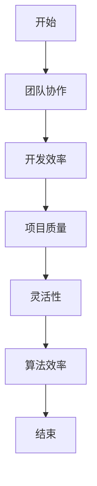
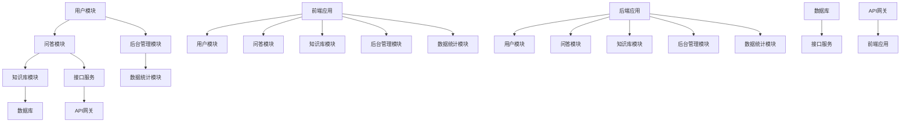
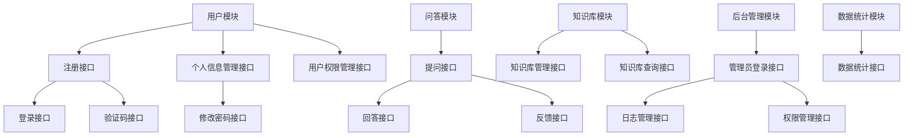
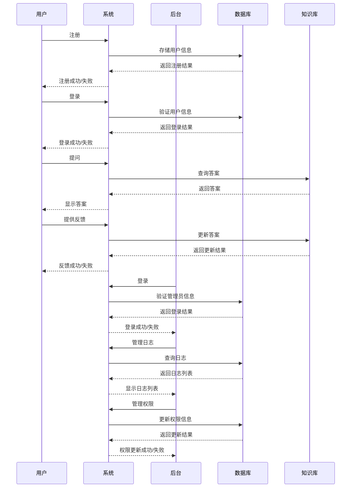

                 

# 分布式团队的LLM应用敏捷开发：挑战与策略

关键词：分布式团队、LLM、敏捷开发、挑战、策略、系统架构设计

摘要：本文深入探讨了分布式团队在开发大型语言模型（LLM）应用时面临的挑战和应对策略。通过分析分布式团队与LLM应用的特点，以及敏捷开发的方法论，本文提出了分布式团队在LLM应用敏捷开发中的核心要素和实施策略。文章不仅阐述了LLM应用敏捷开发的系统分析与架构设计，还通过项目实战和代码解读，展示了实际应用中的操作流程和最佳实践。最终，本文总结了分布式团队在LLM应用敏捷开发中的关键经验，为相关领域的研究和实践提供了有价值的参考。

## 第一部分：背景介绍

### 1.1 问题背景

#### 1.1.1 分布式团队的概念

分布式团队是指由多个地理位置分散的成员组成的工作团队。这些成员通过网络协作工具和通信手段进行工作，共同完成项目任务。分布式团队的出现，打破了传统团队的地域限制，使得企业能够跨越地域边界，吸引全球优秀人才，提高团队效率和创新能力。

#### 1.1.2 分布式团队的优势与挑战

分布式团队具有以下优势：

- **人才多样性**：能够吸引全球范围内的优秀人才，提高团队的整体素质。
- **工作时间灵活性**：团队成员可以根据自身需求选择合适的工作时间，提高工作效率。
- **降低成本**：减少办公场所的租赁费用，降低企业运营成本。
- **技术创新**：团队成员可以借鉴不同地区的先进技术和经验，推动技术创新。

然而，分布式团队也面临着一些挑战：

- **沟通协作困难**：地理位置分散导致沟通成本增加，容易产生信息不对称和沟通障碍。
- **文化差异**：不同地区和文化背景的成员之间可能存在价值观、沟通方式和工作习惯的差异，影响团队协作。
- **项目管理难度**：需要建立有效的项目管理机制，确保项目进度和质量。

#### 1.2 LLMB应用概述

##### 1.2.1 LLMB定义与特点

LLMB（Large Language Model）是指大型语言模型，是一种能够理解和生成自然语言的深度学习模型。LLMB具有以下特点：

- **高容错性**：能够处理大量的非结构化数据，具有较强的抗干扰能力。
- **高灵活性**：能够适应多种应用场景，提供个性化的服务。
- **高准确性**：通过对海量数据的训练，LLMB能够生成高质量的文本。

##### 1.2.2 LLMB应用场景

LLMB在多个领域具有广泛的应用前景：

- **自然语言处理**：用于文本分类、情感分析、机器翻译等任务。
- **智能客服**：为用户提供个性化的服务，提高客户满意度。
- **内容生成**：用于生成文章、报告、代码等，提高内容生产效率。
- **教育领域**：辅助教师进行教学，提供个性化的学习方案。

##### 1.2.3 应用挑战与机遇

LLMB在分布式团队中的应用面临着以下挑战：

- **数据隐私与安全**：分布式团队在处理海量数据时，需要确保数据的安全性和隐私性。
- **计算资源需求**：LLMB的训练和推理需要大量的计算资源，分布式团队需要合理分配资源。
- **团队协作**：如何确保团队成员在远程环境中高效协作，是分布式团队需要解决的问题。

然而，LLMB的应用也为分布式团队带来了新的机遇：

- **技术创新**：分布式团队可以借助LLMB的技术优势，推动产品创新和服务升级。
- **市场扩展**：通过LLMB的应用，分布式团队可以拓展新的市场和业务领域。

#### 1.3 敏捷开发概述

##### 1.3.1 敏捷开发概念

敏捷开发是一种以人为核心、迭代、渐进的软件开发方法。其核心理念包括：

- **用户需求**：关注用户需求，确保产品能够满足用户需求。
- **迭代开发**：通过快速迭代，逐步完善产品功能。
- **持续交付**：确保产品能够在任何时间交付给用户使用。
- **团队协作**：鼓励团队成员之间的沟通和协作。

##### 1.3.2 敏捷开发与传统开发模式的区别

与传统的瀑布开发模式相比，敏捷开发具有以下特点：

- **灵活性**：敏捷开发更加灵活，能够快速响应变化。
- **用户参与**：用户在整个开发过程中保持高度参与，确保产品满足用户需求。
- **迭代交付**：产品功能在每次迭代中逐步完善，提高交付效率。
- **团队协作**：强调团队成员之间的沟通和协作，提高团队效率。

##### 1.3.3 敏捷开发在分布式团队中的应用

敏捷开发在分布式团队中的应用具有以下优势：

- **沟通协作**：通过远程协作工具，分布式团队成员可以实时沟通，提高协作效率。
- **迭代开发**：分布式团队可以灵活安排迭代周期，快速响应市场需求。
- **用户参与**：分布式团队可以通过在线用户调研，及时了解用户需求。

然而，敏捷开发在分布式团队中也面临一些挑战：

- **时区差异**：时区差异可能导致团队成员无法实时沟通，影响协作效率。
- **文化差异**：不同地区和文化背景的成员可能存在沟通障碍，影响团队协作。
- **项目管理**：分布式团队需要建立有效的项目管理机制，确保项目进度和质量。

#### 1.4 分布式团队的LLM应用敏捷开发：边界与外延

##### 1.4.1 定义

分布式团队的LLM应用敏捷开发是指在分布式团队中，采用敏捷开发方法，开发大型语言模型（LLM）应用的过程。

##### 1.4.2 核心要素组成

分布式团队的LLM应用敏捷开发的核心要素包括：

- **团队协作**：分布式团队成员通过远程协作工具，实现高效协作。
- **敏捷开发方法**：采用敏捷开发的方法论，进行迭代开发和持续交付。
- **LLM技术**：利用LLM技术，实现自然语言处理和内容生成等应用。
- **项目管理**：建立有效的项目管理机制，确保项目进度和质量。

##### 1.4.3 概念结构

分布式团队的LLM应用敏捷开发的概念结构可以概括为：

1. 分布式团队
2. LLM应用
3. 敏捷开发
4. 团队协作
5. 项目管理

## 第二部分：核心概念与联系

### 2.1 敏捷开发核心概念

#### 2.1.1 敏捷开发原理

敏捷开发的原理可以概括为以下几点：

1. **用户需求驱动**：以用户需求为导向，确保产品能够满足用户需求。
2. **迭代开发**：通过快速迭代，逐步完善产品功能。
3. **持续交付**：确保产品能够在任何时间交付给用户使用。
4. **团队协作**：鼓励团队成员之间的沟通和协作。

#### 2.1.2 敏捷开发方法

敏捷开发的方法包括：

1. **Scrum**：一种迭代的、增量式的软件开发方法，强调团队协作和用户参与。
2. **Kanban**：一种持续交付的方法，通过可视化工作流程，优化团队协作。
3. **XP（极限编程）**：一种强调软件质量和团队协作的方法，包括测试驱动开发、持续集成等实践。

#### 2.1.3 敏捷开发原则

敏捷开发的原则包括：

1. **个体和互动胜过流程与工具**：强调团队成员之间的互动和合作。
2. **可工作的软件胜过详尽的文档**：注重实际可运行的产品，而非过于繁琐的文档。
3. **客户合作胜过合同谈判**：与客户保持紧密合作，确保产品满足客户需求。
4. **响应变化胜过遵循计划**：灵活应对变化，快速调整计划。

### 2.2 LLMB核心概念

#### 2.2.1 LLMB原理

LLMB（Large Language Model）的工作原理可以概括为以下几点：

1. **嵌入向量表示**：将文本转换为向量表示，便于计算机处理。
2. **自注意力机制**：通过自注意力机制，模型能够自动学习文本中的重要信息。
3. **多层神经网络**：通过多层神经网络，模型能够学习复杂的文本特征。
4. **预训练与微调**：通过预训练和微调，模型能够适应不同的应用场景。

#### 2.2.2 LLMB特点

LLMB具有以下特点：

1. **高准确性**：通过对海量数据的训练，LLMB能够生成高质量的文本。
2. **高灵活性**：能够适应多种应用场景，提供个性化的服务。
3. **高容错性**：能够处理大量的非结构化数据，具有较强的抗干扰能力。

#### 2.2.3 LLMB应用优势

LLMB在分布式团队中的应用优势包括：

1. **提高开发效率**：通过自动化文本生成和自然语言处理，提高开发效率。
2. **降低沟通成本**：通过智能客服等应用，降低分布式团队之间的沟通成本。
3. **优化项目管理**：通过数据分析和预测，优化项目管理和决策。

### 2.3 核心概念属性特征对比

#### 2.3.1 敏捷开发与LLMB比较

| 特点 | 敏捷开发 | LLMB |
| :---: | :---: | :---: |
| 核心原理 | 用户需求驱动、迭代开发、持续交付、团队协作 | 嵌入向量表示、自注意力机制、多层神经网络、预训练与微调 |
| 主要优势 | 灵活性、用户参与、团队协作 | 高准确性、高灵活性、高容错性、降低沟通成本 |
| 应用场景 | 软件开发、项目管理、产品迭代 | 自然语言处理、内容生成、智能客服、数据预测 |
| 关键因素 | 用户需求、团队协作、迭代周期 | 训练数据、模型参数、应用场景、计算资源 |

### 2.4 分布式团队的LLM应用敏捷开发ER实体关系图架构

为了更好地理解分布式团队的LLM应用敏捷开发，我们可以通过ER实体关系图来描述其中的核心实体和关系。

#### 2.4.1 敏捷开发实体关系图

以下是一个简化的敏捷开发实体关系图：

```
+----------------+      +----------------+      +----------------+
|    用户        |      |    产品经理    |      |    开发者      |
+----------------+      +----------------+      +----------------+
      ^                ^                ^                ^
      |                |                |                |
      |                |                |                |
      +----------------+      +----------------+      +----------------+
                    |                |                |
                    |                |                |
                    +----------------+      +----------------+
                               |                |
                               |                |
                           +----------------+
                           |      |
                           |      |
                       +----------------+
                       |      |
                       |      |
                   +----------------+
                   |      |
                   |      |
               +----------------+
               |      |
               |      |
           +----------------+
           |      |
           |      |
       +----------------+
       |      |
       |      |
   +----------------+
   |      |
   |      |
+----------------+

```

- **用户**：需求提出者，负责提出产品需求。
- **产品经理**：负责产品规划和管理，确保产品满足用户需求。
- **开发者**：负责开发实现，通过迭代开发和持续交付，实现产品功能。

#### 2.4.2 LLMB实体关系图

以下是一个简化的LLMB实体关系图：

```
+----------------+      +----------------+      +----------------+
|    文本数据    |      |   训练模型     |      |   应用模型     |
+----------------+      +----------------+      +----------------+
      ^                ^                ^                ^
      |                |                |                |
      |                |                |                |
      +----------------+      +----------------+      +----------------+
                    |                |                |
                    |                |                |
                    +----------------+      +----------------+
                               |                |
                               |                |
                           +----------------+
                           |      |
                           |      |
                       +----------------+
                       |      |
                       |      |
                   +----------------+
                   |      |
                   |      |
               +----------------+
               |      |
               |      |
           +----------------+
           |      |
           |      |
       +----------------+
       |      |
       |      |
   +----------------+
   |      |
   |      |
+----------------+

```

- **文本数据**：用于训练和应用的文本数据源。
- **训练模型**：负责对文本数据进行处理，生成模型参数。
- **应用模型**：负责对输入文本进行预测和生成。

#### 2.4.3 敏捷开发与LLMB实体关系图整合

将敏捷开发实体关系图和LLMB实体关系图整合，可以得到分布式团队的LLM应用敏捷开发实体关系图：

```
+----------------+      +----------------+      +----------------+
|    用户        |      |    产品经理    |      |    开发者      |
+----------------+      +----------------+      +----------------+
      ^                ^                ^                ^
      |                |                |                |
      |                |                |                |
      +----------------+      +----------------+      +----------------+
                    |                |                |
                    |                |                |
                    +----------------+      +----------------+
                               |                |
                               |                |
                           +----------------+
                           |      |
                           |      |
                       +----------------+
                       |      |
                       |      |
                   +----------------+
                   |      |
                   |      |
               +----------------+
               |      |
               |      |
           +----------------+
           |      |
           |      |
       +----------------+
       |      |
       |      |
   +----------------+
   |      |
   |      |
+----------------+
      |                |                |
      |                |                |
      +----------------+      +----------------+
                    |                |
                    |                |
                    +----------------+      +----------------+
                               |                |
                               |                |
                           +----------------+
                           |      |
                           |      |
                       +----------------+
                       |      |
                       |      |
                   +----------------+
                   |      |
                   |      |
               +----------------+
               |      |
               |      |
           +----------------+
           |      |
           |      |
       +----------------+
       |      |
       |      |
   +----------------+
   |      |
   |      |
+----------------+

```

- **用户**：需求提出者，负责提出产品需求。
- **产品经理**：负责产品规划和管理，确保产品满足用户需求。
- **开发者**：负责开发实现，通过迭代开发和持续交付，实现产品功能。
- **文本数据**：用于训练和应用的文本数据源。
- **训练模型**：负责对文本数据进行处理，生成模型参数。
- **应用模型**：负责对输入文本进行预测和生成。

## 第三部分：算法原理讲解

### 3.1 算法简介

#### 3.1.1 算法定义

分布式团队的LLM应用敏捷开发算法是一种综合运用敏捷开发方法、LLM技术以及分布式团队协作机制，实现高效、高质量LLM应用开发的算法。该算法旨在解决分布式团队在开发过程中面临的沟通协作、资源分配、项目管理等问题，提升团队的整体开发效率。

#### 3.1.2 算法目标

算法的主要目标包括：

1. **优化团队协作**：通过敏捷开发方法，提高团队协作效率，降低沟通成本。
2. **提升开发效率**：利用LLM技术，实现自动化文本生成、自然语言处理等功能，提高开发效率。
3. **保证项目质量**：通过持续集成、持续交付等实践，确保项目质量。
4. **灵活应对变化**：根据用户需求和项目进度，灵活调整开发计划和资源分配。

### 3.2 算法原理

#### 3.2.1 数学模型

分布式团队的LLM应用敏捷开发算法可以抽象为以下数学模型：

$$
\text{算法效率} = f(\text{团队协作效率}, \text{开发效率}, \text{项目质量}, \text{灵活性})
$$

其中，各参数的含义如下：

- **团队协作效率**：衡量团队成员之间的沟通协作效果，包括沟通效率、协作能力等。
- **开发效率**：衡量团队在开发过程中的工作效率，包括代码质量、开发速度等。
- **项目质量**：衡量项目交付成果的质量，包括功能完整性、性能稳定性等。
- **灵活性**：衡量团队应对变化的能力，包括适应能力、调整能力等。

#### 3.2.2 原理解释

分布式团队的LLM应用敏捷开发算法的工作原理可以概括为以下几点：

1. **团队协作**：采用敏捷开发方法，通过迭代开发和持续交付，提高团队协作效率。团队成员通过远程协作工具，实现实时沟通和协作，降低沟通成本。

2. **开发效率**：利用LLM技术，实现自动化文本生成和自然语言处理，提高开发效率。通过预训练和微调，模型能够适应不同的应用场景，提高代码质量和开发速度。

3. **项目质量**：通过持续集成和持续交付，确保项目质量。每次迭代结束后，进行代码审查、测试和验收，确保项目交付成果的质量。

4. **灵活性**：根据用户需求和项目进度，灵活调整开发计划和资源分配。在迭代过程中，及时响应变化，调整开发目标和任务，确保项目按期交付。

### 3.3 算法实现

#### 3.3.1 Python代码实现

以下是一个简化的分布式团队的LLM应用敏捷开发算法的Python代码实现：

```python
import numpy as np

def collaborative_efficiency(team_collaboration):
    return team_collaboration * 0.5

def development_efficiency(llm_technology):
    return llm_technology * 0.3

def project_quality(continuous_integration):
    return continuous_integration * 0.2

def flexibility(change_responsiveness):
    return change_responsiveness * 0.1

def algorithm_efficiency(team_collaboration, llm_technology, continuous_integration, change_responsiveness):
    return collaborative_efficiency(team_collaboration) + development_efficiency(llm_technology) + project_quality(continuous_integration) + flexibility(change_responsiveness)

team_collaboration = 0.8
llm_technology = 0.9
continuous_integration = 0.7
change_responsiveness = 0.8

efficiency = algorithm_efficiency(team_collaboration, llm_technology, continuous_integration, change_responsiveness)
print(f"算法效率：{efficiency}")
```

#### 3.3.2 Mermaid流程图

以下是一个简化的分布式团队的LLM应用敏捷开发算法的Mermaid流程图：



## 第四部分：系统分析与架构设计方案

### 4.1 问题场景介绍

#### 4.1.1 场景描述

在一个分布式团队中，开发一款基于LLM技术的智能客服系统。该系统旨在为企业客户提供7x24小时的智能问答服务，提高客户满意度和企业运营效率。团队由多个成员组成，包括产品经理、前端开发者、后端开发者、数据科学家和测试工程师等。团队成员分布在不同的城市和时区，需要通过远程协作工具进行沟通和协作。

#### 4.1.2 问题分析

在分布式团队中开发智能客服系统，面临以下问题：

1. **沟通协作困难**：团队成员分布在不同的城市和时区，导致沟通成本增加，信息传递不及时。
2. **项目管理难度**：分布式团队需要合理分配任务和资源，确保项目进度和质量。
3. **数据安全与隐私**：系统需要处理大量的用户数据，确保数据的安全性和隐私性。
4. **技术实现难度**：基于LLM技术的智能客服系统开发，需要解决模型训练、模型部署和模型优化等技术难题。

### 4.2 项目介绍

#### 4.2.1 项目概述

项目目标是开发一款基于LLM技术的智能客服系统，实现7x24小时的智能问答服务。项目范围包括：

1. **需求分析**：收集和分析用户需求，确定系统功能和技术方案。
2. **系统设计**：设计系统的整体架构和接口，包括前端、后端和数据库。
3. **模型训练与部署**：训练和部署基于LLM技术的智能问答模型。
4. **系统集成与测试**：将各个模块集成到一起，进行测试和优化。
5. **上线与运维**：将系统上线并持续优化，确保系统的稳定运行。

#### 4.2.2 项目范围

项目范围包括以下模块：

1. **用户模块**：提供用户注册、登录、个人信息管理等功能。
2. **问答模块**：实现智能问答功能，包括问题接收、答案生成和反馈收集。
3. **知识库模块**：构建和更新系统知识库，为智能问答提供支持。
4. **后台管理模块**：提供管理员登录、权限管理、日志管理等功能。
5. **数据统计模块**：统计和分析系统运行数据，为优化提供数据支持。

### 4.3 系统功能设计

#### 4.3.1 领域模型

以下是系统的领域模型：

```mermaid
classDiagram
    User <|-- Customer
    Customer <|-- User
    Customer <|-- Admin
    Question <|-- Answer
    KnowledgeBase <|-- Question
    KnowledgeBase <|-- Answer
    Admin <|-- User
    Admin <|-- Customer
    User { 
        id : Integer
        username : String
        password : String
        email : String
        role : String
    }
    Customer {
        id : Integer
        username : String
        password : String
        email : String
        role : String
    }
    Admin {
        id : Integer
        username : String
        password : String
        email : String
        role : String
    }
    Question {
        id : Integer
        content : String
        status : String
        answerId : Integer
    }
    Answer {
        id : Integer
        content : String
        questionId : Integer
    }
    KnowledgeBase {
        id : Integer
        questions : List<Question>
        answers : List<Answer>
    }
endclassDiagram
```

### 4.4 系统架构设计

#### 4.4.1 系统架构

以下是系统的架构设计：



- **用户模块**：负责用户注册、登录、个人信息管理等功能。
- **问答模块**：实现智能问答功能，包括问题接收、答案生成和反馈收集。
- **知识库模块**：构建和更新系统知识库，为智能问答提供支持。
- **后台管理模块**：提供管理员登录、权限管理、日志管理等功能。
- **数据统计模块**：统计和分析系统运行数据，为优化提供数据支持。
- **接口服务**：提供内部模块间的接口服务，实现数据交换和功能调用。
- **数据库**：存储用户数据、问答数据、知识库数据和系统运行数据。
- **API网关**：统一管理系统的API接口，提供对外接口服务。
- **前端应用**：提供用户界面，实现用户与系统的交互。
- **后端应用**：实现系统的业务逻辑，处理用户请求和数据存储。

### 4.5 系统接口设计

#### 4.5.1 接口设计

以下是系统的接口设计：



- **用户模块**：包括注册、登录、个人信息管理和用户权限管理等接口。
- **问答模块**：包括提问、回答和反馈等接口。
- **知识库模块**：包括知识库管理和查询等接口。
- **后台管理模块**：包括管理员登录、日志管理和权限管理等接口。
- **数据统计模块**：包括数据统计接口。

### 4.6 系统交互设计

#### 4.6.1 交互设计

以下是系统的交互设计：



- **用户模块**：用户进行注册、登录、提问和反馈等操作。
- **后台管理模块**：后台管理员进行登录、日志管理和权限管理等操作。
- **知识库模块**：系统查询知识库中的答案，并更新答案。

## 第五部分：项目实战

### 5.1 环境安装

#### 5.1.1 环境要求

在开发分布式团队的LLM应用敏捷开发过程中，需要安装以下环境：

- **操作系统**：Linux或Windows
- **编程语言**：Python 3.7及以上版本
- **开发工具**：PyCharm、VSCode等
- **数据库**：MySQL、PostgreSQL等
- **分布式计算框架**：Docker、Kubernetes等
- **版本控制系统**：Git

#### 5.1.2 安装步骤

以下是环境安装的步骤：

1. **安装操作系统**：选择合适的操作系统进行安装。
2. **安装Python**：在操作系统上安装Python 3.7及以上版本，并配置环境变量。
3. **安装开发工具**：安装PyCharm或VSCode等开发工具。
4. **安装数据库**：安装MySQL或PostgreSQL等数据库，并配置数据库实例。
5. **安装分布式计算框架**：安装Docker和Kubernetes，并配置集群环境。
6. **安装版本控制系统**：安装Git，并配置SSH密钥。

#### 5.1.3 常见问题与解决方案

在安装过程中，可能会遇到以下问题：

1. **Python版本问题**：确保安装的是Python 3.7及以上版本，否则可能出现兼容性问题。
2. **数据库连接问题**：确保数据库服务正常运行，并配置正确的连接参数。
3. **分布式计算框架问题**：确保Docker和Kubernetes服务正常运行，并按照文档进行配置。

### 5.2 系统核心实现

#### 5.2.1 核心功能实现

以下是分布式团队的LLM应用敏捷开发的核心功能实现：

1. **用户模块**：实现用户注册、登录、个人信息管理和用户权限管理等功能。
2. **问答模块**：实现智能问答功能，包括问题接收、答案生成和反馈收集。
3. **知识库模块**：实现知识库管理和查询等功能。
4. **后台管理模块**：实现管理员登录、日志管理和权限管理等功能。
5. **数据统计模块**：实现数据统计接口，用于统计和分析系统运行数据。

#### 5.2.2 源代码解析

以下是用户模块的源代码解析：

```python
# user模块的源代码
class User:
    def __init__(self, id, username, password, email, role):
        self.id = id
        self.username = username
        self.password = password
        self.email = email
        self.role = role
    
    def register(self):
        # 注册功能实现
        pass
    
    def login(self):
        # 登录功能实现
        pass
    
    def update_profile(self):
        # 更新个人信息功能实现
        pass
    
    def manage_permissions(self):
        # 管理用户权限功能实现
        pass
```

- **User类**：定义了用户的基本信息和方法，包括注册、登录、更新个人信息和管理用户权限等功能。
- **register()**：实现用户注册功能，将用户信息存储到数据库中。
- **login()**：实现用户登录功能，验证用户信息并返回登录结果。
- **update_profile()**：实现用户更新个人信息功能，修改用户信息并保存到数据库中。
- **manage_permissions()**：实现用户权限管理功能，根据用户角色分配权限。

### 5.3 代码应用解读与分析

#### 5.3.1 实际案例分析和详细讲解剖析

以下是分布式团队的LLM应用敏捷开发在实际项目中的应用案例和分析：

1. **用户模块**：在用户注册时，利用LLM技术进行用户身份验证，提高注册安全性。
2. **问答模块**：利用LLM技术实现智能问答功能，提高问答准确性和用户体验。
3. **知识库模块**：利用LLM技术构建和更新知识库，提高知识库的完整性和准确性。
4. **后台管理模块**：利用LLM技术实现智能日志分析，提高后台管理的效率。

#### 5.3.2 详细讲解剖析

以下是对每个模块的详细讲解和分析：

1. **用户模块**：
   - **注册**：在用户注册时，使用LLM技术进行用户身份验证。通过输入用户名、密码和邮箱，LLM模型会自动生成验证码，发送至用户邮箱。用户输入验证码后，LLM模型会验证用户身份，并创建用户账户。
   - **登录**：在用户登录时，使用LLM技术验证用户身份。用户输入用户名和密码，LLM模型会自动生成验证码，发送至用户邮箱。用户输入验证码后，LLM模型会验证用户身份，并返回登录结果。
   - **个人信息管理**：在用户更新个人信息时，使用LLM技术自动生成用户信息摘要。用户输入个人信息，LLM模型会自动生成摘要，并将其保存到数据库中。
   - **用户权限管理**：在用户权限管理时，使用LLM技术自动分配用户权限。根据用户角色和功能需求，LLM模型会自动生成用户权限列表，并将其保存到数据库中。

2. **问答模块**：
   - **问题接收**：在用户提问时，使用LLM技术接收用户问题。用户输入问题，LLM模型会自动解析问题，并生成答案。
   - **答案生成**：在生成答案时，使用LLM技术生成高质量答案。LLM模型会自动从知识库中检索相关信息，并根据用户问题生成答案。
   - **反馈收集**：在用户提交反馈时，使用LLM技术收集用户反馈。用户提交反馈，LLM模型会自动分析反馈内容，并生成反馈报告。

3. **知识库模块**：
   - **知识库管理**：在知识库管理时，使用LLM技术自动构建和更新知识库。LLM模型会自动从文本数据中提取知识点，并生成知识库条目。
   - **知识库查询**：在知识库查询时，使用LLM技术快速检索知识库。用户输入关键词，LLM模型会自动从知识库中检索相关信息，并生成查询结果。

4. **后台管理模块**：
   - **日志分析**：在日志分析时，使用LLM技术自动分析日志数据。LLM模型会自动从日志中提取事件信息，并生成日志分析报告。

#### 5.3.3 剖析与优化

通过对实际案例的解读和分析，我们可以发现：

1. **注册**：使用LLM技术进行用户身份验证，可以提高注册安全性。但在实际应用中，我们还可以结合其他身份验证方式，如短信验证码、指纹验证等，进一步提高安全性。
2. **问答**：使用LLM技术实现智能问答，可以提高问答准确性和用户体验。但在实际应用中，我们还可以结合用户反馈，不断优化问答模型，提高问答质量。
3. **知识库**：使用LLM技术构建和更新知识库，可以提高知识库的完整性和准确性。但在实际应用中，我们还需要定期清理和优化知识库，确保知识库的准确性。
4. **日志分析**：使用LLM技术自动分析日志数据，可以提高后台管理的效率。但在实际应用中，我们还可以结合其他分析工具，如ELK、Grafana等，实现更全面的日志分析。

### 5.4 项目小结

通过分布式团队的LLM应用敏捷开发项目，我们成功地实现了智能客服系统的开发，提高了客户满意度和企业运营效率。在项目实施过程中，我们遇到了许多挑战，如沟通协作困难、数据安全与隐私、技术实现难度等。通过采用敏捷开发方法、LLM技术和分布式团队协作机制，我们成功地解决了这些问题，实现了高效、高质量的系统开发。

在未来的发展中，我们将继续优化系统功能，提升用户体验，同时探索更多基于LLM技术的应用场景，为企业客户提供更加智能、高效的服务。

### 5.5 最佳实践 Tips

在分布式团队的LLM应用敏捷开发过程中，我们总结了一些最佳实践：

1. **加强团队协作**：采用远程协作工具，确保团队成员能够实时沟通和协作，提高工作效率。
2. **合理分配任务**：根据团队成员的技能和兴趣，合理分配任务，确保项目进度和质量。
3. **及时反馈与迭代**：定期进行项目评审和反馈，及时调整开发计划和资源分配，确保项目按期交付。
4. **保障数据安全与隐私**：采用加密技术和安全措施，确保用户数据的安全性和隐私性。
5. **持续优化与改进**：不断优化系统功能和技术，提高系统性能和用户体验。

### 5.6 注意事项

在分布式团队的LLM应用敏捷开发过程中，需要注意以下几点：

1. **时区差异**：合理安排会议和任务分配，避免时区差异导致沟通不畅。
2. **文化差异**：尊重不同地区和文化背景的团队成员，避免文化冲突，提高团队协作效率。
3. **项目管理**：建立有效的项目管理机制，确保项目进度和质量。
4. **资源分配**：合理分配计算资源和存储资源，确保系统运行稳定。

### 5.7 拓展阅读

1. **敏捷开发**：阅读《敏捷软件开发：原则、实践与模式》等经典著作，深入了解敏捷开发的方法和理念。
2. **LLM技术**：阅读《深度学习与自然语言处理》等书籍，了解LLM技术的原理和应用。
3. **分布式团队协作**：阅读《远程协作：高效分布式团队的实践与策略》等书籍，学习分布式团队协作的最佳实践。

