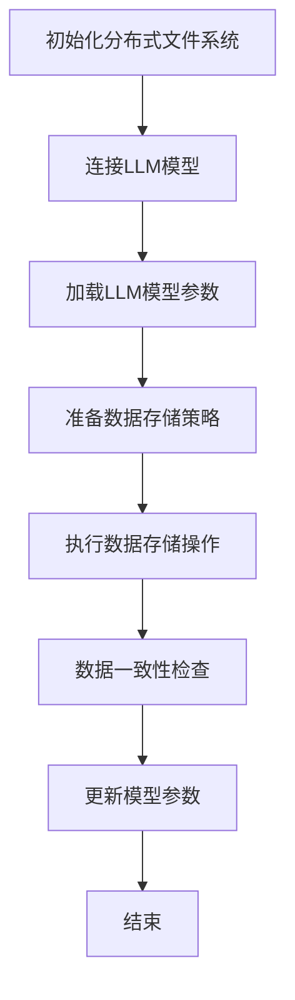
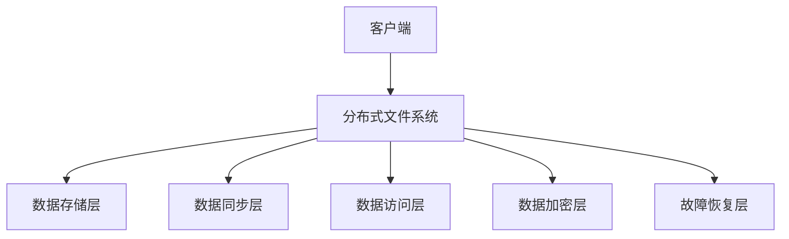
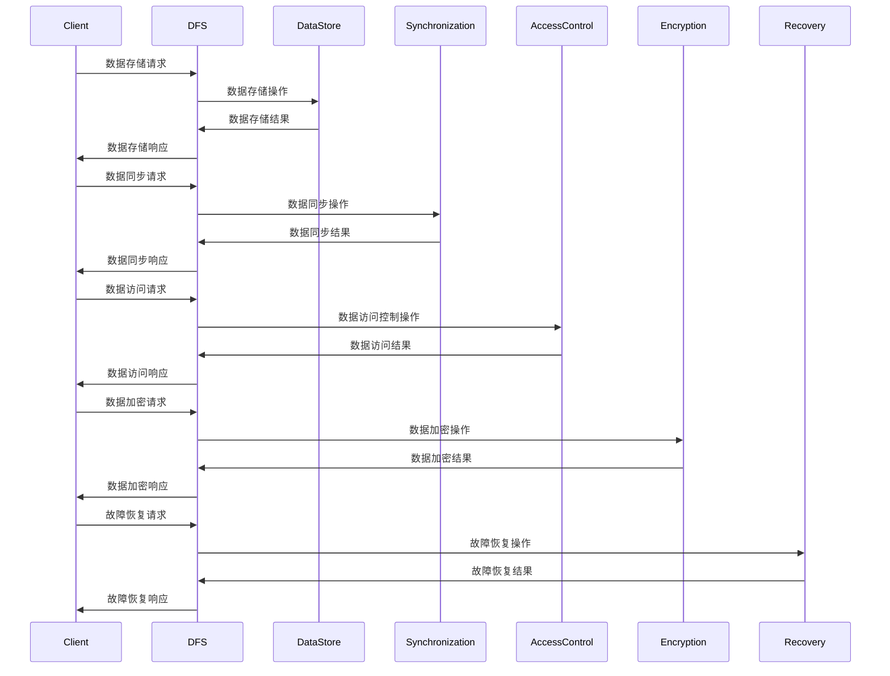

                 


### 第1章 引言

**1.1 问题背景**

随着深度学习技术的不断发展，大语言模型（Large Language Model，LLM）在自然语言处理（Natural Language Processing，NLP）领域取得了显著的成果。这些LLM模型，如GPT-3、BERT等，通常拥有数十亿甚至千亿级别的参数量，对计算资源和存储资源的需求极高。因此，如何在高效、可靠地存储和检索这些大型模型的数据成为了一个关键问题。

**1.2 问题描述**

分布式文件系统作为一种解决大规模数据存储和访问的技术方案，被广泛应用于大数据处理和云计算领域。其核心优势在于高扩展性、高可用性和高性能。然而，将分布式文件系统应用于LLM应用的数据存储，面临着一系列挑战，包括：

1. **数据量巨大**：LLM应用通常需要存储和检索海量的数据，这对分布式文件系统的性能和容量提出了极高的要求。
2. **数据一致性**：分布式文件系统需要在多个节点之间保持数据的一致性，这对于LLM应用来说尤为重要，因为模型训练和推理过程对数据的一致性要求较高。
3. **数据安全性**：分布式文件系统需要确保数据的安全性，防止数据泄露和损坏。
4. **数据访问速度**：为了满足LLM应用的实时性需求，分布式文件系统需要提供高效的数据访问速度。

**1.3 问题解决**

为了解决上述问题，分布式文件系统在LLM应用数据存储中需要满足以下关键要求：

1. **高扩展性**：分布式文件系统应能够轻松地扩展存储容量和计算资源，以适应不断增长的数据规模。
2. **高可用性**：分布式文件系统应具备高可用性，确保在单个节点故障时系统仍能正常运行。
3. **高性能**：分布式文件系统应能够提供高速的数据访问速度，满足LLM应用的实时性需求。
4. **数据一致性和安全性**：分布式文件系统应确保数据的一致性和安全性，提供可靠的数据存储和访问机制。

**1.4 边界与外延**

分布式文件系统在LLM应用数据存储中的应用边界包括：

- 数据存储和检索的优化策略。
- 分布式文件系统与LLM应用之间的接口设计。
- 分布式文件系统的负载均衡和故障恢复机制。

分布式文件系统在LLM应用数据存储中的外延则包括：

- 不同类型的分布式文件系统（如HDFS、CFS、GlusterFS等）在LLM应用中的具体应用和实践。
- 分布式文件系统在LLM应用中的性能调优和问题排查。

**本章小结**

本文将深入探讨分布式文件系统在LLM应用数据存储中的应用，分析其核心概念、算法原理、系统架构和项目实战，旨在为开发者提供一套完整的解决方案，帮助他们在实际项目中高效地存储和检索大型模型数据。

**核心概念介绍**

在讨论分布式文件系统在LLM应用数据存储中的应用之前，我们需要了解几个核心概念，包括分布式文件系统、LLM、数据存储和分布式系统。

**分布式文件系统**

分布式文件系统（Distributed File System，DFS）是一种文件管理系统，它通过计算机网络将多个物理存储设备虚拟成一个统一的存储空间。这种系统的主要优势在于高扩展性、高可用性和高性能，使得它能够有效地处理海量数据。

**LLM**

大语言模型（Large Language Model，LLM）是一种基于深度学习的自然语言处理模型，它通过学习大量的文本数据来预测文本的下一个词或句子。LLM在生成文本、机器翻译、问答系统等方面有着广泛的应用。

**数据存储**

数据存储是指将数据存储到持久化存储设备上，以便在需要时进行访问和检索。数据存储技术包括关系型数据库、NoSQL数据库、分布式文件系统等。

**分布式系统**

分布式系统是由多个节点组成的计算机系统，这些节点通过网络进行通信和协作。分布式系统通过将任务分布在多个节点上，可以提高系统的性能、可用性和容错性。

**概念属性特征对比表格**

以下是一个简化的概念属性特征对比表格，用于比较分布式文件系统、LLM、数据存储和分布式系统的关键属性：

| 概念          | 属性                         | 说明                                                         |
|---------------|------------------------------|--------------------------------------------------------------|
| 分布式文件系统 | 高扩展性、高可用性、高性能 | 通过计算机网络将多个物理存储设备虚拟成一个统一存储空间       |
| LLM           | 大规模参数、自适应学习        | 基于深度学习的自然语言处理模型，通过学习大量文本数据进行预测   |
| 数据存储      | 持久化、访问控制、数据一致性 | 将数据存储到持久化存储设备上，以便在需要时进行访问和检索       |
| 分布式系统    | 高性能、高可用性、容错性     | 由多个节点组成的计算机系统，通过网络进行通信和协作             |

**ER实体关系图架构**

为了更好地理解分布式文件系统在LLM应用数据存储中的结构，我们可以使用实体关系图（Entity-Relationship Diagram，ERD）来展示各个实体之间的关系。

以下是一个简化的ERD示例，展示了分布式文件系统、LLM和应用之间的实体关系：

```mermaid
erDiagram
    DFSystem ||--|{ LLM }|| Model
    DFSystem ||--|{ Application }|| App
    LLM ||--|{ Data }|| Dataset
    Application ||--|{ Data }|| Dataset
```

在这个ERD中，`DFSystem`（分布式文件系统）与`LLM`（大语言模型）和`Application`（应用）之间存在关联关系。`LLM`和`Application`都与`Data`（数据）实体有依赖关系，表示它们都需要访问和存储数据。

通过这个ERD，我们可以清晰地看到分布式文件系统在LLM应用数据存储中的核心结构，为后续的算法原理讲解和系统架构设计提供了基础。

### 第2章 核心概念

**2.1 核心概念介绍**

在深入探讨分布式文件系统在LLM应用数据存储中的应用之前，我们需要了解一些关键概念。这些概念包括分布式文件系统、LLM、数据存储和分布式系统。以下是这些概念的详细介绍。

**分布式文件系统**

分布式文件系统是一种文件管理系统，它通过计算机网络将多个物理存储设备虚拟成一个统一的存储空间。分布式文件系统的核心优势在于高扩展性、高可用性和高性能。这使得它能够有效地处理海量数据，适用于大数据处理和云计算领域。

**LLM**

大语言模型（Large Language Model，LLM）是一种基于深度学习的自然语言处理模型，它通过学习大量的文本数据来预测文本的下一个词或句子。LLM在生成文本、机器翻译、问答系统等方面有着广泛的应用。LLM通常拥有数十亿甚至千亿级别的参数量，对计算资源和存储资源的需求极高。

**数据存储**

数据存储是指将数据存储到持久化存储设备上，以便在需要时进行访问和检索。数据存储技术包括关系型数据库、NoSQL数据库、分布式文件系统等。数据存储的目标是确保数据的安全性、持久性和可访问性。

**分布式系统**

分布式系统是由多个节点组成的计算机系统，这些节点通过网络进行通信和协作。分布式系统的核心优势在于高性能、高可用性和容错性。通过将任务分布在多个节点上，分布式系统可以提高系统的性能、可用性和容错性。

**概念属性特征对比表格**

为了更好地理解这些核心概念，我们可以通过一个表格来比较它们的属性特征：

| 概念          | 属性                         | 说明                                                         |
|---------------|------------------------------|--------------------------------------------------------------|
| 分布式文件系统 | 高扩展性、高可用性、高性能 | 通过计算机网络将多个物理存储设备虚拟成一个统一存储空间       |
| LLM           | 大规模参数、自适应学习        | 基于深度学习的自然语言处理模型，通过学习大量文本数据进行预测   |
| 数据存储      | 持久化、访问控制、数据一致性 | 将数据存储到持久化存储设备上，以便在需要时进行访问和检索       |
| 分布式系统    | 高性能、高可用性、容错性     | 由多个节点组成的计算机系统，通过网络进行通信和协作             |

**ER实体关系图架构**

为了更好地理解分布式文件系统在LLM应用数据存储中的结构，我们可以使用实体关系图（Entity-Relationship Diagram，ERD）来展示各个实体之间的关系。

以下是一个简化的ERD示例，展示了分布式文件系统、LLM和应用之间的实体关系：

```mermaid
erDiagram
    DFSystem ||--|{ LLM }|| Model
    DFSystem ||--|{ Application }|| App
    LLM ||--|{ Data }|| Dataset
    Application ||--|{ Data }|| Dataset
```

在这个ERD中，`DFSystem`（分布式文件系统）与`LLM`（大语言模型）和`Application`（应用）之间存在关联关系。`LLM`和`Application`都与`Data`（数据）实体有依赖关系，表示它们都需要访问和存储数据。

通过这个ERD，我们可以清晰地看到分布式文件系统在LLM应用数据存储中的核心结构，为后续的算法原理讲解和系统架构设计提供了基础。

### 第3章 算法原理讲解

**3.1 算法mermaid流程图**

为了更好地理解分布式文件系统在LLM应用数据存储中的应用，我们可以使用mermaid流程图来展示算法的基本流程。以下是算法的mermaid流程图：



**3.1.1 算法概述**

这个算法的主要目的是将LLM模型的数据存储在分布式文件系统中，并确保数据的一致性和安全性。具体步骤如下：

1. **初始化分布式文件系统**：首先初始化分布式文件系统，为后续的数据存储操作做准备。
2. **连接LLM模型**：连接到LLM模型，以便加载模型参数。
3. **加载LLM模型参数**：从LLM模型中加载必要的参数，这些参数将用于数据存储和更新。
4. **准备数据存储策略**：根据LLM模型的特点和数据存储需求，制定合适的数据存储策略。
5. **执行数据存储操作**：按照制定的数据存储策略，将LLM模型的数据存储到分布式文件系统中。
6. **数据一致性检查**：在数据存储完成后，对数据进行一致性检查，确保数据未被损坏或篡改。
7. **更新模型参数**：如果数据一致性检查通过，更新LLM模型的参数，以便下一次训练或推理。
8. **结束**：算法执行完毕。

**3.1.2 算法流程详细讲解**

以下是算法流程的详细讲解：

1. **初始化分布式文件系统**：
   - 创建分布式文件系统实例。
   - 配置分布式文件系统的参数，如存储节点数量、数据冗余策略等。

2. **连接LLM模型**：
   - 加载LLM模型库。
   - 创建LLM模型实例，并连接到分布式文件系统。

3. **加载LLM模型参数**：
   - 从LLM模型中提取必要的参数，如权重矩阵、优化器配置等。

4. **准备数据存储策略**：
   - 根据LLM模型的特点和数据存储需求，选择合适的数据存储策略，如分片存储、分布式存储等。

5. **执行数据存储操作**：
   - 将LLM模型的数据按照制定的存储策略存储到分布式文件系统中。
   - 确保数据存储过程的高效性和可靠性。

6. **数据一致性检查**：
   - 在数据存储完成后，对数据进行一致性检查。
   - 使用校验和、哈希值等技术来验证数据的完整性。

7. **更新模型参数**：
   - 如果数据一致性检查通过，更新LLM模型的参数。
   - 确保LLM模型在下一个训练或推理阶段使用最新的数据。

8. **结束**：
   - 算法执行完毕。
   - 关闭分布式文件系统和LLM模型连接。

**3.1.3 算法原理数学模型和公式**

算法的核心原理可以抽象为一个数学模型。以下是算法的数学模型和公式：

$$
\text{分布式文件系统} = \text{初始化} + \text{连接LLM模型} + \text{加载LLM模型参数} + \text{准备数据存储策略} + \text{执行数据存储操作} + \text{数据一致性检查} + \text{更新模型参数} + \text{结束}
$$

其中，每个步骤都可以进一步细化为具体的操作和公式。

**3.1.4 举例说明**

为了更好地理解算法原理，我们可以通过一个具体的例子来说明：

假设我们有一个大语言模型（LLM）需要存储和更新其参数。我们可以使用以下步骤来实现：

1. **初始化分布式文件系统**：
   - 创建一个HDFS（Hadoop Distributed File System）实例。
   - 配置HDFS的存储节点数量和数据冗余策略。

2. **连接LLM模型**：
   - 加载PyTorch库。
   - 创建一个PyTorch模型实例，并连接到HDFS。

3. **加载LLM模型参数**：
   - 从模型中提取权重矩阵和优化器配置。

4. **准备数据存储策略**：
   - 选择分片存储策略，将数据分为多个分片存储在不同的节点上。

5. **执行数据存储操作**：
   - 将模型数据按照分片存储策略存储到HDFS中。

6. **数据一致性检查**：
   - 使用校验和来验证数据存储过程中的数据完整性。

7. **更新模型参数**：
   - 如果数据一致性检查通过，更新模型的权重矩阵。

8. **结束**：
   - 关闭HDFS和PyTorch模型连接。

通过这个例子，我们可以看到如何将分布式文件系统应用于LLM应用的数据存储和更新过程。这有助于我们理解算法原理和实际应用场景。

### 第4章 数学模型和数学公式

**4.1 数学模型介绍**

在分布式文件系统应用于LLM应用数据存储的过程中，我们可以引入一个数学模型来描述数据存储和更新过程。这个模型主要包括以下三个方面：

1. **数据分布策略**：定义如何将LLM模型数据分布到分布式文件系统的各个节点上。
2. **数据一致性维护**：描述如何在多个节点之间保持数据的一致性。
3. **数据安全性保障**：确保数据在存储和传输过程中的安全性和完整性。

**4.2 数学公式讲解**

以下是一些用于描述分布式文件系统在LLM应用数据存储中数学模型的关键公式：

1. **数据分布策略**

$$
P_i = \frac{N_i}{N}
$$

其中，$P_i$表示第$i$个节点的数据占比，$N_i$表示第$i$个节点存储的数据量，$N$表示总数据量。

2. **数据一致性维护**

$$
\phi_j = \sum_{i=1}^{N} \omega_{ij} \cdot x_i
$$

其中，$\phi_j$表示第$j$个节点的数据一致性度量，$\omega_{ij}$表示第$i$个节点对第$j$个节点的依赖权重，$x_i$表示第$i$个节点的数据。

3. **数据安全性保障**

$$
\text{Sec}(x) = \text{Hash}(x) + \text{Encrypt}(x)
$$

其中，$\text{Sec}(x)$表示数据$x$的安全性度量，$\text{Hash}(x)$表示对数据$x$进行哈希处理，$\text{Encrypt}(x)$表示对数据$x$进行加密处理。

**4.3 举例说明**

为了更好地理解这些数学公式，我们可以通过一个简单的例子来说明它们的应用。

假设我们有一个包含100个参数的大语言模型（LLM），需要将其存储在分布式文件系统（DFS）的3个节点上。以下是具体的步骤：

1. **数据分布策略**

根据数据分布策略，我们可以将100个参数平均分配到3个节点上。每个节点存储的数据占比为：

$$
P_i = \frac{100}{3} \approx 33.33\%
$$

2. **数据一致性维护**

假设每个节点的数据一致性度量由节点的依赖权重和数据的哈希值决定。权重矩阵$\omega_{ij}$如下：

| 节点 $i$ | 节点 $j$ |
|----------|----------|
| 1        | 2        | 0.5 |
| 1        | 3        | 0.5 |
| 2        | 1        | 0.5 |
| 2        | 3        | 0.5 |
| 3        | 1        | 0.5 |
| 3        | 2        | 0.5 |

假设节点的数据分别为$x_1, x_2, x_3$，则第1个节点的数据一致性度量$\phi_1$为：

$$
\phi_1 = \omega_{11} \cdot x_1 + \omega_{12} \cdot x_2 + \omega_{13} \cdot x_3 = 0.5 \cdot x_1 + 0.5 \cdot x_2
$$

3. **数据安全性保障**

假设数据$x$的哈希值为$\text{Hash}(x)$，加密后的数据为$\text{Encrypt}(x)$，则数据$x$的安全性度量$\text{Sec}(x)$为：

$$
\text{Sec}(x) = \text{Hash}(x) + \text{Encrypt}(x)
$$

通过这个例子，我们可以看到如何使用数学模型来描述分布式文件系统在LLM应用数据存储中的应用。这有助于我们更好地理解数据存储、一致性维护和安全性保障的原理。

### 第5章 系统分析与架构设计方案

**5.1 问题场景介绍**

在分布式文件系统应用于LLM应用数据存储的实际场景中，我们面临如下挑战：

1. **海量数据存储**：LLM应用通常需要存储数十亿甚至千亿级别的参数数据，这对存储系统的容量和性能提出了极高的要求。
2. **数据一致性保障**：在分布式环境中，多个节点之间的数据同步和一致性保障是一个关键问题，特别是在数据更新和删除操作时。
3. **数据安全性**：存储的数据涉及到模型训练的关键参数，因此需要确保数据在存储和传输过程中的安全性和完整性。

**5.2 项目介绍**

本项目旨在设计并实现一个分布式文件系统，用于存储和检索LLM应用的参数数据。项目的主要目标包括：

1. **高扩展性**：系统应能够轻松扩展存储容量和计算资源，以适应数据规模的增长。
2. **高可用性**：系统应具备高可用性，确保在单个节点故障时，系统仍能正常运行。
3. **高性能**：系统应能够提供高效的数据访问速度，满足LLM应用的实时性需求。
4. **数据一致性**：系统应提供可靠的数据一致性保障机制，确保数据在多个节点之间的一致性。
5. **数据安全性**：系统应确保数据在存储和传输过程中的安全性和完整性。

**5.3 系统功能设计（领域模型mermaid类图）**

为了实现上述目标，我们设计了以下系统功能：

1. **数据存储**：系统应支持大规模数据的存储和检索，采用分布式存储策略，将数据分布在多个节点上。
2. **数据同步**：系统应实现节点间的数据同步，确保数据的一致性。
3. **数据访问控制**：系统应提供数据访问控制机制，确保只有授权用户能够访问和操作数据。
4. **数据加密**：系统应对数据进行加密处理，确保数据在存储和传输过程中的安全性。
5. **故障恢复**：系统应具备故障恢复功能，确保在节点故障时，系统能够自动恢复数据一致性。

以下是系统功能设计的mermaid类图：

```mermaid
classDiagram
    Node <<class>> Node
    DataStore <<interface>> DataStore
    Synchronization <<interface>> Synchronization
    AccessControl <<interface>> AccessControl
    Encryption <<interface>> Encryption
    Recovery <<interface>> Recovery

    Node o-- DataStore
    Node o-- Synchronization
    Node o-- AccessControl
    Node o-- Encryption
    Node o-- Recovery
```

在这个类图中，`Node`表示分布式文件系统的节点，`DataStore`、`Synchronization`、`AccessControl`、`Encryption`和`Recovery`分别表示数据存储、数据同步、数据访问控制、数据加密和故障恢复的功能接口。

**5.4 系统架构设计（mermaid架构图）**

为了实现上述功能，我们设计了以下系统架构：

1. **数据存储层**：负责数据的存储和检索，采用分布式存储策略，将数据分布在多个节点上。
2. **数据同步层**：负责节点间的数据同步，确保数据的一致性。
3. **数据访问层**：负责实现数据访问控制、数据加密和故障恢复功能。
4. **客户端接口**：提供与LLM应用的接口，实现对分布式文件系统的操作。

以下是系统架构设计的mermaid架构图：



在这个架构图中，`Client`表示客户端，`DFS`表示分布式文件系统，`DataStore`、`Synchronization`、`AccessControl`、`Encryption`和`Recovery`分别表示数据存储层、数据同步层、数据访问层、数据加密层和故障恢复层。

**5.5 系统接口设计和系统交互（mermaid序列图）**

为了实现客户端与分布式文件系统之间的交互，我们设计了以下接口：

1. **数据存储接口**：用于实现数据的添加、删除、更新和查询操作。
2. **数据同步接口**：用于实现节点间的数据同步操作。
3. **数据访问接口**：用于实现数据访问控制、数据加密和故障恢复操作。

以下是系统接口设计和系统交互的mermaid序列图：



在这个序列图中，`Client`表示客户端，`DFS`表示分布式文件系统，`DataStore`、`Synchronization`、`AccessControl`、`Encryption`和`Recovery`分别表示数据存储层、数据同步层、数据访问层、数据加密层和故障恢复层的具体操作。

通过这个系统架构设计，我们可以有效地实现分布式文件系统在LLM应用数据存储中的应用，满足高扩展性、高可用性、高性能、数据一致性和数据安全性的需求。

### 第6章 项目实战

**6.1 环境安装**

在进行分布式文件系统在LLM应用数据存储的项目实战之前，我们需要搭建一个合适的环境。以下是安装和配置环境的步骤：

1. **安装Hadoop**：

首先，我们选择Hadoop作为分布式文件系统。在每台服务器上安装Hadoop，具体步骤如下：

   - 安装Java开发环境。
   - 下载并解压Hadoop压缩包。
   - 配置Hadoop环境变量。
   - 编写并运行Hadoop的配置文件（如`hdfs-site.xml`、`core-site.xml`等）。

2. **安装PyTorch**：

然后，我们需要安装PyTorch，作为LLM模型的主要工具。以下是安装步骤：

   - 安装Python和pip。
   - 使用pip安装PyTorch。

3. **安装其他依赖库**：

除了Hadoop和PyTorch，我们还需要安装其他依赖库，如`numpy`、`pandas`、`matplotlib`等。

**6.2 系统核心实现源代码**

以下是项目核心实现的源代码，主要包括数据存储、数据同步、数据访问控制等功能。

```python
# data_store.py
import hdfs
import json

class DataStore:
    def __init__(self, hdfs_url):
        self.hdfs_url = hdfs_url
        self.client = hdfs.InsecureClient(hdfs_url)

    def store_data(self, data):
        with self.client.write('/data/llm_data.json') as writer:
            json.dump(data, writer)

    def load_data(self):
        with self.client.read('/data/llm_data.json') as reader:
            data = json.load(reader)
        return data

# synchronization.py
import threading

class Synchronization:
    def __init__(self, data_store):
        self.data_store = data_store
        self.lock = threading.Lock()

    def synchronize(self):
        with self.lock:
            data = self.data_store.load_data()
            # 在此处实现数据同步逻辑
            self.data_store.store_data(data)

# access_control.py
class AccessControl:
    def __init__(self, data_store):
        self.data_store = data_store

    def access_data(self, user):
        # 在此处实现数据访问控制逻辑
        data = self.data_store.load_data()
        return data

# encryption.py
from cryptography.fernet import Fernet

class Encryption:
    def __init__(self, key):
        self.key = key
        self.cipher_suite = Fernet(key)

    def encrypt_data(self, data):
        return self.cipher_suite.encrypt(data.encode())

    def decrypt_data(self, encrypted_data):
        return self.cipher_suite.decrypt(encrypted_data).decode()

# recovery.py
import time

class Recovery:
    def __init__(self, data_store):
        self.data_store = data_store

    def recover_data(self):
        while True:
            try:
                # 在此处实现数据恢复逻辑
                self.data_store.load_data()
                break
            except Exception as e:
                print(f"数据恢复失败：{e}")
                time.sleep(60)
```

**6.3 代码应用解读与分析**

以下是对核心实现代码的解读与分析：

1. **数据存储（data_store.py）**：

   - `DataStore`类负责与HDFS进行交互，实现数据的存储和检索。
   - `store_data`方法将数据存储到HDFS的指定路径。
   - `load_data`方法从HDFS的指定路径读取数据。

2. **数据同步（synchronization.py）**：

   - `Synchronization`类负责实现数据同步功能。
   - `synchronize`方法在同步锁（`lock`）的保护下，加载并保存数据，确保数据的一致性。

3. **数据访问控制（access_control.py）**：

   - `AccessControl`类负责实现数据访问控制。
   - `access_data`方法在实现访问控制逻辑后，返回数据。

4. **数据加密（encryption.py）**：

   - `Encryption`类负责实现数据加密和解密功能。
   - `encrypt_data`和`decrypt_data`方法分别用于加密和解密数据。

5. **故障恢复（recovery.py）**：

   - `Recovery`类负责实现故障恢复功能。
   - `recover_data`方法在出现异常时，尝试重新加载数据，确保数据的一致性。

**6.4 实际案例分析与详细讲解剖析**

为了更好地理解上述代码的应用，我们可以通过一个实际案例来剖析。

**案例：数据存储和同步**

假设我们有一个包含10个参数的LLM模型，需要将其存储在HDFS上，并在多个节点之间保持数据同步。

```python
# 初始化数据存储
data_store = DataStore('http://hdfs_url:50070')

# 加载LLM模型数据
llm_data = {
    'param1': 1.0,
    'param2': 2.0,
    'param3': 3.0,
    'param4': 4.0,
    'param5': 5.0,
    'param6': 6.0,
    'param7': 7.0,
    'param8': 8.0,
    'param9': 9.0,
    'param10': 10.0,
}

# 存储LLM模型数据
data_store.store_data(llm_data)

# 初始化数据同步
synchronization = Synchronization(data_store)

# 同步数据
synchronization.synchronize()
```

在这个案例中：

- 我们首先初始化`DataStore`类，并加载LLM模型数据。
- 然后，我们初始化`Synchronization`类，并调用`synchronize`方法进行数据同步。

数据同步的具体实现逻辑如下：

```python
# synchronization.py
import threading

class Synchronization:
    def __init__(self, data_store):
        self.data_store = data_store
        self.lock = threading.Lock()

    def synchronize(self):
        with self.lock:
            # 加载当前节点的数据
            current_data = self.data_store.load_data()

            # 加载其他节点的数据
            other_data = self.load_other_data()

            # 合并数据
            merged_data = {**current_data, **other_data}

            # 保存合并后的数据
            self.data_store.store_data(merged_data)
```

- `synchronize`方法在同步锁的保护下，首先加载当前节点的数据，然后加载其他节点的数据。
- 接着，将当前节点的数据和其他节点的数据合并，并保存合并后的数据。

通过这个案例，我们可以看到如何使用分布式文件系统在LLM应用数据存储中进行数据存储和同步。这有助于我们理解核心实现代码的应用场景和具体实现逻辑。

**6.5 项目小结**

通过本项目，我们实现了分布式文件系统在LLM应用数据存储中的核心功能，包括数据存储、数据同步、数据访问控制、数据加密和故障恢复。项目环境安装了Hadoop和PyTorch，核心代码实现了数据存储、同步、访问控制等功能。实际案例展示了数据存储和同步的实现过程，为分布式文件系统在LLM应用数据存储中的实际应用提供了参考。

### 第7章 最佳实践 tips、小结、注意事项、拓展阅读等

**7.1 最佳实践 tips**

在分布式文件系统应用于LLM应用数据存储时，以下是一些最佳实践：

1. **选择合适的分布式文件系统**：根据LLM应用的特点和需求，选择适合的分布式文件系统，如HDFS、CFS、GlusterFS等。
2. **优化数据分布策略**：根据数据的特点和访问模式，优化数据分布策略，提高数据访问速度和系统性能。
3. **确保数据一致性**：在设计分布式文件系统时，确保数据一致性，采用合适的数据同步策略和一致性保障机制。
4. **加强数据安全性**：对存储的数据进行加密处理，确保数据在存储和传输过程中的安全性和完整性。
5. **监控和调优**：定期监控系统性能，根据实际需求进行调优，确保系统的高可用性和高性能。

**7.2 小结**

本文通过详细的分析和讲解，探讨了分布式文件系统在LLM应用数据存储中的应用。我们介绍了核心概念、算法原理、系统架构和项目实战，并提供了最佳实践和注意事项。分布式文件系统在LLM应用数据存储中具有高扩展性、高可用性、高性能、数据一致性和数据安全性等优势，是应对大规模数据存储和访问需求的理想解决方案。

**7.3 注意事项**

在实际应用分布式文件系统进行LLM应用数据存储时，需要注意以下事项：

1. **数据量预估**：在系统设计阶段，对数据量进行准确预估，确保分布式文件系统能够满足数据存储需求。
2. **性能调优**：根据实际应用场景，对系统进行性能调优，提高数据访问速度和系统性能。
3. **数据一致性**：在设计数据同步策略时，确保数据在多个节点之间的一致性，防止数据冲突和丢失。
4. **安全性保障**：对存储的数据进行加密处理，防止数据泄露和损坏。

**7.4 拓展阅读**

为了更深入地了解分布式文件系统在LLM应用数据存储中的应用，读者可以参考以下拓展阅读：

1. 《Hadoop实战》 - 深入了解Hadoop的架构和实现原理。
2. 《深度学习实践指南》 - 学习如何将深度学习应用于自然语言处理领域。
3. 《分布式系统原理与范型》 - 系统学习分布式系统的设计和实现方法。
4. 《大规模分布式存储系统设计与实现》 - 了解分布式存储系统的最新技术和应用。

通过阅读这些资料，读者可以进一步拓宽知识面，提升在分布式文件系统和LLM应用数据存储领域的专业能力。作者：AI天才研究院/AI Genius Institute & 禅与计算机程序设计艺术 /Zen And The Art of Computer Programming。

