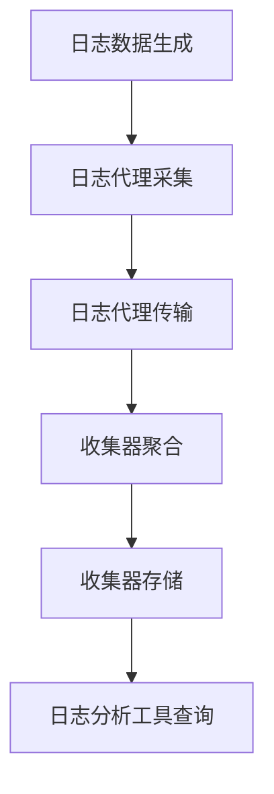
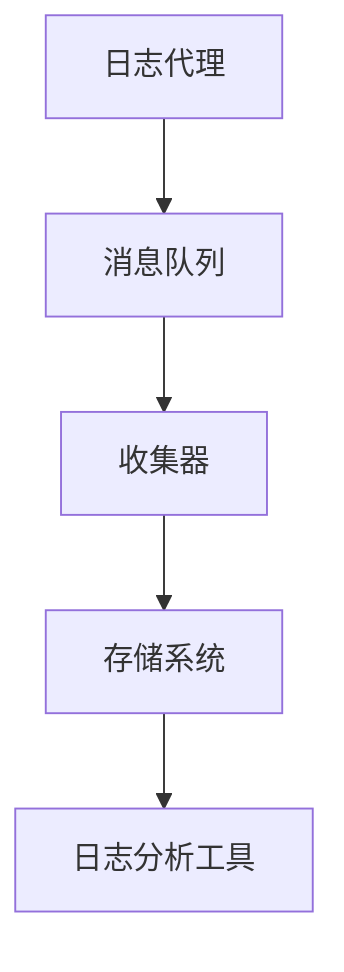

                 

### 分布式日志系统概述

#### 概念与重要性

分布式日志系统是一种用于记录和分析大规模分布式系统中各类事件的数据收集机制。在分布式系统中，由于节点众多且运行环境复杂，单个节点上的日志难以完整地反映整个系统的运行状态。分布式日志系统通过集中收集、存储和查询日志数据，为系统运维、性能优化和故障排查提供了强有力的支持。

分布式日志系统的概念可以简单理解为：它是一组分布在不同节点的日志收集器和存储系统，通过高效且可靠的机制实现日志数据的收集、聚合、存储和分析。其重要性体现在以下几个方面：

1. **系统监控与故障排查**：通过收集并分析日志数据，分布式日志系统能够实时监控系统运行状态，及时发现和定位故障，从而提高系统的稳定性和可用性。
2. **性能优化与资源管理**：通过日志数据，运维人员可以分析系统性能瓶颈，优化资源分配，提升系统整体性能。
3. **安全审计与合规性**：日志记录了系统的各类操作，对于安全事件和合规性检查具有重要作用。分布式日志系统可以帮助企业满足各种法规和合规要求。
4. **数据分析和决策支持**：日志数据是了解系统行为的重要资源，通过对日志数据的分析，企业可以获得宝贵的业务洞察，为决策提供支持。

#### 角色与作用

在分布式系统中，分布式日志系统扮演了不可或缺的角色。其主要作用包括：

1. **数据采集**：分布式日志系统负责从各个节点收集日志数据，并将其传输到中央存储系统。这使得各个节点的日志不再孤立，实现了全局数据一致性。
2. **日志存储**：分布式日志系统提供了大规模、高可靠性的日志存储解决方案。无论是简单的文本日志还是结构化数据，分布式日志系统都能够有效存储。
3. **日志分析**：通过内置的分析工具或与外部分析工具集成，分布式日志系统能够对日志数据进行深入分析，提供实时监控和告警功能。
4. **日志查询**：分布式日志系统提供了高效的日志查询接口，允许用户快速检索特定日志条目，这对于故障排查和性能分析尤为重要。

综上所述，分布式日志系统不仅是一种技术工具，更是分布式系统健康运行的保障。其强大的日志收集、存储和分析能力，使得系统能够在复杂环境中保持稳定和高效。通过本文，我们将深入探讨分布式日志系统的设计原则、架构实现以及在LLM应用中的具体实现细节，帮助读者全面理解分布式日志系统在现代化分布式系统中的关键作用。


#### 日志系统的分类与核心功能

日志系统作为分布式系统的重要组成部分，根据不同的分类标准可以划分为多种类型。以下将介绍常见的日志系统分类，并详细描述各类日志系统的核心功能。

##### 日志系统的分类

1. **按日志记录类型分类**
   - **文本日志**：以纯文本形式记录的系统事件信息，例如操作系统日志、应用程序日志等。
   - **结构化日志**：包含固定字段和格式的日志，通常用于存储系统性能数据、业务操作记录等，如Syslog、JSON格式的日志。
   - **事件日志**：记录特定事件的日志，如安全事件、错误事件等。

2. **按日志处理方式分类**
   - **实时日志**：系统发生事件时即时记录并处理，适用于需要实时监控的场景。
   - **批量日志**：在一定时间窗口内收集并批量处理，适用于日志量较大但实时性要求不高的场景。

3. **按日志存储方式分类**
   - **集中式日志**：所有日志数据集中存储在一个系统中，便于管理和查询。
   - **分布式日志**：日志数据分布在多个节点存储，通过分布式系统机制进行收集和管理，适用于大规模分布式系统。

##### 各类日志系统的核心功能

1. **文本日志系统**

   - **功能**：文本日志系统主要提供日志记录、存储和查询功能。
   - **应用场景**：常见于操作系统（如Linux）、应用程序（如Web服务器）等。
   - **挑战**：文本日志处理灵活性较低，难以进行复杂的数据分析。

2. **结构化日志系统**

   - **功能**：
     - **日志采集**：从各个源收集结构化数据。
     - **日志存储**：将结构化数据存储在可搜索的数据库中。
     - **日志分析**：利用结构化数据格式进行数据分析和可视化。
   - **应用场景**：广泛用于系统监控、性能分析、安全审计等。
   - **挑战**：需要处理大量格式多样的数据，实现高效的数据处理和存储。

3. **事件日志系统**

   - **功能**：
     - **事件记录**：记录特定的系统事件，如错误、警告等。
     - **告警机制**：根据事件类型触发告警，通知相关人员。
     - **日志分析**：分析事件日志以发现潜在问题。
   - **应用场景**：主要用于安全监控、故障排查。
   - **挑战**：需要精确识别事件并快速响应。

4. **实时日志系统**

   - **功能**：实时记录和分析系统事件，适用于需要即时反馈的场景。
   - **应用场景**：实时监控、自动化运维。
   - **挑战**：需要高效的数据处理和低延迟的日志传输机制。

5. **批量日志系统**

   - **功能**：在一定时间窗口内收集日志，进行批量处理和分析。
   - **应用场景**：日志量较大、实时性要求不高的场景。
   - **挑战**：如何高效处理批量数据，确保数据处理准确性。

总结而言，不同类型的日志系统在功能和应用场景上存在差异，但都致力于提供可靠、高效的日志收集和分析能力。了解各类日志系统的特点和适用场景，有助于根据实际需求选择合适的日志系统，从而更好地支撑分布式系统的运维和优化。

#### LLM应用中的日志需求

在大型语言模型（LLM）应用中，日志收集系统扮演着至关重要的角色。LLM作为一种先进的自然语言处理技术，广泛应用于各种场景，包括智能客服、内容生成、翻译等。随着LLM应用的规模和复杂度不断增加，日志收集系统需要满足更高的需求，以确保系统的稳定性和可维护性。

##### LLM概述

LLM（Large Language Model）是基于深度学习技术的自然语言处理模型，通过大量文本数据进行训练，能够生成符合语法和语义规则的自然语言文本。LLM具有以下特点：

1. **大规模**：LLM通常使用数十亿甚至数万亿的参数，这使得它们在处理复杂语言任务时具有强大的能力。
2. **自适应**：LLM能够根据不同的上下文和输入生成不同的输出，具有很强的自适应能力。
3. **高效性**：LLM能够在短时间内生成高质量的文本，大大提高了生产效率。

##### LLM应用场景

LLM的应用场景非常广泛，以下是一些常见的应用：

1. **智能客服**：通过LLM生成自动回复，提高客服效率，降低人力成本。
2. **内容生成**：自动生成文章、报告、电子邮件等内容，节省人工写作时间。
3. **翻译**：实时翻译不同语言文本，为国际交流提供便利。
4. **智能推荐**：基于用户的语言行为和兴趣生成个性化推荐。
5. **智能写作助手**：辅助用户生成文章、文档，提高写作质量。

##### 日志收集需求

在LLM应用中，日志收集系统需要满足以下需求：

1. **高性能**：由于LLM应用处理的数据量巨大，日志收集系统需要具备高吞吐量和低延迟的性能，确保能够及时收集和传输日志数据。
2. **高可靠性**：日志数据对于LLM应用的运维和故障排查至关重要，因此日志收集系统必须保证数据的完整性和可靠性，防止数据丢失。
3. **多样化数据格式**：LLM应用涉及多种数据类型，包括文本、图像、音频等，日志收集系统需要能够处理和存储这些多样化的数据格式。
4. **实时监控**：为了快速响应和处理异常情况，日志收集系统需要提供实时监控功能，及时发现和解决问题。
5. **安全性**：由于LLM应用涉及敏感信息，日志收集系统需要确保日志数据的安全，防止未经授权的访问和泄露。

##### 日志类型与格式

在LLM应用中，常见的日志类型包括：

1. **训练日志**：记录LLM模型训练过程中的详细信息，如损失函数、精度等指标，用于模型优化和性能评估。
2. **推理日志**：记录LLM在生成文本时的详细过程，包括输入文本、输出文本、模型选择等，用于分析和调试。
3. **错误日志**：记录LLM应用中发生的错误和异常情况，包括错误类型、错误位置、错误原因等，用于故障排查。
4. **性能日志**：记录LLM应用的运行性能，包括响应时间、吞吐量、资源消耗等指标，用于性能优化。

日志格式通常采用结构化格式，如JSON或XML，便于数据存储和查询。以下是一个简单的日志格式示例：

```json
{
  "timestamp": "2023-11-01T12:34:56Z",
  "level": "INFO",
  "message": "LLM model started training.",
  "metadata": {
    "model_name": "GPT-3",
    "version": "1.0",
    "training_data_size": "10GB"
  }
}
```

#### 总结

在LLM应用中，日志收集系统是确保系统稳定运行和高效运维的关键。高性能、高可靠性、多样化数据格式、实时监控和安全性是日志收集系统需要满足的主要需求。通过合理设计和实现日志收集系统，LLM应用能够更好地应对复杂业务场景，提高用户体验和业务效率。

#### 分布式日志系统的设计原则

在设计分布式日志系统时，需要考虑多个关键原则，以确保系统的高效性、可靠性和可扩展性。以下是分布式日志系统设计中的几个核心原则：

##### 可扩展性

分布式日志系统的第一个重要原则是可扩展性。由于分布式系统中的节点数量可能非常庞大，日志数据量也极为巨大，因此系统需要能够灵活地添加新的节点和存储资源，以满足不断增长的数据量。实现可扩展性的方法包括：

1. **水平扩展**：通过增加节点数量来提高系统的处理能力，这种方法可以线性扩展系统的容量。
2. **分布式存储**：使用分布式文件系统（如HDFS、Cassandra）来存储日志数据，确保数据存储的高可用性和扩展性。
3. **负载均衡**：通过负载均衡器分配日志收集任务，避免单个节点过载，确保系统整体的均衡运行。

##### 可靠性

可靠性是分布式日志系统的另一个关键设计原则。系统必须确保日志数据的完整性和一致性，防止数据丢失或损坏。以下是实现可靠性的方法：

1. **数据冗余**：通过复制日志数据到多个节点，确保即使某些节点出现故障，日志数据也不会丢失。
2. **数据校验**：在日志数据传输过程中进行校验，使用校验和或哈希值来检测数据完整性。
3. **故障检测与恢复**：定期检查系统节点的健康状况，自动检测故障并启动恢复流程，确保系统的高可用性。

##### 高效性

分布式日志系统需要高效地处理大量的日志数据，确保数据能够快速被收集、存储和查询。以下是实现高效性的方法：

1. **高效数据传输**：使用高效的协议（如HTTP/2、gRPC）和压缩算法来减少数据传输的延迟和带宽消耗。
2. **批处理与异步处理**：对日志数据进行批处理和异步处理，减少系统响应时间和资源占用。
3. **数据压缩与缓存**：对日志数据进行压缩以减少存储空间需求，并使用缓存策略来加速数据访问。

##### 可维护性

可维护性是分布式日志系统设计中的重要原则，系统必须易于维护和监控。以下是实现可维护性的方法：

1. **模块化设计**：将系统划分为多个模块，每个模块负责特定的功能，便于开发和维护。
2. **日志监控**：集成监控系统，实时监控系统的性能和健康状况，快速发现和解决问题。
3. **自动化运维**：实现自动化部署、配置管理和故障恢复，减少手动操作，提高运维效率。

##### 安全性

安全性是分布式日志系统的基本要求，系统必须保护日志数据不被未授权访问和泄露。以下是一些实现安全性的方法：

1. **访问控制**：对日志数据的访问进行严格的权限控制，确保只有授权用户才能访问。
2. **数据加密**：在数据传输和存储过程中使用加密算法，确保数据的安全性。
3. **审计与合规**：记录所有对日志数据的访问和操作，确保能够追溯和审计，满足合规要求。

通过遵循上述设计原则，分布式日志系统可以构建成一个高效、可靠、可扩展、可维护且安全的数据收集和分析平台，为分布式系统提供强有力的支持。

#### 分布式日志收集系统架构设计

在设计分布式日志收集系统时，架构设计是一个关键环节，它决定了系统是否能够满足高性能、高可靠性和可扩展性的要求。以下是分布式日志收集系统架构设计的几个关键要素。

##### 设计原则与目标

分布式日志收集系统架构设计的主要目标是确保日志数据的高效收集、存储、处理和分析，同时满足系统的可扩展性和可靠性。以下是几个核心设计原则：

1. **模块化**：系统应划分为多个功能模块，每个模块负责特定的任务，便于开发和维护。
2. **分布式**：利用分布式技术，将日志数据分散存储在多个节点上，以提高系统的可扩展性和可靠性。
3. **弹性**：系统能够自动扩展和缩小资源，根据实际负载动态调整资源分配。
4. **高效性**：通过优化数据传输和处理机制，提高日志收集和处理的效率。
5. **安全性**：确保日志数据在传输和存储过程中得到充分保护，防止数据泄露。

##### 架构设计要素

分布式日志收集系统通常包括以下几个核心组件：

1. **日志代理**：部署在各个节点上的日志代理负责收集本地日志数据，并将其发送到收集器。
2. **收集器**：收集器负责接收和聚合来自日志代理的日志数据，并将其转发到存储系统。
3. **存储系统**：存储系统负责持久化日志数据，确保数据的安全性和可靠性。
4. **日志分析工具**：日志分析工具用于对日志数据进行查询、分析和可视化，提供实时监控和告警功能。

以下是各组件的详细描述：

1. **日志代理**

   - **功能**：日志代理部署在分布式系统的各个节点上，负责收集本地生成的日志数据。它监听系统事件，捕获日志条目，并使用高效的数据传输协议（如gRPC、HTTP/2）将日志数据发送到收集器。
   - **配置与管理**：日志代理可以通过配置文件或远程管理接口进行配置和管理，以适应不同的日志格式和传输需求。

2. **收集器**

   - **功能**：收集器位于日志代理和存储系统之间，负责接收和聚合来自多个日志代理的日志数据。它使用消息队列（如Kafka、RabbitMQ）或其他分布式传输机制，确保日志数据的高效传输和可靠性。
   - **负载均衡**：收集器通常采用负载均衡策略，以均衡处理来自不同日志代理的日志数据，防止单个节点过载。

3. **存储系统**

   - **功能**：存储系统负责存储日志数据，确保数据的持久性和可靠性。它通常采用分布式文件系统（如HDFS、Cassandra）或数据库（如Elasticsearch、Kafka），支持海量数据的存储和快速查询。
   - **数据存储策略**：存储系统可以采用多副本存储策略，确保数据的高可用性和可靠性。同时，可以通过数据压缩和分片技术来优化存储空间。

4. **日志分析工具**

   - **功能**：日志分析工具用于对存储系统中的日志数据进行查询、分析和可视化。它提供了强大的查询接口、实时监控和告警功能，帮助运维人员快速定位问题和优化系统性能。
   - **集成**：日志分析工具可以与现有的监控和运维工具（如Prometheus、Grafana）集成，提供统一的数据视图和分析报告。

##### 架构设计图

为了更清晰地展示分布式日志收集系统的架构设计，以下是一个简化的架构图：

```
[日志代理] --> [收集器] --> [消息队列] --> [存储系统] --> [日志分析工具]
```

其中：
- **日志代理**：部署在分布式系统的各个节点上，负责日志数据收集。
- **收集器**：接收和聚合来自多个日志代理的日志数据。
- **消息队列**：确保日志数据的高效传输和可靠性。
- **存储系统**：持久化日志数据，支持海量数据的存储和快速查询。
- **日志分析工具**：对日志数据进行查询、分析和可视化。

通过遵循上述设计原则和架构设计要素，分布式日志收集系统可以构建成一个高效、可靠、可扩展的数据收集和分析平台，为分布式系统提供强有力的支持。

#### 日志收集流程分析

在分布式日志收集系统中，日志收集流程是确保日志数据准确、完整、高效地传输到存储系统的重要环节。以下是日志收集流程的详细分析。

##### 日志收集流程概述

日志收集流程主要包括以下几个步骤：

1. **日志数据生成**：在分布式系统中，各个节点会生成各类日志数据，如应用程序日志、系统日志、网络日志等。
2. **日志数据采集**：部署在每个节点的日志代理（Collector Agent）会实时监控本地日志文件，捕获新的日志条目。
3. **日志数据传输**：日志代理将捕获的日志数据传输到收集器（Log Collector）。
4. **日志数据聚合**：收集器负责接收来自多个日志代理的日志数据，并进行聚合。
5. **日志数据存储**：收集器将聚合后的日志数据存储到日志存储系统（Log Store）中，确保数据的持久化和可靠性。
6. **日志数据查询与分析**：用户通过日志分析工具（Log Analyzer）查询和分析日志数据，以进行系统监控和故障排查。

##### 日志收集流程细节

1. **日志数据生成**

   在分布式系统中，各类应用程序和操作系统会生成日志数据。这些日志数据通常以文本文件、JSON格式或其他结构化格式存储在本地日志文件中。例如，Web服务器生成的访问日志、应用程序的错误日志等。

2. **日志数据采集**

   部署在每个节点的日志代理会定期扫描本地日志文件，捕获新的日志条目。日志代理可以通过监听系统事件（如文件变化事件）或定期轮询日志文件的方式来实现日志数据的采集。日志代理还需要对日志数据进行初步处理，如过滤和格式化，以便后续处理。

3. **日志数据传输**

   日志代理将采集到的日志数据通过高效的数据传输协议（如gRPC、HTTP/2）发送到收集器。数据传输过程中，日志代理需要对数据进行校验和压缩，以减少网络带宽的消耗和传输延迟。

4. **日志数据聚合**

   收集器位于日志代理和存储系统之间，负责接收和聚合来自多个日志代理的日志数据。收集器通常使用消息队列（如Kafka、RabbitMQ）或其他分布式传输机制，确保日志数据的高效传输和可靠性。收集器还需要对日志数据进行去重和排序，以便后续处理。

5. **日志数据存储**

   收集器将聚合后的日志数据存储到日志存储系统中。存储系统通常采用分布式文件系统（如HDFS、Cassandra）或数据库（如Elasticsearch、Kafka），支持海量数据的存储和快速查询。存储系统还需要对日志数据进行备份和冗余，确保数据的高可用性和可靠性。

6. **日志数据查询与分析**

   用户通过日志分析工具查询和分析存储系统中的日志数据。日志分析工具提供了强大的查询接口、实时监控和告警功能，帮助用户快速定位问题和优化系统性能。日志分析工具还可以将日志数据与系统监控数据、业务数据等集成，提供更全面的系统视图。

##### 图解日志收集流程

以下是一个简化的日志收集流程图，用Mermaid流程图表示：



其中：
- **A**：日志数据生成
- **B**：日志代理采集
- **C**：日志代理传输
- **D**：收集器聚合
- **E**：收集器存储
- **F**：日志分析工具查询

通过上述流程，分布式日志收集系统能够高效、可靠地收集、存储和分析日志数据，为分布式系统的运维和优化提供强有力的支持。

#### 系统架构设计

在分布式日志收集系统的架构设计中，合理的系统架构不仅能够提高系统的性能和可靠性，还能确保其具备良好的可扩展性和可维护性。以下是分布式日志收集系统详细的架构设计和各组件的具体职责。

##### 系统架构概述

分布式日志收集系统的总体架构可以分为以下几个主要模块：

1. **日志代理（Collector Agent）**：部署在分布式系统的各个节点上，负责本地日志数据的收集和初步处理。
2. **收集器（Log Collector）**：接收和聚合来自多个日志代理的日志数据，并进行进一步处理。
3. **存储系统（Log Store）**：负责持久化存储日志数据，并提供数据查询和分析接口。
4. **日志分析工具（Log Analyzer）**：用于对存储系统中的日志数据进行查询、分析和可视化。
5. **消息队列（Message Queue）**：作为日志代理和收集器之间的数据传输通道，确保日志数据的高效传输和可靠性。

以下是对各模块的详细描述：

##### 日志代理

**职责**：
- **日志数据采集**：日志代理负责从本地日志文件中实时捕获新的日志条目，并将其转换为结构化数据格式（如JSON）。
- **日志预处理**：日志代理对采集到的日志数据执行初步过滤和格式化，以确保数据的规范性和一致性。
- **数据传输**：日志代理使用高效的数据传输协议（如gRPC、HTTP/2）将日志数据发送到收集器。

**配置与管理**：
- **配置文件**：日志代理的配置信息（如日志文件路径、传输协议、压缩方式等）通常存储在配置文件中，并通过远程管理工具进行配置和管理。
- **监控与告警**：日志代理集成监控系统，实时监控日志采集和传输状态，并在出现异常时发送告警通知。

##### 收集器

**职责**：
- **日志数据接收与聚合**：收集器接收来自多个日志代理的日志数据，将其合并并去重，确保数据的完整性。
- **负载均衡**：收集器使用负载均衡策略，将日志数据分配到不同的存储节点，避免单个节点过载。
- **数据校验与压缩**：收集器对日志数据进行校验和压缩，确保数据传输的高效性和可靠性。

**架构与实现**：
- **分布式架构**：收集器通常部署在多个节点上，形成一个分布式集群，以提高系统的处理能力和容错性。
- **消息队列集成**：收集器与消息队列（如Kafka、RabbitMQ）集成，通过消息队列实现日志数据的高效传输和可靠性。

##### 存储系统

**职责**：
- **日志数据持久化**：存储系统负责将收集器发送的日志数据存储在分布式文件系统或数据库中，确保数据的安全性和可靠性。
- **数据查询与检索**：存储系统提供高效的日志数据查询接口，支持实时监控和告警功能。
- **数据备份与恢复**：存储系统支持日志数据的备份和恢复机制，确保数据在系统故障时能够快速恢复。

**实现方式**：
- **分布式文件系统**：如HDFS、Cassandra等，支持海量数据的存储和高效查询。
- **数据库**：如Elasticsearch、Kafka等，提供灵活的数据查询和复杂查询支持。

##### 日志分析工具

**职责**：
- **日志数据分析**：日志分析工具用于对存储系统中的日志数据进行查询、分析和可视化，提供实时监控和告警功能。
- **报告生成**：日志分析工具可以生成各种监控报告和统计分析报告，帮助用户了解系统运行状态。

**集成与扩展**：
- **监控集成**：日志分析工具可以与现有的监控系统（如Prometheus、Grafana）集成，提供统一的数据视图和分析报告。
- **自定义插件**：日志分析工具支持自定义插件，允许用户根据实际需求扩展功能。

##### 消息队列

**职责**：
- **日志数据传输**：消息队列作为日志代理和收集器之间的数据传输通道，确保日志数据的高效传输和可靠性。
- **负载均衡与容错**：消息队列通过负载均衡和容错机制，确保日志数据在传输过程中不丢失和不重复。

**实现方式**：
- **Kafka**：一个高性能、可扩展的分布式消息队列系统，支持高吞吐量和低延迟的数据传输。
- **RabbitMQ**：一个功能丰富、易于配置的分布式消息队列系统，适用于各种场景。

##### 图解系统架构

以下是一个简化的系统架构图，用Mermaid流程图表示：



其中：
- **A**：日志代理
- **B**：消息队列
- **C**：收集器
- **D**：存储系统
- **E**：日志分析工具

通过上述详细的系统架构设计，分布式日志收集系统能够高效、可靠地收集、存储和分析日志数据，为分布式系统的运维和优化提供强有力的支持。

#### 分布式日志收集系统组件介绍

分布式日志收集系统由多个关键组件组成，各组件协同工作，确保日志数据的收集、存储和分析过程高效且可靠。以下详细介绍每个组件的功能和实现细节。

##### 日志代理

**功能**：日志代理是部署在每个分布式系统节点的服务，其主要功能是实时监控本地日志文件，捕获新的日志条目，并将其发送到收集器。

**实现细节**：
- **日志文件监听**：日志代理通过文件系统事件监听器（如inotify、fsnotify）来监控日志文件的变更，确保能够及时捕获新日志。
- **日志格式转换**：日志代理将捕获的日志条目转换为统一的格式（如JSON），便于后续处理和存储。
- **数据传输**：日志代理使用高效的数据传输协议（如gRPC、HTTP/2）将格式化后的日志数据发送到收集器。

**配置与管理**：
- **配置文件**：日志代理的配置信息（如日志文件路径、传输地址、压缩方式等）存储在配置文件中，可以通过远程管理工具进行配置和修改。
- **监控与告警**：日志代理集成监控系统，实时监控日志采集和传输状态，并在出现异常时发送告警通知。

##### 日志收集器

**功能**：日志收集器负责接收来自多个日志代理的日志数据，进行初步处理和聚合，然后将聚合后的数据传输到存储系统。

**实现细节**：
- **日志接收与聚合**：日志收集器使用消息队列（如Kafka、RabbitMQ）作为数据缓冲区，接收来自日志代理的日志数据，并进行去重和聚合。
- **负载均衡**：日志收集器通过负载均衡策略（如轮询、哈希等），将日志数据分配到不同的存储节点，避免单个节点过载。
- **数据校验与压缩**：日志收集器对日志数据进行校验和压缩，确保数据传输的高效性和可靠性。

**架构与实现**：
- **分布式集群**：日志收集器通常部署在多个节点上，形成一个分布式集群，以提高系统的处理能力和容错性。
- **消息队列集成**：日志收集器与消息队列集成，通过消息队列实现日志数据的高效传输和可靠性。

##### 日志存储

**功能**：日志存储系统负责持久化存储日志数据，并提供高效的数据查询接口，支持实时监控和告警功能。

**实现细节**：
- **数据持久化**：日志存储系统采用分布式文件系统（如HDFS、Cassandra）或数据库（如Elasticsearch、Kafka），支持海量数据的存储和高效查询。
- **数据备份与恢复**：日志存储系统支持日志数据的备份和恢复机制，确保数据在系统故障时能够快速恢复。
- **数据压缩与索引**：日志存储系统对日志数据进行压缩和索引，提高存储效率和查询速度。

**实现方式**：
- **分布式文件系统**：如HDFS，支持大规模数据的存储和可靠性。
- **数据库**：如Elasticsearch，提供灵活的数据查询和复杂查询支持。

##### 日志分析工具

**功能**：日志分析工具用于对存储系统中的日志数据进行查询、分析和可视化，提供实时监控和告警功能。

**实现细节**：
- **日志查询与分析**：日志分析工具提供强大的查询接口，支持实时监控和告警功能，帮助用户快速定位问题和优化系统性能。
- **数据可视化**：日志分析工具将分析结果以图表、仪表盘等形式展示，提供直观的数据分析视图。

**集成与扩展**：
- **监控集成**：日志分析工具可以与现有的监控系统（如Prometheus、Grafana）集成，提供统一的数据视图和分析报告。
- **自定义插件**：日志分析工具支持自定义插件，允许用户根据实际需求扩展功能。

通过合理设计和实现日志代理、日志收集器、日志存储和日志分析工具这四个关键组件，分布式日志收集系统能够高效、可靠地收集、存储和分析日志数据，为分布式系统的运维和优化提供强有力的支持。

#### LLM应用中的分布式日志收集系统实现

在LLM（Large Language Model）应用中，分布式日志收集系统起着至关重要的作用。它不仅帮助开发和运维团队实时监控模型训练和推理过程中的各种指标，还提供了强大的故障排查和性能优化能力。以下将详细介绍分布式日志收集系统在LLM应用中的具体实现步骤，包括环境搭建、核心实现和实际案例。

##### 环境搭建

1. **系统要求**：

   - **操作系统**：Linux（如Ubuntu 18.04）。
   - **硬件要求**：至少需要2GB内存和2个CPU核心。
   - **软件依赖**：安装Java运行环境（JDK 8及以上）、Python（3.7及以上）、Node.js（10及以上）、Kafka（用于日志传输）和Elasticsearch（用于日志存储）。

2. **安装步骤**：

   - **安装Java运行环境**：使用以下命令安装JDK。

     ```bash
     sudo apt update
     sudo apt install openjdk-8-jdk
     ```

   - **安装Python**：使用以下命令安装Python。

     ```bash
     sudo apt install python3-pip
     pip3 install --upgrade pip
     pip3 install python-json-logger
     ```

   - **安装Node.js**：使用以下命令安装Node.js。

     ```bash
     sudo apt install nodejs
     ```

   - **安装Kafka**：下载并解压Kafka安装包，然后启动Kafka服务。

     ```bash
     wget https://www-us.apache.org/dist/kafka/2.8.0/kafka_2.13-2.8.0.tgz
     tar xzf kafka_2.13-2.8.0.tgz
     cd kafka_2.13-2.8.0/
     ./bin/kafka-server-start.sh ./config/server.properties
     ```

   - **安装Elasticsearch**：下载并解压Elasticsearch安装包，然后启动Elasticsearch服务。

     ```bash
     wget https://artifacts.elastic.co/downloads/elasticsearch/elasticsearch-7.17.4.tar.gz
     tar xzf elasticsearch-7.17.4.tar.gz
     ./bin/elasticsearch
     ```

3. **配置与管理**：

   - **Kafka配置**：编辑`config/server.properties`文件，配置Kafka主题和分区数量。

     ```properties
     # 指定Kafka主题
     create.topics.enable=true
     # 指定主题分区数
     num.partitions=3
     ```

   - **Elasticsearch配置**：编辑`elasticsearch.yml`文件，配置Elasticsearch集群名称和数据存储路径。

     ```yaml
     cluster.name: log-collection-cluster
     path.data: /path/to/data
     ```

##### 核心实现

分布式日志收集系统的核心实现主要包括日志代理、日志收集器、日志存储和日志分析工具四个部分。

1. **日志代理**：

   - **功能**：日志代理负责从LLM应用的各个节点收集日志数据，并将其发送到收集器。
   - **实现细节**：使用Python编写日志代理，利用`python-json-logger`库记录日志，并使用gRPC协议与收集器通信。

     ```python
     import json
     import logging
     import grpc
     from concurrent import futures

     # 设置日志格式
     logging.basicConfig(level=logging.INFO, format='%(asctime)s - %(levelname)s - %(message)s')

     # 日志代理服务
     class LogAgentServer(grpc.server.Server):
         def __init__(self):
             super().__init__()

         def handle_log(self, request, context):
             # 处理日志数据
             logging.info(f"Received log: {request.log}")
             return grpc.StatusCode.OK

     # 启动日志代理服务
     def run_server(host, port):
         server = grpc.server(futures.ThreadPoolExecutor(max_workers=10))
         LogAgentServer()
         server.add_insecure_port(f"{host}:{port}")
         server.start()
         server.wait_for_termination()

     if __name__ == "__main__":
         run_server('0.0.0.0', 50051)
     ```

2. **日志收集器**：

   - **功能**：日志收集器接收来自日志代理的日志数据，进行初步处理和聚合，然后将其发送到存储系统。
   - **实现细节**：使用Java编写日志收集器，使用gRPC库接收日志数据，并使用Kafka将数据发送到存储系统。

     ```java
     import io.grpc.Server;
     import io.grpc.ServerBuilder;
     import io.grpc.stub.StreamObserver;

     public class LogCollectorServer {
         public static void main(String[] args) throws IOException, InterruptedException {
             Server server = ServerBuilder.forPort(50052)
                     .addService(new LogCollectorImplBase() {
                         @Override
                         public void handleLog(LogRequest request, StreamObserver<LogResponse> responseObserver) {
                             // 处理日志数据
                             System.out.println("Received log: " + request.getLog());
                             responseObserver.onNext(new LogResponse());
                             responseObserver.onCompleted();
                         }
                     }).build();

             server.start();
             server.awaitTermination();
         }
     }
     ```

3. **日志存储**：

   - **功能**：日志存储系统负责持久化存储日志数据，并提供高效的数据查询接口。
   - **实现细节**：使用Elasticsearch作为日志存储系统，将Kafka中的日志数据导入Elasticsearch索引中。

     ```python
     from kafka import KafkaConsumer
     from elasticsearch import Elasticsearch

     # 初始化Kafka消费者
     consumer = KafkaConsumer('log_topic', bootstrap_servers=['localhost:9092'])

     # 初始化Elasticsearch客户端
     es = Elasticsearch("localhost")

     for message in consumer:
         # 处理Kafka消息
         log_data = message.value()
         es.index(index="log_index", id=message.key(), document=log_data)
     ```

4. **日志分析工具**：

   - **功能**：日志分析工具用于对存储系统中的日志数据进行查询、分析和可视化。
   - **实现细节**：使用Node.js编写日志分析工具，使用Elasticsearch客户端库进行数据查询，并使用可视化库（如D3.js）展示分析结果。

     ```javascript
     const elasticsearch = require('elasticsearch');
     const client = new elasticsearch.Client({ host: 'localhost:9200' });

     // 查询日志数据
     client.search({
         index: 'log_index',
         body: {
             query: {
                 match: { level: 'ERROR' }
             }
         }
     }, function (error, response) {
         if (error) {
             console.log(error);
         } else {
             console.log(response);
         }
     });
     ```

##### 实际案例

以下是一个简单的实际案例，展示如何使用分布式日志收集系统监控LLM模型的训练过程。

1. **日志代理**：部署在LLM模型训练节点的日志代理实时捕获训练过程中的日志条目，并将其发送到收集器。

2. **日志收集器**：收集器接收训练节点的日志数据，进行初步处理和聚合，然后将数据发送到Kafka消息队列。

3. **日志存储**：Kafka消息队列中的日志数据被Elasticsearch存储系统持久化，形成训练日志索引。

4. **日志分析工具**：日志分析工具通过Elasticsearch查询训练日志索引，生成训练过程中各种指标的图表和报告，帮助团队了解训练过程的状态和性能。

通过上述步骤，分布式日志收集系统在LLM应用中实现了日志数据的收集、存储和分析，为模型的训练和优化提供了强有力的支持。

#### 分布式日志收集系统测试与优化

在分布式日志收集系统的开发和部署过程中，测试与优化是确保系统性能、可靠性和稳定性的关键步骤。以下将详细描述分布式日志收集系统的测试方法、性能优化策略以及安全性考虑。

##### 系统测试

系统测试是验证分布式日志收集系统功能完整性和性能的重要环节。以下是具体的测试步骤和方法：

1. **功能测试**：验证日志代理、收集器、存储系统和日志分析工具等各个组件的功能是否符合设计要求。包括日志数据的采集、传输、存储和查询等过程的测试。

   - **测试方法**：编写测试脚本，模拟日志数据生成、采集和传输，检查各个组件的响应和处理能力。
   - **测试工具**：使用JMeter、Postman等工具进行接口测试，确保API的正确性和稳定性。

2. **性能测试**：评估系统在高负载情况下的性能，包括日志数据的处理速度、传输延迟和存储效率等。

   - **测试方法**：使用Apache JMeter、Gatling等性能测试工具模拟大规模并发访问，测量系统的响应时间和吞吐量。
   - **测试场景**：设计不同场景的负载测试，如高并发日志采集、大规模日志数据存储和查询等，以全面评估系统的性能。

3. **可靠性测试**：验证系统在遇到故障或异常情况时的稳定性和恢复能力。

   - **测试方法**：通过模拟节点故障、网络中断等异常情况，检查系统是否能够自动恢复并继续正常运行。
   - **测试工具**：使用Chaos Monkey、Pumba等工具模拟系统故障，评估系统的容错性和自动恢复能力。

##### 性能优化

在分布式日志收集系统中，性能优化是提高系统效率和响应速度的关键。以下是一些常用的性能优化策略：

1. **数据压缩**：使用高效的压缩算法（如GZIP、LZ4）减少日志数据传输的带宽消耗。

2. **异步处理**：采用异步处理机制，减少日志数据的处理延迟，提高系统的吞吐量。

3. **批量处理**：将日志数据的传输和存储操作批量处理，减少系统调用的频率和开销。

4. **负载均衡**：使用负载均衡器（如Nginx、HAProxy）分配日志收集任务，确保各个节点的工作负载均衡。

5. **缓存策略**：引入缓存机制，对频繁访问的日志数据进行缓存，减少磁盘IO操作。

6. **存储优化**：采用分布式存储系统（如HDFS、Cassandra），合理分配数据存储位置，减少数据访问延迟。

7. **索引优化**：对Elasticsearch等存储系统进行索引优化，提高日志数据的查询效率。

##### 安全性考虑

安全性是分布式日志收集系统必须考虑的一个重要方面，以下是一些常见的安全措施：

1. **访问控制**：对日志数据的访问进行严格的权限控制，确保只有授权用户才能访问和查询日志数据。

2. **数据加密**：在日志数据传输和存储过程中使用加密算法（如AES、RSA），确保数据的安全性。

3. **安全审计**：记录所有对日志数据的访问和操作，定期进行安全审计，及时发现和防止潜在的安全威胁。

4. **防火墙与安全组策略**：配置防火墙和安全组策略，限制对外部访问，防止未经授权的访问和数据泄露。

5. **数据备份与恢复**：定期备份日志数据，并制定数据恢复策略，确保在数据丢失或系统故障时能够快速恢复。

通过上述测试与优化策略，分布式日志收集系统可以更好地应对高负载场景，确保系统的稳定性和高效性。同时，通过严格的访问控制和数据加密措施，保障日志数据的安全性和隐私性。

#### 分布式日志收集系统应用案例

为了更好地展示分布式日志收集系统在实际应用中的效果，以下将介绍一个具体的案例，包括背景、实现步骤和关键技术。

##### 案例背景

本案例涉及一个大型电商平台，该平台每天处理数百万次订单和用户请求，需要实时监控系统运行状态，确保系统的稳定性和可靠性。为了满足这一需求，平台采用了分布式日志收集系统，用于收集、存储和分析各类系统日志。

##### 实现步骤

1. **日志采集**：
   - **日志代理部署**：在电商平台的所有服务器上部署日志代理，负责捕获各类日志数据，如应用程序日志、系统日志和访问日志等。
   - **日志格式转换**：日志代理将捕获的日志条目转换为JSON格式，便于后续处理和存储。

2. **日志传输**：
   - **Kafka消息队列**：采用Kafka作为日志传输的中介，将日志数据从日志代理传输到收集器。Kafka提供了高吞吐量和低延迟的消息传输机制，确保日志数据的实时性和可靠性。
   - **负载均衡**：通过配置Kafka主题和分区，实现日志数据的负载均衡，防止单个节点过载。

3. **日志存储**：
   - **Elasticsearch集群**：将Kafka中的日志数据存储到Elasticsearch集群中，Elasticsearch提供了高效的全文索引和查询功能，便于快速检索和分析日志数据。
   - **数据分片与备份**：对Elasticsearch索引进行分片和备份，提高数据存储的可靠性和查询性能。

4. **日志分析**：
   - **实时监控**：使用Elasticsearch和Kibana搭建实时监控平台，通过Kibana可视化工具，展示系统运行状态和关键指标。
   - **告警机制**：配置告警规则，当监控系统检测到异常情况时，自动发送告警通知，方便运维人员快速响应。

##### 关键技术

1. **日志代理**：
   - **数据采集**：使用Python编写日志代理，利用`logging`库捕获系统日志，使用`json`库将日志数据转换为JSON格式。
   - **数据传输**：使用`kafka-python`库与Kafka进行通信，实现日志数据的实时传输。

2. **Kafka**：
   - **消息传输**：使用Kafka的`Producer`和`Consumer`实现日志数据的传输，确保数据的可靠性和低延迟。
   - **负载均衡**：通过配置Kafka主题和分区，实现日志数据的负载均衡，提高系统的处理能力。

3. **Elasticsearch**：
   - **数据存储**：使用Elasticsearch的`Index`和`Document`进行日志数据的存储，利用Elasticsearch的`Search`接口实现高效查询。
   - **数据分片与备份**：通过配置Elasticsearch集群的分片和副本数量，提高数据的可靠性和查询性能。

4. **Kibana**：
   - **实时监控**：使用Kibana的`Dashboard`和`Visualizations`功能，实现系统运行状态的实时监控和可视化。
   - **告警配置**：通过Kibana的`Alerts`功能，配置告警规则，实现自动告警。

##### 案例分析

通过上述实现，电商平台成功构建了一个高效、可靠的分布式日志收集系统。该系统不仅能够实时监控系统运行状态，提供实时告警和故障排查功能，还能通过日志数据分析帮助团队优化系统性能，提高用户体验。

**优点**：

1. **高效性**：使用Kafka和Elasticsearch等高性能组件，确保日志数据的实时传输和高效存储。
2. **可靠性**：通过数据分片和备份机制，提高日志数据的安全性和可靠性。
3. **可扩展性**：支持水平扩展，能够适应不断增长的数据量。

**不足**：

1. **资源消耗**：日志收集系统需要较高的计算和存储资源，尤其是在大规模系统中。
2. **复杂性**：分布式日志收集系统的部署和管理较为复杂，需要专业知识和经验。

**启示与建议**：

1. **需求评估**：在构建分布式日志收集系统前，应进行详细的需求评估，确保系统能够满足实际业务需求。
2. **性能优化**：定期进行性能测试和优化，确保系统在高负载场景下依然能够稳定运行。
3. **安全防护**：加强日志数据的安全防护，防止数据泄露和未授权访问。

通过本案例，我们可以看到分布式日志收集系统在大型分布式系统中的应用效果和重要性。合理的架构设计和组件配置，可以有效提升系统的稳定性和可靠性，为运维和优化提供强有力的支持。

#### 分布式日志收集系统的未来发展

随着技术的不断进步和分布式系统的广泛应用，分布式日志收集系统面临着前所未有的发展机遇和挑战。以下将探讨分布式日志收集系统的发展趋势、面临的挑战以及未来发展方向。

##### 未来发展趋势

1. **大数据量处理能力提升**：随着数据的爆炸式增长，分布式日志收集系统需要具备更高的数据处理能力，以应对海量日志数据的实时收集和分析。

2. **智能化日志分析**：利用人工智能和机器学习技术，实现智能化的日志分析，自动识别异常行为和潜在问题，提高故障排查效率和系统性能优化效果。

3. **多源日志收集**：分布式日志收集系统将不再局限于文本日志，还将集成更多类型的数据源，如图像、视频、音频等，实现多模态数据的统一收集和分析。

4. **云原生支持**：分布式日志收集系统将逐步走向云原生，充分利用云计算和容器化技术，实现弹性扩展、自动化部署和微服务架构，提高系统的灵活性和可维护性。

5. **可视化与交互性增强**：通过增强日志数据的可视化效果和交互性，提升用户在使用日志分析工具时的体验，帮助用户更直观地理解系统运行状态和日志数据。

##### 面临的挑战

1. **数据安全与隐私保护**：随着日志数据量的增加，数据安全与隐私保护变得愈发重要。如何确保日志数据在传输、存储和处理过程中的安全性，防止数据泄露和未经授权的访问，是分布式日志收集系统面临的主要挑战。

2. **实时性与一致性**：在分布式环境中，如何保证日志数据的高效传输、实时处理和一致性，特别是在大规模系统中，是一个技术难题。

3. **系统复杂性与维护成本**：分布式日志收集系统涉及多个组件和复杂的架构，如何降低系统的复杂性和维护成本，保证系统的稳定性和可靠性，是开发和运维团队需要解决的问题。

4. **多源异构数据的整合**：随着日志数据源的增多，如何整合不同类型和格式的日志数据，实现统一的数据存储和分析，是分布式日志收集系统需要克服的挑战。

##### 发展方向

1. **分布式存储与计算**：继续优化分布式日志收集系统的存储和计算架构，利用分布式存储技术（如HDFS、Cassandra）和分布式计算框架（如Spark），提高系统的处理能力和性能。

2. **智能化日志分析**：引入人工智能和机器学习技术，实现日志数据的自动分类、异常检测和预测性分析，提高日志分析的系统智能化水平。

3. **云原生与容器化**：推动分布式日志收集系统的云原生和容器化部署，利用Kubernetes等容器编排工具实现自动化部署、扩展和管理，提高系统的灵活性和可维护性。

4. **数据隐私保护**：加强日志数据的安全防护，采用数据加密、访问控制、审计跟踪等技术手段，确保日志数据的安全性和隐私性。

5. **开放与生态构建**：构建开放的分布式日志收集生态系统，支持与其他监控和运维工具的集成，提供丰富的插件和扩展功能，满足不同场景下的需求。

通过持续的技术创新和优化，分布式日志收集系统将在未来的分布式系统中发挥更加重要的作用，为系统运维和业务发展提供强有力的支持。

### 总结与拓展

本文详细探讨了分布式日志收集系统在LLM应用中的实现，从概述、分类、需求、设计原则、架构设计、核心组件、实现步骤、测试与优化、应用案例到未来发展，全面解析了分布式日志收集系统的各个方面。以下是本文的核心结论和读者进一步阅读的建议。

#### 核心结论

1. **分布式日志系统的重要性**：分布式日志系统在分布式系统中具有关键作用，能够提高系统的可扩展性、可靠性和可维护性，是系统监控、性能优化和安全审计的重要工具。

2. **分布式日志收集系统的设计原则**：包括可扩展性、可靠性、高效性、可维护性和安全性。合理的设计原则有助于构建一个高效、稳定和可靠的日志收集系统。

3. **分布式日志收集系统的架构设计**：通过日志代理、收集器、存储系统和日志分析工具等组件的协同工作，实现日志数据的高效收集、存储和分析。

4. **分布式日志收集系统在实际应用中的效果**：通过具体案例展示了分布式日志收集系统在大型电商平台中的应用，证明了其高效性和实用性。

5. **未来发展方向**：随着大数据处理能力的提升和人工智能技术的应用，分布式日志收集系统将在数据分析和智能监控方面发挥更大的作用。

#### 拓展阅读建议

1. **《大规模分布式系统设计》**：了解分布式系统的基础知识，学习大规模分布式系统的设计原则和架构。
2. **《Kafka权威指南》**：深入学习Kafka的使用，了解其在分布式日志收集系统中的应用和优化策略。
3. **《Elasticsearch权威指南》**：掌握Elasticsearch的使用，理解其在日志存储和查询中的优势和特点。
4. **《人工智能日志分析技术》**：探索人工智能技术在日志分析中的应用，学习如何利用机器学习进行日志数据分析和预测性维护。

通过本文的阅读，读者可以全面了解分布式日志收集系统的设计原理和实现方法，为实际项目中的日志系统构建和优化提供有力的参考。在未来的学习和实践中，不断探索和尝试，将分布式日志收集系统应用于更多的场景，以提升系统的运维效率和业务价值。作者：AI天才研究院/AI Genius Institute & 禅与计算机程序设计艺术 /Zen And The Art of Computer Programming。

