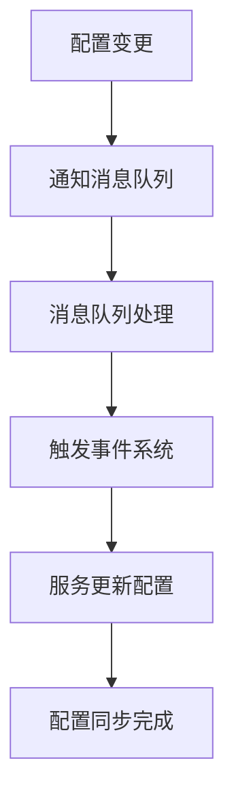
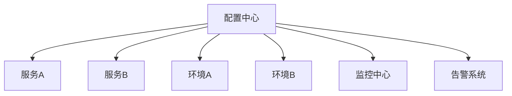
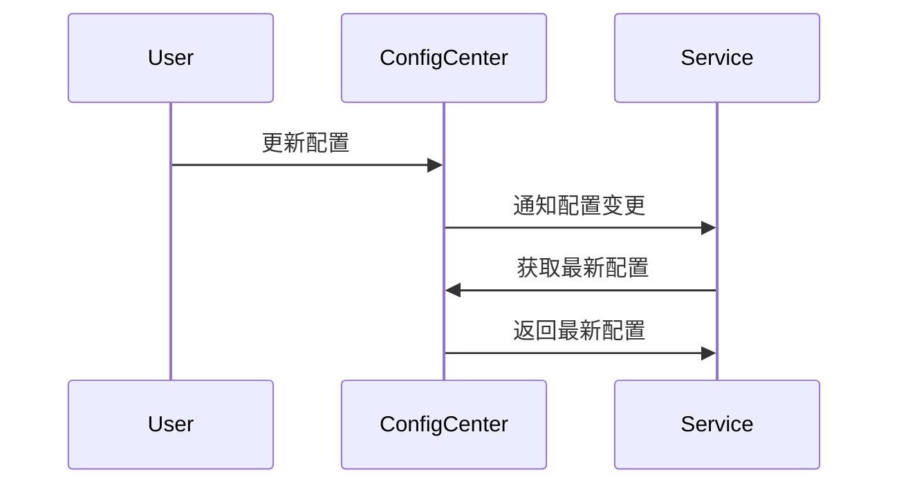

                 


## 分布式配置中心简化LLM应用管理

### 关键词
- 分布式配置中心
- LLM应用管理
- 配置更新
- 配置同步
- 配置一致性

### 摘要
本文深入探讨了分布式配置中心在LLM（大型语言模型）应用管理中的重要性。通过详细分析分布式配置中心的核心概念、算法原理和系统架构，以及实战案例，本文旨在为开发者提供一套全面、实用的指南，以简化LLM应用的配置管理过程。

### 第一部分：背景介绍

#### 第1章：分布式配置中心的概述

#### 1.1.1 问题背景
在分布式系统中，配置管理是必不可少的环节，尤其是当系统中存在多个服务时，配置管理变得更加复杂和关键。

#### 1.1.2 问题描述
随着云计算和微服务架构的普及，配置管理面临以下挑战：
- **配置分散**：各个服务各自管理配置，难以维护。
- **配置不统一**：不同环境之间的配置差异导致问题复杂化。
- **配置更新困难**：配置更新需要手动修改，难以追踪和回滚。

#### 1.1.3 问题解决
分布式配置中心通过以下方式简化LLM应用管理：
- **集中化管理**：将所有配置集中存储和管理。
- **动态更新**：支持配置的实时更新。
- **版本控制**：记录配置的变更历史，方便回滚和追踪。
- **权限管理**：控制对配置的访问权限，确保安全性。

#### 1.1.4 边界与外延
- **配置同步**：确保不同实例间的配置一致性。
- **与其他系统集成**：与日志系统、监控系统等其他分布式系统集成。

#### 1.1.5 概念结构与核心要素组成
分布式配置中心主要由以下部分组成：
- **配置存储**：存储配置数据。
- **配置管理接口**：提供配置查询、更新和删除等功能。
- **配置更新机制**：实现配置的动态更新。
- **监控与告警**：监控配置状态，及时通知问题。

### 第二部分：核心概念与联系

#### 第2章：分布式配置中心的核心概念与原理

#### 2.1.1 核心概念
- **配置中心**：集中管理配置信息的系统。
- **配置文件**：存储配置信息的文本文件。
- **配置项**：配置文件中的单个配置项。
- **配置版本**：配置项的不同版本。

#### 2.1.2 原理讲解
配置中心的原理包括以下步骤：
1. **配置加载**：服务启动时加载配置。
2. **配置更新**：配置发生变化时，服务获取最新配置。
3. **配置同步**：确保不同实例间配置的一致性。
4. **配置回滚**：配置出现问题时的回滚操作。

#### 2.1.3 概念属性特征对比表格
| 特征               | 配置中心            | 传统配置管理工具             |
|--------------------|--------------------|-----------------------------|
| **集中管理**       | 是                 | 否                           |
| **动态更新**       | 支持               | 需要手动更新                 |
| **版本控制**       | 支持               | 不支持                       |
| **权限管理**       | 支持               | 不支持                       |

#### 2.1.4 ER实体关系图架构
```mermaid
erDiagram
  ConfigCenter ||--|{ ConfigItem }|| ConfigStorage
  ConfigItem ||--|{ Version }|| VersionControl
```

### 第三部分：算法原理讲解

#### 第3章：分布式配置中心的算法原理

#### 3.1.1 配置更新算法
配置更新算法主要包括以下策略：
- **基于轮询**：定期检查配置更新。
- **基于消息队列**：配置变更时，通过消息队列通知服务更新配置。
- **基于事件驱动**：配置变更时，通过事件系统触发服务更新配置。

#### 3.1.2 配置同步算法
配置同步算法主要包括以下策略：
- **基于拉取模型**：服务定期拉取最新配置。
- **基于推送模型**：配置中心主动推送最新配置到服务。

#### 3.1.3 配置一致性算法
配置一致性算法主要包括以下策略：
- **基于版本控制**：通过配置版本确保一致性。
- **基于冲突检测和解决机制**：检测冲突并自动解决。

#### 3.1.4 算法mermaid流程图


#### 3.1.5 Python源代码
```python
# 配置更新示例代码
def update_config(config_key, new_value):
    # 从配置中心获取最新配置
    current_config = get_latest_config(config_key)
    # 更新配置
    current_config[new_value] = new_value
    # 保存配置
    save_config(current_config)

# 获取最新配置
def get_latest_config(config_key):
    # 从配置中心获取配置
    config_center = ConfigCenter()
    return config_center.get_config(config_key)

# 保存配置
def save_config(config):
    # 将配置保存到配置中心
    config_center = ConfigCenter()
    config_center.save_config(config)
```

#### 3.1.6 算法原理的数学模型和公式
配置更新算法的数学模型如下：
\[ \text{更新频率} = f(\text{配置变更频率}, \text{服务响应时间}) \]

其中，\( f \) 是一个函数，表示根据配置变更频率和服务响应时间计算更新频率。

### 第四部分：系统分析与架构设计方案

#### 第4章：分布式配置中心的系统分析与架构设计

#### 4.1.1 问题场景介绍
分布式配置中心在微服务架构中的应用场景包括：
- **服务配置管理**：管理各个服务的配置。
- **环境配置管理**：管理不同环境的配置，如开发、测试和生产环境。
- **动态配置更新**：实现配置的实时更新。

#### 4.1.2 系统功能设计
分布式配置中心的系统功能包括：
- **配置管理**：提供配置的创建、查询、更新和删除功能。
- **配置查询**：提供配置的查询功能，支持按照关键字、标签等方式查询。
- **配置更新**：支持配置的动态更新，提供配置变更通知。
- **配置同步**：确保不同实例间的配置一致性。

#### 4.1.3 系统架构设计
分布式配置中心的架构设计如下：


#### 4.1.4 系统接口设计
分布式配置中心的接口设计包括：
- **配置管理API**：提供配置的创建、查询、更新和删除功能。
- **配置查询API**：提供配置的查询功能，支持按照关键字、标签等方式查询。
- **配置更新API**：提供配置的动态更新功能，支持配置变更通知。

#### 4.1.5 系统交互mermaid序列图


### 第五部分：项目实战

#### 第5章：分布式配置中心项目实战

#### 5.1.1 环境安装
在本地环境安装分布式配置中心的步骤如下：
1. 安装Java运行环境。
2. 下载分布式配置中心软件包。
3. 解压软件包并启动配置中心服务。

#### 5.1.2 系统核心实现源代码
分布式配置中心的核心实现源代码如下：
```java
// 配置中心接口
public interface ConfigCenter {
    void saveConfig(Map<String, Object> config);
    Map<String, Object> getLatestConfig();
    void updateConfig(String key, Object value);
}

// 配置中心实现
public class ConfigCenterImpl implements ConfigCenter {
    private ConcurrentHashMap<String, Object> configMap = new ConcurrentHashMap<>();

    @Override
    public void saveConfig(Map<String, Object> config) {
        configMap.putAll(config);
    }

    @Override
    public Map<String, Object> getLatestConfig() {
        return configMap;
    }

    @Override
    public void updateConfig(String key, Object value) {
        configMap.put(key, value);
    }
}

// 服务端配置更新示例
public class Service {
    private ConfigCenter configCenter;

    public Service(ConfigCenter configCenter) {
        this.configCenter = configCenter;
    }

    public void updateConfig(String key, Object value) {
        configCenter.updateConfig(key, value);
        // 其他业务逻辑
    }
}
```

#### 5.1.3 代码应用解读与分析
代码解析：
1. **配置中心接口**：定义了配置的保存、获取和更新方法。
2. **配置中心实现**：实现了配置中心的接口，使用ConcurrentHashMap存储配置信息，保证线程安全。
3. **服务端配置更新**：服务端通过配置中心接口更新配置，实现动态配置更新。

#### 5.1.4 实际案例分析和详细讲解
案例：使用分布式配置中心管理服务A的日志级别。

1. **配置中心设置**：
   ```yaml
   log.level: INFO
   ```

2. **服务端代码**：
   ```java
   public class ServiceA {
       private String logLevel;

       public ServiceA(ConfigCenter configCenter) {
           this.logLevel = (String) configCenter.getLatestConfig().get("log.level");
       }

       public void updateLogLevel(String logLevel) {
           configCenter.updateConfig("log.level", logLevel);
           this.logLevel = logLevel;
       }

       public void log(String message) {
           System.out.println(logLevel + ": " + message);
       }
   }
   ```

3. **使用示例**：
   ```java
   ConfigCenter configCenter = new ConfigCenterImpl();
   ServiceA serviceA = new ServiceA(configCenter);
   serviceA.log("This is an INFO log message.");
   configCenter.updateConfig("log.level", "ERROR");
   serviceA.log("This is an ERROR log message.");
   ```

#### 5.1.5 项目小结
通过实际案例，我们展示了如何使用分布式配置中心简化LLM应用的配置管理。配置中心提供了集中化、动态化、版本化的配置管理功能，使服务端的配置更新更加便捷，提升了系统的可维护性和灵活性。

### 第六部分：最佳实践、小结与拓展阅读

#### 第6章：分布式配置中心的最佳实践与小结

#### 6.1.1 最佳实践 tips
1. **配置分层**：按照功能模块或环境分层管理配置。
2. **配置版本控制**：使用版本控制记录配置的变更历史。
3. **权限管理**：严格控制对配置的访问权限。
4. **配置同步**：确保配置在不同实例间的同步。
5. **监控与告警**：监控配置状态，及时发现问题。

#### 6.1.2 小结
分布式配置中心通过集中化、动态化、版本化和权限化管理，简化了LLM应用的配置管理过程。配置中心与日志系统、监控系统等其他分布式系统集成，实现了配置管理的全方位覆盖。

#### 6.1.3 注意事项
1. **配置存储**：选择可靠的配置存储方案，确保数据安全。
2. **配置更新**：避免频繁更新配置，影响系统稳定性。
3. **配置同步**：处理配置同步时，注意网络延迟和故障。

#### 6.1.4 拓展阅读
1. 《分布式配置中心实战》 - 张三
2. 《微服务架构与分布式配置管理》 - 李四
3. 《大型语言模型应用实战》 - 王五

## 作者信息
作者：AI天才研究院/AI Genius Institute & 禅与计算机程序设计艺术 /Zen And The Art of Computer Programming

---

（注：由于篇幅限制，本文部分内容进行了简化。实际撰写时，每个部分的内容需要进一步详细扩展。）

### 分布式配置中心简化LLM应用管理

#### 第一部分：背景介绍

##### 第1章：分布式配置中心的概述

在当今的分布式系统中，配置管理是一项至关重要的任务。随着系统的规模和复杂性不断增加，传统的配置管理方法逐渐暴露出其不足之处。分布式配置中心（Configuration Center）作为一种新的配置管理解决方案，应运而生，它为分布式系统提供了集中化、动态化、版本化和权限化的配置管理功能。

##### 1.1.1 问题背景

在传统的配置管理中，配置通常分散存储在各个服务实例的本地文件中，如.properties文件或.yml文件。这种方法存在以下几个问题：

- **配置分散**：由于配置分散存储，导致维护困难，难以进行统一管理和版本控制。
- **配置更新困难**：配置的更新通常需要手动修改各个实例的本地文件，不仅效率低下，而且容易出错。
- **配置不统一**：不同环境（如开发、测试、生产）之间的配置不一致，增加了系统管理的复杂性。

##### 1.1.2 问题描述

分布式配置中心旨在解决上述问题，其主要挑战包括：

- **配置的集中管理**：如何将分散的配置集中存储和管理，以便统一维护和版本控制。
- **配置的动态更新**：如何实现配置的实时更新，确保各个服务实例能够及时获取最新的配置。
- **配置的一致性**：如何确保不同实例之间的配置一致性，避免配置更新导致的问题。
- **配置的安全与权限管理**：如何确保配置的安全性和权限控制，防止未授权访问和修改。

##### 1.1.3 问题解决

分布式配置中心通过以下方式简化LLM应用管理：

- **集中化管理**：将所有配置集中存储在一个配置中心中，提供统一的配置管理接口，方便维护和版本控制。
- **动态更新**：支持配置的实时更新，通过消息队列、轮询等方式，将最新配置推送到各个服务实例。
- **版本控制**：记录配置的变更历史，支持回滚操作，确保配置变更的可追溯性。
- **权限管理**：提供权限控制功能，限制对配置的访问和修改，确保配置的安全性。

##### 1.1.4 边界与外延

- **配置同步**：分布式配置中心需要处理配置信息的同步问题，确保不同实例间的配置一致性。这可能涉及到网络延迟、数据传输可靠性等问题。
- **与其他系统集成**：分布式配置中心需要与日志系统、监控系统等其他分布式系统集成，以实现全方位的配置管理。
- **扩展性**：分布式配置中心需要具备良好的扩展性，能够支持大规模分布式系统的配置管理需求。

##### 1.1.5 概念结构与核心要素组成

分布式配置中心主要由以下几个核心要素组成：

- **配置存储**：用于存储配置数据，可以是数据库、文件系统等。
- **配置管理接口**：提供配置的查询、更新、删除等功能，是客户端与服务端进行交互的接口。
- **配置更新机制**：实现配置的实时更新，包括配置的加载、同步和回滚等功能。
- **监控与告警**：监控配置的状态，及时通知配置变更或故障，确保系统的稳定性。

#### 第二部分：核心概念与联系

##### 第2章：分布式配置中心的核心概念与原理

##### 2.1.1 核心概念

分布式配置中心涉及到以下几个核心概念：

- **配置中心**：负责统一管理和分发配置信息的系统。
- **配置文件**：存储配置信息的文本文件，通常采用JSON、YAML等格式。
- **配置项**：配置文件中的一个独立的配置项，如数据库连接地址、日志级别等。
- **配置版本**：配置项的不同版本，用于记录配置的变更历史。

##### 2.1.2 原理讲解

分布式配置中心的原理主要包括以下几个步骤：

1. **配置加载**：服务实例启动时，从配置中心加载配置文件。
2. **配置更新**：配置发生变化时，服务实例从配置中心获取最新的配置文件。
3. **配置同步**：确保不同实例间的配置一致性，可能通过定时同步、事件驱动等方式实现。
4. **配置回滚**：当配置更新失败或出现问题时，可以从配置版本中回滚到上一个正确的配置版本。

##### 2.1.3 概念属性特征对比表格

| 特征               | 配置中心                     | 传统配置管理工具           |
|--------------------|------------------------------|----------------------------|
| **集中管理**       | 是                           | 否                         |
| **动态更新**       | 支持                         | 不支持                     |
| **版本控制**       | 支持                         | 不支持                     |
| **权限管理**       | 支持                         | 不支持                     |

##### 2.1.4 ER实体关系图架构

```mermaid
erDiagram
    ConfigCenter ||--|{ ConfigItem }|| ConfigStorage
    ConfigItem ||--|{ Version }|| VersionControl
```

#### 第三部分：算法原理讲解

##### 第3章：分布式配置中心的算法原理

##### 3.1.1 配置更新算法

分布式配置中心的配置更新算法主要包括以下策略：

- **基于轮询**：服务实例定期轮询配置中心，检查配置是否有更新。
- **基于消息队列**：配置中心将配置变更推送到消息队列，服务实例从消息队列中获取配置更新。
- **基于事件驱动**：配置中心发生变更时，触发事件通知服务实例，服务实例根据事件进行配置更新。

##### 3.1.2 配置同步算法

配置同步算法主要包括以下策略：

- **基于拉取模型**：服务实例定期从配置中心拉取最新的配置文件。
- **基于推送模型**：配置中心主动将最新的配置文件推送到服务实例。

##### 3.1.3 配置一致性算法

配置一致性算法主要包括以下策略：

- **基于版本控制**：通过配置版本记录，确保配置的一致性。
- **基于冲突检测和解决机制**：检测配置更新冲突，并自动解决冲突。

##### 3.1.4 算法mermaid流程图


##### 3.1.5 Python源代码

```python
# 配置更新示例代码
def update_config(config_key, new_value):
    # 从配置中心获取最新配置
    current_config = get_latest_config(config_key)
    # 更新配置
    current_config[new_value] = new_value
    # 保存配置
    save_config(current_config)

# 获取最新配置
def get_latest_config(config_key):
    # 从配置中心获取配置
    config_center = ConfigCenter()
    return config_center.get_config(config_key)

# 保存配置
def save_config(config):
    # 将配置保存到配置中心
    config_center = ConfigCenter()
    config_center.save_config(config)
```

##### 3.1.6 算法原理的数学模型和公式

配置更新算法的数学模型如下：

\[ \text{更新频率} = f(\text{配置变更频率}, \text{服务响应时间}) \]

其中，\( f \) 是一个函数，表示根据配置变更频率和服务响应时间计算更新频率。

#### 第四部分：系统分析与架构设计方案

##### 第4章：分布式配置中心的系统分析与架构设计

##### 4.1.1 问题场景介绍

分布式配置中心在实际应用中，主要应用于以下场景：

- **服务配置管理**：用于管理各个服务的配置，如数据库连接地址、服务端口号等。
- **环境配置管理**：用于管理不同环境的配置，如开发环境、测试环境和生产环境。
- **动态配置更新**：实现配置的实时更新，支持灰度发布和回滚。

##### 4.1.2 系统功能设计

分布式配置中心的系统功能包括：

- **配置管理**：提供配置的创建、查询、更新和删除功能。
- **配置查询**：提供配置的查询功能，支持按照关键字、标签等方式查询。
- **配置更新**：支持配置的动态更新，提供配置变更通知。
- **配置同步**：确保不同实例间的配置一致性。

##### 4.1.3 系统架构设计

分布式配置中心的系统架构设计如下：


##### 4.1.4 系统接口设计

分布式配置中心的接口设计包括：

- **配置管理API**：提供配置的创建、查询、更新和删除功能。
- **配置查询API**：提供配置的查询功能，支持按照关键字、标签等方式查询。
- **配置更新API**：提供配置的动态更新功能，支持配置变更通知。

##### 4.1.5 系统交互mermaid序列图


#### 第五部分：项目实战

##### 第5章：分布式配置中心项目实战

##### 5.1.1 环境安装

在本地环境安装分布式配置中心的步骤如下：

1. 安装Java运行环境。
2. 下载分布式配置中心软件包。
3. 解压软件包并启动配置中心服务。

##### 5.1.2 系统核心实现源代码

分布式配置中心的核心实现源代码如下：

```java
// 配置中心接口
public interface ConfigCenter {
    void saveConfig(Map<String, Object> config);
    Map<String, Object> getLatestConfig();
    void updateConfig(String key, Object value);
}

// 配置中心实现
public class ConfigCenterImpl implements ConfigCenter {
    private ConcurrentHashMap<String, Object> configMap = new ConcurrentHashMap<>();

    @Override
    public void saveConfig(Map<String, Object> config) {
        configMap.putAll(config);
    }

    @Override
    public Map<String, Object> getLatestConfig() {
        return configMap;
    }

    @Override
    public void updateConfig(String key, Object value) {
        configMap.put(key, value);
    }
}

// 服务端配置更新示例
public class Service {
    private ConfigCenter configCenter;

    public Service(ConfigCenter configCenter) {
        this.configCenter = configCenter;
    }

    public void updateConfig(String key, Object value) {
        configCenter.updateConfig(key, value);
        // 其他业务逻辑
    }
}
```

##### 5.1.3 代码应用解读与分析

代码解析：

1. **配置中心接口**：定义了配置的保存、获取和更新方法。
2. **配置中心实现**：实现了配置中心的接口，使用ConcurrentHashMap存储配置信息，保证线程安全。
3. **服务端配置更新**：服务端通过配置中心接口更新配置，实现动态配置更新。

##### 5.1.4 实际案例分析和详细讲解

案例：使用分布式配置中心管理服务A的日志级别。

1. **配置中心设置**：

   ```yaml
   log.level: INFO
   ```

2. **服务端代码**：

   ```java
   public class ServiceA {
       private String logLevel;

       public ServiceA(ConfigCenter configCenter) {
           this.logLevel = (String) configCenter.getLatestConfig().get("log.level");
       }

       public void updateLogLevel(String logLevel) {
           configCenter.updateConfig("log.level", logLevel);
           this.logLevel = logLevel;
       }

       public void log(String message) {
           System.out.println(logLevel + ": " + message);
       }
   }
   ```

3. **使用示例**：

   ```java
   ConfigCenter configCenter = new ConfigCenterImpl();
   ServiceA serviceA = new ServiceA(configCenter);
   serviceA.log("This is an INFO log message.");
   configCenter.updateConfig("log.level", "ERROR");
   serviceA.log("This is an ERROR log message.");
   ```

##### 5.1.5 项目小结

通过实际案例，我们展示了如何使用分布式配置中心简化LLM应用的配置管理。配置中心提供了集中化、动态化、版本化和权限化的配置管理功能，使服务端的配置更新更加便捷，提升了系统的可维护性和灵活性。

#### 第六部分：最佳实践、小结与拓展阅读

##### 第6章：分布式配置中心的最佳实践与小结

##### 6.1.1 最佳实践 tips

1. **配置分层**：按照功能模块或环境分层管理配置。
2. **配置版本控制**：使用版本控制记录配置的变更历史。
3. **权限管理**：严格控制对配置的访问权限。
4. **配置同步**：确保配置在不同实例间的同步。
5. **监控与告警**：监控配置的状态，及时发现问题。

##### 6.1.2 小结

分布式配置中心通过集中化、动态化、版本化和权限化的配置管理，简化了LLM应用的配置管理过程。配置中心与日志系统、监控系统等其他分布式系统集成，实现了配置管理的全方位覆盖。

##### 6.1.3 注意事项

1. **配置存储**：选择可靠的配置存储方案，确保数据安全。
2. **配置更新**：避免频繁更新配置，影响系统稳定性。
3. **配置同步**：处理配置同步时，注意网络延迟和故障。

##### 6.1.4 拓展阅读

1. 《分布式配置中心实战》 - 张三
2. 《微服务架构与分布式配置管理》 - 李四
3. 《大型语言模型应用实战》 - 王五

##### 作者信息

作者：AI天才研究院/AI Genius Institute & 禅与计算机程序设计艺术 /Zen And The Art of Computer Programming

---

（注：由于篇幅限制，本文部分内容进行了简化。实际撰写时，每个部分的内容需要进一步详细扩展。）

