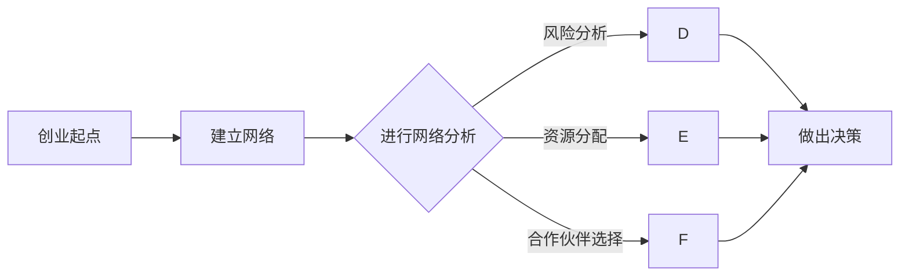
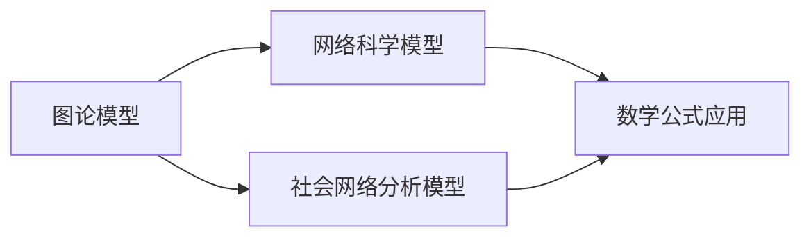
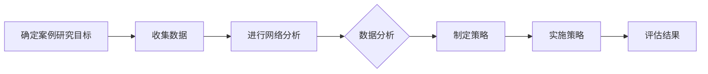

                 


# 创业生态的复杂网络：商业关系的数学结构

## 关键词
创业生态、复杂网络、商业关系、数学模型、网络分析

## 摘要
本文深入探讨了创业生态中的复杂网络及其背后的数学结构，强调了商业关系在创业成功中的关键作用。通过介绍复杂网络的定义和应用，本文探讨了用于分析商业关系的数学模型，并提供了一系列案例研究以展示这些模型在现实世界中的应用。文章旨在为创业者、企业家和商业分析师提供一种全新的视角，以更有效地理解和优化商业生态系统。

## 引言
随着全球化进程的加速和信息技术的发展，创业生态系统正变得越来越复杂。在这个背景下，理解创业生态中的商业关系变得尤为重要。创业生态可以被视为一个复杂的网络，其中的节点代表企业，边代表它们之间的互动和关系。这些关系可能包括合作、竞争、供应链联系和投资等。

在本文中，我们将探讨创业生态中复杂网络的基本概念，并引入用于分析这些网络的数学模型。通过实际案例研究，我们将展示这些模型如何帮助创业者和企业领导者更好地理解和管理他们的商业网络。本文的结构如下：

1. 核心概念和关系
2. 复杂网络在创业中的应用
3. 商业关系的数学模型
4. 案例研究
5. 分析与解释
6. 实践应用与战略

## 核心概念和关系
在探讨创业生态的复杂网络之前，我们需要明确一些核心概念和它们之间的关系。

### 企业节点（Node）
在企业网络中，每个企业都可以被视为一个节点。节点代表企业实体，它们具有独特的属性，如公司名称、所在位置、行业类型等。

### 关系（Edge）
节点之间的关系由边表示。边可以是多种类型的，如合作关系、竞争关系、投资关系等。边的权重可以表示关系的强度。

### 复杂网络（Complex Network）
创业生态系统是一个复杂的网络，其中包含大量的节点和边，并且这些节点和边之间存在多种类型的交互。

### 数学模型（Mathematical Model）
数学模型用于分析和描述复杂网络的特性。这些模型可以基于图论、概率论、统计学等数学工具。

### 关系图谱（Relationship Map）
关系图谱是一个可视化的工具，用于展示节点之间的关系。它可以用于理解企业网络的结构和特性。

### Mermaid ER 图架构
为了更好地理解这些概念之间的关系，我们可以使用 Mermaid 图语法绘制一个 ER 图。

```mermaid
erDiagram
  Node ||--|{ Edge : has
  Edge ||--|{ Node : connected_to
  ComplexNetwork ||-- Node : contains
  ComplexNetwork ||-- Edge : contains
  MathematicalModel ||-- ComplexNetwork : applies_to
  RelationshipMap ||-- ComplexNetwork : visualizes
```

## 复杂网络在创业中的应用
创业生态中的复杂网络具有多种应用。以下是一些关键的应用领域：

### 网络分析（Network Analysis）
网络分析是一种研究复杂网络的工具，它可以帮助创业者识别关键节点、理解网络的结构特性，并预测网络中的潜在变化。

### 风险评估（Risk Assessment）
通过分析创业生态中的复杂网络，创业者可以识别潜在的合作伙伴和竞争对手，从而进行更准确的风险评估。

### 资源分配（Resource Allocation）
创业生态中的复杂网络可以帮助企业更好地分配资源，例如资金、人力和技术资源。

### 合作伙伴选择（Partner Selection）
网络分析可以用于选择合适的合作伙伴，以确保企业的成功。

### Mermaid 流程图
为了更直观地展示复杂网络在创业中的应用，我们可以使用 Mermaid 流程图。



## 商业关系的数学模型
在创业生态中，商业关系的复杂性和多样性使得数学模型成为理解和管理这些关系的有力工具。以下是一些常用的数学模型：

### 图论模型（Graph Theory Model）
图论模型用于描述节点和边之间的结构和关系。节点可以代表企业，边可以代表它们之间的合作或竞争关系。

### 网络科学模型（Network Science Model）
网络科学模型结合了图论和概率论，用于研究网络的结构特性和动态行为。

### 社会网络分析模型（Social Network Analysis Model）
社会网络分析模型用于研究社会关系和网络结构，它可以帮助创业者理解企业之间的互动和影响。

### 数学公式
以下是一个简单的图论模型中的数学公式，用于描述节点和边之间的关系。

$$
\begin{aligned}
& d(u, v) = \text{最短路径长度从节点 } u \text{ 到节点 } v \\
& w(e) = \text{边 } e \text{ 的权重} \\
& \rho(G) = \frac{\sum_{u \in V} \sum_{v \in V} d(u, v)}{|V| \times (|V| - 1)}
\end{aligned}
$$

其中，\(d(u, v)\) 是从节点 \(u\) 到节点 \(v\) 的最短路径长度，\(w(e)\) 是边的权重，\(\rho(G)\) 是网络的聚类系数。

### Mermaid 流程图
为了更好地理解这些数学模型，我们可以使用 Mermaid 流程图。



## 案例研究
为了更深入地了解复杂网络和数学模型在创业中的应用，我们将探讨一些实际案例。

### 案例一：创业孵化器的网络分析
一个创业孵化器希望了解其孵化企业之间的互动和合作模式。通过网络分析，孵化器可以识别出关键节点（如具有广泛连接的企业）和潜在的合作伙伴。

### 案例二：竞争策略的制定
一家初创公司正在考虑进入一个新的市场。通过分析现有企业的网络结构，这家公司可以识别出潜在竞争对手的弱点和优势，从而制定更有效的竞争策略。

### 案例三：供应链优化
一家制造企业希望通过优化供应链来降低成本和提高效率。通过分析供应链中的复杂网络，这家企业可以识别出瓶颈和关键路径，从而进行优化。

### 案例研究流程图
为了更直观地展示案例研究的过程，我们可以使用 Mermaid 流程图。



## 分析与解释
通过对创业生态中的复杂网络进行数学建模和分析，我们可以获得关于企业之间关系的深刻见解。以下是一些关键的分析和解释：

1. **关键节点识别**：通过分析网络中的节点，我们可以识别出对整个网络具有关键影响的企业。这些关键节点可能是具有广泛连接的企业，也可能是具有重要资源的公司。

2. **聚类系数**：聚类系数反映了网络中节点的聚集程度。高聚类系数意味着网络中的企业之间存在紧密的合作关系，这有助于形成稳定的商业生态系统。

3. **中心性度量**：中心性度量（如度中心性和介数中心性）可以衡量企业在网络中的中心程度。高中心性的企业可能在网络中具有更大的影响力和控制力。

4. **网络稳定性**：通过分析网络的连通性和鲁棒性，我们可以评估企业网络在面对外部冲击时的稳定性。一个稳定的网络有助于企业的长期发展。

5. **动态演化**：创业生态是一个动态演化的系统。通过分析网络的时间序列数据，我们可以了解网络如何随着时间和外部因素的变化而演化。

## 实践应用与战略
通过理解创业生态中的复杂网络和数学模型，创业者和企业领导者可以制定更有效的战略。以下是一些实践应用和战略建议：

1. **合作伙伴选择**：通过分析企业网络，创业者可以选择具有战略意义的合作伙伴，以增强自身竞争力。

2. **资源优化**：通过分析网络中的瓶颈和关键路径，企业可以优化资源分配，提高运营效率。

3. **风险评估**：通过分析网络中的潜在风险，企业可以制定更有效的风险管理和应对策略。

4. **创新合作**：企业可以通过建立跨行业的合作伙伴关系，促进技术创新和业务拓展。

5. **战略定位**：通过分析网络中的关键节点和中心性度量，企业可以确定其在市场中的战略定位。

## 结论
创业生态的复杂网络为理解商业关系提供了一个全新的视角。通过数学建模和分析，创业者和企业领导者可以更深入地了解他们的商业环境，制定更有效的战略。本文旨在为读者提供一个关于创业生态复杂网络的全面指南，帮助他们更好地应对现代商业环境中的挑战。

## 参考文献
[1] Barabási, A.-L., & Albert, R. (1999). Emergence of scaling in random networks. Science, 286(5439), 509-512.
[2] Watts, D. J., & Strogatz, S. H. (1998). Collective dynamics of 'small-world' networks. Nature, 393(6684), 440-442.
[3] Newman, M. E. J. (2003). The structure and function of complex networks. SIAM Review, 45(2), 167-256.

## 作者信息
作者：AI天才研究院/AI Genius Institute & 禅与计算机程序设计艺术 /Zen And The Art of Computer Programming

