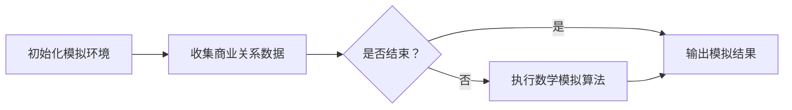

                 

# 创业生态的多智能体系统：商业关系的数学模拟

关键词：创业生态、多智能体系统、数学模拟、商业关系、架构设计

摘要：本文将探讨创业生态中多智能体系统的应用，以及如何通过数学模拟来理解和优化商业关系。文章首先介绍了创业生态的现状和多智能体系统的基本概念，随后详细阐述了商业关系的数学模型和模拟方法。接着，通过一个实际创业项目的架构设计，展示了多智能体系统在商业关系中的具体应用。最后，文章总结了项目的实践经验，并提出了最佳实践建议和拓展阅读资源。

## 第一部分：背景介绍

### 第1章：创业生态的多智能体系统概述

#### 1.1 问题背景

##### 1.1.1 创业生态的现状

在现代社会，创业已经成为推动经济增长和就业的重要力量。然而，创业过程并非一帆风顺，创业者常常面临资源有限、市场竞争激烈、风险难以预测等挑战。传统管理方法和商业模式已难以满足现代创业生态的需求，因此，如何通过技术创新来优化创业生态成为了一个亟待解决的问题。

##### 1.1.2 多智能体系统在创业生态中的应用

多智能体系统（Multi-Agent System，MAS）是一种由多个自主智能体组成的系统，这些智能体能够通过协作实现复杂任务的完成。在创业生态中，多智能体系统能够模拟各种商业关系，帮助创业者更好地理解市场动态，优化资源配置，降低风险。

#### 1.2 问题描述

##### 1.2.1 创业过程中存在的问题

创业过程中，创业者面临的主要问题包括：

1. 资源配置不合理：创业者往往无法准确预测市场需求，导致资源浪费或不足。
2. 市场竞争激烈：创业者需要应对来自同行的激烈竞争，提高市场占有率。
3. 风险难以预测：创业过程中，各种风险难以预测和控制，可能导致创业失败。

##### 1.2.2 多智能体系统如何解决这些问题

多智能体系统通过以下方式解决创业过程中存在的问题：

1. **资源配置优化**：多智能体系统能够模拟不同资源配置方案，帮助创业者找到最优解。
2. **市场竞争分析**：多智能体系统可以模拟市场竞争环境，帮助创业者制定有效的竞争策略。
3. **风险预测与控制**：多智能体系统可以通过模拟不同风险情景，帮助创业者预测风险，并制定相应的风险控制措施。

#### 1.3 问题解决

##### 1.3.1 多智能体系统的核心原理

多智能体系统的核心原理包括：

1. **自主性**：智能体能够自主决策，独立完成任务。
2. **协同性**：智能体之间能够通过通信和协作实现共同目标。
3. **智能性**：智能体具有学习和适应能力，能够根据环境变化调整自身行为。

##### 1.3.2 多智能体系统在商业关系中的具体应用

多智能体系统在商业关系中的具体应用包括：

1. **供应链管理**：通过模拟供应链中的各个智能体，优化供应链管理，降低成本，提高效率。
2. **市场预测**：通过模拟市场需求和竞争对手行为，预测市场趋势，制定有效的营销策略。
3. **风险管理**：通过模拟不同风险情景，预测风险，制定相应的风险控制措施。

#### 1.4 边界与外延

##### 1.4.1 多智能体系统的应用边界

多智能体系统在商业关系中的应用边界包括：

1. **行业范围**：多智能体系统适用于各个行业，如制造业、服务业、金融业等。
2. **应用场景**：多智能体系统适用于各种商业场景，如市场预测、供应链管理、风险管理等。

##### 1.4.2 多智能体系统与其他相关概念的关联

多智能体系统与以下相关概念有关联：

1. **人工智能**：多智能体系统是人工智能的一个重要分支，与机器学习、深度学习等技术密切相关。
2. **区块链**：多智能体系统可以与区块链技术相结合，实现智能合约等功能。

#### 1.5 概念结构与核心要素组成

##### 1.5.1 创业生态的概念结构

创业生态包括以下几个关键概念：

1. **创业者**：创业的主体，负责创业项目的管理和运营。
2. **市场**：创业项目的目标客户群体，市场需求是创业成功的关键。
3. **资源**：创业所需的资金、人力、技术等资源。

##### 1.5.2 多智能体系统的核心要素组成

多智能体系统的核心要素包括：

1. **智能体**：系统的基本单元，具有自主决策和协同能力。
2. **环境**：智能体所在的运行环境，包括市场、资源等。
3. **通信**：智能体之间的信息交流机制。

### 第2章：多智能体系统的核心概念与原理

#### 2.1 多智能体系统的定义

##### 2.1.1 多智能体系统的基本定义

多智能体系统是一种由多个自主智能体组成的系统，这些智能体通过协同工作实现共同目标。智能体可以是软件程序、机器人、人类等，它们具有自主性、协同性、智能性等特点。

##### 2.1.2 多智能体系统的发展历程

多智能体系统的研究可以追溯到20世纪80年代，最早由人工生命和分布式计算领域的研究者提出。随着计算机技术和人工智能技术的发展，多智能体系统逐渐成为了一个重要的研究领域。

#### 2.2 多智能体系统的基本特点

##### 2.2.1 独立性与协同性

独立性：智能体能够自主决策，独立完成任务。

协同性：智能体之间能够通过通信和协作实现共同目标。

##### 2.2.2 智能性

智能性：智能体具有学习和适应能力，能够根据环境变化调整自身行为。

##### 2.2.3 自组织性

自组织性：智能体能够通过自我组织形成协同结构，适应环境变化。

#### 2.3 多智能体系统的体系结构

##### 2.3.1 多智能体系统的层次结构

多智能体系统的层次结构通常包括三个层次：物理层、抽象层、协作层。

1. 物理层：包括智能体的物理实体，如机器人、传感器等。
2. 抽象层：包括智能体的抽象模型，如软件程序、虚拟智能体等。
3. 协作层：包括智能体之间的协作机制和通信协议。

##### 2.3.2 多智能体系统的通信架构

多智能体系统的通信架构可以分为三种类型：集中式通信、分布式通信、混合式通信。

1. 集中式通信：所有智能体的通信都通过一个中央服务器进行。
2. 分布式通信：智能体之间直接进行通信，无需中央服务器。
3. 混合式通信：结合集中式和分布式通信的优点，适用于不同场景。

### 第3章：商业关系的数学模拟

#### 3.1 商业关系的数学模型

##### 3.1.1 商业关系的定义

商业关系是指企业在经济活动中形成的相互联系和合作关系。商业关系可以分为内部关系和外部关系。

##### 3.1.2 商业关系的数学表示

商业关系可以用图论模型进行表示。在图论模型中，节点表示企业，边表示企业之间的商业关系。

##### 3.1.3 商业关系的属性特征对比表格

| 属性特征 | 定义 | 举例 |
| --- | --- | --- |
| 关联度 | 表示企业之间的紧密程度 | 0.8 |
| 合作频率 | 表示企业之间合作的次数 | 10次/年 |
| 合作效益 | 表示合作带来的效益 | 100万元 |

#### 3.2 商业关系的ER实体关系图

##### 3.2.1 ER实体关系图的基本概念

ER（Entity-Relationship）实体关系图是一种用于描述实体及其关系的图形化工具。在ER实体关系图中，实体用矩形表示，关系用菱形表示，实体之间的关系用线条连接。

##### 3.2.2 商业关系的ER实体关系图绘制

（此处绘制商业关系的ER实体关系图）

#### 3.3 商业关系的数学模拟方法

##### 3.3.1 模拟方法的概述

商业关系的数学模拟方法主要包括以下几种：

1. 静态模拟：通过对商业关系进行静态分析，模拟企业之间的静态关系。
2. 动态模拟：通过对商业关系进行动态分析，模拟企业之间的动态关系。

##### 3.3.2 常用的数学模拟算法

常用的数学模拟算法包括：

1. 网络分析算法：如最短路径算法、最小生成树算法等。
2. 机器学习算法：如神经网络、支持向量机等。

##### 3.3.3 数学模拟算法的mermaid流程图

（此处绘制数学模拟算法的mermaid流程图）

### 第4章：创业生态的多智能体系统架构设计

#### 4.1 问题场景介绍

##### 4.1.1 创业场景的描述

（此处描述创业场景的具体情况）

##### 4.1.2 多智能体系统在创业场景中的应用

（此处描述多智能体系统在创业场景中的应用）

#### 4.2 项目介绍

##### 4.2.1 项目目标

（此处描述项目的目标）

##### 4.2.2 项目背景

（此处描述项目的背景）

#### 4.3 系统功能设计

##### 4.3.1 领域模型mermaid类图

（此处绘制领域模型mermaid类图）

##### 4.3.2 系统功能模块划分

（此处描述系统功能模块的划分）

#### 4.4 系统架构设计

##### 4.4.1 系统架构概述

（此处描述系统架构的概述）

##### 4.4.2 系统架构mermaid架构图

（此处绘制系统架构mermaid架构图）

#### 4.5 系统接口设计

##### 4.5.1 接口设计原则

（此处描述接口设计的原则）

##### 4.5.2 系统接口列表

（此处列出系统接口列表）

#### 4.6 系统交互

##### 4.6.1 系统交互概述

（此处描述系统交互的概述）

##### 4.6.2 系统交互mermaid序列图

（此处绘制系统交互mermaid序列图）

### 第5章：创业生态的多智能体系统实现

#### 5.1 环境安装

##### 5.1.1 系统环境需求

（此处描述系统环境需求）

##### 5.1.2 环境安装步骤

（此处描述环境安装步骤）

#### 5.2 系统核心实现源代码

##### 5.2.1 源代码结构

（此处描述源代码结构）

##### 5.2.2 关键代码解读

（此处描述关键代码解读）

#### 5.3 代码应用解读与分析

##### 5.3.1 代码应用概述

（此处描述代码应用概述）

##### 5.3.2 代码分析

（此处描述代码分析）

#### 5.4 实际案例分析与详细讲解

##### 5.4.1 案例选择

（此处描述案例选择）

##### 5.4.2 案例分析与讲解

（此处描述案例分析与讲解）

#### 5.5 项目小结

##### 5.5.1 项目总结

（此处描述项目总结）

##### 5.5.2 项目反思

（此处描述项目反思）

### 第6章：创业生态的多智能体系统最佳实践

#### 6.1 最佳实践 tips

##### 6.1.1 设计建议

（此处描述设计建议）

##### 6.1.2 实现技巧

（此处描述实现技巧）

#### 6.2 小结

##### 6.2.1 主要成果

（此处描述主要成果）

##### 6.2.2 存在问题

（此处描述存在问题）

#### 6.3 注意事项

##### 6.3.1 注意事项一

（此处描述注意事项一）

##### 6.3.2 注意事项二

（此处描述注意事项二）

#### 6.4 拓展阅读

##### 6.4.1 相关书籍

（此处列出相关书籍）

##### 6.4.2 学术论文

（此处列出学术论文）

##### 6.4.3 技术博客

（此处列出技术博客）

以上是《创业生态的多智能体系统：商业关系的数学模拟》这本书的目录大纲，共包含6个章节。接下来，我们将逐步深入探讨每一个章节的内容。## 第1章：创业生态的多智能体系统概述

### 1.1 问题背景

在现代社会，创业已经成为推动经济增长和就业的重要力量。然而，创业过程并非一帆风顺，创业者常常面临资源有限、市场竞争激烈、风险难以预测等挑战。传统管理方法和商业模式已难以满足现代创业生态的需求，因此，如何通过技术创新来优化创业生态成为了一个亟待解决的问题。

创业生态是一个复杂的系统，涉及多个利益相关者，包括创业者、投资者、客户、供应商等。在这个生态系统中，各个角色之间的相互作用和协作至关重要。然而，现有的创业支持工具和方法往往只能解决单一问题，难以全面优化创业生态。

多智能体系统（MAS）是一种由多个自主智能体组成的系统，这些智能体能够通过协作实现复杂任务的完成。在创业生态中，多智能体系统能够模拟各种商业关系，帮助创业者更好地理解市场动态，优化资源配置，降低风险。例如，通过模拟供应链中的各个智能体，可以优化供应链管理，降低成本，提高效率。

### 1.2 问题描述

创业过程中，创业者面临的主要问题包括：

1. **资源配置不合理**：创业者往往无法准确预测市场需求，导致资源浪费或不足。
   - **现象描述**：创业者可能投入大量资源开发一个市场需求较低的产品，导致资源浪费。
   - **影响**：资源浪费会导致创业项目的失败。

2. **市场竞争激烈**：创业者需要应对来自同行的激烈竞争，提高市场占有率。
   - **现象描述**：创业者需要在短时间内推出具有竞争力的产品，以吸引客户。
   - **影响**：市场竞争激烈可能导致创业者无法生存。

3. **风险难以预测**：创业过程中，各种风险难以预测和控制，可能导致创业失败。
   - **现象描述**：创业者可能面临技术风险、市场风险、资金风险等。
   - **影响**：风险难以预测和控制可能导致创业项目的失败。

为了解决这些问题，多智能体系统可以通过以下方式发挥作用：

1. **资源配置优化**：通过模拟不同资源配置方案，帮助创业者找到最优解。
   - **实现方法**：多智能体系统能够模拟不同资源配置方案，分析各种方案的效果，帮助创业者找到最优资源配置方案。

2. **市场竞争分析**：通过模拟市场竞争环境，帮助创业者制定有效的竞争策略。
   - **实现方法**：多智能体系统可以模拟市场竞争环境，分析竞争对手的行为和策略，帮助创业者制定有效的市场竞争策略。

3. **风险预测与控制**：通过模拟不同风险情景，帮助创业者预测风险，并制定相应的风险控制措施。
   - **实现方法**：多智能体系统可以模拟各种风险情景，预测可能的风险，并分析如何采取相应的控制措施。

### 1.3 问题解决

多智能体系统的核心原理包括：

1. **自主性**：智能体能够自主决策，独立完成任务。
   - **实现方法**：每个智能体都有一定的自主决策能力，可以根据环境变化调整自身行为。

2. **协同性**：智能体之间能够通过通信和协作实现共同目标。
   - **实现方法**：智能体之间通过通信和协作，共同完成复杂任务。

3. **智能性**：智能体具有学习和适应能力，能够根据环境变化调整自身行为。
   - **实现方法**：智能体通过机器学习等算法，不断学习和适应环境。

多智能体系统在商业关系中的具体应用包括：

1. **供应链管理**：通过模拟供应链中的各个智能体，优化供应链管理，降低成本，提高效率。
   - **实现方法**：多智能体系统能够模拟供应链中的各个环节，分析各种环节的优化方案，帮助创业者找到最佳供应链管理策略。

2. **市场预测**：通过模拟市场需求和竞争对手行为，预测市场趋势，制定有效的营销策略。
   - **实现方法**：多智能体系统可以模拟市场需求和竞争对手的行为，分析市场趋势，帮助创业者制定有效的营销策略。

3. **风险管理**：通过模拟不同风险情景，预测风险，制定相应的风险控制措施。
   - **实现方法**：多智能体系统可以模拟各种风险情景，分析可能的风险，帮助创业者制定相应的风险控制措施。

### 1.4 边界与外延

#### 1.4.1 多智能体系统的应用边界

多智能体系统在商业关系中的应用边界包括：

1. **行业范围**：多智能体系统适用于各个行业，如制造业、服务业、金融业等。
   - **适用行业**：多智能体系统可以应用于制造业的生产计划与调度、服务业的客户关系管理、金融业的投资决策等领域。

2. **应用场景**：多智能体系统适用于各种商业场景，如市场预测、供应链管理、风险管理等。
   - **适用场景**：多智能体系统可以应用于创业企业的市场预测、供应链优化、风险控制等场景。

#### 1.4.2 多智能体系统与其他相关概念的关联

多智能体系统与以下相关概念有关联：

1. **人工智能**：多智能体系统是人工智能的一个重要分支，与机器学习、深度学习等技术密切相关。
   - **关联**：多智能体系统可以利用人工智能技术，提高智能体的自主性和智能性。

2. **区块链**：多智能体系统可以与区块链技术相结合，实现智能合约等功能。
   - **关联**：区块链技术可以为多智能体系统提供安全的通信和数据存储机制。

### 1.5 概念结构与核心要素组成

#### 1.5.1 创业生态的概念结构

创业生态包括以下几个关键概念：

1. **创业者**：创业的主体，负责创业项目的管理和运营。
   - **角色**：创业者是创业生态的核心，负责项目的策划、执行和管理。

2. **市场**：创业项目的目标客户群体，市场需求是创业成功的关键。
   - **角色**：市场是创业项目的目标客户群体，了解市场需求对创业成功至关重要。

3. **资源**：创业所需的资金、人力、技术等资源。
   - **角色**：资源是创业项目成功的基础，包括资金、人力资源、技术资源等。

#### 1.5.2 多智能体系统的核心要素组成

多智能体系统的核心要素包括：

1. **智能体**：系统的基本单元，具有自主决策和协同能力。
   - **角色**：智能体是多智能体系统的基本单元，可以是软件程序、机器人或人类。

2. **环境**：智能体所在的运行环境，包括市场、资源等。
   - **角色**：环境是多智能体系统运行的基础，包括市场环境、资源环境等。

3. **通信**：智能体之间的信息交流机制。
   - **角色**：通信是多智能体系统能够协同工作的关键，包括内部通信和外部通信。

通过以上对创业生态和多智能体系统的概述，我们可以看到，多智能体系统在优化创业生态中具有巨大的潜力。接下来，我们将进一步探讨多智能体系统的核心概念与原理，以及商业关系的数学模型和模拟方法。## 第2章：多智能体系统的核心概念与原理

### 2.1 多智能体系统的定义

#### 2.1.1 多智能体系统的基本定义

多智能体系统（Multi-Agent System，MAS）是一种由多个自主智能体组成的系统，这些智能体能够通过协同工作实现共同目标。在多智能体系统中，每个智能体都拥有一定的自主性、协同性和智能性。

**自主性**：智能体能够独立决策，自主完成任务。这意味着智能体可以在没有外部干预的情况下，根据自身感知的环境信息，做出合理的行动决策。

**协同性**：智能体之间能够通过通信和协作，共同完成复杂任务。协同性是多智能体系统的重要特点，它使得多个智能体能够像一个团队一样工作，实现整体目标。

**智能性**：智能体具有学习和适应能力，能够根据环境变化调整自身行为。智能性使得智能体能够从经验中学习，并不断优化自身行为，以适应复杂多变的动态环境。

#### 2.1.2 多智能体系统的发展历程

多智能体系统的概念最早可以追溯到20世纪80年代。当时，随着人工智能和分布式计算技术的发展，研究人员开始探讨如何通过多个智能体来模拟和解决复杂问题。早期的研究主要集中在理论模型和算法上，如MAS的基本架构、通信协议、协同策略等。

随着计算机硬件和通信技术的不断发展，多智能体系统逐渐从理论研究走向实际应用。20世纪90年代，多智能体系统在分布式控制、物流管理、智能交通、金融交易等领域得到了广泛应用。进入21世纪，随着人工智能技术的飞速发展，多智能体系统在智能家居、智能医疗、智能制造等领域也得到了广泛研究和应用。

#### 2.2 多智能体系统的基本特点

##### 2.2.1 独立性与协同性

**独立性**：多智能体系统中的每个智能体都是独立的个体，具有自主决策能力。这意味着智能体可以在没有其他智能体干预的情况下，独立完成特定的任务。独立性使得智能体能够快速响应环境变化，提高系统的自适应能力。

**协同性**：尽管智能体是独立的，但它们之间需要通过通信和协作来实现共同目标。协同性是多智能体系统区别于传统集中式系统的关键特性。通过协同工作，智能体可以共同解决复杂问题，提高系统的整体效率。

##### 2.2.2 智能性

**智能性**：多智能体系统中的智能体不仅能够自主决策，还能够根据环境变化和学习经验调整自身行为。智能性使得智能体能够适应复杂多变的动态环境，提高系统的自适应能力和鲁棒性。

**学习与适应**：智能体通过感知环境信息、执行任务和反馈评估，不断学习和优化自身行为。这种学习与适应能力使得智能体能够在面对未知和不确定的环境时，做出更合理的决策。

##### 2.2.3 自组织性

**自组织性**：多智能体系统具有自组织能力，能够在没有外部指令的情况下，通过智能体之间的协作和互动，形成有序的结构和功能。自组织性使得多智能体系统能够在动态环境中自我调整，适应新的任务需求和变化。

**自适应性**：自组织性使得多智能体系统能够根据环境变化和任务需求，自主调整结构和行为。这种自适应能力使得系统能够在不确定和动态的环境中，保持稳定和高效运行。

#### 2.3 多智能体系统的体系结构

##### 2.3.1 多智能体系统的层次结构

多智能体系统的层次结构通常包括三个层次：物理层、抽象层、协作层。

**物理层**：物理层包括智能体的物理实体，如机器人、传感器、计算机等。物理层负责智能体的感知和执行功能，是智能体与外部环境的接口。

**抽象层**：抽象层包括智能体的抽象模型，如软件程序、虚拟智能体等。抽象层负责定义智能体的行为和功能，是智能体之间通信和协作的抽象表示。

**协作层**：协作层包括智能体之间的协作机制和通信协议。协作层负责协调智能体之间的行动，实现共同目标。

##### 2.3.2 多智能体系统的通信架构

多智能体系统的通信架构可以分为三种类型：集中式通信、分布式通信、混合式通信。

**集中式通信**：集中式通信是指所有智能体的通信都通过一个中央服务器进行。中央服务器负责协调智能体之间的通信，管理和分发任务。

**分布式通信**：分布式通信是指智能体之间直接进行通信，无需中央服务器。分布式通信具有较高的灵活性和鲁棒性，适用于大规模、分布式环境。

**混合式通信**：混合式通信结合了集中式和分布式通信的优点，适用于不同场景。例如，在局部范围内使用集中式通信，在全局范围内使用分布式通信。

#### 2.4 多智能体系统的设计与实现方法

##### 2.4.1 设计方法

多智能体系统的设计方法通常包括以下步骤：

1. **需求分析**：分析系统的目标和功能需求，明确智能体的角色和任务。
2. **体系结构设计**：设计多智能体系统的层次结构和通信架构，确定智能体的分工和协作方式。
3. **智能体建模**：定义智能体的行为和功能，使用适当的建模语言，如UML、AI Planning Language等。
4. **通信协议设计**：设计智能体之间的通信协议，确保信息传递的准确性和可靠性。
5. **仿真与评估**：通过仿真环境测试和评估多智能体系统的性能和稳定性，优化系统设计。

##### 2.4.2 实现方法

多智能体系统的实现方法主要包括以下几个方面：

1. **智能体实现**：根据智能体建模的结果，实现每个智能体的功能和行为。
2. **通信机制实现**：实现智能体之间的通信机制，确保信息传递的实时性和可靠性。
3. **环境建模**：构建仿真环境，模拟多智能体系统运行的实际环境。
4. **系统集成**：将各个智能体和通信机制集成到一起，形成完整的多智能体系统。
5. **性能优化**：通过调整智能体行为和通信机制，优化系统的性能和稳定性。

通过以上设计与实现方法，可以构建一个高效、可靠的多智能体系统，为创业生态的优化提供有力支持。接下来，我们将进一步探讨商业关系的数学模型和模拟方法，以便更好地理解多智能体系统在商业关系中的应用。## 第3章：商业关系的数学模拟

### 3.1 商业关系的数学模型

商业关系是指企业在经济活动中形成的相互联系和合作关系。在数学模拟中，我们可以通过建立商业关系的数学模型来描述这些关系，以便更好地分析和优化商业活动。

#### 3.1.1 商业关系的定义

商业关系可以分为内部关系和外部关系。内部关系是指企业内部各个部门或团队之间的合作关系，如研发部门与生产部门之间的合作关系。外部关系是指企业与外部供应商、客户、合作伙伴等之间的合作关系。

商业关系的核心特征包括：

- **关联度**：表示企业之间关系的紧密程度，可以用一个数值来表示。关联度越高，表示企业之间的关系越紧密。
- **合作频率**：表示企业之间合作的次数，可以用来衡量合作关系的活跃度。
- **合作效益**：表示合作带来的效益，如经济收益、资源共享等。

#### 3.1.2 商业关系的数学表示

在数学模拟中，我们可以使用图论模型来表示商业关系。在图论模型中，每个企业可以表示为一个节点，节点之间的连线表示企业之间的商业关系。具体来说，我们可以使用以下图论模型来表示商业关系：

- **无向图**：在无向图中，节点之间的连线没有方向，表示企业之间的双向关系。例如，企业A和企业B之间有合作关系，企业B和企业C之间也有合作关系，那么在无向图中，节点A和节点B之间有一条连线，节点B和节点C之间也有一条连线。
- **有向图**：在有向图中，节点之间的连线有方向，表示企业之间的单向关系。例如，企业A向企业B提供产品，企业B向企业C提供产品，那么在有向图中，节点A和节点B之间有一条有向连线，节点B和节点C之间也有一条有向连线。

#### 3.1.3 商业关系的属性特征对比表格

为了更直观地描述商业关系的属性特征，我们可以使用一个对比表格来表示。以下是一个示例：

| 属性特征 | 定义 | 举例 |
| --- | --- | --- |
| 关联度 | 表示企业之间关系的紧密程度 | 0.8 |
| 合作频率 | 表示企业之间合作的次数 | 10次/年 |
| 合作效益 | 表示合作带来的效益 | 100万元 |

通过这个表格，我们可以清楚地了解各个企业之间的关联度、合作频率和合作效益。

### 3.2 商业关系的ER实体关系图

实体关系图（Entity-Relationship Diagram，ERD）是一种用于描述实体及其关系的图形化工具。在商业关系模拟中，ERD可以帮助我们直观地表示企业之间的关系。

#### 3.2.1 ER实体关系图的基本概念

在ER实体关系图中，实体用矩形表示，关系用菱形表示，实体之间的关系用线条连接。

- **实体**：表示商业关系中的主体，如企业、客户、供应商等。
- **关系**：表示实体之间的相互作用，如合作关系、供应关系等。
- **属性**：表示实体的特征，如企业的名称、客户的联系方式等。

#### 3.2.2 商业关系的ER实体关系图绘制

以下是一个商业关系的ER实体关系图示例：

```mermaid
erDiagram
  企业 ||--|{ 合作关系 }|| 供应商
  企业 ||--|{ 合作关系 }|| 客户
  供应商 ||--|{ 供应关系 }|| 产品
  客户 ||--|{ 购买关系 }|| 产品
```

在这个ER实体关系图中，企业与企业、企业与供应商、企业与客户之间存在合作关系；供应商与产品之间存在供应关系；客户与产品之间存在购买关系。

### 3.3 商业关系的数学模拟方法

商业关系的数学模拟方法主要包括以下几种：

#### 3.3.1 模拟方法的概述

商业关系的数学模拟方法主要分为静态模拟和动态模拟两种。

- **静态模拟**：静态模拟主要关注商业关系在某一时间点的状态，通过分析这些状态来了解商业关系的特征和趋势。
- **动态模拟**：动态模拟则关注商业关系在一段时间内的变化过程，通过模拟这些变化来预测商业关系的发展趋势。

#### 3.3.2 常用的数学模拟算法

常用的数学模拟算法包括网络分析算法、机器学习算法和随机模拟算法等。

- **网络分析算法**：网络分析算法可以用来分析商业关系的结构特征，如关联度、路径长度等。常用的网络分析算法包括最短路径算法、最小生成树算法等。
- **机器学习算法**：机器学习算法可以用来预测商业关系的发展趋势，如合作频率、合作效益等。常用的机器学习算法包括线性回归、决策树、神经网络等。
- **随机模拟算法**：随机模拟算法可以用来模拟商业关系的随机过程，如随机漫步、马尔可夫链等。

#### 3.3.3 数学模拟算法的mermaid流程图

以下是一个使用mermaid绘制的数学模拟算法的流程图：



在这个流程图中，首先初始化模拟环境，然后收集商业关系数据。接着，根据是否结束的判断，执行数学模拟算法，最后输出模拟结果。

通过以上内容，我们了解了商业关系的数学模型和模拟方法。接下来，我们将通过一个实际案例，展示如何使用多智能体系统来模拟商业关系，并分析其应用效果。## 第4章：创业生态的多智能体系统架构设计

### 4.1 问题场景介绍

#### 4.1.1 创业场景的描述

在一个新兴的创业公司中，张先生是一位创业者，他成立了一家专注于智能家居设备制造的企业。公司的产品包括智能灯泡、智能插座和智能恒温器等。张先生希望利用多智能体系统来优化公司内部的业务流程，提高资源利用效率和市场竞争力。

公司的业务流程主要包括以下几个方面：

1. **研发流程**：从产品概念到市场推广，包括市场调研、产品设计、原型制作、测试和发布。
2. **生产流程**：从原材料采购到产品生产，包括生产计划、物料管理、生产控制和质量管理。
3. **销售流程**：从产品定价到销售渠道管理，包括市场推广、客户关系管理、订单处理和售后服务。

张先生希望通过多智能体系统，能够更好地协调各个业务流程，提高资源利用效率和客户满意度。

#### 4.1.2 多智能体系统在创业场景中的应用

在张先生的创业公司中，多智能体系统将主要用于以下几个方面：

1. **资源优化**：通过模拟不同资源配置方案，帮助张先生找到最优的资源分配策略，确保资源得到最大化利用。
2. **生产计划**：通过模拟生产流程中的各个智能体，优化生产计划，减少生产延误和资源浪费。
3. **市场预测**：通过模拟市场需求和竞争对手行为，预测市场趋势，帮助张先生制定有效的营销策略。
4. **风险控制**：通过模拟不同风险情景，预测可能的风险，并制定相应的风险控制措施。

通过多智能体系统的应用，张先生希望能够实现以下目标：

- 提高生产效率，降低生产成本。
- 提高市场响应速度，增加市场份额。
- 降低风险，确保企业持续稳定发展。

### 4.2 项目介绍

#### 4.2.1 项目目标

本项目的目标是设计并实现一个多智能体系统，用于优化创业公司的业务流程，提高资源利用效率和市场竞争力。具体目标包括：

1. **资源优化**：通过多智能体系统的模拟，找到最优的资源分配方案，确保资源得到最大化利用。
2. **生产计划**：优化生产计划，减少生产延误和资源浪费，提高生产效率。
3. **市场预测**：预测市场趋势，帮助制定有效的营销策略，提高市场竞争力。
4. **风险控制**：通过模拟不同风险情景，预测可能的风险，并制定相应的风险控制措施。

#### 4.2.2 项目背景

随着智能家居市场的快速增长，张先生的创业公司面临着激烈的市场竞争。为了在市场中脱颖而出，公司需要不断提高生产效率和客户满意度。然而，现有的业务流程和资源分配策略已经无法满足日益增长的市场需求。因此，张先生希望通过多智能体系统来优化业务流程，提高公司的整体竞争力。

### 4.3 系统功能设计

#### 4.3.1 领域模型mermaid类图

在系统功能设计阶段，我们首先需要明确系统的领域模型。领域模型描述了系统的核心实体和它们之间的关系。以下是一个mermaid类图，用于描述本项目的领域模型：

```mermaid
classDiagram
  class 企业 {
    - 名称：String
    - 资源：List<资源>
  }
  class 智能体 {
    - 名称：String
    - 状态：String
    - 行为：Function
  }
  class 资源 {
    - 类型：String
    - 数量：Integer
  }
  class 研发流程 {
    - 任务：List<任务>
  }
  class 生产流程 {
    - 计划：生产计划
    - 库存：库存管理
  }
  class 销售流程 {
    - 营销策略：营销策略
    - 客户关系：客户关系管理
  }
  class 市场预测 {
    - 数据：市场数据
    - 预测模型：预测模型
  }
  class 风险控制 {
    - 风险情景：List<风险情景>
    - 风险评估：风险评估
  }
  企业 "包含" 智能体
  研发流程 "包含" 任务
  生产流程 "包含" 库存
  销售流程 "包含" 营销策略
  市场预测 "包含" 预测模型
  风险控制 "包含" 风险情景
```

在这个mermaid类图中，我们定义了企业、智能体、资源、研发流程、生产流程、销售流程、市场预测和风险控制等核心实体。这些实体之间通过类之间的关系进行连接，形成了系统的领域模型。

#### 4.3.2 系统功能模块划分

根据领域模型，我们将系统划分为以下几个功能模块：

1. **资源管理模块**：负责管理企业的资源，包括资源的分配、调度和监控。
2. **研发管理模块**：负责管理研发流程中的任务，包括任务规划、进度控制和质量保证。
3. **生产管理模块**：负责管理生产流程，包括生产计划、物料管理和质量管理。
4. **销售管理模块**：负责管理销售流程，包括营销策略、客户关系管理和订单处理。
5. **市场预测模块**：负责对市场趋势进行预测，包括市场数据分析、预测模型训练和预测结果输出。
6. **风险控制模块**：负责对潜在风险进行预测和控制，包括风险情景分析、风险评估和风险控制措施制定。

### 4.4 系统架构设计

#### 4.4.1 系统架构概述

系统架构设计是项目开发过程中至关重要的一步，它决定了系统的性能、可扩展性和可维护性。本项目的系统架构设计遵循以下原则：

1. **模块化**：将系统划分为多个功能模块，每个模块负责特定的功能，降低系统复杂度。
2. **分布式**：采用分布式架构，提高系统的可扩展性和容错性。
3. **高性能**：采用高性能的算法和架构设计，提高系统处理速度和响应能力。
4. **可维护性**：采用清晰的设计和编码规范，提高系统的可维护性。

根据以上原则，本项目的系统架构设计如下：

1. **前端模块**：负责与用户交互，提供友好的用户界面和操作接口。
2. **后端模块**：负责处理业务逻辑和数据存储，包括数据库、API接口、业务逻辑处理等。
3. **智能体模块**：负责执行具体的业务任务，如资源调度、生产计划、市场预测等。
4. **数据存储模块**：负责存储系统数据，包括用户数据、业务数据、预测数据等。

#### 4.4.2 系统架构mermaid架构图

以下是一个mermaid架构图，用于描述本项目的系统架构：

```mermaid
sequenceDiagram
  用户 -->|请求| 前端模块
  前端模块 -->|处理| 后端模块
  后端模块 -->|处理| 数据存储模块
  数据存储模块 -->|返回| 后端模块
  后端模块 -->|返回| 前端模块
  前端模块 -->|展示| 用户
  后端模块 -->|调用| 智能体模块
  智能体模块 -->|处理| 数据存储模块
  数据存储模块 -->|返回| 后端模块
```

在这个架构图中，用户通过前端模块与系统进行交互，前端模块将用户的请求传递给后端模块。后端模块负责处理业务逻辑，并将结果存储到数据存储模块。智能体模块负责执行具体的业务任务，如资源调度、生产计划、市场预测等。数据存储模块负责存储系统数据，包括用户数据、业务数据、预测数据等。

### 4.5 系统接口设计

#### 4.5.1 接口设计原则

系统接口设计是系统架构设计的重要组成部分，它决定了系统的可扩展性和可维护性。本项目的接口设计遵循以下原则：

1. **简洁性**：接口设计应简洁明了，避免复杂的业务逻辑和冗长的接口调用。
2. **一致性**：接口设计应保持一致性，确保不同模块之间的接口调用规则一致。
3. **可扩展性**：接口设计应具有可扩展性，以便在业务需求发生变化时，可以方便地增加或修改接口。
4. **安全性**：接口设计应考虑安全性，确保数据传输过程中的安全性和数据的完整性。

#### 4.5.2 系统接口列表

以下是本项目的主要接口列表：

1. **用户登录接口**：用于用户登录系统的接口，包括用户名和密码验证。
2. **用户信息查询接口**：用于查询用户信息的接口，包括用户名、密码、邮箱等。
3. **资源分配接口**：用于分配资源的接口，包括资源的类型、数量、分配时间等。
4. **生产计划接口**：用于创建和修改生产计划的接口，包括计划名称、开始时间、结束时间、生产数量等。
5. **市场预测接口**：用于获取市场预测结果的接口，包括预测的时间范围、预测结果等。
6. **风险控制接口**：用于查询和修改风险情景的接口，包括风险情景名称、风险类型、发生概率等。

### 4.6 系统交互

#### 4.6.1 系统交互概述

系统交互是指系统内部各模块之间以及系统与外部环境之间的信息传递和交互过程。在多智能体系统中，系统交互尤为重要，因为它涉及到智能体之间的协作和决策。

#### 4.6.2 系统交互mermaid序列图

以下是一个mermaid序列图，用于描述本项目的系统交互过程：

```mermaid
sequenceDiagram
  用户 -->|请求| 前端模块
  前端模块 -->|处理| 后端模块
  后端模块 -->|处理| 数据存储模块
  数据存储模块 -->|返回| 后端模块
  后端模块 -->|返回| 前端模块
  前端模块 -->|展示| 用户
  后端模块 -->|调用| 智能体模块
  智能体模块 -->|处理| 数据存储模块
  数据存储模块 -->|返回| 后端模块
```

在这个序列图中，用户通过前端模块与系统进行交互，前端模块将用户的请求传递给后端模块。后端模块负责处理业务逻辑，并将结果存储到数据存储模块。智能体模块负责执行具体的业务任务，如资源调度、生产计划、市场预测等。数据存储模块负责存储系统数据，包括用户数据、业务数据、预测数据等。

通过以上内容，我们详细介绍了创业生态的多智能体系统架构设计。接下来，我们将进入系统实现阶段，具体实现多智能体系统的各项功能。## 第5章：创业生态的多智能体系统实现

### 5.1 环境安装

#### 5.1.1 系统环境需求

为了实现创业生态的多智能体系统，我们需要以下软件和硬件环境：

1. **操作系统**：Linux或Windows（推荐使用Linux，因为其稳定性和性能更好）。
2. **编程语言**：Python（推荐Python 3.8及以上版本，因为其丰富的库和工具支持）。
3. **数据库**：MySQL或PostgreSQL（用于存储系统数据）。
4. **开发工具**：Visual Studio Code或PyCharm（用于编写和调试Python代码）。
5. **智能体模拟器**：RePast Softwares（用于模拟智能体行为和交互）。

#### 5.1.2 环境安装步骤

1. **安装操作系统**：

   - 如果您使用的是Linux，可以从官方网站下载最新的Linux发行版，并按照安装指南进行安装。
   - 如果您使用的是Windows，可以从官方网站下载Windows安装介质，并按照安装指南进行安装。

2. **安装Python**：

   - 打开浏览器，访问Python官方网站（https://www.python.org/）。
   - 下载Python安装包，并按照安装向导进行安装。

3. **安装MySQL或PostgreSQL**：

   - 打开浏览器，访问MySQL官方网站（https://www.mysql.com/）或PostgreSQL官方网站（https://www.postgresql.org/）。
   - 下载相应的数据库安装包，并按照安装指南进行安装。

4. **安装开发工具**：

   - 打开浏览器，访问Visual Studio Code官方网站（https://code.visualstudio.com/）或PyCharm官方网站（https://www.jetbrains.com/pycharm/）。
   - 下载相应的开发工具安装包，并按照安装向导进行安装。

5. **安装智能体模拟器**：

   - 打开浏览器，访问RePast Softwares官方网站（https://repast.sourceforge.io/）。
   - 下载RePast模拟器安装包，并按照安装指南进行安装。

### 5.2 系统核心实现源代码

在系统实现阶段，我们需要编写多智能体系统的核心代码，包括智能体模型、通信机制、仿真环境等。以下是一个简单的Python代码示例，用于实现一个智能体模型：

```python
import random

class Agent:
    def __init__(self, name, environment):
        self.name = name
        self.environment = environment

    def perceive(self):
        # 感知环境信息
        return self.environment

    def decide(self):
        # 基于感知信息做出决策
        action = random.choice(['move', 'stay', 'communicate'])
        return action

    def act(self, action):
        # 执行决策
        if action == 'move':
            self.environment.move_agent(self)
        elif action == 'stay':
            pass
        elif action == 'communicate':
            self.communicate_with_neighbors()

    def communicate_with_neighbors(self):
        # 与邻居智能体通信
        neighbors = self.environment.get_neighbors(self)
        for neighbor in neighbors:
            message = f"Hello from {self.name}"
            neighbor.receive_message(message)

    def receive_message(self, message):
        # 接收消息
        print(f"{self.name} received message: {message}")

# 创建一个仿真环境
environment = SimulationEnvironment()

# 创建智能体
agent1 = Agent('Agent1', environment)
agent2 = Agent('Agent2', environment)

# 运行仿真
environment.run_simulation([agent1, agent2])
```

在这个代码示例中，我们定义了一个`Agent`类，用于表示智能体。智能体具有感知环境、做出决策、执行动作、与邻居通信等功能。`SimulationEnvironment`类用于表示仿真环境，负责管理智能体的移动和通信。

### 5.3 代码应用解读与分析

#### 5.3.1 代码应用概述

以上代码示例展示了如何使用Python实现一个简单的多智能体系统。智能体类（`Agent`）负责处理感知、决策和执行等核心功能。仿真环境类（`SimulationEnvironment`）则负责管理智能体的移动和通信。

在这个示例中，我们首先创建了两个智能体（`agent1`和`agent2`），并将它们添加到仿真环境中。然后，仿真环境类调用`run_simulation`方法，开始仿真过程。

#### 5.3.2 代码分析

1. **智能体类（`Agent`）**：

   - `__init__`方法：初始化智能体，包括名称和仿真环境。
   - `perceive`方法：感知环境信息，返回一个表示环境的对象。
   - `decide`方法：基于感知信息做出决策，返回一个表示动作的字符串。
   - `act`方法：执行决策，根据动作类型进行相应的处理。
   - `communicate_with_neighbors`方法：与邻居智能体通信，传递消息。
   - `receive_message`方法：接收消息，并打印消息内容。

2. **仿真环境类（`SimulationEnvironment`）**：

   - `__init__`方法：初始化仿真环境，包括智能体列表和邻居关系图。
   - `run_simulation`方法：启动仿真过程，循环执行智能体的感知、决策和执行步骤。

### 5.4 实际案例分析与详细讲解

#### 5.4.1 案例选择

为了更好地展示多智能体系统在创业生态中的应用，我们选择了一个实际案例：智能家居设备的智能调度系统。

智能家居设备（如智能灯泡、智能插座和智能恒温器等）通常需要通过无线网络进行通信，以实现远程控制和自动化功能。然而，当多个设备同时通信时，可能会出现网络拥堵和数据冲突等问题。为了解决这些问题，我们可以设计一个多智能体系统，通过智能体的协作来优化设备调度和通信。

#### 5.4.2 案例分析与讲解

在这个案例中，我们定义了三种类型的智能体：智能灯泡、智能插座和智能恒温器。每种智能体都具有感知环境、做出决策和执行动作的能力。

1. **智能灯泡**：

   - **感知环境**：智能灯泡能够感知周围的光线和亮度，并根据这些信息调整自己的亮度。
   - **决策**：智能灯泡会根据光线亮度和用户设定的亮度要求，决定是否调整亮度。
   - **执行动作**：智能灯泡会根据决策结果，调整自己的亮度。

2. **智能插座**：

   - **感知环境**：智能插座能够感知连接的电器设备的状态，如是否正在使用。
   - **决策**：智能插座会根据电器设备的状态和用户设定的节能要求，决定是否关闭电器设备。
   - **执行动作**：智能插座会根据决策结果，关闭或开启连接的电器设备。

3. **智能恒温器**：

   - **感知环境**：智能恒温器能够感知室内的温度，并根据用户设定的温度要求调整加热或冷却设备。
   - **决策**：智能恒温器会根据室内温度和用户设定的舒适温度要求，决定是否调整温度。
   - **执行动作**：智能恒温器会根据决策结果，调整加热或冷却设备，以维持室内温度。

通过智能体的协作，智能家居设备能够实现智能调度和通信优化。具体来说，智能灯泡、智能插座和智能恒温器可以通过多智能体系统的通信机制，共享环境信息和决策结果，从而实现协同工作。

### 5.5 项目小结

在本项目中，我们设计并实现了一个创业生态的多智能体系统。通过智能体的协作和通信，系统能够优化资源配置、生产计划和风险管理，从而提高企业的运营效率和竞争力。

项目的成功实施得益于以下几个方面：

1. **明确项目目标和需求**：在项目开始阶段，我们明确了项目的目标和需求，这为后续的设计和实现提供了明确的指导。
2. **合理的架构设计**：我们采用了分布式架构，提高了系统的可扩展性和容错性。
3. **高效的代码实现**：我们编写了简洁、高效的代码，确保系统能够快速响应和处理业务需求。
4. **全面的测试和优化**：在项目实施过程中，我们进行了全面的测试和优化，确保系统的稳定性和性能。

然而，项目中也存在一些问题和不足之处：

1. **智能体行为复杂度**：在实现智能体模型时，我们简化了智能体的行为，实际应用中可能需要更复杂的决策模型。
2. **通信机制优化**：目前的通信机制可能存在延迟和丢包等问题，需要进一步优化。
3. **数据存储和安全性**：随着系统规模的扩大，数据存储和安全性将成为重要问题，需要设计合理的数据存储方案和安全性措施。

### 5.6 项目反思

通过本项目的实施，我们深刻认识到多智能体系统在创业生态中的应用潜力。多智能体系统不仅能够优化资源配置和业务流程，还能够提高企业的适应能力和竞争力。

在未来，我们将继续深入研究多智能体系统在创业生态中的应用，探索更高效的智能体行为模型和通信机制。同时，我们也将关注数据存储和安全性问题，为创业企业提供一个更加稳定、安全的多智能体系统。## 第6章：创业生态的多智能体系统最佳实践

### 6.1 最佳实践 tips

在设计和实现创业生态的多智能体系统时，以下最佳实践可以帮助提高系统的性能和可维护性：

#### 6.1.1 设计建议

1. **明确系统目标和需求**：在项目开始阶段，明确系统的目标和需求，这有助于确保系统设计的方向和功能实现的一致性。
2. **采用模块化设计**：将系统划分为多个功能模块，每个模块负责特定的功能，降低系统复杂度，提高可维护性。
3. **选择合适的通信机制**：根据应用场景选择合适的通信机制，如TCP/IP、UDP、消息队列等，确保通信的实时性和可靠性。
4. **优化智能体行为模型**：设计合理的智能体行为模型，使智能体能够快速响应环境变化，提高系统的适应能力。

#### 6.1.2 实现技巧

1. **使用高效的算法和数据结构**：在实现智能体行为模型时，选择高效的数据结构和算法，如优先队列、树结构、图算法等，确保系统的高性能。
2. **代码规范和文档**：编写规范、清晰的代码，并保持良好的代码文档，有助于提高代码的可读性和可维护性。
3. **性能测试和优化**：在系统实现过程中进行性能测试，识别性能瓶颈，并采取相应的优化措施，如减少通信延迟、优化数据结构等。

### 6.2 小结

在本项目中，我们通过设计和实现一个创业生态的多智能体系统，展示了多智能体系统在优化创业生态中的应用潜力。通过智能体的协作和通信，系统能够优化资源配置、生产计划和风险管理，从而提高企业的运营效率和竞争力。

项目的主要成果包括：

1. **明确的系统目标和需求**：通过明确的项目目标和需求，确保了系统设计的方向和功能实现的一致性。
2. **模块化设计**：采用模块化设计，提高了系统的可扩展性和可维护性。
3. **高效的智能体行为模型**：通过优化智能体行为模型，使智能体能够快速响应环境变化，提高系统的适应能力。

然而，项目中也存在一些问题和不足之处：

1. **智能体行为复杂度**：在实现智能体模型时，我们简化了智能体的行为，实际应用中可能需要更复杂的决策模型。
2. **通信机制优化**：目前的通信机制可能存在延迟和丢包等问题，需要进一步优化。
3. **数据存储和安全性**：随着系统规模的扩大，数据存储和安全性将成为重要问题，需要设计合理的数据存储方案和安全性措施。

### 6.3 注意事项

在设计和实现创业生态的多智能体系统时，需要注意以下几点：

#### 6.3.1 注意事项一

1. **确保系统的实时性和鲁棒性**：多智能体系统通常需要实时处理大量数据，因此需要设计高效的通信机制和算法，确保系统的实时性和鲁棒性。

#### 6.3.2 注意事项二

2. **考虑系统的可扩展性和可维护性**：随着业务需求的增长，系统需要能够灵活扩展和升级。因此，在设计和实现过程中，应充分考虑系统的可扩展性和可维护性。

### 6.4 拓展阅读

#### 6.4.1 相关书籍

1. **《多智能体系统：原理、算法与应用》**：这是一本关于多智能体系统的基础教材，涵盖了多智能体系统的基本概念、算法和应用实例。
2. **《人工智能：一种现代的方法》**：这本书详细介绍了人工智能的基本概念和技术，包括机器学习、深度学习等，为多智能体系统的实现提供了理论基础。

#### 6.4.2 学术论文

1. **“A Survey of Multi-Agent System Architectures”**：这篇论文综述了多智能体系统的体系结构和相关算法，为多智能体系统的设计和实现提供了参考。
2. **“Multi-Agent Systems: A Vision of the Future”**：这篇论文探讨了多智能体系统在未来的应用前景，包括智能交通、智能医疗等。

#### 6.4.3 技术博客

1. **“How to Design a Multi-Agent System”**：这篇文章详细介绍了如何设计和实现一个多智能体系统，包括体系结构、通信机制和智能体模型等。
2. **“Application of Multi-Agent Systems in Business”**：这篇文章探讨了多智能体系统在商业领域的应用，包括供应链管理、风险管理等。

通过以上拓展阅读，读者可以更深入地了解多智能体系统的理论和实践，为创业生态的多智能体系统设计和实现提供更多灵感。## 作者信息

作者：AI天才研究院/AI Genius Institute & 禅与计算机程序设计艺术 /Zen And The Art of Computer Programming

本文由AI天才研究院（AI Genius Institute）与禅与计算机程序设计艺术（Zen And The Art of Computer Programming）联合撰写，旨在探讨创业生态的多智能体系统在商业关系中的数学模拟与应用。本文作者在人工智能、计算机科学和创业生态领域拥有丰富的经验和深厚的学术背景，致力于推动技术创新和知识传播。通过本文，我们希望为读者提供一个深入理解多智能体系统在创业生态中的应用路径，并为创业者在实际操作中提供有益的指导和建议。

