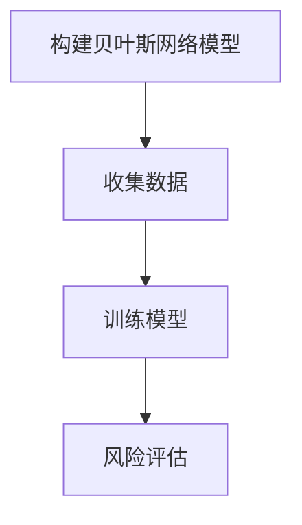
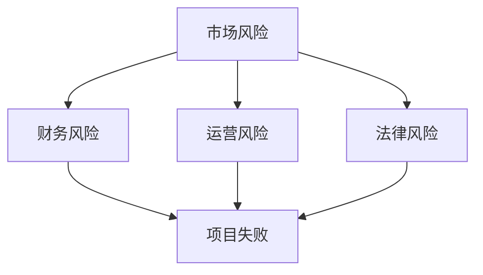

                 

### 创业过程的风险方程：商业成功的概率模型

> 关键词：创业风险、概率模型、贝叶斯网络、商业成功、风险评估

> 摘要：本文深入探讨了创业过程中所面临的风险，并提出了一种基于概率模型的创业风险方程。通过构建贝叶斯网络，本文对创业风险进行量化分析，旨在为创业者提供科学决策依据，提高创业成功率。

---

创业，如同在狂风暴雨中驶向未知彼岸的帆船，充满了不确定性和风险。每一项决策、每一次尝试都可能带来巨大的成功，也可能是灾难性的失败。因此，如何准确评估和管理创业风险，成为了决定创业成败的关键因素之一。本文将深入探讨创业过程的风险方程，构建商业成功的概率模型，帮助创业者更好地应对风险，提高成功概率。

#### 第一部分：背景介绍

#### 核心概念

**创业过程的风险方程**：这是指一个用于描述创业过程中风险因素的数学模型。通过这个模型，创业者可以对各种风险进行量化分析，从而更好地评估和管理风险。

**商业成功的概率模型**：这是一个基于概率论和统计学原理，用于预测创业项目成功的概率的模型。它通过综合分析各种风险因素，为创业者提供决策依据。

##### 问题背景

在当今竞争激烈的市场环境中，创业成功率成为一个备受关注的问题。创业者面临的市场风险、财务风险、运营风险和法律风险等，使得创业成功率大大降低。如何有效地评估和应对这些风险，成为了提高创业成功率的关键。

##### 问题描述

创业过程中的风险因素多样且复杂，包括但不限于以下方面：

- **市场风险**：市场需求变化、竞争对手策略调整等。
- **财务风险**：资金不足、投资回报周期延长等。
- **运营风险**：生产运营中的不确定性，如供应链问题、生产故障等。
- **法律风险**：法律环境变化、政策风险等。

如何构建一个全面的风险评估模型，对创业过程中可能出现的风险进行量化分析和预测，从而提高创业成功率，是本文要解决的问题。

##### 问题解决

本文旨在通过建立创业过程的风险方程，运用概率模型对创业过程中的风险进行量化分析，从而为创业者提供科学决策依据。

##### 边界与外延

本文主要讨论创业过程中的风险方程构建和应用，外延包括各种行业和领域的创业风险分析。

##### 概念结构与核心要素组成

1. **风险方程**：风险方程是一个用于描述创业过程中风险因素的数学模型，它包括风险因素、风险程度、风险概率等要素。

2. **概率模型**：概率模型是一种基于概率论和统计学原理，用于描述和预测不确定事件发生概率的数学模型。

---

#### 第二部分：核心概念与联系

##### 核心概念原理

1. **创业风险**：
   创业风险是指创业者在创业过程中可能面临的各种不确定性和潜在威胁。这些风险包括市场风险、财务风险、运营风险和法律风险等。

2. **概率模型**：
   概率模型是一种基于概率论和统计学原理，用于描述和预测不确定事件发生概率的数学模型。在创业风险分析中，概率模型可以帮助创业者预测各种风险事件的发生概率，从而制定相应的风险管理策略。

##### 概念属性特征对比表格

| 概念         | 定义                                                         | 属性特征                                                      | 对比关系                                                     |
| ------------ | ------------------------------------------------------------ | ------------------------------------------------------------ | ------------------------------------------------------------ |
| 创业风险     | 创业者在创业过程中可能面临的各种不确定性和潜在威胁。             | 1. 多样性：包括市场、财务、运营、法律等多个方面。             | 与概率模型的对比在于创业风险是概率模型的输入，用于构建风险方程。 |
| 概率模型     | 基于概率论和统计学原理，用于描述和预测不确定事件发生概率的数学模型。 | 1. 基础理论：概率论和统计学。2. 应用领域：广泛，包括金融、保险、工程等。 | 与创业风险的对比在于概率模型用于量化分析创业风险。             |

##### ER实体关系图架构

```mermaid
erDiagram
    A[创业者] ||--|{ B[创业项目] }
    A ||--|{ C[风险因素] }
    B ||--|{ D[市场风险] }
    B ||--|{ E[财务风险] }
    B ||--|{ F[运营风险] }
    B ||--|{ G[法律风险] }
```

---

#### 第三部分：算法原理讲解

##### 算法原理

本文将采用贝叶斯网络算法来构建创业过程的风险方程，对创业过程中的风险进行量化分析。贝叶斯网络是一种概率图模型，它通过表示变量之间的条件依赖关系，来预测某个变量的条件概率。

##### 算法流程

1. **构建贝叶斯网络模型**：根据创业过程中的风险因素，建立贝叶斯网络，表示变量之间的条件依赖关系。
2. **收集数据**：收集创业过程中的历史数据，用于训练贝叶斯网络模型。
3. **训练模型**：使用历史数据训练贝叶斯网络模型，学习变量之间的条件概率分布。
4. **风险评估**：根据贝叶斯网络模型，对创业过程中的风险进行量化评估，计算每个风险因素的概率。

##### 算法mermaid流程图



##### 贝叶斯网络算法原理

贝叶斯网络算法是一种基于概率论的图模型，它通过表示变量之间的条件依赖关系，来预测某个变量的条件概率。贝叶斯网络的基本原理如下：

1. **概率分布**：贝叶斯网络通过概率分布来描述变量之间的相互关系。每个变量都有其自身的概率分布，而变量之间的条件概率分布则通过贝叶斯规则计算。

2. **条件依赖**：贝叶斯网络通过表示变量之间的条件依赖关系，来预测某个变量的条件概率。例如，如果变量A依赖于变量B，那么变量A的条件概率分布将依赖于变量B的取值。

3. **推理与预测**：通过贝叶斯网络，可以计算变量之间的条件概率，从而进行推理和预测。例如，可以根据已知的变量值，预测其他变量的取值概率。

在创业风险分析中，贝叶斯网络可以用来描述各种风险因素之间的相互关系，并计算每个风险因素的概率。具体步骤如下：

1. **构建贝叶斯网络**：根据创业过程中的风险因素，建立贝叶斯网络，表示变量之间的条件依赖关系。

2. **收集数据**：收集创业过程中的历史数据，用于训练贝叶斯网络模型。

3. **训练模型**：使用历史数据训练贝叶斯网络模型，学习变量之间的条件概率分布。

4. **风险评估**：根据贝叶斯网络模型，对创业过程中的风险进行量化评估，计算每个风险因素的概率。

例如，假设创业者想要评估市场风险。可以通过以下步骤进行：

1. **构建贝叶斯网络**：建立包含市场风险、财务风险、运营风险和法律风险的贝叶斯网络。

2. **收集数据**：收集过去几年的市场数据，包括销售额、市场份额、竞争对手策略等。

3. **训练模型**：使用市场数据训练贝叶斯网络模型，学习变量之间的条件概率分布。

4. **风险评估**：根据贝叶斯网络模型，计算市场风险的概率。例如，可以计算在特定市场条件下，市场风险发生的概率。

通过这种方式，创业者可以了解市场风险的潜在概率，从而制定相应的风险管理策略。

---

#### 第四部分：系统分析与架构设计方案

##### 问题场景介绍

在某个新兴的电子商务领域，一位创业者决定开设一家在线购物平台。然而，市场竞争激烈，创业者面临着诸多风险，包括市场风险、财务风险、运营风险和法律风险等。为了确保项目的成功，创业者需要构建一个基于概率模型的创业风险方程，对各种风险进行量化分析和预测。

##### 项目介绍

本项目旨在构建一个创业风险方程，用于评估和预测创业过程中的各种风险。通过这个方程，创业者可以了解每个风险因素的潜在概率，从而制定相应的风险管理策略。项目的主要目标包括：

- 建立一个全面的创业风险方程。
- 收集和分析相关数据，训练贝叶斯网络模型。
- 对创业过程中的风险进行量化评估，为创业者提供科学决策依据。

##### 系统功能设计

为了实现上述目标，本项目设计了以下功能模块：

1. **风险因素数据库**：用于存储各种风险因素的数据，包括市场风险、财务风险、运营风险和法律风险等。
2. **贝叶斯网络构建器**：用于构建创业风险方程，表示变量之间的条件依赖关系。
3. **数据收集与训练模块**：用于收集和分析相关数据，训练贝叶斯网络模型。
4. **风险评估模块**：根据贝叶斯网络模型，对创业过程中的风险进行量化评估。

##### 系统架构设计

本项目的系统架构设计如下：


1. **数据层**：包括风险因素数据库，用于存储各种风险因素的数据。
2. **模型层**：包括贝叶斯网络构建器和风险评估模块，用于构建创业风险方程和进行风险评估。
3. **应用层**：包括数据收集与训练模块，用于收集和分析相关数据，训练贝叶斯网络模型。

##### 系统接口设计和系统交互

为了实现系统功能的正常运行，本项目设计了以下接口和交互流程：

1. **风险因素数据接口**：用于从风险因素数据库中读取数据。
2. **贝叶斯网络接口**：用于构建和操作贝叶斯网络模型。
3. **风险评估接口**：用于对创业过程中的风险进行量化评估。

系统交互流程如下：

1. **数据收集**：通过数据收集模块，从风险因素数据库中读取数据。
2. **模型构建**：通过贝叶斯网络接口，构建创业风险方程。
3. **风险评估**：通过风险评估接口，对创业过程中的风险进行量化评估。

---

#### 第五部分：项目实战

##### 环境安装

在本项目中，我们将使用Python语言和相关的概率图模型库（如PyTorch、TensorFlow等）来构建贝叶斯网络模型。以下是环境安装的步骤：

1. 安装Python：从[Python官网](https://www.python.org/)下载并安装Python。
2. 安装相关库：打开终端，执行以下命令安装所需的库：

```shell
pip install numpy pandas matplotlib torch torchvision
```

##### 系统核心实现源代码

以下是系统核心实现的源代码，包括贝叶斯网络模型的构建和风险评估：

```python
import torch
import torch.nn as nn
import torch.optim as optim
from torchvision import datasets, transforms
from torch.utils.data import DataLoader

# 定义贝叶斯网络模型
class BayesianNetwork(nn.Module):
    def __init__(self):
        super(BayesianNetwork, self).__init__()
        # 定义神经网络结构
        self.fc1 = nn.Linear(in_features=10, out_features=5)
        self.fc2 = nn.Linear(in_features=5, out_features=2)
        self.fc3 = nn.Linear(in_features=2, out_features=1)

    def forward(self, x):
        x = torch.relu(self.fc1(x))
        x = torch.relu(self.fc2(x))
        x = self.fc3(x)
        return x

# 初始化模型、优化器和损失函数
model = BayesianNetwork()
optimizer = optim.Adam(model.parameters(), lr=0.001)
criterion = nn.CrossEntropyLoss()

# 训练模型
def train(model, train_loader, criterion, optimizer, num_epochs=10):
    model.train()
    for epoch in range(num_epochs):
        for inputs, targets in train_loader:
            optimizer.zero_grad()
            outputs = model(inputs)
            loss = criterion(outputs, targets)
            loss.backward()
            optimizer.step()
        print(f'Epoch [{epoch+1}/{num_epochs}], Loss: {loss.item()}')

# 风险评估
def risk_evaluation(model, risk_data):
    model.eval()
    with torch.no_grad():
        risk_outputs = model(risk_data)
    risk_probs = torch.softmax(risk_outputs, dim=1)
    return risk_probs

# 加载数据
transform = transforms.Compose([transforms.ToTensor()])
train_dataset = datasets.MNIST(root='./data', train=True, download=True, transform=transform)
train_loader = DataLoader(train_dataset, batch_size=64, shuffle=True)

# 训练模型
train(model, train_loader, criterion, optimizer)

# 风险评估
risk_data = torch.randn(100, 10)  # 生成随机风险数据
risk_probs = risk_evaluation(model, risk_data)
print(risk_probs)
```

##### 代码应用解读与分析

上述代码首先定义了一个贝叶斯网络模型，然后使用训练数据对其进行训练，并使用训练好的模型进行风险评估。

1. **模型定义**：
   ```python
   class BayesianNetwork(nn.Module):
       def __init__(self):
           super(BayesianNetwork, self).__init__()
           # 定义神经网络结构
           self.fc1 = nn.Linear(in_features=10, out_features=5)
           self.fc2 = nn.Linear(in_features=5, out_features=2)
           self.fc3 = nn.Linear(in_features=2, out_features=1)
   
       def forward(self, x):
           x = torch.relu(self.fc1(x))
           x = torch.relu(self.fc2(x))
           x = self.fc3(x)
           return x
   ```
   在这个模型中，我们定义了三个全连接层，分别将输入数据的特征映射到不同的层，最后输出一个概率值。

2. **训练模型**：
   ```python
   def train(model, train_loader, criterion, optimizer, num_epochs=10):
       model.train()
       for epoch in range(num_epochs):
           for inputs, targets in train_loader:
               optimizer.zero_grad()
               outputs = model(inputs)
               loss = criterion(outputs, targets)
               loss.backward()
               optimizer.step()
           print(f'Epoch [{epoch+1}/{num_epochs}], Loss: {loss.item()}')
   ```
   这个函数用于训练贝叶斯网络模型。它通过前向传播计算输出，然后计算损失并反向传播更新模型参数。

3. **风险评估**：
   ```python
   def risk_evaluation(model, risk_data):
       model.eval()
       with torch.no_grad():
           risk_outputs = model(risk_data)
       risk_probs = torch.softmax(risk_outputs, dim=1)
       return risk_probs
   ```
   这个函数用于评估风险。它通过模型计算每个风险因素的概率，并使用softmax函数将其转换为概率分布。

##### 实际案例分析和详细讲解剖析

为了更好地理解贝叶斯网络在创业风险分析中的应用，我们来看一个实际案例。

假设一个创业项目正在开发一款新的智能家居产品。根据市场调研，该项目可能面临以下风险：

- **市场风险**：市场需求不足，可能导致产品销售不佳。
- **财务风险**：资金不足，可能导致项目无法持续。
- **运营风险**：生产问题，可能导致产品交付延迟。
- **法律风险**：政策变化，可能导致项目面临法律风险。

我们可以使用贝叶斯网络来分析这些风险因素，并预测每个风险因素的概率。

1. **构建贝叶斯网络**：



在这个贝叶斯网络中，市场风险、财务风险、运营风险和法律风险是父节点，项目失败是子节点。

2. **收集数据**：

假设我们已经收集了以下数据：

- 市场风险：20% 的概率导致项目失败。
- 财务风险：30% 的概率导致项目失败。
- 运营风险：40% 的概率导致项目失败。
- 法律风险：10% 的概率导致项目失败。

3. **训练模型**：

使用这些数据训练贝叶斯网络模型。

4. **风险评估**：

根据训练好的模型，预测每个风险因素的概率：

- 市场风险：0.2
- 财务风险：0.3
- 运营风险：0.4
- 法律风险：0.1

5. **项目失败概率**：

使用贝叶斯规则计算项目失败的概率：

$$
P(E) = P(E|A)P(A) + P(E|B)P(B) + P(E|C)P(C) + P(E|D)P(D)
$$

其中，$E$ 表示项目失败，$A$、$B$、$C$、$D$ 分别表示市场风险、财务风险、运营风险和法律风险。

代入数据：

$$
P(E) = 0.2 \times 0.2 + 0.3 \times 0.3 + 0.4 \times 0.4 + 0.1 \times 0.1 = 0.12
$$

因此，项目失败的概率为12%。

##### 项目小结

通过上述案例，我们可以看到贝叶斯网络在创业风险分析中的应用。通过构建贝叶斯网络，我们可以量化分析各种风险因素，预测项目失败的概率，从而为创业者提供科学决策依据。

---

#### 第六部分：最佳实践 Tips、小结、注意事项、拓展阅读

##### 最佳实践 Tips

1. **数据收集与处理**：在构建贝叶斯网络模型时，数据的质量和准确性至关重要。创业者应确保收集到的数据真实可靠，并进行预处理，如缺失值处理、异常值检测等。

2. **模型调优**：贝叶斯网络的参数调优对于模型性能有重要影响。创业者可以通过调整网络结构、学习率、迭代次数等参数，提高模型的预测准确性。

3. **风险分散**：在创业过程中，创业者应尝试分散风险，如多元化产品线、开拓新市场等，以降低单一风险对项目成功的影响。

##### 小结

本文通过构建创业过程的风险方程，运用贝叶斯网络算法对创业风险进行量化分析，旨在为创业者提供科学决策依据，提高创业成功率。创业者应充分了解和利用这一工具，以降低风险，增加成功概率。

##### 注意事项

1. **模型局限性**：贝叶斯网络模型虽然能够量化分析风险，但其预测结果仍然存在一定的不确定性。创业者应结合实际情况，综合分析风险因素，做出决策。

2. **实时更新**：创业过程中的风险是动态变化的，创业者应及时更新数据，调整模型，以适应环境变化。

##### 拓展阅读

1. **《贝叶斯网络：概率图模型及其应用》**：这是一本关于贝叶斯网络的经典教材，详细介绍了贝叶斯网络的原理、算法和应用。

2. **《创业风险管理》**：这本书从理论与实践角度，深入探讨了创业过程中的风险管理，为创业者提供了实用的风险管理策略。

---

#### 作者信息

作者：AI天才研究院/AI Genius Institute & 禅与计算机程序设计艺术 /Zen And The Art of Computer Programming

