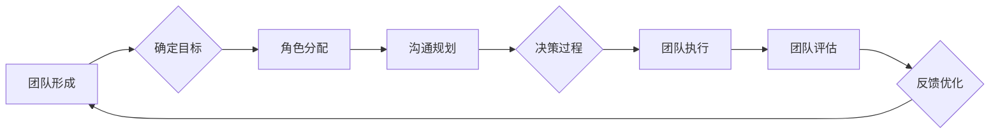
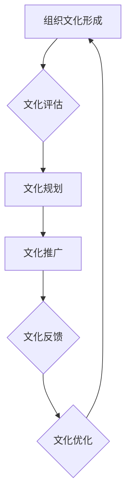
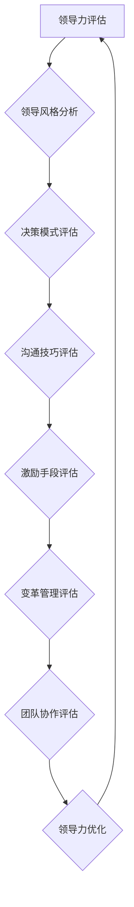
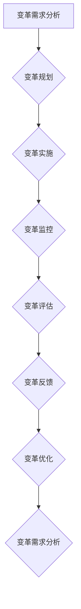
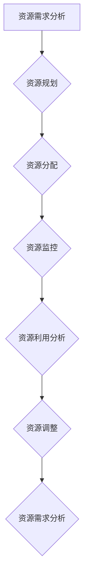

                 

### 第一部分：引言

在当今快速发展的信息技术时代，创新已经成为企业持续竞争和成功的关键因素。创新型组织结构作为促进企业内部创新的重要工具，受到了越来越多企业的关注和采纳。本文旨在探讨创新型组织结构的设计理念，分析其在团队动力、组织文化、领导力和变革管理等方面的作用，并借助实际案例进行深入剖析。

首先，我们需要明确什么是创新型组织结构。创新型组织结构并非传统层级式的金字塔结构，而是更加灵活、模块化、自主性强的组织形式。其核心在于打破传统的垂直指挥链，鼓励扁平化管理，激发员工创造力和创新意识。创新型组织结构通常采用团队协作、自主管理、跨部门合作等方式，使整个组织更具适应性和创新能力。

本文将分为以下几个部分进行讨论：

1. **创新型组织结构概述**：介绍创新型组织结构的基本概念、特点及其在当前企业环境中的重要性。
2. **创新型组织结构与团队动力**：分析团队动力在创新型组织结构中的关键作用，以及如何通过组织结构设计来提升团队动力。
3. **创新型组织结构与组织文化**：探讨组织文化对创新型组织结构的影响，以及如何打造支持创新的组织文化。
4. **创新型组织结构与领导力**：讨论领导力在创新型组织中的角色，以及领导者如何通过组织结构设计来激发员工的创新潜能。
5. **创新型组织结构与变革管理**：分析变革管理在创新型组织结构中的必要性，以及如何进行有效的变革管理。
6. **创新型组织结构与资源管理**：探讨资源管理在创新型组织结构中的关键作用，以及如何优化资源配置来促进创新。
7. **创新型组织结构与案例分析**：通过具体案例，展示创新型组织结构在实际应用中的效果和挑战。

通过本文的讨论，我们将深入理解创新型组织结构的设计理念，并为企业在实践中提供有价值的参考和指导。

### 第二部分：创新型组织结构概述

#### 1.1 问题背景

在传统企业中，层级分明、流程严格的组织结构曾经是确保企业稳定运作的关键。然而，随着市场竞争的加剧和技术的飞速发展，这种传统的组织结构逐渐暴露出其局限性。首先，传统的层级式组织结构往往导致信息传递的滞后和效率低下，员工之间的沟通和协作难度大。其次，由于权力集中在高层管理者手中，基层员工缺乏自主决策和创新的自由度，导致员工的积极性和创造力受到压制。此外，随着企业规模的扩大和业务范围的拓展，传统的组织结构难以适应快速变化的市场环境，企业的适应性和灵活性受到限制。

为了解决这些问题，企业需要寻找一种能够促进信息快速传递、增强员工自主性和创新能力的组织结构。创新型组织结构正是基于这一需求而提出的。创新型组织结构强调打破传统的层级壁垒，采用更加灵活、扁平化的管理模式，使企业能够更好地适应外部环境的变化，激发员工的创新潜力，提高整体竞争力。

#### 1.2 问题描述

传统的组织结构之所以存在上述问题，主要原因在于以下几个方面：

1. **信息传递滞后**：在传统的层级式组织结构中，信息从顶层管理者传递到底层员工需要经过多个中间层级，导致信息传递的滞后。这种滞后不仅影响了决策效率，也限制了员工对于市场变化的快速响应能力。
   
2. **创新动力不足**：传统的组织结构往往导致权力集中在少数高层管理者手中，基层员工缺乏决策权和自主性，无法充分发挥其创新潜力。这种环境下，员工的积极性和创造力往往受到压制，难以产生创新性思维和解决方案。

3. **适应性差**：在快速变化的市场环境中，传统的组织结构由于其固有的刚性特征，难以迅速适应外部环境的变化。企业往往需要较长时间才能调整组织结构以应对市场变化，导致企业在竞争中处于劣势。

#### 1.3 问题解决

为了解决上述问题，创新型组织结构提出了一系列创新性的设计理念，主要包括：

1. **扁平化管理**：通过减少管理层级，缩短信息传递路径，提高决策效率，增强企业对市场变化的响应速度。

2. **团队协作**：鼓励跨部门、跨团队的协作，打破部门壁垒，促进信息和资源共享，激发员工的创新思维。

3. **自主管理**：赋予基层员工更多的决策权和自主性，鼓励他们探索新的思路和解决方案，提高整体创新能力和竞争力。

4. **灵活的组织形式**：采用灵活多样的组织形式，如矩阵式组织、网络式组织等，使企业能够根据不同业务需求和环境变化快速调整组织结构。

通过这些设计理念，创新型组织结构能够有效克服传统组织结构的局限性，提升企业的信息传递效率、创新动力和适应性，从而在激烈的市场竞争中占据优势。

#### 1.4 边界与外延

创新型组织结构的边界与外延主要涉及以下几个方面：

1. **边界**：
   - **功能边界**：创新型组织结构在功能上通常采用模块化和团队化的方式，各部门或团队在特定领域内具有明确的职能和责任，但相互之间可以灵活协作，形成跨功能的创新网络。
   - **层级边界**：创新型组织结构通过减少中间管理层级，缩短决策路径，使决策权更加接近业务前线，提高了决策的及时性和有效性。
   - **地域边界**：在全球化背景下，创新型组织结构强调跨地域的协同合作，通过信息技术和沟通工具打破地域限制，实现全球资源的共享和优化配置。

2. **外延**：
   - **业务外延**：创新型组织结构鼓励企业拓展新的业务领域和商业模式，通过快速响应市场变化和客户需求，实现业务的持续增长。
   - **创新外延**：企业通过打造开放的创新生态，与外部合作伙伴、客户和行业专家紧密合作，共同推进技术创新和产品开发。
   - **文化外延**：创新型组织结构注重构建支持创新的企业文化，通过倡导开放、包容、协作的氛围，激发员工的创新精神和团队协作意识。

综上所述，创新型组织结构的边界与外延不仅在于其组织形式和结构设计，更在于其对于业务创新、文化建设和外部合作的深刻影响，使得企业在快速变化的市场环境中保持持续竞争力。

#### 1.5 概念结构与核心要素组成

创新型组织结构的概念建立在现代管理理论和组织行为学的基础上，通过系统化的设计理念和实际操作，旨在激发员工的创新潜力，提升组织整体的适应性和竞争力。以下是创新型组织结构的核心概念和组成要素：

1. **核心概念**：

   - **扁平化管理**：通过减少管理层级，缩短信息传递路径，提高决策效率，使组织更加敏捷和灵活。
   - **团队协作**：鼓励跨部门、跨团队的协作，促进信息和资源共享，激发团队的创造力和协作精神。
   - **自主管理**：赋予员工更多的自主权和决策权，鼓励他们探索新的思路和解决方案，提高整体创新能力和工作效率。
   - **模块化组织**：将组织划分为多个功能模块，每个模块在特定领域内具有明确的职责和自主性，模块之间通过协作实现整体目标。
   - **开放文化**：营造开放、包容、协作的组织文化，鼓励员工分享观点、提出建议，推动创新思维的发展。

2. **核心要素组成**：

   - **组织架构**：创新型组织结构通常采用扁平化的架构，减少中间管理层级，使决策权更加接近业务前线。此外，矩阵式组织结构也被广泛应用，以促进跨部门协作和资源整合。
   - **团队建设**：通过明确团队目标和角色分工，建立高效的团队协作机制，激发团队成员的积极性和创造力。团队建设还包括定期的培训和团队建设活动，以提高团队凝聚力和协作效率。
   - **领导力**：领导者需要在创新型组织结构中扮演关键角色，通过激励员工、提供资源和支持，推动创新项目的实施和成功。此外，领导者还需要具备跨部门的沟通协调能力，促进组织内部的协作。
   - **企业文化**：创新型组织文化强调开放、包容和协作，鼓励员工勇于尝试、接受失败，并在失败中学习成长。企业文化还包括对创新成果的认可和奖励机制，以激励员工持续创新。
   - **资源配置**：在创新型组织结构中，资源配置需要灵活且高效，确保各个创新项目能够获得足够的资源支持。这包括资金、人力、技术和信息等资源的合理配置和优化。

通过上述核心概念和要素的有机组合，创新型组织结构能够有效激发员工的创新潜能，提升组织整体的适应性和竞争力，从而在快速变化的市场环境中保持持续竞争优势。

### 创新型组织结构与团队动力

#### 2.1 核心概念与联系

**2.1.1 团队动力的概念**

团队动力（Team Dynamics）是指团队在形成、发展、运作和结束过程中所经历的各种行为和互动模式。它包括团队成员之间的关系、沟通方式、角色分配、决策过程以及团队氛围等多个方面。团队动力直接影响团队的工作效率和创新能力，是组织结构设计中的一个重要考虑因素。

**2.1.2 团队动力的属性特征对比表格**

| 属性特征       | 传统团队动力 | 创新型团队动力 |
|----------------|--------------|----------------|
| 管理模式       | 命令式       | 自主式         |
| 沟通方式       | 单向式       | 对话式         |
| 成员角色       | 明确分工     | 多元角色       |
| 决策过程       | 顶层决策     | 分层决策       |
| 团队氛围       | 紧张         | 开放、包容     |
| 创新思维       | 保守         | 鼓励创新       |

**2.1.3 团队动力与组织结构的关系**

团队动力与组织结构之间存在着密切的关系。组织结构的设计直接影响到团队动力的形成和发展。创新型组织结构通过以下方式促进团队动力：

1. **扁平化组织结构**：减少管理层级，缩短决策路径，提高团队响应速度，增强团队自主性和灵活性。
2. **跨部门协作**：打破部门壁垒，促进跨团队的信息共享和资源整合，激发团队的协作和创新。
3. **自主管理**：赋予团队更多的决策权和自主权，鼓励团队成员积极探索和尝试，提高团队的创新动力。
4. **模块化组织**：将组织划分为多个功能模块，每个模块在特定领域内具有明确的职责和自主性，模块之间通过协作实现整体目标。

#### 2.2 算法原理讲解

**2.2.1 团队动力算法的Mermaid流程图**



**2.2.2 团队动力算法的Python源代码**

```python
class TeamDynamics:
    def __init__(self, team_members):
        self.team_members = team_members
        self.team_goals = None
        self.role_assignment = {}
        self.communication_plan = {}
        self.decision_process = "top-down"
        self.team_performance = None
    
    def set_goals(self, goals):
        self.team_goals = goals
    
    def assign_roles(self, roles):
        for member, role in roles.items():
            self.role_assignment[member] = role
    
    def plan_communication(self, plan):
        self.communication_plan = plan
    
    def make_decision(self, decision):
        self.decision_process = decision
    
    def execute_team_work(self):
        # Execution logic here
        self.team_performance = "success"
    
    def evaluate_performance(self):
        # Evaluation logic here
        if self.team_performance == "success":
            self.feedback = "good job"
        else:
            self.feedback = "needs improvement"
    
    def optimize_performance(self):
        # Optimization logic here
        self.team_performance = "improved"
        self.evaluate_performance()

# Example usage
team = TeamDynamics(["Alice", "Bob", "Charlie"])
team.set_goals("achieve X in Y days")
team.assign_roles({"Alice": "project manager", "Bob": "developer", "Charlie": "QA"})
team.plan_communication("daily stand-up meetings")
team.make_decision("team-based decision making")
team.execute_team_work()
print(team.feedback)
team.optimize_performance()
print(team.feedback)
```

**2.2.3 团队动力算法的数学模型和公式**

为了更深入地理解团队动力算法，我们可以引入一些数学模型和公式来量化团队动力。以下是一些基本的数学模型和公式：

- **凝聚力公式**：\(C = \frac{1}{n} \sum_{i=1}^{n} \frac{1}{d(i)}\)
  - 其中，\(C\) 表示团队凝聚力，\(n\) 表示团队成员总数，\(d(i)\) 表示成员 \(i\) 与其他成员之间的沟通距离。
- **创新力公式**：\(I = \frac{1}{n} \sum_{i=1}^{n} \frac{f(i)}{g(i)}\)
  - 其中，\(I\) 表示团队创新力，\(f(i)\) 表示成员 \(i\) 的创新能力，\(g(i)\) 表示成员 \(i\) 所受的限制或约束。
- **绩效评估公式**：\(P = \frac{E \times G \times C}{I}\)
  - 其中，\(P\) 表示团队绩效，\(E\) 表示团队成员的努力程度，\(G\) 表示团队成员的技能水平，\(C\) 表示团队凝聚力，\(I\) 表示团队创新力。

通过这些数学模型和公式，我们可以更科学地评估团队动力，从而优化团队结构和运作流程。

**2.2.4 团队动力算法的详细讲解与举例说明**

团队动力算法的核心在于通过一系列步骤来优化团队协作和创新，以下是详细的讲解和举例说明：

1. **团队形成**：团队的形成是团队动力的起点。在这一步骤中，需要明确团队的目标，并确定团队成员的职责和角色。例如，一个开发团队的目标可能是在一个季度内完成一个新产品的开发，团队成员包括项目经理、开发者、测试工程师等。
   
2. **确定目标**：团队的目标应该具体、可衡量，并具备挑战性。目标确定后，需要将目标分解为具体的任务和里程碑，以确保团队成员能够清晰地了解自己的工作职责和进度要求。例如，开发团队可以将目标分解为需求分析、设计、编码、测试和上线等阶段性任务。

3. **角色分配**：在团队形成和目标确定之后，需要为每个成员分配明确的角色和职责。这有助于确保团队成员各司其职，避免职责重叠和冲突。例如，项目经理负责协调和监督整个项目的进展，开发者负责编写代码，测试工程师负责测试和验证软件质量。

4. **沟通规划**：有效的沟通是团队动力的关键。团队需要制定一套沟通计划，包括定期会议、信息共享平台和沟通规范等。例如，团队可以每周举行一次站立会议，讨论项目进展和遇到的问题，并使用项目管理工具进行任务跟踪和文档共享。

5. **决策过程**：在创新型组织结构中，决策过程应该是团队协作的。团队需要通过集体讨论和投票等方式来做出决策，以确保每个成员的意见和想法都能够被充分考虑。例如，团队可以通过头脑风暴会议来收集和讨论不同的解决方案，并投票选择最佳方案。

6. **团队执行**：团队执行是指团队成员按照既定的目标和计划进行工作。在这一过程中，团队成员需要保持高度的协作和自主性，确保项目能够按计划完成。例如，开发者需要按时提交代码，测试工程师需要及时进行测试和反馈。

7. **团队评估**：在项目结束后，团队需要对项目的成果和过程进行评估。评估的目的是找出团队在协作和创新方面的优点和不足，并为未来的项目提供改进建议。例如，团队可以通过项目回顾会议来讨论项目中的成功经验和失败教训，并提出改进措施。

8. **反馈优化**：基于评估结果，团队需要不断优化自己的工作方式和流程。这包括改进沟通方式、优化角色分配、调整决策过程等。例如，团队可以基于项目回顾会议的讨论结果，调整项目管理工具和沟通渠道，以提高团队协作效率。

通过上述步骤，团队动力算法能够帮助团队在创新型组织结构中实现高效的协作和创新。以下是一个具体的案例说明：

**案例：一个创新型软件开发团队的运作**

假设一个软件开发团队的目标是开发一款新的移动应用。为了实现这一目标，团队采取了以下步骤：

1. **团队形成**：团队成员包括项目经理、前端开发者、后端开发者、测试工程师和UI/UX设计师。
2. **确定目标**：团队的目标是开发一个具有优秀用户体验和高效性能的移动应用，并在三个月内完成。
3. **角色分配**：项目经理负责整体项目的协调和监督，前端开发者负责实现应用的界面和交互功能，后端开发者负责实现应用的逻辑和数据存储，测试工程师负责测试和验证软件质量，UI/UX设计师负责设计应用的界面和用户体验。
4. **沟通规划**：团队每周举行一次站立会议，讨论项目进展和遇到的问题，并使用Trello进行任务跟踪和文档共享。
5. **决策过程**：团队采用头脑风暴会议来收集和讨论不同的解决方案，并通过投票选择最佳方案。
6. **团队执行**：团队成员按照既定的任务和计划进行工作，确保项目能够按时完成。
7. **团队评估**：项目完成后，团队进行项目回顾会议，讨论项目的成功经验和失败教训，并提出改进措施。
8. **反馈优化**：团队基于项目回顾会议的讨论结果，优化项目管理工具和沟通渠道，以提高团队协作效率。

通过上述步骤，团队实现了高效的协作和创新，成功开发出了一款具有市场竞争力的移动应用。

#### 2.3 团队动力与组织结构的案例分析

**2.3.1 案例背景**

以某知名互联网公司的创新团队为例，该公司致力于通过技术创新提升用户体验，提高产品竞争力。为了实现这一目标，公司采用了创新型组织结构，并在团队动力方面进行了深入探索和实践。

**2.3.2 案例分析**

1. **组织结构设计**：公司采用了扁平化的组织结构，减少了中间管理层级，使团队成员能够更加直接地与高层管理者沟通和协作。团队由不同背景的专业人员组成，包括软件开发、用户体验设计、数据分析和市场营销等。

2. **团队目标设定**：团队的目标是开发一款具有创新性和高用户体验的移动应用。为了确保目标的实现，团队将目标分解为多个阶段性任务，包括市场调研、需求分析、设计、开发、测试和上线等。

3. **角色分配**：团队成员根据各自的专业技能和兴趣分配到不同的任务中，例如，项目经理负责整体项目的协调和监督，用户体验设计师负责设计应用的界面和交互功能，数据分析师负责分析用户行为数据，以提高应用的性能和用户体验。

4. **沟通和协作**：团队通过定期的站立会议和在线协作工具（如Slack、Trello）进行沟通和协作。站立会议帮助团队快速解决遇到的问题，确保项目进展顺利。在线协作工具则帮助团队成员随时获取项目信息和更新，提高协作效率。

5. **决策过程**：团队采用头脑风暴会议来收集和讨论不同的解决方案，并通过投票选择最佳方案。这种方式确保每个成员的意见和想法都能够被充分考虑，提高决策的科学性和民主性。

6. **团队评估**：项目完成后，团队进行项目回顾会议，讨论项目的成功经验和失败教训，并提出改进措施。项目回顾帮助团队总结经验教训，为未来项目的成功奠定基础。

7. **反馈和优化**：基于项目回顾会议的讨论结果，团队对项目管理工具和沟通渠道进行了优化。例如，引入了新的项目管理工具，以更好地跟踪任务和项目进展；优化了沟通渠道，确保信息能够更快速、准确地传递。

**2.3.3 案例小结**

通过采用创新型组织结构和团队动力管理方法，该互联网公司的创新团队成功开发出了一款具有高用户体验和市场竞争力的移动应用。案例表明，创新型组织结构能够有效激发团队动力，提高团队协作效率和创新水平。同时，团队动力管理方法的成功实施也为其他企业提供了有益的借鉴和启示。

### 创新型组织结构与组织文化

#### 3.1 核心概念与联系

**3.1.1 组织文化的概念**

组织文化（Organizational Culture）是指一个组织在长期发展和运营过程中形成的共同价值观、信仰、行为规范和工作方式。组织文化不仅影响员工的思维方式和行为模式，还对组织的整体表现和竞争力产生深远影响。组织文化包括多个方面，如价值观、使命、愿景、目标、工作氛围和员工关系等。

**3.1.2 组织文化的属性特征对比表格**

| 属性特征       | 传统组织文化 | 创新型组织文化 |
|----------------|---------------|----------------|
| 价值观         | 稳定、保守     | 创新、开放       |
| 使命与愿景     | 长期稳定发展   | 快速适应变化     |
| 目标设定       | 明确、具体     | 挑战性、可调整   |
| 工作氛围       | 严谨、正式     | 开放、轻松       |
| 员工关系       | 命令与服从     | 合作、信任       |
| 适应变化能力   | 较差          | 强大           |

**3.1.3 组织文化与创新型组织结构的关系**

组织文化与创新型组织结构之间存在着密切的联系。创新型组织结构需要一定的组织文化来支撑，而组织文化也通过影响员工的行为和思维模式来促进或阻碍创新型组织结构的效果。

1. **支持创新的文化**：创新型组织结构强调灵活性、自主性和快速响应市场变化。这种结构需要一种支持创新的组织文化，如开放、包容、鼓励试错和持续学习的文化。这种文化能够激发员工的创新潜力，促进跨部门的协作和知识共享。

2. **降低变革阻力**：在传统组织文化中，员工可能更加倾向于遵循既定规则和流程，对于变革持保守态度。而创新型组织结构需要打破这些壁垒，实现组织内部的变革。因此，一个开放、包容、支持变革的组织文化能够降低变革的阻力，提高员工对变革的接受度和适应性。

3. **增强团队凝聚力**：创新型组织结构通常采用团队协作和自主管理的模式。这种结构需要一种鼓励团队合作和信任的组织文化。一个积极、互助、尊重差异的文化能够增强团队的凝聚力，提高团队协作效率和创新水平。

4. **提升员工满意度**：创新型组织文化通常更加关注员工的成长和发展，提供更多的自主权和决策权。这种文化能够提升员工的满意度和忠诚度，减少员工流失率，从而为组织创造持续的价值。

#### 3.2 算法原理讲解

**3.2.1 组织文化算法的Mermaid流程图**



**3.2.2 组织文化算法的Python源代码**

```python
class OrganizationalCulture:
    def __init__(self, organization):
        self.organization = organization
        self.culture_assessment = None
        self.culture_plan = None
        self.culture_feedback = None
    
    def assess_culture(self, assessment):
        self.culture_assessment = assessment
    
    def plan_culture(self, plan):
        self.culture_plan = plan
    
    def promote_culture(self, promotion):
        # Promotion logic here
        self.culture_feedback = "success"
    
    def gather_feedback(self, feedback):
        self.culture_feedback = feedback
    
    def optimize_culture(self):
        # Optimization logic here
        self.culture_plan = "optimized"
        self.gather_feedback("improved")

# Example usage
org = OrganizationalCulture("Tech Innovate Co.")
org.assess_culture("culture assessment report")
org.plan_culture("innovation-driven culture plan")
org.promote_culture("innovation workshops and communication channels")
org.gather_feedback("employee satisfaction survey")
print(org.culture_feedback)
org.optimize_culture()
print(org.culture_feedback)
```

**3.2.3 组织文化算法的数学模型和公式**

为了更深入地理解组织文化算法，我们可以引入一些数学模型和公式来量化组织文化的关键要素。以下是一些基本的数学模型和公式：

- **文化满意度公式**：\(S = \frac{1}{n} \sum_{i=1}^{n} (S_i \times W_i)\)
  - 其中，\(S\) 表示整体文化满意度，\(n\) 表示员工总数，\(S_i\) 表示第 \(i\) 个员工的满意度评分，\(W_i\) 表示第 \(i\) 个员工的工作权重。
- **创新动力公式**：\(I = \frac{C \times A \times D}{R}\)
  - 其中，\(I\) 表示创新动力，\(C\) 表示文化开放性，\(A\) 表示员工自主性，\(D\) 表示团队协作度，\(R\) 表示资源限制。
- **变革接受度公式**：\(R = \frac{C \times E \times T}{B}\)
  - 其中，\(R\) 表示变革接受度，\(C\) 表示文化支持度，\(E\) 表示员工期望，\(T\) 表示培训效果，\(B\) 表示变革阻力。

通过这些数学模型和公式，我们可以更科学地评估组织文化的关键要素，从而制定出更加有效的组织文化策略。

**3.2.4 组织文化算法的详细讲解与举例说明**

组织文化算法的核心在于通过一系列步骤来构建和优化组织文化，以下是详细的讲解和举例说明：

1. **组织文化形成**：组织文化的形成是组织发展的基础。在这一步骤中，需要明确组织的价值观、使命和愿景，并建立一套符合组织特点和目标的行为规范。例如，一个科技公司可能将“创新、协作、用户至上”作为其核心价值观。

2. **文化评估**：在组织文化形成后，需要对文化进行定期评估，以了解文化现状和员工满意度。文化评估可以通过员工调查、访谈和反馈等方式进行。例如，公司可以通过员工满意度调查来了解员工对组织文化的看法和意见。

3. **文化规划**：根据文化评估的结果，制定组织文化规划，明确改进目标和实施策略。文化规划应该包括具体的行动方案和时间表，以确保组织文化的持续优化。例如，公司可以制定一系列文化活动，如创新工作坊、团队建设活动等，以促进组织文化的建设。

4. **文化推广**：通过多种渠道和方式，将组织文化推广到全体员工。推广方式可以包括内部培训、宣传材料、企业文化建设会议等。例如，公司可以通过定期举办内部培训课程，让员工了解和认同组织文化，并通过宣传材料将组织文化理念传达给所有员工。

5. **文化反馈**：在文化推广过程中，需要收集员工的反馈和建议，以了解文化推广的效果和改进方向。文化反馈可以通过员工反馈表、意见箱、在线调查等方式进行。例如，公司可以在内部网站上设置反馈专栏，让员工自由发表意见和建议。

6. **文化优化**：根据文化反馈，对组织文化进行持续优化。优化过程应包括对文化策略的调整、对文化活动的改进以及对员工行为的引导。例如，公司可以根据员工反馈，调整文化活动的内容和形式，以提高员工的参与度和满意度。

7. **文化评估与持续改进**：组织文化不是一成不变的，而是需要不断评估和优化。通过定期进行文化评估，公司可以了解文化现状，发现潜在问题，并采取相应的措施进行改进。例如，公司可以每年进行一次全面的文化评估，以确定文化建设的重点和方向。

**案例：某科技公司的组织文化建设**

假设某科技公司致力于打造一个创新、协作和用户至上的组织文化。为了实现这一目标，公司采取了以下步骤：

1. **组织文化形成**：公司明确了“创新、协作、用户至上”的核心价值观，并制定了符合公司特点的行为规范。

2. **文化评估**：公司通过员工满意度调查和访谈，了解了员工对组织文化的看法和意见。调查结果显示，员工对公司的创新氛围和用户至上理念较为认可，但在协作方面还有待提高。

3. **文化规划**：基于评估结果，公司制定了详细的组织文化规划，包括定期举办创新工作坊、团队建设活动和用户调研活动等，以促进组织文化的建设。

4. **文化推广**：公司通过内部培训、宣传材料和文化建设会议等多种渠道，将组织文化理念传达给全体员工。同时，公司鼓励员工积极参与文化活动，并提出意见和建议。

5. **文化反馈**：公司设立了员工反馈专栏，让员工自由发表意见和建议。通过反馈，公司了解到员工对创新工作坊的参与度较高，但对团队建设活动的形式和内容还有改进空间。

6. **文化优化**：公司根据员工反馈，调整了团队建设活动的内容和形式，增加了互动环节，以提高员工的参与度和满意度。

7. **文化评估与持续改进**：公司每年进行一次全面的文化评估，以了解文化现状和改进方向。通过持续优化，公司不断强化组织文化的建设，提高了员工对文化的认同度和满意度。

通过上述步骤，某科技公司成功构建了一个创新、协作和用户至上的组织文化，为公司的发展和员工的成长提供了有力的支持。

### 组织文化与创新型组织结构的案例分析

**3.3.1 案例背景**

以某全球知名科技公司为例，该公司在组织文化和创新型组织结构的结合方面有着独特的实践和成果。这家公司致力于通过创新技术改变世界，其组织文化和组织结构设计在业界广受赞誉。

**3.3.2 案例分析**

1. **组织文化设计**：
   - **价值观**：公司确立了“创新、协作、用户至上”的核心价值观，并将其贯穿于公司运营的各个方面。
   - **使命与愿景**：公司的使命是“通过技术创新，提高人类生活品质”，愿景是“成为全球最具创新力和影响力的科技公司”。
   - **目标设定**：公司的目标设定具有挑战性且灵活可调整，以适应快速变化的市场和技术环境。
   - **工作氛围**：公司营造了一种开放、包容和轻松的工作氛围，鼓励员工自由表达观点，尝试新的想法。

2. **创新型组织结构**：
   - **扁平化管理**：公司采用了扁平化的组织结构，减少了管理层次，使决策更加迅速和灵活。
   - **团队协作**：公司鼓励跨部门的协作，打破部门壁垒，促进信息共享和知识交流。
   - **自主管理**：员工被赋予更多的自主权和决策权，可以自主选择项目和任务，并负责项目的全流程管理。
   - **模块化组织**：公司通过模块化组织方式，将各个项目团队独立运作，确保每个团队能够专注于自己的核心任务。

3. **组织文化与创新型组织结构的结合**：
   - **文化支持**：公司通过一系列文化活动和培训，强化员工对创新和协作的理解和认同。例如，定期举办创新研讨会、跨部门合作项目和用户调研活动，以激发员工的创新思维和团队协作精神。
   - **激励机制**：公司建立了完善的激励机制，对创新成果和优秀团队进行奖励，以鼓励员工持续创新和协作。
   - **变革管理**：公司通过变革管理流程，确保组织结构和文化调整的顺利进行。例如，在引入新的组织结构时，公司通过员工培训和沟通，确保员工理解并接受变革。
   - **员工参与**：公司注重员工参与，鼓励员工提出改进意见和建议，并定期收集和反馈员工意见，以优化组织结构和文化。

**3.3.3 案例小结**

通过结合创新的组织文化和灵活的 组织结构，该公司成功地构建了一个支持创新和高效协作的工作环境。这一实践不仅提升了公司的创新能力，还增强了员工的归属感和工作满意度。具体成果包括：

1. **创新能力提升**：公司的创新项目数量和质量显著增加，多个新产品成功推向市场，提升了公司的竞争力和市场份额。
2. **团队协作增强**：跨部门的协作变得更加顺畅，信息共享和知识交流得到了显著提升，团队协作效率显著提高。
3. **员工满意度提高**：员工对公司文化的认同度增强，工作满意度和忠诚度提升，员工流失率显著下降。
4. **企业文化传播**：公司通过内部培训和外部交流，将创新文化和组织结构的设计理念传播到其他企业，产生了广泛的社会影响。

这一案例表明，结合创新的组织文化和灵活的组织结构，不仅能够促进企业内部创新，还能提升整体竞争力和员工满意度，为企业的长期发展奠定坚实基础。

### 创新型组织结构与领导力

#### 4.1 核心概念与联系

**4.1.1 领导力的概念**

领导力（Leadership）是指领导者通过影响、激励和指导他人来实现组织目标的能力。领导力不仅仅是管理技能的集合，更是一种内在的影响力，能够激发团队成员的潜力，推动团队向更高的目标前进。领导力包括多个方面，如愿景设定、决策能力、沟通技巧、激励员工、变革管理、团队合作等。

**4.1.2 领导力的属性特征对比表格**

| 属性特征       | 传统领导力 | 创新型领导力 |
|----------------|-------------|---------------|
| 领导风格       | 权威型      | 情境型、变革型 |
| 决策模式       | 中心化      | 分权化、参与式 |
| 沟通方式       | 下行式      | 多向式、透明式 |
| 激励手段       | 物质奖励     | 精神激励、内在动机 |
| 变革管理       | 保守、规避     | 积极、推动     |
| 团队协作       | 命令式      | 平衡型、促进型 |

**4.1.3 领导力与创新型组织结构的关系**

领导力在创新型组织结构中扮演着至关重要的角色。创新型组织结构强调灵活性、自主性和快速响应市场变化，这需要领导者在以下几个方面发挥关键作用：

1. **愿景引领**：创新型组织结构需要领导者具有清晰的愿景和远见，能够为团队设定明确的目标和方向。领导者需要通过愿景激励团队成员，使他们对组织的目标充满信心和热情。

2. **决策能力**：在创新型组织结构中，领导者需要具备快速决策和灵活应对变化的能力。由于组织结构更加扁平化，决策路径缩短，领导者需要能够迅速做出正确决策，确保项目顺利推进。

3. **激励员工**：创新型组织结构赋予员工更多的自主权和决策权，这要求领导者能够有效地激励员工，激发他们的创新潜力和工作热情。领导者需要通过建立激励机制，如奖励创新成果、提供职业发展机会等，来鼓励员工的创新行为。

4. **变革管理**：创新型组织结构通常伴随着组织变革，领导者需要具备积极的变革管理能力，能够引导员工接受和适应变革。领导者需要通过沟通、培训和辅导等方式，帮助员工克服变革过程中的阻力和挑战。

5. **团队协作**：在创新型组织结构中，团队合作至关重要。领导者需要通过建立有效的团队协作机制，促进团队成员之间的沟通和合作，确保团队能够高效地实现共同目标。

#### 4.2 算法原理讲解

**4.2.1 领导力算法的Mermaid流程图**



**4.2.2 领导力算法的Python源代码**

```python
class Leadership:
    def __init__(self, leader_profile):
        self.leader_profile = leader_profile
        self.leadership_style = None
        self.decision_mode = None
        self.communication_skill = None
        self.incentive_method = None
        self.change_management = None
        self.team_collaboration = None
    
    def assess_leadership_style(self, style):
        self.leadership_style = style
    
    def assess_decision_mode(self, mode):
        self.decision_mode = mode
    
    def assess_communication_skill(self, skill):
        self.communication_skill = skill
    
    def assess_incentive_method(self, method):
        self.incentive_method = method
    
    def assess_change_management(self, management):
        self.change_management = management
    
    def assess_team_collaboration(self, collaboration):
        self.team_collaboration = collaboration
    
    def optimize_leadership(self):
        # Optimization logic here
        self.leadership_style = "optimized"
        self.decision_mode = "optimized"
        self.communication_skill = "optimized"
        self.incentive_method = "optimized"
        self.change_management = "optimized"
        self.team_collaboration = "optimized"
    
    def get_leadership_profile(self):
        return self.leader_profile

# Example usage
leader = Leadership({"name": "John Doe"})
leader.assess_leadership_style("change-oriented")
leader.assess_decision_mode("decentralized")
leader.assess_communication_skill("transparent")
leader.assess_incentive_method("innovation rewards")
leader.assess_change_management("proactive")
leader.assess_team_collaboration("promoting")
leader.optimize_leadership()
print(leader.get_leadership_profile())
```

**4.2.3 领导力算法的数学模型和公式**

为了更深入地理解领导力算法，我们可以引入一些数学模型和公式来量化领导力的关键要素。以下是一些基本的数学模型和公式：

- **领导效能公式**：\(E = f(LS, DM, CS, IM, CM, TC)\)
  - 其中，\(E\) 表示领导效能，\(LS\) 表示领导风格，\(DM\) 表示决策模式，\(CS\) 表示沟通技巧，\(IM\) 表示激励手段，\(CM\) 表示变革管理，\(TC\) 表示团队协作。
- **员工满意度公式**：\(S = \frac{1}{n} \sum_{i=1}^{n} (S_i \times W_i)\)
  - 其中，\(S\) 表示员工满意度，\(n\) 表示员工总数，\(S_i\) 表示第 \(i\) 个员工的满意度评分，\(W_i\) 表示第 \(i\) 个员工的工作权重。
- **创新激励公式**：\(I = \frac{LS \times DM \times CS \times IM \times CM}{R}\)
  - 其中，\(I\) 表示创新激励，\(LS\) 表示领导风格，\(DM\) 表示决策模式，\(CS\) 表示沟通技巧，\(IM\) 表示激励手段，\(CM\) 表示变革管理，\(R\) 表示资源限制。

通过这些数学模型和公式，我们可以更科学地评估领导力的关键要素，从而制定出更加有效的领导力提升策略。

**4.2.4 领导力算法的详细讲解与举例说明**

领导力算法的核心在于通过一系列步骤来评估和优化领导力，以下是详细的讲解和举例说明：

1. **领导力评估**：领导力评估是领导力优化的第一步。在这一步骤中，需要通过多种方法和工具对领导力进行系统性评估。评估内容包括领导风格、决策模式、沟通技巧、激励手段、变革管理和团队协作等方面。

2. **领导风格分析**：领导风格是领导力的核心要素之一。领导风格分析旨在了解领导者在具体情境中的领导风格，如权威型、民主型、变革型等。通过分析领导风格，可以识别出领导者的优势和不足，为后续的优化提供依据。

3. **决策模式评估**：决策模式是指领导者做出决策的方式和过程。决策模式评估旨在了解领导者在面对不同决策情境时的决策模式，如集中化决策、分权化决策、参与式决策等。通过评估决策模式，可以识别出领导者在决策过程中的问题和改进空间。

4. **沟通技巧评估**：沟通技巧是领导者影响和激励团队成员的重要工具。沟通技巧评估旨在了解领导者在沟通中的表现，如沟通方式、沟通频率、沟通效果等。通过评估沟通技巧，可以识别出领导者在沟通中的不足，并提出改进建议。

5. **激励手段评估**：激励手段是领导者激励员工的重要方式。激励手段评估旨在了解领导者在激励员工方面的表现，如物质激励、精神激励、职业发展等。通过评估激励手段，可以识别出领导者在激励员工方面的不足，并提出改进建议。

6. **变革管理评估**：变革管理是领导者推动组织变革的重要能力。变革管理评估旨在了解领导者在变革过程中的表现，如变革规划、变革执行、变革反馈等。通过评估变革管理，可以识别出领导者在变革管理中的不足，并提出改进建议。

7. **团队协作评估**：团队协作是领导力的重要体现之一。团队协作评估旨在了解领导者在促进团队协作方面的表现，如团队目标设定、团队沟通、团队冲突管理等。通过评估团队协作，可以识别出领导者在团队协作中的不足，并提出改进建议。

8. **领导力优化**：基于领导力评估的结果，制定具体的领导力优化计划。优化计划应包括领导力培训、领导力辅导、领导力改进措施等。通过实施优化计划，可以逐步提升领导力水平，实现组织目标。

**案例：某科技公司的领导力优化**

假设某科技公司希望通过优化领导力来提升组织绩效和创新水平。为了实现这一目标，公司采取了以下步骤：

1. **领导力评估**：公司通过员工调查、领导力测评工具等方式，对现有领导力进行系统性评估。评估结果显示，领导者在决策模式、沟通技巧和创新激励方面存在不足。

2. **领导风格分析**：公司分析了领导者的领导风格，发现领导者的领导风格较为权威，缺乏民主参与和变革意识。针对这一发现，公司决定加强领导者的民主参与和变革管理能力。

3. **决策模式评估**：公司对领导者的决策模式进行了详细评估，发现领导者倾向于集中化决策，缺乏分权化决策和参与式决策。针对这一不足，公司决定引入分权化决策和参与式决策机制，提高决策效率和员工参与度。

4. **沟通技巧评估**：公司对领导者的沟通技巧进行了评估，发现领导者在沟通中较为保守，缺乏透明度和及时性。针对这一不足，公司决定加强领导者的沟通技巧培训，提高沟通效率和效果。

5. **激励手段评估**：公司对领导者在激励员工方面的手段进行了评估，发现领导者主要依赖物质激励，缺乏精神激励和职业发展支持。针对这一不足，公司决定引入多元化的激励手段，如精神激励、职业发展支持等，提高员工的工作满意度和忠诚度。

6. **变革管理评估**：公司对领导者在变革管理方面的能力进行了评估，发现领导者对变革管理缺乏系统性认识，变革执行效果不佳。针对这一不足，公司决定加强领导者的变革管理培训，提高变革管理的系统性和有效性。

7. **领导力优化**：基于评估结果，公司制定了详细的领导力优化计划。优化计划包括领导力培训、领导力辅导、领导力改进措施等。通过实施优化计划，公司逐步提升了领导力水平，提高了组织绩效和创新水平。

通过上述步骤，某科技公司成功地优化了领导力，提高了组织的整体绩效和创新水平，为公司的发展奠定了坚实基础。

### 领导力与创新型组织结构的案例分析

**4.3.1 案例背景**

以某国际知名科技公司为例，该公司在领导力与创新型组织结构的结合方面取得了显著成效。这家公司在全球范围内拥有众多研发团队，致力于通过技术创新推动公司业务发展。公司领导层深刻认识到，领导力在创新型组织结构中的重要性，通过一系列措施来提升领导力，推动组织创新。

**4.3.2 案例分析**

1. **领导力提升**：
   - **领导力培训**：公司每年组织领导力培训，邀请业内知名专家和学者进行授课，提升领导者的领导能力和管理技巧。培训内容包括创新思维、变革管理、团队协作、沟通技巧等。
   - **领导力辅导**：公司为各级领导者提供一对一的辅导，针对其具体问题进行个性化指导。辅导内容包括领导风格调整、决策模式优化、激励手段改进等。
   - **领导力评估**：公司定期对领导者进行领导力评估，通过员工反馈、业绩考核等方式，了解领导者在领导力各方面的表现，识别提升空间。

2. **创新型组织结构**：
   - **扁平化管理**：公司采用扁平化的组织结构，减少管理层级，缩短决策路径，提高决策效率。各部门和团队在特定领域内具有高度的自主权和灵活性，能够快速响应市场变化。
   - **模块化组织**：公司通过模块化组织方式，将不同项目团队独立运作，确保每个团队能够专注于自己的核心任务。模块化组织有助于提高团队的协作效率和创新水平。
   - **跨部门协作**：公司鼓励跨部门的协作和知识共享，通过定期举办跨部门项目，促进团队之间的交流和合作。这种协作模式有助于激发团队的创新能力。

3. **领导力与创新型组织结构的结合**：
   - **领导风格调整**：公司鼓励领导者采用情境型领导风格，根据不同情境和团队成员的特点，灵活调整领导方式。这种领导风格有助于激发团队成员的积极性和创造力。
   - **决策模式优化**：公司采用分权化决策模式，赋予团队成员更多的决策权，鼓励他们参与项目决策。这种决策模式有助于提高团队的决策效率和创新水平。
   - **激励手段改进**：公司采用多元化的激励手段，包括物质激励、精神激励和职业发展支持等。物质激励包括奖金、股权激励等，精神激励包括公开表彰、团队建设活动等，职业发展支持包括培训机会、晋升通道等。这种激励手段有助于提高员工的工作满意度和忠诚度，激发他们的创新潜力。
   - **变革管理**：公司建立了一套完善的变革管理体系，通过规划、执行和反馈等环节，确保变革的顺利进行。变革管理包括变革目标设定、变革策略制定、变革实施和变革评估等。这种变革管理体系有助于推动组织的创新和发展。
   - **团队协作**：公司注重团队协作，通过建立有效的沟通机制和协作平台，促进团队成员之间的信息共享和知识交流。这种协作模式有助于提高团队的整体绩效和创新水平。

**4.3.3 案例小结**

通过结合领导力提升和创新型组织结构，该公司成功地推动了组织的创新和发展。具体成果包括：

1. **创新项目数量和质量提升**：公司的创新项目数量和质量显著提升，多个新产品成功推向市场，提升了公司的竞争力和市场份额。
2. **团队协作效率提高**：跨部门的协作变得更加顺畅，信息共享和知识交流得到了显著提升，团队协作效率显著提高。
3. **员工满意度提高**：员工对公司文化的认同度增强，工作满意度和忠诚度提升，员工流失率显著下降。
4. **企业文化传播**：公司通过内部培训和外部交流，将创新文化和组织结构的设计理念传播到其他企业，产生了广泛的社会影响。

这一案例表明，结合领导力提升和创新型组织结构，不仅能够促进企业内部创新，还能提升整体竞争力和员工满意度，为企业的长期发展奠定坚实基础。

### 创新型组织结构与变革管理

#### 5.1 核心概念与联系

**5.1.1 变革管理的概念**

变革管理（Change Management）是指通过系统性的规划和实施策略，来引导和管理组织内部的变化过程，以确保变革的顺利进行和成功实施。变革管理不仅关注变革本身，更重视变革对员工、流程、文化等方面的影响。成功的变革管理能够帮助组织适应外部环境的变化，提升竞争力。

**5.1.2 变革管理的属性特征对比表格**

| 属性特征       | 传统变革管理 | 创新型变革管理 |
|----------------|---------------|----------------|
| 变革策略       | 消极应对      | 积极引导       |
| 变革方式       | 单一模式      | 多元化策略     |
| 变革执行       | 强制性       | 自愿参与       |
| 变革评估       | 事后评估      | 过程监控与反馈 |
| 变革文化       | 阻力大       | 支持度高       |
| 变革速度       | 慢          | 快           |

**5.1.3 变革管理与创新型组织结构的关系**

变革管理在创新型组织结构中发挥着关键作用。创新型组织结构通常强调灵活性、快速响应和持续创新，这要求组织能够高效地管理和实施变革。以下是变革管理与创新型组织结构之间的联系：

1. **适应性**：创新型组织结构鼓励快速适应外部环境变化，而变革管理正是实现这一目标的重要手段。通过系统性的变革管理，组织可以迅速调整战略、流程和文化，以适应新的市场和技术环境。

2. **员工参与**：在创新型组织结构中，员工被赋予更多的自主权和决策权。变革管理通过鼓励员工参与变革过程，提高员工的认同感和责任感，从而增强变革的执行效果。

3. **文化支持**：创新型组织结构强调开放、包容和协作的文化。变革管理通过营造支持变革的文化氛围，降低员工对变革的抵触情绪，提高变革的成功率。

4. **持续创新**：变革管理不仅关注当前的变革，还注重持续的创新和改进。在创新型组织结构中，变革管理通过不断推动创新和改进，帮助组织保持竞争优势。

#### 5.2 算法原理讲解

**5.2.1 变革管理算法的Mermaid流程图**



**5.2.2 变革管理算法的Python源代码**

```python
class ChangeManagement:
    def __init__(self, change_need):
        self.change_need = change_need
        self.change_plan = None
        self.change_impementation = None
        self.change_monitoring = None
        self.change_evaluation = None
        self.change_feedback = None
    
    def analyze_change_need(self, need):
        self.change_need = need
    
    def plan_change(self, plan):
        self.change_plan = plan
    
    def implement_change(self, implementation):
        self.change_impementation = implementation
    
    def monitor_change(self, monitoring):
        self.change_monitoring = monitoring
    
    def evaluate_change(self, evaluation):
        self.change_evaluation = evaluation
    
    def provide_feedback(self, feedback):
        self.change_feedback = feedback
    
    def optimize_change(self):
        # Optimization logic here
        self.change_plan = "optimized"
        self.change_impementation = "optimized"
        self.change_monitoring = "optimized"
        self.change_evaluation = "optimized"
        self.change_feedback = "optimized"

# Example usage
change_mgmt = ChangeManagement("increase efficiency")
change_mgmt.analyze_change_need("current efficiency issues")
change_mgmt.plan_change("restructure project teams")
change_mgmt.implement_change("restructure completed")
change_mgmt.monitor_change("daily team updates")
change_mgmt.evaluate_change("project progress review")
change_mgmt.provide_feedback("employee satisfaction survey")
change_mgmt.optimize_change()
print(change_mgmt.change_plan)
```

**5.2.3 变革管理算法的数学模型和公式**

为了更深入地理解变革管理算法，我们可以引入一些数学模型和公式来量化变革管理的关键要素。以下是一些基本的数学模型和公式：

- **变革成功概率公式**：\(P = \frac{C \times E \times A}{R}\)
  - 其中，\(P\) 表示变革成功概率，\(C\) 表示变革准备度，\(E\) 表示员工接受度，\(A\) 表示变革适应性，\(R\) 表示变革阻力。
- **变革影响力公式**：\(I = \frac{C \times E \times A}{R} \times F\)
  - 其中，\(I\) 表示变革影响力，\(F\) 表示变革反馈循环的频率。
- **员工参与度公式**：\(D = \frac{C \times E \times A}{R} \times P\)
  - 其中，\(D\) 表示员工参与度，\(P\) 表示参与度提升系数。

通过这些数学模型和公式，我们可以更科学地评估变革管理的有效性，从而制定出更加有效的变革管理策略。

**5.2.4 变革管理算法的详细讲解与举例说明**

变革管理算法的核心在于通过一系列步骤来确保变革的顺利进行和成功实施。以下是详细的讲解和举例说明：

1. **变革需求分析**：变革需求分析是变革管理的第一步。在这一步骤中，需要明确变革的原因、目标和预期成果。通过需求分析，可以了解当前存在的问题和变革的必要性。例如，公司发现现有流程存在效率低下的问题，因此决定进行流程优化。

2. **变革规划**：在明确变革需求后，需要制定详细的变革规划。变革规划应包括变革的目标、时间表、责任人、资源需求等。规划过程中，应充分考虑变革的各个方面，如组织结构、流程、人员培训等。例如，公司决定通过重组项目团队来提高效率，并制定了具体的时间表和责任人。

3. **变革实施**：在变革规划完成后，开始进入变革实施阶段。实施阶段需要严格按照规划进行，确保每个步骤都得到有效执行。在实施过程中，应保持与员工的沟通，及时解决遇到的问题。例如，公司通过召开动员会和培训会，确保员工了解变革的背景和目标。

4. **变革监控**：在变革实施过程中，需要进行持续的监控，以确保变革按照预期进行。监控内容包括变革进展、员工反馈、资源使用等。通过监控，可以及时发现和解决潜在问题，确保变革的顺利进行。例如，公司通过定期召开项目进度会议，监控项目进展，及时调整计划。

5. **变革评估**：在变革完成后，需要进行全面的评估，以确定变革的成果和效果。评估内容包括变革目标的实现情况、员工满意度、资源使用情况等。通过评估，可以了解变革的成功程度和存在的问题，为未来的变革提供参考。例如，公司通过员工满意度调查和项目评估报告，评估流程优化的效果。

6. **变革反馈**：在评估完成后，需要将评估结果和反馈进行总结和传达。反馈过程中，应鼓励员工提出意见和建议，为未来的变革提供改进方向。例如，公司通过内部通讯和反馈会议，将评估结果和反馈传达给全体员工。

7. **变革优化**：根据评估结果和反馈，对变革过程进行优化。优化内容包括改进变革策略、调整变革计划、提高员工参与度等。通过优化，可以进一步提升变革的效果，确保变革的持续成功。例如，公司根据员工反馈，调整了项目团队的组建方式，提高了团队的协作效率。

**案例：某企业的流程优化变革**

假设某企业希望通过流程优化来提高运营效率，采取了以下步骤：

1. **变革需求分析**：企业发现现有流程存在多个瓶颈，导致工作效率低下。通过分析，确定流程优化是提高效率的关键。

2. **变革规划**：企业制定了详细的流程优化计划，包括目标、时间表、责任人、资源需求等。计划内容涉及重组项目团队、优化工作流程、提高员工培训等。

3. **变革实施**：企业按照规划进行变革，重组项目团队，优化工作流程，并开展员工培训。在实施过程中，企业通过定期召开会议，及时解决遇到的问题。

4. **变革监控**：企业在变革实施过程中进行持续监控，通过定期收集员工反馈和项目进展数据，确保变革按照预期进行。

5. **变革评估**：在流程优化完成后，企业进行全面评估，通过员工满意度调查和项目评估报告，了解变革的成果和效果。

6. **变革反馈**：企业将评估结果和反馈传达给全体员工，鼓励员工提出意见和建议，为未来的流程优化提供改进方向。

7. **变革优化**：根据员工反馈和评估结果，企业对变革过程进行优化，调整项目团队的组建方式，提高协作效率。

通过上述步骤，企业成功地完成了流程优化变革，提高了运营效率，提升了员工满意度。

### 变革管理与创新型组织结构的案例分析

**5.3.1 案例背景**

以某全球知名互联网公司为例，该公司在变革管理与创新型组织结构的结合方面有着丰富的实践经验。该公司一直致力于通过技术创新提升用户体验，保持行业领先地位。为了实现这一目标，公司采取了创新的变革管理策略，并与创新型组织结构相结合，取得了显著成效。

**5.3.2 案例分析**

1. **变革管理策略**：
   - **全面规划**：公司在进行变革前，制定了详细的变革规划，包括变革目标、时间表、责任人、资源需求等。规划过程中，公司充分考虑了变革的各个方面，如组织结构、流程、人员培训等，确保变革的系统性。
   - **积极沟通**：公司通过内部沟通平台和面对面会议，积极与员工沟通变革的背景、目标和预期成果，确保员工对变革的理解和支持。
   - **员工参与**：公司鼓励员工参与变革过程，通过设立员工代表和反馈渠道，收集员工的意见和建议，提高变革的透明度和员工参与度。
   - **持续监控**：公司建立了持续监控机制，通过定期收集项目进展数据和员工反馈，确保变革按照预期进行，并及时调整策略。

2. **创新型组织结构**：
   - **扁平化管理**：公司采用扁平化的组织结构，减少管理层级，缩短决策路径，提高决策效率。各部门和团队在特定领域内具有高度的自主权和灵活性，能够快速响应市场变化。
   - **模块化组织**：公司通过模块化组织方式，将不同项目团队独立运作，确保每个团队能够专注于自己的核心任务。模块化组织有助于提高团队的协作效率和创新水平。
   - **跨部门协作**：公司鼓励跨部门的协作和知识共享，通过定期举办跨部门项目，促进团队之间的交流和合作。这种协作模式有助于激发团队的创新能力。

3. **变革管理与创新型组织结构的结合**：
   - **领导力提升**：公司通过领导力培训、辅导和评估，提升领导者的变革管理能力，确保变革的顺利推进。
   - **激励机制**：公司采用多元化的激励机制，如奖金、股权激励、职业发展支持等，鼓励员工积极参与变革，提高变革的执行效果。
   - **文化支持**：公司营造开放、包容和支持变革的文化氛围，降低员工对变革的抵触情绪，提高变革的成功率。
   - **持续创新**：公司通过不断推动创新和改进，保持竞争优势，确保变革管理的持续有效性。

**5.3.3 案例小结**

通过结合变革管理和创新型组织结构，该公司成功地推动了组织的创新和发展。具体成果包括：

1. **创新项目数量和质量提升**：公司的创新项目数量和质量显著提升，多个新产品成功推向市场，提升了公司的竞争力和市场份额。
2. **运营效率提高**：通过变革管理，公司的运营效率显著提高，流程优化和资源配置更加合理，减少了冗余和浪费。
3. **员工满意度提升**：员工对公司文化的认同度增强，工作满意度和忠诚度提升，员工流失率显著下降。
4. **企业文化传播**：公司通过内部培训和外部交流，将创新文化和组织结构的设计理念传播到其他企业，产生了广泛的社会影响。

这一案例表明，结合变革管理和创新型组织结构，不仅能够促进企业内部创新，还能提升整体运营效率和员工满意度，为企业的长期发展奠定坚实基础。

### 创新型组织结构与资源管理

#### 6.1 核心概念与联系

**6.1.1 资源管理的概念**

资源管理（Resource Management）是指通过有效配置和使用资源，以实现组织目标和最大化资源利用价值的过程。资源管理包括对人力、资金、技术、信息等资源的规划、分配、利用和监控。在创新型组织结构中，资源管理扮演着关键角色，因为它直接影响组织的创新能力、响应速度和市场竞争力。

**6.1.2 资源管理的属性特征对比表格**

| 属性特征       | 传统资源管理 | 创新型资源管理 |
|----------------|---------------|----------------|
| 资源配置       | 集中、分配式   | 分散、灵活性   |
| 资源利用       | 高效性       | 创新性、可持续性 |
| 资源监控       | 定期、事后      | 实时、动态      |
| 资源共享       | 隔离、有限      | 开放、广泛      |
| 资源调整       | 预算驱动      | 需求驱动       |

**6.1.3 资源管理与创新型组织结构的关系**

资源管理与创新型组织结构之间存在着紧密的联系。创新型组织结构强调灵活性和快速响应，这要求资源管理能够适应快速变化的环境，并有效支持组织的创新活动。以下是资源管理与创新型组织结构之间的联系：

1. **资源配置**：在创新型组织结构中，资源配置需要更加灵活和分散，以支持跨部门、跨团队的协作。传统的集中式资源配置方式往往导致资源分配的不均衡和效率低下。创新型组织结构通过模块化组织方式和自主管理，使得资源能够根据实际需求进行动态调整和优化。

2. **资源利用**：创新型组织结构鼓励创新和试验，这要求资源利用不仅要追求高效，还要追求创新性和可持续性。传统资源管理往往注重短期效益，而创新型组织结构则更关注长期创新和竞争力的提升。

3. **资源监控**：在创新型组织结构中，资源监控需要更加实时和动态，以确保资源的使用符合预期，并及时发现和解决问题。传统的定期监控方式可能无法及时应对快速变化的环境，而实时监控则能够提供更准确的信息，支持快速决策。

4. **资源共享**：创新型组织结构强调开放和协作，这要求资源管理能够促进资源共享和知识传递。传统的资源管理往往存在部门壁垒，导致资源无法充分利用。创新型组织结构通过打破壁垒，促进资源共享和知识交流，提高了整体资源利用效率。

5. **资源调整**：在创新型组织结构中，资源调整需要更加需求驱动，以支持快速响应市场变化和需求。传统的预算驱动方式可能无法及时满足需求变化，而需求驱动方式则能够根据实际情况灵活调整资源分配，提高资源的利用效率。

#### 6.2 算法原理讲解

**6.2.1 资源管理算法的Mermaid流程图**



**6.2.2 资源管理算法的Python源代码**

```python
class ResourceManagement:
    def __init__(self, resource_need):
        self.resource_need = resource_need
        self.resource_plan = None
        self.resource_allocation = None
        self.resource_monitoring = None
        self.resource_utilization = None
        self.resource_adjustment = None
    
    def analyze_resource_need(self, need):
        self.resource_need = need
    
    def plan_resources(self, plan):
        self.resource_plan = plan
    
    def allocate_resources(self, allocation):
        self.resource_allocation = allocation
    
    def monitor_resources(self, monitoring):
        self.resource_monitoring = monitoring
    
    def analyze_utilization(self, utilization):
        self.resource_utilization = utilization
    
    def adjust_resources(self, adjustment):
        self.resource_adjustment = adjustment
    
    def get_resource_status(self):
        return {
            'need': self.resource_need,
            'plan': self.resource_plan,
            'allocation': self.resource_allocation,
            'monitoring': self.resource_monitoring,
            'utilization': self.resource_utilization,
            'adjustment': self.resource_adjustment
        }

# Example usage
resource_mgmt = ResourceManagement("increase development team capacity")
resource_mgmt.analyze_resource_need("current project demands more resources")
resource_mgmt.plan_resources("expand team size and acquire new technologies")
resource_mgmt.allocate_resources("team expansion completed, new tools acquired")
resource_mgmt.monitor_resources("daily resource usage tracking")
resource_mgmt.analyze_utilization("resources are efficiently used for current projects")
resource_mgmt.adjust_resources("adjust team size based on project progress")
print(resource_mgmt.get_resource_status())
```

**6.2.3 资源管理算法的数学模型和公式**

为了更深入地理解资源管理算法，我们可以引入一些数学模型和公式来量化资源管理的关键要素。以下是一些基本的数学模型和公式：

- **资源利用率公式**：\(U = \frac{R_{used}}{R_{total}}\)
  - 其中，\(U\) 表示资源利用率，\(R_{used}\) 表示已使用的资源量，\(R_{total}\) 表示总资源量。
- **资源成本效益公式**：\(CBE = \frac{E_{value}}{C_{cost}}\)
  - 其中，\(CBE\) 表示资源成本效益，\(E_{value}\) 表示资源产生的经济效益，\(C_{cost}\) 表示资源成本。
- **资源需求预测公式**：\(R_{predicted} = a \times D_{t} + b\)
  - 其中，\(R_{predicted}\) 表示预测的资源需求量，\(a\) 和 \(b\) 为常数，\(D_{t}\) 表示当前时间点的需求量。

通过这些数学模型和公式，我们可以更科学地评估资源管理的效率，从而制定出更加有效的资源管理策略。

**6.2.4 资源管理算法的详细讲解与举例说明**

资源管理算法的核心在于通过一系列步骤来优化资源的配置和利用，以下是详细的讲解和举例说明：

1. **资源需求分析**：资源需求分析是资源管理的基础。在这一步骤中，需要明确当前项目的资源需求，包括人力、资金、技术、信息等。通过需求分析，可以了解当前资源的利用情况，发现潜在的资源瓶颈和需求缺口。例如，公司发现当前开发项目需要更多的开发人员和先进的技术工具。

2. **资源规划**：在明确资源需求后，需要进行详细的资源规划。资源规划应包括资源的总量、类型、分配方案和时间表等。规划过程中，需要考虑资源的优先级和关键路径，以确保项目能够按计划进行。例如，公司决定增加开发人员数量，并引入新的技术工具，以满足项目需求。

3. **资源分配**：在资源规划完成后，开始进入资源分配阶段。资源分配应根据项目的优先级和需求进行，确保关键资源能够优先满足。分配过程中，需要充分考虑资源的可用性和限制条件，避免资源冲突和浪费。例如，公司根据项目进度，优先分配了高级开发人员和最新技术工具。

4. **资源监控**：在资源分配后，需要进行持续的监控，以确保资源的使用符合预期。资源监控应包括资源的利用率、成本效益和需求变化等。通过监控，可以及时发现和解决资源使用中的问题，确保资源的有效利用。例如，公司通过定期收集项目进展数据和资源使用情况，监控资源的使用效率。

5. **资源利用分析**：在资源监控的基础上，需要进行资源利用分析，以评估资源的使用效果和效益。资源利用分析应包括资源的实际使用情况、成本效益分析和改进建议等。通过资源利用分析，可以了解资源的利用效率，发现潜在的问题和改进空间。例如，公司通过分析资源利用数据，发现部分资源使用效率不高，需要调整资源分配策略。

6. **资源调整**：根据资源利用分析的结果，对资源进行必要的调整。资源调整应包括资源的重新分配、增加或减少资源投入等。调整过程中，需要根据项目的实际需求和资源状况进行灵活调整，以确保资源的最大化利用。例如，公司根据项目进展，调整了部分资源的分配，提高了资源利用效率。

**案例：某科技公司的资源管理优化**

假设某科技公司希望通过优化资源管理来提高项目开发效率，采取了以下步骤：

1. **资源需求分析**：公司通过项目需求分析，发现当前项目需要更多的开发人员和技术工具，以满足项目进度和质量要求。

2. **资源规划**：公司制定了详细的资源规划，包括增加开发人员数量、引进新技术工具和时间表等。规划过程中，公司充分考虑了资源的优先级和关键路径。

3. **资源分配**：公司根据项目优先级和需求，优先分配了高级开发人员和新技术工具，确保关键资源能够优先满足。

4. **资源监控**：公司通过定期收集项目进展数据和资源使用情况，监控资源的使用效率。通过监控，公司发现部分资源使用效率不高，需要调整资源分配策略。

5. **资源利用分析**：公司对资源利用进行了详细分析，发现部分资源的利用效率较低，影响了项目的整体进度。基于分析结果，公司提出了改进建议，包括优化资源分配、提高资源利用率等。

6. **资源调整**：公司根据资源利用分析的结果，对资源进行了调整。例如，公司增加了部分高级开发人员的投入，提高了技术工具的使用频率，从而提高了整体资源利用效率。

通过上述步骤，公司成功地优化了资源管理，提高了项目开发效率，缩短了项目周期，提升了客户满意度。

### 创新型组织结构与资源管理的案例分析

**6.3.1 案例背景**

以某全球知名的科技公司为例，该公司在创新型组织结构与资源管理方面有着成功的实践经验。这家公司致力于通过技术创新推动业务增长，并在全球市场上占据领先地位。为了实现这一目标，公司采用了创新的资源管理策略，并与创新型组织结构相结合，取得了显著成效。

**6.3.2 案例分析**

1. **资源管理策略**：
   - **动态资源分配**：公司采用了动态资源分配策略，根据项目的实际需求和优先级，灵活调整资源分配。通过实时监控项目进展和数据，公司能够迅速响应资源需求变化，确保关键资源优先分配。
   - **跨部门协作**：公司打破了传统的部门壁垒，鼓励跨部门的协作和资源共享。通过跨部门项目，公司能够整合不同部门的资源和能力，提高整体资源利用效率。
   - **资源利用优化**：公司注重资源利用的优化，通过引入先进的技术工具和流程改进，提高资源利用效率和成本效益。公司还定期进行资源利用分析，及时发现和解决资源使用中的问题。
   - **激励机制**：公司建立了多元化的激励机制，鼓励员工积极参与资源管理，提高资源利用效率和创新能力。激励机制包括奖金、股权激励、职业发展机会等。

2. **创新型组织结构**：
   - **扁平化管理**：公司采用了扁平化的组织结构，减少管理层级，缩短决策路径，提高决策效率。员工在组织内具有高度的自主权和决策权，能够迅速响应市场变化。
   - **模块化组织**：公司通过模块化组织方式，将不同项目团队独立运作，确保每个团队能够专注于自己的核心任务。模块化组织有助于提高团队的协作效率和创新水平。
   - **开放文化**：公司营造开放、包容和支持创新的文化氛围，鼓励员工自由表达观点和提出建议。公司还通过内部交流平台和知识共享机制，促进信息的传递和知识共享。

3. **资源管理与创新型组织结构的结合**：
   - **领导力提升**：公司通过领导力培训、辅导和评估，提升领导者的资源管理能力，确保资源管理的有效实施。领导者需要具备灵活应对资源需求变化的能力，并能够激励员工积极参与资源管理。
   - **文化支持**：公司营造支持资源管理的文化氛围，鼓励员工主动参与资源管理，提高资源利用效率。公司通过内部宣传和培训，提高员工对资源管理的认识和理解。
   - **技术创新**：公司注重技术创新，通过引入新技术工具和流程改进，提高资源利用效率和创新能力。技术创新不仅支持当前项目的顺利进行，还为未来的资源管理提供了新的解决方案。
   - **员工参与**：公司鼓励员工参与资源管理，通过设立员工代表和反馈渠道，收集员工的意见和建议。员工参与能够提高资源管理的透明度和公正性，增强员工的归属感和责任感。

**6.3.3 案例小结**

通过结合创新型组织结构与资源管理策略，该公司成功地提升了资源利用效率和创新水平，实现了业务增长和市场竞争力提升。具体成果包括：

1. **资源利用率提升**：公司通过动态资源分配和跨部门协作，显著提高了资源利用率，减少了资源浪费和冗余。
2. **创新能力增强**：公司通过技术创新和员工参与，激发了员工的创新潜力，推动了公司的持续创新和发展。
3. **员工满意度提高**：公司营造了支持资源管理的文化氛围，员工对资源管理的认识和理解提高，工作满意度和忠诚度显著提升。
4. **运营效率提升**：公司通过扁平化和模块化组织结构，提高了决策效率和协作效率，运营效率显著提升。

这一案例表明，结合创新型组织结构与资源管理策略，不仅能够提高资源利用效率和创新水平，还能提升整体运营效率和员工满意度，为企业的长期发展奠定坚实基础。

### 创新型组织结构与案例分析

#### 7.1 案例背景

在全球竞争日益激烈的商业环境中，企业需要不断创新以保持竞争优势。创新型组织结构作为一种能够激发员工创造力和创新潜力的组织形式，越来越受到企业的关注。本章节将通过多个实际案例，探讨创新型组织结构在不同企业和行业中的应用，分析其成功因素和面临的挑战，从而为其他企业提供有益的借鉴。

#### 7.2 创新型组织结构成功案例

**案例一：谷歌**

作为全球领先的科技公司，谷歌在创新型组织结构方面取得了显著成功。谷歌采用了扁平化的组织结构，鼓励员工跨部门协作和自主管理。谷歌的“20%时间”政策允许员工在正常工作时间内使用20%的时间来探索自己的兴趣项目，这一政策激发了员工的创新思维和创造力。许多谷歌的产品，如Gmail和Google News，都源自员工的兴趣项目。

**成功因素**：
- **扁平化管理**：减少了管理层级，提高了决策效率。
- **自主管理**：员工被赋予更多的自主权和决策权，激发了创新潜力。
- **开放文化**：鼓励员工自由表达观点和尝试新事物。

**挑战**：
- **资源分配**：在自主管理下，如何确保资源得到合理分配和利用。
- **项目管理**：如何有效管理自主管理的项目，确保项目质量和进度。

**案例二：特斯拉**

特斯拉作为电动汽车行业的领军企业，其组织结构也以创新和灵活性著称。特斯拉采用了扁平化的组织结构，取消了传统的部门壁垒，鼓励员工跨职能协作。此外，特斯拉的“电池日”活动展示了其在电池技术上的创新能力，吸引了全球的关注。

**成功因素**：
- **扁平化组织**：提高了团队协作效率，缩短了决策路径。
- **跨职能协作**：通过跨职能团队，快速响应市场和技术变化。
- **创新能力**：注重技术创新，推动产品和服务持续改进。

**挑战**：
- **资源整合**：如何在跨职能团队中整合不同领域的资源。
- **团队冲突**：跨职能协作可能导致不同职能间的利益冲突。

#### 7.3 创新型组织结构挑战案例

**案例一：诺基亚**

诺基亚曾是手机行业的领导者，但在面对智能手机时代的变革时，其组织结构显得过于僵化，无法迅速调整以适应市场变化。诺基亚的层级式组织结构和决策过程过于复杂，导致其创新速度缓慢，最终在市场竞争中失利。

**失败原因**：
- **僵化的组织结构**：层级式组织结构导致信息传递缓慢，决策过程复杂。
- **缺乏灵活性和适应性**：无法快速响应市场和技术变化。
- **文化阻力**：企业文化过于保守，难以接受和推动变革。

**案例二：通用电气（GE）**

通用电气曾是一家以创新著称的企业，但在2011年，其CEO杰夫·伊梅尔特推出了一系列变革措施，试图推动公司转型。然而，这些变革措施并未能成功，反而导致公司股价下跌和业绩下滑。其中一个重要原因是变革措施过于激进，未能充分考虑到组织结构的适应性。

**失败原因**：
- **变革措施过于激进**：未充分考虑组织结构的适应性和变革的可持续性。
- **文化冲突**：新的变革措施与原有的企业文化产生冲突，导致员工抵触。
- **领导力不足**：变革过程中领导力不足，无法有效推动变革实施。

#### 7.4 案例分析小结

通过以上成功和失败的案例，我们可以得出以下结论：

- **成功因素**：
  - **扁平化管理**：减少管理层级，提高决策效率。
  - **自主管理**：赋予员工更多的自主权和决策权，激发创新潜力。
  - **跨职能协作**：通过跨职能团队，快速响应市场变化。
  - **开放文化**：鼓励员工自由表达观点，推动创新思维。

- **挑战**：
  - **资源分配**：确保资源得到合理分配和利用。
  - **项目管理**：有效管理自主管理的项目，确保项目质量和进度。
  - **变革管理**：如何有效推动变革，确保变革的可持续性。

这些成功和失败的案例为其他企业提供了宝贵的经验和教训，帮助企业更好地理解和应用创新型组织结构，以在激烈的市场竞争中保持竞争优势。通过学习和借鉴这些案例，企业可以优化其组织结构，提升创新能力，实现可持续发展。

### 总结与展望

创新型组织结构作为推动企业创新和竞争力提升的关键工具，其在现代企业中的应用显得尤为重要。通过本文的深入探讨，我们可以看到，创新型组织结构不仅能够提高信息传递效率，促进团队协作，激发员工的创新潜力，还能够有效地管理变革和优化资源配置。

**核心观点总结**：

1. **扁平化管理**：减少管理层级，缩短决策路径，提高组织响应速度。
2. **自主管理**：赋予员工更多的自主权和决策权，激发创新潜力。
3. **跨职能协作**：打破部门壁垒，促进跨部门的协作和知识共享。
4. **开放文化**：鼓励员工自由表达观点，推动创新思维。
5. **变革管理**：通过系统性的变革管理策略，确保变革的顺利进行和成功实施。
6. **资源管理**：灵活和动态地配置资源，提高资源利用效率和效益。

**未来研究方向**：

1. **持续创新**：随着技术和社会的快速发展，创新型组织结构需要不断适应新的环境和需求，持续创新和优化。
2. **跨行业研究**：探讨创新型组织结构在不同行业和领域的应用效果和适应性。
3. **案例分析**：通过更多实际案例的研究，深入分析创新型组织结构的成功因素和挑战，提供更加具体的实践指导。
4. **跨文化管理**：研究在不同文化背景下，创新型组织结构的实施效果和适应策略。

**结论**：

创新型组织结构是企业实现持续创新和竞争力的关键。通过灵活、自主、协作和开放的组织设计，企业能够更好地适应快速变化的市场环境，激发员工的创造力和创新潜力，实现长期可持续发展。

### 最佳实践 Tips

在实施创新型组织结构时，以下是一些最佳实践和注意事项，以帮助企业和团队取得更好的效果：

1. **明确目标和愿景**：在开始设计创新型组织结构之前，首先要明确企业的目标和愿景，确保组织结构设计符合企业的长期战略方向。

2. **领导力支持**：领导者在推动创新型组织结构的过程中扮演关键角色。领导者需要具备变革管理和领导力的能力，以激励和引导员工接受和适应新的组织结构。

3. **文化塑造**：打造支持创新和协作的组织文化，鼓励员工自由表达观点，尝试新的想法，并对失败持开放态度。

4. **灵活性和适应性**：创新型组织结构需要能够快速适应外部环境的变化，因此，设计时应考虑灵活性和适应性，以便在需要时进行调整。

5. **培训与沟通**：定期为员工提供培训，提高他们对创新型组织结构的理解和适应能力。同时，确保有效的沟通渠道，让员工能够及时了解组织结构和政策的变化。

6. **激励机制**：建立多元化的激励机制，包括物质奖励和精神激励，以鼓励员工的创新行为和参与度。

7. **持续优化**：持续评估和创新型组织结构的效果，根据实际情况进行优化和改进，以保持组织的竞争力和适应性。

通过遵循这些最佳实践，企业可以更好地实施和创新型组织结构，提升整体绩效和创新水平。

### 小结

本文系统地探讨了创新型组织结构的设计理念及其在团队动力、组织文化、领导力、变革管理和资源管理等方面的应用。通过多个成功和失败的案例分析，我们得出了以下结论：

1. **扁平化管理**：减少了管理层级，提高了决策效率，促进了信息的快速传递。
2. **自主管理**：赋予员工更多的自主权和决策权，激发了创新潜力，提高了团队协作效率。
3. **跨职能协作**：打破了部门壁垒，促进了跨部门的协作和知识共享，提升了整体创新能力。
4. **开放文化**：鼓励员工自由表达观点，推动创新思维，营造了支持创新和协作的工作氛围。
5. **变革管理**：通过系统性的变革管理策略，确保了变革的顺利进行和成功实施。
6. **资源管理**：灵活和动态地配置资源，提高了资源利用效率和效益。

这些结论表明，创新型组织结构在提升企业创新能力、运营效率和竞争力方面具有显著优势。然而，实施过程中仍面临资源分配、项目管理、文化冲突等挑战，需要企业持续优化和创新。

### 注意事项

在设计和实施创新型组织结构时，以下注意事项对于确保变革的成功至关重要：

1. **领导力**：领导者的支持至关重要，他们需要具备变革管理和领导力的能力，以激励和引导员工接受和适应新的组织结构。
2. **文化塑造**：组织文化需要支持创新和协作，鼓励员工自由表达观点，尝试新的想法，并对失败持开放态度。
3. **灵活性和适应性**：组织结构需要具备灵活性和适应性，能够快速响应外部环境的变化。
4. **培训和沟通**：定期为员工提供培训，提高他们对创新型组织结构的理解和适应能力，并确保有效的沟通渠道。
5. **激励机制**：建立多元化的激励机制，包括物质奖励和精神激励，以鼓励员工的创新行为和参与度。
6. **持续优化**：持续评估和创新型组织结构的效果，根据实际情况进行优化和改进，以保持组织的竞争力和适应性。

通过关注这些注意事项，企业可以更好地实施和创新型组织结构，实现持续创新和竞争优势。

### 拓展阅读

对于希望深入了解创新型组织结构和其应用的读者，以下推荐几本经典书籍和最新的学术论文：

1. **书籍**：
   - 《创新型组织》（Innovation and Its Enemies）：作者查尔斯·K·凯奥（Charles K. Kao），详细讨论了创新在企业中的挑战和机遇。
   - 《创新者的窘境》（The Innovator's Dilemma）：作者克莱顿·克里斯滕森（Clayton M. Christensen），探讨了创新过程中面临的困境和解决方案。
   - 《创新的观念与实施》（The Innovator's DNA）：作者哈尔·摩尔（Hal B. Moore）和戴夫·尤里（Dave Ulrich），介绍了创新的五大关键技能。

2. **学术论文**：
   - “Dynamic Capabilities and Organizational Performance：An Update and Revisited” by J.B. Hippel and H.C. Clark
   - “The Power of Pull：How Small Moves, Smartly Made Can Set Big Things in Motion” by John Hagel III, John Seely Brown, and Lang Davison
   - “A Review of Organizational Structure and Innovation” by R. T. Watson and D. J. Faulkner

这些资源提供了丰富的理论和实践知识，有助于进一步理解和创新型组织结构的设计与应用。

