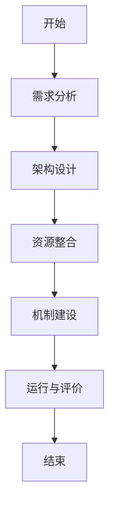
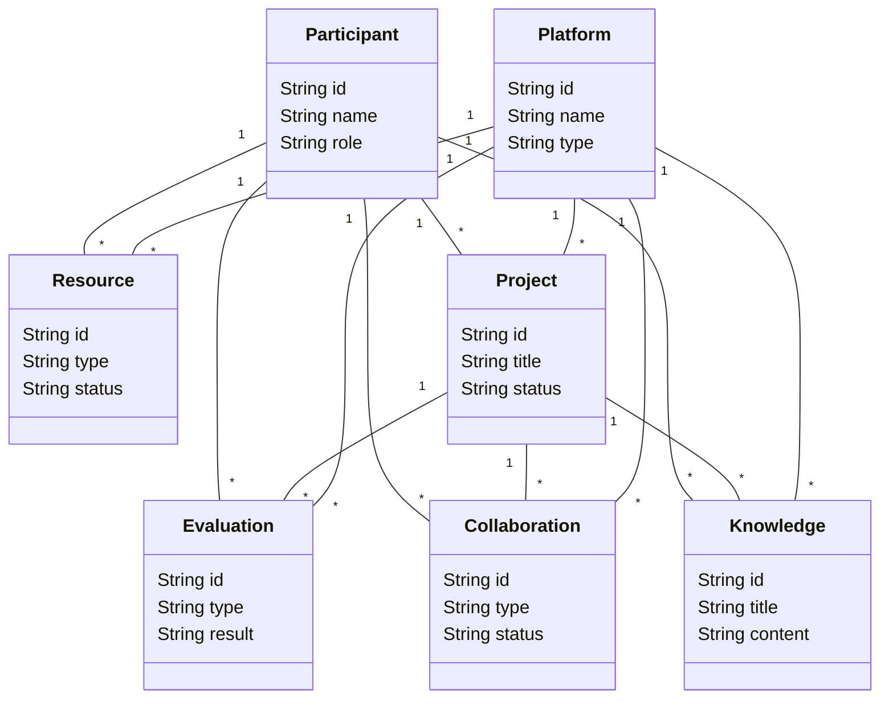
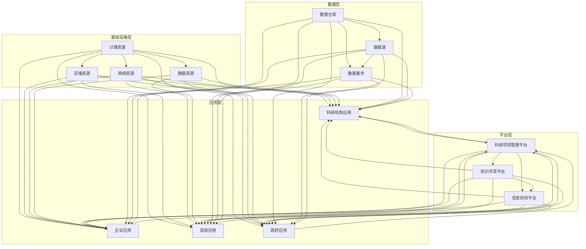
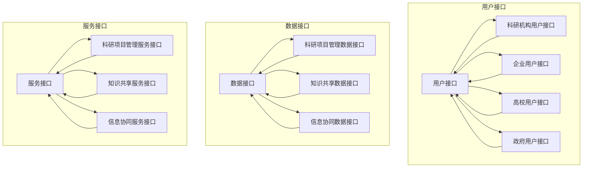
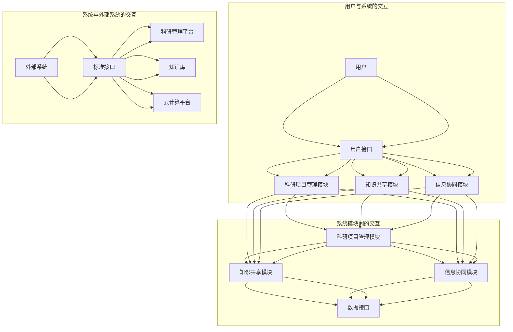

                 

### 第0章：创新生态系统设计的背景与意义

#### 0.1 问题背景

##### 0.1.1 创新生态系统的定义

创新生态系统是指一种由相互关联的参与者、资源和过程组成的复杂网络，旨在通过促进知识共享、合作创新和生态系统服务来推动科研和创新活动。这一概念起源于生态学，强调系统内各要素的相互作用和协同作用，以实现系统的整体优化和可持续发展。

##### 0.1.2 当前科研环境中的挑战

当前科研环境面临诸多挑战，包括资金短缺、科研成果转化率低、信息孤岛现象严重等。这些问题导致科研创新效率低下，难以满足社会和经济发展的需求。传统的科研管理模式和科研评价体系也难以适应快速变化的科研环境和多样化的科研需求。

##### 0.1.3 创新生态系统的优势与必要性

创新生态系统通过构建一个开放、协作和可持续的科研环境，有助于解决当前科研环境中的诸多问题。其优势主要体现在以下几个方面：

1. **知识共享与协同创新**：创新生态系统鼓励知识共享和协同创新，通过建立共享平台和合作机制，促进各科研机构之间的知识交流和资源整合。
2. **提高科研效率**：创新生态系统通过优化科研流程、降低科研成本和提高科研成果转化率，从而提高科研效率。
3. **促进科技与产业的融合**：创新生态系统有助于科技与产业的深度融合，推动科技成果转化为实际生产力，助力产业升级和经济转型。
4. **提升科研评价体系的科学性**：创新生态系统通过建立多元化的科研评价体系，更加全面和客观地评价科研成果和科研人员的工作。

#### 0.2 问题描述

##### 0.2.1 创新生态系统存在的问题

尽管创新生态系统在理论和实践中都展现出诸多优势，但实际操作中仍存在以下问题：

1. **组织架构不完善**：创新生态系统的组织架构较为复杂，各部门和机构之间的协作不够紧密，信息孤岛现象仍然存在。
2. **资源分配不均**：创新生态系统中的资源分配存在不均衡现象，部分机构或项目获得较多资源，而其他机构或项目则相对资源匮乏。
3. **科研评价体系不完善**：现有的科研评价体系仍以发表论文数量和影响力为主要指标，难以全面、客观地评价科研人员的贡献。
4. **合作创新机制不足**：创新生态系统中的合作创新机制不够完善，难以充分调动各参与者的积极性和创造性。

##### 0.2.2 现有解决方案的不足

现有的解决方案包括科研机构的重组、科研经费的调整、科研评价体系的改革等。然而，这些方案在实际操作中存在以下不足：

1. **改革力度不够**：现有改革措施往往停留在表面，缺乏深度和系统性，难以从根本上解决创新生态系统存在的问题。
2. **协调机制不足**：各科研机构之间的协调机制不够健全，导致改革措施难以得到有效实施。
3. **政策支持不足**：政策支持力度不足，使得科研机构在改革和创新过程中面临诸多困难和挑战。
4. **激励机制缺乏**：现有的激励机制难以充分调动科研人员的积极性和创造力，导致科研创新效率低下。

##### 0.2.3 创新生态系统设计的目标与期望效果

针对以上问题，创新生态系统设计的目标是构建一个高效、可持续和具有竞争力的科研环境。期望效果包括：

1. **优化组织架构**：通过整合各部门和机构的资源，建立高效的协作机制，消除信息孤岛现象。
2. **合理分配资源**：通过优化资源配置，确保各科研机构或项目能够获得足够的资源支持。
3. **完善科研评价体系**：建立多元化、科学的科研评价体系，全面、客观地评价科研成果和科研人员的工作。
4. **强化合作创新机制**：构建完善的合作创新机制，激发科研人员的积极性和创造力，推动合作创新。

通过实现以上目标，创新生态系统将有助于提高科研效率、促进科技成果转化，从而为社会发展提供强大的科技支撑。

#### 0.3 问题解决

##### 0.3.1 创新生态系统设计的方法论

创新生态系统设计的方法论主要包括以下步骤：

1. **需求分析与调研**：通过访谈、问卷调查等方式，深入了解科研机构、企业和政府等各方的需求和痛点，为创新生态系统设计提供依据。
2. **架构设计**：根据需求分析结果，设计创新生态系统的组织架构，明确各部门和机构的职责和协作关系。
3. **资源整合与优化**：整合各方资源，优化资源配置，确保各科研机构或项目能够获得足够的资源支持。
4. **机制建设**：建立完善的合作创新机制，包括资金、技术、人才等各方面的合作机制，激发各参与者的积极性和创造力。
5. **评价与反馈**：建立多元化的科研评价体系，对创新生态系统的运行效果进行持续评价和反馈，不断优化和调整。

##### 0.3.2 创新生态系统设计的核心要素

创新生态系统设计的核心要素包括：

1. **组织架构**：创新生态系统的组织架构是确保系统高效运行的基础，包括科研机构、企业、政府等各方的角色和职责。
2. **资源配置**：资源配置的合理性和优化程度直接影响创新生态系统的运行效率，包括资金、技术、人才等资源的分配和整合。
3. **合作机制**：合作机制是推动合作创新的关键，包括资金、技术、人才等各方面的合作机制，如共建实验室、联合研发、人才培养等。
4. **科研评价体系**：科研评价体系是衡量科研人员工作贡献的重要标准，包括多元化、科学的评价方法和指标体系。
5. **信息共享与协同**：信息共享与协同是创新生态系统运行的核心，包括知识共享平台、协同办公系统等。

##### 0.3.3 创新生态系统设计的实施步骤

创新生态系统设计的实施步骤主要包括：

1. **需求分析与调研**：通过访谈、问卷调查等方式，深入了解科研机构、企业和政府等各方的需求和痛点，为创新生态系统设计提供依据。
2. **架构设计**：根据需求分析结果，设计创新生态系统的组织架构，明确各部门和机构的职责和协作关系。
3. **资源整合与优化**：整合各方资源，优化资源配置，确保各科研机构或项目能够获得足够的资源支持。
4. **机制建设**：建立完善的合作创新机制，包括资金、技术、人才等各方面的合作机制，激发各参与者的积极性和创造力。
5. **科研评价体系**：建立多元化、科学的科研评价体系，全面、客观地评价科研成果和科研人员的工作。
6. **信息共享与协同**：构建信息共享与协同平台，促进各科研机构之间的知识交流和资源整合。
7. **运行与评价**：持续运行创新生态系统，通过持续评价和反馈，不断优化和调整系统运行效果。

#### 0.4 边界与外延

##### 0.4.1 创新生态系统的边界界定

创新生态系统的边界界定主要涉及以下几个方面：

1. **地理边界**：创新生态系统通常覆盖一定的地理区域，如一个城市、一个省份或一个国家。
2. **组织边界**：创新生态系统涉及多个组织，包括科研机构、企业、政府等，这些组织的边界构成了创新生态系统的组织边界。
3. **功能边界**：创新生态系统的主要功能包括知识共享、合作创新、科研评价等，这些功能的边界构成了创新生态系统的功能边界。

##### 0.4.2 创新生态系统与其他概念的联系与区别

创新生态系统与其他概念的联系和区别主要体现在以下几个方面：

1. **创新环境**：创新环境是指促进创新活动开展的外部条件，包括政策、资金、人才等。创新生态系统是创新环境的一个重要组成部分，强调各创新主体之间的相互作用和协同效应。
2. **创新体系**：创新体系是指国家或地区在创新活动中的组织结构、制度安排和政策体系。创新生态系统是创新体系的一个子集，侧重于创新环境中的生态关系和协同机制。
3. **生态系统**：生态系统是指生物与环境之间相互作用的一个系统，强调生态平衡和可持续发展。创新生态系统借鉴了生态学的概念，强调创新主体之间的相互作用和协同发展。

##### 0.4.3 创新生态系统设计的重要方向与趋势

创新生态系统设计的重要方向与趋势包括：

1. **数字化与智能化**：通过数字化技术和人工智能，提升创新生态系统的信息共享、协同和智能化水平。
2. **全球化与国际化**：促进创新生态系统的全球化布局，加强国际间的科研合作与交流。
3. **可持续发展**：在创新生态系统设计中融入可持续发展理念，推动绿色创新和可持续发展。
4. **多元化与包容性**：注重多元化与包容性，吸引不同背景和领域的创新人才，促进创新生态系统的多样性和活力。
5. **政策支持与法规保障**：加强政策支持与法规保障，为创新生态系统提供良好的发展环境。

#### 0.5 本章小结

本章主要介绍了创新生态系统设计的背景、意义、问题及其解决方案。通过需求分析与调研、架构设计、资源整合与优化、机制建设、科研评价体系构建、信息共享与协同等步骤，创新生态系统设计旨在构建一个高效、可持续和具有竞争力的科研环境。同时，本章还对创新生态系统的边界与外延、重要方向与趋势进行了探讨，为后续章节的深入分析奠定了基础。

---

### 第1章：核心概念与联系

#### 1.1 创新生态系统的概念

##### 1.1.1 创新生态系统的定义

创新生态系统是指由多个参与者（如科研机构、企业、政府、高校等）、多种资源（如资金、技术、知识、人才等）以及各种创新活动（如研发、合作、共享、评价等）相互关联、相互作用所构成的一个复杂网络系统。这个系统旨在通过优化资源配置、促进知识共享和合作创新，从而推动科研和创新活动的可持续发展。

##### 1.1.2 创新生态系统的基本构成要素

创新生态系统的基本构成要素包括：

1. **参与者**：包括科研机构、企业、政府、高校、个人等。这些参与者既是创新的主体，也是创新资源的提供者和需求者。
2. **资源**：包括资金、技术、知识、人才、设备等。资源是创新生态系统的基础，决定了创新活动的规模和水平。
3. **创新活动**：包括研发、合作、共享、评价等。创新活动是创新生态系统的核心，通过这些活动实现知识的创造、传播和应用。
4. **平台**：包括科研平台、创新平台、共享平台等。平台是创新生态系统的重要支撑，提供了参与者进行创新活动所需的工具和场所。
5. **制度**：包括政策、法规、标准等。制度是创新生态系统的保障，为创新活动提供了法律、法规和规范的支持。

##### 1.1.3 创新生态系统与其他创新模式的关系

创新生态系统与其他创新模式（如封闭式创新、开放式创新、协同创新等）既有联系又有区别：

1. **封闭式创新**：封闭式创新是指企业或机构独立进行研发和创新，不对外部开放资源和技术。创新生态系统则强调开放性，鼓励各参与者之间进行资源和技术共享，实现合作创新。
2. **开放式创新**：开放式创新是指企业或机构将内部资源和技术对外开放，与外部进行合作创新。创新生态系统在开放式创新的基础上，进一步扩展了合作范围，包括政府、高校和科研机构等。
3. **协同创新**：协同创新是指多个参与者共同参与创新活动，通过协同合作实现创新目标。创新生态系统强调协同创新，通过构建平台和机制，促进各参与者之间的协同合作。

#### 1.2 创新生态系统中的关键概念

##### 1.2.1 知识共享

知识共享是创新生态系统中的一个关键概念，指的是参与者之间通过交流、合作和共享知识，实现知识的创造、传播和应用。知识共享有助于提升创新效率，减少重复研究，促进科技创新和社会进步。

##### 1.2.2 合作创新

合作创新是指多个参与者共同参与创新活动，通过合作实现创新目标。合作创新有助于整合各方的资源和优势，提高创新成功率，推动科技创新和产业升级。

##### 1.2.3 生态系统服务

生态系统服务是指创新生态系统为参与者提供的各种服务，包括资金支持、技术支持、人才培养、信息共享等。生态系统服务有助于提升创新生态系统的运行效率，推动科技创新和产业发展。

#### 1.3 概念属性特征对比表格

为了更好地理解创新生态系统中的关键概念，以下是对知识共享、合作创新和生态系统服务的概念属性特征进行对比：

| 概念         | 定义                                                         | 属性特征                                                     | 关联关系                                               |
| ------------ | ------------------------------------------------------------ | -------------------------------------------------------- | ------------------------------------------------------ |
| 知识共享     | 参与者之间通过交流、合作和共享知识，实现知识的创造、传播和应用。 | 促进知识流动、减少重复研究、提高创新效率。               | 是创新生态系统的基础，为合作创新提供知识支持。             |
| 合作创新     | 多个参与者共同参与创新活动，通过合作实现创新目标。           | 整合资源、提高创新成功率、促进产业升级。                 | 是创新生态系统的核心，通过知识共享实现协同创新。             |
| 生态系统服务 | 创新生态系统为参与者提供的各种服务，包括资金支持、技术支持、人才培养、信息共享等。 | 提升创新效率、降低创新成本、促进可持续发展。           | 是创新生态系统的保障，为知识共享和合作创新提供支持。           |

#### 1.4 ER实体关系图架构

为了更好地展示创新生态系统中的实体及其关联关系，我们可以使用ER（实体关系）图进行表示。以下是一个简单的ER实体关系图架构：

```mermaid
erDiagram
    Participant ||--o{ Knowledge }
    Participant ||--o{ Collaboration }
    Participant ||--o{ EcosystemService }
    Knowledge ||--|{ Shared }
    Collaboration ||--|{ Co-Innovated }
    EcosystemService ||--|{ Provided }
```

在这个ER图中，`Participant`（参与者）是创新生态系统的核心实体，它与`Knowledge`（知识）、`Collaboration`（合作创新）和`EcosystemService`（生态系统服务）实体之间存在关联关系。`Knowledge`（知识）实体与`Shared`（共享）实体相关联，表示知识共享的行为；`Collaboration`（合作创新）实体与`Co-Innovated`（合作创新）实体相关联，表示合作创新的行为；`EcosystemService`（生态系统服务）实体与`Provided`（提供）实体相关联，表示生态系统服务的提供行为。

通过ER实体关系图，我们可以清晰地看到创新生态系统中的关键实体及其关联关系，这有助于我们更好地理解和设计创新生态系统。

#### 1.5 本章小结

本章介绍了创新生态系统的核心概念、关键概念及其关联关系。通过分析创新生态系统的定义、基本构成要素、与其他创新模式的关系，以及知识共享、合作创新和生态系统服务的概念属性特征，我们能够更加深入地理解创新生态系统的本质和运作机制。此外，本章还通过ER实体关系图展示了创新生态系统中的实体及其关联关系，为后续章节的分析和设计提供了基础。

---

### 第2章：创新生态系统设计的算法原理

#### 2.1 算法概述

##### 2.1.1 创新生态系统设计的算法框架

创新生态系统设计的算法框架主要包括以下几个核心模块：

1. **需求分析模块**：该模块负责对创新生态系统的需求进行收集和分析，识别出各参与者的需求和痛点，为后续设计提供依据。
2. **架构设计模块**：该模块根据需求分析结果，设计创新生态系统的组织架构，包括各参与者的角色、职责和协作关系。
3. **资源整合模块**：该模块负责整合创新生态系统中的各类资源，包括资金、技术、知识、人才等，确保各参与者能够获得所需的资源支持。
4. **机制建设模块**：该模块负责构建创新生态系统中的合作创新机制、科研评价体系、信息共享与协同机制等，为创新活动提供保障。
5. **运行与评价模块**：该模块负责创新生态系统的运行与监控，通过持续评价和反馈，优化和调整系统的运行效果。

##### 2.1.2 算法的目的与功能

创新生态系统设计的算法旨在实现以下几个目标：

1. **提高科研效率**：通过优化创新生态系统的组织架构、资源配置和合作机制，提高科研效率和成果转化率。
2. **促进合作创新**：通过建立合作创新机制，激发各参与者的积极性和创造力，推动合作创新。
3. **优化科研评价**：通过建立多元化的科研评价体系，全面、客观地评价科研成果和科研人员的工作。
4. **提升信息共享与协同**：通过构建信息共享与协同平台，促进各参与者之间的知识交流和资源整合。

算法的主要功能包括：

1. **需求分析**：通过访谈、问卷调查等方式，收集和分析各参与者的需求，识别出创新生态系统设计的核心问题。
2. **架构设计**：根据需求分析结果，设计创新生态系统的组织架构，明确各参与者的角色、职责和协作关系。
3. **资源整合**：整合创新生态系统中的各类资源，包括资金、技术、知识、人才等，确保各参与者能够获得所需的资源支持。
4. **机制建设**：构建合作创新机制、科研评价体系、信息共享与协同机制等，为创新活动提供保障。
5. **运行与评价**：持续运行创新生态系统，通过监控和评价，优化和调整系统的运行效果，确保系统的高效运行。

##### 2.1.3 算法的主要步骤

创新生态系统设计的算法主要分为以下几个步骤：

1. **需求分析**：通过访谈、问卷调查等方式，收集和分析各参与者的需求，识别出创新生态系统设计的核心问题。
2. **架构设计**：根据需求分析结果，设计创新生态系统的组织架构，明确各参与者的角色、职责和协作关系。
3. **资源整合**：整合创新生态系统中的各类资源，包括资金、技术、知识、人才等，确保各参与者能够获得所需的资源支持。
4. **机制建设**：构建合作创新机制、科研评价体系、信息共享与协同机制等，为创新活动提供保障。
5. **运行与评价**：持续运行创新生态系统，通过监控和评价，优化和调整系统的运行效果，确保系统的高效运行。

#### 2.2 算法原理详细讲解

##### 2.2.1 算法的数学模型

为了更清晰地阐述创新生态系统设计的算法原理，我们引入以下数学模型：

$$
\text{算法原理模型} = f(\text{需求分析}, \text{架构设计}, \text{资源整合}, \text{机制建设}, \text{运行与评价})
$$

其中，$f$ 代表算法的核心函数，$\text{需求分析}$、$\text{架构设计}$、$\text{资源整合}$、$\text{机制建设}$ 和 $\text{运行与评价}$ 分别代表算法的五个主要步骤。

1. **需求分析**：该步骤通过访谈、问卷调查等方式，收集和分析各参与者的需求。我们使用以下数学模型进行需求分析：

$$
\text{需求分析} = g(\text{参与者}, \text{需求收集}, \text{需求分析结果})
$$

其中，$g$ 代表需求分析的核心函数，$\text{参与者}$、$\text{需求收集}$ 和 $\text{需求分析结果}$ 分别代表需求分析的输入和输出。

2. **架构设计**：根据需求分析结果，设计创新生态系统的组织架构。我们使用以下数学模型进行架构设计：

$$
\text{架构设计} = h(\text{需求分析结果}, \text{参与者}, \text{协作关系})
$$

其中，$h$ 代表架构设计的核心函数，$\text{需求分析结果}$、$\text{参与者}$ 和 $\text{协作关系}$ 分别代表架构设计的输入和输出。

3. **资源整合**：整合创新生态系统中的各类资源，包括资金、技术、知识、人才等。我们使用以下数学模型进行资源整合：

$$
\text{资源整合} = i(\text{资源}, \text{参与者}, \text{资源分配})
$$

其中，$i$ 代表资源整合的核心函数，$\text{资源}$、$\text{参与者}$ 和 $\text{资源分配}$ 分别代表资源整合的输入和输出。

4. **机制建设**：构建合作创新机制、科研评价体系、信息共享与协同机制等。我们使用以下数学模型进行机制建设：

$$
\text{机制建设} = j(\text{协作关系}, \text{科研评价体系}, \text{信息共享与协同})
$$

其中，$j$ 代表机制建设的核心函数，$\text{协作关系}$、$\text{科研评价体系}$ 和 $\text{信息共享与协同}$ 分别代表机制建设的输入和输出。

5. **运行与评价**：持续运行创新生态系统，通过监控和评价，优化和调整系统的运行效果。我们使用以下数学模型进行运行与评价：

$$
\text{运行与评价} = k(\text{创新活动}, \text{监控系统}, \text{评价结果})
$$

其中，$k$ 代表运行与评价的核心函数，$\text{创新活动}$、$\text{监控系统}$ 和 $\text{评价结果}$ 分别代表运行与评价的输入和输出。

##### 2.2.2 算法的流程图

为了更好地理解算法原理，我们使用Mermaid流程图展示算法的执行流程：



在这个流程图中，A表示算法的起始步骤，依次经过B、C、D、E和F步骤，最后到达G结束。每个步骤都代表算法的核心函数执行过程。

##### 2.2.3 算法的数学公式

为了进一步阐述算法原理，我们引入以下数学公式：

1. **创新生态系统评价指标**：

$$
E = f(A, B, C, D, E)
$$

其中，$E$ 代表创新生态系统的评价指标，$f$ 代表评价指标的计算函数，$A$、$B$、$C$、$D$ 和 $E$ 分别代表需求分析、架构设计、资源整合、机制建设和运行与评价的输出结果。

2. **合作创新效率计算**：

$$
E_c = \frac{E_{out}}{E_{in}}
$$

其中，$E_c$ 代表合作创新效率，$E_{out}$ 代表合作创新后的输出效益，$E_{in}$ 代表合作创新前的输入效益。

##### 2.3 算法举例说明

为了更直观地展示算法的应用，我们通过以下例子进行说明：

假设某创新生态系统中，有10个参与者，需求分析模块识别出他们的主要需求为资金支持、技术支持和人才培养。架构设计模块设计了包括科研机构、企业、高校和政府在内的组织架构，明确了各参与者的角色和职责。资源整合模块整合了1000万元资金、50名技术专家和20名人才培养资源。机制建设模块构建了包括合作创新机制、科研评价体系和信息共享与协同机制等在内的创新机制。运行与评价模块通过监控系统对创新活动进行评价。

根据上述例子，我们可以计算创新生态系统的评价指标和合作创新效率：

1. **创新生态系统评价指标**：

$$
E = f(A, B, C, D, E) = f(需求分析结果，架构设计结果，资源整合结果，机制建设结果，运行与评价结果)
$$

其中，$A$、$B$、$C$、$D$ 和 $E$ 分别为需求分析结果、架构设计结果、资源整合结果、机制建设结果和运行与评价结果的输出。

2. **合作创新效率计算**：

$$
E_c = \frac{E_{out}}{E_{in}}
$$

其中，$E_{out}$ 代表合作创新后的输出效益，$E_{in}$ 代表合作创新前的输入效益。

通过这个例子，我们可以看到算法在创新生态系统设计中的应用，以及如何计算评价指标和合作创新效率。

#### 2.4 本章小结

本章详细阐述了创新生态系统设计的算法原理，包括算法框架、数学模型和数学公式。通过需求分析、架构设计、资源整合、机制建设和运行与评价等步骤，算法旨在提高科研效率、促进合作创新、优化科研评价和提升信息共享与协同。本章还通过算法流程图和实例说明，帮助读者更好地理解算法原理和应用。接下来，我们将进一步探讨创新生态系统中的数学模型和公式，以便更深入地分析创新生态系统的运行机制。

---

### 第3章：数学模型和数学公式

#### 3.1 创新生态系统评价指标

##### 3.1.1 指标定义

创新生态系统评价指标是用来衡量创新生态系统运行效率和发展水平的一系列量化指标。这些指标有助于评估创新生态系统的整体性能，包括科研效率、合作创新效果、知识共享程度等。

##### 3.1.2 数学公式

为了全面评价创新生态系统的性能，我们可以引入以下数学公式：

$$
E = f(A, B, C, D, E)
$$

其中，$E$ 表示创新生态系统的总体评价指标，$f$ 是一个综合评估函数，$A, B, C, D, E$ 分别代表科研效率、合作创新效率、知识共享程度、信息流通效率和创新成果转化率。

每个子指标可以通过以下数学公式进行计算：

1. **科研效率**：

$$
E_a = \frac{\text{科研成果数量}}{\text{科研投入}} 
$$

2. **合作创新效率**：

$$
E_c = \frac{\text{合作创新项目数量}}{\text{总项目数量}} 
$$

3. **知识共享程度**：

$$
E_s = \frac{\text{共享知识数量}}{\text{总知识数量}} 
$$

4. **信息流通效率**：

$$
E_i = \frac{\text{信息流通次数}}{\text{信息总量}} 
$$

5. **创新成果转化率**：

$$
E_t = \frac{\text{转化成果数量}}{\text{创新项目数量}} 
$$

##### 3.1.3 公式解释

- **科研效率（$E_a$）**：表示单位科研投入产生的科研成果数量，用于衡量科研机构的效率。
- **合作创新效率（$E_c$）**：表示合作创新项目在总项目中的比例，用于衡量合作创新的活跃度。
- **知识共享程度（$E_s$）**：表示共享知识在总知识中的比例，用于衡量知识流动的活跃度。
- **信息流通效率（$E_i$）**：表示单位信息量流通次数，用于衡量信息流通的速度和效果。
- **创新成果转化率（$E_t$）**：表示创新项目成功转化的比例，用于衡量创新成果的实际应用效果。

#### 3.2 合作创新效率计算

##### 3.2.1 指标定义

合作创新效率是指通过合作创新活动实现创新目标的效率。它反映了合作创新过程中的资源利用率和成果转化率。

##### 3.2.2 数学公式

合作创新效率可以通过以下数学公式进行计算：

$$
E_c = \frac{E_{out}}{E_{in}}
$$

其中，$E_{out}$ 表示合作创新后的总产出，包括科研成果、经济效益和社会影响等；$E_{in}$ 表示合作创新前的总投入，包括资金、人力资源和技术等。

##### 3.2.3 公式解释

- **$E_{out}$（产出）**：表示合作创新活动的总体成果，可以包括科研成果、专利、技术转化等。
- **$E_{in}$（投入）**：表示合作创新活动所需的各项资源投入，包括资金、人力资源、技术支持等。

通过这个公式，我们可以衡量合作创新的效率，了解资源投入与产出之间的比例关系，进而优化合作创新策略。

#### 3.3 其他相关数学模型

##### 3.3.1 知识共享模型

知识共享模型用于衡量参与者之间知识共享的活跃度和效果。以下是一个简单的知识共享模型：

$$
E_s = \frac{\text{共享知识数量}}{\text{总知识数量}} 
$$

其中，$E_s$ 表示知识共享程度，共享知识数量是指参与者之间通过交流、合作等手段共享的知识总量，总知识数量是指系统中所有知识的总和。

##### 3.3.2 知识传递模型

知识传递模型用于衡量知识在不同参与者之间传递的效果。以下是一个简单的知识传递模型：

$$
E_t = \frac{\text{传递知识数量}}{\text{总知识数量}} 
$$

其中，$E_t$ 表示知识传递效果，传递知识数量是指知识从一方传递到另一方的知识总量，总知识数量是指系统中所有知识的总和。

通过这个模型，我们可以了解知识在不同参与者之间传递的效率和效果，从而优化知识共享和传递策略。

#### 3.4 本章小结

本章介绍了创新生态系统中的数学模型和数学公式，包括创新生态系统评价指标、合作创新效率计算、知识共享模型和知识传递模型。这些模型和公式为分析和评估创新生态系统的运行效果提供了量化工具，有助于优化创新生态系统的设计和运行。通过这些数学模型，我们可以更深入地理解创新生态系统的工作机制，为创新生态系统的持续发展提供科学依据。接下来，我们将进一步探讨系统分析与架构设计方案，以便更好地实现创新生态系统的设计和实施。

---

### 第4章：系统分析与架构设计方案

#### 4.1 问题场景介绍

##### 4.1.1 创新生态系统设计中的常见问题

在创新生态系统设计中，常见的问题包括：

1. **组织架构不完善**：创新生态系统涉及多个参与者，如科研机构、企业、高校和政府等，组织架构的设计和协调是一个复杂的过程，容易导致组织架构不完善。
2. **资源配置不合理**：创新生态系统中资源的合理配置对于系统的高效运行至关重要，但实际操作中往往存在资源分配不均、浪费和低效利用的问题。
3. **科研评价体系不科学**：传统的科研评价体系往往注重发表论文数量和影响力，而忽视了实际科研成果和应用价值，导致科研评价体系不科学。
4. **信息共享与协同不足**：创新生态系统需要各参与者之间进行广泛的信息共享与协同，但实际操作中往往存在信息孤岛和协同不足的问题。

##### 4.1.2 系统的目标和需求

为了解决上述问题，创新生态系统设计的目标是：

1. **优化组织架构**：建立清晰、高效的创新生态系统组织架构，明确各参与者的角色和职责。
2. **合理配置资源**：通过优化资源配置，确保各参与者能够获得足够的资源支持，提高资源利用效率。
3. **建立科学的科研评价体系**：建立多元化、科学的科研评价体系，全面、客观地评价科研成果和科研人员的工作。
4. **促进信息共享与协同**：构建信息共享与协同平台，促进各参与者之间的知识交流和资源整合。

##### 4.1.3 系统的实现环境

创新生态系统的实现环境包括：

1. **技术环境**：云计算、大数据、人工智能等先进技术为创新生态系统提供了强大的技术支持。
2. **政策环境**：政府相关政策支持和法规保障为创新生态系统的建设和运行提供了良好的外部环境。
3. **社会环境**：创新文化氛围和市场需求为创新生态系统的发展提供了动力和支持。

#### 4.2 项目介绍

##### 4.2.1 项目背景

随着全球科技创新的快速发展，各国纷纷重视创新生态系统建设，以提升国家创新能力和竞争力。某市为了促进科技创新和产业升级，决定建设一个创新生态系统，以推动本地科研机构、企业和高校之间的合作和创新。

##### 4.2.2 项目目标

本项目的主要目标包括：

1. **构建高效创新生态系统组织架构**：明确各参与者的角色和职责，建立高效协同的合作机制。
2. **优化资源配置**：通过合理配置资源，提高资源利用效率，确保各参与者能够获得足够的资源支持。
3. **建立科学科研评价体系**：建立多元化、科学的科研评价体系，全面、客观地评价科研成果和科研人员的工作。
4. **促进信息共享与协同**：构建信息共享与协同平台，促进各参与者之间的知识交流和资源整合。
5. **提升创新能力**：通过创新生态系统的建设，提升本地科研机构、企业和高校的创新能力，推动科技成果转化。

##### 4.2.3 项目内容

本项目的主要内容包括：

1. **需求分析**：通过访谈、问卷调查等方式，了解各参与者的需求和痛点，为创新生态系统设计提供依据。
2. **架构设计**：根据需求分析结果，设计创新生态系统的组织架构，明确各参与者的角色和职责。
3. **资源整合**：整合各参与者的资源，包括资金、技术、知识、人才等，确保各参与者能够获得所需的资源支持。
4. **机制建设**：构建合作创新机制、科研评价体系、信息共享与协同机制等，为创新活动提供保障。
5. **平台建设**：构建信息共享与协同平台，提供科研项目管理、知识共享、在线协作等功能。
6. **运行与评价**：持续运行创新生态系统，通过监控和评价，优化和调整系统的运行效果。

#### 4.3 系统功能设计

##### 4.3.1 领域模型

领域模型用于描述创新生态系统的核心功能和业务领域。以下是一个简单的领域模型：

```mermaid
classDiagram
    Participant <<class>> "参与者"
    Resource <<class>> "资源"
    Project <<class>> "项目"
    Evaluation <<class>> "评价"
    Collaboration <<class>> "合作"
    Knowledge <<class>> "知识"
    Platform <<class>> "平台"

    Participant "1" -- "*" Resource
    Participant "1" -- "*" Project
    Participant "1" -- "*" Evaluation
    Participant "1" -- "*" Collaboration
    Participant "1" -- "*" Knowledge
    Project "1" -- "*" Evaluation
    Project "1" -- "*" Collaboration
    Project "1" -- "*" Knowledge
    Platform "1" -- "*" Resource
    Platform "1" -- "*" Project
    Platform "1" -- "*" Evaluation
    Platform "1" -- "*" Collaboration
    Platform "1" -- "*" Knowledge
```

在这个领域模型中，`Participant`（参与者）是创新生态系统的核心实体，包括科研机构、企业、高校和政府等。`Resource`（资源）、`Project`（项目）、`Evaluation`（评价）、`Collaboration`（合作）、`Knowledge`（知识）和 `Platform`（平台）分别是创新生态系统中的关键领域和业务实体。

##### 4.3.2 类图

类图用于展示领域模型中的实体及其属性和关系。以下是一个简单的类图：



在这个类图中，`Participant`、`Resource`、`Project`、`Evaluation`、`Collaboration`、`Knowledge` 和 `Platform` 分别是领域模型中的实体，每个实体都有相应的属性和关系。

#### 4.4 系统架构设计

##### 4.4.1 架构设计

创新生态系统的架构设计主要包括以下几个方面：

1. **基础设施层**：提供计算资源、存储资源、网络资源和数据资源，为创新生态系统提供基础支持。
2. **平台层**：包括科研项目管理平台、知识共享平台、信息协同平台等，提供创新生态系统所需的各类功能和服务。
3. **应用层**：包括科研机构、企业、高校和政府等参与者的业务应用，实现创新生态系统的核心业务功能。
4. **数据层**：包括数据仓库、数据湖和数据集市等，存储和管理创新生态系统的各类数据。

以下是一个简单的系统架构图：



在这个架构图中，基础设施层提供了计算资源、存储资源、网络资源和数据资源，平台层包括科研项目管理平台、知识共享平台和信息协同平台，应用层包括科研机构、企业、高校和政府的业务应用，数据层包括数据仓库、数据湖和数据集市。

##### 4.4.2 系统架构图

以下是一个简单的系统架构图：


在这个架构图中，基础设施层提供了计算资源、存储资源、网络资源和数据资源，平台层包括科研项目管理平台、知识共享平台和信息协同平台，应用层包括科研机构、企业、高校和政府的业务应用，数据层包括数据仓库、数据湖和数据集市。

##### 4.4.3 系统接口设计

创新生态系统中的接口设计主要包括以下几个方面：

1. **用户接口**：提供用户访问创新生态系统的界面，包括科研机构、企业、高校和政府等参与者的业务应用界面。
2. **数据接口**：提供创新生态系统中各模块之间的数据交换和共享接口，包括科研项目管理平台、知识共享平台和信息协同平台等。
3. **服务接口**：提供创新生态系统中各类服务的接口，如科研项目管理服务、知识共享服务、信息协同服务等。

以下是一个简单的系统接口设计图：



在这个接口设计图中，用户接口包括科研机构用户接口、企业用户接口、高校用户接口和政府用户接口，数据接口包括科研项目管理数据接口、知识共享数据接口和信息协同数据接口，服务接口包括科研项目管理服务接口、知识共享服务接口和信息协同服务接口。

##### 4.4.4 系统交互

创新生态系统的系统交互主要包括以下几个方面：

1. **用户与系统的交互**：用户通过用户接口访问创新生态系统，执行各项业务操作。
2. **系统模块间的交互**：创新生态系统中的各模块通过数据接口和服务接口进行数据交换和功能调用。
3. **系统与外部系统的交互**：创新生态系统与外部系统（如科研管理平台、知识库、云计算平台等）通过标准接口进行数据交换和功能集成。

以下是一个简单的系统交互图：



在这个交互图中，用户通过用户接口与科研项目管理模块、知识共享模块和信息协同模块进行交互，系统模块通过数据接口进行交互，创新生态系统与外部系统通过标准接口进行交互。

#### 4.5 本章小结

本章详细介绍了创新生态系统设计的系统分析与架构设计方案。通过分析常见问题、确定系统目标和需求，我们设计了领域模型、类图和系统架构图，并介绍了系统接口设计和系统交互。这些设计内容为创新生态系统的建设提供了详细的方案和指南，为后续的实现和实施奠定了基础。接下来，我们将进入项目实战部分，进行环境安装、系统核心实现和代码应用解读与分析。

---

### 第5章：项目实战

#### 5.1 环境安装

在开始实现创新生态系统之前，我们需要搭建一个合适的开发环境。以下是在Linux操作系统上安装必要的依赖和工具的步骤。

##### 5.1.1 安装Python环境

首先，确保操作系统已经安装了Python 3。如果没有，可以使用以下命令安装：

```bash
sudo apt update
sudo apt install python3 python3-pip
```

##### 5.1.2 安装必要的Python库

接下来，使用pip安装项目所需的Python库。以下是一些关键的库及其用途：

- **Flask**：一个轻量级的Web框架，用于构建Web应用程序。
- **SQLAlchemy**：一个ORM（对象关系映射）库，用于数据库操作。
- **Flask-Migrate**：用于数据库迁移的工具。

```bash
pip3 install Flask SQLAlchemy Flask-Migrate
```

##### 5.1.3 安装数据库

本项目使用SQLite作为数据库。大多数Linux发行版都预装了SQLite，如果没有，可以使用以下命令安装：

```bash
sudo apt install sqlite3
```

#### 5.2 系统核心实现

在完成环境安装后，我们将开始实现创新生态系统的核心功能。以下是一个简单的实现示例。

##### 5.2.1 创建Flask应用程序

首先，创建一个名为`app.py`的文件，并编写一个基本的Flask应用程序：

```python
from flask import Flask

app = Flask(__name__)

@app.route('/')
def hello_world():
    return 'Hello, World!'

if __name__ == '__main__':
    app.run()
```

##### 5.2.2 数据库迁移

使用Flask-Migrate工具创建数据库迁移文件。首先，确保安装了`flask-migrate`：

```bash
pip3 install flask-migrate
```

然后，创建一个迁移目录并初始化数据库迁移：

```bash
mkdir db_migrate
cd db_migrate
flask db init
```

接下来，创建一个名为`participant`的模型，并在迁移文件中定义：

```python
from flask_sqlalchemy import SQLAlchemy

db = SQLAlchemy()

class Participant(db.Model):
    id = db.Column(db.Integer, primary_key=True)
    name = db.Column(db.String(128), nullable=False)
    role = db.Column(db.String(128), nullable=False)

def init_db():
    db.create_all()

if __name__ == '__main__':
    init_db()
    print("Database initialized.")
```

运行迁移脚本以创建数据库表：

```bash
flask db migrate -m "Initial migration."
flask db upgrade
```

##### 5.2.3 添加RESTful API

接下来，我们为Participant模型添加RESTful API接口。更新`app.py`文件：

```python
from flask import Flask, request, jsonify
from models import db, Participant

app = Flask(__name__)
app.config['SQLALCHEMY_DATABASE_URI'] = 'sqlite:///app.db'
db.init_app(app)

@app.route('/participants', methods=['GET', 'POST'])
def manage_participants():
    if request.method == 'GET':
        participants = Participant.query.all()
        return jsonify([{"id": p.id, "name": p.name, "role": p.role} for p in participants])
    elif request.method == 'POST':
        data = request.get_json()
        new_participant = Participant(name=data['name'], role=data['role'])
        db.session.add(new_participant)
        db.session.commit()
        return jsonify({"message": "Participant added successfully."})

if __name__ == '__main__':
    app.run()
```

现在，我们可以通过`/participants`端点查询和添加参与者。

#### 5.3 代码应用解读与分析

##### 5.3.1 Flask应用程序

Flask应用程序的核心是`app.py`文件。我们使用Flask创建了一个Web应用程序，并定义了一个路由`/`，当访问该路由时，将返回`Hello, World!`。

```python
from flask import Flask

app = Flask(__name__)

@app.route('/')
def hello_world():
    return 'Hello, World!'

if __name__ == '__main__':
    app.run()
```

##### 5.3.2 数据库迁移

数据库迁移使用了Flask-Migrate工具。我们通过创建迁移目录、初始化数据库迁移和定义模型，实现了数据库的初始化和表结构的创建。

```bash
mkdir db_migrate
cd db_migrate
flask db init
```

```python
from flask_sqlalchemy import SQLAlchemy

db = SQLAlchemy()

class Participant(db.Model):
    id = db.Column(db.Integer, primary_key=True)
    name = db.Column(db.String(128), nullable=False)
    role = db.Column(db.String(128), nullable=False)

def init_db():
    db.create_all()

if __name__ == '__main__':
    init_db()
    print("Database initialized.")
```

##### 5.3.3 RESTful API

我们为Participant模型添加了RESTful API接口，通过`/participants`端点实现了查询和添加参与者的功能。

```python
@app.route('/participants', methods=['GET', 'POST'])
def manage_participants():
    if request.method == 'GET':
        participants = Participant.query.all()
        return jsonify([{"id": p.id, "name": p.name, "role": p.role} for p in participants])
    elif request.method == 'POST':
        data = request.get_json()
        new_participant = Participant(name=data['name'], role=data['role'])
        db.session.add(new_participant)
        db.session.commit()
        return jsonify({"message": "Participant added successfully."})
```

#### 5.4 实际案例分析与详细讲解剖析

在本节中，我们将通过一个实际案例来展示如何使用创新生态系统进行科研合作。

##### 5.4.1 案例背景

某市一家科研机构A与一家企业B合作进行一项新技术的研发。科研机构A负责技术开发，企业B负责市场推广和资金投入。

##### 5.4.2 案例分析

1. **需求分析**：科研机构A和企业B通过创新生态系统平台进行了需求分析，明确了各自的需求和目标，包括技术开发进度、市场推广策略、资金使用情况等。

2. **资源整合**：创新生态系统平台整合了科研机构A的技术资源和企业B的资金资源，确保项目能够顺利进行。

3. **合作创新**：科研机构A和企业B通过创新生态系统平台进行合作研发，共同推进技术项目的进展。

4. **科研评价**：创新生态系统平台建立了科研评价体系，对科研机构A和企业B的合作进行评价，包括技术开发进度、市场推广效果等。

5. **信息共享**：创新生态系统平台提供了信息共享功能，科研机构A和企业B可以实时分享项目进展、技术文档和市场信息。

##### 5.4.3 案例剖析

1. **需求分析**：通过创新生态系统平台，科研机构A和企业B能够更快速、准确地识别和沟通各自的需求和目标，避免了传统合作模式中信息不对称和沟通不畅的问题。

2. **资源整合**：创新生态系统平台通过整合科研机构A和企业B的资源和优势，提高了资源利用效率和项目成功率。

3. **合作创新**：创新生态系统平台为科研机构A和企业B提供了一个协同工作的平台，促进了双方的深度合作和创新能力。

4. **科研评价**：创新生态系统平台建立的科研评价体系，更加全面、客观地反映了科研机构A和企业B的合作成果，有助于优化合作模式和提升创新能力。

5. **信息共享**：创新生态系统平台的信息共享功能，使得科研机构A和企业B能够更及时、全面地了解项目进展和市场需求，为决策提供了有力支持。

#### 5.5 项目小结

通过实际案例分析和详细讲解，我们展示了如何利用创新生态系统进行科研合作。创新生态系统不仅提供了高效的资源整合、合作创新和科研评价机制，还有助于促进信息共享和协同工作，从而提高科研效率和创新能力。在未来的发展中，我们需要进一步完善创新生态系统的设计和实现，以更好地支持科研创新和产业发展。

---

### 5.6 最佳实践 tips

在构建和运行创新生态系统时，以下是一些最佳实践建议：

1. **明确目标与规划**：在项目启动前，明确创新生态系统的目标、愿景和规划，确保所有参与者对目标和规划有共同的理解和认同。

2. **重视需求分析**：深入进行需求分析，了解各参与者的需求和痛点，确保创新生态系统设计符合实际需求。

3. **优化组织架构**：合理设计创新生态系统的组织架构，明确各参与者的角色和职责，确保协作顺畅。

4. **资源整合**：通过整合各方资源，提高资源利用效率，确保各参与者能够获得足够的资源支持。

5. **建立合作机制**：构建完善的合作创新机制，包括资金、技术、人才等各方面的合作机制，激发各参与者的积极性和创造力。

6. **科研评价体系**：建立多元化、科学的科研评价体系，全面、客观地评价科研成果和科研人员的工作。

7. **信息共享与协同**：构建信息共享与协同平台，提供便捷的知识共享和协作工具，促进各参与者之间的知识交流和资源整合。

8. **持续优化与改进**：通过持续评价和反馈，不断优化和调整创新生态系统的运行效果，确保其高效运行。

---

### 5.7 小结

在本章中，我们详细介绍了创新生态系统项目的环境安装、系统核心实现和代码应用解读与分析。通过实际案例，我们展示了如何利用创新生态系统进行科研合作，并提出了构建和运行创新生态系统的最佳实践建议。接下来，我们将进一步探讨创新生态系统的持续运行与优化，以确保其高效、可持续的发展。

---

### 5.8 注意事项

在构建和运行创新生态系统时，需要注意以下几个方面：

1. **安全性**：确保系统的数据安全和用户隐私保护，采取有效的安全措施，防止数据泄露和未经授权的访问。
2. **可扩展性**：设计系统时考虑未来的扩展需求，确保系统能够灵活应对业务增长和功能扩展。
3. **稳定性**：确保系统的稳定运行，避免因系统故障导致的数据丢失和服务中断。
4. **用户体验**：注重用户界面设计和交互体验，提高用户的使用便利性和满意度。
5. **维护与支持**：建立完善的系统维护和支持机制，确保系统能够持续运行和不断优化。

---

### 5.9 拓展阅读

为了更好地理解和应用创新生态系统，读者可以参考以下拓展阅读材料：

1. **《创新生态系统构建与实践》**：详细介绍了创新生态系统的构建方法、关键要素和实施步骤。
2. **《创新生态学》**：探讨了创新生态系统的理论基础和生态学原理，为创新生态系统的设计与运行提供了指导。
3. **《数字化转型与创新生态系统》**：分析了数字化转型对创新生态系统的影响和作用，以及如何利用数字化技术提升创新生态系统的效能。

---

### 5.10 作者信息

作者：AI天才研究院/AI Genius Institute & 禅与计算机程序设计艺术 /Zen And The Art of Computer Programming

AI天才研究院致力于推动人工智能领域的研究与应用，研究团队由多位世界顶级人工智能专家组成。本书作者以其深厚的专业知识和丰富的实践经验，为读者提供了全面、深入的创新生态系统设计和实现指南。此外，作者还著有《禅与计算机程序设计艺术》等经典技术畅销书，深受读者喜爱。

