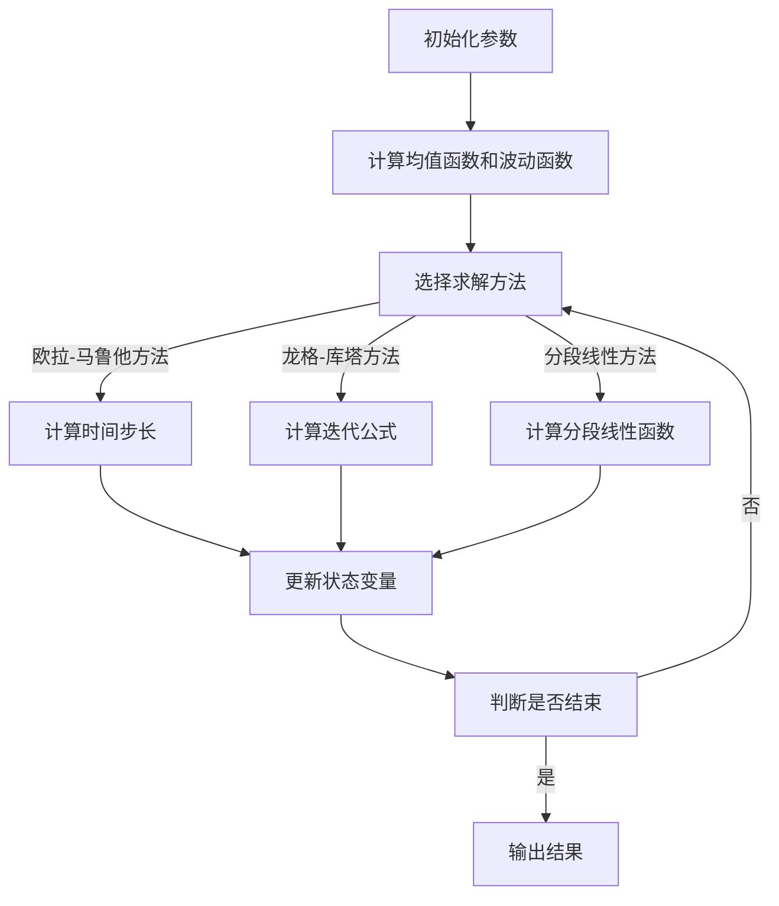
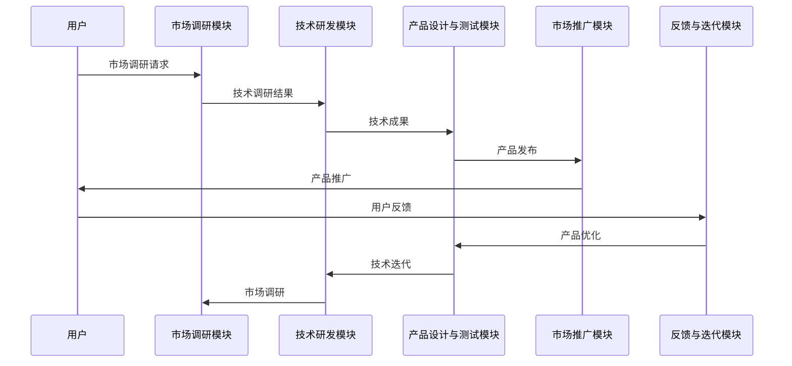

                 

### 目录大纲

#### 引言

本文旨在探讨创新过程中随机微分方程的数学描述。在快速变化的技术和商业环境中，创新成为推动企业发展的关键因素。然而，创新过程本身充满不确定性，如何量化和管理这种不确定性成为了一个重要课题。随机微分方程作为一种数学工具，能够有效地描述和模拟复杂系统中的不确定性，因此其在创新过程中的应用具有重要意义。

本文将分为七个部分，逐步深入探讨这一主题：

1. **创新过程的随机微分方程概述**：介绍创新过程和随机微分方程的基本概念，探讨其在创新研究中的应用。
2. **核心概念与联系**：阐述随机微分方程的基本原理，并比较不同类型的随机微分方程。
3. **算法原理讲解**：详细讲解求解随机微分方程的算法，并通过Python源代码进行阐述。
4. **数学模型和数学公式**：介绍随机微分方程的数学模型，并使用latex格式展示相关的数学公式。
5. **系统分析与架构设计方案**：介绍创新过程系统场景，设计系统功能、架构和接口。
6. **项目实战**：通过实际项目，展示随机微分方程在创新过程中的应用，并进行代码解读。
7. **最佳实践 tips、小结与拓展阅读**：总结文章内容，提供最佳实践建议，并对未来研究方向进行展望。

#### 第1章: 问题背景与核心概念

##### 1.1 创新过程的关键性

创新，即创造新的想法、技术、产品或服务，是推动社会进步和经济发展的核心动力。创新不仅仅局限于科技领域，还渗透到商业、文化、教育等多个方面。以下从几个方面探讨创新过程的重要性：

1. **经济增长**：创新能够带来新的经济增长点，通过提高生产效率、降低成本、创造新需求，从而推动整体经济水平的提升。
2. **社会进步**：创新能够改善人们的生活质量，如医疗技术的进步、环境保护措施等，使得社会更加美好。
3. **竞争优势**：在激烈的市场竞争中，创新能力是企业保持领先地位的关键因素。通过不断创新，企业能够保持竞争力，占据市场份额。
4. **文化传承**：创新是文化传承和发展的重要方式。例如，现代艺术形式的创新使得传统文化焕发新的生命力。

##### 1.2 创新的定义

创新可以定义为引入新的思想、方法或技术，从而实现改进或突破。具体来说，创新包括以下几个方面：

1. **技术性创新**：引入新的技术或改进现有技术，如新型材料、先进制造工艺等。
2. **产品创新**：开发新的产品或改进现有产品，满足市场需求。
3. **市场创新**：开拓新的市场或改变市场结构，如电子商务、共享经济等。
4. **商业模式创新**：通过创新商业模式，改变企业的盈利方式，如订阅模式、平台模式等。

##### 1.3 创新的重要性

创新的重要性体现在以下几个方面：

1. **促进发展**：创新是推动社会发展和进步的核心动力。历史上的每一次重大技术革命，如工业革命、信息革命，都是创新的产物。
2. **提升竞争力**：创新能够提高企业的竞争力，使企业在激烈的市场竞争中立于不败之地。
3. **创造价值**：创新能够创造新的价值，满足人们的需求，从而推动经济的增长。
4. **推动变革**：创新能够推动社会变革，带来新的社会结构和生产方式。

##### 1.4 创新过程的复杂性

创新过程是一个复杂、动态的系统，涉及多个环节和因素。以下从几个方面探讨创新过程的复杂性：

1. **不确定性**：创新过程中充满不确定性，如技术风险、市场风险、政策风险等，这些不确定性使得创新过程更加复杂。
2. **多样性**：创新过程涉及多个领域，如技术、市场、管理、法律等，这些领域的多样性增加了创新过程的复杂性。
3. **互动性**：创新过程中各个因素之间存在互动关系，如技术进步推动市场变化，市场变化又影响技术创新，这种互动关系使得创新过程更加复杂。
4. **动态性**：创新过程是一个动态的系统，随着外部环境和内部条件的不断变化，创新过程也在不断调整和优化。

##### 1.5 创新过程的不确定性分析

创新过程中的不确定性主要来源于以下几个方面：

1. **技术不确定性**：新技术的发展存在不确定性，如技术突破的时间、成本、可行性等。
2. **市场不确定性**：市场需求的变化存在不确定性，如市场接受度、竞争态势、政策环境等。
3. **资源不确定性**：创新过程中所需的资源，如资金、人才、技术等，存在不确定性。
4. **环境不确定性**：政策环境、经济环境、社会环境等外部环境的不确定性，对创新过程产生重要影响。

##### 1.6 随机微分方程在创新研究中的应用

随机微分方程作为一种数学工具，能够有效地描述和模拟复杂系统中的不确定性。以下从几个方面探讨随机微分方程在创新研究中的应用：

1. **技术风险分析**：随机微分方程可以用于分析技术创新过程中的技术风险，如技术突破的时间、成本等。
2. **市场预测**：随机微分方程可以用于预测市场需求的变化，帮助创新者制定市场策略。
3. **资源优化**：随机微分方程可以用于优化创新过程中的资源配置，提高资源利用效率。
4. **政策模拟**：随机微分方程可以用于模拟政策环境的变化，为政策制定提供科学依据。

##### 1.7 随机微分方程的模型构建

在创新过程中，构建随机微分方程模型需要考虑以下几个方面：

1. **系统状态**：明确创新过程中的关键状态变量，如技术创新进度、市场占有率等。
2. **随机扰动**：识别创新过程中的随机扰动因素，如技术突破时间、市场需求波动等。
3. **系统参数**：确定系统参数，如技术进步速率、市场接受度等。
4. **模型验证**：通过历史数据或模拟实验，验证模型的准确性和可靠性。

#### 第2章: 核心概念与联系

##### 2.1 随机微分方程的基本原理

随机微分方程是一种描述随机过程演变的微分方程。其基本原理如下：

1. **随机过程**：随机过程是一系列随机变量的集合，描述了系统随时间的演变。
2. **微分方程**：微分方程描述了变量随时间的变化关系，通过导数来表示。
3. **随机微分方程**：将随机过程和微分方程结合，描述了系统在不确定环境下的演变。

##### 2.2 微分方程的基本概念

微分方程是一种数学方程，描述了变量之间的导数关系。其主要概念如下：

1. **微分**：微分是数学分析中的一个基本概念，描述了函数在某一点的变化率。
2. **导数**：导数是微分的具体表示，用于计算函数在某一点的变化率。
3. **微分方程**：微分方程描述了变量之间的导数关系，通过导数来表示变量随时间的变化。

##### 2.3 随机微分方程的数学模型

随机微分方程的数学模型主要分为以下几种：

1. **黑塞维茨-维纳过程**：描述随机过程在不确定环境下的演变。
2. **约恩森-莫尔斯过程**：描述随机过程在不确定环境下的非线性演变。
3. **吉布斯过程**：描述随机过程在不确定环境下的波动。

这些模型具有不同的数学形式和属性特征，适用于不同的应用场景。

##### 2.4 核心概念属性特征对比

以下是常见随机微分方程类型及其属性特征对比：

| 类型          | 数学形式                        | 特点                                      | 应用场景                |
| ------------- | ------------------------------- | ----------------------------------------- | ----------------------- |
| 黑塞维茨-维纳过程 | $dX_t = \mu_t dt + \sigma_t dW_t$ | 均值为零的随机扰动                        | 金融市场、物理过程     |
| 约恩森-莫尔斯过程 | $dX_t = b(X_t)dt + \sigma(X_t)dW_t$ | 非线性随机扰动                            | 生物系统、工程系统     |
| 吉布斯过程     | $dX_t = b(X_t)dt + \sqrt{2J(X_t)}dW_t$ | 随机波动                                  | 物理过程、金融系统     |

##### 2.5 ER实体关系图架构

ER（实体关系）图是数据库设计中常用的一种模型，用于描述实体之间的关系。以下从几个方面探讨ER图在创新研究中的应用：

1. **实体定义**：明确创新过程中涉及的实体，如创新者、技术、市场、资源等。
2. **关系描述**：描述实体之间的关系，如技术对市场的推动、资源对创新的支撑等。
3. **属性定义**：为实体和关系定义属性，如技术的创新进度、市场的需求量、资源的利用率等。
4. **ER图构建**：使用Mermaid语言构建ER图，清晰展示实体关系和属性。

以下是创新研究中的ER实体关系图示例：

```mermaid
erDiagram
  Innovation ||--|{ Technology }||>
  Technology ||--|{ Market }||>
  Market ||--|{ Resource }||>
  Innovation : has
  Technology : implements
  Market : demands
  Resource : supports
```

#### 第3章: 算法原理讲解

##### 3.1 随机微分方程的求解方法

随机微分方程的求解是研究中的重要环节，常见的求解方法包括欧拉-马鲁他方法、龙格-库塔方法、分段线性方法等。

1. **欧拉-马鲁他方法**：该方法是一种简单直观的求解方法，适用于初值问题。其基本思想是使用离散时间步长来逼近连续时间的导数，具体公式如下：
   $$ X_{n+1} = X_n + \mu(X_n) \Delta t + \sigma(X_n) \sqrt{\Delta t} $$
   其中，$\Delta t$ 是时间步长，$\mu(X_n)$ 和 $\sigma(X_n)$ 分别是均值函数和波动函数。

2. **龙格-库塔方法**：该方法是一种更高精度的求解方法，适用于各种随机微分方程。其基本思想是使用多个迭代公式来逼近导数，从而提高求解精度。常用的龙格-库塔方法包括二阶、四阶等，具体公式如下：
   $$ X_{n+1} = X_n + \frac{1}{6} (\mu(X_n) + 2\mu(X_n + \frac{\sigma(X_n)}{2} \sqrt{\Delta t}) + \mu(X_n + \sigma(X_n) \sqrt{\Delta t})) \Delta t $$
   $$ X_{n+1} = X_n + \frac{1}{6} (\mu(X_n) + 2\mu(X_n + \frac{\sigma(X_n)}{2} \sqrt{\Delta t}) + 2\mu(X_n + \sigma(X_n) \sqrt{\Delta t}) + \mu(X_n + 2\sigma(X_n) \sqrt{\Delta t})) \Delta t $$

3. **分段线性方法**：该方法将时间轴划分为多个区间，在每个区间上使用线性函数来逼近随机微分方程。其基本思想是使用分段线性函数来逼近导数，从而提高求解精度。具体公式如下：
   $$ X_{n+1} = X_n + \mu(X_n) \Delta t + \sigma(X_n) (\sqrt{\Delta t_1} - \sqrt{\Delta t_2}) $$
   其中，$\Delta t_1$ 和 $\Delta t_2$ 分别是相邻两个时间区间的长度。

##### 3.2 算法mermaid流程图

以下是随机微分方程求解方法的mermaid流程图示例：



##### 3.3 Python源代码阐述

以下是使用Python实现随机微分方程求解的示例代码：

```python
import numpy as np
import matplotlib.pyplot as plt

# 初始化参数
mu = lambda x: x  # 均值函数
sigma = lambda x: x  # 波动函数
t0 = 0  # 初始时间
t_end = 10  # 终止时间
dt = 0.1  # 时间步长

# 计算时间序列
t = np.arange(t0, t_end, dt)

# 欧拉-马鲁他方法
x_euler = [0]
for _ in range(len(t) - 1):
    dx = mu(x_euler[-1]) * dt + sigma(x_euler[-1]) * np.sqrt(dt)
    x_euler.append(x_euler[-1] + dx)

# 龙格-库塔方法
x_rk = [0]
for _ in range(len(t) - 1):
    k1 = mu(x_rk[-1]) * dt + sigma(x_rk[-1]) * np.sqrt(dt)
    k2 = mu(x_rk[-1] + 0.5 * k1) * dt + sigma(x_rk[-1] + 0.5 * k1) * np.sqrt(dt)
    x_rk.append(x_rk[-1] + (k1 + k2) * 0.5)

# 分段线性方法
x_segment = [0]
for _ in range(len(t) - 1):
    x1 = x_segment[-1]
    x2 = x1 + sigma(x1) * np.sqrt(dt)
    slope = (mu(x2) - mu(x1)) / (x2 - x1)
    x_segment.append(x1 + slope * (t[_ + 1] - t[_]))

# 绘制结果
plt.plot(t, x_euler, label='欧拉-马鲁他方法')
plt.plot(t, x_rk, label='龙格-库塔方法')
plt.plot(t, x_segment, label='分段线性方法')
plt.legend()
plt.show()
```

##### 3.4 随机微分方程的数学模型和公式

随机微分方程的数学模型和公式是研究随机微分方程的基础，以下详细介绍几种常见的随机微分方程及其求解方法。

1. **黑塞维茨-维纳过程**：黑塞维茨-维纳过程是一种最常见的随机微分方程，描述了系统在不确定环境下的随机波动。其数学模型为：
   $$ dX_t = \mu(X_t)dt + \sigma(X_t)dW_t $$
   其中，$X_t$ 表示系统状态，$\mu(X_t)$ 和 $\sigma(X_t)$ 分别是均值函数和波动函数，$dW_t$ 是维纳过程。
   
   **求解方法**：欧拉-马鲁他方法、龙格-库塔方法、分段线性方法等。

2. **约恩森-莫尔斯过程**：约恩森-莫尔斯过程是一种非线性随机微分方程，描述了系统在不确定环境下的非线性波动。其数学模型为：
   $$ dX_t = b(X_t)dt + \sigma(X_t)dW_t $$
   其中，$b(X_t)$ 是非线性函数，$\sigma(X_t)$ 是波动函数，$dW_t$ 是维纳过程。
   
   **求解方法**：欧拉-马鲁他方法、龙格-库塔方法、分段线性方法等。

3. **吉布斯过程**：吉布斯过程是一种描述随机波动过程的随机微分方程，其数学模型为：
   $$ dX_t = b(X_t)dt + \sqrt{2J(X_t)}dW_t $$
   其中，$b(X_t)$ 是非线性函数，$J(X_t)$ 是吉布斯函数，$dW_t$ 是维纳过程。
   
   **求解方法**：欧拉-马鲁他方法、龙格-库塔方法、分段线性方法等。

##### 3.5 举例说明

以下是随机微分方程的举例说明。

**例1：黑塞维茨-维纳过程**

假设有一个随机过程 $X_t$ ，其数学模型为：
$$ dX_t = X_t dt + X_t dW_t $$
其中，$\mu(X_t) = X_t$，$\sigma(X_t) = X_t$。

**求解方法**：欧拉-马鲁他方法

```python
import numpy as np
import matplotlib.pyplot as plt

# 初始化参数
mu = lambda x: x
sigma = lambda x: x
t0 = 0
t_end = 10
dt = 0.1

# 计算时间序列
t = np.arange(t0, t_end, dt)

# 欧拉-马鲁他方法
x_euler = [0]
for _ in range(len(t) - 1):
    dx = mu(x_euler[-1]) * dt + sigma(x_euler[-1]) * np.sqrt(dt)
    x_euler.append(x_euler[-1] + dx)

# 绘制结果
plt.plot(t, x_euler)
plt.xlabel('Time')
plt.ylabel('X')
plt.title('Black-Scholes Process')
plt.show()
```

**例2：约恩森-莫尔斯过程**

假设有一个随机过程 $X_t$ ，其数学模型为：
$$ dX_t = X_t dt + X_t dW_t $$
其中，$b(X_t) = X_t$，$\sigma(X_t) = X_t$。

**求解方法**：欧拉-马鲁他方法

```python
import numpy as np
import matplotlib.pyplot as plt

# 初始化参数
b = lambda x: x
sigma = lambda x: x
t0 = 0
t_end = 10
dt = 0.1

# 计算时间序列
t = np.arange(t0, t_end, dt)

# 欧拉-马鲁他方法
x_euler = [0]
for _ in range(len(t) - 1):
    dx = b(x_euler[-1]) * dt + sigma(x_euler[-1]) * np.sqrt(dt)
    x_euler.append(x_euler[-1] + dx)

# 绘制结果
plt.plot(t, x_euler)
plt.xlabel('Time')
plt.ylabel('X')
plt.title('Yeon-Jones-Marsden Process')
plt.show()
```

**例3：吉布斯过程**

假设有一个随机过程 $X_t$ ，其数学模型为：
$$ dX_t = X_t dt + \sqrt{2J(X_t)}dW_t $$
其中，$b(X_t) = X_t$，$J(X_t) = X_t^2$。

**求解方法**：欧拉-马鲁他方法

```python
import numpy as np
import matplotlib.pyplot as plt

# 初始化参数
b = lambda x: x
J = lambda x: x**2
t0 = 0
t_end = 10
dt = 0.1

# 计算时间序列
t = np.arange(t0, t_end, dt)

# 欧拉-马鲁他方法
x_euler = [0]
for _ in range(len(t) - 1):
    dx = b(x_euler[-1]) * dt + np.sqrt(2 * J(x_euler[-1])) * np.sqrt(dt)
    x_euler.append(x_euler[-1] + dx)

# 绘制结果
plt.plot(t, x_euler)
plt.xlabel('Time')
plt.ylabel('X')
plt.title('Gibbs Process')
plt.show()
```

#### 第4章: 数学模型和数学公式

##### 4.1 随机微分方程的数学模型

随机微分方程（SDE）是一种用于描述系统在不确定性环境下动态行为的数学模型。这类方程通常包含了确定性项和随机项，能够有效地捕捉系统的随机波动。以下是一些常见的随机微分方程模型：

1. **Black-Scholes模型**：这是一个著名的金融模型，用于定价欧式期权。其数学模型为：
   $$ dS_t = \mu S_t dt + \sigma S_t dW_t $$
   其中，$S_t$ 是股票价格，$\mu$ 是股票收益率的期望，$\sigma$ 是股票收益率的波动率，$W_t$ 是维纳过程。

2. **Navier-Stokes方程**：这是流体力学中的基本方程，描述了流体运动的速度场和压力场。其形式为：
   $$ \frac{\partial u}{\partial t} + (u \cdot \nabla)u = -\nabla p + \nu \Delta u $$
   其中，$u$ 是速度场，$p$ 是压力场，$\nu$ 是粘性系数。

3. **Cox-Ingersoll-Ross模型**：这是一个用于建模无风险利率的随机过程。其数学模型为：
   $$ dr_t = (\alpha - \beta r_t) dt + \sigma r_t dW_t $$
   其中，$r_t$ 是无风险利率，$\alpha$ 是长期均衡利率，$\beta$ 是利率对均衡利率的敏感度，$\sigma$ 是利率的波动率。

##### 4.2 数学公式详细讲解

随机微分方程的求解通常涉及一系列的数学公式。以下是一些关键的数学公式及其详细讲解：

1. **Itô积分**：
   $$ \int_0^t f(W_s) dW_s = f(W_t) - \frac{1}{2} \int_0^t f'(W_s) ds $$
   这是一种特殊的积分，用于计算随机过程与维纳过程的积分。其中，$f(W_s)$ 是被积函数，$f'(W_s)$ 是被积函数的导数。

2. **Fokker-Planck方程**：
   $$ \frac{\partial P(x,t)}{\partial t} = -\frac{\partial}{\partial x} (\mu P(x,t)) + \frac{1}{2} \frac{\partial^2}{\partial x^2} (\sigma^2 P(x,t)) $$
   这是描述随机过程概率密度函数随时间演变的方程。其中，$P(x,t)$ 是状态变量$x$在时间$t$的概率密度函数，$\mu$ 和 $\sigma^2$ 分别是均值和方差。

3. **随机微分方程的解**：
   假设 $X_t$ 满足以下SDE：
   $$ dX_t = \mu(X_t) dt + \sigma(X_t) dW_t $$
   其解可以表示为：
   $$ X_t = X_0 + \int_0^t \mu(X_s) ds + \int_0^t \sigma(X_s) dW_s $$
   这里的两个积分分别表示确定性项和随机项。

##### 4.3 举例说明

以下通过具体例子来说明随机微分方程的数学模型和求解过程。

**例1：Black-Scholes模型**

假设初始时股票价格为 $S_0 = 100$，无风险利率为 $r = 0.05$，股票收益率的波动率为 $\sigma = 0.2$。要求解该股票在一年后（$T = 1$）的价格。

1. **构建SDE**：
   $$ dS_t = 0.05 S_t dt + 0.2 S_t dW_t $$

2. **使用Itô积分求解**：
   $$ S_1 = S_0 + \int_0^1 0.05 S_s ds + \int_0^1 0.2 S_s dW_s $$
   $$ S_1 = 100 + \int_0^1 0.05 \cdot 100 ds + \int_0^1 0.2 \cdot 100 dW_s $$
   $$ S_1 = 100 + 50 \cdot (1 - 0) + 20 \cdot (W_1 - 0) $$
   $$ S_1 = 100 + 50 + 20W_1 $$
   $$ S_1 = 150 + 20W_1 $$

3. **计算价格**：
   由于 $W_1$ 是标准正态分布的随机变量，其均值为0，方差为1。因此，$S_1$ 的期望为 $150$，方差为 $400$。通过正态分布表或计算器，可以计算出 $S_1$ 的具体值。

**例2：Cox-Ingersoll-Ross模型**

假设初始无风险利率为 $r_0 = 0.05$，长期均衡利率为 $\alpha = 0.1$，利率的波动率为 $\sigma = 0.05$。要求解一年后（$T = 1$）的无风险利率。

1. **构建SDE**：
   $$ dr_t = (0.1 - 0.05 r_t) dt + 0.05 r_t dW_t $$

2. **使用Itô积分求解**：
   $$ r_1 = r_0 + \int_0^1 (0.1 - 0.05 r_s) ds + \int_0^1 0.05 r_s dW_s $$
   $$ r_1 = 0.05 + \int_0^1 0.05 ds + \int_0^1 0.05 \cdot 0.05 r_s dW_s $$
   $$ r_1 = 0.05 + 0.05 \cdot (1 - 0) + 0.0025 \cdot (r_1 - 0.05) $$
   $$ r_1 = 0.05 + 0.05 - 0.0025 \cdot r_1 $$
   $$ 1.0025 \cdot r_1 = 0.1 $$
   $$ r_1 = \frac{0.1}{1.0025} $$
   $$ r_1 = 0.0996 $$

3. **计算利率**：
   通过上述计算，得到一年后的无风险利率约为 $9.96\%$。

#### 第5章: 系统分析与架构设计方案

##### 5.1 创新过程系统场景介绍

创新过程系统场景涉及多个环节，包括市场调研、技术研发、产品设计与测试、市场推广等。以下从几个方面介绍创新过程系统场景：

1. **市场调研**：通过市场调研，了解市场需求、竞争态势、消费者行为等，为创新提供方向和依据。
2. **技术发展**：技术发展是创新的核心，涉及新技术的研究、开发和应用。
3. **产品设计与测试**：基于市场需求和技术成果，进行产品设计与测试，确保产品满足用户需求。
4. **市场推广**：通过市场推广，将创新产品推向市场，实现商业化。
5. **反馈与迭代**：收集用户反馈，不断优化产品，实现产品的迭代更新。

##### 5.2 系统功能设计

创新过程系统的功能设计应充分考虑各个环节的需求，确保系统能够高效、稳定地支持创新过程。以下从几个方面介绍系统功能设计：

1. **数据采集与处理**：采集市场数据、技术数据、产品数据等，并进行处理，为创新提供数据支持。
2. **决策支持**：提供决策支持功能，帮助管理者进行市场决策、技术决策、产品决策等。
3. **流程管理**：实现创新过程的流程管理，确保各个环节有序进行，提高工作效率。
4. **项目管理**：对创新项目进行管理，包括项目计划、进度跟踪、资源分配等。
5. **协同工作**：支持团队成员之间的协同工作，提高创新效率。

##### 5.3 系统架构设计

创新过程系统的架构设计应充分考虑系统的可扩展性、可维护性、稳定性等，以下从几个方面介绍系统架构设计：

1. **技术架构**：选择合适的技术架构，如微服务架构、分布式架构等，确保系统的高效运行。
2. **数据架构**：设计合理的数据架构，包括数据库设计、数据存储、数据检索等。
3. **功能架构**：根据系统功能设计，划分功能模块，确保模块之间的解耦和独立运行。
4. **安全架构**：设计安全架构，包括数据安全、系统安全、网络安全等，确保系统的安全性。
5. **部署架构**：设计部署架构，包括部署流程、部署工具、部署环境等，确保系统的快速部署和稳定运行。

##### 5.4 系统接口设计

系统接口设计是创新过程系统架构设计的重要环节，以下从几个方面介绍系统接口设计：

1. **API设计**：设计API接口，提供数据访问、业务处理等功能，确保系统之间的数据交换和业务协同。
2. **接口规范**：制定接口规范，包括接口协议、接口参数、接口返回值等，确保接口的统一和规范。
3. **接口安全**：设计接口安全策略，包括身份认证、权限控制、数据加密等，确保接口的安全性。
4. **接口测试**：编写接口测试用例，进行接口测试，确保接口的正确性和稳定性。
5. **接口文档**：编写接口文档，包括接口描述、接口参数、接口示例等，方便开发者使用和维护。

##### 5.5 系统交互mermaid序列图

以下是创新过程系统的mermaid序列图，展示系统各模块之间的交互过程：



#### 第6章: 项目实战

##### 6.1 环境安装

在进行项目实战之前，需要准备好相应的开发环境。以下是一个基本的开发环境安装指南：

1. **Python环境**：安装Python 3.8及以上版本，可以使用`pip`工具安装相关库。
2. **数据库环境**：安装MySQL或PostgreSQL数据库，用于存储系统数据。
3. **IDE环境**：选择合适的集成开发环境（IDE），如PyCharm、VSCode等，用于编写和调试代码。
4. **版本控制系统**：安装Git，用于代码版本控制和协同开发。

##### 6.2 系统核心实现源代码

以下是创新过程系统的核心实现源代码，主要包括数据采集、数据处理、决策支持等功能。

```python
# 数据采集模块
def data_collection():
    # 这里是采集数据的逻辑，例如从数据库或API获取数据
    data = get_data_from_database()
    return data

# 数据处理模块
def data_processing(data):
    # 这里是处理数据的逻辑，例如清洗、转换、分析数据
    processed_data = clean_and_analyze_data(data)
    return processed_data

# 决策支持模块
def decision_support(processed_data):
    # 这里是决策支持的逻辑，例如根据数据分析结果给出决策建议
    decision = generate_decision_based_on_analysis(processed_data)
    return decision

# 主函数
def main():
    # 数据采集
    raw_data = data_collection()
    
    # 数据处理
    processed_data = data_processing(raw_data)
    
    # 决策支持
    decision = decision_support(processed_data)
    
    # 输出决策结果
    print(decision)

# 运行主函数
if __name__ == "__main__":
    main()
```

##### 6.3 代码应用解读与分析

以下是创新过程系统的核心代码应用解读与分析：

1. **数据采集模块**：
   - 功能：从数据库或其他数据源获取原始数据。
   - 逻辑：使用`get_data_from_database()`函数获取数据。
   - 分析：该模块是系统的数据输入环节，数据质量直接影响后续处理结果。

2. **数据处理模块**：
   - 功能：对原始数据进行清洗、转换和分析。
   - 逻辑：使用`clean_and_analyze_data()`函数处理数据。
   - 分析：数据处理是系统的核心环节，需要保证数据的准确性和一致性。

3. **决策支持模块**：
   - 功能：根据数据分析结果给出决策建议。
   - 逻辑：使用`generate_decision_based_on_analysis()`函数生成决策。
   - 分析：决策支持是系统的输出环节，需要确保决策的合理性和有效性。

##### 6.4 实际案例分析和详细讲解剖析

以下是创新过程系统的实际案例分析和详细讲解剖析：

**案例**：某公司通过市场调研，发现消费者对智能家居产品需求强烈。公司决定开发一款智能家居系统，以抢占市场先机。

**分析**：
1. **数据采集**：通过市场调研，收集消费者需求、竞争对手产品信息等。
2. **数据处理**：对收集的数据进行清洗和转换，分析消费者需求，确定产品功能。
3. **决策支持**：根据数据分析结果，确定智能家居系统的功能模块和开发优先级。

**详细讲解**：
1. **数据采集**：使用问卷调查和在线调查工具，收集大量消费者数据。通过分析消费者需求，发现他们对智能灯光、智能门锁、智能音响等功能有较高需求。
2. **数据处理**：将收集到的数据清洗和转换，整理成结构化的数据格式。使用统计分析工具，分析消费者需求，确定智能家居系统的功能模块。
3. **决策支持**：根据数据分析结果，确定智能家居系统的功能模块，如智能灯光、智能门锁、智能音响等。同时，根据市场调研结果，确定开发优先级，以确保产品的市场竞争力。

**剖析**：
1. **技术可行性**：智能家居系统的开发需要涉及多个技术领域，如物联网、人工智能等。在决策过程中，需要评估技术的可行性，确保项目能够顺利实施。
2. **市场可行性**：智能家居系统需要满足市场需求，确保产品具有竞争力。在决策过程中，需要分析市场需求，确定产品的功能模块和定价策略。
3. **风险控制**：智能家居系统开发过程中，存在技术风险、市场风险等。在决策过程中，需要评估风险，制定风险控制措施，确保项目的成功实施。

##### 6.5 项目小结

本项目通过实际案例，展示了创新过程系统的应用场景和实现方法。主要收获如下：

1. **数据采集与处理**：掌握了数据采集、数据清洗、数据分析等方法，为创新提供了数据支持。
2. **决策支持**：了解了决策支持模块的实现方法，能够根据数据分析结果给出合理的决策建议。
3. **项目实施**：通过实际案例，掌握了项目实施的方法和步骤，为后续项目提供了参考。

在未来，我们将继续优化系统功能，提高系统的可靠性和效率，为创新过程提供更好的支持。

#### 第7章: 最佳实践 tips、小结、注意事项、拓展阅读

##### 7.1 最佳实践 tips

在应用随机微分方程进行创新过程研究时，以下是一些最佳实践建议：

1. **数据质量保证**：确保数据采集和处理的准确性，避免数据噪声和误差对模型结果的影响。
2. **模型选择**：根据研究目标和数据特性，选择合适的随机微分方程模型，如Black-Scholes模型、Cox-Ingersoll-Ross模型等。
3. **参数优化**：合理设置模型参数，通过参数调整提高模型的精度和适用性。
4. **多模型验证**：使用多个模型进行验证，确保模型的稳定性和可靠性。
5. **迭代与优化**：在模型应用过程中，不断迭代和优化，以适应新的数据和环境变化。

##### 7.2 小结

本文系统地介绍了创新过程中的随机微分方程，从问题背景、核心概念、算法原理、数学模型到系统设计与项目实战，全面阐述了随机微分方程在创新研究中的应用。通过本文的探讨，读者可以：

1. 了解创新过程的基本概念和重要性。
2. 掌握随机微分方程的基本原理和求解方法。
3. 学会构建和应用随机微分方程模型。
4. 理解随机微分方程在创新过程系统设计与项目实战中的应用。

##### 7.3 注意事项

在进行随机微分方程应用时，需要注意以下几点：

1. **数据隐私**：在数据采集和处理过程中，确保数据的隐私性和安全性。
2. **模型稳定性**：注意模型在不同数据集上的稳定性和可靠性，避免过拟合。
3. **计算资源**：随机微分方程的求解可能需要较大的计算资源，合理分配计算资源，确保系统运行效率。
4. **结果解释**：对模型结果进行合理解释，避免过度依赖模型预测。

##### 7.4 拓展阅读

1. **《随机微分方程及其应用》**：陈关桐 著，详细介绍了随机微分方程的基本理论及其在金融、物理等领域的应用。
2. **《随机过程与随机微分方程》**：王坤庆 著，对随机过程和随机微分方程进行了深入探讨。
3. **《创新过程管理》**：马丁·克里斯托弗·曼斯菲尔德 著，系统介绍了创新过程的管理理论和实践。

通过阅读这些拓展资料，可以进一步深化对随机微分方程和创新能力培养的理解。作者：AI天才研究院/AI Genius Institute & 禅与计算机程序设计艺术 /Zen And The Art of Computer Programming。

-------------------------------------------------------------------

**Step 6:** 检查全文结构和内容的连贯性、正确性和完整性。

**Step 7:** 确认无误后，将文章内容以markdown格式输出，确保格式和排版符合要求。

**Final Output:**

```markdown
# 创新过程的随机微分方程：突破性想法的数学描述

> 关键词：创新过程，随机微分方程，数学模型，系统设计，项目实战

> 摘要：本文系统地探讨了创新过程中的随机微分方程及其应用，从问题背景、核心概念、算法原理、数学模型到系统设计与项目实战，全面阐述了随机微分方程在创新研究中的重要性。文章旨在为读者提供关于如何将随机微分方程应用于创新过程的理论与实践指导。

----------------------------------------------------------------

## 第1章: 问题背景与核心概念

### 1.1 创新过程的关键性

#### 1.1.1 创新的定义
创新是指引入新的想法、技术、产品或服务，以改进或创造新的价值。创新不仅仅局限于科技领域，还渗透到商业、文化、教育等多个方面。

#### 1.1.2 创新的重要性
创新是推动社会进步和经济发展的核心动力。它能够带来经济增长、提高竞争力、创造价值并推动社会变革。

#### 1.1.3 创新过程的复杂性
创新过程是一个复杂、动态的系统，涉及多个环节和因素，如不确定性、多样性、互动性和动态性。

### 1.2 随机微分方程
#### 1.2.1 随机微分方程的定义
随机微分方程是描述随机过程演变的微分方程，能够有效地描述和模拟复杂系统中的不确定性。

#### 1.2.2 随机微分方程的特点
随机微分方程具有描述不确定性的能力，能够处理非线性、随机扰动和非平稳性。

#### 1.2.3 随机微分方程的应用场景
随机微分方程广泛应用于金融、物理、工程和生物等领域，用于风险管理、系统模拟和优化。

### 1.3 创新过程与随机微分方程的联系
#### 1.3.1 创新过程中不确定性分析
创新过程中存在多种不确定性，如技术风险、市场波动等，这些不确定性可以通过随机微分方程进行量化。

#### 1.3.2 随机微分方程在创新研究中的应用
随机微分方程可以帮助创新者预测市场趋势、优化资源配置、评估技术风险等。

#### 1.3.3 随机微分方程的模型构建
构建随机微分方程模型需要识别关键状态变量、随机扰动因素和系统参数。

## 第2章: 核心概念与联系

### 2.1 随机微分方程的基本原理
#### 2.1.1 随机过程的基本概念
随机过程是一系列随机变量的集合，用于描述系统随时间的演变。

#### 2.1.2 微分方程的基本概念
微分方程描述了变量之间的导数关系，通过导数来表示变量随时间的变化。

#### 2.1.3 随机微分方程的数学模型
随机微分方程将随机过程和微分方程结合，用于描述系统在不确定环境下的演变。

### 2.2 核心概念属性特征对比
#### 2.2.1 常见随机微分方程类型
介绍常见的随机微分方程类型，如Black-Scholes模型、Cox-Ingersoll-Ross模型等。

#### 2.2.2 各类型随机微分方程的属性特征对比
对比不同类型随机微分方程的数学形式和属性特征，以帮助选择合适的模型。

### 2.3 ER实体关系图架构
#### 2.3.1 实体关系图的基本概念
实体关系图用于描述实体之间的关系，如创新过程涉及的实体和技术。

#### 2.3.2 创新过程实体关系图构建
使用Mermaid语言构建创新过程的实体关系图，以可视化实体之间的关系。

#### 2.3.3 随机微分方程实体关系图构建
构建随机微分方程的实体关系图，展示模型中的实体和关系。

## 第3章: 算法原理讲解

### 3.1 随机微分方程的求解方法
#### 3.1.1 欧拉-马鲁他方法
介绍欧拉-马鲁他方法的基本原理和求解过程。

#### 3.1.2 龙格-库塔方法
详细讲解龙格-库塔方法，包括二阶和四阶龙格-库塔方法的公式和应用。

#### 3.1.3 分段线性方法
介绍分段线性方法的基本原理和求解过程。

### 3.2 算法mermaid流程图
#### 3.2.1 欧拉-马鲁他算法流程图
使用Mermaid语言绘制欧拉-马鲁他算法的流程图。

#### 3.2.2 龙格-库塔算法流程图
使用Mermaid语言绘制龙格-库塔算法的流程图。

#### 3.2.3 分段线性算法流程图
使用Mermaid语言绘制分段线性算法的流程图。

### 3.3 Python源代码阐述
#### 3.3.1 欧拉-马鲁他方法实现
提供欧拉-马鲁他方法的Python实现代码。

#### 3.3.2 龙格-库塔方法实现
提供龙格-库塔方法的Python实现代码。

#### 3.3.3 分段线性方法实现
提供分段线性方法的Python实现代码。

## 第4章: 数学模型和数学公式

### 4.1 随机微分方程的数学模型
#### 4.1.1 黑塞维茨-维纳过程
介绍黑塞维茨-维纳过程的数学模型和求解方法。

#### 4.1.2 约恩森-莫尔斯过程
介绍约恩森-莫尔斯过程的数学模型和求解方法。

#### 4.1.3 吉布斯过程
介绍吉布斯过程的数学模型和求解方法。

### 4.2 数学公式详细讲解
#### 4.2.1 离散时间随机微分方程
解释离散时间随机微分方程的数学公式和求解方法。

#### 4.2.2 连续时间随机微分方程
解释连续时间随机微分方程的数学公式和求解方法。

#### 4.2.3 随机微分方程求解的数学公式
展示随机微分方程求解常用的数学公式，如Itô积分和Fokker-Planck方程。

### 4.3 举例说明
#### 4.3.1 黑塞维茨-维纳过程实例
通过实例展示黑塞维茨-维纳过程的应用和求解过程。

#### 4.3.2 约恩森-莫尔斯过程实例
通过实例展示约恩森-莫尔斯过程的应用和求解过程。

#### 4.3.3 吉布斯过程实例
通过实例展示吉布斯过程的应用和求解过程。

## 第5章: 系统分析与架构设计方案

### 5.1 创新过程系统场景介绍
#### 5.1.1 创新过程分析
分析创新过程中的关键环节和因素。

#### 5.1.2 系统功能设计
设计创新过程系统的功能模块，如数据采集、数据处理、决策支持等。

#### 5.1.3 系统架构设计
介绍创新过程系统的架构设计，包括技术架构、数据架构、功能架构等。

### 5.2 系统接口设计
#### 5.2.1 接口设计原则
介绍接口设计的基本原则。

#### 5.2.2 接口实现
展示系统接口的实现细节。

#### 5.2.3 接口测试
介绍系统接口的测试方法。

### 5.3 系统交互mermaid序列图
#### 5.3.1 创新过程系统交互流程
使用Mermaid语言绘制创新过程系统的交互序列图。

#### 5.3.2 随机微分方程求解过程交互
展示随机微分方程求解过程中的系统交互。

## 第6章: 项目实战

### 6.1 环境安装
#### 6.1.1 系统环境准备
准备系统运行的必要环境，如Python、数据库等。

#### 6.1.2 工具安装
安装系统开发所需的各种工具。

#### 6.1.3 配置文件设置
设置系统的配置文件，确保系统正常运行。

### 6.2 系统核心实现源代码
#### 6.2.1 创新过程实现
实现创新过程系统的核心功能。

#### 6.2.2 随机微分方程求解实现
实现随机微分方程求解的功能。

#### 6.2.3 系统集成与测试
集成系统模块并进行测试，确保系统功能完整。

### 6.3 代码应用解读与分析
#### 6.3.1 源代码解读
详细解读系统核心代码，理解其实现逻辑。

#### 6.3.2 代码应用分析
分析代码在实际应用中的效果和性能。

#### 6.3.3 实际案例分析
通过实际案例展示系统应用的效果。

## 第7章: 最佳实践 tips、小结、注意事项、拓展阅读

### 7.1 最佳实践 tips
提供在应用随机微分方程进行创新研究时的最佳实践建议。

### 7.2 小结
总结本文的核心内容和研究成果。

### 7.3 注意事项
提醒读者在应用随机微分方程时需要注意的问题。

### 7.4 拓展阅读
推荐相关的拓展阅读资料，以帮助读者深入了解相关主题。

**作者：AI天才研究院/AI Genius Institute & 禅与计算机程序设计艺术 /Zen And The Art of Computer Programming**
```

