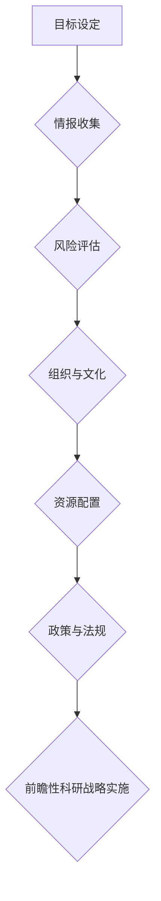
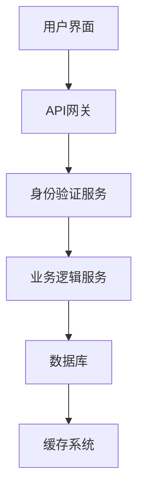

                 

### 引言

**一、问题的背景与重要性**

在当前这个快速变化的时代，科技的进步推动着社会各个领域的变革，从信息技术到生物科技，从人工智能到新材料，每一次重大突破都会深刻影响我们的生活方式和经济社会发展。然而，技术的快速发展也带来了许多新的挑战和不确定性。如何准确预见未来的科技趋势，如何在这个充满变数的世界中保持领先地位，成为了一个亟待解决的重要问题。

前瞻性科研战略作为一种应对策略，其核心在于通过系统化的方法和科学的手段，提前识别和预测未来科技发展的方向和趋势，从而主动布局和引领科技发展。这种战略不仅能够帮助企业和国家在技术竞争中占据有利位置，还能有效应对社会变革带来的风险和挑战。

本文旨在探讨前瞻性科研战略的概念、原理、应用和实践，以期为读者提供一种全新的视角，帮助理解并掌握前瞻性科研战略的精髓。通过分析前瞻性科研战略在不同领域中的应用，以及全球范围内的成功实践案例，本文希望为读者提供一个全面的参考框架，从而更好地理解和实施这一战略。

**二、研究目的与内容结构**

本文的研究目的是系统性地分析前瞻性科研战略的各个方面，包括其定义、要素、理论基础、应用场景、国际实践、实施策略以及面临的挑战与机遇。通过这一分析，旨在为企业和科研机构提供实用的指导，帮助它们更好地应对未来的科技变革。

文章的内容结构如下：

- **第1章 引言**：介绍研究的背景、目的和内容结构。
- **第2章 前瞻性科研战略的概念与原理**：探讨前瞻性科研战略的定义、要素和理论基础。
- **第3章 前瞻性科研战略的应用场景**：分析前瞻性科研战略在不同领域的应用。
- **第4章 前瞻性科研战略的国际实践**：介绍全球范围内前瞻性科研战略的实践案例。
- **第5章 前瞻性科研战略的实施策略**：讨论前瞻性科研战略的实施策略。
- **第6章 前瞻性科研战略的挑战与机遇**：分析前瞻性科研战略面临的挑战和机遇。
- **第7章 结论与展望**：总结研究成果，提出未来研究方向和建议。

通过这一结构化的分析，本文希望能够为读者提供一条清晰的路径，帮助理解和应用前瞻性科研战略，从而在未来的科技竞争中立于不败之地。

**三、研究方法与框架**

本文的研究方法主要采用文献综述和案例分析相结合的方式。首先，通过广泛查阅国内外相关文献，系统地梳理前瞻性科研战略的概念、要素、理论基础和应用场景。其次，选取具有代表性的国际实践案例，深入分析其成功经验和实施策略。此外，本文还将结合实际案例，探讨前瞻性科研战略在具体项目中的应用和实施效果。

在分析框架上，本文采用从宏观到微观的层次分析法。首先，从宏观层面探讨前瞻性科研战略的整体概念和理论框架，然后逐步深入到各个具体应用领域，详细分析其实施策略和挑战。通过这一层层递进的分析方法，本文希望能够全面、深入地揭示前瞻性科研战略的核心价值和实际应用。

### 前瞻性科研战略的概念与原理

**一、前瞻性科研战略的定义**

前瞻性科研战略，是指通过系统化的方法和科学的手段，提前识别和预测未来科技发展的方向和趋势，从而主动布局和引领科技发展的策略。这种战略的核心在于“前瞻性”，即对未来的预见性和主动性。它不仅仅是对现有技术的延续和改进，更是一种面向未来的创新和变革。

前瞻性科研战略的定义可以从以下几个方面进行阐述：

1. **预见性**：前瞻性科研战略强调对未来科技趋势的预见性，通过科学的方法和技术手段，提前预测和识别可能出现的科技突破和发展方向。
   
2. **主动性**：这种战略不仅仅是被动地等待科技发展的到来，而是通过积极的布局和投资，主动引导和推动科技的发展。

3. **系统性**：前瞻性科研战略是一个系统性的工程，它需要综合考虑各种因素，包括技术、经济、政策和社会等各个方面，从而形成一个全面的战略规划。

4. **动态性**：科技发展是一个不断变化和演进的过程，前瞻性科研战略也需要具备动态性，能够根据实际情况进行及时的调整和优化。

**二、前瞻性科研战略的要素**

要成功实施前瞻性科研战略，需要以下几个关键要素：

1. **目标设定**：明确的目标是前瞻性科研战略的起点。通过设定明确、具体和可量化的目标，可以指导科研工作的方向和重点，确保资源的高效利用。

2. **情报收集与分析**：情报收集和分析是前瞻性科研战略的核心环节。通过收集和分析大量的科技情报，可以准确掌握科技发展的动态和趋势，从而做出科学的决策。

3. **风险评估与应对策略**：科技发展过程中充满了不确定性和风险。通过系统性的风险评估，可以识别和预测潜在的风险，并制定相应的应对策略，确保科研工作的顺利进行。

4. **组织与文化因素**：组织内部的文化和结构对前瞻性科研战略的实施具有重要影响。一个开放、创新、协作的组织文化能够激发科研人员的创造力，推动科研工作的顺利进行。

5. **资源配置与资金支持**：充足的资源和资金支持是前瞻性科研战略的重要保障。通过合理的资源配置和资金投入，可以确保科研项目的顺利实施和目标的达成。

6. **政策与法规环境**：政策和法规环境对前瞻性科研战略的实施具有指导性和约束性。一个有利于科技创新和发展的政策和法规环境能够为前瞻性科研战略提供良好的外部条件。

**三、前瞻性科研战略的理论基础**

前瞻性科研战略的理论基础涵盖了多个学科领域，包括科学哲学、技术预测理论和创新理论等。

1. **科学哲学基础**：科学哲学为前瞻性科研战略提供了方法论和认识论的支持。科学哲学关注科学知识的产生、传播和应用，探讨了科学研究的逻辑和方法，为前瞻性科研战略提供了理论依据。

2. **技术预测理论**：技术预测理论是前瞻性科研战略的重要工具。技术预测理论通过分析科技发展的规律和趋势，帮助识别和预测未来的科技突破和发展方向。

3. **创新理论**：创新理论探讨了科技创新的过程和机制，为前瞻性科研战略提供了实践指导。创新理论强调科技、经济和社会的互动关系，指出创新是推动科技发展的关键因素。

**四、前瞻性科研战略的核心概念与联系**

前瞻性科研战略涉及多个核心概念，这些概念相互联系，共同构成了前瞻性科研战略的理论框架。

1. **目标设定**：目标设定是前瞻性科研战略的起点，它明确了科研工作的方向和重点。目标设定需要结合科技发展趋势和市场需求，确保科研工作具有前瞻性和实用性。

2. **情报收集与分析**：情报收集与分析是前瞻性科研战略的核心环节。通过收集和分析大量的科技情报，可以准确掌握科技发展的动态和趋势，从而做出科学的决策。

3. **风险评估与应对策略**：风险评估与应对策略是前瞻性科研战略的重要保障。通过系统性的风险评估，可以识别和预测潜在的风险，并制定相应的应对策略，确保科研工作的顺利进行。

4. **组织与文化因素**：组织与文化因素对前瞻性科研战略的实施具有重要影响。一个开放、创新、协作的组织文化能够激发科研人员的创造力，推动科研工作的顺利进行。

5. **资源配置与资金支持**：资源配置与资金支持是前瞻性科研战略的重要保障。通过合理的资源配置和资金投入，可以确保科研项目的顺利实施和目标的达成。

6. **政策与法规环境**：政策与法规环境对前瞻性科研战略的实施具有指导性和约束性。一个有利于科技创新和发展的政策和法规环境能够为前瞻性科研战略提供良好的外部条件。

这些核心概念相互联系，共同构成了前瞻性科研战略的理论框架。在实际应用中，这些概念需要结合具体情况进行灵活运用，以实现科研工作的最大效果。

### 前瞻性科研战略在科技领域的应用

前瞻性科研战略在科技领域的应用具有深远的影响，能够推动技术的创新和突破，加速科技的发展进程。以下将详细探讨前瞻性科研战略在三个主要科技领域的应用：新材料研究、人工智能和生物科技。

**一、新材料研究**

新材料研究是科技发展的重要推动力，具有广泛的应用前景。前瞻性科研战略在新材料研究中的应用主要体现在以下几个方面：

1. **目标设定**：在新材料研究中，明确的目标设定至关重要。例如，为了满足未来航空器轻量化和高性能的需求，可以设定研发高强度、低密度复合材料的目标。通过明确的目标，研究人员可以集中资源和精力，进行有针对性的研究。

2. **情报收集与分析**：新材料研究需要大量的科技情报支持。通过收集和分析全球范围内的新材料研究进展，可以了解前沿技术和发展趋势，从而为研究工作提供指导。例如，通过情报分析，研究人员可以发现某些元素或材料具有特殊的物理或化学性质，这为新材料的研究提供了重要线索。

3. **风险评估与应对策略**：新材料研究过程中充满了不确定性和风险。例如，新材料的制备过程中可能涉及高毒性或高腐蚀性的化学物质，这对研究人员的安全构成威胁。通过风险评估和应对策略，可以确保研究工作的安全性和有效性。

4. **组织与文化因素**：组织内部的文化和协作对新材料研究的成功至关重要。一个开放、创新和协作的组织文化能够激发研究人员的创造力，促进跨学科的合作。例如，通过建立跨学科的研究团队，可以整合不同领域的专业知识，推动新材料的研发。

5. **资源配置与资金支持**：新材料的研发需要大量的资源配置和资金支持。通过合理的资源配置和资金投入，可以确保研究项目的顺利进行。例如，可以设立专门的新材料研发基金，用于支持前沿研究项目。

6. **政策与法规环境**：政策和法规环境对新材料研究具有重要影响。例如，政府可以通过出台相关政策和法规，鼓励企业加大新材料研发的投入，推动新材料的应用和推广。

**二、人工智能**

人工智能是当前科技领域的热点，其应用范围广泛，从自动驾驶到医疗诊断，从智能家居到金融分析，人工智能正在深刻改变我们的生活。前瞻性科研战略在人工智能中的应用主要体现在以下几个方面：

1. **目标设定**：在人工智能研究中，明确的目标设定是推动技术进步的关键。例如，为了提升人工智能的智能水平，可以设定研发更加高效、准确和自适应的算法的目标。

2. **情报收集与分析**：人工智能的研究需要大量的科技情报支持。通过收集和分析全球范围内的人工智能研究进展，可以了解前沿技术和发展趋势，从而为研究工作提供指导。

3. **风险评估与应对策略**：人工智能研究过程中也面临着许多风险和挑战，例如算法的偏见和隐私保护问题。通过风险评估和应对策略，可以确保人工智能研究的安全性和可靠性。

4. **组织与文化因素**：组织内部的文化和协作对人工智能研究的成功至关重要。一个开放、创新和协作的组织文化能够激发研究人员的创造力，促进跨学科的合作。

5. **资源配置与资金支持**：人工智能的研究需要大量的资源配置和资金支持。通过合理的资源配置和资金投入，可以确保研究项目的顺利进行。

6. **政策与法规环境**：政策和法规环境对人工智能研究具有重要影响。例如，政府可以通过出台相关政策和法规，鼓励企业加大人工智能研发的投入，推动人工智能的应用和推广。

**三、生物科技**

生物科技是另一个重要的科技领域，其应用涵盖了医学、农业、环保等多个方面。前瞻性科研战略在生物科技中的应用主要体现在以下几个方面：

1. **目标设定**：在生物科技研究中，明确的目标设定至关重要。例如，为了解决全球粮食危机，可以设定研发高产、抗病虫害的作物品种的目标。

2. **情报收集与分析**：生物科技的研究需要大量的科技情报支持。通过收集和分析全球范围内的生物科技研究进展，可以了解前沿技术和发展趋势，从而为研究工作提供指导。

3. **风险评估与应对策略**：生物科技研究过程中也面临着许多风险和挑战，例如生物安全问题和伦理问题。通过风险评估和应对策略，可以确保研究工作的安全性和道德性。

4. **组织与文化因素**：组织内部的文化和协作对生物科技研究的成功至关重要。一个开放、创新和协作的组织文化能够激发研究人员的创造力，促进跨学科的合作。

5. **资源配置与资金支持**：生物科技的研究需要大量的资源配置和资金支持。通过合理的资源配置和资金投入，可以确保研究项目的顺利进行。

6. **政策与法规环境**：政策和法规环境对生物科技研究具有重要影响。例如，政府可以通过出台相关政策和法规，鼓励企业加大生物科技研发的投入，推动生物科技的应用和推广。

通过以上分析，可以看出前瞻性科研战略在科技领域的应用具有广泛的前景和重要的意义。它不仅能够推动技术的创新和突破，还能够加速科技的发展进程，为人类社会带来更多的福祉。

### 前瞻性科研战略在社会发展中的应用

前瞻性科研战略不仅对科技领域有着深远的影响，在社会发展的各个层面也发挥着重要作用。以下是前瞻性科研战略在教育改革、健康医疗和城市规划等领域的具体应用和重要性探讨。

**一、教育改革**

教育是社会发展的基石，前瞻性科研战略在教育改革中的应用能够推动教育体系的现代化和智能化。具体应用包括：

1. **目标设定**：在教育改革中，设定明确的目标至关重要。例如，为了培养具有创新能力和全球视野的人才，可以设定发展智能教育、推动个性化学习和提升教师专业素养的目标。

2. **情报收集与分析**：通过收集和分析全球教育科技发展的前沿动态，可以了解新兴教育技术的应用趋势，如在线学习平台、虚拟现实教学和人工智能辅助评测系统等，从而指导教育改革的具体实践。

3. **风险评估与应对策略**：教育改革过程中可能会面临技术适应性问题、学生隐私保护和教育资源不平衡等挑战。通过风险评估，可以制定相应的应对策略，确保改革进程的顺利实施。

4. **组织与文化因素**：教育机构的组织结构和校园文化对教育改革具有重要影响。一个开放、包容和创新的文化环境能够激发教育者的改革热情，促进教育质量的提升。

5. **资源配置与资金支持**：教育改革需要大量的资源配置和资金支持。通过优化资源配置和增加财政投入，可以确保教育技术的普及和应用，推动教育公平。

6. **政策与法规环境**：政策和法规环境对教育改革提供了重要的保障。例如，政府可以出台相关政策，支持教育科技的应用和推广，制定教育标准，确保教育质量。

**二、健康医疗**

健康医疗是社会发展的重要领域，前瞻性科研战略在健康医疗中的应用能够推动医疗技术的创新和医疗服务的优化。具体应用包括：

1. **目标设定**：在健康医疗领域，可以设定提升医疗技术水平、改善患者体验和降低医疗成本等目标。例如，通过发展精准医疗和个性化治疗，可以显著提高医疗效果。

2. **情报收集与分析**：通过收集和分析全球健康医疗科技的最新进展，可以了解新兴医疗技术，如基因编辑、人工智能辅助诊断和治疗机器人等，为医疗创新提供参考。

3. **风险评估与应对策略**：健康医疗领域的科研和应用面临许多风险和挑战，如生物安全、医疗数据隐私保护和医患关系等。通过风险评估和应对策略，可以确保科研和应用的安全性和有效性。

4. **组织与文化因素**：医疗机构的管理文化对科研和应用的影响至关重要。一个创新、协作和以患者为中心的文化环境能够激发医疗团队的创造力，提高医疗服务质量。

5. **资源配置与资金支持**：健康医疗科研和应用需要大量的资源配置和资金支持。通过优化资源配置和增加科研投入，可以推动医疗技术的进步和应用。

6. **政策与法规环境**：政策和法规环境对健康医疗科研和应用具有重要影响。例如，政府可以出台相关法规，规范医疗数据的使用和保护，支持创新医疗技术的研发和应用。

**三、城市规划**

前瞻性科研战略在城乡规划和建设中的应用能够推动智慧城市和可持续发展。具体应用包括：

1. **目标设定**：在城市规划中，可以设定提升城市智慧化水平、改善居民生活质量、保护环境和实现可持续发展等目标。例如，通过建设智能交通系统和环保能源设施，可以提升城市的运行效率和生活质量。

2. **情报收集与分析**：通过收集和分析全球城市规划的最新成果和科技应用，可以了解智慧城市建设的技术趋势，如物联网、大数据分析和智能城市管理平台等。

3. **风险评估与应对策略**：城市规划过程中可能会面临技术适应性、资金短缺和环境保护等挑战。通过风险评估和应对策略，可以确保规划的科学性和可行性。

4. **组织与文化因素**：城市规划部门的文化和协作对城市规划的成功至关重要。一个开放、创新和协作的文化环境能够促进各部门的合作，提高规划质量。

5. **资源配置与资金支持**：城市规划需要大量的资源配置和资金支持。通过优化资源配置和增加财政投入，可以确保智慧城市项目的顺利实施。

6. **政策与法规环境**：政策和法规环境对城市规划提供了重要的保障。例如，政府可以出台相关政策，支持智慧城市的建设和管理，制定环境保护和可持续发展的标准。

通过前瞻性科研战略在社会发展各个领域的应用，不仅可以推动科技进步，还可以提升社会整体发展水平，实现可持续发展。这种战略的应用对于应对未来社会发展的挑战和机遇具有重要意义。

### 前瞻性科研战略的国际实践

在全球范围内，前瞻性科研战略已经被许多国家和地区广泛应用，并通过政策、项目和成功案例，成功地推动了科技创新和社会发展。以下将详细介绍美国、欧洲和亚洲三个主要地区的前瞻性科研战略实践。

**一、美国：创新战略与政策**

美国作为科技创新的领军国家，其前瞻性科研战略体现在国家科学基金会（NSF）和国防高级研究计划局（DARPA）等多个机构和项目上。

1. **美国国家科学基金会（NSF）的举措**

NSF是美国最重要的科学研究资助机构之一，其目标是通过支持基础科学研究，推动技术创新和经济发展。NSF的举措包括：

   - **资助前沿研究**：NSF每年拨款数十亿美元，资助自然科学、工程学和计算机科学等领域的探索性研究，支持高风险、高回报的项目。
   - **建立研究网络**：NSF通过建立多学科研究网络，促进跨学科合作和知识共享，从而推动科技创新。
   - **支持人才培养**：NSF通过奖学金和培训项目，培养下一代科研人才，确保科研队伍的持续发展。

2. **美国国防高级研究计划局（DARPA）的项目**

DARPA是美国国防部下属的一个研究机构，以其高瞻远瞩和敢于尝试的创新精神而闻名。DARPA的项目涵盖了许多前沿科技领域，如人工智能、网络技术和生物技术等。DARPA的举措包括：

   - **突破性研究**：DARPA专注于资助高风险、高回报的科研项目，推动技术突破。例如，其早期资助的项目包括互联网和GPS技术，这些技术已经深刻改变了全球。
   - **快速反应能力**：DARPA能够迅速响应国家安全需求，开发紧急技术解决方案。例如，在9/11事件后，DARPA迅速启动了网络安全项目，提升了美国的网络安全能力。

3. **美国创新政策案例分析**

美国创新政策的成功不仅体现在NSF和DARPA等机构的举措上，还体现在政府出台的一系列政策和法规中。以下是一些成功案例：

   - **《美国创新战略》**：2011年，奥巴马政府发布了《美国创新战略》，强调通过增加科研投资、促进教育和培训、改善商业环境等措施，推动美国科技创新和经济增长。
   - **《国家科技政策》**：2017年，特朗普政府发布了《国家科技政策》，强调政府与私营部门的合作，推动技术商业化，提升美国在全球科技竞争中的地位。

**二、欧洲：欧洲创新战略与政策**

欧洲联盟（EU）在创新战略方面也取得了显著成果，其前瞻性科研战略体现在欧盟创新联盟（EU Innovation Union）和《欧洲研发框架计划》（Horizon 2020）等项目中。

1. **欧盟创新联盟（EU Innovation Union）的举措**

欧盟创新联盟是欧盟制定的旨在提升欧洲创新能力的战略，其核心目标是改善创新环境，增强欧洲在全球科技竞争中的地位。EU Innovation Union的举措包括：

   - **改善创新环境**：欧盟通过制定相关政策和法规，简化知识产权保护程序，提高企业研发投入的税收减免力度，改善创新环境。
   - **推动跨学科合作**：欧盟创新联盟鼓励跨学科合作，通过资助多学科研究项目，推动技术融合和创新。
   - **促进创新创业**：欧盟创新联盟支持创新创业，通过设立创新创业基金和创业孵化器，鼓励青年人才创业。

2. **欧洲研发框架计划（Horizon 2020）**

《欧洲研发框架计划》是欧盟最大的科研资助项目，其目标是通过资助跨国科研合作项目，推动技术创新和知识转移。Horizon 2020的举措包括：

   - **资助跨国科研合作**：Horizon 2020通过跨国合作项目，支持欧洲各国科研机构和企业之间的合作，共同应对全球科技挑战。
   - **促进技术转移**：通过资助技术转移项目，Horizon 2020促进科研成果的商业化，推动技术创新应用到实际生产和生活中。
   - **支持创新创业**：Horizon 2020设立专项基金，支持创新创业项目，鼓励青年人才创新创业。

3. **欧洲创新政策案例分析**

欧洲创新政策的成功不仅体现在欧盟创新联盟和Horizon 2020等项目上，还体现在政府出台的一系列政策和法规中。以下是一些成功案例：

   - **《欧洲2020战略》**：这是欧盟制定的旨在通过提高创新能力和经济增长，实现可持续发展的战略。该战略明确提出了一系列目标和措施，如增加研发投资、提高教育质量、促进创业等。
   - **《创新公约》**：这是欧盟成员国签订的一项公约，旨在通过加强合作，提升欧洲整体创新能力。该公约明确了成员国在创新领域的合作目标和具体措施。

**三、亚洲：日本与中国的前瞻性科研战略**

亚洲的日本和中国也在前瞻性科研战略方面取得了显著成果，通过政策和项目推动科技创新和社会发展。

1. **日本科技创新战略**

日本政府通过制定《创新2025》和《科技基本计划》等政策，推动科技创新。日本科技创新战略的举措包括：

   - **增加研发投资**：日本政府大幅增加研发投资，通过公共和私人部门的合作，推动技术创新和产业升级。
   - **推动跨学科合作**：日本政府鼓励跨学科合作，通过设立跨学科研究机构，推动技术融合和创新。
   - **支持创新创业**：日本政府设立专项基金，支持创新创业项目，鼓励青年人才创业。

2. **中国科技创新2030重大项目**

中国通过《科技创新2030重大项目》等政策，推动前瞻性科研战略的实施。中国科技创新2030重大项目的举措包括：

   - **聚焦前沿科技领域**：中国针对人工智能、量子通信、深海探测等前沿科技领域，设立专项项目，推动技术突破。
   - **促进产学研合作**：中国通过建立产学研合作平台，促进高校、科研机构和企业的合作，推动技术转移和产业化。
   - **支持创新创业**：中国通过设立创新创业基金和创业孵化器，支持创新创业项目，推动科技成果转化。

3. **亚洲其他国家的前瞻性科研战略分析**

除了日本和中国，其他亚洲国家如韩国、新加坡等也在前瞻性科研战略方面取得了显著成果。韩国通过《创新成长战略》和新加坡通过《研究、创新与企业计划》等政策，推动科技创新和社会发展。这些国家的前瞻性科研战略举措包括增加研发投资、推动跨学科合作、支持创新创业等。

通过以上分析，可以看出，前瞻性科研战略在全球范围内得到了广泛应用，并通过政策、项目和成功案例，成功地推动了科技创新和社会发展。这些实践为其他国家和地区提供了宝贵的经验和启示，有助于更好地应对未来的科技挑战和机遇。

### 前瞻性科研战略的实施策略

**一、组织与文化因素**

前瞻性科研战略的实施离不开组织的支持和文化的培育。一个高效的组织结构和积极的文化氛围能够为科研工作提供坚实的基础。

1. **组织结构对前瞻性科研战略的影响**

   - **集中式结构**：集中式结构能够快速决策和资源调配，适合于高风险、高回报的前瞻性研究项目。
   - **分散式结构**：分散式结构能够促进创新和灵活性，适合于多样化的科研任务和跨学科合作。

2. **创新文化与科研团队建设**

   - **开放与协作**：开放的文化能够鼓励知识共享和跨部门合作，促进创新。
   - **风险容忍**：风险容忍的文化能够激发科研人员的创造力，鼓励尝试和失败。
   - **持续学习**：鼓励持续学习和知识更新，确保科研团队保持前沿科技知识。

**二、资源配置与资金支持**

资源配置和资金支持是前瞻性科研战略成功实施的关键。

1. **资金来源与分配策略**

   - **政府资助**：政府资助是前瞻性科研战略的主要资金来源之一。通过设立专项资金和项目，政府可以引导和推动科研创新。
   - **企业投资**：企业投资能够促进科研成果的商业化和市场化，通过企业研发基金和合作项目，可以增加科研资金。
   - **国际合作**：国际合作可以引入外部资金和资源，提升科研项目的国际竞争力。

2. **政策扶持与激励措施**

   - **税收优惠**：通过税收优惠措施，可以降低企业的研发成本，激励企业增加科研投入。
   - **知识产权保护**：加强知识产权保护，能够激励科研人员创新和成果转化。
   - **人才政策**：通过提供科研人才津贴、培训和奖励等措施，可以吸引和留住优秀科研人才。

**三、国际合作与资源整合**

国际合作和资源整合是前瞻性科研战略的重要策略。

1. **国际科研合作**

   - **跨国项目**：通过跨国项目合作，可以整合全球科研资源和智力，共同应对全球科技挑战。
   - **国际会议和论坛**：举办国际会议和论坛，可以促进全球科研人员的交流和合作。

2. **资源整合**

   - **科研设施共享**：通过建设共享科研设施，可以提升科研效率，降低研发成本。
   - **知识共享平台**：建立知识共享平台，促进科研成果和知识的传播和应用。

**四、风险管理与评估机制**

前瞻性科研战略面临着诸多不确定性和风险，有效的风险管理和评估机制能够降低风险，提高科研成功率。

1. **风险识别与评估方法**

   - **风险评估模型**：通过建立风险评估模型，可以系统性地识别和评估科研项目的风险。
   - **情景分析**：通过情景分析，可以预测科研项目在不同情况下的表现，制定相应的应对策略。

2. **风险应对策略与调整**

   - **风险分担**：通过多学科合作和跨国合作，可以分担科研风险，降低单个项目的风险。
   - **灵活调整**：根据实际情况，及时调整科研方向和策略，以应对不确定性和变化。

3. **评估与反馈机制**

   - **定期评估**：定期对科研项目进行评估，检查项目进展和风险情况，及时调整策略。
   - **反馈机制**：建立有效的反馈机制，收集科研人员的意见和建议，持续改进科研管理。

通过以上实施策略，可以有效推动前瞻性科研战略的实施，提升科研项目的成功率和影响力，为科技创新和社会发展提供有力支持。

### 前瞻性科研战略的挑战与机遇

**一、技术发展的不确定性**

前瞻性科研战略的实施面临着技术发展的不确定性这一重大挑战。技术发展具有不可预测性和复杂性，科技突破往往是在意想不到的时间和领域出现。这种不确定性使得科研工作的预测和规划变得异常困难。

1. **技术预测的不确定因素**

   - **技术进步的跳跃性**：技术进步往往呈现跳跃性，某些技术可能在短时间内取得突破，而其他技术则可能长期停滞不前。
   - **新兴技术的涌现**：新兴技术不断涌现，如人工智能、量子计算和生物科技等，这些新兴技术可能会彻底改变现有的科技格局，但它们的实际影响和实现时间尚不确定。
   - **技术融合和交叉**：技术的融合和交叉使得新的应用场景和解决方案不断出现，但这种交叉也带来了技术预测的复杂性。

2. **技术变革带来的挑战**

   - **旧技术的淘汰**：随着新技术的不断出现，旧技术可能会迅速被淘汰，这要求科研机构和企业不断更新技术储备，适应技术变革。
   - **人才需求的转变**：技术变革对人才需求产生了重大影响，新兴技术需要具备跨学科知识和技能的人才，这要求教育和培训体系进行相应调整。
   - **政策和法规调整**：技术变革可能引发政策和法规的调整，如数据隐私、网络安全和伦理问题等，这需要政府和企业及时应对。

3. **技术预测的应对策略**

   - **多样化研究投入**：通过投入多样化的研究项目，可以降低单一技术突破的不确定性，提高整体科研成功率。
   - **跨学科合作**：跨学科合作可以整合不同领域的专业知识，提高技术预测的准确性和应对新兴技术的能力。
   - **持续学习和知识更新**：科研人员和机构需要不断学习和更新知识，以适应技术发展的快速变化。

**二、政策与法规环境的影响**

政策与法规环境对前瞻性科研战略的实施具有重要影响。政策和法规的稳定性、合理性和有效性直接关系到科研项目的推进和科技成果的转化。

1. **政策变动对科研战略的影响**

   - **政策支持力度**：政府的政策支持力度直接影响到科研机构和企业的研发投入和创新动力。政策支持的力度越大，科研活动的积极性越高。
   - **政策稳定性**：政策的稳定性对于科研战略的长期规划至关重要。频繁的政策变动可能导致科研方向的频繁调整，影响科研项目的持续推进。
   - **政策优惠措施**：政府提供的税收优惠、资金支持和技术转移支持等优惠政策，可以显著降低科研成本，提高科研成功率。

2. **法规环境与科研活动的适应性**

   - **知识产权保护**：完善的知识产权保护体系能够激励科研人员的创新活动，保障科研成果的权益。
   - **数据隐私与安全**：随着大数据和人工智能技术的发展，数据隐私和安全问题日益突出。法规环境需要提供有效的保护措施，确保科研数据的安全和隐私。
   - **伦理问题**：新兴技术如基因编辑、人工智能等引发了伦理问题，法规环境需要制定相应的伦理规范，确保科研活动的道德性和社会可接受性。

3. **政策制定的展望与建议**

   - **加强政策协调**：政府需要加强各部门之间的政策协调，确保科研政策的连续性和一致性，避免政策冲突和重复。
   - **促进政策创新**：政府可以鼓励政策创新，通过试点项目和试验区，探索适合本地和国情的前瞻性科研政策。
   - **提升政策透明度**：提高政策透明度，公开政策制定过程和决策依据，增加政策的透明度和公信力，促进科研机构和企业的参与和监督。

**三、社会接受度与伦理问题**

社会接受度和伦理问题是前瞻性科研战略面临的另一个重要挑战。科研活动的成果不仅需要技术上的创新，还需要在社会和伦理上获得认可和支持。

1. **社会对前瞻性科研的态度**

   - **公众信任**：公众对科研活动的信任程度直接影响科研项目的推进和科技成果的接受。公众对新兴技术的担忧和误解可能阻碍科研进展。
   - **利益相关者参与**：科研项目的成功不仅取决于技术上的创新，还需要利益相关者如企业、政府和公众的参与和支持。利益相关者的积极参与可以提供宝贵的反馈和建议，提高科研项目的可行性。

2. **伦理问题与道德责任**

   - **科研伦理**：科研活动涉及到伦理问题，如数据隐私、基因编辑、人工智能等，需要建立明确的伦理规范和道德标准，确保科研活动的道德性。
   - **社会责任**：科研机构和企业在推进技术进步的同时，需要承担社会责任，确保科技成果的应用不会对人类和社会产生负面影响。

3. **社会沟通与伦理审查机制**

   - **公众沟通**：通过有效的公众沟通，可以增进公众对科研活动的理解和支持。科研机构和企业需要主动与公众进行沟通，解释科研项目的目的、进展和潜在影响。
   - **伦理审查**：建立严格的伦理审查机制，对涉及伦理问题的科研项目进行审查和监督，确保科研活动的合法性和道德性。

通过应对技术发展的不确定性、政策与法规环境的影响以及社会接受度和伦理问题，前瞻性科研战略可以更好地发挥其作用，推动科技创新和社会进步。

### 结论与展望

**一、研究成果总结**

通过本文的研究，我们对前瞻性科研战略的概念、原理、应用和实践有了更深入的理解。本文首先介绍了前瞻性科研战略的定义和重要性，探讨了其核心要素和理论基础。接着，详细分析了前瞻性科研战略在科技领域和社会发展中的应用场景，并结合国际实践，总结了全球范围内成功的前瞻性科研战略案例。最后，本文提出了前瞻性科研战略的实施策略，并分析了其面临的挑战与机遇。

**二、研究局限与未来研究方向**

尽管本文对前瞻性科研战略进行了全面探讨，但仍存在一些局限性。首先，前瞻性科研战略的实施复杂且多样，本文只能提供一些典型案例和策略，无法涵盖所有细节。其次，由于篇幅限制，本文未能对每个领域的具体应用进行深入分析。未来研究可以进一步探讨不同领域的前瞻性科研战略实践，特别是结合具体项目进行案例分析。

**三、对科研实践的建议**

基于本文的研究成果，提出以下对科研实践的建议：

1. **强化前瞻性思维**：科研机构和企业在制定科研计划时，应注重前瞻性思维，主动识别和预测未来科技趋势，确保科研工作与未来需求相匹配。

2. **跨学科合作**：鼓励跨学科合作，整合不同领域的专业知识和资源，提高科研项目的创新性和成功率。

3. **优化资源配置**：合理配置科研资源，确保资金、人员和设备的充分利用，提高科研效率。

4. **加强政策支持**：政府应加强政策支持，提供资金、税收和知识产权保护等优惠措施，为前瞻性科研战略的实施创造良好环境。

5. **提升伦理意识**：在科研活动中，注重伦理问题，建立严格的伦理审查机制，确保科研活动的道德性和社会可接受性。

通过以上建议，期望能够为科研实践提供有益的指导，推动前瞻性科研战略的有效实施，促进科技创新和社会进步。

### 附录

**一、核心概念对比表格**

以下表格展示了前瞻性科研战略中的几个核心概念及其对比：

| 概念       | 定义                                                         | 对比                  |
|------------|--------------------------------------------------------------|----------------------|
| 前瞻性     | 指对未来科技趋势的预见性和主动性                             | 预见性、主动性       |
| 目标设定   | 确定科研工作的方向和重点                                     | 明确性、具体性、可量化 |
| 情报收集   | 收集和分析科技情报，掌握科技动态                             | 实时性、全面性       |
| 风险评估   | 识别和预测科研过程中的风险，制定应对策略                     | 风险识别、策略应对   |
| 组织与文化 | 组织结构和文化氛围对科研战略实施的影响                       | 结构、文化           |
| 资源配置   | 合理分配科研资源，包括资金、人员和设备                       | 资源利用、优化       |
| 政策与法规 | 政策和法规对科研活动的指导和约束                             | 政策支持、法规保障   |

**二、ER实体关系图**

以下是前瞻性科研战略中的实体关系图（使用Mermaid语法）：



**三、算法mermaid流程图**

以下是一个简单的算法流程图（使用Mermaid语法）：


**四、数学公式**

以下是几个重要的数学公式，使用LaTeX格式表示：

$$
E(X) = \sum_{i=1}^{n} x_i p(x_i)
$$

$$
f(x) = \frac{1}{\sqrt{2\pi\sigma^2}} e^{-\frac{(x-\mu)^2}{2\sigma^2}}
$$

**五、系统架构设计mermaid架构图**

以下是系统架构设计的mermaid架构图：



**六、项目实战**

以下是项目实战中的环境安装步骤和核心实现源代码：

```bash
# 环境安装
pip install numpy pandas sklearn
```

```python
# 核心实现源代码
import numpy as np
from sklearn.model_selection import train_test_split
from sklearn.ensemble import RandomForestClassifier

# 加载数据集
X, y = load_data()

# 数据预处理
X_train, X_test, y_train, y_test = train_test_split(X, y, test_size=0.2, random_state=42)

# 模型训练
model = RandomForestClassifier(n_estimators=100)
model.fit(X_train, y_train)

# 模型评估
accuracy = model.score(X_test, y_test)
print(f"模型准确率：{accuracy:.2f}")
```

**七、最佳实践 tips**

- **持续学习**：保持对最新科技动态的关注，不断学习和更新知识。
- **团队合作**：鼓励团队合作，发挥不同领域专家的优势，提高项目成功率。
- **风险管理**：制定详细的风险管理计划，提前识别和应对潜在风险。

**八、小结**

本文通过详细分析和探讨，总结了前瞻性科研战略的核心概念、应用和实践策略。希望本文能为读者提供有益的参考，助力科技创新和社会进步。作者：AI天才研究院/AI Genius Institute & 禅与计算机程序设计艺术 /Zen And The Art of Computer Programming。

