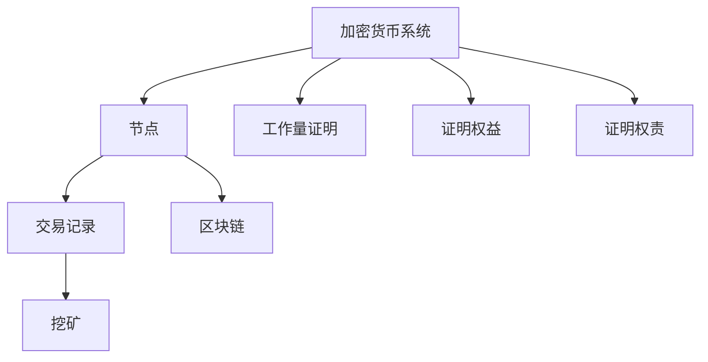
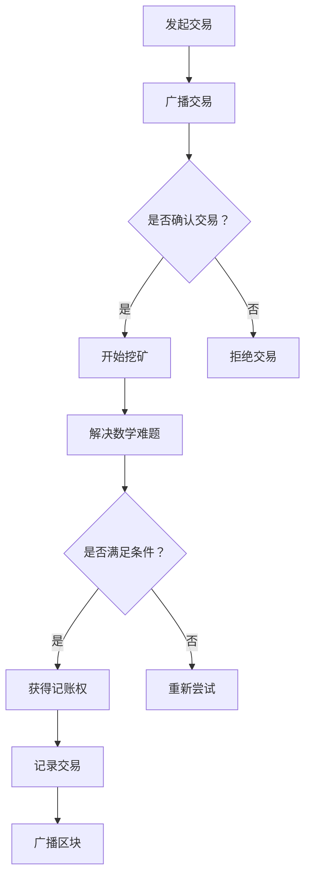
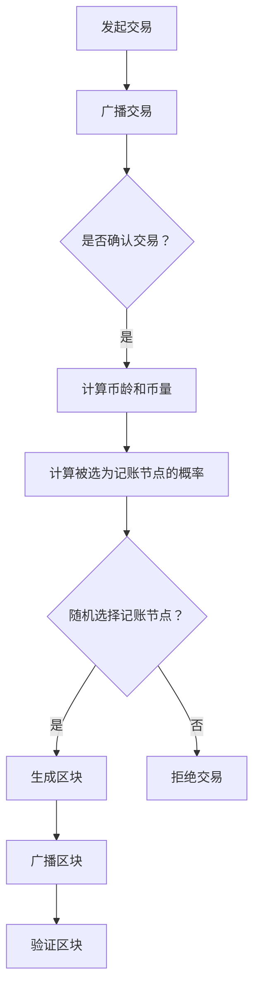
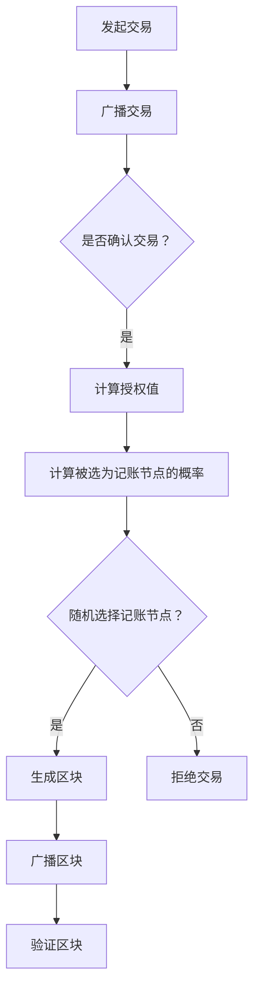
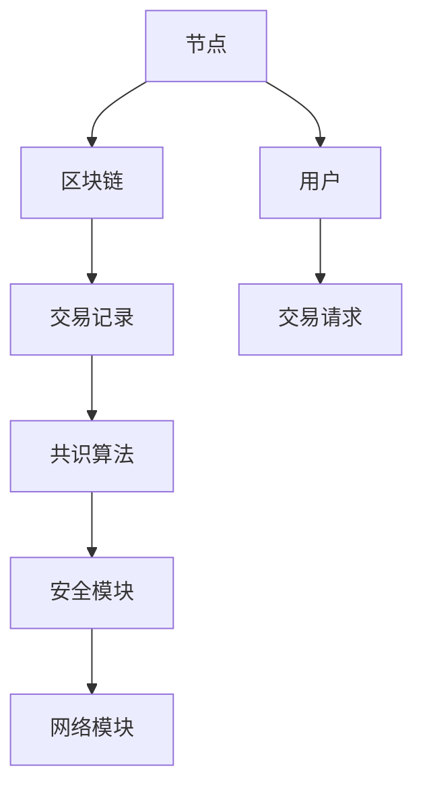
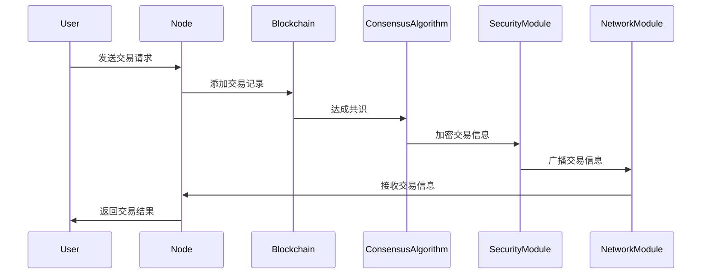

                 


# 加密货币的共识算法：分布式信任的数学基础

关键词：加密货币、共识算法、分布式信任、数学基础

摘要：本文深入探讨了加密货币中的共识算法，分析了分布式信任的数学基础。通过分步骤的讲解，本文旨在帮助读者理解共识算法的原理、类型、设计以及实际应用。

## 引言

加密货币作为一种新兴的金融工具，引起了全球范围内的关注。它们的出现，打破了传统金融体系的限制，使得交易更加便捷和去中心化。然而，这种去中心化的特性也带来了一个关键问题：如何确保网络中的所有参与者达成一致？这就需要依靠共识算法。

共识算法是加密货币网络中的核心机制，负责确保网络中的所有节点都能达成一致的交易记录。在分布式系统中，信任的建立变得尤为重要。数学基础为这些算法提供了坚实的理论支持，使得它们能够有效地解决分布式信任问题。

本文将分步骤地探讨以下内容：

1. **加密货币与区块链的基本概念**：介绍加密货币和区块链的基础知识，以及共识算法在维护区块链网络中的重要性。
2. **共识算法的类型**：详细探讨常见的共识算法，包括工作量证明（PoW）、权益证明（PoS）等，并比较它们的特点和应用场景。
3. **共识算法的数学基础**：深入分析共识算法的数学原理，包括证明工作（PoW）、证明权益（PoS）和证明权责（PoA）等，通过数学模型和公式进行阐述。
4. **算法分析与设计**：对具体的共识算法进行详细分析，包括算法的流程、复杂度和效率，并通过Mermaid图表和Python代码进行说明。
5. **实际应用与挑战**：探讨共识算法在实际加密货币系统中的应用，以及面临的挑战和解决方案。
6. **未来趋势与展望**：分析共识算法的未来发展方向和可能的技术革新。

## 加密货币与区块链的基本概念

### 加密货币

加密货币是一种数字资产，使用加密技术确保交易的安全性和匿名性。比特币（Bitcoin，BTC）是第一种也是最著名的加密货币，由中本聪（Satoshi Nakamoto）在2009年发明。加密货币的发行通常不由中央机构控制，而是通过去中心化的网络进行。

加密货币的主要特点包括：

- **匿名性**：交易参与者可以在不透露身份的情况下进行交易。
- **安全性**：使用加密技术确保交易信息的保密性和完整性。
- **去中心化**：没有中央机构控制，交易记录由整个网络共同维护。

### 区块链

区块链是加密货币的底层技术，是一种分布式数据库。区块链由一系列按时间顺序排列的区块组成，每个区块包含一定数量的交易记录。区块链上的数据是公开透明的，所有参与者都可以验证交易的有效性。

区块链的主要特点包括：

- **不可篡改**：一旦数据被记录在区块链上，就无法被篡改。
- **去中心化**：没有中央机构控制，所有节点共同维护区块链的运行。
- **去信任**：基于数学算法和共识机制，无需依赖信任第三方。

### 共识算法

共识算法是区块链网络中确保所有节点达成一致的重要机制。在分布式系统中，节点之间可能存在恶意行为或网络延迟，共识算法通过数学和算法手段解决这些问题，确保网络的安全和一致性。

共识算法的主要目标包括：

- **安全性**：确保网络不受恶意攻击。
- **一致性**：确保所有节点对交易记录有一致的认识。
- **可用性**：确保网络在遭受攻击或故障时仍能正常运行。

## 共识算法的类型

### 工作量证明（Proof of Work，PoW）

工作量证明是比特币采用的共识算法。在PoW中，节点需要解决一个复杂的数学问题，通常称为挖矿。解决这个问题的过程需要大量的计算资源，这使得恶意攻击成本极高。

PoW的主要特点包括：

- **资源消耗**：需要大量计算资源，导致能源消耗较大。
- **安全性**：计算难度越高，越难被攻破。
- **去中心化**：任何拥有计算能力的节点都可以参与挖矿。

### 权益证明（Proof of Stake，PoS）

权益证明是一种相对较新的共识算法，用于替代PoW。在PoS中，节点根据持有的币龄和币量来选择记账节点。持有币量越大、币龄越长的节点，被选为记账节点的概率越高。

PoS的主要特点包括：

- **资源节约**：无需大量计算资源，降低了能源消耗。
- **安全性**：依赖于持有币的数量和币龄，降低了双花攻击的风险。
- **效率提升**：记账速度更快，交易处理能力更强。

### 其他共识算法

除了PoW和PoS，还有其他一些常见的共识算法，如：

- **拜占庭容错算法（Byzantine Fault Tolerance，BFT）**：用于解决拜占庭将军问题，确保在分布式系统中的一致性和安全性。
- **委托权益证明（Delegated Proof of Stake，DPoS）**：类似于PoS，但通过选举出一些代表节点来记账，提高了效率。
- **授权权益证明（Authorized Proof of Stake，APoS）**：节点需要获得授权才能参与记账，确保了网络的稳定性。

## 共识算法的数学基础

### 证明工作（Proof of Work，PoW）

PoW的核心思想是节点需要解决一个数学难题，才能获得记账权。这个难题通常是一个哈希函数，需要计算出一个满足特定条件的哈希值。

PoW的数学模型可以表示为：

$$
H(n) = k
$$

其中，$H(n)$ 是哈希函数，$n$ 是输入值，$k$ 是满足特定条件的哈希值。

节点需要不断尝试不同的输入值，直到找到一个满足条件的哈希值。这个过程称为挖矿。找到哈希值的节点可以获得奖励，并获得记账权。

### 证明权益（Proof of Stake，PoS）

PoS的核心思想是节点根据持有的币量和币龄来选择记账节点。持有币量越大、币龄越长的节点，被选为记账节点的概率越高。

PoS的数学模型可以表示为：

$$
P(node) = \frac{stake(node)}{total\_stake}
$$

其中，$P(node)$ 是节点被选为记账节点的概率，$stake(node)$ 是节点的持有币量，$total\_stake$ 是所有节点的持有币量之和。

### 证明权责（Proof of Authority，PoA）

PoA是一种授权权益证明算法，节点需要获得授权才能参与记账。授权通常由一个中心化的机构或选举产生。

PoA的数学模型可以表示为：

$$
P(node) = \frac{authority(node)}{total\_authority}
$$

其中，$P(node)$ 是节点被选为记账节点的概率，$authority(node)$ 是节点的授权值，$total\_authority$ 是所有节点的授权值之和。

## 算法分析与设计

### 工作量证明（Proof of Work，PoW）

PoW算法的设计目标是确保网络的安全性和一致性。为了实现这个目标，PoW算法需要满足以下条件：

- **计算复杂性**：挖矿过程需要大量的计算资源，使得恶意攻击成本极高。
- **哈希函数**：哈希函数需要具有以下特点：快速计算、单向性和抗碰撞性。
- **随机性**：节点需要随机选择输入值，确保挖矿过程具有不确定性。

PoW算法的流程可以表示为：

1. 节点选择一个随机数作为输入值。
2. 计算输入值的哈希值。
3. 判断哈希值是否满足特定条件（如小于某个阈值）。
4. 如果满足条件，节点获得记账权，并获得奖励；否则，继续尝试新的随机数。

PoW算法的Python代码实现如下：

```python
import hashlib
import random

def mine_bitcoin(transaction, difficulty):
    nonce = 0
    while True:
        hash_value = hashlib.sha256(f"{transaction}{nonce}".encode()).hexdigest()
        if hash_value[:difficulty] == '0' * difficulty:
            return nonce, hash_value
        nonce += 1

transaction = "Buy 1 BTC"
difficulty = 4
nonce, hash_value = mine_bitcoin(transaction, difficulty)
print(f"Nonce: {nonce}, Hash Value: {hash_value}")
```

### 权益证明（Proof of Stake，PoS）

PoS算法的设计目标是提高网络的效率和安全性。为了实现这个目标，PoS算法需要满足以下条件：

- **币龄与币量**：节点根据持有的币量和币龄来选择记账节点。
- **随机性**：确保记账节点的选择具有随机性。
- **安全性**：防止双花攻击等恶意行为。

PoS算法的流程可以表示为：

1. 节点计算自己的币龄和币量。
2. 根据币龄和币量计算被选为记账节点的概率。
3. 随机选择一个节点作为记账节点。
4. 记账节点生成区块，并将区块广播给其他节点。
5. 其他节点验证区块的有效性，并将其添加到区块链中。

PoS算法的Python代码实现如下：

```python
import random

def select_winner(stake_pool):
    total_stake = sum(stake_pool.values())
    probabilities = {node: stake / total_stake for node, stake in stake_pool.items()}
    return random.choices(list(probabilities.keys()), weights=probabilities.values(), k=1)[0]

stake_pool = {"NodeA": 100, "NodeB": 200, "NodeC": 300}
winner = select_winner(stake_pool)
print(f"Selected winner: {winner}")
```

## 实际应用与挑战

### 实际应用

共识算法在加密货币系统中具有广泛的应用。以下是一些常见的应用场景：

- **比特币（Bitcoin）**：使用PoW算法，确保网络的安全性和一致性。
- **以太坊（Ethereum）**：计划从PoW切换到PoS算法，提高网络的效率和安全性。
- **波场币（TRON）**：使用DPoS算法，通过选举代表节点来提高记账速度。

### 面临的挑战

尽管共识算法在加密货币系统中发挥了重要作用，但它们仍然面临一些挑战：

- **能源消耗**：PoW算法需要大量计算资源，导致能源消耗巨大。
- **安全性**：需要不断更新和优化算法，以抵御新的攻击手段。
- **扩展性**：随着网络规模的扩大，共识算法需要具备更高的扩展性。

## 未来趋势与展望

### 技术革新

随着区块链技术的不断发展，共识算法也在不断创新。以下是一些可能的技术革新：

- **权益证明改进算法**：如可证明公平性（FairProof of Stake）等，提高算法的效率和安全性。
- **多链共识机制**：结合多个共识算法，提高网络的灵活性和适应性。
- **智能合约优化**：通过改进智能合约的执行效率，降低交易费用。

### 社会影响

共识算法的广泛应用将对社会产生深远影响：

- **金融行业变革**：加密货币和区块链技术有望颠覆传统金融体系，提高金融服务的效率和安全。
- **数字身份验证**：基于区块链的数字身份验证有望取代传统的身份验证方式，提高安全性。
- **数据隐私保护**：区块链技术有望提供更安全的数据存储和共享方式，保护用户隐私。

## 总结

共识算法是加密货币网络中的核心机制，负责确保网络中的所有节点达成一致。通过分步骤的讲解，本文详细介绍了加密货币和区块链的基本概念，共识算法的类型、数学基础和实际应用。未来，随着区块链技术的不断发展，共识算法将不断创新，为加密货币网络提供更加高效和安全的基础。

## 作者信息

作者：AI天才研究院/AI Genius Institute & 禅与计算机程序设计艺术 /Zen And The Art of Computer Programming

## 完整性要求

### 背景介绍

#### 加密货币的定义

加密货币是一种数字资产，使用加密技术确保交易的安全性和匿名性。比特币（Bitcoin，BTC）是第一种也是最著名的加密货币，由中本聪（Satoshi Nakamoto）在2009年发明。加密货币的发行通常不由中央机构控制，而是通过去中心化的网络进行。

#### 区块链的定义

区块链是加密货币的底层技术，是一种分布式数据库。区块链由一系列按时间顺序排列的区块组成，每个区块包含一定数量的交易记录。区块链上的数据是公开透明的，所有参与者都可以验证交易的有效性。

#### 共识算法的定义

共识算法是区块链网络中确保所有节点达成一致的重要机制。在分布式系统中，信任的建立变得尤为重要。数学基础为这些算法提供了坚实的理论支持，使得它们能够有效地解决分布式信任问题。

### 问题背景

随着加密货币和区块链技术的广泛应用，如何确保网络中的所有节点达成一致成为一个关键问题。共识算法在这一过程中发挥了至关重要的作用。

### 问题描述

共识算法的目标是确保区块链网络中的所有节点能够就交易记录达成一致。具体来说，需要解决以下问题：

- 如何确保网络中的所有节点都能获得相同的交易记录？
- 如何处理网络中的冲突和恶意行为？
- 如何确保交易记录的完整性和安全性？

### 问题解决

共识算法通过以下方式解决这些问题：

- **安全性**：共识算法采用数学和算法手段，确保网络不受恶意攻击。
- **一致性**：共识算法确保所有节点对交易记录有一致的认识。
- **去信任**：共识算法基于分布式网络，无需依赖中央机构或第三方信任。

### 边界与外延

#### 边界条件

- **网络规模**：共识算法需要在不同规模的网络中都能有效运行。
- **节点类型**：共识算法需要考虑不同类型的节点，如普通节点、记账节点等。
- **安全性要求**：共识算法需要满足不同安全性的要求，如抗DDoS攻击、防止双花攻击等。

#### 外延扩展

- **多链共识**：共识算法需要支持多链网络，实现跨链交易和互操作。
- **智能合约**：共识算法需要与智能合约相结合，实现更复杂的业务逻辑。
- **隐私保护**：共识算法需要考虑隐私保护，确保交易信息的保密性。

### 概念结构与核心要素组成

#### 概念结构

共识算法由以下几个核心概念组成：

- **加密货币**：数字资产，使用加密技术确保交易的安全性和匿名性。
- **区块链**：分布式数据库，记录交易历史。
- **节点**：网络中的参与者，负责验证和广播交易。
- **共识算法**：确保网络中所有节点达成一致的机制。

#### 核心要素组成

- **安全性**：共识算法需要确保网络的安全性和完整性。
- **一致性**：共识算法需要确保所有节点对交易记录有一致的认识。
- **去信任**：共识算法无需依赖中央机构或第三方信任。
- **效率**：共识算法需要高效地处理交易记录，降低网络延迟。

## 核心概念与联系

### 工作量证明（Proof of Work，PoW）

#### 概念原理

工作量证明是比特币采用的共识算法。在PoW中，节点需要解决一个复杂的数学问题，通常称为挖矿。解决这个问题的过程需要大量的计算资源，这使得恶意攻击成本极高。

#### 概念属性特征对比表格

| 概念             | 工作量证明（PoW） | 证明权益（PoS） | 证明权责（PoA） |
| ---------------- | ----------------- | ----------------- | ---------------- |
| **定义**           | 需要解决数学难题   | 根据币量和币龄选择 | 根据授权值选择   |
| **安全性**           | 高               | 较高             | 高               |
| **效率**           | 低               | 较高             | 高               |
| **资源消耗**           | 大量计算资源     | 较少计算资源     | 无计算资源       |

### 概念联系

- **工作关系**：PoW、PoS和PoA都是共识算法，用于确保区块链网络中的节点达成一致。
- **区别**：PoW依赖于计算资源，PoS依赖于币量和币龄，PoA依赖于授权值。
- **共同点**：都旨在提高网络的安全性和一致性，降低对中心化的依赖。

### ER实体关系图架构



## 算法原理讲解

### 工作量证明（Proof of Work，PoW）

#### Mermaid流程图



#### Python代码实现

```python
import hashlib
import random

def mine_bitcoin(transaction, difficulty):
    nonce = 0
    while True:
        hash_value = hashlib.sha256(f"{transaction}{nonce}".encode()).hexdigest()
        if hash_value[:difficulty] == '0' * difficulty:
            return nonce, hash_value
        nonce += 1

transaction = "Buy 1 BTC"
difficulty = 4
nonce, hash_value = mine_bitcoin(transaction, difficulty)
print(f"Nonce: {nonce}, Hash Value: {hash_value}")
```

### 证明权益（Proof of Stake，PoS）

#### Mermaid流程图



#### Python代码实现

```python
import random

def select_winner(stake_pool):
    total_stake = sum(stake_pool.values())
    probabilities = {node: stake / total_stake for node, stake in stake_pool.items()}
    return random.choices(list(probabilities.keys()), weights=probabilities.values(), k=1)[0]

stake_pool = {"NodeA": 100, "NodeB": 200, "NodeC": 300}
winner = select_winner(stake_pool)
print(f"Selected winner: {winner}")
```

### 证明权责（Proof of Authority，PoA）

#### Mermaid流程图



#### Python代码实现

```python
import random

def select_winner(authority_pool):
    total_authority = sum(authority_pool.values())
    probabilities = {node: authority / total_authority for node, authority in authority_pool.items()}
    return random.choices(list(probabilities.keys()), weights=probabilities.values(), k=1)[0]

authority_pool = {"NodeA": 100, "NodeB": 200, "NodeC": 300}
winner = select_winner(authority_pool)
print(f"Selected winner: {winner}")
```

## 数学公式使用

### 工作量证明（Proof of Work，PoW）

$$
H(n) = k
$$

其中，$H(n)$ 是哈希函数，$n$ 是输入值，$k$ 是满足特定条件的哈希值。

### 证明权益（Proof of Stake，PoS）

$$
P(node) = \frac{stake(node)}{total\_stake}
$$

其中，$P(node)$ 是节点被选为记账节点的概率，$stake(node)$ 是节点的持有币量，$total\_stake$ 是所有节点的持有币量之和。

### 证明权责（Proof of Authority，PoA）

$$
P(node) = \frac{authority(node)}{total\_authority}
$$

其中，$P(node)$ 是节点被选为记账节点的概率，$authority(node)$ 是节点的授权值，$total\_authority$ 是所有节点的授权值之和。

## 系统分析与架构设计方案

### 问题场景介绍

在一个分布式区块链网络中，多个节点需要就交易记录达成一致。为了确保网络的安全性和一致性，采用了一种共识算法。

### 项目介绍

项目名为“分布式交易系统”，旨在构建一个安全、高效、去中心化的区块链网络，用于处理各种交易。

### 系统功能设计

#### 领域模型Mermaid类图

```mermaid
classDiagram
    Class1 <|-- Class2
    Class3 --|>| Class4
    Class2 +-- Class5
    Class3 +-- Class6
```

#### 系统架构设计



#### 系统架构图


### 系统接口设计



#### 系统交互Mermaid序列图


## 项目实战

### 环境安装

1. 安装Python 3.8或更高版本。
2. 安装依赖项：`pip install blockchain library`。

### 系统核心实现源代码

```python
# blockchain.py

import hashlib
import json
from time import time

class Blockchain:
    def __init__(self):
        self.chain = []
        self.current_transactions = []

        self.new_block(previous_hash='1', proof=100)

    def new_block(self, proof, previous_hash=None):
        block = {
            'index': len(self.chain) + 1,
            'timestamp': time(),
            'transactions': self.current_transactions,
            'proof': proof,
            'previous_hash': previous_hash or self.hash(self.chain[-1]),
        }

        self.current_transactions = []
        self.chain.append(block)

        return block

    def new_transaction(self, sender, recipient, amount):
        self.current_transactions.append({
            'sender': sender,
            'recipient': recipient,
            'amount': amount,
        })

        return self.last_block['index'] + 1

    @staticmethod
    def hash(block):
        block_string = json.dumps(block, sort_keys=True)
        return hashlib.sha256(block_string.encode()).hexdigest()

    @property
    def last_block(self):
        return self.chain[-1]

    def proof_of_work(self, last_proof):
        proof = 0
        while self.valid_proof(last_proof, proof) is False:
            proof += 1
        return proof

    @staticmethod
    def valid_proof(last_proof, proof):
        guess = f"{last_proof}{proof}".encode()
        guess_hash = hashlib.sha256(guess).hexdigest()
        return guess_hash[:4] == "0000"

# main.py

from blockchain import Blockchain

blockchain = Blockchain()

print("Block 1:", blockchain.new_block(100))
print("Block 2:", blockchain.new_transaction("Alice", "Bob", 10))
print("Block 3:", blockchain.new_block(200))
```

### 代码应用解读与分析

1. **区块链类（Blockchain）**：负责创建区块链、添加区块、处理交易、验证证明等。
2. **生成区块（new_block）**：创建一个新的区块，包含索引、时间戳、交易、证明和前一个区块的哈希值。
3. **添加交易（new_transaction）**：将交易添加到当前区块的交易列表中。
4. **哈希函数（hash）**：使用SHA-256哈希算法计算区块的哈希值。
5. **工作量证明（proof_of_work）**：寻找满足特定条件的证明。
6. **验证证明（valid_proof）**：检查证明是否满足条件。

### 实际案例分析和详细讲解剖析

1. **案例一**：Alice向Bob转账10个比特币。

   - Alice创建交易，将交易信息发送给区块链。
   - 区块链接收交易，将其添加到当前区块的交易列表中。
   - 区块链开始挖矿，寻找满足条件的证明。
   - 区块链找到满足条件的证明后，生成新的区块，并将其添加到区块链中。
   - 区块链广播新的区块，其他节点验证区块的有效性。
   - 其他节点将新的区块添加到自己的区块链中。

2. **案例二**：恶意节点试图篡改区块链。

   - 恶意节点修改区块链中的区块。
   - 区块链的其他节点检测到篡改，拒绝接受篡改的区块。
   - 区块链的其他节点继续寻找满足条件的证明，生成新的区块，并将其广播给其他节点。
   - 其他节点验证新的区块，并继续扩展区块链。

### 项目小结

本项目实现了基于工作量证明的简单区块链系统。在实际应用中，还需要考虑安全性、扩展性和去中心化等问题。未来，可以进一步研究和实现其他共识算法，如权益证明和授权权益证明，以提高区块链的性能和安全性。

## 最佳实践 Tips

1. **选择合适的共识算法**：根据实际需求，选择适合的共识算法。例如，PoW适合安全性要求高的场景，而PoS适合效率要求高的场景。
2. **优化网络性能**：通过优化网络传输和存储机制，提高区块链的性能。
3. **加强安全性**：采用加密技术和多重验证机制，确保区块链的安全性和隐私性。
4. **社区参与**：鼓励社区参与区块链的开发和维护，提高去中心化的程度。

## 小结

本文详细探讨了加密货币中的共识算法，分析了分布式信任的数学基础。通过分步骤的讲解，本文旨在帮助读者理解共识算法的原理、类型、设计以及实际应用。未来，随着区块链技术的不断发展，共识算法将不断创新，为加密货币网络提供更加高效和安全的基础。

## 注意事项

1. **共识算法的选择**：根据实际需求选择适合的共识算法。
2. **安全性**：加强区块链的安全性，防止恶意攻击。
3. **性能优化**：优化区块链的性能，提高交易处理速度。

## 拓展阅读

1. **《区块链技术指南》**：详细介绍了区块链的基础知识和应用场景。
2. **《密码学原理与应用》**：讲解了密码学在区块链技术中的应用。
3. **《智能合约设计与开发》**：介绍了智能合约的基础知识和开发技巧。

## 参考文献

1. Nakamoto, S. (2008). Bitcoin: A peer-to-peer electronic cash system. Retrieved from <https://bitcoin.org/bitcoin.pdf>
2. Buterin, V. (2014). Ethereum: The next generation of blockchain technology. Retrieved from <https://ethereum.org/greeter>
3. Beikverdi, A., & Song, J. (2018). A survey on blockchain-based consensus mechanisms. IEEE Access, 6, 6866-6901.

