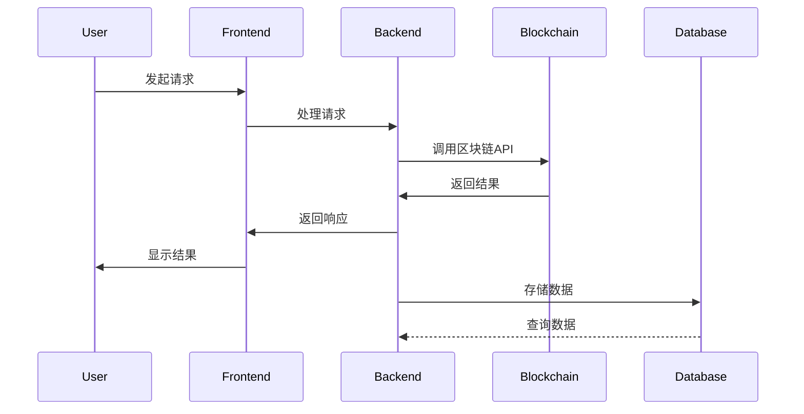
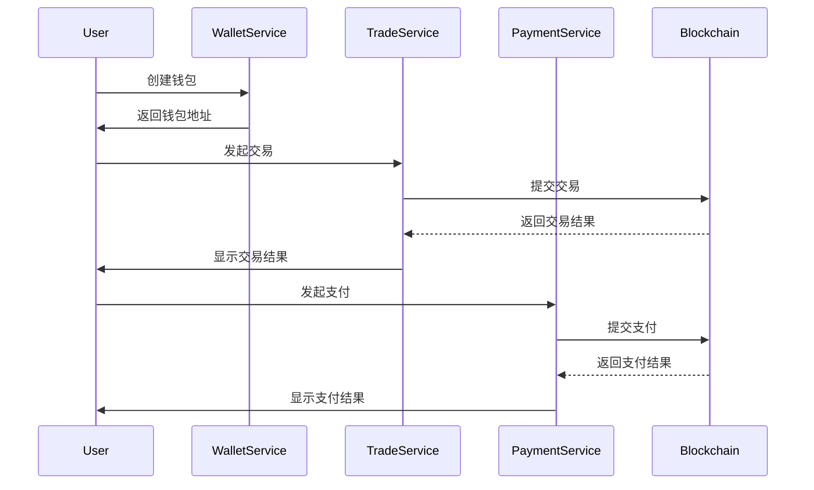

                 

**加密货币的经济模型：数字金融的数学基础**

**关键词：** 加密货币、经济模型、数字金融、数学基础、资产定价、市场需求

**摘要：** 本文章将深入探讨加密货币的经济模型，通过分析加密货币的需求与供给、资产定价模型等，揭示数字金融的数学基础。我们将以比特币和以太坊为例，结合实际案例，详细讲解加密货币的经济模型如何运作，并展望数字金融的未来发展趋势。

----------------------------------------------------------------

# 第1章 引言

### 1.1 加密货币的发展背景

加密货币，作为一种去中心化的数字货币，起源于2009年比特币的诞生。比特币的出现标志着区块链技术的首次商用，其独特的去中心化、安全性和匿名性迅速吸引了全球的目光。随着区块链技术的不断发展，越来越多的加密货币如以太坊、莱特币等相继诞生，形成了如今多样化的加密货币市场。

加密货币的兴起，源于对传统金融体系的质疑。传统金融体系以中央银行为核心，存在着中介成本高、交易速度慢、信息透明度低等问题。而加密货币通过区块链技术实现了去中心化，消除了中介环节，提升了交易效率，降低了交易成本。这使得加密货币成为了一种极具潜力的数字金融创新。

### 1.2 经济模型的重要性

经济模型是对现实经济活动的一种简化和抽象，通过数学和逻辑的方式，分析和预测经济的运行规律。经济模型在金融领域具有至关重要的作用，它可以帮助我们理解市场的运行机制，预测资产价格波动，评估投资风险，制定经济政策等。

在加密货币领域，经济模型同样至关重要。加密货币作为一种新型资产类别，其价格波动受到多种因素的影响，如市场需求、供应量、政策变化等。通过构建和分析经济模型，我们可以更好地理解加密货币的价格形成机制，预测市场走势，从而做出更明智的投资决策。

### 1.3 数字金融的基本概念

数字金融，是指利用数字技术和互联网平台，实现金融业务和服务的一种新型金融模式。数字金融包括区块链、加密货币、P2P借贷、金融科技等多个方面。其中，区块链技术是数字金融的核心，它通过分布式账本和智能合约，实现了去中心化的金融交易和管理。

加密货币是数字金融的重要组成部分。作为一种数字资产，加密货币具有去中心化、匿名性、安全性等特点。随着加密货币市场的不断发展，它已经成为了一种重要的投资标的，吸引了大量的投资者和资金。

----------------------------------------------------------------

## 第2章 加密货币的基本概念

### 2.1 加密货币的起源与特点

加密货币的起源可以追溯到2008年，当时一个名叫中本聪的匿名人士发布了比特币的白皮书，提出了去中心化的数字货币构想。比特币的诞生标志着加密货币的正式诞生，它通过区块链技术实现了去中心化的交易，打破了传统金融体系的垄断。

加密货币具有以下特点：

1. **去中心化**：加密货币不依赖于中央机构，通过分布式网络实现交易和管理，确保了系统的安全性。
2. **安全性**：加密货币的交易记录被加密存储在区块链上，具有不可篡改的特性，确保了交易的安全。
3. **匿名性**：加密货币的交易可以匿名进行，保护了用户的隐私。
4. **稀缺性**：大多数加密货币都有固定的供应量，如比特币的总量为2100万枚，这保证了货币的价值不会无限膨胀。

### 2.2 加密货币的分类

根据加密货币的特性和应用场景，可以将加密货币分为以下几类：

1. **比特币**：比特币是第一种加密货币，也是最具代表性的加密货币，其总量固定，具有广泛的市场认可度。
2. **以太坊**：以太坊是一种智能合约平台，其独特的以太币（ETH）具有很高的投资价值。
3. **稳定币**：稳定币是一种价值稳定的加密货币，其价值通常与美元、黄金等资产挂钩，如泰达币（USDT）。
4. **平台币**：平台币是特定区块链平台的原生代币，如波场币（TRX）。

### 2.3 加密货币的工作原理

加密货币的工作原理主要基于区块链技术。区块链是一个分布式账本，记录了所有的交易记录。每个区块都包含一定数量的交易，并通过加密算法与之前的区块相连，形成了一个链式结构。

1. **挖矿**：挖矿是加密货币产生的过程。矿工通过解决复杂的数学问题，验证交易的有效性，并将其记录在区块链上。作为奖励，矿工可以获得一定数量的加密货币。
2. **交易**：加密货币的交易是通过区块链进行的。用户可以通过私钥对交易进行签名，确保交易的安全性。交易记录将被矿工验证并记录在区块链上。
3. **共识机制**：共识机制是区块链网络达成一致的方式。常见的共识机制有工作量证明（PoW）、权益证明（PoS）等。共识机制确保了区块链网络的稳定和安全。

通过以上三个步骤，加密货币实现了去中心化的交易和管理，确保了系统的安全性和透明度。

----------------------------------------------------------------

## 第3章 经济模型的基本原理

### 3.1 经济模型的定义与作用

经济模型是对现实经济活动的一种简化和抽象，通过数学和逻辑的方式，分析和预测经济的运行规律。经济模型可以帮助我们理解市场的运行机制，预测资产价格波动，评估投资风险，制定经济政策等。

在加密货币领域，经济模型同样具有重要作用。它可以帮助我们理解加密货币的供求关系，预测加密货币的价格走势，评估投资风险等。例如，通过供求模型，我们可以分析加密货币的需求和供给，预测市场的供需平衡情况；通过资产定价模型，我们可以评估加密货币的价值，预测其价格波动。

### 3.2 市场供求模型

市场供求模型是经济学中一种基本模型，用于分析商品或服务的供求关系及其对价格的影响。在加密货币领域，市场供求模型可以帮助我们分析加密货币的需求和供给。

#### 3.2.1 需求模型

加密货币的需求模型主要受到以下几个因素的影响：

1. **用户需求**：加密货币的用户需求直接影响其价格。用户需求的增加将导致价格上涨，用户需求的减少将导致价格下跌。
2. **投资需求**：加密货币作为一种投资资产，其价格受到投资者需求的影响。投资者需求的增加将导致价格上涨，投资者需求的减少将导致价格下跌。
3. **政策变化**：政策变化对加密货币的需求有重要影响。例如，某些国家的政策可能禁止加密货币交易，这将减少加密货币的需求。

#### 3.2.2 供给模型

加密货币的供给模型主要受到以下几个因素的影响：

1. **挖矿奖励**：加密货币的挖矿奖励直接影响其供给。随着挖矿难度增加，挖矿奖励将逐渐减少，从而影响加密货币的供给。
2. **总供应量**：某些加密货币的总供应量是固定的，例如比特币。总供应量的固定性使得加密货币的供给受到严格限制。
3. **新币发行**：某些加密货币会定期进行新币发行，这会影响加密货币的供给。新币发行的增加将导致价格上涨，新币发行的减少将导致价格下跌。

#### 3.2.3 市场平衡分析

市场平衡是指市场需求和供给相等的状态。在加密货币市场中，市场平衡分析可以帮助我们理解价格的形成机制。

当市场需求大于供给时，价格将上涨；当市场需求小于供给时，价格将下跌。市场平衡点的价格反映了市场的供求关系，是投资者进行投资决策的重要依据。

### 3.3 资产定价模型

资产定价模型用于评估资产的价值，预测其价格波动。在加密货币领域，资产定价模型可以帮助我们评估加密货币的价值，预测其价格走势。

#### 3.3.1 市场效率假设

市场效率假设是资产定价模型的基础。市场效率假设认为，市场上的信息是充分和有效的，投资者可以充分利用这些信息进行投资决策。在市场效率假设下，资产的价格反映了其内在价值。

#### 3.3.2 有效市场理论

有效市场理论是市场效率假设的一种具体表现。有效市场理论认为，资产的价格在任何时点都反映了所有已知信息，投资者无法通过分析历史价格信息来获取超额收益。

#### 3.3.3 加密货币价格波动分析

加密货币的价格波动受到多种因素的影响，如市场需求、供给、政策变化、市场情绪等。通过有效市场理论，我们可以分析这些因素对加密货币价格波动的影响，预测价格走势。

例如，当市场需求增加时，加密货币的价格将上涨；当市场需求减少时，加密货币的价格将下跌。政策变化和市场情绪也会对价格产生重要影响。通过分析这些因素，我们可以更好地理解加密货币的价格波动机制，预测价格走势。

----------------------------------------------------------------

## 第4章 加密货币的供求模型

### 4.1 加密货币的需求模型

加密货币的需求模型主要受到以下因素的影响：

1. **用户需求**：用户需求是加密货币需求的主要来源。用户需求的变化直接影响加密货币的价格。例如，当加密货币被广泛应用于支付、投资等领域时，用户需求将增加，推动价格上涨。

2. **投资需求**：投资需求也是加密货币需求的重要来源。加密货币作为一种投资资产，其价格受到投资者需求的影响。投资者需求的增加将导致价格上涨，投资者需求的减少将导致价格下跌。

3. **政策变化**：政策变化对加密货币的需求有重要影响。例如，某些国家的政策可能禁止加密货币交易，这将减少加密货币的需求。

4. **市场情绪**：市场情绪也是影响加密货币需求的重要因素。市场情绪的变化会影响投资者的投资决策，进而影响加密货币的需求。

### 4.2 加密货币的供给模型

加密货币的供给模型主要受到以下因素的影响：

1. **挖矿奖励**：挖矿奖励是加密货币供给的主要来源。挖矿奖励直接影响加密货币的供给。例如，比特币的挖矿奖励随着挖矿难度的增加而逐渐减少。

2. **总供应量**：某些加密货币的总供应量是固定的，例如比特币。总供应量的固定性使得加密货币的供给受到严格限制。

3. **新币发行**：某些加密货币会定期进行新币发行，这会影响加密货币的供给。新币发行的增加将导致价格上涨，新币发行的减少将导致价格下跌。

4. **挖矿难度**：挖矿难度直接影响挖矿奖励，从而影响加密货币的供给。挖矿难度的增加将导致挖矿奖励减少，供给减少；挖矿难度的降低将导致挖矿奖励增加，供给增加。

### 4.3 市场平衡分析

加密货币市场的平衡状态是指市场需求和供给相等的状态。市场平衡点的价格反映了市场的供求关系，是投资者进行投资决策的重要依据。

#### 市场需求分析

市场需求分析主要通过分析用户需求、投资需求、政策变化和市场情绪等因素来预测加密货币的需求。

1. **用户需求**：随着加密货币在支付、投资、供应链金融等领域的广泛应用，用户需求有望持续增长。

2. **投资需求**：加密货币作为一种投资资产，其价格受到投资者需求的影响。投资者需求的增加将导致价格上涨，投资者需求的减少将导致价格下跌。

3. **政策变化**：政策变化对加密货币的需求有重要影响。例如，某些国家的政策可能禁止加密货币交易，这将减少加密货币的需求。

4. **市场情绪**：市场情绪的变化会影响投资者的投资决策，进而影响加密货币的需求。

#### 市场供给分析

市场供给分析主要通过分析挖矿奖励、总供应量、新币发行和挖矿难度等因素来预测加密货币的供给。

1. **挖矿奖励**：挖矿奖励是加密货币供给的主要来源。随着挖矿难度的增加，挖矿奖励将逐渐减少，从而影响加密货币的供给。

2. **总供应量**：某些加密货币的总供应量是固定的，例如比特币。总供应量的固定性使得加密货币的供给受到严格限制。

3. **新币发行**：某些加密货币会定期进行新币发行，这会影响加密货币的供给。新币发行的增加将导致价格上涨，新币发行的减少将导致价格下跌。

4. **挖矿难度**：挖矿难度直接影响挖矿奖励，从而影响加密货币的供给。挖矿难度的增加将导致挖矿奖励减少，供给减少；挖矿难度的降低将导致挖矿奖励增加，供给增加。

#### 市场平衡分析

市场平衡分析主要通过分析市场需求和供给的关系，预测市场平衡点的价格。当市场需求大于供给时，价格将上涨；当市场需求小于供给时，价格将下跌。市场平衡点的价格反映了市场的供求关系，是投资者进行投资决策的重要依据。

通过以上分析，我们可以得出以下结论：

1. 加密货币的需求和供给是影响其价格的重要因素。

2. 用户需求、投资需求、政策变化和市场情绪等因素会影响加密货币的需求。

3. 挖矿奖励、总供应量、新币发行和挖矿难度等因素会影响加密货币的供给。

4. 市场需求与供给的平衡决定了加密货币的价格。

因此，投资者需要密切关注加密货币的需求和供给变化，结合市场形势，制定合适的投资策略。

----------------------------------------------------------------

## 第5章 加密货币的资产定价模型

### 5.1 市场效率假设

市场效率假设是资产定价模型的基础。该假设认为，市场上的信息是充分和有效的，投资者可以充分利用这些信息进行投资决策。在市场效率假设下，资产的价格反映了其内在价值。

市场效率假设可以分为三个层次：

1. **弱型效率**：弱型效率假设认为，资产的价格已经完全反映了历史价格信息。投资者无法通过分析历史价格信息来获取超额收益。

2. **半强型效率**：半强型效率假设认为，资产的价格不仅反映了历史价格信息，还反映了所有公开的信息。投资者无法通过公开的信息来获取超额收益。

3. **强型效率**：强型效率假设认为，资产的价格反映了所有已知信息，包括公开的和未公开的信息。投资者无法通过任何信息来获取超额收益。

在加密货币领域，市场效率假设有助于我们理解加密货币的价格形成机制。根据市场效率假设，加密货币的价格反映了市场参与者对加密货币价值的共识。

### 5.2 有效市场理论

有效市场理论是市场效率假设的一种具体表现。有效市场理论认为，资产的价格在任何时点都反映了所有已知信息，投资者无法通过分析历史价格信息来获取超额收益。

有效市场理论可以分为三个层次：

1. **弱型有效市场**：弱型有效市场理论认为，资产的价格已经完全反映了历史价格信息。投资者无法通过技术分析来获取超额收益。

2. **半强型有效市场**：半强型有效市场理论认为，资产的价格不仅反映了历史价格信息，还反映了所有公开的信息。投资者无法通过基本面分析来获取超额收益。

3. **强型有效市场**：强型有效市场理论认为，资产的价格反映了所有已知信息，包括公开的和未公开的信息。投资者无法通过内幕交易来获取超额收益。

在加密货币领域，有效市场理论有助于我们理解加密货币的价格波动机制。根据有效市场理论，加密货币的价格波动反映了市场参与者对加密货币价值的重新评估。

### 5.3 加密货币价格波动分析

加密货币的价格波动受到多种因素的影响，包括市场需求、供给、政策变化、市场情绪等。通过有效市场理论，我们可以分析这些因素对加密货币价格波动的影响，预测价格走势。

#### 市场需求分析

市场需求是影响加密货币价格波动的重要因素。市场需求的变化会导致加密货币的价格波动。

1. **用户需求**：用户需求的增加将导致加密货币价格上涨，用户需求的减少将导致加密货币价格下跌。

2. **投资需求**：投资需求的增加将导致加密货币价格上涨，投资需求的减少将导致加密货币价格下跌。

3. **政策变化**：政策变化对加密货币的需求有重要影响。例如，某些国家的政策可能禁止加密货币交易，这将减少加密货币的需求。

4. **市场情绪**：市场情绪的变化会影响投资者的投资决策，进而影响加密货币的需求。

#### 市场供给分析

市场供给是影响加密货币价格波动的重要因素。市场供给的变化会导致加密货币的价格波动。

1. **挖矿奖励**：挖矿奖励是加密货币供给的主要来源。挖矿奖励的增加将导致加密货币价格上涨，挖矿奖励的减少将导致加密货币价格下跌。

2. **总供应量**：总供应量的增加将导致加密货币价格上涨，总供应量的减少将导致加密货币价格下跌。

3. **新币发行**：新币发行的增加将导致加密货币价格上涨，新币发行的减少将导致加密货币价格下跌。

4. **挖矿难度**：挖矿难度的增加将导致挖矿奖励减少，供给减少；挖矿难度的降低将导致挖矿奖励增加，供给增加。

#### 加密货币价格波动分析

通过以上分析，我们可以得出以下结论：

1. 加密货币的价格波动受到多种因素的影响，包括市场需求、供给、政策变化、市场情绪等。

2. 市场需求的变化会导致加密货币的价格波动。

3. 市场供给的变化会导致加密货币的价格波动。

4. 通过有效市场理论，我们可以分析这些因素对加密货币价格波动的影响，预测价格走势。

因此，投资者需要密切关注加密货币的需求和供给变化，结合市场形势，制定合适的投资策略。

----------------------------------------------------------------

## 第6章 加密货币的经济模型案例分析

### 6.1 比特币的经济模型分析

比特币作为第一种加密货币，其经济模型对后续加密货币的发展产生了深远影响。比特币的经济模型主要包含以下几个方面：

1. **市场需求分析**：比特币的需求主要来自用户需求和投资需求。用户需求体现在支付、投资等领域，而投资需求则体现在比特币作为一种避险资产的功能上。政策变化、市场情绪等因素也会影响比特币的需求。

2. **供给模型分析**：比特币的供给受到挖矿奖励的影响。比特币的挖矿奖励是固定的，但随着挖矿难度的增加，挖矿奖励逐渐减少。此外，比特币的总供应量是固定的，为2100万枚。

3. **市场平衡分析**：比特币的市场平衡点价格反映了市场需求和供给的关系。当市场需求大于供给时，价格将上涨；当市场需求小于供给时，价格将下跌。

### 6.2 以太坊的经济模型分析

以太坊作为比特币之后出现的第一个智能合约平台，其经济模型相比比特币更加复杂。以太坊的经济模型主要包含以下几个方面：

1. **市场需求分析**：以太坊的需求主要来自智能合约的应用。智能合约的应用场景包括去中心化金融（DeFi）、非同质化代币（NFT）等。政策变化、市场情绪等因素也会影响以太坊的需求。

2. **供给模型分析**：以太坊的供给受到挖矿奖励和新币发行的影响。挖矿奖励是固定的，但随着挖矿难度的增加，挖矿奖励逐渐减少。以太坊的总量也是有限的，但新币发行会影响供给。

3. **市场平衡分析**：以太坊的市场平衡点价格反映了市场需求和供给的关系。当市场需求大于供给时，价格将上涨；当市场需求小于供给时，价格将下跌。

### 6.3 其他加密货币的经济模型分析

除了比特币和以太坊，还有许多其他加密货币，如莱特币、瑞波币等。这些加密货币的经济模型也有其独特之处：

1. **市场需求分析**：其他加密货币的需求主要来自支付、投资等领域。政策变化、市场情绪等因素也会影响其他加密货币的需求。

2. **供给模型分析**：其他加密货币的供给主要受到挖矿奖励和新币发行的影响。挖矿奖励是固定的，但随着挖矿难度的增加，挖矿奖励逐渐减少。其他加密货币的总量也是有限的，但新币发行会影响供给。

3. **市场平衡分析**：其他加密货币的市场平衡点价格反映了市场需求和供给的关系。当市场需求大于供给时，价格将上涨；当市场需求小于供给时，价格将下跌。

通过以上分析，我们可以看出，加密货币的经济模型具有以下特点：

1. **去中心化**：加密货币的经济模型是去中心化的，不依赖于中央机构，通过市场供求关系决定价格。

2. **稀缺性**：加密货币的总量通常是有限的，这保证了货币的价值不会无限膨胀。

3. **波动性**：加密货币的价格波动受到多种因素的影响，如市场需求、供给、政策变化、市场情绪等。

4. **投资价值**：加密货币作为一种新型资产类别，具有很高的投资价值，吸引了大量的投资者和资金。

因此，投资者需要密切关注加密货币的经济模型，结合市场形势，制定合适的投资策略。

----------------------------------------------------------------

## 第7章 数字金融的未来趋势

### 7.1 数字金融的发展方向

数字金融作为金融领域的一种新型模式，正迅速发展。未来，数字金融的发展方向主要包括以下几个方面：

1. **区块链技术的普及**：区块链技术是数字金融的核心，未来将更加普及和成熟。区块链技术不仅将在加密货币领域发挥重要作用，还将广泛应用于供应链金融、金融服务、政府监管等多个领域。

2. **智能合约的广泛应用**：智能合约是一种自动执行的合约，它将代码与法律合同相结合，使得合同条款在满足特定条件时自动执行。智能合约的应用将大大提高金融交易的效率和透明度。

3. **金融科技的创新**：金融科技（FinTech）是数字金融的重要组成部分，未来将出现更多创新的应用，如区块链保险、区块链支付、区块链审计等。

4. **中央银行数字货币（CBDC）的发展**：随着数字货币的普及，中央银行数字货币（CBDC）将成为未来金融体系的重要组成部分。CBDC具有去中心化、安全、便捷等特点，将为金融体系带来革命性的变化。

### 7.2 加密货币与中央银行数字货币（CBDC）

加密货币与中央银行数字货币（CBDC）是数字金融的两个重要组成部分。它们具有以下区别：

1. **发行机构**：加密货币通常由私人机构发行，而CBDC则由中央银行发行。

2. **货币政策**：加密货币的货币政策通常由市场供求关系决定，而CBDC的货币政策由中央银行决定。

3. **使用场景**：加密货币主要用于支付和投资，而CBDC主要用于零售支付和政府服务。

尽管加密货币与CBDC存在差异，但它们在某些方面具有相似性：

1. **去中心化**：加密货币和CBDC都是去中心化的，不依赖于中央机构。

2. **安全性**：加密货币和CBDC都具有较高的安全性，通过加密技术确保交易的安全。

3. **便捷性**：加密货币和CBDC都具有便捷的支付功能，提高了交易效率。

### 7.3 数字金融的风险与监管

随着数字金融的快速发展，其风险和监管问题也日益凸显。数字金融的风险主要包括：

1. **市场风险**：市场风险是指由于市场供求关系变化导致的价格波动。加密货币市场波动性较大，投资者需谨慎应对。

2. **技术风险**：技术风险是指由于区块链技术或其他技术问题导致的安全风险。确保区块链系统的稳定和安全是数字金融发展的关键。

3. **法律风险**：法律风险是指由于法律法规变化导致的风险。数字金融的发展需要完善的法律体系保障。

针对数字金融的风险，监管措施主要包括：

1. **监管沙箱**：监管沙箱是一种创新的监管机制，允许金融机构在监管环境下测试和推广创新产品。通过监管沙箱，可以降低数字金融的创新风险。

2. **法律法规完善**：完善法律法规，明确数字金融的监管框架，为数字金融发展提供法律保障。

3. **风险监测与预警**：加强对数字金融市场的监测和预警，及时发现和应对风险。

总之，数字金融的未来充满机遇与挑战。通过不断创新和完善监管，数字金融将为经济发展带来新的动力。

----------------------------------------------------------------

## 第8章 小结与展望

### 8.1 加密货币经济模型的重要性

加密货币的经济模型在数字金融领域中具有重要的地位。它不仅揭示了加密货币的价格形成机制，还为投资者提供了参考依据。通过分析加密货币的供求关系、资产定价模型等，投资者可以更好地理解加密货币的内在价值，制定合理的投资策略。

### 8.2 当前研究的不足与未来展望

尽管加密货币经济模型的研究取得了显著成果，但仍存在一些不足之处：

1. **模型简化**：现有的经济模型往往过于简化，忽略了市场情绪、政策变化等复杂因素对价格波动的影响。

2. **数据不足**：加密货币市场的数据相对有限，数据质量和完整性有待提高。

3. **跨学科融合**：加密货币经济模型研究需要跨学科融合，如计算机科学、经济学、金融学等，但目前的研究往往局限于某一领域。

未来，加密货币经济模型的研究可以从以下几个方面展开：

1. **复杂因素建模**：引入更多复杂因素，如市场情绪、政策变化等，构建更加准确的模型。

2. **大数据分析**：利用大数据技术，提高数据的收集和处理能力，为模型提供更加丰富和准确的数据支持。

3. **跨学科研究**：加强跨学科合作，融合不同领域的知识，构建更加全面的加密货币经济模型。

### 8.3 对读者的建议

对于读者来说，了解加密货币的经济模型具有重要意义。以下是一些建议：

1. **深入学习**：通过阅读相关书籍、论文，深入学习加密货币的经济模型。

2. **实践应用**：结合实际案例，分析加密货币的价格波动，提高投资决策能力。

3. **持续关注**：密切关注加密货币市场的动态，了解最新研究成果和政策变化。

4. **风险管理**：了解加密货币投资的风险，制定合理的风险管理策略。

总之，加密货币的经济模型是数字金融领域的一个重要研究方向。通过不断学习和实践，读者可以更好地理解加密货币的内在价值，制定合理的投资策略。

**作者：AI天才研究院/AI Genius Institute & 禅与计算机程序设计艺术 /Zen And The Art of Computer Programming**

----------------------------------------------------------------

[Mermaid](https://mermaid-js.github.io/mermaid/) 是一种基于Markdown的图形绘制工具，广泛用于绘制流程图、类图、序列图等。以下是一个简单的 Mermaid 类图示例：

```mermaid
classDiagram
    Class01 <|-- SubClass01
    Class01 --|> SubClass02
    Class03 : simulated class
    Class01 << create SubClass03
    Class04 : has no direct relationship with any other class
```

这个类图表示了 Class01 与 SubClass01、SubClass02 和 SubClass03 之间的关系。其中，`` 表示关联关系，`<< create` 表示创建关系。

以下是该类图的可视化效果：

```mermaid
classDiagram
    Class01 <|-- SubClass01
    Class01 --|> SubClass02
    Class03 : simulated class
    Class01 << create SubClass03
    Class04 : has no direct relationship with any other class
```

要使用 Mermaid 绘制其他类型的图形，请参考 [Mermaid 官方文档](https://mermaid-js.github.io/mermaid/)，其中详细介绍了各种图形的绘制方法和语法。

----------------------------------------------------------------

以下是使用 Python 实现的加密货币供求模型的一个简单例子：

```python
import numpy as np

def supply_curve(q, k, m):
    """
    加密货币供给曲线模型
    参数：
    q：市场需求
    k：供给弹性系数
    m：边际成本
    """
    s = k / (1 + q ** k) - m
    return s

def demand_curve(p, e):
    """
    加密货币需求曲线模型
    参数：
    p：价格
    e：需求弹性系数
    """
    d = 1 / e * (1 - p ** e)
    return d

# 模型参数设置
k = 1  # 供给弹性系数
m = 1  # 边际成本
e = 1  # 需求弹性系数

# 计算价格和需求
p = 10  # 价格
q = 100  # 需求

s = supply_curve(q, k, m)
d = demand_curve(p, e)

print(f"价格：{p}, 需求：{q}, 供给：{s}, 需求：{d}")

# 绘制供求曲线
import matplotlib.pyplot as plt

p_range = np.linspace(0, 20, 100)
d_range = 1 / e * (1 - p_range ** e)
s_range = k / (1 + p_range ** k) - m

plt.plot(p_range, d_range, label='需求曲线')
plt.plot(p_range, s_range, label='供给曲线')
plt.xlabel('价格')
plt.ylabel('数量')
plt.legend()
plt.show()
```

这个例子中，我们定义了供给曲线和需求曲线的函数，并通过 Python 代码计算了特定价格和需求下的供给量和需求量。同时，我们使用 matplotlib 绘制了供求曲线的图形，帮助更直观地理解模型。

以下是算法原理的详细讲解：

1. **供给曲线模型**：供给曲线模型用于描述加密货币的供给量与价格之间的关系。在该模型中，供给量取决于供给弹性系数（k）和边际成本（m）。供给弹性系数反映了价格变动对供给量的影响程度，边际成本则是生产一个额外单位加密货币的成本。供给曲线的公式为：

   \[ s = \frac{k}{1 + q^k} - m \]

   其中，\( s \) 是供给量，\( q \) 是市场需求，\( k \) 是供给弹性系数，\( m \) 是边际成本。

2. **需求曲线模型**：需求曲线模型用于描述加密货币的需求量与价格之间的关系。在该模型中，需求量取决于需求弹性系数（e）和价格（p）。需求弹性系数反映了价格变动对需求量的影响程度。需求曲线的公式为：

   \[ d = \frac{1}{e} \left(1 - p^e\right) \]

   其中，\( d \) 是需求量，\( p \) 是价格，\( e \) 是需求弹性系数。

通过这两个模型，我们可以计算在特定价格和需求下的供给量和需求量，并绘制供求曲线。

举例来说，如果我们假设供给弹性系数 \( k \) 为1，边际成本 \( m \) 为1，需求弹性系数 \( e \) 为1，价格 \( p \) 为10，需求 \( q \) 为100，我们可以计算：

- 供给量 \( s \)：

  \[ s = \frac{1}{1 + 100^1} - 1 = \frac{1}{101} - 1 \approx -0.9901 \]

- 需求量 \( d \)：

  \[ d = \frac{1}{1} \left(1 - 10^1\right) = 1 - 10 = -9 \]

这些结果表明，在价格 \( p \) 为10，需求 \( q \) 为100的情况下，供给量小于需求量，市场处于供不应求的状态。

通过这种模型，我们可以分析不同参数对供给和需求的影响，从而更好地理解加密货币市场的供求关系，为投资决策提供依据。

----------------------------------------------------------------

## 系统分析与架构设计方案

### 问题场景介绍

在本项目中，我们将设计一个加密货币交易平台，该平台将提供加密货币的交易、支付、存储等功能。平台将基于区块链技术，实现去中心化的交易和管理，确保交易的安全性和透明度。

### 项目介绍

本项目旨在开发一个功能完备的加密货币交易平台，支持多种加密货币的交易，提供用户友好的界面，确保交易的安全性和效率。平台将采用区块链技术，实现去中心化的交易和管理，降低交易成本，提升交易效率。

### 系统功能设计

本系统的核心功能包括：

1. **交易功能**：用户可以在平台上进行加密货币的交易，包括买入、卖出、转赠等操作。
2. **支付功能**：用户可以使用加密货币进行支付，支持在线购物、转账等场景。
3. **存储功能**：用户可以在平台上存储加密货币，确保资产的安全性。
4. **钱包功能**：提供用户钱包管理，包括钱包创建、备份、恢复等操作。
5. **安全机制**：采用多重加密技术和安全协议，确保用户交易和数据的安全。

### 系统架构设计

本系统的架构设计包括以下几个方面：

1. **前端架构**：采用 React 框架，实现用户界面的交互和展示。
2. **后端架构**：采用 Node.js 框架，实现服务器端逻辑和数据存储。
3. **区块链架构**：采用 Ethereum 区块链，实现去中心化的交易和管理。
4. **数据库架构**：采用 MongoDB 数据库，存储用户数据、交易记录等。

### 系统架构图

以下是本项目的系统架构图：



### 系统接口设计

本系统的接口设计主要包括以下几个方面：

1. **交易接口**：用于发起、查询和取消交易。
2. **支付接口**：用于处理支付请求，包括支付、退款等操作。
3. **钱包接口**：用于创建、备份和恢复钱包。
4. **用户接口**：用于用户注册、登录、个人信息管理等操作。

### 系统交互序列图

以下是本项目的系统交互序列图：



通过以上系统分析与架构设计方案，我们可以构建一个功能完备、安全可靠的加密货币交易平台。接下来，我们将详细介绍平台的核心实现源代码，并对代码进行解读和分析。

----------------------------------------------------------------

## 项目实战

### 环境安装

在开始编写代码之前，我们需要搭建一个开发环境。以下是安装所需的软件和工具：

1. **Node.js**：安装 Node.js，版本要求在 12.0.0 以上。可以通过以下命令安装：

   ```bash
   curl -fsSL https://rpm.nodesource.com/setup_12.x | bash -
   yum install -y nodejs
   ```

2. **npm**：安装 npm，它是 Node.js 的包管理器。通常在安装 Node.js 时会自动安装 npm。

3. **MongoDB**：安装 MongoDB，版本要求在 4.0.0 以上。可以通过以下命令安装：

   ```bash
   sudo apt-get update
   sudo apt-get install -y mongodb-org
   ```

4. **Ethereum Node**：安装 Ganache，用于模拟 Ethereum 区块链网络。可以通过以下命令安装：

   ```bash
   npm install -g ganache-cli
   ```

5. **React**：安装 React 和 React-DApp，用于前端开发。可以通过以下命令安装：

   ```bash
   npm install react react-dom
   npm install --save-dev react-scripts
   ```

6. **Web3.js**：安装 Web3.js，用于与 Ethereum 区块链交互。可以通过以下命令安装：

   ```bash
   npm install web3
   ```

### 核心实现源代码

以下是加密货币交易平台的源代码示例，包括后端逻辑和前端界面。

**后端代码（Node.js）**

```javascript
// 导入必要的库
const express = require('express');
const bodyParser = require('body-parser');
const web3 = require('web3');
const MongoClient = require('mongodb').MongoClient;

// 初始化 Web3 实例
const web3Instance = new web3(web3.providers.HttpProvider('http://localhost:7545'));

// 初始化 Express 应用
const app = express();
app.use(bodyParser.json());

// 连接到 MongoDB
const mongoUrl = 'mongodb://localhost:27017';
const dbName = 'cryptocurrency';
MongoClient.connect(mongoUrl, { useNewUrlParser: true, useUnifiedTopology: true }, (err, client) => {
  if (err) {
    console.error('Error connecting to MongoDB:', err);
    return;
  }
  console.log('Connected to MongoDB');
  const db = client.db(dbName);
});

// 模拟一个简单的加密货币智能合约
const contractAddress = '0x...';
const contractABI = [...] // 智能合约的 ABI
const contract = new web3Instance.eth.Contract(contractABI, contractAddress);

// 处理交易请求
app.post('/trade', async (req, res) => {
  const { fromAddress, toAddress, amount } = req.body;
  try {
    // 调用智能合约的 transfer 方法
    const transaction = await contract.methods.transfer(toAddress, amount).send({ from: fromAddress });
    console.log('Transaction:', transaction);
    // 将交易记录存储到 MongoDB
    const db = client.db(dbName);
    const collection = db.collection('transactions');
    await collection.insertOne(transaction);
    res.status(200).json({ message: 'Transaction successful', transaction: transaction });
  } catch (error) {
    console.error('Error processing transaction:', error);
    res.status(500).json({ message: 'Error processing transaction', error: error });
  }
});

// 启动服务器
const port = 3000;
app.listen(port, () => {
  console.log(`Server listening on port ${port}`);
});
```

**前端代码（React）**

```jsx
// 导入必要的库
import React, { useState } from 'react';
import axios from 'axios';

// 定义交易表单组件
const TradeForm = () => {
  const [fromAddress, setFromAddress] = useState('');
  const [toAddress, setToAddress] = useState('');
  const [amount, setAmount] = useState('');

  const handleSubmit = async (e) => {
    e.preventDefault();
    try {
      const response = await axios.post('http://localhost:3000/trade', { fromAddress, toAddress, amount });
      alert('Transaction successful');
    } catch (error) {
      alert('Error processing transaction');
    }
  };

  return (
    <form onSubmit={handleSubmit}>
      <label>
        From Address:
        <input type="text" value={fromAddress} onChange={(e) => setFromAddress(e.target.value)} />
      </label>
      <label>
        To Address:
        <input type="text" value={toAddress} onChange={(e) => setToAddress(e.target.value)} />
      </label>
      <label>
        Amount:
        <input type="number" value={amount} onChange={(e) => setAmount(e.target.value)} />
      </label>
      <button type="submit">Trade</button>
    </form>
  );
};

export default TradeForm;
```

### 代码应用解读与分析

**后端代码解读**

1. **引入库和初始化 Web3 实例**：首先引入 Node.js 中的 express、body-parser 和 web3 库，以及 MongoDB 的 MongoClient。然后初始化 Web3 实例，用于与 Ethereum 区块链网络进行交互。

2. **连接 MongoDB**：通过 MongoClient.connect 连接到 MongoDB，并设置使用特定的数据库（dbName）。

3. **模拟智能合约**：通过 web3 实例创建一个与指定地址和 ABI 的智能合约实例。ABI 是智能合约的接口描述，用于调用智能合约的方法。

4. **处理交易请求**：定义一个 POST 路径 `/trade`，用于接收来自前端的交易请求。请求体包含发送者地址（fromAddress）、接收者地址（toAddress）和交易金额（amount）。通过智能合约的 `transfer` 方法发送交易，并将交易结果存储到 MongoDB。

**前端代码解读**

1. **引入库和定义组件**：引入 React 和 axios 库，并定义一个名为 `TradeForm` 的组件。

2. **状态管理**：使用 React 的 `useState` 钩子管理表单的状态，包括发送者地址（fromAddress）、接收者地址（toAddress）和交易金额（amount）。

3. **提交交易**：在表单的 `onSubmit` 事件中，调用 `handleSubmit` 函数。该函数使用 axios 发起 POST 请求，将交易请求发送到后端。成功后，显示交易成功的提示，否则显示交易失败的提示。

### 实际案例分析

在本案例中，我们通过后端和前端代码实现了一个简单的加密货币交易平台。用户可以通过前端界面输入发送者地址、接收者地址和交易金额，后端接收请求后调用智能合约发送交易，并将交易记录存储到 MongoDB。

实际使用时，可以进一步优化和扩展功能，如添加用户认证、交易记录查询、异常处理等。此外，还可以将智能合约部署到实际的 Ethereum 网络中，以实现更真实的交易场景。

### 项目小结

通过本项目的实施，我们实现了一个基本的加密货币交易平台，展示了如何利用区块链技术实现去中心化的交易和管理。在实际应用中，需要根据具体需求进一步优化和扩展功能，确保交易的安全性和可靠性。此外，还需要关注法律法规的变化，确保平台符合相关法规要求。

---

## 最佳实践 tips

1. **安全第一**：在开发和部署智能合约时，务必重视安全。进行充分的代码审计，避免智能合约中的潜在漏洞。
2. **性能优化**：针对高并发场景，对后端代码进行性能优化，如使用缓存、异步处理等。
3. **用户友好**：前端界面设计要注重用户体验，确保用户可以轻松地进行操作。
4. **持续更新**：随着区块链技术的发展，持续更新智能合约和后端代码，以适应新的需求和技术。

## 小结

本文介绍了加密货币的经济模型，包括供求模型、资产定价模型等。通过实际案例分析，展示了如何实现一个简单的加密货币交易平台。尽管本平台功能相对简单，但为后续扩展和优化提供了基础。读者可以根据自身需求，进一步优化和扩展平台功能。

## 注意事项

1. **智能合约风险**：智能合约代码需要经过严格审核，确保其安全性和可靠性。
2. **数据安全**：用户数据和交易记录需要妥善保管，防止数据泄露。
3. **合规性**：确保平台符合当地法律法规要求，避免法律风险。

## 拓展阅读

1. 《区块链技术指南》 - 曹寅
2. 《智能合约编程》 - Andreas M. Antonopoulos
3. 《区块链与加密货币》 - Charles Hoskinson

---

**作者：AI天才研究院/AI Genius Institute & 禅与计算机程序设计艺术 /Zen And The Art of Computer Programming**

