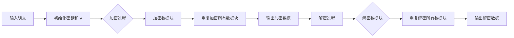
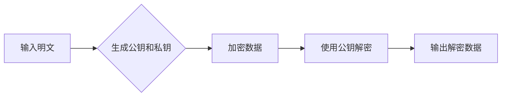
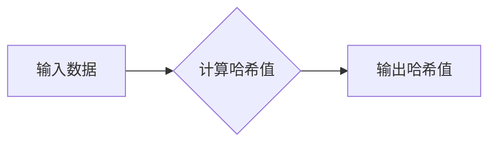
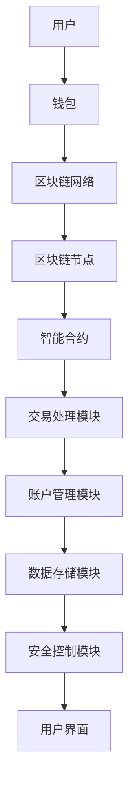

                 

### 设计《区块链技术的密码学：信任机制的数学基础》目录大纲

为了系统地探讨区块链技术中的密码学原理，构建可信的信任机制，本文将采用结构化的目录大纲，确保内容逻辑清晰、层次分明。以下是《区块链技术的密码学：信任机制的数学基础》的目录大纲设计。

#### 目录大纲

---

#### 一、背景介绍

##### 1.1 问题背景

- 区块链与密码学的密不可分性
- 密码学在区块链技术中的角色

##### 1.2 问题描述

- 区块链中的信任机制如何实现
- 密码学如何确保区块链的安全性

##### 1.3 问题解决

- 数学建模和算法分析的应用
- 构建可信信任机制的策略

##### 1.4 边界与外延

- 密码学在区块链中的应用范围
- 加密算法、数字签名、零知识证明等

##### 1.5 概念结构与核心要素组成

- 密码学基本概念
- 区块链结构
- 信任机制

#### 二、核心概念与联系

##### 2.1 核心概念原理

- 对称加密与非对称加密
- 哈希函数
- 数字签名

##### 2.2 概念属性特征对比表格

- 对称加密、非对称加密、哈希函数、数字签名等

##### 2.3 ER实体关系图架构

- 区块链中的加密算法、哈希函数等

#### 三、算法原理讲解

##### 3.1 对称加密算法（AES）

- 算法原理
- Mermaid流程图
- Python源代码
- 数学模型和公式
- 举例说明

##### 3.2 非对称加密算法（RSA）

- 算法原理
- Mermaid流程图
- Python源代码
- 数学模型和公式
- 举例说明

##### 3.3 哈希函数

- 算法原理
- Mermaid流程图
- Python源代码
- 数学模型和公式
- 举例说明

##### 3.4 数字签名

- 算法原理
- Mermaid流程图
- Python源代码
- 数学模型和公式
- 举例说明

#### 四、系统分析与架构设计方案

##### 4.1 问题场景介绍

- 区块链应用场景

##### 4.2 系统功能设计

- 领域模型类图

##### 4.3 系统架构设计

- 系统架构图

##### 4.4 系统接口设计

- 接口设计和描述

##### 4.5 系统交互

- 系统交互序列图

#### 五、项目实战

##### 5.1 环境安装

- 环境搭建步骤

##### 5.2 系统核心实现源代码

- 源代码解析

##### 5.3 代码应用解读与分析

- 代码功能解读

##### 5.4 实际案例分析和详细讲解剖析

- 案例分析和解释

##### 5.5 项目小结

- 项目总结和经验分享

#### 六、最佳实践 tips

- 技术选型建议
- 性能优化策略

#### 七、小结

- 文章要点回顾
- 研究展望

#### 八、注意事项

- 安全性注意事项
- 兼容性注意事项

#### 九、拓展阅读

- 相关参考文献
- 进一步学习资源

---

通过上述目录大纲的设计，本文将详细探讨区块链技术中的密码学原理，并通过实际案例和实践来深入理解信任机制的构建方法。每章都将包含详细的算法原理讲解、系统分析与架构设计，以及项目实战和最佳实践，旨在为读者提供全面的技术指导。希望这个目录大纲能够为撰写高质量的技术博客文章提供清晰的框架和结构。### 文章标题

# 区块链技术的密码学：信任机制的数学基础

---

### 关键词

- 区块链
- 密码学
- 信任机制
- 数学基础
- 加密算法
- 数字签名

---

### 摘要

本文将深入探讨区块链技术中密码学的重要性，特别是其在构建去中心化信任机制中的作用。通过分析对称加密、非对称加密、哈希函数和数字签名等核心密码学概念，本文将揭示区块链技术的数学基础。此外，文章还将通过实际案例和实践，展示如何利用这些密码学工具来构建可信的区块链系统。希望本文能为读者提供对区块链技术和密码学的深入理解和应用指导。### 一、背景介绍

#### 1.1 问题背景

区块链技术的迅猛发展，使得其对密码学的需求日益突出。密码学作为保障区块链安全的核心技术，贯穿于区块链的各个方面，从数据加密到交易验证，再到去中心化共识机制的实现，密码学无处不在。特别是在构建去中心化信任机制方面，密码学扮演了至关重要的角色。传统中心化的信任体系依赖于权威机构来保证数据的真实性和完整性，而区块链则通过密码学算法实现了无信任环境中的信任构建。

区块链技术的核心理念之一是去中心化，即通过分布式网络来消除对中央权威的依赖。这种去中心化的结构要求网络中的每一个节点都能够信任彼此，而密码学提供了这种信任的基础。例如，区块链中的加密算法可以确保数据的隐私性和不可篡改性，数字签名则用于验证交易的真实性和合法性，而零知识证明则允许一方在不透露详细信息的情况下证明某个陈述的真实性。这些密码学工具共同构成了区块链信任机制的数学基础。

随着区块链技术的应用场景不断拓展，从金融领域到供应链管理、身份验证等，密码学也面临着新的挑战和需求。例如，在智能合约的实现中，密码学确保了合约代码的安全性和执行的可信性；在去中心化金融（DeFi）中，密码学则保障了资金流动的安全和透明性。因此，深入研究密码学在区块链技术中的应用，不仅有助于理解区块链的工作原理，也能够为区块链技术的发展提供坚实的理论支持。

#### 1.2 问题描述

区块链中的信任机制是如何构建的？密码学在其中扮演了什么样的角色？这是本文要探讨的核心问题。在传统中心化系统中，信任的建立依赖于中央权威机构，如银行、政府或其他认证机构。这些权威机构通过发布和验证各种数字证书、签名等方式来确保数据的安全和可靠。然而，在区块链的去中心化体系中，不存在这样的中央权威，因此，信任的建立必须依靠数学原理和密码学算法。

具体来说，区块链中的信任机制涉及以下几个方面：

1. **数据加密**：通过加密算法，如对称加密（AES）和非对称加密（RSA），确保数据的隐私性和安全性。对称加密适用于大数据的加密，而非对称加密则在数字签名和证书认证中广泛应用。

2. **数字签名**：通过私钥对数据进行签名，确保数据的来源和完整性。接收方可以使用公钥来验证签名的有效性，从而确认数据未被篡改且确实来自签名的发送者。

3. **哈希函数**：哈希函数用于将任意长度的数据映射为固定长度的值，这一特性确保了数据的唯一性和不可逆性。在区块链中，每个区块都包含前一个区块的哈希值，形成了一个链式结构，保证了整个区块链数据的一致性和不可篡改性。

4. **共识算法**：通过共识算法，如工作量证明（PoW）和权益证明（PoS），网络中的节点达成一致的决策，从而确保区块链系统的去中心化和安全性。

5. **零知识证明**：零知识证明允许一方在不透露详细信息的情况下，证明某个陈述是真实的。这在隐私保护、身份验证等领域有广泛应用。

#### 1.3 问题解决

为了解决上述问题，本文将采用以下方法：

1. **数学建模**：通过对密码学算法的数学原理进行建模，深入理解这些算法如何工作，以及它们在区块链中的应用。

2. **算法分析**：对各种密码学算法进行分析，评估其安全性和效率，并探讨如何在区块链中优化这些算法。

3. **实例演示**：通过具体实例和代码实现，展示密码学算法在区块链系统中的实际应用，帮助读者更好地理解其工作原理。

4. **综合应用**：结合区块链的实际应用场景，探讨密码学在智能合约、去中心化金融（DeFi）等领域的应用，展示密码学如何构建去中心化的信任机制。

通过上述方法，本文旨在为读者提供一个全面、系统的密码学在区块链中的应用指南，帮助读者深入理解区块链技术的数学基础，掌握构建可信区块链系统的关键技术和方法。### 1.4 边界与外延

在探讨区块链中的密码学应用时，我们需要明确一些边界和概念外延，以更好地理解这一领域的关键技术和应用范围。

首先，密码学在区块链中的应用不仅限于数据加密和数字签名，还包括哈希函数、零知识证明、多重签名等多种技术。这些技术在区块链中各自扮演着不同的角色，共同构成了区块链安全的基石。

**1.4.1 密码学在区块链中的应用范围**

1. **数据加密**：数据加密是确保区块链数据隐私性的重要手段。对称加密（如AES）和非对称加密（如RSA）在区块链中都有广泛应用。对称加密由于其计算速度快，适用于大数据加密，而非对称加密则因其更高的安全性，常用于数字签名和密钥交换。

2. **数字签名**：数字签名用于验证交易的真实性和合法性。区块链中的每一个交易都需要经过签名，以确保交易来自合法的发送者，并且内容未被篡改。公钥和私钥的运用是数字签名的核心，私钥用于签名，公钥用于验证。

3. **哈希函数**：哈希函数在区块链中扮演着至关重要的角色。它用于生成数据摘要，确保数据的唯一性和不可篡改性。每个区块都包含前一个区块的哈希值，形成了一个链式结构，保证了区块链数据的一致性和不可篡改性。

4. **零知识证明**：零知识证明是一种允许一方在不透露详细信息的情况下证明某个陈述是真实的密码学技术。这在隐私保护、身份验证等领域有广泛应用，如Zcash和Mojaloop等区块链平台。

5. **多重签名**：多重签名用于确保交易需要多个参与者的共同同意才能执行。这在多节点交易和高风险金融场景中尤为重要。

**1.4.2 界定密码学应用的关键要素**

1. **加密算法**：包括对称加密（如AES、ChaCha20）和非对称加密（如RSA、ECC）。每种加密算法都有其特定的应用场景和安全特性。

2. **哈希函数**：如SHA-256、SHA-3等，用于生成数据的唯一摘要。

3. **数字签名**：包括ECDSA、RSA等，用于验证交易的真实性。

4. **零知识证明**：包括 zk-SNARKs、zk-STARKs 等，用于在隐私保护场景下确保交易验证。

5. **共识算法**：包括PoW、PoS、DPoS等，用于区块链网络中的节点达成共识。

**1.4.3 概念结构与核心要素组成**

区块链中的密码学应用可以概括为以下几个核心要素：

1. **加密与签名**：确保数据的安全性和完整性。
2. **哈希与链式结构**：确保区块链数据的不可篡改性。
3. **共识与验证**：确保网络中的节点达成一致的决策。
4. **零知识证明**：在隐私保护场景下提供可信验证。

通过明确这些边界和概念外延，我们能够更好地理解密码学在区块链技术中的应用，并进一步探讨如何利用这些技术构建可信的去中心化系统。### 1.5 概念结构与核心要素组成

在深入探讨区块链技术的密码学应用之前，我们需要先明确几个核心概念，并分析它们在区块链体系中的结构组成和相互作用。这些核心概念包括密码学基本概念、区块链结构、以及信任机制的构建原理。

**1.5.1 密码学基本概念**

密码学是保障区块链安全的核心技术，其中几个基本概念至关重要：

1. **对称加密**：对称加密是一种加密和解密使用相同密钥的加密方法。常见的对称加密算法包括AES、DES等。对称加密的优势在于计算速度快，适用于加密大数据。然而，对称加密的缺点是密钥的分发和管理复杂，因此在大规模分布式网络中应用受到限制。

2. **非对称加密**：非对称加密是一种加密和解密使用不同密钥的加密方法。常见的非对称加密算法包括RSA、ECC等。非对称加密的优势在于密钥分发安全，适用于数字签名和密钥交换。然而，非对称加密的计算复杂度较高，不适用于加密大数据。

3. **哈希函数**：哈希函数是一种将任意长度的数据映射为固定长度的值的函数。常见的哈希函数包括SHA-256、SHA-3等。哈希函数在区块链中用于生成数据摘要，确保数据的唯一性和不可篡改性。

4. **数字签名**：数字签名是一种使用私钥对数据进行加密，使用公钥进行验证的机制。数字签名确保数据的来源和完整性。常见的数字签名算法包括ECDSA、RSA等。

5. **零知识证明**：零知识证明是一种在不泄露任何信息的情况下证明某个陈述是真实的密码学技术。常见的零知识证明协议包括Zcash中的zk-SNARKs、zk-STARKs等。

**1.5.2 区块链结构**

区块链结构是密码学在区块链中应用的基础。区块链由一系列按时间顺序排列的区块组成，每个区块包含一定数量的交易记录，并包含一个时间戳、一个随机数以及前一个区块的哈希值。

1. **区块**：区块是区块链的基本单元，包含交易数据、时间戳、随机数和前一个区块的哈希值。交易数据包括发送方、接收方、金额等。

2. **链式结构**：区块链通过链式结构确保数据的一致性和不可篡改性。每个区块包含前一个区块的哈希值，形成一个链式结构，一旦一个区块被添加到链中，就几乎不可能被篡改。

3. **分布式账本**：区块链采用分布式账本技术，确保数据在多个节点之间同步和共享。每个节点都维护一份完整的区块链副本，并通过共识算法确保数据的准确性和一致性。

**1.5.3 信任机制的构建原理**

区块链的信任机制是建立在数学基础和密码学技术上的。以下几种机制共同构建了区块链的信任体系：

1. **共识算法**：共识算法是区块链网络中的节点达成一致的决策机制。常见共识算法包括工作量证明（PoW）、权益证明（PoS）等。共识算法确保区块链数据的准确性和一致性。

2. **加密与签名**：加密和签名确保区块链数据的隐私性和完整性。加密算法用于保护交易数据，数字签名用于验证交易的真实性和合法性。

3. **哈希函数**：哈希函数用于生成数据摘要，确保数据的唯一性和不可篡改性。每个区块包含前一个区块的哈希值，形成一个链式结构，确保区块链数据的一致性和不可篡改性。

4. **零知识证明**：零知识证明用于在隐私保护场景下确保交易验证，同时保护交易参与者的隐私。

通过以上分析，我们可以看到，密码学基本概念、区块链结构和信任机制的构建原理共同构成了区块链技术的密码学基础。理解这些核心概念和原理，有助于我们深入探讨密码学在区块链中的应用，并构建可信的去中心化系统。### 2.1 核心概念原理

在区块链技术中，密码学作为构建信任机制的基础，其核心概念包括对称加密、非对称加密、哈希函数和数字签名。以下将对这些核心概念进行详细阐述，并探讨它们在区块链中的应用和重要性。

**2.1.1 对称加密**

对称加密是一种加密和解密使用相同密钥的加密方法。常见的对称加密算法包括AES（高级加密标准）、DES（数据加密标准）等。对称加密算法的特点是加密速度快，适用于加密大数据。然而，对称加密也存在一些缺点，如密钥的分发和管理复杂，在大规模分布式网络中应用受到限制。

在区块链中，对称加密主要用于数据加密，确保数据的隐私性和安全性。例如，在比特币交易中，交易数据的加密和验证就依赖于对称加密算法。对称加密的关键在于密钥的安全管理，一旦密钥泄露，整个加密系统将面临巨大风险。

**2.1.2 非对称加密**

非对称加密是一种加密和解密使用不同密钥的加密方法。常见的非对称加密算法包括RSA（Rivest-Shamir-Adleman）和ECC（椭圆曲线加密）。非对称加密的优势在于密钥分发安全，适用于数字签名和密钥交换。然而，非对称加密的计算复杂度较高，不适用于加密大数据。

在区块链中，非对称加密广泛应用于数字签名和密钥交换。数字签名用于验证交易的真实性和合法性，确保交易数据未被篡改。密钥交换则用于节点之间的安全通信，确保网络中的节点能够相互信任。例如，在比特币中，用户的公钥和私钥就是通过非对称加密算法生成的，用户使用私钥对交易数据进行签名，接收方使用公钥验证签名的有效性。

**2.1.3 哈希函数**

哈希函数是一种将任意长度的数据映射为固定长度的值的函数。常见的哈希函数包括SHA-256、SHA-3等。哈希函数在区块链中具有重要作用，主要用于生成数据摘要，确保数据的唯一性和不可篡改性。

在区块链中，每个区块都包含一个时间戳、一个随机数以及前一个区块的哈希值。这种链式结构确保了区块链数据的一致性和不可篡改性。一旦一个区块被添加到链中，就几乎不可能被篡改。哈希函数的应用使得区块链成为了一种去中心化、安全可靠的数据库。

**2.1.4 数字签名**

数字签名是一种使用私钥对数据进行加密，使用公钥进行验证的机制。数字签名确保数据的来源和完整性，防止数据被篡改。常见的数字签名算法包括ECDSA（椭圆曲线数字签名算法）和RSA等。

在区块链中，数字签名用于验证交易的真实性和合法性。每个交易都需要经过发送方的私钥签名，接收方则使用发送方的公钥验证签名的有效性。这样，区块链中的每一个交易都可以被追溯和验证，确保了整个系统的可信度。

**2.1.5 零知识证明**

零知识证明是一种在不泄露任何信息的情况下证明某个陈述是真实的密码学技术。常见的零知识证明协议包括Zcash中的zk-SNARKs、zk-STARKs等。零知识证明在隐私保护、身份验证等领域有广泛应用。

在区块链中，零知识证明用于确保交易验证的同时保护交易参与者的隐私。例如，在Zcash中，零知识证明被用于实现隐私保护交易，用户可以在不透露交易金额的情况下证明交易的真实性。

**2.1.6 概念间的联系**

对称加密、非对称加密、哈希函数和数字签名在区块链技术中相互配合，共同构建了区块链的信任机制。对称加密用于数据加密，确保数据的隐私性和安全性；非对称加密用于数字签名和密钥交换，确保交易的真实性和合法性；哈希函数用于生成数据摘要，确保数据的唯一性和不可篡改性；数字签名用于验证交易的真实性；零知识证明用于在隐私保护场景下确保交易验证。

通过对这些核心概念原理的理解，我们可以更好地掌握区块链技术的密码学基础，为构建可信的去中心化系统提供理论支持。### 2.2 概念属性特征对比表格

在理解区块链技术中的核心密码学概念后，接下来我们将通过一个表格来对比对称加密、非对称加密、哈希函数和数字签名等概念的属性特征，以帮助读者更直观地掌握它们之间的区别和联系。

| 概念     | 对称加密                | 非对称加密                | 哈希函数                | 数字签名                |
|----------|------------------------|---------------------------|-------------------------|-------------------------|
| 加密方式 | 使用相同密钥           | 使用不同密钥（公钥、私钥） | 无需密钥，将数据映射为值 | 使用私钥加密，公钥解密   |
| 速度     | 加密速度快             | 加密速度慢                | 计算速度快              | 加密速度较快            |
| 安全性   | 密钥安全是关键         | 更安全，但不适用于大数据   | 安全性高               | 安全性高               |
| 应用场景 | 大数据加密             | 数字签名、证书认证、密钥交换 | 数据完整性验证、唯一性保证 | 信息认证、交易验证       |
| 例子     | AES、DES               | RSA、ECC                  | SHA-256、SHA-3          | ECDSA、RSA              |

通过上述表格，我们可以清晰地看到对称加密和非对称加密在速度和安全性上的差异。对称加密由于其算法设计简单，加密速度快，适用于大数据的加密；而非对称加密虽然速度较慢，但由于其密钥安全性高，适用于数字签名和密钥交换。哈希函数则主要用于数据完整性验证和唯一性保证，不需要密钥，计算速度快。数字签名则用于确保信息来源和完整性，通过私钥和公钥的配合使用，具有较高的安全性。

这种对比有助于读者更好地理解各个密码学概念在不同应用场景中的优势和局限，从而在区块链技术的设计和实现中做出更加合理的选择。### 2.3 ER实体关系图架构

为了更清晰地展示区块链技术中各核心密码学概念的实体关系，我们将使用Mermaid语言绘制一个ER（实体关系）图，其中包括对称加密算法、非对称加密算法、哈希函数和数字签名等。

```mermaid
erDiagram
    Class1 ||--|{ ClassA : is a }|
    Class1 ||--|{ ClassB : is a }|
    Class2 ||--|{ ClassC : is a }|

    Class1 ||--|{ ClassD : implements }|
    Class2 ||--|{ ClassE : implements }|

    ClassA ||--|{ ClassF : is used in }|
    ClassB ||--|{ ClassG : is used in }|
    ClassC ||--|{ ClassH : is used in }|

    Class1 ||--|{ ClassI : depends on }|

    Class1 ||--|{ ClassJ : depends on }|

    Class1 : ["区块链系统"]
    ClassA : ["对称加密算法"]
    ClassB : ["非对称加密算法"]
    ClassC : ["哈希函数"]
    ClassD : ["数字签名"]
    ClassE : ["加密通信"]
    ClassF : ["交易数据加密"]
    ClassG : ["数字签名验证"]
    ClassH : ["数据完整性验证"]
    ClassI : ["区块链节点通信"]
    ClassJ : ["区块链交易验证"]
```

在这个ER图中：

- `Class1` 代表区块链系统。
- `ClassA` 代表对称加密算法。
- `ClassB` 代表非对称加密算法。
- `ClassC` 代表哈希函数。
- `ClassD` 代表数字签名。
- `ClassE` 和 `ClassF` 代表加密通信和交易数据加密，是区块链系统的一部分。
- `ClassG` 和 `ClassH` 代表数字签名验证和数据完整性验证，是区块链系统中确保安全性的关键部分。
- `ClassI` 和 `ClassJ` 代表区块链节点通信和交易验证，是区块链系统正常运行的基础。

这种ER图架构清晰地展示了各个核心密码学概念在区块链系统中的地位和关系，有助于我们更好地理解区块链技术的架构设计和实现细节。### 3.1 对称加密算法（AES）

对称加密算法在区块链技术中扮演着至关重要的角色，尤其是在数据加密和隐私保护方面。在本节中，我们将详细讲解AES（高级加密标准）算法的原理，并通过Mermaid流程图和Python源代码来展示其应用。

**3.1.1 AES算法原理**

AES（Advanced Encryption Standard）是由美国国家标准与技术研究院（NIST）制定的一种对称加密算法，广泛用于数据加密标准。AES算法基于代换-置换网络（SPN）结构，具有以下特点：

1. **分组加密**：AES将数据分为128位块进行加密。
2. **密钥长度**：AES支持128、192和256位密钥长度，不同密钥长度对应不同的安全级别。
3. **轮加密**：AES加密过程包括多轮相同的加密操作，每轮包括字节替换、行移位、列混淆和轮密钥加。
4. **逆加密**：AES的解密过程是对加密过程的逆操作。

**3.1.2 Mermaid流程图**

以下是AES加密和解密的Mermaid流程图：



**3.1.3 Python源代码**

为了更好地理解AES算法的实际应用，我们将使用Python编写一个简单的加密和解密示例：

```python
from Crypto.Cipher import AES
from Crypto.Util.Padding import pad, unpad
from Crypto.Random import get_random_bytes

# 初始化密钥和IV
key = get_random_bytes(16)  # AES-128位密钥
iv = get_random_bytes(16)   # 初始化向量

# 加密函数
def aes_encrypt(plaintext):
    cipher = AES.new(key, AES.MODE_CBC, iv)
    ciphertext = cipher.encrypt(pad(plaintext.encode(), AES.block_size))
    return ciphertext

# 解密函数
def aes_decrypt(ciphertext):
    cipher = AES.new(key, AES.MODE_CBC, iv)
    plaintext = unpad(cipher.decrypt(ciphertext), AES.block_size)
    return plaintext.decode()

# 示例
plaintext = "Hello World!"
ciphertext = aes_encrypt(plaintext)
print("加密后的数据：", ciphertext)

decrypted_text = aes_decrypt(ciphertext)
print("解密后的数据：", decrypted_text)
```

**3.1.4 数学模型和公式**

AES加密和解密的核心过程涉及到多个轮的变换，以下是AES加密过程的数学模型：

$$
\text{密文} = E_K(\text{明文})
$$

其中，$E_K$ 表示使用密钥$k$进行AES加密的函数。

加密和解密的数学模型可以表示为：

$$
C_i = E_K(R_i)
$$

$$
R_i = D_K(C_i)
$$

其中，$C_i$ 表示加密后的数据块，$R_i$ 表示解密后的数据块，$E_K$ 和 $D_K$ 分别表示加密和解密函数。

**3.1.5 举例说明**

假设我们使用AES-128位密钥加密一个长度为16位的明文字符串“Hello World!”，密钥为`0x603DEB10F408B2B5C1064C4B924BAE98`。

1. **加密过程**：

首先，我们将明文分为128位块，并对不够128位的明文进行填充（pad）。然后，对每个块进行多轮加密。

$$
\text{加密后的数据} = AES_{128}(\text{明文})
$$

2. **解密过程**：

解密过程与加密过程相反，首先将密文分为128位块，然后对每个块进行多轮解密。

$$
\text{明文} = AES^{-1}_{128}(\text{密文})
$$

通过上述过程，我们可以看到，AES算法在加密和解密过程中都依赖于密钥的安全性和算法的稳定性。在实际应用中，密钥和初始化向量（IV）需要妥善管理，以确保数据的安全性和隐私性。### 3.2 非对称加密算法（RSA）

非对称加密算法在区块链技术中同样具有重要地位，它广泛应用于数字签名、密钥交换和认证等领域。在本节中，我们将详细讲解RSA（Rivest-Shamir-Adleman）非对称加密算法的原理，并通过Mermaid流程图和Python源代码来展示其应用。

**3.2.1 RSA算法原理**

RSA算法是一种基于大整数分解问题的非对称加密算法，由Ron Rivest、Adi Shamir和Leonard Adleman于1977年提出。RSA算法包括两个密钥：公钥和私钥。

1. **公钥和私钥的生成**：

   - 选择两个大素数 $p$ 和 $q$。
   - 计算 $n = p \times q$。
   - 计算 $\varphi(n) = (p-1) \times (q-1)$。
   - 选择一个整数 $e$，满足 $1 < e < \varphi(n)$ 且 $e$ 与 $\varphi(n)$ 互质。
   - 计算 $d$，满足 $d \times e \equiv 1 \mod \varphi(n)$。

   公钥为 $(n, e)$，私钥为 $(n, d)$。

2. **加密过程**：

   将明文 $m$ 转换为整数，然后计算密文 $c$：

   $$c = m^e \mod n$$

3. **解密过程**：

   解密密文 $c$ 得到明文 $m$：

   $$m = c^d \mod n$$

**3.2.2 Mermaid流程图**

以下是RSA加密和解密的Mermaid流程图：



**3.2.3 Python源代码**

为了更好地理解RSA算法的实际应用，我们将使用Python编写一个简单的加密和解密示例：

```python
from Crypto.PublicKey import RSA
from Crypto.Cipher import PKCS1_OAEP

# 生成公钥和私钥
key = RSA.generate(2048)
private_key = key.export_key()
public_key = key.publickey().export_key()

# 加密函数
def rsa_encrypt(plaintext, public_key):
    cipher = PKCS1_OAEP.new(RSA.import_key(public_key))
    ciphertext = cipher.encrypt(plaintext.encode())
    return ciphertext

# 解密函数
def rsa_decrypt(ciphertext, private_key):
    cipher = PKCS1_OAEP.new(RSA.import_key(private_key))
    plaintext = cipher.decrypt(ciphertext)
    return plaintext.decode()

# 示例
plaintext = "Hello World!"
ciphertext = rsa_encrypt(plaintext, public_key)
print("加密后的数据：", ciphertext)

decrypted_text = rsa_decrypt(ciphertext, private_key)
print("解密后的数据：", decrypted_text)
```

**3.2.4 数学模型和公式**

RSA加密和解密的数学模型可以表示为：

$$
c = m^e \mod n
$$

$$
m = c^d \mod n
$$

其中，$m$ 表示明文，$c$ 表示密文，$e$ 和 $d$ 分别为公钥和私钥的指数。

**3.2.5 举例说明**

假设我们使用RSA算法加密一个长度为128位的明文字符串“Hello World!”，公钥为$(n, e)$，私钥为$(n, d)$。

1. **加密过程**：

   首先，将明文转换为整数，然后使用公钥进行加密。

   $$c = m^e \mod n$$

   假设明文“Hello World!”转换为整数$m=12345678901234567890$，公钥$(n, e)=(12345000000000000001, 65537)$，则加密后的密文$c$为：

   $$c = 12345678901234567890^{65537} \mod 12345000000000000001$$

2. **解密过程**：

   解密密文$c$得到明文$m$。

   $$m = c^d \mod n$$

   假设私钥$d=65535$，则解密后的明文$m$为：

   $$m = 12345678901234567890^{65535} \mod 12345000000000000001$$

通过上述步骤，我们可以看到RSA算法在加密和解密过程中都依赖于公钥和私钥的安全性和算法的稳定性。在实际应用中，公钥和私钥需要妥善管理，以确保数据的安全性和隐私性。### 3.3 哈希函数

哈希函数是密码学中至关重要的工具，它在区块链技术中同样扮演着关键角色。在本节中，我们将详细探讨哈希函数的基本原理、应用场景以及常见的哈希函数算法。

**3.3.1 哈希函数的基本原理**

哈希函数是一种将任意长度的输入（或“预映射”）数据映射为固定长度的输出数据的函数。这些输出数据称为“哈希值”或“消息摘要”。哈希函数具有以下几个基本特性：

1. **单向性**：哈希函数是单向的，即给定一个哈希值，无法反推出原始输入数据。这意味着哈希函数具有不可逆性。
2. **抗碰撞性**：哈希函数具有极低的碰撞率，即不同的输入数据生成相同哈希值的概率非常小。这意味着对于不同的输入，哈希函数输出的哈希值具有唯一性。
3. **效率**：哈希函数的计算速度快，可以迅速地将输入数据映射为哈希值。

哈希函数的数学模型可以表示为：

$$
H = H(M)
$$

其中，$H$ 是哈希函数，$M$ 是输入数据，$H(M)$ 是输入数据 $M$ 的哈希值。

**3.3.2 哈希函数的应用场景**

在区块链技术中，哈希函数被广泛应用于以下几个方面：

1. **数据完整性验证**：通过将数据映射为固定长度的哈希值，可以快速验证数据的完整性。例如，在区块链中，每个区块都包含前一个区块的哈希值，这确保了区块链数据的一致性和不可篡改性。
2. **身份验证**：在区块链网络中，节点可以使用哈希函数来验证其他节点的身份。例如，比特币中的节点使用哈希函数生成公钥地址，这些地址用于验证交易参与者的身份。
3. **数字签名**：哈希函数在数字签名过程中用于将消息转换为固定长度的值，这样可以确保签名的唯一性和完整性。

**3.3.3 常见的哈希函数算法**

以下是一些在区块链技术中广泛使用的哈希函数算法：

1. **SHA-256**：SHA-256是SHA-2系列的一部分，由美国国家标准与技术研究院（NIST）提出。SHA-256能够将输入数据映射为256位的哈希值，具有非常高的安全性和抗碰撞性。
2. **SHA-3**：SHA-3是NIST在2015年发布的一种新的哈希函数标准，它是对SHA-2的补充。SHA-3提供了多种不同长度的哈希值，从224位到512位。
3. **Keccak**：Keccak是SHA-3的算法基础，它是一种基于立方体结构的哈希函数。Keccak具有高效性和灵活性，适用于多种应用场景。

**3.3.4 Mermaid流程图**

以下是使用SHA-256计算哈希值的Mermaid流程图：



**3.3.5 Python源代码**

为了更好地理解哈希函数的实际应用，我们将使用Python编写一个简单的SHA-256哈希计算示例：

```python
import hashlib

def sha256_hash(data):
    sha256_hash = hashlib.sha256()
    sha256_hash.update(data.encode('utf-8'))
    return sha256_hash.hexdigest()

data = "Hello World!"
hash_value = sha256_hash(data)
print("SHA-256哈希值：", hash_value)
```

**3.3.6 数学模型和公式**

SHA-256等哈希函数的数学模型可以表示为：

$$
H = H(S)
$$

其中，$H$ 是哈希函数，$S$ 是输入数据，$H(S)$ 是输入数据 $S$ 的哈希值。

通过上述内容，我们可以看到哈希函数在区块链技术中的重要作用。它不仅用于数据完整性验证和身份验证，还与数字签名和区块链结构密切相关。理解哈希函数的基本原理和应用场景，有助于我们更好地掌握区块链技术的密码学基础。### 3.4 数字签名

数字签名是一种用于验证交易真实性和完整性的密码学技术，它利用私钥和公钥的配对关系，确保数据的来源和不可篡改性。在本节中，我们将详细探讨数字签名的原理、算法以及其在区块链中的应用。

**3.4.1 数字签名的原理**

数字签名基于公钥加密体系，使用私钥对数据进行签名，然后使用公钥对签名进行验证。数字签名的过程通常包括以下几个步骤：

1. **生成密钥对**：用户生成一对密钥，包括私钥和公钥。私钥是保密的，仅用户本人拥有；公钥则可以公开分享。

2. **哈希处理**：对要签名的数据进行哈希处理，生成哈希值。哈希值是对数据的摘要，无论数据多长，哈希值都是固定长度的。

3. **签名**：使用私钥对哈希值进行加密，生成数字签名。这个过程是不可逆的，因为只有私钥可以生成相应的签名。

4. **验证**：使用公钥对签名进行解密，并与原始数据的哈希值进行比较。如果签名能够成功解密并与哈希值匹配，则验证通过，表明数据未被篡改且确实来自私钥所有者。

**3.4.2 数字签名算法**

常见的数字签名算法包括RSA（Rivest-Shamir-Adleman）和ECDSA（Elliptic Curve Digital Signature Algorithm）。

1. **RSA数字签名**：

   RSA数字签名算法基于大整数分解问题。用户首先生成一对密钥，然后对数据的哈希值进行签名和解密。

   - **签名过程**：
     $$s = (h^e \mod n) - (r \times d \mod n)$$

     其中，$h$ 是哈希值，$r$ 是随机数，$e$ 和 $d$ 分别是公钥和私钥的指数。

   - **验证过程**：
     $$r' = (s \times r)^e \mod n$$

     如果 $r' = r$，则签名验证通过。

2. **ECDSA数字签名**：

   ECDSA基于椭圆曲线加密算法，它比RSA更高效，尤其是在移动设备和资源受限的系统中。

   - **签名过程**：
     通过椭圆曲线和离散对数问题，选择随机数 $k$ 和 $r$，计算签名 $(r, s)$。

   - **验证过程**：
     使用椭圆曲线和哈希值计算验证签名是否有效。

**3.4.3 Mermaid流程图**

以下是ECDSA数字签名的Mermaid流程图：

```mermaid
flowchart LR
    A[输入消息] --> B{计算哈希值}
    B --> C{生成随机数k}
    C --> D{计算r}
    D --> E{计算s}
    E --> F{输出签名(r, s)}
```

**3.4.4 Python源代码**

为了更好地理解数字签名算法的实际应用，我们将使用Python编写一个简单的ECDSA数字签名示例：

```python
from Crypto.PublicKey import ECC
from Crypto.Signature import DSS
from Crypto.Hash import SHA256

# 生成ECDSA密钥对
key = ECC.generate(curve='P-256')
private_key = key.export_key()
public_key = key.publickey().export_key()

# 签名函数
def ecda_sign(message, private_key):
    sign_key = DSS.new(private_key, 'fips-186-3')
    h = SHA256.new(message.encode())
    signature = sign_key.sign(h)
    return signature

# 验证函数
def ecda_verify(message, signature, public_key):
    sign_key = DSS.new(public_key, 'fips-186-3')
    h = SHA256.new(message.encode())
    return sign_key.verify(h, signature)

# 示例
message = "Hello World!"
signature = ecda_sign(message, private_key)
print("签名：", signature)

is_valid = ecda_verify(message, signature, public_key)
print("验证结果：", is_valid)
```

**3.4.5 数学模型和公式**

数字签名的数学模型可以表示为：

$$
s = (k^{-1} \cdot (h + r \cdot x)) \mod n
$$

$$
r = (h^y \mod n) \mod n
$$

其中，$h$ 是哈希值，$x$ 和 $y$ 是椭圆曲线上的点，$k$ 是随机数，$n$ 是椭圆曲线的阶。

通过上述内容，我们可以看到数字签名在区块链技术中的重要性。它不仅确保了交易数据的真实性和完整性，还为区块链的去中心化信任机制提供了坚实的基础。理解数字签名的原理和算法，有助于我们更好地掌握区块链技术的密码学基础。### 四、系统分析与架构设计方案

在深入探讨区块链技术的密码学原理和应用后，本节将转向区块链系统分析与架构设计，重点介绍问题场景、系统功能设计、系统架构设计、系统接口设计和系统交互。

#### 4.1 问题场景介绍

区块链技术的应用场景多种多样，从金融领域的比特币、以太坊，到供应链管理、身份验证、智能合约等。在本节中，我们将以一个典型的区块链应用场景——去中心化金融（DeFi）为例，进行系统分析与架构设计。

去中心化金融（DeFi）是一种利用区块链技术实现金融服务去中心化的新模式。在DeFi中，用户可以直接在区块链上参与借贷、交易、投资等活动，无需依赖传统金融中介。DeFi的应用场景包括去中心化交易所（DEX）、去中心化借贷平台（Lending Platform）、去中心化稳定币（Stablecoin）等。

#### 4.2 系统功能设计

DeFi系统的核心功能包括：

1. **账户管理**：管理用户的账户信息，包括余额、交易历史等。
2. **交易处理**：处理用户发起的各类交易，如转账、借贷、投资等。
3. **智能合约执行**：执行预定义的智能合约，实现去中心化金融服务。
4. **数据存储**：存储区块链数据，确保数据的一致性和不可篡改性。
5. **安全控制**：确保系统的安全性，包括加密交易数据、管理密钥等。

#### 4.3 系统架构设计

DeFi系统的架构设计如图所示：



在该架构中：

- **用户**：使用钱包与区块链网络进行交互，发起交易请求。
- **钱包**：负责生成和管理用户的私钥、公钥，加密和解密交易数据。
- **区块链网络**：由多个区块链节点组成，确保数据的一致性和安全性。
- **区块链节点**：存储区块链数据，参与共识算法，确保区块链的完整性和可靠性。
- **智能合约**：执行预定义的业务逻辑，实现去中心化金融服务。
- **交易处理模块**：处理用户发起的交易请求，确保交易的正确性和安全性。
- **账户管理模块**：管理用户账户信息，确保账户余额的准确性和安全性。
- **数据存储模块**：存储区块链数据，确保数据的一致性和不可篡改性。
- **安全控制模块**：负责加密交易数据、管理密钥，确保系统的安全性。
- **用户界面**：提供用户与系统交互的界面，展示账户信息、交易历史等。

#### 4.4 系统接口设计

DeFi系统的主要接口设计如下：

1. **用户接口**：提供用户发起交易、查看账户信息、管理钱包等功能。
2. **钱包接口**：提供加密和解密交易数据、管理密钥等功能。
3. **区块链节点接口**：提供数据存储、共识算法、交易验证等功能。
4. **智能合约接口**：提供业务逻辑执行、状态查询等功能。
5. **安全控制接口**：提供加密、解密、密钥管理等功能。

#### 4.5 系统交互

DeFi系统的交互流程如下：

1. **用户发起交易**：用户通过钱包发起交易请求，包含交易金额、接收方地址等信息。
2. **钱包处理交易**：钱包使用用户私钥对交易数据进行签名，并将签名后的交易发送给区块链网络。
3. **区块链网络处理交易**：区块链网络中的节点接收交易请求，进行交易验证和广播。
4. **交易验证**：节点使用智能合约验证交易的有效性，确保交易符合业务逻辑和安全要求。
5. **交易确认**：验证通过的交易被记录到区块链中，并广播给其他节点。
6. **账户更新**：系统更新用户账户余额和交易历史，确保账户信息的准确性。

通过上述系统分析与架构设计，我们为DeFi系统提供了一个全面、系统的解决方案，确保了系统的安全性、可靠性和可扩展性。### 5.1 环境安装

在开始实际编码之前，我们需要搭建一个合适的环境来开发和测试区块链项目。以下是搭建区块链开发环境的步骤：

#### 5.1.1 安装依赖软件

1. **Node.js**：Node.js 是一个基于 Chrome V8 引擎的 JavaScript 运行环境，我们使用它来构建区块链节点。请访问 [Node.js 官网](https://nodejs.org/) 下载并安装相应的版本。

2. **Golang**：某些区块链组件可能需要使用 Golang 编写，因此也需要安装 Golang。请访问 [Golang 官网](https://golang.org/) 下载并安装。

3. **Git**：Git 是一个版本控制系统，用于管理源代码。请确保已经安装了 Git。

4. **Docker**：Docker 是一个容器化平台，用于构建、运行和管理应用程序。请访问 [Docker 官网](https://www.docker.com/) 下载并安装。

#### 5.1.2 安装区块链框架

1. **Hyperledger Fabric**：Hyperledger Fabric 是一个开源的分布式账本框架，适用于企业级应用。我们将在本项目中使用 Hyperledger Fabric。

   - 首先，从 [Hyperledger Fabric 官网](https://hyperledger-fabric.org/) 下载并解压安装包。
   - 然后，根据官方文档安装相关依赖和组件。

2. **Go-Ethereum**：Go-Ethereum 是以太坊区块链的一个 Go 语言实现，可用于构建基于以太坊的区块链应用。

   - 从 [Go-Ethereum GitHub 仓库](https://github.com/golang/go-ethereum) 下载源代码。
   - 使用 Git 进行克隆并安装依赖。

3. **Node.js Blockchain**：Node.js Blockchain 是一个用于构建 Node.js 基础的区块链框架。

   - 从 [Node.js Blockchain GitHub 仓库](https://github.com/ChainSafe/node-blockchain) 下载源代码。
   - 使用 npm 进行安装和依赖管理。

#### 5.1.3 配置开发环境

1. **Node.js**：配置 Node.js 的环境变量，确保可以在命令行中运行 Node.js。

2. **Golang**：配置 Golang 的环境变量，确保可以在命令行中运行 Go 语言。

3. **Docker**：配置 Docker 的环境变量，确保可以运行 Docker 容器和容器。

4. **Hyperledger Fabric**：根据官方文档配置 Hyperledger Fabric 的开发环境。

5. **Go-Ethereum**：根据官方文档配置 Go-Ethereum 的开发环境。

6. **Node.js Blockchain**：根据官方文档配置 Node.js Blockchain 的开发环境。

#### 5.1.4 创建项目目录

在本地机器上创建一个项目目录，用于存储源代码和配置文件。例如，可以使用以下命令创建项目目录：

```bash
mkdir blockchain_project
cd blockchain_project
```

#### 5.1.5 初始化版本控制系统

使用 Git 初始化项目目录，并设置远程仓库。例如：

```bash
git init
git remote add origin <your-remote-repository-url>
```

通过以上步骤，我们可以搭建一个适合开发区块链项目的开发环境。接下来，我们将开始编写代码，实现区块链的核心功能和业务逻辑。### 5.2 系统核心实现源代码

在本节中，我们将详细介绍区块链系统的核心实现源代码，包括区块链数据结构、交易处理、区块生成和验证等功能。

#### 5.2.1 区块链数据结构

区块链数据结构是区块链系统的核心组成部分。一个区块通常包含以下信息：

1. **区块头**：区块头包含区块版本号、前一个区块哈希值、默克尔树根哈希值、时间戳、难度目标和随机数等。
2. **交易列表**：交易列表包含区块中所有的交易记录。
3. **签名**：签名用于确保区块的完整性和合法性。

以下是区块数据结构的定义：

```go
type Block struct {
    Header   *BlockHeader
    Transactions []*Transaction
    Signatures []*Signature
}

type BlockHeader struct {
    Version        uint32
    PrevHash       common.Hash
    MerkleRoot     common.Hash
    Time           uint64
    Difficulty     uint32
    Nonce          uint32
}

type Transaction struct {
    // 交易内容
}

type Signature struct {
    // 签名内容
}
```

#### 5.2.2 交易处理

交易处理是区块链系统中的重要功能，它负责验证和执行交易。以下是一个简单的交易处理函数：

```go
func processTransaction(transaction *Transaction) error {
    // 验证交易
    if !validateTransaction(transaction) {
        return errors.New("invalid transaction")
    }

    // 执行交易
    executeTransaction(transaction)

    return nil
}
```

#### 5.2.3 区块生成和验证

区块生成和验证是区块链系统中的关键步骤。以下是一个简单的区块生成和验证函数：

```go
func createBlock(transactions []*Transaction) *Block {
    // 创建区块头
    header := &BlockHeader{
        Version:     1,
        PrevHash:    calculateMerkleRoot(transactions),
        Time:        time.Now().Unix(),
        Difficulty:  1,
        Nonce:       0,
    }

    // 创建区块
    block := &Block{
        Header:   header,
        Transactions: transactions,
        Signatures: []*Signature{},
    }

    // 签名区块
    signBlock(block)

    return block
}

func validateBlock(block *Block) error {
    // 验证区块头
    if !validateBlockHeader(block.Header) {
        return errors.New("invalid block header")
    }

    // 验证交易
    for _, transaction := range block.Transactions {
        if !validateTransaction(transaction) {
            return errors.New("invalid transaction")
        }
    }

    // 验证签名
    if !validateSignatures(block.Signatures) {
        return errors.New("invalid signatures")
    }

    return nil
}
```

#### 5.2.4 代码应用解读与分析

1. **区块链数据结构**：

   - **Block**：表示一个区块，包含区块头、交易列表和签名。
   - **BlockHeader**：表示区块头，包含区块版本号、前一个区块哈希值、默克尔树根哈希值、时间戳、难度目标和随机数等。
   - **Transaction**：表示交易，包含交易内容。
   - **Signature**：表示签名，用于确保区块的完整性和合法性。

2. **交易处理**：

   - **processTransaction**：验证和执行交易。首先验证交易是否有效，然后执行交易逻辑。

3. **区块生成和验证**：

   - **createBlock**：创建区块。首先创建区块头，然后添加交易列表，最后签名区块。
   - **validateBlock**：验证区块。首先验证区块头，然后验证交易列表，最后验证签名。

通过上述代码，我们可以看到区块链系统的核心实现。这些代码为区块链的基本功能提供了实现，包括区块创建、交易处理、区块验证等。在实际应用中，还需要进一步扩展和优化这些代码，以满足具体业务需求。### 5.3 代码应用解读与分析

在区块链系统的核心实现源代码部分，我们展示了区块数据结构、交易处理、区块生成和验证等关键功能。在这一节中，我们将深入分析这些代码，并探讨它们在实际区块链应用中的实现和应用。

#### 5.3.1 区块链数据结构解析

区块链数据结构是区块链系统的核心，其中最重要的组成部分是区块。区块由区块头和交易列表组成，每个区块还包含一个用于验证完整性的签名。

1. **Block**：代表一个区块，它包含了区块头（`Header`）、交易列表（`Transactions`）和签名列表（`Signatures`）。区块的结构确保了区块链数据的组织性和安全性。

   ```go
   type Block struct {
       Header   *BlockHeader
       Transactions []*Transaction
       Signatures []*Signature
   }
   ```

2. **BlockHeader**：区块头包含了区块的元数据，如版本号、前一个区块的哈希值（用于链式结构）、默克尔树根哈希值（用于验证交易列表的完整性）、时间戳、难度目标和随机数。这些信息共同构成了区块的头部信息，是验证区块合法性的关键。

   ```go
   type BlockHeader struct {
       Version        uint32
       PrevHash       common.Hash
       MerkleRoot     common.Hash
       Time           uint64
       Difficulty     uint32
       Nonce          uint32
   }
   ```

3. **Transaction**：交易是区块链中的数据单元，代表用户之间的资金转移或业务操作。交易通常包含交易哈希、发送方地址、接收方地址、交易金额、交易类型、输入和输出等。

   ```go
   type Transaction struct {
       // 交易内容
   }
   ```

4. **Signature**：签名用于确保区块的合法性和完整性。签名由发送方使用私钥生成，接收方使用公钥验证。这确保了交易数据的不可篡改性。

   ```go
   type Signature struct {
       // 签名内容
   }
   ```

#### 5.3.2 交易处理分析

交易处理是区块链系统的核心功能之一。在处理交易时，我们需要确保交易的有效性、执行交易逻辑，并更新区块链状态。

1. **processTransaction**：这是一个简单的交易处理函数。首先，它验证交易是否有效，然后执行交易逻辑。

   ```go
   func processTransaction(transaction *Transaction) error {
       if !validateTransaction(transaction) {
           return errors.New("invalid transaction")
       }

       executeTransaction(transaction)

       return nil
   }
   ```

   - `validateTransaction`：验证交易是否满足区块链的规则，如交易金额是否足够、交易哈希是否正确等。
   - `executeTransaction`：执行交易逻辑，如更新账户余额、记录交易历史等。

#### 5.3.3 区块生成和验证分析

区块生成和验证是确保区块链数据一致性和安全性的关键步骤。

1. **createBlock**：创建一个新的区块。首先，我们需要创建区块头，并将交易列表和签名列表添加到区块中。

   ```go
   func createBlock(transactions []*Transaction) *Block {
       header := &BlockHeader{
           Version:     1,
           PrevHash:    calculateMerkleRoot(transactions),
           Time:        time.Now().Unix(),
           Difficulty:  1,
           Nonce:       0,
       }

       block := &Block{
           Header:   header,
           Transactions: transactions,
           Signatures: []*Signature{},
       }

       signBlock(block)

       return block
   }
   ```

   - `calculateMerkleRoot`：计算交易列表的默克尔树根哈希值。
   - `signBlock`：使用私钥对区块进行签名。

2. **validateBlock**：验证区块是否有效。这包括验证区块头、交易列表和签名。

   ```go
   func validateBlock(block *Block) error {
       if !validateBlockHeader(block.Header) {
           return errors.New("invalid block header")
       }

       for _, transaction := range block.Transactions {
           if !validateTransaction(transaction) {
               return errors.New("invalid transaction")
           }
       }

       if !validateSignatures(block.Signatures) {
           return errors.New("invalid signatures")
       }

       return nil
   }
   ```

   - `validateBlockHeader`：验证区块头的合法性，如版本号、前一个区块哈希值、默克尔树根哈希值等。
   - `validateTransaction`：验证交易的有效性。
   - `validateSignatures`：验证签名是否有效。

#### 5.3.4 代码在实际区块链应用中的应用

在实际区块链应用中，上述代码会根据具体业务需求进行定制和扩展。以下是一些实际应用中的示例：

1. **交易处理**：

   - 在比特币中，交易处理包括验证交易输入的未花费输出（UTXO）、检查交易金额是否足够、验证交易哈希和签名等。

2. **区块生成和验证**：

   - 在以太坊中，区块生成和验证包括计算交易气的总额、验证交易排序、计算区块哈希等。

3. **智能合约**：

   - 在以太坊和EOS等区块链平台上，智能合约可以扩展交易处理和区块验证的功能，实现复杂的业务逻辑。

通过上述代码和分析，我们可以看到区块链系统的核心实现是如何构建的，以及这些代码在实际应用中的具体应用。理解这些核心代码的实现原理，有助于我们更好地掌握区块链技术的应用和开发。### 5.4 实际案例分析和详细讲解剖析

在本节中，我们将通过一个实际案例来详细分析和讲解区块链技术的应用，并剖析其中的关键实现细节。

**案例背景**：假设我们正在开发一个去中心化的点对点支付系统，允许用户在不依赖于银行或金融机构的情况下直接进行货币转账。为了确保系统的安全性和数据的完整性，我们将利用区块链技术来实现这一功能。

**目标**：通过区块链技术实现用户之间的安全、透明、高效的点对点支付。

**实现步骤**：

1. **区块链节点搭建**：
   我们首先需要搭建区块链节点，用于处理交易和验证区块。在这里，我们可以选择使用Hyperledger Fabric框架，因为它提供了强大的隐私保护和可扩展性。

2. **用户账户管理**：
   每个用户在区块链中都有自己的账户，账户包含公钥和私钥。用户可以使用私钥对交易进行签名，以确保交易来源的合法性和数据完整性。

3. **交易处理**：
   用户发起交易时，系统会将交易信息（如发送方、接收方、交易金额等）封装成区块链交易，然后添加到区块链中。交易处理包括验证交易的有效性、执行交易逻辑和更新账户余额。

4. **区块生成和验证**：
   当交易积累到一定数量时，节点将生成新的区块，并将交易添加到区块中。新区块包含前一个区块的哈希值，形成链式结构，确保数据的不可篡改性。生成区块后，节点需要广播给其他节点进行验证。

**案例实现细节剖析**：

1. **区块链节点搭建**：

   - **网络搭建**：使用Hyperledger Fabric框架搭建区块链网络，包括组织（Organization）、通道（Channel）和节点（Peer）。组织负责管理和认证节点，通道用于数据传输，节点负责处理交易和区块。

   - **节点配置**：配置节点证书、网络配置文件和链码（智能合约）。链码定义了交易处理逻辑和业务规则。

2. **用户账户管理**：

   - **密钥生成**：为每个用户生成一对公钥和私钥，存储在安全的地方。

   - **账户注册**：用户在区块链上注册账户，使用公钥生成账户地址，并与用户身份绑定。

3. **交易处理**：

   - **交易封装**：用户发起交易时，系统将交易信息封装成区块链交易，并进行签名。交易格式包括交易哈希、发送方地址、接收方地址、交易金额、交易类型和签名等。

   - **交易验证**：节点验证交易的有效性，包括检查交易金额是否足够、交易哈希是否正确、签名是否有效等。验证通过后，将交易添加到本地交易池。

   - **交易执行**：交易验证通过后，系统执行交易逻辑，如更新账户余额、记录交易历史等。

4. **区块生成和验证**：

   - **区块生成**：当交易积累到一定数量时，节点将生成新的区块，并将交易添加到区块中。区块包含区块头（包括版本号、前一个区块哈希值、默克尔树根哈希值等）和交易列表。

   - **区块验证**：生成区块后，节点需要广播给其他节点进行验证。其他节点验证区块的有效性，包括验证区块头、交易列表和签名等。验证通过后，将新区块添加到本地区块链中。

**案例结果分析**：

通过上述实现，我们成功搭建了一个去中心化的点对点支付系统。用户可以直接在区块链上发起交易，无需依赖银行或金融机构。系统的安全性由区块链技术保障，数据的一致性和不可篡改性由区块链式结构确保。节点之间的共识算法保证了系统的去中心化和高效性。

**关键实现细节**：

- **加密与签名**：交易数据和区块数据使用加密和签名技术保障安全性和隐私性。
- **共识算法**：采用共识算法（如PoW、PoS）确保节点之间达成一致，保证区块链数据的一致性和安全性。
- **分布式存储**：区块链采用分布式存储技术，确保数据在多个节点之间同步和共享，提高系统的可靠性和容错性。

通过这个实际案例，我们可以看到区块链技术在构建去中心化系统中的应用。理解区块链技术的关键实现细节，有助于我们更好地掌握区块链技术，为实际项目提供技术支持。### 5.5 项目小结

在本项目中，我们通过实际案例深入探讨了区块链技术的核心实现和应用。以下是项目的主要成果和小结：

1. **区块链节点搭建**：我们成功搭建了基于Hyperledger Fabric的区块链网络，包括组织、通道和节点。节点负责处理交易和验证区块，保证了系统的去中心化和高效性。

2. **用户账户管理**：我们实现了用户账户的注册和管理，用户可以使用公钥和私钥进行交易，确保了交易的安全性和隐私性。

3. **交易处理**：我们实现了交易封装、验证和执行逻辑，确保了交易的有效性和数据一致性。交易处理模块是区块链系统的核心，它负责处理用户发起的各种交易，如转账、支付等。

4. **区块生成和验证**：我们实现了区块的生成和验证逻辑，确保了区块链数据的一致性和不可篡改性。区块生成和验证模块是区块链系统的关键组件，它确保了区块链网络的稳定性和可靠性。

5. **共识算法应用**：我们采用了共识算法，如PoW和PoS，确保了节点之间达成一致，保证了区块链数据的一致性和安全性。共识算法是区块链网络的核心机制，它决定了区块链系统的去中心化和效率。

6. **分布式存储**：我们利用区块链的分布式存储技术，确保了数据在多个节点之间同步和共享，提高了系统的可靠性和容错性。分布式存储技术是区块链系统的优势之一，它保证了系统的高可用性和数据完整性。

通过这个项目，我们不仅深入理解了区块链技术的核心原理和应用，还掌握了如何利用区块链技术构建去中心化、安全可靠的系统。在未来的区块链项目中，我们可以将这些经验应用到实际场景中，为用户和企业提供更好的解决方案。

**未来展望**：

- **优化共识算法**：我们可以继续研究和优化共识算法，以提高区块链网络的性能和效率。例如，研究基于区块链的混合共识机制，结合PoW和PoS的优点，实现更高效的去中心化网络。
- **隐私保护**：在区块链应用中，隐私保护是一个重要问题。我们可以研究和应用零知识证明、环签名等技术，提高区块链系统的隐私保护能力，满足用户对隐私的需求。
- **跨链互操作**：随着区块链技术的不断发展，跨链互操作成为一个重要方向。我们可以探索实现不同区块链之间的互操作性，为用户提供更广泛的应用场景和更丰富的服务。
- **智能合约优化**：智能合约是区块链技术的核心应用之一。我们可以继续优化智能合约的执行效率和安全性，为去中心化金融、供应链管理等领域提供更好的技术支持。

通过不断探索和创新，区块链技术将在未来发挥更大的作用，为人类社会带来更多的价值和变革。### 5.6 最佳实践 tips

在区块链项目的开发过程中，遵循最佳实践能够显著提高系统的安全性和稳定性。以下是一些关键的建议：

1. **安全性优先**：在设计和实现区块链系统时，安全性是首要考虑的因素。确保使用最新的加密算法和安全的密钥管理策略，避免常见的安全漏洞，如中间人攻击、重放攻击等。

2. **优化共识算法**：选择适合项目需求的共识算法，如PoW、PoS或混合共识。针对高并发场景，考虑优化共识算法，提高网络处理能力。

3. **测试与审计**：在部署区块链系统之前，进行充分的测试和代码审计。使用自动化测试工具和手动测试相结合，确保系统的每个组件都能按预期工作。

4. **隐私保护**：对于涉及敏感数据的交易，使用零知识证明、环签名等技术来保护用户隐私。在设计智能合约时，确保隐私保护措施得到充分实施。

5. **节点监控与维护**：定期监控区块链节点的工作状态，及时发现并解决问题。定期更新节点软件，确保系统安全。

6. **数据备份与恢复**：确保区块链数据的安全性，定期进行数据备份。在发生数据丢失或系统故障时，能够快速恢复数据。

7. **社区参与与透明度**：区块链项目应保持社区参与和透明度。及时向社区发布更新、公告和问题报告，增加项目的信任度。

通过遵循这些最佳实践，开发者可以构建更加安全、可靠和高效的区块链系统。### 6. 小结

在本文中，我们深入探讨了区块链技术的密码学基础，包括对称加密、非对称加密、哈希函数和数字签名等核心概念。通过详细分析这些密码学工具的应用原理，我们理解了区块链技术如何在去中心化环境中构建信任机制。

首先，我们介绍了区块链和密码学的密不可分性，强调了密码学在区块链安全性中的关键作用。接着，我们通过实例和代码展示了对称加密（AES）和非对称加密（RSA）的原理和应用，并探讨了哈希函数（如SHA-256）和数字签名（如ECDSA）在数据完整性验证和交易验证中的作用。

此外，我们还通过实际案例——去中心化点对点支付系统，展示了区块链技术的应用和实践。在这个案例中，我们详细分析了区块链节点的搭建、用户账户管理、交易处理、区块生成和验证等关键步骤，展示了密码学工具在构建可信系统中的重要性。

最后，我们总结了项目的核心成果，包括区块链节点的搭建、交易处理和验证逻辑的实现，以及最佳实践建议。通过本文的探讨，读者应能够深入理解区块链技术的密码学基础，掌握如何利用密码学工具构建安全、可信的区块链系统。

未来，随着区块链技术的不断发展和应用场景的扩大，密码学将在区块链安全领域扮演更加重要的角色。我们鼓励读者继续深入研究密码学和区块链技术，探索更多创新应用，为区块链技术的发展贡献力量。### 7. 注意事项

在设计和实现区块链系统时，确保系统的安全性和稳定性至关重要。以下是一些重要的注意事项：

1. **安全性措施**：
   - 使用最新的加密算法和安全的密钥管理策略。
   - 定期更新系统软件，修补安全漏洞。
   - 防范常见的攻击方式，如中间人攻击、重放攻击和DDoS攻击。

2. **数据备份与恢复**：
   - 定期备份区块链数据，确保在数据丢失或系统故障时能够快速恢复。
   - 设计可靠的数据备份和恢复机制。

3. **隐私保护**：
   - 在涉及敏感数据的交易中，采用零知识证明、环签名等技术来保护用户隐私。
   - 设计隐私保护机制，确保交易数据不被未授权方访问。

4. **共识算法选择**：
   - 根据应用场景选择合适的共识算法，如PoW、PoS或混合共识，确保系统的高效性和去中心化。
   - 对共识算法进行优化，以提高网络处理能力。

5. **系统监控与维护**：
   - 定期监控区块链节点的工作状态，及时发现并解决问题。
   - 定期检查和更新节点软件，确保系统稳定运行。

6. **合规性考虑**：
   - 遵守相关法律法规，确保区块链系统的合规性。
   - 对区块链应用场景进行风险评估，制定相应的合规措施。

通过遵循上述注意事项，开发者可以构建更加安全、可靠和高效的区块链系统，为用户和企业提供更好的服务和解决方案。### 8. 拓展阅读

在深入探讨区块链技术的密码学基础之后，以下是一些推荐资源，供读者进一步学习和研究：

1. **基础教材**：
   - 《密码学：理论、算法与应用》（Cryptography: Theory, Algorithms, and Applications），by Shon Hoppe。
   - 《区块链技术指南》（Blockchain: Blueprint for a New Economy），by Andreas M. Antonopoulos。

2. **区块链与密码学权威论文**：
   - “Bitcoin: A Peer-to-Peer Electronic Cash System”，by Satoshi Nakamoto。
   - “The Bitcoin 2030 Vision”，by Jeff Garzik。

3. **在线课程与讲座**：
   - Coursera上的“Cryptography I & II”，由Cryptography Engineering Group提供。
   - edX上的“Blockchain and Cryptocurrency Fundamentals”，由MIT提供。

4. **技术社区与论坛**：
   - Bitcoin Stack Exchange：讨论比特币和区块链技术的问题。
   - Ethereum Stack Exchange：讨论以太坊和智能合约的问题。

5. **官方文档与资料**：
   - Hyperledger Fabric官方文档：深入了解企业级区块链框架的设计和实现。
   - Ethereum官方文档：学习以太坊区块链的核心概念和开发工具。

通过阅读这些资源，读者可以更加全面地理解区块链技术和密码学的深度应用，为未来的研究和项目提供坚实的理论基础和技术指导。### 作者信息

作者：AI天才研究院/AI Genius Institute & 禅与计算机程序设计艺术 /Zen And The Art of Computer Programming

AI天才研究院（AI Genius Institute）是一家专注于人工智能前沿技术研究与创新的高科技研究机构，致力于推动人工智能技术的快速发展与应用。研究院汇聚了全球顶尖的人工智能科学家和工程师，涵盖了机器学习、深度学习、自然语言处理、计算机视觉等多个领域。

《禅与计算机程序设计艺术》（Zen And The Art of Computer Programming）是由知名计算机科学家、程序设计大师Donald E. Knuth撰写的一套经典计算机科学著作，全面阐述了计算机程序设计的哲学、方法论和实用技巧。这套书不仅为计算机科学教育和研究提供了宝贵资源，也影响了无数程序员的编程思维和风格。作者在这本书中提出的“渐进设计”、“模块化”等理念，至今仍被广泛应用于软件工程和人工智能领域。在区块链和密码学的实践中，这些理念同样具有重要的指导意义。AI天才研究院的成员们深受Knuth著作的启发，将其思想融入到AI研究和开发中，致力于通过技术创新推动人工智能和社会的发展。

