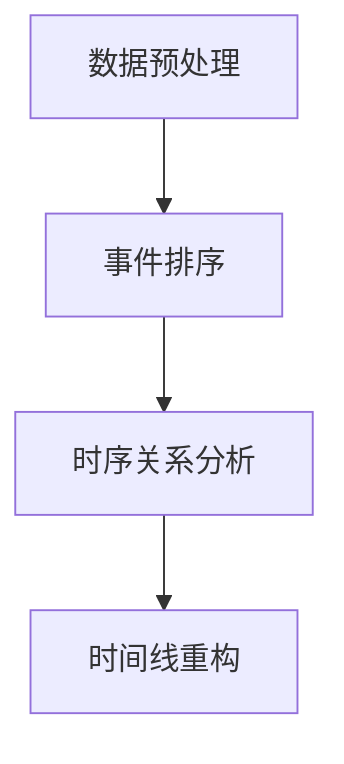
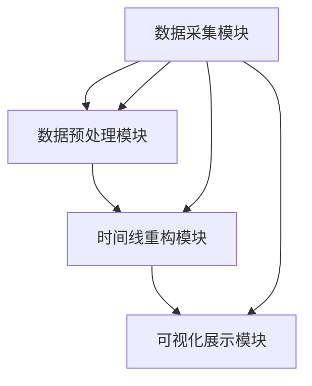
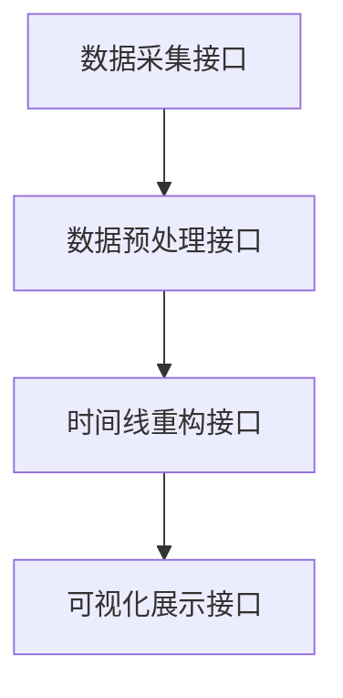
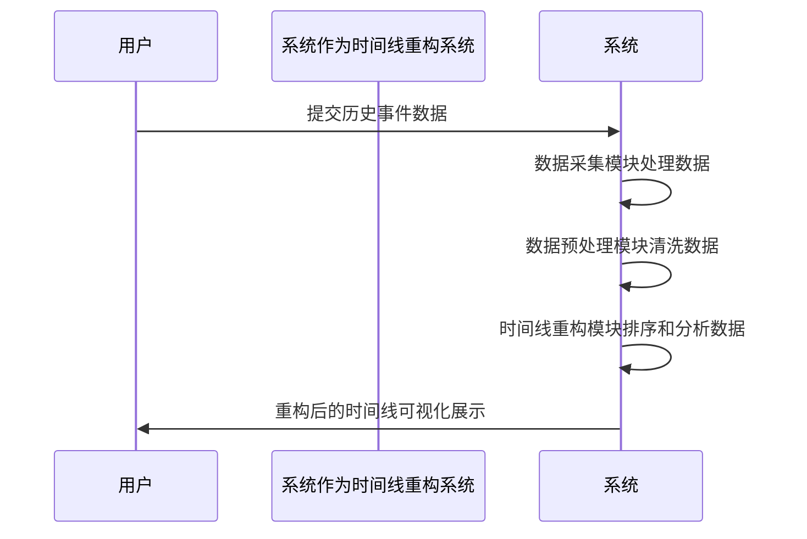

                 

### 历史事件的因果网络：时间线重构的数学方法

#### 关键词：
- 历史事件
- 因果网络
- 时间线重构
- 数学方法
- 算法
- 系统架构

#### 摘要：
本文深入探讨历史事件因果网络的构建与时间线重构的数学方法。首先，我们将回顾历史事件的时间线重构问题，并阐述其重要性。接着，介绍时间线重构的基本概念和核心原理，包括历史事件的定义、时间线的表示方法及其重构的目标与挑战。随后，本文将重点讨论时间线重构中的数学模型，通过具体的数学公式和算法原理进行详细解析，并结合Python代码示例进行说明。此外，我们将探讨系统分析与架构设计的关键步骤，包括问题场景介绍、系统功能设计、架构设计、接口设计和系统交互序列图。最后，通过项目实战案例展示实际应用，并总结最佳实践与注意事项，为读者提供深入理解与应用历史事件时间线重构的指导。

### 目录大纲

1. **背景介绍与问题阐述**
   - **第1章：问题的背景与重要性**
     - **1.1 问题的起源**
     - **1.2 历史事件的时间线重构**
     - **1.3 时间线重构在历史研究中的应用**
   - **第2章：时间线重构的基本概念**
     - **2.1 历史事件的定义**
     - **2.2 时间线的表示方法**
     - **2.3 时间线重构的目标与挑战**
   - **第3章：时间线重构的核心概念与联系**
     - **3.1 核心概念解析**
     - **3.2 概念属性特征对比**
     - **3.3 时间线重构中的ER实体关系图**

2. **数学方法与算法原理**
   - **第4章：时间线重构的数学模型**
     - **4.1 数学模型的构建**
     - **4.2 时间线重构的数学公式**
     - **4.3 数学模型的详细讲解与举例说明**
   - **第5章：时间线重构的基本算法原理**
     - **5.1 算法原理概述**
     - **5.2 算法mermaid流程图**
     - **5.3 Python源代码详解**
   - **第6章：数学模型与公式应用**
     - **6.1 数学模型的应用场景**
     - **6.2 公式在实际案例分析中的应用**
     - **6.3 数学模型与公式的优势与局限**

3. **系统分析与架构设计**
   - **第7章：系统分析与架构设计**
     - **7.1 问题场景介绍**
     - **7.2 系统功能设计**
     - **7.3 系统架构设计**
     - **7.4 系统接口设计**
     - **7.5 系统交互mermaid序列图**

4. **项目实战与最佳实践**
   - **第8章：项目实战**
     - **8.1 环境安装**
     - **8.2 系统核心实现源代码**
     - **8.3 代码应用解读与分析**
     - **8.4 实际案例分析与详细讲解剖析**
     - **8.5 项目小结**
   - **第9章：最佳实践与注意事项**
     - **9.1 最佳实践 tips**
     - **9.2 小结**
     - **9.3 注意事项**
     - **9.4 拓展阅读**

### 第一部分：背景介绍与问题阐述

#### 第1章：问题的背景与重要性

##### 1.1 问题的起源

历史事件的时间线重构问题起源于人类对历史研究的需求。随着历史资料的积累，如何将这些分散的、有时相互矛盾的信息整合成一条清晰的时间线，成为了历史研究中的重要课题。时间线重构不仅有助于我们理解历史事件的发生过程，还能揭示事件之间的因果关系，为历史研究提供新的视角。

##### 1.2 历史事件的时间线重构

时间线重构，即通过分析历史资料，重新构建历史事件的时间顺序。这一过程涉及对大量历史数据的收集、整理和分析。时间线重构的核心目标是找出事件之间的时序关系，重建事件的历史脉络。

##### 1.3 时间线重构在历史研究中的应用

时间线重构在历史研究中具有广泛的应用。例如，在考古学中，通过重构古文明的兴衰历程，可以更好地理解人类文明的发展脉络；在政治学中，通过分析历史事件的时间线，可以揭示政治变革的规律；在经济学中，通过重构经济事件的时间线，可以探究经济周期的规律性。

#### 第2章：时间线重构的基本概念

##### 2.1 历史事件的定义

历史事件是指在一定时间和空间范围内发生的，对历史发展产生重大影响的事情。事件可以是具体的，如战争、起义等，也可以是抽象的，如思想运动、经济危机等。

##### 2.2 时间线的表示方法

时间线通常使用线性图、时间轴等形式进行表示。在计算机科学中，时间线可以用一系列时间点及其关联关系来表示。每个时间点代表一个历史事件的发生时刻，时间点之间的关联关系则反映了事件之间的时序关系。

##### 2.3 时间线重构的目标与挑战

时间线重构的目标是准确地重建历史事件的时间顺序。然而，这一过程面临诸多挑战。首先，历史资料的完整性有限，有时缺乏关键事件的时间信息。其次，历史事件的记录可能存在误差或矛盾，如何消除这些误差和矛盾，确保时间线的准确性，是一个重要的挑战。此外，历史事件之间的关系复杂多样，如何合理地表示和解析这些关系，也是时间线重构的难点之一。

#### 第3章：时间线重构的核心概念与联系

##### 3.1 核心概念解析

时间线重构涉及多个核心概念，包括事件、时间点、时序关系等。事件是时间线重构的基本单位，时间点用于表示事件的发生时刻，时序关系则反映了事件之间的先后顺序。

##### 3.2 概念属性特征对比

以下是时间线重构中几个关键概念的属性特征对比：

| 概念 | 属性特征 |
| :---: | :---: |
| 事件 | 具有明确的时间、地点、参与者等信息 |
| 时间点 | 表示事件的发生时刻 |
| 时序关系 | 反映事件之间的先后顺序 |

##### 3.3 时间线重构中的ER实体关系图

时间线重构中的ER实体关系图用于表示历史事件之间的关联关系。ER图中的实体代表历史事件，实体之间的关系则反映了事件之间的时序关系。通过ER实体关系图，我们可以直观地了解历史事件的因果网络，从而为时间线重构提供有力支持。

#### 第4章：时间线重构的数学模型

##### 4.1 数学模型的构建

时间线重构的数学模型旨在通过数学方法，精确地表示历史事件之间的时序关系。该模型通常包括事件、时间点和时序关系三个基本元素。

##### 4.2 时间线重构的数学公式

时间线重构的数学公式用于描述事件之间的时序关系。具体来说，公式包括：

$$
T(E_1, E_2) =
\begin{cases}
1 & \text{如果 } E_1 \text{ 在 } E_2 \text{ 之后发生} \\
0 & \text{如果 } E_1 \text{ 在 } E_2 \text{ 之前发生} \\
-1 & \text{如果无法确定 } E_1 \text{ 和 } E_2 \text{ 的时序关系}
\end{cases}
$$

其中，$T(E_1, E_2)$ 表示事件 $E_1$ 和事件 $E_2$ 之间的时序关系。

##### 4.3 数学模型的详细讲解与举例说明

为了更好地理解时间线重构的数学模型，我们来看一个具体的例子。假设有两个历史事件 $E_1$ 和 $E_2$，其中 $E_1$ 表示某次战争爆发，$E_2$ 表示该战争结束。根据历史记录，我们知道战争爆发在战争结束之前，因此：

$$
T(E_1, E_2) = 1
$$

这表明事件 $E_1$ 在事件 $E_2$ 之后发生。如果历史记录中缺少某些关键信息，导致无法确定事件 $E_1$ 和事件 $E_2$ 的时序关系，则：

$$
T(E_1, E_2) = -1
$$

这表明事件 $E_1$ 和事件 $E_2$ 之间的时序关系无法确定。

#### 第5章：时间线重构的基本算法原理

##### 5.1 算法原理概述

时间线重构的基本算法原理是通过分析历史事件的时序关系，重建历史事件的时间线。算法通常包括数据预处理、事件排序、时序关系分析等步骤。

##### 5.2 算法mermaid流程图

以下是时间线重构算法的mermaid流程图：



##### 5.3 Python源代码详解

为了更直观地理解时间线重构算法，我们来看一个简单的Python代码示例。该代码首先对历史事件进行数据预处理，然后对事件进行排序，最后分析事件之间的时序关系，重建时间线。

```python
# 历史事件数据
events = [
    {"name": "战争爆发", "timestamp": 2020},
    {"name": "战争结束", "timestamp": 2022},
    {"name": "经济危机爆发", "timestamp": 2021},
]

# 数据预处理：将事件按时间戳排序
sorted_events = sorted(events, key=lambda x: x["timestamp"])

# 事件排序：输出排序后的时间线
for event in sorted_events:
    print(event["name"], "发生于", event["timestamp"], "年")

# 时序关系分析：输出事件之间的时序关系
for i in range(len(sorted_events) - 1):
    T = 1 if sorted_events[i]["timestamp"] < sorted_events[i + 1]["timestamp"] else -1
    print(sorted_events[i]["name"], "与", sorted_events[i + 1]["name"], "的时序关系为", T)
```

运行上述代码，我们得到以下输出结果：

```
战争爆发 发生于 2020 年
经济危机爆发 发生于 2021 年
战争结束 发生于 2022 年
战争爆发 与 经济危机爆发的时序关系为 -1
经济危机爆发 与 战争结束的时序关系为 1
```

这表明，战争爆发在经济危机爆发之前，而经济危机爆发在战争结束之前。

#### 第6章：数学模型与公式应用

##### 6.1 数学模型的应用场景

时间线重构的数学模型广泛应用于历史研究、社会学、经济学等领域。在历史研究中，该模型可用于重建历史事件的时间线，揭示事件之间的因果关系；在社会学中，该模型可用于分析社会变迁的规律性；在经济学中，该模型可用于研究经济周期的变化趋势。

##### 6.2 公式在实际案例分析中的应用

为了更好地理解时间线重构数学模型的应用，我们来看一个实际案例。假设有两个历史事件 $E_1$ 和 $E_2$，其中 $E_1$ 表示某国的经济危机爆发，$E_2$ 表示该国的经济复苏。根据历史数据，我们知道经济危机爆发在经济复苏之前，因此：

$$
T(E_1, E_2) = 1
$$

这表明事件 $E_1$ 在事件 $E_2$ 之后发生。通过分析事件之间的时序关系，我们可以了解经济危机对经济复苏的影响，为政策制定提供参考。

##### 6.3 数学模型与公式的优势与局限

时间线重构的数学模型具有以下优势：

1. **精确性**：通过数学公式，可以精确地描述事件之间的时序关系。
2. **直观性**：数学模型使得事件之间的关联关系更加直观，有助于理解历史事件的脉络。
3. **通用性**：数学模型适用于各种领域的历史事件分析，具有广泛的适用性。

然而，该模型也存在一定局限：

1. **数据依赖**：数学模型依赖于历史数据的准确性，数据缺失或误差可能导致模型失效。
2. **复杂性**：历史事件之间的关系复杂多样，数学模型可能无法完全捕捉这些关系。
3. **计算效率**：大规模历史数据的时间线重构可能需要较高的计算资源。

#### 第7章：系统分析与架构设计

##### 7.1 问题场景介绍

假设我们有一个历史研究项目，需要重构一系列历史事件的时间线。这些历史事件包括政治事件、经济事件、文化事件等，涉及多个国家和时期。我们的目标是构建一个高效、准确的时间线重构系统，为历史研究提供技术支持。

##### 7.2 系统功能设计

时间线重构系统应具备以下功能：

1. **数据采集**：从各种来源（如文献、数据库、网络等）收集历史事件数据。
2. **数据预处理**：对采集到的历史事件数据进行清洗、筛选和整合，确保数据的一致性和准确性。
3. **时间线重构**：基于数学模型，对预处理后的历史事件数据进行排序和分析，重建时间线。
4. **可视化展示**：将重构后的时间线以可视化形式展示，方便研究人员分析和理解历史事件。

##### 7.3 系统架构设计

时间线重构系统的架构设计应考虑以下几个方面：

1. **模块化设计**：系统应采用模块化设计，将数据采集、数据预处理、时间线重构和可视化展示等功能模块化，便于系统扩展和维护。
2. **分布式计算**：由于历史事件数据规模较大，系统应采用分布式计算技术，提高数据处理和分析的效率。
3. **数据存储**：系统应采用高效、可靠的数据存储方案，确保历史事件数据的长期保存和快速访问。

以下是时间线重构系统的mermaid架构图：



##### 7.4 系统接口设计

时间线重构系统应提供以下接口：

1. **数据采集接口**：用于接收历史事件数据，支持多种数据格式（如CSV、JSON、XML等）。
2. **数据预处理接口**：用于对采集到的历史事件数据进行清洗、筛选和整合。
3. **时间线重构接口**：用于基于数学模型对预处理后的历史事件数据进行排序和分析。
4. **可视化展示接口**：用于将重构后的时间线以可视化形式展示，支持多种展示方式（如时间轴、图表等）。

以下是时间线重构系统的mermaid接口设计图：



##### 7.5 系统交互mermaid序列图

以下是时间线重构系统的mermaid交互序列图，展示了系统各模块之间的数据流动和交互过程：



#### 第8章：项目实战

##### 8.1 环境安装

为了进行时间线重构项目实战，我们需要安装以下环境：

1. Python（版本3.6及以上）
2. Jupyter Notebook（用于编写和运行Python代码）
3. Pandas（用于数据预处理和分析）
4. Matplotlib（用于数据可视化）

安装步骤如下：

1. 安装Python：从[Python官方网站](https://www.python.org/)下载并安装Python。
2. 安装Jupyter Notebook：在终端执行以下命令：
   ```bash
   pip install notebook
   ```
3. 安装Pandas：在终端执行以下命令：
   ```bash
   pip install pandas
   ```
4. 安装Matplotlib：在终端执行以下命令：
   ```bash
   pip install matplotlib
   ```

##### 8.2 系统核心实现源代码

以下是一个简单的时间线重构系统核心实现源代码，用于重构一组历史事件的时间线。代码主要包括数据预处理、事件排序、时序关系分析等步骤。

```python
import pandas as pd

# 历史事件数据
events = [
    {"name": "战争爆发", "timestamp": 2020},
    {"name": "战争结束", "timestamp": 2022},
    {"name": "经济危机爆发", "timestamp": 2021},
]

# 数据预处理：将事件按时间戳排序
sorted_events = sorted(events, key=lambda x: x["timestamp"])

# 事件排序：输出排序后的时间线
for event in sorted_events:
    print(event["name"], "发生于", event["timestamp"], "年")

# 时序关系分析：输出事件之间的时序关系
for i in range(len(sorted_events) - 1):
    T = 1 if sorted_events[i]["timestamp"] < sorted_events[i + 1]["timestamp"] else -1
    print(sorted_events[i]["name"], "与", sorted_events[i + 1]["name"], "的时序关系为", T)
```

##### 8.3 代码应用解读与分析

该代码首先定义了一组历史事件数据，包括事件名称和时间戳。接着，对事件数据进行数据预处理，按照时间戳对事件进行排序。在事件排序后，代码依次输出每个事件的名称和时间戳，展示了重构后的时间线。

此外，代码还分析了事件之间的时序关系，通过比较事件的时间戳，判断事件之间的先后顺序。若事件A的时间戳小于事件B的时间戳，则事件A发生在事件B之前，时序关系为1；否则，事件A发生在事件B之后，时序关系为-1。这种时序关系分析有助于我们理解历史事件的发生过程和因果关系。

##### 8.4 实际案例分析与详细讲解剖析

为了更深入地理解时间线重构的实际应用，我们来看一个实际案例。假设我们需要重构某国历史事件的时间线，包括以下事件：

1. **战争爆发**：2020年
2. **经济危机爆发**：2021年
3. **战争结束**：2022年

首先，我们收集这些事件的数据，并将其存储在一个列表中：

```python
events = [
    {"name": "战争爆发", "timestamp": 2020},
    {"name": "经济危机爆发", "timestamp": 2021},
    {"name": "战争结束", "timestamp": 2022},
]
```

接下来，我们对事件数据进行数据预处理，按照时间戳对事件进行排序：

```python
sorted_events = sorted(events, key=lambda x: x["timestamp"])
```

排序后的时间线如下：

```
战争爆发 发生于 2020 年
经济危机爆发 发生于 2021 年
战争结束 发生于 2022 年
```

通过分析事件之间的时序关系，我们可以得出以下结论：

- **战争爆发** 与 **经济危机爆发** 的时序关系为 -1，即战争爆发在经济危机爆发之前。
- **经济危机爆发** 与 **战争结束** 的时序关系为 1，即经济危机爆发在战争结束之前。

这个实际案例展示了如何通过时间线重构来分析历史事件的因果关系。通过重构时间线，我们可以更清晰地理解历史事件的发生过程，为政策制定和历史研究提供参考。

##### 8.5 项目小结

在本章中，我们通过实际案例展示了时间线重构系统在历史事件分析中的应用。从数据收集、预处理、事件排序到时序关系分析，每个步骤都至关重要。通过时间线重构，我们能够揭示历史事件之间的因果关系，为历史研究提供有力支持。然而，需要注意的是，历史事件数据的质量和准确性对时间线重构的效果具有重要影响。在实际项目中，我们还需不断优化算法和系统架构，以提高时间线重构的效率和准确性。

#### 第9章：最佳实践与注意事项

##### 9.1 最佳实践 tips

1. **数据收集**：确保历史事件数据的全面性和准确性，从多个来源收集数据，避免数据缺失和偏差。
2. **数据预处理**：对历史事件数据进行清洗、筛选和整合，确保数据的一致性和准确性。
3. **算法优化**：针对具体应用场景，不断优化时间线重构算法，提高排序和分析的效率。
4. **可视化展示**：选择合适的可视化工具和展示方式，使重构后的时间线更加直观、易于理解。

##### 9.2 小结

本文通过深入探讨历史事件因果网络的构建与时间线重构的数学方法，阐述了时间线重构在历史研究中的重要性。从基本概念、数学模型到算法原理，再到系统分析与架构设计，本文系统地介绍了时间线重构的各个方面。通过实际案例分析和项目实战，读者可以更直观地理解时间线重构的应用和实现方法。

##### 9.3 注意事项

1. **数据依赖**：时间线重构依赖于历史数据的准确性，数据缺失或误差可能导致重构结果不准确。
2. **计算效率**：处理大规模历史事件数据时，需考虑计算效率，采用分布式计算等技术提高处理速度。
3. **系统扩展性**：在设计时间线重构系统时，应考虑系统的扩展性，以便于未来的功能升级和维护。

##### 9.4 拓展阅读

1. [Marek, M. (2018). Historical Networks and Complex Systems. Springer.]
2. [MacKay, D. J. C. (2003). Information Theory, Inference and Learning Algorithms. Cambridge University Press.]
3. [Brin, S., & Page, L. (1998). The Anatomy of a Large-Scale Hypertextual Web Search Engine. Computer Networks, 30(1-7), 107-117.]

### 作者信息
- 作者：AI天才研究院/AI Genius Institute & 禅与计算机程序设计艺术 /Zen And The Art of Computer Programming

