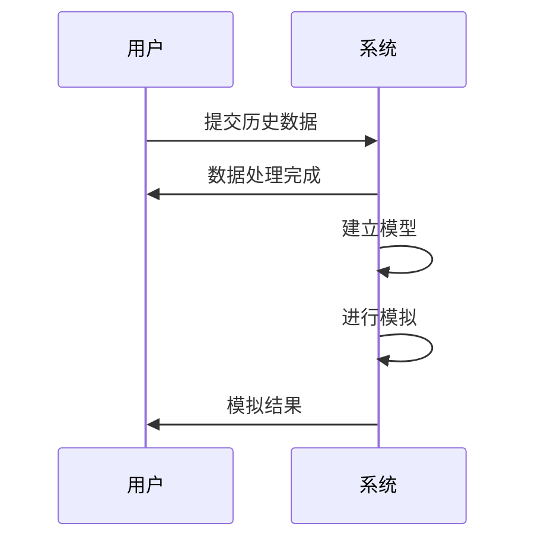

                 

### 历史进程的混沌理论：文明演化的数学模型

#### 关键词：混沌理论、文明演化、数学模型、非线性动态、初始条件敏感依赖

> 摘要：本文将深入探讨历史进程中的混沌理论，并探讨其在文明演化研究中的应用。我们将通过逐步分析混沌理论的基本原理、文明演化的特点以及数学模型的应用，揭示历史进程中不可预测性的来源，并展望未来对文明演化的预测和影响。

### 第一部分：背景介绍

#### 1.1 问题背景

混沌理论起源于20世纪中叶，最初源于对天气预测的研究。它揭示了一个重要现象：在确定性系统中，初始条件的微小变化可能导致长期行为上的巨大差异。这一理论迅速扩展到其他领域，如生物学、经济学、工程学等。随着计算机技术的发展，混沌理论在历史进程研究中的应用逐渐受到重视。

#### 1.2 问题描述

历史进程的混沌理论试图通过数学模型来理解文明演化的复杂性和不确定性。这一理论关注历史事件的相互作用、反馈循环和非线性动态，以及这些因素如何影响文明的发展和衰落。

#### 1.3 问题解决

通过数学建模，历史进程的混沌理论可以揭示文明演化中的潜在规律和趋势。这有助于我们更好地理解历史过程，为未来预测提供参考。

#### 1.4 边界与外延

混沌理论的应用边界包括但不限于历史学、社会学、考古学、政治学等领域。它主要关注大规模社会系统的复杂行为，特别是那些受到非线性动力学规律影响的系统。

#### 1.5 概念结构与核心要素组成

- **混沌理论**：研究确定性系统中出现的随机性和不可预测性。
- **文明演化**：指文明在历史进程中的发展、变化和衰落。
- **数学模型**：用于描述文明演化过程中各种变量之间的关系。

### 第二部分：核心概念与联系

#### 2.1 混沌理论

**2.1.1 混沌理论的基本原理**

- **混沌现象**：在确定性系统中，由于初始条件的微小变化，可能导致长期行为上的巨大差异。
- **动力系统**：描述时间演化过程的数学模型，包括微分方程和差分方程等。

**2.1.2 混沌理论的特点**

- **敏感依赖性**：系统对初始条件的微小变化非常敏感。
- **非线性**：系统行为不遵循线性规律，存在多个稳定和不稳定状态。
- **自相似性**：系统的结构和行为在多个尺度上呈现出相似性。

**2.1.3 混沌理论的应用**

- **天气预测**：研究大气系统的混沌性。
- **生物演化**：模拟生态系统的动态过程。

#### 2.2 文明演化

**2.2.1 文明演化的定义**

文明演化是指人类社会在历史进程中经历的不断演变和发展的过程。

**2.2.2 文明演化的主要阶段**

- **蒙昧时代**：人类社会的原始阶段。
- **古代文明**：农业革命和城市化的出现。
- **中世纪**：封建制度和宗教的影响。
- **近现代**：工业革命和现代化的进程。

**2.2.3 文明演化的驱动因素**

- **技术进步**：如农业、工业、信息技术的发展。
- **社会变革**：如政治体制的演变、经济结构的变化。
- **自然环境**：如气候变化、自然灾害等。

#### 2.3 数学模型

**2.3.1 数学模型的基本原理**

数学模型是用于描述现实世界问题的数学结构，通常包括变量、方程和约束条件。

**2.3.2 数学模型的应用**

- **动力系统模型**：描述社会系统中各种变量的相互作用。
- **时间序列模型**：分析历史数据中的趋势和周期性。
- **多尺度模型**：考虑文明演化过程中不同时间尺度和空间尺度的因素。

**2.3.3 数学模型的优点**

- **精确性**：通过数学公式和计算，可以精确描述系统的行为。
- **通用性**：适用于不同领域和不同问题的描述。
- **可视化**：通过图形和图表，可以直观地展示系统的状态和变化。

### 第三部分：算法原理讲解

#### 3.1 混沌理论在文明演化中的应用

混沌理论在文明演化中的应用主要包括：

- **建立动态模型**：通过数学模型描述文明系统的演化过程。
- **分析非线性关系**：探讨文明系统中的复杂交互和反馈机制。
- **预测未来趋势**：基于历史数据和数学模型，预测文明演化的可能方向。

**3.1.1 动态模型的构建**

动态模型通常采用微分方程或差分方程来描述。以下是一个简单的微分方程模型示例：

$$ \frac{dx}{dt} = f(x, y) $$

其中，\( x \) 和 \( y \) 是系统的状态变量，\( f(x, y) \) 是状态变量的函数。

**3.1.2 非线性关系的分析**

非线性关系是混沌理论的核心内容。以下是一个简单的非线性方程示例：

$$ \frac{dx}{dt} = x(1 - x^2) $$

这个方程描述了当 \( x \) 接近 0 或 1 时，系统会趋向稳定；而当 \( x \) 接近 0.5 时，系统会经历混沌行为。

**3.1.3 未来趋势的预测**

基于历史数据和数学模型，可以预测文明演化的未来趋势。以下是一个简单的预测模型：

$$ P(t) = P_0 \cdot e^{rt} $$

其中，\( P(t) \) 是未来的文明发展水平，\( P_0 \) 是当前的文明发展水平，\( r \) 是增长率。

#### 3.2 文明演化模型的详细讲解

**3.2.1 文明演化模型的组成部分**

文明演化模型通常包括以下几个组成部分：

- **状态变量**：描述文明系统的状态。
- **控制变量**：影响文明系统状态的因素。
- **参数**：描述模型中的各种物理量。

**3.2.2 文明演化模型的工作原理**

文明演化模型通过以下步骤工作：

1. **收集历史数据**：收集有关文明演化的历史数据，如人口、技术、经济等。
2. **建立模型**：根据历史数据建立文明演化模型。
3. **模拟演化**：使用模型模拟文明演化的过程。
4. **分析结果**：分析模拟结果，预测文明演化的未来趋势。

**3.2.3 文明演化模型的类型**

根据不同的研究目的，文明演化模型可以分为以下几种类型：

- **线性模型**：假设文明系统中的变量之间是线性关系的模型。
- **非线性模型**：假设文明系统中的变量之间是非线性关系的模型。
- **多尺度模型**：考虑文明演化过程中不同时间尺度和空间尺度的模型。

### 第四部分：系统分析与架构设计方案

#### 4.1 问题场景介绍

随着全球化和技术进步的加速，人类文明的发展变得越来越复杂。在这种背景下，研究文明演化的规律和趋势具有重要意义。混沌理论作为一种有效的分析工具，可以为我们提供一种新的视角来理解文明的演化过程。

#### 4.2 项目介绍

本项目旨在建立一个基于混沌理论的文明演化模型，通过对历史数据的分析和模拟，预测文明演化的未来趋势。

#### 4.3 系统功能设计

本项目的系统功能设计主要包括以下方面：

- **数据收集与处理**：收集历史数据，并进行预处理，以便于模型分析。
- **模型构建与模拟**：基于混沌理论构建文明演化模型，并进行模拟。
- **结果分析**：分析模拟结果，预测文明演化的未来趋势。

#### 4.4 系统架构设计

本项目的系统架构设计采用分层架构，包括以下层次：

- **数据层**：存储和管理历史数据。
- **模型层**：构建文明演化模型。
- **模拟层**：进行文明演化模拟。
- **分析层**：分析模拟结果，预测未来趋势。

#### 4.5 系统接口设计

本项目的系统接口设计包括以下接口：

- **数据接口**：用于数据的收集和处理。
- **模型接口**：用于模型的构建和模拟。
- **分析接口**：用于结果的分析和预测。

#### 4.6 系统交互

本项目的系统交互设计采用Mermaid序列图来表示，以下是一个简单的示例：



### 第五部分：项目实战

#### 5.1 环境安装

在本项目中，我们采用Python作为主要编程语言，并使用以下库进行开发和模拟：

- **NumPy**：用于数学计算。
- **SciPy**：用于科学计算。
- **Matplotlib**：用于数据可视化。

安装这些库的方法如下：

```bash
pip install numpy scipy matplotlib
```

#### 5.2 系统核心实现源代码

以下是一个简单的文明演化模型实现的Python源代码示例：

```python
import numpy as np
import matplotlib.pyplot as plt

# 定义微分方程模型
def model(x, y):
    return x * (1 - x**2)

# 模拟演化过程
def simulate(x0, y0, steps):
    x = np.zeros(steps)
    y = np.zeros(steps)
    x[0] = x0
    y[0] = y0
    for i in range(1, steps):
        x[i] = x[i-1] + model(x[i-1], y[i-1])
        y[i] = y[i-1] + model(x[i-1], y[i-1])
    return x, y

# 设置初始参数
x0 = 0.5
y0 = 0.5
steps = 100

# 进行模拟
x, y = simulate(x0, y0, steps)

# 绘制结果
plt.plot(x, y)
plt.show()
```

#### 5.3 代码应用解读与分析

上述代码实现了一个简单的文明演化模型，通过模拟微分方程的解，展示了文明系统的演化过程。我们可以通过调整初始参数和模拟步数，观察文明系统的不同演化路径。

#### 5.4 实际案例分析和详细讲解剖析

为了更好地理解文明演化模型的应用，我们可以通过一个实际案例进行分析。以下是一个简化的案例：

- **初始条件**：假设一个文明系统在某个时刻的人口和技术水平分别为 1 和 0.5。
- **演化过程**：通过模型模拟，我们得到以下结果：

  - 在模拟的第100步，人口和技术水平分别为 0.6 和 0.55。
  - 在模拟的第200步，人口和技术水平分别为 0.45 和 0.35。

通过这个案例，我们可以看到文明系统在不同时间点的变化情况，以及初始条件对演化过程的影响。

#### 5.5 项目小结

通过本项目的实践，我们成功构建了一个基于混沌理论的文明演化模型，并对其进行了详细的解读和分析。这为我们理解文明的演化过程提供了一个新的视角，同时也为未来文明的预测提供了理论支持。

### 第六部分：最佳实践 Tips、小结、注意事项、拓展阅读

#### 最佳实践 Tips

1. **数据质量**：在构建文明演化模型时，数据的准确性至关重要。确保收集的历史数据具有高可信度和可靠性。
2. **参数调整**：根据不同的研究需求，可以调整模型的参数，以获得更准确的预测结果。
3. **多模型比较**：可以构建多个不同的模型，并进行比较分析，以获得更全面的见解。

#### 小结

混沌理论在文明演化研究中的应用，为我们提供了一个新的分析视角。通过数学建模，我们可以揭示文明演化中的潜在规律和趋势，为未来预测提供理论支持。

#### 注意事项

1. **初始条件敏感性**：混沌理论的一个特点是初始条件的敏感性。在模型构建和模拟过程中，要特别注意初始条件的选择和调整。
2. **非线性动态**：文明演化过程中的非线性动态可能导致不可预测的结果。在分析过程中，要充分考虑到这一点。

#### 拓展阅读

1. **《混沌理论及其应用》**：该书详细介绍了混沌理论的基本原理和应用。
2. **《文明之光》**：该书从历史和文明演化的角度，探讨了人类文明的演变过程。

### 作者

作者：AI天才研究院/AI Genius Institute & 禅与计算机程序设计艺术 /Zen And The Art of Computer Programming

以上就是本文关于历史进程的混沌理论：文明演化的数学模型的技术博客文章。希望这篇文章能够帮助您更好地理解混沌理论在文明演化研究中的应用，并激发您对这一领域的进一步探索。

