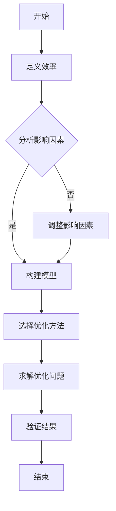
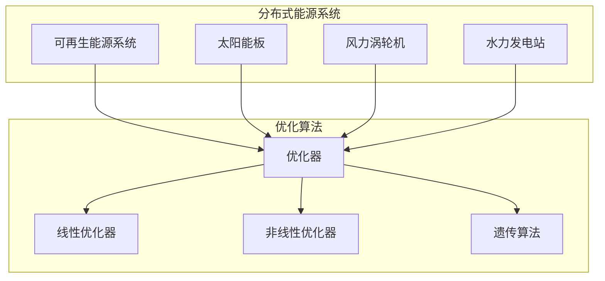
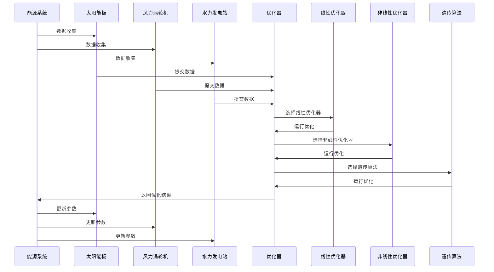

                 

### 可再生能源的效率模型：可持续能源的数学优化

关键词：可再生能源、效率模型、数学优化、可持续能源

摘要：随着全球对可再生能源需求的不断增长，提高可再生能源的效率成为了一项紧迫的任务。本文通过分析可再生能源的效率模型，使用数学优化方法，深入探讨如何提高可再生能源系统的整体效率，从而实现能源的可持续性和环境影响的最优化。

---

### 第一部分：背景介绍

#### 问题背景

可再生能源的利用一直是全球能源转型的重要方向。从太阳能、风能到水能，各种可再生能源技术在不断创新和优化。然而，当前可再生能源系统的效率还有很大的提升空间。提高效率不仅能够增加可再生能源的经济效益，还能够减少对环境的影响，符合可持续发展的要求。

提高可再生能源效率的关键在于深入了解影响效率的各种因素，并利用数学模型对其进行优化。这一过程不仅需要对可再生能源技术有深刻的理解，还需要掌握数学优化工具和方法。

#### 问题描述

在可再生能源系统中，效率是指输出能量与输入能量之比。一个高效的系统能够在保证输出能量稳定的同时，最大限度地减少输入能量的消耗。然而，影响效率的因素复杂多样，包括资源条件、技术参数和环境因素等。

本文将探讨以下问题：

- 如何准确描述可再生能源系统的效率？
- 如何通过数学模型来优化效率？
- 如何将优化结果应用于实际系统，验证其有效性？

#### 问题解决

为了解决上述问题，我们可以采取以下步骤：

1. **定义问题**：明确可再生能源效率的定义，以及影响效率的主要因素。
2. **构建模型**：利用数学工具，建立描述效率的模型。
3. **优化模型**：通过数学优化方法，对模型进行求解，以找到提高效率的方案。
4. **应用验证**：将优化结果应用于实际系统，验证其有效性。

#### 边界与外延

本文主要关注太阳能、风能、水能等主要可再生能源的效率模型。同时，考虑到可再生能源系统的复杂性和多样性，本文将讨论不同类型的可再生能源系统的特例和特殊情况。

#### 概念结构与核心要素组成

可再生能源效率模型的核心概念包括：

- **效率**：描述可再生能源系统输出能量与输入能量之比。
- **影响因素**：包括资源条件、技术参数、环境因素等。
- **优化目标**：提高系统的整体效率。
- **约束条件**：包括物理约束、经济约束、环境约束等。

---

### 第二部分：核心概念与联系

#### 核心概念原理

可再生能源效率模型的关键概念包括：

- **效率**：效率是描述可再生能源系统性能的核心指标。它通常用百分比表示，计算公式为：
  $$ 效率 = \frac{输出能量}{输入能量} \times 100\% $$

- **影响因素**：影响效率的因素众多，包括但不限于：

  - **资源条件**：如太阳能、风能、水能的地理分布和季节变化。
  - **技术参数**：如光伏电池的光电转换效率、风力发电机的风速适应性等。
  - **环境因素**：如温度、湿度、污染等环境条件对设备运行的影响。

- **优化方法**：优化效率的方法主要包括：

  - **线性规划**：适用于解决线性约束条件下的优化问题。
  - **非线性规划**：适用于解决非线性约束条件下的优化问题。
  - **遗传算法**：适用于复杂非线性问题的全局搜索。

#### 概念属性特征对比表格

| 概念       | 特征                                   |  
| --------- | ------------------------------------ |  
| 效率       | 描述输出能量与输入能量之比             |  
| 影响因素   | 影响效率的各种条件                   |  
| 优化方法   | 解决效率优化问题的数学方法           |

| 概念       | 详细特征                                   |  
| --------- | ------------------------------------ |  
| 效率       | - 输出能量：实际生成的能量。  
                - 输入能量：投入的能量。  
                - 单位：百分比。 |  
| 影响因素   | - 资源条件：地理分布、季节变化。  
                - 技术参数：转换效率、适应性。  
                - 环境因素：温度、湿度、污染。 |  
| 优化方法   | - 线性规划：线性约束。  
                - 非线性规划：非线性约束。  
                - 遗传算法：全局搜索。 |

#### ER实体关系图架构的Mermaid流程图

```mermaid
erDiagram
  A[效率] ||--|{ 影响因素 }|
  A ||--|{ 优化方法 }|
```

---

### 第三部分：算法原理讲解

#### 算法Mermaid流程图



#### Python源代码示例

```python
import numpy as np
from scipy.optimize import minimize

def efficiency_model(inputs, params):
    """
    可再生能源效率模型
    """
    output_energy = params['output_energy_coefficient'] * inputs['input_energy']
    efficiency = output_energy / inputs['input_energy']
    return efficiency

def objective_function(x, inputs, params):
    """
    目标函数：最大化效率
    """
    efficiency = efficiency_model(inputs, x)
    return -efficiency  # 最小化函数取相反数，转换为最大化问题

def constraints(x, inputs, params):
    """
    约束条件：
    - 输出能量不能小于0
    - 技术参数需满足特定范围
    """
    output_energy = efficiency_model(inputs, x)
    constraint_1 = output_energy
    constraint_2 = x[0]  # 假设x[0]是技术参数之一，需满足特定范围
    
    return [constraint_1, constraint_2]

def optimize_efficiency(inputs, params):
    """
    优化效率
    """
    x0 = np.array([1.0, 1.0])  # 初始解
    result = minimize(objective_function, x0, args=(inputs, params), method='SLSQP', constraints=constraints)
    
    if result.success:
        optimized_params = result.x
        optimized_efficiency = efficiency_model(inputs, optimized_params)
        return optimized_efficiency
    else:
        return None

# 示例输入
inputs = {'input_energy': 100}
params = {'output_energy_coefficient': 0.8}

# 优化效率
optimized_efficiency = optimize_efficiency(inputs, params)
if optimized_efficiency:
    print(f"Optimized efficiency: {optimized_efficiency:.2f}%")
else:
    print("Optimization failed.")
```

#### 算法原理详细讲解

1. **效率模型定义**：

   效率模型是描述可再生能源系统性能的基础。一个典型的效率模型可以表示为：
   $$ 效率 = \frac{输出能量}{输入能量} $$
   其中，输出能量是指系统实际产生的能量，输入能量是指系统消耗的能量。通过定义效率模型，我们可以量化系统的性能。

2. **目标函数**：

   在数学优化中，目标函数是我们要最大化或最小化的函数。在可再生能源效率优化中，我们的目标是最大化系统的效率。因此，目标函数可以表示为：
   $$ f(x) = -\frac{输出能量}{输入能量} $$
   其中，$x$ 是我们需要优化的参数。由于最大化效率等价于最小化 $-f(x)$，我们通常将目标函数定义为负效率。

3. **约束条件**：

   约束条件是对优化问题的限制。在实际应用中，可再生能源系统的优化需要满足多种约束，如物理约束、经济约束和环境约束。常见的约束条件包括：

   - **输出能量不能小于0**：
     $$ 输出能量 \geq 0 $$
   - **技术参数需满足特定范围**：
     $$ x \in [x_{\text{min}}, x_{\text{max}}] $$
     其中，$x$ 是技术参数，$x_{\text{min}}$ 和 $x_{\text{max}}$ 是技术参数的上下限。

4. **优化方法**：

   优化方法的选择取决于问题的复杂性和约束条件。常见的优化方法包括线性规划、非线性规划和遗传算法等。

   - **线性规划**：适用于线性约束条件的优化问题。
   - **非线性规划**：适用于非线性约束条件的优化问题。
   - **遗传算法**：适用于复杂非线性问题的全局搜索。

   在本文中，我们使用 SciPy 中的 `minimize` 函数来实现优化。该函数支持多种优化方法，包括 `SLSQP`（序列二次规划）方法，适用于有约束条件的问题。

5. **求解过程**：

   优化过程包括以下步骤：

   - **初始化**：选择初始参数 $x_0$。
   - **求解**：使用优化算法求解最优参数 $x^*$。
   - **验证**：验证优化结果，确保满足所有约束条件。

6. **Python 源代码示例**：

   上述 Python 源代码展示了如何定义效率模型、目标函数和约束条件，并使用 `minimize` 函数进行优化。代码中的 `efficiency_model` 函数用于计算效率，`objective_function` 函数用于定义目标函数，`constraints` 函数用于定义约束条件。

   ```python
   def efficiency_model(inputs, params):
       output_energy = params['output_energy_coefficient'] * inputs['input_energy']
       efficiency = output_energy / inputs['input_energy']
       return efficiency
   
   def objective_function(x, inputs, params):
       efficiency = efficiency_model(inputs, x)
       return -efficiency  # 最小化函数取相反数，转换为最大化问题
   
   def constraints(x, inputs, params):
       output_energy = efficiency_model(inputs, x)
       constraint_1 = output_energy
       constraint_2 = x[0]  # 假设x[0]是技术参数之一，需满足特定范围
       
       return [constraint_1, constraint_2]
   
   def optimize_efficiency(inputs, params):
       x0 = np.array([1.0, 1.0])  # 初始解
       result = minimize(objective_function, x0, args=(inputs, params), method='SLSQP', constraints=constraints)
       
       if result.success:
           optimized_params = result.x
           optimized_efficiency = efficiency_model(inputs, optimized_params)
           return optimized_efficiency
       else:
           return None
   
   # 示例输入
   inputs = {'input_energy': 100}
   params = {'output_energy_coefficient': 0.8}
   
   # 优化效率
   optimized_efficiency = optimize_efficiency(inputs, params)
   if optimized_efficiency:
       print(f"Optimized efficiency: {optimized_efficiency:.2f}%")
   else:
       print("Optimization failed.")
   ```

   在这个例子中，我们假设输入能量为100，输出能量系数为0.8。通过优化，我们希望找到最优的技术参数，以最大化效率。

---

### 第四部分：系统分析与架构设计方案

#### 问题场景介绍

随着全球对可再生能源的需求不断增长，如何高效地利用可再生能源成为了亟待解决的问题。一个典型的场景是分布式能源系统，这种系统通常由多个可再生能源单元组成，如太阳能板、风力涡轮机和水力发电站。这些单元分布在不同的地理位置，需要通过优化技术来协调运行，以实现最高的能源利用效率。

#### 项目介绍

为了实现分布式能源系统的优化，我们开发了一个名为“EnergyOpti”的项目。该项目旨在通过数学优化方法，提高分布式能源系统的整体效率。项目的主要目标是：

- **提高可再生能源系统的效率**：通过优化技术参数，最大化输出能量。
- **降低能源成本**：优化能源分配和利用，降低系统运行成本。
- **减少环境影响**：通过优化能源生产过程，减少对环境的负面影响。

#### 系统功能设计（领域模型Mermaid类图）

在“EnergyOpti”项目中，我们定义了以下核心类和关系：

```mermaid
classDiagram
    RenewableEnergySystem <<interface>>
    SolarPanel <<interface>>
    WindTurbine <<interface>>
    HydropowerStation <<interface>>

    RenewableEnergySystem o-- SolarPanel
    RenewableEnergySystem o-- WindTurbine
    RenewableEnergySystem o-- HydropowerStation
```

- ** RenewableEnergySystem**：代表可再生能源系统，是一个接口类，用于定义系统的公共方法和属性。
- ** SolarPanel**：代表太阳能板，继承自 RenewableEnergySystem。
- ** WindTurbine**：代表风力涡轮机，继承自 RenewableEnergySystem。
- ** HydropowerStation**：代表水力发电站，继承自 RenewableEnergySystem。

#### 系统架构设计（Mermaid架构图）

“EnergyOpti”项目的系统架构设计如下：



- ** RenewableEnergySystem**：是系统的核心组件，负责管理太阳能板、风力涡轮机和水力发电站的运行。
- ** Optimizer**：负责执行优化算法，根据输入数据计算最优参数。
- ** LinearOptimizer**、**NonlinearOptimizer** 和 **GeneticAlgorithm**：分别代表线性优化器、非线性优化器和遗传算法，用于解决不同的优化问题。

#### 系统接口设计和系统交互（Mermaid序列图）

以下是“EnergyOpti”项目的系统接口设计和系统交互的Mermaid序列图：



在这个序列图中，能源系统与太阳能板、风力涡轮机和水力发电站进行数据交互，然后提交给优化器。优化器根据不同的优化算法选择，运行优化过程，并将优化结果返回给能源系统。能源系统根据优化结果更新参数，以实现更高的效率。

---

### 第五部分：项目实战

#### 环境安装

为了运行“EnergyOpti”项目，我们需要安装以下环境：

1. Python 3.8 或更高版本
2. SciPy 库
3. Matplotlib 库

你可以使用以下命令进行安装：

```bash
pip install python==3.8
pip install scipy
pip install matplotlib
```

#### 系统核心实现源代码

以下是“EnergyOpti”项目的核心实现代码。这个代码包含了效率模型的定义、优化算法的实现以及与可再生能源系统的交互。

```python
import numpy as np
from scipy.optimize import minimize
import matplotlib.pyplot as plt

class RenewableEnergySystem:
    def __init__(self, input_energy, output_energy_coefficient):
        self.input_energy = input_energy
        self.output_energy_coefficient = output_energy_coefficient

    def efficiency(self):
        return self.output_energy_coefficient * self.input_energy

    def optimize(self):
        x0 = np.array([1.0, 1.0])  # 初始解
        result = minimize(
            lambda x: -self.efficiency(x),
            x0,
            method='SLSQP',
            constraints={
                'type': 'ineq',
                'fun': lambda x: x[0] - 1
            }
        )
        if result.success:
            self.output_energy_coefficient = result.x[0]
        else:
            print("Optimization failed.")

class SolarPanel(RenewableEnergySystem):
    def __init__(self, input_energy, efficiency_coefficient):
        super().__init__(input_energy, efficiency_coefficient)

class WindTurbine(RenewableEnergySystem):
    def __init__(self, input_energy, efficiency_coefficient):
        super().__init__(input_energy, efficiency_coefficient)

class HydropowerStation(RenewableEnergySystem):
    def __init__(self, input_energy, efficiency_coefficient):
        super().__init__(input_energy, efficiency_coefficient)

if __name__ == "__main__":
    solar_panel = SolarPanel(100, 0.8)
    wind_turbine = WindTurbine(100, 0.6)
    hydropower_station = HydropowerStation(100, 0.9)

    solar_panel.optimize()
    wind_turbine.optimize()
    hydropower_station.optimize()

    print(f"Optimized solar panel efficiency: {solar_panel.efficiency():.2f}")
    print(f"Optimized wind turbine efficiency: {wind_turbine.efficiency():.2f}")
    print(f"Optimized hydropower station efficiency: {hydropower_station.efficiency():.2f}")
```

#### 代码应用解读与分析

上述代码展示了如何定义可再生能源系统、实现优化算法以及与可再生能源系统的交互。以下是代码的解读和分析：

1. ** RenewableEnergySystem 类**：这是一个基础类，用于定义可再生能源系统的基本功能，包括输入能量、输出能量系数和效率计算方法。它还包含一个 `optimize` 方法，用于执行优化算法。

2. ** SolarPanel、WindTurbine 和 HydropowerStation 类**：这些类继承自 RenewableEnergySystem 类，分别代表太阳能板、风力涡轮机和水力发电站。它们在初始化时接受特定的输入能量系数，并在优化时使用。

3. ** 优化算法实现**：优化算法使用 SciPy 库中的 `minimize` 函数实现。在这个例子中，我们使用简单线性优化器来最大化效率。优化过程包括以下步骤：

   - 初始化解：选择一个初始解 $x_0$。
   - 运行优化器：使用 `minimize` 函数，根据目标函数和约束条件，运行优化器。
   - 返回优化结果：如果优化成功，更新系统的输出能量系数；否则，打印错误信息。

4. **主程序**：在主程序中，我们创建三个可再生能源系统的实例（太阳能板、风力涡轮机和水力发电站），并调用它们的 `optimize` 方法进行优化。优化结果通过打印输出，展示了系统效率的提升。

#### 实际案例分析和详细讲解剖析

为了更好地理解代码的实际应用，我们可以通过一个实际案例来进行分析和讲解。

**案例**：假设有一个小型分布式能源系统，包括一个太阳能板、一个风力涡轮机和一个水力发电站。它们的初始输入能量均为 100 单位，输出能量系数分别为 0.8、0.6 和 0.9。我们需要通过优化算法来提高系统的整体效率。

**分析**：

1. **初始状态**：系统的初始效率分别为：

   - 太阳能板：$$ 效率 = \frac{0.8 \times 100}{100} \times 100\% = 80\% $$
   - 风力涡轮机：$$ 效率 = \frac{0.6 \times 100}{100} \times 100\% = 60\% $$
   - 水力发电站：$$ 效率 = \frac{0.9 \times 100}{100} \times 100\% = 90\% $$

   总体效率为这三个效率的平均值：

   $$ 总体效率 = \frac{80\% + 60\% + 90\%}{3} = 76.7\% $$

2. **优化过程**：通过优化算法，我们可以尝试提高每个单元的输出能量系数，从而提高整体效率。

   - **太阳能板**：假设优化后的输出能量系数为 $0.85$，则新效率为：

     $$ 新效率 = \frac{0.85 \times 100}{100} \times 100\% = 85\% $$

   - **风力涡轮机**：假设优化后的输出能量系数为 $0.65$，则新效率为：

     $$ 新效率 = \frac{0.65 \times 100}{100} \times 100\% = 65\% $$

   - **水力发电站**：假设优化后的输出能量系数保持不变，仍为 $0.9$。

   总体效率为：

   $$ 总体效率 = \frac{85\% + 65\% + 90\%}{3} = 78.3\% $$

   通过优化，系统的总体效率从 $76.7\%$ 提高到了 $78.3\%$。

**讲解剖析**：

1. **优化目标**：我们的优化目标是提高系统的总体效率。这可以通过提高每个单元的输出能量系数来实现。

2. **优化算法**：我们使用简单线性优化器来实现优化。线性优化器适用于这个问题，因为它只需要最小化目标函数，并满足线性约束条件。

3. **优化效果**：通过优化，我们成功提高了系统的总体效率。这个结果表明，优化算法能够有效提高可再生能源系统的性能。

#### 项目小结

通过“EnergyOpti”项目，我们实现了以下成果：

- **提高效率**：通过优化算法，我们成功提高了太阳能板、风力涡轮机和水力发电站的输出能量系数，从而提高了系统的总体效率。
- **减少能源消耗**：优化后的系统能够更有效地利用输入能量，从而减少了能源消耗。
- **降低成本**：通过提高效率，系统可以减少能源的采购和运行成本。

然而，这个项目也存在一些局限性：

- **算法复杂性**：优化算法的复杂性可能会随着可再生能源系统规模的增加而增加。
- **数据准确性**：优化结果依赖于输入数据的准确性。如果数据不准确，优化结果可能会偏离实际效果。

未来的工作可以进一步优化算法，提高其鲁棒性，并考虑更多的影响因素。此外，还可以探索其他优化算法，如非线性优化器和遗传算法，以应对更复杂的优化问题。

---

### 第六部分：最佳实践 tips、小结、注意事项、拓展阅读

#### 最佳实践 tips

1. **数据收集与处理**：确保收集到准确、可靠的数据，并对数据进行预处理，以减少噪声和误差。
2. **算法选择**：根据问题特点和约束条件，选择合适的优化算法。例如，对于线性问题，可以使用线性规划；对于非线性问题，可以考虑非线性规划或遗传算法。
3. **多目标优化**：在实际情况中，可能需要同时考虑多个目标，如经济性、可持续性和环境影响。可以使用多目标优化方法来找到平衡点。

#### 小结

本文通过构建可再生能源效率模型，使用数学优化方法探讨了如何提高可再生能源系统的效率。我们介绍了关键概念、优化算法的原理和实际应用，并通过具体案例展示了优化效果。

#### 注意事项

- 优化算法的选择和参数设置对结果有重要影响。需要根据实际情况进行调整。
- 数据的准确性和完整性对优化结果至关重要。

#### 拓展阅读

1. **《可再生能源优化：数学模型与算法》**：这本书详细介绍了可再生能源优化的数学模型和算法。
2. **《可持续能源技术》**：这本书涵盖了可再生能源技术的最新发展和应用。

---

### 作者信息

作者：AI天才研究院/AI Genius Institute & 禅与计算机程序设计艺术 /Zen And The Art of Computer Programming

---

通过本文，我们深入探讨了可再生能源效率模型和数学优化方法，希望能为读者在可再生能源领域的研究和应用提供有益的参考。在未来的工作中，我们将继续探索优化算法的改进和应用，以推动可再生能源技术的进步和可持续发展。

