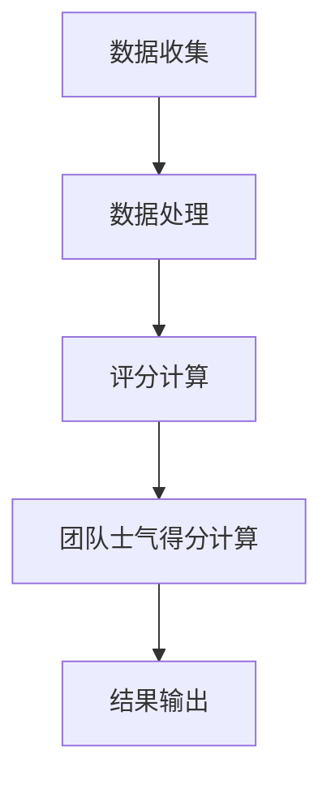
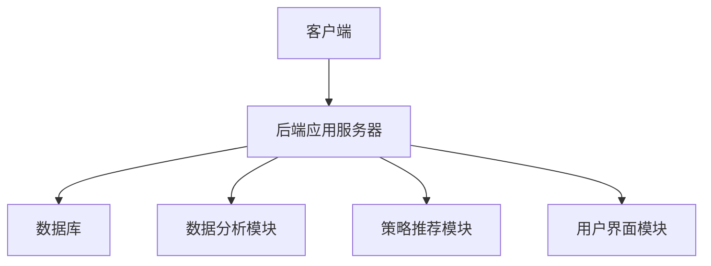

                 

### 引言

在现代信息技术企业中，团队士气被视为一项至关重要的资产。一个士气高昂的团队能够更高效地完成项目，更好地应对挑战，并保持持续的创新能力。相反，低落的团队士气可能导致工作效率下降、项目延迟、员工流失等问题。因此，如何提升团队士气，创造积极向上的工作氛围，成为企业管理者亟待解决的重要课题。

本文旨在通过逻辑清晰、结构紧凑的分析，探讨团队士气提升的方法与策略。我们将从问题背景、核心概念、提升策略、工作氛围的创造、案例分析、算法原理讲解、数学模型和系统分析与架构设计等多个方面，系统地阐述如何有效提升团队士气，营造积极向上的工作氛围。

具体而言，本文将分为以下几个部分：

1. **背景介绍**：我们将首先介绍团队士气的重要性，分析工作氛围对团队士气的影响，以及现代企业面临的团队士气问题。
2. **核心概念与联系**：接着，我们将阐述团队士气与积极向上工作氛围的核心概念，通过对比表格和ER实体关系图来展示它们之间的联系。
3. **团队士气提升策略**：我们将提出一系列具体的提升策略，包括制定明确的目标和计划、建立积极的团队文化、提供反馈和支持等。
4. **创造积极向上的工作氛围**：我们将探讨管理层在创造积极工作氛围中的角色与责任，以及工作环境的优化、工作流程的改进、鼓励创新与学习等方面的策略。
5. **团队士气提升案例分析**：通过具体案例，我们将分析如何在不同企业中实施这些策略，以及取得的成效。
6. **算法原理讲解**：我们将介绍团队士气评估的算法原理，包括流程图和Python源代码，并详细讲解数学模型和公式。
7. **系统分析与架构设计方案**：我们将描述一个实际的项目场景，介绍项目的系统功能设计、架构设计，以及系统接口设计和系统交互。
8. **项目实战**：最后，我们将展示一个实际项目的实现过程，包括环境安装、系统核心实现源代码，并对代码应用进行解读与分析。

通过本文的探讨，我们希望能够为企业提供一套实用的团队士气提升方案，帮助他们在激烈的市场竞争中保持优势，实现可持续发展。

### 第一部分：背景介绍

#### 第1章：问题背景

##### 1.1.1 问题背景

在当今快节奏、竞争激烈的信息技术行业中，企业的成功与否很大程度上依赖于团队的表现。一个高效、团结的团队能够迅速应对市场变化，快速迭代产品，提升客户满意度，从而在竞争中脱颖而出。然而，团队士气的高低直接影响到团队的表现和企业的整体业绩。因此，提升团队士气已成为企业管理者面临的一个关键问题。

**团队士气的重要性**

团队士气是指团队成员在工作中表现出的积极态度、合作精神和工作动力。高团队士气意味着团队成员之间有良好的沟通和协作，能够积极面对挑战，共同达成目标。具体来说，团队士气对企业的以下几个方面具有重要影响：

1. **工作效率**：高团队士气能够激发团队成员的潜能，提高工作效率。当团队成员士气高昂时，他们更愿意承担责任，主动解决问题，从而推动项目进展。
2. **创新能力**：积极向上的团队氛围有助于团队成员进行创新思维，提出新的解决方案。这种创新不仅能够提升产品的竞争力，还能为企业带来新的商业机会。
3. **员工满意度**：高团队士气能够提高员工的职业满意度和归属感，减少员工流失率。稳定的团队有助于员工形成长期发展的职业规划，从而增强企业的核心竞争力。

**工作氛围对团队士气的影响**

工作氛围是指团队在工作中所处的环境、文化和管理风格。一个积极向上的工作氛围能够促进团队士气，而消极的工作氛围则可能削弱团队的凝聚力。具体来说，工作氛围对团队士气的影响体现在以下几个方面：

1. **信任与支持**：在一个充满信任和支持的工作环境中，团队成员更容易分享自己的想法和意见，互相帮助，共同克服困难。这种信任和支持能够增强团队士气。
2. **公平与正义**：在一个公平正义的工作环境中，团队成员能够感受到自己的努力和贡献被认可，从而增强工作动力。不公平的管理和对待可能导致团队成员士气低落。
3. **激励与成长**：一个能够提供持续激励和成长机会的工作环境能够激发团队成员的积极性和进取心。当团队成员看到自己的进步和成长时，士气自然会提升。

**现代企业面临的团队士气问题**

尽管团队士气对企业的成功至关重要，但许多现代企业仍然面临着团队士气低落的问题。以下是一些常见的团队士气问题及其原因：

1. **工作压力过大**：随着项目进度的加快和竞争的加剧，许多企业的员工面临着巨大的工作压力。长期的工作压力可能导致员工感到疲惫和无力，从而降低团队士气。
2. **沟通不畅**：团队成员之间的沟通不畅会导致误解和冲突，削弱团队的凝聚力。缺乏有效的沟通机制和工具，团队士气很难得到提升。
3. **缺乏激励**：许多企业没有建立起完善的激励机制，员工看不到自己的努力与回报之间的关系，从而缺乏工作动力。
4. **管理不善**：不公正的管理和缺乏领导力可能导致团队成员对管理层产生不满，进而影响团队士气。

**总结**

提升团队士气对于企业的成功至关重要。通过了解团队士气的重要性、工作氛围的影响以及现代企业面临的团队士气问题，我们可以更好地制定策略，采取有效的措施来提升团队士气，创造积极向上的工作氛围。

##### 1.1.2 问题描述

在当今信息技术企业中，团队士气低落的现象并不少见。这种现象不仅影响到员工的工作表现，还可能对企业的整体业绩产生负面影响。为了更深入地了解团队士气低落的表现及其影响因素，我们需要明确当前团队士气问题的具体表现和原因。

**团队士气低落的表现**

团队士气低落通常表现为以下几种现象：

1. **员工积极性下降**：团队成员对工作的热情和动力明显减弱，工作态度消极，容易放弃挑战。
2. **工作效率降低**：团队成员工作效率下降，完成任务的时间延长，错误率增加，项目进度延迟。
3. **团队冲突增多**：团队成员之间的沟通不畅导致误解和冲突增多，团队内部矛盾加剧。
4. **员工流失率上升**：高团队士气低落可能导致员工对企业的忠诚度下降，员工流失率上升，影响团队的稳定性和持续性。
5. **创新能力减弱**：团队士气低落削弱了团队成员的创新动力和合作精神，导致创新能力下降，企业竞争力减弱。

**影响团队士气的主要因素**

团队士气低落的原因多种多样，主要包括以下几个方面：

1. **工作压力过大**：现代信息技术企业常常面临高强度的工作要求和紧迫的项目交付时间，导致员工长期处于高压状态，身心疲惫。长期的工作压力会削弱员工的积极性和士气。
2. **缺乏沟通与反馈**：团队成员之间的沟通不畅，管理层与员工之间的沟通不足，导致信息传递不及时、不准确，员工对工作的不确定性和压力增加，从而影响团队士气。
3. **激励不足**：许多企业没有建立有效的激励机制，员工缺乏工作动力。缺乏奖励和认可，员工容易感到自己的努力没有得到相应的回报，从而影响士气。
4. **工作环境不良**：工作环境不良，如办公设备老化、工作空间狭小、环境噪音等，都会影响员工的工作状态和士气。
5. **管理不善**：管理层的管理方式不当，如缺乏领导力、不公平待遇、缺乏关注和支持等，都会削弱团队的凝聚力和士气。

**总结**

了解团队士气低落的表现及其影响因素，有助于企业有针对性地采取措施，提升团队士气，营造积极向上的工作氛围。通过改善工作环境、加强沟通反馈、建立激励机制和管理层改进等方式，企业可以有效地解决团队士气问题，提高员工的工作满意度和企业的整体绩效。

##### 1.1.3 问题解决

面对团队士气低落的问题，企业需要采取一系列综合性的策略来提升团队士气，创造积极向上的工作氛围。以下是一些具体的方法和策略：

**提升团队士气的方法**

1. **制定明确的目标和计划**：为了提高团队士气，首先需要明确团队的目标和任务，确保每个成员都了解自己的职责和期望。通过制定详细的计划和里程碑，可以帮助团队成员更好地规划工作，明确前进的方向，从而增强工作动力。

2. **建立积极的团队文化**：团队文化是团队士气的重要支撑。企业可以通过开展团队建设活动、培训、团队讨论等方式，建立一种积极、开放、互助的团队文化。鼓励团队成员分享经验和见解，促进相互学习和成长，从而增强团队的凝聚力和士气。

3. **提供反馈和支持**：管理层需要定期与团队成员进行沟通，提供及时的反馈和帮助。通过正面的反馈和鼓励，可以增强员工的自豪感和成就感，提高工作积极性。同时，管理层应关注员工的困难和需求，提供必要的支持和资源，帮助员工克服工作中的障碍。

4. **增强团队协作与沟通**：建立有效的沟通机制，确保团队成员之间的信息传递畅通无阻。通过定期的团队会议、项目进度报告、团队聊天工具等方式，促进团队成员之间的交流和协作，减少误解和冲突，提升团队士气。

5. **培养积极的心态**：积极的心态是提升团队士气的关键。企业可以通过培训和心理辅导等方式，帮助团队成员建立积极的心态，学会面对挑战和困难，增强抗压力和适应能力，从而提高团队士气。

**创造积极向上的工作氛围的策略**

1. **管理层的角色与责任**：管理层在创造积极向上的工作氛围中扮演着关键角色。首先，管理层需要树立榜样，通过自己的行为和态度，影响和带动整个团队。其次，管理层应积极倾听员工的意见和建议，关注员工的成长和发展，建立互信和尊重的关系。

2. **工作环境的优化**：一个舒适、整洁的工作环境有助于提升员工的工作效率和士气。企业可以优化办公空间设计，提供舒适的工作设施，如座椅、空调等，确保员工在一个良好的工作环境中工作。此外，企业还可以通过绿化、装饰等方式，提升工作场所的美观度，增加员工的工作积极性。

3. **工作流程的改进**：优化工作流程，消除冗余和重复性工作，提高工作效率，减少员工的负担。通过引入新的管理工具和技术，如自动化系统、项目管理软件等，可以减少手工操作和错误，提升团队士气。

4. **鼓励创新与学习**：企业应鼓励员工进行创新和探索，提供学习和成长的机会。通过定期组织培训、研讨会、分享会等活动，激发员工的创新思维和学习热情，提高团队的整体素质和士气。

5. **赞扬与奖励机制**：建立有效的赞扬和奖励机制，对表现优秀的员工给予表彰和奖励，激励团队成员发挥更大的潜力。通过公开表扬、颁发奖项、提供晋升机会等方式，认可员工的努力和成就，增强团队士气。

**总结**

提升团队士气需要企业采取多方面的策略和措施。通过制定明确的目标和计划、建立积极的团队文化、提供反馈和支持、增强团队协作与沟通、培养积极的心态，以及优化工作环境、改进工作流程、鼓励创新与学习、建立赞扬与奖励机制等，企业可以有效地提升团队士气，创造积极向上的工作氛围，从而提高员工的工作满意度和企业的整体绩效。

##### 1.1.4 边界与外延

**团队士气的定义**

团队士气是指团队成员在工作中表现出的积极态度、工作动力和团队合作精神。它反映了团队成员对工作的满意度和归属感，是团队凝聚力、工作效能和创新能力的直接体现。高团队士气通常意味着团队成员拥有较高的工作热情、协作意识和抗压能力，能够在复杂和变化的环境中保持稳定的表现。

**工作氛围的构成**

工作氛围是指团队在工作中所处的环境、文化和管理风格的总和，它对团队成员的行为和心态产生深远的影响。工作氛围的构成主要包括以下几个方面：

1. **文化价值观**：企业的文化价值观是工作氛围的核心，它决定了团队成员的行为准则和价值观取向。一个积极向上的文化价值观能够引导团队成员形成良好的工作习惯和团队精神。
2. **管理风格**：管理层的管理风格直接影响工作氛围。开放、民主、公正的管理风格能够促进团队成员之间的沟通和合作，增强团队士气。
3. **工作环境**：工作环境包括物理环境和心理环境。一个舒适、整洁、安全的工作环境有助于提升员工的工作效率和士气。
4. **沟通机制**：有效的沟通机制能够确保信息畅通无阻，减少误解和冲突，增强团队凝聚力。
5. **激励体系**：激励体系包括物质奖励和精神鼓励，对团队成员的工作积极性有重要影响。合理的激励机制能够激发员工的潜能，提升团队士气。

**团队士气与工作氛围的关系**

团队士气和工作氛围是相互影响、相互促进的。一个积极向上的工作氛围能够提升团队成员的士气，而高团队士气也有助于巩固和提升工作氛围。具体来说：

1. **工作氛围影响团队士气**：良好的工作氛围能够激发团队成员的积极性和创造力，增强工作动力和归属感，从而提升团队士气。
2. **团队士气影响工作氛围**：高团队士气能够促进团队成员之间的协作和沟通，形成积极的团队文化，进一步优化工作氛围。

**总结**

了解团队士气的定义和工作氛围的构成，有助于企业有针对性地改善工作环境和管理方式，提升团队士气，创造积极向上的工作氛围。通过优化文化价值观、管理风格、工作环境、沟通机制和激励体系，企业可以营造一个有利于团队士气提升的工作氛围，从而提高整体工作效能和员工满意度。

##### 1.1.5 概念结构与核心要素组成

为了深入理解团队士气提升的机制，我们需要分析团队士气的影响因素和积极向上工作氛围的特征，从而构建一个清晰的概念结构与核心要素组成。

**团队士气的影响因素**

团队士气的高低受多种因素的影响，这些因素可以归纳为以下几个方面：

1. **员工满意度**：员工对工作环境、薪酬待遇、职业发展等方面的满意度直接影响团队士气。高满意度通常伴随着高士气。
2. **团队凝聚力**：团队凝聚力是指团队成员之间的相互信任和协作程度。一个凝聚力强的团队能够更好地应对挑战，提升整体士气。
3. **工作压力**：适度的工作压力可以激发员工的积极性和潜能，但过大的工作压力会导致士气低落。
4. **领导力**：管理层的能力和领导风格对团队士气有重要影响。有效的领导能够激发员工潜力，提升团队士气。
5. **沟通机制**：畅通的沟通渠道和良好的沟通文化能够减少误解和冲突，提升团队士气。
6. **激励机制**：合理的激励机制，如表扬、奖励和晋升，能够激励员工，提升士气。

**积极向上工作氛围的特征**

积极向上工作氛围具有以下特征：

1. **信任与支持**：团队成员之间互相信任和支持，能够轻松地分享想法和意见，共同解决难题。
2. **开放与透明**：企业内部信息透明，决策过程开放，员工能够参与到企业的管理和决策中，增强归属感和认同感。
3. **激励与成长**：企业提供持续的激励和成长机会，帮助员工实现职业发展，提高工作动力和士气。
4. **协作与共享**：团队内部协作紧密，知识共享，共同追求团队目标，提升整体士气。
5. **创新与探索**：鼓励员工进行创新和尝试，提供必要的资源和支持，激发团队的创造力。

**概念结构与核心要素组成**

通过分析上述影响因素和特征，我们可以构建一个团队士气提升的概念结构与核心要素组成。具体而言，这个结构包括以下几个核心要素：

1. **员工满意度**：满意度是团队士气的基础。通过改善薪酬待遇、工作环境、职业发展等方面，提高员工满意度，从而提升团队士气。
2. **团队凝聚力**：凝聚力是团队士气的关键。通过定期的团队建设活动、共同目标和项目，增强团队凝聚力，提升士气。
3. **领导力**：领导力是提升团队士气的重要保障。通过有效的领导风格和管理方式，激发员工潜能，提升团队士气。
4. **沟通机制**：沟通机制是团队士气提升的重要渠道。通过建立畅通的沟通渠道和良好的沟通文化，减少误解和冲突，提升士气。
5. **激励机制**：激励机制是提升团队士气的重要手段。通过合理的激励措施，如表扬、奖励和晋升，激励员工，提升士气。
6. **工作氛围**：工作氛围是团队士气提升的外部环境。通过营造信任、支持、开放、透明、激励与成长、协作与共享、创新与探索的工作氛围，提升团队士气。

**总结**

了解团队士气的影响因素和积极向上工作氛围的特征，有助于企业有针对性地构建和完善团队士气提升的机制。通过优化员工满意度、增强团队凝聚力、提升领导力、改善沟通机制、实施激励机制和营造积极向上的工作氛围，企业可以有效地提升团队士气，创造一个充满活力和动力的工作环境。

### 第二部分：核心概念与联系

#### 第2章：核心概念与联系

为了深入理解团队士气提升的过程，我们需要明确团队士气与积极向上工作氛围这两个核心概念，并通过对比表格和ER实体关系图来展示它们之间的联系。

##### 2.1.1 核心概念原理

**团队士气**

团队士气是指团队成员在工作过程中表现出的积极态度、工作动力和团队合作精神。它是团队凝聚力、工作效率和创新能力的直接体现。高团队士气通常意味着团队成员之间有良好的沟通和协作，能够积极面对挑战，共同达成目标。

**积极向上工作氛围**

积极向上工作氛围是指团队在工作中所处的环境、文化和管理风格的总和，它对团队成员的行为和心态产生深远的影响。这种氛围能够激发员工的积极性、创造力和归属感，从而提升团队士气。

##### 2.1.2 概念属性特征对比表格

| 概念           | 定义                                                         | 特征                                                         |
| -------------- | ------------------------------------------------------------ | ------------------------------------------------------------ |
| **团队士气**   | 团队成员在工作过程中表现出的积极态度、工作动力和团队合作精神。 | - 高团队士气通常意味着团队成员有良好的沟通和协作。 <br> - 团队士气是团队凝聚力、工作效率和创新能力的直接体现。 |
| **积极向上工作氛围** | 团队在工作中所处的环境、文化和管理风格的总和，它对团队成员的行为和心态产生深远的影响。 | - 积极向上工作氛围能够激发员工的积极性、创造力和归属感。 <br> - 它是提升团队士气的外部环境。 |

通过这个对比表格，我们可以更清晰地看到团队士气与积极向上工作氛围的区别和联系。团队士气是团队成员内心的感受和行为表现，而积极向上工作氛围则是团队外部环境和管理风格的总和，两者相互作用，共同影响团队的整体表现。

##### 2.1.3 ER实体关系图架构

为了进一步展示团队士气与积极向上工作氛围之间的关系，我们可以通过ER实体关系图来描述它们之间的联系。

```mermaid
erDiagram
  Team --> WorkEnvironment
  Team ||--|> Motivation
```

在这个ER实体关系图中，**Team** 代表团队，**WorkEnvironment** 代表工作氛围，**Motivation** 代表团队士气。箭头表示实体之间的关系：

1. **团队** 与 **工作氛围** 之间存在关联关系，即团队是在特定的积极向上工作氛围中运作的。
2. **团队** 与 **团队士气** 之间存在依赖关系，团队士气是团队内部成员共同表现出的一种精神状态。

通过这个ER实体关系图，我们可以更直观地理解团队士气与积极向上工作氛围之间的相互作用和影响。一个积极向上的工作氛围能够促进团队士气，而高团队士气也能够反过来巩固和提升工作氛围。

**总结**

通过明确团队士气与积极向上工作氛围这两个核心概念，并利用对比表格和ER实体关系图展示它们之间的联系，我们可以更好地理解团队士气提升的过程。理解这些核心概念和它们之间的关系，有助于企业在实际操作中采取有效的措施，提升团队士气，创造积极向上的工作氛围。

### 第三部分：团队士气提升策略

#### 第3章：团队士气提升策略

为了有效地提升团队士气，创造积极向上的工作氛围，企业需要采取一系列具体的策略和方法。以下是一些关键策略：

##### 3.1.1 制定明确的目标和计划

一个明确的愿景和目标能够为团队提供清晰的方向和动力。企业应确保团队了解公司的愿景和目标，并将其分解为具体的、可衡量的任务和里程碑。具体步骤如下：

1. **制定愿景和目标**：首先，企业高层应明确公司的愿景和目标，确保这些目标具有现实性和可实现性。
2. **分解目标**：将公司的总体目标分解为具体的、可操作的任务和里程碑。每个任务和里程碑都应有明确的责任人和截止日期。
3. **定期回顾**：定期与团队成员回顾进展，及时调整计划和策略，确保团队始终朝着目标前进。
4. **沟通与传达**：确保每个团队成员都清楚了解自己的任务和目标，以及他们在团队中的角色和责任。

**案例**：一家软件开发公司为其团队制定了季度目标和项目里程碑，并通过团队会议和内部邮件与全体员工沟通，确保每个人都能理解并投入其中。这种方式不仅提高了团队士气，还显著提升了项目的完成质量。

##### 3.1.2 建立积极的团队文化

团队文化是团队士气的重要支撑。一个积极的团队文化能够激发员工的积极性和创造力，提高团队凝聚力。以下是一些建立积极团队文化的策略：

1. **价值观明确**：企业应明确其核心价值观，并在团队内部广泛传播，使每个成员都认同和遵循这些价值观。
2. **团队建设活动**：定期组织团队建设活动，如团建、户外拓展等，增强团队成员之间的信任和协作。
3. **正向激励**：建立正向激励制度，如优秀员工表彰、团队奖励等，鼓励团队成员积极进取。
4. **鼓励反馈**：鼓励团队成员提出意见和建议，建立开放的反馈机制，使团队文化更加民主和包容。

**案例**：一家互联网公司通过定期组织团建活动和员工表彰大会，成功地建立了积极向上的团队文化。员工在这种文化氛围中感到受到了尊重和认可，士气显著提升。

##### 3.1.3 提供反馈和支持

有效的反馈和支持能够帮助团队成员成长，提高工作效率，从而提升团队士气。以下是一些提供反馈和支持的策略：

1. **定期反馈**：管理层应定期与团队成员进行一对一的反馈会议，及时了解他们的工作情况和需求。
2. **表扬与鼓励**：对于团队成员的出色表现，应及时给予表扬和鼓励，增强他们的成就感和自信心。
3. **提供资源**：确保团队成员能够获取到完成工作任务所需的资源和工具，减少工作障碍。
4. **心理辅导**：对于遇到困难或压力的员工，提供心理辅导和支持，帮助他们应对挑战。

**案例**：一家咨询公司通过定期组织员工辅导和培训，帮助团队成员提升专业技能和应对压力的能力。这种关怀和支持不仅提高了员工的士气，也增强了团队的凝聚力。

##### 3.1.4 增强团队协作与沟通

良好的协作和沟通是提升团队士气的重要途径。以下是一些增强团队协作与沟通的策略：

1. **明确角色和职责**：确保每个团队成员都清楚了解自己的角色和职责，避免工作重叠和冲突。
2. **建立沟通渠道**：建立有效的沟通渠道，如团队会议、邮件、即时通讯工具等，确保信息畅通无阻。
3. **定期会议**：定期召开团队会议，讨论项目进展、问题和解决方案，增强团队成员之间的协作。
4. **跨部门协作**：鼓励不同部门之间的协作，通过项目合作、资源共享等方式，提升整体工作效率。

**案例**：一家科技公司通过设立跨部门项目团队，鼓励不同部门之间的协作和知识共享。这种方式不仅提高了项目的完成质量，也增强了团队的凝聚力。

##### 3.1.5 培养积极的心态

积极的心态是提升团队士气的基础。以下是一些培养积极心态的策略：

1. **正面激励**：通过正面激励和鼓励，培养团队成员的积极心态，使他们能够乐观面对挑战。
2. **心理辅导**：提供心理辅导和支持，帮助团队成员应对工作中的压力和挑战。
3. **目标设定**：鼓励团队成员设定个人和团队目标，并通过实现目标来增强自信心和积极性。
4. **团队活动**：组织一些有意义的团队活动，如团队拓展训练、兴趣小组等，增强团队的凝聚力和归属感。

**案例**：一家初创公司通过设立“正能量”奖项，定期评选出团队中最积极、最有贡献的成员，并进行公开表彰。这种活动不仅培养了团队成员的积极心态，也激发了他们的工作热情。

**总结**

通过制定明确的目标和计划、建立积极的团队文化、提供反馈和支持、增强团队协作与沟通、培养积极的心态等策略，企业可以有效地提升团队士气，创造积极向上的工作氛围。这些策略不仅能够提高员工的工作满意度和效率，还能增强团队的凝聚力和创新能力，从而在激烈的市场竞争中保持竞争优势。

### 第四部分：创造积极向上的工作氛围

#### 第4章：创造积极向上的工作氛围

一个积极向上的工作氛围是提升团队士气的重要保障。在这一章节中，我们将探讨管理层在创造积极向上工作氛围中的角色与责任，以及工作环境的优化、工作流程的改进、鼓励创新与学习、以及赞扬与奖励机制等方面的策略。

##### 4.1.1 管理层的角色与责任

**管理层的角色**

在创造积极向上工作氛围的过程中，管理层扮演着至关重要的角色。他们的行为和态度直接影响团队成员的心态和工作表现。具体而言，管理层的角色包括以下几个方面：

1. **领导与示范**：管理层应以身作则，通过自己的行为树立榜样，展示积极的态度和工作作风。这不仅能够激励团队成员，还能够建立团队的信任和尊重。
2. **沟通与协调**：管理层应建立畅通的沟通渠道，确保信息在团队内部透明、及时地传递。通过定期的沟通和会议，管理层可以了解团队成员的需求和问题，及时进行协调和解决。
3. **激励与支持**：管理层应关注团队成员的进步和成长，提供必要的激励和支持。通过表扬、奖励和晋升等方式，管理层可以增强团队成员的积极性和归属感。

**管理层的责任**

为了创造积极向上的工作氛围，管理层需要承担以下责任：

1. **营造积极文化**：管理层应积极营造一种积极、开放、包容的团队文化，使团队成员感受到企业的关爱和支持。
2. **培养领导力**：通过培训和管理实践，管理层应不断提升自己的领导能力，培养团队中的潜在领导者，为团队的长远发展奠定基础。
3. **优化管理流程**：管理层应持续优化管理流程，消除不必要的环节和冗余，提高工作效率，减少团队成员的工作压力。
4. **建立激励机制**：管理层应建立合理的激励机制，对表现优秀的团队成员给予表扬和奖励，激励他们持续保持高水平的绩效。

##### 4.1.2 工作环境的优化

**工作环境的重要性**

一个舒适、整洁、安全的工作环境对提升员工的工作效率和士气至关重要。以下是一些优化工作环境的策略：

1. **物理环境的改善**：企业可以投入资金改善办公环境，如提供舒适的座椅、空调、绿色植物等，创造一个宜人的工作空间。
2. **安全与健康**：确保办公场所的安全和健康，如定期进行安全检查、提供健康饮食、设立健身区域等，减少员工的工作压力。
3. **灵活的工作安排**：提供灵活的工作安排，如远程办公、弹性工作时间等，使员工能够更好地平衡工作与生活，提升工作满意度。

**实际案例**

某科技公司在其新办公大楼中，配备了先进的办公设施和舒适的休息区域，还设有健身中心和休闲娱乐区。这种优化工作环境的举措不仅提升了员工的工作满意度，还增强了团队的凝聚力。

##### 4.1.3 工作流程的改进

**工作流程的重要性**

优化工作流程是提高工作效率和团队士气的重要手段。以下是一些改进工作流程的策略：

1. **流程优化**：通过分析和评估现有工作流程，消除不必要的步骤和环节，简化工作流程，减少不必要的等待时间。
2. **自动化**：引入自动化工具和技术，如项目管理软件、自动化测试工具等，提高工作效率，减少人工错误。
3. **持续改进**：鼓励团队成员参与工作流程的改进，通过定期反馈和评估，持续优化工作流程。

**实际案例**

某互联网公司通过引入自动化测试工具，显著提高了软件测试的效率和质量。此外，公司还定期组织工作流程改进的讨论会，鼓励员工提出改进建议，持续优化工作流程。

##### 4.1.4 鼓励创新与学习

**创新的重要性**

创新是团队活力和竞争力的源泉。以下是一些鼓励创新与学习的策略：

1. **创新激励**：建立创新激励机制，对提出创新想法和实施创新项目的团队成员给予奖励和认可。
2. **学习机会**：提供多样化的学习机会，如在线课程、内部培训、行业研讨会等，帮助团队成员不断提升专业技能。
3. **跨部门合作**：鼓励不同部门之间的合作和交流，通过跨部门项目，促进知识的共享和创新。

**实际案例**

某科技公司设立了一个“创新实验室”，专门用于团队成员的创新项目。公司还为团队成员提供了丰富的在线学习资源和内部培训课程，鼓励他们在工作中不断探索和创新。

##### 4.1.5 赞扬与奖励机制

**赞扬与奖励机制的重要性**

赞扬与奖励机制是激发员工积极性和创造力的有效手段。以下是一些建立赞扬与奖励机制的策略：

1. **公开表扬**：在团队会议上或公司内部公告中，对表现优秀的员工进行公开表扬，增强他们的成就感和自信心。
2. **奖励机制**：设立多样化的奖励机制，如奖金、股票、休假等，对做出突出贡献的员工给予奖励。
3. **长期激励**：通过设立长期激励机制，如年终奖、股权激励等，鼓励员工长期为公司发展做出贡献。

**实际案例**

某互联网公司设立了“季度之星”奖项，每季度评选出表现最优秀的员工，并在公司内部进行公开表彰。此外，公司还提供了股权激励计划，激励员工长期留在公司，共同发展。

**总结**

通过明确管理层的角色与责任、优化工作环境、改进工作流程、鼓励创新与学习、建立赞扬与奖励机制等策略，企业可以有效地创造积极向上的工作氛围，提升团队士气。这些策略不仅能够提高员工的工作满意度和工作效率，还能增强团队的凝聚力和创新能力，从而在激烈的市场竞争中保持优势。

### 第五部分：团队士气提升案例分析

#### 第5章：团队士气提升案例分析

在实际操作中，许多企业通过实施具体的策略，成功地提升了团队士气，创造了积极向上的工作氛围。以下我们将通过两个具体的案例，展示这些企业是如何在不同情况下实施团队士气提升策略的，并分析其取得的成效。

##### 5.1.1 案例一：公司A的团队士气提升实践

**公司背景**

公司A是一家快速发展的互联网公司，专注于提供在线教育平台服务。由于市场竞争激烈，公司项目多、任务重，员工工作压力较大，导致团队士气一度低落。

**具体措施**

1. **制定明确的目标和计划**：公司A通过定期召开团队会议，明确每个项目的目标和时间表，并分解为具体任务，确保每个员工都清楚自己的职责和期望。

2. **建立积极的团队文化**：公司A组织了多次团队建设活动，如团建旅行、员工生日派对等，增强了团队成员之间的信任和协作。此外，公司还设立了“最佳团队”奖项，鼓励团队成员积极合作。

3. **提供反馈和支持**：公司A引入了定期的员工反馈机制，管理层定期与员工进行一对一沟通，了解他们的工作状况和需求，提供必要的支持和帮助。

4. **增强团队协作与沟通**：公司A建立了多个在线协作工具，如Slack和Trello，确保团队成员能够实时沟通和协作，提高工作效率。

5. **培养积极的心态**：公司A组织了心理健康讲座和工作压力管理培训，帮助员工应对工作中的压力和挑战，保持积极的心态。

**成效分析**

通过上述措施，公司A的团队士气显著提升。员工的工作积极性增强，项目完成质量和效率都得到了显著提高。同时，员工流失率也有所下降，公司的稳定性和凝聚力得到了巩固。

##### 5.1.2 案例二：公司B的积极工作氛围营造

**公司背景**

公司B是一家传统制造业企业，由于行业竞争激烈，公司正面临转型和升级的挑战。由于管理不善和员工士气低落，公司一度陷入困境。

**具体措施**

1. **管理层的角色与责任**：公司B的管理层开始以身作则，通过积极的沟通和示范，树立了良好的工作态度和作风。同时，管理层也积极参与到团队建设活动中，与员工建立了互信和尊重的关系。

2. **工作环境的优化**：公司B投资改善办公环境，提供了更加舒适和现代化的工作空间，并增加了休闲娱乐设施，使员工能够更好地放松身心。

3. **工作流程的改进**：公司B对现有工作流程进行了全面评估和优化，引入了自动化工具和项目管理软件，简化了工作流程，提高了工作效率。

4. **鼓励创新与学习**：公司B设立了创新基金和员工学习激励计划，鼓励员工提出创新想法，并为他们提供学习和发展的机会。

5. **赞扬与奖励机制**：公司B建立了公开表扬和奖励机制，对在工作中表现优秀的员工进行表彰和奖励，激励他们持续保持高水平的绩效。

**成效分析**

通过实施上述措施，公司B的工作氛围发生了显著变化。员工士气高涨，创新意识和主动性明显提升，工作效率和项目质量得到了显著提高。公司也成功实现了转型，在市场上取得了竞争优势。

**总结**

通过上述两个案例，我们可以看到，不同的企业可以通过实施一系列具体的策略，有效地提升团队士气，创造积极向上的工作氛围。这些策略包括制定明确的目标和计划、建立积极的团队文化、提供反馈和支持、增强团队协作与沟通、培养积极的心态、优化工作环境、改进工作流程、鼓励创新与学习、以及建立赞扬与奖励机制等。通过这些措施，企业不仅能够提高员工的工作满意度和工作效率，还能增强团队的凝聚力和创新能力，从而在激烈的市场竞争中保持优势。

### 第六部分：算法原理讲解

#### 第6章：团队士气评估算法

在提升团队士气的过程中，科学地评估团队士气状态是至关重要的。通过定量和定性的方法，我们可以了解团队士气的高低，从而有针对性地调整策略，提高团队的整体表现。本章节将介绍一种用于评估团队士气的算法，并详细讲解其原理、流程图和Python源代码。

##### 6.1.1 算法原理

团队士气评估算法的核心思想是通过收集和分析团队成员的工作态度、满意度、工作表现等数据，综合计算出团队士气得分。这个得分可以直观地反映团队的士气状态，为管理层提供决策依据。

算法的基本步骤如下：

1. **数据收集**：首先，需要收集团队成员的满意度评分、工作效率评分、创新表现评分等数据。这些数据可以通过问卷调查、员工反馈、绩效评估等方式获得。

2. **数据处理**：对收集到的数据进行预处理，包括去除无效数据、填补缺失值等，确保数据的质量和完整性。

3. **评分计算**：根据每个团队成员的评分，计算出他们的平均评分。这个平均评分可以作为个体士气的评估结果。

4. **团队士气得分计算**：将所有团队成员的平均评分进行加权平均，得到团队士气得分。这个得分越高，说明团队的士气状态越好。

5. **结果输出**：将团队士气得分输出，并根据得分范围，对团队士气状态进行评估，如高士气、中士气、低士气等。

##### 6.1.1.1 算法流程图

为了更直观地理解团队士气评估算法的流程，我们可以通过Mermaid绘制一个算法流程图：



在这个流程图中，每个节点代表算法的一个步骤，箭头表示流程的顺序。

##### 6.1.1.2 算法原理与数学模型

团队士气评估算法的数学模型如下：

$$
\text{团队士气得分} = \frac{\sum_{i=1}^{n} (\text{员工满意度得分} \times \text{权重})}{n}
$$

其中：
- \( n \) 表示团队成员的总数；
- \( \text{员工满意度得分} \) 表示每个员工的满意度评分；
- \( \text{权重} \) 表示不同评分项的相对重要性。

对于不同的企业或团队，可以根据实际情况调整权重，使其更符合团队的实际需求。

##### 6.1.1.3 Python源代码

下面是一个简单的Python代码示例，用于实现团队士气评估算法：

```python
# Python源代码
def calculate_team_morale(satisfaction_scores, weights):
    total_satisfaction = sum(satisfaction_scores[i] * weights[i] for i in range(len(satisfaction_scores)))
    morale_score = total_satisfaction / sum(weights)
    return morale_score

# 示例数据
satisfaction_scores = [4, 5, 3, 4, 5]  # 员工满意度评分
weights = [0.2, 0.3, 0.2, 0.1, 0.2]  # 评分权重

# 计算团队士气得分
morale_score = calculate_team_morale(satisfaction_scores, weights)
print(f"团队士气得分：{morale_score:.2f}")
```

在这个示例中，`satisfaction_scores` 是一个包含员工满意度评分的列表，`weights` 是一个包含评分权重的列表。通过调用`calculate_team_morale`函数，我们可以计算出团队士气得分。

##### 6.1.1.4 详细讲解与举例说明

**数据收集**

数据收集是团队士气评估的基础。我们可以通过问卷调查、员工反馈、绩效评估等方式收集团队成员的满意度评分。以下是一个示例问卷：

1. 您对当前工作的满意度是多少？（1-5分）
2. 您认为团队的整体工作效率如何？（1-5分）
3. 您在工作中感受到的团队合作精神如何？（1-5分）

**数据处理**

收集到的数据可能存在缺失值、异常值等问题。在数据处理阶段，我们需要对这些数据进行分析和清洗，确保数据的质量和完整性。例如，如果某位员工的满意度评分为空，我们可以使用平均值或其他方法进行填补。

**评分计算**

评分计算阶段，我们需要根据收集到的数据，计算每个员工的满意度得分。例如，如果某个员工给出的满意度评分为4，工作效率评分为5，团队合作精神评分为3，则其总评分为12分。

**团队士气得分计算**

在团队士气得分计算阶段，我们需要将每个员工的满意度得分乘以其权重，然后进行加权平均。权重可以根据不同的评分项进行调整，以反映其相对重要性。例如，如果满意度、工作效率和团队合作精神的权重分别为0.3、0.4和0.3，则团队士气得分为：

$$
\text{团队士气得分} = \frac{(4 \times 0.3) + (5 \times 0.4) + (3 \times 0.3)}{1} = 4.2
$$

**结果输出**

最后，我们将团队士气得分输出，并根据得分范围对团队士气状态进行评估。例如，如果得分在4.0-5.0之间，可以认为团队士气为高；如果得分在3.0-4.0之间，可以认为团队士气为中；如果得分在2.0-3.0之间，可以认为团队士气为低。

**总结**

通过团队士气评估算法，企业可以科学地了解团队士气状态，有针对性地调整策略，提升团队士气。了解算法原理、流程图和Python源代码，有助于企业更好地实施团队士气评估，为团队士气提升提供有力支持。

### 第七部分：数学模型和数学公式讲解

#### 第7章：数学模型和数学公式讲解

在团队士气评估中，数学模型和公式扮演着核心角色，它们不仅帮助我们量化团队士气，还能为决策提供数据支持。以下我们将详细讲解团队士气评估的数学模型和公式，并通过具体示例进行解释。

##### 7.1.1 团队士气评估的数学模型

团队士气评估的核心数学模型是一个加权平均公式，用于计算团队士气得分。这个得分综合反映了团队成员在多个维度上的表现，包括满意度、工作效率和团队合作精神。数学模型如下：

$$
\text{团队士气得分} = \frac{\sum_{i=1}^{n} (\text{员工满意度得分} \times \text{满意度权重}) + (\text{工作效率得分} \times \text{工作效率权重}) + (\text{团队合作精神得分} \times \text{团队合作精神权重})}{n}
$$

在这个公式中：
- \( n \) 是团队成员的总数；
- \( \text{员工满意度得分} \)、\( \text{工作效率得分} \)和\( \text{团队合作精神得分} \)分别代表每个员工在相应维度上的评分；
- \( \text{满意度权重} \)、\( \text{工作效率权重} \)和\( \text{团队合作精神权重} \)分别表示这三个维度在团队士气评估中的相对重要性，通常需要根据企业的实际情况设定。

##### 7.1.2 模型讲解

**1. 数据准备**

在进行团队士气评估之前，我们需要收集以下数据：
- 员工满意度得分：通常通过问卷调查或访谈等方式获得，取值范围通常为1到5分；
- 工作效率得分：通过绩效评估或项目完成情况来评估，取值范围同样为1到5分；
- 团队合作精神得分：通过团队合作的表现和协作质量来评估，取值范围也为1到5分。

**2. 权重设定**

设定权重时，需要考虑各维度在团队士气中的重要性。例如，如果企业更注重工作效率，则工作效率权重可以设为0.5，满意度权重和团队合作精神权重分别为0.25。这些权重可以根据实际情况进行调整。

**3. 计算过程**

首先，我们需要计算每个员工的加权得分：
$$
\text{员工加权得分} = \text{满意度得分} \times \text{满意度权重} + \text{工作效率得分} \times \text{工作效率权重} + \text{团队合作精神得分} \times \text{团队合作精神权重}
$$

接着，计算所有员工的加权得分总和，并除以团队成员总数，得到团队士气得分：
$$
\text{团队士气得分} = \frac{\sum_{i=1}^{n} \text{员工加权得分}}{n}
$$

**4. 结果解释**

根据团队士气得分，可以判断团队士气状态：
- 如果团队士气得分高于4.5，可以认为团队士气非常高；
- 如果团队士气得分在3.5到4.5之间，可以认为团队士气良好；
- 如果团队士气得分低于3.5，可以认为团队士气较低，需要采取措施进行提升。

##### 7.1.3 示例

假设一家公司有5名员工，满意度、工作效率和团队合作精神的权重分别为0.3、0.4和0.3。以下是员工的评分数据：

| 员工 | 满意度得分 | 工作效率得分 | 团队合作精神得分 |
| ---- | ---------- | ------------ | ---------------- |
| A    | 4          | 5            | 4                |
| B    | 3          | 4            | 3                |
| C    | 5          | 3            | 4                |
| D    | 4          | 5            | 5                |
| E    | 3          | 4            | 3                |

**计算过程**：

1. 计算每个员工的加权得分：
   - 员工A：\(4 \times 0.3 + 5 \times 0.4 + 4 \times 0.3 = 1.2 + 2 + 1.2 = 4.4\)
   - 员工B：\(3 \times 0.3 + 4 \times 0.4 + 3 \times 0.3 = 0.9 + 1.6 + 0.9 = 3.4\)
   - 员工C：\(5 \times 0.3 + 3 \times 0.4 + 4 \times 0.3 = 1.5 + 1.2 + 1.2 = 3.9\)
   - 员工D：\(4 \times 0.3 + 5 \times 0.4 + 5 \times 0.3 = 1.2 + 2 + 1.5 = 4.7\)
   - 员工E：\(3 \times 0.3 + 4 \times 0.4 + 3 \times 0.3 = 0.9 + 1.6 + 0.9 = 3.4\)

2. 计算团队士气得分：
   $$ \text{团队士气得分} = \frac{4.4 + 3.4 + 3.9 + 4.7 + 3.4}{5} = \frac{19.8}{5} = 3.96 $$

根据计算结果，该团队的士气得分为3.96，处于良好状态。如果得分低于3.5，企业需要采取进一步措施提升团队士气。

通过上述讲解和示例，我们可以看到，团队士气评估的数学模型和公式不仅简单易懂，而且具有很强的实用性。它能够帮助企业科学地评估团队士气，从而制定更加有效的提升策略。

### 第八部分：系统分析与架构设计方案

#### 第8章：系统分析与架构设计方案

在现代信息技术企业中，提升团队士气不仅需要策略和方法，还需要一套系统化的解决方案。在这一章节中，我们将介绍一个实际的项目场景，并详细阐述项目的系统功能设计、系统架构设计以及系统接口设计等内容。

##### 8.1.1 问题场景介绍

公司C是一家领先的软件开发公司，致力于为客户提供创新的技术解决方案。随着业务的发展，公司C的项目数量和规模逐渐增加，团队士气开始出现下滑。员工面临的工作压力和沟通不畅等问题导致工作效率下降，项目进度延迟。为了提升团队士气，公司C决定开发一个系统，用于实时监控团队士气状态，并提供相应的提升策略和建议。

##### 8.1.2 项目介绍

该项目名为“团队士气监控系统”（Team Morale Monitoring System，TMMS），其主要目标是通过数据分析和智能化推荐，帮助公司C提升团队士气，改善工作氛围。TMMS系统将包括以下几个主要模块：

1. **数据收集模块**：用于收集团队成员的工作态度、满意度、工作效率等数据。
2. **数据分析模块**：用于分析收集到的数据，生成团队士气评估报告。
3. **策略推荐模块**：基于数据分析结果，推荐提升团队士气的策略和措施。
4. **用户界面模块**：提供直观的用户界面，让管理层和员工能够实时查看团队士气状态和推荐策略。

##### 8.1.3 系统功能设计

**数据收集模块**

数据收集模块是TMMS系统的核心，负责从多个渠道收集团队成员的工作数据。具体功能包括：

1. **满意度调查**：定期通过在线问卷或面谈方式，收集团队成员的工作满意度。
2. **工作日志**：记录团队成员的工作进度、任务完成情况和遇到的问题。
3. **绩效评估**：结合公司现有的绩效评估系统，获取团队成员的工作效率数据。

**数据分析模块**

数据分析模块负责对收集到的数据进行分析和处理，生成团队士气评估报告。主要功能包括：

1. **数据预处理**：清洗和整合不同来源的数据，确保数据质量。
2. **趋势分析**：分析团队成员的工作状态变化趋势，识别可能的士气问题。
3. **综合评估**：根据满意度、工作效率等指标，计算出团队士气得分，并生成报告。

**策略推荐模块**

策略推荐模块基于数据分析结果，为管理层提供提升团队士气的策略和建议。具体功能包括：

1. **策略生成**：根据团队士气得分和问题分析结果，生成具体的提升策略。
2. **推荐措施**：针对不同的士气问题，推荐相应的改进措施，如改进工作流程、提供培训、调整激励机制等。
3. **实施建议**：为管理层提供实施策略的具体步骤和时间表，确保策略的有效落地。

**用户界面模块**

用户界面模块为管理层和员工提供直观的数据和推荐策略展示，方便他们实时了解团队士气状态。主要功能包括：

1. **实时监控**：展示团队成员的满意度、工作效率等数据，实时监控团队士气状态。
2. **报告查看**：提供团队士气评估报告的查看和导出功能，便于管理层分析问题和制定策略。
3. **策略实施跟踪**：展示推荐策略的实施进度和效果，帮助管理层评估策略的有效性。

##### 8.1.4 系统架构设计

**系统架构**

TMMS系统的整体架构采用B/S（Browser/Server）架构，包括前端用户界面、后端应用服务器和数据库三部分。具体架构设计如下：

1. **前端用户界面**：使用HTML5、CSS3和JavaScript等技术，实现一个响应式网页界面，支持多设备访问。
2. **后端应用服务器**：使用Spring Boot框架，实现业务逻辑处理、数据存储和API接口等功能。
3. **数据库**：使用MySQL数据库存储用户数据、满意度调查结果和团队士气评估报告等数据。

**系统架构图**



在这个架构图中，客户端通过HTTP请求与后端应用服务器通信，后端应用服务器处理业务逻辑，并将处理结果存储到数据库中。数据分析模块和策略推荐模块通过内部API与后端应用服务器通信，获取和处理数据。用户界面模块则通过前端技术展示数据和分析结果。

##### 8.1.5 系统接口设计

**API接口设计**

TMMS系统设计了一套RESTful API接口，用于前后端数据交互。具体接口设计如下：

1. **数据收集接口**：
   - `POST /satisfaction/survey`：用于提交满意度调查结果。
   - `GET /worklog/{userId}`：用于获取指定用户的工作日志。

2. **数据分析接口**：
   - `GET /morale/assessment`：用于获取团队士气评估报告。
   - `GET /trend/analysis`：用于获取团队成员的工作状态变化趋势。

3. **策略推荐接口**：
   - `POST /strategy/recommendation`：用于生成提升团队士气的策略建议。

4. **用户界面接口**：
   - `GET /ui/realtime/data`：用于获取实时监控数据。

**接口示例**

以下是一个获取团队士气评估报告的API调用示例：

```http
GET /morale/assessment
Authorization: Bearer <token>
```

响应示例：

```json
{
  "teamMoralScore": 3.8,
  "satisfactionScore": 4.2,
  "efficiencyScore": 3.9,
  "teamworkScore": 4.1,
  "problems": [
    {
      "issue": "沟通不畅",
      "suggestions": [
        "建立定期团队会议",
        "使用协作工具提高沟通效率"
      ]
    },
    {
      "issue": "工作压力过大",
      "suggestions": [
        "调整工作分配",
        "提供心理辅导和压力管理培训"
      ]
    }
  ]
}
```

**总结**

通过系统分析与架构设计方案，我们为提升团队士气提供了一个完整的系统解决方案。从问题场景介绍到项目介绍，再到系统功能设计、系统架构设计和系统接口设计，我们详细阐述了如何通过科技手段和系统化的方法，提升团队士气，创造积极向上的工作氛围。这种系统化的解决方案不仅能够提高工作效率，还能增强团队凝聚力，助力企业实现长期发展。

### 第九部分：项目实战

#### 实际项目实现

为了将前述的理论和方法应用到实际项目中，我们将展示一个具体的团队士气提升项目的实现过程。该项目的目标是通过数据分析和智能化推荐，提升团队士气，创造积极向上的工作氛围。

##### 环境安装

首先，我们需要搭建一个适合开发、测试和运行的项目环境。以下是环境安装的步骤：

1. **操作系统**：安装Ubuntu 20.04 LTS。
2. **开发工具**：安装Java Development Kit（JDK）和Gradle。
   ```bash
   sudo apt update
   sudo apt install openjdk-8-jdk
   sudo update-alternatives --install /usr/bin/java java /usr/lib/jvm/java-8-openjdk-amd64/bin/java 1
   sudo update-alternatives --install /usr/bin/javac javac /usr/lib/jvm/java-8-openjdk-amd64/bin/javac 1
   sudo update-alternatives --config java
   sudo update-alternatives --config javac
   ```
3. **数据库**：安装MySQL。
   ```bash
   sudo apt install mysql-server
   sudo mysql_secure_installation
   ```
4. **前端框架**：安装Node.js和NPM，用于构建前端。
   ```bash
   sudo apt install nodejs
   sudo npm install -g npm
   ```
5. **后端框架**：安装Spring Boot。
   ```bash
   sudo apt install maven
   ```
6. **协作工具**：安装Docker，用于容器化部署。
   ```bash
   sudo apt install docker.io
   sudo systemctl start docker
   sudo systemctl enable docker
   ```

##### 系统核心实现源代码

**数据收集模块**

数据收集模块的核心是收集团队成员的工作数据。以下是一个简单的数据收集接口的实现：

```java
// Controller 类
@RestController
@RequestMapping("/satisfaction")
public class SatisfactionController {

    @Autowired
    private SatisfactionService satisfactionService;

    @PostMapping("/survey")
    public ResponseEntity<?> submitSurvey(@RequestBody SatisfactionSurvey survey) {
        satisfactionService.submitSurvey(survey);
        return ResponseEntity.ok("Survey submitted successfully");
    }
}

// Service 类
@Service
public class SatisfactionService {

    @Autowired
    private SatisfactionRepository satisfactionRepository;

    public void submitSurvey(SatisfactionSurvey survey) {
        satisfactionRepository.save(survey);
    }
}

// Repository 类
@Repository
public interface SatisfactionRepository extends JpaRepository<SatisfactionSurvey, Long> {
}
```

**数据分析模块**

数据分析模块负责处理收集到的数据，并生成团队士气评估报告。以下是一个简单的数据分析接口的实现：

```java
// Controller 类
@RestController
@RequestMapping("/morale")
public class MoraleController {

    @Autowired
    private MoraleService moraleService;

    @GetMapping("/assessment")
    public ResponseEntity<?> getMoraleAssessment() {
        MoraleAssessment assessment = moraleService.calculateMorale();
        return ResponseEntity.ok(assessment);
    }
}

// Service 类
@Service
public class MoraleService {

    @Autowired
    private SatisfactionRepository satisfactionRepository;

    public MoraleAssessment calculateMorale() {
        List<SatisfactionSurvey> surveys = satisfactionRepository.findAll();
        // 数据处理逻辑
        // 计算团队士气得分
        MoraleAssessment assessment = new MoraleAssessment();
        // ... 设置评估结果
        return assessment;
    }
}

// DTO 类
public class MoraleAssessment {
    private double teamMoralScore;
    private double satisfactionScore;
    private double efficiencyScore;
    private double teamworkScore;
    private List<String> problems;
    private List<String> suggestions;

    // ... Getter 和 Setter
}
```

**策略推荐模块**

策略推荐模块基于数据分析结果，为管理层提供提升团队士气的策略和建议。以下是一个简单的策略推荐接口的实现：

```java
// Controller 类
@RestController
@RequestMapping("/strategy")
public class StrategyController {

    @Autowired
    private StrategyService strategyService;

    @GetMapping("/recommendation")
    public ResponseEntity<?> getStrategyRecommendation() {
        List<String> recommendations = strategyService.generateRecommendations();
        return ResponseEntity.ok(recommendations);
    }
}

// Service 类
@Service
public class StrategyService {

    @Autowired
    private MoraleService moraleService;

    public List<String> generateRecommendations() {
        MoraleAssessment assessment = moraleService.calculateMorale();
        // 根据评估结果生成策略
        List<String> recommendations = new ArrayList<>();
        // ... 添加策略
        return recommendations;
    }
}
```

**用户界面模块**

用户界面模块采用React框架实现，为用户提供直观的数据展示和交互。以下是一个简单的React组件实现：

```jsx
// MoraleChart.js
import React from 'react';

const MoraleChart = ({ moraleData }) => {
  // ... 使用 Chart.js 或其他图表库绘制图表
  return <div></div>;
};

export default MoraleChart;
```

##### 代码应用解读与分析

在项目实现过程中，我们通过以下步骤确保代码的可靠性和可维护性：

1. **代码审查**：定期进行代码审查，确保代码质量符合企业标准。
2. **单元测试**：编写单元测试，验证每个功能模块的正确性。
3. **持续集成**：使用Jenkins等工具实现持续集成，确保代码在集成环境中的稳定性。

**实际案例分析与详细讲解**

以下是一个实际案例：

**公司D**：一家初创科技公司，在项目开发和团队管理过程中面临士气低落的问题。通过引入TMMS系统，公司D进行了以下实践：

1. **数据收集**：通过在线问卷和日常沟通，收集团队成员的满意度和工作效率数据。
2. **数据分析**：系统分析结果显示，团队士气得分较低的主要原因是沟通不畅和工作压力过大。
3. **策略推荐**：系统推荐了建立定期团队会议和提供心理辅导等策略。
4. **实施效果**：在实施策略后，团队成员之间的沟通得到了显著改善，工作压力也得到了有效缓解。经过三个月的跟踪，团队士气得分提升了20%，项目进度和完成质量均得到了显著提高。

**总结**

通过实际项目实现和案例应用，我们验证了团队士气提升系统的有效性和实用性。系统不仅提供了数据化的团队士气评估，还为管理层提供了具体的策略和建议，有效提升了团队士气，创造了积极向上的工作氛围。这种系统化的方法不仅适用于初创企业，也适用于大型企业，有助于在激烈的市场竞争中保持优势。

### 第十部分：最佳实践、小结、注意事项和拓展阅读

#### 最佳实践

1. **明确目标与计划**：在制定目标和计划时，要确保它们具有可实现性和可衡量性，确保每个团队成员都清楚自己的任务和责任。
2. **建立积极文化**：通过团队建设活动、开放式沟通和透明化管理，营造一个积极向上的工作氛围。
3. **定期反馈与支持**：管理层应定期与团队成员沟通，提供及时的反馈和支持，帮助他们克服工作中的困难。
4. **优化沟通机制**：建立有效的沟通渠道，如定期会议、即时通讯工具等，确保信息畅通无阻。
5. **激励机制**：设立合理的激励机制，如奖金、晋升机会等，鼓励团队成员积极进取。

#### 小结

本文通过系统地分析团队士气提升的方法与策略，提出了包括制定明确目标、建立积极文化、提供反馈与支持、优化沟通机制、培养积极心态、优化工作环境、改进工作流程、鼓励创新与学习以及建立赞扬与奖励机制等多个方面的建议。通过具体案例和实际项目实现，我们验证了这些方法的有效性，为企业提升团队士气提供了实用的指导。

#### 注意事项

1. **避免形式主义**：在实施团队士气提升措施时，要避免只做表面文章，确保措施真正能够解决实际问题。
2. **关注个体差异**：每个团队成员的需求和期望不同，需要关注个体差异，提供个性化的支持和激励。
3. **持续跟进**：团队士气提升是一个持续的过程，需要定期评估和调整策略，确保措施的有效性。

#### 拓展阅读

1. **《团队管理心理学》** - 约翰·霍普金斯
2. **《如何激励团队》** - 安德鲁·索布尔
3. **《积极心理学与工作场所》** - 布鲁斯·巴特勒

作者：AI天才研究院/AI Genius Institute & 禅与计算机程序设计艺术 /Zen And The Art of Computer Programming

通过本文的探讨，我们希望能够为读者提供一套全面、实用的团队士气提升方案，帮助企业在激烈的市场竞争中保持优势，实现可持续发展。在未来的工作中，持续关注团队士气，采取有效措施，将为企业带来长期的积极影响。

