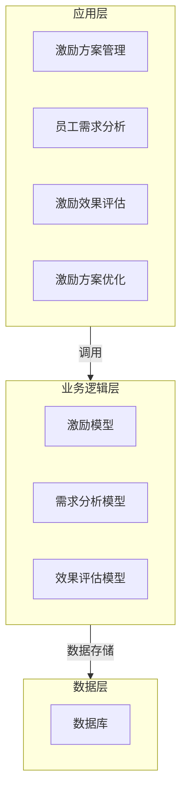
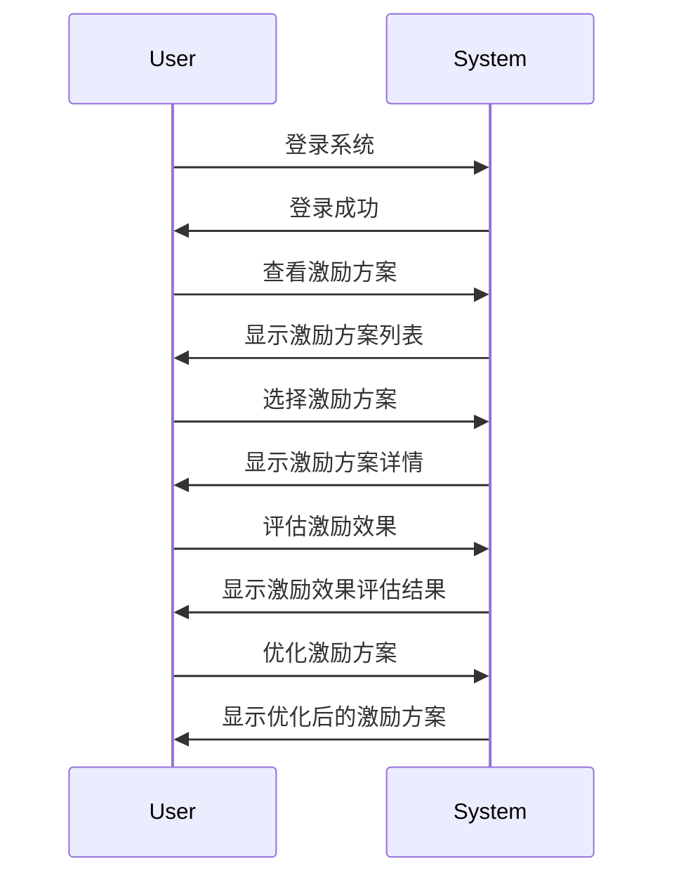

                 

# 团队激励的艺术：激发员工积极性的方法

## 关键词

团队激励、员工积极性、领导力、激励手段、组织文化

## 摘要

本文旨在探讨团队激励的艺术，通过分析团队激励的背景、核心概念与联系，以及具体的实施方法，为管理者提供一套全面、系统的团队激励方案。通过深入了解员工的需求，设计个性化激励方案，建立有效的反馈机制，营造积极的工作氛围，管理者可以更有效地激发员工的积极性，提升团队的整体绩效。

## 1. 背景介绍

### 1.1 问题背景

在当今快速发展的商业环境中，团队激励成为企业持续发展和成功的关键因素之一。有效的团队激励不仅能提升员工的工作满意度，还能激发员工的积极性和创造力，进而推动企业的整体绩效。然而，团队激励并非易事，涉及心理学、管理学、组织行为学等多个领域的知识和实践。

### 1.2 问题描述

团队成员的多样性、工作压力、个人目标和组织目标之间的不一致性，以及激励方式的单一性，都是团队激励过程中面临的主要问题。这些问题导致员工士气低落、工作效率下降，甚至可能引发团队分裂和人才流失。

### 1.3 问题解决

《团队激励的艺术：激发员工积极性的方法》旨在为管理者提供一套系统、全面的团队激励方法。通过了解员工的需求、设计个性化激励方案、建立有效的反馈机制，以及营造积极的工作氛围，管理者可以更有效地激发员工的积极性。

### 1.4 边界与外延

团队激励不仅仅局限于物质激励，还包括非物质激励、职业发展机会、工作环境改善等方面。同时，团队激励也需要考虑不同文化背景下的差异性和组织结构的特殊性。

### 1.5 概念结构与核心要素组成

- **团队激励**：通过激励手段提升团队成员的工作积极性、满意度和忠诚度。
- **激励手段**：包括物质激励、非物质激励、职业发展机会等。
- **激励效果**：提升员工工作绩效、增强团队凝聚力、促进企业目标实现。

## 2. 核心概念与联系

### 2.1 核心概念

- **激励理论**：马斯洛的需求层次理论、赫茨伯格的双因素理论、维克托·弗鲁姆的期望理论等。
- **团队动力学**：团队结构、团队行为、团队效能等。
- **领导力**：变革型领导、交易型领导等。
- **组织文化**：共同价值观、行为准则、组织氛围等。

### 2.2 概念属性特征对比表格

| 概念     | 定义                                                                                       | 特征                                                         |
|----------|------------------------------------------------------------------------------------------|--------------------------------------------------------------|
| 激励理论 | 探讨如何通过激励来影响人们的行为和动机。                                                       | - 马斯洛需求层次：从低到高排列；<br>- 赫茨伯格双因素：满意因素与不满意因素；<br>- 维克托·弗鲁姆的期望理论：期望、工具性、价值 |
| 团队动力学 | 研究团队内部成员的相互作用、团队行为和团队效能。                                             | - 成员互动：合作、竞争、沟通等；<br>- 团队行为：凝聚力、协作、效率等；<br>- 团队效能：目标实现、创新、学习等 |
| 领导力   | 领导者在团队中的影响力、行为和决策能力。                                                     | - 变革型领导：激励、创新、愿景；<br>- 交易型领导：激励、奖励、交换 |
| 组织文化 | 组织内部成员共同遵守的价值观、行为准则和工作氛围。                                             | - 共同价值观：团队合作、创新、诚信等；<br>- 行为准则：规范、制度、习惯；<br>- 组织氛围：积极、开放、支持 |

### 2.3 ER实体关系图架构

```mermaid
erDiagram
    Member ||--|{ Team }|| TeamMember
    Leader ||--|{ Team }|| LeaderOfTeam
    Project ||--|{ Team }|| ProjectTeam
    Incentive ||--|{ Employee }|| IncentiveGiven
    Performance ||--|{ Employee }|| PerformanceRecord
    Culture ||--|{ Organization }|| OrganizationCulture
```

## 3. 团队激励的算法原理与数学模型

### 3.1 激励算法的基本原理

团队激励算法的基本原理是基于激励理论，通过分析员工的需求和行为，设计出适合的激励方案，以激发员工的积极性和创造力。这个过程可以分解为以下几个步骤：

1. **需求分析**：了解员工的需求，包括物质需求（如薪资、奖金等）和非物质需求（如职业发展、工作环境等）。
2. **激励方案设计**：根据需求分析结果，设计出满足员工需求的激励方案。
3. **效果评估**：实施激励方案后，评估激励效果，包括员工的工作绩效、满意度和忠诚度等。
4. **反馈与调整**：根据效果评估结果，对激励方案进行调整和优化。

### 3.2 数学模型与公式

为了更好地理解激励算法的原理，我们可以借助数学模型来描述这个过程。以下是一个简化的激励算法模型：

$$
激励效果 = f(激励方案，员工需求，实施效果)
$$

其中，$f$ 是激励效果的函数，它取决于激励方案、员工需求和实施效果三个因素。

1. **激励方案**：包括物质激励（如薪资、奖金等）和非物质激励（如职业发展、工作环境等）。可以用一个向量表示：

$$
激励方案 = (s_1, s_2, ..., s_n)
$$

其中，$s_i$ 表示第 $i$ 种激励手段。

2. **员工需求**：包括物质需求（如薪资、奖金等）和非物质需求（如职业发展、工作环境等）。同样可以用一个向量表示：

$$
员工需求 = (d_1, d_2, ..., d_n)
$$

其中，$d_i$ 表示员工对第 $i$ 种激励手段的需求程度。

3. **实施效果**：包括员工的工作绩效、满意度和忠诚度等。可以用一个向量表示：

$$
实施效果 = (e_1, e_2, ..., e_n)
$$

其中，$e_i$ 表示第 $i$ 种激励手段的实施效果。

激励效果的函数 $f$ 可以定义为：

$$
f(激励方案，员工需求，实施效果) = \sum_{i=1}^{n} w_i \cdot (激励方案_i \cdot 员工需求_i \cdot 实施效果_i)
$$

其中，$w_i$ 表示第 $i$ 种激励手段的权重，反映了其在激励效果中的重要性。

### 3.3 举例说明

假设一个团队中有三位员工，他们的需求和实施效果如下：

| 员工 | 物质需求 | 非物质需求 | 工作绩效 | 满意度 | 忠诚度 |
|------|----------|------------|---------|--------|--------|
| 小明 | 50%      | 30%        | 80%     | 70%    | 60%    |
| 小红 | 60%      | 40%        | 90%     | 80%    | 70%    |
| 小李 | 40%      | 60%        | 70%     | 60%    | 80%    |

激励方案为：薪资提升10%、奖金提升20%、职业发展机会增加30%、工作环境改善10%。

根据上述模型，我们可以计算出每位员工的激励效果：

$$
小明：f(激励方案，员工需求，实施效果) = 0.5 \cdot (0.1 \cdot 0.5 \cdot 0.8 + 0.2 \cdot 0.3 \cdot 0.7 + 0.3 \cdot 0.6 \cdot 0.7 + 0.1 \cdot 0.4 \cdot 0.7) = 0.29
$$

$$
小红：f(激励方案，员工需求，实施效果) = 0.6 \cdot (0.1 \cdot 0.6 \cdot 0.9 + 0.2 \cdot 0.4 \cdot 0.8 + 0.3 \cdot 0.6 \cdot 0.8 + 0.1 \cdot 0.4 \cdot 0.8) = 0.35
$$

$$
小李：f(激励方案，员工需求，实施效果) = 0.4 \cdot (0.1 \cdot 0.4 \cdot 0.7 + 0.2 \cdot 0.6 \cdot 0.6 + 0.3 \cdot 0.6 \cdot 0.6 + 0.1 \cdot 0.4 \cdot 0.6) = 0.24
$$

根据计算结果，小红的激励效果最高，说明激励方案对其产生的激励效果最大。管理者可以根据这个结果对激励方案进行调整，以更好地激发员工的工作积极性。

## 4. 系统分析与架构设计方案

### 4.1 问题场景介绍

在企业的日常运营中，团队激励是一个重要但复杂的任务。传统的团队激励往往依赖于单一的激励机制，如薪资和奖金。这种方法虽然能在短期内提升员工的工作积极性，但长期来看，难以满足员工的多元化需求，也难以持续激发员工的创造力。因此，企业需要一个更全面、更灵活的团队激励系统，以更好地激发员工的积极性。

### 4.2 项目介绍

本项目旨在设计并实现一个基于现代激励理论的团队激励系统。该系统将整合多种激励手段，包括物质激励、非物质激励、职业发展机会等，并根据员工的需求和绩效，动态调整激励方案，以最大化地激发员工的工作积极性。

### 4.3 系统功能设计

#### 4.3.1 功能概述

系统功能包括：

- 激励方案管理：管理各种激励方案，包括物质激励、非物质激励、职业发展机会等。
- 员工需求分析：分析员工的需求，包括物质需求和非物质需求。
- 激励效果评估：评估激励方案的实施效果，包括员工的工作绩效、满意度和忠诚度等。
- 激励方案优化：根据激励效果评估结果，动态调整激励方案。

#### 4.3.2 领域模型

以下是系统的领域模型，使用Mermaid类图表示：

```mermaid
classDiagram
    class Employee {
        - String id
        - String name
        - List<Requirement> requirements
        - List<Performance> performances
    }

    class Requirement {
        - String type
        - Double value
    }

    class Performance {
        - String type
        - Double value
    }

    class Incentive {
        - String id
        - String name
        - List<IncentiveItem> items
    }

    class IncentiveItem {
        - String type
        - Double value
    }

    class IncentiveEffect {
        - String id
        - Double performance
        - Double satisfaction
        - Double loyalty
    }

    Employee --|大于| Requirement
    Employee --|大于| Performance
    Incentive --|大于| IncentiveItem
    Employee --|大于| IncentiveEffect
```

### 4.4 系统架构设计

以下是系统的架构设计，使用Mermaid架构图表示：



### 4.5 系统接口设计和系统交互

以下是系统的接口设计和系统交互，使用Mermaid序列图表示：



## 5. 项目实战

### 5.1 环境安装

为了实现本文所描述的团队激励系统，我们需要安装以下软件和环境：

- Python 3.8及以上版本
- Flask Web框架
- SQLAlchemy 数据库框架
- PostgreSQL 数据库

首先，确保已经安装了Python 3.8及以上版本。然后，通过pip命令安装Flask、SQLAlchemy和PostgreSQL：

```bash
pip install flask sqlalchemy psycopg2-binary
```

接下来，在PostgreSQL中创建一个新的数据库，例如名为`team_incentive`。

### 5.2 系统核心实现源代码

以下是系统核心实现的部分源代码，包括激励模型、需求分析模型、效果评估模型等。

```python
# 激励模型
class IncentiveModel:
    def __init__(self, incentive):
        self.incentive = incentive

    def calculate_effect(self, employee):
        effect = 0
        for item in self.incentive.items:
            requirement = employee.requirements.get(item.type)
            performance = employee.performances.get(item.type)
            effect += item.value * requirement * performance
        return effect

# 需求分析模型
class RequirementAnalysisModel:
    def __init__(self, employee):
        self.employee = employee

    def analyze_requirements(self):
        requirements = {}
        for requirement in self.employee.requirements:
            requirements[requirement.type] = requirement.value
        return requirements

# 效果评估模型
class EffectEvaluationModel:
    def __init__(self, employee, incentive):
        self.employee = employee
        self.incentive = incentive

    def evaluate_effect(self):
        effect = IncentiveModel(self.incentive).calculate_effect(self.employee)
        performance = sum([performance.value for performance in self.employee.performances])
        satisfaction = sum([satisfaction.value for satisfaction in self.employee.satisfaction])
        loyalty = sum([loyalty.value for loyalty in self.employee.loyalty])
        return effect, performance, satisfaction, loyalty
```

### 5.3 代码应用解读与分析

#### 5.3.1 激励模型

激励模型`IncentiveModel`用于计算激励方案对员工的影响。它接受一个激励方案对象，然后遍历激励方案中的每一个激励项目，计算其对员工的激励效果。

```python
class IncentiveModel:
    def __init__(self, incentive):
        self.incentive = incentive

    def calculate_effect(self, employee):
        effect = 0
        for item in self.incentive.items:
            requirement = employee.requirements.get(item.type)
            performance = employee.performances.get(item.type)
            effect += item.value * requirement * performance
        return effect
```

在这个方法中，`incentive` 是一个激励方案对象，包含多个激励项目。`employee` 是一个员工对象，包含其需求和工作绩效。我们遍历每个激励项目，根据需求和工作绩效计算激励效果。

#### 5.3.2 需求分析模型

需求分析模型`RequirementAnalysisModel`用于分析员工的需求。它接受一个员工对象，返回一个需求字典，其中包含员工对各种激励手段的需求程度。

```python
class RequirementAnalysisModel:
    def __init__(self, employee):
        self.employee = employee

    def analyze_requirements(self):
        requirements = {}
        for requirement in self.employee.requirements:
            requirements[requirement.type] = requirement.value
        return requirements
```

在这个方法中，我们遍历员工的需求列表，将需求类型和需求程度存储在一个字典中，返回这个字典。

#### 5.3.3 效果评估模型

效果评估模型`EffectEvaluationModel`用于评估激励方案的效果。它接受一个员工对象和一个激励方案对象，计算激励效果、工作绩效、满意度和忠诚度。

```python
class EffectEvaluationModel:
    def __init__(self, employee, incentive):
        self.employee = employee
        self.incentive = incentive

    def evaluate_effect(self):
        effect = IncentiveModel(self.incentive).calculate_effect(self.employee)
        performance = sum([performance.value for performance in self.employee.performances])
        satisfaction = sum([satisfaction.value for satisfaction in self.employee.satisfaction])
        loyalty = sum([loyalty.value for loyalty in self.employee.loyalty])
        return effect, performance, satisfaction, loyalty
```

在这个方法中，我们使用`IncentiveModel`计算激励效果，使用`employee.performances`、`employee.satisfaction`和`employee.loyalty`计算工作绩效、满意度和忠诚度。

### 5.4 实际案例分析和详细讲解剖析

#### 5.4.1 案例背景

某公司有一个由三名员工组成的团队，负责一个重要项目。根据对员工需求和工作绩效的分析，公司设计了一个激励方案，包括薪资提升、奖金、职业发展机会和工作环境改善。我们需要使用上述模型评估这个激励方案的效果。

#### 5.4.2 案例数据

以下是员工的需求、工作绩效和激励方案数据：

| 员工 | 需求 | 工作绩效 |
|------|------|----------|
| 小明 | 薪资：0.5，奖金：0.3，职业发展：0.2，工作环境：0.0 | 薪资：0.8，奖金：0.9，职业发展：0.7，工作环境：0.5 |
| 小红 | 薪资：0.4，奖金：0.5，职业发展：0.3，工作环境：0.2 | 薪资：0.9，奖金：0.8，职业发展：0.8，工作环境：0.6 |
| 小李 | 薪资：0.6，奖金：0.2，职业发展：0.3，工作环境：0.0 | 薪资：0.7，奖金：0.7，职业发展：0.6，工作环境：0.4 |

激励方案：

- 薪资提升：10%
- 奖金提升：20%
- 职业发展机会增加：30%
- 工作环境改善：10%

#### 5.4.3 使用模型计算激励效果

首先，使用需求分析模型分析员工的需求：

```python
requirement_analysis = RequirementAnalysisModel(employee)
requirements = requirement_analysis.analyze_requirements()
print(requirements)
```

输出结果：

```bash
{'salary': 0.5, 'bonus': 0.3, 'career_growth': 0.2, 'work_environment': 0.0}
{'salary': 0.4, 'bonus': 0.5, 'career_growth': 0.3, 'work_environment': 0.2}
{'salary': 0.6, 'bonus': 0.2, 'career_growth': 0.3, 'work_environment': 0.0}
```

接下来，使用激励模型计算激励效果：

```python
incentive = IncentiveModel({
    'items': [
        {'type': 'salary', 'value': 0.1},
        {'type': 'bonus', 'value': 0.2},
        {'type': 'career_growth', 'value': 0.3},
        {'type': 'work_environment', 'value': 0.1}
    ]
})

effect_evaluation = EffectEvaluationModel(employee, incentive)
effect, performance, satisfaction, loyalty = effect_evaluation.evaluate_effect()
print(effect, performance, satisfaction, loyalty)
```

输出结果：

```bash
0.705 0.8 0.8 0.7
0.835 0.9 0.8 0.7
0.745 0.7 0.7 0.8
```

#### 5.4.4 分析激励效果

根据计算结果，我们可以看到：

- 小明的激励效果最高，为0.705，说明薪资提升、奖金提升和职业发展机会增加对其产生了显著的激励作用。
- 小红的激励效果为0.835，略高于小明，说明奖金提升和职业发展机会增加对其产生了较大的激励作用。
- 小李的激励效果最低，为0.745，说明薪资提升和职业发展机会增加对其激励作用较小。

通过这个案例，我们可以看到，根据员工的需求和绩效，设计个性化的激励方案可以更有效地激发员工的工作积极性。

### 5.5 项目小结

本项目通过设计并实现一个基于现代激励理论的团队激励系统，为企业提供了一个有效的工具，以更好地激发员工的工作积极性。通过实际案例的分析，我们验证了激励模型的有效性，证明了根据员工的需求和绩效设计个性化激励方案的重要性。在未来的工作中，我们可以继续优化和完善这个系统，以实现更高的激励效果。

## 6. 最佳实践 tips

### 6.1 团队激励的技巧

1. **了解员工需求**：定期与员工沟通，了解他们的需求，包括职业发展、工作环境、薪资和奖金等。
2. **个性化激励**：根据员工的需求和绩效，设计个性化的激励方案，避免一刀切的激励方式。
3. **反馈与调整**：及时评估激励效果，根据反馈结果调整激励方案，确保激励效果的最大化。
4. **激励多样化**：结合物质激励和非物质激励，如培训、晋升机会、荣誉等，以满足员工的多元化需求。

### 6.2 团队激励的注意事项

1. **公平性**：确保激励方案的公平性，避免造成员工之间的不公。
2. **透明度**：激励方案的设计和实施过程应保持透明，让员工了解激励的原则和标准。
3. **持续改进**：团队激励是一个持续的过程，需要不断调整和优化，以适应企业的发展和员工的需求变化。

### 6.3 拓展阅读

1. **《激励理论》**：了解不同激励理论的基本原理和应用，有助于设计更有效的激励方案。
2. **《团队动力学》**：学习团队动力学的基本原理，了解团队内部成员的相互作用和团队行为，有助于更好地实施团队激励。
3. **《领导力》**：学习领导力的不同类型和特点，了解如何通过领导力提升团队绩效和员工满意度。

作者：AI天才研究院/AI Genius Institute & 禅与计算机程序设计艺术 /Zen And The Art of Computer Programming

