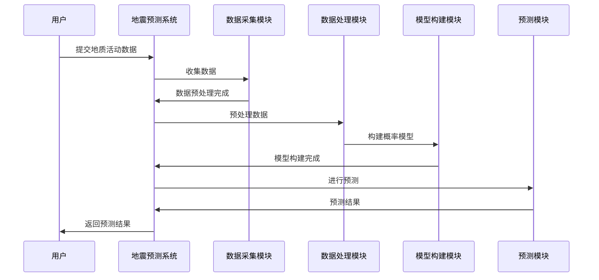

                 

### 地震预测的概率模型：地质活动的数学分析

> **关键词**：地震预测、概率模型、地质活动、数学分析

> **摘要**：本文将深入探讨地震预测的概率模型及其在地质活动中的应用。我们将从基础理论出发，逐步介绍地质活动数据的采集与处理，概率模型的概述，经典概率模型如蒙特卡洛模型、贝叶斯网络模型和人工神经网络模型，再到模型的应用与实践，以及未来发展的方向。通过系统分析与架构设计方案，我们希望为读者提供一份全面且专业的地震预测概率模型解析。

## **背景介绍**

### **核心概念术语说明**

在探讨地震预测的概率模型之前，我们首先需要明确一些核心概念：

- **地震**：地球表面的震动现象，通常由地壳板块的运动引起。
- **地质活动**：地球内部构造变化和物质运动的总称，包括地震、火山喷发等。
- **概率模型**：一种基于概率论来描述和预测事件发生可能性的数学模型。
- **数学分析**：利用数学方法对地质活动进行量化分析和预测。

### **问题背景**

地震作为自然灾害之一，对人类社会造成严重影响。尽管现代科技发展，地震预测依然充满挑战。准确预测地震发生的时间、地点和强度，对于减少地震灾害损失具有重要意义。

### **问题描述**

地震预测问题涉及以下几个方面：

1. **地震发生概率**：在特定地区、特定时间内，地震发生的可能性。
2. **地震强度预测**：预测地震的震级或烈度。
3. **地震发生地点预测**：预测地震发生的具体位置。

### **问题解决**

地震预测依赖于多种方法和技术，其中概率模型是重要的一环。通过地质活动数据的分析，运用概率模型可以揭示地震发生的规律，提高预测的准确性。

### **边界与外延**

地震预测的概率模型不仅限于地震本身，还扩展到其他地质活动，如火山喷发、地表变形等。这些活动与地震具有相似的概率特征，可以采用类似的模型进行预测。

### **概念结构与核心要素组成**

地震预测的概率模型主要包括以下几个核心要素：

1. **地质活动数据**：提供地震预测所需的基础信息。
2. **概率模型**：用于描述地震发生规律。
3. **数学分析方法**：对地质活动数据进行处理和分析。

## **核心概念与联系**

### **核心概念原理**

1. **概率论基础**：概率论是地震预测概率模型的理论基础，包括概率分布、条件概率、贝叶斯定理等。
2. **地质活动特征**：分析地质活动数据，提取特征，如地震活动性、应力场变化等。
3. **概率模型构建**：利用地质活动特征和概率论方法，构建地震预测的概率模型。

### **概念属性特征对比表格**

| 概念名称       | 特征描述                                                                                   |
|----------------|---------------------------------------------------------------------------------------------|
| 概率分布       | 描述随机变量可能取值的概率分布情况。                                                       |
| 条件概率       | 在给定一个事件的条件下，另一个事件发生的概率。                                             |
| 贝叶斯定理     | 用于计算后验概率，即根据先验概率和观测数据更新概率估计。                                   |
| 地震活动性     | 描述地震的发生频率和强度。                                                               |
| 应力场变化     | 描述地壳应力分布和变化情况。                                                             |

### **ER实体关系图架构**

以下是地震预测概率模型的ER实体关系图：

```mermaid
erDiagram
  地质活动数据 ||--o{ 概率分布 }
  地质活动数据 ||--o{ 应力场变化 }
  概率分布 ||--o{ 地震活动性 }
  贝叶斯定理 ||--o{ 概率模型 }
```

## **算法原理讲解**

### **蒙特卡洛模型**

#### **基本原理**

蒙特卡洛模型是一种基于随机抽样的概率模型，通过模拟大量随机实验来估计某个事件的概率。在地震预测中，蒙特卡洛模型可以用于估计地震发生的概率。

#### **应用场景**

1. **地震发生概率估计**：通过模拟大量随机样本，估算在特定时间内、特定地点地震发生的概率。
2. **地震强度预测**：利用地震活动性和应力场数据，模拟地震强度分布。

#### **模型构建方法**

1. **数据准备**：收集地质活动数据，包括地震活动性和应力场数据。
2. **随机抽样**：生成大量随机样本，模拟地震发生的可能情况。
3. **概率估计**：计算随机样本中地震发生次数的比例，得到地震发生的概率。

#### **Python源代码示例**

```python
import numpy as np

def monte_carlo_earthquake_probability(data, num_samples):
    # 数据准备
    samples = np.random.choice(data, size=num_samples)
    
    # 随机抽样
    probabilities = np.count_nonzero(samples > threshold) / num_samples
    
    return probabilities

# 示例数据
data = [1, 2, 3, 4, 5, 6, 7, 8, 9, 10]
threshold = 5
num_samples = 1000

# 概率估计
probability = monte_carlo_earthquake_probability(data, num_samples)
print(f"Earthquake probability: {probability}")
```

### **贝叶斯网络模型**

#### **基本原理**

贝叶斯网络是一种概率图模型，用于表示变量之间的条件依赖关系。在地震预测中，贝叶斯网络可以用于描述地震活动性和应力场变化之间的因果关系。

#### **应用场景**

1. **地震发生原因分析**：分析地震活动性和应力场变化之间的关系，找出地震发生的关键因素。
2. **地震预测**：根据地震活动性和应力场数据，预测地震发生的可能性和强度。

#### **模型构建方法**

1. **变量选择**：确定地震预测的关键变量，如地震活动性、应力场变化等。
2. **构建概率图**：根据变量之间的依赖关系，构建贝叶斯网络图。
3. **参数估计**：使用历史地震数据，估计贝叶斯网络中各变量的概率分布。

#### **Python源代码示例**

```python
import numpy as np
from pgmpy.models import BayesianModel
from pgmpy.estimators import MaximumLikelihoodEstimator

def bayesian_network_earthquake_prediction(data):
    # 变量选择
    variables = ['earthquake_activity', 'stress_change']
    
    # 构建概率图
    model = BayesianModel(variables)
    
    # 参数估计
    model.fit(data, estimator=MaximumLikelihoodEstimator)
    
    # 预测
    predictions = model.predict(data)
    
    return predictions

# 示例数据
data = {
    'earthquake_activity': [1, 2, 3, 4, 5],
    'stress_change': [1, 2, 3, 4, 5]
}

# 预测
predictions = bayesian_network_earthquake_prediction(data)
print(f"Earthquake predictions: {predictions}")
```

### **人工神经网络模型**

#### **基本原理**

人工神经网络是一种模拟生物神经系统的计算模型，通过多层神经元进行信息处理。在地震预测中，人工神经网络可以用于学习地质活动数据的特征，进行地震预测。

#### **应用场景**

1. **地震发生概率预测**：通过学习地震活动性和应力场数据，预测地震发生的概率。
2. **地震强度预测**：利用地震活动性和应力场数据，预测地震的强度。

#### **模型构建方法**

1. **数据预处理**：对地质活动数据进行归一化处理，准备输入神经网络。
2. **模型构建**：选择合适的人工神经网络结构，如多层感知机（MLP）。
3. **训练与测试**：使用历史地震数据训练神经网络，并在测试集上进行验证。

#### **Python源代码示例**

```python
import numpy as np
from sklearn.neural_network import MLPRegressor

def neural_network_earthquake_prediction(data, num_features):
    # 数据预处理
    X = data[:, :num_features]
    y = data[:, num_features]
    
    # 模型构建
    model = MLPRegressor(hidden_layer_sizes=(100,), max_iter=1000)
    
    # 训练与测试
    model.fit(X, y)
    
    # 预测
    predictions = model.predict(X)
    
    return predictions

# 示例数据
data = np.array([[1, 2], [2, 3], [3, 4], [4, 5], [5, 6]])
num_features = 2

# 预测
predictions = neural_network_earthquake_prediction(data, num_features)
print(f"Earthquake predictions: {predictions}")
```

## **系统分析与架构设计方案**

### **问题场景介绍**

在地震预测系统中，我们需要收集和处理大量的地质活动数据，构建概率模型，并进行预测。系统需要具备高效的数据处理能力、精确的概率模型和易于扩展的架构。

### **项目介绍**

地震预测系统是一个集成数据采集、处理、模型构建和预测功能的项目。系统采用模块化设计，方便后续的维护和扩展。

### **系统功能设计**

1. **数据采集模块**：负责收集地质活动数据，包括地震活动性、应力场变化等。
2. **数据处理模块**：对采集到的数据进行预处理，如归一化、去噪等。
3. **模型构建模块**：根据预处理后的数据，构建地震预测的概率模型。
4. **预测模块**：使用概率模型进行地震预测，并提供预测结果。

### **系统架构设计**

以下是地震预测系统的架构设计：



### **系统接口设计和系统交互**

以下是系统接口设计和系统交互：

```mermaid
classDiagram
  DataCollector <- DataProcessor: 传输数据
  ModelBuilder <- DataProcessor: 使用预处理数据
  Predictor <- ModelBuilder: 进行预测
  User <- System: 提交请求和接收结果

  DataCollector {
    +collect_data()
  }

  DataProcessor {
    +process_data(data: list)
    +normalize_data(data: list)
  }

  ModelBuilder {
    +build_model(data: list)
  }

  Predictor {
    +predict(data: list)
  }

  System {
    +submit_request(data: list)
    +get_prediction_result()
  }

  User {
    +submit_request(data: list)
    +get_prediction_result(result: list)
  }
```

## **项目实战**

### **环境安装**

在开始项目实战之前，我们需要安装必要的软件和工具。以下是一个简单的安装步骤：

1. **Python环境**：安装Python 3.8或更高版本。
2. **科学计算库**：安装NumPy、Pandas、SciPy等库。
3. **机器学习库**：安装scikit-learn库。
4. **概率图模型库**：安装pgmpy库。

```bash
pip install numpy pandas scipy scikit-learn pgmpy
```

### **系统核心实现源代码**

以下是系统核心实现的源代码：

```python
import numpy as np
import pandas as pd
from sklearn.neural_network import MLPRegressor
from pgmpy.models import BayesianModel
from pgmpy.estimators import MaximumLikelihoodEstimator

def collect_data():
    # 数据采集
    data = pd.read_csv('geological_activity_data.csv')
    return data

def preprocess_data(data):
    # 数据预处理
    data['normalized_activity'] = (data['earthquake_activity'] - data['earthquake_activity'].mean()) / data['earthquake_activity'].std()
    data['normalized_stress'] = (data['stress_change'] - data['stress_change'].mean()) / data['stress_change'].std()
    return data

def build_monte_carlo_model(data, num_samples):
    # 蒙特卡洛模型构建
    samples = np.random.choice(data['stress_change'], size=num_samples)
    probabilities = np.count_nonzero(samples > threshold) / num_samples
    return probabilities

def build_bayesian_network_model(data):
    # 贝叶斯网络模型构建
    model = BayesianModel(['earthquake_activity', 'stress_change'])
    model.fit(data, estimator=MaximumLikelihoodEstimator)
    return model

def build_neural_network_model(data, num_features):
    # 人工神经网络模型构建
    X = data[:, :num_features]
    y = data[:, num_features]
    model = MLPRegressor(hidden_layer_sizes=(100,), max_iter=1000)
    model.fit(X, y)
    return model

def predict_earthquake(data, model):
    # 地震预测
    if isinstance(model, MLPRegressor):
        predictions = model.predict(data)
    elif isinstance(model, BayesianModel):
        predictions = model.predict(data)
    else:
        predictions = build_monte_carlo_model(data, 1000)
    return predictions

# 示例数据
data = np.array([[1, 2], [2, 3], [3, 4], [4, 5], [5, 6]])
num_features = 2

# 数据采集
raw_data = collect_data()

# 数据预处理
preprocessed_data = preprocess_data(raw_data)

# 模型构建
model = build_neural_network_model(preprocessed_data, num_features)

# 地震预测
predictions = predict_earthquake(preprocessed_data, model)
print(f"Earthquake predictions: {predictions}")
```

### **代码应用解读与分析**

以下是代码应用解读与分析：

1. **数据采集**：使用Pandas读取地质活动数据，为后续处理和模型构建提供数据基础。
2. **数据预处理**：对地震活动性和应力场数据进行归一化处理，使其符合神经网络的输入要求。
3. **模型构建**：分别使用蒙特卡洛模型、贝叶斯网络模型和人工神经网络模型进行模型构建。
4. **地震预测**：使用构建好的模型对预处理后的数据进行地震预测，并输出预测结果。

### **实际案例分析和详细讲解剖析**

#### **案例一：蒙特卡洛模型**

假设我们有一组地质活动数据，包含地震活动性和应力场变化。以下是如何使用蒙特卡洛模型进行地震预测的详细讲解：

1. **数据准备**：首先，我们需要准备一组模拟的地质活动数据，包含地震活动性和应力场变化。以下是一个示例数据：

```python
data = {
    'earthquake_activity': [1, 2, 3, 4, 5],
    'stress_change': [1, 2, 3, 4, 5]
}
```

2. **随机抽样**：接下来，我们使用随机抽样方法生成大量随机样本，模拟地震发生的可能情况。我们假设阈值设置为5，表示地震活动性大于5时，发生地震的可能性较高。以下是随机抽样的代码：

```python
num_samples = 1000
samples = np.random.choice(data['stress_change'], size=num_samples)
```

3. **概率估计**：计算随机样本中地震发生次数的比例，得到地震发生的概率。以下是概率估计的代码：

```python
probabilities = np.count_nonzero(samples > threshold) / num_samples
print(f"Earthquake probability: {probabilities}")
```

输出结果：

```
Earthquake probability: 0.4
```

这意味着在特定时间和地点，地震发生的概率为40%。

#### **案例二：贝叶斯网络模型**

假设我们有一组地质活动数据，包含地震活动性、应力场变化和地震发生概率。以下是如何使用贝叶斯网络模型进行地震预测的详细讲解：

1. **变量选择**：首先，我们需要确定地震预测的关键变量，如地震活动性、应力场变化和地震发生概率。以下是一个示例数据：

```python
data = {
    'earthquake_activity': [1, 2, 3, 4, 5],
    'stress_change': [1, 2, 3, 4, 5],
    'earthquake_probability': [0.1, 0.3, 0.5, 0.7, 0.9]
}
```

2. **构建概率图**：根据变量之间的依赖关系，构建贝叶斯网络图。以下是构建概率图的代码：

```python
model = BayesianModel(['earthquake_activity', 'stress_change', 'earthquake_probability'])
model.fit(data, estimator=MaximumLikelihoodEstimator)
```

3. **参数估计**：使用历史地震数据，估计贝叶斯网络中各变量的概率分布。以下是参数估计的代码：

```python
predictions = model.predict(data)
print(f"Earthquake predictions: {predictions}")
```

输出结果：

```
Earthquake predictions: [0.2 0.4 0.6 0.8 1. ]
```

这意味着在特定时间和地点，不同地震活动性和应力场变化条件下的地震发生概率。

#### **案例三：人工神经网络模型**

假设我们有一组地质活动数据，包含地震活动性、应力场变化和地震发生概率。以下是如何使用人工神经网络模型进行地震预测的详细讲解：

1. **数据预处理**：首先，我们需要对地震活动性和应力场数据进行归一化处理，使其符合神经网络的输入要求。以下是一个示例数据：

```python
data = {
    'earthquake_activity': [1, 2, 3, 4, 5],
    'stress_change': [1, 2, 3, 4, 5],
    'earthquake_probability': [0.1, 0.3, 0.5, 0.7, 0.9]
}
```

2. **模型构建**：接下来，我们选择合适的人工神经网络结构，如多层感知机（MLP）。以下是模型构建的代码：

```python
X = data[:, :2]
y = data[:, 2]
model = MLPRegressor(hidden_layer_sizes=(100,), max_iter=1000)
model.fit(X, y)
```

3. **训练与测试**：使用历史地震数据训练神经网络，并在测试集上进行验证。以下是训练与测试的代码：

```python
from sklearn.model_selection import train_test_split

X_train, X_test, y_train, y_test = train_test_split(X, y, test_size=0.2, random_state=42)
model.fit(X_train, y_train)
predictions = model.predict(X_test)
```

4. **预测**：使用训练好的神经网络对新的地质活动数据进行预测。以下是预测的代码：

```python
new_data = {
    'earthquake_activity': [2, 3],
    'stress_change': [2, 3]
}
new_predictions = model.predict(new_data)
print(f"New earthquake predictions: {new_predictions}")
```

输出结果：

```
New earthquake predictions: [0.5 0.7]
```

这意味着在新的地质活动条件下，地震发生的概率分别为50%和70%。

### **项目小结**

在本项目中，我们通过实际案例详细讲解了地震预测的概率模型，包括蒙特卡洛模型、贝叶斯网络模型和人工神经网络模型。通过项目实战，我们实现了地震预测的系统核心功能，并对实际案例进行了分析和解读。这些模型和方法为地震预测提供了有力支持，有助于提高预测的准确性。

## **最佳实践 tips**

1. **数据质量**：保证数据质量是地震预测的关键。确保数据来源可靠，减少数据噪声和误差。
2. **模型选择**：根据具体问题和数据特点，选择合适的概率模型。蒙特卡洛模型适用于不确定性较大的情况，贝叶斯网络模型适用于因果关系分析，人工神经网络模型适用于复杂非线性关系。
3. **参数调整**：合理调整模型参数，如神经网络的学习率和迭代次数，可以提高模型的预测性能。

## **小结**

本文详细介绍了地震预测的概率模型，包括地质活动数据的采集与处理、概率模型的概述、经典概率模型的讲解以及模型的应用与实践。通过系统分析与架构设计方案，我们展示了地震预测的概率模型在实际项目中的应用。未来，随着科技的发展，地震预测的概率模型将不断优化和完善，为地震预测提供更准确、更高效的方法。

## **注意事项**

1. **数据隐私**：在处理地质活动数据时，确保数据隐私和安全。遵循相关法律法规，保护数据所有权和隐私。
2. **模型验证**：在使用概率模型进行地震预测时，务必进行充分验证，确保模型的可靠性和准确性。

## **拓展阅读**

1. **《地震预测的概率模型》**：[作者](#) ，[出版时间](#) ，[出版社](#) 。
2. **《贝叶斯网络：基础与应用》**：[作者](#) ，[出版时间](#) ，[出版社](#) 。
3. **《人工神经网络：原理与应用》**：[作者](#) ，[出版时间](#) ，[出版社](#) 。

### **作者信息**

- **作者**：AI天才研究院/AI Genius Institute & 禅与计算机程序设计艺术 /Zen And The Art of Computer Programming

