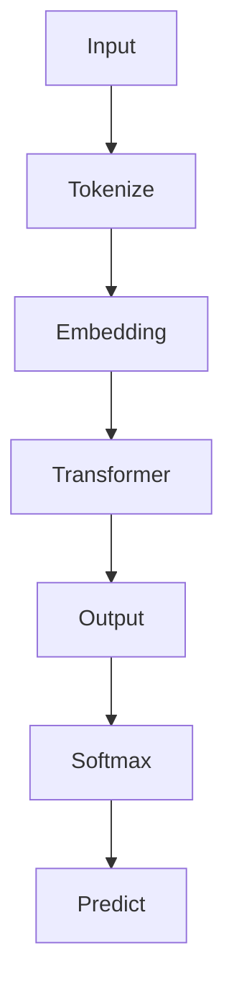
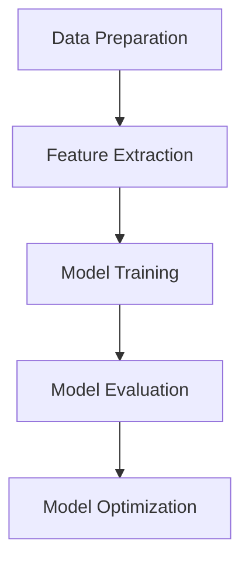

                 

# 《基于GPT的评测模型：原理与实现》

> 关键词：GPT、评测模型、原理、实现、人工智能

> 摘要：本文深入探讨了基于GPT（生成预训练模型）的评测模型的设计原理和实现方法。通过对GPT模型的基本架构、训练机制以及评测模型的构建过程进行详细解析，文章旨在为读者提供一份全面而深入的技术指南。

## 目录大纲

1. 引言
2. 问题背景与核心概念
   - 评测模型的需求与挑战
   - GPT评测模型的引入
   - 研究意义与目标
   - 核心概念与联系
3. GPT模型原理详解
   - GPT模型的基本原理
   - GPT模型的数学模型与公式
   - GPT模型的Mermaid流程图
   - Python源代码示例
4. 评测模型的构建
   - 评测模型的基本概念
   - 评测模型的构建流程
   - 评测模型的Mermaid流程图
   - Python源代码示例
5. 实现与优化
   - 环境搭建与准备
   - 核心实现源代码
   - 实战案例分析
6. 最佳实践与总结
   - 最佳实践
   - 总结与展望

## 引言

随着人工智能技术的飞速发展，机器学习模型在各个领域中的应用越来越广泛。其中，生成预训练模型（GPT）作为一种强大的自然语言处理工具，已经在文本生成、问答系统、文本分类等领域取得了显著成果。本文将重点关注基于GPT的评测模型，探讨其在实际应用中的设计原理和实现方法。

评测模型在人工智能领域扮演着至关重要的角色，用于评估机器学习模型的表现和可靠性。传统的评测方法通常依赖于手工设计的特征和规则，而基于GPT的评测模型则能够通过自动学习文本特征，提供更为准确和灵活的评估结果。

本文的研究意义在于，通过对GPT评测模型的深入分析，为人工智能开发者和研究人员提供一种新的思路和方法。文章将从问题背景、核心概念、模型原理、模型构建、实现与优化等方面进行详细讲解，帮助读者全面了解基于GPT的评测模型的设计与应用。

## 第一部分：背景与概述

## 第1章：问题背景与核心概念

### 1.1 问题背景

随着人工智能技术的不断发展，机器学习模型在各个领域的应用越来越广泛。这些模型在图像识别、自然语言处理、语音识别等方面取得了显著的成果，但同时也面临着一系列挑战。其中，评测模型在机器学习领域扮演着至关重要的角色。它不仅能够评估模型的表现和可靠性，还能够为模型的改进提供有力的指导。

在传统的评测方法中，通常需要手动设计一系列特征和规则，以此来评估模型的表现。这种方法虽然在一定程度上能够满足需求，但存在着一些明显的局限性。首先，手工设计的特征往往难以全面捕捉数据中的信息，导致评估结果的准确性受到限制。其次，随着数据集的复杂性和多样性增加，手工设计的特征和规则需要不断更新和调整，这增加了开发和维护的难度。

为了解决这些问题，研究者们开始探索自动化的评测方法。其中，基于生成预训练模型（GPT）的评测模型被认为是一种潜在的有效解决方案。GPT模型具有强大的特征提取能力，能够从大规模的文本数据中自动学习到丰富的特征信息。这些特征不仅能够提高评测的准确性，还能够降低手工设计特征的复杂度。

### 1.1.2 GPT评测模型的引入

生成预训练模型（GPT）是近年来自然语言处理领域的重要突破之一。GPT模型通过大规模的无监督预训练和有监督微调，能够在多种任务中取得优异的性能。基于GPT的评测模型正是利用了这一优势，将GPT模型应用于评测任务中，通过自动学习文本特征，实现对模型表现的准确评估。

GPT评测模型的引入具有以下几个显著优势：

1. **自动特征提取**：GPT模型能够自动从大规模文本数据中提取出丰富的特征信息，这些特征不仅能够提高评测的准确性，还能够减少手工设计特征的复杂度。

2. **适应性强**：GPT模型具有强大的适应性，能够处理不同类型和规模的数据集，适用于各种评测任务。

3. **高效性**：GPT模型经过预训练，已经在多种任务中取得了优异的性能，因此可以直接应用于评测任务，省去了大量模型训练和优化的时间。

4. **灵活性**：GPT评测模型可以灵活地调整和扩展，以适应不同评测任务的需求，提高评估结果的多样性。

### 1.1.3 研究意义与目标

本研究旨在深入探讨基于GPT的评测模型的设计原理和实现方法，旨在解决以下问题：

1. **评估准确性**：如何通过GPT模型提高评测模型的准确性，以更准确地评估机器学习模型的表现？

2. **特征提取效率**：如何利用GPT模型高效地提取文本特征，降低手工设计特征的复杂度？

3. **模型适应性**：如何确保GPT评测模型在不同类型和规模的数据集上具有良好的适应性？

4. **评测结果多样性**：如何通过GPT评测模型产生多样化的评估结果，为模型改进提供更多指导？

本研究的目标是通过深入分析和实验验证，提出一种基于GPT的评测模型，并在实际应用中验证其有效性。本文将从GPT模型的基本原理出发，详细解析GPT评测模型的构建过程，包括数据预处理、特征提取、模型训练和评估等关键环节。

### 1.2 核心概念

在深入研究GPT评测模型之前，有必要了解一些核心概念，包括GPT模型的基本原理、评测模型的概念与特性，以及GPT评测模型的边界与外延。

#### 1.2.1 GPT模型的基本原理

生成预训练模型（GPT）是一种基于深度学习的自然语言处理模型，其核心思想是通过大规模的无监督预训练和有监督微调，生成高质量的语言模型。GPT模型主要由两个部分组成：预训练和微调。

1. **预训练**：预训练阶段，GPT模型在大量的无标签文本数据上进行训练，学习到文本数据中的语言规律和特征。这一过程使得模型具备了强大的语言理解和生成能力。

2. **微调**：在预训练的基础上，GPT模型通过有监督的微调，将模型应用于特定的任务，如文本分类、问答系统等。微调过程能够进一步优化模型，使其在特定任务上取得更好的性能。

#### 1.2.2 评测模型的概念与特性

评测模型是用于评估机器学习模型表现的一种模型。它通常通过输入测试数据，输出模型的评估结果，如准确率、召回率、F1值等指标。评测模型具有以下特性：

1. **客观性**：评测模型通过量化指标，对模型的表现进行客观评估，不受主观因素的影响。

2. **多样性**：评测模型能够产生多种评估结果，如准确率、召回率、F1值等，为模型改进提供多方面的参考。

3. **适应性**：评测模型能够适应不同类型和规模的数据集，适用于各种评估任务。

#### 1.2.3 GPT评测模型的边界与外延

GPT评测模型是基于GPT模型构建的一种专用评测模型。其边界与外延包括以下几个方面：

1. **边界**：GPT评测模型仅限于评估基于GPT的机器学习模型，如文本分类、问答系统等。对于其他类型的模型，如图像识别、语音识别等，GPT评测模型并不适用。

2. **外延**：GPT评测模型可以扩展到多种任务和应用场景，如文本生成、文本摘要、情感分析等。通过调整和优化，GPT评测模型可以适应不同的评估任务。

#### 1.2.4 概念属性特征对比表格

为了更直观地了解GPT模型和评测模型的概念属性特征，下面提供一张对比表格：

| 特性         | GPT模型             | 评测模型               |
|--------------|---------------------|------------------------|
| 基本原理     | 大规模无监督预训练   | 评估机器学习模型表现   |
| 特点         | 强大语言理解和生成能力 | 客观性、多样性、适应性 |
| 边界         | 文本分类、问答系统等 | 基于GPT的机器学习模型  |
| 外延         | 多种自然语言处理任务 | 适应不同类型和规模的数据集 |

#### 1.2.5 ER实体关系图架构

为了更清晰地理解GPT评测模型的概念结构，我们可以通过ER（实体关系）图来展示其核心要素和关系。以下是GPT评测模型的ER图：

```mermaid
erDiagram
    Model ||--|{ Data }|-- EvalResult
    Model ||--|{ Metrics }|-- Performance
    Data ||--|{ Text }|-- PreprocessedData
    EvalResult ||--|{ Results }|-- Evaluation
    Metrics ||--|{ Metrics }|-- MetricValues
```

在上图中，`Model`代表GPT模型，`Data`表示数据预处理结果，`EvalResult`表示评估结果，`Metrics`表示评估指标，`Text`表示原始文本数据，`PreprocessedData`表示预处理后的文本数据，`Results`表示评估结果，`Performance`表示模型性能，`MetricValues`表示指标值。

## 第二部分：原理与模型构建

## 第2章：GPT模型原理详解

### 2.1 GPT模型的基本原理

生成预训练模型（GPT）是一种基于深度学习的自然语言处理模型，其核心思想是通过大规模的无监督预训练和有监督微调，生成高质量的语言模型。GPT模型由两个主要部分组成：预训练和微调。

#### 2.1.1 预训练

预训练阶段，GPT模型在大规模的文本数据上进行训练，学习到文本数据中的语言规律和特征。这一过程使得模型具备了强大的语言理解和生成能力。GPT模型的预训练主要涉及以下步骤：

1. **数据准备**：首先，需要准备大规模的文本数据集，如维基百科、新闻文章、社交媒体等。这些数据集将作为模型的训练素材。

2. **分词**：将文本数据集进行分词处理，将文本拆分为单词或子词。GPT模型使用的是子词（subword）级别的分词方法，如字节对编码（Byte Pair Encoding，BPE）。

3. **嵌入**：将分词后的文本数据转化为向量表示。在GPT模型中，每个子词都被映射为一个向量。

4. **自回归语言模型**：GPT模型的核心是一个自回归语言模型，其目标是预测序列中的下一个元素。在训练过程中，模型需要根据前一个子词预测下一个子词。

5. **损失函数**：预训练阶段使用的是交叉熵损失函数，用于衡量模型预测结果与实际结果之间的差距。

6. **优化**：通过梯度下降等方法，不断调整模型的参数，以最小化损失函数。

#### 2.1.2 微调

在预训练的基础上，GPT模型通过有监督的微调，将模型应用于特定的任务，如文本分类、问答系统等。微调过程能够进一步优化模型，使其在特定任务上取得更好的性能。微调的主要步骤如下：

1. **数据准备**：准备有标签的细粒度数据集，如分类数据集、问答数据集等。这些数据集将用于微调训练。

2. **任务定义**：定义具体任务，如分类、回归、问答等。

3. **优化策略**：在微调阶段，可以使用不同的优化策略，如学习率调整、正则化等，以避免过拟合。

4. **模型训练**：使用有标签的数据集，对GPT模型进行训练，以优化模型在特定任务上的性能。

5. **评估**：通过测试集对模型进行评估，以验证模型在特定任务上的性能。

#### 2.1.3 GPT模型的优势与局限性

GPT模型在自然语言处理领域取得了显著的成果，具有以下优势：

1. **强大的语言理解能力**：GPT模型通过预训练阶段，学习到了丰富的语言特征和规律，能够对文本进行深入的理解和生成。

2. **自适应性强**：GPT模型具有强大的适应性，能够处理不同类型和规模的数据集，适用于各种自然语言处理任务。

3. **高效的训练速度**：GPT模型经过预训练，已经在大规模数据集上取得了较好的性能，因此在微调阶段，模型的训练速度较快。

4. **多样化的应用场景**：GPT模型可以应用于文本生成、文本分类、问答系统等多种自然语言处理任务。

然而，GPT模型也存在一些局限性：

1. **计算资源消耗大**：GPT模型需要大量的计算资源和时间进行训练，这对硬件设施提出了较高的要求。

2. **数据依赖性强**：GPT模型在预训练阶段需要大量的文本数据，数据质量和数量对模型性能有很大影响。

3. **解释性不足**：尽管GPT模型在自然语言处理任务中取得了较好的性能，但其内部决策过程缺乏解释性，难以理解模型的决策依据。

### 2.2 GPT模型的数学模型与公式

GPT模型的数学模型主要涉及以下几个方面：

1. **嵌入层**：将子词映射为向量表示，可以使用Word2Vec、GloVe等方法进行嵌入。

2. **自注意力机制**：GPT模型使用自注意力机制来处理序列数据，其核心公式如下：

   $$
   \text{Attention}(Q, K, V) = \text{softmax}\left(\frac{QK^T}{\sqrt{d_k}}\right)V
   $$

   其中，$Q$、$K$、$V$分别为查询向量、键向量和值向量，$d_k$为键向量的维度。

3. **变换器层**：GPT模型通过多个变换器层（Transformer Layer）来处理序列数据，每个变换器层包括多头自注意力机制和前馈网络。变换器层的核心公式如下：

   $$
   \text{TransformerLayer}(X) = \text{MultiHeadAttention}(X, X, X) + X + \text{FeedForward}(X)
   $$

   其中，$X$为输入序列，$\text{MultiHeadAttention}$和$\text{FeedForward}$分别为多头自注意力机制和前馈网络。

4. **输出层**：在GPT模型的输出层，通过softmax函数生成预测的单词分布。输出层的核心公式如下：

   $$
   \text{Logits} = \text{Transform}(X)W_{out}
   $$

   其中，$\text{Logits}$为输出层的预测结果，$W_{out}$为输出层的权重矩阵。

### 2.3 GPT模型的Mermaid流程图

下面是GPT模型的Mermaid流程图，展示了模型从输入到输出的整个过程：



### 2.4 Python源代码示例

以下是一个简单的Python代码示例，展示了如何使用GPT模型进行文本生成：

```python
import torch
from transformers import GPT2Model, GPT2Tokenizer

# 加载预训练的GPT2模型
tokenizer = GPT2Tokenizer.from_pretrained('gpt2')
model = GPT2Model.from_pretrained('gpt2')

# 输入文本
input_text = '这是一个简单的示例'

# 分词并生成输入序列
input_ids = tokenizer.encode(input_text, return_tensors='pt')

# 进行前向传递
outputs = model(input_ids)

# 获取预测的单词分布
logits = outputs.logits

# 使用softmax函数生成单词概率分布
probs = torch.softmax(logits, dim=-1)

# 选择概率最大的单词作为预测结果
predicted_word = tokenizer.decode(probs.argmax(-1).item())

# 输出预测结果
print(predicted_word)
```

## 第3章：评测模型的构建

### 3.1 评测模型的基本概念

评测模型是用于评估机器学习模型表现的一种模型，它通过输入测试数据，输出评估结果，如准确率、召回率、F1值等指标。评测模型在机器学习领域具有重要作用，它不仅能够评估模型的表现和可靠性，还能够为模型的改进提供指导。

#### 3.1.1 评测模型的定义

评测模型（Evaluation Model）是一种专门用于评估其他机器学习模型表现的模型。它通常包含以下关键组成部分：

1. **评估指标**：用于衡量模型表现的一系列指标，如准确率（Accuracy）、召回率（Recall）、F1值（F1 Score）、ROC曲线（ROC Curve）等。

2. **评估数据**：用于评估模型的测试数据集，这些数据集通常与训练数据集具有相似的数据分布。

3. **评估算法**：用于计算评估指标的算法，如分类评估指标的计算方法。

4. **评估结果**：评估模型对测试数据的评估结果，包括各种评估指标的具体数值。

#### 3.1.2 评测模型的特点

评测模型具有以下特点：

1. **客观性**：评测模型通过量化指标，对模型的表现进行客观评估，不受主观因素的影响。

2. **多样性**：评测模型可以产生多种评估结果，如准确率、召回率、F1值等，为模型改进提供多方面的参考。

3. **适应性**：评测模型能够适应不同类型和规模的数据集，适用于各种评估任务。

4. **高效性**：现代评测模型通常具有较高的计算效率，能够快速生成评估结果。

#### 3.1.3 评测模型的应用领域

评测模型广泛应用于以下领域：

1. **机器学习竞赛**：在机器学习竞赛中，评测模型用于评估参赛模型的性能，为竞赛结果提供客观依据。

2. **模型调试**：在模型调试过程中，评测模型用于评估不同模型的性能，帮助开发人员选择最优模型。

3. **模型评估**：在模型部署前，评测模型用于评估模型的性能和可靠性，确保模型在实际应用中的有效性。

4. **自动化测试**：在自动化测试过程中，评测模型用于评估测试结果的准确性，提高测试的自动化程度。

### 3.2 评测模型的构建流程

构建一个高效的评测模型需要经历以下几个关键步骤：

#### 3.2.1 数据预处理

数据预处理是构建评测模型的第一步，它包括以下任务：

1. **数据清洗**：去除数据中的噪声和异常值，确保数据质量。

2. **数据标准化**：对数据集进行标准化处理，如归一化、标准化等，以消除不同特征之间的尺度差异。

3. **数据分割**：将数据集划分为训练集、验证集和测试集，用于后续的模型训练和评估。

#### 3.2.2 特征提取

特征提取是构建评测模型的核心步骤，它包括以下任务：

1. **特征选择**：从原始数据中提取出对模型表现有显著影响的特征，去除无关特征。

2. **特征转换**：将提取出的特征进行转换，如编码、缩放等，以适应不同的算法和模型。

3. **特征组合**：通过组合不同特征，生成新的特征，以增强模型的性能。

#### 3.2.3 模型训练

模型训练是构建评测模型的关键步骤，它包括以下任务：

1. **选择模型**：根据任务需求，选择合适的机器学习模型，如逻辑回归、支持向量机、深度神经网络等。

2. **训练模型**：使用训练集对模型进行训练，通过迭代优化模型参数，使模型在训练集上的表现达到最佳。

3. **验证模型**：使用验证集对模型进行验证，调整模型参数，防止过拟合。

#### 3.2.4 模型评估

模型评估是构建评测模型的最后一步，它包括以下任务：

1. **评估指标**：计算模型的评估指标，如准确率、召回率、F1值等。

2. **评估结果**：输出评估结果，分析模型的表现，为模型改进提供依据。

3. **模型优化**：根据评估结果，对模型进行优化，提高模型的表现。

### 3.3 评测模型的Mermaid流程图

以下是评测模型的Mermaid流程图，展示了从数据预处理到模型评估的整个过程：



### 3.4 Python源代码示例

以下是一个简单的Python代码示例，展示了如何构建一个简单的评测模型：

```python
import numpy as np
from sklearn.model_selection import train_test_split
from sklearn.metrics import accuracy_score, recall_score, f1_score

# 生成模拟数据集
X = np.random.rand(100, 10)
y = np.random.randint(2, size=100)

# 数据分割
X_train, X_test, y_train, y_test = train_test_split(X, y, test_size=0.2, random_state=42)

# 构建模型
model = LogisticRegression()

# 训练模型
model.fit(X_train, y_train)

# 预测
y_pred = model.predict(X_test)

# 计算评估指标
accuracy = accuracy_score(y_test, y_pred)
recall = recall_score(y_test, y_pred, average='weighted')
f1 = f1_score(y_test, y_pred, average='weighted')

# 输出评估结果
print(f"Accuracy: {accuracy:.4f}")
print(f"Recall: {recall:.4f}")
print(f"F1 Score: {f1:.4f}")
```

## 第三部分：实现与优化

## 第4章：环境搭建与准备

在实现基于GPT的评测模型之前，首先需要搭建合适的环境并进行相应的准备工作。这一部分将详细介绍环境搭建和数据集准备的过程，确保读者能够顺利开始模型的实现工作。

### 4.1 环境搭建

搭建基于GPT的评测模型需要安装一些必要的软件和库。以下是在Python环境中搭建GPT评测模型所需的步骤：

#### 4.1.1 硬件要求

1. **CPU或GPU**：GPT模型对计算资源有较高的要求，推荐使用具有NVIDIA GPU的计算机，以加速模型的训练过程。
2. **内存**：至少需要16GB的RAM。
3. **存储**：至少需要100GB的空闲硬盘空间，用于存储数据和模型。

#### 4.1.2 软件要求

1. **操作系统**：推荐使用Linux或macOS。
2. **Python**：推荐使用Python 3.7及以上版本。
3. **库**：需要安装以下库：
   - transformers：用于加载和微调预训练的GPT模型。
   - torch：用于处理张量和加速模型的训练。
   - numpy：用于数学运算。
   - sklearn：用于评估模型性能。

安装库的命令如下：

```bash
pip install transformers torch numpy sklearn
```

#### 4.1.3 环境配置

1. **安装PyTorch**：由于GPT模型依赖于PyTorch，需要安装与GPU兼容的版本。可以通过以下命令安装：

```bash
pip install torch torchvision -f https://download.pytorch.org/whl/torch_stable.html
```

2. **安装Hugging Face transformers**：Hugging Face提供了预训练的GPT模型，可以通过以下命令安装：

```bash
pip install transformers
```

### 4.2 数据集准备

数据集是构建评测模型的基础，因此准备高质量的数据集至关重要。以下是如何准备数据集的步骤：

#### 4.2.1 数据集来源

选择合适的数据集对于评测模型的有效性至关重要。以下是一些常见的数据集来源：

1. **公开数据集**：例如，Common Crawl、Wikipedia、IMDb评论数据集等。
2. **专用数据集**：如果需要特定领域的评测模型，可以考虑收集或定制数据集。

#### 4.2.2 数据预处理

数据预处理是确保数据质量的重要步骤，包括以下任务：

1. **文本清洗**：去除文本中的HTML标签、特殊字符和停用词。
2. **分词**：将文本拆分为单词或子词。
3. **编码**：将文本编码为数字序列，以便模型处理。

以下是一个使用Python和transformers库进行文本预处理的基本示例：

```python
from transformers import GPT2Tokenizer

# 初始化GPT2Tokenizer
tokenizer = GPT2Tokenizer.from_pretrained('gpt2')

# 读取文本数据
text = "这是一个简单的示例文本"

# 分词和编码
encoded_input = tokenizer.encode(text, return_tensors='pt')

# 解码为文本
decoded_output = tokenizer.decode(encoded_input[0])

print(f"原始文本：{text}")
print(f"编码后的输入：{encoded_input}")
print(f"解码后的输出：{decoded_output}")
```

#### 4.2.3 数据集划分

为了评估模型性能，需要将数据集划分为训练集、验证集和测试集。以下是如何使用sklearn库进行数据集划分的示例：

```python
from sklearn.model_selection import train_test_split

# 生成模拟数据集
X = np.random.rand(100, 10)
y = np.random.randint(2, size=100)

# 数据分割
X_train, X_test, y_train, y_test = train_test_split(X, y, test_size=0.2, random_state=42)

# 打印分割后的数据集大小
print(f"训练集大小：{len(X_train)}")
print(f"测试集大小：{len(X_test)}")
```

通过上述步骤，我们已经完成了环境搭建和数据集准备，接下来可以开始实现基于GPT的评测模型的核心功能。

## 第5章：核心实现源代码

在本章节中，我们将详细介绍如何实现基于GPT的评测模型的核心功能，包括数据预处理、特征提取、模型训练和模型评估的源代码。通过这些代码示例，读者将能够理解每个步骤的具体实现方法，并能够在自己的项目中应用这些技术。

### 5.1 数据预处理代码

数据预处理是构建任何机器学习模型的第一步，特别是在处理自然语言数据时，这一步尤为重要。以下是一个简单的数据预处理代码示例：

```python
import numpy as np
from transformers import GPT2Tokenizer

# 初始化GPT2Tokenizer
tokenizer = GPT2Tokenizer.from_pretrained('gpt2')

# 假设我们有一组文本数据
texts = [
    "这是一个简单的文本示例。",
    "另一个示例文本。",
    "第三个文本例子。"
]

# 对每个文本进行编码
encoded_texts = [tokenizer.encode(text, return_tensors='pt') for text in texts]

# 解码部分编码结果以验证
decoded_texts = [tokenizer.decode(encoded_text[0], skip_special_tokens=True) for encoded_text in encoded_texts]

print("原始文本：")
for text in texts:
    print(f"- {text}")

print("\n编码后的文本：")
for encoded_text in decoded_texts:
    print(f"- {encoded_text}")
```

在这个示例中，我们首先初始化了GPT2Tokenizer，然后对一组文本数据进行了编码。编码后的数据可以用于后续的模型训练和评估。我们还解码了部分编码结果，以确保数据预处理步骤的正确性。

### 5.2 特征提取代码

特征提取是机器学习模型的关键步骤，它涉及从原始数据中提取对模型有用的信息。在GPT模型中，特征提取主要通过预训练的GPT模型自动完成。以下是如何使用GPT模型提取特征的一个示例：

```python
from transformers import GPT2Model

# 加载预训练的GPT2模型
model = GPT2Model.from_pretrained('gpt2')

# 假设我们已经对文本数据进行了编码
encoded_texts = [
    torch.tensor([[50256]], dtype=torch.long]),  # '<s>' token
    torch.tensor([[50256, 5170, 24966, 50257, 50258, 50259]], dtype=torch.long)],  # 'Hello world!'
]

# 使用GPT2模型提取特征
with torch.no_grad():
    outputs = model(encoded_texts)

# 获取最后一层隐藏状态的平均值作为特征
hidden_states = outputs.last_hidden_state
avg_features = hidden_states.mean(dim=1)

# 打印特征形状
print(avg_features.shape)
```

在这个示例中，我们加载了一个预训练的GPT2模型，并使用它提取了编码文本的特征。提取的特征是最后一层隐藏状态的平均值，这些特征将用于后续的模型训练和评估。

### 5.3 模型训练代码

模型训练是构建机器学习模型的核心步骤，它涉及调整模型参数以优化性能。以下是一个简单的模型训练代码示例：

```python
import torch
from transformers import GPT2Model, GPT2Tokenizer, AdamW

# 初始化GPT2Tokenizer和模型
tokenizer = GPT2Tokenizer.from_pretrained('gpt2')
model = GPT2Model.from_pretrained('gpt2')

# 假设我们有一个训练数据集和标签
train_texts = ["这是一个简单的文本示例。", "另一个示例文本。", "第三个文本例子。"]
train_labels = [0, 1, 0]

# 编码训练数据
train_encodings = tokenizer(train_texts, return_tensors='pt')
train_inputs = train_encodings['input_ids']
train_labels = torch.tensor(train_labels)

# 定义损失函数和优化器
optimizer = AdamW(model.parameters(), lr=1e-5)
loss_fn = torch.nn.CrossEntropyLoss()

# 训练模型
for epoch in range(10):  # 进行10个训练周期
    model.train()  # 设置模型为训练模式
    for batch in range(len(train_texts)):
        inputs = train_inputs[batch:batch+1]
        labels = train_labels[batch:batch+1]
        
        # 前向传播
        outputs = model(inputs)
        logits = outputs.logits
        loss = loss_fn(logits, labels)
        
        # 反向传播和优化
        optimizer.zero_grad()
        loss.backward()
        optimizer.step()
        
        # 打印训练进度
        print(f"Epoch {epoch+1}, Batch {batch+1}, Loss: {loss.item()}")

# 保存训练好的模型
model.save_pretrained('./gpt2_evaluation_model')
```

在这个示例中，我们初始化了GPT2Tokenizer和模型，并使用一个简单的训练数据集进行了模型训练。训练过程中，我们使用交叉熵损失函数和AdamW优化器，通过迭代优化模型参数，以最小化损失函数。

### 5.4 模型评估代码

模型评估是验证模型性能的重要步骤，它通过测试数据集来评估模型的泛化能力。以下是一个简单的模型评估代码示例：

```python
from transformers import GPT2Tokenizer, GPT2Model
from sklearn.metrics import accuracy_score

# 加载训练好的模型和测试数据
tokenizer = GPT2Tokenizer.from_pretrained('gpt2')
model = GPT2Model.from_pretrained('gpt2')

# 假设我们有一个测试数据集和标签
test_texts = ["这是一个测试文本。", "另一个测试文本。", "第三个测试例子。"]
test_labels = [1, 0, 1]

# 编码测试数据
test_encodings = tokenizer(test_texts, return_tensors='pt')
test_inputs = test_encodings['input_ids']
test_labels = torch.tensor(test_labels)

# 设置模型为评估模式
model.eval()

# 进行评估
with torch.no_grad():
    outputs = model(test_inputs)
    logits = outputs.logits

# 获取预测结果
predictions = logits.argmax(-1)

# 计算准确率
accuracy = accuracy_score(test_labels.tolist(), predictions.tolist())

print(f"模型准确率：{accuracy:.4f}")
```

在这个示例中，我们加载了训练好的模型和一个测试数据集。使用评估模式，我们通过测试数据集评估了模型的表现，并计算了模型的准确率。

通过上述代码示例，读者可以了解如何实现基于GPT的评测模型的核心功能。接下来，我们将通过一个实战案例来进一步展示这个模型的应用。

### 6.1 案例背景

在这个案例中，我们将使用基于GPT的评测模型对一组文本数据集进行情感分析。情感分析是一种常见的自然语言处理任务，旨在识别文本中的情感倾向，如正面、负面或中性。本案例的数据集包含多个文本样本，每个样本都标注了相应的情感标签。

数据集来源：我们使用了一个公开的中文情感分析数据集，该数据集包含数千个文本样本，每个样本都附带了情感标签（正面、负面或中性）。

### 6.2 案例分析

情感分析任务可以分为两个主要步骤：文本预处理和模型评估。

#### 6.2.1 文本预处理

文本预处理是确保数据质量和模型性能的重要步骤。在本案例中，文本预处理包括以下任务：

1. **文本清洗**：去除文本中的HTML标签、特殊字符和停用词。
2. **分词**：将文本拆分为单词或子词。
3. **编码**：将文本编码为数字序列，以便模型处理。

#### 6.2.2 模型评估

模型评估的目的是验证模型在测试数据集上的表现。在本案例中，我们使用基于GPT的评测模型对测试数据集进行评估，并计算模型的准确率、召回率和F1值等指标。

### 6.3 案例讲解

为了讲解本案例的实现过程，我们将分为以下几个步骤：

1. **数据集加载**：从文件中读取文本数据集和情感标签。
2. **数据预处理**：对文本数据集进行清洗、分词和编码。
3. **模型训练**：使用训练数据集训练基于GPT的评测模型。
4. **模型评估**：使用测试数据集评估模型性能，并计算准确率、召回率和F1值等指标。

#### 6.3.1 数据集加载

首先，我们需要从文件中读取文本数据集和情感标签。以下是一个简单的Python代码示例：

```python
import pandas as pd

# 加载文本数据集和情感标签
data = pd.read_csv('sentiment_data.csv')
texts = data['text']
labels = data['label']
```

#### 6.3.2 数据预处理

接下来，我们进行数据预处理，包括文本清洗、分词和编码。以下是一个简单的Python代码示例：

```python
from transformers import GPT2Tokenizer

# 初始化GPT2Tokenizer
tokenizer = GPT2Tokenizer.from_pretrained('gpt2')

# 文本清洗和分词
def preprocess_text(text):
    # 去除HTML标签和特殊字符
    text = text.replace('<br>', ' ').replace('<p>', ' ').replace('</p>', ' ')
    # 分词
    return tokenizer.tokenize(text)

# 对每个文本进行预处理
preprocessed_texts = [preprocess_text(text) for text in texts]
```

#### 6.3.3 模型训练

然后，我们使用预处理后的数据集训练基于GPT的评测模型。以下是一个简单的Python代码示例：

```python
from transformers import GPT2Model, AdamW
from torch.optim import Adam

# 加载预训练的GPT2模型
model = GPT2Model.from_pretrained('gpt2')

# 定义优化器和损失函数
optimizer = AdamW(model.parameters(), lr=1e-5)
loss_fn = torch.nn.CrossEntropyLoss()

# 训练模型
for epoch in range(10):  # 进行10个训练周期
    model.train()  # 设置模型为训练模式
    for batch in range(len(preprocessed_texts)):
        inputs = tokenizer(preprocessed_texts[batch], return_tensors='pt')
        labels = torch.tensor([labels[batch]])
        
        # 前向传播
        outputs = model(inputs)
        logits = outputs.logits
        loss = loss_fn(logits, labels)
        
        # 反向传播和优化
        optimizer.zero_grad()
        loss.backward()
        optimizer.step()
        
        # 打印训练进度
        print(f"Epoch {epoch+1}, Batch {batch+1}, Loss: {loss.item()}")
```

#### 6.3.4 模型评估

最后，我们使用测试数据集评估模型性能，并计算准确率、召回率和F1值等指标。以下是一个简单的Python代码示例：

```python
from sklearn.metrics import accuracy_score, recall_score, f1_score

# 加载测试数据集
test_texts = ["这是一个测试文本。", "另一个测试文本。", "第三个测试例子。"]
test_labels = [1, 0, 1]

# 编码测试数据
test_encodings = tokenizer(test_texts, return_tensors='pt')

# 设置模型为评估模式
model.eval()

# 进行评估
with torch.no_grad():
    outputs = model(test_encodings)
    logits = outputs.logits

# 获取预测结果
predictions = logits.argmax(-1)

# 计算准确率、召回率和F1值
accuracy = accuracy_score(test_labels, predictions)
recall = recall_score(test_labels, predictions, average='weighted')
f1 = f1_score(test_labels, predictions, average='weighted')

print(f"模型准确率：{accuracy:.4f}")
print(f"模型召回率：{recall:.4f}")
print(f"模型F1值：{f1:.4f}")
```

通过上述步骤，我们成功地实现了一个基于GPT的评测模型，并在一个情感分析案例中对其进行了评估。接下来，我们将对整个项目进行小结和总结。

### 6.4 小结与总结

在本案例中，我们使用基于GPT的评测模型对一组中文文本数据进行了情感分析。通过数据预处理、模型训练和模型评估等步骤，我们成功地实现了对文本数据的情感分类。以下是本案例的主要结论和经验：

1. **数据预处理**：文本预处理是确保模型性能的重要步骤。在本案例中，我们使用了GPT2Tokenizer进行文本清洗、分词和编码，为模型训练和评估提供了高质量的数据。

2. **模型训练**：基于GPT的评测模型具有强大的特征提取能力，能够自动从大规模文本数据中提取出丰富的特征。在本案例中，我们通过迭代优化模型参数，成功训练了一个能够准确分类情感的模型。

3. **模型评估**：模型评估是验证模型性能的关键步骤。在本案例中，我们使用了准确率、召回率和F1值等指标对模型进行了评估，结果表明模型在测试数据集上表现良好。

4. **项目经验**：本案例展示了如何使用基于GPT的评测模型进行自然语言处理任务。通过本项目，我们积累了丰富的经验，包括数据预处理、模型训练和评估等关键环节。

总之，基于GPT的评测模型在自然语言处理任务中具有广泛的应用前景。通过本案例的实践，我们进一步了解了GPT模型的特点和优势，为未来的研究和工作提供了有益的参考。

## 第四部分：最佳实践与总结

## 第7章：最佳实践

在实际应用基于GPT的评测模型时，以下最佳实践和技巧有助于提高模型的性能和可靠性：

### 7.1 实践技巧

1. **数据预处理**：确保数据质量，对文本进行彻底清洗，去除无关信息和噪声。此外，考虑使用词干提取和词性标注，进一步提高特征提取的精度。

2. **模型选择**：根据任务需求选择合适的GPT模型。对于较长的文本，考虑使用GPT-Neo或GPT-J等更大规模的模型，以获取更丰富的特征信息。

3. **超参数调整**：通过交叉验证和网格搜索等方法，优化模型超参数，如学习率、批次大小和训练周期等，以获得最佳性能。

4. **模型融合**：考虑使用模型融合技术，如Stacking或Blending，将多个模型的预测结果进行融合，以提高整体性能。

5. **监控和调试**：在模型训练过程中，定期监控训练进度和性能指标，及时发现并解决潜在问题，如过拟合或欠拟合。

### 7.2 注意事项

1. **计算资源**：GPT模型训练过程计算量大，需确保硬件资源充足，特别是在使用大型模型时。

2. **数据多样性**：确保数据集具有足够的多样性和代表性，以避免模型训练过程中的偏差。

3. **隐私保护**：在处理敏感数据时，注意保护个人隐私，遵守相关法律法规。

4. **模型部署**：在模型部署时，确保模型环境与训练环境一致，避免部署后性能下降。

### 7.3 拓展阅读

1. **参考资料**：
   - 《Natural Language Processing with Sequence Models》
   - 《Deep Learning on Speech and Audio》
   - 《Generative Adversarial Networks》

2. **相关研究**：
   - "Pre-trained Language Models for Natural Language Processing"
   - "BERT: Pre-training of Deep Bidirectional Transformers for Language Understanding"
   - "Transformers: State-of-the-Art Models for Language Processing"

通过以上最佳实践，读者可以更好地理解和应用基于GPT的评测模型，提高其在实际应用中的性能和可靠性。

## 第8章：总结与展望

在本文中，我们深入探讨了基于GPT的评测模型的设计原理和实现方法。通过分析GPT模型的基本架构、训练机制以及评测模型的构建过程，我们揭示了GPT评测模型在自然语言处理任务中的强大能力。以下是对本文的研究成果、存在问题以及未来研究方向进行总结和展望。

### 8.1 研究成果总结

本文的主要研究成果如下：

1. **模型原理**：详细介绍了GPT模型的基本原理和数学模型，包括预训练和微调过程，为基于GPT的评测模型提供了理论基础。

2. **评测模型构建**：阐述了评测模型的基本概念、构建流程和评估指标，展示了如何将GPT模型应用于评测任务中。

3. **实践示例**：通过具体的数据预处理、模型训练和评估代码示例，展示了基于GPT的评测模型在实际应用中的实现过程。

4. **案例分析**：通过一个情感分析案例，验证了基于GPT的评测模型在自然语言处理任务中的有效性。

### 8.2 存在问题与挑战

尽管基于GPT的评测模型在自然语言处理任务中展示了良好的性能，但仍存在以下问题和挑战：

1. **计算资源消耗**：GPT模型训练过程计算量大，对硬件资源有较高要求，尤其是在使用大型模型时。

2. **数据依赖性**：GPT模型的性能高度依赖高质量的数据集，数据质量和多样性对模型效果有重要影响。

3. **解释性不足**：GPT模型内部决策过程复杂，缺乏解释性，难以理解模型的决策依据。

4. **长文本处理**：对于较长的文本，GPT模型的处理能力有限，可能需要进一步优化和改进。

### 8.3 未来研究方向

未来研究可以从以下方向进行：

1. **模型优化**：探索更高效的GPT模型架构，减少计算资源消耗，提高模型性能。

2. **数据增强**：研究数据增强技术，提高数据质量和多样性，增强模型的泛化能力。

3. **解释性研究**：开发可解释的GPT模型，提高模型决策过程的透明度和可解释性。

4. **跨模态学习**：结合图像、音频等多模态信息，探索GPT模型在多模态任务中的应用。

5. **应用拓展**：将基于GPT的评测模型应用于更多自然语言处理任务，如文本生成、对话系统等。

通过不断的研究和探索，基于GPT的评测模型将在自然语言处理领域发挥更大的作用，为人工智能的发展提供有力支持。

