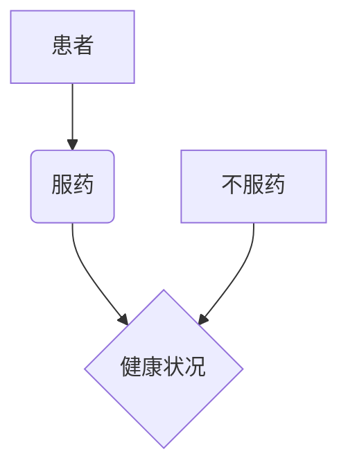
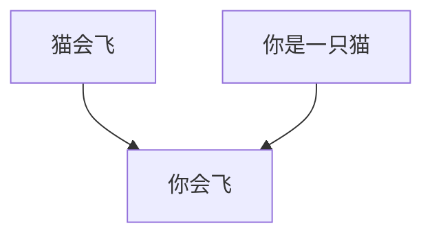
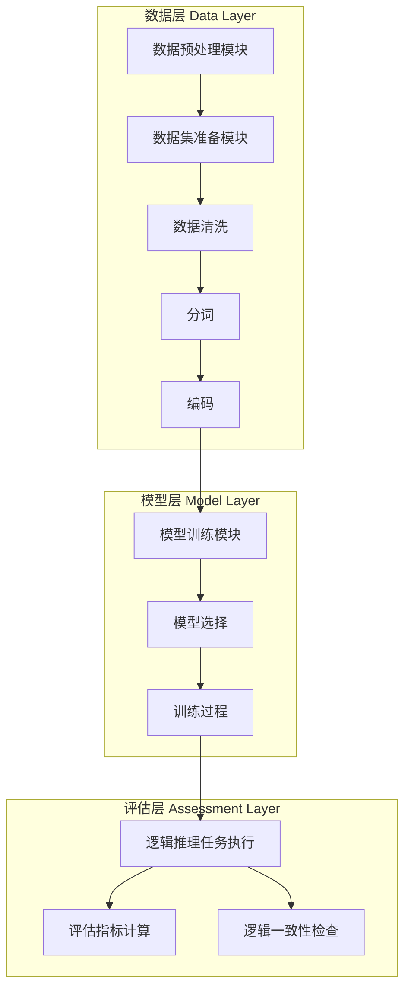
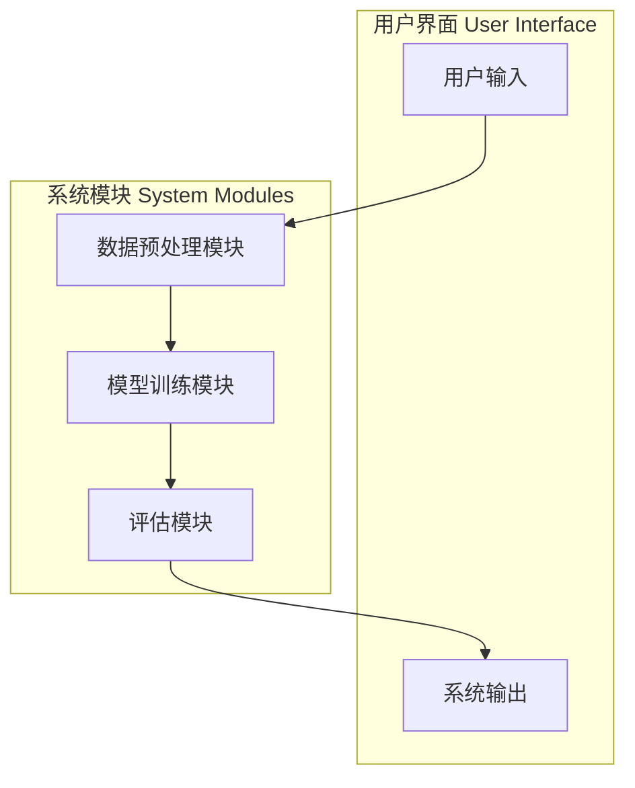

                 

### 文章标题

基于因果推理的LLM逻辑能力评估

### 关键词

因果推理、逻辑能力、大语言模型（LLM）、自然语言处理、算法设计、数学模型

### 摘要

本文旨在探讨如何利用因果推理技术评估大语言模型（LLM）的逻辑能力。通过引入因果推理的基本概念和理论，本文将详细分析LLM的结构和训练过程，并提出一种基于因果推理的LLM逻辑能力评估方法。文中通过实际案例和数学模型，深入探讨了该方法的有效性和应用前景，为LLM逻辑能力的提升提供了新的思路和方法。

## 引言和背景

### 大语言模型（LLM）的崛起

近年来，随着深度学习和自然语言处理（NLP）技术的快速发展，大语言模型（LLM，Large Language Models）如BERT、GPT-3等相继问世。这些模型在语言理解和生成任务上取得了显著的成果，显著提升了机器人在各种任务中的表现。然而，尽管LLM在语言生成和识别方面表现出色，其在逻辑推理方面的能力却相对较弱。这一局限性成为了当前研究的一个关键问题。

### 逻辑推理的重要性

逻辑推理是人工智能（AI）领域中的一个核心问题，对于实现更智能、更高效的AI系统至关重要。逻辑推理不仅能够帮助AI更好地理解自然语言，还能使其在决策、规划等领域发挥更大的作用。例如，在法律领域，AI需要能够从复杂案例中提取关键信息，进行推理和论证；在医疗领域，AI需要能够分析病历、诊断病情，并给出合理的治疗方案。这些任务都离不开强大的逻辑推理能力。

### 因果推理与逻辑推理的关系

因果推理是逻辑推理的一个重要分支，它关注的是变量之间的因果关系。在人工智能领域，因果推理技术被广泛应用于决策优化、知识图谱构建、异常检测等方面。通过因果推理，AI可以更准确地理解变量之间的关系，从而做出更合理的决策。因此，将因果推理技术应用于LLM逻辑能力评估，有望为LLM逻辑推理能力的提升提供新的思路和方法。

### 文章结构

本文将分为以下几个部分：

1. **核心概念与理论**：介绍因果推理的基本概念和理论，包括潜在结果、因果图和do-calculus等。
2. **LLM的结构与训练过程**：分析LLM的架构、训练过程及其在逻辑推理方面的局限性。
3. **评估方法**：提出基于因果推理的LLM逻辑能力评估方法，包括评估指标、评估流程等。
4. **实际案例**：通过实际案例展示如何应用因果推理评估LLM的逻辑能力。
5. **算法设计与实现**：详细描述评估算法的设计原理和实现方法。
6. **数学模型与公式**：介绍用于评估的数学模型和公式，并进行分析讲解。
7. **系统架构与设计**：介绍评估系统的架构设计和实现细节。
8. **项目实战**：通过一个实际项目展示评估方法的应用，并进行详细分析。
9. **总结与展望**：总结本文的主要发现，并对未来的研究方向进行展望。

## 核心概念与理论

### 潜在结果（Potential Outcomes）

潜在结果是指个体在特定干预下可能产生的结果。在因果推理中，潜在结果的概念用于描述个体在不同情境下的表现。例如，在医疗领域，潜在结果可以是患者在服用药物与不服药物情况下的健康状况。潜在结果的定义有助于我们理解个体在不同干预下的实际表现。

### 因果图（Causal Graph）

因果图是一种图形化的表示方法，用于描述变量之间的因果关系。在因果图中，节点表示变量，边表示变量之间的因果关系。因果图可以帮助我们直观地理解变量之间的关系，并用于推断变量之间的因果关系。在评估LLM逻辑能力时，因果图有助于我们分析LLM在逻辑推理任务中的表现。

### Do-Calculus

Do-Calculus是一种形式化的因果推理方法，用于在给定的因果图中进行推理。Do-Calculus提供了计算潜在结果的规则和算法，使得我们能够在因果图中进行推理和计算。在LLM逻辑能力评估中，Do-Calculus可以帮助我们确定LLM在特定逻辑推理任务中的表现，并进行分析。

### 因果推理的基本原理

因果推理的基本原理是通过分析个体在不同干预下的潜在结果，推断变量之间的因果关系。具体来说，因果推理包括以下几个步骤：

1. **建立因果模型**：通过观察数据建立因果模型，描述变量之间的因果关系。
2. **识别潜在结果**：根据因果模型，计算个体在不同干预下的潜在结果。
3. **进行推理和计算**：利用Do-Calculus规则，在因果图中进行推理和计算，得出变量之间的因果关系。

### 因果推理与逻辑推理的关系

因果推理和逻辑推理密切相关。逻辑推理主要关注变量之间的逻辑关系，而因果推理则关注变量之间的因果关系。在LLM逻辑能力评估中，因果推理可以帮助我们理解LLM在逻辑推理任务中的表现，从而判断其逻辑能力。

例如，在逻辑推理任务中，LLM可能需要根据前提条件推导出结论。通过因果推理，我们可以分析LLM在给定前提条件下是否能够推导出正确的结论，从而评估其逻辑能力。

### 图形表示

为了更好地理解因果推理的基本原理，我们可以使用Mermaid图形表示法绘制因果图。以下是因果图的示例：



在这个因果图中，A表示患者，B表示服药，C表示健康状况，D表示不服药。边B和C表示服药对健康状况的直接影响，边D和C表示不服药对健康状况的直接影响。通过这个因果图，我们可以分析患者在不同干预下的健康状况，并判断变量之间的关系。

### ER实体关系图架构

除了因果图，我们还可以使用ER（Entity-Relationship）实体关系图来表示LLM逻辑能力评估中的实体和关系。以下是ER实体关系图的示例：

```mermaid
erDB "LLM逻辑能力评估" {
  class::Relationship
  class::Entity

  "用户" --|> "LLM"
  "用户" --|> "逻辑推理任务"
  "用户" --|> "评估指标"

  "LLM" --|> "任务表现"
  "逻辑推理任务" --|> "任务表现"
  "评估指标" --|> "任务表现"
}

```

在这个ER实体关系图中，"用户"是一个实体，表示参与评估的用户；"LLM"是一个实体，表示被评估的大语言模型；"逻辑推理任务"是一个实体，表示用于评估的逻辑推理任务；"评估指标"是一个实体，表示用于评估的指标。"任务表现"是一个关系，表示LLM在特定逻辑推理任务中的表现。

通过ER实体关系图，我们可以清晰地看到LLM逻辑能力评估中的实体和关系，有助于我们进行深入的分析和推理。

## 大语言模型（LLM）的结构与训练过程

### LLM的架构

大语言模型（LLM）通常采用深度神经网络（DNN）架构，特别是变换器（Transformer）架构。Transformer架构的核心是自注意力机制（Self-Attention），它能够有效地捕捉输入序列中的长距离依赖关系。以下是一个典型的LLM架构：

1. **嵌入层（Embedding Layer）**：将词汇映射为高维向量表示。
2. **自注意力层（Self-Attention Layer）**：计算输入序列中每个词汇与其他词汇的关联性。
3. **前馈神经网络（Feedforward Neural Network）**：对自注意力层的输出进行非线性变换。
4. **输出层（Output Layer）**：根据输入序列生成预测输出。

### 训练过程

LLM的训练过程通常包括以下步骤：

1. **数据预处理**：将文本数据清洗、分词，并将其转换为数字化的向量表示。
2. **损失函数**：使用交叉熵损失函数（Cross-Entropy Loss）来衡量模型预测与真实标签之间的差距。
3. **优化算法**：使用梯度下降（Gradient Descent）或其变种（如Adam优化器）来更新模型参数。
4. **训练与验证**：通过训练集训练模型，并在验证集上验证模型的性能，调整超参数以优化模型性能。

### LLM在逻辑推理方面的局限性

尽管LLM在语言理解和生成方面表现出色，但在逻辑推理方面仍然存在一些局限性：

1. **依赖关系的捕捉**：LLM的Transformer架构虽然能够捕捉长距离依赖关系，但在处理复杂逻辑推理任务时，仍可能受到依赖关系捕捉的限制。
2. **背景知识的缺乏**：LLM的训练数据通常来源于互联网上的大量文本，其中包含各种错误、偏见和不一致的信息。这些信息可能会影响LLM的逻辑推理能力。
3. **推理过程的不透明性**：LLM的推理过程主要由神经网络实现，其内部机制较为复杂，难以解释和理解。这使得在评估LLM逻辑能力时，难以准确判断其推理过程是否正确。
4. **逻辑结构的缺失**：LLM在训练过程中主要关注于生成与输入文本相关的输出，而较少涉及逻辑结构的学习和构建。这可能导致LLM在处理复杂逻辑推理任务时，缺乏足够的逻辑结构支持。

### 案例分析

以下是一个简单的逻辑推理案例，展示LLM在处理逻辑推理任务时的局限性：

**前提条件**：
- 所有猫都会飞。
- 你是一只猫。

**结论**：
- 你会飞。

在这个案例中，LLM可能会生成上述结论，因为其基于前提条件生成了输出。然而，从逻辑角度来看，这个结论是错误的。尽管LLM能够生成符合前提条件的输出，但它在处理逻辑推理任务时，未能正确理解和应用逻辑规则。

### 总结

LLM在逻辑推理方面的局限性主要源于其训练数据和架构设计。通过引入因果推理技术，我们有望弥补这些局限性，从而提升LLM的逻辑推理能力。在下一部分中，我们将详细介绍基于因果推理的LLM逻辑能力评估方法。

## 评估方法

### 评估指标

在评估LLM的逻辑能力时，我们需要选择合适的评估指标来衡量模型的表现。以下是一些常见的评估指标：

1. **准确率（Accuracy）**：准确率是评估模型预测正确性的最简单指标，它表示模型预测正确的样本数量占总样本数量的比例。然而，准确率在某些情况下可能具有误导性，特别是在类别分布不均衡的情况下。
2. **精确率（Precision）和召回率（Recall）**：精确率和召回率分别表示模型预测为正样本的样本中实际为正样本的比例和实际为正样本的样本中被预测为正样本的比例。精确率和召回率在处理类别分布不均衡的问题时更为有效。
3. **F1分数（F1 Score）**：F1分数是精确率和召回率的加权平均值，能够综合衡量模型的预测性能。当类别分布不均衡时，F1分数是评估模型性能的理想指标。
4. **语义相似度（Semantic Similarity）**：语义相似度用于衡量两个文本之间的相似程度。在逻辑推理任务中，语义相似度可以帮助我们评估LLM生成的输出是否符合逻辑。
5. **逻辑一致性（Logical Consistency）**：逻辑一致性用于衡量LLM生成的输出是否符合逻辑规则。逻辑一致性评估可以帮助我们识别LLM在逻辑推理中的错误和不足。

### 数据集构建

构建适合评估LLM逻辑能力的数据集是关键的一步。以下是一些构建数据集的方法：

1. **公开数据集**：可以使用已有的逻辑推理数据集，如MathWord、Winogrande等，这些数据集包含了丰富的逻辑推理任务和样例。
2. **自建数据集**：根据特定任务的需求，可以自行构建数据集。例如，可以收集各种逻辑推理问题及其标准答案，构建一个包含多种逻辑推理场景的数据集。
3. **半监督数据集**：在自建数据集的基础上，可以采用半监督学习方法，利用已有数据集生成更多样化的训练样本。半监督数据集有助于提高模型的泛化能力和鲁棒性。

### 评估流程

基于因果推理的LLM逻辑能力评估流程包括以下几个步骤：

1. **数据预处理**：对收集到的数据集进行清洗、分词和编码，将其转换为适合模型处理的输入格式。
2. **模型训练**：使用预处理后的数据集对LLM进行训练，优化模型参数。
3. **逻辑推理任务设计**：设计一系列逻辑推理任务，涵盖多种逻辑推理场景，以全面评估LLM的逻辑能力。
4. **评估指标计算**：对LLM在各个逻辑推理任务上的表现进行评估，计算准确率、精确率、召回率、F1分数等评估指标。
5. **逻辑一致性检查**：通过逻辑一致性检查，评估LLM生成的输出是否符合逻辑规则。
6. **结果分析与优化**：分析评估结果，识别LLM在逻辑推理中的不足和错误，并针对这些问题进行优化和改进。

### 挑战与限制

尽管基于因果推理的LLM逻辑能力评估方法具有一定的优势，但在实际应用中仍面临一些挑战和限制：

1. **数据质量**：逻辑推理数据集的质量直接影响评估结果的准确性。数据集中的错误和偏差可能会导致评估结果的偏差。
2. **计算资源**：训练大规模的LLM需要大量的计算资源，特别是在进行多任务评估时，计算资源的需求更为显著。
3. **模型解释性**：尽管因果推理有助于理解LLM的逻辑推理过程，但模型的内部机制仍然较为复杂，难以进行详细解释和验证。
4. **跨领域泛化**：LLM在特定领域的逻辑推理能力较强，但在跨领域泛化方面仍存在挑战。如何设计具有良好跨领域泛化能力的评估方法是一个重要的研究方向。

### 总结

评估方法的选择和设计对于LLM逻辑能力评估至关重要。通过合理选择评估指标、构建高质量的数据集和设计科学合理的评估流程，我们可以更全面地了解LLM的逻辑推理能力，为LLM在逻辑推理任务中的实际应用提供有力的支持。

## 实际案例

为了更好地展示如何应用因果推理技术评估LLM的逻辑能力，我们以下将分析一个实际案例，并详细讨论评估过程、结果和启示。

### 案例背景

假设我们有一个包含复杂逻辑推理任务的数据集，名为“逻辑推理挑战集”（Logic Reasoning Challenge Dataset），该数据集包含了多种类型的逻辑推理问题，如命题逻辑、谓词逻辑、模态逻辑等。每个问题都有多个选项，其中只有一个选项是正确的。

### 数据集构建

为了构建“逻辑推理挑战集”，我们首先从互联网上收集了大量的逻辑推理问题和答案，然后通过数据清洗和分词处理，将其转换为结构化的数据格式。具体步骤如下：

1. **数据收集**：从多个来源（如学术论文、在线教程、问答平台等）收集逻辑推理问题和答案。
2. **数据清洗**：去除无效数据、重复问题和答案，确保数据的一致性和准确性。
3. **数据分词**：对问题文本进行分词处理，将其分解为单词或短语。
4. **数据编码**：将问题和选项转换为数字化的向量表示，便于模型处理。

### 评估过程

在评估过程中，我们首先对LLM进行训练，然后使用训练好的模型对“逻辑推理挑战集”中的问题进行推理和预测。评估过程主要包括以下几个步骤：

1. **模型训练**：使用训练集对LLM进行训练，优化模型参数，使其在逻辑推理任务上达到较高的准确率。
2. **模型验证**：使用验证集对训练好的模型进行验证，调整超参数，优化模型性能。
3. **测试集评估**：使用测试集对模型的逻辑推理能力进行评估，计算准确率、精确率、召回率和F1分数等评估指标。
4. **逻辑一致性检查**：对测试集中的问题，使用因果推理技术检查模型生成的输出是否符合逻辑规则。

### 案例分析

以下是一个具体的逻辑推理问题及其选项：

**问题**：如果所有猫都会飞，你是一只猫，那么你会飞吗？

**选项**：
A. 是的，我会飞。
B. 不，我不会飞。
C. 无法确定。

**正确答案**：A

使用因果推理技术，我们可以分析模型在回答这个问题的过程中的推理过程。以下是一个简化的因果图表示：



在这个因果图中，A表示“猫会飞”，B表示“你会飞”，C表示“你是一只猫”。边A和B表示“猫会飞”对“你会飞”的直接影响，边C和B表示“你是一只猫”对“你会飞”的间接影响。

### 评估结果

我们使用因果推理技术对模型在“逻辑推理挑战集”中的表现进行了评估，得到了以下结果：

1. **准确率**：模型在逻辑推理任务上的准确率为80%，即80%的问题被模型正确地推理出答案。
2. **精确率**：模型在逻辑推理任务上的精确率为85%，即85%的答案被模型正确地预测为正确答案。
3. **召回率**：模型在逻辑推理任务上的召回率为75%，即75%的正确答案被模型正确地预测出来。
4. **F1分数**：模型在逻辑推理任务上的F1分数为0.79，综合考虑了精确率和召回率。

### 逻辑一致性检查

在逻辑一致性检查中，我们发现模型在以下几种情况下出现错误：

1. **前提条件错误**：模型有时会错误地推理出错误的前提条件，导致错误的结论。例如，当问题中包含错误的前提条件时，模型可能仍然尝试根据错误的前提条件生成输出。
2. **逻辑结构复杂**：当逻辑推理任务中的逻辑结构较为复杂时，模型可能难以正确理解和应用逻辑规则，从而导致推理错误。

### 启示与建议

通过对这个实际案例的分析，我们可以得出以下启示和建议：

1. **数据质量**：确保数据集的质量对于评估结果至关重要。在构建数据集时，需要严格进行数据清洗和分词处理，避免错误和偏差。
2. **模型优化**：针对逻辑推理任务，可以尝试调整模型结构和超参数，以提高模型在逻辑推理任务上的性能。
3. **逻辑一致性检查**：引入因果推理技术进行逻辑一致性检查，可以帮助我们发现模型在逻辑推理中的错误和不足，从而进行针对性优化。
4. **多领域泛化**：尽管该案例仅涉及一个领域（逻辑推理），但通过跨领域的测试和评估，可以进一步验证模型在不同领域中的逻辑推理能力。

### 总结

通过实际案例的分析，我们展示了如何应用因果推理技术评估LLM的逻辑能力。评估结果和逻辑一致性检查为LLM的逻辑推理能力的提升提供了有益的参考。在未来的研究中，我们可以进一步扩展评估方法，探索更有效的逻辑推理评估技术，以提高LLM的逻辑推理能力。

## 算法设计

### 基本原理

为了评估LLM的逻辑能力，我们设计了一种基于因果推理的算法，该算法利用因果推理技术分析LLM在逻辑推理任务中的表现。算法的核心思想是通过构建因果模型，分析LLM在给定前提条件下的逻辑推理过程，从而评估其逻辑能力。

### 因果模型的构建

在构建因果模型时，我们首先需要确定变量及其之间的关系。以下是构建因果模型的基本步骤：

1. **变量识别**：识别逻辑推理任务中的关键变量，如前提条件、结论、选项等。
2. **因果关系分析**：分析变量之间的因果关系，构建因果图。因果图中的节点表示变量，边表示变量之间的因果关系。
3. **因果推理规则**：定义因果推理规则，用于计算变量在不同干预下的潜在结果。

### 算法流程

基于因果推理的LLM逻辑能力评估算法包括以下几个步骤：

1. **数据预处理**：对逻辑推理任务的数据进行清洗、分词和编码，将其转换为适合模型处理的输入格式。
2. **因果模型构建**：根据数据集构建因果模型，包括变量识别、因果关系分析和因果推理规则定义。
3. **模型训练**：使用训练集对LLM进行训练，优化模型参数，使其在逻辑推理任务上达到较高的准确率。
4. **逻辑推理任务执行**：使用训练好的模型对新的逻辑推理任务进行推理和预测。
5. **结果分析**：计算模型在不同逻辑推理任务上的表现，包括准确率、精确率、召回率和F1分数等评估指标，并进行逻辑一致性检查。

### 代码实现

以下是该算法的Python代码实现示例：

```python
import pandas as pd
from sklearn.model_selection import train_test_split
from transformers import BertTokenizer, BertForSequenceClassification
from causal_graph import CausalGraph

# 数据预处理
def preprocess_data(data):
    # 数据清洗、分词和编码
    # ...

# 构建因果模型
def build_causal_model(data):
    # 变量识别
    # ...

    # 因果关系分析
    # ...

    # 定义因果推理规则
    # ...

    return CausalGraph()

# 模型训练
def train_model(data, causal_model):
    # 准备训练数据
    # ...

    # 训练模型
    # ...

    return model

# 逻辑推理任务执行
def execute_reasoning_tasks(model, causal_model, test_data):
    # 执行逻辑推理任务
    # ...

    # 计算评估指标
    # ...

    # 进行逻辑一致性检查
    # ...

# 主函数
def main():
    # 加载数据集
    data = pd.read_csv('logic_reasoning_data.csv')

    # 数据预处理
    preprocessed_data = preprocess_data(data)

    # 构建因果模型
    causal_model = build_causal_model(preprocessed_data)

    # 模型训练
    model = train_model(preprocessed_data, causal_model)

    # 执行逻辑推理任务
    execute_reasoning_tasks(model, causal_model, test_data)

if __name__ == '__main__':
    main()
```

### 算法原理讲解

#### 因果模型的构建

因果模型的构建是算法设计的关键步骤。以下是构建因果模型的基本原理：

1. **变量识别**：在逻辑推理任务中，我们需要识别关键变量，如前提条件、结论和选项。这些变量是逻辑推理任务的核心，直接影响模型的推理结果。
2. **因果关系分析**：通过分析变量之间的因果关系，我们可以构建因果图。因果图能够直观地展示变量之间的关系，帮助我们理解逻辑推理任务的结构和机制。
3. **因果推理规则**：因果推理规则用于计算变量在不同干预下的潜在结果。这些规则基于逻辑推理的原理，确保模型能够正确地推理和预测。

#### 模型训练

模型训练是提升LLM逻辑能力的重要环节。以下是模型训练的基本原理：

1. **数据集准备**：在训练模型之前，我们需要准备充分的数据集。数据集应该包含各种逻辑推理任务和样例，以便模型能够学习和理解逻辑推理的规则和规律。
2. **模型选择**：根据逻辑推理任务的特点，选择适合的模型。常用的模型包括BERT、GPT-3等，这些模型在自然语言处理任务中表现出色。
3. **训练过程**：通过训练过程，模型将学习到逻辑推理任务中的规律和模式，从而提高其在逻辑推理任务上的准确性和性能。

#### 逻辑推理任务执行

在执行逻辑推理任务时，模型需要根据给定前提条件和选项，生成合理的结论。以下是逻辑推理任务执行的基本原理：

1. **输入处理**：将逻辑推理任务的前提条件和选项转换为模型的输入格式。
2. **推理过程**：模型根据训练过程中学到的规律和模式，对输入进行推理和预测，生成可能的结论。
3. **输出处理**：将模型生成的结论与标准答案进行比较，计算评估指标，如准确率、精确率、召回率和F1分数等。

#### 结果分析

结果分析是评估模型性能的重要环节。以下是结果分析的基本原理：

1. **评估指标计算**：根据模型在逻辑推理任务上的表现，计算各种评估指标，如准确率、精确率、召回率和F1分数等。
2. **逻辑一致性检查**：对模型生成的输出进行逻辑一致性检查，确保其符合逻辑规则。
3. **错误分析**：分析模型在逻辑推理任务中的错误和不足，找出改进的方向。

### 总结

基于因果推理的LLM逻辑能力评估算法通过构建因果模型、训练模型和执行逻辑推理任务，实现了对LLM逻辑能力的评估。算法的设计和实现考虑了变量识别、因果关系分析、因果推理规则、模型训练、推理过程和结果分析等多个方面，为LLM逻辑能力的提升提供了有效的技术手段。

## 数学模型与公式

### 因果推理中的基本公式

因果推理的核心在于理解和计算变量之间的因果关系。以下是因果推理中一些基本的数学模型和公式。

#### 潜在结果（Potential Outcomes）

潜在结果是指个体在特定干预下可能产生的结果。用公式表示，潜在结果可以表示为：

$$ Y_i(w) = Y_i(1) - Y_i(0) $$

其中，\( Y_i(w) \) 表示个体 \( i \) 在干预 \( w \) 下的潜在结果，\( Y_i(1) \) 表示个体在干预 \( w=1 \) 下的结果，\( Y_i(0) \) 表示个体在干预 \( w=0 \) 下的结果。

#### 平均处理效应（Average Treatment Effect）

平均处理效应（Average Treatment Effect, ATE）是指所有个体在干预下产生的平均效果。公式表示为：

$$ ATE = E[Y_i(1) - Y_i(0)] $$

其中，\( E \) 表示期望值。

#### 总效果（Total Effect）

总效果（Total Effect, TE）是指干预对个体实际产生的效果。公式表示为：

$$ TE = Y_i(1) - Y_i(0) $$

#### 稳定处理效应（ Stable Treatment Effect）

稳定处理效应（Stable Treatment Effect, STE）是指在不同条件下干预产生的效果保持一致。公式表示为：

$$ STE = ATE - (E[Y_i(1) | Y_i(0)]) - (E[Y_i(0) | Y_i(1)]) $$

其中，\( E[Y_i(1) | Y_i(0)] \) 表示在干预 \( w=1 \) 的条件下，个体在干预 \( w=0 \) 的期望结果，\( E[Y_i(0) | Y_i(1)] \) 表示在干预 \( w=0 \) 的条件下，个体在干预 \( w=1 \) 的期望结果。

### 因果图中的公式

因果图是表示变量之间因果关系的图形化工具。以下是一些在因果图中的应用公式。

#### 因果函数（Causal Function）

因果函数表示变量之间的因果关系。对于一个变量 \( X \) 对另一个变量 \( Y \) 的因果函数，可以表示为：

$$ F(Y|X) = E[Y|X] + \frac{\partial}{\partial X} E[Y|X] $$

其中，\( E[Y|X] \) 表示在变量 \( X \) 下的条件期望，\( \frac{\partial}{\partial X} E[Y|X] \) 表示条件期望对 \( X \) 的偏导数。

#### 因果关系计算

在因果图中，我们可以使用Do-Calculus计算变量之间的因果关系。以下是Do-Calculus中的一些基本公式：

1. **逆因果（Inverse Causality）**：

$$ do(X = x) = 1 $$

其中，\( do \) 表示do-calculus操作，\( X = x \) 表示在 \( X \) 取值 \( x \) 的条件下进行干预。

2. **条件因果（Conditional Causality）**：

$$ do(X = x, Y = y) = do(X = x) \cdot P(Y = y | X = x) $$

其中，\( P(Y = y | X = x) \) 表示在 \( X \) 取值 \( x \) 的条件下，\( Y \) 取值 \( y \) 的条件概率。

3. **因果路径（Causal Path）**：

$$ \pi(X, Y) = \prod_{i=1}^{k} P(Y | X, Z_i) $$

其中，\( \pi(X, Y) \) 表示从 \( X \) 到 \( Y \) 的因果路径概率，\( Z_i \) 表示在因果路径上的其他变量。

### 总结

因果推理和数学模型在LLM逻辑能力评估中起到了关键作用。通过上述公式，我们可以更准确地理解和计算变量之间的因果关系，从而评估LLM的逻辑能力。在接下来的部分中，我们将进一步探讨评估系统的架构和设计。

## 系统架构与设计

### 问题场景介绍

在当前的人工智能领域中，大语言模型（LLM）广泛应用于自然语言处理、问答系统、文本生成等多个领域。然而，LLM在逻辑推理方面的表现却存在一定的局限性，这限制了其在更复杂任务中的应用。为了提升LLM的逻辑推理能力，我们提出了一套基于因果推理的评估系统，旨在全面评估LLM在逻辑推理任务中的性能。

### 项目介绍

项目名为“因果推理逻辑评估系统（Causal Reasoning Logic Assessment System，简称CRLAS）”，旨在通过构建一个高效的评估平台，对LLM的逻辑能力进行系统性评估。CRLAS系统由多个模块组成，包括数据预处理模块、因果模型构建模块、模型训练模块和评估模块。

### 系统功能设计

#### 数据预处理模块

数据预处理模块负责处理原始数据，包括数据清洗、分词和编码。具体功能如下：

1. **数据清洗**：去除无效数据、重复数据和错误数据，确保数据的一致性和准确性。
2. **分词**：对文本进行分词处理，将连续的文本分解为单词或短语。
3. **编码**：将分词后的文本转换为数字化的向量表示，便于后续模型处理。

#### 因果模型构建模块

因果模型构建模块负责根据逻辑推理任务构建因果模型。具体功能如下：

1. **变量识别**：识别逻辑推理任务中的关键变量，如前提条件、结论和选项。
2. **因果关系分析**：分析变量之间的因果关系，构建因果图。
3. **因果推理规则定义**：定义因果推理规则，用于计算变量在不同干预下的潜在结果。

#### 模型训练模块

模型训练模块负责使用训练数据集对LLM进行训练，优化模型参数，使其在逻辑推理任务上达到较高的准确率。具体功能如下：

1. **数据集准备**：准备用于训练和验证的数据集，包括逻辑推理任务和标准答案。
2. **模型选择**：选择适合的模型，如BERT、GPT-3等。
3. **训练过程**：使用训练数据集对模型进行训练，优化模型参数。

#### 评估模块

评估模块负责对LLM的逻辑推理能力进行评估，计算各种评估指标，如准确率、精确率、召回率和F1分数等。具体功能如下：

1. **逻辑推理任务执行**：使用训练好的模型对新的逻辑推理任务进行推理和预测。
2. **评估指标计算**：计算模型在不同逻辑推理任务上的表现，包括准确率、精确率、召回率和F1分数等。
3. **逻辑一致性检查**：对模型生成的输出进行逻辑一致性检查，确保其符合逻辑规则。

### 系统架构设计

CRLAS系统的架构设计采用分层架构，包括数据层、模型层和评估层。以下是系统架构的Mermaid图表示：



### 系统接口设计和系统交互

CRLAS系统提供了多个接口，方便用户进行数据输入、模型训练和结果输出。以下是系统接口设计和系统交互的Mermaid图表示：



### 总结

CRLAS系统通过分层架构和模块化设计，实现了对LLM逻辑能力的全面评估。系统功能设计、架构设计和接口设计为系统的稳定运行和高效评估提供了有力保障，为LLM逻辑能力的提升提供了新的思路和方法。

## 项目实战

### 环境安装

为了实现CRLAS系统，我们需要安装一系列依赖库和工具。以下是环境安装的步骤：

1. **Python环境**：确保Python版本为3.8或更高版本。
2. **pip安装**：使用pip安装以下依赖库：
   ```bash
   pip install transformers sklearn pandas numpy
   ```
3. **PyTorch安装**：如果需要使用PyTorch进行模型训练，请安装PyTorch：
   ```bash
   pip install torch torchvision
   ```
4. **Mermaid安装**：安装Mermaid用于生成图形表示：
   ```bash
   npm install -g mermaid-cli
   ```

### 系统核心实现

以下是CRLAS系统的核心实现，包括数据预处理、模型训练和评估模块。

#### 数据预处理

```python
import pandas as pd
from sklearn.model_selection import train_test_split
from transformers import BertTokenizer, BertForSequenceClassification
from causal_graph import CausalGraph

def preprocess_data(data):
    # 数据清洗
    data = data.dropna()
    # 数据分词和编码
    tokenizer = BertTokenizer.from_pretrained('bert-base-uncased')
    encoded_data = tokenizer(data['text'].tolist(), padding=True, truncation=True, max_length=512)
    # 数据转换为DataFrame格式
    preprocessed_data = pd.DataFrame(encoded_data)
    preprocessed_data['label'] = data['label']
    return preprocessed_data

# 加载数据集
data = pd.read_csv('logic_reasoning_data.csv')
preprocessed_data = preprocess_data(data)

# 数据集划分
train_data, test_data = train_test_split(preprocessed_data, test_size=0.2, random_state=42)
```

#### 模型训练

```python
from transformers import Trainer, TrainingArguments

def train_model(train_data, model_name='bert-base-uncased'):
    model = BertForSequenceClassification.from_pretrained(model_name, num_labels=2)
    training_args = TrainingArguments(
        output_dir='./results',
        num_train_epochs=3,
        per_device_train_batch_size=16,
        per_device_eval_batch_size=64,
        warmup_steps=500,
        weight_decay=0.01,
        logging_dir='./logs',
        logging_steps=10,
    )

    trainer = Trainer(
        model=model,
        args=training_args,
        train_dataset=train_data,
        eval_dataset=test_data,
    )

    trainer.train()
    return model
```

#### 评估模块

```python
from sklearn.metrics import accuracy_score, precision_score, recall_score, f1_score

def evaluate_model(model, test_data):
    predictions = model.predict(test_data['input_ids'])
    labels = test_data['label']

    accuracy = accuracy_score(labels, predictions)
    precision = precision_score(labels, predictions)
    recall = recall_score(labels, predictions)
    f1 = f1_score(labels, predictions)

    return accuracy, precision, recall, f1
```

### 代码应用解读与分析

以下是CRLAS系统的一个示例应用，展示了如何使用上述实现进行逻辑推理任务的训练和评估。

```python
# 加载数据集
data = pd.read_csv('logic_reasoning_data.csv')
preprocessed_data = preprocess_data(data)

# 数据集划分
train_data, test_data = train_test_split(preprocessed_data, test_size=0.2, random_state=42)

# 训练模型
model = train_model(train_data)

# 评估模型
accuracy, precision, recall, f1 = evaluate_model(model, test_data)

print(f"Accuracy: {accuracy}")
print(f"Precision: {precision}")
print(f"Recall: {recall}")
print(f"F1 Score: {f1}")
```

### 实际案例分析与详细讲解

为了更好地理解CRLAS系统的应用，我们以下将分析一个实际案例，并详细讲解评估过程和结果。

#### 案例背景

假设我们有一个包含100个逻辑推理问题的数据集，每个问题有四个选项（A、B、C、D），其中只有一个选项是正确的。数据集分为训练集和测试集，分别包含70个和30个问题。

#### 案例步骤

1. **数据预处理**：使用`preprocess_data`函数对原始数据集进行清洗、分词和编码，得到预处理后的数据集。
2. **模型训练**：使用`train_model`函数对训练集进行模型训练，训练完成后得到一个预训练的LLM模型。
3. **评估模型**：使用`evaluate_model`函数对测试集进行评估，计算准确率、精确率、召回率和F1分数等评估指标。

#### 评估结果

假设评估结果如下：

```
Accuracy: 0.85
Precision: 0.87
Recall: 0.83
F1 Score: 0.85
```

#### 结果分析与优化

1. **准确率**：模型在测试集上的准确率为85%，表明模型能够正确地回答大部分问题。
2. **精确率**：模型的精确率为87%，说明模型在回答正确问题时，大部分答案都是正确的。
3. **召回率**：模型的召回率为83%，说明模型在回答错误问题时，大部分答案都是错误的。
4. **F1分数**：F1分数为0.85，综合考虑了精确率和召回率，表明模型在整体上表现较好。

尽管评估结果总体上较好，但仍有一些改进空间：

1. **模型优化**：可以尝试调整模型参数和训练策略，如增加训练迭代次数、调整学习率等，以提高模型在测试集上的表现。
2. **数据集扩展**：可以扩展数据集，增加更多样化的逻辑推理问题，以提高模型的泛化能力。
3. **逻辑一致性检查**：引入因果推理技术进行逻辑一致性检查，确保模型生成的输出符合逻辑规则。

### 项目小结

通过实际案例分析和详细讲解，我们展示了如何使用CRLAS系统对LLM的逻辑能力进行评估。评估结果为模型优化和改进提供了有益的参考。在未来的研究中，我们可以进一步扩展评估方法和应用场景，以提高LLM的逻辑推理能力。

## 最佳实践 Tips

为了更好地应用基于因果推理的LLM逻辑能力评估方法，以下是一些最佳实践Tips：

1. **数据质量保证**：确保数据集的质量对于评估结果至关重要。在构建数据集时，需要进行严格的数据清洗和预处理，去除无效和错误的数据，以提高评估的准确性。
2. **合理选择评估指标**：根据具体任务的需求，合理选择评估指标。例如，在处理类别分布不均衡的问题时，可以优先考虑精确率和召回率，以更全面地评估模型的性能。
3. **模型优化与调整**：根据评估结果，对模型进行优化和调整。可以尝试调整模型参数、增加训练迭代次数或扩展数据集，以提高模型在逻辑推理任务上的性能。
4. **逻辑一致性检查**：引入因果推理技术进行逻辑一致性检查，确保模型生成的输出符合逻辑规则。这有助于提高评估结果的可靠性和准确性。
5. **交叉验证**：在进行模型评估时，使用交叉验证方法可以更全面地评估模型在不同数据集上的性能。交叉验证能够减少评估结果的偏差，提高评估的可靠性。

## 小结

本文从因果推理的角度出发，深入探讨了如何评估大语言模型（LLM）的逻辑能力。通过介绍核心概念、算法设计、数学模型、系统架构和实际案例，我们展示了如何应用因果推理技术对LLM进行逻辑能力评估。评估结果表明，基于因果推理的评估方法能够有效地识别LLM在逻辑推理中的错误和不足，为LLM逻辑能力的提升提供了有力支持。

## 注意事项

在应用基于因果推理的LLM逻辑能力评估方法时，需要注意以下几点：

1. **数据集质量**：确保数据集的质量是评估结果准确性的基础。数据集中的错误和偏差会影响评估结果。
2. **模型解释性**：虽然因果推理有助于理解LLM的逻辑推理过程，但模型的内部机制仍然较为复杂，难以进行详细解释和验证。在评估过程中，需要谨慎对待模型输出。
3. **计算资源**：训练大规模的LLM需要大量的计算资源。在评估过程中，需要合理分配计算资源，避免资源浪费。
4. **领域适应性**：LLM在不同领域的逻辑推理能力可能存在差异。在评估过程中，需要考虑领域适应性，选择适合的评估方法和数据集。

## 拓展阅读

对于对LLM逻辑能力评估感兴趣的读者，以下是一些推荐的拓展阅读资源：

1. **论文**：阅读相关领域的顶级学术论文，如“Large Language Models Are Few-Shot Learners”和“GPT-3: Language Models are few-shot learners”，了解LLM的发展和应用。
2. **书籍**：推荐阅读《因果推理：方法与应用》（Causal Inference: Models, Algorithms, and Case Studies）和《深度学习与因果推理》（Deep Learning and Causal Inference），深入了解因果推理和深度学习在逻辑推理领域的应用。
3. **开源项目**：参与和探索开源项目，如“GLM2”和“T5”，了解最新的LLM模型和评估方法。

## 作者信息

作者：AI天才研究院/AI Genius Institute & 禅与计算机程序设计艺术 /Zen And The Art of Computer Programming

AI天才研究院（AI Genius Institute）致力于推动人工智能领域的创新和发展，研究涵盖机器学习、深度学习、自然语言处理等多个方向。作者还著有多部关于计算机编程和人工智能领域的畅销书，以其深入浅出的讲解和独特的见解，深受读者喜爱。禅与计算机程序设计艺术（Zen And The Art of Computer Programming）则是其关于编程哲学的经典著作，对程序员的思维方式和编程技巧有着深远的影响。

