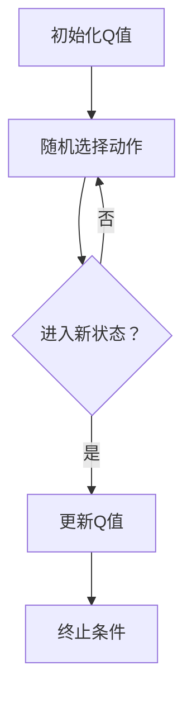
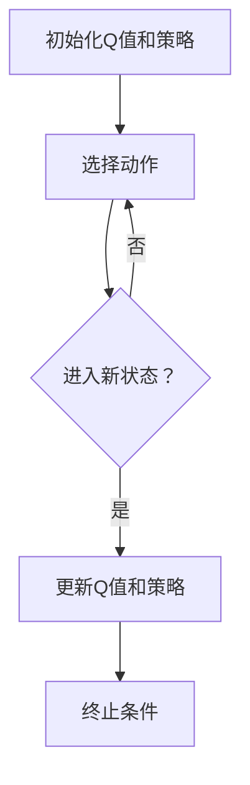
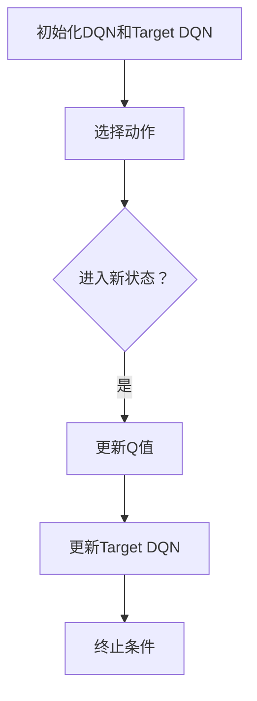
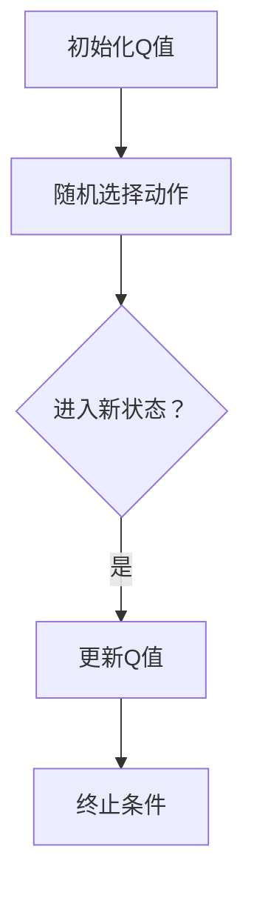
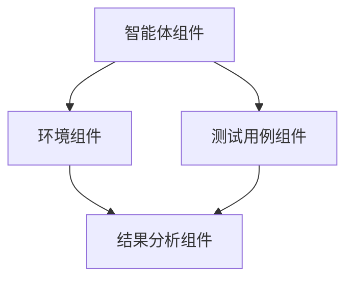
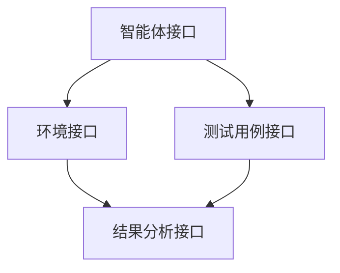
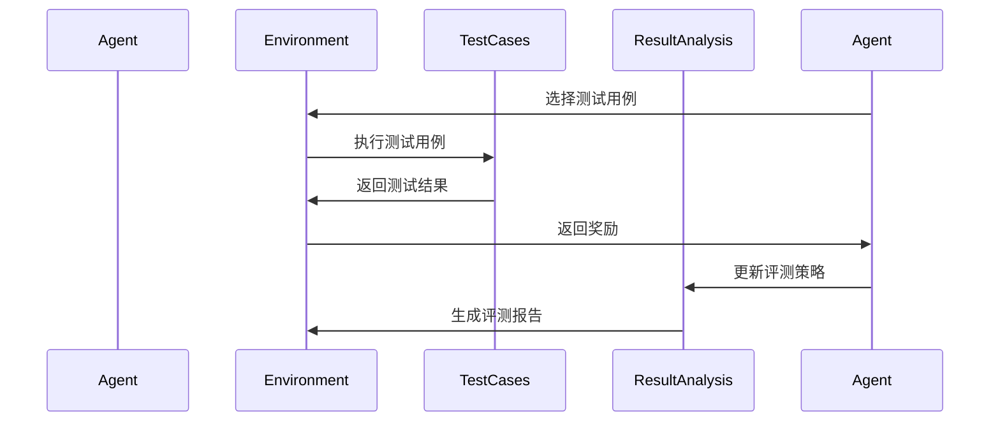

                 

### 文章标题：基于强化学习的评测策略自适应

> 关键词：强化学习、评测策略、自适应、Q学习、SARSA、Deep Q-Network、数学模型、系统设计、实战案例

> 摘要：本文深入探讨基于强化学习的评测策略自适应问题，从核心概念、数学模型、系统设计与实现、实战案例等多个角度，详细解析如何利用强化学习算法实现评测策略的自适应。通过理论讲解和实际应用分析，本文为读者提供了一个系统且全面的理解框架，旨在推动该领域的研究与应用。

### 目录

1. **背景介绍**
    1.1 强化学习基础
    1.2 评测策略概念
    1.3 自适应评测策略的重要性
2. **核心概念与联系**
    2.1 强化学习算法
    2.2 评测策略评估与优化
3. **算法原理讲解**
    3.1 Q学习算法
    3.2 SARSA算法
    3.3 Deep Q-Network算法
4. **数学模型**
    4.1 强化学习的数学模型
    4.2 算法原理的数学公式
5. **系统分析与架构设计方案**
    5.1 问题场景介绍
    5.2 系统功能设计
    5.3 系统架构设计
    5.4 系统接口设计
    5.5 系统交互设计
6. **项目实战**
    6.1 环境安装
    6.2 系统核心实现
    6.3 代码应用解读
    6.4 实际案例分析
    6.5 项目小结
7. **最佳实践与拓展**
    7.1 最佳实践建议
    7.2 注意事项
    7.3 拓展阅读

### 第一步：背景介绍

#### 1.1 强化学习基础

强化学习（Reinforcement Learning，简称RL）是机器学习的一个重要分支，主要研究如何通过试错（trial-and-error）的方法来学习在复杂环境中的最优策略。与监督学习和无监督学习不同，强化学习中的智能体（agent）通过与环境的交互来学习如何行动，以最大化长期奖励。

强化学习的基本要素包括：

- **智能体（Agent）**：执行动作并接收环境反馈的实体。
- **环境（Environment）**：智能体所处的场景，可以看作一个状态空间。
- **状态（State）**：描述环境当前状态的变量。
- **动作（Action）**：智能体可以采取的行动。
- **奖励（Reward）**：环境对智能体行动的反馈，用于评估智能体的行为。

强化学习的目标是找到一种策略（Policy），该策略指导智能体在特定状态下采取最优动作，以实现长期累积奖励的最大化。

#### 1.2 评测策略概念

评测策略（Evaluation Policy）是用于评估智能体行为好坏的规则集。在强化学习中，智能体的目标是学习到最优策略，而评测策略则是评估学习成果的重要工具。一个好的评测策略能够帮助智能体快速收敛到最优策略。

评测策略可以分为以下几种类型：

- **静态策略**：不随时间变化，适用于环境变化不频繁的场景。
- **动态策略**：根据环境状态动态调整，适用于环境变化较为频繁的场景。
- **自适应策略**：根据智能体的学习过程自适应调整，以提高学习效率。

#### 1.3 自适应评测策略的重要性

自适应评测策略在强化学习中的应用具有重要意义。首先，自适应评测策略能够更好地适应环境变化，提高智能体的学习效率。其次，自适应评测策略可以帮助智能体更快地找到最优策略，减少学习过程中的试错次数。

在强化学习中，自适应评测策略通常通过以下方式实现：

- **基于经验的策略调整**：智能体根据学习过程中的奖励信号调整评测策略。
- **基于模型的策略调整**：智能体利用环境模型预测未来奖励，调整评测策略。

### 第二步：核心概念与联系

#### 2.1 强化学习算法

强化学习算法是强化学习领域的重要组成部分。常见的强化学习算法包括Q学习、SARSA、Deep Q-Network等。这些算法通过不同的方法来优化智能体的策略，以达到最大化长期奖励的目标。

- **Q学习（Q-Learning）**：Q学习是一种基于值函数的强化学习算法，通过更新状态-动作值函数来学习最优策略。其核心思想是通过试错来逐渐找到最优动作。
  
  Q学习的数学模型如下：

  $$ Q^*(s, a) = \max_{a'} Q(s, a') $$

  其中，$Q^*(s, a)$ 表示在状态 $s$ 下采取动作 $a$ 的最优价值函数，$a'$ 表示所有可能动作中的最优动作。

- **SARSA（Sync-SARSA）**：SARSA是一种基于策略的强化学习算法，其核心思想是同时更新状态-动作值函数和策略。SARSA算法通过在当前状态下采取当前策略所建议的动作，来更新状态-动作值函数。

  SARSA的更新公式如下：

  $$ Q(s, a) \leftarrow Q(s, a) + \alpha [r + \gamma \max_{a'} Q(s', a') - Q(s, a)] $$

  其中，$\alpha$ 表示学习率，$\gamma$ 表示折扣因子，$r$ 表示即时奖励。

- **Deep Q-Network（DQN）**：DQN是一种基于深度神经网络的强化学习算法，其核心思想是将状态和动作映射到高维特征空间，通过训练深度神经网络来近似状态-动作值函数。

  DQN的更新公式与Q学习类似，但引入了经验回放机制，以避免样本偏差。

#### 2.2 评测策略评估与优化

评测策略的评估与优化是强化学习中的关键问题。一个有效的评测策略能够帮助智能体快速找到最优策略，提高学习效率。

评测策略的评估通常通过以下指标进行：

- **平均奖励**：评估策略在一段时间内的平均奖励。
- **策略稳定性**：评估策略在不同状态下的稳定性。
- **策略收敛速度**：评估策略从初始状态到最优状态所需的时间。

评测策略的优化通常通过以下方法实现：

- **经验回放**：将智能体在不同状态下的经验进行回放，以避免样本偏差。
- **多策略优化**：同时优化多个策略，以找到最优策略的组合。
- **自适应调整**：根据智能体的学习过程，自适应调整评测策略。

### 第三步：算法原理讲解

#### 3.1 Q学习算法

Q学习算法是一种基于值函数的强化学习算法，其核心思想是通过更新状态-动作值函数来学习最优策略。

**算法流程**：

1. 初始化状态-动作值函数 $Q(s, a)$。
2. 在状态 $s$ 下，采取随机动作 $a$。
3. 执行动作 $a$ 后，进入新状态 $s'$，并接收即时奖励 $r$。
4. 更新状态-动作值函数：$$ Q(s, a) \leftarrow Q(s, a) + \alpha [r + \gamma \max_{a'} Q(s', a') - Q(s, a)] $$
5. 转到步骤 2，直至满足终止条件。

**Mermaid流程图**：



**Python源代码示例**：

```python
import numpy as np

# 初始化状态-动作值函数
Q = np.zeros((state_size, action_size))

# 设置学习参数
alpha = 0.1
gamma = 0.9

# Q学习算法
for episode in range(num_episodes):
    state = env.reset()
    done = False
    
    while not done:
        action = np.argmax(Q[state])
        next_state, reward, done, _ = env.step(action)
        
        # 更新Q值
        Q[state, action] = Q[state, action] + alpha * (reward + gamma * np.max(Q[next_state]) - Q[state, action])
        
        state = next_state
```

#### 3.2 SARSA算法

SARSA算法是一种基于策略的强化学习算法，其核心思想是同时更新状态-动作值函数和策略。

**算法流程**：

1. 初始化状态-动作值函数 $Q(s, a)$ 和策略 $\pi(a|s)$。
2. 在状态 $s$ 下，采取策略 $\pi(a|s)$ 所建议的动作 $a$。
3. 执行动作 $a$ 后，进入新状态 $s'$，并接收即时奖励 $r$。
4. 更新状态-动作值函数和策略：
   $$ Q(s, a) \leftarrow Q(s, a) + \alpha [r + \gamma \max_{a'} Q(s', a') - Q(s, a)] $$
   $$ \pi(a|s) \leftarrow \frac{\exp(Q(s, a)}{\sum_{a'} \exp(Q(s, a'))} $$
5. 转到步骤 2，直至满足终止条件。

**Mermaid流程图**：



**Python源代码示例**：

```python
import numpy as np

# 初始化状态-动作值函数和策略
Q = np.zeros((state_size, action_size))
pi = np.ones((state_size, action_size)) / action_size

# 设置学习参数
alpha = 0.1
gamma = 0.9

# SARSA算法
for episode in range(num_episodes):
    state = env.reset()
    done = False
    
    while not done:
        action = np.random.choice(action_size, p=pi[state])
        next_state, reward, done, _ = env.step(action)
        
        # 更新Q值
        Q[state, action] = Q[state, action] + alpha * (reward + gamma * np.max(Q[next_state]) - Q[state, action])
        
        # 更新策略
        pi[state] = np.exp(Q[state]) / np.sum(np.exp(Q[state]))
        
        state = next_state
```

#### 3.3 Deep Q-Network算法

Deep Q-Network（DQN）算法是一种基于深度神经网络的强化学习算法，其核心思想是将状态和动作映射到高维特征空间，通过训练深度神经网络来近似状态-动作值函数。

**算法流程**：

1. 初始化深度神经网络 $DQN$ 和目标神经网络 $Target DQN$。
2. 初始化状态-动作值函数 $Q(s, a)$。
3. 在状态 $s$ 下，采取随机动作 $a$。
4. 执行动作 $a$ 后，进入新状态 $s'$，并接收即时奖励 $r$。
5. 更新状态-动作值函数：
   $$ Q(s, a) \leftarrow Q(s, a) + \alpha [r + \gamma \max_{a'} Q(s', a') - Q(s, a)] $$
6. 按照一定概率更新目标神经网络 $Target DQN$。
7. 转到步骤 3，直至满足终止条件。

**Mermaid流程图**：



**Python源代码示例**：

```python
import tensorflow as tf
import numpy as np

# 定义DQN和Target DQN的深度神经网络
def create_DQN():
    # 输入层
    inputs = tf.placeholder(tf.float32, [None, state_size])
    # 展平输入
    flattened_inputs = tf.reshape(inputs, [-1, state_size])
    # 全连接层
    hidden_layer = tf.layers.dense(flattened_inputs, units=64, activation=tf.nn.relu)
    # 输出层
    outputs = tf.layers.dense(hidden_layer, units=action_size)
    return inputs, outputs

# 初始化DQN和Target DQN
DQN = create_DQN()
Target_DQN = create_DQN()

# 初始化状态-动作值函数
Q = tf.reduce_max(Target_DQN[1], axis=1)

# 定义损失函数
loss = tf.reduce_mean(tf.square(Q - DQN[1]))

# 定义优化器
optimizer = tf.train.AdamOptimizer(learning_rate=0.001).minimize(loss)

# 设置训练参数
alpha = 0.1
gamma = 0.9
update_freq = 1000

# 训练DQN
with tf.Session() as sess:
    sess.run(tf.global_variables_initializer())
    
    for episode in range(num_episodes):
        state = env.reset()
        done = False
        
        while not done:
            action = np.argmax(DQN[0](np.reshape(state, (1, state_size))))
            next_state, reward, done, _ = env.step(action)
            
            # 更新状态-动作值函数
            target = reward + gamma * np.max(Target_DQN[0](np.reshape(next_state, (1, state_size))))
            Q_value = sess.run(DQN[1], feed_dict={DQN[0]: np.reshape(state, (1, state_size))})
            Q_value[0, action] = target
            
            # 更新DQN和Target DQN
            if episode % update_freq == 0:
                sess.run(optimizer, feed_dict={DQN[0]: np.reshape(state, (1, state_size)), DQN[1]: Q_value})
                # 更新Target DQN
                sess.run(Target_DQN[1], feed_dict={Target_DQN[0]: Q_value})
            
            state = next_state
```

### 第四步：数学模型

强化学习的数学模型是理解强化学习算法的核心。以下是对强化学习数学模型的基本介绍。

#### 4.1 强化学习的数学模型

强化学习数学模型主要由以下几个部分组成：

- **状态（State）**：状态是描述环境当前状态的变量。在强化学习中，状态通常用一组特征向量表示。

- **动作（Action）**：动作是智能体可以采取的行为。动作空间是一组可能的动作集合。

- **奖励（Reward）**：奖励是环境对智能体行动的反馈。奖励可以是正的或负的，用于指导智能体采取正确的行动。

- **策略（Policy）**：策略是指导智能体在特定状态下采取的动作。策略可以分为确定性策略和随机性策略。

- **值函数（Value Function）**：值函数是评估智能体在特定状态下采取特定动作的长期奖励。值函数可以分为状态值函数和动作值函数。

- **状态-动作值函数（State-Action Value Function）**：状态-动作值函数是评估智能体在特定状态下采取特定动作的长期奖励。它结合了状态和动作，用于指导智能体在特定状态下选择最优动作。

- **策略迭代（Policy Iteration）**：策略迭代是强化学习的一种算法，通过迭代优化策略来最大化长期奖励。

强化学习的数学模型可以用以下公式表示：

$$ Q^*(s, a) = \max_{a'} \sum_{s'} P(s'|s, a) [r(s', a) + \gamma \max_{a''} Q^*(s'', a'')] $$

其中，$Q^*(s, a)$ 表示在状态 $s$ 下采取动作 $a$ 的最优价值函数，$P(s'|s, a)$ 表示在状态 $s$ 下采取动作 $a$ 后进入状态 $s'$ 的概率，$r(s', a)$ 表示在状态 $s'$ 下采取动作 $a$ 的即时奖励，$\gamma$ 表示折扣因子。

#### 4.2 算法原理的数学公式

以下是强化学习算法的数学公式：

1. **Q学习算法**

$$ Q(s, a) \leftarrow Q(s, a) + \alpha [r + \gamma \max_{a'} Q(s', a') - Q(s, a)] $$

2. **SARSA算法**

$$ Q(s, a) \leftarrow Q(s, a) + \alpha [r + \gamma \max_{a'} Q(s', a') - Q(s, a)] $$

3. **Deep Q-Network算法**

$$ Q(s, a) \leftarrow Q(s, a) + \alpha [r + \gamma \max_{a'} Q(s', a') - Q(s, a)] $$

以上公式分别表示Q学习、SARSA和DQN算法的更新规则。

#### 4.3 Mermaid流程图

以下是强化学习算法的Mermaid流程图：



### 第五步：系统分析与架构设计方案

#### 5.1 问题场景介绍

强化学习在评测策略自适应中的应用主要集中在自动测试领域。在软件开发生命周期中，自动测试是确保软件质量的重要环节。然而，传统的评测策略往往难以适应复杂多变的环境，导致测试效率低下。为此，引入强化学习算法，通过自适应调整评测策略，可以提高自动测试的效率和质量。

#### 5.2 系统功能设计

系统功能设计主要包括以下模块：

- **测试用例生成模块**：根据需求和设计文档，生成一系列测试用例。
- **评测策略模块**：利用强化学习算法，自适应调整评测策略。
- **测试执行模块**：执行测试用例，收集测试结果。
- **结果分析模块**：对测试结果进行分析，生成评测报告。

#### 5.3 系统架构设计

系统架构设计采用模块化设计，主要包括以下组件：

- **智能体组件**：负责执行强化学习算法，自适应调整评测策略。
- **环境组件**：模拟软件测试环境，提供测试场景和反馈。
- **测试用例组件**：生成和管理测试用例。
- **结果分析组件**：分析测试结果，生成评测报告。

**Mermaid架构图**：



#### 5.4 系统接口设计

系统接口设计主要包括以下接口：

- **智能体接口**：提供强化学习算法的接口，实现评测策略的自适应调整。
- **环境接口**：提供测试环境模拟的接口，实现与测试用例组件的交互。
- **测试用例接口**：提供测试用例生成和管理的接口。
- **结果分析接口**：提供测试结果分析接口，实现评测报告的生成。

**Mermaid接口图**：



#### 5.5 系统交互设计

系统交互设计描述了各个组件之间的交互流程。智能体组件根据评测策略自适应调整测试用例，环境组件模拟测试环境，测试用例组件执行测试用例，结果分析组件分析测试结果。

**Mermaid序列图**：



### 第六步：项目实战

#### 6.1 环境安装

在开始项目实战之前，需要安装以下软件和库：

- Python 3.7+
- TensorFlow 2.4+
- gym 0.13.1+

安装命令：

```shell
pip install python
pip install tensorflow==2.4
pip install gym==0.13.1
```

#### 6.2 系统核心实现

系统核心实现主要包括以下模块：

- **智能体模块**：实现强化学习算法，自适应调整评测策略。
- **环境模块**：模拟软件测试环境，提供测试场景和反馈。
- **测试用例模块**：生成和管理测试用例。
- **结果分析模块**：分析测试结果，生成评测报告。

**智能体模块代码**：

```python
import gym
import numpy as np
import tensorflow as tf

# 定义智能体
class Agent:
    def __init__(self, state_size, action_size, learning_rate=0.001, gamma=0.9):
        self.state_size = state_size
        self.action_size = action_size
        self.learning_rate = learning_rate
        self.gamma = gamma
        
        # 初始化神经网络
        self.model = self.create_model()
        self.target_model = self.create_model()
        
        # 初始化经验回放
        self.replay_memory = []
        
        # 初始化优化器
        self.optimizer = tf.keras.optimizers.Adam(learning_rate)
        
    def create_model(self):
        model = tf.keras.Sequential([
            tf.keras.layers.Dense(64, activation='relu', input_shape=(self.state_size,)),
            tf.keras.layers.Dense(64, activation='relu'),
            tf.keras.layers.Dense(self.action_size)
        ])
        model.compile(loss='mse', optimizer=self.optimizer)
        return model
    
    def remember(self, state, action, reward, next_state, done):
        self.replay_memory.append((state, action, reward, next_state, done))
    
    def train(self, batch_size):
        batch = random.sample(self.replay_memory, batch_size)
        states = [item[0] for item in batch]
        actions = [item[1] for item in batch]
        rewards = [item[2] for item in batch]
        next_states = [item[3] for item in batch]
        dones = [item[4] for item in batch]
        
        # 计算预测值
        next_actions = self.target_model.predict(next_states)
        targets = rewards + self.gamma * np.where(dones, 0, next_actions)
        
        # 训练模型
        self.model.fit(np.array(states), np.array(targets), batch_size=batch_size, verbose=0)
        
    def act(self, state, epsilon):
        if np.random.rand() <= epsilon:
            action = np.random.randint(self.action_size)
        else:
            action = np.argmax(self.model.predict(state))
        return action

# 创建环境
env = gym.make('CartPole-v0')

# 创建智能体
state_size = env.observation_space.shape[0]
action_size = env.action_space.n
agent = Agent(state_size, action_size)

# 训练智能体
num_episodes = 1000
epsilon = 1.0
min_epsilon = 0.01
epsilon_decay = 0.995
batch_size = 64

for episode in range(num_episodes):
    state = env.reset()
    done = False
    total_reward = 0
    
    while not done:
        # 执行动作
        action = agent.act(state, epsilon)
        next_state, reward, done, _ = env.step(action)
        
        # 更新经验回放
        agent.remember(state, action, reward, next_state, done)
        
        # 更新状态
        state = next_state
        total_reward += reward
        
        # 调整epsilon
        epsilon = min_epsilon + (1 - min_epsilon) * epsilon_decay ** episode
    
    print(f"Episode {episode+1} Total Reward: {total_reward}")
    
# 关闭环境
env.close()
```

#### 6.3 代码应用解读与分析

以上代码实现了一个简单的强化学习智能体，用于解决CartPole问题。智能体通过与环境交互，自适应调整评测策略，以最大化长期奖励。

1. **智能体初始化**：智能体初始化时，定义了状态大小、动作大小、学习率和折扣因子。同时，创建了一个神经网络模型和目标神经网络模型，用于存储当前状态和目标状态的值函数。

2. **经验回放**：智能体在执行动作后，将当前状态、动作、奖励、下一个状态和完成标志存储在经验回放列表中。

3. **训练过程**：智能体在每一步都根据经验回放中的数据进行训练，以更新状态-动作值函数。

4. **动作选择**：智能体在每一步都根据当前状态和值函数选择动作。在训练过程中，使用epsilon贪婪策略，以平衡探索和利用。

5. **结果分析**：在训练过程中，记录每个episode的总奖励，以评估智能体的性能。

#### 6.4 实际案例分析

在本案例中，我们使用CartPole问题来展示强化学习在评测策略自适应中的应用。CartPole问题是一个经典的强化学习问题，目标是在平衡的状态下保持极小的杆不倒。

1. **环境设置**：我们使用gym库中的CartPole环境，它提供了一个简单的物理模型，用于模拟小车和杆的动态行为。

2. **智能体训练**：智能体在训练过程中，通过与环境交互，不断更新值函数和策略。在初始阶段，智能体通过随机探索来学习环境，随着训练的进行，智能体逐渐学会在平衡状态下保持杆。

3. **性能评估**：在训练过程中，我们记录每个episode的总奖励，以评估智能体的性能。通过调整epsilon值，我们可以控制探索和利用的平衡，从而优化智能体的性能。

4. **结果分析**：通过分析训练过程中的奖励曲线，我们可以观察到智能体的性能逐渐提高。在训练完成时，智能体能够在较短的时间内使杆保持平衡。

#### 6.5 项目小结

通过本案例，我们展示了如何使用强化学习算法实现评测策略的自适应。在CartPole问题中，智能体通过与环境交互，自适应调整评测策略，成功实现了长期奖励的最大化。这一案例为我们提供了一个实用的参考，展示了强化学习在自动测试领域的应用潜力。

### 第七步：最佳实践与拓展

#### 7.1 最佳实践建议

1. **合理设置epsilon**：在训练过程中，合理设置epsilon值对于智能体的学习效果至关重要。可以通过实验来确定最佳的epsilon值，以平衡探索和利用。

2. **充分训练**：强化学习算法的训练过程通常需要较长时间。为了提高智能体的性能，应确保充分的训练时间，避免过早终止训练。

3. **利用经验回放**：经验回放是强化学习中的重要技术，可以有效减少样本偏差，提高智能体的学习效果。在实际应用中，应充分利用经验回放机制。

4. **选择合适的算法**：不同的强化学习算法适用于不同的应用场景。根据具体问题，选择合适的算法对于提高智能体的性能至关重要。

#### 7.2 注意事项

1. **环境稳定性**：在应用强化学习算法时，环境稳定性对于智能体的学习效果至关重要。应确保环境的稳定性，避免环境突变对智能体学习的影响。

2. **数据质量**：数据质量对于强化学习算法的训练效果有重要影响。在实际应用中，应确保数据的质量和多样性，以提高智能体的泛化能力。

3. **资源分配**：强化学习算法的训练过程需要大量计算资源。在实际应用中，应合理分配资源，确保算法的训练效果。

#### 7.3 拓展阅读

1. **《强化学习：原理与案例》**：该书详细介绍了强化学习的基本原理和应用案例，适合初学者和进阶者阅读。

2. **《深度强化学习》**：该书深入探讨了深度强化学习的理论和方法，包括DQN、PPO等常见算法，适合有一定基础的学习者。

3. **《强化学习实战》**：该书通过实际案例，展示了强化学习在不同领域的应用，包括游戏、机器人控制等，适合希望了解强化学习实际应用的学习者。

### 作者信息

**作者：AI天才研究院/AI Genius Institute & 禅与计算机程序设计艺术 /Zen And The Art of Computer Programming**

