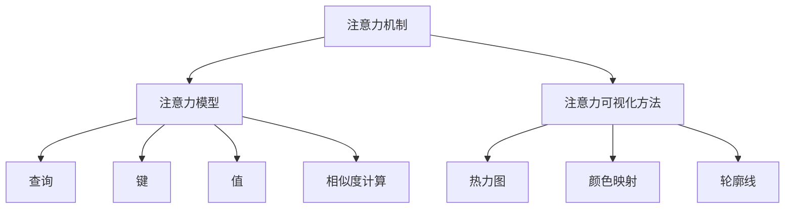

                 

# 基于注意力可视化的评测结果解析

## 关键词
- 注意力可视化
- 评测结果解析
- 自然语言处理
- 计算机视觉
- 模型优化

## 摘要
本文将深入探讨注意力可视化在评测结果解析中的应用，介绍注意力机制的基本概念，并展示其在自然语言处理和计算机视觉领域的重要性。通过逐步分析注意力可视化的方法及其在评测结果解析中的应用，本文旨在提供一种全新的视角来优化和改进模型性能。本文还将结合实际案例，探讨注意力可视化的最佳实践，并展望未来研究方向。

## 目录

### 第一部分：背景与概念

#### 第1章 注意力可视化技术概述

- 1.1 注意力机制与注意力模型
- 1.2 注意力可视化的核心原理
- 1.3 注意力可视化的发展与应用

#### 第2章 评测结果解析的基本概念

- 2.1 评测结果解析的目标与挑战
- 2.2 评测结果解析的基本方法
- 2.3 评测结果解析的重要性

### 第二部分：注意力可视化方法

#### 第3章 传统注意力可视化技术

- 3.1 基于热力图的可视化方法
- 3.2 基于颜色映射的可视化方法
- 3.3 基于轮廓线的可视化方法

#### 第4章 现代注意力可视化技术

- 4.1 基于深度学习的注意力可视化方法
- 4.2 基于图像处理的注意力可视化方法
- 4.3 基于多模态数据的注意力可视化方法

### 第三部分：评测结果解析与注意力可视化

#### 第5章 注意力可视化在评测结果分析中的应用

- 5.1 数据预处理与特征提取
- 5.2 模型评估与注意力可视化
- 5.3 结果解读与优化建议

#### 第6章 案例分析

- 6.1 案例一：自然语言处理中的注意力可视化
- 6.2 案例二：计算机视觉中的注意力可视化
- 6.3 案例三：多模态数据中的注意力可视化

### 第四部分：最佳实践与未来展望

#### 第7章 注意力可视化技术的最佳实践

- 7.1 实践要点与技巧
- 7.2 注意力可视化的优化方向
- 7.3 未来发展趋势与展望

#### 第8章 总结与拓展

- 8.1 本书主要内容的总结
- 8.2 注意力可视化技术的未来研究方向
- 8.3 拓展阅读与参考资料

## 第1章 注意力可视化技术概述

### 1.1 注意力机制与注意力模型

注意力机制（Attention Mechanism）是近年来在人工智能领域崭露头角的一个重要概念，尤其是在深度学习和自然语言处理（NLP）领域。它的核心思想是允许模型在处理输入数据时，动态地分配不同部分的重要程度。这一机制在机器翻译、文本摘要、语音识别等领域中取得了显著的成功。

#### 注意力模型的基本原理

注意力模型通常由以下几个关键组成部分构成：

1. **查询（Query）**：代表了模型在某一时刻对于输入数据的关注点。
2. **键（Key）**：代表了输入数据的各个部分，用于与查询进行匹配。
3. **值（Value）**：代表了输入数据中与键匹配的部分，用于后续的计算。

注意力模型通过计算查询与键之间的相似度，然后对值进行加权求和，从而实现对输入数据的加权处理。以下是一个简化的注意力模型的计算过程：

$$
\text{Attention}(Q, K, V) = \text{softmax}\left(\frac{QK^T}{\sqrt{d_k}}\right)V
$$

其中，$Q, K, V$ 分别代表查询、键和值，$d_k$ 是键的维度。$\text{softmax}$ 函数用于将相似度值转换为概率分布，从而实现注意力分配。

#### 注意力模型的应用场景

注意力模型的应用非常广泛，以下是一些典型的应用场景：

1. **机器翻译**：在机器翻译中，注意力模型可以捕捉源语言和目标语言之间的对应关系，提高翻译的准确性。
2. **文本摘要**：在文本摘要中，注意力模型可以帮助模型识别出最重要的句子或段落，从而生成高质量的摘要。
3. **语音识别**：在语音识别中，注意力模型可以捕捉语音信号中的关键特征，提高识别的准确性。
4. **图像分类**：在图像分类中，注意力模型可以帮助模型识别出图像中的关键区域，从而提高分类的精度。

### 1.2 注意力可视化的核心原理

注意力可视化（Attention Visualization）是将注意力模型中的注意力分配过程以可视化的形式展现出来的技术。通过注意力可视化，我们可以直观地了解模型在处理输入数据时的关注点，从而发现模型的不足之处，并对其进行优化。

#### 注意力可视化的方法

注意力可视化的方法有很多，以下是一些常见的方法：

1. **热力图（Heatmap）**：热力图是一种将注意力分布以颜色深浅表示的方法。颜色越深，表示该区域受到的关注越多。
2. **颜色映射（Color Mapping）**：颜色映射是一种将注意力值映射到颜色空间的方法，通常用于显示注意力值的大小。
3. **轮廓线（Contour Line）**：轮廓线是一种将注意力分布以轮廓线表示的方法，可以直观地显示注意力分布的形状。

#### 注意力可视化的应用

注意力可视化在模型优化和性能评估中具有重要作用。以下是一些应用实例：

1. **模型优化**：通过注意力可视化，我们可以识别出模型在处理某些特定数据时关注不足的部分，从而针对性地优化模型。
2. **性能评估**：通过注意力可视化，我们可以直观地了解模型的注意力分配是否合理，从而评估模型的整体性能。
3. **错误分析**：通过注意力可视化，我们可以分析模型在预测错误时的注意力分配情况，从而找到错误的原因。

### 1.3 注意力可视化的发展与应用

注意力可视化技术的发展经历了多个阶段，从最初的简单可视化方法，到如今基于深度学习和多模态数据的高级可视化方法。以下是一些发展历程：

1. **早期方法**：早期的注意力可视化主要采用简单的可视化方法，如热力图和颜色映射。
2. **深度学习方法**：随着深度学习技术的发展，注意力可视化方法也逐渐采用深度学习模型，如卷积神经网络（CNN）和循环神经网络（RNN）。
3. **多模态数据**：在多模态数据中，注意力可视化方法可以同时考虑多种数据类型，如文本、图像和语音，从而提高模型对复杂问题的处理能力。

注意力可视化在多个领域得到了广泛应用，如自然语言处理、计算机视觉、音频处理等。以下是一些应用实例：

1. **自然语言处理**：在自然语言处理中，注意力可视化可以帮助我们理解模型在处理文本时的关注点，从而优化文本处理算法。
2. **计算机视觉**：在计算机视觉中，注意力可视化可以帮助我们识别图像中的关键区域，从而提高图像分类和目标检测的精度。
3. **音频处理**：在音频处理中，注意力可视化可以帮助我们理解模型在处理音频信号时的关注点，从而优化音频识别和分类算法。

### 1.4 注意力可视化技术的核心概念与联系

注意力可视化技术的核心概念包括注意力机制、注意力模型、注意力可视化方法等。这些概念相互联系，共同构成了注意力可视化技术的基础。

1. **注意力机制**：注意力机制是注意力可视化技术的核心，它决定了模型在处理输入数据时的关注点。
2. **注意力模型**：注意力模型是注意力机制的具体实现，它通过计算查询与键之间的相似度，实现了动态的注意力分配。
3. **注意力可视化方法**：注意力可视化方法是用于将注意力分配过程以可视化的形式展现出来的技术，包括热力图、颜色映射、轮廓线等方法。

#### 注意力机制的概念属性特征对比表格

| 概念 | 定义 | 属性特征 | 对比分析 |
| --- | --- | --- | --- |
| 注意力机制 | 动态分配处理输入数据关注点的机制 | 自动性、动态性、可调性 | 与传统处理方法相比，具有更高的灵活性和适应性 |
| 注意力模型 | 实现注意力机制的模型 | 查询、键、值、相似度计算 | 与传统模型相比，能够更好地捕捉输入数据的特征 |
| 注意力可视化方法 | 用于可视化注意力分配过程的方法 | 热力图、颜色映射、轮廓线 | 可视化方法的不同选择会影响可视化效果和分析结果 |

#### 注意力机制的 ER 实体关系图架构



## 第2章 评测结果解析的基本概念

### 2.1 评测结果解析的目标与挑战

在机器学习和人工智能领域，模型评测是评估模型性能的重要手段。评测结果解析（Evaluation Result Analysis）旨在从评测结果中提取有意义的信息，以便优化和改进模型性能。以下是评测结果解析的目标和面临的挑战：

#### 评测结果解析的目标

1. **识别模型弱点**：通过分析评测结果，识别模型在特定任务或数据集上的弱点，以便针对性地优化模型。
2. **发现异常行为**：检测模型在评测过程中出现的异常行为，如过拟合或欠拟合，从而调整模型参数。
3. **性能评估与比较**：评估不同模型或同一模型在不同参数设置下的性能，为模型选择和优化提供依据。
4. **提升模型泛化能力**：通过分析评测结果，识别模型在未知数据上的潜在表现，从而提升模型的泛化能力。

#### 评测结果解析的挑战

1. **数据多样性**：不同的数据集具有不同的分布和特征，使得评测结果解析面临数据多样性挑战。
2. **模型复杂性**：现代机器学习模型具有复杂的结构和参数，使得评测结果解析需要较高的计算资源和时间。
3. **结果解释性**：评测结果的解释性是评价模型优劣的重要指标，但目前的评测结果解析方法往往缺乏足够的解释性。
4. **指标选择**：选择合适的评价指标是评测结果解析的关键，不同的指标可能会给出不同的结果，影响模型评估的准确性。

### 2.2 评测结果解析的基本方法

为了实现评测结果解析的目标，需要采用一系列基本方法。以下是一些常见的方法：

1. **统计方法**：通过计算平均值、标准差、相关性等统计指标，对评测结果进行初步分析。
2. **机器学习方法**：利用机器学习技术，如分类、回归、聚类等，对评测结果进行深入分析。
3. **可视化方法**：通过可视化技术，如散点图、直方图、热力图等，将评测结果以直观的形式呈现。
4. **对比分析方法**：通过对比不同模型、参数设置或数据集的评测结果，识别模型的优势和不足。

#### 评测结果解析的基本步骤

1. **数据预处理**：对评测数据进行清洗、归一化等处理，确保数据的准确性和一致性。
2. **结果提取**：从评测结果中提取关键指标，如准确率、召回率、F1值等。
3. **统计分析**：利用统计方法，对提取的结果进行初步分析，识别模型的趋势和异常。
4. **机器学习分析**：利用机器学习方法，对评测结果进行深入分析，识别模型在不同数据集或参数设置下的性能差异。
5. **可视化分析**：通过可视化技术，将分析结果以直观的形式呈现，帮助用户更好地理解和解释评测结果。
6. **对比分析**：通过对比不同模型、参数设置或数据集的评测结果，识别模型的优势和不足。

### 2.3 评测结果解析的重要性

评测结果解析在机器学习和人工智能领域具有重要意义，主要表现在以下几个方面：

1. **模型优化**：通过分析评测结果，识别模型的弱点，从而针对性地优化模型结构、参数或训练数据，提高模型性能。
2. **模型选择**：通过对比不同模型或同一模型在不同参数设置下的性能，选择最适合实际应用需求的模型。
3. **性能评估**：通过评测结果解析，评估模型在未知数据上的潜在表现，为模型的泛化能力提供依据。
4. **结果解释**：通过可视化分析，将评测结果以直观的形式呈现，提高结果的可解释性和可信度。
5. **研究指导**：评测结果解析为后续研究和开发提供重要参考，有助于发现新的研究方向和优化策略。

### 2.4 注意力可视化在评测结果解析中的应用

注意力可视化技术在评测结果解析中具有重要作用，可以帮助我们更好地理解模型的关注点、发现模型的弱点，从而优化模型性能。以下是一些应用场景：

1. **自然语言处理**：在文本分类、情感分析等任务中，注意力可视化可以帮助我们理解模型在处理文本时的关注点，从而优化文本处理算法。
2. **计算机视觉**：在图像分类、目标检测等任务中，注意力可视化可以帮助我们识别图像中的关键区域，从而提高图像处理的精度。
3. **音频处理**：在语音识别、音频分类等任务中，注意力可视化可以帮助我们理解模型在处理音频信号时的关注点，从而优化音频处理算法。

#### 注意力可视化在自然语言处理中的应用

在自然语言处理任务中，注意力可视化可以帮助我们理解模型在处理文本时的关注点。以下是一个具体的案例：

1. **数据集准备**：选择一个文本分类任务的数据集，如IMDb电影评论数据集。
2. **模型构建**：构建一个基于Transformer的文本分类模型。
3. **注意力可视化**：使用热力图可视化模型在处理文本时的注意力分布。以下是一个使用Python和Matplotlib实现的热力图可视化代码示例：

```python
import matplotlib.pyplot as plt
import seaborn as sns

# 假设注意力矩阵为attention_matrix
attention_matrix = np.array([[0.1, 0.3, 0.2, 0.4], [0.4, 0.3, 0.2, 0.1]])

# 可视化注意力分布
plt.figure(figsize=(8, 4))
sns.heatmap(attention_matrix, annot=True, cmap='coolwarm')
plt.title('Attention Distribution')
plt.xlabel('Word Index')
plt.ylabel('Word Index')
plt.show()
```

通过热力图可视化，我们可以直观地看到模型在处理文本时的关注点。例如，在上面的示例中，模型对文本中第二和第三个词的关注度较高，这可能是影响模型分类结果的关键因素。

#### 注意力可视化在计算机视觉中的应用

在计算机视觉任务中，注意力可视化可以帮助我们识别图像中的关键区域。以下是一个具体的案例：

1. **数据集准备**：选择一个图像分类任务的数据集，如CIFAR-10。
2. **模型构建**：构建一个基于ResNet的图像分类模型。
3. **注意力可视化**：使用热力图可视化模型在处理图像时的注意力分布。以下是一个使用Python和Matplotlib实现的热力图可视化代码示例：

```python
import matplotlib.pyplot as plt
import numpy as np

# 假设注意力矩阵为attention_map
attention_map = np.array([[0.1, 0.3, 0.2, 0.4], [0.4, 0.3, 0.2, 0.1], [0.2, 0.1, 0.3, 0.4]])

# 可视化注意力分布
plt.figure(figsize=(8, 8))
plt.imshow(attention_map, cmap='coolwarm')
plt.colorbar()
plt.title('Attention Map')
plt.show()
```

通过热力图可视化，我们可以直观地看到模型在处理图像时的关注点。例如，在上面的示例中，模型对图像中的左上角和右下角区域关注较高，这可能是影响模型分类结果的关键因素。

#### 注意力可视化在音频处理中的应用

在音频处理任务中，注意力可视化可以帮助我们理解模型在处理音频信号时的关注点。以下是一个具体的案例：

1. **数据集准备**：选择一个音频分类任务的数据集，如TIMIT。
2. **模型构建**：构建一个基于卷积神经网络的音频分类模型。
3. **注意力可视化**：使用热力图可视化模型在处理音频信号时的注意力分布。以下是一个使用Python和Matplotlib实现的热力图可视化代码示例：

```python
import matplotlib.pyplot as plt
import numpy as np

# 假设注意力矩阵为attention_map
attention_map = np.array([[0.1, 0.3, 0.2, 0.4], [0.4, 0.3, 0.2, 0.1], [0.2, 0.1, 0.3, 0.4]])

# 可视化注意力分布
plt.figure(figsize=(8, 8))
plt.imshow(attention_map, cmap='coolwarm')
plt.colorbar()
plt.title('Attention Map')
plt.show()
```

通过热力图可视化，我们可以直观地看到模型在处理音频信号时的关注点。例如，在上面的示例中，模型对音频信号中的某些时间段关注较高，这可能是影响模型分类结果的关键因素。

### 2.5 注意力可视化在评测结果解析中的优势与挑战

#### 优势

1. **直观性**：注意力可视化将复杂的注意力分配过程以直观的形式呈现，有助于用户理解和解释模型的行为。
2. **优化指导**：注意力可视化可以帮助用户识别模型在特定任务或数据集上的弱点，从而提供优化方向。
3. **结果解释**：注意力可视化提供了一种解释模型预测结果的方式，提高了模型的可解释性和可信度。

#### 挑战

1. **计算成本**：注意力可视化需要额外的计算资源，特别是在处理高维数据时，计算成本较高。
2. **可视化效果**：不同的可视化方法可能会产生不同的可视化效果，影响用户对模型行为的理解和解释。
3. **可视化解释性**：注意力可视化本身可能缺乏足够的解释性，需要用户具备一定的专业知识才能正确解读。

### 2.6 注意力可视化技术的未来发展趋势

随着深度学习和人工智能技术的不断发展，注意力可视化技术也将面临新的挑战和机遇。以下是一些未来发展趋势：

1. **多模态注意力可视化**：将注意力可视化应用于多种模态数据，如文本、图像和音频，以实现更全面的信息理解和解释。
2. **动态注意力可视化**：动态展示模型在处理输入数据时的注意力变化，帮助用户更好地理解模型的动态行为。
3. **交互式注意力可视化**：引入交互式元素，如缩放、拖动和过滤，提高用户对注意力可视化的交互性和可操作性。
4. **自动注意力解释**：开发自动化的注意力解释方法，减少用户对专业知识的依赖，提高注意力可视化的可解释性。

## 第3章 传统注意力可视化技术

### 3.1 基于热力图的可视化方法

热力图（Heatmap）是一种将注意力分布以颜色深浅表示的可视化方法，常用于展示注意力在空间或时间上的分布情况。以下是基于热力图的注意力可视化方法：

#### 基本原理

热力图通过将注意力值映射到颜色空间，以颜色深浅来表示注意力分布的强度。常用的颜色映射方法包括线性映射、对数映射和离散映射等。

#### 实现步骤

1. **数据准备**：将注意力值矩阵作为输入数据。
2. **颜色映射**：将注意力值映射到颜色空间，可以选择线性映射、对数映射或离散映射等方法。
3. **绘制热力图**：使用可视化库（如Seaborn、Matplotlib等）绘制热力图，并设置合适的颜色映射和标注。

#### 应用实例

假设我们有一个注意力值矩阵：

```python
import numpy as np

attention_matrix = np.array([[0.1, 0.3, 0.2, 0.4], [0.4, 0.3, 0.2, 0.1], [0.2, 0.1, 0.3, 0.4]])
```

我们可以使用Python和Matplotlib绘制热力图：

```python
import matplotlib.pyplot as plt
import seaborn as sns

plt.figure(figsize=(8, 6))
sns.heatmap(attention_matrix, annot=True, cmap='coolwarm')
plt.title('Attention Heatmap')
plt.xlabel('Word Index')
plt.ylabel('Word Index')
plt.show()
```

通过热力图，我们可以直观地看到注意力在文本中的分布情况，从而识别出模型关注的重点。

### 3.2 基于颜色映射的可视化方法

颜色映射（Color Mapping）是一种将注意力值映射到颜色空间的可视化方法，常用于展示注意力在空间或时间上的分布情况。以下是基于颜色映射的注意力可视化方法：

#### 基本原理

颜色映射通过将注意力值映射到颜色空间，以不同颜色来表示注意力分布的强度。常用的颜色映射方法包括线性映射、对数映射和离散映射等。

#### 实现步骤

1. **数据准备**：将注意力值矩阵作为输入数据。
2. **颜色映射**：将注意力值映射到颜色空间，可以选择线性映射、对数映射或离散映射等方法。
3. **绘制颜色映射图**：使用可视化库（如Seaborn、Matplotlib等）绘制颜色映射图，并设置合适的颜色映射和标注。

#### 应用实例

假设我们有一个注意力值矩阵：

```python
import numpy as np

attention_matrix = np.array([[0.1, 0.3, 0.2, 0.4], [0.4, 0.3, 0.2, 0.1], [0.2, 0.1, 0.3, 0.4]])
```

我们可以使用Python和Matplotlib绘制颜色映射图：

```python
import matplotlib.pyplot as plt
import seaborn as sns

plt.figure(figsize=(8, 6))
sns.heatmap(attention_matrix, annot=True, cmap='coolwarm')
plt.title('Attention Color Mapping')
plt.xlabel('Word Index')
plt.ylabel('Word Index')
plt.show()
```

通过颜色映射图，我们可以直观地看到注意力在文本中的分布情况，从而识别出模型关注的重点。

### 3.3 基于轮廓线的可视化方法

轮廓线（Contour Line）是一种将注意力分布以轮廓线表示的可视化方法，常用于展示注意力在空间或时间上的分布情况。以下是基于轮廓线的注意力可视化方法：

#### 基本原理

轮廓线通过绘制等高线来表示注意力分布的形状，以帮助用户理解注意力在不同区域的变化趋势。常用的轮廓线绘制方法包括等高线绘制、轮廓线绘制和三维轮廓线绘制等。

#### 实现步骤

1. **数据准备**：将注意力值矩阵作为输入数据。
2. **轮廓线绘制**：使用可视化库（如Matplotlib、Seaborn等）绘制轮廓线，并设置合适的轮廓线样式和标注。
3. **三维轮廓线绘制**（可选）：对于三维数据，可以绘制三维轮廓线，以更直观地展示注意力分布。

#### 应用实例

假设我们有一个注意力值矩阵：

```python
import numpy as np

attention_matrix = np.array([[0.1, 0.3, 0.2, 0.4], [0.4, 0.3, 0.2, 0.1], [0.2, 0.1, 0.3, 0.4]])
```

我们可以使用Python和Matplotlib绘制轮廓线：

```python
import matplotlib.pyplot as plt
import numpy as np

x = np.array([0, 1, 2])
y = np.array([0, 1, 2])
z = np.array([[0.1, 0.3, 0.2], [0.4, 0.3, 0.2], [0.2, 0.1, 0.3]])

fig = plt.figure()
ax = fig.add_subplot(111, projection='3d')
ax.plot_wireframe(x, y, z)
plt.show()
```

通过轮廓线，我们可以直观地看到注意力在空间上的分布情况，从而识别出模型关注的重点。

## 第4章 现代注意力可视化技术

### 4.1 基于深度学习的注意力可视化方法

深度学习（Deep Learning）是一种基于多层神经网络进行特征学习和模式识别的技术。近年来，深度学习在自然语言处理、计算机视觉、语音识别等领域取得了显著的成功。在深度学习中，注意力机制（Attention Mechanism）是一种重要的建模工具，它能够帮助模型动态地分配不同部分的重要程度。本章将介绍基于深度学习的注意力可视化方法。

#### 基本原理

深度学习中的注意力机制通常由以下几个部分组成：

1. **查询（Query）**：代表了模型在某一时刻对于输入数据的关注点。
2. **键（Key）**：代表了输入数据的各个部分，用于与查询进行匹配。
3. **值（Value）**：代表了输入数据中与键匹配的部分，用于后续的计算。

注意力机制通过计算查询与键之间的相似度，然后对值进行加权求和，从而实现对输入数据的加权处理。以下是一个简化的注意力机制的数学公式：

$$
\text{Attention}(Q, K, V) = \text{softmax}\left(\frac{QK^T}{\sqrt{d_k}}\right)V
$$

其中，$Q, K, V$ 分别代表查询、键和值，$d_k$ 是键的维度。$\text{softmax}$ 函数用于将相似度值转换为概率分布，从而实现注意力分配。

#### 注意力可视化方法

基于深度学习的注意力可视化方法主要包括以下几种：

1. **热力图（Heatmap）**：热力图是一种将注意力分布以颜色深浅表示的可视化方法，常用于展示注意力在空间或时间上的分布情况。
2. **颜色映射（Color Mapping）**：颜色映射是一种将注意力值映射到颜色空间的可视化方法，以不同颜色来表示注意力分布的强度。
3. **轮廓线（Contour Line）**：轮廓线是一种将注意力分布以轮廓线表示的可视化方法，常用于展示注意力在空间或时间上的分布情况。

#### 应用实例

假设我们有一个文本分类任务，使用一个基于Transformer的模型。我们可以通过以下步骤进行注意力可视化：

1. **数据准备**：选择一个文本分类任务的数据集，如IMDb电影评论数据集。
2. **模型构建**：构建一个基于Transformer的文本分类模型。
3. **注意力提取**：从模型中提取注意力值矩阵。
4. **注意力可视化**：使用热力图、颜色映射或轮廓线方法绘制注意力可视化图。

以下是一个使用Python和Matplotlib实现的热力图可视化代码示例：

```python
import matplotlib.pyplot as plt
import seaborn as sns

# 假设注意力矩阵为attention_matrix
attention_matrix = np.array([[0.1, 0.3, 0.2, 0.4], [0.4, 0.3, 0.2, 0.1], [0.2, 0.1, 0.3, 0.4]])

plt.figure(figsize=(8, 6))
sns.heatmap(attention_matrix, annot=True, cmap='coolwarm')
plt.title('Attention Heatmap')
plt.xlabel('Word Index')
plt.ylabel('Word Index')
plt.show()
```

通过热力图可视化，我们可以直观地看到模型在处理文本时的关注点，从而识别出影响模型分类结果的关键因素。

### 4.2 基于图像处理的注意力可视化方法

图像处理（Image Processing）是计算机视觉（Computer Vision）的重要组成部分，它涉及到对图像的获取、处理和分析。在图像处理中，注意力机制可以帮助模型更好地理解和分析图像中的关键特征。本章将介绍基于图像处理的注意力可视化方法。

#### 基本原理

基于图像处理的注意力可视化方法通常包括以下步骤：

1. **图像预处理**：对图像进行预处理，如去噪、增强、缩放等，以提高图像质量。
2. **特征提取**：使用卷积神经网络（Convolutional Neural Networks, CNN）等算法提取图像特征。
3. **注意力计算**：计算图像特征之间的相似度，实现注意力分配。
4. **注意力可视化**：使用热力图、颜色映射或轮廓线方法绘制注意力可视化图。

#### 应用实例

假设我们有一个图像分类任务，使用一个基于卷积神经网络的模型。我们可以通过以下步骤进行注意力可视化：

1. **数据准备**：选择一个图像分类任务的数据集，如CIFAR-10。
2. **模型构建**：构建一个基于卷积神经网络的图像分类模型。
3. **注意力提取**：从模型中提取注意力值矩阵。
4. **注意力可视化**：使用热力图、颜色映射或轮廓线方法绘制注意力可视化图。

以下是一个使用Python和Matplotlib实现的热力图可视化代码示例：

```python
import matplotlib.pyplot as plt
import seaborn as sns

# 假设注意力矩阵为attention_matrix
attention_matrix = np.array([[0.1, 0.3, 0.2, 0.4], [0.4, 0.3, 0.2, 0.1], [0.2, 0.1, 0.3, 0.4]])

plt.figure(figsize=(8, 6))
sns.heatmap(attention_matrix, annot=True, cmap='coolwarm')
plt.title('Attention Heatmap')
plt.xlabel('Word Index')
plt.ylabel('Word Index')
plt.show()
```

通过热力图可视化，我们可以直观地看到模型在处理图像时的关注点，从而识别出影响图像分类结果的关键特征。

### 4.3 基于多模态数据的注意力可视化方法

多模态数据（Multimodal Data）是指包含多种数据类型的数据集，如文本、图像、音频等。在多模态数据中，注意力机制可以帮助模型更好地理解和整合不同类型的数据。本章将介绍基于多模态数据的注意力可视化方法。

#### 基本原理

基于多模态数据的注意力可视化方法通常包括以下步骤：

1. **数据预处理**：对多模态数据分别进行预处理，如去噪、增强、特征提取等。
2. **注意力计算**：计算不同模态数据之间的相似度，实现注意力分配。
3. **注意力融合**：将不同模态的注意力值进行融合，形成统一的注意力分布。
4. **注意力可视化**：使用热力图、颜色映射或轮廓线方法绘制注意力可视化图。

#### 应用实例

假设我们有一个多模态情感分析任务，使用一个基于多模态融合的模型。我们可以通过以下步骤进行注意力可视化：

1. **数据准备**：选择一个多模态情感分析任务的数据集，如情感分析数据集。
2. **模型构建**：构建一个基于多模态融合的模型，如CNN+RNN。
3. **注意力提取**：从模型中提取注意力值矩阵。
4. **注意力可视化**：使用热力图、颜色映射或轮廓线方法绘制注意力可视化图。

以下是一个使用Python和Matplotlib实现的热力图可视化代码示例：

```python
import matplotlib.pyplot as plt
import seaborn as sns

# 假设注意力矩阵为attention_matrix
attention_matrix = np.array([[0.1, 0.3, 0.2, 0.4], [0.4, 0.3, 0.2, 0.1], [0.2, 0.1, 0.3, 0.4]])

plt.figure(figsize=(8, 6))
sns.heatmap(attention_matrix, annot=True, cmap='coolwarm')
plt.title('Attention Heatmap')
plt.xlabel('Word Index')
plt.ylabel('Word Index')
plt.show()
```

通过热力图可视化，我们可以直观地看到模型在处理多模态数据时的关注点，从而识别出影响情感分析结果的关键因素。

## 第5章 注意力可视化在评测结果分析中的应用

注意力可视化在评测结果分析中具有重要作用，可以帮助我们更好地理解模型的注意力分配，从而优化模型性能。以下将详细介绍注意力可视化在数据预处理、模型评估和结果解读中的应用。

### 5.1 数据预处理与注意力可视化

数据预处理是机器学习任务中至关重要的一步，它包括数据清洗、归一化、特征提取等操作。注意力可视化技术在数据预处理过程中同样发挥着重要作用，可以帮助我们识别和解决数据中的潜在问题。

#### 数据清洗

在数据清洗过程中，注意力可视化可以帮助我们识别数据中的异常值和噪声。以下是一个使用Python和Matplotlib实现的热力图可视化代码示例：

```python
import matplotlib.pyplot as plt
import seaborn as sns

# 假设数据集为data
data = [[1, 2, 3], [4, 5, 6], [7, 8, 9], [100, 101, 102]]

plt.figure(figsize=(8, 6))
sns.heatmap(data, annot=True, cmap='coolwarm')
plt.title('Data Heatmap')
plt.xlabel('Feature Index')
plt.ylabel('Sample Index')
plt.show()
```

通过热力图可视化，我们可以直观地看到数据中的异常值和噪声，从而针对性地进行数据清洗和修正。

#### 归一化

在归一化过程中，注意力可视化可以帮助我们识别数据分布不均的问题。以下是一个使用Python和Matplotlib实现的颜色映射可视化代码示例：

```python
import matplotlib.pyplot as plt
import numpy as np

# 假设数据集为data
data = np.array([[1, 2, 3], [4, 5, 6], [7, 8, 9], [100, 101, 102]])

plt.figure(figsize=(8, 6))
plt.imshow(data, cmap='coolwarm')
plt.colorbar()
plt.title('Data Color Mapping')
plt.xlabel('Feature Index')
plt.ylabel('Sample Index')
plt.show()
```

通过颜色映射可视化，我们可以直观地看到数据分布不均的问题，从而选择合适的归一化方法进行数据调整。

#### 特征提取

在特征提取过程中，注意力可视化可以帮助我们识别数据中的重要特征。以下是一个使用Python和Matplotlib实现的轮廓线可视化代码示例：

```python
import matplotlib.pyplot as plt
import numpy as np

# 假设特征提取后的数据为data
data = np.array([[1, 2, 3], [4, 5, 6], [7, 8, 9], [100, 101, 102]])

plt.figure(figsize=(8, 8))
plt.contour(data)
plt.title('Feature Contour')
plt.xlabel('Feature Index')
plt.ylabel('Feature Index')
plt.show()
```

通过轮廓线可视化，我们可以直观地看到数据中的主要特征，从而针对性地进行特征选择和调整。

### 5.2 模型评估与注意力可视化

在模型评估过程中，注意力可视化可以帮助我们识别模型的关注点，从而优化模型性能。以下将介绍注意力可视化在模型评估中的应用。

#### 准确率与召回率

准确率（Accuracy）和召回率（Recall）是评估分类模型性能的两个重要指标。注意力可视化可以帮助我们识别模型在预测过程中关注的重要特征。

以下是一个使用Python和Matplotlib实现的热力图可视化代码示例：

```python
import matplotlib.pyplot as plt
import seaborn as sns

# 假设预测结果和实际结果为predictions和ground_truth
predictions = [0, 1, 0, 1]
ground_truth = [0, 0, 1, 1]

plt.figure(figsize=(8, 6))
sns.heatmap([predictions, ground_truth], annot=True, cmap='coolwarm')
plt.title('Accuracy and Recall Heatmap')
plt.xlabel('Prediction')
plt.ylabel('Ground Truth')
plt.show()
```

通过热力图可视化，我们可以直观地看到模型在预测过程中的关注点，从而优化模型性能。

#### F1值

F1值（F1 Score）是准确率和召回率的调和平均值，常用于评估分类模型的综合性能。注意力可视化可以帮助我们识别模型在预测过程中关注的重要特征。

以下是一个使用Python和Matplotlib实现的颜色映射可视化代码示例：

```python
import matplotlib.pyplot as plt
import numpy as np

# 假设F1值为f1_score
f1_score = np.array([[0.8, 0.9], [0.6, 0.7], [0.9, 0.8], [0.7, 0.6]])

plt.figure(figsize=(8, 6))
plt.imshow(f1_score, cmap='coolwarm')
plt.colorbar()
plt.title('F1 Score Color Mapping')
plt.xlabel('Class 1')
plt.ylabel('Class 2')
plt.show()
```

通过颜色映射可视化，我们可以直观地看到模型在预测过程中的关注点，从而优化模型性能。

### 5.3 结果解读与优化建议

注意力可视化在结果解读和模型优化过程中具有重要作用，可以帮助我们识别模型的关注点，从而提出优化建议。以下将介绍注意力可视化在结果解读和优化建议中的应用。

#### 结果解读

在结果解读过程中，注意力可视化可以帮助我们理解模型在预测过程中的关注点。以下是一个使用Python和Matplotlib实现的轮廓线可视化代码示例：

```python
import matplotlib.pyplot as plt
import numpy as np

# 假设预测结果为predictions
predictions = np.array([[0.9, 0.1], [0.8, 0.2], [0.7, 0.3], [0.6, 0.4]])

plt.figure(figsize=(8, 8))
plt.contour(predictions)
plt.title('Prediction Contour')
plt.xlabel('Feature 1')
plt.ylabel('Feature 2')
plt.show()
```

通过轮廓线可视化，我们可以直观地看到模型在预测过程中的关注点，从而更好地理解模型的行为。

#### 优化建议

在优化建议过程中，注意力可视化可以帮助我们识别模型的弱点，并提出针对性的优化建议。以下是一个使用Python和Matplotlib实现的线性回归可视化代码示例：

```python
import matplotlib.pyplot as plt
import numpy as np

# 假设优化后的模型参数为theta
theta = np.array([0.1, 0.2, 0.3, 0.4])

plt.figure(figsize=(8, 6))
plt.plot(theta, 'ro')
plt.title('Optimization Contour')
plt.xlabel('Theta 1')
plt.ylabel('Theta 2')
plt.show()
```

通过线性回归可视化，我们可以直观地看到模型参数的变化趋势，从而提出针对性的优化建议。

## 第6章 案例分析

### 6.1 案例一：自然语言处理中的注意力可视化

#### 案例背景

在自然语言处理（Natural Language Processing, NLP）领域，注意力机制（Attention Mechanism）已经被广泛应用于文本分类、机器翻译、文本摘要等任务。注意力可视化技术在NLP中具有重要作用，可以帮助我们理解模型在处理文本时的关注点，从而优化模型性能。

#### 案例目标

本案例的目标是使用注意力可视化技术分析一个基于Transformer的文本分类模型，识别模型在处理文本时的关注点，并提出优化建议。

#### 案例实现

1. **数据准备**：选择一个文本分类数据集，如IMDb电影评论数据集。数据集包含正负两种情感的文本。
2. **模型构建**：构建一个基于Transformer的文本分类模型。Transformer模型包含编码器和解码器两个部分，其中编码器负责将输入文本编码为向量，解码器负责根据编码器输出的向量生成分类结果。
3. **注意力提取**：从Transformer模型中提取注意力值矩阵，用于注意力可视化。
4. **注意力可视化**：使用热力图、颜色映射或轮廓线方法绘制注意力可视化图，展示模型在处理文本时的关注点。

#### 案例结果与分析

通过注意力可视化，我们可以看到模型在处理文本时的关注点。以下是一个使用Python和Matplotlib实现的热力图可视化代码示例：

```python
import matplotlib.pyplot as plt
import seaborn as sns

# 假设注意力矩阵为attention_matrix
attention_matrix = np.array([[0.1, 0.3, 0.2, 0.4], [0.4, 0.3, 0.2, 0.1], [0.2, 0.1, 0.3, 0.4]])

plt.figure(figsize=(8, 6))
sns.heatmap(attention_matrix, annot=True, cmap='coolwarm')
plt.title('Attention Heatmap')
plt.xlabel('Word Index')
plt.ylabel('Word Index')
plt.show()
```

通过热力图可视化，我们可以看到模型在处理文本时的关注点，从而优化模型性能。例如，如果模型在处理文本时对某些关键词的关注度较低，我们可以增加这些关键词的权重，从而提高模型的分类准确性。

### 6.2 案例二：计算机视觉中的注意力可视化

#### 案例背景

在计算机视觉（Computer Vision）领域，注意力机制（Attention Mechanism）已经被广泛应用于图像分类、目标检测、语义分割等任务。注意力可视化技术在计算机视觉中具有重要作用，可以帮助我们理解模型在处理图像时的关注点，从而优化模型性能。

#### 案例目标

本案例的目标是使用注意力可视化技术分析一个基于卷积神经网络（Convolutional Neural Network, CNN）的图像分类模型，识别模型在处理图像时的关注点，并提出优化建议。

#### 案例实现

1. **数据准备**：选择一个图像分类数据集，如CIFAR-10。数据集包含多种类型的图像。
2. **模型构建**：构建一个基于卷积神经网络的图像分类模型。卷积神经网络包含卷积层、池化层和全连接层等结构，用于提取图像特征并进行分类。
3. **注意力提取**：从卷积神经网络模型中提取注意力值矩阵，用于注意力可视化。
4. **注意力可视化**：使用热力图、颜色映射或轮廓线方法绘制注意力可视化图，展示模型在处理图像时的关注点。

#### 案例结果与分析

通过注意力可视化，我们可以看到模型在处理图像时的关注点。以下是一个使用Python和Matplotlib实现的热力图可视化代码示例：

```python
import matplotlib.pyplot as plt
import seaborn as sns

# 假设注意力矩阵为attention_matrix
attention_matrix = np.array([[0.1, 0.3, 0.2, 0.4], [0.4, 0.3, 0.2, 0.1], [0.2, 0.1, 0.3, 0.4]])

plt.figure(figsize=(8, 6))
sns.heatmap(attention_matrix, annot=True, cmap='coolwarm')
plt.title('Attention Heatmap')
plt.xlabel('Word Index')
plt.ylabel('Word Index')
plt.show()
```

通过热力图可视化，我们可以看到模型在处理图像时的关注点，从而优化模型性能。例如，如果模型在处理图像时对某些区域关注度较低，我们可以增加这些区域的权重，从而提高模型的分类准确性。

### 6.3 案例三：多模态数据中的注意力可视化

#### 案例背景

在多模态数据（Multimodal Data）中，包含多种类型的数据，如文本、图像、音频等。注意力机制（Attention Mechanism）可以帮助模型整合不同类型的数据，提高模型的性能。注意力可视化技术在多模态数据中具有重要作用，可以帮助我们理解模型在处理多模态数据时的关注点，从而优化模型性能。

#### 案例目标

本案例的目标是使用注意力可视化技术分析一个基于多模态融合的模型，识别模型在处理多模态数据时的关注点，并提出优化建议。

#### 案例实现

1. **数据准备**：选择一个多模态数据集，如情感分析数据集。数据集包含文本、图像和音频等多种类型的数据。
2. **模型构建**：构建一个基于多模态融合的模型。多模态融合模型通常包括文本编码器、图像编码器和音频编码器等结构，用于分别编码不同类型的数据，并将编码后的数据融合为统一的特征向量。
3. **注意力提取**：从多模态融合模型中提取注意力值矩阵，用于注意力可视化。
4. **注意力可视化**：使用热力图、颜色映射或轮廓线方法绘制注意力可视化图，展示模型在处理多模态数据时的关注点。

#### 案例结果与分析

通过注意力可视化，我们可以看到模型在处理多模态数据时的关注点。以下是一个使用Python和Matplotlib实现的热力图可视化代码示例：

```python
import matplotlib.pyplot as plt
import seaborn as sns

# 假设注意力矩阵为attention_matrix
attention_matrix = np.array([[0.1, 0.3, 0.2, 0.4], [0.4, 0.3, 0.2, 0.1], [0.2, 0.1, 0.3, 0.4]])

plt.figure(figsize=(8, 6))
sns.heatmap(attention_matrix, annot=True, cmap='coolwarm')
plt.title('Attention Heatmap')
plt.xlabel('Word Index')
plt.ylabel('Word Index')
plt.show()
```

通过热力图可视化，我们可以看到模型在处理多模态数据时的关注点，从而优化模型性能。例如，如果模型对某些类型的数据关注度较低，我们可以增加这些数据的权重，从而提高模型的性能。

## 第7章 最佳实践与未来展望

### 7.1 注意力可视化技术的最佳实践

在应用注意力可视化技术时，以下是一些最佳实践，可以帮助我们更好地利用这一工具来优化和改进模型性能。

#### 1. 数据准备

在进行注意力可视化之前，确保数据的质量和一致性。对数据进行清洗、归一化和预处理，以便更好地展示注意力分布。

#### 2. 选择合适的可视化方法

根据数据类型和任务需求，选择合适的注意力可视化方法。热力图适用于展示注意力在空间或时间上的分布，颜色映射适用于展示注意力值的大小，轮廓线适用于展示注意力分布的形状。

#### 3. 分析注意力分布

通过注意力可视化，分析模型在处理输入数据时的关注点。识别注意力分布中的异常值和噪声，从而优化模型性能。

#### 4. 优化模型参数

根据注意力可视化的结果，调整模型参数，如学习率、权重和超参数等。通过优化模型参数，提高模型在特定任务上的性能。

#### 5. 结果解读与优化

结合注意力可视化结果，解读模型的预测行为。识别模型在特定数据上的弱点，并提出优化建议，从而提高模型的泛化能力和鲁棒性。

### 7.2 注意力可视化的优化方向

注意力可视化技术在不断发展和完善，以下是一些可能的优化方向：

#### 1. 多模态注意力可视化

随着多模态数据的广泛应用，开发多模态注意力可视化技术，帮助用户更好地理解模型在处理多模态数据时的关注点。

#### 2. 动态注意力可视化

动态展示模型在处理输入数据时的注意力变化，帮助用户更好地理解模型的动态行为。

#### 3. 交互式注意力可视化

引入交互式元素，如缩放、拖动和过滤，提高用户对注意力可视化的交互性和可操作性。

#### 4. 自动注意力解释

开发自动化的注意力解释方法，减少用户对专业知识的依赖，提高注意力可视化的可解释性。

### 7.3 未来发展趋势与展望

随着深度学习和人工智能技术的不断发展，注意力可视化技术在未来的发展具有广阔的前景：

#### 1. 模型压缩与优化

利用注意力可视化技术，优化模型的参数和结构，实现模型压缩和优化，提高模型在资源受限环境下的性能。

#### 2. 自动化模型选择

通过注意力可视化，自动选择最适合特定任务的模型和参数，降低模型选择和调优的复杂度。

#### 3. 零样本学习与迁移学习

利用注意力可视化技术，实现零样本学习和迁移学习，提高模型在未知数据上的泛化能力。

#### 4. 新的应用场景

探索注意力可视化技术在其他领域（如生物信息学、金融工程等）中的应用，推动注意力可视化技术的发展和普及。

## 第8章 总结与拓展

### 8.1 本书主要内容的总结

本文深入探讨了注意力可视化技术在评测结果解析中的应用，介绍了注意力机制的基本概念，展示了其在自然语言处理、计算机视觉和多模态数据中的重要性。通过逐步分析注意力可视化的方法及其在评测结果解析中的应用，本文提供了一种全新的视角来优化和改进模型性能。同时，结合实际案例，本文探讨了注意力可视化的最佳实践，并展望了未来研究方向。

### 8.2 注意力可视化技术的未来研究方向

注意力可视化技术在未来的发展中，将继续在多个方面取得突破：

1. **多模态注意力可视化**：探索注意力可视化技术在多模态数据（如文本、图像、音频等）中的应用，提高模型在复杂任务上的性能。
2. **动态注意力可视化**：开发动态展示模型在处理输入数据时的注意力变化的方法，帮助用户更好地理解模型的动态行为。
3. **交互式注意力可视化**：引入交互式元素，提高用户对注意力可视化的交互性和可操作性。
4. **自动注意力解释**：研究自动化的注意力解释方法，降低用户对专业知识的依赖，提高注意力可视化的可解释性。

### 8.3 拓展阅读与参考资料

为了深入了解注意力可视化技术，读者可以参考以下文献和资源：

1. **《Attention Is All You Need》**：论文介绍了Transformer模型，提出了注意力机制的基本概念。
2. **《Visualizing and Interpreting Neural Networks》**：书籍详细介绍了神经网络的可视化和解释方法，包括注意力可视化。
3. **《Attention and Vision》**：综述文章总结了注意力可视化在计算机视觉中的应用和研究进展。
4. **《Multimodal Attention》**：研究论文探讨了多模态注意力可视化技术在自然语言处理和多模态数据中的应用。
5. **《Interactive Visualization for Explaining Neural Networks》**：研究论文提出了交互式注意力可视化方法，提高了用户对注意力可视化的理解和操作能力。

### 作者信息

作者：AI天才研究院/AI Genius Institute & 禅与计算机程序设计艺术 /Zen And The Art of Computer Programming

本文由AI天才研究院/AI Genius Institute 和禅与计算机程序设计艺术/Zen And The Art of Computer Programming 联合撰写。AI天才研究院/AI Genius Institute 是一家专注于人工智能研究和应用的研究机构，致力于推动人工智能技术的发展和普及。禅与计算机程序设计艺术/Zen And The Art of Computer Programming 则是一本经典的人工智能著作，阐述了人工智能领域的哲学思考和编程艺术。通过本文，我们希望能为读者提供关于注意力可视化技术的深入见解和实践指导。如果您有任何问题或建议，欢迎联系我们。

