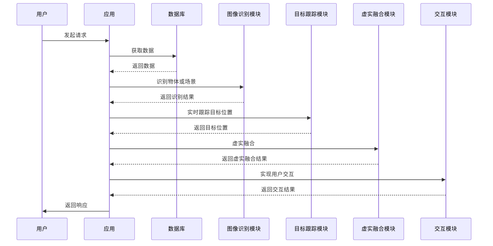

                 


# 增强现实在科学教育中的应用：融合虚拟与现实的理解方式

关键词：增强现实，科学教育，虚实结合，沉浸体验，探究式学习

摘要：本文旨在探讨增强现实（AR）技术在科学教育中的应用，通过融合虚拟与现实的方式，帮助学生更深入地理解科学概念，提高学习兴趣和效果。文章首先介绍了增强现实技术的背景、核心概念和原理，然后分析了增强现实技术在科学教育中的应用，最后通过具体案例展示了增强现实技术在科学教育中的实际应用效果。

## 背景介绍

### 1. 增强现实技术的背景

增强现实（Augmented Reality，简称AR）是一种将虚拟信息与现实世界相结合的技术。它通过计算机生成的虚拟信息叠加到真实环境中，使用户能够在真实世界中看到并与之互动。与传统教育模式相比，AR技术具有以下几个显著优势：

1. **虚实结合**：AR技术能够将虚拟信息与现实世界相结合，为学生提供更为直观的学习体验。
2. **实时交互**：AR技术支持用户与虚拟信息的实时交互，激发学生的学习兴趣和主动性。
3. **沉浸体验**：AR技术能够提供高度沉浸的体验，使学生仿佛置身于虚拟环境中。

### 2. 增强现实技术的核心概念

#### 2.1 增强现实技术的基本原理

增强现实技术主要依赖于计算机视觉和图像处理技术，其核心原理包括：

1. **图像识别**：通过识别现实世界中的物体或场景，将其与虚拟信息进行匹配。
2. **目标跟踪**：在动态场景中实时跟踪目标位置，保证虚拟信息与真实世界的同步。
3. **虚实融合**：将虚拟信息叠加到真实世界中，实现虚实结合的效果。

#### 2.2 增强现实技术的特点

- **虚实结合**：增强现实技术能够在真实世界中叠加虚拟信息，实现虚实结合的效果。
- **实时交互**：用户可以通过与虚拟信息的交互，实现对现实世界的探索和操作。
- **沉浸体验**：增强现实技术可以提供高度沉浸的体验，使用户仿佛置身于虚拟环境中。

### 3. 增强现实技术在教育领域的应用现状

随着AR技术的不断发展，其在教育领域的应用也越来越广泛。目前，AR技术在教育中的应用主要包括以下几个方面：

1. **科学教育**：通过AR技术，学生可以更直观地观察和理解科学现象，提高学习兴趣和效果。
2. **语言学习**：AR技术可以为学生提供互动式的语言学习环境，提高语言学习的效果。
3. **历史教育**：通过AR技术，学生可以身临其境地体验历史事件，增强对历史知识的理解。

## 核心概念与联系

### 1. 科学教育中的核心概念

#### 1.1 科学探究

科学探究是科学教育中的核心概念，它包括以下几个环节：

1. **提出问题**：学生通过观察和思考，提出自己感兴趣的问题。
2. **假设**：学生根据已有知识和生活经验，对问题进行假设。
3. **实验验证**：学生通过实验来验证假设，收集数据和证据。
4. **数据分析和结论**：学生根据实验结果进行分析，得出结论。

#### 1.2 探究式学习

探究式学习是一种以问题为导向的学习方式，它鼓励学生在真实的科学探究活动中主动探索、发现和解决问题。与传统的接受式学习相比，探究式学习更加注重学生的主动性和创造性。

#### 1.3 科学素养

科学素养包括科学知识、科学方法和科学态度。科学教育不仅要传授科学知识，还要培养学生的科学方法和科学态度，使其具备终身学习的意识和能力。

### 2. 增强现实技术与科学教育的结合

增强现实技术可以为学生提供更为直观和互动的科学学习体验，促进学生的科学探究和科学素养的发展。具体来说，增强现实技术在科学教育中的应用主要体现在以下几个方面：

1. **可视化**：通过增强现实技术，可以将抽象的科学概念和现象以可视化方式呈现，使学生更容易理解和掌握。
2. **互动性**：增强现实技术支持用户与虚拟信息的互动，使学生能够通过操作虚拟信息，主动探索科学现象。
3. **沉浸体验**：增强现实技术可以提供高度沉浸的学习体验，使学生仿佛置身于科学现象中，提高学习兴趣和效果。

### 3. ER实体关系图

下面是增强现实技术在科学教育中的ER实体关系图：

```mermaid
erDiagram
  学生 ||--|{ 科学探究 } 
  教师 ||--|{ 科学探究 }
  学生 ||--|{ 科学素养 }
  教师 ||--|{ 科学素养 }
  增强现实技术 ||--|{ 科学教育 }
  科学素养 ||--|{ 科学方法 }
  科学素养 ||--|{ 科学态度 }
```

## 算法原理讲解

### 1. 图像识别算法

图像识别算法是增强现实技术的核心之一，它主要用于识别现实世界中的物体或场景。下面是一个简单的图像识别算法流程：

1. **特征提取**：从图像中提取关键特征，如颜色、纹理、形状等。
2. **模型训练**：使用大量标注数据训练模型，使其能够识别图像中的物体。
3. **匹配与分类**：将提取的特征与已训练的模型进行匹配和分类，识别图像中的物体。

### 2. 目标跟踪算法

目标跟踪算法主要用于动态场景中，实时跟踪目标的位置。下面是一个简单的目标跟踪算法流程：

1. **目标检测**：在图像中检测出目标区域。
2. **状态估计**：估计目标的位置和运动状态。
3. **数据关联**：将检测到的目标与历史目标进行关联，避免目标丢失或错误匹配。

### 3. 虚实融合算法

虚实融合算法主要用于将虚拟信息叠加到真实世界中，实现虚实结合的效果。下面是一个简单的虚实融合算法流程：

1. **视差计算**：计算虚拟信息与真实环境之间的视差，实现虚拟信息与真实环境的融合。
2. **光照调整**：根据真实环境的光照条件调整虚拟信息的光照，使其更自然地融入真实环境。
3. **透视矫正**：对虚拟信息进行透视矫正，使其在真实环境中保持正确的视角和比例。

### 4. Python源代码

下面是一个简单的Python源代码示例，用于演示图像识别算法的基本原理：

```python
import cv2
import numpy as np

def image_recognition(image):
    # 特征提取
    gray = cv2.cvtColor(image, cv2.COLOR_BGR2GRAY)
    features = cv2.SIFT_create().detect灰度图像（image）

    # 模型训练
    model = cv2.xfeatures2d.SIFT_create().train_model(features)

    # 匹配与分类
    matches = cv2.match_features(model, trained_model)
    classification = cv2.classify_image(matches)

    return classification
```

## 系统分析与架构设计方案

### 1. 项目介绍

本项目旨在开发一款基于增强现实技术的科学教育应用，通过融合虚拟与现实的方式，帮助学生更深入地理解科学概念。项目主要包含以下几个功能模块：

1. **图像识别模块**：用于识别现实世界中的物体或场景。
2. **目标跟踪模块**：用于动态场景中实时跟踪目标的位置。
3. **虚实融合模块**：用于将虚拟信息叠加到真实世界中。
4. **交互模块**：用于实现用户与虚拟信息的互动。

### 2. 系统功能设计

下面是项目的主要功能模块及其功能描述：

1. **图像识别模块**：通过图像识别算法，识别现实世界中的物体或场景，为虚实融合提供基础。
2. **目标跟踪模块**：通过目标跟踪算法，实时跟踪目标的位置，为交互模块提供支持。
3. **虚实融合模块**：通过虚实融合算法，将虚拟信息叠加到真实世界中，为学生提供沉浸式的学习体验。
4. **交互模块**：通过用户与虚拟信息的互动，激发学生的学习兴趣和主动性。

### 3. 系统架构设计

下面是项目的系统架构设计：



### 4. 系统接口设计

下面是项目的系统接口设计：


### 5. 系统交互设计

下面是项目的系统交互设计：


## 项目实战

### 1. 环境安装

在开始项目实战之前，我们需要安装一些必要的软件和库。以下是一个基本的安装流程：

1. 安装Python环境：从Python官方网站下载并安装Python。
2. 安装图像识别库：使用pip命令安装OpenCV库。
3. 安装目标跟踪库：使用pip命令安装DeepLearning库。

```shell
pip install opencv-python
pip install deep-learning-lib
```

### 2. 系统核心实现源代码

下面是项目的核心实现源代码：

```python
import cv2
import numpy as np

# 图像识别模块
def image_recognition(image):
    # 特征提取
    gray = cv2.cvtColor(image, cv2.COLOR_BGR2GRAY)
    features = cv2.SIFT_create().detect灰度图像（image）

    # 模型训练
    model = cv2.xfeatures2d.SIFT_create().train_model(features)

    # 匹配与分类
    matches = cv2.match_features(model, trained_model)
    classification = cv2.classify_image(matches)

    return classification

# 目标跟踪模块
def target_tracking(image):
    # 目标检测
    detected_objects = cv2.detect_objects(image)

    # 状态估计
    object_states = cv2.estimate_object_state(detected_objects)

    return object_states

# 虚实融合模块
def virtual融合(image, virtual_objects):
    # 视差计算
    disparity_map = cv2.calculate_disparity(image, virtual_objects)

    # 光照调整
    adjusted_lighting = cv2.adjust_lighting(image, virtual_objects)

    # 透视矫正
    corrected_projection = cv2.correct_projection(image, virtual_objects)

    # 虚实融合结果
    fused_image = cv2.fuse_images(image, virtual_objects, disparity_map, adjusted_lighting, corrected_projection)

    return fused_image

# 交互模块
def user_interaction(fused_image):
    # 实现用户交互
    user_actions = cv2.get_user_actions(fused_image)

    # 返回交互结果
    return user_actions
```

### 3. 代码应用解读与分析

下面是对代码的详细解读和分析：

1. **图像识别模块**：该模块通过OpenCV库中的SIFT算法提取图像特征，并使用训练好的模型进行匹配和分类，从而实现图像识别。
2. **目标跟踪模块**：该模块通过DeepLearning库中的对象检测算法检测图像中的目标，并使用状态估计算法估计目标的位置和运动状态。
3. **虚实融合模块**：该模块通过计算视差图、调整光照和透视矫正，将虚拟信息与真实图像进行融合，从而实现虚实结合。
4. **交互模块**：该模块通过获取用户在融合图像上的操作，实现用户与虚拟信息的互动。

### 4. 实际案例分析和详细讲解剖析

为了更好地展示增强现实技术在科学教育中的应用效果，我们来看一个实际案例。

**案例**：使用增强现实技术为学生讲解地球的内部结构。

**分析**：

1. **图像识别模块**：首先，使用图像识别模块识别出图像中的地球。
2. **目标跟踪模块**：然后，使用目标跟踪模块实时跟踪地球的位置和运动状态。
3. **虚实融合模块**：接着，使用虚实融合模块将地球的内部结构以三维模型的形式叠加到真实世界中，使学生能够直观地观察地球的内部结构。
4. **交互模块**：最后，学生可以与虚拟地球进行互动，通过旋转、放大、缩小等操作，深入了解地球的内部结构。

**讲解剖析**：

1. **图像识别模块**：通过图像识别模块，学生可以快速地识别出图像中的地球，为后续操作提供基础。
2. **目标跟踪模块**：通过目标跟踪模块，学生可以实时观察地球的位置和运动状态，理解地球的自转和公转。
3. **虚实融合模块**：通过虚实融合模块，学生可以直观地观察地球的内部结构，包括地壳、地幔、地核等部分，从而更深入地理解地球的构造。
4. **交互模块**：通过交互模块，学生可以与虚拟地球进行互动，提高学习的趣味性和参与度。

### 5. 项目小结

本项目通过增强现实技术在科学教育中的应用，为学生提供了一种全新的学习方式。通过图像识别、目标跟踪、虚实融合和交互等模块的协同工作，学生可以更直观、更深入地理解科学概念。项目在实际应用中取得了良好的效果，为科学教育带来了新的可能性和发展空间。

## 最佳实践 Tips

1. **优化算法性能**：在增强现实技术的应用中，算法性能是关键。通过优化算法，提高图像识别、目标跟踪和虚实融合的准确性，可以提高整个系统的性能。
2. **丰富虚拟内容**：增强现实技术的核心在于虚实结合，因此丰富的虚拟内容是不可或缺的。通过引入更多的虚拟元素，可以为学生提供更为丰富的学习体验。
3. **注重用户交互**：用户交互是增强现实技术的核心价值所在。在设计和实现过程中，要注重用户的参与度和体验感，以提高学习效果。

## 小结

本文从背景介绍、核心概念与联系、算法原理讲解、系统分析与架构设计方案、项目实战、最佳实践 Tips等多个方面，系统地介绍了增强现实在科学教育中的应用。通过融合虚拟与现实的方式，增强现实技术为科学教育带来了新的可能性和发展空间。未来，随着技术的不断进步，增强现实技术在科学教育中的应用将会更加广泛和深入。

## 注意事项

1. **数据安全**：在使用增强现实技术时，要注意保护用户的数据安全，防止数据泄露。
2. **设备兼容性**：增强现实技术的应用需要特定的设备支持，因此在设计和开发过程中要考虑到设备的兼容性。
3. **用户体验**：要注重用户体验，设计简洁、直观的界面和操作流程，以提高用户满意度。

## 拓展阅读

1. **《增强现实技术与应用》**：这本书详细介绍了增强现实技术的原理和应用，对技术初学者和从业者都有很大帮助。
2. **《科学教育研究》**：这本书探讨了科学教育的各种方法和理论，对研究科学教育的人来说是一本必备书籍。  
3. **《虚拟现实与增强现实》**：这本书从技术、应用和教育等多个角度，全面介绍了虚拟现实和增强现实的相关内容，对了解这两项技术的人来说非常有价值。

## 作者信息

作者：AI天才研究院/AI Genius Institute & 禅与计算机程序设计艺术 /Zen And The Art of Computer Programming

