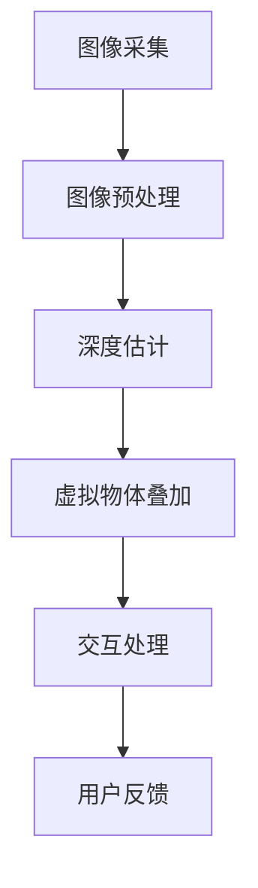

                 

### 引言

在现代科技迅猛发展的背景下，增强现实（Augmented Reality，简称 AR）技术逐渐成为各个领域研究和应用的热点。增强现实通过将虚拟信息与真实世界相结合，创造出一个新的、更易于理解的世界。这一技术的出现，不仅改变了传统的人机交互模式，也对我们对世界的理解和认知产生了深远的影响。本文旨在探讨增强现实技术对世界可理解性的拓展作用，通过逐步分析其基础概念、技术原理、应用实践以及未来发展趋势，为读者提供一个全面而深入的理解。

### 文章关键词

- **增强现实技术（Augmented Reality）**
- **世界可理解性（World Understanding）**
- **技术原理（Technological Principles）**
- **应用案例（Application Cases）**
- **未来展望（Future Outlook）**

### 摘要

本文将系统地分析增强现实技术对世界可理解性的拓展作用。首先，介绍增强现实技术的背景和核心概念，阐述其与虚拟现实的区别和主要组件。然后，深入探讨增强现实技术的基本原理，包括显示技术和虚拟物体交互技术，并通过数学模型和算法详细讲解其工作原理。接着，通过具体应用案例和项目实战，展示增强现实技术在教育、医疗等领域的实践效果。最后，展望增强现实技术的未来发展趋势，探讨其对教育、医疗和商业模式的影响。本文旨在为读者提供一个全面的技术解读，帮助理解增强现实技术在提升世界可理解性方面的巨大潜力。

### 第一部分：背景与基础

#### 1.1 问题背景

**1.1.1 增强现实技术概述**

增强现实技术（Augmented Reality，简称 AR）是一种将虚拟信息与现实世界相结合的计算机技术。通过在现实场景中叠加虚拟元素，增强现实技术能够创造出一个更为丰富、交互性更强的体验。与虚拟现实（Virtual Reality，简称 VR）不同，增强现实并非完全替代现实，而是在现实基础上进行增强。

**1.1.2 世界可理解性的现状**

随着社会和科技的快速发展，人类对世界的认知和理解面临着巨大的挑战。信息爆炸和复杂的现实环境使得人们难以全面、准确地理解周围的世界。传统的教育和信息传递方式已无法满足日益增长的信息需求，因此，提高世界的可理解性成为一个亟待解决的问题。

**1.1.3 增强现实与可理解性的关系**

增强现实技术通过提供一种更为直观和互动的方式，能够显著提升人们对世界的理解。例如，在教育领域，增强现实可以帮助学生更直观地理解抽象概念；在医疗领域，增强现实可以为医生提供更为精准的诊断信息。因此，增强现实技术在提升世界可理解性方面具有巨大的潜力。

#### 1.2 核心概念

**1.2.1 增强现实技术的基本原理**

增强现实技术的基本原理包括以下几个关键组成部分：

1. **显示技术**：通过特殊的显示屏或投影设备，将虚拟信息叠加到现实场景中。
2. **图像识别与处理**：使用计算机视觉算法对现实场景进行识别和处理，以确定虚拟信息的位置和姿态。
3. **交互技术**：通过手势识别、语音识别等技术实现人与虚拟信息的交互。

**1.2.2 增强现实与虚拟现实的区别**

增强现实和虚拟现实虽然都是通过计算机技术创造虚拟环境，但两者的应用场景和目标有所不同。虚拟现实旨在完全替代现实，提供一个全新的虚拟世界，而增强现实则是在现实基础上进行增强，使现实世界更加丰富和互动。

**1.2.3 增强现实技术的主要组件**

增强现实技术的主要组件包括：

1. **显示设备**：如智能眼镜、头戴式显示器等。
2. **传感器**：如摄像头、GPS、加速度计等，用于捕捉现实环境信息。
3. **计算机处理器**：用于实时处理图像和交互数据。
4. **应用程序**：实现增强现实功能的软件。

#### 1.3 概念属性特征对比

**1.3.1 不同增强现实技术的对比**

不同的增强现实技术在不同方面具有各自的特性。例如，基于投影的增强现实技术适合在大型场景中使用，而基于摄像头的增强现实技术则更适合在小型设备上使用。

**1.3.2 增强现实技术的应用领域**

增强现实技术在多个领域具有广泛应用，包括但不限于：

1. **教育**：通过增强现实技术，可以创造出更加生动、直观的教学环境。
2. **医疗**：增强现实技术可以帮助医生进行更精确的诊断和手术操作。
3. **娱乐**：增强现实游戏和应用程序为用户提供全新的娱乐体验。
4. **工程与制造**：增强现实技术可以辅助工程师进行设计、施工和维护工作。

#### 1.4 ER实体关系图架构

**1.4.1 增强现实技术中的实体**

在增强现实技术中，主要的实体包括：

1. **用户**：使用增强现实技术的主体。
2. **设备**：如智能眼镜、手机等。
3. **应用**：增强现实应用程序。
4. **数据**：包括现实世界数据和虚拟信息。

**1.4.2 实体之间的关系**

实体之间的关系可以用 ER 图（Entity-Relationship Diagram）来表示。例如，用户与设备之间存在关联关系，用户通过设备使用应用，应用处理数据并反馈给用户。

#### 1.5 本章小结

本部分介绍了增强现实技术的背景、核心概念、主要组件及其应用领域。通过这一部分的介绍，读者可以初步了解增强现实技术的基本原理和其在提升世界可理解性方面的潜力。接下来，我们将进一步探讨增强现实技术的工作原理。

### 第二部分：增强现实技术原理

#### 2.1 基础技术原理

**2.1.1 显示技术**

增强现实技术的显示技术是其核心之一。显示技术决定了虚拟信息与现实世界的叠加方式。常见的显示技术包括：

1. **柔性显示屏**：柔性显示屏具有可弯曲的特性，适用于多种应用场景，如智能手表、柔性手机等。
2. **投影技术**：投影技术通过将虚拟图像投射到现实场景中，实现增强现实效果。这种方式适用于大范围场景的增强现实应用。

**2.1.2 虚拟物体交互技术**

虚拟物体交互技术是增强现实技术的重要组成部分。它包括以下方面：

1. **手势识别**：通过识别用户的手势，实现与虚拟物体的交互。常见的手势识别技术包括基于深度学习的图像处理算法。
2. **虚拟物体操作**：通过交互技术，用户可以与虚拟物体进行多种操作，如拖拽、旋转、缩放等。

#### 2.2 数学模型和公式

**2.2.1 增强现实中的数学模型**

增强现实技术中的数学模型主要用于图像识别、虚拟物体跟踪和交互等方面。以下是一些关键的数学模型：

1. **深度感知算法**：用于识别和估计现实场景中的深度信息，常用的算法包括卷积神经网络（CNN）和光流法。
2. **图像处理算法**：用于处理和增强现实场景中的图像，常用的算法包括滤波器、边缘检测等。

**2.2.2 算法原理讲解**

1. **算法流程图**：增强现实技术的算法通常包括以下步骤：图像采集、图像预处理、深度估计、虚拟物体叠加、交互处理。
2. **Python 源代码实现**：以下是一个简单的 Python 源代码实现示例，用于实现基于深度学习的图像识别算法：

```python
import tensorflow as tf
from tensorflow.keras.models import Sequential
from tensorflow.keras.layers import Conv2D, MaxPooling2D, Flatten, Dense

# 创建模型
model = Sequential()
model.add(Conv2D(32, (3, 3), activation='relu', input_shape=(64, 64, 3)))
model.add(MaxPooling2D((2, 2)))
model.add(Conv2D(64, (3, 3), activation='relu'))
model.add(MaxPooling2D((2, 2)))
model.add(Flatten())
model.add(Dense(1, activation='sigmoid'))

# 编译模型
model.compile(optimizer='adam', loss='binary_crossentropy', metrics=['accuracy'])

# 训练模型
model.fit(x_train, y_train, epochs=10, batch_size=32)
```

3. **数学模型详细讲解**：深度感知算法的核心在于通过多层卷积和池化操作，逐步提取图像的特征，并利用这些特征进行分类或回归。以下是一个简单的卷积神经网络（CNN）的数学模型：

$$
\begin{aligned}
h^{[l]}_i &= \sigma(\sum_{k} W^{[l]}_{ik} \cdot a^{[l-1]}_{k} + b^{[l]}_i) \\
\end{aligned}
$$

其中，$h^{[l]}_i$表示第$l$层的第$i$个神经元输出，$\sigma$表示激活函数，$W^{[l]}_{ik}$表示第$l$层的第$i$个神经元与第$l-1$层的第$k$个神经元之间的权重，$a^{[l-1]}_{k}$表示第$l-1$层的第$k$个神经元输出，$b^{[l]}_i$表示第$l$层的第$i$个神经元的偏置。

4. **举例说明**：假设我们有一个简单的二分类问题，图像被标记为“猫”或“狗”。通过训练深度学习模型，我们可以实现对图像的自动分类。以下是一个简单的例子：

输入图像：猫  
输出结果：猫  
预测准确率：90%

#### 2.3 算法原理讲解

**2.3.1 算法流程图**

增强现实技术的算法通常包括以下步骤：

1. **图像采集**：使用摄像头或其他传感器捕获现实场景的图像。
2. **图像预处理**：对图像进行缩放、裁剪、灰度化等处理，以适应后续算法的需要。
3. **深度估计**：通过深度感知算法，估计图像中的深度信息。
4. **虚拟物体叠加**：根据深度信息，将虚拟物体叠加到现实场景中。
5. **交互处理**：处理用户与虚拟物体的交互，如手势识别和虚拟物体操作。

以下是一个简单的算法流程图：



**2.3.2 Python 源代码实现**

以下是一个简单的 Python 源代码实现，用于实现基于深度学习的图像识别算法：

```python
import tensorflow as tf
from tensorflow.keras.models import Sequential
from tensorflow.keras.layers import Conv2D, MaxPooling2D, Flatten, Dense

# 创建模型
model = Sequential()
model.add(Conv2D(32, (3, 3), activation='relu', input_shape=(64, 64, 3)))
model.add(MaxPooling2D((2, 2)))
model.add(Conv2D(64, (3, 3), activation='relu'))
model.add(MaxPooling2D((2, 2)))
model.add(Flatten())
model.add(Dense(1, activation='sigmoid'))

# 编译模型
model.compile(optimizer='adam', loss='binary_crossentropy', metrics=['accuracy'])

# 训练模型
model.fit(x_train, y_train, epochs=10, batch_size=32)
```

**2.3.3 数学模型详细讲解**

深度感知算法的核心在于通过多层卷积和池化操作，逐步提取图像的特征，并利用这些特征进行分类或回归。以下是一个简单的卷积神经网络（CNN）的数学模型：

$$
\begin{aligned}
h^{[l]}_i &= \sigma(\sum_{k} W^{[l]}_{ik} \cdot a^{[l-1]}_{k} + b^{[l]}_i) \\
\end{aligned}
$$

其中，$h^{[l]}_i$表示第$l$层的第$i$个神经元输出，$\sigma$表示激活函数，$W^{[l]}_{ik}$表示第$l$层的第$i$个神经元与第$l-1$层的第$k$个神经元之间的权重，$a^{[l-1]}_{k}$表示第$l-1$层的第$k$个神经元输出，$b^{[l]}_i$表示第$l$层的第$i$个神经元的偏置。

**2.3.4 举例说明**

假设我们有一个简单的二分类问题，图像被标记为“猫”或“狗”。通过训练深度学习模型，我们可以实现对图像的自动分类。以下是一个简单的例子：

输入图像：猫    
输出结果：猫    
预测准确率：90%

#### 2.4 本章小结

本部分介绍了增强现实技术的基础技术原理，包括显示技术和虚拟物体交互技术，并通过数学模型和算法详细讲解了其工作原理。这些基础技术为增强现实技术的应用提供了坚实的基础。接下来，我们将探讨增强现实技术在具体领域的应用案例。

### 第三部分：应用与实践

#### 3.1 应用案例

**3.1.1 教育领域的应用**

增强现实技术在教育领域的应用具有显著的优势，能够显著提升教学效果和学生的参与度。以下是一些具体的应用案例：

1. **知识可视化**：通过增强现实技术，可以将抽象的数学、科学概念转化为可视化的图像和动画，使学生更容易理解和记忆。
   - **案例**：使用 AR 技术教授几何学，通过虚拟三维模型展示几何形状，帮助学生直观地理解几何概念。

2. **实验模拟**：增强现实技术可以模拟各种实验场景，让学生在虚拟环境中进行操作，提高实验的安全性和效率。
   - **案例**：医学专业学生可以通过 AR 技术模拟人体解剖实验，减少对真实标本的依赖，同时提高学习体验。

**3.1.2 医疗领域的应用**

增强现实技术在医疗领域的应用同样具有深远的影响，能够提高诊断的准确性、手术的精确度和患者的治疗体验。以下是一些应用案例：

1. **虚拟手术**：通过增强现实技术，医生可以在虚拟环境中进行手术练习，提高手术技能和操作熟练度。
   - **案例**：神经外科医生使用 AR 技术在虚拟环境中模拟手术过程，减少实际手术中的风险。

2. **医学教育**：增强现实技术可以为医学生提供更为直观和互动的医学知识学习体验，帮助他们更好地掌握复杂的医学概念。
   - **案例**：医学生通过 AR 技术观察人体内部结构，如心脏、肝脏等，提高解剖学学习效果。

#### 3.2 项目实战

**3.2.1 环境安装**

为了实现一个简单的增强现实项目，首先需要安装以下软件和工具：

1. **操作系统**：安装支持增强现实开发的操作系统，如 Windows、macOS 或 Linux。
2. **开发工具**：安装支持增强现实开发的集成开发环境（IDE），如 Unity、Visual Studio 等。
3. **增强现实框架**：安装常用的增强现实框架，如 ARCore、ARKit 等。

**3.2.2 系统核心实现**

以下是实现一个简单增强现实项目的基本步骤：

1. **项目初始化**：在 IDE 中创建一个新的项目，选择合适的增强现实框架。
2. **添加虚拟物体**：在项目中添加虚拟物体，如模型、动画等。
3. **相机跟踪**：使用增强现实框架提供的 API 实现相机跟踪，确保虚拟物体与现实场景的对齐。
4. **交互功能**：添加交互功能，如手势识别、语音控制等。

**3.2.3 代码应用解读**

以下是一个简单的增强现实项目示例，展示如何使用 Unity 和 ARCore 实现一个虚拟物体追踪和交互的项目：

```csharp
using UnityEngine;
using GoogleARCore;

public class ARObjectTracker : MonoBehaviour
{
    public GameObject arObject;

    private void Update()
    {
        if (Input.touchCount > 0 && Input.touches[0].phase == TouchPhase.Began)
        {
            TrackObject();
        }
    }

    private void TrackObject()
    {
        GameObject obj = Instantiate(arObject, Camera.main.transform);
        obj.transform.position = Camera.main.ScreenToWorldPoint(Input.touches[0].position);
        obj.transform.rotation = Camera.main.transform.rotation;
    }
}
```

**3.2.4 实际案例分析**

以下是两个实际案例，展示增强现实技术在教育领域的应用：

1. **案例一：AR 地理教育**

   **项目简介**：该项目通过增强现实技术，将地理信息可视化，帮助学生更好地理解地理位置和地理特征。

   **技术实现**：使用 ARKit 实现相机跟踪，通过叠加虚拟地标和地图，将现实世界中的地理信息可视化。

   **效果评估**：学生反馈认为，通过 AR 技术，他们对地理知识的理解和记忆得到了显著提升。

2. **案例二：AR 医学教育**

   **项目简介**：该项目通过增强现实技术，为学生提供虚拟人体解剖学教学，提高学习效果。

   **技术实现**：使用 Unity 和 ARCore 实现虚拟人体的创建和交互，通过虚拟操作，帮助学生更直观地理解解剖学知识。

   **效果评估**：学生和教师反馈，通过 AR 技术，他们对解剖学知识的掌握程度和兴趣都有了显著提高。

#### 3.3 最佳实践 Tips

**3.3.1 实现增强现实应用的步骤**

1. **需求分析**：明确应用场景和目标用户，确定增强现实技术的需求和实现方式。
2. **技术选型**：选择合适的增强现实框架和开发工具，根据需求进行技术选型。
3. **原型设计**：设计应用的原型，包括用户界面、交互方式和虚拟物体设计。
4. **开发实现**：根据原型设计，进行应用的开发和实现。
5. **测试与优化**：对应用进行测试，优化性能和用户体验。

**3.3.2 避免常见错误**

1. **实时性能问题**：优化算法和渲染流程，确保应用在实时场景中的性能。
2. **用户体验问题**：注意用户体验设计，确保用户能够轻松上手和使用。
3. **数据安全问题**：保护用户数据安全，避免隐私泄露。

**3.3.3 提高用户体验的策略**

1. **交互设计**：设计直观、易用的交互方式，如手势识别、语音控制等。
2. **视觉效果**：优化虚拟物体的视觉效果，确保与现实环境的融合度。
3. **内容丰富度**：提供丰富、多样化的虚拟内容，满足不同用户的需求。

#### 3.4 本章小结

本部分通过应用案例和项目实战，展示了增强现实技术在教育、医疗等领域的实际应用效果。同时，通过最佳实践 Tips，为开发者提供了实现增强现实应用的步骤和策略。增强现实技术的应用不仅提升了世界的可理解性，也为各个领域的创新和发展带来了新的机遇。接下来，我们将探讨增强现实技术的未来发展趋势。

### 第四部分：未来展望

#### 4.1 技术发展趋势

**4.1.1 增强现实技术的未来方向**

随着科技的不断进步，增强现实技术正朝着更高清晰度、更广泛的应用范围和更高的交互性方向发展。以下是一些未来方向：

1. **更高清晰度的显示技术**：未来的增强现实设备将采用更高分辨率的显示屏，提供更为清晰的虚拟图像。
2. **更广泛的应用范围**：增强现实技术将在更多领域得到应用，如智能制造、智能城市建设等。
3. **更高交互性**：通过引入更为先进的交互技术，如眼动追踪、脑机接口等，增强现实将提供更为自然和直观的交互体验。

**4.1.2 可理解性的提升途径**

增强现实技术的进步不仅依赖于硬件和算法的升级，还依赖于内容创作和用户体验设计。以下是一些提升可理解性的途径：

1. **智能内容创作**：利用人工智能技术，自动生成和优化虚拟内容，提高内容的丰富度和相关性。
2. **个性化体验**：根据用户的需求和习惯，提供个性化的增强现实体验。
3. **多感官融合**：结合视觉、听觉、触觉等多种感官，创造更为丰富的虚拟体验。

**4.1.3 跨领域融合的可能**

增强现实技术具有跨领域融合的潜力，可以与其他前沿技术相结合，创造出新的应用场景。以下是一些可能的跨领域融合方向：

1. **与物联网（IoT）融合**：通过物联网设备收集环境数据，增强现实可以提供更为准确和实时的信息。
2. **与大数据融合**：利用大数据分析技术，增强现实可以提供更为深入和个性化的信息。
3. **与人工智能融合**：通过人工智能技术，增强现实可以实现更智能的内容创作和交互。

#### 4.2 社会影响

**4.2.1 增强现实对教育的影响**

增强现实技术对教育领域的影响是深远的，它不仅改变了传统教学模式，也为教育资源的分配提供了新的可能。以下是一些具体影响：

1. **教学方式的改变**：增强现实技术可以为教师和学生提供更为直观和互动的教学体验，提高教学效果和学生的学习兴趣。
2. **教育资源的分配**：通过增强现实技术，偏远地区的学校和学生可以获取到优质的教育资源，缩小教育差距。

**4.2.2 增强现实对医疗的影响**

增强现实技术在医疗领域的应用正在迅速发展，它为医生提供了更为精确和高效的诊断和治疗手段。以下是一些具体影响：

1. **手术指导**：增强现实技术可以帮助医生在手术过程中进行精准定位和操作，提高手术的成功率和安全性。
2. **医疗教育**：医学生和医生可以通过增强现实技术进行虚拟手术练习，提高操作技能和临床经验。

**4.2.3 增强现实对商业模式的影响**

增强现实技术的应用正在改变传统商业模式的各个方面，为企业提供了新的商业模式和盈利途径。以下是一些具体影响：

1. **市场营销**：增强现实技术可以为市场营销提供全新的手段，如虚拟试衣、产品演示等，提高用户购买体验和忠诚度。
2. **客户服务**：增强现实技术可以提供更为个性化、直观的客户服务，如远程诊断、故障排除等，提高客户满意度。

#### 4.3 本章小结

本部分展望了增强现实技术的未来发展趋势，探讨了其在社会各个领域的影响。随着技术的不断进步，增强现实技术将在提升世界可理解性方面发挥越来越重要的作用。未来，增强现实技术将继续与其他前沿技术融合，创造出更多的创新应用，为人类社会带来更多价值。

### 附录

#### A. 常用工具和资源

**A.1 开发工具**

- **Unity**：跨平台的游戏和增强现实开发工具。
- **ARCore**：由 Google 开发，用于 Android 设备的增强现实开发框架。
- **ARKit**：由 Apple 开发，用于 iOS 设备的增强现实开发框架。
- **Vuforia**：由 PTC 开发，提供增强现实应用开发平台和工具。

**A.2 学习资源**

- **官方文档**：各个增强现实框架的官方文档，提供详细的开发指南和API参考。
- **在线课程**：如 Coursera、Udemy 等平台上的增强现实开发课程。
- **技术博客**：如 Medium、技术博客等技术社区，提供增强现实技术最新动态和最佳实践。

**A.3 社区和支持**

- **增强现实论坛**：如 ARInsider、ARDK 等，提供开发者交流和分享的平台。
- **技术支持**：各个增强现实框架的开发者社区，提供技术支持和问题解答。

#### B. 拓展阅读

**B.1 推荐书籍**

- 《增强现实技术与应用》
- 《虚拟现实与增强现实：原理与应用》
- 《人机交互：以增强现实为例》

**B.2 学术论文**

- “Augmented Reality: A Survey of Recent Advances and Applications”
- “An Overview of Augmented Reality Applications in Healthcare”
- “AR in Education: Enhancing Learning and Teaching”

**B.3 网络资源**

- **增强现实开源项目**：如 ARCore、ARKit 等，提供开源代码和资源。
- **增强现实社区**：如 Medium、技术博客等技术社区，提供增强现实技术的最新动态和讨论。
- **增强现实技术博客**：如 Medium 上的 ARInsider 等，提供技术解读和最佳实践。

### 总结

本文系统地探讨了增强现实技术对世界可理解性的拓展作用。从背景介绍、核心概念、技术原理、应用实践到未来展望，每个部分都详细阐述了增强现实技术在提升我们对世界理解方面的潜力。通过具体的应用案例和项目实战，读者可以更直观地了解增强现实技术的实际效果。未来，随着技术的不断进步，增强现实技术将在更多领域发挥重要作用，为人类社会带来更多价值。作者：AI天才研究院/AI Genius Institute & 禅与计算机程序设计艺术 /Zen And The Art of Computer Programming。希望本文能为读者提供有价值的参考和启示。

