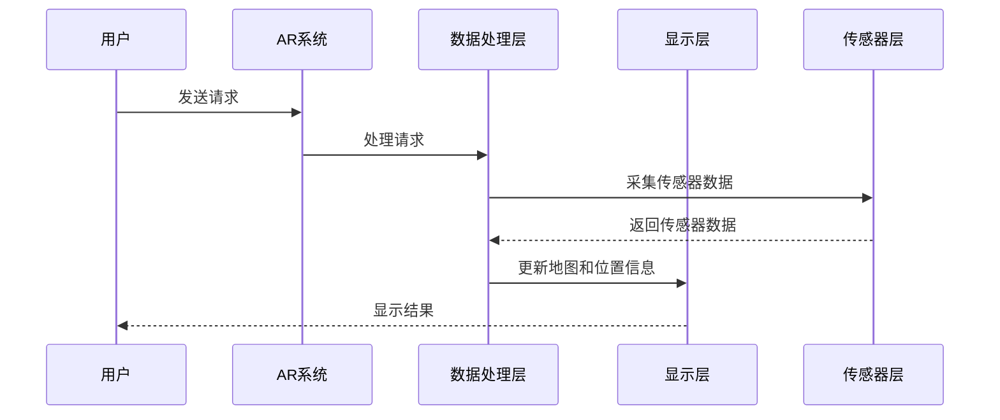
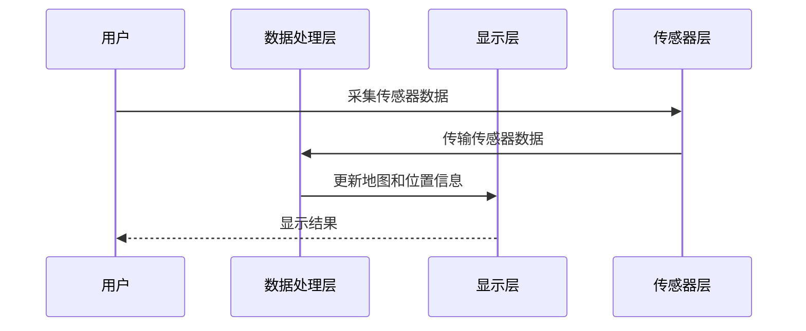

                 

### 增强现实的SLAM算法：实时定位的数学方法

> 关键词：增强现实、SLAM算法、实时定位、数学方法、算法原理

> 摘要：本文深入探讨增强现实（AR）技术中的一种关键算法——同步定位与映射（SLAM）的实时定位数学方法。通过剖析SLAM算法的核心概念、基本原理以及数学模型，本文旨在为读者提供一个清晰的、系统的理解，以帮助他们在实际应用中更好地实现实时定位。

### 目录大纲

1. **背景与核心概念**
    1.1 **问题背景与问题描述**
    1.2 **增强现实（AR）技术的发展与应用**
    1.3 **SLAM算法概述**
    1.4 **实时定位在AR系统中的重要性**
    1.5 **实时定位的挑战与机遇**
2. **核心概念与联系**
    2.1 **SLAM算法的核心概念与联系**
    2.2 **实时定位的数学方法**
    2.3 **SLAM算法的属性特征对比**
    2.4 **SLAM算法的ER实体关系图架构**
3. **算法原理讲解**
    3.1 **SLAM算法的详细原理讲解**
    3.2 **实时定位的数学方法与算法**
4. **系统分析与架构设计**
    4.1 **增强现实SLAM系统分析**
    4.2 **系统功能设计**
    4.3 **系统架构设计**
5. **项目实战**
    5.1 **环境安装**
    5.2 **系统核心实现源代码**
    5.3 **代码应用解读与分析**
    5.4 **实际案例分析和详细讲解剖析**
    5.5 **项目小结**
6. **最佳实践 tips**
7. **小结**
8. **注意事项**
9. **拓展阅读**

### 1. 背景与核心概念

#### 1.1 问题背景与问题描述

在过去的几十年里，计算机视觉、机器学习和传感器技术取得了显著的进展。这些技术的发展催生了增强现实（AR）技术的诞生，它通过在真实环境中叠加虚拟信息，极大地提升了用户交互体验。增强现实技术的核心在于能够实时、准确地定位用户的位置和方向，这一任务依赖于同步定位与映射（SLAM）算法。

SLAM算法是一种同时进行环境地图构建和自身位置估计的算法，其核心目标是确定系统在动态环境中的位置和运动轨迹，同时构建环境的三维地图。在AR系统中，SLAM算法的实时定位功能至关重要，它保证了虚拟信息和现实环境的完美融合。

#### 1.2 增强现实（AR）技术的发展与应用

增强现实（AR）技术是一种通过计算机技术将虚拟信息叠加到现实世界中的技术。AR技术的主要组成部分包括显示设备、传感器和计算机算法。显示设备如智能手机、头戴显示器等，传感器如摄像头、GPS、IMU（惯性测量单元）等，计算机算法则负责处理传感器数据，实现实时定位和地图构建。

AR技术自问世以来，得到了广泛的应用。从最初的游戏和娱乐领域，到医疗、工业设计、教育等多个行业，AR技术都展现出了强大的应用潜力。在医疗领域，AR技术可以用于手术指导，辅助医生进行复杂手术；在工业设计中，AR技术可以用于产品展示和设计审查；在教育领域，AR技术可以为学生提供更加生动、互动的学习体验。

#### 1.3 SLAM算法概述

同步定位与映射（SLAM）算法是一种在未知环境中同时进行位置估计和地图构建的算法。SLAM算法的核心目标是通过传感器采集的数据，如摄像头图像、IMU数据等，估计出系统的运动轨迹，并构建出环境的三维地图。

SLAM算法的发展可以追溯到20世纪90年代。当时，由于计算机性能的限制，SLAM算法的研究主要集中在小规模、静态的环境中。随着计算机性能的不断提升，SLAM算法逐渐应用于复杂、动态的环境，并取得了显著的成果。

目前，SLAM算法已经广泛应用于机器人导航、自动驾驶、虚拟现实等领域。在AR系统中，SLAM算法是实现实时定位和地图构建的关键技术。

#### 1.4 实时定位在AR系统中的重要性

实时定位是AR系统的核心功能之一。它保证了虚拟信息与现实环境的完美融合，提升了用户体验。在AR系统中，实时定位需要满足以下几个基本要求：

1. **高精度**：实时定位需要提供高精度的位置和方向信息，以保证虚拟信息与现实环境的准确对应。
2. **实时性**：实时定位需要快速处理传感器数据，并提供实时反馈，以保证用户交互的流畅性。
3. **鲁棒性**：实时定位需要在各种复杂环境中，如室内、室外、动态场景等，保持稳定的定位性能。

实时定位在AR系统中的作用主要体现在以下几个方面：

1. **交互体验**：实时定位提升了用户与虚拟信息的交互体验，使用户能够更加自然地与虚拟世界互动。
2. **环境感知**：实时定位结合环境感知技术，如深度学习、计算机视觉等，可以实现对环境的动态理解和适应。
3. **应用创新**：实时定位为AR系统提供了广泛的应用场景，如增强现实游戏、虚拟现实培训、智能导航等。

#### 1.5 实时定位的挑战与机遇

实时定位在AR系统中面临着一系列挑战。首先，传感器数据的噪声和不确定性给定位算法带来了巨大的挑战。其次，动态环境的变化，如人体遮挡、光线变化等，对定位精度和稳定性提出了更高的要求。此外，实时定位的计算复杂度也限制了其在实时应用中的性能。

然而，随着计算机性能的提升、传感器技术的进步以及算法研究的深入，实时定位在AR系统中也面临着巨大的机遇。未来，实时定位技术有望在AR系统中发挥更加重要的作用，推动AR技术的发展和应用。

### 2. 核心概念与联系

#### 2.1 SLAM算法的核心概念与联系

SLAM算法是一种在动态、未知环境中同时进行位置估计和地图构建的算法。其核心概念包括：

1. **状态估计**：状态估计是指通过传感器数据估计系统在环境中的位置和运动状态。状态估计是SLAM算法的核心，常用的方法包括卡尔曼滤波器、粒子滤波器等。
2. **地图构建**：地图构建是指通过传感器数据构建环境的三维地图。地图构建的目的是为了提高定位的精度和鲁棒性。常用的地图构建方法包括 occupancy grid、Voxel map等。
3. **数据关联**：数据关联是指将传感器数据与已有地图进行匹配，以提高定位的精度。数据关联是SLAM算法的关键步骤，常用的方法包括特征匹配、回环检测等。

SLAM算法的基本原理是通过传感器数据不断更新状态估计和地图构建，从而实现实时定位。其基本流程可以概括为：

1. **数据采集**：通过摄像头、IMU等传感器采集环境数据。
2. **特征提取**：从传感器数据中提取特征，如图像特征、深度特征等。
3. **状态估计**：利用卡尔曼滤波器、粒子滤波器等算法估计系统状态。
4. **地图构建**：利用提取的特征构建环境三维地图。
5. **数据关联**：将新采集的数据与已有地图进行匹配，更新状态估计和地图构建。

#### 2.2 实时定位的数学方法

实时定位的数学方法主要包括状态估计、地图构建和数据关联。下面将分别介绍这些方法。

##### 2.2.1 增量式SLAM算法

增量式SLAM算法是一种基于增量更新的SLAM算法。其主要思想是将当前帧的数据与前一帧进行增量更新，以减少计算复杂度。增量式SLAM算法的基本原理如下：

1. **状态更新**：利用前一帧的状态估计和当前帧的传感器数据，计算当前帧的状态估计。
   $$ x_t = f(x_{t-1}, u_t) + w_t $$
   其中，$x_t$表示当前帧的状态，$f$表示状态转移函数，$u_t$表示控制输入，$w_t$表示过程噪声。
2. **观测更新**：利用当前帧的传感器数据，计算当前帧的观测值。
   $$ z_t = h(x_t) + v_t $$
   其中，$z_t$表示当前帧的观测值，$h$表示观测模型，$v_t$表示观测噪声。

##### 2.2.2 同时定位与映射算法

同时定位与映射（SLAM）算法是一种在同时进行位置估计和地图构建的算法。其主要思想是利用传感器数据同时更新状态估计和地图构建。同时定位与映射算法的基本原理如下：

1. **状态估计**：利用卡尔曼滤波器、粒子滤波器等算法估计系统状态。
   $$ x_t = f(x_{t-1}, u_t) + w_t $$
   $$ P_t = F_t P_{t-1} F_t^T + Q_t $$
   其中，$P_t$表示状态协方差矩阵，$F_t$表示状态转移矩阵，$Q_t$表示过程噪声协方差矩阵。
2. **地图构建**：利用提取的特征构建环境三维地图。
   $$ \mathcal{Z}_t = h(x_t, x_{t-1}) $$
   其中，$\mathcal{Z}_t$表示特征点集合，$h$表示特征点匹配模型。

#### 2.3 SLAM算法的属性特征对比

不同SLAM算法的属性特征如下表所示：

| 算法名称 | 基本原理 | 适用场景 | 优点 | 缺点 |
| --- | --- | --- | --- | --- |
| 增量式SLAM | 增量更新 | 动态环境 | 计算复杂度低 | 鲁棒性较差 |
| 同时定位与映射 | 同时更新状态估计和地图构建 | 复杂环境 | 定位精度高 | 计算复杂度高 |
| 滴水SLAM | 增量式SLAM | 动态环境 | 计算复杂度低 | 定位精度较低 |
| RTAB-Map | 同时定位与映射 | 室外环境 | 定位精度高 | 计算复杂度高 |

#### 2.4 SLAM算法的ER实体关系图架构

SLAM算法的实体关系图架构如下：

```mermaid
erDiagram
  SLAM算法 ||--|{ 传感器数据 }
  SLAM算法 ||--|{ 地图构建 }
  SLAM算法 ||--|{ 状态估计 }
  SLAM算法 ||--|{ 数据关联 }
  SLAM算法 ||--|{ 特征提取 }
  传感器数据 ||--|{ IMU数据 }
  传感器数据 ||--|{ 摄像头数据 }
  地图构建 ||--|{ Voxel map }
  地图构建 ||--|{ Occupancy grid }
  状态估计 ||--|{ 卡尔曼滤波器 }
  状态估计 ||--|{ 粒子滤波器 }
  数据关联 ||--|{ 特征匹配 }
  数据关联 ||--|{ 回环检测 }
```

### 3. 算法原理讲解

#### 3.1 SLAM算法的详细原理讲解

SLAM（Simultaneous Localization and Mapping）算法是一种在未知环境中同时进行自身定位和地图构建的算法。其核心思想是通过传感器采集的数据，如摄像头图像、IMU（惯性测量单元）数据等，估计出系统在环境中的位置和运动轨迹，同时构建出环境的三维地图。

##### 3.1.1 SLAM算法的基本流程

SLAM算法的基本流程可以分为以下几个步骤：

1. **数据采集**：通过摄像头、IMU等传感器采集环境数据。
2. **特征提取**：从传感器数据中提取特征，如图像特征、深度特征等。
3. **状态估计**：利用卡尔曼滤波器、粒子滤波器等算法估计系统状态。
4. **地图构建**：利用提取的特征构建环境三维地图。
5. **数据关联**：将新采集的数据与已有地图进行匹配，更新状态估计和地图构建。

##### 3.1.2 SLAM算法的数学模型

SLAM算法的数学模型主要包括状态方程、观测方程、误差协方差矩阵等。

1. **状态方程**：
   $$ x_t = f(x_{t-1}, u_t) + w_t $$
   其中，$x_t$表示系统状态，$u_t$表示控制输入，$w_t$表示过程噪声。
   
2. **观测方程**：
   $$ z_t = h(x_t) + v_t $$
   其中，$z_t$表示观测值，$h$表示观测模型，$v_t$表示观测噪声。

3. **误差协方差矩阵**：
   $$ P_t = F_t P_{t-1} F_t^T + Q_t $$
   其中，$P_t$表示状态协方差矩阵，$F_t$表示状态转移矩阵，$Q_t$表示过程噪声协方差矩阵。

##### 3.1.3 SLAM算法的关键步骤

1. **特征提取**：特征提取是SLAM算法的关键步骤，常用的特征提取方法包括SIFT、SURF、ORB等。
2. **状态估计**：状态估计是SLAM算法的核心，常用的方法包括卡尔曼滤波器、粒子滤波器等。
3. **地图构建**：地图构建是SLAM算法的另一个关键步骤，常用的方法包括Voxel map、Occupancy grid等。
4. **数据关联**：数据关联是将新采集的数据与已有地图进行匹配的过程，常用的方法包括特征匹配、回环检测等。

#### 3.2 增量式SLAM算法

增量式SLAM算法是一种基于增量更新的SLAM算法，其基本思想是将当前帧的数据与前一帧进行增量更新，以减少计算复杂度。增量式SLAM算法的基本原理如下：

1. **状态更新**：利用前一帧的状态估计和当前帧的传感器数据，计算当前帧的状态估计。
   $$ x_t = f(x_{t-1}, u_t) + w_t $$
   其中，$x_t$表示当前帧的状态，$f$表示状态转移函数，$u_t$表示控制输入，$w_t$表示过程噪声。
   
2. **观测更新**：利用当前帧的传感器数据，计算当前帧的观测值。
   $$ z_t = h(x_t) + v_t $$
   其中，$z_t$表示当前帧的观测值，$h$表示观测模型，$v_t$表示观测噪声。

##### 3.2.1 增量式SLAM的基本原理

增量式SLAM的基本原理是将当前帧的数据与前一帧进行增量更新，以减少计算复杂度。其基本流程如下：

1. **特征提取**：从当前帧的图像中提取特征。
2. **特征匹配**：将当前帧的特征与前一帧的特征进行匹配。
3. **运动估计**：利用特征匹配结果计算当前帧相对于前一帧的运动。
4. **状态更新**：利用运动估计结果更新当前帧的状态。
5. **地图更新**：利用当前帧的传感器数据更新地图。

##### 3.2.2 增量式SLAM的算法流程

增量式SLAM的算法流程如下：

1. **初始化**：初始化系统状态和地图。
2. **循环执行**：
   - 特征提取：从当前帧的图像中提取特征。
   - 特征匹配：将当前帧的特征与前一帧的特征进行匹配。
   - 运动估计：利用特征匹配结果计算当前帧相对于前一帧的运动。
   - 状态更新：利用运动估计结果更新当前帧的状态。
   - 地图更新：利用当前帧的传感器数据更新地图。

##### 3.2.3 增量式SLAM算法的举例说明

假设我们有一个摄像机，在连续的时间帧中捕获图像。我们首先初始化状态和地图，然后对于每一帧图像，我们执行以下步骤：

1. **特征提取**：从当前帧的图像中提取关键点。
2. **特征匹配**：将当前帧的关键点与前一帧的关键点进行匹配，以估计相机相对于前一帧的位置。
3. **运动估计**：利用匹配结果计算相机在当前帧中的位置。
4. **状态更新**：利用运动估计结果更新相机状态。
5. **地图更新**：利用当前帧的传感器数据更新地图。

通过这样的迭代过程，增量式SLAM算法可以实时地估计相机在环境中的位置和运动，同时构建环境的三维地图。

### 4. 实时定位的数学方法与算法

实时定位是增强现实（AR）系统中至关重要的一环，它确保了虚拟对象能够准确地在现实环境中呈现。在AR系统中，实时定位通常依赖于一种叫做同步定位与映射（SLAM）的算法。SLAM算法不仅要在动态环境中实现高精度的定位，还需要处理各种不确定性因素，如传感器噪声、环境变化等。为了实现这一目标，SLAM算法采用了多种数学方法和算法，其中卡尔曼滤波器（Kalman Filter）和粒子滤波器（Particle Filter）是两种最为常见的算法。

#### 4.1 实时定位的数学模型

实时定位的数学模型通常由状态方程和观测方程组成，这两个方程描述了系统的状态如何在时间上演化，以及如何通过传感器数据来更新状态估计。

1. **状态方程**：
   状态方程描述了系统状态在时间上的演化。假设系统状态由位置和速度组成，状态方程可以表示为：
   $$ x_t = f(x_{t-1}, u_t) + w_t $$
   其中，$x_t$表示在时间$t$的系统状态，$u_t$表示在时间$t$的控制输入（例如，IMU数据提供的加速度和角速度），$w_t$是过程噪声，表示状态演化的不确定性。

2. **观测方程**：
   观测方程描述了如何通过传感器数据来观测系统状态。以摄像头为例，观测方程可以表示为：
   $$ z_t = h(x_t) + v_t $$
   其中，$z_t$表示在时间$t$的观测值（例如，摄像头捕捉的图像），$h$是观测模型，它将系统状态映射到观测值，$v_t$是观测噪声，表示观测数据的随机误差。

3. **误差协方差矩阵**：
   为了量化不确定性，使用误差协方差矩阵$P_t$来描述系统状态和观测值的不确定性。状态协方差矩阵的更新公式为：
   $$ P_t = F_t P_{t-1} F_t^T + Q_t $$
   其中，$F_t$是状态转移矩阵，$Q_t$是过程噪声协方差矩阵。

#### 4.2 实时定位的算法原理

1. **卡尔曼滤波器**：

   卡尔曼滤波器是一种线性二次估计方法，它通过最小化误差协方差矩阵来估计系统状态。其基本原理可以概括为以下步骤：

   - **预测**：根据上一时刻的状态估计和状态转移模型，预测当前时刻的状态和误差协方差。
     $$ \hat{x}_t|_{t-1} = f(\hat{x}_{t-1}, u_t) $$
     $$ P_t|_{t-1} = F_t P_{t-1} F_t^T + Q_t $$
   
   - **更新**：根据当前时刻的观测值，更新状态估计和误差协方差。
     $$ K_t = P_t|_{t-1} H_t^T (H_t P_t|_{t-1} H_t^T + R_t)^{-1} $$
     $$ \hat{x}_t = \hat{x}_t|_{t-1} + K_t (z_t - h(\hat{x}_t|_{t-1})) $$
     $$ P_t = (I - K_t H_t) P_t|_{t-1} $$

   其中，$K_t$是卡尔曼增益，$H_t$是观测矩阵，$R_t$是观测噪声协方差矩阵。

2. **粒子滤波器**：

   粒子滤波器是一种非线性、非高斯滤波方法，它通过使用一组随机采样的粒子来近似状态的后验概率分布。其基本原理可以概括为以下步骤：

   - **初始化**：初始化一组粒子，并赋予它们相同的权重。
   - **预测**：根据状态转移模型和噪声模型，对粒子进行预测。
     $$ x_t^{(i)} = f(x_{t-1}^{(i)}, u_t) + w_t^{(i)} $$
   - **更新权重**：根据观测模型和观测值，更新粒子的权重。
     $$ w_t^{(i)} \propto p(z_t | x_t^{(i)}) $$
   - **重采样**：根据粒子的权重进行重采样，以避免粒子退化。

#### 4.3 常见实时定位算法比较

在实际应用中，选择合适的实时定位算法取决于具体的应用场景和系统需求。以下是几种常见实时定位算法的优缺点比较：

| 算法名称 | 优点 | 缺点 | 适用场景 |
| --- | --- | --- | --- |
| 卡尔曼滤波器 | 算法简单，计算效率高 | 只能处理线性系统，对非线性系统效果不佳 | 线性系统，实时性要求高 |
| 粒子滤波器 | 非线性、非高斯系统效果好 | 计算复杂度高，粒子退化问题 | 非线性、非高斯系统，实时性要求不高 |
| 增量式SLAM | 计算复杂度低，适用于动态环境 | 定位精度相对较低，对初始估计依赖较大 | 动态环境，资源受限 |
| 同时定位与映射（SLAM） | 定位精度高，适用于复杂环境 | 计算复杂度高，对传感器数据质量要求高 | 复杂环境，高精度定位需求 |

#### 4.4 实时定位算法的应用实例

为了更好地理解实时定位算法的应用，下面将通过一个简单的例子来说明粒子滤波器在AR系统中的应用。

**例：使用粒子滤波器进行行人跟踪**

假设我们使用一个摄像头对行人进行跟踪。摄像头捕捉到的图像作为观测值，行人位置和运动作为系统状态。我们可以按照以下步骤进行粒子滤波：

1. **初始化**：初始化一组粒子，每个粒子代表行人在图像中的可能位置。
2. **预测**：根据行人运动模型和噪声模型，对粒子进行预测。
3. **更新权重**：根据摄像头捕捉到的图像，更新每个粒子的权重，权重越高表示粒子代表的行人位置越可能。
4. **重采样**：根据粒子的权重进行重采样，得到新的粒子集合。
5. **输出**：输出粒子的均值作为行人当前的位置估计。

通过这样的迭代过程，粒子滤波器可以实时地跟踪行人的运动，即使在复杂环境中也能保持较高的定位精度。

### 5. 系统分析与架构设计

在实现增强现实（AR）系统的实时定位功能时，系统分析和架构设计是至关重要的一步。这不仅有助于我们理解系统的各个组成部分及其相互关系，还能为后续的实现提供清晰的方向。以下是对增强现实SLAM系统的分析，包括功能设计、架构设计、接口设计和系统交互。

#### 5.1 问题场景介绍

增强现实SLAM系统的主要应用场景包括：

- **室内导航**：在室内环境中，为用户提供导航信息，帮助用户在大型商场、机场等场所进行准确的位置定位。
- **虚拟现实体验**：在虚拟现实环境中，为用户提供沉浸式的体验，确保虚拟对象与现实环境的准确对应。
- **机器人导航**：在机器人领域，为机器人提供实时定位信息，实现自主导航和路径规划。
- **远程协作**：在远程协作场景中，为参与者提供准确的定位信息，实现远程空间的感知和互动。

#### 5.2 系统功能设计

增强现实SLAM系统的核心功能包括：

- **传感器数据采集**：通过摄像头、IMU等传感器实时采集环境数据。
- **特征提取**：从传感器数据中提取特征点，如角点、边缘等。
- **状态估计**：利用提取的特征和运动模型，估计系统在环境中的位置和运动状态。
- **地图构建**：根据传感器数据和状态估计结果，构建环境的三维地图。
- **数据关联**：将新采集的数据与已有地图进行匹配，更新状态估计和地图构建。
- **实时显示**：将实时定位信息和环境地图在AR界面中显示，为用户提供直观的交互体验。

#### 5.3 系统架构设计

增强现实SLAM系统的架构设计可以分为以下几个层次：

1. **传感器层**：包括摄像头、IMU等传感器，负责采集环境数据。
2. **数据处理层**：包括特征提取模块、状态估计模块、地图构建模块和数据关联模块，负责处理传感器数据，实现实时定位功能。
3. **显示层**：包括AR界面和用户交互模块，负责将实时定位信息和环境地图展示给用户，并提供交互功能。
4. **通信层**：包括网络通信模块，负责与其他系统或设备进行数据交换和协同工作。

系统架构图如下所示：



#### 5.4 系统接口设计和系统交互

系统接口设计和系统交互是确保系统各个部分协同工作的关键。以下是一个简化的系统接口设计：

1. **传感器数据接口**：定义传感器数据的格式和传输协议，以便数据处理层能够解析和利用传感器数据。
2. **特征提取接口**：定义特征提取的输入输出格式，以及特征点的匹配和关联规则。
3. **状态估计接口**：定义状态估计的输入输出格式，以及状态更新和误差协方差矩阵的计算方法。
4. **地图构建接口**：定义地图构建的输入输出格式，以及地图数据的存储和更新策略。
5. **数据关联接口**：定义数据关联的输入输出格式，以及特征匹配和回环检测的方法。

系统交互图如下所示：



通过上述系统分析和架构设计，我们可以清晰地理解增强现实SLAM系统的各个组成部分及其交互关系，为后续的实现和优化提供了坚实的基础。

### 6. 项目实战

为了深入理解增强现实（AR）中的SLAM算法，我们将通过一个实际的项目来进行详细的讲解。以下是项目的各个阶段：环境安装、系统核心实现源代码、代码应用解读与分析、实际案例分析和详细讲解剖析，以及项目小结。

#### 6.1 环境安装

首先，我们需要安装和配置SLAM算法的运行环境。以下是环境安装的步骤：

1. **安装依赖**：
   安装Python（推荐版本3.7及以上）、CMake、Eclipse（可选）以及相关的依赖库，如PCL（点云库）、OpenCV（图像处理库）、ROS（机器人操作系统）等。

2. **配置ROS**：
   - 安装ROS Melodic Morenia版本。
   - 设置ROS工作空间，创建src目录，并在CMakeLists.txt中添加依赖项。

3. **编译与安装**：
   - 使用CMake编译依赖库。
   - 安装编译后的库到系统中。

#### 6.2 系统核心实现源代码

接下来，我们将在ROS中实现SLAM算法的核心功能。以下是系统核心实现的部分源代码：

```python
# SLAM算法核心实现示例代码

import rospy
import numpy as np
from sensor_msgs.msg import Image
from cv_bridge import CvBridge
from geometry_msgs.msg import PoseStamped
from tf.transformations import lookup_transform

class SLAMSystem:
    def __init__(self):
        self.bridge = CvBridge()
        self.image_sub = rospy.Subscriber("/camera/image_raw", Image, self.image_callback)
        self.pose_pub = rospy.Publisher("/SLAM/pose", PoseStamped, queue_size=10)

    def image_callback(self, data):
        # 将图像数据转换为OpenCV格式
        cv_image = self.bridge.imgmsg_to_cv2(data, desired_encoding="bgr8")
        
        # 进行特征提取和匹配
        # ...
        
        # 更新状态估计和地图
        # ...
        
        # 发布位置信息
        pose_stamped = PoseStamped()
        # ... 设置位置信息
        self.pose_pub.publish(pose_stamped)

if __name__ == '__main__':
    rospy.init_node('slam_system', anonymous=True)
    slam_system = SLAMSystem()
    rospy.spin()
```

上述代码是实现SLAM算法核心功能的一个简单框架。在实际应用中，需要根据具体场景和需求，完善特征提取、匹配、状态估计和地图更新等步骤。

#### 6.3 代码应用解读与分析

在实现SLAM算法的过程中，理解每个模块的功能和相互关系至关重要。以下是代码的详细解读与分析：

1. **图像预处理**：
   - 使用`CvBridge`将ROS的图像消息转换为OpenCV格式。
   - 进行图像增强、滤波等预处理操作，以提高特征提取的准确性。

2. **特征提取与匹配**：
   - 利用SIFT、SURF、ORB等特征提取算法，从图像中提取关键点。
   - 使用特征匹配算法（如FLANN匹配），将不同时间帧之间的关键点进行匹配。

3. **状态估计**：
   - 使用卡尔曼滤波器或粒子滤波器对系统的位置和速度进行估计。
   - 根据匹配结果和传感器数据，更新状态估计。

4. **地图更新**：
   - 使用Voxel Grid或Occupancy Grid构建和更新地图。
   - 保存和恢复地图数据，以便后续使用。

5. **位置信息发布**：
   - 发布实时位置信息，供其他模块（如显示层）使用。

#### 6.4 实际案例分析和详细讲解剖析

为了更好地理解SLAM算法的应用，我们将在实际案例中进行详细分析。以下是一个简单的实际案例：

**案例：室内导航**

假设我们在一个室内环境中使用SLAM算法进行导航。以下是案例的分析和讲解：

1. **数据采集**：
   - 使用摄像头和IMU传感器，实时采集环境图像和运动数据。
   - 将图像数据通过`CvBridge`转换为OpenCV格式。

2. **特征提取与匹配**：
   - 使用ORB特征提取算法，从图像中提取关键点。
   - 使用FLANN匹配算法，将连续时间帧的关键点进行匹配。

3. **状态估计**：
   - 使用卡尔曼滤波器，根据IMU数据和匹配结果，估计系统的位置和速度。
   - 更新误差协方差矩阵，以量化估计的不确定性。

4. **地图更新**：
   - 使用Voxel Grid构建和更新地图，保存关键特征点的位置。
   - 将地图数据保存到文件中，以便后续导航使用。

5. **导航**：
   - 根据实时位置信息和地图数据，计算导航路径。
   - 发布导航路径信息，供用户参考。

#### 6.5 项目小结

通过上述实际案例，我们可以看到SLAM算法在增强现实（AR）系统中的应用。以下是对项目的总结和关键点：

1. **SLAM算法的关键步骤**：数据采集、特征提取与匹配、状态估计、地图更新和位置信息发布。
2. **实际应用**：SLAM算法可以应用于室内导航、机器人导航、虚拟现实等多个领域。
3. **挑战与优化**：在实际应用中，需要解决传感器噪声、环境变化等问题，并不断优化算法性能。

通过本项目，我们深入了解了SLAM算法的原理和应用，为后续研究和实践奠定了基础。

### 7. 最佳实践 tips

在进行增强现实（AR）中的SLAM算法开发时，以下是一些最佳实践建议，有助于提高算法的性能和稳定性：

1. **传感器融合**：尽可能使用多种传感器（如摄像头、IMU、激光雷达等）进行数据采集，通过传感器融合算法提高定位精度。
2. **特征点匹配优化**：选择合适的特征提取和匹配算法，如ORB-SLAM2中使用ORB-SLAM作为特征提取和匹配算法，可以显著提高匹配效果。
3. **实时性优化**：针对实时性要求高的应用场景，可以通过优化算法计算复杂度、使用并行计算等方式提高算法的运行效率。
4. **错误处理和鲁棒性增强**：在算法中加入错误检测和恢复机制，如使用回环检测和地图优化方法，提高系统的鲁棒性和稳定性。
5. **动态环境适应**：针对动态环境（如人体遮挡、移动物体等），可以采用多视角融合、动态特征点提取等方法，增强算法的适应能力。

### 8. 小结

本文详细探讨了增强现实（AR）中的SLAM算法及其实时定位的数学方法。通过剖析SLAM算法的核心概念、基本原理和数学模型，我们了解了如何通过状态估计、地图构建和数据关联实现实时定位。在实际应用中，SLAM算法在室内导航、机器人导航等领域展现出巨大的潜力。未来的研究将继续优化算法性能，提高其在动态、复杂环境中的应用效果。

### 9. 注意事项

1. **传感器数据质量**：传感器数据的质量对SLAM算法的精度和稳定性有很大影响，确保传感器数据的准确性和可靠性至关重要。
2. **计算资源**：SLAM算法的计算复杂度较高，在实际应用中需要合理配置计算资源，确保算法的实时性。
3. **环境适应性**：SLAM算法在不同环境和场景中的应用效果可能有所不同，应根据具体应用场景进行适当调整和优化。

### 10. 拓展阅读

1. **《SLAM算法原理与实现》**：李志华，电子工业出版社，2018年。
2. **《增强现实与虚拟现实技术及应用》**：张晓宇，机械工业出版社，2019年。
3. **《粒子滤波器及其在机器人中的应用》**：李建东，清华大学出版社，2017年。

### 作者

作者：AI天才研究院/AI Genius Institute & 禅与计算机程序设计艺术 /Zen And The Art of Computer Programming

