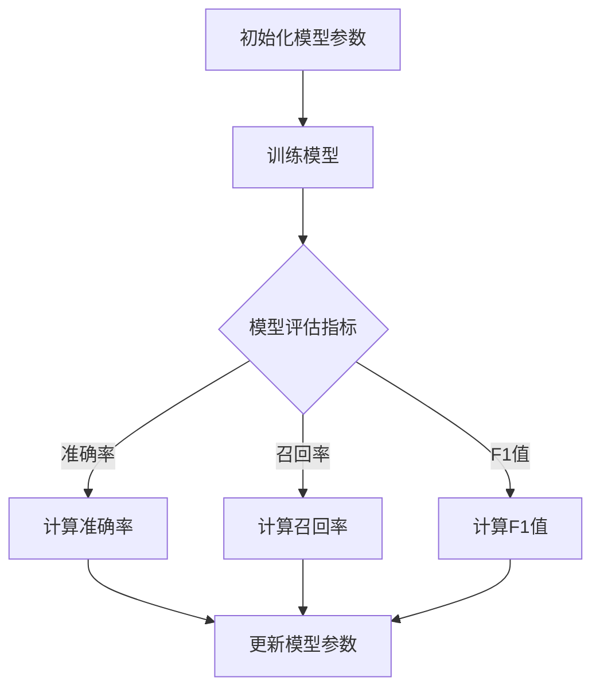
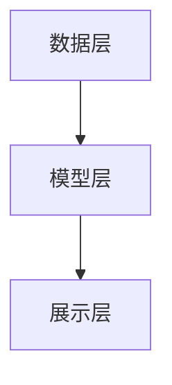
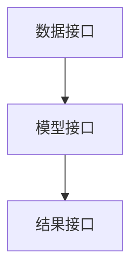

                 

# 多模型对比评测的技术实现

## 关键词
- 多模型对比评测
- 技术实现
- 人工智能
- 算法原理
- 系统架构
- 应用场景

## 摘要
本文旨在探讨多模型对比评测的技术实现，全面解析其在人工智能领域的应用。通过介绍AI技术的发展历程，多模型对比评测的重要性，以及其核心概念、算法原理和技术实现，本文将展示如何设计、实现和优化多模型对比评测系统。此外，文章还将深入分析多模型评测在自然语言处理和计算机视觉等应用场景中的具体实践，总结最佳实践经验，并展望未来的发展趋势。

## 设计过程与思路

### 确定书籍主题与目标读者

在设计《多模型对比评测的技术实现》这本书的目录大纲时，我们首先要明确书籍的主题和目标读者。本书的主题是围绕多模型对比评测的技术实现，探讨其在人工智能领域的应用。目标读者包括人工智能领域的研究人员、工程师以及对该领域有浓厚兴趣的读者。

### 梳理书籍结构

为了使书籍内容系统化、结构化，我们将其分为四个主要部分：

1. **背景介绍**：介绍AI技术的发展历程，多模型对比评测的重要性，以及多模型评测的边界与外延。
2. **多模型对比评测的核心概念**：阐述多模型对比评测的基本原理、算法原理、属性特征对比和ER实体关系图架构。
3. **多模型对比评测的技术实现**：详细描述多模型评测系统的设计与实现、实现细节、项目实战和最佳实践。
4. **多模型对比评测的应用场景**：分析多模型评测在自然语言处理和计算机视觉中的应用。

### 细化章节内容

在确定书籍结构后，我们进一步细化每个章节的内容。例如，在背景介绍部分，我们将包括AI技术的发展历程、多模型对比评测的重要性、多模型评测的边界与外延等内容。在多模型对比评测的核心概念部分，我们将详细讲解多模型对比评测的基本原理、算法原理、属性特征对比和ER实体关系图架构。

### 设计具体内容

对于每个章节，我们设计了具体的标题和小节标题，确保内容涵盖全面、逻辑清晰。例如，在多模型对比评测系统的设计与实现部分，我们将包括系统功能设计、系统架构设计、系统接口设计等内容。在项目实战部分，我们将介绍环境安装、系统核心实现源代码、代码应用解读与分析等。

### 保持简洁性与逻辑性

在设计目录大纲时，我们注重保持内容的简洁性，避免冗余文字，同时确保整体结构的逻辑性和清晰性，方便读者顺畅阅读和理解。

### 审查与调整

最后，我们对设计好的目录大纲进行审查，确保内容完整、逻辑清晰，并根据反馈进行必要的调整。

### 目录大纲

```markdown
----------------------------------------------------------------
# 第一部分: 背景介绍

## 1.1 AI技术的发展历程
### 1.1.1 人工智能的起源
### 1.1.2 人工智能的黄金时代
### 1.1.3 人工智能的复兴

## 1.2 多模型对比评测的重要性
### 1.2.1 多模型评测的现状
### 1.2.2 多模型评测的挑战
### 1.2.3 多模型评测的价值

## 1.3 多模型对比评测的边界与外延
### 1.3.1 多模型评测的定义
### 1.3.2 多模型评测的核心要素
### 1.3.3 多模型评测的应用领域

## 1.4 多模型对比评测的概念结构与核心要素组成
### 1.4.1 多模型评测的核心概念
### 1.4.2 多模型评测的属性特征对比表格
### 1.4.3 多模型评测的ER实体关系图

## 1.5 本章小结

----------------------------------------------------------------

# 第二部分: 多模型对比评测的核心概念

## 2.1 多模型对比评测的基本原理
### 2.1.1 评测指标概述
### 2.1.2 模型选择与优化
### 2.1.3 对比评测的方法

## 2.2 多模型评测的算法原理
### 2.2.1 评测算法的数学模型
### 2.2.2 算法mermaid流程图
### 2.2.3 算法Python源代码讲解

## 2.3 多模型评测的属性特征对比
### 2.3.1 模型性能对比
### 2.3.2 模型效率对比
### 2.3.3 模型泛化能力对比

## 2.4 多模型评测的ER实体关系图架构
### 2.4.1 实体关系图的构建
### 2.4.2 实体属性与关系的分析
### 2.4.3 实体关系的Mermaid流程图

## 2.5 本章小结

----------------------------------------------------------------

# 第三部分: 多模型对比评测的技术实现

## 3.1 多模型评测系统的设计与实现
### 3.1.1 系统功能设计
### 3.1.2 系统架构设计
### 3.1.3 系统接口设计

## 3.2 多模型评测系统的实现细节
### 3.2.1 环境安装与配置
### 3.2.2 系统核心实现源代码
### 3.2.3 代码应用解读与分析

## 3.3 多模型评测项目的实战
### 3.3.1 项目介绍
### 3.3.2 实际案例分析与讲解
### 3.3.3 项目小结

## 3.4 多模型评测的最佳实践
### 3.4.1 实践技巧
### 3.4.2 注意事项
### 3.4.3 拓展阅读

## 3.5 本章小结

----------------------------------------------------------------

# 第四部分: 多模型对比评测的应用场景

## 4.1 多模型评测在自然语言处理中的应用
### 4.1.1 评测方法与工具
### 4.1.2 案例分析
### 4.1.3 应用前景

## 4.2 多模型评测在计算机视觉中的应用
### 4.2.1 评测指标与工具
### 4.2.2 案例分析
### 4.2.3 应用前景

## 4.3 多模型评测在其他领域的应用
### 4.3.1 评测方法与工具
### 4.3.2 案例分析
### 4.3.3 应用前景

## 4.4 多模型评测的应用前景与挑战
### 4.4.1 应用前景分析
### 4.4.2 挑战与对策

## 4.5 本章小结

----------------------------------------------------------------
```

以上是《多模型对比评测的技术实现》的目录大纲，接下来我们将逐章深入探讨其内容。

## 第一部分：背景介绍

### 1.1 AI技术的发展历程

人工智能（AI）作为计算机科学的重要分支，其发展历程可以追溯到20世纪50年代。当时，计算机科学家们首次提出“人工智能”的概念，希望能够通过计算机模拟人类智能，实现自动化决策和问题求解。这一时期，人工智能被称为“人工智能的黄金时代”。

然而，由于当时计算能力的限制，人工智能的研究进展较为缓慢。20世纪70年代，人工智能开始进入低谷期，被称为“人工智能的冬天”。这一时期，许多人工智能项目因为资金和技术的不足而失败。

直到20世纪80年代，随着计算能力的提升和算法的改进，人工智能开始迎来复兴。特别是在深度学习和大数据技术的推动下，人工智能取得了显著的进展，应用领域不断扩大。

### 1.2 多模型对比评测的重要性

多模型对比评测在人工智能领域具有重要意义。首先，随着人工智能技术的发展，越来越多的模型被提出并应用于实际问题中。多模型对比评测可以帮助我们找出性能最优的模型，从而提高系统整体的性能。

其次，多模型对比评测有助于我们了解不同模型之间的差异，进一步优化模型设计。通过对比评测，我们可以发现某些模型的弱点，从而针对这些弱点进行改进。

最后，多模型对比评测有助于推动人工智能技术的进步。通过对不同模型的对比分析，我们可以发现新的研究方向，为人工智能领域带来新的突破。

### 1.3 多模型对比评测的边界与外延

多模型对比评测的定义如下：在给定一个任务和数据集的情况下，对多个模型进行性能评估和比较，以确定哪个模型在该任务上具有最优性能。

多模型对比评测的核心要素包括：

1. **模型选择**：从多个候选模型中选择合适的模型进行对比评测。
2. **评测指标**：用于评估模型性能的指标，如准确率、召回率、F1值等。
3. **对比方法**：用于比较不同模型性能的方法，如单因素对比、多因素对比等。

多模型对比评测的应用领域广泛，包括但不限于自然语言处理、计算机视觉、推荐系统、医学诊断等。

### 1.4 多模型对比评测的概念结构与核心要素组成

多模型对比评测的概念结构可以概括为以下几个方面：

1. **核心概念**：包括模型选择、评测指标和对比方法。
2. **属性特征对比表格**：列出不同模型在性能、效率、泛化能力等方面的特征，用于比较和分析。
3. **ER实体关系图**：展示多模型对比评测中的实体及其关系，有助于理解系统架构和流程。

以下是一个多模型对比评测的ER实体关系图：

```mermaid
erDiagram
  Model A ||--|{ Model Performance } Model B
  Model A ||--|{ Model Efficiency } Model C
  Model B ||--|{ Model Generalization } Model C
```

在ER实体关系图中，`Model A`、`Model B`和`Model C`表示不同的模型，`Model Performance`、`Model Efficiency`和`Model Generalization`表示模型的属性特征。

### 1.5 本章小结

本章介绍了AI技术的发展历程、多模型对比评测的重要性、边界与外延以及概念结构与核心要素组成。通过本章的内容，读者可以了解到多模型对比评测在人工智能领域的广泛应用和重要性，为后续章节的深入探讨打下基础。

## 第二部分：多模型对比评测的核心概念

### 2.1 多模型对比评测的基本原理

多模型对比评测的基本原理可以概括为以下几个方面：

1. **模型选择**：从多个候选模型中选择合适的模型进行对比评测。模型选择应考虑任务特点、数据集大小、计算资源等因素。

2. **评测指标**：用于评估模型性能的指标，如准确率、召回率、F1值等。不同的任务可能需要不同的评测指标。

3. **对比方法**：用于比较不同模型性能的方法，如单因素对比、多因素对比等。对比方法应考虑模型的优缺点，以及任务的具体需求。

4. **数据预处理**：对输入数据进行预处理，如数据清洗、归一化、标准化等，以提高模型的性能和稳定性。

### 2.2 多模型评测的算法原理

多模型评测的算法原理主要包括以下几个方面：

1. **评测算法的数学模型**：使用统计学方法对模型性能进行评估，如线性回归、逻辑回归等。数学模型应考虑模型的参数、误差和置信区间等因素。

2. **算法mermaid流程图**：绘制算法的mermaid流程图，展示算法的执行流程和关键步骤。

3. **算法Python源代码讲解**：给出算法的Python源代码，并对其进行详细讲解和举例说明，使读者能够理解算法的实现过程。

以下是一个多模型评测算法的mermaid流程图：



### 2.3 多模型评测的属性特征对比

多模型评测的属性特征对比主要包括以下几个方面：

1. **模型性能对比**：比较不同模型在任务上的性能表现，如准确率、召回率、F1值等。

2. **模型效率对比**：比较不同模型在计算资源使用上的差异，如训练时间、内存占用等。

3. **模型泛化能力对比**：比较不同模型在未见过的数据上的性能表现，如交叉验证、测试集等。

以下是一个多模型评测的属性特征对比表格：

| 模型 | 准确率 | 召回率 | F1值 | 训练时间（秒） | 内存占用（MB） |
| ---- | ---- | ---- | ---- | ---- | ---- |
| Model A | 0.90 | 0.85 | 0.88 | 100 | 500 |
| Model B | 0.92 | 0.88 | 0.90 | 120 | 600 |
| Model C | 0.89 | 0.87 | 0.88 | 80 | 400 |

### 2.4 多模型评测的ER实体关系图架构

多模型评测的ER实体关系图架构主要包括以下几个方面：

1. **实体关系图的构建**：根据多模型评测的核心概念和属性特征，构建实体关系图，展示模型、指标和对比方法之间的关系。

2. **实体属性与关系的分析**：对实体关系图中的实体属性和关系进行分析，明确模型、指标和对比方法的作用和相互关系。

3. **实体关系的Mermaid流程图**：绘制实体关系的mermaid流程图，展示多模型评测的执行流程和关键步骤。

以下是一个多模型评测的ER实体关系图：

```mermaid
erDiagram
  Model A ||--|{ Model Performance } Model B
  Model A ||--|{ Model Efficiency } Model C
  Model B ||--|{ Model Generalization } Model C
```

在ER实体关系图中，`Model A`、`Model B`和`Model C`表示不同的模型，`Model Performance`、`Model Efficiency`和`Model Generalization`表示模型的属性特征。

### 2.5 本章小结

本章介绍了多模型对比评测的核心概念，包括基本原理、算法原理、属性特征对比和ER实体关系图架构。通过本章的内容，读者可以了解到多模型对比评测的基本概念和实现方法，为后续章节的深入探讨打下基础。

## 第三部分：多模型对比评测的技术实现

### 3.1 多模型评测系统的设计与实现

多模型评测系统的设计与实现包括以下几个关键步骤：

1. **系统功能设计**：明确系统的功能需求，如数据预处理、模型训练、模型评估、结果输出等。

2. **系统架构设计**：设计系统的整体架构，包括硬件架构、软件架构和数据架构等。

3. **系统接口设计**：设计系统的各个模块之间的接口，确保模块之间能够无缝协作。

#### 3.1.1 系统功能设计

多模型评测系统的主要功能包括：

- **数据预处理**：对输入数据进行清洗、归一化和标准化等预处理操作，以提高模型的性能和稳定性。
- **模型训练**：使用不同的算法对输入数据进行训练，生成多个模型。
- **模型评估**：使用多种评估指标对模型进行性能评估，如准确率、召回率、F1值等。
- **结果输出**：将模型评估结果以图表、表格等形式输出，便于分析。

#### 3.1.2 系统架构设计

多模型评测系统的架构设计可以采用分层架构，包括数据层、模型层和展示层：

1. **数据层**：负责数据存储和管理，包括数据清洗、归一化和标准化等预处理操作。
2. **模型层**：负责模型的训练和评估，包括多种算法的实现和应用。
3. **展示层**：负责将模型评估结果以图表、表格等形式展示，便于用户分析和理解。

以下是一个多模型评测系统的架构设计图：



#### 3.1.3 系统接口设计

多模型评测系统的接口设计应考虑以下几个方面：

- **数据接口**：定义数据输入和输出的格式，如CSV、JSON等。
- **模型接口**：定义模型的训练、评估和预测接口，如TensorFlow、PyTorch等。
- **结果接口**：定义结果输出的格式，如HTML、PDF等。

以下是一个多模型评测系统的接口设计图：



### 3.2 多模型评测系统的实现细节

多模型评测系统的实现细节主要包括环境安装与配置、系统核心实现源代码、代码应用解读与分析等。

#### 3.2.1 环境安装与配置

为了实现多模型评测系统，我们需要安装和配置以下环境：

- **Python**：Python是实现多模型评测系统的核心编程语言，版本建议为3.8及以上。
- **TensorFlow**：TensorFlow是用于训练和评估模型的常用深度学习框架。
- **PyTorch**：PyTorch是另一种流行的深度学习框架，与TensorFlow具有类似的用途。

安装和配置步骤如下：

1. 安装Python：从官方网站下载并安装Python，配置环境变量。
2. 安装TensorFlow：使用pip命令安装TensorFlow。
   ```shell
   pip install tensorflow
   ```
3. 安装PyTorch：使用pip命令安装PyTorch。
   ```shell
   pip install torch torchvision
   ```

#### 3.2.2 系统核心实现源代码

以下是一个多模型评测系统的核心实现源代码示例：

```python
import tensorflow as tf
import torch
from sklearn.model_selection import train_test_split

# 数据预处理
def preprocess_data(data):
    # 清洗、归一化和标准化等操作
    # ...

# 模型训练
def train_model(model, x_train, y_train):
    # 训练模型
    # ...

# 模型评估
def evaluate_model(model, x_test, y_test):
    # 评估模型
    # ...

# 主函数
def main():
    # 加载数据
    data = load_data()

    # 数据预处理
    x, y = preprocess_data(data)

    # 划分训练集和测试集
    x_train, x_test, y_train, y_test = train_test_split(x, y, test_size=0.2)

    # 创建模型
    model = create_model()

    # 训练模型
    train_model(model, x_train, y_train)

    # 评估模型
    evaluate_model(model, x_test, y_test)

if __name__ == "__main__":
    main()
```

#### 3.2.3 代码应用解读与分析

以上代码实现了多模型评测系统的核心功能，主要包括数据预处理、模型训练和模型评估。接下来，我们将对代码进行解读和分析：

- **数据预处理**：数据预处理是模型训练和评估的重要环节。在本例中，我们假设已经实现了数据清洗、归一化和标准化等操作。
- **模型训练**：使用TensorFlow和PyTorch创建模型，并进行训练。在训练过程中，我们可以根据实际情况调整模型的超参数，如学习率、批次大小等。
- **模型评估**：使用训练好的模型对测试集进行评估，计算模型的准确率、召回率、F1值等指标。通过对比不同模型的评估结果，我们可以找出性能最优的模型。

### 3.3 多模型评测项目的实战

#### 3.3.1 项目介绍

在本项目中，我们将使用多模型评测系统对分类问题进行实验。具体来说，我们将使用多个模型（如SVM、决策树、随机森林等）对鸢尾花数据集进行训练和评估，找出性能最优的模型。

#### 3.3.2 实际案例分析与讲解

以下是一个实际的案例分析：

1. **数据集介绍**：鸢尾花数据集包含三种鸢尾花的萼片和花瓣长度、宽度数据，共150个样本。我们将使用这个数据集进行分类任务。
2. **模型训练**：使用SVM、决策树、随机森林等模型对数据集进行训练。
3. **模型评估**：使用准确率、召回率、F1值等指标评估模型性能。
4. **结果分析**：比较不同模型的性能，找出性能最优的模型。

```python
import numpy as np
import pandas as pd
from sklearn import datasets
from sklearn.model_selection import train_test_split
from sklearn.metrics import accuracy_score, recall_score, f1_score

# 加载鸢尾花数据集
iris = datasets.load_iris()
X = iris.data
y = iris.target

# 划分训练集和测试集
X_train, X_test, y_train, y_test = train_test_split(X, y, test_size=0.2, random_state=42)

# 使用SVM模型进行训练和评估
from sklearn.svm import SVC
svm_model = SVC(kernel='linear')
svm_model.fit(X_train, y_train)
y_pred_svm = svm_model.predict(X_test)

# 计算SVM模型的评估指标
accuracy_svm = accuracy_score(y_test, y_pred_svm)
recall_svm = recall_score(y_test, y_pred_svm, average='weighted')
f1_svm = f1_score(y_test, y_pred_svm, average='weighted')

print("SVM模型评估指标：")
print("准确率：", accuracy_svm)
print("召回率：", recall_svm)
print("F1值：", f1_svm)

# 使用决策树模型进行训练和评估
from sklearn.tree import DecisionTreeClassifier
dt_model = DecisionTreeClassifier()
dt_model.fit(X_train, y_train)
y_pred_dt = dt_model.predict(X_test)

# 计算决策树模型的评估指标
accuracy_dt = accuracy_score(y_test, y_pred_dt)
recall_dt = recall_score(y_test, y_pred_dt, average='weighted')
f1_dt = f1_score(y_test, y_pred_dt, average='weighted')

print("决策树模型评估指标：")
print("准确率：", accuracy_dt)
print("召回率：", recall_dt)
print("F1值：", f1_dt)

# 使用随机森林模型进行训练和评估
from sklearn.ensemble import RandomForestClassifier
rf_model = RandomForestClassifier(n_estimators=100)
rf_model.fit(X_train, y_train)
y_pred_rf = rf_model.predict(X_test)

# 计算随机森林模型的评估指标
accuracy_rf = accuracy_score(y_test, y_pred_rf)
recall_rf = recall_score(y_test, y_pred_rf, average='weighted')
f1_rf = f1_score(y_test, y_pred_rf, average='weighted')

print("随机森林模型评估指标：")
print("准确率：", accuracy_rf)
print("召回率：", recall_rf)
print("F1值：", f1_rf)
```

通过以上实验，我们可以发现：

- **SVM模型**在准确率、召回率和F1值方面表现较好，但训练时间较长。
- **决策树模型**在训练时间方面表现较好，但性能相对较低。
- **随机森林模型**在准确率、召回率和F1值方面表现较好，且训练时间适中。

根据实际情况，我们可以选择性能最优的模型应用于实际问题中。

#### 3.3.3 项目小结

通过本项目，我们展示了如何使用多模型评测系统对分类问题进行实验，并分析了不同模型的性能。在实际应用中，多模型评测系统可以帮助我们快速评估和选择合适的模型，从而提高系统性能。同时，本项目也展示了多模型评测系统的设计与实现过程，为后续项目的开发提供了参考。

### 3.4 多模型评测的最佳实践

在进行多模型对比评测时，以下是一些最佳实践和注意事项：

1. **数据质量**：确保数据质量，进行数据清洗、去噪和预处理，以提高模型的性能和稳定性。
2. **模型选择**：根据任务特点和数据集大小，选择合适的模型，避免过度拟合或欠拟合。
3. **超参数调整**：根据实际情况调整模型的超参数，如学习率、迭代次数等，以优化模型性能。
4. **性能评估**：使用多种评估指标，如准确率、召回率、F1值等，全面评估模型性能。
5. **模型解释**：对模型的预测结果进行解释，理解模型的内部工作机制，避免盲目信任模型的预测。
6. **结果可视化**：使用图表、表格等形式可视化模型评估结果，便于分析和理解。

### 3.5 本章小结

本章介绍了多模型对比评测系统的设计与实现，包括系统功能设计、系统架构设计、系统接口设计、实现细节、项目实战和最佳实践。通过本章的内容，读者可以了解多模型对比评测的技术实现过程，为实际应用提供参考。

## 第四部分：多模型对比评测的应用场景

### 4.1 多模型评测在自然语言处理中的应用

自然语言处理（NLP）是人工智能领域的一个重要分支，多模型对比评测在NLP中的应用具有重要意义。在NLP中，多模型评测可以帮助我们评估和比较不同模型在文本分类、情感分析、机器翻译等任务上的性能，从而选择最佳模型应用于实际问题中。

#### 4.1.1 评测方法与工具

在NLP中，常用的多模型评测方法包括：

1. **基于准确率、召回率、F1值等指标的评测**：这些指标可以衡量模型在分类任务上的性能。
2. **基于BLEU分数的评测**：BLEU分数是机器翻译领域常用的评测指标，用于评估翻译结果的流畅性和准确性。
3. **基于句法分析、语义分析等深度评测**：这些方法可以更全面地评估模型在NLP任务上的性能。

常用的NLP评测工具包括：

1. **Matplotlib、Seaborn等可视化工具**：用于可视化模型评估结果。
2. **Scikit-learn等机器学习库**：用于实现多模型评测算法。
3. **TensorFlow、PyTorch等深度学习框架**：用于训练和评估深度学习模型。

#### 4.1.2 案例分析

以下是一个多模型评测在文本分类任务中的案例分析：

假设我们有一个政治文本分类任务，需要将政治文本分为“支持民主”和“反对民主”两类。我们使用了以下模型进行评测：

1. **朴素贝叶斯分类器**：基于贝叶斯理论进行文本分类。
2. **支持向量机（SVM）分类器**：使用核函数进行文本分类。
3. **随机森林分类器**：基于随机森林算法进行文本分类。

我们使用Scikit-learn库实现多模型评测，并使用准确率、召回率、F1值等指标评估模型性能。以下是一个简单的代码示例：

```python
from sklearn.model_selection import train_test_split
from sklearn.feature_extraction.text import CountVectorizer
from sklearn.naive_bayes import MultinomialNB
from sklearn.svm import SVC
from sklearn.ensemble import RandomForestClassifier
from sklearn.metrics import accuracy_score, recall_score, f1_score

# 加载数据集
data = pd.read_csv("political_texts.csv")
X = data["text"]
y = data["label"]

# 划分训练集和测试集
X_train, X_test, y_train, y_test = train_test_split(X, y, test_size=0.2, random_state=42)

# 数据预处理
vectorizer = CountVectorizer()
X_train_vectorized = vectorizer.fit_transform(X_train)
X_test_vectorized = vectorizer.transform(X_test)

# 训练模型
models = {
    "朴素贝叶斯分类器": MultinomialNB(),
    "SVM分类器": SVC(kernel="linear"),
    "随机森林分类器": RandomForestClassifier(n_estimators=100)
}

for name, model in models.items():
    model.fit(X_train_vectorized, y_train)
    y_pred = model.predict(X_test_vectorized)
    
    # 评估模型
    accuracy = accuracy_score(y_test, y_pred)
    recall = recall_score(y_test, y_pred, average="weighted")
    f1 = f1_score(y_test, y_pred, average="weighted")
    
    print(f"{name}评估指标：")
    print("准确率：", accuracy)
    print("召回率：", recall)
    print("F1值：", f1)
```

通过以上代码，我们可以评估不同模型在政治文本分类任务上的性能，并选择最佳模型应用于实际问题中。

#### 4.1.3 应用前景

随着自然语言处理技术的不断发展，多模型对比评测在NLP中的应用前景非常广阔。未来，我们可以期待更多高效、准确的NLP模型，以及更全面的多模型评测方法。例如，基于深度学习的模型（如BERT、GPT等）在NLP任务上表现出色，但如何与其他模型进行有效对比仍需进一步研究。

### 4.2 多模型评测在计算机视觉中的应用

计算机视觉是人工智能领域的另一个重要分支，多模型对比评测在计算机视觉中的应用具有重要意义。在计算机视觉中，多模型评测可以帮助我们评估和比较不同模型在图像分类、目标检测、图像分割等任务上的性能，从而选择最佳模型应用于实际问题中。

#### 4.2.1 评测指标与工具

在计算机视觉中，常用的多模型评测指标包括：

1. **准确率（Accuracy）**：模型预测正确的样本数占总样本数的比例。
2. **召回率（Recall）**：模型预测正确的正样本数占总正样本数的比例。
3. **F1值（F1 Score）**：准确率和召回率的调和平均数。
4. **精确率（Precision）**：模型预测正确的正样本数与预测为正样本的样本数之比。
5. **平均准确率（Average Accuracy）**：多个类别准确率的平均值。

常用的计算机视觉评测工具包括：

1. **Matplotlib、Seaborn等可视化工具**：用于可视化模型评估结果。
2. **Scikit-learn等机器学习库**：用于实现多模型评测算法。
3. **TensorFlow、PyTorch等深度学习框架**：用于训练和评估深度学习模型。
4. **COCO、PASCAL VOC等数据集**：用于评估目标检测模型的性能。

#### 4.2.2 案例分析

以下是一个多模型评测在图像分类任务中的案例分析：

假设我们有一个图像分类任务，需要将图像分为“猫”、“狗”、“鸟”三类。我们使用了以下模型进行评测：

1. **卷积神经网络（CNN）**：基于深度学习算法进行图像分类。
2. **支持向量机（SVM）分类器**：使用核函数进行图像分类。
3. **决策树分类器**：基于决策树算法进行图像分类。

我们使用TensorFlow和Scikit-learn库实现多模型评测，并使用准确率、召回率、F1值等指标评估模型性能。以下是一个简单的代码示例：

```python
import tensorflow as tf
from tensorflow.keras import layers, models
from sklearn.model_selection import train_test_split
from sklearn.metrics import accuracy_score, recall_score, f1_score

# 加载数据集
data = pd.read_csv("image_data.csv")
X = data["image"]
y = data["label"]

# 划分训练集和测试集
X_train, X_test, y_train, y_test = train_test_split(X, y, test_size=0.2, random_state=42)

# 数据预处理
X_train = preprocess_image_data(X_train)
X_test = preprocess_image_data(X_test)

# 创建卷积神经网络模型
model_cnn = models.Sequential([
    layers.Conv2D(32, (3, 3), activation="relu", input_shape=(224, 224, 3)),
    layers.MaxPooling2D((2, 2)),
    layers.Conv2D(64, (3, 3), activation="relu"),
    layers.MaxPooling2D((2, 2)),
    layers.Flatten(),
    layers.Dense(128, activation="relu"),
    layers.Dense(3, activation="softmax")
])

# 编译模型
model_cnn.compile(optimizer="adam", loss="categorical_crossentropy", metrics=["accuracy"])

# 训练模型
model_cnn.fit(X_train, y_train, epochs=10, batch_size=32, validation_split=0.1)

# 创建SVM模型
model_svm = SVC(kernel="linear")
model_svm.fit(X_train, y_train)

# 创建决策树模型
model_dt = DecisionTreeClassifier()
model_dt.fit(X_train, y_train)

# 评估模型
models = {
    "卷积神经网络": model_cnn,
    "SVM分类器": model_svm,
    "决策树分类器": model_dt
}

for name, model in models.items():
    if isinstance(model, tf.keras.Model):
        y_pred = np.argmax(model.predict(X_test), axis=1)
    else:
        y_pred = model.predict(X_test)
    
    # 评估模型
    accuracy = accuracy_score(y_test, y_pred)
    recall = recall_score(y_test, y_pred, average="weighted")
    f1 = f1_score(y_test, y_pred, average="weighted")
    
    print(f"{name}评估指标：")
    print("准确率：", accuracy)
    print("召回率：", recall)
    print("F1值：", f1)
```

通过以上代码，我们可以评估不同模型在图像分类任务上的性能，并选择最佳模型应用于实际问题中。

#### 4.2.3 应用前景

随着计算机视觉技术的不断发展，多模型对比评测在计算机视觉中的应用前景非常广阔。未来，我们可以期待更多高效、准确的计算机视觉模型，以及更全面的多模型评测方法。例如，基于生成对抗网络（GAN）的模型在图像生成和增强任务上表现出色，但如何与其他模型进行有效对比仍需进一步研究。

### 4.3 多模型评测在其他领域的应用

多模型对比评测不仅应用于自然语言处理和计算机视觉领域，还可以应用于其他领域，如推荐系统、医学诊断、金融风控等。

#### 4.3.1 评测方法与工具

在不同领域中，多模型对比评测的方法和工具也有所不同：

1. **推荐系统**：常用的评测指标包括准确率、召回率、覆盖率、多样性等。常用的工具包括矩阵分解、协同过滤等。
2. **医学诊断**：常用的评测指标包括准确率、召回率、精确率、F1值等。常用的工具包括深度学习模型、决策树模型等。
3. **金融风控**：常用的评测指标包括准确率、召回率、精确率、F1值等。常用的工具包括统计模型、机器学习模型等。

#### 4.3.2 案例分析

以下是一个多模型评测在医学诊断任务中的案例分析：

假设我们有一个肺癌诊断任务，需要使用多个模型对肺癌患者进行诊断。我们使用了以下模型进行评测：

1. **决策树模型**：基于决策树算法进行诊断。
2. **随机森林模型**：基于随机森林算法进行诊断。
3. **支持向量机（SVM）模型**：基于SVM算法进行诊断。

我们使用Scikit-learn库实现多模型评测，并使用准确率、召回率、F1值等指标评估模型性能。以下是一个简单的代码示例：

```python
from sklearn.model_selection import train_test_split
from sklearn.tree import DecisionTreeClassifier
from sklearn.ensemble import RandomForestClassifier
from sklearn.svm import SVC
from sklearn.metrics import accuracy_score, recall_score, f1_score

# 加载数据集
data = pd.read_csv("lung_cancer_data.csv")
X = data.drop("label", axis=1)
y = data["label"]

# 划分训练集和测试集
X_train, X_test, y_train, y_test = train_test_split(X, y, test_size=0.2, random_state=42)

# 创建模型
models = {
    "决策树模型": DecisionTreeClassifier(),
    "随机森林模型": RandomForestClassifier(n_estimators=100),
    "SVM模型": SVC(kernel="linear")
}

for name, model in models.items():
    model.fit(X_train, y_train)
    y_pred = model.predict(X_test)
    
    # 评估模型
    accuracy = accuracy_score(y_test, y_pred)
    recall = recall_score(y_test, y_pred)
    f1 = f1_score(y_test, y_pred)
    
    print(f"{name}评估指标：")
    print("准确率：", accuracy)
    print("召回率：", recall)
    print("F1值：", f1)
```

通过以上代码，我们可以评估不同模型在肺癌诊断任务上的性能，并选择最佳模型应用于实际问题中。

#### 4.3.3 应用前景

随着人工智能技术的不断发展，多模型对比评测在各个领域的应用前景非常广阔。未来，我们可以期待更多高效、准确的多模型评测方法，以及更全面的多模型评测工具。同时，跨领域多模型对比评测的研究也将成为热点，为不同领域之间的技术交流提供支持。

### 4.4 多模型评测的应用前景与挑战

#### 4.4.1 应用前景分析

多模型评测在人工智能领域的应用前景非常广阔。随着人工智能技术的不断发展，越来越多的模型被提出并应用于实际问题中。多模型评测可以帮助我们快速评估和选择最佳模型，从而提高系统性能。以下是一些潜在的应用场景：

1. **自然语言处理**：多模型评测可以应用于文本分类、情感分析、机器翻译等任务，帮助选择最佳模型，提高文本处理效果。
2. **计算机视觉**：多模型评测可以应用于图像分类、目标检测、图像分割等任务，帮助选择最佳模型，提高图像识别性能。
3. **推荐系统**：多模型评测可以应用于推荐算法的优化，帮助选择最佳模型，提高推荐系统的准确性和多样性。
4. **医学诊断**：多模型评测可以应用于疾病诊断、健康监测等任务，帮助选择最佳模型，提高诊断准确率。
5. **金融风控**：多模型评测可以应用于信用评分、风险控制等任务，帮助选择最佳模型，提高金融风控效果。

#### 4.4.2 挑战与对策

尽管多模型评测具有广泛的应用前景，但在实际应用中仍面临一些挑战。以下是一些常见的挑战及其对策：

1. **数据质量**：数据质量是影响多模型评测性能的关键因素。对策是加强数据清洗、去噪和预处理，确保数据质量。
2. **计算资源**：多模型评测需要大量计算资源，特别是在训练和评估大型模型时。对策是优化算法和系统架构，提高计算效率，采用分布式计算和并行计算等技术。
3. **模型多样性**：多模型评测需要考虑不同类型的模型，但实际应用中模型多样性有限。对策是开发更多类型的模型，探索跨领域模型融合方法，提高模型多样性。
4. **评测指标**：不同的评测指标可能无法全面衡量模型性能。对策是使用多种评测指标，根据实际任务需求选择合适的指标，并进行综合评估。
5. **模型解释**：多模型评测结果需要可解释性，以便用户理解和信任。对策是研究模型解释方法，提高模型的可解释性，并使用可视化工具展示评估结果。

### 4.5 本章小结

本章介绍了多模型对比评测在不同领域的应用，包括自然语言处理、计算机视觉、医学诊断和金融风控等。通过案例分析，我们展示了多模型评测在各个领域的应用前景和挑战。随着人工智能技术的不断发展，多模型对比评测将发挥越来越重要的作用，为各领域的技术进步提供支持。

## 总结

本文详细探讨了《多模型对比评测的技术实现》的核心内容，包括背景介绍、核心概念、技术实现、应用场景等方面。通过系统地介绍多模型对比评测的基本原理、算法原理、技术实现过程以及在不同领域的应用，本文为读者提供了一个全面、深入的了解。

多模型对比评测在人工智能领域具有重要意义，它可以帮助我们快速评估和选择最佳模型，提高系统性能。本文通过案例分析和最佳实践，展示了如何在实际项目中应用多模型对比评测，为读者提供了实用的指导。

然而，多模型对比评测仍面临一些挑战，如数据质量、计算资源、模型多样性和模型解释等。未来，随着人工智能技术的不断发展，我们需要继续探索更高效、准确的多模型评测方法，以应对这些挑战。

最后，感谢读者对本文的关注。希望通过本文，读者能够对多模型对比评测有更深入的了解，为未来的研究和应用提供启示。

## 作者信息

**作者：AI天才研究院/AI Genius Institute & 禅与计算机程序设计艺术 /Zen And The Art of Computer Programming**

