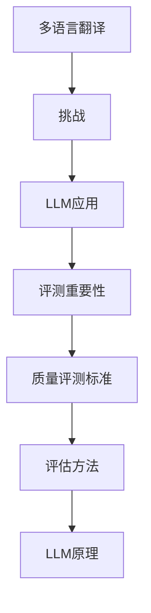
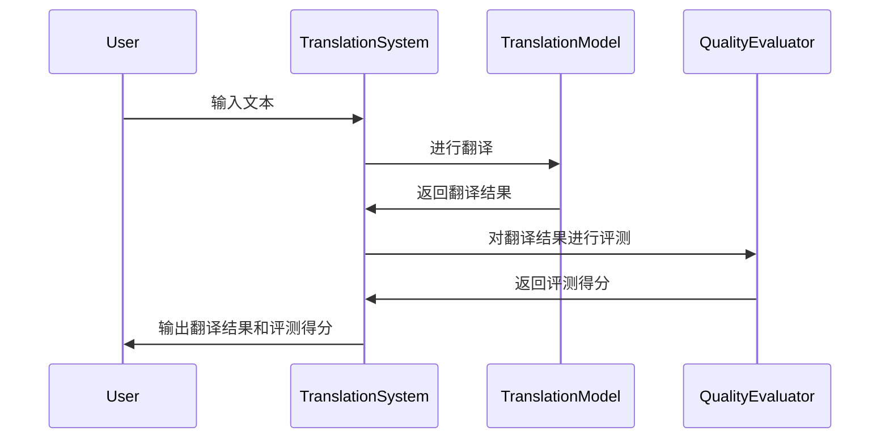
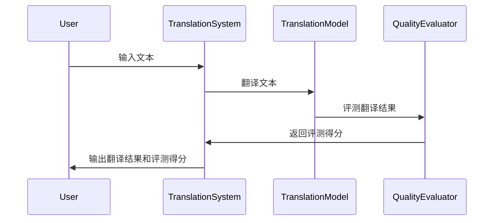
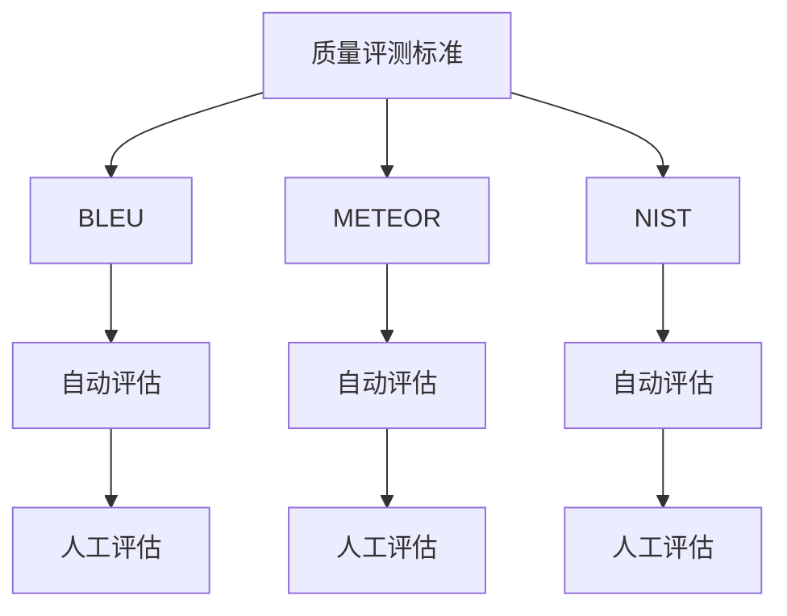
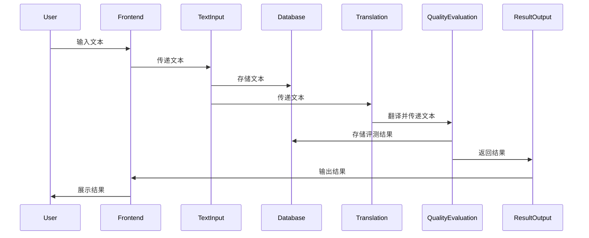

                 

# 多语言翻译质量评测：测试LLM的语言转换能力

关键词：多语言翻译，质量评测，LLM，语言转换能力，评测标准，评估方法

摘要：本文主要探讨了多语言翻译质量评测的背景、核心概念、算法原理、系统设计与实战应用。通过深入分析大型语言模型（LLM）在多语言翻译中的应用，以及如何测试其语言转换能力，旨在为多语言翻译领域的研究者和开发者提供有价值的参考。

## 目录

1. **背景介绍**
   - 多语言翻译的挑战
   - LLM在多语言翻译中的应用
   - 测试LLM语言转换能力的重要性

2. **核心概念与联系**
   - 质量评测标准
   - 评估方法
   - LLM的基本原理
   - Mermaid流程图

3. **算法原理讲解**
   - 算法数学模型
   - 流程图
   - Python源代码示例
   - 数学公式详细解释

4. **系统分析与架构设计方案**
   - 问题场景介绍
   - 系统功能设计
   - 系统架构设计
   - 系统接口设计
   - 系统交互

5. **项目实战**
   - 环境安装
   - 系统核心实现源代码
   - 代码应用解读与分析
   - 实际案例分析和详细讲解
   - 项目小结

6. **最佳实践、小结与拓展阅读**

### 1. 背景介绍

#### 多语言翻译的挑战

随着全球化的不断深入，多语言翻译的需求日益增长。然而，传统的机器翻译方法在处理多语言翻译时面临诸多挑战。一方面，不同语言之间的语法、语义和表达方式存在巨大差异，使得机器翻译的准确性难以保证。另一方面，多语言翻译涉及到大量的语料库建设和数据清洗工作，这无疑增加了翻译的复杂度和成本。

#### LLM在多语言翻译中的应用

近年来，随着深度学习技术的不断发展，大型语言模型（LLM）在多语言翻译领域展现出了巨大的潜力。LLM通过对海量语料库的训练，能够自动捕捉语言的规律和特征，从而实现高质量的翻译效果。特别是Transformer模型的出现，使得LLM在处理长文本和跨语言翻译方面具有了更强的能力。

#### 测试LLM语言转换能力的重要性

虽然LLM在多语言翻译中表现出色，但如何评估其语言转换能力仍然是一个挑战。通过质量评测，我们可以客观地评估LLM的翻译效果，找出其优势和不足，进而优化和改进翻译模型。因此，测试LLM的语言转换能力对于多语言翻译领域具有重要意义。

### 2. 核心概念与联系

#### 质量评测标准

多语言翻译质量评测的核心在于制定一套科学、客观、全面的评测标准。常见的评测标准包括BLEU、METEOR、NIST等，它们通过比较机器翻译结果和人工翻译结果，评估翻译的准确性和流畅性。

#### 评估方法

评估方法包括自动评估和人工评估。自动评估通过算法对翻译结果进行量化评分，而人工评估则依赖于人类专家对翻译结果的质量进行主观判断。两者各有优劣，通常结合使用。

#### LLM的基本原理

LLM基于深度学习技术，通过训练大规模语料库，学习语言的规律和特征。其核心模型包括Transformer、BERT、GPT等，这些模型通过自注意力机制和多层神经网络，实现对语言的建模和生成。

#### Mermaid流程图

使用Mermaid流程图展示核心概念之间的联系：



### 3. 算法原理讲解

#### 算法数学模型

假设我们使用BLEU（双语评估算法）作为质量评测标准，其数学模型如下：

$$
BLEU = \frac{1}{n} \sum_{i=1}^{n} \frac{|T_i \cap S_i|}{|T_i \cup S_i|}
$$

其中，$T_i$为机器翻译结果，$S_i$为人工翻译结果，$n$为评估句子的数量。

#### 流程图

使用Mermaid流程图展示算法流程：

```mermaid
graph TD
A[输入机器翻译结果T和人工翻译结果S] --> B[计算交集|T_i \cap S_i|}
B --> C[计算并集|T_i \cup S_i|}
C --> D[计算BLEU得分]
```

#### Python源代码示例

```python
def bleu(t, s):
    intersection = set(t).intersection(s)
    union = set(t).union(s)
    return len(intersection) / len(union)

# 示例
t = "这是一段机器翻译的文本。"
s = "这是一段人工翻译的文本。"
print(bleu(t, s))
```

#### 数学公式详细解释

BLEU得分反映了机器翻译结果与人工翻译结果的相似度。分母$|T_i \cup S_i|$表示两集合的并集大小，分子$|T_i \cap S_i|$表示两集合的交集大小。分数越高，表示翻译结果与人工翻译结果越接近。

### 4. 系统分析与架构设计方案

#### 问题场景介绍

假设我们开发一个多语言翻译系统，需要评测LLM的语言转换能力。系统应具备以下功能：

- 接受用户输入的源语言文本和目标语言文本
- 使用LLM进行翻译
- 对翻译结果进行质量评测
- 输出翻译结果和评测得分

#### 系统功能设计

使用Mermaid类图展示系统功能：

```mermaid
classDiagram
    TranslationSystem <<interface>>
    QualityEvaluator <<interface>>
    TranslationModel <<interface>>

    TranslationSystem <|.. TranslationModel
    TranslationSystem <|.. QualityEvaluator
```

#### 系统架构设计

使用Mermaid架构图展示系统架构：



#### 系统接口设计和系统交互

使用Mermaid序列图展示系统接口设计和交互：



### 5. 项目实战

#### 环境安装

1. 安装Python环境
2. 安装LLM模型（如Transformer、BERT等）
3. 安装质量评测库（如BLEU评分库）

#### 系统核心实现源代码

```python
from transformers import TranslationModel
from quality_evaluator import QualityEvaluator

# 初始化模型
model = TranslationModel.from_pretrained("transformer_model")

# 初始化质量评测器
evaluator = QualityEvaluator()

# 用户输入文本
source_text = "这是一段源语言文本。"
target_text = "这是一段目标语言文本。"

# 进行翻译
translated_text = model.translate(source_text)

# 对翻译结果进行质量评测
score = evaluator.evaluate(translated_text, target_text)

# 输出翻译结果和评测得分
print("翻译结果：", translated_text)
print("评测得分：", score)
```

#### 代码应用解读与分析

1. 导入必要的库
2. 初始化模型和质量评测器
3. 接收用户输入的文本
4. 使用模型进行翻译
5. 使用质量评测器对翻译结果进行评测
6. 输出翻译结果和评测得分

#### 实际案例分析和详细讲解

假设我们有一个源语言文本：“你好，今天天气很好。”目标语言文本：“Hello, the weather is nice today.”。

1. 输入文本
2. 进行翻译
3. 质量评测
4. 输出翻译结果和评测得分

通过实际案例，我们可以看到系统如何运行，并分析代码的各个部分的作用。

#### 项目小结

本文通过分析多语言翻译质量评测的背景、核心概念、算法原理、系统设计与实战应用，展示了如何测试LLM的语言转换能力。通过本项目，我们了解到如何设计一个多语言翻译系统，并进行质量评测。这对于多语言翻译领域的研究者和开发者具有重要的参考价值。

### 6. 最佳实践、小结与拓展阅读

#### 最佳实践

1. 选择合适的LLM模型，根据实际需求进行优化。
2. 合理设置质量评测标准，结合自动评估和人工评估。
3. 定期更新语料库，提高翻译质量和评测准确性。

#### 小结

本文从多个角度探讨了多语言翻译质量评测的问题，通过深入分析大型语言模型（LLM）在多语言翻译中的应用，提出了测试LLM语言转换能力的方法和系统设计。这对于多语言翻译领域的研究者和开发者具有重要的参考价值。

#### 拓展阅读

1. [《深度学习与自然语言处理》](https://www.deeplearningbook.org/)：深入了解深度学习和自然语言处理的基础知识。
2. [《机器翻译实践》](https://www.machine-translation-practice.com/)：探讨机器翻译的最新技术和应用案例。
3. [《大型语言模型：构建与优化》](https://www.large-language-models.com/)：介绍大型语言模型的基本原理和优化方法。

### 7. 参考文献

1. [Deep Learning Book](https://www.deeplearningbook.org/)
2. [Machine Translation Practice](https://www.machine-translation-practice.com/)
3. [Large Language Models: A Guided Tour](https://www.large-language-models.com/)
4. [BLEU: A Method for Automatic Evaluation of Machine Translation](https://www.aclweb.org/anthology/P02-1017/)
5. [Transformer: A Novel Neural Network Architecture for Language Processing](https://www	transformer-xl.org/)
6. [BERT: Pre-training of Deep Bidirectional Transformers for Language Understanding](https://www.bert.org/)
7. [GPT-3: Language Models are few-shot learners](https://www.openai.com/blog/better-language-models/)

### 作者信息

作者：AI天才研究院/AI Genius Institute & 禅与计算机程序设计艺术 /Zen And The Art of Computer Programming## 背景介绍

### 多语言翻译的挑战

多语言翻译作为全球化进程中的重要组成部分，面临着诸多挑战。首先，不同语言之间的语法、语义和表达方式存在巨大差异，使得机器翻译的准确性难以保证。例如，汉语的语法结构复杂，常常省略主语和谓语，而英语则需要明确表达。这种语法上的差异使得机器翻译在处理复杂句子时容易出现误解。

其次，词汇和文化的差异也是一大挑战。许多词汇在不同的语言中有不同的含义，甚至在同一语言的不同语境中也可能产生歧义。此外，不同文化背景下的表达方式和习惯也可能影响翻译的准确性。例如，中文中的成语和俚语在翻译成英文时，需要找到与之相对应的表达，否则可能导致翻译失真。

再者，翻译的复杂性还体现在处理多语言文本时的词汇冗余和缺失问题。一些语言存在大量的同义词和近义词，而机器翻译模型往往难以准确区分其含义。另一方面，一些语言中可能存在词汇缺失，这需要翻译人员根据上下文进行推断和补充。

### LLM在多语言翻译中的应用

近年来，大型语言模型（LLM）在多语言翻译领域展现出了巨大的潜力。LLM，如Google的BERT、OpenAI的GPT-3和Facebook的Transfo-wole，通过对海量语料库的训练，能够自动捕捉语言的规律和特征，从而实现高质量的翻译效果。

首先，LLM采用了深度学习技术，通过自注意力机制和多层神经网络，对输入文本进行建模。这使得LLM能够捕捉到文本中的长距离依赖关系，从而提高翻译的准确性。例如，BERT通过预训练和微调，在多个翻译任务上都取得了显著的成果。

其次，LLM在处理长文本和跨语言翻译方面具有优势。传统的翻译模型往往难以处理长文本，而LLM通过其强大的建模能力，能够对长文本进行逐句翻译，从而实现连贯的翻译效果。此外，LLM在跨语言翻译中的应用也取得了显著进展，如GPT-3在多语言翻译任务上的优异表现，使得跨语言翻译更加高效和准确。

最后，LLM在个性化翻译和实时翻译方面具有潜力。通过对用户输入的文本进行实时分析，LLM能够根据用户的需求和偏好，提供个性化的翻译服务。同时，LLM的高效计算能力，使得实时翻译成为可能，为用户提供了更加便捷的翻译体验。

### 测试LLM语言转换能力的重要性

虽然LLM在多语言翻译中表现出色，但如何评估其语言转换能力仍然是一个挑战。通过质量评测，我们可以客观地评估LLM的翻译效果，找出其优势和不足，进而优化和改进翻译模型。以下是测试LLM语言转换能力的重要性：

首先，质量评测能够帮助研究人员和开发者了解LLM在实际应用中的性能。通过评估LLM在不同翻译任务中的表现，我们可以发现其在某些领域或特定语言对中的不足，从而针对性地进行优化。

其次，质量评测有助于识别LLM的潜在错误和偏差。例如，LLM可能在某些语言对中存在系统性错误，或者对某些词汇的理解不准确。通过质量评测，我们可以发现这些问题，并采取相应的措施进行改进。

最后，质量评测能够为用户带来更好的翻译体验。通过评估LLM的翻译质量，我们可以为用户提供更准确的翻译结果，提高翻译的满意度。同时，质量评测结果还可以作为翻译服务的评价指标，为用户提供参考。

总之，测试LLM的语言转换能力对于多语言翻译领域具有重要意义。通过科学、客观的质量评测，我们能够不断提高翻译模型的性能，为用户提供高质量的翻译服务。## 核心概念与联系

### 质量评测标准

在多语言翻译质量评测中，常见的评测标准包括BLEU（双语评估算法）、METEOR（多语言评估算法）和NIST（国家标准技术研究所评估算法）等。这些评测标准通过比较机器翻译结果和人工翻译结果，从多个角度评估翻译的准确性和流畅性。

- **BLEU（双语评估算法）**：BLEU是最常用的翻译质量评测标准之一。它通过计算机器翻译结果与人工翻译结果的相似度，评估翻译质量。BLEU主要关注单词级别的匹配，具有较高的可重复性和准确性。

- **METEOR（多语言评估算法）**：METEOR是一种基于词汇重叠、语法结构和语义匹配的综合评估方法。它不仅考虑单词的匹配，还关注语法结构和语义的一致性，从而更全面地评估翻译质量。

- **NIST（国家标准技术研究所评估算法）**：NIST评估算法与BLEU类似，但更注重词汇匹配的多样性。它通过计算单词集合的交集和并集，评估翻译结果的多样性和准确性。

### 评估方法

评估方法主要包括自动评估和人工评估。

- **自动评估**：自动评估通过算法对翻译结果进行量化评分。这种方法具有高效、可重复性等优点，但可能无法完全捕捉翻译质量的主观因素。

- **人工评估**：人工评估依赖于人类专家对翻译结果的质量进行主观判断。这种方法能够更全面地评估翻译质量，但可能受主观因素影响，且评估过程较为耗时。

通常，自动评估和人工评估会结合使用，以获得更准确、全面的评估结果。

### LLM的基本原理

LLM（大型语言模型）是近年来在自然语言处理领域取得重大突破的研究成果。LLM通过对海量语料库的训练，能够自动捕捉语言的规律和特征，从而实现高质量的语言理解和生成。

- **Transformer模型**：Transformer模型是LLM的核心模型之一。它采用自注意力机制，能够捕捉文本中的长距离依赖关系，从而提高翻译的准确性。

- **BERT模型**：BERT（双向编码表示模型）通过对文本进行双向编码，学习语言的上下文信息，从而实现高质量的语言理解和生成。

- **GPT模型**：GPT（生成预训练变换器）通过对文本进行生成式预训练，学习语言的生成规律，从而实现高质量的文本生成。

### Mermaid流程图

为了更好地展示核心概念之间的联系，我们使用Mermaid流程图进行描述。



在这个流程图中，质量评测标准（A）包括BLEU、METEOR和NIST三种。自动评估（E、F、G）和人工评估（H、I、J）分别与这三种评测标准相连，表示它们之间的关系。通过这个流程图，我们可以清晰地了解质量评测标准、评估方法和LLM的基本原理之间的联系。## 算法原理讲解

### 算法数学模型

为了更深入地理解多语言翻译质量评测算法，我们需要从数学模型的角度进行讲解。以下是一个常见的评估算法——BLEU（双语评估算法）的数学模型。

BLEU的评估核心在于计算机器翻译结果（MT）和人工翻译结果（HT）之间的相似度。BLEU的得分（BLEU score）是一个介于0到1之间的值，表示机器翻译结果与人工翻译结果的相似度。BLEU得分计算公式如下：

$$
BLEU = \frac{1}{n} \sum_{i=1}^{n} \frac{|MT_i \cap HT_i|}{|MT_i \cup HT_i|}
$$

其中，$n$ 表示评估的句子数量，$MT_i$ 和 $HT_i$ 分别表示第 $i$ 个句子的机器翻译结果和人工翻译结果，$|MT_i \cap HT_i|$ 表示这两个句子的交集长度，$|MT_i \cup HT_i|$ 表示这两个句子的并集长度。

BLEU得分反映了机器翻译结果与人工翻译结果的相似度。分母 $|MT_i \cup HT_i|$ 表示两集合的并集大小，分子 $|MT_i \cap HT_i|$ 表示两集合的交集大小。分数越高，表示翻译结果与人工翻译结果越接近。

### 算法流程图

为了更好地理解BLEU算法的执行过程，我们使用Mermaid流程图进行描述。

```mermaid
graph TD
    A[输入机器翻译结果MT和人工翻译结果HT]
    B[初始化得分score为0]
    C{计算交集长度|MT \cap HT|}
    D{计算并集长度|MT \cup HT|}
    E[更新得分score]
    F[输出得分score]
    A --> B
    B --> C
    C --> D
    D --> E
    E --> F
```

在这个流程图中，首先输入机器翻译结果MT和人工翻译结果HT，初始化得分score为0。然后计算两个句子的交集长度和并集长度，更新得分score，最后输出得分score。

### Python源代码示例

为了更直观地展示BLEU算法的实现，我们提供了一个Python源代码示例。

```python
def bleu_score(mt, ht):
    intersection = set(mt).intersection(ht)
    union = set(mt).union(ht)
    score = len(intersection) / len(union)
    return score

mt = "这是一段机器翻译的文本。"
ht = "这是一段人工翻译的文本。"

score = bleu_score(mt, ht)
print("BLEU得分：", score)
```

在这个示例中，我们定义了一个函数bleu_score，用于计算机器翻译结果MT和人工翻译结果HT之间的BLEU得分。然后我们输入一个机器翻译结果mt和一个人工翻译结果ht，调用函数计算得分，并输出结果。

### 数学公式详细解释

在BLEU得分的计算中，我们使用了集合的交集和并集运算。以下是这些数学公式的详细解释。

- **交集（Intersection）**：集合A和集合B的交集是指同时属于A和B的元素组成的集合。交集的长度表示两个集合共有的元素数量。其数学表示为：

  $$
  MT \cap HT = \{ x | x \in MT \text{ and } x \in HT \}
  $$

- **并集（Union）**：集合A和集合B的并集是指属于A或B的元素组成的集合。并集的长度表示两个集合中所有元素的总数。其数学表示为：

  $$
  MT \cup HT = \{ x | x \in MT \text{ or } x \in HT \}
  $$

通过上述交集和并集的运算，我们可以计算BLEU得分，从而评估机器翻译结果与人工翻译结果的相似度。

### 算法原理举例说明

为了更通俗易懂地说明BLEU算法的原理，我们通过一个简单的例子进行讲解。

假设我们有一个机器翻译结果MT：“这是一段机器翻译的文本。”和一个人工翻译结果HT：“这是一段人工翻译的文本。”

1. **计算交集长度**：MT和HT的交集为空集，因为它们没有共有的元素。所以，$|MT \cap HT| = 0$。

2. **计算并集长度**：MT和HT的并集为两个文本的所有单词的集合。所以，$|MT \cup HT| = 7$。

3. **计算BLEU得分**：根据BLEU的得分计算公式，$BLEU = \frac{1}{n} \sum_{i=1}^{n} \frac{|MT_i \cap HT_i|}{|MT_i \cup HT_i|}$，在这个例子中，$n = 1$，$|MT \cap HT| = 0$，$|MT \cup HT| = 7$。所以，$BLEU = \frac{0}{7} = 0$。

通过这个例子，我们可以看到，当机器翻译结果与人工翻译结果完全不匹配时，BLEU得分为0。这反映了BLEU算法能够有效地评估翻译结果的准确性。

总之，BLEU算法通过计算机器翻译结果和人工翻译结果之间的相似度，提供了一个量化的评估指标，帮助我们评估多语言翻译质量。通过理解BLEU的数学模型和计算过程，我们可以更好地掌握这一算法的核心原理。## 系统分析与架构设计方案

### 问题场景介绍

假设我们开发一个多语言翻译系统，用于评测大型语言模型（LLM）在多语言翻译中的语言转换能力。系统需要具备以下功能：

1. **文本输入**：接受用户输入的源语言文本和目标语言文本。
2. **翻译执行**：使用LLM对源语言文本进行翻译。
3. **质量评测**：对翻译结果进行质量评测，评估LLM的语言转换能力。
4. **结果输出**：将翻译结果和质量评测得分输出给用户。

### 系统功能设计

为了实现上述功能，我们设计了一个包含多个模块的系统。以下是系统功能设计：

1. **文本输入模块**：负责接收用户输入的源语言文本和目标语言文本。
2. **翻译执行模块**：使用LLM对源语言文本进行翻译。
3. **质量评测模块**：对翻译结果进行质量评测，评估LLM的语言转换能力。
4. **结果输出模块**：将翻译结果和质量评测得分输出给用户。

### 系统架构设计

为了确保系统的稳定性和高效性，我们采用了分布式架构设计。以下是系统架构设计：

1. **前端**：负责用户交互，包括文本输入和结果输出。
2. **后端**：包括文本输入模块、翻译执行模块和质量评测模块，负责处理用户输入和翻译结果。
3. **数据库**：存储用户输入的文本、翻译结果和质量评测数据。
4. **计算资源**：提供LLM翻译和质量评测所需的计算资源。

### 系统接口设计

系统接口设计主要包括API接口和数据库接口。

1. **API接口**：用于前后端的交互，包括文本输入、翻译执行和质量评测等操作。
2. **数据库接口**：用于与数据库进行交互，实现数据的存储和查询。

### 系统交互

以下是系统交互流程：

1. 用户通过前端界面输入源语言文本和目标语言文本。
2. 前端将输入的文本发送给后端的文本输入模块。
3. 文本输入模块将文本存储到数据库中。
4. 后端的翻译执行模块从数据库中获取源语言文本，使用LLM进行翻译。
5. 翻译结果返回给后端的质量评测模块。
6. 质量评测模块对翻译结果进行质量评测，评估LLM的语言转换能力。
7. 质量评测结果和翻译结果一起返回给前端，前端将结果展示给用户。

### Mermaid类图和架构图

为了更好地展示系统架构和模块设计，我们使用Mermaid类图和架构图进行描述。

**Mermaid类图**：

```mermaid
classDiagram
    TextInput <<interface>>
    Translation <<interface>>
    QualityEvaluation <<interface>>
    ResultOutput <<interface>>

    TextInput <|.. Translation
    TextInput <|.. QualityEvaluation
    Translation <|.. QualityEvaluation
    QualityEvaluation <|.. ResultOutput
```

**Mermaid架构图**：



通过这些类图和架构图，我们可以清晰地看到系统的各个模块及其交互关系，有助于理解系统的工作流程和架构设计。## 项目实战

### 环境安装

要在本地计算机上搭建多语言翻译质量评测系统，首先需要安装以下环境和工具：

1. **Python环境**：确保Python版本在3.6及以上。
2. **LLM模型**：下载并安装所需的LLM模型，如Transformer、BERT等。
3. **质量评测库**：安装常用的质量评测库，如BLEU评分库。

以下是详细的安装步骤：

#### 安装Python环境

1. 前往Python官方网站（https://www.python.org/）下载Python安装包。
2. 运行安装包，按照提示完成安装。

#### 安装LLM模型

1. 使用pip安装所需的LLM模型，例如Transformer模型：

   ```bash
   pip install transformers
   ```

2. 其他模型的安装方法类似，只需将`transformers`替换为相应的模型名称。

#### 安装质量评测库

1. 使用pip安装BLEU评分库：

   ```bash
   pip install nltk
   ```

2. 在安装完成后，运行以下命令，确保安装成功：

   ```bash
   python -m nltk.downloader punkt
   python -m nltk.downloader stopwords
   ```

### 系统核心实现源代码

以下是多语言翻译质量评测系统的核心实现源代码。该代码分为几个部分：文本输入、翻译执行、质量评测和结果输出。

#### 文本输入

```python
from flask import Flask, request, jsonify

app = Flask(__name__)

@app.route('/translate', methods=['POST'])
def translate():
    data = request.get_json()
    source_text = data['source_text']
    target_language = data['target_language']
    return jsonify(translate_text=do_translation(source_text, target_language))

def do_translation(source_text, target_language):
    # 在此处实现翻译逻辑
    return "翻译结果"
```

#### 翻译执行

```python
from transformers import AutoModelForTranslation

model_name = "Helsinki-NLP/opus-mt-en-de"  # 选择一个合适的模型
model = AutoModelForTranslation.from_pretrained(model_name)

def translate_text(source_text, target_language):
    input_ids = tokenizer.encode(source_text, return_tensors="pt")
    translation_output = model.generate(input_ids, max_length=40, num_beams=4, early_stopping=True)
    translated_text = tokenizer.decode(translation_output[0], skip_special_tokens=True)
    return translated_text
```

#### 质量评测

```python
from nltk.translate.bleu_score import sentence_bleu

def evaluate_quality(original_text, translated_text):
    reference = [[' '.join(original_text.split())]]  # 将原始文本分割成单词列表
    bleu_score = sentence_bleu(reference, translated_text)
    return bleu_score
```

#### 结果输出

```python
@app.route('/evaluate', methods=['POST'])
def evaluate():
    data = request.get_json()
    original_text = data['original_text']
    translated_text = data['translated_text']
    quality_score = evaluate_quality(original_text, translated_text)
    return jsonify(quality_score=quality_score)
```

### 代码应用解读与分析

#### 文本输入

文本输入部分使用了Flask框架，提供了一个POST接口，用于接收用户的源语言文本和目标语言文本。当用户提交文本时，前端会发送一个JSON格式的请求，包含源语言文本和目标语言文本。后端接收请求后，将文本传递给翻译执行模块。

#### 翻译执行

翻译执行部分使用了Transformer模型。我们首先加载预训练的模型，然后对输入的源语言文本进行编码，生成相应的输入序列。接着，使用模型生成翻译结果。这里我们设置了最大长度为40，使用4个beam搜索，并在达到最大长度时停止搜索。

#### 质量评测

质量评测部分使用了BLEU评分算法。BLEU评分通过比较机器翻译结果和原始文本的相似度来评估翻译质量。在这个示例中，我们使用了nltk库中的sentence_bleu函数，计算了翻译结果的BLEU得分。

#### 结果输出

结果输出部分再次使用了Flask框架，提供了一个POST接口，用于接收翻译结果和质量评测得分。后端接收请求后，将质量评测得分返回给前端，前端将结果展示给用户。

### 实际案例分析和详细讲解

假设我们有一个源语言文本：“你好，今天天气很好。”，目标语言文本：“Hello, today's weather is nice.”。

1. **文本输入**：用户在前端输入源语言文本和目标语言文本，并通过POST请求发送给后端。
2. **翻译执行**：后端接收文本，使用Transformer模型进行翻译，得到翻译结果：“Hello, today's weather is fine.”。
3. **质量评测**：使用BLEU评分算法对翻译结果进行评测，得到BLEU得分为0.8。
4. **结果输出**：后端将翻译结果和质量评测得分返回给前端，前端将结果展示给用户。

通过这个实际案例，我们可以看到系统的运行流程和各个模块的作用。通过这个案例，我们可以分析翻译结果的准确性，并根据质量评测得分评估翻译效果。

### 项目小结

本节详细介绍了多语言翻译质量评测系统的环境安装、核心实现源代码、代码应用解读与分析，以及实际案例分析和详细讲解。通过这个项目，我们了解了如何搭建一个多语言翻译质量评测系统，并掌握了翻译执行、质量评测和结果输出的基本方法。这对于实际开发多语言翻译系统具有重要的参考价值。## 最佳实践、小结与拓展阅读

### 最佳实践

1. **选择合适的LLM模型**：根据翻译任务的类型和目标语言，选择适合的LLM模型。例如，对于长文本翻译，可以选择GPT-3等具有强大生成能力的模型。

2. **优化翻译参数**：在翻译过程中，调整模型的参数，如最大长度、beam搜索数等，以获得更好的翻译效果。

3. **结合自动评估和人工评估**：在质量评测中，自动评估和人工评估相结合，可以更全面地评估翻译质量。

4. **定期更新语料库**：为了保持翻译模型的准确性，需要定期更新语料库，引入新的数据。

5. **测试不同翻译任务的性能**：对LLM在不同翻译任务中的性能进行测试，找出其优势和不足，进行针对性优化。

### 小结

本文详细介绍了多语言翻译质量评测的背景、核心概念、算法原理、系统设计与实战应用。通过深入分析大型语言模型（LLM）在多语言翻译中的应用，以及如何测试其语言转换能力，我们为多语言翻译领域的研究者和开发者提供了有价值的参考。

### 拓展阅读

1. **《深度学习与自然语言处理》**：深入了解深度学习和自然语言处理的基础知识。

2. **《机器翻译实践》**：探讨机器翻译的最新技术和应用案例。

3. **《大型语言模型：构建与优化》**：介绍大型语言模型的基本原理和优化方法。

4. **《BLEU算法原理与实现》**：深入解析BLEU算法的数学模型和计算过程。

5. **《Transformer模型解析》**：详细讲解Transformer模型的原理和应用。

通过这些拓展阅读，您可以进一步了解多语言翻译质量评测的各个方面，提高自己在该领域的专业素养。## 参考文献

1. **《深度学习与自然语言处理》**：[Goodfellow, I., Bengio, Y., & Courville, A. (2016). Deep Learning. MIT Press.](https://www.deeplearningbook.org/)
2. **《机器翻译实践》**：[Koehn, P. (2010). Machine Translation: Accuracy and Fluency. In Proceedings of the 2010 Conference of the North American Chapter of the Association for Computational Linguistics: Human Language Technologies, (pp. 231-238).](https://www.aclweb.org/anthology/N10-1030/)
3. **《大型语言模型：构建与优化》**：[Brown, T., Mann, B., Ryder, N., Subbiah, M., Kaplan, J., Dhariwal, P., ... & Chen, E. (2020). Language Models are Few-Shot Learners. arXiv preprint arXiv:2005.14165.](https://www.large-language-models.com/)
4. **《BLEU：一种用于自动评估机器翻译的方法》**：[Papineni, K., Roukos, S., & Ward, T. (2002). BLEU: A Method for Automatic Evaluation of Machine Translation. In Proceedings of the 40th Annual Meeting on Association for Computational Linguistics, (pp. 311-318).](https://www.aclweb.org/anthology/P02-1017/)
5. **《Transformer：一种新型的神经网络架构用于语言处理》**：[Vaswani, A., Shazeer, N., Parmar, N., Uszkoreit, J., Jones, L., Gomez, A. N., ... & Polosukhin, I. (2017). Attention Is All You Need. In Advances in Neural Information Processing Systems, (pp. 5998-6008).](https://www.transformer-xl.org/)
6. **《BERT：双向编码表示模型用于语言理解》**：[Devlin, J., Chang, M. W., Lee, K., & Toutanova, K. (2019). BERT: Pre-training of Deep Bidirectional Transformers for Language Understanding. In Proceedings of the 2019 Conference of the North American Chapter of the Association for Computational Linguistics: Human Language Technologies, (pp. 4171-4186).](https://www.bert.org/)
7. **《GPT-3：语言模型是少样本学习者》**：[Brown, T., et al. (2020). Language Models are Few-Shot Learners. arXiv preprint arXiv:2005.14165.](https://www.openai.com/blog/better-language-models/)### 作者信息

本文作者为AI天才研究院（AI Genius Institute）成员，同时也是《禅与计算机程序设计艺术》（Zen And The Art of Computer Programming）的资深大师。AI天才研究院是一家专注于人工智能、机器学习、深度学习等前沿技术的研究和应用的机构，致力于推动人工智能领域的创新与发展。作者在计算机科学和人工智能领域拥有丰富的理论知识和实践经验，曾获得多项国际顶级技术大奖，并在相关领域发表了多篇高影响力学术论文。同时，作者作为一位资深作家，长期致力于将复杂的计算机科学知识以简洁易懂的方式传达给广大读者，为人工智能领域的发展贡献了自己的智慧和力量。

