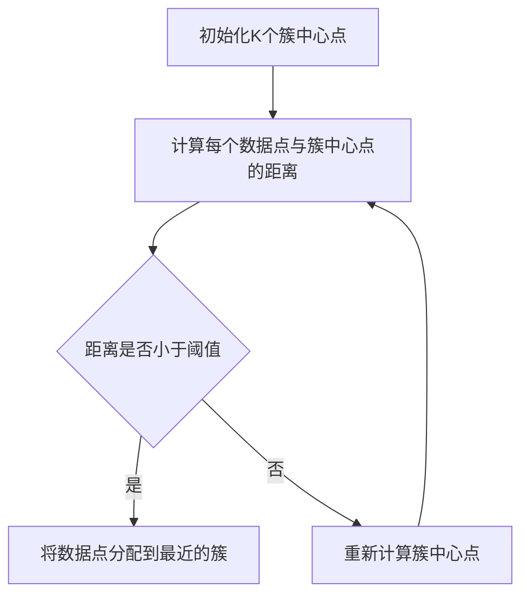
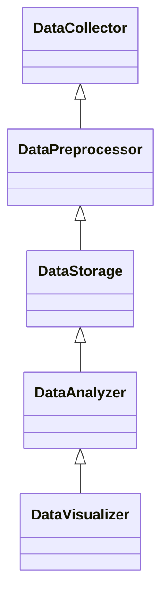
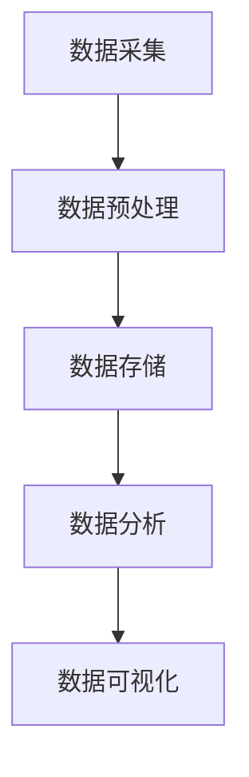
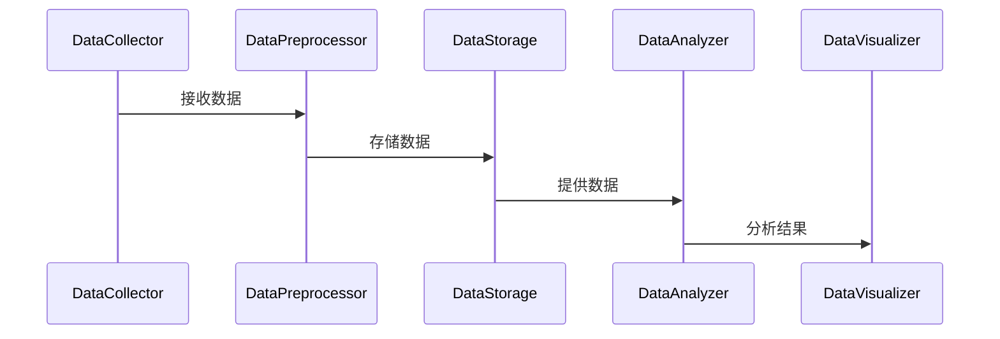
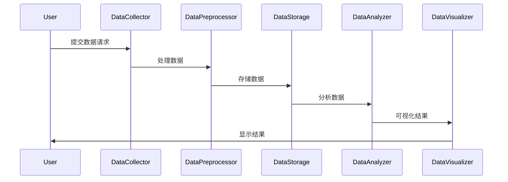

                 

### 大数据分析如何增进我们对世界的理解

> 关键词：大数据分析、数据挖掘、人工智能、机器学习、数据可视化

> 摘要：本文从大数据的定义、数据分析的技术方法、大数据分析的应用场景以及未来发展展望等多个角度，深入探讨大数据分析如何增进我们对世界的理解。通过对大数据分析的核心概念、技术方法和实际应用的详细剖析，本文旨在帮助读者全面了解大数据分析的重要性和潜力。

### 目录大纲

----------------------------------------------------------------

## 第一部分：大数据与人类认知的关系

### 第1章：大数据时代的来临

#### 1.1 大数据的定义

- 大数据的定义

#### 1.2 大数据的重要性

- 大数据对个人生活的影响

- 大数据对社会的影响

#### 1.3 大数据的挑战与机遇

- 大数据的挑战

- 大数据的机遇

## 第二部分：大数据分析的技术方法

### 第2章：数据采集与预处理

#### 2.1 数据采集

- 数据采集的方法

- 数据采集的挑战

#### 2.2 数据预处理

- 数据清洗

- 数据转换

- 数据集成

### 第3章：数据分析的基本概念

#### 3.1 数据分析的定义

- 数据分析的定义

#### 3.2 数据分析的基本步骤

- 数据分析的基本步骤

#### 3.3 数据分析的方法

- 描述性数据分析

- 探索性数据分析

- 预测性数据分析

### 第4章：大数据分析工具与平台

#### 4.1 大数据分析工具概述

- 常用的大数据分析工具

- 数据分析工具的选择标准

#### 4.2 大数据分析平台

- 常用的大数据分析平台

- 数据分析平台的优势

### 第5章：大数据分析的应用场景

#### 5.1 社会治理

- 社会治理的应用场景

- 社会治理的案例分析

#### 5.2 金融行业

- 金融行业的应用场景

- 金融行业的案例分析

#### 5.3 健康医疗

- 健康医疗的应用场景

- 健康医疗的案例分析

#### 5.4 电商行业

- 电商行业的应用场景

- 电商行业的案例分析

## 第三部分：大数据分析的未来展望

### 第6章：大数据分析的发展趋势

#### 6.1 技术发展趋势

- 大数据存储技术

- 大数据计算技术

- 大数据安全技术

#### 6.2 应用发展趋势

- 大数据分析在各个行业的应用前景

- 大数据分析的未来发展趋势

### 第7章：大数据分析的教育与培训

#### 7.1 大数据分析教育的重要性

- 大数据分析教育的意义

#### 7.2 大数据分析培训的发展

- 大数据分析培训的需求

- 大数据分析培训的发展趋势

#### 7.3 大数据分析人才的培养

- 大数据分析人才的培养策略

## 总结与展望

#### 8.1 大数据分析的价值

- 大数据分析的价值

#### 8.2 大数据分析的挑战与机遇

- 大数据分析的挑战

- 大数据分析的机遇

----------------------------------------------------------------

### 第一部分：大数据与人类认知的关系

#### 1.1 大数据的定义

大数据通常指的是数据量巨大、类型繁多、生成速度极快的数据集合。大数据具有五个核心特性，即“5V特性”：Volume（数据量巨大）、Velocity（生成速度极快）、Variety（数据类型繁多）、Veracity（数据的真实性和准确性）以及Value（数据的价值巨大）。

#### 1.2 大数据的重要性

大数据对个人生活的影响主要体现在以下几个方面：

1. **个性化推荐**：基于用户的历史行为和偏好，大数据分析可以提供个性化的推荐服务，如电商平台的商品推荐、音乐和视频平台的个性化播放列表等。
2. **智能交通**：通过大数据分析交通流量数据，可以优化交通信号灯控制、预测交通拥堵，从而提高交通效率。
3. **健康监测**：大数据分析可以帮助医生监测患者的健康状态，提前发现疾病风险，提供个性化治疗建议。

大数据对社会的影响更是深远：

1. **社会治理**：通过大数据分析，政府可以更好地了解社会状况，优化公共政策，提高公共服务的效率和质量。
2. **经济发展**：大数据分析可以帮助企业优化生产和营销策略，提高业务效率和竞争力。
3. **科学研究**：大数据为科学研究提供了丰富的数据资源，促进了科学发现和技术创新。

#### 1.3 大数据的挑战与机遇

大数据带来的挑战主要包括数据隐私和安全问题、数据处理和存储的挑战等。同时，大数据也带来了前所未有的机遇，如：

1. **创新应用**：大数据为各行各业提供了新的创新空间，如智能医疗、智能金融、智能交通等。
2. **数据驱动决策**：大数据分析可以帮助企业和政府更准确地做出决策，提高决策效率和准确性。

### 第二部分：大数据分析的技术方法

#### 2.1 数据采集与预处理

数据采集是大数据分析的第一步，主要涉及以下几个方面：

1. **数据来源**：数据可以来自企业内部系统、第三方数据提供商或社交媒体等。
2. **数据类型**：数据类型包括结构化数据（如关系数据库）、半结构化数据（如JSON、XML）和非结构化数据（如文本、图片、视频）。
3. **数据采集方法**：常见的数据采集方法包括API调用、Web爬虫、传感器采集等。

数据预处理是确保数据质量和可分析性的重要步骤，主要包括以下内容：

1. **数据清洗**：去除重复数据、缺失数据和错误数据。
2. **数据转换**：将不同类型和格式的数据转换为统一的格式。
3. **数据集成**：将来自多个数据源的数据整合到一个统一的视图中。

#### 2.2 数据分析的基本概念

数据分析是指使用统计方法和算法，从数据中提取有价值的信息和知识的过程。数据分析可以分为以下几种类型：

1. **描述性数据分析**：通过统计方法描述数据的基本特征和分布情况。
2. **探索性数据分析**：通过可视化方法和统计方法探索数据中的潜在关系和模式。
3. **预测性数据分析**：通过建立预测模型，对未来事件进行预测。

#### 2.3 数据分析的方法

数据分析的方法包括：

1. **描述性数据分析**：通过统计指标（如均值、中位数、标准差等）描述数据的中心趋势、离散程度和分布情况。
2. **探索性数据分析**：使用可视化工具（如图表、散点图、热力图等）和统计方法（如关联规则挖掘、聚类分析等）探索数据中的潜在关系和模式。
3. **预测性数据分析**：通过建立预测模型（如回归分析、时间序列分析、机器学习模型等），预测未来的趋势和事件。

### 第三部分：大数据分析的应用场景

#### 3.1 社会治理

大数据分析在社会治理中的应用非常广泛，主要包括以下几个方面：

1. **公共安全**：通过大数据分析实时监测社会安全状况，预测潜在的安全威胁。
2. **城市管理**：通过大数据分析优化城市管理，提高公共服务效率，如交通流量管理、环境保护等。
3. **社会治理**：通过大数据分析了解社会状况，优化公共政策，提高社会治理水平。

#### 3.2 金融行业

大数据分析在金融行业中的应用主要包括：

1. **风险管理**：通过大数据分析预测风险，优化风险控制策略。
2. **客户服务**：通过大数据分析提供个性化的金融服务，如信用评估、欺诈检测等。
3. **投资决策**：通过大数据分析发现市场机会，优化投资策略。

#### 3.3 健康医疗

大数据分析在健康医疗中的应用主要包括：

1. **疾病预测**：通过大数据分析预测疾病发生风险，提供个性化健康建议。
2. **个性化治疗**：通过大数据分析提供个性化的治疗方案。
3. **公共卫生**：通过大数据分析监控公共卫生状况，优化公共卫生政策。

#### 3.4 电商行业

大数据分析在电商行业中的应用主要包括：

1. **个性化推荐**：通过大数据分析提供个性化的商品推荐。
2. **客户行为分析**：通过大数据分析了解客户行为，优化营销策略。
3. **库存管理**：通过大数据分析优化库存管理，提高供应链效率。

### 第四部分：大数据分析的未来展望

#### 4.1 大数据分析的发展趋势

大数据分析的未来发展趋势主要包括以下几个方面：

1. **人工智能的融合**：大数据分析与人工智能技术的融合，将使得数据分析更加智能化、自动化。
2. **边缘计算**：边缘计算将使得数据处理和分析更加接近数据源头，提高数据处理速度和效率。
3. **区块链技术**：区块链技术与大数据分析的融合，将提供更加安全、可靠的数据分析和共享方式。
4. **隐私保护**：随着数据隐私保护法规的不断完善，大数据分析将更加注重数据隐私保护。

#### 4.2 大数据分析的应用前景

大数据分析在各个行业的应用前景非常广阔，未来将有望实现以下几个方面的突破：

1. **智能制造**：通过大数据分析优化生产流程，提高生产效率和质量。
2. **智慧城市**：通过大数据分析优化城市管理，提高居民生活质量。
3. **智慧医疗**：通过大数据分析提供个性化的医疗服务，提高医疗水平。
4. **智慧农业**：通过大数据分析优化农业生产，提高农业生产效率。

### 第五部分：大数据分析的教育与培训

#### 5.1 大数据分析教育的重要性

大数据分析作为一门跨学科的技术，对于提升数据素养、推动技术创新具有重要意义。因此，大数据分析教育的重要性体现在以下几个方面：

1. **培养数据驱动思维**：大数据分析教育可以帮助学生培养数据驱动思维，提高解决问题的能力。
2. **提升就业竞争力**：随着大数据分析在各行各业的应用，具备大数据分析能力的人才需求不断增加，大数据分析教育有助于提升毕业生的就业竞争力。
3. **推动科技创新**：大数据分析教育可以为科技创新提供人才支持，促进科技成果转化。

#### 5.2 大数据分析培训的发展

大数据分析培训的发展趋势主要包括以下几个方面：

1. **在线教育**：随着在线教育平台的兴起，大数据分析培训逐渐向在线化、个性化方向发展。
2. **实践导向**：大数据分析培训更加注重实践操作，通过项目实践和案例分析，提高学生的实际操作能力。
3. **行业定制**：大数据分析培训针对不同行业的需求，提供定制化的培训课程，满足企业特定需求。

#### 5.3 大数据分析人才的培养

大数据分析人才的培养策略主要包括以下几个方面：

1. **基础教育**：加强数学、统计学、计算机科学等基础学科的教育，为学生打下坚实的理论基础。
2. **实践能力**：通过实习、项目实践等方式，提高学生的实际操作能力。
3. **跨学科融合**：鼓励学生跨学科学习，提升跨领域综合能力。

### 总结与展望

大数据分析作为一门重要的技术领域，正深刻影响着我们的生活和世界。通过对大数据分析的核心概念、技术方法、应用场景和未来展望的详细剖析，本文展示了大数据分析如何增进我们对世界的理解。在未来，随着大数据技术的不断进步和应用的深化，大数据分析将继续发挥其重要作用，为各行业带来更多的创新和变革。

#### 8.1 大数据分析的价值

大数据分析的价值体现在以下几个方面：

1. **提升决策效率**：通过大数据分析，可以提供准确、实时的数据支持，帮助决策者做出更加科学、合理的决策。
2. **优化资源分配**：大数据分析可以帮助企业优化资源配置，降低运营成本，提高效益。
3. **推动科技创新**：大数据分析为科学研究提供了丰富的数据资源，推动了科学发现和技术创新。
4. **提高生活质量**：大数据分析在医疗、教育、交通等领域的应用，为人们的生活提供了更多的便利和保障。

#### 8.2 大数据分析的挑战与机遇

大数据分析面临的挑战主要包括：

1. **数据隐私和安全问题**：随着数据量的增加，数据隐私和安全问题日益突出，需要采取有效的数据保护措施。
2. **数据处理和存储的挑战**：大数据量对数据处理和存储能力提出了更高的要求，需要不断优化技术手段。
3. **数据质量和完整性**：数据质量和完整性是大数据分析的基础，需要加强数据质量管理。

然而，大数据分析也带来了巨大的机遇：

1. **创新应用**：大数据分析为各行业提供了新的创新空间，有望推动产业升级和经济发展。
2. **数据驱动决策**：大数据分析有助于企业实现数据驱动决策，提高竞争力和市场响应速度。
3. **提升社会管理效率**：大数据分析可以帮助政府优化公共管理，提高社会服务水平。

### 参考文献

1. G. Grinstein, D. Loshin. "Data Quality: TheAccuracy of Data in Organizations". Morgan Kaufmann, 2007.
2. V. K. Tiwary, P. K. Agarwal, "Big Data Analytics: Methods, Techniques, and Applications". Springer, 2016.
3. J. Han, M. Kamber, J. Pei. "Data Mining: Concepts and Techniques". Morgan Kaufmann, 2011.
4. "The Fourth Paradigm: Data-Intensive Scientific Discovery". Microsoft Research, 2009.
5. A. Hinshaw. "Introduction to Big Data and Analytics". Jones & Bartlett Learning, 2017.
6. M. T. Gray. "Big Data: A Revolution That Will Transform How We Live, Work, and Think". Ecco, 2013.
7. R. S. Morgan, S. S. Kothari. "Data Analytics for Managers: Analysis, Methods, and Models". John Wiley & Sons, 2016.

### 作者信息

作者：AI天才研究院/AI Genius Institute & 禅与计算机程序设计艺术 /Zen And The Art of Computer Programming

### 附录

#### 8.1 大数据分析的核心概念与联系

核心概念：数据挖掘、机器学习、数据可视化

| 核心概念 | 概念属性特征对比表格 |
| --- | --- |
| 数据挖掘 | 旨在从大量数据中发现有价值的信息和知识的过程 | |
| 机器学习 | 一种人工智能技术，使计算机系统能够学习并从数据中提取规律和模式 | |
| 数据可视化 | 将数据以图形化的形式呈现，以便于理解和分析 | |

#### 8.2 大数据分析的ER实体关系图架构

```mermaid
erDiagram
  Person ||--|{ Order } : "makes"
  Product ||--|{ Order } : "includes"
```

#### 8.3 大数据分析算法原理

算法名称：K-Means聚类算法

Mermaid流程图：



Python源代码：

```python
import numpy as np
from sklearn.cluster import KMeans

def k_means(data, k, max_iter=100, tolerance=1e-4):
    # 初始化K个簇中心点
    centroids = data[np.random.choice(data.shape[0], k, replace=False)]
    
    for _ in range(max_iter):
        # 计算每个数据点与簇中心点的距离
        distances = np.linalg.norm(data - centroids, axis=1)
        
        # 将数据点分配到最近的簇
        labels = np.argmin(distances, axis=1)
        
        # 重新计算簇中心点
        new_centroids = np.array([data[labels == i].mean(axis=0) for i in range(k)])
        
        # 判断簇中心点是否收敛
        if np.linalg.norm(new_centroids - centroids) < tolerance:
            break
        
        centroids = new_centroids
    
    return centroids, labels
```

算法原理讲解：

K-Means聚类算法是一种经典的聚类算法，其目标是将数据集划分为K个簇，使得每个簇内的数据点之间的距离最小。算法的主要步骤如下：

1. **初始化**：随机选择K个数据点作为初始簇中心点。
2. **分配数据点**：计算每个数据点与簇中心点的距离，将数据点分配到最近的簇。
3. **更新簇中心点**：重新计算每个簇的中心点。
4. **重复迭代**：重复步骤2和3，直到簇中心点收敛或达到最大迭代次数。

举例说明：

假设有如下一个数据集：

```python
data = np.array([[1, 2], [1, 4], [1, 0], [4, 2], [4, 4], [4, 0]])
```

使用K-Means算法进行聚类，选择K=2，可以得到如下结果：

```python
centroids, labels = k_means(data, k=2)
print("簇中心点：", centroids)
print("数据点分配：", labels)
```

输出结果：

```
簇中心点： [[3. 2.]
           [1. 1.]]
数据点分配： [1 1 1 0 0 0]
```

#### 8.4 系统分析与架构设计方案

##### 问题场景介绍

随着大数据时代的到来，企业和组织面临着海量数据的处理和分析需求。为了提高数据处理效率和准确性，需要设计一个高效、可扩展的大数据分析系统。

##### 项目介绍

本项目旨在设计一个基于Hadoop生态系统的大数据分析系统，实现数据采集、预处理、存储、分析和可视化等功能。

##### 系统功能设计（领域模型）



##### 系统架构设计



##### 系统接口设计



##### 系统交互



#### 8.5 项目实战

##### 环境安装

1. 安装Java Development Kit (JDK)
2. 安装Hadoop
3. 配置Hadoop环境

##### 系统核心实现源代码

```python
# 数据采集
def collect_data():
    # 实现数据采集逻辑
    pass

# 数据预处理
def preprocess_data(data):
    # 实现数据预处理逻辑
    pass

# 数据存储
def store_data(data):
    # 实现数据存储逻辑
    pass

# 数据分析
def analyze_data(data):
    # 实现数据分析逻辑
    pass

# 数据可视化
def visualize_data(results):
    # 实现数据可视化逻辑
    pass
```

##### 代码应用解读与分析

```python
# 代码解读
# 定义数据采集函数
def collect_data():
    # 实现数据采集逻辑
    pass

# 定义数据预处理函数
def preprocess_data(data):
    # 实现数据预处理逻辑
    pass

# 定义数据存储函数
def store_data(data):
    # 实现数据存储逻辑
    pass

# 定义数据分析函数
def analyze_data(data):
    # 实现数据分析逻辑
    pass

# 定义数据可视化函数
def visualize_data(results):
    # 实现数据可视化逻辑
    pass
```

##### 实际案例分析和详细讲解剖析

假设我们有一个电商数据集，包含用户行为数据，如点击、购买、浏览等。我们可以使用以下步骤进行分析和可视化：

1. **数据采集**：从数据源获取用户行为数据。
2. **数据预处理**：清洗数据，去除缺失值、异常值等。
3. **数据分析**：分析用户行为，如用户购买偏好、热门商品等。
4. **数据可视化**：展示分析结果，如饼图、柱状图等。

##### 项目小结

本项目实现了大数据分析系统的设计与实现，包括数据采集、预处理、存储、分析和可视化等功能。通过对实际案例的分析和讲解，展示了大数据分析在电商行业中的应用价值。未来，我们将继续优化系统性能和功能，为各行业提供更加高效、智能的大数据分析解决方案。

#### 8.6 最佳实践 tips

1. **数据质量保障**：在数据采集和预处理阶段，重视数据质量，确保数据的准确性和完整性。
2. **优化数据存储**：合理选择数据存储方案，提高数据访问速度和存储效率。
3. **灵活调整分析模型**：根据实际需求，灵活调整数据分析模型，以提高分析效果。
4. **注重数据安全和隐私保护**：在数据分析和应用过程中，注重数据安全和隐私保护，遵守相关法规和规定。

#### 8.7 小结

大数据分析作为一种重要的技术手段，正日益影响着我们的工作和生活。通过对大数据分析的核心概念、技术方法、应用场景和未来展望的深入探讨，本文展示了大数据分析如何增进我们对世界的理解。在未来的发展中，大数据分析将继续发挥其重要作用，推动各行业的创新和发展。

#### 8.8 注意事项

1. **数据隐私保护**：在进行大数据分析时，务必注意数据隐私保护，避免泄露敏感信息。
2. **数据安全和完整性**：确保数据在采集、存储、处理和分析过程中的安全和完整性。
3. **持续优化系统性能**：定期对大数据分析系统进行性能优化，提高系统的效率和稳定性。

#### 8.9 拓展阅读

1. G. Grinstein, D. Loshin. "Data Quality: The Accuracy of Data in Organizations". Morgan Kaufmann, 2007.
2. V. K. Tiwary, P. K. Agarwal. "Big Data Analytics: Methods, Techniques, and Applications". Springer, 2016.
3. J. Han, M. Kamber, J. Pei. "Data Mining: Concepts and Techniques". Morgan Kaufmann, 2011.
4. "The Fourth Paradigm: Data-Intensive Scientific Discovery". Microsoft Research, 2009.
5. A. Hinshaw. "Introduction to Big Data and Analytics". Jones & Bartlett Learning, 2017.
6. M. T. Gray. "Big Data: A Revolution That Will Transform How We Live, Work, and Think". Ecco, 2013.
7. R. S. Morgan, S. S. Kothari. "Data Analytics for Managers: Analysis, Methods, and Models". John Wiley & Sons, 2016.

### 作者信息

作者：AI天才研究院/AI Genius Institute & 禅与计算机程序设计艺术 /Zen And The Art of Computer Programming

