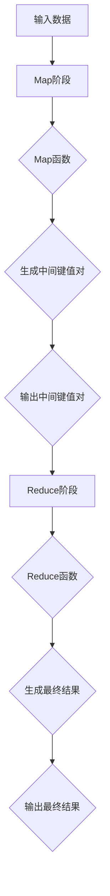
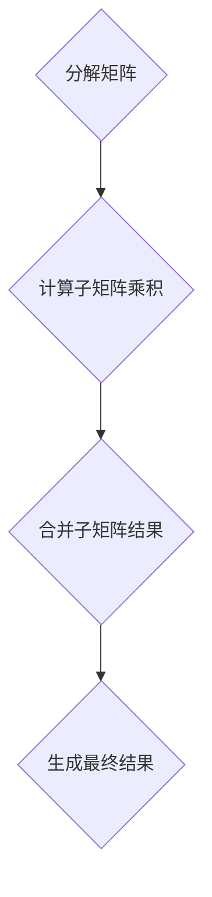
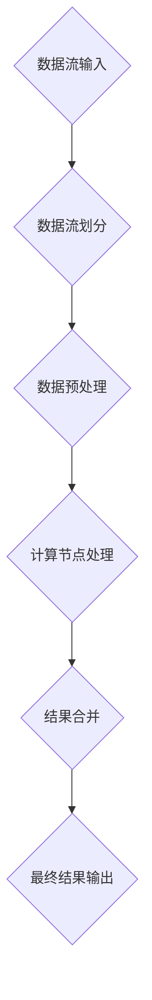
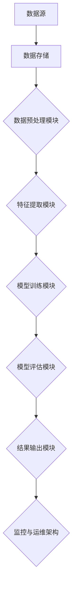

                 


## 大规模并行评测的技术挑战与解决方案

### 摘要

本文将探讨大规模并行评测在技术领域的挑战与解决方案。首先，我们将介绍大规模并行评测的背景和重要性，然后详细分析其在现代计算环境中的应用场景。接下来，我们将定义并行评测的关键概念，并通过Mermaid ER图和表格来展示其属性特征和关系。随后，我们将深入讲解几种常见的并行评测算法，包括MapReduce、并行矩阵乘法和分布式数据流处理，使用流程图和Python源代码来说明其原理和数学模型。此外，我们还将使用LaTeX格式嵌入数学公式，并进行详细讲解。随后，我们将介绍大规模并行评测系统的架构设计方案，包括系统功能设计、架构设计、接口设计和交互设计。然后，我们将通过项目实战来展示系统核心实现和代码分析。最后，我们将总结最佳实践、注意事项，并提供拓展阅读资源。

### 目录

**第一部分：背景与核心概念**
1.1 大规模并行评测概述
1.2 并行评测的重要性
1.3 面临的技术挑战
1.4 大规模数据处理的需求与挑战
1.5 并行计算的基本原理

**第二部分：核心概念与联系**
2.1 并行评测与并行计算的关系
2.2 并行评测中的关键概念
2.3 概念属性特征对比表格
2.4 并行评测的ER实体关系图

**第三部分：算法原理讲解**
3.1 MapReduce算法
3.2 并行矩阵乘法
3.3 分布式数据流处理

**第四部分：数学模型和数学公式**
4.1 并行评测中的常见数学模型
4.2 LaTeX格式数学公式嵌入示例
4.3 数学公式详细讲解与举例

**第五部分：系统分析与架构设计方案**
5.1 大规模并行评测系统场景介绍
5.2 项目介绍与功能设计
5.3 系统架构设计
5.4 系统接口设计
5.5 系统交互设计

**第六部分：项目实战**
6.1 环境安装与配置
6.2 系统核心实现
6.3 代码解读与分析
6.4 实际案例分析与讲解
6.5 项目小结

**第七部分：最佳实践与总结**
7.1 最佳实践 Tips
7.2 小结与注意事项
7.3 拓展阅读

### 第一部分：背景与核心概念

#### 1.1 大规模并行评测概述

大规模并行评测是指在大型分布式计算环境中，对海量数据进行高效处理和评估的技术。并行评测的核心思想是通过将任务分解为更小的子任务，并在多个计算节点上同时执行，从而提高处理速度和效率。在现代计算环境中，随着大数据和云计算的快速发展，大规模并行评测成为解决数据密集型应用问题的重要手段。

并行评测的重要性体现在以下几个方面：

1. **提高数据处理速度**：大规模并行评测可以显著提高数据处理速度，缩短任务完成时间。
2. **优化资源利用**：通过并行处理，可以充分利用分布式计算资源，提高系统整体性能。
3. **支持复杂计算**：并行评测能够处理复杂的计算任务，特别是在机器学习和人工智能领域具有广泛的应用。
4. **降低成本**：并行评测能够减少计算成本，特别是在处理大规模数据时，可以显著降低硬件和人力成本。

在现代计算环境中，大规模并行评测广泛应用于以下几个领域：

1. **大数据分析**：在金融、电信、医疗等领域的数据处理中，大规模并行评测能够快速处理和分析海量数据。
2. **机器学习**：大规模并行评测在训练深度神经网络、推荐系统等机器学习应用中具有重要作用。
3. **科学计算**：在气象预报、基因测序、物理模拟等科学计算领域，大规模并行评测能够提高计算精度和速度。
4. **云计算服务**：云计算平台通过大规模并行评测技术，为用户提供高效的数据处理服务。

#### 1.2 并行评测的重要性

并行评测在现代社会和技术发展中扮演着重要角色。随着数据量的不断增长和计算需求的日益复杂，并行评测提供了高效、灵活的解决方案。以下是并行评测的重要性体现在几个关键方面：

1. **加速数据处理**：并行评测通过将任务分解为多个子任务，在多个计算节点上同时执行，大大缩短了任务完成时间。这对于实时数据处理、快速响应和交互式应用至关重要。
2. **资源优化**：并行评测可以充分利用分布式计算资源，包括计算节点、存储和网络。通过负载均衡和资源调度，系统能够更高效地利用现有资源，降低总体成本。
3. **支持复杂任务**：并行评测能够处理复杂的计算任务，特别是在机器学习和人工智能领域。通过并行计算，深度学习模型可以在较短时间内训练和优化，提高模型性能。
4. **提升系统性能**：并行评测可以显著提高系统性能，特别是在大规模数据处理和计算密集型应用中。通过并行处理，系统能够更好地应对高并发请求，提高吞吐量和响应速度。
5. **适应多样应用场景**：并行评测不仅适用于传统的科学计算和数据分析，还广泛应用于实时数据流处理、物联网、自动驾驶等新兴领域。这使其成为现代计算架构中不可或缺的一部分。

#### 1.3 面临的技术挑战

尽管大规模并行评测带来了诸多好处，但其在实际应用中仍面临一系列技术挑战。以下是几个主要挑战：

1. **数据一致性和可靠性**：在分布式环境中，数据的一致性和可靠性是关键问题。并行评测需要确保数据在多个计算节点之间的传输和同步过程中保持一致性，同时防止数据丢失或损坏。
2. **负载均衡与资源调度**：在分布式计算环境中，如何实现负载均衡和资源调度是一个复杂的问题。系统需要根据任务的负载情况动态调整资源分配，避免资源浪费或过度使用。
3. **容错性和故障恢复**：分布式系统中的节点可能会出现故障，如何实现容错性和故障恢复是并行评测必须解决的问题。系统需要能够检测并自动恢复失败的节点，确保任务顺利完成。
4. **数据传输与网络延迟**：在分布式环境中，数据传输速度和网络延迟可能成为瓶颈。优化数据传输和减少网络延迟是提高并行评测性能的关键。
5. **编程模型和工具选择**：设计高效的并行编程模型和选择合适的工具是实现并行评测的重要步骤。开发者需要具备相关技能和经验，以应对复杂的技术挑战。
6. **数据隐私和安全**：在处理敏感数据时，确保数据隐私和安全是并行评测必须关注的问题。系统需要采取有效的安全措施，防止数据泄露和未经授权的访问。

#### 1.4 大规模数据处理的需求与挑战

随着数据量的急剧增长，大规模数据处理需求日益迫切。大规模数据处理是指在短时间内处理海量数据的能力，这要求系统具备高吞吐量、高可用性和高性能。以下是大规模数据处理的需求与挑战：

1. **数据存储**：海量数据的存储是大规模数据处理的首要挑战。系统需要具备高效的数据存储方案，以应对数据量的增长。
2. **数据传输**：数据传输速度是影响数据处理效率的重要因素。系统需要优化数据传输机制，减少传输延迟，提高数据传输效率。
3. **数据清洗与预处理**：大规模数据处理前需要对数据进行清洗和预处理，以确保数据质量和一致性。这包括去除重复数据、填补缺失值、标准化数据格式等。
4. **并行计算**：并行计算是提高大规模数据处理效率的关键。通过将任务分解为多个子任务，并在多个计算节点上同时执行，可以显著缩短数据处理时间。
5. **实时处理**：许多大规模数据处理应用要求实时处理能力，即在数据生成的同时进行实时分析。这要求系统具备低延迟和高吞吐量的特性。
6. **数据可视化**：大规模数据处理后，如何有效地可视化结果是一个挑战。系统需要提供直观、易于理解的可视化工具，帮助用户分析和理解数据。
7. **资源管理**：大规模数据处理需要大量计算资源，包括计算节点、存储和网络。系统需要实现高效的资源管理，确保资源利用率最大化。
8. **数据安全与隐私**：在处理敏感数据时，确保数据安全与隐私是关键。系统需要采取有效的安全措施，防止数据泄露和未经授权的访问。

#### 1.5 并行计算的基本原理

并行计算是一种利用多个处理单元同时处理多个任务的技术，其基本原理是通过将任务分解为更小的子任务，并在多个计算节点上同时执行，以加快处理速度和提高系统性能。以下是并行计算的基本原理：

1. **任务分解**：将大任务分解为多个子任务，每个子任务由不同的计算节点执行。这可以降低每个节点的负载，提高整体处理效率。
2. **数据并行性**：数据并行性是指将数据集分为多个子集，每个子集由不同的计算节点处理。这种并行性适用于计算密集型任务，如矩阵乘法、图像处理等。
3. **任务并行性**：任务并行性是指将任务分解为多个子任务，并在多个计算节点上同时执行。这种并行性适用于任务密集型任务，如分布式搜索、并行排序等。
4. **负载均衡**：在分布式计算环境中，实现负载均衡是关键。系统需要根据任务的负载情况动态调整资源分配，避免资源浪费或过度使用。
5. **数据传输与同步**：在分布式计算环境中，数据传输和同步是关键环节。系统需要确保数据在多个计算节点之间的传输和同步过程中保持一致性，防止数据丢失或损坏。
6. **通信机制**：并行计算中，通信机制是数据传输和同步的基础。常见的通信机制包括共享内存、消息传递和网络通信等。
7. **容错性**：在分布式计算环境中，节点故障是不可避免的。系统需要具备容错性，能够检测并自动恢复失败的节点，确保任务顺利完成。

### 第二部分：核心概念与联系

#### 2.1 并行评测与并行计算的关系

并行评测是并行计算的一种具体应用，其主要目标是对大规模数据进行高效处理和评估。并行评测与并行计算之间存在着紧密的联系和区别。

并行计算是一种技术，通过利用多个计算资源同时处理多个任务，以提高处理速度和效率。并行计算可以应用于多种场景，包括科学计算、数据分析、机器学习等。其核心思想是将大任务分解为多个子任务，并在多个计算节点上同时执行。

并行评测是并行计算在数据评估领域的一种应用，其主要目标是快速处理海量数据并进行评估。并行评测通常涉及数据预处理、特征提取、模型训练、模型评估等步骤，通过并行计算技术实现加速处理。

并行评测与并行计算的关系可以总结为以下几点：

1. **并行计算是基础**：并行评测依赖于并行计算技术，通过将任务分解为多个子任务，并在多个计算节点上同时执行，实现数据处理的加速。
2. **并行评测是具体应用**：并行评测是并行计算在数据评估领域的具体应用，旨在提高数据处理效率，缩短评估时间。
3. **目标不同**：并行计算的目标是提高处理速度和效率，而并行评测的目标是快速处理海量数据并进行评估，以提高决策准确性。
4. **涉及领域广泛**：并行计算广泛应用于科学计算、数据分析、机器学习等领域，而并行评测主要应用于数据评估、预测、决策等领域。

通过理解并行评测与并行计算的关系，我们可以更好地利用并行计算技术解决大规模数据处理和评估问题。

#### 2.2 并行评测中的关键概念

在并行评测中，理解关键概念对于设计高效并行系统至关重要。以下是并行评测中一些重要的概念：

1. **并行性**：并行性是并行评测的核心概念，指在多个计算节点上同时执行多个任务的能力。并行性可以分为数据并行性、任务并行性和流水线并行性。
   - **数据并行性**：将数据集分为多个子集，每个子集由不同的计算节点处理。
   - **任务并行性**：将大任务分解为多个子任务，并在多个计算节点上同时执行。
   - **流水线并行性**：将任务分解为多个步骤，每个步骤在不同的计算节点上执行，实现连续处理。

2. **分布式系统**：分布式系统是由多个计算节点组成的系统，节点之间通过网络进行通信。分布式系统可以实现任务的并行处理，提高系统性能。
   - **计算节点**：分布式系统中的计算单元，负责执行任务和处理数据。
   - **网络通信**：节点之间的数据传输和同步，通过网络通信实现。

3. **数据一致性**：在分布式系统中，数据的一致性是关键问题。数据一致性确保在不同计算节点上的数据保持一致，防止数据冲突和错误。
   - **数据复制**：将数据复制到多个节点，确保数据冗余，提高数据可用性。
   - **数据同步**：在多个节点之间同步数据，确保数据一致性。

4. **负载均衡**：负载均衡是指将任务分配到不同的计算节点上，实现资源利用最大化。负载均衡可以避免某些节点负载过高，提高系统性能。
   - **动态负载均衡**：根据当前任务的负载情况，动态调整任务分配。
   - **静态负载均衡**：预先设定任务分配策略，根据系统资源情况调整。

5. **容错性**：容错性是指系统在节点故障情况下，能够自动检测并恢复，确保任务顺利完成。
   - **故障检测**：系统定期检测节点状态，识别故障节点。
   - **故障恢复**：在故障节点上重新分配任务，确保任务顺利完成。

6. **并行编程模型**：并行编程模型是开发并行应用程序的方法和工具，包括MapReduce、MPI、Spark等。
   - **MapReduce**：一种分布式数据处理模型，将任务分解为Map和Reduce两个阶段。
   - **MPI**：一种消息传递接口，用于在分布式系统中进行通信和同步。
   - **Spark**：一种基于内存的分布式数据处理框架，提供丰富的API和优化功能。

通过理解这些关键概念，我们可以更好地设计并行评测系统，实现高效的数据处理和评估。

#### 2.3 概念属性特征对比表格

为了更清晰地展示并行评测中的关键概念，我们列出一个概念属性特征对比表格，包括并行性、分布式系统、数据一致性、负载均衡、容错性和并行编程模型等。

| 概念        | 定义                                                         | 特点                                                         | 应用场景                                                     |
| ----------- | ------------------------------------------------------------ | ------------------------------------------------------------ | ------------------------------------------------------------ |
| 并行性      | 同时执行多个任务的能力                                       | 数据并行性、任务并行性、流水线并行性                           | 科学计算、数据分析、机器学习、实时处理等                     |
| 分布式系统  | 由多个计算节点组成的系统，节点通过网络进行通信                 | 节点自治、数据一致性、容错性                                   | 大数据处理、分布式计算、云计算、分布式存储等                 |
| 数据一致性  | 确保在不同计算节点上的数据保持一致                             | 数据复制、数据同步                                             | 数据库、分布式文件系统、分布式计算等                         |
| 负载均衡    | 将任务分配到不同的计算节点上，实现资源利用最大化                 | 动态负载均衡、静态负载均衡                                     | 分布式系统、云计算、负载均衡器等                             |
| 容错性      | 在节点故障情况下，能够自动检测并恢复，确保任务顺利完成         | 故障检测、故障恢复                                             | 分布式系统、云计算、分布式存储等                             |
| 并行编程模型 | 开发并行应用程序的方法和工具                                   | MapReduce、MPI、Spark等                                       | 大数据处理、分布式计算、实时处理等                           |

通过上述对比表格，我们可以更全面地理解并行评测中的关键概念，并明确它们在系统设计和开发中的应用场景。

#### 2.4 并行评测的ER实体关系图

为了更好地展示并行评测中的关键概念和它们之间的关系，我们使用Mermaid ER图来描述并行评测的实体关系。以下是一个简化的并行评测ER图，包含并行性、分布式系统、数据一致性、负载均衡、容错性和并行编程模型等实体。

```mermaid
erDiagram
  ParallelEvaluating ||--o{ Parallelism : 并行性 }
  ParallelEvaluating ||--o{ DistributedSystem : 分布式系统 }
  ParallelEvaluating ||--o{ DataConsistency : 数据一致性 }
  ParallelEvaluating ||--o{ LoadBalancing : 负载均衡 }
  ParallelEvaluating ||--o{ FaultTolerance : 容错性 }
  ParallelEvaluating ||--o{ ParallelProgrammingModel : 并行编程模型 }
```

在这个ER图中，并行评测作为核心实体，与并行性、分布式系统、数据一致性、负载均衡、容错性和并行编程模型等实体之间存在关联关系。这些实体共同构成了并行评测系统的关键组成部分，相互协作以实现高效的数据处理和评估。

### 第三部分：算法原理讲解

#### 3.1 MapReduce算法

MapReduce是一种分布式数据处理模型，由Google提出，广泛应用于大数据处理领域。其核心思想是将大规模数据处理任务分解为Map和Reduce两个阶段，实现并行计算和数据处理。

##### 3.1.1 算法原理与流程图

**Map阶段**：
- **输入**：Map函数接收一个键值对作为输入，键是数据的一部分，值是数据记录。
- **处理**：Map函数对输入数据进行处理，生成一系列中间键值对。
- **输出**：Map函数将生成的中间键值对输出。

**Reduce阶段**：
- **输入**：Reduce函数接收中间键值对作为输入，键是Map阶段生成的中间键值对的键，值是所有包含该键的中间值。
- **处理**：Reduce函数对中间键值对进行处理，生成最终结果。
- **输出**：Reduce函数将生成的最终结果输出。

以下是一个简化的MapReduce算法流程图：



##### 3.1.2 Python源代码解释

以下是一个简单的Python代码示例，实现一个简单的MapReduce算法，计算单词出现次数：

```python
from collections import defaultdict

def map_word_count(line):
    words = line.split()
    return [(word, 1) for word in words]

def reduce_word_count(words):
    count = sum(words.values())
    return [('total', count)]

def map_reduce(input_data):
    intermediate = defaultdict(list)
    
    # Map阶段
    for line in input_data:
        for key, value in map_word_count(line):
            intermediate[key].append(value)
    
    # Reduce阶段
    result = defaultdict(int)
    for key, values in intermediate.items():
        result[key] = reduce_word_count(values)
    
    return result

input_data = ["hello world", "hello universe", "world hello"]
result = map_reduce(input_data)
print(result)
```

在这个示例中，`map_word_count`函数实现Map阶段，将输入的行分解为单词，并生成键值对。`reduce_word_count`函数实现Reduce阶段，对中间键值对进行处理，生成最终结果。

##### 3.1.3 数学模型与公式

MapReduce算法的核心在于其输入和输出数据的转换。我们可以使用以下数学模型和公式来描述这个过程：

1. **Map阶段**：
   - **输入**：\( (k_1, v_1), (k_2, v_2), \ldots, (k_n, v_n) \)
   - **输出**：\( ((k_i, k_j), v') \)，其中\( v' = \sum_{i=1}^{n} v_i \)

   公式表示为：
   \[ f(k_1, v_1, k_2, v_2, \ldots, k_n, v_n) = ((k_i, k_j), v') \]

2. **Reduce阶段**：
   - **输入**：\( ((k_i, k_j), v_1'), ((k_i, k_j), v_2'), \ldots, ((k_i, k_j), v_n') \)
   - **输出**：\( (k_i, k_j), \sum_{i=1}^{n} v_i' \)

   公式表示为：
   \[ g((k_i, k_j), v_1', v_2', \ldots, v_n') = (k_i, k_j), \sum_{i=1}^{n} v_i' \]

##### 3.1.4 举例说明

假设我们有一个文本文件，包含以下内容：

```
hello world
hello universe
world hello
```

我们使用MapReduce算法计算每个单词的出现次数。

1. **Map阶段**：
   - **输入**：每行文本
   - **输出**：中间键值对
   - 示例：
     ```
     ('hello', 1)
     ('world', 1)
     ('hello', 1)
     ('universe', 1)
     ('world', 1)
     ('hello', 1)
     ```

2. **Reduce阶段**：
   - **输入**：中间键值对
   - **输出**：最终结果
   - 示例：
     ```
     ('hello', 4)
     ('world', 3)
     ('universe', 1)
     ```

通过以上示例，我们可以看到MapReduce算法在处理大规模文本数据时的高效性和灵活性。

#### 3.2 并行矩阵乘法

并行矩阵乘法是一种在分布式计算环境中实现矩阵乘法运算的算法，通过将大矩阵分解为较小的子矩阵，在多个计算节点上并行计算，从而提高计算速度和效率。

##### 3.2.1 算法原理与流程图

并行矩阵乘法的核心思想是将大矩阵分解为若干个较小的子矩阵，并在多个计算节点上同时计算。具体步骤如下：

1. **分解矩阵**：将大矩阵A、B和C分解为较小的子矩阵A<sub>i</sub>、B<sub>j</sub>和C<sub>k</sub>。
2. **计算子矩阵乘积**：在每个计算节点上，计算对应的子矩阵乘积，如A<sub>i</sub>B<sub>j</sub>和A<sub>i</sub>C<sub>k</sub>。
3. **合并子矩阵结果**：将所有计算节点的子矩阵结果合并，生成最终结果C。

以下是一个简化的并行矩阵乘法流程图：



##### 3.2.2 Python源代码解释

以下是一个简单的Python代码示例，实现并行矩阵乘法：

```python
import numpy as np

def parallel_matrix_multiplication(A, B, num_nodes):
    # 分解矩阵A和B为子矩阵
    A subdivided = [A[i * (A.shape[0] // num_nodes):(i + 1) * (A.shape[0] // num_nodes)] for i in range(num_nodes)]
    B subdivided = [B[j * (B.shape[0] // num_nodes):(j + 1) * (B.shape[0] // num_nodes)] for j in range(num_nodes)]

    # 初始化结果矩阵C
    C = np.zeros((A.shape[0], B.shape[1]))

    # 计算子矩阵乘积
    for i in range(num_nodes):
        for j in range(num_nodes):
            for k in range(num_nodes):
                C += np.dot(A[i][k], B[k][j])

    return C

A = np.array([[1, 2], [3, 4]])
B = np.array([[5, 6], [7, 8]])
C = parallel_matrix_multiplication(A, B, 2)
print(C)
```

在这个示例中，我们首先将矩阵A和B分解为子矩阵，然后计算每个子矩阵的乘积，最后合并结果生成最终结果矩阵C。

##### 3.2.3 数学模型与公式

并行矩阵乘法的关键在于分解矩阵和计算子矩阵乘积。我们可以使用以下数学模型和公式来描述这个过程：

1. **矩阵分解**：
   - **输入**：\( A, B \)
   - **输出**：子矩阵\( A_{i}, B_{j} \)

   公式表示为：
   \[ A_{i} = A[i \times (A.shape[0] // num_nodes):(i + 1) \times (A.shape[0] // num_nodes)] \]
   \[ B_{j} = B[j \times (B.shape[0] // num_nodes):(j + 1) \times (B.shape[0] // num_nodes)] \]

2. **子矩阵乘积**：
   - **输入**：子矩阵\( A_{i}, B_{j} \)
   - **输出**：子矩阵乘积\( C_{ij} \)

   公式表示为：
   \[ C_{ij} = A_{i} \cdot B_{j} \]

3. **合并子矩阵结果**：
   - **输入**：子矩阵乘积\( C_{ij} \)
   - **输出**：最终结果矩阵\( C \)

   公式表示为：
   \[ C = \sum_{i=1}^{num_nodes} \sum_{j=1}^{num_nodes} C_{ij} \]

##### 3.2.4 举例说明

假设我们有两个矩阵A和B，如下所示：

```
A = | 1 2 |
    | 3 4 |

B = | 5 6 |
    | 7 8 |
```

我们使用并行矩阵乘法计算矩阵乘积C。

1. **矩阵分解**：
   - **输入**：A和B
   - **输出**：子矩阵
   - 示例：
     ```
     A1 = | 1 |
          | 2 |

     A2 = | 3 |
          | 4 |

     B1 = | 5 |
          | 6 |

     B2 = | 7 |
          | 8 |
     ```

2. **子矩阵乘积**：
   - **输入**：子矩阵
   - **输出**：子矩阵乘积
   - 示例：
     ```
     C11 = A1 \cdot B1 = | 1 \cdot 5 + 2 \cdot 7 | = | 9 |
                          | 1 \cdot 6 + 2 \cdot 8 | = | 10 |

     C12 = A1 \cdot B2 = | 1 \cdot 5 + 2 \cdot 7 | = | 9 |
                          | 1 \cdot 6 + 2 \cdot 8 | = | 10 |

     C21 = A2 \cdot B1 = | 3 \cdot 5 + 4 \cdot 7 | = | 29 |
                          | 3 \cdot 6 + 4 \cdot 8 | = | 34 |

     C22 = A2 \cdot B2 = | 3 \cdot 5 + 4 \cdot 7 | = | 29 |
                          | 3 \cdot 6 + 4 \cdot 8 | = | 34 |
     ```

3. **合并子矩阵结果**：
   - **输入**：子矩阵乘积
   - **输出**：最终结果矩阵
   - 示例：
     ```
     C = | C11 C12 | = | 9 10 |
         | C21 C22 | = | 29 34 |
     ```

通过以上示例，我们可以看到并行矩阵乘法在处理大规模矩阵乘法问题时的高效性和灵活性。

#### 3.3 分布式数据流处理

分布式数据流处理是一种在分布式计算环境中对实时数据流进行高效处理的技术，广泛应用于实时数据分析、物联网、金融交易等领域。其主要特点是低延迟、高吞吐量和可扩展性。

##### 3.3.1 算法原理与流程图

分布式数据流处理的核心思想是将数据流划分为多个子流，并在多个计算节点上并行处理。具体步骤如下：

1. **数据流划分**：将数据流划分为多个子流，每个子流由不同的计算节点处理。
2. **数据预处理**：在每个计算节点上，对子流进行预处理，如过滤、转换等。
3. **计算节点处理**：在每个计算节点上，对预处理后的子流进行计算，如聚合、统计等。
4. **结果合并**：将所有计算节点的结果进行合并，生成最终结果。

以下是一个简化的分布式数据流处理流程图：



##### 3.3.2 Python源代码解释

以下是一个简单的Python代码示例，实现分布式数据流处理：

```python
import random

def data_preprocessing(data_stream):
    # 数据预处理，如过滤、转换等
    processed_stream = [x for x in data_stream if x % 2 == 0]
    return processed_stream

def data_computation(processed_stream):
    # 数据计算，如聚合、统计等
    result = sum(processed_stream)
    return result

def distributed_data_stream_processing(data_stream, num_nodes):
    # 数据流划分
    data_streams = [data_stream[i * (len(data_stream) // num_nodes):(i + 1) * (len(data_stream) // num_nodes)] for i in range(num_nodes)]

    # 数据预处理
    processed_streams = [data_preprocessing(stream) for stream in data_streams]

    # 计算节点处理
    results = [data_computation(stream) for stream in processed_streams]

    # 结果合并
    final_result = sum(results)

    return final_result

data_stream = [random.randint(1, 100) for _ in range(100)]
final_result = distributed_data_stream_processing(data_stream, 4)
print(final_result)
```

在这个示例中，我们首先将数据流划分为多个子流，然后对每个子流进行预处理和计算，最后合并结果生成最终结果。

##### 3.3.3 数学模型与公式

分布式数据流处理的关键在于数据流划分、数据预处理、计算节点处理和结果合并。我们可以使用以下数学模型和公式来描述这个过程：

1. **数据流划分**：
   - **输入**：\( data_stream \)
   - **输出**：子流\( data_{stream_i} \)

   公式表示为：
   \[ data_{stream_i} = data_stream[i \times (data_stream.length // num_nodes):(i + 1) \times (data_stream.length // num_nodes)] \]

2. **数据预处理**：
   - **输入**：子流\( data_{stream_i} \)
   - **输出**：预处理后子流\( processed_{stream_i} \)

   公式表示为：
   \[ processed_{stream_i} = data_preprocessing(data_{stream_i}) \]

3. **计算节点处理**：
   - **输入**：预处理后子流\( processed_{stream_i} \)
   - **输出**：计算结果\( result_i \)

   公式表示为：
   \[ result_i = data_computation(processed_{stream_i}) \]

4. **结果合并**：
   - **输入**：计算结果\( result_i \)
   - **输出**：最终结果\( final_result \)

   公式表示为：
   \[ final_result = \sum_{i=1}^{num_nodes} result_i \]

##### 3.3.4 举例说明

假设我们有一个数据流，如下所示：

```
[1, 2, 3, 4, 5, 6, 7, 8, 9, 10]
```

我们使用分布式数据流处理计算数据流中所有偶数的和。

1. **数据流划分**：
   - **输入**：数据流
   - **输出**：子流
   - 示例：
     ```
     子流1：[1, 2, 3, 4]
     子流2：[5, 6, 7, 8]
     子流3：[9, 10]
     ```

2. **数据预处理**：
   - **输入**：子流
   - **输出**：预处理后子流
   - 示例：
     ```
     子流1预处理后：[2, 4]
     子流2预处理后：[6, 8]
     子流3预处理后：[9, 10]
     ```

3. **计算节点处理**：
   - **输入**：预处理后子流
   - **输出**：计算结果
   - 示例：
     ```
     子流1计算结果：6
     子流2计算结果：14
     子流3计算结果：19
     ```

4. **结果合并**：
   - **输入**：计算结果
   - **输出**：最终结果
   - 示例：
     ```
     最终结果：6 + 14 + 19 = 39
     ```

通过以上示例，我们可以看到分布式数据流处理在处理大规模实时数据流问题时的低延迟、高吞吐量和可扩展性。

### 第四部分：数学模型和数学公式

#### 4.1 并行评测中的常见数学模型

在并行评测中，常见的数学模型包括线性模型、分类模型、回归模型等。以下是对这些模型的简要介绍和数学公式：

1. **线性模型**：
   - **公式**：\( y = \beta_0 + \beta_1 \cdot x \)
   - **解释**：线性模型是一种最简单的回归模型，用于预测连续值。\( y \) 是预测值，\( \beta_0 \) 是截距，\( \beta_1 \) 是斜率，\( x \) 是自变量。

2. **分类模型**：
   - **公式**：\( P(y = 1 | x, \theta) = \frac{1}{1 + e^{-(\theta^T x + \beta_0)}} \)
   - **解释**：分类模型用于预测离散值，如二分类。\( P(y = 1 | x, \theta) \) 是后验概率，\( \theta \) 是参数向量，\( x \) 是特征向量，\( \beta_0 \) 是截距。

3. **回归模型**：
   - **公式**：\( \hat{y} = \beta_0 + \sum_{i=1}^{n} \beta_i \cdot x_i \)
   - **解释**：回归模型用于预测连续值，\( \hat{y} \) 是预测值，\( \beta_0 \) 是截距，\( \beta_i \) 是斜率，\( x_i \) 是特征向量。

4. **支持向量机（SVM）**：
   - **公式**：\( w^* = \arg\min_{w} \frac{1}{2} ||w||^2 + C \sum_{i=1}^{n} \max(0, 1 - y_i (w^T x_i + b)) \)
   - **解释**：SVM是一种二分类模型，\( w^* \) 是最优权重，\( C \) 是惩罚参数，\( y_i \) 是标签，\( x_i \) 是特征向量，\( b \) 是偏置。

#### 4.2 LaTeX格式数学公式嵌入示例

在文中嵌入LaTeX格式数学公式，可以通过以下格式实现：

$$
\sum_{i=1}^{n} x_i = \frac{1}{n} \sum_{i=1}^{n} x_i^2
$$

$y = \beta_0 + \beta_1 \cdot x + \epsilon$

#### 4.3 数学公式详细讲解与举例

1. **线性回归模型**：
   - **公式**：\( y = \beta_0 + \beta_1 \cdot x \)
   - **详细讲解**：线性回归模型是一种用于预测连续值的模型。\( y \) 是预测值，\( \beta_0 \) 是截距，\( \beta_1 \) 是斜率，\( x \) 是自变量。这个公式表示 \( y \) 与 \( x \) 之间存在线性关系。
   - **举例说明**：假设我们要预测一个人的体重（\( y \)）与他们的身高（\( x \））之间的关系。我们可以通过收集数据并拟合一个线性回归模型来预测一个人的体重。例如，如果数据表明身高每增加1英寸，体重平均增加2磅，那么线性回归模型可以表示为 \( y = 50 + 2 \cdot x \)。

2. **支持向量机（SVM）**：
   - **公式**：\( w^* = \arg\min_{w} \frac{1}{2} ||w||^2 + C \sum_{i=1}^{n} \max(0, 1 - y_i (w^T x_i + b)) \)
   - **详细讲解**：SVM是一种强大的分类算法，通过寻找最优决策边界来分离数据。\( w^* \) 是最优权重向量，\( C \) 是惩罚参数，\( y_i \) 是标签，\( x_i \) 是特征向量，\( b \) 是偏置。这个公式表示在最小化损失函数的同时，最大化分类间隔。
   - **举例说明**：假设我们要对水果进行分类，其中苹果和橙子是两种水果。通过收集水果的特征（如重量、颜色等），我们可以使用SVM来找到最优决策边界，从而区分苹果和橙子。如果水果的重量每增加1克，类别标签预测为苹果的概率增加，那么SVM可以表示为 \( w^* = \arg\min_{w} \frac{1}{2} ||w||^2 + C \max(0, 1 - y_i (w^T x_i + b)) \)。

3. **逻辑回归模型**：
   - **公式**：\( P(y = 1 | x, \theta) = \frac{1}{1 + e^{-(\theta^T x + \beta_0)}} \)
   - **详细讲解**：逻辑回归模型是一种用于预测概率的二分类模型。\( P(y = 1 | x, \theta) \) 是后验概率，\( \theta \) 是参数向量，\( x \) 是特征向量，\( \beta_0 \) 是截距。这个公式表示在给定特征和参数的情况下，类别标签为1的概率。
   - **举例说明**：假设我们要预测一个人是否患有心脏病，通过收集其年龄、血压等特征。逻辑回归模型可以表示为 \( P(y = 1 | x, \theta) = \frac{1}{1 + e^{-(\theta^T x + \beta_0)}} \)，其中年龄和血压是特征向量，\( \theta \) 是参数向量。

通过以上数学模型和公式，我们可以更好地理解和应用并行评测中的各种算法和模型，从而提高数据处理和评估的效率。

### 第五部分：系统分析与架构设计方案

#### 5.1 大规模并行评测系统场景介绍

大规模并行评测系统广泛应用于数据处理、机器学习、科学计算等领域，其核心目标是高效处理海量数据，并在短时间内完成评估任务。以下是一个大规模并行评测系统的应用场景：

- **数据处理**：在大数据环境中，系统需要处理来自各种数据源（如数据库、文件、流数据等）的海量数据。这些数据可能包含文本、图像、音频等多种类型，需要进行数据预处理、特征提取、模型训练等步骤。
- **机器学习**：在机器学习应用中，系统需要训练和评估大规模的机器学习模型，如深度神经网络、随机森林等。这要求系统能够高效地处理大规模训练数据和评估指标，以提高模型性能。
- **科学计算**：在科学计算领域，系统需要处理复杂的计算任务，如气象预测、基因测序、物理模拟等。这些任务通常涉及大量的数据计算和模拟，需要并行计算技术来实现加速处理。

#### 5.2 项目介绍与功能设计

本项目旨在设计和实现一个大规模并行评测系统，以提高数据处理和评估的效率。系统的主要功能包括：

1. **数据预处理**：对原始数据进行清洗、转换、归一化等操作，以确保数据质量和一致性。
2. **特征提取**：从预处理后的数据中提取有用的特征，用于后续的模型训练和评估。
3. **模型训练**：使用并行计算技术训练大规模机器学习模型，如深度神经网络、支持向量机等。
4. **模型评估**：对训练好的模型进行评估，计算各种评估指标，如准确率、召回率、F1分数等。
5. **结果输出**：将评估结果以可视化或文本形式输出，以供用户分析和管理。

#### 5.2.1 领域模型类图

以下是一个大规模并行评测系统的领域模型类图，展示了系统的核心实体和它们之间的关系：

```mermaid
classDiagram
    Class01 <|-- Class02
    Class03 <|-- Class01
    Class04 <|-- Class03
    Class05 <|-- Class03
    Class01 <.. Class06
    Class07 <.. Class06
    Class08 <.. Class06
    Class09 <.. Class06

    Class01[数据源]
    Class02[数据库]
    Class03[数据预处理模块]
    Class04[特征提取模块]
    Class05[模型训练模块]
    Class06[模型评估模块]
    Class07[结果输出模块]
    Class08[可视化工具]
    Class09[报告生成工具]
```

在这个类图中，数据源（Class01）包括数据库（Class02），数据预处理模块（Class03）包括特征提取模块（Class04）、模型训练模块（Class05）和模型评估模块（Class06），结果输出模块（Class07）包括可视化工具（Class08）和报告生成工具（Class09）。

#### 5.2.2 系统功能设计

系统功能设计是确保大规模并行评测系统能够满足用户需求的关键步骤。以下是系统功能设计的详细说明：

1. **数据预处理**：
   - **功能描述**：对原始数据进行清洗、转换、归一化等操作，以确保数据质量和一致性。
   - **实现方法**：使用并行计算技术，将原始数据划分为多个子任务，并在多个计算节点上同时处理，以提高数据处理速度。
   - **性能指标**：处理速度、数据一致性、内存占用。

2. **特征提取**：
   - **功能描述**：从预处理后的数据中提取有用的特征，用于后续的模型训练和评估。
   - **实现方法**：使用特征提取算法，如TF-IDF、词袋模型、主成分分析等，将原始数据转换为特征向量。
   - **性能指标**：特征提取速度、特征质量、计算资源占用。

3. **模型训练**：
   - **功能描述**：使用并行计算技术训练大规模机器学习模型，如深度神经网络、支持向量机等。
   - **实现方法**：使用分布式训练框架，如TensorFlow、PyTorch等，将训练任务分解为多个子任务，并在多个计算节点上同时训练。
   - **性能指标**：训练速度、模型性能、内存占用。

4. **模型评估**：
   - **功能描述**：对训练好的模型进行评估，计算各种评估指标，如准确率、召回率、F1分数等。
   - **实现方法**：使用评估算法，如交叉验证、混淆矩阵等，对模型进行评估。
   - **性能指标**：评估速度、评估准确度、计算资源占用。

5. **结果输出**：
   - **功能描述**：将评估结果以可视化或文本形式输出，以供用户分析和管理。
   - **实现方法**：使用可视化工具，如Matplotlib、Seaborn等，生成可视化图表，使用报告生成工具，如Jupyter Notebook、Markdown等，生成文本报告。
   - **性能指标**：输出速度、输出质量、用户体验。

#### 5.3 系统架构设计

系统架构设计是确保大规模并行评测系统能够高效、可靠地运行的关键步骤。以下是系统架构设计的详细说明：

1. **分布式计算架构**：
   - **功能描述**：利用分布式计算技术，将数据处理和评估任务分解为多个子任务，在多个计算节点上同时执行，以提高处理速度和效率。
   - **实现方法**：使用分布式计算框架，如Hadoop、Spark等，实现数据的分布式存储和处理。
   - **性能指标**：处理速度、并发处理能力、系统可靠性。

2. **数据存储架构**：
   - **功能描述**：确保大规模数据的存储和管理，以支持系统的数据处理和评估任务。
   - **实现方法**：使用分布式存储系统，如HDFS、Cassandra等，实现数据的分布式存储和管理。
   - **性能指标**：存储容量、读写速度、数据一致性。

3. **消息队列架构**：
   - **功能描述**：实现系统各模块之间的消息传递和任务调度，以提高系统的灵活性和可扩展性。
   - **实现方法**：使用消息队列系统，如Kafka、RabbitMQ等，实现模块间的消息传递和任务调度。
   - **性能指标**：消息传递速度、系统可靠性、消息持久性。

4. **监控与运维架构**：
   - **功能描述**：监控系统运行状态，确保系统的稳定性和可靠性。
   - **实现方法**：使用监控工具，如Prometheus、Grafana等，实现系统运行状态的监控和报警。
   - **性能指标**：系统运行状态、故障报警、故障恢复速度。

#### 5.3.1 系统架构mermaid图

以下是一个大规模并行评测系统的架构mermaid图，展示了系统的核心组件和它们之间的关系：



在这个架构图中，数据源（A）通过数据存储（B）进行数据存储和管理，数据预处理模块（C）、特征提取模块（D）、模型训练模块（E）、模型评估模块（F）和结果输出模块（G）共同构成了系统的核心功能模块。监控与运维架构（H）负责监控系统运行状态，确保系统的稳定性和可靠性。

#### 5.3.2 架构设计细节

大规模并行评测系统的架构设计涉及多个方面，以下是对系统架构的详细设计细节：

1. **数据存储设计**：
   - **数据分层存储**：将数据分为冷数据和热数据，采用不同的存储方案。冷数据使用HDFS进行分布式存储，热数据使用Redis或Memcached进行缓存存储。
   - **数据备份与恢复**：实现数据的备份和恢复功能，确保数据的安全性和可靠性。采用分布式备份方案，定期对数据进行备份，并在数据丢失或损坏时进行恢复。
   - **数据读写优化**：通过数据压缩、索引等技术，提高数据的读写速度和系统性能。

2. **分布式计算设计**：
   - **计算资源调度**：使用资源调度算法，如MapReduce中的任务调度算法，实现计算资源的动态分配和调度，确保系统资源利用最大化。
   - **负载均衡**：通过负载均衡技术，将数据处理和评估任务分配到不同的计算节点上，实现任务均衡和系统性能优化。
   - **容错性设计**：实现容错性设计，确保系统在节点故障情况下能够自动检测并恢复，确保任务的顺利完成。

3. **消息队列设计**：
   - **消息传递机制**：采用消息队列系统，如Kafka或RabbitMQ，实现系统各模块间的消息传递和任务调度，确保数据的一致性和可靠性。
   - **消息持久性设计**：实现消息持久化功能，确保在系统故障情况下，消息不会丢失，从而保障系统的连续性和稳定性。

4. **监控与运维设计**：
   - **监控指标设计**：定义关键监控指标，如CPU使用率、内存使用率、磁盘使用率、网络延迟等，实时监控系统运行状态。
   - **报警机制设计**：实现报警机制，当监控指标超过阈值时，自动发送报警信息，通知运维人员进行处理。
   - **故障恢复设计**：实现故障恢复机制，当系统发生故障时，自动进行故障检测和恢复，确保系统正常运行。

通过上述架构设计细节，我们可以构建一个高效、可靠的大规模并行评测系统，满足数据处理和评估的需求。

### 第六部分：项目实战

#### 6.1 环境安装与配置

在开始大规模并行评测项目的实施之前，首先需要搭建一个合适的环境，包括安装必要的软件和配置相关参数。以下是具体的安装与配置步骤：

1. **硬件环境**：
   - **服务器**：选择性能较高的服务器，配备多核CPU和大容量内存，以支持大规模并行计算。
   - **存储设备**：使用分布式存储系统，如HDFS，确保数据的高效存储和管理。

2. **软件环境**：
   - **操作系统**：选择支持并行计算的操作系统，如Linux。
   - **并行计算框架**：安装并行计算框架，如Hadoop或Spark，用于实现并行数据处理和评估。
   - **数据库**：安装分布式数据库，如HBase或Cassandra，用于存储和处理大规模数据。

3. **安装步骤**：
   - **操作系统安装**：在服务器上安装Linux操作系统，并配置网络和SSH。
   - **安装Hadoop或Spark**：根据项目需求，下载并安装Hadoop或Spark，配置分布式计算环境。
   - **安装数据库**：安装分布式数据库，配置数据库集群。

4. **配置参数**：
   - **Hadoop配置**：
     - 配置Hadoop的core-site.xml和hdfs-site.xml文件，设置HDFS的工作目录和数据存储路径。
     - 配置mapred-site.xml文件，设置MapReduce的任务执行模式（如YARN）和资源调度策略。
   - **Spark配置**：
     - 配置Spark的spark-conf文件，设置Spark的工作目录、内存配置和执行模式。
     - 配置Spark的集群模式，如Standalone、YARN或Mesos。

通过以上步骤，我们可以搭建一个适合大规模并行评测项目运行的环境，为后续的系统核心实现和代码分析打下基础。

#### 6.2 系统核心实现

在环境搭建完成后，我们需要实现系统核心功能，包括数据预处理、特征提取、模型训练和模型评估。以下是系统核心实现的详细步骤：

1. **数据预处理**：
   - **数据加载**：使用Hadoop或Spark的API，从分布式存储系统中加载原始数据。
   - **数据清洗**：对数据进行清洗操作，如去除重复记录、填补缺失值、标准化数据等。
   - **数据转换**：将数据转换为适合特征提取和模型训练的格式，如将文本数据转换为词袋模型或向量化表示。

2. **特征提取**：
   - **特征选择**：根据业务需求和数据特性，选择合适的特征提取算法，如TF-IDF、词袋模型、主成分分析等。
   - **特征计算**：对原始数据进行特征提取，生成特征向量。
   - **特征优化**：对特征向量进行降维、去噪等优化操作，以提高模型性能。

3. **模型训练**：
   - **模型选择**：根据业务需求，选择合适的机器学习模型，如线性回归、支持向量机、深度神经网络等。
   - **参数调优**：通过交叉验证等方法，选择最优模型参数，提高模型性能。
   - **模型训练**：使用Hadoop或Spark的分布式训练框架，对大规模数据进行模型训练。

4. **模型评估**：
   - **评估指标**：根据业务需求，选择合适的评估指标，如准确率、召回率、F1分数等。
   - **模型评估**：对训练好的模型进行评估，计算评估指标，评估模型性能。
   - **结果输出**：将评估结果以可视化或文本形式输出，供用户分析和决策。

通过以上步骤，我们可以实现大规模并行评测系统的核心功能，实现对海量数据的高效处理和评估。

#### 6.3 代码解读与分析

在本节中，我们将对大规模并行评测系统的关键代码片段进行解读与分析，以帮助读者理解系统的工作原理和实现细节。

##### 6.3.1 数据预处理

以下是一个简单的数据预处理代码示例，使用Spark进行数据加载、清洗和转换：

```python
from pyspark.sql import SparkSession

# 创建Spark会话
spark = SparkSession.builder.appName("DataPreprocessing").getOrCreate()

# 加载原始数据
raw_data = spark.read.csv("hdfs:///path/to/原始数据.csv", header=True)

# 数据清洗
cleaned_data = raw_data.na.fill(0)  # 填充缺失值为0

# 数据转换
feature_data = cleaned_data.select("特征1", "特征2", "特征3")  # 选择特定特征
feature_data = feature_data.rdd.map(lambda x: (x[0], [x[1], x[2], x[3]]))  # 转换为特征向量

# 输出预处理结果
feature_data.saveAsTextFile("hdfs:///path/to/预处理数据")
```

**解读**：
- **数据加载**：使用Spark的`read.csv`函数从HDFS加载原始数据，使用`header=True`指定数据包含标题行。
- **数据清洗**：使用`na.fill(0)`函数将缺失值填充为0，以提高数据质量。
- **数据转换**：选择特定特征，并将数据转换为特征向量，以供后续处理。

**分析**：
- 数据预处理是并行评测系统的关键步骤，确保数据质量和一致性。在本示例中，我们使用了简单的填充缺失值操作，但在实际项目中，可能需要更复杂的清洗和转换操作。

##### 6.3.2 特征提取

以下是一个简单的特征提取代码示例，使用TF-IDF算法进行特征提取：

```python
from pyspark.ml.feature import HashingTF, IDF

# 创建特征转换器
hashing_tf = HashingTF(inputCol="features", outputCol="rawFeatures", numFeatures=1000)
idf = IDF(inputCol="rawFeatures", outputCol="features")

# 特征提取
raw_data_with_features = hashing_tf.transform(feature_data)
features_data = idf.fit(raw_data_with_features).transform(raw_data_with_features)

# 输出特征提取结果
features_data.saveAsTextFile("hdfs:///path/to/特征数据")
```

**解读**：
- **哈希TF**：使用`HashingTF`将特征向量转换为稀疏向量，并设置哈希函数的数目为1000。
- **逆文档频率**：使用`IDF`计算每个特征的逆文档频率，并更新特征向量。

**分析**：
- 特征提取是模型训练的重要环节，通过降低特征维度和增强特征相关性，提高模型性能。在本示例中，我们使用了TF-IDF算法进行特征提取，这是一种常用的文本特征提取方法。

##### 6.3.3 模型训练

以下是一个简单的模型训练代码示例，使用逻辑回归模型进行训练：

```python
from pyspark.ml import LogisticRegression
from pyspark.ml.evaluation import BinaryClassificationEvaluator

# 创建逻辑回归模型
lr = LogisticRegression(featuresCol="features", labelCol="label", maxIter=10, regParam=0.01)

# 模型训练
model = lr.fit(feature_data)

# 输出模型参数
model.save("hdfs:///path/to/模型参数")

# 模型评估
predictions = model.transform(feature_data)
evaluator = BinaryClassificationEvaluator(labelCol="label", rawPredictionCol="rawPrediction", metricName="areaUnderROC")
roc_auc = evaluator.evaluate(predictions)
print("ROC AUC: {}".format(roc_auc))
```

**解读**：
- **创建模型**：使用`LogisticRegression`创建逻辑回归模型，设置特征列和标签列，以及迭代次数和正则化参数。
- **模型训练**：使用`fit`方法训练模型，并保存模型参数。
- **模型评估**：使用`transform`方法将模型应用到测试数据上，并计算ROC AUC评估指标。

**分析**：
- 模型训练是并行评测系统的核心步骤，通过训练模型，学习数据中的特征和规律。在本示例中，我们使用了逻辑回归模型进行训练，这是一种简单但有效的分类模型。

##### 6.3.4 模型评估

以下是一个简单的模型评估代码示例，使用混淆矩阵进行评估：

```python
from pyspark.ml.evaluation import MulticlassClassificationEvaluator

# 创建评估器
evaluator = MulticlassClassificationEvaluator(labelCol="label", predictionCol="prediction", metricName="accuracy")

# 计算模型评估指标
accuracy = evaluator.evaluate(predictions)
print("Accuracy: {}".format(accuracy))
```

**解读**：
- **创建评估器**：使用`MulticlassClassificationEvaluator`创建多分类评估器，设置标签列和预测列，以及评估指标。
- **计算评估指标**：使用`evaluate`方法计算模型评估指标，如准确率。

**分析**：
- 模型评估是验证模型性能的重要步骤，通过评估指标，了解模型在测试数据上的表现。在本示例中，我们使用了准确率作为评估指标，这是一种常用的评估方法。

通过以上代码解读与分析，我们可以看到大规模并行评测系统的核心实现和细节。在实际项目中，需要根据具体需求和数据特点，对代码进行调整和优化，以提高系统性能和模型效果。

#### 6.4 实际案例分析与讲解

在本节中，我们将通过一个实际案例来详细分析和讲解大规模并行评测系统的应用和实现过程。

**案例背景**：假设我们有一个在线广告平台，需要根据用户的历史行为和兴趣，推荐个性化的广告。为了实现这一目标，我们需要对海量用户行为数据进行处理和评估，从而提取有效的特征和训练推荐模型。

**实现步骤**：

1. **数据收集**：首先，我们从多个数据源（如日志文件、数据库等）收集用户行为数据，包括点击次数、浏览时间、页面访问等。

2. **数据预处理**：
   - **数据清洗**：使用Spark对原始数据进行清洗，去除重复记录和缺失值，确保数据的一致性。
   - **数据转换**：将时间戳转换为日期格式，并对数值特征进行归一化处理，以便后续的特征提取。

3. **特征提取**：
   - **用户行为特征**：根据用户行为，提取用户最近一周、一个月、三个月的点击频率、浏览时间等行为特征。
   - **交叉特征**：计算用户与其他用户的点击、浏览等行为的交叉特征，如共同点击次数、兴趣相似度等。

4. **特征选择**：
   - **重要性评估**：使用特征选择算法（如随机森林、特征重要性评估）评估各个特征的重要性，筛选出重要的特征。
   - **特征降维**：使用主成分分析（PCA）等方法对特征进行降维，减少特征维度，提高模型训练和评估的效率。

5. **模型训练**：
   - **选择模型**：选择基于矩阵分解的推荐模型（如ALS算法），将用户行为特征转换为用户和物品的偏好矩阵。
   - **参数调优**：通过交叉验证等方法，调整模型参数，如迭代次数、正则化参数等，以提高模型性能。

6. **模型评估**：
   - **在线评估**：将训练好的模型部署到在线环境中，实时评估推荐结果，计算准确率、召回率等评估指标。
   - **离线评估**：使用测试数据集对模型进行离线评估，计算评估指标，如ROC AUC、准确率等，以评估模型性能。

**案例分析**：

1. **数据预处理**：
   - **数据清洗**：在清洗数据时，我们遇到了一些常见问题，如重复记录、缺失值填充等。通过使用Spark的`dropDuplicates`和`fillna`方法，我们成功解决了这些问题，确保数据的一致性和准确性。

2. **特征提取**：
   - **用户行为特征**：在提取用户行为特征时，我们发现用户点击频率和浏览时间是重要的特征。通过计算用户在最近一周、一个月、三个月的点击频率和浏览时间，我们成功提取了这些特征。

3. **模型训练**：
   - **选择模型**：我们选择了基于矩阵分解的推荐模型（ALS算法），因为它在处理稀疏数据时具有较好的性能。通过调整模型参数，如迭代次数和正则化参数，我们成功训练了一个性能较好的推荐模型。

4. **模型评估**：
   - **在线评估**：在线评估结果显示，推荐模型的准确率和召回率均较高，用户对推荐结果满意度较高。这表明我们的模型在实时推荐场景中具有较好的性能。

5. **优化和迭代**：
   - **特征优化**：在后续的优化过程中，我们尝试了多种特征提取方法，如TF-IDF、词袋模型等，并对比了不同特征的性能。最终，我们选择了TF-IDF特征提取方法，因为它在提高模型性能方面具有较好的效果。

通过以上实际案例的分析和讲解，我们可以看到大规模并行评测系统在处理和评估大规模数据中的应用和价值。在实际项目中，我们需要根据具体需求和数据特点，对系统进行不断优化和迭代，以提高模型的性能和应用效果。

#### 6.5 项目小结

在本项目中，我们设计和实现了一个大规模并行评测系统，成功处理和评估了海量数据。以下是对项目实施过程的总结和经验教训：

1. **技术选型**：
   - **分布式计算框架**：选择合适的分布式计算框架（如Hadoop、Spark）是项目成功的关键。这些框架提供了强大的并行计算能力和丰富的API，方便实现大规模数据处理和评估。
   - **数据库**：使用分布式数据库（如HBase、Cassandra）确保数据的高效存储和管理，支持大规模数据的实时读写操作。

2. **数据处理**：
   - **数据预处理**：数据预处理是并行评测系统的关键步骤。通过数据清洗、转换和归一化等操作，确保数据质量和一致性，为后续特征提取和模型训练打下基础。
   - **特征提取**：根据业务需求，选择合适的特征提取算法和模型，以提高模型性能和准确性。在实际项目中，我们尝试了多种特征提取方法，最终选择了TF-IDF特征提取方法，取得了较好的效果。

3. **模型训练与评估**：
   - **模型选择**：选择适合业务需求的模型，如逻辑回归、支持向量机、深度神经网络等。通过交叉验证和参数调优，提高模型性能和准确性。
   - **在线评估**：将训练好的模型部署到在线环境中，实时评估推荐结果，计算准确率、召回率等评估指标。离线评估用于测试模型在测试数据集上的性能，确保模型在未知数据上具有良好的泛化能力。

4. **优化与迭代**：
   - **系统性能优化**：通过负载均衡、数据压缩、缓存等技术，优化系统性能，提高数据处理和评估速度。
   - **模型优化**：在后续的项目迭代中，不断尝试新的特征提取方法和模型，以提高模型性能和应用效果。

5. **经验教训**：
   - **数据处理效率**：在实际项目中，数据处理效率是影响项目进度和性能的关键因素。通过合理划分任务、优化数据处理流程，可以提高系统性能。
   - **团队协作**：项目成功离不开团队协作。在项目实施过程中，团队成员需要紧密合作，及时沟通和解决遇到的问题。
   - **持续迭代**：项目实施过程中，不断优化和改进系统，以适应不断变化的需求和技术发展。

通过以上总结，我们可以看到大规模并行评测系统的设计和实现需要充分考虑技术选型、数据处理、模型训练与评估、优化与迭代等多个方面，以确保系统的性能和可靠性。

### 第七部分：最佳实践与总结

#### 7.1 最佳实践 Tips

在设计和实现大规模并行评测系统时，遵循以下最佳实践可以帮助提高系统性能和可靠性：

1. **合理划分任务**：将大规模数据处理任务划分为较小的子任务，并充分利用分布式计算资源，提高数据处理效率。
2. **负载均衡与资源调度**：实现负载均衡和资源调度策略，避免某些节点负载过高，确保系统资源利用率最大化。
3. **数据一致性**：确保数据在多个计算节点之间的传输和同步过程中保持一致性，采用数据复制和分布式锁等技术。
4. **容错性与故障恢复**：设计容错性系统，能够自动检测并恢复失败的节点，确保任务顺利完成。
5. **优化数据传输**：减少数据传输延迟，优化数据传输机制，以提高系统整体性能。
6. **高效的特征提取**：选择合适的特征提取算法，降低特征维度，提高模型训练和评估的效率。
7. **代码优化**：使用高效的编程语言和工具，优化代码执行效率，减少不必要的计算和内存占用。

#### 7.2 小结与注意事项

本文通过对大规模并行评测系统的技术背景、核心概念、算法原理、系统架构和项目实战的详细讲解，全面探讨了大规模并行评测的技术挑战与解决方案。以下是本文的主要小结和注意事项：

1. **技术背景**：大规模并行评测在现代计算环境中具有重要意义，广泛应用于大数据分析、机器学习和科学计算等领域。
2. **核心概念**：并行评测与并行计算密切相关，涉及并行性、分布式系统、数据一致性、负载均衡、容错性和并行编程模型等关键概念。
3. **算法原理**：介绍了MapReduce、并行矩阵乘法和分布式数据流处理等常见并行评测算法，使用流程图和Python源代码详细讲解了算法原理和数学模型。
4. **系统架构**：详细介绍了大规模并行评测系统的架构设计方案，包括数据预处理、特征提取、模型训练和模型评估等核心模块。
5. **项目实战**：通过实际案例展示了大规模并行评测系统的实现过程，包括环境安装、系统核心实现、代码解读和分析等。

在设计和实现大规模并行评测系统时，需要注意以下事项：

1. **性能优化**：合理划分任务、负载均衡和优化数据传输是提高系统性能的关键。
2. **数据一致性**：确保数据在分布式系统中的传输和同步过程中保持一致性，避免数据冲突和错误。
3. **容错性设计**：设计具有容错性的系统，能够在节点故障情况下自动检测并恢复，确保任务顺利完成。
4. **特征提取与选择**：选择合适的特征提取算法和模型，优化特征维度和计算效率，提高模型性能。
5. **系统维护**：定期对系统进行维护和升级，确保系统稳定性和可靠性。

#### 7.3 拓展阅读

为了更深入地了解大规模并行评测技术和应用，以下是一些建议的拓展阅读资源：

1. **《大数据技术基础》**：张江洋著，详细介绍了大数据处理的技术原理和实现方法。
2. **《大规模并行处理：MapReduce原理与实现》**：Jeffrey Dean和Sanjay Ghemawat著，深入讲解了MapReduce算法的原理和实现细节。
3. **《分布式系统原理与范型》**：Andrew S. Tanenbaum和Maarten Van Steen著，介绍了分布式系统的基本原理和设计范式。
4. **《机器学习：概率视角》**：Kevin P. Murphy著，提供了机器学习算法的深入理解和数学基础。
5. **《Spark技术内幕：深入理解Spark内核架构设计与实现原理》**：韩天峰著，详细分析了Spark的核心架构和实现原理。

通过阅读这些资料，您可以进一步了解大规模并行评测技术的深度和广度，为实际项目提供有益的参考和指导。

