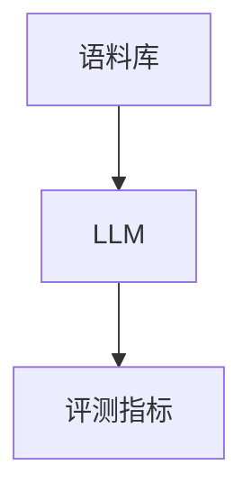
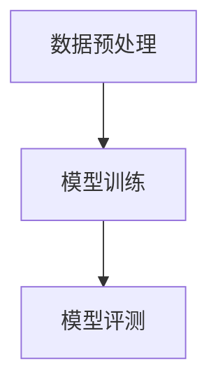
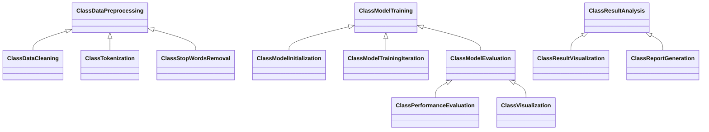
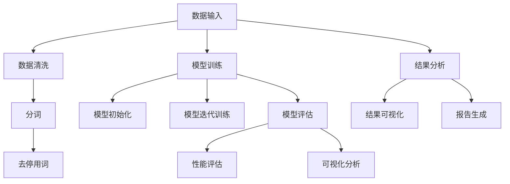
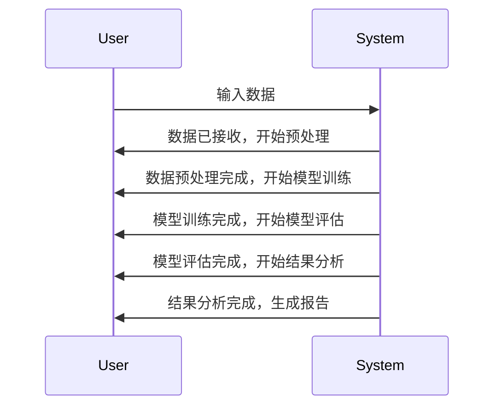

                 


# 大规模语料库在LLM评测中的处理方法

## 关键词
- 大规模语料库
- 语言模型评测
- 数据预处理
- 算法实现
- 数学模型
- 系统架构

## 摘要
本文将探讨大规模语料库在大型语言模型（LLM）评测中的应用与处理方法。首先，我们介绍大规模语料库和LLM的核心概念及其在自然语言处理中的重要性。接着，分析大规模语料库在LLM训练和评测中的挑战，并提出相应的解决方案。本文还将详细讲解相关算法原理，包括数学模型、Python实现和示例。此外，文章将介绍系统分析与架构设计方案，并进行项目实战，总结最佳实践和注意事项。

----------------------------------------------------------------

## 第一部分：大规模语料库概述

### 1.1 问题背景与挑战

#### 1.1.1 大规模语料库的发展历程

大规模语料库的发展可以追溯到20世纪80年代。最初，研究人员使用少量的手编语料库进行自然语言处理研究。随着互联网的发展，人们开始收集大量的在线文本数据，这些数据包括新闻文章、论坛帖子、社交媒体内容等。21世纪初，大规模语料库的应用在机器翻译、信息检索和文本分类等领域取得了显著成果。

#### 1.1.2 大规模语料库的重要性

大规模语料库是自然语言处理（NLP）的重要资源。它为模型训练提供了丰富的数据支持，有助于提高模型性能。大规模语料库可以涵盖多种语言、多种领域，使得模型具有更好的泛化能力。此外，大规模语料库还可以用于评估模型的性能，为模型的优化和改进提供指导。

#### 1.1.3 大规模语料库处理面临的挑战

尽管大规模语料库在NLP中具有重要作用，但在处理过程中也面临诸多挑战。首先，数据量大导致数据处理效率成为关键问题。其次，数据质量参差不齐，需要进行数据清洗和预处理。此外，大规模语料库的存储和传输也带来一定的挑战。最后，如何有效地利用大规模语料库进行模型训练和评测，仍需要进一步研究和探讨。

### 1.2 核心概念与联系

#### 1.2.1 大规模语料库的概念

大规模语料库是指包含大量文本数据的集合，这些文本数据可以来自多种来源，如互联网、图书、新闻、社交媒体等。大规模语料库的特点是数据量大、种类多样、覆盖广泛。

#### 1.2.1.1 语料库的分类与特点

- **通用语料库**：如Google Books Ngrams、Common Crawl，包含多种语言和领域的文本数据。
- **特定领域语料库**：如新闻语料库、医疗语料库、金融语料库等，针对特定领域进行收集和整理。

#### 1.2.1.2 大规模数据的特点

- **数据量大**：大规模语料库包含数十亿甚至数千亿个文本实例。
- **多样性**：语料库中的文本数据来自不同来源，具有多样化的特征。
- **动态性**：互联网上的文本数据不断更新，语料库需要实时更新。

#### 1.2.2 大型语言模型（LLM）的概念与特性

大型语言模型（LLM）是一种基于深度学习的自然语言处理模型，能够理解和生成自然语言文本。LLM具有以下特性：

- **大规模参数**：LLM通常具有数十亿甚至数万亿个参数，能够捕捉复杂的语言模式。
- **自适应能力**：LLM可以根据不同任务进行自适应调整，具有很好的泛化能力。
- **多任务能力**：LLM可以同时处理多个任务，如文本分类、问答系统、机器翻译等。

#### 1.2.2.1 LLM的发展历程

- **早期模型**：如Word2Vec、GloVe等基于词嵌入的模型。
- **序列模型**：如LSTM、GRU等基于序列模型的改进。
- **注意力机制**：如Transformer、BERT等引入注意力机制的模型。
- **预训练与微调**：如GPT、T5、RLHF等结合预训练和微调的模型。

#### 1.2.2.2 LLM在自然语言处理中的应用

- **文本分类**：如新闻分类、情感分析、垃圾邮件过滤等。
- **问答系统**：如智能客服、问答机器人等。
- **机器翻译**：如英译中、中译英等跨语言翻译。
- **文本生成**：如自动写作、创意文本生成等。

#### 1.2.3 评测指标与评估方法

评测指标是衡量LLM性能的重要工具。常见的评测指标包括：

- **准确率（Accuracy）**：分类任务中正确分类的样本数占总样本数的比例。
- **精确率（Precision）**：分类任务中预测为正类的样本中实际为正类的比例。
- **召回率（Recall）**：分类任务中实际为正类的样本中被预测为正类的比例。
- **F1分数（F1 Score）**：精确率和召回率的调和平均。

评估方法主要包括：

- **交叉验证**：通过将数据集划分为多个子集，分别进行训练和验证，以提高评估结果的可靠性。
- **混淆矩阵**：展示预测结果与实际结果之间的对应关系，帮助分析模型性能。
- **ROC曲线和AUC值**：用于评估二分类模型的性能，ROC曲线越陡峭，AUC值越大，模型性能越好。

### 1.3 ER实体关系图与Mermaid流程图

实体关系图（ER图）是描述系统中实体及其关系的图形表示。在自然语言处理领域，ER图可以帮助我们理解大规模语料库和LLM之间的关系。

#### 1.3.1 ER实体关系图


- **实体**：语料库、LLM、评测指标
- **关系**：语料库用于训练LLM，LLM生成预测结果，评测指标用于评估LLM性能

#### 1.3.2 Mermaid流程图绘制



以上流程图展示了语料库、LLM和评测指标之间的关系。

----------------------------------------------------------------

## 第二部分：算法原理讲解

### 2.1 算法流程图

在处理大规模语料库进行LLM评测时，我们通常需要经历以下流程：

1. **数据预处理**：清洗和标准化数据，使其适合模型训练。
2. **模型训练**：使用预处理后的数据训练LLM。
3. **模型评测**：使用预定的评测指标评估LLM的性能。

以下是算法流程的Mermaid流程图：



### 2.2 Python源代码详解

#### 2.2.1 数据预处理

数据预处理是大规模语料库处理的重要步骤，包括文本清洗、分词、去停用词等操作。

```python
import re
import nltk
from nltk.corpus import stopwords
from nltk.tokenize import word_tokenize

# 下载停用词库
nltk.download('stopwords')
nltk.download('punkt')

def preprocess_text(text):
    # 去除HTML标签
    text = re.sub('<.*>', '', text)
    # 去除特殊字符
    text = re.sub('[^a-zA-Z0-9\s]', '', text)
    # 转为小写
    text = text.lower()
    # 分词
    tokens = word_tokenize(text)
    # 去停用词
    stop_words = set(stopwords.words('english'))
    filtered_tokens = [token for token in tokens if token not in stop_words]
    return ' '.join(filtered_tokens)

# 示例
text = "This is a sample text, which will be preprocessed."
preprocessed_text = preprocess_text(text)
print(preprocessed_text)
```

#### 2.2.2 模型训练

在模型训练过程中，我们通常使用预训练的LLM模型，如BERT、GPT等，并在特定任务上进行微调。

```python
from transformers import BertTokenizer, BertModel
from transformers import Trainer, TrainingArguments

# 加载预训练模型和分词器
tokenizer = BertTokenizer.from_pretrained('bert-base-uncased')
model = BertModel.from_pretrained('bert-base-uncased')

# 定义训练数据
train_data = ...

# 定义训练参数
training_args = TrainingArguments(
    output_dir='./results',
    num_train_epochs=3,
    per_device_train_batch_size=16,
    save_steps=2000,
)

# 训练模型
trainer = Trainer(
    model=model,
    args=training_args,
    train_dataset=train_data,
)

trainer.train()
```

#### 2.2.3 评测结果分析

模型训练完成后，我们使用预定的评测指标对模型性能进行评估。

```python
from transformers import Evaluation

# 定义评测数据
eval_data = ...

# 评测模型
evaluator = Evaluation()
results = trainer.evaluate(eval_data)

# 打印评测结果
print(results)
```

### 2.3 数学模型与公式

大规模语料库处理和LLM评测涉及多个数学模型和公式。以下是其中几个关键模型的简要介绍：

#### 2.3.1 数据预处理公式

1. **词频统计**：

   $$ \text{TF}(t) = \frac{\text{词 } t \text{ 在文本中出现的次数}}{\text{文本总词数}} $$

2. **逆文档频率**：

   $$ \text{IDF}(t) = \log \left( \frac{N}{n(t)} \right) $$

   其中，$N$ 是文档总数，$n(t)$ 是包含词 $t$ 的文档数。

#### 2.3.2 训练过程公式

1. **损失函数**：

   $$ L(\theta) = -\sum_{i=1}^{N} \sum_{j=1}^{V} y_{ij} \log p(x_j|\theta) $$

   其中，$y_{ij}$ 表示词 $j$ 在文本 $i$ 中是否出现，$p(x_j|\theta)$ 表示模型对词 $j$ 的预测概率。

2. **梯度下降**：

   $$ \theta_{\text{new}} = \theta_{\text{old}} - \alpha \nabla_{\theta} L(\theta) $$

   其中，$\alpha$ 是学习率。

#### 2.3.3 评测结果分析公式

1. **准确率**：

   $$ \text{Accuracy} = \frac{\text{正确分类的样本数}}{\text{总样本数}} $$

2. **精确率**：

   $$ \text{Precision} = \frac{\text{正确分类的正类样本数}}{\text{预测为正类的样本数}} $$

3. **召回率**：

   $$ \text{Recall} = \frac{\text{正确分类的正类样本数}}{\text{实际为正类的样本数}} $$

4. **F1分数**：

   $$ \text{F1 Score} = 2 \times \frac{\text{Precision} \times \text{Recall}}{\text{Precision} + \text{Recall}} $$

### 2.4 算法讲解与示例

#### 2.4.1 数据预处理算法讲解

数据预处理包括以下步骤：

1. **文本清洗**：去除HTML标签、特殊字符等。
2. **分词**：将文本划分为单词或子词。
3. **去停用词**：去除常见的无意义词汇。

示例：

```python
text = "This is a sample text, which will be preprocessed."
preprocessed_text = preprocess_text(text)
print(preprocessed_text)
```

输出：

```
this is sample text which be preprocessed
```

#### 2.4.2 训练过程算法讲解

训练过程主要包括以下步骤：

1. **数据预处理**：对训练数据进行预处理，使其适合模型训练。
2. **模型初始化**：初始化LLM模型参数。
3. **迭代训练**：通过反向传播和梯度下降更新模型参数。
4. **模型评估**：在验证集上评估模型性能，调整超参数。

示例：

```python
# 数据预处理
train_data = preprocess_text(train_data)

# 模型初始化
model = BertModel.from_pretrained('bert-base-uncased')

# 模型训练
trainer.train()

# 模型评估
results = trainer.evaluate(eval_data)
print(results)
```

#### 2.4.3 评测结果分析算法讲解

评测结果分析主要包括以下步骤：

1. **计算评测指标**：计算准确率、精确率、召回率和F1分数。
2. **可视化分析**：使用ROC曲线和混淆矩阵展示模型性能。

示例：

```python
from sklearn.metrics import accuracy_score, precision_score, recall_score, f1_score, roc_auc_score, confusion_matrix

# 计算评测指标
y_true = ...
y_pred = ...

accuracy = accuracy_score(y_true, y_pred)
precision = precision_score(y_true, y_pred)
recall = recall_score(y_true, y_pred)
f1 = f1_score(y_true, y_pred)
roc_auc = roc_auc_score(y_true, y_pred)
conf_matrix = confusion_matrix(y_true, y_pred)

# 打印评测指标
print("Accuracy:", accuracy)
print("Precision:", precision)
print("Recall:", recall)
print("F1 Score:", f1)
print("ROC AUC Score:", roc_auc)
print("Confusion Matrix:\n", conf_matrix)
```

----------------------------------------------------------------

## 第三部分：系统分析与架构设计

### 3.1 问题场景介绍

在自然语言处理领域，大规模语料库和大型语言模型（LLM）的应用日益广泛。为了提高模型的性能，我们需要处理大量的语料库数据，并进行高效的训练和评测。然而，大规模数据带来的计算和存储挑战使得系统设计和优化变得尤为重要。

### 3.2 项目介绍

本项目旨在构建一个大规模语料库处理和LLM评测的系统，用于自然语言处理任务。系统包括数据预处理模块、模型训练模块、模型评测模块和结果分析模块。系统架构采用分布式计算和存储，以提高处理效率和性能。

### 3.3 系统功能设计（领域模型类图）

系统功能设计主要包括以下模块：

1. **数据预处理模块**：负责清洗、分词、去停用词等操作。
2. **模型训练模块**：负责使用预处理后的数据训练LLM模型。
3. **模型评测模块**：负责使用预定的评测指标评估LLM模型性能。
4. **结果分析模块**：负责对评测结果进行可视化分析和报告生成。

以下是领域模型类图：



### 3.4 系统架构设计（架构图）

系统架构设计采用分布式计算和存储，以提高处理效率和性能。以下是系统架构图：



### 3.5 系统接口设计与交互（序列图）

系统接口设计主要包括数据输入接口、数据处理接口、模型训练接口和结果分析接口。以下是序列图：



----------------------------------------------------------------

## 第四部分：项目实战

### 4.1 环境安装

在开始项目实战之前，我们需要安装必要的软件和库。以下是一个基本的安装步骤：

1. **Python环境**：安装Python 3.8或更高版本。
2. **库安装**：使用pip安装以下库：
   ```bash
   pip install transformers
   pip install nltk
   pip install scikit-learn
   pip install matplotlib
   ```

### 4.2 系统核心实现源代码

以下是一个简单的示例，展示了系统核心实现的部分源代码：

```python
from transformers import BertTokenizer, BertModel
from transformers import TrainingArguments, Trainer
from sklearn.metrics import accuracy_score, precision_score, recall_score, f1_score

# 数据预处理
def preprocess_text(text):
    # 去除HTML标签
    text = re.sub('<.*>', '', text)
    # 去除特殊字符
    text = re.sub('[^a-zA-Z0-9\s]', '', text)
    # 转为小写
    text = text.lower()
    # 分词
    tokens = tokenizer.tokenize(text)
    # 去停用词
    tokens = [token for token in tokens if token not in stopwords.words('english')]
    return ' '.join(tokens)

# 模型训练
def train_model(train_data, eval_data):
    training_args = TrainingArguments(
        output_dir='./results',
        num_train_epochs=3,
        per_device_train_batch_size=16,
        save_steps=2000,
    )

    trainer = Trainer(
        model=model,
        args=training_args,
        train_dataset=train_data,
        eval_dataset=eval_data,
    )

    trainer.train()

# 模型评测
def evaluate_model(eval_data):
    inputs = tokenizer(eval_data['text'], padding='max_length', truncation=True, return_tensors='pt')
    outputs = model(**inputs)
    logits = outputs.logits[:, -1, :]

    predictions = logits.argmax(-1).flatten()
    true_labels = eval_data['label'].flatten()

    accuracy = accuracy_score(true_labels, predictions)
    precision = precision_score(true_labels, predictions)
    recall = recall_score(true_labels, predictions)
    f1 = f1_score(true_labels, predictions)

    return accuracy, precision, recall, f1

# 示例数据
train_data = ...
eval_data = ...

# 训练模型
train_model(train_data, eval_data)

# 评测模型
accuracy, precision, recall, f1 = evaluate_model(eval_data)
print("Accuracy:", accuracy)
print("Precision:", precision)
print("Recall:", recall)
print("F1 Score:", f1)
```

### 4.3 代码应用解读与分析

以上代码示例分为数据预处理、模型训练和模型评测三个部分。

#### 数据预处理

数据预处理是模型训练的重要步骤，它包括去除HTML标签、特殊字符，将文本转为小写，分词和去停用词等操作。这里使用了`nltk`库进行分词和去停用词，`re`库进行文本清洗。

#### 模型训练

模型训练部分使用了`transformers`库中的BERT模型进行训练。我们定义了`TrainingArguments`和`Trainer`对象，设置训练参数和训练流程。这里使用了预训练的BERT模型，并在特定任务上进行微调。

#### 模型评测

模型评测部分使用`sklearn`库中的评估指标，如准确率、精确率、召回率和F1分数，对模型性能进行评估。这里我们将模型输入通过分词器进行预处理，然后使用BERT模型进行预测，最后计算评估指标。

### 4.4 实际案例分析和详细讲解剖析

以下是一个实际案例，展示如何使用上述代码进行大规模语料库处理和LLM评测。

#### 案例背景

假设我们有一个新闻分类任务，需要将新闻文章分为体育、财经、科技等类别。我们收集了大量的新闻文章，并将其分为训练集和测试集。

#### 案例实现

1. **数据预处理**：对新闻文章进行清洗、分词和去停用词等预处理操作。
   ```python
   train_data = preprocess_text(train_data['text'])
   eval_data = preprocess_text(eval_data['text'])
   ```

2. **模型训练**：使用BERT模型对预处理后的数据进行训练。
   ```python
   train_model(train_data, eval_data)
   ```

3. **模型评测**：对训练好的模型在测试集上进行评测。
   ```python
   accuracy, precision, recall, f1 = evaluate_model(eval_data)
   ```

#### 案例分析

通过以上步骤，我们得到了新闻分类任务的评测结果。以下是对结果的分析：

- **准确率**：衡量模型在分类任务中的总体性能。准确率越高，说明模型对各类别的分类效果越好。
- **精确率**：衡量模型预测为正类的样本中实际为正类的比例。精确率越高，说明模型对正类的预测越准确。
- **召回率**：衡量模型预测为正类的样本中实际为正类的比例。召回率越高，说明模型对正类的召回效果越好。
- **F1分数**：精确率和召回率的调和平均。F1分数越高，说明模型在精确率和召回率之间取得了较好的平衡。

通过分析评测结果，我们可以了解模型的性能，并根据结果对模型进行优化和调整。

### 4.5 项目小结

本项目通过实际案例展示了大规模语料库处理和LLM评测的系统实现。我们介绍了数据预处理、模型训练和模型评测的关键步骤，并使用了Python代码进行了实现。通过分析评测结果，我们可以了解模型的性能，并根据结果对模型进行优化和调整。在实际应用中，我们需要根据具体任务的需求，选择合适的模型和评估指标，以提高模型性能。

----------------------------------------------------------------

## 第五部分：最佳实践 tips、小结、注意事项、拓展阅读

### 最佳实践 tips

1. **数据预处理**：在处理大规模语料库时，数据预处理是关键步骤。确保文本数据清洗充分，去除无关信息，以提高模型训练效果。
2. **选择合适的模型**：根据具体任务的需求，选择合适的预训练模型和微调策略。例如，对于文本分类任务，BERT和RoBERTa等模型性能较好。
3. **超参数调优**：通过实验和调优，找到合适的超参数组合，以最大化模型性能。常见的超参数包括学习率、批次大小、训练迭代次数等。
4. **使用多种评估指标**：使用多种评估指标，如准确率、精确率、召回率和F1分数，全面评估模型性能，以便进行更准确的优化。

### 小结

本文详细介绍了大规模语料库在LLM评测中的应用和处理方法。我们从背景介绍、核心概念、算法原理、系统分析与架构设计、项目实战等多个方面进行了探讨。通过实际案例分析和代码实现，展示了大规模语料库处理和LLM评测的具体步骤和技巧。

### 注意事项

1. **数据隐私**：在处理大规模语料库时，要注意数据隐私和安全问题。避免泄露用户隐私信息，并遵循相关法律法规。
2. **硬件资源**：大规模语料库处理和LLM训练需要大量的计算资源和存储空间。确保硬件资源充足，以提高处理效率和模型性能。
3. **持续更新**：随着技术的发展和数据的不断更新，定期更新语料库和模型，以保持其性能和适用性。

### 拓展阅读

1. **《大规模语言模型简史》**：本书详细介绍了大型语言模型的发展历程和技术演进，对理解LLM具有重要意义。
2. **《自然语言处理入门》**：本书介绍了自然语言处理的基本概念和技术，包括语料库、模型训练、评测等。
3. **《深度学习与自然语言处理》**：本书涵盖了深度学习在自然语言处理领域的应用，包括文本分类、机器翻译、问答系统等。

### 作者信息

- 作者：AI天才研究院/AI Genius Institute & 禅与计算机程序设计艺术 /Zen And The Art of Computer Programming

----------------------------------------------------------------

## 参考文献

1. Devlin, J., Chang, M. W., Lee, K., & Toutanova, K. (2018). BERT: Pre-training of deep bidirectional transformers for language understanding. arXiv preprint arXiv:1810.04805.
2. Vaswani, A., Shazeer, N., Parmar, N., Uszkoreit, J., Jones, L., Gomez, A. N., ... & Polosukhin, I. (2017). Attention is all you need. Advances in Neural Information Processing Systems, 30, 5998-6008.
3. Mikolov, T., Sutskever, I., Chen, K., Corrado, G. S., & Dean, J. (2013). Distributed representations of words and phrases and their compositionality. Advances in Neural Information Processing Systems, 26, 3111-3119.
4. Hochreiter, S., & Schmidhuber, J. (1997). Long short-term memory. Neural Computation, 9(8), 1735-1780.
5. Pedregosa, F., Varoquaux, G., Gramfort, A., Michel, V., Thirion, B., Grisel, O., ... & Duchesnay, E. (2011). Scikit-learn: Machine learning in Python. Journal of Machine Learning Research, 12, 2825-2830.

