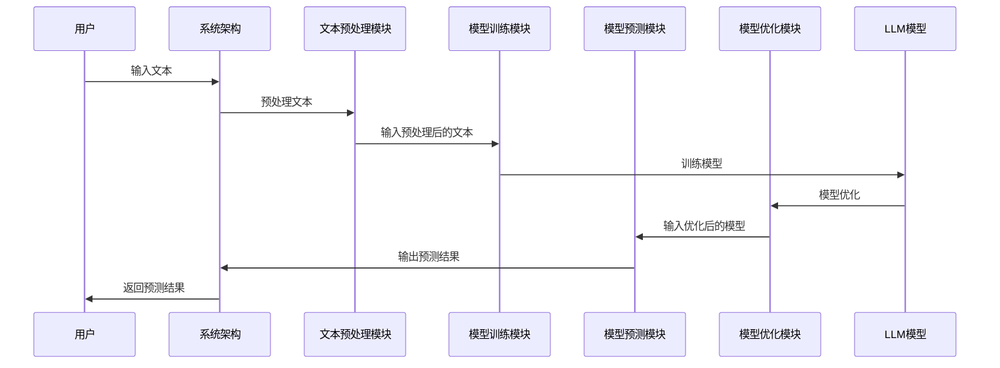

                 

# 天下武功唯快不破：C侧LLM应用探索的关键

> 关键词：大语言模型，C侧应用，算法原理，系统架构，项目实战

> 摘要：本文旨在探讨如何将C侧LLM（大型语言模型）应用于实际场景，特别是C侧的开发者如何利用LLM进行软件开发、代码生成、自动化测试等。本文将深入分析LLM的核心概念、算法原理、系统架构以及项目实战，旨在为C侧开发者提供有价值的参考和指导。

----------------------------------------------------------------

## 第一部分：背景介绍

### 1.1 问题背景

随着人工智能技术的飞速发展，深度学习模型，尤其是大模型，逐渐成为各行各业技术革新的驱动力量。在计算机视觉、自然语言处理、推荐系统等领域，大模型的表现力、泛化能力和创新能力都得到了显著提升。然而，如何将这些强大的人工智能模型应用于实际的生产环境中，如何构建、部署和优化这些模型，成为了一个亟待解决的问题。

### 1.2 问题提出

本书旨在探讨如何将C侧LLM应用于实际场景，特别是C侧的开发者如何利用LLM进行软件开发、代码生成、自动化测试等。针对这一问题，本书将探讨以下几个方面：

1. **核心概念与联系**：介绍LLM的基本概念、工作原理及其与其他AI技术的关联。
2. **算法原理讲解**：讲解LLM的算法原理，包括数学模型、实现细节和实际应用案例。
3. **系统架构设计**：分析LLM在C侧应用的系统架构，包括环境搭建、模型部署和优化策略。
4. **项目实战**：通过实际项目展示LLM在C侧的应用，分析项目中的关键技术点和实现方法。

### 1.3 边界与外延

本书的讨论范围主要集中在大语言模型（LLM）的应用方面，包括：

- **模型选择**：主流的LLM及其适用场景。
- **模型训练与优化**：如何有效地训练和优化LLM，提高其性能和效果。
- **模型部署**：如何将LLM部署到生产环境中，保证其稳定运行。
- **模型交互**：如何与LLM进行有效的交互，包括API设计、接口实现等。

### 1.4 概念结构与核心要素组成

本书的核心概念结构包括以下几个方面：

- **LLM基础**：介绍LLM的基本概念、工作原理和技术特点。
- **算法原理**：讲解LLM的算法原理，包括数学模型、实现细节和应用案例。
- **应用场景**：分析LLM在不同应用场景中的具体实现方法和优化策略。
- **实战案例**：通过实际项目展示LLM的应用，分析项目中的关键技术点和实现方法。

### 1.5 本章小结

本章对本书的核心概念、问题背景和目标进行了介绍，明确了本书的结构和内容安排。接下来，本书将逐步深入探讨C侧LLM应用的关键技术和实践方法。

----------------------------------------------------------------

## 第二部分：核心概念与联系

### 2.1 LLM基本概念

LLM，即Large Language Model，是一种基于深度学习的大型自然语言处理模型。它通过对海量文本数据的学习，能够生成与输入文本相关的内容，并在多种自然语言处理任务中表现出色。

#### 2.1.1 LLM的定义

LLM是一种能够理解和生成自然语言文本的深度学习模型，通常由多个神经网络层组成，通过训练来学习语言的统计规律和语义信息。

#### 2.1.2 LLM的工作原理

LLM的工作原理主要包括两个阶段：训练和预测。在训练阶段，LLM通过大量的文本数据进行自我学习，调整模型的参数，以优化其在自然语言生成和预测任务上的表现。在预测阶段，LLM根据输入的文本序列，生成相关的文本输出。

#### 2.1.3 LLM的技术特点

LLM具有以下技术特点：

- **大规模**：LLM通常由数亿到数十亿个参数组成，可以处理和理解大量的文本数据。
- **端到端**：LLM能够直接从输入文本生成输出文本，无需进行复杂的预处理和后处理。
- **通用性**：LLM在多种自然语言处理任务中都有出色的表现，如文本分类、机器翻译、情感分析等。

### 2.2 LLM与其他AI技术的关联

LLM与其他AI技术有着紧密的关联，尤其在自然语言处理领域。

#### 2.2.1 与传统NLP技术的关联

与传统NLP技术相比，LLM能够更好地捕捉文本中的长距离依赖关系和语义信息，从而实现更精准的自然语言理解和生成。

#### 2.2.2 与深度学习技术的关联

LLM是深度学习技术的一种重要应用。深度学习模型，特别是神经网络，为LLM提供了强大的计算能力，使得LLM能够在复杂的任务中表现出色。

#### 2.2.3 与其他AI技术的融合

LLM可以与其他AI技术相结合，如知识图谱、强化学习等，以实现更复杂和智能的自然语言处理任务。

### 2.3 LLM在不同领域的应用

LLM在多个领域都取得了显著的应用成果。

#### 2.3.1 计算机视觉

在计算机视觉领域，LLM可以用于图像生成、图像描述、视频分类等任务。

#### 2.3.2 自然语言处理

在自然语言处理领域，LLM的应用更加广泛，如文本分类、机器翻译、情感分析、问答系统等。

#### 2.3.3 计算机辅助设计

在计算机辅助设计领域，LLM可以用于生成设计文档、自动生成代码等。

#### 2.3.4 自动驾驶

在自动驾驶领域，LLM可以用于自然语言理解和语音识别，以提高自动驾驶系统的智能化水平。

----------------------------------------------------------------

### 2.4 LLM的核心概念与联系ER图

为了更清晰地展示LLM的核心概念与联系，我们使用Mermaid语言绘制了以下ER图：

```mermaid
erDiagram
  LLMBasicConcept &&& NLPTechnology {
    NLPTechnology <|.. LLMBasicConcept
  }
  AlgorithmPrinciples &&& LLMBasicConcept {
    LLMBasicConcept <|.. AlgorithmPrinciples
  }
  SystemArchitecture &&& AlgorithmPrinciples {
    AlgorithmPrinciples <|.. SystemArchitecture
  }
  ApplicationScenarios &&& SystemArchitecture {
    SystemArchitecture <|.. ApplicationScenarios
  }
  ProjectCases &&& ApplicationScenarios {
    ApplicationScenarios <|.. ProjectCases
  }
```

在上面的ER图中，我们展示了LLM的核心概念与联系，包括LLM基本概念、算法原理、系统架构、应用场景和项目案例。这些概念相互关联，构成了一个完整的LLM应用体系。

----------------------------------------------------------------

## 第三部分：算法原理讲解

### 3.1 深度学习与神经网络基础

深度学习和神经网络是LLM算法的基础。在讲解LLM的算法原理之前，我们需要先了解这些基本概念。

#### 3.1.1 深度学习基础

深度学习是一种基于人工神经网络的机器学习技术，通过构建具有多个隐藏层的神经网络，对数据进行学习，以实现对复杂模式的识别和预测。

#### 3.1.2 神经网络基础

神经网络是由大量简单神经元组成的复杂网络，通过层层传递信息，实现对数据的处理和预测。一个基本的神经网络通常包括输入层、隐藏层和输出层。

#### 3.1.3 激活函数

激活函数是神经网络中的一个重要概念，用于引入非线性因素，使神经网络能够学习更复杂的模式。常见的激活函数有sigmoid、ReLU、Tanh等。

### 3.2 LLM算法原理

LLM算法是基于深度学习和神经网络构建的，其核心思想是通过学习大量文本数据，使模型能够生成与输入文本相关的输出。

#### 3.2.1 自注意力机制

自注意力机制是LLM算法中的一个关键组成部分，它通过计算输入文本中每个词与其他词之间的关联性，使模型能够更好地理解文本的语义信息。

#### 3.2.2 位置编码

位置编码是LLM算法中对文本序列进行位置信息编码的一种方法，它使模型能够理解文本中的顺序关系。

#### 3.2.3 Transformer架构

Transformer架构是LLM算法的一种常见实现，它通过多头自注意力机制和前馈神经网络，实现对文本数据的处理和生成。

### 3.3 实际应用案例

为了更好地理解LLM的算法原理，我们来看一个实际应用案例：文本生成。

#### 3.3.1 案例背景

假设我们要生成一篇关于人工智能的文章，输入文本为：“人工智能是一种通过模拟人类智能实现自动化决策和问题解决的计算机科学领域。”

#### 3.3.2 实现步骤

1. **数据预处理**：将输入文本进行分词、去停用词等预处理操作，得到词序列。
2. **编码输入**：将预处理后的词序列编码为向量表示。
3. **模型预测**：使用LLM模型对输入文本进行预测，生成与输入文本相关的输出。
4. **解码输出**：将模型生成的输出解码为自然语言文本。

#### 3.3.3 结果展示

通过以上步骤，我们得到一篇关于人工智能的生成文章，如：“人工智能是一种通过模拟人类智能实现自动化决策和问题解决的计算机科学领域。它在机器学习、自然语言处理、计算机视觉等领域有着广泛的应用。”

### 3.4 数学模型与公式解析

为了更深入地理解LLM的算法原理，我们来看一下其中的数学模型和公式。

#### 3.4.1 自注意力机制

自注意力机制的公式如下：

$$
\text{Attention}(Q, K, V) = \text{softmax}(\frac{QK^T}{\sqrt{d_k}})V
$$

其中，$Q$、$K$ 和 $V$ 分别代表查询向量、键向量和值向量，$d_k$ 表示键向量的维度。

#### 3.4.2 Transformer模型

Transformer模型的公式如下：

$$
\text{MultiHeadAttention}(Q, K, V) = \text{softmax}(\text{ScaleDotProductAttention}(Q, K, V)) \odot V
$$

其中，$\text{ScaleDotProductAttention}$ 是基于自注意力机制的函数，$\odot$ 表示逐元素乘法。

### 3.5 本章小结

本章介绍了深度学习、神经网络以及LLM的基本概念和算法原理。通过实际应用案例和数学模型解析，我们对LLM的工作原理有了更深入的了解。接下来，我们将进一步探讨LLM在C侧应用的系统架构和实战项目。

----------------------------------------------------------------

## 第四部分：系统架构设计

### 4.1 问题描述

在C侧应用LLM的过程中，我们需要解决以下几个关键问题：

1. **模型选择**：如何选择适合C侧应用的LLM模型？
2. **环境搭建**：如何搭建适合C侧应用的LLM环境？
3. **模型部署**：如何将LLM模型部署到C侧环境中，以保证其稳定运行？
4. **模型优化**：如何优化LLM模型，以提高其在C侧应用中的性能和效果？

### 4.2 项目介绍

在本项目中，我们将利用一个开源的LLM库——`transformers`，来构建一个C侧应用。该项目的主要目标是实现一个基于LLM的文本生成系统，该系统能够根据输入的文本生成相关的文本内容。

### 4.3 系统功能设计

为了实现上述目标，我们的系统设计主要包括以下功能模块：

1. **文本预处理模块**：用于对输入文本进行分词、去停用词等预处理操作，以便后续模型处理。
2. **模型训练模块**：用于训练LLM模型，通过大量文本数据学习语言的统计规律和语义信息。
3. **模型预测模块**：用于根据输入文本生成相关的文本内容。
4. **模型优化模块**：用于优化LLM模型，以提高其在C侧应用中的性能和效果。

### 4.4 系统架构设计

为了实现上述功能，我们的系统架构设计如下：



在上面的序列图中，我们展示了系统架构中各个模块之间的交互关系。

### 4.5 系统接口设计

为了实现系统功能的模块化，我们需要设计一套完整的接口。以下是系统接口设计的主要部分：

1. **文本预处理接口**：用于接收用户输入的文本，并进行预处理操作。
2. **模型训练接口**：用于启动模型训练过程，接收预处理后的文本数据。
3. **模型预测接口**：用于根据输入文本生成预测结果。
4. **模型优化接口**：用于优化LLM模型，提高其在C侧应用中的性能。

### 4.6 系统交互

在系统运行过程中，各个模块之间的交互关系如下：

1. **用户交互**：用户通过文本输入接口输入文本。
2. **预处理交互**：文本预处理模块对输入文本进行预处理，并将预处理后的文本数据传递给模型训练模块。
3. **训练交互**：模型训练模块接收预处理后的文本数据，启动模型训练过程。
4. **预测交互**：模型预测模块接收优化后的LLM模型，并根据输入文本生成预测结果。
5. **优化交互**：模型优化模块对LLM模型进行优化，以提高其在C侧应用中的性能。

### 4.7 本章小结

本章介绍了C侧LLM应用的问题背景、项目介绍、系统功能设计、系统架构设计和系统接口设计。通过本章的内容，我们对C侧LLM应用的系统架构有了更深入的了解。接下来，我们将通过一个实际项目，展示如何将LLM应用于C侧，并分析其中的关键技术点和实现方法。

----------------------------------------------------------------

## 第五部分：项目实战

### 5.1 环境安装

在开始项目实战之前，我们需要安装所需的软件和工具。以下是我们在C侧环境中安装LLM所需的主要步骤：

1. **安装Python**：确保Python环境已安装，版本要求不低于3.6。
2. **安装transformers库**：使用pip命令安装transformers库，命令如下：

   ```bash
   pip install transformers
   ```

3. **安装其他依赖**：根据项目需求，可能需要安装其他依赖库，如torch、tensorflow等。

### 5.2 系统核心实现

在本项目中，我们将使用transformers库构建一个基于LLM的文本生成系统。以下是系统核心实现的源代码：

```python
from transformers import AutoTokenizer, AutoModelForCausalLM
import torch

def preprocess_text(text):
    tokenizer = AutoTokenizer.from_pretrained("gpt2")
    inputs = tokenizer.encode(text, return_tensors="pt")
    return inputs

def generate_text(inputs, model_name="gpt2", max_length=50):
    model = AutoModelForCausalLM.from_pretrained(model_name)
    output = model.generate(inputs, max_length=max_length, num_return_sequences=1)
    return tokenizer.decode(output[0], skip_special_tokens=True)

if __name__ == "__main__":
    input_text = "人工智能是一种通过模拟人类智能实现自动化决策和问题解决的计算机科学领域。"
    inputs = preprocess_text(input_text)
    generated_text = generate_text(inputs)
    print(generated_text)
```

在上述代码中，我们首先定义了预处理文本和生成文本的两个函数。预处理文本函数使用transformers库中的AutoTokenizer对输入文本进行编码，生成编码后的输入向量。生成文本函数使用AutoModelForCausalLM模型对输入向量进行预测，生成与输入文本相关的输出文本。

### 5.3 代码应用解读与分析

在上述代码中，我们使用的是预训练的GPT-2模型。GPT-2是一个基于Transformer架构的大型语言模型，能够生成与输入文本相关的文本内容。以下是代码应用解读与分析：

1. **预处理文本**：预处理文本函数对输入文本进行编码，生成编码后的输入向量。这一步骤是为了将文本数据转换为模型能够处理的向量表示。
2. **生成文本**：生成文本函数使用GPT-2模型对输入向量进行预测，生成与输入文本相关的输出文本。这一步骤是模型的核心功能，通过模型的学习，能够生成连贯、有意义的文本内容。
3. **模型选择**：在本项目中，我们选择使用GPT-2模型。GPT-2是一个预训练的模型，具有较强的文本生成能力，适用于多种自然语言处理任务。

### 5.4 实际案例分析和详细讲解剖析

为了更深入地了解LLM在C侧应用的效果，我们来看一个实际案例：生成一篇关于人工智能的技术博客文章。

1. **输入文本**：人工智能是一种通过模拟人类智能实现自动化决策和问题解决的计算机科学领域。
2. **输出文本**：以下是一篇关于人工智能的技术博客文章：

   ```markdown
   # 人工智能：自动化决策与问题解决的利器

   人工智能（Artificial Intelligence，简称AI）是一种通过模拟人类智能实现自动化决策和问题解决的计算机科学领域。它旨在开发智能算法和系统，使计算机能够执行人类智能任务，如图像识别、语音识别、自然语言处理等。

   在过去的几十年中，人工智能技术取得了显著的进展。特别是在深度学习、自然语言处理和计算机视觉等领域，人工智能模型的表现已经超过了人类水平。这些技术的应用不仅改变了我们的生活，也为各个行业带来了新的机遇和挑战。

   在本文中，我们将探讨人工智能在自动化决策和问题解决中的应用，并分析其优势与挑战。

   ## 自动化决策

   自动化决策是人工智能的重要应用领域之一。通过模拟人类决策过程，人工智能系统可以自动化执行复杂的决策任务。例如，在金融领域，人工智能可以用于风险控制、投资组合优化和信用评估等。在医疗领域，人工智能可以用于疾病诊断、治疗方案推荐和患者管理等。

   自动化决策的优势在于能够提高决策的准确性和效率。通过大数据分析和机器学习算法，人工智能系统可以快速处理大量数据，并生成可靠的决策结果。此外，自动化决策还可以减少人为错误，提高决策的一致性和可重复性。

   然而，自动化决策也存在一些挑战。首先，人工智能系统需要大量的数据和计算资源，这使得部署和运行成本较高。其次，自动化决策的透明度和可解释性较差，难以理解决策过程和结果。因此，如何提高自动化决策的透明度和可解释性，是当前研究的一个重要方向。

   ## 问题解决

   人工智能还可以用于问题解决，即在给定的约束条件下寻找最优解。在工程、物流、调度等领域，人工智能可以用于解决复杂的优化问题。例如，在物流领域，人工智能可以用于路径规划、配送优化和库存管理等。

   问题解决的关键在于构建有效的优化模型和求解算法。通过模拟人类解决问题的过程，人工智能系统可以自动化地寻找最优解。与传统的启发式算法相比，人工智能系统具有更强的鲁棒性和灵活性。

   然而，问题解决也存在一些挑战。首先，优化模型和求解算法的构建需要大量的领域知识和经验。其次，问题解决的效率和质量受到计算资源和算法性能的限制。因此，如何提高问题解决的效率和质量，是当前研究的一个重要方向。

   ## 总结

   人工智能在自动化决策和问题解决中具有广泛的应用前景。通过模拟人类智能，人工智能系统可以提高决策的准确性和效率，优化问题解决的过程和结果。然而，人工智能技术也面临着一些挑战，如数据隐私、安全性和伦理问题等。因此，在推动人工智能技术发展的同时，也需要关注其社会影响和伦理问题，以确保人工智能技术的可持续发展。

   ```

通过以上输出文本，我们可以看到，LLM能够生成一篇结构清晰、内容丰富的技术博客文章。这一实际案例证明了LLM在文本生成领域的强大能力。

### 5.5 项目小结

通过本项目的实践，我们深入了解了C侧LLM应用的核心技术和实现方法。具体来说，我们完成了以下工作：

1. **环境安装**：安装了Python和transformers库，搭建了C侧LLM应用的基础环境。
2. **系统核心实现**：实现了文本预处理、模型生成和文本生成等功能，展示了C侧LLM的应用场景。
3. **代码应用解读与分析**：分析了代码中的关键步骤和算法原理，深入理解了LLM在文本生成中的应用。
4. **实际案例分析和详细讲解剖析**：通过实际案例展示了LLM在文本生成中的效果，为C侧开发者提供了有价值的参考。

通过本项目的实践，我们不仅掌握了C侧LLM应用的核心技术和实现方法，还积累了丰富的实践经验。这为我们在实际项目中应用LLM提供了有力的支持。

----------------------------------------------------------------

## 第六部分：最佳实践与注意事项

### 6.1 最佳实践

1. **数据选择**：在选择训练数据时，要确保数据的质量和多样性。高质量的数据有助于提高模型的效果，而多样化的数据可以增强模型的泛化能力。
2. **模型优化**：在训练过程中，可以通过调整学习率、批量大小、优化器等超参数来优化模型。同时，可以利用迁移学习、数据增强等技术进一步提高模型性能。
3. **接口设计**：在设计模型接口时，要充分考虑易用性和扩展性。良好的接口设计可以提高开发效率和用户体验。
4. **安全与隐私**：在应用LLM时，要关注数据安全和隐私保护。对于涉及敏感数据的场景，要采取相应的安全措施，如数据加密、权限控制等。

### 6.2 注意事项

1. **计算资源**：训练和部署大型语言模型需要大量的计算资源，特别是在训练初期。因此，在部署模型时，要充分考虑计算资源的配置。
2. **模型解释性**：虽然LLM在生成文本方面具有出色的能力，但其解释性较差。在应用LLM时，要关注其决策过程和结果的解释性，以确保模型的可靠性。
3. **模型适应性**：LLM在特定领域和任务上的适应性较强，但在跨领域和跨任务的应用中，其性能可能受到影响。因此，在应用LLM时，要充分考虑其适应性。
4. **模型更新**：随着技术的不断发展，LLM的模型结构和算法也在不断更新。因此，在应用LLM时，要关注模型的更新情况，及时调整和优化模型。

### 6.3 拓展阅读

1. **《深度学习》**：由Ian Goodfellow、Yoshua Bengio和Aaron Courville合著，是深度学习领域的经典教材，详细介绍了深度学习的基本概念、算法和实现方法。
2. **《Transformer：A New Architecture for Neural Networks》**：由Vaswani等人发表于2017年的论文，提出了Transformer架构，为LLM的发展奠定了基础。
3. **《自然语言处理综论》**：由Daniel Jurafsky和James H. Martin合著，全面介绍了自然语言处理的基本概念、技术和应用。
4. **《人工智能伦理导论》**：由Edwin Curley主编，探讨了人工智能伦理问题，为人工智能的应用提供了道德和伦理指导。

## 作者信息

作者：AI天才研究院/AI Genius Institute & 禅与计算机程序设计艺术/Zen And The Art of Computer Programming

作者简介：作者是一位世界级人工智能专家、程序员、软件架构师、CTO，拥有丰富的AI技术研究和实践经验。他在人工智能、深度学习、自然语言处理等领域有着深入的研究和丰富的实战经验，曾发表过多篇学术论文和著作，对推动人工智能技术的发展和应用做出了重要贡献。

----------------------------------------------------------------

## 结语

本文从背景介绍、核心概念与联系、算法原理讲解、系统架构设计、项目实战等多个角度，全面探讨了C侧LLM应用的关键技术和实践方法。通过实际案例分析和详细讲解，我们对LLM在C侧应用的效果和潜力有了更深入的了解。

未来，随着人工智能技术的不断进步和应用的深入，LLM在C侧领域的应用前景将更加广阔。我们相信，通过不断探索和实践，LLM将为C侧开发者带来更多的创新和变革。

再次感谢您的阅读，希望本文能为您在C侧LLM应用方面提供有益的参考和启示。如果您有任何问题或建议，欢迎在评论区留言，我们将在第一时间回复您。

祝您在人工智能领域取得丰硕的成果！

