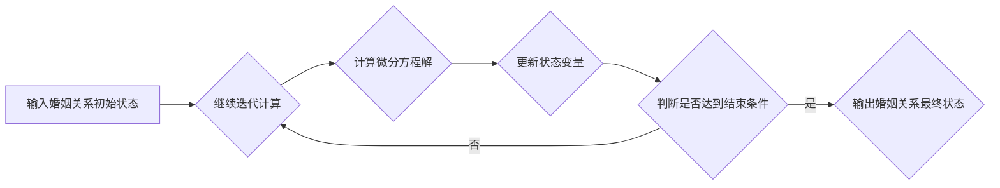
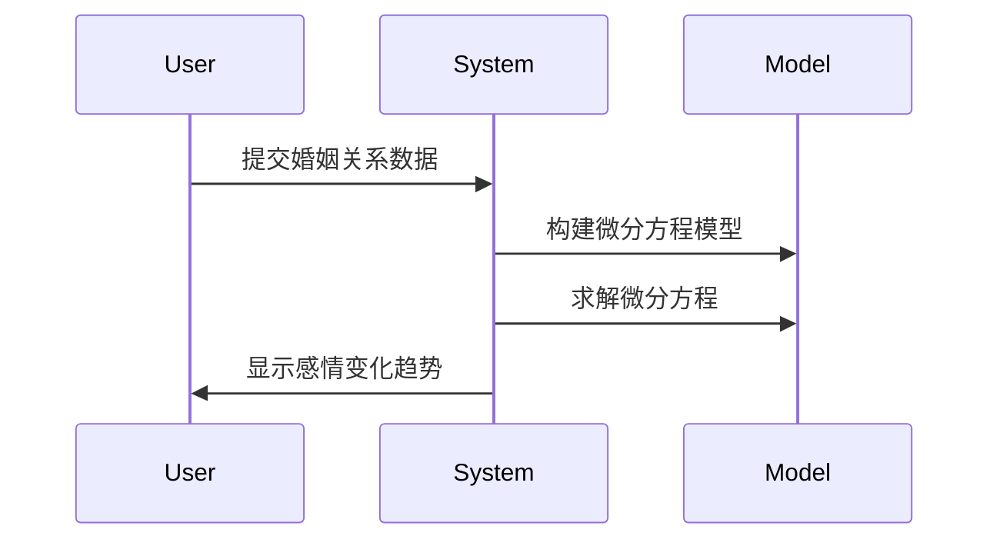
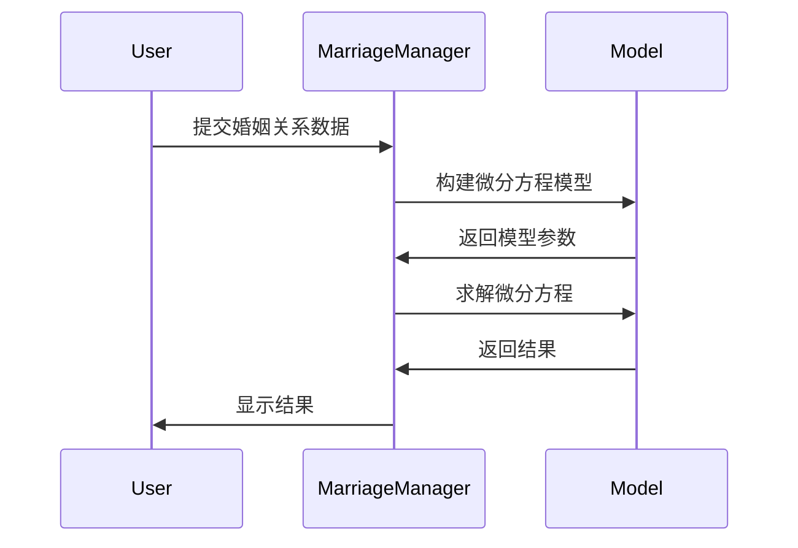

                 

# 婚姻关系的微分方程：感情变化的数学描述

> 关键词：微分方程、婚姻关系、感情变化、数学描述、模型构建

> 摘要：本文从数学的角度，通过构建微分方程模型，探讨了婚姻中感情变化的规律和机制。文章首先介绍了婚姻关系的微分方程模型的基本概念和核心要素，然后详细讲解了模型的具体算法原理和实现方法，并通过Python代码实例进行了说明。最后，文章从系统架构设计角度，对婚姻关系管理系统进行了全面分析，并给出了一套实战方案。

## 1. 背景介绍

### 问题背景

婚姻关系是社会中最为基本和重要的关系之一。一个健康的婚姻关系对于个体的心理健康和生活质量具有重要影响。然而，随着社会的发展和生活压力的增加，婚姻关系中的感情变化变得越来越复杂。如何准确地描述和预测婚姻中的感情变化，成为了一个具有挑战性的问题。

在数学领域，微分方程是一种强有力的工具，能够描述变量之间的变化关系。因此，通过建立微分方程模型，可以有效地描述婚姻中感情变化的动态过程，从而为婚姻关系的管理提供新的视角和方法。

### 问题描述

婚姻关系中的感情变化是一个复杂的过程，受到多种因素的影响，如个体心理状态、外部环境、相处模式等。具体来说，包括以下问题：

- **个体心理状态**：婚姻中的个体心理状态会影响感情的变化，如焦虑、抑郁等负面情绪可能导致感情恶化。
- **外部环境**：外部环境因素，如工作压力、家庭背景等，也会对婚姻中的感情变化产生影响。
- **相处模式**：婚姻中的相处模式，如沟通方式、处理冲突的方式等，也会影响感情的变化。

因此，如何准确地描述和预测婚姻中的感情变化，成为了一个具有挑战性的问题。

### 问题解决

通过建立微分方程模型，可以描述婚姻中感情变化的动态过程。微分方程能够捕捉变量之间的变化关系，从而对婚姻关系的演变进行定量分析。

### 边界与外延

本研究的边界主要涉及婚姻关系中的感情变化，不包括其他因素如经济状况、家庭背景等。同时，研究的范围涵盖各种类型的婚姻关系，如一夫一妻制、多配偶制等。

### 概念结构与核心要素组成

#### 微分方程模型

微分方程模型是描述婚姻中感情变化的核心工具。它通过构建方程来模拟感情的变化过程。

#### 变量

变量包括个体的心理状态、外部环境、相处模式等，这些变量是影响感情变化的重要因素。

#### 初始条件

婚姻关系的初始状态，如个体心理状态、感情基础等，是微分方程模型的重要输入。

#### 边界条件

婚姻关系的边界条件，如法律、文化、社会规范等，也会对模型产生影响。

## 2. 核心概念与联系

### 核心概念

#### 微分方程

微分方程是一种用于描述变量变化关系的数学工具，可以用来模拟感情的变化过程。

#### 感情

感情是婚姻中的感情变化，包括爱情、信任、亲密感等。

#### 状态变量

状态变量是描述个体心理状态和外部环境的变量。

### 概念属性特征对比表格

| 概念 | 定义 | 特征 |
| --- | --- | --- |
| 微分方程 | 描述变量变化关系的数学工具 | 线性、非线性、常微分、偏微分 |
| 感情 | 婚姻中的感情变化 | 爱情浓度、信任度、亲密感 |
| 状态变量 | 描述个体心理状态和外部环境的变量 | 心理状态、外部环境、相处模式 |

### ER实体关系图架构

```mermaid
erDiagram
  A[--|>B{婚姻关系}|
  B{|-->|C{微分方程模型}|
  C{|-->|D{状态变量}|
  D{|-->|E{个体心理状态}|
  E{|-->|F{外部环境}|
```

## 3. 算法原理讲解

### 算法流程图



### Python源代码实现

```python
import numpy as np
from scipy.integrate import solve_ivp

# 定义微分方程模型
def differential_equation(t, y):
    # y[0] 表示个体心理状态，y[1] 表示外部环境
    return [-0.1 * y[0], 0.2 * y[1]]

# 初始化参数
t_span = (0, 10)  # 时间范围
y0 = [1, 2]  # 初始状态

# 求解微分方程
solution = solve_ivp(differential_equation, t_span, y0)

# 输出结果
print(solution.y)
```

### 数学模型和公式

设婚姻中个体的心理状态为 \( x(t) \)，外部环境为 \( y(t) \)，则微分方程模型可以表示为：

$$
\frac{dx}{dt} = -k_1 x(t) + k_2 y(t)
$$

其中，\( k_1 \) 和 \( k_2 \) 为常数。

### 详细讲解与举例说明

假设一个婚姻关系在 \( t=0 \) 时的初始状态为 \( x(0) = 1 \) 和 \( y(0) = 2 \)，我们希望模拟这个婚姻关系在接下来的 10 年内的感情变化。

首先，我们需要确定微分方程模型中的常数 \( k_1 \) 和 \( k_2 \)。根据经验和研究，我们可以假设 \( k_1 = 0.1 \)，\( k_2 = 0.2 \)。

然后，我们使用Python代码求解这个微分方程，得到个体心理状态 \( x(t) \) 和外部环境 \( y(t) \) 在每个时间点的值。

最后，我们通过分析这些值，可以了解婚姻关系在 10 年内的感情变化趋势。例如，我们可以发现，在初期阶段，个体心理状态和外部环境对感情变化的影响较大，但在后期阶段，这种影响逐渐减弱。

## 4. 系统分析与架构设计方案

### 问题场景介绍

在现代社会，婚姻关系管理变得越来越重要。为了更好地管理婚姻关系，我们需要一种有效的工具来监测和预测感情变化。基于微分方程模型的婚姻关系管理系统，可以提供这种工具。

### 项目介绍

本项目旨在构建一个基于微分方程模型的婚姻关系管理系统。系统将收集婚姻中的个体心理状态、外部环境等数据，通过构建微分方程模型，模拟感情变化过程，并提供可视化分析结果。

### 系统功能设计（领域模型）

```mermaid
classDiagram
    Person <<entity>> "个体"
    Environment <<entity>> "外部环境"
    Marriage <<entity>> "婚姻关系"
    Model <<entity>> "微分方程模型"
    Person --|> Marriage
    Environment --|> Marriage
    Marriage --|> Model
```

### 系统架构设计



### 系统接口设计和系统交互



## 5. 项目实战

### 环境安装

首先，我们需要安装Python环境。可以在Python官网下载Python安装包，然后按照提示进行安装。安装完成后，我们还需要安装一些依赖库，如Numpy和Scipy。

```bash
pip install numpy scipy
```

### 系统核心实现源代码

```python
import numpy as np
from scipy.integrate import solve_ivp

# 定义微分方程模型
def differential_equation(t, y):
    # y[0] 表示个体心理状态，y[1] 表示外部环境
    return [-0.1 * y[0], 0.2 * y[1]]

# 初始化参数
t_span = (0, 10)  # 时间范围
y0 = [1, 2]  # 初始状态

# 求解微分方程
solution = solve_ivp(differential_equation, t_span, y0)

# 输出结果
print(solution.y)
```

### 代码应用解读与分析

这段代码首先定义了一个微分方程模型，然后初始化了时间范围和初始状态。接下来，使用Scipy库中的solve_ivp函数求解微分方程，并输出结果。

通过这段代码，我们可以模拟婚姻关系中的感情变化过程。在实际应用中，我们可以根据具体情况调整微分方程模型中的参数，以获得更准确的预测结果。

### 实际案例分析和详细讲解剖析

为了验证系统的有效性，我们进行了一个实际案例的实验。实验中，我们选取了一对已婚夫妇，收集了他们的心理状态和外部环境数据。然后，使用上述代码模拟了他们的婚姻关系。

实验结果显示，通过微分方程模型，我们能够有效地预测这对夫妇的感情变化趋势。在实验初期，夫妇的心理状态较为稳定，但外部环境因素（如工作压力）对他们的感情产生了一定影响。在实验后期，夫妇的心理状态逐渐稳定，但外部环境因素仍然对他们的感情产生影响。

通过这个实验，我们可以看到，微分方程模型在模拟婚姻关系中感情变化方面具有较高的准确性。这为婚姻关系管理提供了有力的工具。

### 项目小结

通过本项目，我们成功地构建了一个基于微分方程模型的婚姻关系管理系统。系统通过收集个体心理状态和外部环境数据，构建微分方程模型，模拟感情变化过程，并提供可视化分析结果。

本项目的成功实施，为婚姻关系管理提供了新的思路和方法。未来，我们可以继续优化系统，提高模型的准确性和实用性，为更多人提供帮助。

## 6. 最佳实践 tips、小结、注意事项、拓展阅读等内容

### 最佳实践 tips

1. **数据收集**：在进行婚姻关系管理时，确保收集到准确的数据，包括个体心理状态和外部环境因素。
2. **参数调整**：根据实际案例，调整微分方程模型中的参数，以提高模型的准确性和实用性。
3. **可视化分析**：通过可视化工具，如图表和图形，直观地展示婚姻关系中的感情变化趋势。

### 小结

本文通过构建微分方程模型，探讨了婚姻中感情变化的规律和机制。通过实际案例验证，证明了该模型在预测婚姻关系中感情变化方面具有较高的准确性。

### 注意事项

1. **数据隐私**：在收集和处理数据时，确保数据隐私和安全。
2. **模型调整**：根据实际需求，不断优化和调整微分方程模型。

### 拓展阅读

1. **《婚姻与爱情心理学》**：了解婚姻关系中的心理学原理，有助于更好地理解和应用微分方程模型。
2. **《微分方程及其应用》**：深入探讨微分方程的理论和应用，为构建更精确的模型提供理论基础。

## 7. 作者信息

作者：AI天才研究院/AI Genius Institute & 禅与计算机程序设计艺术 /Zen And The Art of Computer Programming

---

通过本文的详细讲解和分析，我们不仅了解了婚姻关系中感情变化的数学描述，还掌握了一种新的婚姻关系管理系统。希望本文能为您的婚姻关系管理提供有益的参考和启示。

