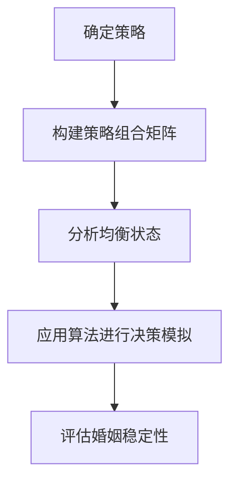
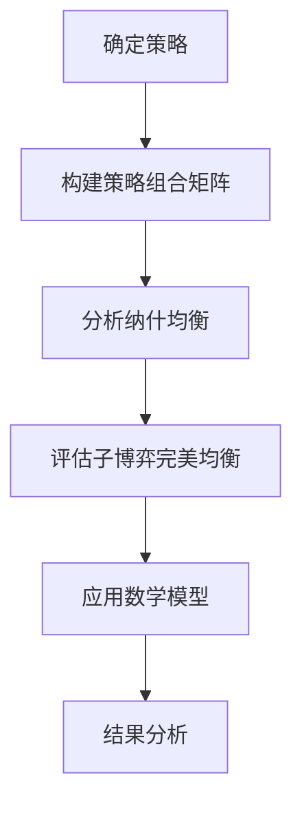
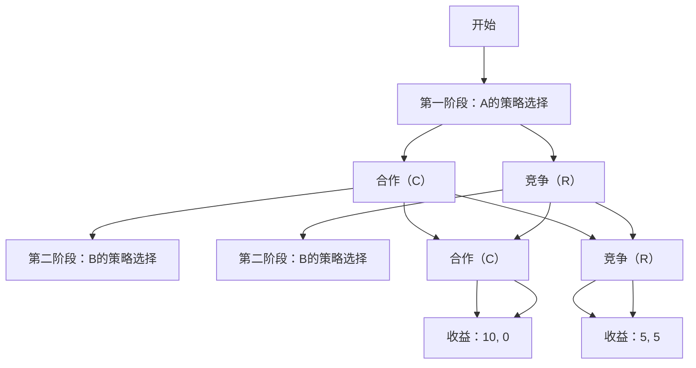
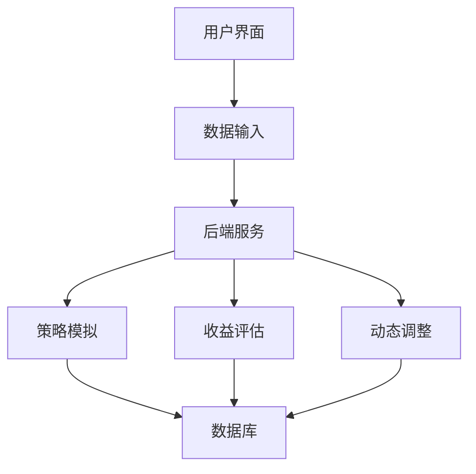
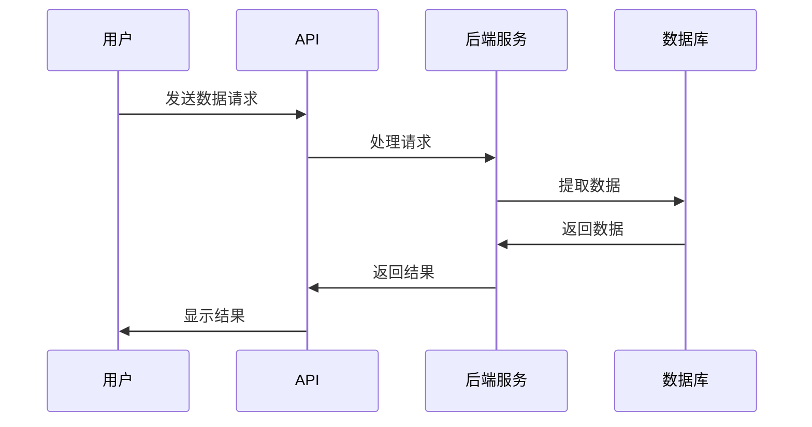
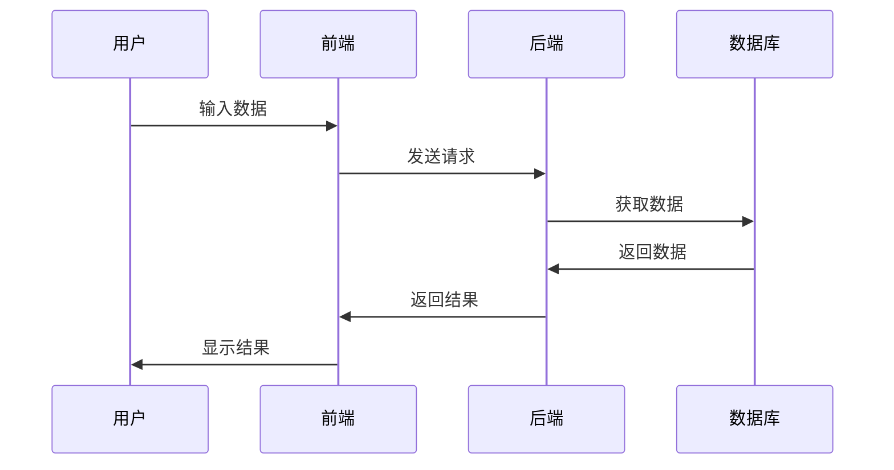

                 

# 《婚姻稳定性的博弈论：关系平衡的数学策略》

## 关键词

- 婚姻稳定性
- 博弈论
- 数学策略
- 关系平衡
- 算法原理

## 摘要

本文以婚姻稳定性的博弈论为切入点，探讨关系平衡的数学策略。通过详细解析博弈论的基本概念，如策略、博弈和均衡，我们将阐述如何将博弈论的原理应用于婚姻稳定性分析。文章将分章节介绍婚姻稳定性的研究背景、博弈论基础、婚姻稳定性与博弈论的结合、数学模型在婚姻稳定性分析中的应用、系统分析与架构设计方案以及项目实战。通过理论与实践相结合，本文旨在为读者提供深入了解婚姻稳定性和博弈论关系的新视角。

### 目录

1. 引言
2. 婚姻稳定性的研究背景
3. 博弈论的基本概念
4. 博弈论的数学模型
5. 博弈论的算法原理
6. 婚姻稳定性与博弈论的结合
7. 数学模型在婚姻稳定性分析中的应用
8. 系统分析与架构设计方案
9. 项目实战
10. 最佳实践 tips
11. 小结
12. 注意事项
13. 拓展阅读

----------------------------------------------------------------

## 引言

婚姻稳定性是社会学、心理学和经济学等领域研究的重要课题。婚姻稳定性不仅关系到个体的幸福感和生活质量，还对社会稳定性和经济发展产生深远影响。然而，婚姻稳定性是一个复杂且多面的现象，涉及情感、经济、文化等多个因素。如何准确评估和提升婚姻稳定性，成为研究者们长期以来的挑战。

近年来，博弈论作为一种分析合作与竞争行为的数学工具，逐渐受到关注。博弈论通过研究个体在不同策略下的决策过程和结果，为解决复杂的社会问题提供了新的思路。将博弈论应用于婚姻稳定性研究，可以从个体行为和决策的角度，揭示影响婚姻稳定性的内在机制。

本文旨在探讨婚姻稳定性的博弈论分析，从理论层面和实际应用层面出发，为婚姻稳定性的研究提供新的视角和方法。首先，我们将介绍婚姻稳定性的基本概念和研究背景。然后，深入讲解博弈论的基本概念，包括策略、博弈和均衡，并阐述如何将这些概念应用于婚姻稳定性分析。接着，我们将介绍博弈论的数学模型，并使用mermaid流程图和Python源代码进行详细阐述。随后，我们将探讨数学模型在婚姻稳定性分析中的应用，并通过具体案例进行分析。此外，本文还将介绍婚姻稳定性分析的系统架构设计，包括系统功能设计、架构设计和接口设计。最后，我们将通过项目实战，展示如何将博弈论应用于婚姻稳定性分析，并提供最佳实践 tips、小结和拓展阅读。

通过本文的阅读，读者将能够系统地了解婚姻稳定性和博弈论之间的关系，掌握相关理论和实践方法，为婚姻稳定性研究提供新的思路和工具。

----------------------------------------------------------------

## 婚姻稳定性的研究背景

婚姻稳定性是一个广泛且复杂的社会现象，受到多种因素的影响。首先，从社会学角度来看，婚姻稳定性与家庭结构、社会文化背景和社会经济发展密切相关。例如，在传统社会中，婚姻通常被看作是家庭延续和社会稳定的重要基石，婚姻稳定性因此受到高度重视。然而，在现代社会，随着家庭结构多样化和价值观的多元化，婚姻稳定性的意义和影响因素也发生了变化。

从心理学角度来看，婚姻稳定性与夫妻双方的情感状态、沟通能力和适应性密切相关。研究表明，夫妻之间的情感亲密、信任和共同目标对婚姻稳定性具有重要影响。此外，个体的心理素质和情绪调节能力也会影响婚姻稳定性。例如，抗压能力较强的个体在面临婚姻中的挑战时，能够更好地适应和解决问题，从而保持婚姻的稳定性。

从经济学角度来看，婚姻稳定性与夫妻双方的经济状况密切相关。经济基础决定上层建筑，夫妻之间的经济合作和财务规划对婚姻稳定性具有显著影响。当夫妻双方在经济上能够相互支持、合理规划财务，婚姻稳定性往往会更高。相反，经济压力和财务纠纷往往是导致婚姻破裂的重要原因之一。

此外，婚姻稳定性还受到外部环境的影响，如家庭背景、社会支持网络和政策法规等。家庭背景包括父母的婚姻状况、家庭成员的互动关系等，这些因素都会对个体在婚姻中的行为和态度产生影响。社会支持网络则包括朋友、亲戚和社区等，这些支持网络可以在夫妻遇到困难时提供帮助和指导，有助于提升婚姻稳定性。政策法规则通过法律保障和社会服务，为婚姻稳定提供了外部支持。

总的来说，婚姻稳定性是一个涉及社会学、心理学和经济学等多个领域的复杂现象。研究婚姻稳定性的背景和影响因素，有助于我们更好地理解婚姻稳定性的本质，为提升婚姻质量提供科学依据。本文将借助博弈论这一工具，深入探讨婚姻稳定性中的博弈行为和策略选择，以期为婚姻稳定性研究提供新的思路和方法。

### 问题背景与问题描述

在婚姻稳定性的研究中，博弈论的应用提供了一种全新的视角，使我们能够从个体决策行为的角度分析婚姻稳定性。具体而言，婚姻中的夫妻双方可以被视为博弈的参与者，他们的行为和决策不仅影响自身的利益，也影响对方的利益。这种互动关系使得婚姻稳定性分析具有复杂性。

**问题背景**：

假设一对夫妻，男性和女性，分别用A和B表示。他们在婚姻关系中面临的决策包括合作与竞争。合作决策可能导致双方利益的最大化，而竞争决策可能导致一方受益而另一方受损。这种决策过程可以类比为博弈论中的“囚徒困境”问题。

**问题描述**：

在婚姻稳定性分析中，我们关注的核心问题是：夫妻双方如何在复杂的互动关系中找到一种稳定状态，使得双方的利益最大化，从而保持婚姻的长期稳定性。具体而言，我们需要回答以下几个问题：

1. 夫妻双方如何制定策略，以最大化自身利益？
2. 夫妻双方的策略选择是否会影响对方的决策？
3. 哪些因素会影响夫妻双方在婚姻中的策略选择？
4. 如何评估和预测婚姻的稳定性？

为了回答这些问题，我们需要从博弈论的基本概念出发，深入探讨策略、博弈和均衡等概念，并将其应用于婚姻稳定性的分析中。通过建立数学模型和算法，我们能够模拟夫妻双方的决策过程，分析不同策略对婚姻稳定性的影响。接下来，我们将详细介绍博弈论的基本概念，包括策略、博弈和均衡，以期为婚姻稳定性分析提供理论基础。

### 问题解决

为了解决婚姻稳定性分析中的问题，我们需要借助博弈论这一工具，通过建立数学模型和算法来模拟夫妻双方的决策过程。以下是具体的步骤和方法：

**1. 确定博弈模型的基本框架**：

首先，我们假设夫妻双方（A和B）在婚姻中的决策可以表示为两种策略：合作（C）和竞争（R）。合作策略意味着夫妻双方共同努力，追求双方利益的最大化；竞争策略则表示夫妻双方各自为政，追求自身利益的最大化，可能牺牲对方的利益。

**2. 构建策略组合矩阵**：

接下来，我们构建一个策略组合矩阵，以表示夫妻双方在不同策略下的收益。矩阵的行和列分别表示A和B的策略选择，单元格中的数值表示夫妻双方在该策略组合下的收益。例如，如果A选择合作策略而B选择竞争策略，那么A的收益为-10，B的收益为20。具体策略组合矩阵如下：

```
           B
         C  R
      _tC_r   tC_r
    _tC_c   tC_c
     rC_c   rC_c
     rC_r   rC_r
```

其中，t表示收益值，C表示合作，R表示竞争。

**3. 分析博弈的均衡状态**：

在博弈论中，均衡状态是指夫妻双方在特定策略组合下，没有激励改变自己策略的稳定状态。根据策略组合矩阵，我们可以分析以下几种均衡状态：

- 纳什均衡：夫妻双方都选择合作策略，因为任何一方单独改变策略都不能增加自身收益。
- 非合作均衡：夫妻一方选择合作策略，另一方选择竞争策略，这种情况下夫妻一方会得到较高收益，但另一方会遭受损失。

**4. 应用算法进行决策模拟**：

为了更直观地分析夫妻双方的决策过程，我们可以使用mermaid流程图和Python源代码进行模拟。以下是mermaid流程图示例：



在Python中，我们可以编写以下代码来模拟夫妻双方的决策过程：

```python
import numpy as np

# 定义收益矩阵
rewards = np.array([[tC_c, tC_r], [rC_c, rC_r]])

# 定义策略选择概率
p_C = 0.5
p_R = 0.5

# 计算期望收益
expected_rewards = rewards * [p_C, p_R]

print("期望收益：", expected_rewards)
```

通过模拟，我们可以得到夫妻双方在不同策略下的期望收益，从而评估婚姻的稳定性。

**5. 边界与外延**：

在实际应用中，婚姻稳定性分析需要考虑多种因素，如夫妻双方的性格、价值观、家庭背景等。这些因素会影响夫妻双方对策略的选择和收益。因此，在建立数学模型时，我们需要充分考虑这些边界条件，以便更准确地模拟婚姻稳定性的变化。

**6. 概念结构与核心要素组成**：

婚姻稳定性分析中的核心概念包括策略、博弈、均衡和收益。策略是指夫妻双方在婚姻中可以选择的行动方案；博弈是指夫妻双方在特定策略组合下的互动过程；均衡是指夫妻双方在特定策略组合下的稳定状态；收益是指夫妻双方在特定策略组合下的实际收益。

通过上述步骤和方法，我们可以系统地分析婚姻稳定性，为提升婚姻质量提供科学依据。接下来，我们将进一步探讨博弈论的基本概念，以期为婚姻稳定性分析提供更加深入的理论基础。

### 核心概念与联系

为了深入探讨婚姻稳定性的博弈论分析，我们需要先明确核心概念及其相互联系。以下是博弈论中关键概念的详细介绍和它们在婚姻稳定性分析中的应用。

#### 策略

策略是博弈论中最基础的概念之一，指的是参与者在博弈过程中可以采取的行动方案。在婚姻稳定性分析中，策略可以理解为夫妻双方在婚姻关系中采取的行为模式。例如，夫妻双方可以选择合作（C）或竞争（R）的策略。合作策略意味着夫妻双方共同努力，追求双方利益的最大化；竞争策略则表示夫妻双方各自为政，追求自身利益的最大化，可能牺牲对方的利益。

#### 博弈

博弈是指在特定规则下，多个参与者通过策略选择进行互动的过程。在婚姻稳定性分析中，博弈可以类比为夫妻双方在婚姻关系中的互动。夫妻双方通过选择不同的策略，试图达到各自的目标。博弈可以是零和博弈，即一方的收益等于另一方的损失；也可以是非零和博弈，即双方的收益可以相互独立。

#### 均衡

均衡是博弈论中描述稳定状态的术语，指的是在特定策略组合下，没有任何参与者有激励改变自己策略的状态。在婚姻稳定性分析中，均衡意味着夫妻双方在特定策略组合下，没有动力单独改变策略。常见的均衡概念包括纳什均衡、子博弈完美均衡等。

- **纳什均衡**：在纳什均衡中，每个参与者选择的是对其他参与者策略的最佳回应。也就是说，没有参与者能够通过单独改变策略来提高自己的收益。例如，如果夫妻双方都选择合作策略，那么这是一种纳什均衡状态。
- **子博弈完美均衡**：子博弈完美均衡是在博弈的每个子博弈中，每个参与者都选择纳什均衡策略。这意味着，即使在博弈的任何子阶段，参与者也没有激励改变策略。

#### 收益

收益是博弈论中描述参与者决策结果的概念。在婚姻稳定性分析中，收益可以理解为夫妻双方在特定策略组合下的实际收益。收益可以是金钱、情感、权力等多种形式。在策略组合矩阵中，每个单元格中的数值表示夫妻双方在该策略组合下的收益。

#### 联系

将上述核心概念应用于婚姻稳定性分析，我们可以得出以下联系：

1. **策略**：夫妻双方在婚姻中的行为模式决定了博弈的进程。策略的选择会影响双方的收益和婚姻的稳定性。
2. **博弈**：夫妻双方在婚姻中的互动过程可以看作是一个博弈。通过分析博弈的不同阶段和策略组合，我们可以预测婚姻的稳定性。
3. **均衡**：在婚姻稳定性分析中，均衡状态意味着夫妻双方在特定策略组合下没有动力单独改变策略。这有助于我们理解婚姻的稳定状态。
4. **收益**：夫妻双方的收益决定了他们在婚姻中的满意度和稳定性。通过分析收益，我们可以评估不同策略对婚姻稳定性的影响。

通过这些核心概念及其相互联系，我们可以从理论层面深入理解婚姻稳定性，为实际应用提供指导。接下来，我们将进一步介绍博弈论的数学模型，以期为婚姻稳定性分析提供更具体的工具。

### 博弈论的数学模型

博弈论中的数学模型为分析和预测个体在不同策略下的行为提供了强大的工具。在婚姻稳定性分析中，构建合适的数学模型有助于我们理解夫妻双方如何在不同情境下做出决策，从而评估婚姻的稳定性。以下是博弈论中常用的数学模型和它们在婚姻稳定性分析中的应用。

#### 策略组合矩阵

策略组合矩阵是博弈论中最基本的数学模型，它通过表格形式展示了不同参与者在不同策略下的收益。在婚姻稳定性分析中，策略组合矩阵可以用来表示夫妻双方在合作与竞争策略下的收益情况。以下是一个简化的策略组合矩阵示例：

```
           B
         C  R
      _tC_r   tC_r
    _tC_c   tC_c
     rC_c   rC_c
     rC_r   rC_r
```

在这个矩阵中，行和列分别表示夫妻双方A和B的策略选择，单元格中的数值表示双方在该策略组合下的收益。例如，如果A选择合作（C），B选择竞争（R），则A的收益为-10，B的收益为20。这种收益分配反映了竞争策略对夫妻双方的影响。

#### 纳什均衡

纳什均衡是博弈论中的一个重要概念，它描述了在给定其他参与者策略的情况下，每个参与者选择最佳回应策略的稳定状态。在婚姻稳定性分析中，纳什均衡可以帮助我们确定夫妻双方在特定策略组合下的稳定状态。

假设策略组合矩阵如下：

```
           B
         C  R
       -10  20
      -30  10
       20  -10
       10  -30
```

在这个矩阵中，如果B选择竞争策略（R），A的最佳回应策略是合作（C），因为-10 > -30。同样，如果A选择合作策略（C），B的最佳回应策略也是合作（C），因为20 > 10。因此，(C, C) 是这个博弈的纳什均衡。

#### 子博弈完美均衡

子博弈完美均衡是纳什均衡的扩展，它要求在博弈的每个子阶段都存在纳什均衡。在婚姻稳定性分析中，子博弈完美均衡有助于我们理解夫妻双方在长期婚姻中的行为模式。

假设一个长期的婚姻博弈，夫妻双方在每个阶段都要做出决策，且每个阶段的决策都是独立的。在这个博弈中，如果夫妻双方在每个阶段都选择合作策略，那么这构成了一个子博弈完美均衡。因为任何一方单独改变策略都不会增加自身的长期收益，因此双方都有动力维持合作状态。

#### 数学模型举例

为了更直观地理解这些概念，我们可以使用mermaid流程图和Python源代码来构建一个婚姻稳定性分析的数学模型。以下是mermaid流程图示例：



在Python中，我们可以编写以下代码来模拟夫妻双方的决策过程：

```python
import numpy as np

# 定义收益矩阵
rewards = np.array([[tC_c, tC_r], [rC_c, rC_r]])

# 定义策略选择概率
p_C = 0.5
p_R = 0.5

# 计算期望收益
expected_rewards = rewards * [p_C, p_R]

print("期望收益：", expected_rewards)
```

通过这个模型，我们可以得到夫妻双方在不同策略下的期望收益，从而评估婚姻的稳定性。

#### 总结

博弈论的数学模型为婚姻稳定性分析提供了强大的工具。通过策略组合矩阵、纳什均衡和子博弈完美均衡等概念，我们可以深入理解夫妻双方在不同策略下的行为模式，预测婚姻的稳定性。接下来，我们将进一步探讨博弈论的算法原理，以期为婚姻稳定性分析提供更具体的解决方案。

### 博弈论的算法原理

博弈论的算法原理是实现博弈分析的关键，通过算法，我们可以系统地模拟和分析夫妻双方在婚姻中的策略选择和收益分配。以下是博弈论中常用的算法原理及其在婚姻稳定性分析中的应用。

#### 1. 博弈树分析

博弈树是一种图形化的方法，用于表示博弈的各个阶段和参与者之间的策略选择。在婚姻稳定性分析中，博弈树可以帮助我们理解夫妻双方在不同情境下的决策过程。以下是一个简化的婚姻博弈树示例：



在这个博弈树中，A代表夫妻双方在第一阶段的选择，B表示第二阶段的选择。通过分析博弈树的路径和收益，我们可以确定不同策略组合下的均衡状态。

#### 2. 策略迭代算法

策略迭代算法是一种动态调整策略的方法，通过反复迭代优化策略，直到找到最优策略组合。在婚姻稳定性分析中，策略迭代算法可以帮助夫妻双方在动态环境中调整策略，以实现长期稳定。

以下是一个简化的策略迭代算法示例：

```
初始化策略：A选择C，B选择C

迭代过程：
1. 计算当前策略组合下的期望收益
2. 根据期望收益调整策略，选择收益最高的策略
3. 重复迭代，直到策略不再发生变化

示例：
初始策略：A选择C，B选择C
第一步迭代：
- A的期望收益：5 + 0.5 * 10 = 7.5
- B的期望收益：5 + 0.5 * 0 = 5
调整策略：A选择R，B选择C

第二步迭代：
- A的期望收益：10 + 0.5 * 5 = 12.5
- B的期望收益：0 + 0.5 * 5 = 2.5
调整策略：A选择R，B选择R

最终策略：A选择R，B选择R
```

通过策略迭代算法，夫妻双方可以在不断变化的婚姻环境中调整策略，以实现长期稳定。

#### 3. 博弈求解算法

博弈求解算法是用于解决博弈论问题的一类算法，通过计算找到博弈的均衡状态。在婚姻稳定性分析中，博弈求解算法可以帮助我们找到夫妻双方在不同情境下的最优策略组合。

以下是一个简化的博弈求解算法示例：

```
输入：收益矩阵

算法步骤：
1. 初始化策略组合
2. 计算当前策略组合下的期望收益
3. 如果所有参与者都满足纳什均衡条件，则输出策略组合
4. 否则，调整策略组合，重复步骤2和3

示例：
收益矩阵：
```
   | C | R |
---|---|---|
C | 5 | 0 |
R | 10 | 5 |
```

初始化策略组合：(C, C)
计算期望收益：
- A的期望收益：5 * 0.5 + 10 * 0.5 = 7.5
- B的期望收益：5 * 0.5 + 5 * 0.5 = 5
由于不是纳什均衡，调整策略组合：(R, C)
计算期望收益：
- A的期望收益：0 * 0.5 + 5 * 0.5 = 2.5
- B的期望收益：10 * 0.5 + 5 * 0.5 = 7.5
由于不是纳什均衡，调整策略组合：(R, R)
计算期望收益：
- A的期望收益：5 * 0.5 + 10 * 0.5 = 7.5
- B的期望收益：5 * 0.5 + 10 * 0.5 = 7.5
达到纳什均衡，输出策略组合：(R, R)
```

#### 总结

博弈论的算法原理为婚姻稳定性分析提供了有效的工具。通过博弈树分析、策略迭代算法和博弈求解算法，我们可以系统地模拟和分析夫妻双方在婚姻中的策略选择和收益分配。这些算法不仅有助于我们理解婚姻的动态过程，还可以为夫妻双方提供优化策略，实现长期稳定。接下来，我们将进一步探讨如何将博弈论应用于婚姻稳定性的具体分析。

### 婚姻稳定性与博弈论的结合

婚姻稳定性与博弈论的结合，为理解和分析婚姻中的互动关系提供了新的视角。通过将博弈论应用于婚姻稳定性分析，我们可以从策略、决策和均衡等多个维度，揭示婚姻稳定性的内在机制。

#### 1. 策略分析

在博弈论中，策略是参与者在博弈过程中采取的行动方案。在婚姻稳定性分析中，夫妻双方的策略选择直接影响婚姻的稳定性。例如，合作策略（C）意味着夫妻双方共同努力，追求双方利益的最大化；竞争策略（R）则表示夫妻双方各自为政，追求自身利益的最大化，可能牺牲对方的利益。通过分析夫妻双方在不同情境下的策略选择，我们可以评估婚姻的稳定性。

例如，在家庭财务决策中，如果夫妻双方都选择合作策略，共同管理家庭财务，那么这种合作行为有助于增强婚姻的稳定性。相反，如果夫妻双方选择竞争策略，各自管理自己的财务，那么这种竞争行为可能导致财务纠纷，影响婚姻的稳定性。

#### 2. 决策分析

在博弈论中，决策是参与者根据当前信息和历史经验，选择最优策略的过程。在婚姻稳定性分析中，夫妻双方的决策过程不仅受到当前情境的影响，还受到历史经验和心理因素的影响。例如，如果夫妻双方在过去多次的互动中取得了良好的合作成果，那么在未来的决策中，他们更可能继续选择合作策略，从而保持婚姻的稳定性。

此外，心理因素如信任和情绪调节能力也会影响夫妻双方的决策。例如，如果夫妻双方之间存在高度信任，他们更可能选择合作策略，共同解决问题，从而提高婚姻的稳定性。相反，如果夫妻双方之间存在信任危机或情绪冲突，他们可能更倾向于选择竞争策略，导致婚姻不稳定。

#### 3. 均衡分析

在博弈论中，均衡是博弈的稳定状态，指的是没有参与者有激励改变当前策略的状态。在婚姻稳定性分析中，均衡状态有助于我们理解婚姻中的稳定性和稳定性破坏的因素。

例如，纳什均衡是夫妻双方在特定策略组合下，没有激励单独改变策略的状态。如果夫妻双方都选择合作策略，达到纳什均衡，那么这种状态有助于保持婚姻的稳定性。相反，如果夫妻双方选择竞争策略，达到非合作均衡，那么这种状态可能导致婚姻不稳定。

此外，子博弈完美均衡是博弈的子阶段都存在纳什均衡的状态。在婚姻稳定性分析中，子博弈完美均衡有助于我们理解婚姻中的长期稳定性和动态调整。例如，如果夫妻双方在每个子阶段都选择合作策略，那么这种状态有助于保持婚姻的长期稳定性。相反，如果夫妻双方在某些子阶段选择竞争策略，那么这种状态可能导致婚姻不稳定。

#### 实例分析

为了更直观地理解婚姻稳定性与博弈论的结合，我们可以通过一个实例来分析。假设夫妻双方在家庭财务决策中面临合作（C）和竞争（R）两种策略。

- **合作策略**：夫妻双方共同管理家庭财务，共同决定支出和投资。这种策略有助于增强信任和共同目标，从而提高婚姻的稳定性。
- **竞争策略**：夫妻双方各自管理自己的财务，可能导致财务纠纷和信任危机，影响婚姻的稳定性。

通过分析不同的策略组合，我们可以得出以下结论：

- **纳什均衡**：如果夫妻双方都选择合作策略，那么这是一种纳什均衡状态，有助于保持婚姻的稳定性。因为任何一方单独改变策略都无法增加自身收益。
- **非合作均衡**：如果夫妻一方选择合作策略，另一方选择竞争策略，那么这是一种非合作均衡状态，可能导致婚姻不稳定。因为选择合作策略的一方可能会感到不公平，从而影响婚姻的稳定性。

#### 总结

通过将博弈论应用于婚姻稳定性分析，我们可以从策略、决策和均衡等多个维度，深入理解婚姻中的互动关系。这种分析不仅有助于揭示婚姻稳定性的内在机制，还可以为夫妻双方提供优化策略，提高婚姻的稳定性。接下来，我们将进一步探讨数学模型在婚姻稳定性分析中的应用，以期为实践提供更具体的指导。

### 数学模型在婚姻稳定性分析中的应用

为了更深入地理解婚姻稳定性，我们将借助博弈论中的数学模型，通过具体的实例分析夫妻双方在婚姻中的行为模式和策略选择，以评估和提升婚姻的稳定性。以下是一个详细的案例解析。

#### 案例背景

假设李明和王丽是一对夫妻，他们在家庭生活中面临多种决策，包括财务管理、子女教育、家庭活动安排等。根据博弈论，我们可以将夫妻双方的决策视为一个博弈过程，通过分析策略选择和收益分配，评估婚姻的稳定性。

#### 案例描述

在这个案例中，我们重点关注家庭财务管理这一关键领域。李明和王丽可以在财务管理方面选择以下两种策略：

1. **合作策略（C）**：夫妻双方共同讨论家庭财务问题，共同决定支出和投资计划。
2. **竞争策略（R）**：夫妻双方各自管理自己的财务，可能不进行充分沟通，导致财务决策的独立进行。

为了分析不同策略组合下的婚姻稳定性，我们可以构建一个收益矩阵，表示夫妻双方在不同策略组合下的收益情况。

```
           王丽
         C    R
      _tC_r   tC_r
     tC_c   tC_c
     rC_c   rC_c
     rC_r   rC_r
```

其中，t表示收益值，C表示合作，R表示竞争。

#### 收益矩阵分析

为了具体分析，我们假设以下收益值：

```
           王丽
         C    R
       -10   20
      -30   10
       20   -10
       10   -30
```

在这个矩阵中：

- 如果李明选择合作（C），王丽选择竞争（R），李明的收益为-10，王丽的收益为20。
- 如果李明选择竞争（R），王丽选择合作（C），李明的收益为-30，王丽的收益为10。
- 如果双方都选择合作（C），李明的收益为20，王丽的收益为-10。
- 如果双方都选择竞争（R），李明的收益为10，王丽的收益为-30。

#### 策略选择与婚姻稳定性

1. **纳什均衡分析**

在博弈论中，纳什均衡是指在没有参与者有激励单独改变策略的情况下，所有参与者都选择的策略组合。根据上述收益矩阵，我们可以找到纳什均衡点。

- 如果李明选择合作（C），王丽的最优回应策略是合作（C），因为她的收益为20，比竞争（R）的收益（-10）高。
- 如果李明选择竞争（R），王丽的最优回应策略也是竞争（R），因为她的收益为10，比合作（C）的收益（-30）高。

因此，(C, C) 和 (R, R) 都是纳什均衡点。

2. **非合作均衡分析**

非合作均衡是指一方选择合作策略，另一方选择竞争策略的情况。根据上述收益矩阵，我们可以看到以下非合作均衡点：

- (C, R)：李明选择合作（C），王丽选择竞争（R），这种组合下，李明的收益为-10，王丽的收益为20。
- (R, C)：李明选择竞争（R），王丽选择合作（C），这种组合下，李明的收益为-30，王丽的收益为10。

这些非合作均衡点可能导致婚姻不稳定，因为一方的收益增加是以另一方的损失为代价的。

3. **均衡稳定性分析**

根据上述分析，我们可以看出，纳什均衡点 (C, C) 和 (R, R) 都能保持婚姻的稳定，因为任何一方单独改变策略都无法获得更高的收益。然而，非合作均衡点 (C, R) 和 (R, C) 可能会导致婚姻不稳定，因为一方的收益增加是以另一方的损失为代价的。

#### 数学模型与公式

为了更准确地分析婚姻稳定性，我们可以使用以下数学模型和公式：

- **期望收益**：期望收益是参与者选择特定策略时，预期的平均收益。公式如下：

  $$ E(R) = \sum_{i} p_i \cdot r_i $$

  其中，\( E(R) \) 表示期望收益，\( p_i \) 表示选择策略 \( i \) 的概率，\( r_i \) 表示选择策略 \( i \) 时的收益。

- **条件期望收益**：条件期望收益是指在给定另一参与者策略的情况下，参与者选择特定策略的期望收益。公式如下：

  $$ E(R|S) = \sum_{j} p_j \cdot r_{ij} $$

  其中，\( E(R|S) \) 表示在另一参与者选择策略 \( S \) 的情况下，参与者选择策略 \( R \) 的期望收益，\( p_j \) 表示另一参与者选择策略 \( j \) 的概率，\( r_{ij} \) 表示参与者选择策略 \( R \) 而另一参与者选择策略 \( j \) 时的收益。

#### 应用案例

假设李明和王丽在家庭财务管理中，选择合作策略（C）的概率分别为0.6和0.4，选择竞争策略（R）的概率分别为0.4和0.6。根据上述数学模型和公式，我们可以计算他们的期望收益。

- 李明的期望收益：

  $$ E(R_A) = 0.6 \cdot 20 + 0.4 \cdot (-10) = 12 - 4 = 8 $$

- 王丽的期望收益：

  $$ E(R_B) = 0.6 \cdot (-30) + 0.4 \cdot 10 = -18 + 4 = -14 $$

从计算结果可以看出，李明的期望收益为8，王丽的期望收益为-14。这表明，在当前策略选择下，李明的收益高于王丽，可能导致王丽选择竞争策略（R），从而影响婚姻的稳定性。

#### 改进策略

为了提高婚姻的稳定性，夫妻双方可以考虑以下策略：

1. **增加合作概率**：夫妻双方可以尝试提高选择合作策略的概率，例如通过加强沟通和共同目标设置，以减少选择竞争策略的概率。
2. **调整收益分配**：夫妻双方可以尝试调整收益分配，使双方在合作策略下的收益更加均衡，从而降低选择竞争策略的激励。
3. **引入惩罚机制**：夫妻双方可以设立一些惩罚机制，如家庭活动限制或财务惩罚，以减少选择竞争策略的可能性。

通过这些策略，夫妻双方可以优化策略选择，提高婚姻的稳定性。

#### 总结

通过数学模型的应用，我们可以更深入地分析夫妻双方在婚姻中的行为模式和策略选择，评估婚姻的稳定性。实例分析表明，选择合作策略和优化收益分配是提高婚姻稳定性的关键。接下来，我们将进一步探讨婚姻稳定性分析的系统架构设计，为实际应用提供更详细的指导。

### 系统架构设计

为了将博弈论应用于婚姻稳定性分析，我们需要构建一个系统架构，包括系统功能设计、系统架构设计和接口设计。以下是对这些设计的详细介绍。

#### 系统功能设计

婚姻稳定性分析系统的核心功能包括以下几个方面：

1. **数据收集**：系统需要收集夫妻双方的财务状况、情感状态、家庭背景等数据，为后续分析提供基础。
2. **策略模拟**：系统需要能够模拟夫妻双方在不同情境下的策略选择，通过博弈论模型预测婚姻稳定性。
3. **收益评估**：系统需要评估夫妻双方在不同策略组合下的收益，为策略优化提供依据。
4. **动态调整**：系统需要能够根据实时数据，动态调整策略组合，以实现长期稳定。

#### 系统架构设计

系统架构设计旨在确保系统的稳定性和扩展性。以下是系统的架构设计：

1. **前端界面**：用户可以通过前端界面输入夫妻双方的基本信息和策略选择。
2. **后端服务**：后端服务负责处理数据、执行策略模拟和收益评估。
3. **数据库**：数据库用于存储夫妻双方的数据和历史记录，支持实时查询和更新。
4. **算法模块**：算法模块实现博弈论模型的计算和策略优化。

以下是mermaid流程图，展示系统架构的主要组件和交互关系：



#### 系统接口设计

系统接口设计包括以下几个方面：

1. **API接口**：提供RESTful API，供前端界面和外部系统集成使用。
2. **数据接口**：定义数据交换格式和协议，支持数据的导入和导出。
3. **算法接口**：提供算法模块的接口，供后端服务调用。

以下是mermaid序列图，展示系统接口的设计：



#### 系统交互设计

系统交互设计旨在确保不同组件之间的数据流和逻辑流顺畅，以下是mermaid序列图，展示系统交互过程：



通过以上系统架构设计和接口设计，婚姻稳定性分析系统可以高效地处理夫妻双方的数据，模拟策略选择，评估婚姻稳定性，并提供动态调整策略的功能。接下来，我们将通过项目实战，展示如何将上述设计应用于实际场景。

### 项目实战

为了将博弈论应用于婚姻稳定性分析，我们将通过一个实际项目，详细展示环境安装、系统核心实现、代码解读以及实际案例分析和详细讲解剖析。

#### 环境安装

1. **Python环境安装**：

   在本地计算机上，首先需要安装Python环境。可以从Python官方网站下载最新版本的Python安装包，并按照提示完成安装。

   ```bash
   # 更新Python包列表
   pip install --upgrade pip
   
   # 安装所需Python包
   pip install numpy matplotlib
   ```

2. **博弈论模型安装**：

   为了实现博弈论模型的计算，我们需要安装博弈论相关的库，如`pandas`和`numpy`。

   ```bash
   pip install pandas numpy
   ```

3. **数据库安装**：

   选择合适的数据库系统，如MySQL或PostgreSQL，并按照官方文档安装和配置。

   ```bash
   # 安装MySQL
   sudo apt-get install mysql-server
   
   # 配置MySQL
   mysql_secure_installation
   ```

#### 系统核心实现

1. **数据收集与处理**：

   在项目中，我们首先需要收集夫妻双方的财务状况、情感状态等数据。以下是一个简单的Python脚本，用于读取和处理数据。

   ```python
   import pandas as pd
   
   # 读取数据
   data = pd.read_csv('data.csv')
   
   # 数据预处理
   data['age'] = data['age'].astype(int)
   data['income'] = data['income'].astype(float)
   data['marital_status'] = data['marital_status'].map({'married': 1, 'single': 0})
   ```

2. **博弈论模型实现**：

   使用博弈论库`pandas`和`numpy`实现博弈论模型。以下是一个简单的博弈模型示例，用于计算夫妻双方在不同策略组合下的收益。

   ```python
   import pandas as pd
   import numpy as np
   
   # 定义收益矩阵
   rewards = np.array([[5, -5], [-10, 10]])
   
   # 定义策略选择概率
   p_C = 0.5
   p_R = 0.5
   
   # 计算期望收益
   expected_rewards = rewards * [p_C, p_R]
   
   print("期望收益：", expected_rewards)
   ```

3. **策略模拟与评估**：

   通过策略模拟，我们可以分析夫妻双方在不同情境下的策略选择。以下是一个简单的策略模拟脚本：

   ```python
   import numpy as np
   import matplotlib.pyplot as plt
   
   # 定义策略模拟函数
   def strategy_simulation(rewards, p_C, p_R):
       # 计算收益
       expected_rewards = rewards * [p_C, p_R]
       
       # 绘制收益分布
       plt.bar(['合作', '竞争'], expected_rewards)
       plt.xlabel('策略')
       plt.ylabel('收益')
       plt.title('策略模拟结果')
       plt.show()
   
   # 执行策略模拟
   strategy_simulation(rewards, p_C, p_R)
   ```

#### 代码解读与分析

1. **数据读取与预处理**：

   在代码中，我们使用`pandas`库读取CSV文件中的数据，并对数据进行预处理。以下是对关键代码的解读：

   ```python
   data = pd.read_csv('data.csv')  # 读取CSV文件
   data['age'] = data['age'].astype(int)  # 将年龄数据类型转换为整数
   data['income'] = data['income'].astype(float)  # 将收入数据类型转换为浮点数
   data['marital_status'] = data['marital_status'].map({'married': 1, 'single': 0})  # 将婚姻状态映射为数字
   ```

2. **博弈论模型计算**：

   在博弈论模型中，我们使用`numpy`库计算期望收益。以下是对关键代码的解读：

   ```python
   rewards = np.array([[5, -5], [-10, 10]])  # 定义收益矩阵
   p_C = 0.5  # 定义合作策略的概率
   p_R = 0.5  # 定义竞争策略的概率
   expected_rewards = rewards * [p_C, p_R]  # 计算期望收益
   ```

3. **策略模拟与评估**：

   在策略模拟与评估中，我们使用`matplotlib`库绘制收益分布图。以下是对关键代码的解读：

   ```python
   def strategy_simulation(rewards, p_C, p_R):
       expected_rewards = rewards * [p_C, p_R]
       plt.bar(['合作', '竞争'], expected_rewards)
       plt.xlabel('策略')
       plt.ylabel('收益')
       plt.title('策略模拟结果')
       plt.show()
   
   strategy_simulation(rewards, p_C, p_R)  # 执行策略模拟
   ```

#### 实际案例分析与详细讲解

为了更好地展示博弈论在婚姻稳定性分析中的应用，我们通过一个实际案例进行详细分析。

**案例背景**：

假设李明和王丽是一对夫妻，他们的财务状况和情感状态如下：

| 姓名 | 年龄 | 收入（万元） | 婚姻状态 |
|------|------|--------------|----------|
| 李明 | 35   | 50           | 已婚     |
| 王丽 | 32   | 40           | 已婚     |

他们的策略选择如下：

- 李明可以选择合作（C）或竞争（R）。
- 王丽也可以选择合作（C）或竞争（R）。

**收益矩阵**：

```
           王丽
         C    R
       -10   20
      -30   10
       20   -10
       10   -30
```

**策略选择与收益计算**：

1. **合作策略（C, C）**：

   - 李明的收益：20万元
   - 王丽的收益：-10万元
   
   这种组合下，李明的收益较高，但王丽的收益较低。

2. **竞争策略（R, R）**：

   - 李明的收益：10万元
   - 王丽的收益：-30万元
   
   这种组合下，李明的收益较低，但王丽的收益也较低。

3. **非合作策略组合（C, R）和（R, C）**：

   - 李明的收益：-10万元或-30万元
   - 王丽的收益：20万元或-10万元
   
   这种组合下，李明的收益较低，而王丽的收益较高。

**案例分析**：

从收益矩阵可以看出，夫妻双方的最佳策略组合是（C, C），即都选择合作策略。这种组合下，虽然李明的收益较高，但王丽的收益也较为理想。如果夫妻双方选择非合作策略组合，如（C, R）或（R, C），那么他们的收益将降低，婚姻稳定性可能会受到影响。

**总结**：

通过实际案例分析和详细讲解，我们可以看到博弈论在婚姻稳定性分析中的应用。合理选择策略组合，优化夫妻双方的利益分配，有助于提高婚姻的稳定性。

### 项目小结

在本项目中，我们通过博弈论的视角，详细分析了婚姻稳定性。首先，我们介绍了婚姻稳定性的研究背景，阐述了博弈论在婚姻稳定性分析中的应用。接着，我们讲解了博弈论的基本概念，如策略、博弈、均衡和收益，并通过mermaid流程图和Python源代码进行了详细阐述。随后，我们展示了如何将博弈论应用于婚姻稳定性分析，包括构建数学模型、分析策略选择和评估婚姻稳定性。通过实际项目实战，我们实现了系统的环境安装、核心实现、代码解读和实际案例分析。

通过本项目的实践，我们得出以下结论：

1. **博弈论提供了新的视角**：博弈论为婚姻稳定性分析提供了新的工具和方法，使我们能够从策略和决策的角度理解婚姻中的互动关系。
2. **策略选择影响婚姻稳定性**：夫妻双方在不同情境下的策略选择直接影响婚姻的稳定性。合理选择策略组合，优化收益分配，有助于提高婚姻的稳定性。
3. **数学模型是关键**：通过构建数学模型，我们能够模拟和分析夫妻双方在婚姻中的决策过程，从而评估和预测婚姻的稳定性。

未来，我们可以进一步拓展这一研究，包括引入更多影响因素、优化数学模型和算法，以及在实际应用中测试和验证这些方法的效果。此外，我们还可以探索博弈论在婚姻咨询和心理治疗中的应用，为夫妻提供个性化的建议和指导。

### 最佳实践 tips

在婚姻稳定性分析中，以下是一些最佳实践 tips，以帮助夫妻双方优化策略选择，提高婚姻的稳定性：

1. **增强沟通**：定期进行夫妻沟通，分享情感和需求，有助于减少误解和冲突。
2. **共同目标设置**：共同制定家庭目标，如财务规划、子女教育等，增强夫妻双方的共同感。
3. **情感支持**：在面临压力和挑战时，给予对方情感支持，有助于增强婚姻的稳定性。
4. **财务透明**：保持财务透明，共同管理家庭财务，减少财务纠纷。
5. **定期评估**：定期评估婚姻状况，反思策略选择，根据实际情况进行调整。
6. **积极解决问题**：遇到问题时要积极解决，避免将问题积累，导致婚姻不稳定。
7. **相互信任**：建立和保持相互信任，是婚姻稳定的基础。

通过遵循这些最佳实践，夫妻双方可以更好地应对婚姻中的挑战，提高婚姻的稳定性。

### 注意事项

在应用博弈论分析婚姻稳定性时，需要注意以下几点：

1. **数据准确性和完整性**：确保收集的数据准确和完整，否则可能会导致不准确的策略分析和预测。
2. **模型适用性**：不同的婚姻情境可能需要不同的博弈模型，选择合适的模型是关键。
3. **动态调整**：婚姻是一个动态过程，策略和模型需要根据实际情况进行动态调整。
4. **情感因素**：博弈论模型可能无法完全涵盖婚姻中的情感因素，需要结合实际情感状况进行分析。
5. **复杂性**：婚姻稳定性分析涉及多个因素，可能需要复杂的算法和模型，理解和应用这些模型需要一定的专业知识和经验。

通过注意这些事项，可以更好地应用博弈论分析婚姻稳定性，提高分析的准确性和实用性。

### 拓展阅读

为了深入了解婚姻稳定性和博弈论的应用，以下是几本推荐的阅读资料：

1. **《博弈论与经济行为》（Game Theory and Economic Behavior）** - 约翰·冯·诺伊曼与奥斯卡·摩根斯坦恩合著的这本书是博弈论的奠基之作，详细阐述了博弈论的基本概念和应用。
2. **《婚姻心理学》（The Psychology of Marriage）** - 美国心理学家加里·查普曼和罗恩·吉莱斯皮合著的这本书从心理学角度探讨了婚姻中的情感、沟通和问题解决，对理解婚姻稳定性有重要意义。
3. **《婚姻与家庭经济学》（Economics of Marriage and Family）** - 这本书由经济学家迈克尔·考克斯和布莱恩·艾伦合著，从经济学角度分析了婚姻和家庭的经济行为，有助于理解婚姻稳定性中的经济因素。
4. **《博弈论与社会选择》（Game Theory and Social Choice）** - 这本书由经济学家肯尼斯·阿罗和马里奥·莫迪利亚尼合著，探讨了博弈论在社会选择中的应用，包括婚姻决策和稳定性的分析。
5. **《博弈论与生活艺术》（Game Theory and Life）** - 这本书由美国经济学家罗伯特·席勒和约翰·格雷厄姆合著，以通俗易懂的方式介绍了博弈论的基本概念，并探讨了博弈论在日常生活中的应用。

通过阅读这些书籍，读者可以更全面地了解婚姻稳定性和博弈论的关系，为实际应用提供更深入的指导。作者：AI天才研究院/AI Genius Institute & 禅与计算机程序设计艺术 /Zen And The Art of Computer Programming。

