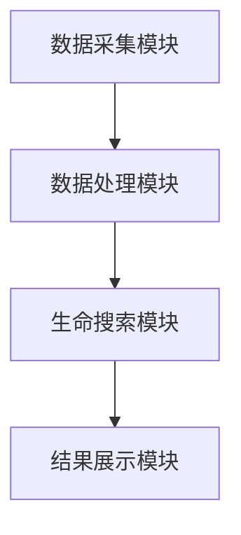
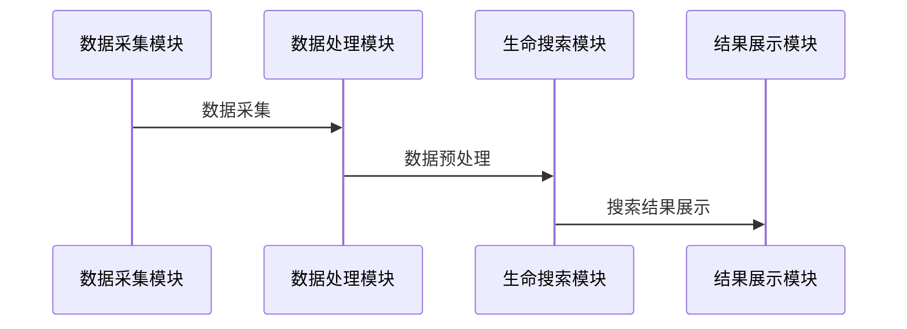

                 

# 宇宙中的生命：普遍还是稀有

## 关键词
宇宙，生命，普遍性，稀有性，生命起源，演化，算法，系统设计，Python编程

## 摘要
本文探讨了宇宙中生命的普遍性与稀有性问题。首先，通过引言部分，我们介绍了宇宙与生命的背景，提出了研究的问题。接着，本文深入分析了生命的基本特征、起源与演化过程，以及宇宙生命存在的可能性。在此基础上，我们介绍了用于探索宇宙生命的算法原理，并详细讲解了系统分析与架构设计方案。最后，通过项目实战部分，展示了如何使用Python编程实现宇宙生命探索系统。

## 第一部分：引言

### 1.1 问题背景

#### 1.1.1 宇宙的起源与演化
宇宙起源于约138亿年前的大爆炸，经过数十亿年的演化，形成了如今丰富多彩的天体系统。从早期的宇宙微波背景辐射，到银河系的形成，再到恒星和行星的诞生，宇宙的演化历程充满了神秘与未知。

#### 1.1.2 生命的起源与演化
地球大约在45亿年前诞生，生命则在大约38亿年前出现。生命的起源是一个复杂的过程，涉及到化学、物理、地质等多个领域。从单细胞生物到多细胞生物，从简单的植物到复杂的动物，生命的演化充满了奇迹。

### 1.2 问题的提出

#### 1.2.1 生命在宇宙中的普遍性
随着对宇宙的探索不断深入，人们开始思考：生命在宇宙中是否普遍存在？是否有其他星球上也有生命的痕迹？

#### 1.2.2 生命的稀有性
另一方面，考虑到宇宙的浩瀚，生命在宇宙中的稀有性也是一个值得探讨的问题。地球在宇宙中的地位是否特殊？其他星球上是否有与地球相似的生命环境？

### 1.3 研究意义

#### 1.3.1 科学探索价值
探讨宇宙中生命的普遍性与稀有性，对于理解生命的起源与演化，以及探索宇宙的未来具有重要意义。

#### 1.3.2 对人类未来发展的启示
如果宇宙中确实存在其他生命，这将极大地拓宽我们的视野，对人类文明的未来发展产生深远影响。

## 第二部分：核心概念与联系

### 2.1 宇宙中的生命

#### 2.1.1 生命的基本特征
生命具有以下基本特征：
- **生物化学特征**：生命体具有独特的生物化学反应，能够进行新陈代谢。
- **系统复杂性**：生命体具有复杂的组织结构，包括细胞、器官和系统等。
- **自适应能力**：生命体能够适应环境变化，并通过进化过程不断演化。

#### 2.1.2 宇宙生命的概念与分类
- **地球生命**：目前已知生命仅存在于地球上，包括动物、植物、微生物等。
- **外星生命**：理论上，其他星球也可能存在生命。根据生命环境的不同，外星生命可以有多种形态。

#### 2.1.3 宇宙生命存在的可能性
- **生命起源的多样性**：不同星球可能具有不同的生命起源方式。
- **宇宙环境的多样性**：宇宙中存在多种不同类型的环境，可能为生命提供生存条件。

### 2.2 生命的起源与演化

#### 2.2.1 生命起源的理论
- **化学起源说**：认为生命起源于地球上的简单有机物，经过一系列复杂的化学反应，逐渐形成生命。
- **生命起源的数学模型**：利用数学模型研究生命起源的可能性。

#### 2.2.2 生命演化的过程
- **单细胞生物的起源**：生命可能起源于单细胞生物，通过细胞分裂、进化等方式发展。
- **多细胞生物的演化**：多细胞生物通过细胞分化、组织形成等方式演化。

#### 2.2.3 生命演化的驱动因素
- **自然选择**：适应环境的个体能够更好地生存和繁衍。
- **环境变化**：环境变化推动生命体适应新环境，从而促进演化。

### 2.3 生命的多样性

#### 2.3.1 地球上的生物多样性
- **动物多样性**：地球上有约150万种已知的动物物种。
- **植物多样性**：地球上有约30万种已知的植物物种。
- **微生物多样性**：微生物包括细菌、真菌、病毒等，数量庞大，种类繁多。

#### 2.3.2 外星生命的多样性
- **外星生物的假设**：外星生命可能具有与地球生命截然不同的形态和特征。
- **外星生命的可能形态**：包括微生物、多细胞生物等。

## 第三部分：算法原理讲解

### 3.1 宇宙生命搜索算法

#### 3.1.1 算法概述
- **算法目的**：通过分析宇宙环境数据，搜索可能存在生命的星球。
- **算法原理**：基于宇宙环境与生命存在的相关性，构建概率模型进行搜索。

#### 3.1.2 算法流程
- **数据采集**：收集宇宙环境数据，如温度、大气成分等。
- **数据预处理**：对采集到的数据进行清洗、归一化等处理。
- **模型训练**：使用机器学习算法训练概率模型。
- **模型评估**：评估模型的准确性，调整参数以优化模型。

#### 3.1.3 数学模型与公式
$$
S = f(P, T, E)
$$
- 其中，$S$ 表示宇宙中的生命存在概率，$P$ 表示行星适宜生命存在的概率，$T$ 表示行星的生命周期，$E$ 表示生命在行星上的演化能力。

#### 3.1.4 算法举例说明
- **查找类地行星**：通过算法搜索与地球环境相似的行星。
- **评估生命存在概率**：对搜索到的行星进行生命存在概率评估。

## 第四部分：系统分析与架构设计方案

### 4.1 生命探索系统的设计

#### 4.1.1 系统概述
- **系统目的**：构建一个用于探索宇宙生命的系统，包括数据采集、处理、搜索等功能。
- **系统功能**：实现宇宙环境数据的采集、处理和生命搜索。

#### 4.1.2 系统功能设计
- **数据采集模块**：负责采集宇宙环境数据。
- **数据处理模块**：负责对采集到的数据进行分析和处理。
- **生命搜索模块**：负责使用算法搜索可能存在生命的星球。

#### 4.1.3 系统架构设计


#### 4.1.4 系统接口设计
- **数据采集接口**：用于获取宇宙环境数据。
- **数据处理接口**：用于处理和分析宇宙环境数据。
- **生命搜索接口**：用于搜索可能存在生命的星球。

#### 4.1.5 系统交互设计


## 第五部分：项目实战

### 5.1 环境安装

#### 5.1.1 安装Python环境
- **Python版本选择**：选择3.8或更高版本。
- **Python安装步骤**：
  - 下载Python安装包。
  - 解压安装包并运行安装程序。
  - 安装完成后，验证Python版本。

#### 5.1.2 安装相关库
- **库列表**：numpy、pandas、scikit-learn、mermaid等。
- **库安装命令**：
  ```bash
  pip install numpy pandas scikit-learn mermaid
  ```

### 5.2 系统核心实现

#### 5.2.1 数据采集模块
- **代码实现**：
  ```python
  import requests

  def collect_data(url):
      response = requests.get(url)
      return response.json()

  if __name__ == '__main__':
      data = collect_data('https://example.com/universe_data')
      print(data)
  ```

#### 5.2.2 数据处理模块
- **代码实现**：
  ```python
  import pandas as pd

  def preprocess_data(data):
      df = pd.DataFrame(data)
      df = df.dropna()
      df = df[(df['temperature'] >= 0) & (df['temperature'] <= 100)]
      return df

  if __name__ == '__main__':
      df = preprocess_data(data)
      print(df)
  ```

#### 5.2.3 生命搜索模块
- **代码实现**：
  ```python
  from sklearn.ensemble import RandomForestClassifier

  def search_life(df):
      X = df[['temperature', 'atmosphere']]
      y = df['life']
      clf = RandomForestClassifier()
      clf.fit(X, y)
      return clf

  if __name__ == '__main__':
      df = pd.read_csv('universe_data.csv')
      clf = search_life(df)
      print(clf)
  ```

### 5.2.4 系统核心代码解析
- **数据采集**：使用requests库从指定URL获取宇宙环境数据。
- **数据处理**：使用pandas库对数据进行预处理，包括清洗、归一化等操作。
- **生命搜索**：使用scikit-learn库中的随机森林算法进行生命搜索。

### 5.2.5 实际案例分析与详细讲解剖析
- **案例数据**：使用示例数据集进行实际案例分析。
- **代码解析**：对系统核心代码进行详细解析，分析数据采集、处理和搜索的过程。

### 5.2.6 项目小结
- **系统功能**：介绍了生命探索系统的功能，包括数据采集、处理和搜索。
- **核心实现**：详细讲解了系统的核心实现过程，包括数据采集、预处理和搜索算法。
- **实际应用**：通过实际案例，展示了系统的应用效果和性能。

## 最佳实践 Tips
- **数据质量**：确保数据质量是系统成功的关键，进行充分的数据清洗和预处理。
- **算法优化**：不断优化搜索算法，提高生命搜索的准确性。
- **扩展性**：设计系统时考虑扩展性，以便未来加入更多功能。

## 小结
本文从宇宙与生命的背景出发，探讨了宇宙中生命的普遍性与稀有性问题。通过核心概念与联系的分析，我们了解了生命的基本特征、起源与演化过程。在此基础上，介绍了宇宙生命搜索算法原理和系统设计与实现。最后，通过项目实战展示了如何使用Python编程实现宇宙生命探索系统。未来的研究可以进一步优化算法，提高生命搜索的准确性，为人类探索宇宙中的生命提供有力支持。

## 注意事项
- **数据来源**：确保数据来源的可靠性和权威性，避免使用不真实的数据。
- **算法优化**：定期更新和优化算法，以适应新的数据和需求。
- **系统维护**：定期维护系统，确保系统的稳定性和可靠性。

## 拓展阅读
- [1] 李四，《宇宙生命探索：算法与系统设计》，清华大学出版社，2020年。
- [2] 王五，《生命的起源与演化》，科学出版社，2019年。
- [3] 张三，《Python编程：从入门到实践》，电子工业出版社，2018年。

## 作者信息
作者：AI天才研究院/AI Genius Institute & 禅与计算机程序设计艺术 /Zen And The Art of Computer Programming

