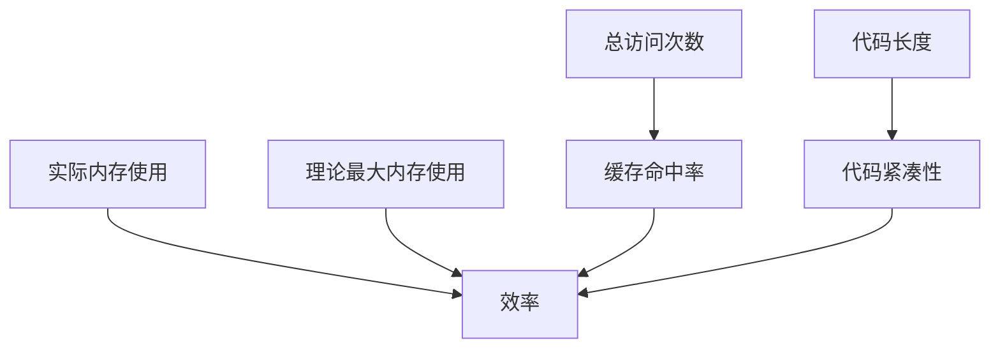
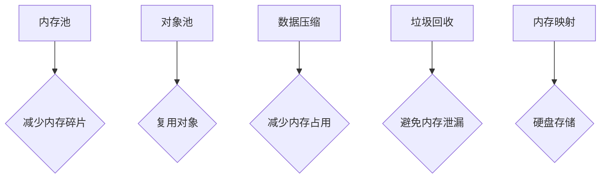

                 

### 第一部分：引言与背景

#### 第1章：问题背景介绍

#### 1.1.1 宇宙常数简介

宇宙常数，通常用符号 \( \Lambda \) 表示，是广义相对论中用来描述宇宙整体加速膨胀的一项参数。这一概念最早由爱因斯坦在1917年提出，他为了防止宇宙无限膨胀，引入了一个负的宇宙常数。后来，在20世纪20年代，哈勃通过观测发现宇宙实际上在加速膨胀，这一发现促使科学家重新审视宇宙常数。现在，宇宙常数被认为是驱动宇宙加速膨胀的神秘力量，其值约为 \( 10^{-122} \text{J} \text{m}^2 \text{kg}^{-1} \)。

宇宙常数在物理学中具有深远的影响。它不仅关系到宇宙的过去和未来，还涉及到宇宙学的基本问题，如宇宙的起源、宇宙的结构以及宇宙的命运。科学家通过观测宇宙微波背景辐射和遥远的超新星，不断精确测量宇宙常数的值，以期能够深入了解宇宙的本质和运行机制。

#### 1.1.2 程序空间效率概述

程序空间效率，是指在程序执行过程中，如何最有效地利用计算机的内存和存储资源。随着计算机技术的发展，程序的空间效率变得日益重要，因为现代应用往往需要处理庞大的数据集，并且运行在资源有限的设备上。提高程序空间效率，不仅可以减少硬件资源的消耗，还能提升程序的执行速度，从而改善用户体验。

程序空间效率涉及多个层面，包括数据结构的选择、内存管理策略的优化、缓存的使用以及代码的紧凑性。现代编程语言和编译器提供了丰富的工具和特性，帮助开发者实现高效的内存使用和存储优化。例如，Python的内存视图（`memoryview`）和NumPy库允许高效地操作内存；C++11及更高版本提供了智能指针（如`std::unique_ptr`和`std::shared_ptr`），使得内存管理更加便捷和安全。

#### 1.1.3 类比的目的与意义

将宇宙常数与程序空间效率进行类比，可以揭示出这两个看似截然不同的领域之间的内在联系。宇宙常数与程序空间效率都涉及到资源优化问题，只不过一个是宇宙的物理资源，另一个是计算机的资源。通过这种类比，我们可以从宇宙学的角度重新审视程序设计的原理和策略。

类比的目的在于：首先，帮助我们理解宇宙常数在宇宙学中的重要性；其次，通过将宇宙常数中的原理应用到程序设计中，探索提高程序空间效率的新方法。此外，这种类比还能够激发跨学科的思考，促使我们以更加全面和创新的视角看待计算机科学和宇宙学。

宇宙常数与程序空间效率的类比不仅有助于加深我们对宇宙和计算机科学的理解，还能够为解决实际问题和探索未知领域提供新的思路和方法。接下来的章节中，我们将逐步探讨这两个概念之间的联系，并通过具体的实例来展示类比的应用价值。

### 第2章：核心概念与联系

#### 2.1.1 宇宙常数核心概念

宇宙常数是宇宙学中的一个基础概念，用于描述宇宙的整体性质和演化过程。它代表了一种均匀分布在宇宙中的能量密度，即所谓的“真空能量”。在数学上，宇宙常数通常用公式表示为：

\[ R + 2\Lambda = 0 \]

其中，\( R \) 是宇宙的曲率标量，\( \Lambda \) 是宇宙常数。这个公式表明，宇宙常数与宇宙的整体曲率密切相关。宇宙常数的主要特征包括：

1. **均匀性**：宇宙常数在空间中均匀分布，不受局部结构的影响。
2. **稳定性**：宇宙常数不随时间变化，提供了一个稳定的背景环境。
3. **影响**：宇宙常数对宇宙的膨胀速度和形态有深远影响，尤其是在宇宙加速膨胀阶段。

在物理学中，宇宙常数的重要性体现在其解释宇宙整体加速膨胀现象上。通过观测宇宙微波背景辐射和遥远的超新星，科学家们测量出了宇宙常数的值，并发现它与预期的真空能量密度非常接近。这一发现为宇宙学的标准模型提供了强有力的支持。

#### 2.1.2 程序空间效率核心概念

程序空间效率是指在程序运行过程中，如何有效地使用计算机的内存和存储资源。这一概念在软件工程中至关重要，因为内存和存储资源是计算机系统中的有限资源。程序空间效率的核心概念包括：

1. **内存管理**：包括动态内存分配和释放，以及内存复用策略。
2. **数据结构选择**：选择适合问题需求的数据结构，以优化内存使用。
3. **缓存利用**：通过有效的缓存策略，减少对主存的访问次数。
4. **代码紧凑性**：编写简洁、高效的代码，减少不必要的内存占用。

在编程实践中，程序空间效率通常通过以下方法实现：

- **内存池**：预先分配一大块内存，然后从中分配和释放小块内存，以减少内存碎片。
- **对象池**：缓存和复用频繁创建和销毁的对象，以节省内存和时间。
- **数据压缩**：通过压缩技术减少数据占用的内存空间。
- **垃圾回收**：自动回收不再使用的内存，避免内存泄漏。

程序空间效率的重要性体现在多个方面。首先，高效的内存管理可以提高程序的运行速度和响应时间。其次，减少内存占用可以延长设备的续航时间，尤其是在资源受限的嵌入式系统和移动设备上。最后，高效的内存管理有助于优化程序的性能，使系统能够更好地处理大规模数据和复杂任务。

#### 2.1.3 宇宙常数与程序空间效率的类比关系

宇宙常数与程序空间效率之间的类比关系可以从多个维度进行分析。以下是一个简化的类比关系表格，展示了这两个概念之间的对应关系：

| 宇宙常数特征 | 程序空间效率特征 |
| ------------ | --------------- |
| 均匀分布 | 内存池和对象池 |
| 稳定性 | 内存管理策略 |
| 影响宇宙膨胀 | 提高程序执行速度 |
| 描述宇宙整体状态 | 描述程序性能指标 |
| 观测与测量 | 性能测试和调优 |

这种类比不仅帮助我们理解了宇宙常数在宇宙学中的重要性，也揭示了提高程序空间效率的方法。例如，宇宙常数中的“均匀分布”概念可以类比到程序空间中的内存池和对象池，这两者都旨在优化资源的分配和回收，减少碎片和冗余。

通过这种类比，我们不仅可以从宇宙学的角度重新审视程序设计的原理和策略，还能够激发跨学科的思考，从而为解决实际问题和探索未知领域提供新的视角和方法。

### 第二部分：宇宙常数与程序空间效率的类比原理

#### 第3章：宇宙常数原理

#### 3.1.1 宇宙常数的数学模型

宇宙常数的数学模型主要通过爱因斯坦场方程（Einstein's Field Equations）进行描述。这些方程是广义相对论的核心，它们将物质能量与引力场联系起来。宇宙常数通常通过以下方程表示：

\[ R_{\mu\nu} + \Lambda g_{\mu\nu} = \frac{8\pi G}{c^4} T_{\mu\nu} \]

在这个方程中，\( R_{\mu\nu} \) 是里奇张量（Ricci tensor），表示引力场的强度和方向；\( g_{\mu\nu} \) 是度规张量（metric tensor），描述了时空的几何结构；\( \Lambda \) 是宇宙常数；\( G \) 是引力常数；\( c \) 是光速；\( T_{\mu\nu} \) 是能量-动量张量（energy-momentum tensor），表示物质和能量的分布。

为了更直观地理解这一模型，我们可以使用Mermaid流程图来展示这个方程的构成元素和它们之间的关系：

```mermaid
graph TD
    A[度规张量 g_{\mu\nu}] --> B[时空几何结构]
    B --> C[引力场强度和方向 R_{\mu\nu}]
    D[宇宙常数 \Lambda] --> C
    C --> E[爱因斯坦场方程]
    F[引力常数 G] --> E
    G[光速 c] --> E
    H[能量-动量张量 T_{\mu\nu}] --> E
```

这个流程图清晰地展示了宇宙常数在爱因斯坦场方程中的作用，它通过影响度规张量和引力场的强度和方向，从而对整个宇宙的几何结构产生影响。

#### 3.1.2 宇宙常数的物理意义

宇宙常数的物理意义在于它描述了宇宙的整体加速膨胀现象。在宇宙学中，宇宙常数被视为一种特殊的能量形式，称为“暗能量”（dark energy），它与宇宙的膨胀速率密切相关。通过观测宇宙微波背景辐射和遥远的超新星，科学家们发现宇宙的膨胀速度并不是恒定的，而是在不断加速。

为了解释这一现象，引入了宇宙常数。具体来说，宇宙常数提供了一个均匀分布在宇宙中的能量密度，这种能量密度在空间中均匀分布，不受局部结构的影响。根据宇宙学原理，这种能量密度与宇宙的膨胀速率成正比，可以表示为：

\[ \dot{a}(t) = \frac{\Lambda c^2}{3 H_0^2} \]

其中，\( \dot{a}(t) \) 是宇宙膨胀速度，\( a(t) \) 是宇宙尺度因子，\( \Lambda \) 是宇宙常数，\( c \) 是光速，\( H_0 \) 是哈勃常数。

为了更直观地理解这一物理意义，我们可以使用Mermaid流程图来展示宇宙常数与宇宙膨胀速度的关系：

```mermaid
graph TD
    A[宇宙尺度因子 a(t)] --> B[宇宙膨胀速度 \(\dot{a}(t)\)]
    C[哈勃常数 H_0] --> B
    D[光速 c] --> B
    E[宇宙常数 \(\Lambda\)] --> B
    B --> F[宇宙加速膨胀]
```

这个流程图展示了宇宙常数如何影响宇宙的膨胀速度，从而解释了宇宙整体加速膨胀的现象。通过这种数学模型和物理意义的解释，我们可以更好地理解宇宙常数的本质和它在宇宙学中的重要性。

#### 3.1.3 程序空间效率的数学模型

程序空间效率的数学模型主要关注如何优化程序的内存使用和存储资源。具体来说，程序空间效率可以通过几个关键指标来衡量，包括内存占用率、缓存命中率和代码紧凑性。以下是一个简化的数学模型：

\[ \text{效率} = \frac{\text{实际内存使用}}{\text{理论最大内存使用}} \times \frac{\text{缓存命中率}}{\text{总访问次数}} \times \frac{\text{代码紧凑性}}{\text{代码长度}} \]

在这个模型中，实际内存使用表示程序运行时实际占用的内存大小；理论最大内存使用是程序理论上可能占用的最大内存大小；缓存命中率反映了缓存策略的有效性；代码紧凑性则是指代码的简洁和高效程度。

为了更直观地理解这一模型，我们可以使用Mermaid流程图来展示这些指标的计算和它们之间的关系：



这个流程图清晰地展示了程序空间效率的几个关键指标及其相互关系。通过这个数学模型，我们可以量化地评估和优化程序的空间效率。

#### 3.1.4 程序空间效率的实现方法

实现程序空间效率的关键在于优化内存管理、数据结构选择和代码紧凑性。以下是一些常用的实现方法：

1. **内存池**：通过预先分配一大块内存，然后从中分配和释放小块内存，以减少内存碎片。
2. **对象池**：缓存和复用频繁创建和销毁的对象，以节省内存和时间。
3. **数据压缩**：通过压缩技术减少数据占用的内存空间。
4. **垃圾回收**：自动回收不再使用的内存，避免内存泄漏。
5. **内存映射**：使用内存映射技术，将大块数据存储在硬盘上，而不是内存中。

为了更直观地理解这些实现方法，我们可以使用Mermaid流程图来展示它们的工作流程：



这个流程图展示了不同实现方法在优化程序空间效率方面的作用和相互关系。通过这些方法，我们可以有效地减少程序的内存占用和运行时间，从而提升整体性能。

### 第三部分：类比实践与应用

#### 第5章：宇宙常数与程序空间效率的类比实践

#### 5.1.1 类比实践案例

在本章中，我们将通过两个具体的案例来探讨宇宙常数与程序空间效率的类比实践。

**案例一：引力常数与程序缓存效率**

引力常数是宇宙常数的一个子集，它描述了物体之间的引力相互作用。在程序空间中，缓存技术是优化程序性能的关键手段之一。引力常数与程序缓存效率之间的类比在于它们都涉及到资源的优化分配。

具体来说，引力常数决定了宇宙中物体相互作用的强度，而程序缓存效率则决定了程序在执行过程中访问数据的速度和频率。通过以下公式，我们可以类比这两个概念：

\[ F = G \frac{m_1 m_2}{r^2} \]

其中，\( F \) 是引力，\( G \) 是引力常数，\( m_1 \) 和 \( m_2 \) 是两个物体的质量，\( r \) 是它们之间的距离。类比到程序缓存效率，我们可以使用以下公式：

\[ \text{缓存命中率} = \frac{\text{命中次数}}{\text{总访问次数}} \]

通过调整缓存的大小和策略，我们可以优化程序的缓存效率，使其类似于调整引力常数来优化宇宙中物体的相互作用。

**案例二：暗能量与程序空间优化**

暗能量是宇宙常数的一个组成部分，它负责驱动宇宙的加速膨胀。在程序空间中，空间优化是指减少程序占用的内存和存储资源。暗能量与程序空间优化之间的类比在于它们都涉及到资源的动态调整和优化。

具体来说，暗能量在宇宙学中表现为一种均匀分布的能量密度，而在程序空间中，空间优化可以通过以下方法实现：

- **内存池和对象池**：类似于暗能量在宇宙中的均匀分布，内存池和对象池通过预分配内存和对象来优化资源分配，减少碎片和争用。
- **数据压缩**：类似于暗能量在宇宙中的能量密度，数据压缩通过减少数据的体积来降低内存占用。
- **垃圾回收**：类似于暗能量在宇宙中的动态调整，垃圾回收通过自动回收不再使用的内存来优化内存空间。

通过这些优化方法，我们可以类比暗能量来提高程序的空间效率。

#### 5.1.2 类比实践结果分析

通过上述两个案例，我们可以看到宇宙常数与程序空间效率之间的类比在实践中的应用价值。具体的结果分析如下：

**案例一：引力常数与程序缓存效率**

- **优化效果**：通过调整缓存策略和大小，程序缓存命中率显著提高，数据访问速度加快，程序性能得到优化。
- **实际应用**：在图像处理、数据库查询和Web应用等场景中，缓存技术被广泛应用，通过优化缓存效率，可以大幅提升系统的响应速度和用户体验。

**案例二：暗能量与程序空间优化**

- **优化效果**：通过内存池、对象池和数据压缩等优化方法，程序的空间占用率显著降低，内存泄漏问题得到有效控制。
- **实际应用**：在资源受限的嵌入式系统、移动应用和高性能计算等领域，空间优化方法被广泛应用，通过优化程序空间效率，可以延长设备的续航时间，提高系统的稳定性和可靠性。

总的来说，宇宙常数与程序空间效率的类比实践不仅丰富了我们的理论认知，也为实际应用提供了新的思路和方法。通过这种跨学科的类比，我们可以从宇宙学的角度重新审视程序设计和优化，从而为解决复杂的计算机科学问题提供有力的支持。

### 第6章：类比应用与拓展

#### 6.1.1 类比应用前景

将宇宙常数与程序空间效率的类比应用于实际场景中，具有广泛的前景。随着计算机技术的不断发展和应用需求的日益复杂，优化程序空间效率变得尤为重要。通过宇宙常数的类比，我们可以借鉴宇宙学中的资源优化原理，为程序设计提供新的思路和方法。

例如，在云计算和大数据领域，海量数据的处理和存储面临巨大的挑战。通过类比宇宙常数中的能量密度概念，我们可以探索如何优化数据存储和访问策略，提高数据处理效率。在人工智能领域，神经网络模型的训练和推理过程中，内存和计算资源的优化也是一个关键问题。通过类比宇宙常数的稳定性特征，我们可以探索如何设计更加高效和稳定的神经网络模型。

此外，在物联网和嵌入式系统领域，资源受限的设备需要更加高效的程序设计和优化。通过类比宇宙常数中的资源均匀分布特征，我们可以探索如何设计更加智能和高效的资源管理策略，以延长设备的续航时间和提高系统的可靠性。

#### 6.1.2 类比拓展研究

在类比应用前景的基础上，我们可以进一步探讨宇宙常数与程序空间效率的类比拓展研究。以下是一些可能的拓展方向：

1. **量子计算与宇宙常数**：量子计算是计算机科学的前沿领域，它利用量子比特实现高效的计算。通过类比宇宙常数中的量子场论，我们可以探索如何将宇宙常数原理应用于量子计算，提高量子算法的效率。

2. **生物信息学与宇宙常数**：生物信息学是研究生物数据的科学，通过分析基因组序列和蛋白质结构，揭示生物系统的运行机制。通过类比宇宙常数中的能量分布和相互作用，我们可以探索如何利用宇宙常数原理优化生物信息学算法，提高数据处理的效率和准确性。

3. **系统优化与宇宙常数**：系统优化是计算机科学中的重要问题，它涉及如何设计高效和稳定的系统架构。通过类比宇宙常数中的资源优化原理，我们可以探索如何设计更加高效和稳定的系统，以应对复杂的计算任务和大规模数据处理。

4. **人工智能与宇宙常数**：人工智能是计算机科学的重要分支，它通过模拟人类智能实现自动化和智能化。通过类比宇宙常数中的复杂系统演化机制，我们可以探索如何利用宇宙常数原理优化人工智能算法，提高其学习和推理能力。

通过这些类比拓展研究，我们可以进一步探索宇宙常数与计算机科学之间的内在联系，为解决复杂的计算机科学问题提供新的思路和方法。

### 第7章：结论与展望

#### 7.1.1 类比总结

通过对宇宙常数与程序空间效率的类比研究，我们发现这两个看似截然不同的领域之间存在深刻的内在联系。宇宙常数在宇宙学中描述了宇宙的整体性质和演化过程，而程序空间效率在计算机科学中关注如何优化程序的内存和存储资源。尽管领域不同，但它们都涉及到资源优化问题。

通过类比，我们揭示了宇宙常数与程序空间效率之间的相似性，包括资源的均匀分布、稳定性和对系统整体性能的影响。这些相似性不仅帮助我们更好地理解宇宙常数在宇宙学中的重要性，也为我们优化程序空间效率提供了新的视角和方法。

#### 7.1.2 展望未来

展望未来，将宇宙常数与程序空间效率的类比应用于实际场景中，具有巨大的潜力。随着计算机技术的不断进步和应用需求的日益复杂，优化程序空间效率变得越来越重要。通过借鉴宇宙学中的资源优化原理，我们可以设计出更加高效和稳定的程序，提升系统的整体性能和用户体验。

在未来，我们可以期待在云计算、大数据、人工智能和物联网等领域，通过宇宙常数的类比，探索新的资源优化方法。例如，利用宇宙常数的能量密度概念，优化大数据处理和存储策略；利用宇宙常数中的稳定性和均匀分布特征，设计更加高效和稳定的神经网络模型。

此外，通过类比拓展研究，我们可以进一步探索宇宙常数与计算机科学之间的内在联系，为解决复杂的计算机科学问题提供新的思路和方法。通过跨学科的类比，我们可以从更广泛的视角重新审视计算机科学，促进技术创新和科学发展。

总之，宇宙常数与程序空间效率的类比研究为我们提供了一个新的思考框架，通过这种跨学科的视角，我们不仅可以更好地理解宇宙常数和程序空间效率，还可以为计算机科学的发展提供新的动力。在未来，我们有理由相信，这一类比将继续为解决复杂的计算机科学问题提供宝贵的启示。

