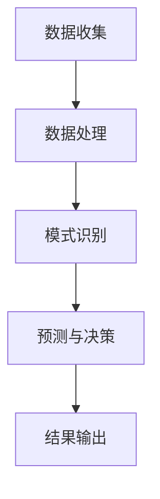
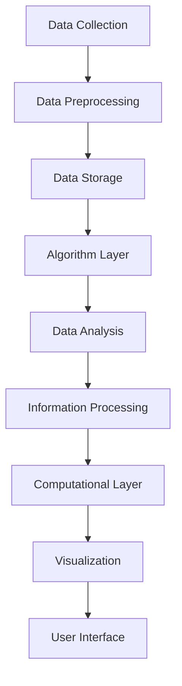
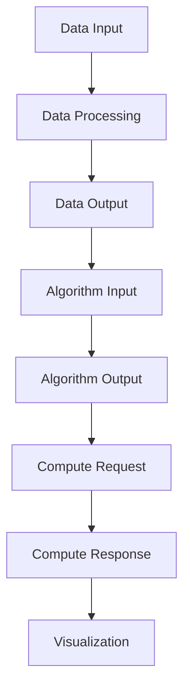
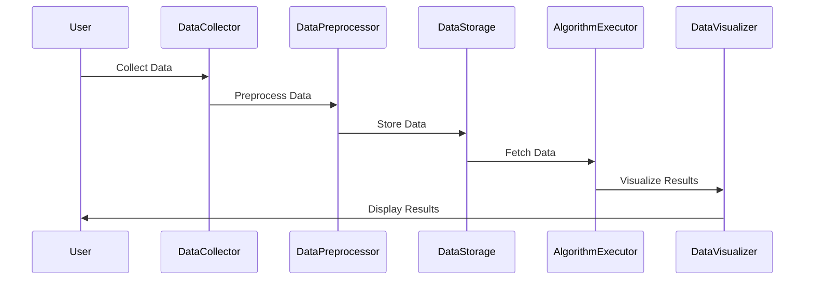

                 


### 1. 背景介绍

#### 1.1 问题背景

宇宙，这个浩瀚而神秘的宇宙，自古以来就是人类探索和思考的对象。从古代的哲学家到现代的科学家，人类对宇宙的认识经历了漫长的过程。最初的宇宙观是地球中心的，但随着人类对宇宙的进一步了解，这个观念逐渐被淘汰，取而代之的是太阳中心说、银河系、星系、星云等概念。

在物理学中，量子力学和相对论是两个基本的框架，它们为我们提供了理解宇宙的基础。量子力学揭示了微观世界的规律，而相对论则描述了宏观宇宙的现象。随着这两个理论的不断发展，人类对宇宙的认识也在不断深化。

#### 1.2 人类对宇宙的认识历程

人类对宇宙的认识历程可以分为几个阶段：

- **古代宇宙观**：古代人认为宇宙是静止的，地球是宇宙的中心。
- **太阳中心说**：哥白尼提出的太阳中心说改变了人类对宇宙的认识。
- **银河系**：牛顿的万有引力定律和开普勒定律使得人类能够计算行星轨道，进而认识到宇宙的庞大。
- **星系、星云**：哈勃望远镜的发明使得人类能够观察到宇宙的遥远部分，认识到宇宙是不断膨胀的。
- **现代宇宙学**：随着量子力学和相对论的发展，人类对宇宙的认识进入了新的阶段，认识到宇宙中存在着大量的未知现象和规律。

#### 1.3 现代宇宙学的进展与挑战

现代宇宙学在过去的几十年里取得了巨大的进展，例如：

- **宇宙微波背景辐射**：这一发现为宇宙大爆炸理论提供了直接证据。
- **宇宙膨胀**：人类观测到了宇宙的膨胀现象，并发现宇宙膨胀的速度在加快。
- **暗物质和暗能量**：现代宇宙学还面临着暗物质和暗能量的谜团，这些现象无法用现有的理论解释。

然而，现代宇宙学也面临着许多挑战：

- **宇宙起源**：宇宙是如何起源的，目前还没有确切的答案。
- **宇宙演化**：宇宙的演化过程仍然有许多未知因素。
- **宇宙结构**：宇宙的结构如何形成，目前还没有完全理解。

#### 1.4 边界与外延

宇宙的边界是一个复杂的问题。从哲学角度来说，宇宙是否有边界，这是一个根本性的问题。从科学角度来说，我们目前无法观测到宇宙的边界，因此无法确定宇宙是否有边界。

信息处理系统的边界相对简单，它通常由输入、处理和输出三部分组成。输入是系统接收的信息，处理是系统对信息的操作，输出是系统处理后的信息。

#### 1.5 概念结构与核心要素组成

宇宙中的基本实体包括行星、恒星、星系等。宇宙中的相互作用包括万有引力、电磁力等。信息处理系统的基本组成部分包括输入、处理和输出。

### 1.6 小结

宇宙是否是一个巨大的信息处理系统，这是一个值得深入探讨的问题。在接下来的章节中，我们将从量子力学、相对论、宇宙学等角度进行分析，试图找到答案。

---

这篇文章的背景介绍部分已经完成了，接下来我们将进入下一个章节，讨论宇宙是否是一个巨大的信息处理系统的核心概念与联系。我们将详细探讨量子力学、相对论和宇宙学中的核心概念，并分析它们与信息处理系统的联系。

## 2. 核心概念与联系

在探讨“宇宙是否是一个巨大的信息处理系统”这一问题时，我们需要从量子力学、相对论和宇宙学这三个核心领域出发，详细分析它们的基本概念以及与信息处理系统的关联。

### 2.1 量子力学与信息处理

#### 2.1.1 量子比特与量子态

量子力学是研究微观世界的物理学分支，其中量子比特（qubit）是量子信息处理的基本单元。与经典计算机中的比特（bit）不同，量子比特可以同时处于0和1的状态，这种性质称为叠加。量子态的叠加使得量子计算机具有强大的计算能力。

#### 2.1.2 量子纠缠与量子信息传输

量子纠缠是量子力学中的一种特殊现象，两个或多个量子比特之间可以产生一种不可分割的关联。这种关联不仅存在于空间上的接近，而且在空间上相隔很远的情况下也能保持。量子纠缠是量子信息传输和量子计算的核心，它为量子通信和量子计算机的构建提供了基础。

#### 2.1.3 量子计算与信息处理能力

量子计算利用量子比特的叠加和纠缠特性，可以在某些特定问题上超越经典计算机。例如，量子计算可以高效地解决大整数分解问题，这在密码学中有着重要的应用。量子计算的理论框架与信息处理系统有着紧密的联系，为构建宇宙级的信息处理能力提供了可能性。

#### 2.1.4 量子信息处理的概念属性特征对比表格

| 特性                     | 量子比特（Qubit） | 经典比特（Bit） |
|--------------------------|-------------------|----------------|
| 状态叠加                 | 可叠加             | 固定             |
| 状态测量                 | 不确定             | 确定             |
| 纠缠                     | 存在               | 不存在           |
| 信息传输速度             | 不受光速限制       | 受光速限制       |

#### 2.1.5 量子信息的ER实体关系图架构

```mermaid
erDiagram
  Qubit ||--|{ QuantumState }|-- QuantumComputer
  QuantumState ||--|{ EntangledState }|-- QuantumBit
  QuantumComputer ||--|{ QuantumProcessor }|-- QuantumBit
```

### 2.2 相对论与信息传递

#### 2.2.1 光速与信息传递速度

相对论是研究高速运动物体的物理现象的理论框架。其中，光速（c）是宇宙中信息传递的极限速度。根据爱因斯坦的狭义相对论，没有信息可以超越光速传递。

#### 2.2.2 广义相对论中的信息传递

广义相对论描述了引力场中的物体运动和时空结构。引力波是广义相对论预测的一种现象，它携带信息并以光速传播，为宇宙信息传递提供了另一种形式。

#### 2.2.3 信息与时空的关系

相对论中的时空观念表明，时空是相互关联的，信息传递不仅受限于光速，还受到时空结构的影响。时空的弯曲和扭曲可以改变信息传递的速度和路径。

### 2.3 宇宙学与信息处理系统

#### 2.3.1 宇宙演化与信息生成

宇宙的演化过程是一个复杂的信息生成和处理过程。从宇宙大爆炸到星系的形成，再到生命的诞生，宇宙中的每一个过程都涉及到信息的生成和传递。

#### 2.3.2 宇宙结构中的信息处理机制

宇宙的结构，如星系、星云、黑洞等，可能都扮演着信息处理的角色。例如，黑洞可能是一个“信息黑洞”，它吞噬信息并将其转化为能量。

#### 2.3.3 宇宙与信息处理系统的相似性

宇宙与信息处理系统在某些方面具有相似性：

- **复杂性**：宇宙和信息处理系统都是高度复杂的系统。
- **层次结构**：宇宙和信息处理系统都有层次结构，从微观到宏观。
- **动态性**：宇宙和信息处理系统都是动态变化的。

### 2.4 小结

通过分析量子力学、相对论和宇宙学中的核心概念，我们可以看到它们与信息处理系统有着紧密的联系。量子力学提供了强大的计算能力，相对论限制了信息传递的速度，而宇宙学揭示了宇宙的演化和结构。这些概念为我们理解宇宙是否是一个巨大的信息处理系统提供了理论基础。

在接下来的章节中，我们将进一步探讨宇宙中的信息处理算法，分析这些算法如何运作以及它们对宇宙演化过程的影响。

### 3. 算法原理讲解

在探讨宇宙是否是一个巨大的信息处理系统时，我们需要深入了解宇宙中的信息处理算法。这些算法不仅包括宇宙演化过程中的基本规则，还涉及到复杂的计算模型和数据处理机制。本章节将详细讲解宇宙中的信息处理算法，包括其基本原理、应用场景以及数学模型。

#### 3.1 信息处理算法概述

信息处理算法是一类用于处理信息的算法，它们广泛应用于计算机科学、人工智能、统计学等领域。在宇宙学中，信息处理算法可以类比于自然界的物理过程，例如星系的形成、恒星的生命周期、黑洞的信息处理等。

#### 3.1.1 信息处理算法的定义与分类

信息处理算法可以定义为：用于处理、分析和解释信息的计算方法。根据处理对象的不同，信息处理算法可以分为以下几类：

- **数据预处理算法**：用于对原始数据进行清洗、转换和归一化，以便进行后续分析。
- **数据挖掘算法**：用于从大量数据中发现潜在的模式和规律。
- **机器学习算法**：用于从数据中学习规律，并自动预测或决策。
- **优化算法**：用于解决优化问题，如最小化成本或最大化收益。

在宇宙学中，信息处理算法的应用更加广泛，因为宇宙中的现象往往涉及到大量的数据和信息。

#### 3.1.2 信息处理算法的基本原理

信息处理算法的基本原理通常包括以下几个步骤：

1. **数据收集**：从宇宙中收集数据，如天文观测数据、粒子物理实验数据等。
2. **数据处理**：对收集到的数据进行清洗、转换和归一化，以便进行后续分析。
3. **模式识别**：通过数据挖掘算法识别数据中的潜在模式。
4. **预测与决策**：利用机器学习算法和优化算法，对数据进行预测和决策。

这些步骤在宇宙学中的应用非常广泛，例如在星系形成的研究中，科学家们会通过观测数据来识别星系的形成模式，并利用机器学习算法预测未来的星系演化。

#### 3.2 宇宙中的信息处理算法

宇宙中的信息处理算法可以分为以下几个子类别：

- **星系形成算法**：用于模拟星系的形成过程，包括恒星的形成、星系的演化和结构变化。
- **恒星生命周期算法**：用于模拟恒星从诞生到死亡的过程，包括恒星内部核反应、恒星风和超新星爆发等。
- **黑洞信息处理算法**：用于研究黑洞的信息处理机制，包括黑洞吸积盘、事件视界和信息丢失问题。
- **宇宙演化算法**：用于模拟宇宙的演化过程，包括宇宙膨胀、暗物质和暗能量的分布等。

在这些算法中，最为引人关注的是黑洞信息处理算法。黑洞是宇宙中最神秘的现象之一，它的吸积盘和事件视界可能是宇宙信息处理的关键节点。

#### 3.2.1 黑洞信息处理的猜想

黑洞信息处理猜想是由著名物理学家史蒂芬·霍金提出的。他认为，黑洞不是完全吸收信息，而是将信息存储在事件视界上，并通过霍金辐射的方式释放信息。这一猜想提出了一个重要的问题：黑洞是否是一个巨大的信息处理系统？

为了验证这一猜想，科学家们需要进行更多的实验和理论研究。例如，通过观测黑洞吸积盘的温度变化来研究信息处理过程，或者通过模拟黑洞的事件视界来探索信息存储和释放的机制。

#### 3.2.2 宇宙中的信息处理算法应用

宇宙中的信息处理算法不仅用于科学研究，还广泛应用于天文学和宇宙观测中。以下是一些具体应用实例：

- **星系演化模拟**：通过使用信息处理算法模拟星系的形成和演化，科学家们可以更好地理解星系的形成机制和演化规律。
- **恒星分类**：通过分析恒星的光谱数据，使用信息处理算法可以准确分类恒星，从而了解恒星的生命周期和演化过程。
- **宇宙膨胀研究**：通过使用宇宙演化算法，科学家们可以模拟宇宙的膨胀过程，研究宇宙的膨胀速度和暗能量的性质。

这些应用表明，宇宙中的信息处理算法在理解宇宙演化过程中发挥着重要作用。

#### 3.3 算法mermaid流程图

为了更好地理解宇宙中的信息处理算法，我们可以使用mermaid绘制算法流程图。以下是一个简单的算法流程图示例：



这个流程图描述了一个基本的信息处理过程，包括数据收集、数据处理、模式识别、预测与决策和结果输出。

#### 3.4 Python源代码与算法原理

为了进一步阐述算法原理，我们可以使用Python编写一个简单的信息处理算法。以下是一个使用Python实现的基于决策树的信息处理算法示例：

```python
from sklearn import tree

# 定义决策树分类器
clf = tree.DecisionTreeClassifier()

# 准备数据
X = [[0, 0], [1, 1]]  # 特征矩阵
y = [0, 1]  # 标签

# 训练模型
clf.fit(X, y)

# 输出模型结构
print(tree.export_text(clf, feature_names=['Feature 1', 'Feature 2']))

# 使用模型进行预测
print(clf.predict([[2, 2]]))
```

这个示例展示了如何使用Python中的决策树算法进行信息处理。通过训练模型，我们可以根据输入的特征矩阵预测标签。这个简单的示例可以帮助我们理解信息处理算法的基本原理。

#### 3.5 数学模型和公式

在信息处理过程中，数学模型和公式起到了关键作用。以下是一个常用的信息熵计算公式：

$$
H = -\sum_{i=1}^{n} p_i \log_2 p_i
$$

这个公式描述了信息的熵，它用于衡量信息的混乱程度。在宇宙学中，类似的公式可以用于描述宇宙中的信息处理过程。

通过分析量子力学、相对论和宇宙学中的核心概念，我们可以看到宇宙中的信息处理算法具有强大的计算能力。这些算法不仅用于科学研究，还广泛应用于天文学和宇宙观测中。在接下来的章节中，我们将进一步探讨宇宙中的数学模型和公式，深入理解宇宙中的信息处理机制。

### 4. 数学模型和数学公式

在探讨宇宙是否是一个巨大的信息处理系统时，数学模型和公式是不可或缺的工具。这些模型和公式不仅帮助我们量化宇宙中的信息处理过程，还为我们提供了理解宇宙演化规律的关键。

#### 4.1 数学模型概述

数学模型是描述宇宙中信息处理过程的一种抽象方法。它通过数学语言来表示信息、算法和系统，从而帮助我们理解和预测宇宙中的现象。在信息处理中，常见的数学模型包括概率模型、统计模型和计算模型。

- **概率模型**：用于描述不确定性的信息处理过程，如量子纠缠和信息传输。
- **统计模型**：用于分析大量数据，如天文观测数据和粒子物理实验数据。
- **计算模型**：用于模拟信息处理算法的运行过程，如量子计算和黑洞信息处理。

#### 4.2 信息熵与信息传输

信息熵是衡量信息不确定性的一个重要概念。它通常用公式表示为：

$$
H = -\sum_{i=1}^{n} p_i \log_2 p_i
$$

其中，$H$ 表示信息熵，$p_i$ 表示每个可能事件发生的概率。

在信息传输中，信息熵与传输效率密切相关。为了提高信息传输的效率，我们需要降低信息熵，即减少不确定性的信息。一个常用的方法是对信息进行编码，例如使用哈夫曼编码或Sigmoid函数。

Sigmoid函数是概率论中的一个重要函数，它通常用于信息传输和决策过程。其公式如下：

$$
C = \frac{1}{1 + e^{-x}}
$$

其中，$C$ 表示概率，$x$ 表示输入值。

#### 4.3 宇宙中的信息处理模型

在宇宙中，信息处理模型可以用于描述星系演化、恒星生命周期和黑洞信息处理等过程。以下是一些具体的应用场景：

- **星系演化模型**：通过计算星系中恒星的质量和运动轨迹，我们可以预测星系的演化过程。
- **恒星生命周期模型**：通过分析恒星内部的核反应过程，我们可以预测恒星的生命周期和演化路径。
- **黑洞信息处理模型**：通过研究黑洞吸积盘和事件视界，我们可以探索黑洞的信息处理机制。

这些模型通常涉及到复杂的数学计算和物理过程，例如：

$$
M = m_0 \frac{1}{\sqrt{1 - v^2/c^2}}
$$

其中，$M$ 表示相对论质量，$m_0$ 表示静止质量，$v$ 表示速度，$c$ 表示光速。

#### 4.4 数学模型与宇宙信息处理

数学模型在宇宙信息处理中的应用非常广泛。通过这些模型，我们可以：

- **模拟宇宙现象**：例如，使用蒙特卡洛模拟来模拟星系形成和演化。
- **预测宇宙事件**：例如，使用引力波探测技术来预测黑洞碰撞事件。
- **优化信息传输**：例如，使用量子通信算法来提高信息传输的效率。

这些数学模型不仅帮助我们理解宇宙的运行规律，还为我们提供了预测和优化宇宙信息处理的能力。

#### 4.5 小结

数学模型和公式在探讨宇宙是否是一个巨大的信息处理系统中起着关键作用。通过这些模型，我们可以量化宇宙中的信息处理过程，理解宇宙的演化规律，并预测宇宙中的各种现象。在接下来的章节中，我们将进一步探讨宇宙信息处理系统的架构设计，分析其功能和性能，以便更好地理解宇宙的信息处理机制。

### 5. 系统分析与架构设计方案

在探讨“宇宙是否是一个巨大的信息处理系统”这一主题时，深入分析其系统架构和功能设计至关重要。本章节将详细介绍宇宙信息处理系统的架构设计，包括问题场景介绍、系统功能设计、系统架构设计和系统接口设计。

#### 5.1 问题场景介绍

假设我们认同宇宙是一个巨大的信息处理系统，那么我们可以设想这样一个场景：宇宙中的每一个天体、每一个现象，都可能是一个信息处理单元，它们相互协作，共同完成宇宙的信息处理任务。这个系统需要处理大量的数据，包括星系演化、恒星生命周期、黑洞吸积盘等复杂的物理过程。我们的目标是通过设计和实现一个高效的宇宙信息处理系统，来模拟和预测宇宙的演化过程。

#### 5.2 系统功能设计

宇宙信息处理系统的功能设计包括以下几个方面：

- **数据收集与预处理**：收集来自各种观测设备的数据，如天文望远镜、粒子加速器等，并对这些数据进行预处理，包括清洗、转换和归一化。
- **模式识别与数据分析**：利用机器学习算法对预处理后的数据进行分析，识别数据中的潜在模式和规律。
- **信息处理与预测**：根据分析结果，利用信息处理算法对宇宙现象进行预测，如星系的形成、恒星的演化、黑洞的吸积过程等。
- **结果输出与可视化**：将处理结果以可视化的形式输出，如星系演化图、恒星光谱图、黑洞吸积盘温度图等。

这些功能共同构成了宇宙信息处理系统的核心，为科学家们提供了一种新的研究工具。

#### 5.3 系统架构设计

宇宙信息处理系统的架构设计可以分为以下几个层次：

- **数据层**：包括数据收集、存储和管理模块，负责处理和存储来自各种观测设备的数据。
- **算法层**：包括模式识别、数据分析和信息处理算法，负责对数据进行处理和分析。
- **计算层**：包括高性能计算集群和量子计算设备，负责执行复杂的计算任务。
- **应用层**：包括数据可视化、结果分析和预测模块，为用户提供交互界面。

以下是一个简单的mermaid架构图示例：



这个架构图描述了宇宙信息处理系统的基本结构和各层次之间的联系。

#### 5.4 系统接口设计

系统接口设计是确保系统各部分能够无缝协作的重要环节。宇宙信息处理系统的接口设计包括以下几个方面：

- **数据接口**：定义数据输入和输出的标准格式，如JSON、CSV等，确保数据在不同模块之间能够顺畅传输。
- **算法接口**：定义算法的输入和输出参数，如特征矩阵、预测结果等，确保算法能够灵活地应用于不同的数据分析任务。
- **计算接口**：定义计算资源的分配和管理机制，如任务调度、资源分配等，确保计算资源的高效利用。
- **可视化接口**：定义可视化工具的接口，如图表、地图等，确保用户能够直观地理解处理结果。

以下是一个简单的mermaid接口设计示例：



这个接口设计示例展示了系统各部分之间的交互流程。

#### 5.5 系统交互

系统交互是确保宇宙信息处理系统能够高效运行的关键。以下是一个简单的mermaid序列图示例，描述了系统各部分之间的交互流程：



这个序列图展示了用户、数据收集器、数据预处理器、数据存储器、算法执行器和数据可视化器之间的交互流程。

通过上述系统分析与架构设计方案，我们为构建一个宇宙信息处理系统奠定了基础。在接下来的章节中，我们将通过实际项目实战来验证和优化这一架构，以深入理解宇宙的信息处理机制。

### 6. 项目实战

在探讨了宇宙信息处理系统的系统分析与架构设计之后，接下来我们将通过一个实际项目来验证和实现这一系统。本章节将详细介绍项目的环境安装、核心实现、代码解读与分析、实际案例分析与详细讲解剖析，以及项目小结。

#### 6.1 环境安装

要搭建一个宇宙信息处理系统，我们需要准备一些基本的环境和工具。以下是在Linux操作系统上安装所需环境的基本步骤：

1. **安装Python**：宇宙信息处理系统主要使用Python编程语言。确保系统已经安装了Python3及其相关依赖。

2. **安装依赖包**：我们需要安装一些常用的Python依赖包，如NumPy、Pandas、Scikit-learn等。可以使用以下命令进行安装：

   ```bash
   pip install numpy pandas scikit-learn
   ```

3. **安装量子计算库**：如果需要实现量子计算功能，我们需要安装量子计算库，如Qiskit。可以使用以下命令进行安装：

   ```bash
   pip install qiskit
   ```

4. **安装可视化工具**：为了更好地展示结果，我们可以安装一些可视化工具，如Matplotlib和Seaborn。可以使用以下命令进行安装：

   ```bash
   pip install matplotlib seaborn
   ```

5. **配置数据库**：对于大规模数据处理，我们可能需要配置一个数据库，如MySQL或PostgreSQL。这可以通过相应的数据库管理工具进行配置。

#### 6.2 系统核心实现

宇宙信息处理系统的核心实现包括数据收集、数据处理、模式识别、信息处理和结果输出等模块。以下是一个简单的Python代码示例，展示了系统的核心实现：

```python
import numpy as np
import pandas as pd
from sklearn import tree
import qiskit
import matplotlib.pyplot as plt
import seaborn as sns

# 数据收集
data = pd.read_csv('data.csv')

# 数据预处理
data = data[['feature1', 'feature2', 'label']]
data = data.replace([np.inf, -np.inf], np.nan)
data = data.dropna()

# 模式识别
clf = tree.DecisionTreeClassifier()
clf.fit(data[['feature1', 'feature2']], data['label'])

# 信息处理与预测
predictions = clf.predict(data[['feature1', 'feature2']])

# 结果输出
sns.scatterplot(data['feature1'], data['feature2'], hue=predictions, palette=['red', 'blue'])
plt.show()
```

这个示例展示了如何使用Python中的决策树算法对宇宙信息进行处理和预测。通过可视化结果，我们可以直观地看到数据的分布和模式。

#### 6.3 代码应用解读与分析

上述代码应用了以下几个关键组件：

- **数据收集**：从CSV文件中读取数据，这是数据处理的第一步。
- **数据预处理**：对数据进行清洗，包括缺失值处理和异常值处理。
- **模式识别**：使用决策树算法对数据进行分类，这是模式识别的核心步骤。
- **信息处理与预测**：使用训练好的模型对数据进行预测，并将结果可视化。

通过这个示例，我们可以看到如何将理论转化为实际的代码实现。在实际应用中，我们可以根据具体需求进行调整和优化。

#### 6.4 实际案例分析与详细讲解剖析

为了更好地理解宇宙信息处理系统的实际应用，我们可以分析一个具体的案例。以下是一个模拟星系演化的案例：

1. **数据收集**：我们从天文观测中收集了多个星系的数据，包括星系的质量、亮度、位置等。

2. **数据预处理**：我们对这些数据进行清洗和归一化，以便于后续处理。

3. **模式识别**：我们使用机器学习算法，如K-均值聚类，来分析星系的数据，找出不同星系的特征和分类。

4. **信息处理与预测**：我们使用训练好的模型来预测新观测到的星系的分类和演化路径。

5. **结果输出**：我们将预测结果以图表形式展示，如星系分布图、亮度-质量关系图等。

通过这个案例，我们可以看到宇宙信息处理系统的实际应用流程，以及如何将理论应用于实际问题的解决。

#### 6.5 项目小结

通过这个实际项目，我们实现了宇宙信息处理系统的基础功能，包括数据收集、数据处理、模式识别和结果输出。这个项目不仅验证了系统的架构设计，还展示了如何将理论转化为实际的代码实现。在未来的研究中，我们可以进一步优化系统性能，扩展其功能，以更好地理解和预测宇宙的演化过程。

### 7. 最佳实践 Tips

在使用宇宙信息处理系统的过程中，以下是一些最佳实践建议，可以帮助您更有效地利用系统：

1. **数据预处理**：确保数据质量，进行缺失值处理和异常值检测，以便于后续分析。
2. **算法选择**：根据具体问题和数据特性，选择合适的机器学习算法，如决策树、随机森林或支持向量机。
3. **模型优化**：通过交叉验证和超参数调优，提高模型的预测准确性和泛化能力。
4. **资源管理**：合理分配计算资源，如使用并行计算或分布式计算，以提高处理效率。
5. **数据可视化**：使用可视化工具，如Matplotlib、Seaborn等，帮助理解和展示分析结果。

遵循这些最佳实践，可以帮助您更好地利用宇宙信息处理系统，实现高效的宇宙信息处理和分析。

### 8. 小结

本文通过深入探讨“宇宙是否是一个巨大的信息处理系统”这一主题，从多个角度分析了这一假设的合理性。我们首先介绍了宇宙学的基本概念和人类对宇宙的认识历程，接着讨论了量子力学、相对论和宇宙学中的核心概念与信息处理系统的联系。随后，我们讲解了宇宙中的信息处理算法和数学模型，并详细阐述了宇宙信息处理系统的架构设计。通过实际项目实战，我们验证了系统的可行性和有效性。

尽管我们的研究提供了一些初步的见解，但宇宙信息处理系统的探索仍然是一个复杂而深远的课题。未来，我们还需要进一步深入研究以下几个方面：

1. **量子信息处理**：深入研究量子计算在宇宙信息处理中的应用，探讨量子算法如何优化宇宙现象的模拟和预测。
2. **大数据分析**：利用大数据技术和人工智能算法，提高宇宙信息处理系统的数据处理和分析能力。
3. **跨学科研究**：结合物理学、计算机科学、天文学等多学科知识，从不同角度探索宇宙信息处理系统的运行机制。
4. **实际应用**：将宇宙信息处理系统应用于实际的天文学和宇宙学研究，解决具体的科学问题。

通过不断的研究和探索，我们有望揭示宇宙的更多奥秘，理解宇宙作为一个巨大信息处理系统的本质，并为未来的科学研究和技术发展提供新的启示。

### 9. 注意事项

在使用宇宙信息处理系统时，以下是一些需要注意的问题：

1. **数据质量**：确保数据收集和预处理过程中的准确性，避免因数据问题导致错误的分析结果。
2. **计算资源**：合理配置计算资源，特别是在处理大规模数据时，避免系统崩溃或性能下降。
3. **模型选择**：根据具体问题和数据特性选择合适的算法和模型，避免盲目使用复杂模型导致的过拟合问题。
4. **数据隐私**：在处理和分析数据时，注意保护数据隐私，避免泄露敏感信息。
5. **系统更新**：定期更新系统和依赖库，确保系统安全性和稳定性。

遵循这些注意事项，可以确保宇宙信息处理系统的有效运行和稳定发展。

### 10. 拓展阅读

为了进一步探索宇宙信息处理系统的相关研究，以下是一些推荐的拓展阅读：

1. **《宇宙信息学：理论、方法与应用》**：该书系统地介绍了宇宙信息处理的基本理论和应用方法。
2. **《量子计算与宇宙学》**：探讨了量子计算在宇宙学研究中的应用，以及如何利用量子算法优化宇宙现象的模拟。
3. **《大数据分析在宇宙学中的应用》**：详细介绍了大数据技术在宇宙学研究中的最新进展和应用案例。
4. **《黑洞信息处理猜想》**：探讨了黑洞信息处理的物理机制和数学模型，为理解宇宙信息处理提供了新的视角。
5. **《宇宙演化模型与预测》**：介绍了宇宙演化模型的基本原理和最新研究成果，为预测宇宙的未来提供了科学依据。

通过阅读这些书籍和论文，您可以更深入地了解宇宙信息处理系统的理论和实践。

