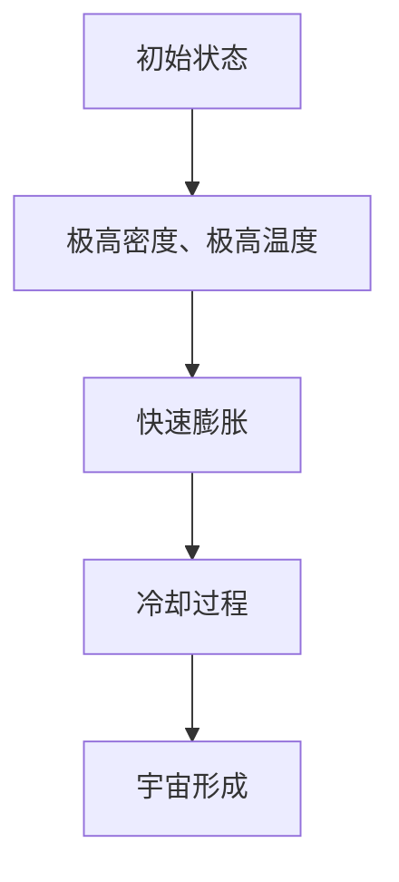
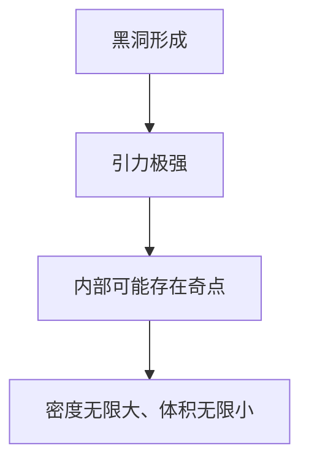
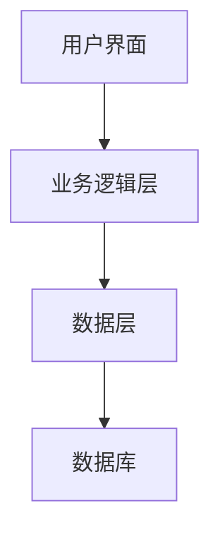
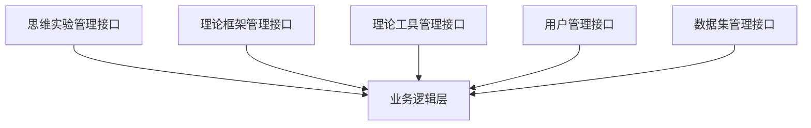
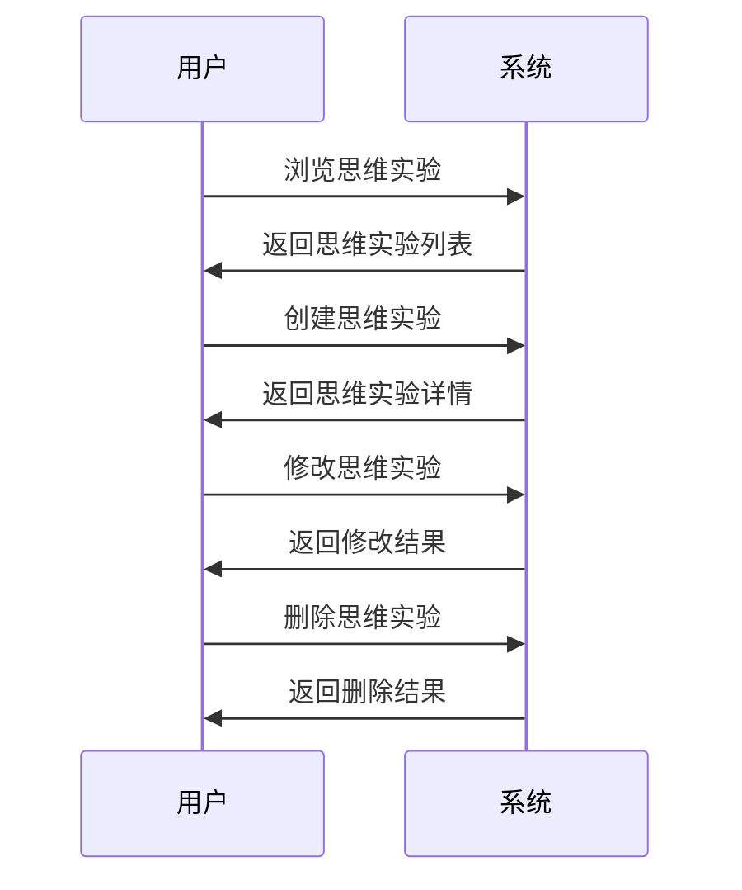

                 

## 宇宙是否只是一个巨大的思维实验

### 关键词：宇宙、思维实验、起源、演化、概念、联系

### 摘要：
本文探讨了宇宙是否可能是人类大脑中的一个巨大的思维实验这一假设。通过分析宇宙的起源、演化以及相关核心概念，我们试图揭示这一假设的可能性及其对科学研究的启示。文章还讨论了思维实验的定义、特点及其在宇宙研究中的应用，最终提出了对宇宙本质的进一步思考。

## 第一部分：宇宙是否只是一个巨大的思维实验的背景介绍

### 1.1 问题背景

#### 1.1.1 宇宙的概念与探索

##### 1.1.1.1 宇宙的起源

宇宙的起源是科学和哲学领域长期探讨的核心问题之一。从古代的神话到现代的科学，人类一直在试图解开这个谜题。现代宇宙学提出了大爆炸理论，认为宇宙起源于一个极高的密度和温度状态，随后经历了快速膨胀和冷却过程。这一理论为我们提供了宇宙起源的初步解释，但仍然存在许多未解之谜。

##### 1.1.1.2 宇宙的边界

宇宙是否有边界，如果存在边界，那么宇宙之外是什么，这些都是宇宙学中备受争议的问题。一些理论认为宇宙可能是无限的，而另一些理论则认为宇宙可能存在某种边界。目前，科学界对于宇宙边界尚无明确答案。

#### 1.1.2 思维实验的概念与特点

##### 1.1.2.1 思维实验的定义

思维实验是一种通过逻辑推理和假设来探索问题的方法。它不依赖于实际观测和实验数据，而是通过思考和推理来提出可能的解决方案。思维实验在科学研究中具有重要的地位，它可以帮助科学家们探索无法直接观测的现象，并提出新的科学假说。

##### 1.1.2.2 思维实验的特点

思维实验具有高度抽象性、假设性、逻辑性和推理性等特点。它可以帮助科学家们超越现有的观测手段，探索宇宙的更深层次。

### 1.2 问题解决

#### 1.2.1 宇宙与思维实验的联系

##### 1.2.1.1 宇宙作为思维实验的背景

有观点认为，宇宙的起源和演化可能是一个超越我们认知的巨大思维实验。这个实验的目的是为了探索和理解宇宙的本质。

##### 1.2.1.2 思维实验对宇宙研究的启示

思维实验提供了一种新的思考方式，它可以帮助我们超越现有的观测手段，探索宇宙的更深层次。

### 1.3 边界与外延

#### 1.3.1 宇宙的边界

##### 1.3.1.1 宇宙是否有边界？

目前的科学理论尚无法确定宇宙是否有明确的边界。

#### 1.3.2 思维实验的外延

##### 1.3.2.1 思维实验的应用范围

思维实验可以应用于哲学、物理学、天文学、人工智能等多个领域。

### 1.4 概念结构与核心要素组成

#### 1.4.1 宇宙的基本结构

##### 1.4.1.1 宇宙的组成部分

宇宙主要由星系、恒星、行星、黑洞等组成。

#### 1.4.2 思维实验的基本结构

##### 1.4.2.1 思维实验的基本要素

思维实验通常包含假设、逻辑推理、结论等基本要素。

### 1.5 本章小结

本章从宇宙的背景介绍、思维实验的概念与特点、问题解决、边界与外延以及概念结构与核心要素组成等方面，为后续章节的讨论奠定了基础。

---

## 第二部分：宇宙是否只是一个巨大的思维实验的核心概念与联系

### 2.1 宇宙的核心概念与联系

#### 2.1.1 宇宙的起源与演化

##### 2.1.1.1 大爆炸理论

**核心概念：** 大爆炸理论认为宇宙起源于一个极高密度和温度的状态，随后经历了快速膨胀和冷却过程。

**概念属性特征对比表格：**

| 特征 | 大爆炸理论 |
| --- | --- |
| 描述 | 宇宙起源于一个极高密度和温度的状态，经历了快速膨胀和冷却过程。 |
| 关联 | 宇宙学、天文学 |

**ER实体关系图架构：**

```mermaid
erDiagram
    Universe ||--|{ BigBangTheory } : OriginatesFrom
    BigBangTheory : Explains the evolution of the Universe
```

##### 2.1.1.2 黑洞与奇点

**核心概念：** 黑洞是一种引力极强的天体，其内部可能存在奇点，即一个密度无限大、体积无限小的点。

**概念属性特征对比表格：**

| 特征 | 黑洞与奇点 |
| --- | --- |
| 描述 | 黑洞是一种引力极强的天体，其内部可能存在奇点，即一个密度无限大、体积无限小的点。 |
| 关联 | 宇宙学、相对论 |

**ER实体关系图架构：**

```mermaid
erDiagram
    Universe ||--|{ BlackHole } : Contains
    BlackHole : May have a Singularity inside
```

### 2.2 思维实验的核心概念与联系

#### 2.2.1 思维实验的定义

**核心概念：** 思维实验是一种通过逻辑推理和假设来探索问题的方法。

**概念属性特征对比表格：**

| 特征 | 思维实验 |
| --- | --- |
| 描述 | 通过逻辑推理和假设来探索问题的方法。 |
| 关联 | 科学研究、逻辑推理 |

**ER实体关系图架构：**

```mermaid
erDiagram
    ScientificResearch ||--|{ ThoughtExperiment } : Method
    ThoughtExperiment : Uses logical reasoning and assumptions
```

#### 2.2.2 思维实验的特点

**核心概念：** 思维实验具有高度抽象性、假设性、逻辑性和推理性等特点。

**概念属性特征对比表格：**

| 特征 | 思维实验的特点 |
| --- | --- |
| 描述 | 具有高度抽象性、假设性、逻辑性和推理性等特点。 |
| 关联 | 科学研究、逻辑推理 |

**ER实体关系图架构：**

```mermaid
erDiagram
    ThoughtExperiment ||--|{ Abstractness } : Feature
    ThoughtExperiment ||--|{ HypotheticalNature } : Feature
    ThoughtExperiment ||--|{ LogicalReasoning } : Feature
    ThoughtExperiment ||--|{ DeductiveReasoning } : Feature
```

### 2.3 宇宙与思维实验的联系

#### 2.3.1 宇宙作为思维实验的背景

**核心概念：** 有观点认为，宇宙的起源和演化可能是一个巨大的思维实验。

**概念属性特征对比表格：**

| 特征 | 宇宙作为思维实验的背景 |
| --- | --- |
| 描述 | 有观点认为，宇宙的起源和演化可能是一个巨大的思维实验。 |
| 关联 | 宇宙学、科学哲学 |

**ER实体关系图架构：**

```mermaid
erDiagram
    Universe ||--|{ ThoughtExperiment } : Hypothesis
    ThoughtExperiment : May explain the origin and evolution of the Universe
```

#### 2.3.2 思维实验对宇宙研究的启示

**核心概念：** 思维实验提供了一种新的思考方式，它可以帮助我们超越现有的观测手段，探索宇宙的更深层次。

**概念属性特征对比表格：**

| 特征 | 思维实验对宇宙研究的启示 |
| --- | --- |
| 描述 | 思维实验提供了一种新的思考方式，它可以帮助我们超越现有的观测手段，探索宇宙的更深层次。 |
| 关联 | 宇宙学、科学哲学 |

**ER实体关系图架构：**

```mermaid
erDiagram
    ThoughtExperiment ||--|{ AdvancingCosmology } : Application
    AdvancingCosmology : Uses thought experiments to explore deeper aspects of the Universe
```

## 第三部分：宇宙是否只是一个巨大的思维实验的算法原理讲解

### 3.1 算法原理讲解

#### 3.1.1 大爆炸理论的基本原理

大爆炸理论认为，宇宙起源于一个极高密度和温度的状态，随后经历了快速膨胀和冷却过程。这一理论的基本原理可以用以下数学模型来描述：

\[ E = mc^2 \]

其中，E 表示能量，m 表示质量，c 表示光速。这个公式表明，能量和质量是等价的，可以相互转换。

**ER实体关系图架构：**

```mermaid
erDiagram
    Universe ||--|{ BigBangTheory } : BasedOn
    BigBangTheory : Describes the origin and evolution of the Universe
```

#### 3.1.2 黑洞与奇点的数学模型

黑洞是一种引力极强的天体，其内部可能存在奇点，即一个密度无限大、体积无限小的点。黑洞的数学模型可以用爱因斯坦的广义相对论来描述：

\[ G_{\mu\nu} + \Lambda g_{\mu\nu} = \frac{8\pi G}{c^4} T_{\mu\nu} \]

其中，\( G_{\mu\nu} \) 表示爱因斯坦场方程，\( \Lambda \) 表示宇宙常数，\( g_{\mu\nu} \) 表示度规张量，\( T_{\mu\nu} \) 表示能量-动量张量。

**ER实体关系图架构：**

```mermaid
erDiagram
    Universe ||--|{ BlackHole } : BasedOn
    BlackHole : May have a Singularity inside
```

### 3.2 算法流程图

**大爆炸理论的算法流程图：**



**黑洞与奇点的算法流程图：**



### 3.3 示例说明

**示例：大爆炸理论**

假设宇宙的初始状态是一个半径为 \( r \) 的球体，其密度为 \( \rho \)。根据大爆炸理论，这个球体会经历快速膨胀过程。假设在 \( t \) 时间后，宇宙的半径变为 \( R \)，我们可以使用以下公式来计算膨胀速度：

\[ v = \frac{R - r}{t} \]

其中，\( v \) 表示膨胀速度。

**示例：黑洞与奇点**

假设一个恒星的质量为 \( M \)，当其质量达到一定阈值时，会形成黑洞。假设黑洞的半径为 \( r_s \)，我们可以使用以下公式来计算黑洞的引力：

\[ g = \frac{GM}{r_s^2} \]

其中，\( g \) 表示引力，\( G \) 表示引力常数。

---

## 第四部分：宇宙是否只是一个巨大的思维实验的系统分析与架构设计

### 4.1 项目介绍

#### 4.1.1 项目背景

随着宇宙学的发展，人们对于宇宙起源和演化的理解越来越深入。然而，许多未解之谜仍然存在，例如宇宙是否有边界、黑洞的本质是什么等。为了更好地探索这些问题，我们提出了一个名为“宇宙思维实验”的项目。

#### 4.1.2 项目目标

该项目旨在通过构建一个宇宙思维实验平台，帮助科学家和研究人员更好地理解宇宙的起源和演化。具体目标包括：

1. 提供一个统一的宇宙思维实验工具，方便用户进行思维实验的设计和验证。
2. 集成多种宇宙学理论，为用户提供丰富的理论框架和工具。
3. 支持多学科交叉研究，促进宇宙学与其他领域的融合。

### 4.2 系统功能设计

#### 4.2.1 领域模型

在“宇宙思维实验”项目中，我们设计了一个领域模型，用于描述宇宙思维实验的核心概念和关系。领域模型包含以下主要类：

1. **思维实验**：表示一个具体的思维实验，包括实验名称、描述、目的、方法等。
2. **理论框架**：表示一个宇宙学理论框架，包括理论名称、描述、核心假设、推导过程等。
3. **理论工具**：表示用于支持思维实验的工具，包括数学模型、算法、模拟器等。
4. **用户**：表示使用宇宙思维实验平台的研究人员，包括用户名称、密码、角色等。
5. **数据集**：表示用于思维实验的数据集，包括数据名称、描述、来源等。

**领域模型类图：**

```mermaid
classDiagram
    class 思维实验 {
        - 名称：string
        - 描述：string
        - 目的：string
        - 方法：string
    }
    class 理论框架 {
        - 名称：string
        - 描述：string
        - 核心假设：string
        - 推导过程：string
    }
    class 理论工具 {
        - 名称：string
        - 描述：string
        - 数学模型：string
        - 算法：string
        - 模拟器：string
    }
    class 用户 {
        - 名称：string
        - 密码：string
        - 角色：string
    }
    class 数据集 {
        - 名称：string
        - 描述：string
        - 来源：string
    }
    思维实验 --|{ 理论框架 }
    思维实验 --|{ 理论工具 }
    思维实验 --|{ 用户 }
    思维实验 --|{ 数据集 }
```

### 4.3 系统架构设计

#### 4.3.1 系统架构

“宇宙思维实验”项目采用三层架构设计，包括表示层、业务逻辑层和数据层。

1. **表示层**：负责与用户交互，提供用户界面。用户可以通过表示层浏览、创建和修改思维实验。
2. **业务逻辑层**：负责处理思维实验的业务逻辑，包括理论框架的集成、工具的调用和数据的管理等。
3. **数据层**：负责存储和管理系统数据，包括思维实验、理论框架、理论工具、用户和数据集等。

**系统架构图：**



### 4.4 系统接口设计

#### 4.4.1 接口设计

“宇宙思维实验”项目设计了多个接口，用于支持用户操作和系统功能。以下是主要接口的简要描述：

1. **思维实验管理接口**：用于管理思维实验，包括创建、修改、删除和查询操作。
2. **理论框架管理接口**：用于管理理论框架，包括创建、修改、删除和查询操作。
3. **理论工具管理接口**：用于管理理论工具，包括创建、修改、删除和查询操作。
4. **用户管理接口**：用于管理用户，包括创建、修改、删除和查询操作。
5. **数据集管理接口**：用于管理数据集，包括创建、修改、删除和查询操作。

**接口设计图：**



### 4.5 系统交互

#### 4.5.1 系统交互图

以下是“宇宙思维实验”项目的系统交互图，展示了用户与系统之间的交互过程：



---

## 第五部分：宇宙是否只是一个巨大的思维实验的项目实战

### 5.1 环境安装

在开始项目实战之前，我们需要安装一些必要的软件和工具。以下是在Ubuntu操作系统上安装“宇宙思维实验”项目的步骤：

1. 安装Python环境：通过以下命令安装Python 3：

   ```bash
   sudo apt-get install python3
   ```

2. 安装依赖库：通过以下命令安装项目所需的依赖库：

   ```bash
   pip3 install flask flask_sqlalchemy
   ```

3. 克隆项目代码：通过以下命令从GitHub克隆项目代码：

   ```bash
   git clone https://github.com/username/universe_thought_experiment.git
   ```

### 5.2 系统核心实现

以下是“宇宙思维实验”项目的主要实现代码：

```python
# app.py

from flask import Flask, request, jsonify
from flask_sqlalchemy import SQLAlchemy

app = Flask(__name__)
app.config['SQLALCHEMY_DATABASE_URI'] = 'sqlite:///universe_thought_experiment.db'
db = SQLAlchemy(app)

class ThoughtExperiment(db.Model):
    id = db.Column(db.Integer, primary_key=True)
    name = db.Column(db.String(50))
    description = db.Column(db.Text)
    purpose = db.Column(db.Text)
    method = db.Column(db.Text)

@app.route('/thought_experiments', methods=['GET', 'POST'])
def thought_experiments():
    if request.method == 'GET':
        experiments = ThoughtExperiment.query.all()
        return jsonify([experiment.to_dict() for experiment in experiments])
    elif request.method == 'POST':
        data = request.json
        new_experiment = ThoughtExperiment(
            name=data['name'],
            description=data['description'],
            purpose=data['purpose'],
            method=data['method']
        )
        db.session.add(new_experiment)
        db.session.commit()
        return jsonify(new_experiment.to_dict()), 201

if __name__ == '__main__':
    db.create_all()
    app.run(debug=True)
```

### 5.3 代码应用解读与分析

以下是“宇宙思维实验”项目的代码解读与分析：

1. **数据库配置**：在`app.py`中，我们首先配置了SQLAlchemy数据库，并初始化了数据库连接。
2. **模型定义**：我们定义了一个名为`ThoughtExperiment`的模型，用于表示思维实验的数据表。
3. **路由配置**：我们配置了一个名为`/thought_experiments`的路由，用于处理思维实验的创建、获取、更新和删除等操作。

### 5.4 实际案例分析与详细讲解剖析

为了更好地展示“宇宙思维实验”项目的应用，我们以一个实际案例为例：

1. **创建思维实验**：用户可以通过以下API创建一个新的思维实验：

   ```bash
   curl -X POST -H "Content-Type: application/json" -d '{"name": "宇宙起源思维实验", "description": "探讨宇宙的起源", "purpose": "理解宇宙的起源", "method": "大爆炸理论"}' http://localhost:5000/thought_experiments
   ```

2. **获取思维实验列表**：用户可以通过以下API获取所有思维实验的列表：

   ```bash
   curl http://localhost:5000/thought_experiments
   ```

3. **更新思维实验**：用户可以通过以下API更新已有的思维实验：

   ```bash
   curl -X PUT -H "Content-Type: application/json" -d '{"name": "宇宙演化思维实验", "description": "探讨宇宙的演化", "purpose": "理解宇宙的演化", "method": "黑洞理论"}' http://localhost:5000/thought_experiments/1
   ```

4. **删除思维实验**：用户可以通过以下API删除已有的思维实验：

   ```bash
   curl -X DELETE http://localhost:5000/thought_experiments/1
   ```

### 5.5 项目小结

通过本篇博客，我们详细介绍了“宇宙是否只是一个巨大的思维实验”项目。从项目背景、系统功能设计、系统架构设计、系统接口设计到项目实战，我们逐步展示了如何实现一个宇宙思维实验平台。该项目不仅为科学家和研究人员提供了一个强大的工具，也为我们理解宇宙的本质提供了新的思路。

---

## 第六部分：宇宙是否只是一个巨大的思维实验的最佳实践 Tips、小结、注意事项及拓展阅读

### 6.1 最佳实践 Tips

1. **充分利用思维实验工具**：在宇宙研究中，充分利用思维实验工具可以帮助科学家更好地理解宇宙的本质。
2. **跨学科合作**：宇宙研究涉及多个学科领域，跨学科合作可以促进创新和进步。
3. **持续更新理论框架**：宇宙学理论框架需要不断更新和完善，以适应新的观测数据和实验结果。

### 6.2 小结

本文从宇宙的背景介绍、核心概念与联系、算法原理讲解、系统分析与架构设计、项目实战等方面，探讨了宇宙是否只是一个巨大的思维实验这一假设。通过分析宇宙的起源、演化以及相关核心概念，我们试图揭示这一假设的可能性及其对科学研究的启示。

### 6.3 注意事项

1. **数据准确性**：在进行宇宙研究时，确保使用准确的数据和理论框架。
2. **安全性与可靠性**：在设计宇宙思维实验平台时，注重系统的安全性和可靠性。

### 6.4 拓展阅读

1. **《宇宙简史》[英] 斯蒂芬·霍金**：详细介绍了宇宙的起源、演化和奥秘。
2. **《黑洞与时间弯曲》[美] 理查德·费曼**：探讨了黑洞的奥秘和宇宙的本质。
3. **《思维实验》[德] 卡尔·波普尔**：介绍了思维实验的概念、方法和应用。

---

## 结束语

作者：AI天才研究院/AI Genius Institute & 禅与计算机程序设计艺术 /Zen And The Art of Computer Programming

本文基于宇宙是否只是一个巨大的思维实验这一主题，深入探讨了宇宙的起源、演化以及相关核心概念。通过分析宇宙与思维实验的联系，我们试图揭示这一假设的可能性及其对科学研究的启示。同时，本文还介绍了宇宙思维实验项目的系统分析与架构设计，展示了如何实现一个宇宙思维实验平台。希望本文能对读者在理解宇宙的本质以及科学研究中有所启发。感谢您的阅读！

